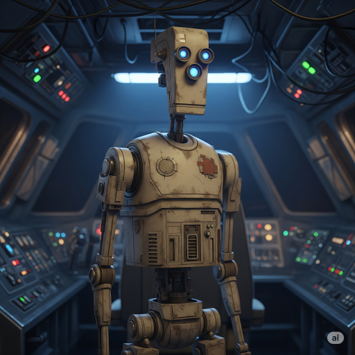
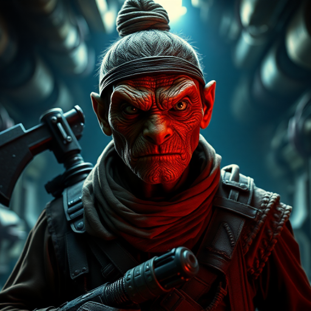

# Prelude: The Static on the Line (Dryzan)

### **Storyteller** (06/11/2025 23:28:39)  

*1382501819497971736*

***A long time ago in a galaxy far, far away....***
#### **STAR WARS**
##### **THE STATIC ON THE LINE**

*The **HIGH REPUBLIC** era is a time of prosperity, but shadows lengthen in the Outer Rim. For the desperate and the daring, forgotten legends and whispered rumors are often the only currency that matters.*

*Down on his luck and haunted by past failures, Balosar smuggler **DRYZAN KAR'DOLA** has staked his last credits on such a tale—a family story of the **STARDUST DRIFTER**, a heavily armed transport that served as a mobile treasury for a smugglers' coalition, lost to the cosmic tides centuries ago.*

*Acting on a cryptic clue from his father's audio logs, Dryzan has traced the ghost ship's final resting place to the treacherous **ASH-VEIL** nebula. Now, with the help of his slicer contact on Nar Shaddaa, **VIANNA NORSTRAG**, a faint, ancient signal has been confirmed, breathing life into the myth. Plotting a course into the ship-shredding nebula, Dryzan prepares to risk everything on one last, desperate gamble....*

---

### **Storyteller** (06/13/2025 13:26:13)  

*1383074987593961556*

The darkness of the cockpit is a familiar comfort, a stark contrast to the grimy, neon-lit docking bay of the orbital station visible through the transparisteel viewport. Outside, droids and dockworkers move in a silent, distant ballet under the station's harsh floodlights. The air inside is stale, thick with the lingering scent of yesterday's caf and the faint, metallic tang of ozone from a panel that sparks intermittently near the floor.

Standing silently beside the pilot's chair is a droid, a model Dryzan has never seen anywhere else. It is bipedal, with a practical, slim-bodied build that suggests function over form. Its original off-white plating is a sad history of a hard life—a patchwork of deep scuffs, welded dents, and mismatched, unpainted plates of raw durasteel. Its head is a simple, functional block with three round, glowing blue optical sensors. One of them flickers intermittently, casting a syncopated rhythm of light on the worn deck plating. The droid, designation GE-3, emits a low, steady processing whir, a sound Dryzan has become accustomed to over the past few weeks.
The ship is cold, running on bare minimum power to save credits, and the only other sound is the crackling voice of a man long dead, spilling from the ship's comm system speakers. It's one of his father's old audio logs, a recording Dryzan has listened to a hundred times while GE-3 cross-referenced the ship's ancient nav-computer with the fragmented story.

---

### **Kar’dola Recording** (06/13/2025 13:26:32)  

*1383075066321047562*

"***...not just a ship, you see,***" the warm, weary voice says, layered with static like a ghost from another era. "***She was a fortress. The Stardust Drifter. A mobile bank, a myth. The Coalition stored everything in her belly. She was meant to be their future, before she vanished into the Veil... the Ash-Veil. A ship-shredder, they called it. But for a prize like that... what's one more ghost in a graveyard?***"

---

### **Storyteller** (06/13/2025 13:26:32)  

*1383075068439036028*

On the datapad resting on his lap, Dryzan has been tracing and retracing the modern star charts of that very nebula against a hand-drawn map from his father's notes. His dark hair is a tangled mess, and the stubble on his cheeks is more than a day old. He lets out a low, rattling cough that seems to echo in the cramped space. The story is a fairy tale, a smuggler's dying dream, but it's the only one he has left.
The audio log clicks off, the last word swallowed by an abrupt silence that feels heavier than the noise it replaced. The nav-chart on his lap continues to blink, a single, unverified coordinate deep within the swirling red icon of the Ash-Veil. The legend hangs in the air, waiting.

---

### **Dryzan Kar'dola** (06/13/2025 21:32:16)  

*1383197307587137536*

Heaving a weary sigh, Dryzan lifts the glasses off his face with one hand while the other pinches and rubs at the bridge of his nose. His breath catches again on the inhale, another nasty cough erupting before he finally finishes the breath.

**"This kriffing cold air. I'll be glad when this is done, GE-3. No more struggles, no more scraping for credits for fuel, no more.. no more debts. Just freedom, from it all."**

He puts his glasses back on and gazes at the droid, the round red frames masking his eyes the way the *Ash-Veil* masks the coordinate blipping on the nav-chart.

**"Ready for one last roll of the die?"**

---

### **GE-3** (06/13/2025 22:04:07)  

*1383205321669083136*

The blue optical sensors on GE-3's head swivel to focus on Dryzan, the intermittent flicker of the third lens casting an unsteady light on the bulkhead. A series of soft clicks emits from the droid's chassis as it processes the query.

**"Diagnostic Observation: Your respiratory symptoms persist, Master Dryzan. The recycled air of this station has a particulate count seventeen percent above acceptable health standards. Informative Statement: The term 'freedom' is a complex philosophical concept, but I have cross-referenced it with your financial status. A significant increase in liquid assets would indeed alleviate many of the stressors currently affecting your operational efficiency."**

The droid pauses for a fraction of a second, its head tilting almost imperceptibly.

**"Clarification Query: By 'one last roll of the die,' are you metaphorically referring to the upcoming mission to investigate the anomalous energy signature within the Ash-Veil? Analytical Statement: While my programming does not include modules for games of chance, all my systems are functioning at ninety-eight point six percent efficiency. I am prepared to assist."**

---

### **Dryzan Kar'dola** (06/13/2025 23:17:05)  

*1383223682905800764*

Dryzan smiles wearily, amused despite himself by the conversation he has found himself repeating with the droid over the last few weeks.

**"Of course the symptoms persist, that's what a childhood spent breathing in the toxic crud of heavy industry does for you. Well, not for** *you* **obviously, but you know what I mean."**
He gestures with his hands while talking, long fingers swooping through the air like the speeders and lifters that fill the air on Balosar.

**"And yes, I meant our attempt to track down this treasure ship. The** *Stardust Drifter*.**"**
He pauses, fingers running over the star charts one last time.
**"I remember him going on about it, but I never thought I'd be chasing that same crazy dream one day..."** he mutters quietly.

Refocusing on the present he gazes back at the droid's blue optics.

**"Glad that one of us is running efficiently. Me, I'm just running.

Now let's try and find this thing before I have to try and scrape enough credits together to refuel again. I don't think I'll get much by asking for a tab."**

Turning to the controls Dryzan starts prepping the ship to begin their hunt.

**"You got that course ready?"**

---

### **GE-3** (06/14/2025 00:05:24)  

*1383235844273475648*

The droid's head swivels back to the main console. A low-resolution star chart flickers to life, displaying a direct, calculated route from their current position to the edge of the swirling nebula. **"Affirmative Statement: The course has been plotted and loaded into the nav-computer. I have accounted for standard gravimetric shear and projected debris fields based on archival data. However, the Ash-Veil is known for unpredictable spatial anomalies. I calculate a thirty-four point seven percent chance of encountering unforeseen navigational hazards."**

---

### **Storyteller** (06/14/2025 00:05:25)  

*1383235847041585182*

The cockpit of the freighter shudders as Dryzan's hands move across the control console. Switches click into place with unsatisfying softness, their contacts worn from decades of use. The low hum of dormant systems pitches upward into a strained whine as power converters labor to draw energy. Dust, previously settled in the quiet dark, dances in the sudden glow of status lights changing from a sleepy amber to a hopeful, if flickering, green. Through the viewport, the rust-streaked, utilitarian structure of Gantry 94, a minor orbital platform clinging to the edge of civilized space, begins to slide away as the magnetic docking clamps release with a percussive thud that vibrates through the deck.

---

### **GE-3** (06/14/2025 00:05:28)  

*1383235861055012995*

The droid remains perfectly still, its photoreceptors tracking the readouts on a secondary screen. **"Informative Statement: All pre-flight checks are complete. All systems report nominal functionality within expected parameters for a vessel of this age and maintenance history. The docking fees have been automatically transferred. Our available credit balance is now seventeen."** The droid pauses, its head tilting a single degree. **"Advisory Statement: This credit balance is insufficient for standard refueling operations."**

---

### **Dryzan Kar'dola** (06/14/2025 08:41:24)  

*1383365697660260403*

*Seventeen credits.* Dryzan sighs heavily, the weight of the galaxy feeling like it is pressing down on him for a moment.
*Fuel, food, replacement parts to keep this junker going. Let alone any spare for...*

He refuses to let himself finish that thought. *I'll find a way. Always do.*

**"Well, we'd better find the** *Drifter* **quickly then. No time to lose."**
One hand lifts off the console for a second, automatically reaching towards a pocket for a death stick, before it stops and falls back towards the controls. *Shame that last shipment is all gone. Always helps me steady my nerves.*

He quickly punches the console buttons, getting the aging vehicle ready for the first jump. The bulkheads creak and judder faintly, a small trickle of dust falling from one of the atmospheric vents as the ship shakes under the stresses of the maneuvers.
*Come on old girl, hold together. Just a few jumps more...*

---

### **Storyteller** (06/14/2025 11:00:12)  

*1383400630990802945*

The ship groans in protest as Dryzan guides it away from the relative safety of Gantry 94. The navigation computer, an archaic model GE-3 has had to coax into cooperation, flickers as the coordinates for the first leg of the journey are locked in. With a final, decisive movement, Dryzan engages the hyperdrive.

For a heart-stopping moment, the only response is a deep, resonant shudder that runs the length of the hull, a sound like a leviathan taking a painful breath. Then, the view outside the cockpit distorts violently. The distant stars streak, elongate, and finally collapse into a swirling, incandescent tunnel of blue-white light. The familiar, unsettling non-sound of hyperspace travel fills the cockpit, a low thrum that is felt more in the bones than heard with the ears.

---

### **GE-3** (06/14/2025 11:02:26)  

*1383401190582259734*

The droid’s photoreceptors dim slightly to compensate for the sudden brilliance of the hyperspace vortex. It makes a series of soft, analytical clicks. **"Informative Statement: Hyperdrive activation was successful, though the primary energy conduit experienced a power fluctuation seven point two percent outside of optimal parameters. I have logged the event for future maintenance. Projecting arrival at the Ash-Veil nebula in three standard hours."**

---

### **Dryzan Kar'dola** (06/14/2025 19:49:03)  

*1383533720467935313*

The relief is clear on Dryzan's face when the failing ship finally makes the jump to lightspeed, a plethora of warning indicators lighting up on some of the control banks.
**"Mmm, she's struggling all right. I haven't had the time to get her properly serviced and tuned by Tallen in a long while."** *Or the credits...* he thinks to himself.

**"Hopefully she can hold together long enough to get us there."** *Last thing we want is to cause another hyperspace disaster by flaming out...*

---

### **Storyteller** (06/14/2025 20:15:12)  

*1383540301590958161*

The ship settles into the steady, hypnotic rhythm of hyperspace travel. The chaotic star-streaks outside the viewport become a constant, flowing river of light, offering no sense of speed or distance, only endless transit. The cockpit is an island of artificial calm in the storm, the air growing warmer as the overworked systems begin to heat the small space. The only sounds are the deep thrum of the hyperdrive and the occasional, anxious creak of stressed metal.

---

### **GE-3** (06/14/2025 20:15:13)  

*1383540304002547822*

The droid’s head swivels away from the main console and tilts down toward a low access panel near Dryzan’s feet, the one that had been sparking intermittently back at the station. Its flickering blue photoreceptor seems to stare intently at the plate. **"Analysis: The previously noted power fluctuation from the primary energy conduit is consistent with a failing insulation seal on the auxiliary power converter, module 7-B, located behind that panel. Reference: My databanks contain a schematic for this module, along with an audio log from your progenitor detailing a similar repair he performed. Informative Statement: While the current risk of catastrophic failure is low, a destabilized power feed upon reversion to realspace could temporarily disable shields or weapon systems. I calculate a sixty-two percent probability of such an event if the issue is not addressed."**

---

### **Storyteller** (06/14/2025 20:15:13)  

*1383540305101324368*

The panel in question emits a low, oscillating hum, and a faint smell of burnt ozone periodically wafts from its seams. The tools for such a minor repair are stowed in a locker just behind the co-pilot's chair. The three-hour journey stretches ahead, a pocket of quiet time filled only with the ghost of his father's warning and the low hum of a problem waiting to happen.

---

### **Dryzan Kar'dola** (06/15/2025 06:31:19)  

*1383695349880717423*

As the acrid tang of burnt wiring wafts through the air Dryzan groans gently, frustration surging through him. *What now?!*
As the droid diagnoses the issue he nods slowly.
**"Well, at least it'll pass the time. Play back the log GE-3, just in case dear old dad has done one of his 'special' repair jobs on this one. Last thing we need is to burn out another system because he used a custom wiring scheme again."**

Standing and stretching, Dryzan removes the long trench coat and dumps it over the back of the copilot's chair. He grabs the handle of the tool locker and pulls it open, the door of the compartment creaking loudly as the aged hinges protest at having to move.
*Let's see if I can manage this one without zapping myself again...*

---

### **Storyteller** (06/15/2025 10:50:39)  

*1383760612584325235*

GE-3's head tilts in acknowledgment. A soft whirring sound is followed by the familiar crackle of an old recording. The voice that fills the cockpit is the same warm, weary tone from before, but this time it's less storytelling and more practical, layered with the faint sounds of clanking tools in the background.

---

### **Kar’dola Recording** (06/15/2025 10:50:39)  

*1383760615176146984*

***"Right, the 7-B module is acting up again. Standard procedure is useless; the stock insulation just can't handle the load this old girl pulls when she's stressed. The trick is to bypass the secondary flow regulator entirely. See that green-striped wire? Ignore it. It's a trap. You need to splice directly into the primary feed. It'll look wrong to anyone who's ever read a standard schematic, but trust me, it's the only way she'll hold a steady charge through a jump. Just be careful not to ground it on the casing..."***

---

### **Storyteller** (06/15/2025 10:50:40)  

*1383760618217148426*

The recording clicks off. As Dryzan pries open the access panel with a groan of protesting metal, he's greeted by a sight that confirms his father's words. It’s a chaotic nest of wires, a mix of standard-issue cabling and several thick, off-color conduits jury-rigged with what looks suspiciously like hardened sealant tape. Just as the recording mentioned, a green-striped wire is neatly tucked away, while another, thicker wire is crudely spliced into a major power junction. It's near this very splice that the insulation has frayed, exposing a flickering, faintly glowing filament within. The source of the hum and the smell of ozone is obvious, and dangerously close to the metal casing of the module.

---

### **Dryzan Kar'dola** (06/15/2025 23:33:41)  

*1383952640097914892*

*Ugh, this is going to be a messy one.*
Exhaling a long breath, Dryzan grabs a long manipulator from the toolkit and a roll of sealant tape - *Well, there must be a reason he kept using it. Wonder if it can still be called a ship when 50% plus of the components are replaced by sealant...*. Gingerly reaching in, he focuses all of his will and intent on the careful motions of his hands.

With carefully controlled, almost glacial movements, Dryzan slowly places a temporary grounding pad between the exposed wire and the casing. Meticulously moving aside the other wires he gradually exposes the damaged one, unearthing the dangerous element from within the bundle of essential components.

**"Ok, here goes nothing."** he mutters to himself, expecting a shock to his fingers any moment. That or the deafening blast of alarms as the ship crashes out of hyperspace, or a moment of terror as the hull ruptures outwards from the engine room, or...
A bead of sweat rolls down his forehead, irritating as it slips into the well where the skin-flap hiding one of his antennapalps is.

The sealant tape carefully and precisely snugs around the damaged cable, sheathing the lurking spectre of trouble that the frayed cable represented within a thin layer of safety.

**"... And done."** Dryzan says, a slight questioning tone in his voice, almost unbelieving at how smoothly that went off.
**"Uh, can you run a diagnostic on that, GE-3? Not that I don't trust my work of course, but always good to verify, right?"**

---

### **Storyteller** (06/15/2025 23:52:26)  

*1383957354529292319*

The moment the sealant tape makes its final wrap around the frayed wire, the low, anxious hum from the module ceases. The acrid smell of ozone is no longer being produced, slowly starting to dissipate into the recycled air of the cockpit. The ship's ambient thrum seems to even out, losing a subtle, almost subliminal quaver that Dryzan hadn't even consciously noticed until it was gone. The filament behind the exposed splice dims, its dangerous glow extinguished. For the first time since leaving Gantry 94, the ship feels stable, almost content.

---

### **GE-3** (06/15/2025 23:52:26)  

*1383957356576112660*

The droid’s photoreceptors brighten, scanning the internal diagnostic readouts that flicker across its own vision. **"Processing... Affirmative Statement: The repair is successful. The primary energy conduit is now stable. Power fluctuations have been reduced to zero point zero one percent, which is well within optimal performance parameters. The probability of system failure upon reversion to realspace has been recalculated to less than one percent. A highly efficient repair, Master Dryzan."**

---

### **Dryzan Kar'dola** (06/16/2025 13:50:03)  

*1384168148156154089*

As the ship settles around him a small amount of the nervous tension bleeds out of Dryzan, as if some subconscious unease at the failing systems has been quieted by his actions.

He nods as GE-3 delivers its report. It hasn't been long since he first started travelling with the droid, but he is already becoming accustomed to its presence; the familiar droning whir as it processes is an almost comforting background noise now, like the hum of the ship's engines as it thrusts them onwards through hyperspace.

**"Well I definitely prefer those odds.**
**Anything else you've spotted that we may need to do something about? Or that we can plan for when we arrive?"**
*Otherwise I might just go take a nap. Or root around in the compartments one more time - there must be another death stick here somewhere...*
His hands pat his pockets unconsciously, the reaction as autonomous as the thin tongue that licks his lips slightly as soon as the thought of the drug pops up.

---

### **GE-3** (06/16/2025 14:22:07)  

*1384176221264285730*

The droid’s head swivels to face Dryzan, its three blue eyes fixed on him. **"Analysis: A full-system diagnostic reveals no other imminent critical failures. The port-side atmospheric regulator is functioning at eighty-seven percent efficiency, and the nav-computer's memory buffer shows a zero point zero three percent degradation rate, but neither pose an immediate risk to the mission."**

The droid pauses, processing the second part of the query.

**"Tactical Projection: Regarding our arrival, we must plan for several contingencies. The *Stardust Drifter*, having been dormant for centuries within a high-radiation nebula, will almost certainly lack a breathable atmosphere. Its internal temperature will have equalized with the surrounding void, approximating near-absolute zero. Standard environmental suits will be a necessity for all extra-vehicular and internal exploration."**

A new data schematic flashes onto GE-3's chest-mounted display screen, showing the ghostly outline of a large, pre-Republic capital ship.

**"Additional Threat Assessment: High Republic-era Coalition treasury vessels of that class were frequently outfitted with automated security systems. There is a forty-one percent probability of encountering dormant security droids. Based on standard schematics of the era, these units are often sound-activated. I recommend maintaining absolute silence upon boarding to avoid unnecessary complications."**

---

### **Dryzan Kar'dola** (06/16/2025 14:45:52)  

*1384182196084019404*

*Great, no atmosphere and no heat. Not to mention droid defenses that could rip me apart.*
*If I didn't need the kriffing credits so badly...*

**"Ok, well, is there a way that we can deactivate or reprogram any defensive droids? I'd prefer not to have to creep around this huge thing trying not to breathe too hard or stub my toe on anything."**
The idea of creeping around the wreck in a suit, barely able to see or breathe, and all the while dreading hearing the CLOMP CLOMP of the droids approaching... He shudders. Just the thought is terrifying.

---

### **GE-3** (06/16/2025 15:50:23)  

*1384198432885051445*

The droid processes the question for a moment, its internal whirring rising in pitch slightly.

**"Analysis: Remote deactivation of the ship's internal security grid is improbable. The vessel's central security mainframe would require primary power, which has likely been offline for centuries. Furthermore, any surviving emergency power would prioritize critical systems, not a networked security interface accessible from the exterior."**

The schematic on its chest display shifts, highlighting several small nodes scattered throughout the ship's interior map.

**"Alternative Strategy: Direct interface presents a viable, though high-risk, solution. If an auxiliary security terminal with residual or reroutable power can be located, I can attempt to access the local network. My analysis indicates I could reprogram their patrol patterns or place them into a diagnostic standby mode. However, I would need to bypass multiple layers of archaic, but formidable, security protocols to do so."**

The droid's head tilts, its photoreceptors focusing on Dryzan.

**"Caveat: This action would require physical proximity to a terminal. Locating and accessing such a terminal without first alerting the sound-activated droids remains the primary tactical obstacle. Stealth will be the initial, unavoidable requirement."**

---

### **Dryzan Kar'dola** (06/16/2025 18:56:10)  

*1384245187194257489*

Dryzan studies the schematic futilely, the floorplan more complex than he could ever hope to memorise. He studies it anyway, searching for some kind of pattern or general understanding of the layout.

**"Ok, understood, so we'd need to get to a terminal before we could fix the droids."**

He scratches his chin thoughtfully, his mind beginning to flip through options and possibilities.

**"Can you highlight any possible landing bays? And airlocks too, just in case we have to dock externally. Then show me what the route would be from those respective entry points to the nearest terminal. Limit it to just the two options with the highest calculated probability of success - yes, I know you don't have much data to base it on, but we have to work with what we've got."**
As he focuses on the problem his hands and mind still, the nerves (and longing for another death stick) subsiding beneath the current goal.

---

### **GE-3** (06/16/2025 19:09:45)  

*1384248603362721944*

**"Processing request."** The droid’s optical sensors dim for a moment as it dedicates its full processing power to analyzing the schematics. After a few seconds, the image on its chest display zooms in, filtering out irrelevant sections of the ghost ship.

**"Analysis: The main dorsal hangar bay shows signs of catastrophic structural failure and is unsuitable for docking. However, two viable entry points present themselves with the highest calculated probability of success based on structural integrity scans and proximity to potential auxiliary power conduits."**

---

### **Storyteller** (06/16/2025 19:09:45)  

*1384248605648355500*

The schematic updates in real-time. A smaller, secondary cargo bay on the ventral side of the ship begins to glow, marked as **[OPTION ALPHA]**. A thin, yellow line traces a relatively direct path from this bay through a series of cargo holds and maintenance corridors to a small icon labeled `SEC-TERMINAL-ENG`.

Simultaneously, a small, unassuming maintenance airlock near the aft engineering section is highlighted as **[OPTION BETA]**. A second, blue line snakes out from it, taking a more complex, winding route through what appear to be crew decks before arriving at a different icon marked `SEC-TERMINAL-CREW`.

---

### **GE-3** (06/16/2025 19:09:49)  

*1384248621968654376*

**"Visual Aid: Option Alpha, the secondary cargo bay. This route is shorter. Proximity to the main engineering section suggests a higher probability that its associated security terminal will have residual power. However, as a primary access point, it also carries a higher probability of being a designated patrol route for automated security."**

The droid’s head swivels slightly, indicating the second path.

**"Visual Aid: Option Beta, the maintenance airlock. This route is less direct and likely unmonitored. It offers a stealthier approach. However, terminals in crew sectors are often lower priority and may be unpowered, requiring us to traverse farther into the vessel to locate a functional node."**

The display holds steady, presenting the two glowing paths into the heart of the silent ship.

**"Awaiting your selection, Master Dryzan. Each route presents a distinct set of risk parameters."**

---

### **Dryzan Kar'dola** (06/16/2025 23:39:37)  

*1384316517268852807*

He cocks his head, hanging upon the droid's words as he studies the two routes. *Two roads to travel, neither one a certain thing...* he  whistles a fragment of a popular jizz song while he thinks.
*Nothing to it, just gotta choose it, grab that horn and make it swing.*

He snaps his fingers.
**"Ok, let's do it. Beta, maintenance airlock. Let's just hope that we're in luck and the first terminal is functioning."**

He quickly moves to begin pacing the room, brandishing his hands in front of him.
**"Ok so let's plan out our little walk in the woods. We have some time before we get there, and I wanna make sure that this goes slick as drool off a Hutt's mouth."**
The prospect of action puts a spring into his step despite himself, his locks of dark hair swaying as he spins at the end of each journey.

The unusual pair discuss the details of the plan in depth, using what time they have to be as thorough as possible given what they know.
All the while the ship hurtles closer to the destination, and the date with what is hopefully enough treasure to change his life.

---

### **Storyteller** (06/16/2025 23:53:27)  

*1384320001380712503*

The remaining hours in hyperspace pass in a blur of intense, whispered strategizing. Dryzan paces the confines of the cockpit, gesturing wildly as he outlines scenarios, while GE-3 stands stoically, its chest display shifting through thermal schematics, structural weak points, and simulated patrol routes for the silent security droids. The air grows thick with plans, counter-plans, and the low, persistent hum of the ship's engines.

Finally, with a gut-wrenching lurch and a cacophony of groaning metal, the freighter drops back into realspace. The brilliant blue-white tunnel collapses into an infinite, silent blackness dotted with distant stars. And before them, dominating the viewport, hangs the Ash-Veil.

It is a terrifyingly beautiful sight. Vast, churning clouds of crimson and deep purple gas swirl like malevolent smoke, shot through with veins of ghostly white nebulae. Within its depths, strobes of internal lightning flash silently, briefly illuminating jagged fields of shattered asteroids and the skeletal remains of ships from wars long forgotten. It is less a nebula and more a cosmic wound, a graveyard that actively resists intrusion.

---

### **GE-3** (06/16/2025 23:53:28)  

*1384320004127719425*

The droid’s photoreceptors adjust, analyzing the swirling chaos. **"Arrival confirmed. We are at the calculated entry point for the Ash-Veil. Warning: My sensors are detecting extreme gravimetric shear and high-density particulate clouds. Standard autopilot protocols are insufficient for safe navigation."** The droid turns its head to face its master. **"Manual piloting is required. I can route primary sensor data directly to your console to assist with course correction, but your guidance will be paramount to our survival."**

---

### **Storyteller** (06/16/2025 23:53:28)  

*1384320005520228362*

The ship drifts at the edge of the storm, the first tendrils of gas licking at the viewport like ghostly fingers. The console flashes with proximity and radiation warnings. Guiding the aging freighter into the nebula's maw will require all of Dryzan's skill.

---

### **Dryzan Kar'dola** (06/18/2025 06:29:25)  

*1384782037982122055*

The awe-inspiring sight of the nebula entrances Dryzan for a moment. Its swirling form captures an infinity of moments, countless tableaus of beauty and of terror swirling forever within its majestic form.

He slowly blinks, coming back to the moment as GE-3 lays out the situation.
**"Ok, I guess I should have known it would come to this."**
Dryzan resettles himself in the pilots seat, the well-worn material comfy and familiar, and flexes his fingers raising a chorus of cracks and pops from the joints. He lightly rests his hands on the controls, like a musician preparing for a grand performance.

**"Here we go."**
He begins to take them into the nebula, to whatever fate the swirling gas contains.

---

### **Storyteller** (06/18/2025 23:21:14)  

*1385036668352073758*

For a terrifying second, the ship is caught in a powerful gravimetric current. The freighter lurches violently to starboard, and a chorus of shrill alarms screams through the cockpit. A massive, jagged asteroid, previously hidden by the dense gas, tumbles directly into their path. The ship's frame groans, a sound of metal threatening to tear itself apart under the strain.

Just as impact seems inevitable, Dryzan, guided by a surge of pure, desperate instinct and GE-3's precise vector callouts, yanks the control yoke hard. The aging engines scream in protest, pushing the ship into a roll that presses him deep into his seat. The freighter skims past the asteroid with centimeters to spare, the rock's sharp edge scraping a screeching gash along the ship's dorsal shields. The lights flicker, then hold.

The ship punches through the turbulent front, and suddenly, the violent roaring subsides. They emerge into a pocket of eerie calm, a bubble within the nebula where the gas is thinner, like the eye of a colossal storm. And there, suspended in the ghostly red glow, is the *Stardust Drifter*.

It is a silent, breathtaking leviathan. Far larger than Dryzan's freighter, it’s a relic of a bygone era of starship design—all hard angles, heavy plating, and oversized engine blocks. Its hull is pockmarked with centuries of micro-meteoroid impacts, but it appears otherwise intact. No lights burn within its countless viewports. It drifts, a ghost ship waiting in its tomb.

---

### **GE-3** (06/18/2025 23:21:15)  

*1385036670981767230*

The droid’s optical sensors focus on the derelict. **"Target acquired. Analysis confirms vessel matches the profile of a High Republic-era Coalition Treasury-class transport. I am detecting significant structural integrity. However, there are no active power signatures, life signs, or communications."**

---

### **Storyteller** (06/18/2025 23:21:16)  

*1385036677931728986*

A quick scan reveals what the schematics predicted: the main hangar is a mangled wreck, but a smaller, secondary cargo bay on the ship's underbelly seems to have a functional, though unpowered, outer door. The maintenance airlock near the aft section also appears viable. The ghost ship waits, offering two potential invitations into its silent depths.

---

### **Dryzan Kar'dola** (06/19/2025 09:59:05)  

*1385197187511750698*

The abandoned ship is majestic despite its unusual design, lurking within the nebula like a glittering jewel shrouded by the swirls of cosmic dust. As Dryzan carefully maneuvers the old freighter around the larger vessel he can't help but be impressed for a moment by the size of the behemoth, before turning his attention to the next pressing concern - docking.

**"Glad to hear we don't have to worry about it falling apart on us - at least that's one less concern.**
**I'm going to dock us at the maintenance airlock, then we're going to try for that terminal."**

Suiting actions to words the Balosar's hands dance over the console, the familiar ballet of sliding the ship into a careful landing. This time there are no watchful guard patrols to avoid, just the baleful gaze of the vast nebula looking on as the far smaller vessel cozies up against the larger ship.

As the distance dwindles Dryzan drops the power until the ship is barely thrusting, slowly drifting in closer until the docking mechanism is close enough. With a sudden **THUMP** and a faint judder felt throughout the ship the mechanisms meet and lock, an airtight seal allowing safe transit through the void into the ancient ship.

Dryzan quickly finishes the shutdown of non-essential systems before rising from the comfortable haven of the pilot's chair. Grabbing his trenchcoat from where it is slung over the back of the copilot's chair he shrugs into it before turning to GE-3.

**"Ok, let's do it. Stick to the plan - we stay silent and make our way towards the nearest terminal. All being well we can access the systems and shut down the droids.**
**Or, with my luck, the terminal will be no good and we need to go find the next one. If that happens we stay quiet and keep moving."**
*And hope that we don't run face first into the security droids...* he can't help but think.

*Man I wish I had some sticks left. 'One for the road' and all that.* he licks at his lips again, imagining the first instant of pleasure.

---

### **Dryzan Kar'dola** (06/19/2025 10:02:42)  

*1385198099969998970*

As he strides towards the airlock he can feel his hands shake slightly. Not just mild withdrawal symptoms, but a manifestation of the tension and unease slowly building in his body, mixed with anticipation and even a hint of excitement. He realises that some small part of him can't help but feel excited at the idea of this adventure. Despite the likelihood of imminent death.

---

### **Storyteller** (06/19/2025 10:29:29)  

*1385204837381181625*

The freighter, a minnow beside a dormant whale, drifts closer. Dryzan’s controls feel sluggish as the ship’s maneuvering thrusters puff against the void, nudging the vessel into position. The *Drifter*'s hull is a vast cliff face of pitted, dark metal, its sheer scale making the freighter feel fragile and insignificant. With a final, delicate push, the docking collar extends and meets the ancient airlock frame. There is a deep, resonant **CLANG** that echoes through the freighter’s structure, followed by the hiss and click of the magnetic clamps locking into place. The docking successful, a green light blinks on the console, indicating a hard seal. Outside, there is only the silent, swirling crimson of the Ash-Veil and the profound, unnerving stillness of the dead ship.

Dryzan powers down the primary systems, and the familiar thrum of his own ship dies away, replaced by an even deeper silence. The only light comes from the emergency strips along the floor and the steady blue glow of GE-3’s photoreceptors.

---

### **GE-3** (06/19/2025 10:29:29)  

*1385204839868399616*

The droid’s head swivels to face the airlock door. **"Informative Statement: Docking seal is secure. External temperature is three degrees above absolute zero. Atmospheric pressure is zero. I have uploaded the schematics for this section of the vessel to your suit’s datapad. Proceeding is now contingent on the use of appropriate environmental protection."**

---

### **Storyteller** (06/19/2025 10:29:29)  

*1385204840858128416*

The airlock door of the freighter stands ready. Beyond it lies the outer door of the *Stardust Drifter*'s maintenance hatch, a portal into a silent, frozen tomb that hasn't known warmth or life for centuries. The environmental suits are stored in a locker by the main hatch, their helmets reflecting the dim cockpit lights. The plan is set. The only thing left is to take the first step.

---

### **Dryzan Kar'dola** (06/19/2025 12:01:43)  

*1385228051998183425*

The silence is unnerving. Doesn't matter how many times he's had the ship 'dead' like this; hiding from authorities on an asteroid, drifting through interdiction blockades, once just because he was half out of his mind on death sticks and wanted to feel like he was drifting through space for eternity. Luckily he resisted the idea of jumping out of the airlock to experience it 'properly' that time.
But it never feels right. The oppressive stillness, as if his own ship has joined the *Drifter* and become a ghost in the nebula, to drift forever as a monument to his hubris coming here.

It's worse with GE-3 there, the looming silhouette with three blinding blue eyes burning through the darkness. The prospect of being hunted through the ghost ship by similarly spooky-looking droids does **not** make him feel good.

**"Come on, let's get this done. Check my suit integrity once I'm in - last thing I need is a leak slowly carbon poisoning me, or asphyxiating because I missed a latch."**
He struggles into the suit, slowly sealing and rechecking the connections, until GE-3 confirms he is ready.

*Well, as ready as I can be.*

Keying the hatch controls, the door hisses open to reveal the maintenance hatch. *No going back now.* he thinks, and begins opening the maintenance hatch to expose the dark, imagined horrors of the empty ship beyond.

---

### **Storyteller** (06/19/2025 12:35:49)  

*1385236631077912677*

GE-3’s head rotates 180 degrees to face Dryzan as he dons the bulky environmental suit. A thin, red beam projects from one of its optical sensors, methodically scanning every seam, latch, and joint of the suit.

---

### **GE-3** (06/19/2025 12:35:49)  

*1385236633242046575*

**"Suit integrity scan complete. All seals are secure. Oxygen levels are nominal. Internal heating element is active. You are prepared for extravehicular activity."**

---

### **Storyteller** (06/19/2025 12:35:50)  

*1385236634575831205*

With a grunt, Dryzan cycles the airlock. The outer hatch of the *Stardust Drifter* groans open with a low, metallic shriek that sounds deafening in the silence, the ancient metal protesting its first movement in centuries. Dryzan freezes, every muscle tense, listening for any sign of response from the dark corridor beyond. The only sound is the echo of the hatch, which quickly fades into the oppressive, absolute quiet of the void. Nothing moves.

The corridor beyond is a black maw, untouched by any light. A fine layer of crystalline frost covers every surface, glittering faintly in the beam of Dryzan's shoulder-mounted lamp. The air that was once here has long since bled into space, leaving a perfect, frigid vacuum. The silence is so profound it feels like a physical pressure. Every shuffle of his magnetic boots on the deck plating, every puff of breath inside his helmet, feels like a thunderclap.

---

### **GE-3** (06/19/2025 12:35:50)  

*1385236635490324526*

The droid follows him through the airlock, its own metallic feet making soft, deliberate *clunks* on the frosted deck. **"Informative Statement: We are aboard the *Stardust Drifter*. I am detecting no active power signatures in this immediate sector, which aligns with my projections for a dormant vessel. Proceeding with caution is advised. The designated route to terminal SEC-TERMINAL-CREW is forward, through the port-side maintenance shaft."**

---

### **Dryzan Kar'dola** (06/19/2025 15:46:05)  

*1385284513826996355*

**"Sure, and I bet it'll be as straightforward as it sounds."**
He turns to the large droid standing next to him.
**"That was sarcasm, in case you can't tell. I'm still not used to travelling with a droid."**

*And can't imagine I ever will be, especially if this goes badly.*

Moving carefully to minimise the noise that he makes, Dryzan cautiously maneuvers the suit along the darkened corridors. The slow pace is necessary not just for stealth, but for visibility - he has to keep pausing to rotate his torso, awkwardly playing the light over his surroundings. The beam from his suit sparkles and refracts off the ice crystals, a halo of thousands of tiny pricks of light outlining everything that he looks at.

As he proceeds deeper into the wreck his apprehension grows. Shadowy silhouettes in the corridor and reflections from the ice limning everything are transformed by his increasingly troubled mind into the looming form of security droids, lunging out to grab him and kill him. Beads of sweat run down his brow, and he automatically raises a hand to wipe them before it taps against the envirosuit helmet, reminding him that there is nothing he can do about it right now.

Steeling himself, he continues creeping on in silence, GE-3 a not-quite-comforting presence behind him.

---

### **Storyteller** (06/19/2025 16:14:20)  

*1385291624334233751*

Dryzan moves with a practiced silence, his magnetic boots making barely a whisper on the frosted deck. He uses the deep shadows cast by his lamp to his advantage, melting from one pool of darkness to the next. Every movement is deliberate, economical, the work of a man who knows how to be invisible. The silence holds, deep and absolute.

Behind him, GE-3 follows with its steady, measured gait. But the droid's systems were not designed for the profound cold of the void. As it pivots to navigate a tight corner, a joint in its leg, its lubricants long since frozen solid, seizes for a fraction of a second before releasing with a sharp, piercing **CRACK-CLANG!** that echoes down the metal corridor like a gunshot. The sound, amplified by the perfect vacuum and utter silence, seems to vibrate through the very structure of the ship.

---

### **GE-3** (06/19/2025 16:14:21)  

*1385291626385244222*

The droid freezes mid-stride. Its head swivels to look at the offending leg, then back to Dryzan. **"Apologetic Statement: A thermal-induced stress fracture has occurred in my primary knee actuator. This has resulted in an unscheduled, high-decibel acoustic event. My stealth efficacy has been compromised."**

---

### **Storyteller** (06/19/2025 16:14:21)  

*1385291627852988436*

For a tense moment, there is only the echo. Then, from the darkness far down the corridor, a new sound answers: a low-power hum, followed by the distinct whir of ancient servos activating after centuries of slumber. A single, baleful red light ignites in the distance, a malevolent star in the oppressive black. It begins to move, sweeping the corridor in a slow, methodical patrol pattern. They are no longer alone.

---

### **Dryzan Kar'dola** (06/19/2025 19:21:18)  

*1385338673213603873*

The sound shatters the near silence of his world, so loud that Dryzan startles and half jumps around.

Dryzan hisses **"Krif! You scared the life out of me!"**
*Not to mention nearly made me soil this envirosuit.*
**"I thought you would be rated for-"**
He cuts off as he becomes aware of the change further away, an almost primitive sense flaring alive to warn him.
He spins, catching sight of the terrible red light, and seeing it begin to move.

They are being hunted.

**"Krif, krif, krif, ok we need to get away. Is it between us and the terminal? And is there a access hatch that will get us into another corridor or into the maintenance ducts?"**

He begins frantically trying to recall the schematics, while hoping that GE-3 will be able to supply the information that he is desperately hoping for before he can find out the accuracy of his own memory.

---

### **GE-3** (06/19/2025 19:34:54)  

*1385342099330961519*

The droid’s optical sensors analyze the approaching red light, cross-referencing it with its internal database. **"Negative Statement: The activated unit is positioned between our current location and the designated security terminal. Our planned route is compromised."**

The schematic on the droid's chest flickers, updating instantly. The blue line representing their planned path now has a large, red X over it.

**"Analysis of schematics indicates a maintenance access hatch is located three meters to our immediate left. It provides entry to a network of unpressurized Jefferies tubes. This route is not on the primary schematic but offers an alternative path to the crew sector, bypassing this corridor."**

---

### **Storyteller** (06/19/2025 19:34:55)  

*1385342101457207372*

The single red light down the hall resolves into a glowing optic set in a blocky, armored chassis. The security droid moves with a heavy, rhythmic *CLOMP... CLOMP...* of magnetized feet, its head swiveling from side to side. The whirring of its servos is a low, menacing grind that seems to drill into the silence. It hasn't spotted them yet, but its methodical advance is closing the distance with every second.

Dryzan's suit lamp sweeps to the left, illuminating a low, rectangular panel set flush against the corridor wall, its edges thick with frost. It’s held in place by four large, old-fashioned manual locking bolts. It's a potential escape route, but getting it open without making more noise will be a challenge. The red eye of the approaching automaton continues its slow, relentless sweep of the corridor.

---

### **Dryzan Kar'dola** (06/20/2025 10:14:51)  

*1385563544397025281*

He stares at the iced over panel and the possible escape that lies behind it. Then back at the advancing droid, and then down to the panel again.

**CLOMP.. CLOMP..**

*Every second that I waste thinking is bringing it closer, I need to DO something!*

Dryzan quickly bends down next to the vent, running his fingers over the edges.
*There has to be a way to open it, there HAS to be!*

His breathing grows faster as he works, his mind fighting against his body's growing fight-or-flight response as the ancient sentinel continues its menacing advance.

---

### **Dryzan Kar'dola** (06/20/2025 10:18:02)  

*1385564344263381052*

**"Come on, come on, there has to be a way..."** he murmurs quietly, as his fingers continue working on the panel.
Finally he feels something beginning to give, and has to force himself to continue working slowly and methodically instead of just yanking at the panel in desperation.
Sweat prickles across his back, running down between his shoulder blades as he imagines the droid advancing down the corridor towards him, closer and closer.
*Come on, come on, got to get this open before it detects us!*

---

### **Dryzan Kar'dola** (06/20/2025 10:22:08)  

*1385565375181230081*

Eventually the hatch separates enough that he can swing it open, the tighter confines of the dark maintenance tube revealed. Moving quickly and carefully, Dryzan beckons GE-3 into the tube, before turning to close the panel behind them and cover their escape.

*I don't know if it will be able to detect us behind this. It's nearly here, krif it's going to find us, krif krif krif.....*
He freezes in position, unsure exactly how close the droid is to them.
*Is that a hint of red bleeding through the panel? Is it outside? Is it moving past?*

---

### **Storyteller** (06/20/2025 11:12:52)  

*1385578146799292567*

With a final, delicate twist, the last locking bolt slides free with a soft, satisfying *thwick*. The panel, no longer held by the pressure of its ancient seals, swings inward with a low groan. Dryzan doesn't hesitate, scrambling into the pitch-black, narrow opening and frantically gesturing for GE-3 to follow. The droid steps into the tube with an unnerving lack of urgency, its chassis scraping against the sides of the confined space. Dryzan reaches back, pulling the heavy panel shut just as the rhythmic *CLOMP... CLOMP...* of the security droid grows deafeningly loud.

They are plunged into near-absolute darkness, a cramped metal coffin barely wide enough for them to stand single file. The only light comes from the faint blue glow of GE-3's photoreceptors and the low-level illumination of Dryzan's own suit hud. The metal is freezing cold even through his suit, and the vibrations of the approaching automaton travel directly through the wall into his back.

The *CLOMP* is right outside now. A brilliant, terrifying sliver of red light slices through the thin seam of the hatch, painting a stark crimson line across Dryzan's helmet visor before sweeping past. The heavy footfalls continue, growing marginally softer as the droid proceeds down the corridor, its patrol route uninterrupted, its quarry unnoticed. The silence it leaves in its wake is somehow even more terrifying than the noise.

---

### **GE-3** (06/20/2025 11:12:53)  

*1385578149089382578*

The droid’s blue optics pierce the darkness of the maintenance tube. Its voice is a low, synthesized whisper over the private suit-to-suit comm. **"Analysis: The patrol unit did not deviate from its programmed path. Our thermal and acoustic signatures remain undetected behind this shielding. Probability of immediate discovery has been reduced to one point three percent. Advisory Statement: This network of maintenance tubes is unmapped on the primary schematic. I will need to perform real-time scans to chart a path toward our objective."**

---

### **Dryzan Kar'dola** (06/20/2025 16:42:21)  

*1385661063072321626*

The moment that the light passes over his visor he is sure that he can feel his heart stop. The moment seems to stretch into infinity, the terrifying red glare seeing through the panel to him. *It can see me. It sees me!*

Then in the next moment the beam is gone, the droid slowly receding into the distance. As Dryzan's heart rate slowly returns to normal the sudden whisper from GE-3 over the comlink makes Dryzan jump again, adrenaline coursing through his veins.

**"AAaa- ahum, I mean, yes, I agree GE-3."**
*Smooth recovery Dryzan, real smooth.*
**"Yes, let's hope that this makes things easier, even if it's slower. We should still be cautious - the last thing we need is any more surprises. In close confines like this it will be harder to react."**
He suits actions to words, turning to begin carefully maneuvering through the cramped confines of the maintenance tunnel.

*I can't wait to get out of here...*

---

### **Storyteller** (06/20/2025 18:15:36)  

*1385684529989288077*

The maintenance tube is a claustrophobic nightmare. It's not a corridor, but a tight crawlspace choked with thick, frost-covered conduits and bundles of ancient, brittle wiring that crackle ominously if brushed against. Dryzan is forced to move in a half-crouch, his helmet scraping against the low ceiling, his every movement a slow, careful shuffle to avoid making a sound. The beam of his shoulder lamp cuts a narrow, dancing swath through the oppressive darkness, revealing an endless labyrinth of pipes and junction boxes.

---

### **GE-3** (06/20/2025 18:15:37)  

*1385684531859947582*

Behind him, GE-3's progress is even more laborious. The droid's chassis is just wide enough to fit, and its metallic limbs scrape against the walls with a low, grinding sound that sets Dryzan's teeth on edge. The droid's voice comes over the private comm, a calm island in the tense silence. **"Navigational Update: Proceed for another twenty meters, then take the vertical shaft upward. My scans indicate this will position us adjacent to the crew sector corridor containing the target terminal."**

---

### **Storyteller** (06/20/2025 18:15:39)  

*1385684539598180387*

Following the droid's directions, they come to a vertical shaft with a simple maintenance ladder bolted to the side. As Dryzan ascends, he passes a grimy ventilation grate. Peering through, he gets a brief, ghostly glimpse into a large chamber below—a crew mess hall, frozen in time. Tables and chairs are scattered about, and on one, a datapad lies next to a long-frozen mug, a silent testament to a meal interrupted centuries ago.

Reaching the top of the ladder, they find themselves on a small service platform. Directly ahead is another panel, identical to the one they entered through.

---

### **GE-3** (06/20/2025 18:15:40)  

*1385684544900038827*

**"Positional Confirmation: We have arrived. The security terminal is located on the opposite wall of the corridor directly behind this access panel. I am detecting faint power signatures from the terminal, consistent with emergency backup power. However, I am also detecting the acoustic signature of at least one active patrol unit in the vicinity."**

---

### **Dryzan Kar'dola** (06/20/2025 18:24:45)  

*1385686830976077876*

Gripping tight to the ladder with one hand Dryzan focuses on his breathing, trying to recover after the climb.
He's not the fittest of individuals, but usually envirosuit work isn't as bad as this.

*Although to be fair, usually I'm not having to crawl through a cramped duct like that. Krif, I'm going to be feeling that in my calves for days.*

Looking down into the abandoned mess hall he can't help but wonder for a moment - what were they like, the souls who used to live on this ship? What happened to them? Was there some kind of tragic accident that took their lives, or did they manage to escape whatever happened here? He hasn't seen any corpses yet, unless the droids have moved them all somewhere.

Snapping out of his musings, he turns and nods as GE-3 lays out the situation. 

**"Ok. Do you have any indication how far away the droid patrol is?"**

---

### **GE-3** (06/20/2025 22:28:09)  

*1385748084494958683*

The droid’s blue photoreceptors flicker as it processes the ambient sound waves filtering through the hull. Its response is immediate and precise, delivered in a low whisper over the comm.

**"Analysis: I cannot visually confirm distance. However, the primary acoustic signature is emanating from the corridor to our immediate right. Based on the rhythmic consistency of the footfalls and the current doppler shift, I calculate the unit is moving away from our position. Warning: Its projected patrol route will bring it back past this access panel in approximately ninety-three seconds."**

---

### **Storyteller** (06/20/2025 22:28:09)  

*1385748086797897809*

Pressing the side of his helmet to the freezing cold metal of the hatch, Dryzan can just make out the sound GE-3 detected: a muffled, heavy *clomp... clomp... clomp* that is slowly, almost imperceptibly, fading. The sound confirms the droid's analysis—it's moving away, but it's close.

Set at eye level in the hatch is a small, circular viewport, no bigger than his fist. Its surface is completely opaque, covered in a thick layer of crystalline ice. Through the haze of frost, he can just make out the dim, emergency lighting of the corridor on the other side. The security terminal they need is out there, somewhere on the opposite wall, tantalizingly close. They have a window of opportunity, but it's closing with every fading footstep.

---

### **Dryzan Kar'dola** (06/21/2025 12:32:14)  

*1385960507315585026*

His fears slightly reduced by the confirmation from GE-3, and the evidence of his own ears, Dryzan exhales a shaky breath. This has all been far closer than he would like, especially with an unknown number of droids in this wreck.

**"Ok, we have to play this smart. When programming a patrol route it's likely that the same route would be followed each time, for ease of planning and consistency. If I can get the hatch free on this loop, then when it next patrols past we have the full time to try and access the terminal.**

**How good are you at slicing?"**

Dryzan busies himself with the panel, working carefully to free it up so that he can swing it open with minimal noise when required but so that it still appears untouched for the next time the patrol passes.

---

### **GE-3** (06/21/2025 13:19:13)  

*1385972329846276157*

**"Query Response: My primary function is geological survey, but my secondary programming includes advanced data interface and decryption protocols for accessing secured corporate or military archives. I am equipped with a high-grade scomp link. My proficiency in interfacing with computer systems of this era is optimal. I can execute the required task, assuming I am provided sufficient time at the terminal."**

The droid pauses for a beat, its internal processors whirring.

**"Analysis: Your proposed strategy is sound. Preparing the hatch during this patrol cycle and acting during the next maximizes our operational window by approximately seventy-eight seconds. This increases the probability of a successful interface before the patrol unit returns."**

---

### **Storyteller** (06/21/2025 13:19:14)  

*1385972331989569608*

As GE-3 confirms the logic, Dryzan gets to work on the hatch. The bolts are stiff with frost and age, but he moves with a smuggler's delicate touch. He doesn't try to force them. Instead, he carefully chips away the ice around the locking pins, using a thin manipulator from his kit to work them loose, turn by agonizing turn. He stops just short of fully disengaging them, leaving each one hanging by a single thread, ready to be pushed free with a silent shove.

Just as he finishes with the last bolt, the muffled *clomp... clomp... clomp...* begins to grow louder again. The patrol droid has completed its circuit and is returning. The heavy, rhythmic footsteps are a metronome counting down their limited time. Dryzan flattens himself against the interior of the maintenance tube, watching the sliver of light under the hatch, waiting for the red eye to pass once more.

---

### **Dryzan Kar'dola** (06/22/2025 17:50:12)  

*1386402911621353515*

It is painstaking work, the bulky suit gloves deadening what he can feel; rather than being able to work by touch alone he has to carefully watch and count every twist, trying to walk the fine line between being too loud and not being fast enough.

He nods, listening to GE-3's response while he works.

**"Ok good, hopefully you'll be able to get through the system fast enough that the patrol returning won't a problem."**
He stops, carefully rechecking each pin on the ancient airlock. *There, only just engaged.*

**"Ok, we're good to go. As soon as that droid goes back past, I'll get this panel open and then you need to get to that terminal and reprogram them as quick as you can.**

**You ready?"**

---

### **Storyteller** (06/22/2025 18:39:21)  

*1386415279592046763*

The approaching footsteps grow to a rhythmic, floor-vibrating *CLOMP... CLOMP...* that seems to shake the very air in the cramped tube. The dim red glow bleeds through the seams of the hatch, intensifying as the security droid draws level with their hiding spot. The light sweeps across the circular viewport, a baleful crimson eye passing directly over them before continuing on its path. The heavy footfalls begin to fade once more, the sound of their opportunity window opening.

---

### **GE-3** (06/22/2025 18:39:21)  

*1386415281794187274*

The droid’s photoreceptors brighten, its internal systems primed. It takes a single, quiet step forward, positioning itself directly behind Dryzan, ready to move the instant the way is clear. Its synthesized voice is a low, focused whisper over the comm.

**"Affirmative. I have pre-loaded the initial decryption algorithms. I am ready to interface with the terminal upon your signal, Master Dryzan."**

---

### **Dryzan Kar'dola** (06/22/2025 18:57:40)  

*1386419891560648846*

The moment that the droid has moved far enough away Dryzan quickly unscrews the locking pins their remaining turn. Pushing on the hatch it swings wide, opening out into the ice-sheathed corridor.
Following the movement Dryzan steps through into the corridor and then stands to the side, making space for GE-3 to get past.

**"Go for it GE-3, this is our moment!"**

---

### **Storyteller** (06/22/2025 19:40:47)  

*1386430741205881034*

The droid moves without hesitation. GE-3 glides across the corridor, its metallic feet making soft, surprisingly quiet sounds on the frosted deck. It arrives at the security terminal—a recessed screen, dark and inert, set into the wall. A thin, articulated scomp link extends from a port in the droid's wrist, plugging into the ancient interface with a firm *click*.

The terminal screen flickers to life, bathing the immediate area in a faint amber glow. Archaic lines of code scroll past, followed by a blinking, stylized security icon of a long-extinct predator.

---

### **GE-3** (06/22/2025 19:40:47)  

*1386430743462281398*

**"Interfacing."**

---

### **Storyteller** (06/22/2025 19:40:48)  

*1386430744418717828*

Lines of code scroll rapidly across the screen as GE-3's manipulators dance across the terminal's keypad, bypassing layers of security that haven't been challenged in centuries. A schematic of the local sector appears, showing two red icons—the patrol droid they just evaded, and another one two decks below. With a final series of commands, GE-3 rewrites their patrol protocols. A new command ripples through the ship's ancient network.

From the direction the first patrol droid had gone, the distant *clomp, clomp, clomp* halts abruptly. It is followed by the low whine of servos powering down, and then, once again, profound silence.

---

### **GE-3** (06/22/2025 19:40:48)  

*1386430745769410641*

The droid retracts its scomp link. **"Security protocol overridden. All local patrol units are now in inactive standby mode. The path to the central vault is clear of automated threats."**

---

### **Dryzan Kar'dola** (06/23/2025 13:14:03)  

*1386695807121625221*

It's a tense wait while the droid works away at the terminal. Each second seems to take minutes, watching and waiting for the distant noises to abruptly start getting louder.
Sweat pools in the hollow between Dryzan's shoulder blades, and his eyes remain fixed down the dim corridor.
*Are the noises getting louder? I'm sure they're getting louder, krif we need to be ready to jump in the tube and lock the door. Do I leave GE-3 to try and finish the job while I protect myself? Or if I had to flee maybe he would be a distraction for the droids, and I could try and make it back to the ship. Those footsteps aren't getting louder, are the-*

As the distant noises cease and the droid powers down, Dryzan takes what feels like his first proper breath in hours. He can feel a palpable weight of stress and worry lift off his shoulders, now that the wreck is safe to explore.
*Well, as safe as a freezing cold, pitch black, airless box hanging in a violent nebula can be.*

---

### **Dryzan Kar'dola** (06/23/2025 13:16:40)  

*1386696464482172948*

**"Great job, GE-3! That's absolutely brilliant.

Now that you're in, is there anything in the computer that could point us towards the good stuff? Some kind of cargo manifest, or details of where any valuables, armour or weaponry were stored?"**

As the immediate threat seems to be resolved, Dryzan's mind immediately start turning towards the practicalities of business. *Time to find the loot.*

---

### **Dryzan Kar'dola** (06/23/2025 13:18:30)  

*1386696926543478787*

*I wonder if those droids would be worth much if we can program them to follow orders and let themselves be transported? Or maybe I could keep them as some kind of security detail?*
The greedy Balosar's mind starts swimming with ideas, a wide grin blossoming on his face within the eviro-suit helmet.

---

### **Storyteller** (06/23/2025 13:50:11)  

*1386704898887782602*

The oppressive tension in the corridor evaporates with the silence of the deactivated droids. What was a hunting ground a moment ago is now just a hallway—ancient, silent, and filled with the promise of forgotten riches. The only light comes from the amber glow of the terminal screen, casting long, dancing shadows that make the frost on the walls glitter like a million tiny diamonds. Dryzan's greedy thoughts seem to hang in the frigid, still air.

---

### **GE-3** (06/23/2025 13:50:12)  

*1386704902008340591*

The droid turns its head from the now-pacified terminal to face its master. **"Clarification: This terminal's primary function is system security, not cargo logistics. Full manifest data is not stored on this network node. Accessing such information from here is not possible."**

Before Dryzan's triumphant mood can curdle into frustration, the droid continues.

**"However, I was able to access the ship's internal personnel and office directory. I have located the Cargo Master's office on Deck 4, Sector Gamma. Probability of finding manifests, vault access codes, or inventory logs at that location is ninety-one point six percent. The main treasury vault itself is located deep within the central hull, but its access protocols will be sealed. The Cargo Master's office is the logical next step to acquire the necessary clearance."**

A new, updated route map appears on GE-3's chest display.

**"Informative Statement: I have highlighted the most direct path to the Cargo Master's office. It appears clear of all remaining automated security."**

---

### **Dryzan Kar'dola** (06/23/2025 14:01:50)  

*1386707831432155136*

**"Excellent! Then let's-"**
It takes a second, then Dryzan's mind pulls away from the vision of piles of credits for long enough to process the droid's words fully.
**"Wait, remaining automated security?**
**Are there OTHER security systems that we may need to disable?"**
He turns towards GE-3, a concerned look on his face at the prospect of an unknown number of other nasty surprises lurking in wait.

---

### **GE-3** (06/23/2025 18:07:52)  

*1386769745281548461*

The droid’s head tilts slightly, its photoreceptors analyzing Dryzan's concerned expression.

**"Clarification: My pacification command was directed at the ship’s mobile, autonomous patrol units. They are no longer a threat."**

The droid pauses, its processing whir audible for a moment in the dead quiet.

**"However, the ship's schematics indicate the central treasury vault is equipped with its own dedicated, self-contained security system. It is isolated from the ship's general network to prevent remote slicing. This system is currently dormant and will remain so unless its primary access protocols are violated."**

The droid gestures with one of its manipulator arms toward the map still glowing on its chest.

**"Informative Statement: I cannot disable the vault's dedicated defenses from this terminal. That is why accessing the Cargo Master's office is critical. It is the most probable location for the specific access codes or override procedures required to safely neutralize the vault's security *before* we attempt to open it. Without those codes, any attempt to breach the vault will likely trigger a localized and potentially lethal response."**

---

### **Dryzan Kar'dola** (06/23/2025 18:35:22)  

*1386776666323419237*

Dryzan breathes a sigh of relief and resignation together.

**"Understood, GE-3. That's probably all we could hope for - galaxy knows I'd DEFINITELY leave something to protect any valuables I had, so it's no surprise that the smuggler captains did the same for this.

Come on then, let's get over to the Cargo Master's office and see if we can find out what we can look forward to."**

Dryzan starts walking through the corridors, rubbing his hands together excitedly. *I'm closer than I ever thought I'd be, I can't believe that the old man's stories were true!*

**"Have you heard any of the tales, GE-3? About what was stored on the Drifter?"**

---

### **Storyteller** (06/23/2025 19:18:14)  

*1386787453385572452*

They move through the silent, frozen arteries of the dead ship. The corridors are vast and geometric, built on a scale that feels more industrial than personal. Their suit lamps cut sharp cones of light through the absolute dark, illuminating scenes of a life interrupted centuries ago. They pass crew quarters with doors frozen half-open, revealing bunks with neatly folded blankets turned to sheets of ice. In a zero-gravity section, tools and datapads hang suspended in the air, locked in their positions when the artificial gravity failed. It is a mausoleum, grand and terrible in its stillness.

---

### **GE-3** (06/23/2025 19:18:14)  

*1386787455449043244*

The droid keeps pace, its blue photoreceptors sweeping over every detail. **"Query Response: The term 'tales' implies anecdotal narratives, which my programming flags as having a low data-reliability index. I have not processed tales."**

The droid pauses, its head tilting.

**"Data Analysis: I have, however, cross-referenced your progenitor's audio logs with historical data on High Republic-era smuggling consortiums. The logs specify the *Stardust Drifter* functioned as a 'mobile treasury.' Based on the economic practices and valued commodities of the period, the cargo is likely to include: high-density, untraceable credit ingots; caches of unprocessed precious gemstones, such as Adegan crystals or Vintian-cut silikars; and potentially, secured artifacts or advanced technologies considered contraband by the Republic. The primary value is concentrated wealth, portable and difficult to trace."**

---

### **Storyteller** (06/23/2025 19:18:16)  

*1386787462222712873*

Their walk ends before a wide, unassuming door. A frosted-over plaque next to it is still legible under Dryzan's lamp: `CARGO MASTER KORVO TAN`. The door itself is sealed, an electronic lock next to it dark and powerless. It doesn't look like a vault, but a place of business, where the keys to the kingdom were once managed.

---

### **Dryzan Kar'dola** (06/23/2025 19:58:13)  

*1386797515201970197*

Dryzan looks over the darkened keypad, trying to focus. He fights away a mental image of himself reclining on a pile of credits and gems, cradling a glass of expensive brandy and being doted upon by many beautiful attendants from across the galaxy - *Plenty of time for that later. First I need to do an honest day's work.*

He leans closer to the panel, inspecting the fronting and looking for the access catch. Removing a manipulator and a small fine-tipped screwdriver, he carefully begins opening the panel to trace the circuitry inside.

**"Looks like we need to open a way into here, GE-3. Luckily I've had to brea- UHUM, that is, 'enable access' into a few locked places in my time. If I can just isolate the power feed for the unlocking mechanism, then I can splice in a battery and trigger the unlock with a pulse of power."**
His deft fingers at work, despite the added bulk of the envirosuit, give the Balosar a good chance at following through on his plan.

*Funny, I've already gotten used to chatting away to GE-3 like this. Nice change to have someone along on a job for once.*

---

### **Storyteller** (06/24/2025 00:10:20)  

*1386860962317074543*

Dryzan's gloved fingers work with a practiced ease that belies the bulky suit. The faceplate of the lock mechanism comes away with a soft click, revealing a compact, ordered web of circuitry, coated in a delicate layer of ice crystals. His lamp reveals the faint color-coding on the wires, their hues dulled by age. Following the lines with the tip of his screwdriver, he bypasses the main data connection and isolates a single, thin wire leading directly to the lock's magnetic actuator.

With a steady hand, he clips a portable power pack to the exposed conduit. There's a tense moment of absolute stillness, then he thumbs the power pack's activation switch. A single, sharp *CLICK-WHIRR* echoes from the door. A small indicator light on the lock, dead for centuries, flashes a brilliant green for a second before dying again. The door slides open a few inches with a soft hiss of displaced frost.

The office of Cargo Master Korvo Tan is revealed, a perfect, frozen tableau of a life cut short. A large, metallic desk dominates the room, its surface covered in a thin, even layer of ice. On it, a datapad sits next to a heavy, ornate mug, a dark, frozen solid residue still visible at its bottom. A high-backed chair is pushed back, as if its occupant had just stood up. Against the far wall sits the objective: a large, sophisticated logistics terminal, its screen as black and dead as everything else in the room. The air inside is still and carries the faint, almost imperceptible scent of stale spices and ozone.

---

### **GE-3** (06/24/2025 00:10:20)  

*1386860964451848313*

The droid steps forward, its optical sensors scanning the room. **"Analysis: Your manual bypass of the locking mechanism was successful. The room's contents appear undisturbed. That terminal against the far wall matches the schematics for a Master Logistics and Treasury Control unit. Probability of it containing the required vault access data is ninety-nine point eight percent."**

---

### **Dryzan Kar'dola** (06/24/2025 20:02:33)  

*1387160996585410685*

Dryzan is practically bouncing with excitement as the door opens, hastily working to get the door open wider.
He steps in, feet crunching on ice crystals, and slowly walks towards the terminal. He trails a hand across the desk, carving small troughs in the ice-clad surface as his fingers pass.

**"I wonder who this Korvo Tan was. What life was like on board here."**
He picks up the ornate mug. *Hmm, maybe I should take a souvenir. Or Alyra might find it interesting next time I see her...*

Finally he turns to the real prize in the room: the logistics terminal. Stashing the mug in a suit pocket, he beckons GE-3 closer.
**"Ok, so ideally we need to power this thing on so we can access not just the records but any other services that are controlled from here.**
**Where is the nearest place you can detect power? If it's nearby we can run a jump cable, otherwise..."**
He interlocks his hands and pushes, cracking his fingers. Nothing can be heard through the envirosuit and the vacuum of the cabin; he quickly starts gesturing grandly instead.

**".. otherwise, we'll have to get creative!"**
He grins, an almost manic energy infusing him now, as he reaches out one hand to run over the cold metal surface of the terminal.

---

### **Storyteller** (06/24/2025 20:22:57)  

*1387166127620231221*

Dryzan's gloved hand rests on the terminal's screen. The surface is colder than the rest of the ship, a slab of inert, dead glass that seems to drink the light from his lamp, reflecting only a distorted, shadowy image of his own helmet. The grand dreams of wealth feel impossibly distant, locked behind this silent, powerless machine.

---

### **GE-3** (06/24/2025 20:22:57)  

*1387166130992582737*

The droid steps forward, its head tilting up toward the ceiling. A new schematic, a complex web of conduits and power lines specific to this office, overlays the map on its chest display. **"Analysis: This terminal requires a significant power draw. The local conduits are inert."**

The droid raises a metallic finger, pointing directly overhead. **"However, my scans detect a functioning emergency power conduit located within the ceiling crawlspace, approximately four meters above this terminal. It is shielded by a reinforced maintenance panel secured with heavy-duty locking clamps."**

GE-3's photoreceptors swivel back to Dryzan. **"Recommendation: If you can expose the conduit's main junction, I can assist in fabricating a temporary power cable from salvaged ship wiring. We can then reroute sufficient energy to activate this terminal."**

---

### **Storyteller** (06/24/2025 20:22:58)  

*1387166132699398255*

Dryzan follows the droid's gesture. High above them, set flush with the ceiling, is a heavy-looking metal panel, its edges rimmed with thick frost. It looks more like a blast door than an access hatch, clearly designed to protect the vital power systems running behind it. The task now is to get to it.

---

### **Dryzan Kar'dola** (06/24/2025 20:55:43)  

*1387174374137794692*

*Hmmmm. That panel is awkward to reach.*
Dryzan taps a foot, hands on his hips while he ponders.

*Maybe if we can shift the table? Then I'd need something to stabilise me...*
He stops and turns slowly, taking in his surroundings again before a smile slowly starts blossoming on his lips.

**"Ok, GE-3 first I need you to help me move this desk over underneath that hatch. Then, I'm going to climb on top to try and reach it. And then -"**
He pauses, takes a deep breath and smiles brightly at the droid.
**"- and then, I'm going to need you to stand next to it so I can put a foot on top of your chassis to help reach it. You can use your arms to steady me, and it should be fine!**

**You trust me, right?"**
The smuggler grins widely, like the charming scoundrel has at many other beings when trying to get them to follow his plans.

---

### **GE-3** (06/24/2025 21:21:44)  

*1387180922755088504*

The droid’s photoreceptors track Dryzan’s enthusiastic gestures. Its head remains perfectly still as it processes the proposed plan.

**"Query Response: The term 'trust' is an organic emotional concept based on perceived reliability. My analysis is based on mission parameters and risk assessment. Step one: Relocating the desk. This is feasible. My motor functions are sufficient to assist in overcoming the object's static friction."**

The droid takes a half-step closer to the desk, its blue eyes seeming to calculate its mass and the force required.

**"Step two: Utilizing my chassis as a climbing support. Analysis: This is a sub-optimal solution. My bipedal design is optimized for locomotion on stable surfaces, not for bearing a dynamic, off-center load. There is a sixty-seven percent probability of structural instability which could result in injury to your person and damage to my stabilization servos."**

A brief pause hangs in the air.

**"Conclusion: Despite the quantifiable risks, no superior alternative method of reaching the access panel presents itself. I will comply with your directive. Please exercise extreme caution."**

---

### **Storyteller** (06/24/2025 21:21:45)  

*1387180925565141076*

Together, they put their shoulders to the heavy metal desk. The legs are frozen fast to the deck, and it only moves with a gut-wrenching screech of tortured metal and a shower of ice crystals. Grunting with effort, they shove it across the room until it rests directly beneath the heavy ceiling panel. The noise echoes in the dead ship, but nothing responds.

Dryzan clambers onto the desk's slick, frozen surface. From here, he can just reach the edges of the panel, but he has no leverage. He looks down at GE-3, who positions itself beside the desk, planting its feet firmly. It raises its arms, ready to provide what stability it can. The next part of the plan is going to be a precarious balancing act.

---

### **Dryzan Kar'dola** (06/25/2025 10:58:36)  

*1387386492971913308*

*Alright, let's give this a go.*
Dryzan lifts a foot and carefully places it on top of GE-3's chassis, tentatively putting more weight onto it to check if he will slip. His booted foot seeming firm, he takes a deep breath and exhales. There's a lot of hard metal below him, both the table and GE-3 - taking a tumble on top of either would hurt a lot. Not to mention the complications if he damaged his envirosuit.

**"Alright, you ready GE-3? I'll stand on top of you, you brace my leg, and I'll be able to reach the hatch.**

**Ready? Go!"**
Dryzan transfers his weight fully to his other leg, stepping up onto GE-3. He reaches up and places his hands on the panel to stabilise himself from the movement; below, GE-3's raised arms and hands grab onto his leg, holding it in place upright. The droid's stabilisers whir and buzz as it's system fights to balance the unwieldy and lopsided load, then settle as Dryzan's movement ceases and he braces himself in place.

Dryzan gives an excited yelp, looking down from his new perch. **"Hah! Yes! I can't believe that worked!"**

Then he turns his attention to the heavy panel, now in easy reach just above him. He carefully extracts a tool to begin opening it, making sure he keeps a good grip. *Don't want to be dropping things on GE-3, especially when it's holding me up - if it loses balance there's no way I don't get hurt.*

---

### **Storyteller** (06/25/2025 15:26:36)  

*1387453936939569244*

The climb is a study in controlled motion. Dryzan’s boot finds a solid purchase on GE-3’s shoulder plating. The droid’s servos whine under the shifting weight, its internal gyroscopes fighting to maintain equilibrium. For a precarious second, the entire structure—man, droid, and desk—wobbles dangerously. Then, with a final, graceful push, Dryzan is up, one hand braced firmly against the freezing ceiling. Below him, GE-3’s manipulator arms clamp onto his leg like a vise, providing a surprisingly steady anchor. The droid’s whirring systems settle into a low, constant hum of effort.

From his new perch, the Cargo Master’s office looks small and distant. The only things that matter are the panel above and the drop below. He can feel the micro-vibrations of GE-3’s balancing act traveling up through his leg.

The panel itself is even more formidable up close. It’s a thick slab of reinforced durasteel, secured not by simple bolts, but by four heavy-duty magnetic clamps, one at each corner. A recessed handle in the center suggests it's meant to be pulled straight down, but the clamps hold it fast. There is no visible manual override; the entire mechanism is electronic and, like everything else, utterly powerless. He'll have to find a way to manually disengage each clamp to get it open.

---

### **GE-3** (06/25/2025 15:26:36)  

*1387453939758399700*

The droid’s voice comes over the comm, its tone unchanged despite the strain it is under. **"Advisory Statement: My gyroscopic stabilizers are operating at ninety-three percent capacity to maintain balance. Sudden or jerky movements are discouraged."**

---

### **Dryzan Kar'dola** (06/26/2025 13:12:23)  

*1387782547831783445*

**"Understood, I'll resist the urge to try Gamorrean breakdancing while I'm up here then."** Dryzan quips, a half-smile curving up one side of his mouth.

Moving slowly and smoothly he probes at the locking mechanisms, working to identify how they connect and whether they can be unlocked.

He whistles a catchy tune while he works - the bass line from one of the wreckpunk songs doing the rounds of the underworld bars in the Core worlds recently.
For a moment he loses himself and his foot twitches, beginning to tap in line with the beat, but a twitch of GE-3'S hands and the higher pitch whine of the servos as they try to counteract the wobble that this introduces bring him back to the moment.
*Kriff, got to stay focussed.*
**"Sorry, catchy beat you know? Just makes me wanna dance. I'll hold off till later."**

---

### **Storyteller** (06/26/2025 19:52:23)  

*1387883213648822302*

Dryzan’s focus narrows to the clamp directly in front of him. It’s a solid, featureless block of metal, its surface filmed with a fine layer of frost. There are no obvious buttons or switches. Running a gloved finger along its edge, he finds a tiny, recessed diagnostic port, barely wider than the tip of his screwdriver. It seems to lead to the clamp's internal release mechanism, a delicate target requiring a surgeon's touch. Alternatively, he notes the minute gap between the clamp's housing and the ceiling panel. The metal is thick, but perhaps a well-placed pry bar, used with all his strength, could force the magnetic lock to break. Every slight shift of his weight to get a better look sends a tremor down through GE-3's chassis, and the droid's servos whine in protest as they fight to keep him steady.

---

### **Dryzan Kar'dola** (06/28/2025 22:55:52)  

*1388654162061037698*

*Hmmm, no chance for anything big.* he thinks, his reasoning immediately confirmed by the way that he wobbles on his precarious perch as GE-3's systems fight desperately to keep him upright.
*So I guess we're trying to finesse this open. Time to try and be delicate!*

**"Ok GE-3, I need you to try and hold REALLY still for a second while I work on this."**

Oh so delicately he takes the tiny screwdriver tip and lines it up with the hole. He forces himself to take shallow breaths, minimising the motion introduced by respiration as he begins trying to delicately insert the screwdriver towards the hidden release.
*Come on Dryzan, easy does it...*

---

### **Storyteller** (06/29/2025 02:26:56)  

*1388707277988429925*

Dryzan’s focus narrows to the clamp directly in front of him. It’s a solid, featureless block of metal, its surface filmed with a fine layer of frost. There are no obvious buttons or switches. Running a gloved finger along its edge, he finds a tiny, recessed diagnostic port, barely wider than the tip of his screwdriver. It seems to lead to the clamp's internal release mechanism, a delicate target requiring a surgeon's touch. Alternatively, he notes the minute gap between the clamp's housing and the ceiling panel. The metal is thick, but perhaps a well-placed pry bar, used with all his strength, could force the magnetic lock to break. Every slight shift of his weight to get a better look sends a tremor down through GE-3's chassis, and the droid's servos whine in protest as they fight to keep him steady.

---

### **Dryzan Kar'dola** (07/01/2025 20:15:31)  

*1389700974767243367*

As he carefully inserts the screwdriver there is a moment where his foot slips. He tenses, fighting to balance, and his fingers spasm on the tiny tool's handle, it nearly falling out of his grasp to the deck below, before he luckily manages to grab it and steady himself again.

*That was far too close! Come on Dryzan, get your kark together and get this done so you can get out of here.*

"Sorry, GE-3, nearly done!"
He quickly reapplies himself to the task, carefully manipulating the screwdriver into the tiny port as he reaches out for the release mechanism.
*Closer, closer.. any moment.. surely it must be here somewh-*
**KLUNK**

---

### **Storyteller** (07/01/2025 22:29:35)  

*1389734713752813670*

The screwdriver tip finds purchase deep within the diagnostic port. With a delicate twist, Dryzan feels a faint but distinct *click*. The magnetic field holding the first clamp dies with a soft *whumph*. One corner of the heavy panel sags a fraction of an inch, breaking a centuries-old seal of ice with a soft crackle. He repeats the painstaking process on the other three clamps. Each one releases with the same quiet finality, until the heavy panel is held in place only by gravity and the frost welding it to the ceiling. With a final, bracing heave, he pulls it downwards. It swings open on silent, well-oiled hinges, revealing a dark, tight space crammed with thick, color-coded power conduits.

The main junction is right there, just as the scans predicted. A thick, armored cable, labeled with faded warning symbols, runs the length of the crawlspace.

---

### **GE-3** (07/01/2025 22:29:36)  

*1389734716231647264*

The droid’s voice comes over the comm, steady as ever. **"Analysis: That is the primary emergency power conduit. Exposing the junction and fabricating a bypass cable will allow us to power the logistics terminal."**

---

### **Storyteller** (07/01/2025 22:29:36)  

*1389734717552595025*

The space is tight, and the work will be delicate. He'll need to strip the heavy insulation from the main conduit and then carefully splice in a new line without shorting the entire system or himself.

---

### **Dryzan Kar'dola** (07/02/2025 21:33:07)  

*1390082888099168386*

**"Phew! Glad that that worked out well. You doing alright down there GE-3? Looks like I'll have to stay up here for a while longer to try and get this cable set up."**

While waiting for the response Dryzan starts carefully working away at the cable. He is meticulous, channeling all of his attention and focus into the work, and all of the little niggles fade away - the annoying rasp of the air filtration unit in the suit, the clammy feeling where the material is stuck to his sweat-slicked skin, the growing desire, no, NEED for another death stick.
It all fades away as his fingers work.

Then a loud rumble sounds, distracting him from his job momentarily.
*Great, now I'm hungry too. Just another reason to finish this and get out of this suit fast.*

---

### **GE-3** (07/02/2025 23:49:33)  

*1390117226140663828*

**"Affirmative. My gyroscopic processors are managing the load. My operational efficiency remains at ninety-eight point six percent. However, this is not a designated long-term support configuration. Proceed with your task."**

---

### **Storyteller** (07/02/2025 23:49:34)  

*1390117228753584219*

Dryzan turns his attention back to the conduit. The heavy outer casing is brittle with age, and it flakes away under his tool, revealing a shielded core humming with latent power. The air in his helmet suddenly seems very close, every breath a conscious effort. He knows that one slip, one stray connection to the ship's metal frame, could send a lethal charge through his body or plunge this entire sector of the ship into a powerless, final darkness.

He has the main line exposed and is preparing to attach the bypass cable when a deep, powerful **RUMBLE** vibrates through the entire ship. It’s not a system noise; it’s a low, grinding tremor that starts in the deck plating and travels up through GE-3's chassis into Dryzan's own bones. It's the unmistakable shudder of a large vessel making a hard dock.

---

### **GE-3** (07/02/2025 23:49:34)  

*1390117229760086046*

The droid’s photoreceptors instantly shift focus, analyzing the new acoustic data. Its voice cuts through the sudden tension, sharp and urgent. **"Warning! A significant impact has been detected on the ventral hull, consistent with the magnetic clamps of another starship. Proximity alert! A second vessel has docked with the *Stardust Drifter*."**

---

### **Dryzan Kar'dola** (07/03/2025 18:09:11)  

*1390393957577523311*

His mouth is dry. He licks his lips unconsciously, eyes barely blinking as he focuses on the cable. Every tiny movement of his tool exposes a little more of the cable core, with power running through it that could destroy him in a moment. It's tense work.
*So why can't I get the lyrics to* **Sullustan Shuffle-Shoot** *out of my head?!* Dryzan sighs in exasperation, fighting to maintain his concentration.

The vibration comes out of nowhere. He doesn't notice it at first, but as it builds and builds it becomes impossible to ignore, rattling him through his core.

He groans lightly as GE-3 explains the unwelcome intrusion on the situation.

**"Dank farrick, what now? Any identifiers on who they are GE-3? Whoever they are, we CAN'T lose this to them."**

He thinks desperately, steadying himself against the ceiling while he does.
*If only there were a way to slow whoever it is down, in case they are looking for us. It's almost a shame that....*

A thought blossoms in his head, and he grins widely.
**"GE-3, do you think you can program the security droids that we hacked to go and delay them? If they can buy us even a little time it would help."**

---

### **GE-3** (07/03/2025 19:48:01)  

*1390418827350642789*

The droid’s head swivels towards the floor, as if trying to pinpoint the source of the docking tremor through layers of metal deck plating. **"Negative. The vessel is maintaining strict emissions silence. I cannot obtain a transponder code or ship identification. However, the point of impact aligns with the secondary cargo bay, OPTION ALPHA. This indicates they have chosen the more direct route to the ship's interior."**

The droid’s head snaps back up to Dryzan, its blue eyes seeming to burn brighter in the gloom. **"Analysis: Your proposal to reactivate the patrol units as a diversion is a viable, high-risk tactical option. I can rewrite their targeting parameters to designate any non-native biosignatures in the ventral sector as hostile. This would engage the intruders."**

A brief, almost imperceptible pause follows. **"Dilemma: Reprogramming the droids' combat subroutines and IFF protocols is a complex task. My processing power cannot be allocated to both that and assisting with the delicate power splice simultaneously. You must select the priority, Master Dryzan. Do we create the diversion, or do we restore power to this terminal? We do not have time for both."**

---

### **Storyteller** (07/03/2025 19:48:01)  

*1390418830324662273*

As if to punctuate the droid's words, a new sound joins the low hum of the ship—a distant, metallic clang from the direction of the secondary cargo bay, followed by the faint, muffled thuds of magnetic boots hitting the deck. The intruders are aboard, and they are moving.

---

### **Dryzan Kar'dola** (07/03/2025 19:55:25)  

*1390420691999920318*

**"Kark it, with my luck the droids would just target us again anyway.**

**Let's get this done quickly GE-3, then see if we can get back through the maintenance tunnel to our ship fast!"**

Turning back to the cable, Dryzan prepares to attempt the splice - he's only going to get one shot at this.

---

### **Storyteller** (07/03/2025 20:34:25)  

*1390430506323017771*

A decision made, Dryzan ignores the distant, ominous sounds and focuses entirely on the task at hand. His universe shrinks to the glowing filament of the power conduit and the tip of his tool. The muffled thuds from the cargo bay grow more distinct, a slow, predatory rhythm echoing through the ship’s dead halls. He can hear faint, distorted voices now, too far away to understand but close enough to send a fresh spike of adrenaline through him.

He works faster, his movements no longer delicate but brutally efficient. With a final, committed push, he jams the bypass cable into the exposed junction. For a horrifying split second, a shower of brilliant blue sparks erupts from the connection, showering his helmet visor and making him flinch back. The lights in his suit flicker violently, and a high-pitched whine screams from the power pack.

Then, just as suddenly, it stops. The connection holds. A steady stream of power flows through the new cable.

The logistics terminal on the desk below them flickers to life. Its screen, black for centuries, now glows with the welcome, amber light of a boot-up sequence. It displays a corporate logo Dryzan has never seen before, followed by a simple, elegant login prompt. They have power.

---

### **GE-3** (07/03/2025 20:34:26)  

*1390430509410160762*

**"Power rerouted successfully. The terminal is now active."** The droid wastes no time. **"However, acoustic sensors confirm the intruders have breached the cargo hold and are advancing into the main corridor. Estimated time until they reach this sector: one hundred and fifty seconds."**

---

### **Dryzan Kar'dola** (07/03/2025 22:52:53)  

*1390465350285525113*

He nearly falls. Again.
The sparks shower off his faceplate and he jerks backwards, pitching himself off-balance from the precarious perch on top of GE-3.

Only a herculean effort by the droid maintains their positions, digging in its clamps to forcibly hold his leg upright. He feels a pull, a nasty tension in his leg for a second, before managing to pull himself back upright with the open power conduit hatch.
GE-3'S fingers unclench from his leg, and he can feel blood rushing back into the areas that were forcibly compressed moments ago.
*Krif! That'll leave marks.*

**"Ok quick as you can, find out how we can bypass the security on the vault and then we've got to get out of here!"**
He hops down from on top of GE-3, landing awkwardly on the decking of the cabin as his recently clamped leg protests at his weight for a moment.

*Oh come on not now, not when I need to run any moment! Keep it together Dryzan, you can make it.*

He peers anxiously out of the cabin door, trying to keep an eye out for anyone coming.
*Yeah, that's what it is. It's not about being that little bit nearer to the maintenance access, definitely not.*

---

### **Storyteller** (07/03/2025 23:15:38)  

*1390471076953329824*

The moment Dryzan lands on the deck, GE-3 is already moving. The droid crosses the small office and plugs its scomp link directly into the newly-powered terminal. The amber login prompt is instantly bypassed as lines of code, far more complex than those on the security terminal, flash across the screen. GE-3 is delving into the ship's deepest operational files, the digital heart of the *Stardust Drifter*.

The droid’s head swivels back and forth between the screen and its own internal chronometer. The muffled sounds of the intruders are growing steadily closer, now accompanied by the occasional sharp clang of a tool being used to pry open a sealed door.

---

### **GE-3** (07/03/2025 23:15:38)  

*1390471078790565981*

**"Accessing Treasury Logistics... Bypassing archival encryption... Found. The vault is protected by a multi-layered system. Primary defense is a Series-7 plasma grid surrounding the door. Secondary defense is a kinetic plate lock."**

The droid’s manipulators fly across the terminal's interface.

**"I have located the deactivation protocols. I am transmitting the plasma grid deactivation codes directly to your suit's datapad now. The kinetic plate lock requires a physical sequence to be entered on the vault's own keypad. I have also transmitted this sequence."**

A notification pings on Dryzan's suit HUD, confirming the data transfer.

**"Warning. The intruders have reached the central junction corridor. Estimated time to our location: sixty seconds. I recommend immediate egress."**

---

### **Dryzan Kar'dola** (07/04/2025 19:45:49)  

*1390780662532935690*

*It's time to leave. Come on, come on, you bucket of bolts, we need to leave. They're going to be here any second, we need to get out of he-*
As GE-3 speaks again the tide of thoughts in Dryzan's head pauses, paying close attention to what the droid is telling him.
He nods, and points the droid out towards the maintenance hatch.

**"Right, time to go."**
Grabbing his blaster out from the holster strapped onto the envirosuit he quickly aims at the power conduit in the roof of the cabin and sprays it wildly with blaster bolts, trying to slag the circuitry so no-one else can retrieve the information.
Without pausing to inspect his handiwork he turns and runs for the maintenance hatch, certain that pursuit won't be far behind.
*Krif krif krif this shouldn't be fun so why can't I stop SMILING!*

---

### **Storyteller** (07/04/2025 23:14:51)  

*1390833268676497580*

GE-3 processes the command and immediately pivots, its metallic feet clunking heavily as it scrambles towards the open maintenance hatch. Dryzan doesn't wait. He raises his blaster, the weapon feeling solid and real in his gloved hand. He takes no time to aim, simply pointing the barrel at the exposed power junction in the ceiling and pulling the trigger.

A bolt of brilliant scarlet energy erupts from the blaster, striking the live conduit with a deafening **CRACK-BOOM!** The entire office is engulfed in a blinding flash of white light. A violent spray of blue sparks arcs across the ceiling, striking the terminal and causing it to explode in a shower of shattered glass and molten plastic. The newly-restored lights in the corridor outside flicker violently and then die, plunging everything into absolute, profound darkness, save for the frantic, sweeping beam of Dryzan's own suit lamp.

The sound of the explosion is a physical concussion that slams into Dryzan, followed by a cascade of metallic clangs as fried components rain down from the ceiling. Any pretense of stealth is annihilated.

Through the ringing in his ears, he hears a new sound from down the corridor: a sharp, angry shout. **"What was that?! Over there! Go, go, go!"** The muffled thuds of the intruders' boots turn into a frantic, pounding sprint. They know exactly where he is.

With a wild, adrenaline-fueled grin stretching across his face, Dryzan spins and dives headfirst into the cramped darkness of the maintenance tube, scrambling to follow GE-3 as the sounds of pursuit thunder just outside the office door.

---

### **Dryzan Kar'dola** (07/05/2025 08:24:01)  

*1390971472046194749*

Quickly spinning, Dryzan grabs the access hatch and closes it behind him. It may not delay them long, but anything to hide where he and GE-3 have gone is worth it.

Turning back to the tunnel he quickly follows GE-3 through the maintenance passage, the light on his suit bobbing wildly as he runs through the darkened space.

The cautious exploration has turned into a wild chase through the wreck, with the vault as the prize waiting at the end.

Dryzan's feet thud against the corridor as he follows GE-3 through the cramped maze, winding ever deeper into the guts of the ship as they approach the secured vault.

Dryzan's breath comes in hard puffs, the faceplate of the suit fogging slightly with each exhale.

**"We - hah - we must be near it now. GE-3, work out the-"**
Dryzan halts for a moment, hands on his knees and coughing hard, before spluttering for breath.
**"Krif it! Uh, uh, hah, ok. GE-3, calculate the best route for us back to the ship from the vault. We won't have long to try and escape after this."**

He straightens, groans, and starts jogging through the corridors again.
*When I get out of here, I'm going to spend a week just lying down...*

---

### **Storyteller** (07/05/2025 23:11:24)  

*1391194786488389672*

The chase is a desperate, frantic scramble. They burst from the cramped maintenance tube back into a main corridor, this one wider and leading deeper into the ship's core. Behind them, the sounds of pursuit are muffled and confused, the shouts echoing from the direction of the destroyed office. For now, their pursuers are off the scent. Dryzan runs, his breath ragged inside his helmet, each footfall a heavy thud on the frosted deck.

---

### **GE-3** (07/05/2025 23:11:24)  

*1391194788191141940*

The droid keeps pace, its longer strides eating up the distance. A new map flashes onto its chest display, a green line charting a path from their current location. **"Optimal egress path from treasury coordinates calculated. The route utilizes a series of cargo lifts and service tunnels, avoiding primary corridors. Probability of interception is reduced by forty-seven percent if we maintain this pace."** The droid's head swivels to look behind them for a fraction of a second. **"Pursuers' acoustic signatures indicate they have reached the cargo master's office. They will be attempting to determine our direction of travel. Our temporal advantage is limited."**

---

### **Storyteller** (07/05/2025 23:11:25)  

*1391194789856280690*

Their mad dash through the silent ship ends abruptly. The corridor opens into a small, circular antechamber, a space that feels more like a shrine than part of a ship. Dominating the far wall is a single, immense door. It’s a perfect circle of seamless, polished black metal, its surface so dark it seems to absorb the light from Dryzan's lamp. The air here feels colder, the silence heavier.

Set into the floor in a ring around the door are a series of emitters, their lenses dark and inert—the plasma grid. In the absolute center of the door, at chest height, is a complex circular keypad, its unfamiliar symbols glowing with a faint, residual amber light. This is it. The door to a fortune, or a tomb.

---

### **Dryzan Kar'dola** (07/05/2025 23:23:36)  

*1391197858379858011*

Dryzan skids to a halt as he enters the chamber, his boots sliding slightly on the ice-encrusted floor.
**"Huh, subtle. No-one would ever guess this was it."**

He casts the beam from his enviro-suit carefully over the emitters on the floor, before cautiously approaching.
*Huh, plasma grid looks to be down. Did I do that by shooting the power out? Hell yeah, great job me!*

**"Looks like the grid is out already, GE-3 - our lucky day! Now let's have a crack at the door."**

He carefully makes his way over to the ancient keypad, calling up the data that the droid exfiltrated from the system.
*This is it.*
His fingers tremble slightly, and he tenses to force them to still before he continues.

*This could set me free. Set US free. Forever.*
His heart races, his mouth widening into a grin as the excitement and anticipation build within him to unbearable levels.

*Now, carefully does it...*
He cautiously checks and rechecks the code on the datapad before carefully and deliberately keying the same pattern into the keypad, waiting for the door to unlock before him.

*Come on baby, show me the credits!!!!*

---

### **Storyteller** (07/05/2025 23:40:16)  

*1391202050406351039*

Dryzan’s gloved finger hovers over the first symbol on the ancient keypad, a perfect match for the sequence glowing on his datapad. He takes a breath, the sound loud and harsh in his helmet, and presses. The pad doesn't beep; it responds with a soft, resonant *chime* that hangs in the frigid air. He continues, tracing the complex pattern, each press another chime in a forgotten melody of security. The final symbol is keyed in.

For a heartbeat, nothing happens. Then, the ring of emitters on the floor flickers to life, not with deadly plasma, but with a faint blue diagnostic light. A soft hum fills the antechamber as the system confirms the deactivation code. The blue lights blink once, then fade back into darkness. The plasma grid was dormant, but armed. Now, it is safe.

A deep, grinding groan starts from within the colossal door, the sound of machinery stirring from a slumber of ages. Colossal locking bolts, each as thick as Dryzan's arm, retract with thunderous *KLANGS* that vibrate through the deck. A seam of perfect blackness appears around the circular door's edge. Then, with a whisper of displaced air, the immense portal swings silently inward, revealing the vault.

The air inside is different—utterly still, dry, and ancient. Dryzan’s suit lamp cuts through the darkness, and the beam strikes something that glitters. Not just glitters, but *blazes*, reflecting the light back a thousand times over. Mounds and stacks of hexagonal, silvery ingots rise from the floor in neat, undisturbed piles. They are packed floor to ceiling, a king's ransom in untraceable, pre-Republic credits, their surfaces gleaming with a soft, internal luster, pristine and untouched for centuries. It’s more wealth than Dryzan has seen in his entire life, more than he had even dared to dream. The old man's story wasn't just true; it was an understatement.

---

### **GE-3** (07/05/2025 23:40:20)  

*1391202068089405550*

The droid steps up beside him, its blue photoreceptors taking in the sight with unnerving calm. **"Data confirmed. The deactivation sequence for the plasma grid and kinetic lock was successful. This appears to be the primary treasury."** The droid's head then swivels back towards the corridor they came from. **"Warning: I am detecting multiple, converging acoustic signatures. The intruders have entered this sector. Estimated time to arrival: forty-five seconds."**

---

### **Dryzan Kar'dola** (07/08/2025 13:01:55)  

*1392128569723060264*

As the door swings open and Dryzan sweeps his suit beam over the glittering treasures beyond, his mouth falls open slackly.

*HOLY KRIFF I'M RICH I'M RICH I'M RI*
GE-3's statement brings Dryzan back to reality with a bump. There is SO MUCH treasure here, enough to set everyone involved up for a lifetime of luxury, if he only had the time to get away with it.

His mind whirs, half-formed ideas and plans swirling as he desperately tries to think of a way to take it all with him.
*Maybe I can cut a deal here. Or at least make them think that I'm going to...*

**"GE-3, do you reckon we could safely activate the plasma grid while we're inside the vault and take them out?**
**Although even if we can't, I can try and convince them that we can..."**
The Balosar shakes his hands out, readying himself for whatever comes next. He starts pushing the huge vault door back mostly closed, narrowing the entryway and giving himself as much cover as possible for what he expects will be short and sharp negotiations.

---

### **Storyteller** (07/08/2025 14:43:48)  

*1392154210161655899*

The immense circular door moves with surprising ease on its ancient, perfectly balanced mechanism. With a grunt of effort, Dryzan shoves the mass of metal, swinging it almost shut until only a narrow, person-wide gap remains. He takes cover behind the thick edge of the door, his blaster held ready, peering through the crack into the antechamber.

---

### **GE-3** (07/08/2025 14:43:49)  

*1392154213966024836*

The droid’s head swivels to analyze the vault door's internal schematics displayed on its own sensor suite. **"Negative. Analysis of vault security architecture indicates the activation controls for the exterior plasma grid are located exclusively on the exterior terminal you just used. This is a standard fail-safe to prevent accidental entrapment or weaponization from within."**

The droid turns its attention back to Dryzan. **"Informative Statement: Your proposal to use the *threat* of activation as a deterrent, however, remains a viable psychological tactic. Its success is contingent on the intruders' ignorance of said design limitations."**

---

### **Storyteller** (07/08/2025 14:43:50)  

*1392154217346498570*

The frantic pounding of boots grows louder, echoing in the antechamber. The beams of weapon-mounted lights slice through the darkness of the corridor, casting sharp, dancing shadows that race towards the vault door. A figure appears at the far end of the antechamber, silhouetted against the light from the corridor behind him. The silhouette is broad, armored, and carries something heavy and ax-like over its shoulder.

---

### **Wrecker Captain** (07/08/2025 14:43:51)  

*1392154220920176721*

The figure's voice is a low, gravelly growl that seems to absorb the echoes of the cavernous space. **"Well, well. Look what the Veil coughed up. Thought you could sneak in and take our score, little man?"** He takes a heavy step forward, his magnetic boots clanking on the deck. Four more figures, armed with blaster rifles, file in behind him, fanning out to cover the entrance. **"Whatever you've stuffed in your pockets, you're going to hand it over. Now."**

---

### **Dryzan Kar'dola** (07/09/2025 21:13:02)  

*1392614549592608850*

*Okay, time to put on a show Dryzan.*

He takes a breath to steady himself, then broadcasts his voice over the external speaker.
**"I wouldn't come any closer if I were you. You ever seen what a plasma grid can do?**
**Those little lenses in the floor, they don't look like much, do they? But they could fry you in a second, if I turned them on."**

He shakes out his hands, readying himself in case of combat as he quietly draws his blaster.

**"Now, can we discuss things like civilised sentients? There's more than enough credits here to set us all up as winners."**

---

### **Dryzan Kar'dola** (07/09/2025 21:16:09)  

*1392615335869288500*

He coughs, then goes to wipe his mouth but just drags the envirosuit gloves across the faceplate again.
*If I have to, I try and shoot the big guy first, and then hope that his mooks all scramble.*
He snorts.
*Yeah, and I'm sure I'll be elected as Chancellor of the Republic next.*

---

### **Wrecker Captain** (07/09/2025 21:52:10)  

*1392624398078574748*

The Wrecker Captain stops, his heavy form perfectly still in the center of the antechamber. He glances down at the plasma emitters on the floor, then back at the narrow gap in the vault door where Dryzan is hiding. A low, rumbling chuckle echoes in the vast chamber. It is not an amused sound.

**"Plasma grid, huh? You're either brave or stupid to try and bluff a man who makes his living stripping ships like this down to the bolts."** He takes another deliberate step forward, his boot clanging with finality. He is now well within the ring of emitters. **"I know for a fact the controls for that grid are on the outside. You've got nothing."**

He gestures with the vibro-ax on his shoulder towards the grunts fanned out behind him. **"But I'll give you this, little man. You got the door open for us. Saves me the trouble."** He levels the ax, its power cell humming to life with a low, hungry growl. **"Last chance. Come on out. Leave the score. You might even get to keep your ship."**

---

### **Wrecker Guild Scavenger** (07/09/2025 21:52:11)  

*1392624401895264307*

The four scavenger minions, however, are not as knowledgeable as their captain. Hearing the threat of a plasma grid, they exchange nervous glances. They hesitate, their blasters aimed warily at the floor emitters and the vault door, their confidence clearly shaken by Dryzan's bluff. The Captain may see through the lie, but his crew is on edge.

---

### **Dryzan Kar'dola 36/36 HP 0 CT | 4 FP** (07/10/2025 19:07:25)  

*1392945327853801683*

*Krif! And I was so sure that would work.*

Dryzan keeps a smile plastered on his face, making sure that confidence comes through with every word. He carefully leans just his head out around the edge of the door, making eye contact with the leader. The hand holding his blaster pistol is kept carefully out of sight around the door.

**"Hah, well, it was worth a try right?**
**But clearly wouldn't work on a professional like you. Which is why I want to make a business proposition."**

Taking a quick breath, Dryzan continues while he has the momentum in the conversation.

**"As you said, I got the door open for you. I've got skills, and the attitude to put them to work.**
**So how about it - what if I worked for you? I've seen what's in here and it's more than enough for everyone to make out good, and if I help you pull more jobs then we can make even more.**

**Sounds like a better option to me than us all shooting and possibly dying - maybe no credits for anyone that way."**

A drop of sweat rolls down Dryzan's face as he waits for an answer. He gently squeezes the grip of his blaster pistol, ready to swing out and blast at a moment's notice.

---

### **Storyteller** (07/12/2025 12:43:15)  

*1393573424768487555*

The Wrecker Captain is silent for a long moment, the beam of his weapon light fixed on the sliver of the vault door where Dryzan is hiding. A low, harsh chuckle echoes in the antechamber, a grating sound like rocks grinding together.

---

### **Wrecker Captain** (07/12/2025 12:43:16)  

*1393573426853318728*

**"A business proposition?"** The captain takes another heavy step forward, the four scavengers behind him raising their blaster rifles, the beams converging on the gap in the door. **"You're a thief who got lucky. You have no skills, you have no attitude. You have my score. That's the only business we have."**

He shifts the vibro-ax on his shoulder, his knuckles white.

**"I'm not interested in partners. I'm interested in what's in that vault. Last chance, little man. Walk out of there. Hands empty. Maybe I'll let your little trash can droid live."**

---

### **Storyteller** (07/12/2025 12:43:16)  

*1393573428379783301*

The air crackles with tension. The antechamber is filled with the low hum of five fully charged blaster rifles, all aimed at the narrow opening, ready to saturate it with deadly energy. The captain's offer hangs in the air, heavy and final.

---

### **Dryzan Kar'dola** (07/15/2025 19:30:19)  

*1394763030650163270*

Dryzan blinks slowly, the smile frozen on his face slowly slipping slightly. His eyes pan across the group behind the captain, looking for any other way out, some final card up his sleeve.

*Maybe I could just blast them?*
*But there's lots of them, and they have better weapons. I should try and leave.*
*But the credits! I can't leave them, not after all this!*
*Are they worth my life?*
*My life is worthless! ANY credits mean more than me!*
*But if I live, I may be able to find more, find another score somewhere else.*

He sighs slightly, shoulders sagging behind the door as the feeling of despair starts to well within him.

**"Well, it was worth a try, right?**
**What guarantee do I have that you'll let me leave?"**
He licks his lips, the nervous tension growing within him as he wonders if the next few seconds will be his last.

---

### **Wrecker Captain** (07/15/2025 20:01:21)  

*1394770837202272437*

The Wrecker Captain lowers his ax from his shoulder, gripping the haft in both hands. The weapon's power cell emits a low, hungry hum. **"Guarantee?"** He lets out another humorless, barking laugh. **"There is no guarantee. There's you walking out that door right now, or us coming in to get you."**

He takes a step to the side, giving his four scavengers a clear line of sight. They adjust their aim, their rifles unwavering.

**"My patience is gone. You've got five seconds. Five... four..."**

---

### **Storyteller** (07/15/2025 20:01:21)  

*1394770839668396286*

The count begins, each number a hammer blow in the tense silence. The barrel of the captain's heavy blaster pistol raises, its targeting laser a single, angry red dot dancing on the edge of the vault door, ready to snap to a target the moment one appears. The scavengers' trigger fingers are visibly tight, their knuckles white. The air is electric, a breath away from erupting into a storm of blaster fire.

---

### **Wrecker Captain** (07/16/2025 01:26:44)  

*1394852724541096067*

**"...one..."**

---

### **Storyteller** (07/16/2025 01:26:45)  

*1394852726659223623*

The captain’s final word hangs in the frozen air, his trigger finger tightening—

***CLOMP.***

The sound is not a word, but a single, heavy, metallic footstep that echoes from the corridor behind the Wrecker crew. It is immediately answered by another. And another. A dissonant, rhythmic pounding that grows louder with terrifying speed.

---

### **Wrecker Captain** (07/16/2025 01:26:45)  

*1394852728064311469*

**"What in the..."** The captain's head snaps around, his bravado vanishing, replaced by sudden, raw confusion. His men break their aim on the vault, turning to face the new, unseen threat.

---

### **Storyteller** (07/16/2025 01:26:45)  

*1394852729876250697*

A phalanx of armored chassis rounds the far corner. It’s the security droids. Not one, but four of them, moving in a perfect, implacable line. Their single red optical sensors, all burning with a unified, hostile light, are not focused on the vault. They are locked squarely on the Wrecker Captain and his crew. The droids raise their heavy, integrated blaster cannons, the barrels glowing as their weapon systems charge to full power.

From inside the vault, a thin scomp link retracts from a barely-noticeable maintenance panel just inside the doorway, sliding back into GE-3's wrist with a quiet *snick*.

---

### **GE-3** (07/16/2025 01:26:46)  

*1394852731579011223*

The droid’s voice is a low, calm whisper over Dryzan’s private comm. **"Informative Statement: Diversionary tactic executed. The local patrol units have been reactivated with updated threat parameters. Their attention is no longer focused on us."**

---

### **Wrecker Captain** (07/16/2025 01:26:46)  

*1394852732854210744*

The Wrecker Captain stares at the advancing line of silent, remorseless machines. **"Scrap! It's a trap! Open fire!"**

---

### **Storyteller** (07/16/2025 01:26:50)  

*1394852747156918297*

The antechamber erupts into a blinding storm of scarlet blaster fire. The Wreckers unleash a volley at the security droids, their bolts splashing harmlessly against ancient, military-grade armor plating. The droids answer with a single, perfectly synchronized barrage of their own. The corridor is filled with the roar of heavy cannons, the shriek of superheated metal, and the panicked, guttural shouts of the ambushed scavengers.

The standoff is broken. Chaos reigns. The Wreckers are caught in a deadly crossfire, pinned between the silent vault and the advancing, implacable executioners. This is Dryzan's moment.

---

### **Dryzan Kar'dola** (07/17/2025 18:14:49)  

*1395468804343201945*

**"Yes, GE-3 you BEAUTY!"**
Dryzan turns and gives an enthusiastic fist pump towards the droid, then spins back to the chaos outside.

*Those workers seemed on edge earlier, if I can take out the big guy then maybe I can convince them to run!*

Seizing the moment, Dryzan lines up a shot carefully through the scope of his trusty blaster, centring it on the big wrecker boss.
*Eat this, kriffbag.*

---

### **Storyteller** (07/17/2025 18:47:44)  

*1395477086344446023*

The antechamber transforms from a silent tomb into a churning cauldron of violence. The air, thick with frost moments ago, now sizzles with the heat of blaster bolts and the acrid smell of ozone.

---

### **Wrecker Captain** (07/17/2025 18:47:44)  

*1395477088949112923*

The Wrecker Captain roars in fury, reacting with the speed of a seasoned brawler. He dismisses Dryzan as a secondary threat, leveling his heavy blaster pistol at the closest, most immediate problem. **"Focus fire! Drop that lead one!"** he bellows, unleashing a powerful scarlet bolt that smashes into the lead Sentry Droid's chest, showering the corridor in sparks.

---

### **Wrecker Guild Scavenger** (07/17/2025 18:47:45)  

*1395477090219982879*

His four scavengers, panicked but obedient, follow the order. A ragged, desperate volley of blaster fire converges on the wounded droid. Two bolts go wide, ricocheting wildly off the walls, but two more find their mark. Under the combined assault, the lead Sentry Droid's systems overload. It staggers, its red eye flickers and dies, and it collapses to the deck with the final, heavy crash of dead metal.

---

### **Corporate Sentry Droid** (07/17/2025 18:47:45)  

*1395477091092402298*

The remaining three Sentry Droids do not pause or react to the loss of their comrade. Their programming is brutally simple: identify threats, eliminate threats. They advance another step in perfect unison, their heavy cannons locking onto the one giving orders. A synchronized volley erupts, three heavy bolts of energy screaming across the antechamber. Two slam into the Wrecker Captain's armored torso, throwing him back a step with a grunt of pain and surprise. His bravado is momentarily shattered by the sheer, relentless firepower of the ancient machines.

---

### **Storyteller** (07/17/2025 18:51:01)  

*1395477915180990535*

Dryzan sees his chance. As the captain stumbles back from the Sentry Droids' assault, Dryzan leans out from the cover of the vault door, the targeting scope of his blaster flaring to life. He takes a half-second to steady his aim on the weak point where the captain's pauldron meets his chest plate and squeezes the trigger.

The bolt of energy lances across the chaotic chamber, a streak of surgical precision in a storm of wild firing. It strikes the Wrecker Captain squarely in the shoulder. The bolt punches through his armor, sending him spinning with a roar of pure agony. He staggers, clutching the smoking, blackened wound, his face a mask of fury and pain. He is badly wounded, but still very much on his feet.

---

### **Wrecker Captain** (07/17/2025 19:02:10)  

*1395480718632812754*

Roaring, more from fury than pain, the Wrecker Captain ignores the debilitating wound in his shoulder. He takes a staggering step forward, closing the distance to the nearest Sentry Droid. With a guttural cry, he brings his humming vibro-ax around in a vicious, horizontal arc aimed at the droid's torso. The powered blade bites deep into the ancient metal with a piercing shriek, leaving a glowing, molten gash in the droid's chassis.

---

### **Wrecker Guild Scavenger** (07/17/2025 19:02:10)  

*1395480721069576213*

Seeing their leader press the attack, the remaining four scavengers regain a sliver of courage. They shift their fire from the downed droid to the one their captain just engaged, unleashing another panicked but concentrated volley of blaster pistol fire. The bolts splash across the droid's armor, further scarring its surface but failing to penetrate its reinforced plating.

---

### **Corporate Sentry Droid** (07/17/2025 19:02:10)  

*1395480722235592734*

The three Sentry Droids are implacable. Their programming ignores the lesser threats and remains locked on the leader. In perfect, chilling synchronicity, they pivot and fire. Three heavy cannon bolts slam into the Wrecker Captain. The first shot blasts the vibro-ax from his grasp, sending it clattering across the deck. The next two strike him center-mass, lifting him off his feet and throwing him backward against the corridor wall. He slumps to the floor in a heap of smoking armor, motionless.

---

### **Storyteller** (07/17/2025 19:02:11)  

*1395480723128975501*

The sudden, brutal execution of their captain shatters the scavengers' morale. Their firing ceases. They stare in horror at the smoldering form of their leader, then at the three silent, advancing droids, and finally, at the dark gap of the vault door where the shot that started their downfall had come from. One of them shouts something in a panicked, alien tongue and turns to run.

---

### **Dryzan Kar'dola** (07/17/2025 19:24:56)  

*1395486449557831731*

As his shot connects Dryzan feels a surge of elation, adrenaline spiking as the combat flares in front of him.

*Suck on that, sleemo!*

What happens next though leaves him momentarily stunned.
The implacable force of the security droids as they advance, the deadly efficacy as they pivot and execute the wrecker boss is chilling.
*That could have been me. If we hadn't - I mean, if GE-3 hadn't reprogrammed them, that could have been us getting blasted. Loz noy jitat, you could do some real damage if you had an army of those things!*

He watches as the remaining wreckers panic, ready to flee, and hunkers down behind the vault door to watch cautiously, keeping himself in as much cover as possible. *Just in case.*

---

### **Storyteller** (07/17/2025 19:34:51)  

*1395488945688674314*

From the safety of his cover, Dryzan watches the scene unfold. The four remaining scavengers, now leaderless and terrified, don't hesitate. One drops his rifle with a clatter and turns, scrambling back down the corridor the way they came. His panic is infectious. The other three immediately follow, a disorganized, clumsy rout.

The three Sentry Droids do not stand down. Their programming is brutally efficient. With their primary target neutralized, their threat-assessment protocols simply shift to the next available hostile biosignatures. In perfect, silent unison, they pivot and begin a heavy, measured advance after the fleeing scavengers. There are no warning shots, no demands to surrender. They are not peacekeepers; they are exterminators.

Their rhythmic, clomping pursuit echoes down the long corridor, punctuated by the high-pitched, panicked screams of the fleeing men. A few desperate, wild blaster shots flash from the darkness, followed by the deep, booming retort of the Sentry Droids' cannons. Then, a final, choked-off scream.

And then, silence.

The antechamber is still once more. The only movement is the slow, swirling motes of frost kicked up by the brief, violent conflict. The only sounds are the faint hum of Dryzan's suit and the quiet, steady processing whir from GE-3, who steps out from behind the doorframe. The body of the Wrecker Captain lies crumpled near the far wall, a smoking testament to the ship's ancient, lethal guardians. The vault, and its fortune, are theirs.

---

### **Dryzan Kar'dola** (07/17/2025 23:46:30)  

*1395552274444583003*

Slowly Dryzan straightens, standing from his crouch behind the vault door. He steps out, disbelievingly, the boots of his envirosuit crunching on the frosty deck below.
*We've done it.*

He turns, looking at the devastation in front and back to the huge door behind.
*We've DONE it!*

Breaking out into a huge grin, he jumps into the air like a child, fists pumping with excitement.
**"Yes! We've done it! GE-3 we've done it!"**

Mad laughter erupts from his lips, the stress and tension of the day so far bubbling away in the face of the joy he now feels.

Running back inside the vault he grabs handfuls of credits and lets them slide through his fingers, falling like metal rain down onto the decking below.
Laughing he falls to his knees and grabs huge piles of the coins, sweeping his arms through them until coins surround his lower limbs.

The joy is overwhelming, and the catharsis that this moment brings is welcome.

*I did it! I did it! Just you wait, KK, just you wait!*

---

### **Storyteller** (07/18/2025 22:15:16)  

*1395891703684272249*

Dryzan’s wild, joyous laughter echoes in the vast, silent vault, a stark contrast to the deathly stillness. He is a king on a throne of silver, the physical embodiment of a dream made real. The weight of his debts, the fear of his future, the gnawing hunger for a better life—it all dissolves in the brilliant, glittering reality of the treasure.

GE-3 steps over the threshold, its blue photoreceptors sweeping across the mounds of ingots. It brings one manipulator arm up, a thin, needle-like scanner extending from its fingertip to probe the surface of the nearest stack.

---

### **GE-3** (07/18/2025 22:15:17)  

*1395891707224002730*

**"Analysis: The ingots are composed of a high-density aurek-lanthanide alloy, consistent with late-era High Republic currency standards. Their purity is exceptional."**

The droid pauses, its head tilting as its internal systems run complex calculations.

**"Calculating total mass based on volume and alloy density... Approximate mass of treasury contents is three hundred and fifty metric tons."**

Another pause, this one feeling heavier, more final.

**"Reference: The maximum safe cargo capacity for your freighter, the *Stray Deuce*, is twenty metric tons. Conclusion: We lack the capacity to transport ninety-four percent of this asset."**

---

### **Storyteller** (07/18/2025 22:16:50)  

*1395892097625755819*

Before the crushing weight of that logistical impossibility can even settle on Dryzan, a new alarm, shrill and desperate, blares not from the vault, but from his own suit comm. It’s a direct, automated alert from his ship.

---

### **GE-3** (07/18/2025 22:16:51)  

*1395892099852931114*

**"Warning!"** The droid’s voice is suddenly sharp, cutting through the celebratory haze. **"I am receiving a critical failure cascade from the *Stray Deuce*'s primary systems. The power surge from the destroyed logistics terminal has created a feedback loop. Catastrophic failure is imminent."**

---

### **Storyteller** (07/25/2025 01:02:40)  

*1398108158593073233*

The universe presents Dryzan with a cruel, final joke. Before him lies the answer to all his prayers, a treasure vast enough to buy star systems. Behind him, the path to survival is about to be consumed by fire. The ship's klaxon screams in his ear, a frantic, rhythmic counterpoint to the steady, logical voice of his droid.
The choice is stark and immediate. The mounds of silver ingots promise a life of freedom, but each one is heavy, dense. Loading even a fraction of it would take hours he doesn't have. His eyes dart around the vault, then to his own empty cargo pockets on the envirosuit. He looks at GE-3, a utility droid with compartments designed for rocks and survey equipment, not a king's ransom.
The corridor back to the maintenance tubes is a black maw, promising escape but demanding he leave everything behind. The ship shudders again, more violently this time, and a fine shower of metallic dust rains down from the vault's ceiling. The fortune is here. Survival is there. He cannot have both.

***Created** 07/31/2025 11:04:37 EST (v7.6.0)*
