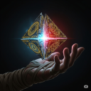

# Forgotten Ones | FO BB Prelude Krynn

## *Prelude: The Stray Fortune (Krynn)*

### **Storyteller** (06/12/2025 19:27:19)  

*1382803475951517809*

***A long time ago in a galaxy far, far away....***

#### STAR WARS
##### THE STRAY FORTUNE

*It is an age of discovery! Long before the rise of the Galactic Republic, intrepid explorers push into the uncharted darkness between stars. Hyperspace lanes are raw, untamed frontiers where great fortunes are won and lost on the data of a single, reliable route.*

*But for every legitimate charter, there are criminal syndicates preying on the new frontier. Now, a legendary vessel, the high-performance freighter **STRAY FORTUNE**, has vanished from the grasp of a powerful crime lord, sparking a hidden war in the underworld.*

*Adrift and with failing systems, Duros tinkerer **KRYNN VORRIN** and their companion, the runaway Zeltron **MYLA FESSK**, limp their damaged vessel toward their only hope: the ghost station, **ECHO-7**. Hoping to find the parts needed for repair, Krynn is unaware of the ship's notorious reputation, or that its previous owner has dispatched ruthless agents to reclaim the prize at any cost....*

---

### **aliciagd** (06/12/2025 19:26:31)  

*1382803271185469562*

Prelude: The Stray Fortune (Krynn)

---

***Created** 03/15/2026 18:26:50 (v7.9.6)*
