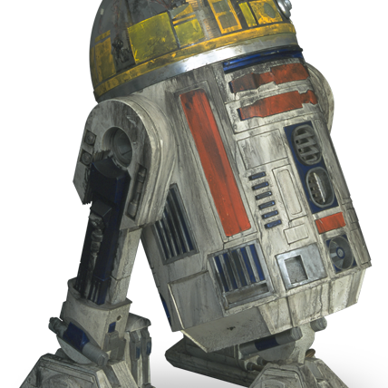
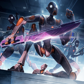

# Prelude: Ghost of the *Devastation* (Vearos)

### **Storyteller** (06/20/2025 18:21:06)  

*1385685915120173077*

***A long time ago in a galaxy far, far away....***
#### **STAR WARS**
##### **THE GHOST OF THE *DEVASTATION***

The **GALACTIC EMPIRE** reigns supreme. Having crushed the Separatist Alliance and Jedi Order, Emperor Palpatine's iron fist tightens its grip on the galaxy.

To enforce this new order, the fearsome **IMPERIAL INQUISITORS** hunt down any surviving Jedi and scour the stars for artifacts of the Force.

From the depths of a volatile nebula, a ghost of the Clone Wars has emerged. The Separatist dreadnought ***DEVASTATION***, long thought destroyed, has been found adrift and silent. Among the Inquisitors, one has a unique and bitter history with the vessel: **VAEROS HALCYON**, the ship's final commander before its fall.

Distrusted by his superiors, Vaeros has been dispatched on a perilous mission by the **GRAND INQUISITOR** himself: board the decaying wreck and retrieve its secrets for the Empire. But Vaeros has a mission of his own, to reclaim a hidden Sith artifact that holds the key to his quest for forgotten knowledge, a prize he must seize before the ghost ship is torn apart forever....

---

### **Storyteller** (06/21/2025 03:29:14)  

*1385823854492123217*

The air in the Grand Inquisitor's briefing chamber is cold, sterile, and still. Located deep within the heart of an Imperial installation, the room is a monument to stark, brutalist authority. Polished black obsidian floors reflect the recessed crimson lighting that traces the edges of the ceiling, casting long, distorted shadows. There are no chairs, only a single, massive holotable at the center of the room, currently dormant. One wall is a vast, panoramic window showcasing the star-flecked void and the distant, majestic curve of a Star Destroyer's hull.

The heavy blast doors hiss open, admitting Vaeros Halcyon. He steps across the threshold, the sound of his boots a sharp, solitary report in the oppressive silence. He comes to a halt a respectful distance from the center of the chamber, his posture rigid, a study in disciplined control. The long, pale scar that traces his jawline seems to tighten in the harsh light. Outside the chamber, his two companions remain motionless; the grey-plated commando droid, Karnyx, stands sentinel, its crimson photoreceptors unblinking, while the black-domed astromech, R3-K4, is a silent, cylindrical shadow against the corridor wall.

The Grand Inquisitor stands with his back to the door, his tall, slender frame silhouetted against the starfield. His hands are clasped behind his back, the picture of predatory patience. For a long moment, he does not move, letting the silence stretch, a tool of intimidation he wields with masterful precision. Finally, without turning, his voice cuts through the quiet—a low, resonant purr that carries an unmistakable edge of contempt.

---

### **Grand Inquisitor** (06/21/2025 03:29:14)  

*1385823857008709682*

**"Brother. You took your time."**

---

### **Vaeros Halcyon** (06/21/2025 15:53:28)  

*1386011147676680282*

Upon halting, Vaeros kneels before the Grand Inquisitor.  A million thoughts on how to explain his mission rush through his head. Vaeros knows that he found the artifact, but hasn't had time to investigate it. Ensuring that he pleases the Empire comes first now, or he may find an untimely end. He takes a brief, quiet breath, pauses, and speaks. 

**"Yes, Grand Inquisitor.  The ship, while irreversibly damaged, still holds value to the Empire. Gathering the men and resources needed to retrieve the crystals used in the ship's super weapon, incurred delays. I've accessed the ship's schematics and obtained a sample of the crystal. The ship's remaining crystals will be delivered in short order."** Vaeros retrieves the sample, resting it in his open palms, lowers his head, and raises his arms diagonally in an offering.

---

### **Storyteller** (06/21/2025 16:11:40)  

*1386015726191513630*

The Grand Inquisitor remains motionless for several heartbeats, letting Vaeros’s words hang in the frigid air. Then, with a chilling slowness, he turns. His pallid Pau'an face is a mask of detached curiosity, but his yellow, predatory eyes betray a deep-seated contempt. He ignores the kneeling figure, his gaze fixed on the crystal offered in Vaeros’s outstretched hands.

---

### **Grand Inquisitor** (06/21/2025 16:11:44)  

*1386015746248671232*

Without a word, the crystal lifts from Vaeros's palms, tugged free by an unseen force. It floats smoothly through the air until it hovers directly before the Inquisitor's face, rotating slowly. He examines its facets, not with the interest of a scientist, but with the boredom of a master inspecting a student's flawed work.

**"Delays."** The word is a low hiss, devoid of warmth. **"A word that follows you like a shadow, Brother. You have a talent for locating the ghosts of the Separatist cause. This crystal... it is a relic of a failed design, from a failed war."**

With a casual clench of his gloved fist, the Inquisitor sends the crystal skittering across the obsidian floor, where it comes to rest in a dark corner, forgotten. He takes a single, deliberate step towards Vaeros, his tall frame looming over the kneeling man.

**"Your report is... adequate. A single sample and schematics are meager returns for the time invested. The value you claim this wreck holds seems disproportionate to your hesitation."**

He begins to circle slowly, his black cape whispering across the floor.

**"But the Emperor, in his wisdom, is generous. He offers you another chance to prove that your focus has not been clouded by your... academic pursuits."**

The Grand Inquisitor stops directly behind Vaeros, his voice dropping to a conspiratorial murmur right beside his ear.

**"And speaking of ghosts... we have located your old command. The *DEVASTATION*."**

He steps back into Vaeros's line of sight, a cruel smirk playing on his thin lips.

**"A sentimental relic, is it not? You will board it. You will retrieve its complete command logs for Imperial Intelligence. And you will be done with it. Do try not to get lost in old memories, Brother Halcyon. They can be... treacherous."**

---

### **Vaeros Halcyon** (06/21/2025 17:36:59)  

*1386037197383270560*

Listening to the comments, he knows that the Grand Inquisitor is downplaying his efforts to smear his position within the Inquisitorious.  Vaeros stands up and fastens himself. Maintaining his cold demeanor, he bows at the Grand Inquisitor. Using the communicator on his forearm, Vaeros signals his droids to prepare his ship.

**"I will make haste then, Grand Inquisitor, and uphold my worth. My academic skills are only in service of the empire. As the Emperor commands."**

---

### **Grand Inquisitor** (06/21/2025 17:55:20)  

*1386041815408447600*

A faint, almost imperceptible smirk touches the Grand Inquisitor's lips as Vaeros rises and delivers his clipped, formal response. The words are correct. The posture is correct. It is the response of a subordinate who knows his place, and for a moment, the palpable tension in the room lessens.

**"See that you do, Brother."**

The Grand Inquisitor gives a slight, almost dismissive wave of his hand. He turns his back on Vaeros, gazing out the viewport at the starship hulls and the blackness beyond. The audience is over.

---

### **Storyteller** (06/21/2025 17:55:20)  

*1386041817874825246*

The heavy blast doors remain open, a silent imperative for Vaeros to leave. In the sterile corridor beyond, Karnyx has already pivoted with the silent efficiency of a hunter, its photoreceptors scanning the path ahead. R3-K4 lets out a series of low, confirmatory tones and immediately begins to glide down the hall, its internal systems already plotting the most efficient route to the assigned hangar bay and calculating the necessary fuel and power requirements for a journey into the volatile nebula. The path to the *Devastation* is now open.

---

### **Vaeros Halcyon** (06/21/2025 18:24:24)  

*1386049132556456098*

As they continue their walk to the hanger bay, Vaeros smirks; with the rediscovery of the Devastation, there is an opportunity to reclaim his lost relics, equipment, and importantly, his Holocron. The Devastation served as his flagship during the Clone War and even into the early reign of the Empire. Thought to be destroyed by the Republic early into the Clone Wars, it remained an illusive vessel, serving Count Dooku's and Vaero's needs as a mobile Command Ship. Vaeros took charge of it and used the vessel to store his equipment, relics, and miniature archives as he maintained his personal training. Eventually, it was one of the last capital ships used by the Separatist Remnant during the Reconquest of Outer Rim. Ultimately, it was destroyed and thought to be lost for good when Vaeros was hunted and brought into the Empire's fold by Darth Vader.

As they enter the hangar bar, the door to his TIE Reaper opens, revealing an ominous red glow from the interior of the ship. Vaeros and his droids enter the ship and prepare for departure.

---

### **Storyteller** (06/21/2025 18:57:23)  

*1386057433457234065*

The TIE Reaper's ramp seals with a pressurized hiss, plunging the red-lit interior into a deeper gloom. The ship lifts gracefully from the hangar deck, its unique silhouette joining the traffic of Imperial shuttles and fighters before banking sharply. Moments later, the stars outside the cockpit stretch into streaks of white and blue as the Reaper leaps into the sterile tunnel of hyperspace.

The journey is brief. The ship drops back into realspace with a lurch, and the view outside the cockpit changes dramatically. Before them lies the target nebula, a churning, chaotic masterpiece of cosmic violence. It's a vast, roiling cloud of ionized gas and dark matter, shot through with flickering, unpredictable veins of emerald and violet energy. It resembles a ghostly leviathan, its tendrils of plasma whipping silently through the void.

---

### **R3-K4** (06/21/2025 18:57:24)  

*1386057436359692488*

The astromech, plugged into a port near the cockpit, emits a series of worried, complex beeps. A schematic of the nebula appears on one of the secondary displays, highlighting multiple high-energy particle fields and a significant amount of metallic debris. A scrolling line of binary translates to: `Navigational hazard at 97.8%. Random energy surges detected. Recommend extreme caution.`

---

### **Storyteller** (06/21/2025 18:57:24)  

*1386057437961785416*

Deep within that electrical maelstrom, a single, faint transponder signal cuts through the static—the ghost of the *Devastation*. The only way to reach it is to fly directly through the storm.

---

### **Vaeros Halcyon** (06/21/2025 19:21:46)  

*1386063570118246592*

Vaeros looks at the hologram before staring out into the maelstrom.** "R3, we'll make it. Cut all non-essential electronics aboard the Reaper and lock a signal to the *Devastation*; see if it's operational enough to receive commands and provide a ship-wide status report on its condition. My former credentials should be enough to let us in." **

He sits in the pilot seat and assists R3-K4 in navigating the nebula. Once the TIE Reaper closes in on the capital ship, Vaeros prepares his gear and puts on his helmet. A slight hiss whirred, then a click. He never liked wearing it, but it's procedure. **"Karnyx, you'll be with me once we enter the ship. When we get our bearings, we'll split; you'll go to the bridge and forward all relevant command logs to R3. R3, you'll review and scrub any information that puts us at risk. Any outposts, potential points of interest, and so on, will be inserted to meet the Empire's needs. Ensure that no one else has accessed the ship's logs since our absence. If so, we'll need to avoid moderate alterations to the logs and find out who did. Once we're done, we'll scuttle the ship and designate it as being destroyed by the nebula. Let's be quick. We'll have about 30 minutes."** Vaeros has a separate goal for himself; acquire his Holocron gifted by Dooku,  mementos, and anything salvageable for his personal use.

---

### **R3-K4** (06/21/2025 19:54:03)  

*1386071690965942393*

The astromech lets out a flurry of beeps, a mix of acquiescence and protest. The binary translation confirms its understanding: `Acknowledged. Non-essential systems powering down. Attempting to establish secure handshake with target vessel...` A moment later, a different string of code appears on the console, accompanied by a negative, buzzing tone. `Negative contact. Encryption protocols rejected. Source signal is passive. No command interface detected.` The *Devastation* is a ghost on the sensors, but it isn't listening.

---

### **Storyteller** (06/21/2025 19:56:24)  

*1386072283898183756*

Vaeros grips the controls, his knuckles white. The TIE Reaper plunges into the roiling chaos of the nebula. The cockpit is immediately filled with the groans of stressed metal as the small ship is buffeted by gravimetric shears and plasma currents. Alarms flash across the console as Vaeros fights the ship, his experience evident in the precise, economical movements of the control yoke. He skillfully weaves through a field of crystalline debris, the shards scraping against the hull like angry claws.

For a moment, it seems his skill will be enough. But the nebula is treacherous. Without warning, a massive, silent arc of emerald energy erupts from a dense cloud of gas directly in their path. Vaeros yanks the Reaper into a hard dive, but the maneuver isn't fast enough. The wing of the energy wave lashes across the ship's port side.

The vessel shudders violently, and the interior lights flicker and die for a second before the red emergency lighting kicks back in. A high-pitched whine emanates from the shield generator, and a new icon flashes on the main display: `SHIELD INTEGRITY COMPROMISED: PORT QUADRANT AT 70%`.

As the ship stabilizes, R3-K4 emits a sharp, inquisitive chirp, flagging a new sensor reading. On the edge of the display, a faint, anomalous energy signature flickers into existence for a bare second before vanishing into the background noise—the electronic ghost of someone else's systems, briefly illuminated by the same energy surge that struck them. They are no longer alone in the storm.

Ahead, cutting through the swirling mists, the immense, skeletal frame of the derelict Separatist dreadnought finally emerges from the gloom. The *Devastation* is a jagged silhouette of broken towers and gaping wounds, its hull pockmarked by a thousand ancient battles, adrift and silent in its chaotic graveyard.

||**Pilot Check (DC 20):** Vaeros rolls 15 (Failure by 5). The TIE Reaper takes minor damage (Shields reduced by 5)||

---

### **Vaeros Halcyon** (06/21/2025 20:07:39)  

*1386075114809856141*

Vaeros cracks his neck and adjusts his seating position, glancing at the shield condition. **"R3, can you confirm that unknown sensor reading? In the meantime, we'll need to find a method to enter the *Devastation*".** Vaeros presses buttons on the ship's console, searching for a viable docking port or hangar.

---

### **R3-K4** (06/21/2025 21:00:42)  

*1386088463975059538*

The astromech lets out a low, warbling tone, processing the request. A string of text scrolls across the console: `Signal trace inconclusive. Ghost image dissipated into ambient energy fluctuations. Signature profile matched no known Imperial or registered commercial transponders. Low power, primitive encryption.` The droid then swivels its dome to focus on the external sensors, adding a rapid series of clicks that translate to: `Scanning external hull for entry vectors...`

---

### **Storyteller** (06/21/2025 21:00:42)  

*1386088466374332626*

Vaeros’s hands fly across the console, his expert touch bypassing layers of corrupted data and fried circuits. The result of his check is immediate and clear. The main flight decks and docking ports are cold and unresponsive, either sealed by emergency blast doors or torn open to the vacuum. But his targeted scan picks up a faint, residual power signature from a secondary, dorsal hangar bay—Hangar Grid 7—typically used for maintenance droids and technical craft. It's cycling erratically, the massive exterior doors grinding open and slamming shut in a random, dangerous sequence, powered by the last dregs of a dying capacitor. It's not a safe entry point, but it's the only one available.

Vaeros skillfully pilots the TIE Reaper towards the malfunctioning hangar. He navigates the final approach through a graveyard of twisted support beams and shattered hull plates, bringing the ship to hover just outside the violently spasming blast doors. Through the momentarily open aperture, he can see the interior of the hangar: a dark, cavernous space lit by the furious, intermittent flashes of a sparking power conduit that arcs across the deck like caged lightning.

The landing platform just inside appears clear, but timing the entry will be critical.

---

### **Vaeros Halcyon** (06/21/2025 22:09:53)  

*1386105876825505853*

Vaeros looks at the sporadic hangar door and back towards the Astromech. **"R3, I trust that you'll watch the hangar door. On my mark, we'll speed through the opening."**  Vaeros closes his eyes, feeling the door opening, and closing, waiting the moment to click.

---

### **R3-K4** (06/21/2025 22:35:33)  

*1386112334019170356*

The astromech swivels its dome to face Vaeros and lets out a single, sharp, confident beep. It trusts its pilot.

---

### **Storyteller** (06/21/2025 22:35:33)  

*1386112336871559482*

Vaeros closes his eyes, shutting out the chaotic visual of the grinding metal doors and the violent nebula beyond. He reaches out not with his senses, but with the Force. The erratic rhythm of the hangar ceases to be random noise; it becomes a predictable, if damaged, pattern. He feels the groaning strain in the motors, the flicker of dying energy in the capacitors just before they cycle, and the brief, almost imperceptible pause at the apex of the door’s agonizingly slow ascent. He has found the flaw in its rhythm.

His eyes snap open. **"Mark!"**

The TIE Reaper lurches forward, its engines roaring to life with sudden, shocking power. Instead of a cautious entry, Vaeros executes a breathtakingly precise combat maneuver. The ship rockets through the narrow, temporary gap with centimeters to spare, the tips of its folded wings almost scraping the edges of the massive doors. For a heart-stopping second, the ship is perfectly framed within the opening before the doors slam shut behind it with a deafening, final boom of metal on metal.

---

### **Storyteller** (06/21/2025 22:35:43)  

*1386112379292614667*

The Reaper touches down on the landing platform with barely a shudder, its engines whining down into silence. They are inside.

The hangar is plunged into a deep gloom, broken by two sources of light: the faint, ominous red glow from the Reaper's cockpit and the brilliant, violent flashes from the hazard described in the ship's schematics. A thick, severed power conduit, as wide as a person, hangs from the ceiling. Every few seconds, it builds up a charge and unleashes a blindingly bright arc of raw energy that lashes across the deck plating towards a scorched grounding point on the far wall, bathing the entire chamber in a ghastly, strobing light.

Across the deck, about twenty meters away, is the hangar control terminal, its status screen flickering weakly. That is the objective. Getting to it, and giving R3 the time it needs, will mean crossing the path of that deadly electrical discharge.

---

### **Vaeros Halcyon** (06/21/2025 23:29:30)  

*1386125913481154690*

Vaeros looks around the hanger, scratching his mask where his scar would be, before settling his eyes on the dangling power conduit.** "R3, when I lift this cable, move to the terminal."** He lifts his arms towards the cable and prepares to guide it upwards, aiming to have the cable safely discharge on the ceiling long enough for R3 to move across.

---

### **Storyteller** (06/21/2025 23:53:48)  

*1386132026968637480*

Vaeros extends his hands, reaching out not with his fingers but with his mind. He focuses on the thick, heavy conduit, feeling its immense weight and the volatile, raw energy crackling within it.

---

### **R3-K4** (06/21/2025 23:53:48)  

*1386132029069987860*

The astromech lets out a quick, affirmative chirp and prepares to move, its motor humming in anticipation.

---

### **Storyteller** (06/21/2025 23:53:49)  

*1386132030273880275*

With a grunt of effort that is purely for show, Vaeros seizes the cable in an invisible grip. The conduit groans, resisting his initial pull with the dead weight of a fallen beast. Then, with a surge of telekinetic power, he wrenches it upwards. The cable snaps taut, swinging towards the ceiling just as it builds to a critical charge.

A blindingly white-hot bolt of energy erupts not across the deck, but harmlessly into the scorched metal of the hangar's ceiling, showering the area below with a brief, incandescent rain of molten sparks.

The path is clear.

---

### **R3-K4** (06/21/2025 23:53:49)  

*1386132031288901853*

The astromech wastes no time. It speeds across the hangar deck, its wheels gliding smoothly over the grimy plating, and comes to a halt before the flickering terminal. A slicing spike extends from a hidden compartment, and the droid immediately plugs in, its domed head swiveling as it begins its assault on the corrupted security systems.

---

### **Storyteller** (06/21/2025 23:53:49)  

*1386132032375230535*

The moment R3-K4 makes contact, the power conduit, now free of Vaeros's telekinetic grasp, slumps back down to its original position, already beginning to crackle and build another charge. The terminal screen flashes with complex lines of code as R3 begins its work, but a status bar indicates the process will take time. The conduit will discharge again in moments.

---

### **Vaeros Halcyon** (06/22/2025 00:08:50)  

*1386135809022754916*

Vaeros glances at R3-K4 before looking back at the cable. He prepares once more to lift the cable. His mind extends towards the cable and readies himself. 

**"R3, I'll handle the electricity, but you need to be quick; it's about to discharge. Karnyx, grab a piece of debris to interfere with the discharge in case this fails"**

---

### **Storyteller** (06/22/2025 02:57:09)  

*1386178169081430118*

As the residual sparks from the last discharge fade, the heavy cable begins to hum and crackle again, gathering energy for another deadly release.

---

### **Karnyx** (06/22/2025 02:57:09)  

*1386178170780385354*

The commando droid gives a silent, affirmative nod. Its photoreceptors scan the debris-strewn hangar for a moment before it moves with silent, athletic grace. It identifies a large, bent slab of durasteel hull plating, likely torn from a starfighter during the ship's final battle. With a screech of protesting metal, Karnyx wrenches the slab from a pile of wreckage and begins dragging it into a defensive position near the console.

---

### **R3-K4** (06/22/2025 02:57:10)  

*1386178171954790430*

Ignoring the activity behind it, the astromech remains completely focused on its task. Its slicing spike is buried deep within the terminal's core port, and its domed head rotates in short, sharp bursts as it battles the ship's ancient, corrupted security protocols. Green text flashes rapidly across the terminal's screen.

---

### **Vaeros Halcyon** (06/22/2025 02:57:10)  

*1386178173095510026*

Vaeros plants his feet, his focus narrowing again to the swinging conduit. He reaches out with the Force, and for a second, the cable seems to fight back, its weight more stubborn this time. A flicker of strain crosses Vaeros's face, but his will holds firm. Just as the energy builds to a critical point, he masters the conduit, yanking it upwards once more.

---

### **Storyteller** (06/22/2025 02:57:10)  

*1386178174097952810*

A brilliant spear of lightning erupts from the cable's frayed end, striking the same scorched patch on the ceiling in a shower of white-hot sparks. The path below is safe.

A triumphant, high-pitched *trill* comes from R3-K4. The terminal screen flashes a bright green: `ACCESS GRANTED - HANGAR CONTROL RELAY`. A moment later, with a deep, shuddering groan, the massive hangar doors lock into a fully open position, revealing the swirling, silent chaos of the nebula outside. The path back to the Reaper and into the ship proper is now stable and secure.

---

### **Vaeros Halcyon** (06/22/2025 19:12:09)  

*1386423537111269446*

**"R3, is the rest of the ship accessible? Check the operational status of the lifts, rail jets, and droid crew; we'll change the plan from before: R3, leave with Karnyx to the bridge; Karnyx, you'll escort R3 to gather the command logs. As you're getting the command logs, we still need to ensure that the logs haven't been previously tampered with before our arrival. I'll access some secondary systems, and then we'll regroup at the transport. Contact me if anything changes."**

Vaeros isn't sure about the mission, feeling like something is off, like a creeping suspicion. The Grand Inquisitor and the Emperor *have* to be testing his loyalties by sending him here. Only requesting the command logs for the ISB is something that lower agents can fulfill. 

Regardless, he needs to secure his Holocron and keep it hidden. It should hidden in his former quarters; it's his prized possession and a key to his training. It can't be discovered by anyone else, or lost forever in the nebula.

---

### **R3-K4** (06/22/2025 20:50:42)  

*1386448337431167037*

The astromech's dome swivels as it processes the new commands. A schematic of the dreadnought flickers onto its holoprojector, overlaid with diagnostic data. A text-to-speech function translates the binary whirs into a flat, synthesized voice.

**"Analysis: Ship-wide transit systems are compromised. Main lifts report intermittent power failure; functionality is not guaranteed. Turbolift rail jets are offline. Life support is active on minimal power, but atmospheric integrity is variable between decks. I detect no active Separatist or Imperial droid signatures; the crew is inert. I cannot verify the integrity of the command logs until I have direct access to the bridge's master terminal."**

---

### **Karnyx** (06/22/2025 20:50:43)  

*1386448339968721067*

The commando droid's head snaps to attention, its crimson photoreceptors fixed on the corridor leading out of the hangar.

**"Orders acknowledged. We will proceed to the bridge."**

---

### **Storyteller** (06/22/2025 20:50:49)  

*1386448366472400967*

Vaeros leads the way out of the hangar, his boots echoing in the cavernous silence of the dead ship. The corridor beyond is a tomb. The air is cold and thin, tasting of ozone and rust. Emergency lights flicker weakly overhead, casting long, dancing shadows that make the debris-littered floor seem to writhe. The walls are scarred with ancient blaster marks, and the skeletal, shattered remains of B1 battle droids are strewn in heaps, grim monuments to the ship's final, violent moments. The groan of stressed metal is the only sound, the ship's last dying breath.

The team proceeds through the desolate corridors until they reach a major intersection. A faded sign on the wall points one way down a long, dark hall: `BRIDGE`. Another sign points the opposite direction: `COMMAND SECTOR`.

It is then that a new sound joins the groaning of the ship: the rhythmic, heavy clank of metallic footfalls echoing from the corridor leading towards the bridge. Moments later, a squad of three figures emerges from the gloom. They are BX Commando Droids, but something is terribly wrong with them. Their movements are jerky and unnatural, their limbs twitching as if fighting their own programming. Their armor is scorched and corroded, and their photoreceptors flicker with a malevolent, corrupted light. They march in a stumbling, yet relentless patrol pattern, their E-5 blaster rifles held at the ready. They do not seem to notice Vaeros and his companions yet, but their patrol path will bring them directly across the intersection. They are between Karnyx and R3-K4's objective.

---

### **Vaeros Halcyon** (06/22/2025 21:22:24)  

*1386456315043516609*

Vaeros stops, signaling his droids to halt. He points R3 towards cover and Karnyx into a supporting fire position. Using the force, he pulls his saber into his right hand, then waits.

---

### **Storyteller** (06/22/2025 22:47:03)  

*1386477617045045451*

Vaeros raises a hand, and his companions freeze. With silent precision, R3-K4 rolls behind a large, fallen support beam, while Karnyx melts into the deep shadows of a recessed doorway. Vaeros pulls his lightsaber into his grasp with the Force, its polished hilt cold against his palm, and ducks behind the same cover as R3. The metal is cold and offers a solid line of sight towards the approaching patrol.

The three corrupted BX droids continue their jerky, clanking march down the corridor. Their movements are unnatural, a parody of their original deadly grace. They seem oblivious, their heads locked forward as they pass the intersection. For a moment, it seems the party will go unnoticed.

Then, the lead droid stops dead. Its head twitches violently to the side, its corrupted photoreceptors flickering as they lock directly onto the edge of the support beam Vaeros is hiding behind. A burst of distorted, static-filled binary shrieks from its vocalizer—a corrupted alert signal.

Instantly, the other two droids halt their patrol, pivoting with unnerving speed. They raise their E-5 blaster rifles, their twitching forms making it clear they have acquired their targets. There will be no ambush.

---

### **Storyteller** (06/23/2025 00:42:45)  

*1386506733085786152*

The corridor erupts into a whirlwind of motion and crimson energy.

Vaeros is the first to act. The air hisses as his lightsaber ignites, casting a blood-red glow over the metallic walls. He surges forward, closing the distance to the lead BX droid in a heartbeat. His blade slices through the air in a precise, powerful arc aimed to sever the droid's head from its shoulders. But the corrupted machine's jerky, unpredictable movements serve it well; it twitches spastically at the last possible moment, and Vaeros's blade cuts through empty space, the hum of his weapon a low, frustrated growl.

From the shadows, Karnyx proves its worth. Without a word, the commando droid levels its E-5 rifle and unleashes a rapid double-tap at the second BX droid. The bolts strike home with devastating force. Armor plating shatters and flies off the droid's torso in a shower of sparks, leaving deep, glowing craters in its chassis. The machine stumbles, smoke pouring from its wounds and its vocalizer emitting a high-pitched shriek of static, yet its corrupted programming keeps it standing.

---

### **Storyteller** (06/23/2025 00:42:53)  

*1386506767109849129*

The three droids react as one, a unified, malevolent intelligence. Their heads snap towards Vaeros, and they raise their rifles in perfect, chilling unison. A storm of blaster fire converges on him—a single, overwhelming volley aimed to punch straight through his defenses. It's a perfectly executed attack, a critical concentration of firepower.

But Vaeros is faster. Calling on the Force, his lightsaber becomes a spinning vortex of crimson light. He meets the incoming torrent of energy head-on, not just blocking but actively catching and redirecting each bolt. The corridor is filled with the deafening sizzle of deflected energy as shots ricochet harmlessly into the ceiling and floor, leaving a tapestry of scorched black streaks on the metal around him. When the assault is over, Vaeros stands unscathed, his blade humming, the air thick with the smell of ozone.

The standoff continues, the damaged droid twitching but still a threat, and its two allies ready to fire again.

---

### **Storyteller** (06/23/2025 01:08:39)  

*1386513250287620136*

Picking up the rhythm of the fight, Vaeros doesn't waste a motion. He pivots from his initial target, his crimson blade a blur as he turns on the smoking, heavily damaged commando droid. This time there is no erratic twitch that can save it. The lightsaber scythes through the air and slices cleanly through the droid's torso. For a split second, the machine's top half hangs in the air before clattering to the ground in a shower of sparks and severed wires. One down.

---

### **Karnyx** (06/23/2025 01:08:39)  

*1386513253886070846*

From its covered position, Karnyx adjusts its aim to the lead droid, its targeting laser painting a red dot on the machine's head. It fires another quick burst, but the lead droid lurches sideways in a spasm of corrupted programming, and the blaster bolts streak past, impacting harmlessly against the far corridor wall.

---

### **Storyteller** (06/23/2025 01:08:40)  

*1386513255471513611*

The remaining two droids instantly recalibrate. Their heads snap in unison towards Vaeros, ignoring the missed shot from the shadows. They raise their rifles, loosing a disciplined, two-shot volley down the narrow hallway.

Vaeros's blade is a flurry of motion, a shield of humming crimson light. He intercepts the first bolt with a sharp sizzle, but the second shot is perfectly timed, slipping just past the edge of his defense as he recovers. The bolt slams into his shoulder with punishing force, the impact staggering him back a step. The air fills with the smell of seared flesh and ozone, and a sharp, burning pain radiates through him. The attack found its mark. The two remaining droids stand ready, their rifles still hot.

---

### **Storyteller** (06/23/2025 01:35:13)  

*1386519939036217475*

Ignoring the stinging pain in his shoulder, Vaeros presses his attack. He lunges forward, his lightsaber moving in a tight, vicious arc that crashes against the lead droid's chest. The blade bites deep into its armor, sending a spray of sparks and molten metal across the corridor floor. The droid stumbles back, heavily damaged and trailing smoke, but its corrupted programming keeps it upright and functional.

---

### **Karnyx** (06/23/2025 01:35:14)  

*1386519942186406030*

Seeing the opening Vaeros created, Karnyx steps out from the shadows. A surge of energy courses through its rifle as its combat protocols are augmented by the Force Point. It unleashes a single, brilliant blue blaster bolt that crosses the corridor in an instant. The shot strikes the wounded lead droid dead center. The effect is catastrophic. The droid doesn't just fall; it detonates, its entire torso vaporizing in a flash of blinding light and concussive force, leaving only its legs to collapse in a heap of sparking wreckage.

---

### **Storyteller** (06/23/2025 01:35:14)  

*1386519943797018645*

The last remaining commando droid, now alone, twitches erratically. Its programming screams for a coordinated attack that is no longer possible. With a shriek of static, it raises its rifle and fires a single, desperate shot directly at Vaeros.

This time, Vaeros is ready. With an almost casual flick of his wrist, he brings his crimson blade up, intercepting the bolt with a sharp *hiss*. The deflected energy bolt screams past his head and vanishes down the dark corridor.

Silence descends, broken only by the hum of the lightsaber and the faint crackle of the two destroyed droids. The threat is eliminated. The path to the bridge is clear.

---

### **Storyteller** (06/23/2025 01:55:18)  

*1386524991163596801*

With only one foe remaining, Vaeros moves to end the fight. He closes the distance, his lightsaber a crimson arc aimed at the droid's head. But the lone machine, its programming degrading into pure survival instinct, spasms erratically. It drops into a low crouch at the last second, and Vaeros's blade sizzles through the air where its head had been moments before.

---

### **Karnyx** (06/23/2025 01:55:19)  

*1386524994196078604*

Seizing the opening, Karnyx unleashes another rapid volley. Two bolts slam into the corrupted droid. The first strikes its leg joint, causing it to stumble and buckle. The second impacts its rifle arm, sending sparks flying and making the weapon shudder in its grasp. The droid is riddled with damage, smoke pouring from multiple breaches in its chassis, but it remains standing.

---

### **Storyteller** (06/23/2025 01:55:19)  

*1386524995571814663*

With a final, desperate screech of static, the crippled BX droid raises its damaged rifle and fires a wild, unaimed shot. The blaster bolt flies wide, ricocheting harmlessly off the corridor wall far from Vaeros, who sidesteps the errant blast with contemptuous ease. The droid's targeting systems are clearly fried, its last act of defiance more pathetic than threatening.

---

### **Vaeros Halcyon** (06/23/2025 02:04:42)  

*1386527359686934661*

Vaeros sighs, thrusting his crimson blade into the commando droid's chest before aggressively yanking it out. Sparks fly as the commando droid talks in corrupted commands, and Vaeros watches the light steadily dim in its eyes.

**"Karnyx, R3, get to the bridge and get those logs. I'll head to the command sector. If you encounter more corrupted droids, notify me on comms." **

---

### **Karnyx** (06/23/2025 10:39:17)  

*1386656858814812272*

**"Acknowledged. We will maintain communication silence unless we encounter hostiles."**

---

### **R3-K4** (06/23/2025 10:39:18)  

*1386656861041721444*

The astromech lets out a series of low, affirmative tones, its domed head already turning to face the long, dark corridor leading to the bridge.

---

### **Storyteller** (06/23/2025 10:39:18)  

*1386656862132371517*

With the last corrupted droid twitching on the floor, an eerie silence descends once more upon the intersection. Karnyx gives a final, sharp nod to Vaeros before turning to escort R3-K4. The two droids proceed down the hallway marked `BRIDGE`, their forms shrinking into the oppressive darkness until only the faint sound of R3's repulsorlift remains.

Vaeros watches them go for a moment before turning towards the opposite corridor, the one marked `COMMAND SECTOR`. This hallway feels different. The emergency lighting is more stable here, casting a steady, if dim, light. The floors are cleaner, the walls less scarred by blaster fire. This was the heart of the ship's command structure, better protected and more insulated from the chaos of battle.

He walks past doors bearing the names of Separatist officers he once knew, their fates unknown. The Separatist cog insignia is emblazoned on bulkhead after bulkhead, a ghost of his former allegiance. Each step is a step back in time, down a path he thought was lost forever. Finally, he arrives at a particular door, one that bears no nameplate, only a high-security access panel. He doesn't need a nameplate. He knows this door. It's the entrance to his former quarters.

---

### **Vaeros Halcyon** (06/23/2025 20:52:45)  

*1386811240591921213*

Vaeros glances at the access panel, then back at the door. Scratching his mask where his facial scar would be, he uses his free hand to wipe the dust off the panel.

He designed the security protocols and locks used on the door. First, he has to input a passcode only he can know, and then he has to use the force to unlock the door afterward. He inputs the passcode *20 Unshackled.* The screen flashes red in error, so he tries a backdoor access to unlock the door through the force. He struggles but is also unable to unlock the door. 

**"Son of a Bantha, I invented this damn thing.** Getting irritated, he inputs *THIRDPATH* and the screen flashes green. The initial lock is open. Now, Vaeros presses his right hand onto the door and lets the force flow through him and into the door. Feeling the cold metal, the gears, and nostalgia, he gently unlocks the door. The old gears make a slight whining sound. His room is open, untouched like the day he left it.

---

### **Storyteller** (06/23/2025 23:55:29)  

*1386857226920132638*

The heavy door slides open with the groan of long-dormant machinery, revealing a space perfectly preserved in time. The air that spills out is stale and cold, carrying the faint, dusty scent of old books and dried ozone. A fine layer of grey dust coats every surface, a silent testament to the years of neglect.

This was never a mere bunk; it was a sanctuary. The room is larger than standard officer's quarters, one wall dominated by built-in shelves filled with a chaotic collection of artifacts. There are datapads stacked high, etched crystals that pulse with a faint, dormant light, and fragments of ancient armor mounted for display. A Separatist command banner, its blue-grey fabric faded but intact, hangs behind a large desk. In the center of the room is a simple, black cushion on a raised dais—his former meditation spot.

Everything is exactly as he left it, a perfect snapshot of the man he was moments before his capture by Vader. It is a room belonging to a scholar and a seeker, not yet the hardened Inquisitor who now stands on its threshold. The prize he seeks, the Holocron gifted to him by Dooku, is not immediately visible. It would be hidden, its location known only to the man who built this sanctum.

---

### **Vaeros Halcyon** (06/24/2025 01:00:41)  

*1386873634483605624*

Vaeros eagerly removes his mask, drawing in a long, satisfying breath. Everything is just as he left it, down to the haphazard placement of datapads and ancient books crowding his desk. Extending a hand, he gently summons a cluster of holo-discs from the shelves and drawers, arraying them before him.*The Blood Doctrine: Principles of Sith Alchemy*, *Dooku’s Journals – Red Ledger Edition*, *The Book of Names*, and others, some salvaged from the destruction of Serenno during the purge, others collected during raids on Jedi Outposts and ancient ruins. The remains of Dooku’s legacy, scattered in pages and secrets. He sets the discs on the desk and then scans the room for a specific item: his old satchel. The worn, toughened bag had accompanied him on countless missions as a Dark Acolyte, its interior still lined with scuff marks from stolen kyber crystals, cracked tablets, and ritual scrolls. Spotting it slung beneath his meditation chair, he slings it over the back of the seat without hesitation, though his thoughts drift to something far more precious; *his* holocron.

---

### **Vaeros Halcyon** (06/24/2025 01:00:41)  

*1386873635452489839*

Centering himself, Vaeros raises his left hand toward the dais. The cushion slides aside, revealing the activation rune below. With a faint hum and the grinding of old gears, a hidden compartment rises from the floor. He steps forward and lifts the object within. The holocron is cold to the touch. A six-faced purple cube, one face fractured and peeling back from the rest. Light flickers from the cracked seam; not just red or blue, but a chaotic dance between them. He stares at it longer than he should, caught in its gravity. Snapping out of his trance, he crosses the room, places the holocron carefully into his satchel, and with one sweeping motion of his arm, gathers the holodiscs beside it. Lastly, he powers up his desk console. The screen flickers to life with a low whine. He inputs his old access codes, but they still work. He pulls up a secure archive of his personal logs: hidden safehouses, uncharted ruins, fractured map overlays, and artifact caches. The data is valuable enough to please the Empire or potentially fund his escape...

Before exiting the room, he takes one final look at the separatist banner.  He salutes it, then puts his mask on before exiting the room. He's a soldier of the Empire now, but briefly, he was a freedom fighter again.

---

### **Storyteller** (06/24/2025 01:26:00)  

*1386880005325197343*

As Vaeros steps out of his quarters and the door hisses shut behind him, sealing his past away once more, a sudden, violent shudder rocks the entire deck. A high-pitched, deafening klaxon begins to blare from speakers all down the corridor, their sound distorted and horrifying after years of silence. Red emergency lights strobe to life, bathing the hallway in a pulsating, hellish glow.

-----

*Meanwhile, on the bridge...*

The command bridge of the *Devastation* is a silent tomb. The skeletal remains of its crew are still at their posts, slumped over consoles or scattered across the floor. Through the massive, shattered viewport, the colors of the nebula swirl hypnotically. Karnyx stands guard at the entrance, its rifle sweeping methodically across the dead scene.

R3-K4 rolls confidently to the master command terminal. With a decisive thrust, it plunges its slicing spike into the main data port.

The instant the connection is made, the bridge—and the entire ship—roars to life.

A cold, synthetic voice echoes from every speaker:

> **"WARNING. REACTOR CONTAINMENT FAILURE  DETECTED. SELF-DESTRUCT SEQUENCE INITIATED. DETONATION IN T-MINUS 5 MINUTES."**

-----

*Back in the Command Sector corridor...*

Vaeros's forearm communicator crackles to life.

---

### **Karnyx** (06/24/2025 01:26:00)  

*1386880007879524394*

**"Commander, we have a problem. The ship's reactor is critical. Self-destruct has been initiated."**

---

### **Storyteller** (06/24/2025 01:26:01)  

*1386880009599324281*

The ship lurches again, more violently this time. The race against oblivion has begun.

---

### **Vaeros Halcyon** (06/24/2025 02:01:02)  

*1386888820938510536*

**"I'm on my way to the ship now. R3, what is the ETA for downloading the command logs? Karnyx, while R3 is plugged in, I need you to check the bridge-side escape pods. If one is functional, prepare to use it if you can't get to the ship in time or find an alternate means of escape."**

---

### **Storyteller** (06/24/2025 10:46:15)  

*1387020996443373618*

Vaeros sprints from his quarters, the klaxons screaming in his ears. The ship lurches violently again, throwing him against a bulkhead. He recovers his balance, his own HUD now displaying the ship's terrifying internal countdown.

His commlink crackles with a burst of high-speed binary, which his HUD translates instantly.

---

### **R3-K4** (06/24/2025 10:46:15)  

*1387020998309580871*

***"ETA indeterminate. The logs are heavily fragmented and behind layers of corrupted security ice. I require three successful decryption cycles to compile and transmit the data. Attempting first cycle now. This will not be fast."***

---

### **Karnyx** (06/24/2025 10:46:16)  

*1387021000121520129*

A moment later, Karnyx's synthesized voice cuts through the noise, calm and professional. ***"Acknowledged, Commander. Moving to evaluate bridge escape pods."***

---

### **Storyteller** (06/24/2025 10:46:16)  

*1387021001392656455*

Another tremor shakes the deck, stronger this time. Dust and wiring rain down from the ceiling. The countdown on Vaeros's HUD ticks down.

*4:50... 4:49...*

---

### **Vaeros Halcyon** (06/24/2025 18:26:38)  

*1387136855811686611*

**"Well how long is a decryption cycle, R3!?!" ** Vaero's sprints towards the maintenance hanger in a hurried frenzy. Tapping a button on his communicator, it signal's the TIE Reaper's automated systems to being spooling up. Hopefully it'll save them some time.

---

### **Storyteller** (06/24/2025 20:20:29)  

*1387165509941854410*

Vaeros's boots pound against the deck plates as he sprints, the ship groaning around him like a dying beast. A particularly violent tremor shakes the corridor, forcing him to brace against the wall to keep his footing as a chunk of ceiling panel crashes down behind him. His signal reaches the TIE Reaper, and deep in the hangar bay, the ship's systems begin to hum to life, its interior lights flickering on in the gloom.

His communicator chirps, translating another burst of binary from the bridge.

---

### **R3-K4** (06/24/2025 20:20:30)  

*1387165514517844029*

**"Each successful decryption cycle requires approximately one minute of sustained processing. Three cycles are required. The system is unstable; complications are probable."**

---

### **Karnyx** (06/24/2025 20:20:31)  

*1387165516115869766*

Immediately after, Karnyx's calm, synthesized voice cuts in. **"Bridge escape pod update. Pod 3 shows minimal power. All others are inert. Launch mechanism is untested. Its viability as an escape route is less than 15 percent."**

---

### **Storyteller** (06/24/2025 20:20:31)  

*1387165517411782666*

The implication is clear. There is no easy way out. The countdown on Vaeros's HUD continues its relentless march.

**4:25... 4:24...**

---

### **Vaeros Halcyon** (06/24/2025 20:36:02)  

*1387169421214220399*

The loud sound of metal falling, circuits bursting, and sirens can be heard in Vaeros's communications. Taking a hurried breath, he barks orders.

**" I need you to get at least, 50% of the data or sufficient data to placate the mission needs. If it interferes with your chances of escape, your survivability comes first. 

Karnyx, see there's a closer docking port, EVA hatch, or hanger that I can extract you from as a backup. I'm getting close to the Tie Reaper."**

---

### **Storyteller** (06/24/2025 20:51:00)  

*1387173188865359932*

Vaeros's voice, strained from exertion, cuts through the cacophony over the comms. Another tremor, this one longer and deeper than the rest, shakes the ship to its very core. A series of explosive pops echoes from further down the corridor as entire sections of the power grid overload and fail.

His communicator crackles in response, first with R3's analytical binary.

---

### **R3-K4** (06/24/2025 20:51:01)  

*1387173192413479136*

**"Revised parameters acknowledged. Prioritizing data integrity of initial log files over total acquisition. First decryption cycle at 78%. Probability of achieving 50% data retrieval before timer reaches T-minus two minutes is... 62%."**

---

### **Karnyx** (06/24/2025 20:51:01)  

*1387173194200256533*

The astromech's report is immediately followed by Karnyx's clipped, even tones. **"Affirmative. Scanning local schematics for alternate extraction vectors. Identified one maintenance airlock on the deck below the bridge. Airlock status is unknown. Evaluating now."**

---

### **Storyteller** (06/24/2025 20:51:02)  

*1387173195584504004*

Vaeros rounds the final corner and the cavernous, strobing hangar bay comes into view. The TIE Reaper sits waiting on the deck, its engines now at a low, steady hum, its boarding ramp open. The entire scene is lit by the intermittent, violent flashes of the unsecured power conduit, which continues to lash out with furious energy. The path back to the pilot's seat is clear, but the ship is tearing itself apart around him.

The countdown continues its merciless descent.

**3:58... 3:57...**

---

### **Vaeros Halcyon** (06/24/2025 20:56:51)  

*1387174659652456562*

Vaeros dashes towards the ramp and into the TIE Reaper. He almost throws the satchel aside but quickly and gently sets it down next to the pilot seat. 

Vaero's calls to the droids, but the voice comes out staticky due to the interference.**"I need an update. I'm inside the TIE Reaper and ready to take off."**

---

### **Storyteller** (06/24/2025 21:06:45)  

*1387177153220837556*

Vaeros leaps up the ramp just as another tremor rocks the hangar, sending a shower of sparks from the lashing power conduit. He lands in the pilot's seat, the familiar worn texture a small comfort in the chaos. The satchel containing his life's work and the key to his future is placed with uncharacteristic care on the deck beside him. His call over the comms is answered by a wave of static, the dying ship's agony interfering with the signal.

---

### **R3-K4** (06/24/2025 21:06:46)  

*1387177156164976791*

A string of translated binary breaks through the noise, cool and analytical despite the circumstances. **"First decryption cycle at 95%. Compiling initial data packet. The logs have not been accessed by any external source since your departure."**

---

### **Karnyx** (06/24/2025 21:06:46)  

*1387177157729718322*

Karnyx's voice follows, but it's different. It's not a report; it's an alert, cut short by the sudden, terrifying sound of heavy, rolling metal and the unmistakable, rising hum of personal shield generators. **"Commander, the airlock is... irrelevant. Hostiles on the bridge. Two of them. Droidekas."**

---

### **Storyteller** (06/24/2025 21:06:47)  

*1387177159025496279*

Through the open channel, Vaeros can hear the iconic, horrifying sound of the destroyer droids deploying from their ball-form into their three-legged combat stance, followed by the immediate, deafening roar of their twin blaster cannons opening fire. The line fills with the sound of a firefight.

Another violent lurch rocks the TIE Reaper, and the countdown on the cockpit display ticks past another grim milestone.

**3:28... 3:27...**

---

### **Vaeros Halcyon** (06/24/2025 21:59:44)  

*1387190486007283874*

**"Son of a Hutt! Karnyx, I'm bringing the ship around to dock at the Maintenance port. Buy time for R3, I'll flank the Droidekas once I'm here. Keep me updated on comms, both of you. I'll be there in 20 seconds."**

Vaeros takes off, rushing towards the maintenance port.

---

### **Storyteller** (06/24/2025 22:13:41)  

*1387193996123836576*

The Reaper's engines scream as Vaeros pushes them to their limit, banking hard around a shattered command tower. Debris from the dying dreadnought now forms a treacherous obstacle course, and alarms blare in the cockpit as his shields flare against impacts. Below him, he sees the faint docking lights of the maintenance airlock.

On the bridge, the air is a storm of blaster fire. The two Droidekas, their shields shimmering, unleash a relentless barrage of twin-cannon fire that rips chunks of metal from the consoles R3-K4 is using for cover.

---

### **Karnyx** (06/24/2025 22:13:42)  

*1387193998417854534*

**"Acknowledged."** The commando droid's reply is flat and immediate. It leans out from behind a bank of destroyed terminals and fires a disciplined shot at the closest Droideka. The bolt splashes against its shield, causing the energy bubble to flicker violently. The Droideka registers the threat, turning one of its twin cannons away from R3 to fire on Karnyx's position.

---

### **R3-K4** (06/24/2025 22:13:42)  

*1387193999508639765*

Amid the chaos, the astromech sends a compressed data-burst over the comm. **"Second data packet secured. One remains. Slicer intrusion has been detected by hostile units."**

---

### **Karnyx** (06/24/2025 22:13:42)  

*1387194000577925231*

Karnyx's voice follows, steady despite the cacophony of explosions. **"Hostile fire is suppressed but ongoing. The maintenance airlock is on this vector. Awaiting your arrival."**

---

### **Storyteller** (06/24/2025 22:13:42)  

*1387194001534226452*

The countdown timer on Vaeros's HUD continues its grim descent.

**2:15... 2:14...**

---

### **Vaeros Halcyon** (06/25/2025 16:29:40)  

*1387469811143016590*

Vaeros speeds to a halt, docking with the maintenance airlock. The airlock pressurizes with the ship's hatch, with a hissing sound as it opens. He is running as fast as his legs will take him. Failure is not an option. Once he engages the Droidekas, he'll destroy them and fulfill the mission. This ship won't become his tomb.

---

### **Storyteller** (06/25/2025 17:12:27)  

*1387480576243793950*

The hiss of the airlock is swallowed by the shriek of the klaxons as Vaeros bursts from the Reaper's docking collar and back into the dying ship. He doesn't hesitate, his sprint eating up the meters of the maintenance corridor. The ship is in its death throes now. Entire wall panels buckle and fall, revealing a nightmarish web of sparking, severed conduits. The deck plates heave under his feet, and he has to fight to keep his balance as another massive explosion in a lower section sends a violent tremor up through the hull.

He runs with a desperate, focused intensity, his past and future converging in this single, frantic dash. The mission, the Inquisitor, the holocron in his satchel—all of it will turn to plasma-hot dust if he fails here. The path to the bridge is a blur of red emergency lights and deep, encroaching shadows.

The sounds of battle grow louder, the distinctive, heavy *thump-thump-thump* of Droideka blaster cannons echoing off the metal walls, punctuated by the sharper crack of Karnyx's rifle. He rounds a final corner and sees it: the blast doors to the command bridge, thrown wide open.

Through the doorway, the scene is one of pure chaos. Energy shields shimmer, blaster bolts crisscross the room, and the air is thick with the smoke of burning electronics. The final countdown timer on his HUD screams towards the one-minute mark. 
**1:35... 1:34...**

---

### **Storyteller** (06/25/2025 17:15:28)  

*1387481333789364315*

Vaeros bursts through the blast doors and onto the command bridge, and the scene unfolds before him in a terrifying, chaotic tableau.

The bridge is a tiered, circular chamber of death and ruin. The main viewscreen is a fractured nightmare of transparisteel, showing the violent, silent dance of the nebula outside. Red emergency lights flash across banks of shattered consoles and the skeletal remains of the bridge crew, casting everything in a blood-red, strobing gloom. The air is thick with the acrid smoke of heavy blaster fire.

In the center of the sunken command pit, **15 squares** directly in front of Vaeros, a **Droideka (DK1)** has deployed. Its bronze armor plating is scorched, but its personal energy shield shimmers with malevolent power. Its twin blaster cannons are glowing cherry-red as they lay down a relentless field of fire.

Further back and to the right, nestled between the main viewscreen and a bank of burning terminals, is the second **Droideka (DK2)**. It is **25 squares** away from Vearos’s position and has a commanding field of fire over the entire room. Its shield is also active, and its cannons are focused on the far side of the bridge.

To the left, **12 squares** from Varos, **Karnyx** is crouched behind a barricade of overturned computer stations. He leans out, fires a disciplined shot from his E-5 rifle at DK2, and ducks back as a torrent of answering fire splashes against his cover.

In the command pit, only **18 squares** from Varos but dangerously close to DK1, **R3-K4** is tucked behind the master command console. Sparks fly as blaster bolts impact the console around him. He is completely focused on his task, his slicing spike buried in the terminal, seemingly oblivious to the destruction erupting around him.

---

### **Vaeros Halcyon** (06/25/2025 17:38:02)  

*1387487014886310060*

**"R3, Karnyx, we have about 20 seconds to get off this ship, move! Karnyx, support me in getting this Droideka!"**
Vaeros ignites his lightsaber, moving towards the closest Droideka (DK1)

---

### **Karnyx** (06/25/2025 19:10:20)  

*1387510244569252001*

First to act, Karnyx leans out from behind its barricade of destroyed consoles, its rifle barking twice. The shots are aimed at the closer Droideka, but the machine's relentless suppressing fire forces the aim wide. The bolts splash harmlessly against the floor and the far wall, doing nothing to penetrate the Droideka's shimmering shield.

---

### **Storyteller** (06/25/2025 19:10:21)  

*1387510246498369586*

The targeted Droideka (DK1) swivels its cannons toward Karnyx's position and unleashes hell. A torrent of autofire screams across the room, dozens of bolts peppering the barricade. While the direct shots miss their mark, the sheer explosive force of the near misses rattles Karnyx, and concussive energy washes over it, causing minor damage to its systems.

While the deadly exchange holds the droids' attention, Vaeros makes his move. A black-clad shadow, he flows from the doorway, using the chaos and the strobing red lights as cover. He moves with preternatural silence and speed, a ghost flitting between banks of broken terminals. The Droidekas, their simple combat processors focused entirely on the visible threat, fail to detect the greater danger flanking them. Vaeros melts into a perfect ambush position behind a support pillar, his lightsaber held ready.

---

### **R3-K4** (06/25/2025 19:10:21)  

*1387510247635161200*

Amid the bedlam, a triumphant, high-pitched trill cuts through the noise. R3-K4 retracts its slicing spike from the master terminal. A final data packet, containing the last of the *Devastation's* command logs, transmits securely to its internal storage. The primary mission is complete.

---

### **Storyteller** (06/25/2025 19:10:21)  

*1387510248532869293*

The countdown continues.
**1:24... 1:23...**

---

### **Vaeros Halcyon** (06/25/2025 19:37:03)  

*1387516964456632432*

Vaeros readies himself, then launches his ambush. **"Retreat, now! I'll cover your escape."**  A dense hum is heard, with an ominous red glow behind a pillar; He charges at the Droideka (DK1)

---

### **Storyteller** (06/25/2025 19:58:32)  

*1387522373514825883*

Karnyx continues its suppressing fire, popping from cover to snap another shot at the closest Droideka. The bolt goes wide, splashing harmlessly against the bulkhead as the commando droid ducks back behind the ruined console.

The Droidekas retaliate with overwhelming force, focusing their combined firepower on Karnyx's position. DK2 lands a devastating hit; a concentrated blast of twin-linked cannon fire smashes through the barricade, engulfing Karnyx in a shower of molten metal and raw energy. The commando droid is thrown back by the force of the blast, its chassis smoking heavily from a direct hit. Simultaneously, DK1 lays down a blanket of autofire that peppers the area, further shredding the already mangled cover.

It is in this moment of thunderous chaos that Vaeros chooses to strike.

A dense hum fills the air, and a blade of pure crimson energy ignites in the shadows behind a support pillar. With a roar of purpose, Vaeros explodes from cover, closing the distance to the nearest Droideka (DK1) in a blur of black and red. He brings his lightsaber down in a powerful, cleaving strike aimed at the droid's central photoreceptor.

The attack is perfect. The blade connects, but not with metal. It impacts the Droideka's energy shield with a deafening *CRACK-HISS*, and the shimmering bubble of energy flares brilliantly, absorbing the full force of the blow. The lightsaber slides off the shield, its attack utterly negated. The Droideka, now fully aware of the new threat, begins to pivot its cannons toward him.

---

### **R3-K4** (06/25/2025 19:58:35)  

*1387522383933345862*

Hearing its master's command, R3-K4 doesn't need to be told twice. The astromech emits a series of panicked but determined beeps and begins rolling as fast as its servomotors can carry it, making a desperate dash away from the command console and towards the relative safety of the exit corridor.

---

### **Storyteller** (06/25/2025 19:58:35)  

*1387522385422585878*

Another tremor shakes the bridge, and the countdown clock continues its relentless march toward zero.

**1:16... 1:15...**

---

### **Karnyx** (06/25/2025 20:33:14)  

*1387531104688537750*

As R3-K4 begins its retreat, Karnyx moves with it, providing covering fire for their withdrawal. The commando droid rises from its cover, planting its feet and unleashing a focused, powerful blast at the nearest Droideka. The bolt hammers into the Droideka's shield with the force of a meteor. The energy bubble flares white-hot and visibly contracts, weakened by the massive impact, though the machine within remains unharmed.

---

### **Storyteller** (06/25/2025 20:33:22)  

*1387531138423193610*

The Droidekas answer with calculated fury.

DK1 swivels its cannons and unleashes a torrent of autofire at Vaeros. He brings his lightsaber up, a crimson shield against the storm. He deflects the first bolt, then the second, but the sheer volume of fire is overwhelming. Two more shots slam into him before he can react, the impacts throwing him back against a console. Pain explodes through him, and his vision swims as the ship's warning systems scream in his ears. He is critically wounded, his movements suddenly sluggish and heavy.

At the same time, DK2 pivots to cut off Karnyx's retreat. It fires. A single, critical bolt flashes past Karnyx's defenses and strikes the commando droid square in the chest. There is a flash of blinding light, and Karnyx's chassis is blown backward. Its legs buckle, and it falls to one knee, smoke pouring from a gaping wound where its power core used to be. Its crimson photoreceptors flicker. It raises its rifle one last time, firing a final, unaimed shot that goes wide, before its head slumps forward and its light fades to black. Its final act bought R3-K4 the precious seconds it needed.

Seeing his loyal guardian fall, Vaeros finds a new reserve of strength born of rage and desperation. He surges forward, his own injuries forgotten for a moment, and throws himself at the Droideka that shot him. His attack is a wild, furious slash, but in his wounded state, his lunge is clumsy. The Droideka sidesteps, and his lightsaber bites only empty air. Knowing he cannot win a direct fight now, he uses his momentum to withdraw, stumbling back toward the doorway, leaving the Droidekas temporarily behind.

---

### **R3-K4** (06/25/2025 20:33:31)  

*1387531174251073627*

Spared from the final volley by Karnyx's sacrifice, R3-K4 makes it through the blast doors and into the relative safety of the corridor, beeping a frantic, mournful dirge.

---

### **Storyteller** (06/25/2025 20:33:31)  

*1387531177828679711*

The bridge belongs to the destroyers. Vaeros is wounded, standing at the threshold, with less than a minute before the ship turns into a star.

**1:07... 1:06...**

---

### **Storyteller** (06/25/2025 20:54:42)  

*1387536506041798861*

With the path to the corridor clear, the remaining Droidekas adjust their tactics. The one Vaeros had engaged, DK1, ceases its attack. The dents and fractures in its shimmering shield bubble visibly smooth out as it diverts all power to reinforcing its defenses.

DK2, however, pivots on its three-legged stance and unleashes a final, desperate burst of fire down the corridor after the fleeing Inquisitor. The twin cannons roar, but the shots go wide, peppering the bulkhead far behind Vaeros as he throws himself around a corner. He hits the turn at a dead sprint, his wounded body screaming in protest. For a second, his momentum threatens to slam him into the opposite wall, but with a surge of adrenaline and practiced athleticism, he plants a hand on the durasteel, vaulting around the edge and into the relative safety of the maintenance corridor where R3-K4 waits.

He glances back for a heartbeat. A catastrophic tremor, the ship's death rattle, shakes the entire command deck. With a deafening shriek of tearing metal, the massive blast doors to the bridge buckle and collapse inwards, followed by the ceiling itself. The chamber where his loyal droid fell, and where the remaining destroyers stood, is buried under tons of twisted metal and debris. The pursuit is over.

He and R3 are alone in the shuddering corridor. The path to the TIE Reaper is clear.

The final countdown is ticking away.

**0:59... 0:58...**

---

### **Vaeros Halcyon** (06/25/2025 20:59:36)  

*1387537740119412736*

Vaeros, in his mad dash towards the ship, taps his wrist communication pad to ensure the TIE Reaper's engines are warm.  While focused on his pad, he stumbles on a small piece of fallen debris. 

He's running out of time.

---

### **Storyteller** (06/25/2025 22:39:31)  

*1387562886561267843*

Pain lances up Vaeros's side with every jarring step. He forces it down, focusing on the rhythmic pounding of his boots against the deck. He taps his comm pad, and a green rune flashes on the screen—the Reaper's engines are spooled, its systems hot and ready for immediate takeoff. Hope surges.

He pushes himself faster, rounding a corner littered with fallen pipes and fractured plating. His eyes are fixed on the glowing green light of the maintenance airlock at the far end of the hall. He's almost there.

Then, disaster. His foot catches on a piece of buckled deck plate hidden in the shadows. His wounded body, already pushed past its limits, betrays him. He pitches forward, his desperate attempt to regain balance failing. He crashes heavily to the floor, the impact sending a fresh wave of agony through him.

---

### **R3-K4** (06/25/2025 22:39:32)  

*1387562889916973277*

From the airlock, R3-K4 lets out a piercing shriek of electronic panic, its dome swiveling frantically between the fallen Inquisitor and the shaking walls.

---

### **Storyteller** (06/25/2025 22:39:32)  

*1387562890877472930*

For a precious second, Vaeros lies stunned on the cold metal, the klaxons and the groaning of the dying ship filling his ears. Every instinct screams at him to get up. He's running out of time.

The final countdown is displayed in his flickering HUD, the numbers a terrifying, stark red.

**0:47... 0:46...**

---

### **Vaeros Halcyon** (06/26/2025 21:22:49)  

*1387905972390854698*

Vaeros groans in agony; the adrenaline is wearing off, but the wounds are making themselves very clear. He tries to push himself up, but his legs won't work. Time feels like it's barely passing, but his mind is racing a thousand paces.

He slows his breath down, a mixture of anxiety at potentially failing, rage at his weakness, and serenity knowing that he's doing the most he can.  Suddenly, a lukewarm sensation fills his body, is it... peace, or a calm anger? It gives him just enough strength to realize that he still has time to make it. R3 is desperately chirping, his communicator translating it to **"You have 30 seconds! Karnyx didn't willingly shut down, and neither should you!"**

Vaeros pushes all that he can to get up, barely keeping a sprint pace towards the ship. He's making it inside of the Reaper, but falls unconscious as he passes into the ship. 

It's up to R3 to get them out.

---

### **Storyteller** (06/26/2025 21:44:14)  

*1387911358447882294*

Fueled by R3's desperate plea and a final, defiant surge of will, Vaeros scrambles back to his feet. Every muscle screams, and black spots dance in his vision, but he runs. The ship lurches, and the airlock door is right there, a perfect rectangle of safety in a universe of red alarms and shrieking metal.

He throws himself through the opening and onto the ramp of the TIE Reaper. His legs give out from under him. He crawls the last meter, his fingers scraping against the metal deck before his strength fails completely. He collapses inside the ship as the ramp hisses shut, plunging the hold into darkness. The last thing he sees is R3-K4 rolling frantically towards the cockpit. Then, nothing.

***

*...some time later...*

Pain is the first sensation. A deep, throbbing agony in his shoulder and torso. The second is the low, steady hum of a ship running on minimal power, accompanied by the intermittent fizz of a sparking conduit.

Vaeros's eyes flutter open. He is on the floor of his TIE Reaper's hold, his mask still on, his breathing ragged. The interior of the ship is dark, lit only by a few emergency strips and the red glow of multiple error messages on the main cockpit console. Through the viewport, he sees only the still, silent starfield of deep space. The violent colors of the nebula are gone.

---

### **R3-K4** (06/26/2025 21:44:18)  

*1387911378555109607*

A familiar, low beep comes from the cockpit. R3-K4 is there, one of its manipulator arms extended, attempting to splice a sparking power line back into a console. The little droid appears undamaged, but its movements are slow, methodical... tired.

---

### **Storyteller** (06/26/2025 21:44:19)  

*1387911380786741329*

Vaeros pushes himself up into a sitting position, his body screaming in protest. A quick glance at the main console tells a grim story. The screen is a mess of scrolling red text: `HYPERDRIVE OFFLINE - COUPLING FAILURE.` `NAV-COMPUTER CORRUPTED.` `SUB-LIGHT ENGINES OPERATING AT 20% POWER.` They are alive, but they are adrift and crippled, a ghost ship in the void.

The immediate challenge is clear. The ship is broken. To survive, to get back to the Empire and deliver the logs R3 and Karnyx fought for, he has to fix it. The hyperdrive couplings look fried, requiring a delicate hand to repair. The nav-computer's data seems scrambled, not destroyed, a complex puzzle of code that needs untangling. And that's just the damage he can see from here.

---

### **Vaeros Halcyon** (06/28/2025 00:49:09)  

*1388320282988777615*

Vaeros tries to stand up, seemingly able to walk around, so he tries to make his way toward the Hyperdrive. He opens the maintenance hatch, forgetting the blaster wounds on him. A sharp, burning pain fills his shoulder, and he accidentally closes the hatch on himself. He should probably rest some more. 

He decides to move back into the main area of the ship and mediate, hoping to ease his recovery and focus his thoughts.

---

### **Storyteller** (06/28/2025 01:08:56)  

*1388325262512361663*

The sharp clang of the maintenance hatch followed by Vaeros's groan of pain cuts through the low hum of the crippled ship.

---

### **R3-K4** (06/28/2025 01:08:56)  

*1388325264588800081*

From the cockpit, the astromech ceases its frantic attempt to splice the sparking conduit. It retracts its manipulator arm with a soft whir and rolls quietly into the main hold. Seeing its master settle into a meditative trance, the droid's demeanor shifts. The frantic, high-pitched beeps of moments ago are replaced by a series of low, soft tones—the droid equivalent of a worried but patient sigh. It positions itself between Vaeros and the cockpit, a silent, solitary guardian, its single photoreceptor dimming slightly as it powers down its own non-essential systems to conserve energy, settling in for a long watch.

---

### **Storyteller** (06/28/2025 01:08:57)  

*1388325267017175050*

Silence descends, broken only by the steady, rhythmic breathing of the meditating Inquisitor and the occasional fizz of a dying electrical component. Outside the viewport, the endless, silent river of stars flows by, utterly indifferent to the plight of the two survivors adrift in its current. For now, there is only the waiting.

---

### **Vaeros Halcyon** (06/28/2025 01:43:53)  

*1388334058324623360*

Vaeros continues in his meditative hibernation. His burns slowly heal, the sores fade, and his eyes shoot open. Checking the time, it's been approximately four hours spent meditating.

He has enough rations for approximately 3 days, so he decides to take his time to repair. The fear of being late shouldn't inhibit his function; it should drive him forward.

---

### **Storyteller** (06/28/2025 02:20:39)  

*1388343309306560582*

With his body rested, Vaeros moves with renewed purpose. He approaches the hyperdrive's maintenance hatch once more. This time, there is no hesitation or flash of pain. The panel slides open, revealing the Reaper's wounded heart: a gnarled nest of fused wiring and blackened, warped couplings.

---

### **R3-K4** (06/28/2025 02:20:39)  

*1388343311290597519*

As Vaeros studies the damage, R3-K4 rolls up beside him. A multi-jointed manipulator arm extends from its chassis, ending in a high-intensity cutting torch, while another arm deploys a focused scanner. The astromech lets out a series of analytical beeps, cross-referencing the damage with the TIE Reaper's technical schematics and highlighting the most critical failures for its master.

---

### **Storyteller** (06/28/2025 02:20:39)  

*1388343312808673322*

Guided by R3's analysis, Vaeros sets to work. For the next hour, it is a symphony of focused effort. Vaeros calls out commands, and R3 responds instantly, its torch slicing through melted plating with surgical precision while its scanner identifies hairline fractures Vaeros couldn't see. Together, they clear away the fused conduits and bypass the fried circuits. Their combined expertise makes short work of the initial devastation, revealing the core of the hyperdrive motivator. They have successfully isolated the primary fault: a single, crucial energy transfer coil, fused solid to its housing by the nebula's energy surge. The most difficult part of the repair remains, but the path to it is now clear.

---

### **Vaeros Halcyon** (06/29/2025 17:57:50)  

*1388941548921553027*

Vaeros takes his time, removing his mask and wiping the sweat from his forehead. He's tinkered with ships, but it was minor maintenance. Self-repairing vessels, especially Imperial equipment, are generally handled by specific servicemen. You're given a replacement ship and the gears keep turning. Replaceable, disposable,  and unimportant. Vaeros gradually steeps into those self-loathing thoughts before the chirps of R3 indicate that they still need to make the final stretch.

---

### **Storyteller** (06/29/2025 18:24:17)  

*1388948203269001287*

The dark thoughts coil in Vaeros's mind—a familiar, venomous echo of Imperial doctrine. *Disposable. Replaceable.* He drifts in the feeling, the cold truth of his position a weight in the silence.

---

### **R3-K4** (06/29/2025 18:24:17)  

*1388948205311627407*

A sharp, insistent chirp cuts through the gloom. R3-K4 nudges his hand with its domed head, then projects a tiny, focused beam of light onto the fused coil. The message is clear, unspoken but perfectly understood: *The mission is not over. We are not done.*

---

### **Storyteller** (06/29/2025 18:24:17)  

*1388948206427050004*

The droid's simple, unwavering focus is the anchor he needs. Vaeros nods, shaking off the self-pity. He and R3 turn back to the task. The final piece of the puzzle is the energy transfer coil, fused solid. This requires a touch far more delicate than a cutting torch.

Vaeros selects a harmonic resonator from the tool kit, a slender rod designed to vibrate at precise frequencies. He carefully applies it to the fused seam, sending microscopic vibrations into the metal. At the same time, R3 extends a pair of micro-grippers, applying steady, precise counter-pressure on the coil itself. It’s a delicate, zero-gravity dance of opposing forces. For a long, tense minute, nothing happens. Then, with a barely audible *ping*, the fused metal gives way. A hairline fracture appears, then widens as Vaeros adjusts the frequency.

With a final, satisfying *click*, the coil separates from its housing, clean and whole.

Vaeros works quickly now, slotting the coil back into its proper place and rerouting the power conduits with R3's help. He makes the final connection. For a second, there is only silence. Then, a deep, powerful hum resonates through the entire ship, a feeling of immense, controlled energy that replaces the death rattle of moments before. On the main console, the `HYPERDRIVE OFFLINE` error message flickers, and turns to a steady, operational green.

The heart of the Reaper beats once more.

---

### **Storyteller** (07/01/2025 00:17:55)  

*1389399586627391508*

The journey back is silent. When the TIE Reaper, scarred and battered, finally lands in the sterile, brightly-lit hangar of the Imperial garrison, it looks like a ghost returning from a forgotten war. Technicians and stormtroopers keep a respectful distance from the grim-faced Inquisitor as he disembarks, followed by his lone, silent astromech.

The debriefing with the Grand Inquisitor is brief and cold. It takes place in the same obsidian chamber as before. Vaeros presents the data slate containing the command logs R3 had secured. The Grand Inquisitor takes it without a word, his yellow eyes lingering on Vaeros's torn and seared attire before dismissing him with a slight wave of his hand.

---

### **Grand Inquisitor** (07/01/2025 00:17:55)  

*1389399589651484764*

**"The mission is complete. The cost, it seems, was... significant. Your vessel. Your pet droid. You are dismissed."**

There is no praise, only a cold accounting. The unspoken message is clear: Vaeros succeeded, but his methods were messy, his survival costly. The suspicion remains.

---

### **Storyteller** (07/01/2025 00:18:28)  

*1389399727069724802*

Later, in the solitude of his own stark quarters, Vaeros finally allows himself a moment of peace. He unslings the old satchel he recovered from the *Devastation*. He sets the recovered holodiscs on his desk, but his attention is on the true prize. He lifts the fractured, six-faced purple cube from the bag.

It is cold to the touch, its cracked surface absorbing the light in the room. He places it on the desk and reaches out with the Force.

The Holocron hums to life. Light spills from the fractured seam, but it is not the pure, angry red of a Sith holocron, nor the calm blue of the Jedi. It is a chaotic, mesmerizing dance between the two—a swirling nebula of violet, crimson, and azure contained within the crystal lattice. Whispers fill the room, ancient and layered. Not one voice, but dozens. Fragments of Sith alchemy, axioms of forgotten Jedi Force techniques, star-charts pointing to worlds that no longer exist, and philosophical questions that have no easy answers.

The Holocron is not a single key, but a thousand broken locks. It is the legacy of Dooku's heresy, the proof of a Third Path.

Vaeros stands in the swirling light, the logs delivered, his duty to the Empire fulfilled for now. But in his hands, he holds a new, far more dangerous secret. He has lost a loyal guardian but gained a library of forbidden knowledge. The path of the Inquisitor feels smaller than ever before, and the ghost of the *Devastation* has shown him a new, uncertain horizon. What he does next will be his choice alone.

***The End***

***Created** 07/31/2025 11:04:37 EST (v7.6.0)*
