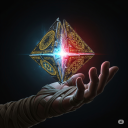
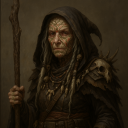

# FO BB Prelude Varda

## **Storyteller** (06/11/2025 23:37:49)  

*1382504127287787582*

***A long time ago in a galaxy far, far away....***
### **STAR WARS**
#### **THE PRICE OF A VISION**

*The **GALACTIC REPUBLIC** has stood for millennia, a beacon of civilization and law. Yet its light barely touches the vast, untamed shadows of the **OUTER RIM**. Here, on the fringes of known space, intrepid pioneers and ambitious traders build new worlds, far from the polished halls of Coruscant.*

*On the remote moon of Cyllene, the independent outpost of **RESPITE** is one such world, a hub of fierce competition and hard-won progress. Its future now hinges on a historic trade accord, an achievement poised to bring newfound stability and wealth to the entire sector, championed by the driven administrator, **LYRA KRYZ**.*

*But this rising tide of fortune has attracted dangerous attention. Unseen by the architects of this new age, the outpost's true fate may rest in the hands of **VARDA NISYREN**, an exile from the savage world of Dathomir. As she seeks peace in her twilight years, the Force continues to haunt her with whispers of what is to come, threatening the quiet life she has fought so hard to build....*

---

## **Storyteller** (06/13/2025 13:19:44)  

*1383073358761168976*

The air in the modest home is thick and comforting, a familiar tapestry woven from the scents of drying herbs and freshly brewed tea. Sunlight, filtered through the thin, dusty atmosphere of Backlash, paints soft rectangles on the worn wooden table where Varda stands. This small, quiet space, nestled in the bustling outpost of Respite, has become a sanctuary—a stark contrast to the wild, ichor-stained crags of Dathomir. Here, there is peace.

The source of that peace, Araden Kryz, sits nearby, his face etched with the easy lines of contentment. He nurses his own mug, his gaze warm as he watches Varda perform her ritualistic preparation of the morning tea. The gentle clinking of ceramic and the whisper of hot water pouring over leaves are the only sounds for a moment.

---

## **Araden Kryz** (06/13/2025 13:19:45)  

*1383073360950329448*

"**She's done it, Varda,**" Araden says, his voice brimming with a father's pride. He strokes his graying beard, a thoughtful, familiar gesture. "**This accord Lyra is signing tomorrow... it's everything. It will secure Respite's future for a generation. All her hard work is finally paying off.**"
He lets out a soft sigh, a small cloud of steam rising from his cup. "**Of course, not everyone is pleased. That Quarren, Grel Korvan, has been making a lot of noise. Spouting off in the public forums about how it's a bad deal for the independent traders.**" Araden waves a dismissive hand. "**It's just business. All talk, that one. A shark who's happier circling than biting.**"
He looks to Varda, his smile genuine and warm. "**But enough of that. What do the leaves tell you this morning, old friend?**" The question hangs in the quiet air, a gentle invitation. The peace of this moment feels deep, yet fragile.

---

## **Varda Nisyren** (06/13/2025 14:03:16)  

*1383084310474788904*

Varda’s lips tilt into a faint smile as she meets Araden’s eyes. **“We always knew she could do it,”** she murmurs. **“Lyra can accomplish anything once she sets her mind to it.”** She pauses to swirl her cup, steam curling between them. **“Stubborn as a rancour, that one. I wonder who she inherits that from.”** A single, time-sharpened brow lifts pointedly in his direction.

The moment lingers. She returns his smile, hers tinged with a flicker of sadness that quickly smooths away. **“As for your question… let us see.”**

She takes a slow sip, letting the warmth seep into her old bones, then draws a measured breath and releases it. Eyes on the settling leaves, she unfurls her presence in the Force like a cat waking from dream-sleep. Her thoughts brush Lyra’s name, her ambitions, the accord to be signed, the fragile future she means to carve. Then she stills everything falling away so that she can listen

---

## **Araden Kryz** (06/13/2025 15:01:55)  

*1383099071560155311*

Araden lets out a warm, genuine laugh that crinkles the corners of his eyes. It is a sound of pure, uncomplicated joy. He takes another sip of his tea, his gaze fond as it rests on his old friend. **"Oh, I have no idea,"** he says, his voice rich with mirth. **"Must be from her mother's side. I was always the reasonable one."**

He settles back into his chair, content to wait, watching with patient respect as Varda's focus turns inward. The playful atmosphere in the small room softens into one of quiet reverence. He knows her rituals and the deep concentration they require.

---

## **Storyteller** (06/13/2025 15:02:59)  

*1383099342511931612*

As Varda's mind touches the currents of the Force, the world around her seems to hold its breath. The gentle aroma of herbs, the warmth of the cup in her hands, the soft light filtering through the window—it all begins to thin, dissolving like smoke. The swirling tea leaves in her cup become a vortex, a dark well pulling her down.

The quiet comfort of the kitchen is violently ripped away.

*Cold stone underfoot. The roar of a distant crowd. The sharp, ozonic scent of public energy shields.*

She sees the main plaza of Respite, bustling with people under the harsh light of Backlash's sun. Lyra is there, standing at a podium, her expression confident, her voice clear as she speaks into a microphone. Pride swells in Varda's chest, a reflection of Araden's own—but it is instantly vaporized by a flash of searing, crimson energy. A sniper's bolt. The image of Lyra falling, a look of shocked surprise on her face, is burned into Varda's mind.

But it is the sound that shatters her. It is not the blaster report or the crowd's scream. It is the sound of Araden's grief, a future echo of a soul-crushing howl that is identical, in its terrible, ragged agony, to the one that escaped her own lips the day she lost Lyrus.

The vision collapses, and Varda is slammed back into her body. The teacup rattles in her suddenly trembling hands, the sound like a thunderclap in the now-silent room. The overwhelming feeling of her friend's future agony and her own past grief leaves her breathless, her heart hammering against her ribs.

---

## **Varda Nisyren** (06/13/2025 16:07:37)  

*1383115607242965012*

Varda’s hand clenches around the cup. The image replays in her mind, again and again. Lyra falling. Araden’s cry of anguish. A future made of blood and echoes. Anxiety rises like a tide, cold and choking. Fear claws at her ribs. Her breath shortens, sharp and quick. The thunder of her heart matches the rhythm of imagined blaster fire. But then like a storm breaking against stone. She closes her eyes. Her fingers slowly unfurl from the cup’s trembling porcelain. One hand rises to her chest. She grounds herself.

She remembers. The one thing she keeps from her time as a Nightsister. The whisper of old blood and deeper truths: The future dances like a flame in a storm. Never still, never certain, but always burning. She holds that truth close, and lets the fear recede, not gone, but silenced and tamed. Her pulse steadies and her breath returns.

She opens her eyes. There is steel behind them now. A glint of purpose. “**Danger stalks the horizon,**” she says quietly. “**A move on the board leaves the queen open. Thunder rumbles and lightning strikes. We must act.**”

She rises, the motion smooth and resolute, strength returned to her spine. She takes up her cane, then pulls on her cloak in a single, practiced sweep. Turning to Araden, her voice carries the weight of all those she carries with her in spirit. “**We must prepare to weather the storm.**”

---

## **Araden Kryz** (06/13/2025 16:48:38)  

*1383125927105531927*

The warm smile vanishes from Araden's face, replaced by a mask of deep concern. He leans forward in his chair as Varda’s hand clenches and her breath hitches, his own tea forgotten. The sudden, violent shift in her demeanor startles him. **"Varda! Are you all right?"** he asks, his voice urgent. **"What is it? What did you see?"**

Her cryptic words hang in the air, and Araden’s expression shifts from concern to confusion. He rises from his chair as she stands, his hand slightly outstretched as if to steady her. **"Wait, slow down,"** he says, trying to catch her intense gaze. **"What queen? Varda, talk to me. What storm are you talking about?"**

---

## **Varda Nisyren** (06/13/2025 17:41:18)  

*1383139183614361610*

She clasps her cloak together with a sharp motion, then stills, her gaze locking onto Araden’s. For a long, silent moment, she says nothing. Her eyes, heavy with emotion, speak where words falter. She reaches out and takes his hand, her grip firm despite its age. “**Your daughter, Araden,**” she says softly, voice trembling with urgency. “**She’s the most powerful piece on the board. The speech, the accord…**”

Her breath catches. The vision replays behind her eyes. “**Danger, Araden. Her life teeters betwixt the edge of a blade, and I—**” her voice breaks, then steels. “**I will not let you share my fate. Not when we still have time to change it.**”

---

## **Araden Kryz** (06/13/2025 18:08:27)  

*1383146013119873134*

Araden’s hand closes around Varda’s, his grip a warm and solid anchor. The playfulness is gone from his face, replaced by a deep, concerned gravity. He sees the steel in her eyes, hears the tremor in her voice, and knows this is no mere fleeting mood. The mention of her fate hangs heavy between them, a shared, unspoken sorrow.

He searches her eyes, trying to translate the esoteric warning into something he can fight, something he can understand. **"An assassination?"** he asks, his voice dropping to a low, serious tone. The word tastes like ash in his mouth. **"You believe someone is going to try and kill Lyra?"**

His mind immediately leaps to the most logical threat, the only one that makes sense in his world of tangible rivalries and political posturing. **"Is this about Grel Korvan?"** he presses, his brow furrowed. **"You truly think he would go this far? That he’s planning more than just speeches and backroom deals?"**

---

## **Varda Nisyren** (06/13/2025 18:48:25)  

*1383156072021364967*

She stands firm now, the tremble gone from her voice only resolve remains. “Someone  will  assassinate Lyra, if we do not intervene. This I saw. This I know.”

Her eyes narrow as memory and certainty align. “It was a sniper. I could not see the angle, only the flash, and the sound spirits, the sound. With all the precautions already in place, it points to a mole. Someone within. But they shoot… and it hits.”

She pauses, mind already spinning, assembling plans and abandoning them in rapid sequence. “The who remains hidden from me,” she admits, frustrated. “Do not leap to Korvan, not yet. It may be a third party. Or someone acting on his behalf, yes. Keep an eye on him. But do not confront. Do not tip our hand. It may be someone we do not see. Any hint of smoke they will see the fire.”

Then her tone changes lower now. Weighted. Anchored by something deeper than logic. “We must not change too much. The more we try to break the pattern, the more it resets. I’ve seen it before threads knot themselves tighter when we yank. We must only act when it matters. When it moves the shape of the whole.”

Her jaw sets. “Keep the speech. Keep the setting. Alter nothing… except what must be changed to make the difference.”

---

## **Araden Kryz** (06/13/2025 19:35:00)  

*1383167797080887416*

Araden listens, his expression hardening with every word. The talk of queens and metaphors is gone, replaced by the cold, hard details of a threat he understands: a sniper, an inside job. He releases her hand and begins to pace the small room, the retired merchant receding to reveal the ghost of the Mandalorian warrior beneath. **"A sniper,"** he says, the words clipped and low. **"And a mole. You're right. With the security measures Lyra has in place, it couldn't be a simple brute force attack. Someone on the inside is helping them."**

He stops pacing and turns to face her, his hands clenched into fists at his sides. The part of her plan he cannot accept, the part that goes against every protective instinct he has, is the inaction. **"But to *alter nothing*? Varda, that's a risk I can't take. Not with Lyra."** His voice is taut with a desperate, suppressed urgency. **"If you are this certain, we have to act now. We warn her, we postpone the ceremony, we move it to a shielded, secure room. We don't just let her walk into a killer's line of sight because of how a vision *might* change."**

---

## **Varda Nisyren** (06/13/2025 20:55:04)  

*1383187945204355242*

Varda nods, her voice low and steady. “***My friend, I understand. Truly, I do. But we must think carefully now.***” She leans forward slightly, both hands resting atop her cane, grounding herself in the moment. “***We know the shape of this future. That gives us power. If we follow its course as it is, we know where it leads and we can use that to tip the balance in our favour.***” Her eyes flicker, with a degree of pleading.

“***But if we make noise now, if we postpone, restructure, or overreact. We scatter the pieces. We don’t know when or how the attack will come next. The future shifts with every breath, Araden. If we change the river’s flow too sharply, I can’t promise I’ll still be able to read the current.***”

She steps forward, laying a hand gently on his shoulder. “***We do not do nothing. However***” she assures him, voice firm. “***Send your most trusted. Have them sweep the buildings. Quietly. Let no one know. We prepare, but we do not make waves.***”

Her gaze holds his. “***The moment is fragile. But if we move with care... we may yet turn the knife before it strikes.***”

---

## **Araden Kryz** (06/13/2025 22:29:44)  

*1383211768448286912*

Araden listens intently, his jaw tight. Varda's explanation—that changing the circumstances will only hide the threat, not eliminate it—is a piece of battlefield logic he can, however reluctantly, understand. Don't spook your enemy until you have them in your sights. He draws a long, slow breath and lets it out, the tension in his shoulders easing, replaced by a grim resolve.

**"To leave her as bait... every instinct I have screams to lock her in a bunker and dare them to try,"** he says, his voice low and heavy with the weight of his fear. He meets her gaze, his own eyes filled with a conflict of love and warrior's pragmatism. **"But I have trusted your sight for many years, Varda. I will trust it now, even when it feels wrong."**

He gives a single, decisive nod, his mind now fixed on a course of action. **"Alright. We do it your way."** He begins moving toward his personal comms unit on a nearby counter. **"I have two men, former recon specialists from my company. They're loyal to the family, not the payroll. I'll tell them to begin a quiet 'structural survey' of the plaza's high-rises, starting immediately. No uniforms, no fuss. They'll know what to look for."**

---

## **Varda Nisyren** (06/13/2025 23:17:57)  

*1383223902783668288*

Varda’s shoulders ease at last, just slightly, as Araden speaks, his trust, steady and unwavering, wraps around her like a balm. Her fingers flex as the last of tension bleeds from her limbs, and though the storm still looms in her mind, a faint smile touches her lips. “**They sound perfect for the job,**” she murmurs, voice soft with approval. “**You’ve always been careful with your choices.**”

She walks with him to the counter, her cane tapping softly against the floor. The scent of tea still lingers faintly in the air, a reminder of peace already gone but not entirely lost. She lays a hand briefly on the edge of the wood, grounding herself. “**I was going to be in the crowd,**” she says after a pause, her voice quieter now, contemplative. “**Just another face, watching from the fringe. I thought it might be better that way unseen, unnoticed.**”

Then her tone shifts. Firmer, certain. “**But… in light of recent circumstances, I’ll see if I can be of more aid than a silent witness. If I can turn the weight I carry into something useful, then I must.**”

She looks toward the window, her gaze rising to the pale sky beyond. Clouds pass like thoughts fleeting and light. “**How long until the speech?**” she asks, the question simple, but heavy with meaning. Time now feels like a predator. Every second a thread tightening.

---

## **Araden Kryz** (06/14/2025 00:08:54)  

*1383236723160383659*

Araden punches a sequence into his comms panel, his movements economical and precise. He looks up from the device, his gaze distant for a moment as he calculates. **"The signing ceremony is scheduled for high noon tomorrow,"** he says, his voice a low, serious rumble. **"That gives us... just under twenty-four standard hours."**

He turns to face her fully, the weight of that timeline settling between them. **"Not much time to find a ghost in a city full of people. But we'll find them."** His eyes meet hers, a flicker of the Mandalorian warrior surfacing from beneath the weary merchant. **"A silent witness is good. An *active* one is better. Whatever you need to turn your sight into a weapon, Varda, you'll have it. You see the 'how,' I'll provide the 'who' and 'what'."**

He runs a hand over his tired face. **"I need to speak with Lyra. I won't tell her about the vision—not yet. I'll frame it as a last-minute security review, a precaution given Korvan's noise. It will be enough to get my men the access they need without causing a panic."** He gestures towards the door. **"She'll be at her office in the administration spire now, finalizing the details. If you want to talk to her, this would be the time. It might be... helpful... for her to hear your concerns directly. Even if she doesn't fully understand them."**

---

## **Varda Nisyren** (06/15/2025 16:09:22)  

*1383840823552114888*

Varda nods, her expression grave, the shared weight between them falling like a drawn curtain, heavy and final. “**Hm. Yes… Aye,**” she says quietly, voice threading between thought and conviction. “**It would be wise for me to speak with Lyra. Not to frighten her, but to steady her. Let her see the shape of the storm without feeling its teeth.**”

She places a hand over her heart, just briefly. “**The walk to her offcie migth offer me some clarity aswell.**”

---

## **Araden Kryz** (06/15/2025 16:39:57)  

*1383848519537791049*

**"Good,"** Araden says, his tone firm with purpose. He nods once, decisively. **"That's good. Your presence will be... a different kind of shield for her. Something my men can't provide."**

He turns back to the comms unit, his fingers poised over the controls. **"I'll make the call now. My men will be in position before the morning is out. I'll meet you at Lyra's office shortly. We'll present a united front."**

He pauses, his hand hovering over the panel, and looks back at Varda. The worry is still there, deep in his eyes, but it's now tempered with focus. **"Be careful, old friend."**

---

## **Storyteller** (06/15/2025 16:39:58)  

*1383848521807036557*

With that, Araden turns his full attention to the comms, his voice dropping into a low, coded murmur as he begins relaying his orders. The air in the small home is now charged with a new energy—the quiet peace of the morning shattered, replaced by the grim hum of a hunt just begun. The path to Lyra's office, and the first steps of Varda's investigation, lie before her.

---

## **Varda Nisyren** (06/15/2025 17:03:38)  

*1383854477756338316*

Varda clasps her cloak at the throat, offering a final nod to Araden. Without a word, she turns and makes her way to the cottage’s narrow doorway. As she steps outside, she draws in a long, steadying breath of cold morning air, filling her lungs, centering her thoughts. The door closes softly behind her.

She begins to walk, not quickly, but with purpose. No rush, no flare. She moves like the tide, patient and inevitable, content to roll in at her own pace.

Along the winding path toward the administration spire, her senses stretch outward. Not overtly, not enough to stir suspicion, just a soft brushing of the air, a gentle probing. She listens to the hum beneath the city’s skin, to the subtle shifting of thought and feeling. Hopes, anxieties and tensions.

She takes the emotional temperature of the streets: the weight of anticipation surrounding tomorrow’s speech. Pride, skepticism, fear. All of it hangs in the air like threads in a loom.

As she walks, her sharp eyes scan the architecture with quiet calculation. She does the math in silence: angles, sightlines, blind spots. Which rooftops would offer cover. Which windows would see the stage. Which vantage points a sniper might choose and which would be obvious traps for someone cleverer.

She weaves through plazas and vendor stalls, slipping into small conversations with the ease of age. No one suspects the old woman of anything more than idle curiosity. Her years are a mask she wears well.

Always listening. Always watching. The tide is coming in.

---

## **Storyteller** (06/15/2025 17:31:15)  

*1383861427764465674*

The walk from Araden’s quiet home to the heart of Respite is a journey from tranquility to simmering tension. The dusty residential paths give way to duracrete walkways crowded with beings of a dozen species—merchants haggling over manifests, laborers hauling grav-skids loaded with cargo, and off-worlders enjoying a morning meal at open-air cantinas. The administration spire, a sleek metal needle against the pale sky, looms ever closer, a testament to Lyra's ambition.

Varda’s subtle probe into the Force reveals a city holding its breath. There is a current of genuine hope, a bright thread of optimism from colonists and small business owners who see Lyra’s accord as a lifeline. But it is tangled with darker threads: the bitter resentment of independent freighters who fear being muscled out, the sharp anxiety of guild representatives uncertain of their future, and a pervasive, low-grade fear of change itself. The accord is a promise, but promises can be broken.

As she passes a stall laden with exotic-smelling fruits, she overhears two grizzled spacers in a heated discussion.

---

## **Human Spacer** (06/15/2025 17:31:15)  

*1383861430213939320*

**"Mark my words, Lyra Kryz is selling us out to the corporate sector. Korvan's right. This deal will kill the independent spirit of this outpost."**

---

## **Rodian Spacer** (06/15/2025 17:31:16)  

*1383861431723757639*

**"Korvan is just trying to protect his own bottom line! This deal brings stability. Stability is good for everyone."**

---

## **Storyteller** (06/15/2025 17:31:20)  

*1383861450375823452*

Varda's gaze lifts from the crowd to the surrounding architecture. Her eyes trace the lines of the buildings that form the plaza around the spire. An old clock tower offers a clear, obvious vantage point—too obvious, her mind whispers. A perfect decoy. Her gaze drifts to the massive, skeletal forms of the automated TC-series cargo cranes that dominate the skyline over the loading docks. They are high, exposed, and offer a hundred different angles. Unstable, perhaps, but an excellent place to hide in plain sight amidst the complex machinery.

Weaving through the final throng of citizens, Varda arrives at the base of the administration spire. Polished metal doors hiss open, revealing a sterile, quiet lobby patrolled by two uniformed security guards. They watch her with professional impassivity as she enters.

---

## **Varda Nisyren** (06/15/2025 18:36:00)  

*1383877725642555433*

Varda steps into the lobby with the soft grace of someone who knows how to take up space without drawing attention. Her cloak, heavy with travel and time, shifts around her like smoke. The steady tap... tap... of her cane echoes softly across the polished floor, not loud, but deliberate, like a metronome marking the ever present clock.

Her eyes scan the room in a single sweep. Decorative banners, clean corners, bored expressions, tight shoulders. She breathes it in. The scent of waiting, of effort, of something about to happen.

She approaches the two guards stationed at the checkpoint, her expression gentle, lips curled in a pleasant smile that has disarmed men twice their rank and three times their age. “**Good day, gentlemen,**” she says, her voice warm as steeped tea, smooth and lined with age. “**Forgive the intrusion. I know things must be quite the whirlwind today.**”

She pauses just long enough to let them adjust to her presence, just an old woman, nothing more. “**I’m here to see Lyra,**” she continues, adjusting the carved cane in her hand with a faint sigh. “**Would one of you be a dear and let her know I’ve come calling? No urgency, of course. Just an old friend come to check in.**”

She offers a patient, weathered smile, the kind that invites trust and lowers guards. All the while, her senses drift outward, feather-light and probing. She brushes gently against their emotions, careful not to leave ripples. She listens not to words, but to feelings.

Does their loyalty run true? Is there unease when Lyra’s name is spoken? Is there affection? Jealousy? Is there guilt? Varda hides her scrutiny behind soft eyes and kind words. But within, the storm watches.

---

## **Security Guard** (06/15/2025 21:43:12)  

*1383924835780133036*

The two guards, clad in the crisp, dark grey uniforms of Respite’s security force, straighten slightly as Varda approaches. They are professionals, their expressions neutral, but her disarming smile and placid demeanor cause their shoulders to relax a fraction.

As her senses brush against them, Varda finds no deceit, no hidden malice. The currents are clear, yet distinct. From the taller guard, the one whose eyes briefly flick over her cane and cloak, she feels a steady, calm professionalism. He is focused, a bit bored, his mind on patrol routes and shift changes. Beneath that, there is only the low hum of alertness—a man paid to be vigilant.

From the second guard, younger and standing ramrod straight, the feeling is different. There is a powerful undercurrent of fierce, almost personal, loyalty. Pride in Lyra, a belief in her vision for Respite. A flash of irritation, sharp and quick, directed at the thought of those who oppose her. This one is not just an employee; he is a true believer. Neither feels like a threat.

---

## **Security Guard** (06/15/2025 21:43:45)  

*1383924972245749861*

The two guards, clad in the crisp, dark grey uniforms of Respite’s security force, straighten slightly as Varda approaches. They are professionals, their expressions neutral, but her disarming smile and placid demeanor cause their shoulders to relax a fraction.

As her senses brush against them, Varda finds no deceit, no hidden malice. The currents are clear, yet distinct. From the taller guard, the one whose eyes briefly flick over her cane and cloak, she feels a steady, calm professionalism. He is focused, a bit bored, his mind on patrol routes and shift changes. Beneath that, there is only the low hum of alertness—a man paid to be vigilant.

From the second guard, younger and standing ramrod straight, the feeling is different. There is a powerful undercurrent of fierce, almost personal, loyalty. Pride in Lyra, a belief in her vision for Respite. A flash of irritation, sharp and quick, directed at the thought of those who oppose her. This one is not just an employee; he is a true believer. Neither feels like a threat.

---

## **Security Guard** (06/15/2025 21:43:46)  

*1383924974741622784*

The taller guard taps his ear-mounted comlink. **"Ma'am. One moment, please."**

His voice is flat and formal. He turns away slightly, his voice dropping. "**Spire command, this is ground floor security. Administrator Kryz has a visitor... an elder woman... yes, she says it's a personal visit. Please advise.**"

He listens for a moment, then turns back to Varda, his expression unchanged.

**"The Administrator's office confirms she will see you. Please proceed to the turbolift at the end of the hall, third door on your left. Her office is on the top floor."**

The younger guard with the fierce loyalty gives her a small, respectful nod as she passes. The way is clear.

---

## **Varda Nisyren** (06/15/2025 22:03:06)  

*1383929841010606081*

Varda offers a gentle smile, dipping her head with a grace born of survival and knowing how to wield her age as both a defence and a weapon. “**Much obliged, gentlemen,**” she says, her voice laced with warmth and just the faintest touch of dry humour. “**Your manners do your mothers proud.**”

Her eyes linger for a moment on the younger guard, the one with fire in his chest and purpose in his spine. She gives him a knowing little look, a smile that says *I see you*, and then she turns, the soft tap of her cane marking her pace as she crosses the polished floor. The hallway ahead is quiet, clean in the way official places often are almost too clean, like the silence is painted on. She steps into the turbolift, the doors sighing shut behind her. Inside, the air hums faintly, sterile and expectant.

She does not fidget. She does not fill the space with idle thoughts. She simply stands, still, steady, eyes closed, hand resting atop her cane like the figurehead of a ship waiting for the tide. Her presence unfurls softly, like mist over water.... just listening. The turbolift chimes softly as it reaches the top floor. The doors whisper open. Varda steps out into the corridor with measured ease, not rushing. The weight of age, real and feigned, slows her, lends her presence gravity.  She arrives before Lyra’s door and lifts a hand.

Three light knocks.

---

## **Storyteller** (06/15/2025 22:27:25)  

*1383935960747610112*

The top floor is a world away from the lobby's public thoroughfare. The corridor is hushed, the air still and cool. The lighting is recessed and soft, reflecting off walls of brushed metal and polished stone. There is only one other door here, unmarked and imposing. Lyra's office door is a simple, elegant pane of dark wood, a touch of organic warmth in the otherwise sterile efficiency of the spire.

A moment after Varda's knock, a voice comes from within, clear and amplified by an internal comm.

---

## **Lyra Kryz** (06/15/2025 22:27:25)  

*1383935962781847735*

**"Come in."**

---

## **Storyteller** (06/15/2025 22:27:26)  

*1383935963860045954*

The door slides open with a silent, magnetic hiss.

The office inside is exactly what one would expect of Lyra Kryz: meticulously organized, modern, and efficient. A large desk of dark, polished wood sits facing the door, its surface occupied by several neatly stacked datapads and a single, elegant holographic projector. The walls are adorned not with art, but with framed architectural plans and economic projection charts for the Respite outpost.

But what dominates the room is the single, massive transparisteel window that makes up the entire far wall. It offers a breathtaking, panoramic view of the main plaza below—the very same plaza from Varda's vision. From this high vantage point, the podium for tomorrow's ceremony is clearly visible, a small, insignificant stage in the grand theatre of the city.

Lyra stands near the window, a datapad in one hand, her back to the door as she surveys the scene below. She doesn't turn immediately, her focus absolute.

---

## **Lyra Kryz** (06/15/2025 22:28:07)  

*1383936138603008151*

**"Father just called. A last-minute 'structural survey' for the high-rises,"** she says, her tone a mixture of fond exasperation and professional diligence. **"He worries too much, but I suppose it doesn't hurt to be thorough."**

She finally turns, a polite, business-like smile on her face as she sees Varda. Her expression softens slightly with genuine affection, though her posture remains that of a busy administrator.

**"Varda. It's good to see you. To what do I owe the pleasure? I hope you're not here to tell me my energy-crystal shipment is going to be late again."** Her tone is teasing, but edged with a sincere curiosity.

---

## **Varda Nisyren** (06/15/2025 22:39:15)  

*1383938940607791228*

Varda chuckles softly at the quip, a dry, knowing sound that carries with it the weight of shared years and fond familiarity. “**Oh, nothing so dire, Lyra dear. Merely come to see a friend,**” she replies, the words smooth as polished stone. “**Surely an old woman is allowed to pop by without it being about cargo delays or conspiracies.**”

Her smile lingers for a breath longer before she turns away, walking with unhurried steps toward the tall office window. The view unfolds before her spires and terraces, the open plaza where tomorrow’s accord will be signed. She stands there, still and silent, both present and distant.

One hand rests lightly on her cane, the other drifts to the glass as if feeling for something beyond the pane. And quietly she lets the Force move through her. Not like lightning or flame, but like the rising tide. Her senses stretch outward, heightened and attuned, every detail sharp, every sound clearer, every movement below marked.

Could it be from here?
Would the shot come from above, or pass through this very space as a decoy? The thought flickers and fades, filed away without alarm only awareness.

She draws in a soft breath and speaks without turning. “**Tell me, Lyra... how are you feeling about tomorrow? Truly.**” She turns then, her gaze gentle but probing.

“**You’ve carried this vision for so long. I imagine seeing it so near... must feel like holding a flame in your hands. Beautiful, but dangerous.**”

---

## **Lyra Kryz** (06/15/2025 23:20:27)  

*1383949308499595458*

Lyra lets out a small, wry chuckle, the sound sharp and clean in the quiet office. She gestures for Varda to make herself comfortable, though she remains standing, a force of restless energy. **"A conspiracy a day keeps the auditors away, Varda. You know how it is."** Her smile is genuine, a brief flash of the young woman beneath the administrator's mantle.

---

## **Storyteller** (06/15/2025 23:20:28)  

*1383949310558863474*

As Varda turns to the window, the city sprawling below, her perception shifts. It is more than just sight. The Force flows through her, and with a clarity that is breathtaking and absolute, she *sees*. Not with her eyes, but with a deeper sense. The clock tower, the obvious choice for a sniper, feels... hollow. A lie made of brick and mortar. Her senses sweep past it, dismissing it entirely.

Her focus is drawn, inexorably, to the skeletal arm of the massive cargo crane looming over the industrial sector adjacent to the plaza. Through the Force, she feels the cold, impersonal hum of its machinery. But there, high up in the operator's cab, she senses a void. A pocket of chilling, singular intent, patiently waiting. It is a cold spot in the warmth of the city's collective emotion, a dissonant note in the symphony of life below. Her physical eyes, guided by this perception, trace the flawless line of sight from that cab directly to the podium where Lyra will stand. She notices the patrol patterns of the security guards below—their paths are efficient, covering all public access points, but they treat the automated loading dock as a no-man's-land, a blind spot in their otherwise meticulous net. The vision's clues snap into place with terrifying certainty. The scent of industrial ozone, the grinding of a crane, the high, unstable perch. It is all there.

---

## **Lyra Kryz** (06/15/2025 23:20:31)  

*1383949324748329080*

When Varda turns and asks her question, Lyra's professional smile tightens just a fraction. She crosses her arms, looking out over the plaza herself, her gaze fixed on the podium. **"Beautiful, but dangerous,"** she repeats softly, thoughtfully. **"That's... an astute way to put it."**

She sighs, a rare moment of vulnerability. **"Truthfully? I'm exhausted. But it's the kind of exhaustion that comes from pushing a boulder to the top of a mountain. Tomorrow... tomorrow I just have to let it go and pray it doesn't roll back over us."** She turns back to Varda, her professional mask sliding back into place. **"But it won't. The projections are solid. The security is tight. Grel Korvan is a blowhard, but he's not a fool. It will be fine."**

Her words are confident, but Varda can feel the thin, brittle layer of stress beneath them, the desperate need for everything to go according to plan.

---

## **Varda Nisyren** (06/15/2025 23:48:27)  

*1383956356037349579*

Varda hums softly, neither agreement nor denial just a sound of understanding as ancient as stone. She walks a slow, thoughtful arc away from the window, her cane clicking softly on the floor as she speaks. "**You remind me of an old tale**" There she begins, her tone quiet and even, like the opening of a ritual. "**One we told on Dathomir, long before the clans split, back when the stars were closer and the land still listened.**"

She glances sidelong at Lyra, eyes half-lidded in memory. "**There was a queen, young and fierce, who rose to lead her people during the long eclipse. She was brilliant, charismatic, and full of fire. A tyrant king ruled the neighboring land, cruel and cunning, a serpent in a crown. The queen knew he would not fight fair, but still, she gathered her warriors and prepared to meet him in the field.**"

Varda's fingers trail absently along the edge of a table, the pace of her words like the slow unfolding of old cloth. "**On the eve of battle, she called her council. Warriors. Strategists. Sorcerers. All told her the same: strike now, strike hard, and win glory.**"

She pauses. "**But one voice stood apart. An old wise-woman, long past her fighting years. She said: ‘my Queen. The stars have sang you're name. The people rise with you. Change is a barrier that they will see is naught. Ride for victory is but a breathe away’**"

Varda lets the silence stretch for a breath, then looks to Lyra fully soft, but steady. "**You’ve done the hard part, Lyra. You’ve brought the mountain to its peak. But now comes the letting go. And in that... we must remmeber all shall  fall into place**"

---

## **Varda Nisyren** (06/15/2025 23:49:17)  

*1383956564821413950*

She turns then ans takes a hand into Lyras "**There’s a saying that grew from that battle,**" Varda says softly, the words falling like old dust across stone. "**When the crow calls and the crone speaks... turn, for the Victor walks behind you.**"

She lets the words linger, her eyes distant. "**It means the tide has shifted. That fate has already made her choice. And if the old signs stir… then you are no longer seeking victory.**"

Her gaze sharpens slightly, the weight of *something*  settling in her tone. "**You’ve already won. Now you must survive it.**"

---

## **Varda Nisyren** (06/15/2025 23:52:01)  

*1383957251626110998*

She laughs then "**But these are just the musings of an old woman too stuck in the past. You go out there and you do us proud**"

---

## **Lyra Kryz** (06/16/2025 00:26:23)  

*1383965899568189562*

Lyra’s hand, so often holding a datapad or gesturing with sharp, clinical precision, is surprisingly warm in Varda's grasp. For a moment, the relentless administrator softens, and she simply listens to the old story, her expression unreadable. The tale of the queen and the crone sinks into the quiet room, a strange and ancient counterpoint to the sleek, modern lines of the office.

When Varda finishes, Lyra lets out a slow breath. A small, tired smile touches her lips. **"You have a story for everything, don't you?"** she says, her voice lacking its usual sharpness, replaced by a quiet, genuine affection. She gives Varda's hand a gentle squeeze.

Lyra's smile becomes more genuine as she considers Varda. **"Never just the musings of an old woman,"** she says softly. **"Your counsel is always valued, even if it is a bit... theatrical."**

**"Survive the victory."** Lyra turns back to the grand window, her gaze sweeping over the plaza below. **"Believe me, I know. Once this accord is signed, the real work begins. Dealing with Korvan's political maneuvering, placating the freight guilds, managing the new trade lanes... that's how you survive a victory. With paperwork and patience."**

She gently withdraws her hand and gestures to one of the comfortable chairs near her desk. **"Please, stay and rest a while if you like. I'm afraid I have a few more data-streams to cross-reference before I can call it a day."** She turns back to her desk, her focus already shifting back to the stacks of datapads and holographic charts. The moment of connection is over, replaced once more by the pressing weight of responsibility. She is grateful for the visit, touched by the concern, but ultimately unshaken in her course. The world of visions and omens is Varda's; the world of logistics and security patrols is hers.

---

## **Varda Nisyren** (06/16/2025 14:26:17)  

*1384177267487412295*

Varda smiles, lines creasing around her eyes as she settles gently into the chair. Her bones sigh with her, and she places her cane beside her with practiced care."**A story for everything,**" she murmurs with a chuckle. "**Well, that’s just what happens when you’ve lived long enough. Life gives you too many stories to keep them all to yourself.**"

She leans back slightly, letting her gaze drift toward the grand window and the city beyond. "**You remind me of myself, in ways. Back when I still thought determination could carry the weight of an entire world.**" Her eyes sparkle with something. fondness, memory, a little grief. "**It takes a special kind of person to hold the center of something so large and not come undone.**"

She looks back to Lyra and smiles again, softer now. "**I won’t keep you long. Just wanted to sit a spell. Breathe the same air as a friend. That’s all.**" She humphs, "**And I'll have you know theatrics come with age. Just wait till your my age.**"

Her fingers lace loosely in her lap, and for a moment, she’s quiet. Content to simply be here. **"You’ve always made me proud, you know,**"she says, as if she might forget to later. "**Whatever tomorrow brings.**"

Then she waves a hand gently toward the datapads, her smile quirking with good humor. "**Go on then, get back to wrangling your numbers and smoothing the universe with paperwork. I’ll be right here, pretending I’m not about to doze off in your chair.**"

She closes her eyes, not in weariness, but in peace. Resting her them till aradan comes knocking.

---

## **Lyra Kryz** (06/16/2025 15:33:12)  

*1384194109593616496*

A genuine smile lights up Lyra's face for a moment, erasing some of the tension. **"I'll look forward to it,"** she says, her tone fond. She gives Varda one last, appreciative nod before her attention is drawn back to the glowing screens on her desk. **"Thank you, Varda. For everything."**

---

## **Storyteller** (06/16/2025 15:33:13)  

*1384194112357535774*

The office falls into a comfortable silence, punctuated only by the soft *tap-tap-tap* of Lyra's fingers on a datapad and the low, almost sub-audible hum of the spire's climate control. Varda sits in the chair, a still point in the turning world, her eyes closed, seemingly at peace. Outside the grand window, the business of Respite continues, the citizens below unaware of the silent storm gathering above them.

About twenty minutes pass in this quiet tableau. Then, a soft chime interrupts the silence.

---

## **Lyra Kryz** (06/16/2025 15:33:13)  

*1384194113280278569*

**"Enter,"** Lyra calls out, her focus still on a complex projection floating above her desk.

---

## **Storyteller** (06/16/2025 15:33:14)  

*1384194114794553355*

The door slides open to reveal Araden. His expression is grim, his usual warmth banked like coals beneath a layer of warrior's focus. He meets Varda's gaze first, giving a slow, almost imperceptible nod. His men are in motion. He then turns his attention to his daughter.

---

## **Araden Kryz** (06/16/2025 15:33:14)  

*1384194115901587538*

**"Lyra,"** he says, his voice steady. **"Just wanted to let you know the survey is underway. I'm on my way to the merchant's guild now, thought I'd stop in. Everything proceeding on schedule?"** His words are mundane, but the look he gives Varda speaks volumes. The pieces are moving. The trap is being set.

---

## **Lyra Kryz** (06/16/2025 15:33:16)  

*1384194123006873682*

Lyra doesn't look up from her datapad, her fingers still tracing lines of data. **"Thank you, Father."** There's a slight pause, just long enough to be deliberate. **"I'm sure your 'structural survey' will find the spire is perfectly sound."**

She finally raises her eyes, a hint of wry amusement softening her professional demeanor. **"I know you worry. But honestly, everything is accounted for. The security team has triple-checked every protocol."** She offers him a small, tired, but reassuring smile. **"It's under control."**

---

## **Varda Nisyren** (06/16/2025 15:58:03)  

*1384200360477851699*

As Lyra works, her fingers gliding across datapads, her voice murmuring quiet notations to herself. Varda sits still, hands resting gently folded in her lap. She lets the sounds of the office fall away, not ignored but softened, like the tide pulling back from the shore. She begins to breathe deeper, slower, letting her awareness slide inward. With the ease of long practice, she opens herself to the Force to listen. To drift in its currents. It welcomes her like an old friend, winding around her bones, through her breath, over her thoughts.

Beneath the spire, the city thrums. She feels the people below like flickers of starlight: a baker checking his ovens, a mother soothing her child, two lovers laughing where no one sees. Hundreds of lives woven into a single rhythm each beat a story, a choice, a weight. Then she feels it: a familiar gravity. Araden. His presence touches the edge of her senses measured, steady, coiled like a spring set with care.

She remains seated, eyes closed, letting her thoughts dip deeper into the current. Into that still place where past and future blend, and questions can be asked with something more than words. And she asks it. *If I am to tell Araden about the spy’s nest… what will become of Lyra?*

---

## **Storyteller** (06/16/2025 16:31:30)  

*1384208780694126774*

As Lyra focuses on her work, Varda sinks into the chair's embrace, her breathing deepening, her physical senses receding. The quiet hum of the office fades, replaced by the grander, silent hum of the Force. She casts her question into the current, a pebble dropped into a still, dark pool: *If I am to tell Araden what I have found... the decoy, the crane... what will become of Lyra?*

The Force answers not in words, but in a cold, clear sequence of feelings and images.

A vision of herself, standing right here in this office, speaking to Araden. She shows him the clock tower decoy, then points a gnarled finger toward the distant crane. She feels his mind latch onto the tangible threat, the warrior's focus eclipsing the patient strategist.

The vision shifts. She sees Araden's two recon specialists, no longer moving with quiet subtlety, but with the grim, efficient purpose of an assault team closing on a target. They move through the loading docks, weapons ready.

Then, a sudden jolt. A flash of chaos from the crane's direction—not the single, clean shot she saw before, but a messy, brief exchange of fire. A shadowy figure scrambles from the operator's cab, impossibly agile, and vanishes into the labyrinthine gantries and rooftops of the industrial sector. The thread is cut.

The final, chilling feeling washes over Varda: the future has become opaque, a murky, tangled knot. The known threat is gone, scattered to the winds, now aware it is being hunted. The path she saw, though dangerous, was clear. Now, it is utterly lost. Lyra is no longer standing on a marked spot on a map; she is wandering in a fog, surrounded by a hunter Varda can no longer see.

The feeling is absolute. Telling Araden the specifics now would be **unfavorable**. It would trade a predictable danger for an unpredictable one.

---

## **Storyteller** (06/16/2025 16:31:36)  

*1384208806438899835*

Varda’s eyes snap open, the sterile air of the office a sudden shock after the psychic chill. The quiet hum returns. She now carries a new weight: the knowledge that the straightest path is a trap.

---

## **Varda Nisyren** (06/16/2025 16:49:12)  

*1384213233606328432*

Varda’s eyes flutter open, the hum of the office returning like a tide rushing in. The air feels sharper now, sterile and thin after the chill of the vision. She takes in a slow breath, grounding herself, letting her fingers curl once more around the worn wood of her cane. The door slides open.

She doesn’t need to look to know it’s Araden, his presence is steady, his energy pressed tight beneath the surface like coiled iron. She turns her head just slightly, her eyes meeting his as he steps inside she masks her face. worry melting away like ice on Tatooine. A small nod. That’s all. Quiet, deliberate. A gesture that says I see you. I understand. But nothing more. No word of the crane. No whisper of the future she has just watched fall apart.

She listens as he speaks to Lyra, and as her reply dances with practiced calm. They are two forces in motion both trying to protect her. One through vigilance. The other through martial power. Varda rises slowly, the motion fluid despite her age. Her cane taps once against the floor, more a punctuation than a sound. “**Well,**” she says softly, rising with a faint groan of effort, her voice warm and unassuming, “**I’ve taken up enough of your afternoon. Time I get moving before the market closes. The mushroom seller near the square always pretends not to recognize me. He claims he doesn’t remember my face, but somehow always sets aside the good ones.**”

She adjusts her shawl, fussing with a fold that needs no fixing. “**And I promised that street cook on the corner I’d try his new broth says it’s better than last week’s, but he said that last week too. Still, kindness deserves curiosity.**”

---

## **Varda Nisyren** (06/16/2025 16:49:22)  

*1384213275025080462*

She pats her cane lightly, like a walking drumbeat, steady and knowing. “**Besides, the light’s turning, and I’ve a mind to start dinner before the stars come out. You know how the flavor shifts if you don’t cut rootleaf just before dusk. Everything needs its proper time.**”

Her smile is vague, fond, drifting like fog, yet her eyes are sharp, watching without watching. “**People think old women just wander, but really, we gather. Threads. Ingredients. Bits of song and silence. And when the pot is full... we see what stews.**”

She gives Lyra a last, tender look pride, affection, and something quietly protective beneath it all. Then she nods once more to Araden.“**Be well, both of you.**”

Another soft nod to Araden. Respect, reassurance, a reminder. Then she turns toward the door, her steps unhurried, cloak trailing behind her like mist curling around the ankles of something ancient and unseen. As she walks she mumbles to herself with a smile on her face and humour in her voice. "**Too theatrical. My word. Can a woman not have her fun?**"

She laughs a last time and walks to open the door. As she reaches it, Varda pauses and looks back over her shoulder, her expression full of quiet affection. “**Don’t forget to eat something proper, dear,**” she says to Lyra with a small wag of her finger. “**And you-**” her eyes flick to Araden, “**try not to pace a trench into the floor.**”

Her smile creases deep, a thing made of sun-warmed stone and old laughter. “**Stars willing, I’ll see you both tomorrow—with all your limbs and tempers intact.**”

---

## **Lyra Kryz** (06/16/2025 17:04:02)  

*1384216965425397935*

Lyra looks up from her datapad, a weary but genuine smile touching her lips at Varda's grandmotherly fussing. The talk of mushrooms and broth is a familiar, comforting tune. **"I'll try,"** she says, the words a fond promise. **"And you behave yourself with that mushroom seller. I think he secretly enjoys the haggling."** The smile she gives Varda is genuine, a small island of warmth in her sea of data. She catches the theatricality comment and lets out a soft, amused laugh, shaking her head as she turns back to her work.

---

## **Araden Kryz** (06/16/2025 17:04:02)  

*1384216968281723021*

Araden says nothing, but his eyes follow Varda's every move. He catches the subtle look, the final nod, and gives one of his own in return—a fractional, barely perceptible motion that says *Understood. The plan holds.* The corner of his mouth quirks into a tight, grim smile at her parting jab about the floor. He remains standing, a silent, tense statue, watching until the door closes.

---

## **Storyteller** (06/16/2025 17:04:03)  

*1384216969682620527*

The office door hisses shut behind Varda, sealing her away from the two people she is trying to protect. The silence of the turbolift is a stark contrast to the emotional currents of the room she just left. It descends smoothly, a cage of brushed metal carrying her down from the spire's peak.

She steps out into the lobby. The two guards are still at their posts, but they spare her only a passing glance, dismissing her as the administrator's harmlessly eccentric friend. The main doors slide open, and the vibrant, chaotic sounds of the Respite plaza rush in to greet her.

The sun is lower now, casting long shadows that stretch like grasping fingers across the duracrete. The air is cooler, filled with the smells of sizzling street food and the murmur of a hundred conversations. The weight of her vision and the chill of her subsequent realization settle upon her. She is alone with this knowledge. The clock is ticking, and the path forward is one she must walk herself. The hunt, truly, has begun.

---

## **Varda Nisyren** (06/16/2025 17:31:43)  

*1384223933133230141*

Walking into the open air, Varda begins her first move on the board. The plaza unfolds before her like a living game people drifting across it in lines and patterns, each unaware of their place in the larger design. The smells of food, the clatter of boots, the quiet hum of distant repulsors it’s all noise. Beautiful, useful noise. She doesn’t rush. She moves like weather. Her eyes scan not for targets, but for opportunity. A crack in the pattern. A seam in the cloth. She scans her eyes for a disguise. something she can haggle for. Perhaps to trade with. A dustier cloak. something to hide behind a guise to begin the hunt.

---

## **Storyteller** (06/16/2025 17:35:46)  

*1384224954312298496*

Varda's gaze settles on a small, cluttered stall tucked between a steaming noodle stand and a dealer of second-hand droid parts. The stall is run by a weathered Twi'lek woman with faded green skin, her lekku wrapped loosely around her shoulders. She's selling an assortment of cast-off clothing and worn textiles—items meant for spacers and laborers who need function over fashion.

Hanging on a hook at the back of the stall is a heavy, dust-colored traveler's cloak. It's patched in several places, frayed at the hem, and carries the faint, dusty scent of a dozen different worlds. It's the perfect disguise: humble, common, and utterly forgettable. It would allow Varda to blend into the background, to become just another face in the crowd, her current, more distinctive cloak exchanged for anonymity. The Twi'lek merchant watches her approach, her dark eyes sharp and appraising.

---

## **Varda Nisyren** (06/16/2025 17:48:21)  

*1384228121309610165*

Varda approaches the stall with measured steps, leaning just a bit heavier on her cane. Her shoulders hunch ever so slightly, and her breath comes with the faintest rasp as if the walk from the spire to this little corner of the plaza has taxed her more than she’d like to admit. Her eyes, though still sharp beneath the hood, blink a touch slower. She lets the scent of sizzling noodles waft around her like a shield.

She stops before the stall and gives a small, polite cough. "**Oh my,**" she says softly, voice cracked at the edges like old porcelain. "**They’ve gone and moved the street layout again, haven’t they? I swear, every time I come down here, it’s all turned about.**"

She squints up at the merchant, offering a faint smile that crinkles all the right lines. "**I don’t mean to bother you, love, but I was wondering if that cloak there, yes, that one, might be looking for a new home. I’ve got a long walk ahead and these old bones don’t take kindly to city wind.**"

She reaches into a hidden fold of her sleeve, withdrawing a small pouch of credits with fingers that tremble just enough to look honest. "**Now, I know I don’t have the flashiest creds in the sector, but this little purse here’s honest coin. And that cloak... well, it’s got the look of something that’s seen stories, hasn’t it?**"

Her fingers brush over the edge of the tablecloth, as if steadying herself. Her smile widens, innocent, toothy, grandmotherly. "**No rush, of course. Just thought I’d ask before it gets snapped up by someone flashier than me.**" She pauses, eyes drifting toward the cloak with something like longing.

---

## **Storyteller** (06/16/2025 18:14:05)  

*1384234594471121019*

The Twi'lek woman watches Varda's performance with an unreadable expression. Her gaze flicks from Varda's face to the credit pouch, then to the cloak Varda indicated. A shrewd, calculating look crosses her features. This is business, after all.

---

## **Twi'lek Merchant** (06/16/2025 18:14:05)  

*1384234597386027182*

**"The city changes, but the wind is always cold,"** she says, her voice a low, raspy purr. **"You have a good eye, grandmother. This one has seen the sands of Tatooine and the acid rains of Felucia. It has character."**

She unties the cloak from its hook and holds it up, letting the dusty fabric unfurl. It's clear the cloak is sturdy, well-made beneath the patches and wear.

**"Honest coin is always welcome here,"** she continues, her gaze settling back on Varda's pouch. **"But character has a price. For a cloak with so many stories... forty credits should add another one to its history."**

She drapes the cloak over a nearby crate, letting Varda inspect it more closely. The price is fair for its quality, but perhaps a touch high for its appearance—a subtle test of the old woman's sincerity or desperation.

---

## **Varda Nisyren** (06/16/2025 18:24:55)  

*1384237322131869942*

Varda steps a little closer to the crate, fingers brushing the edge of the cloak with reverence, like one might touch an old book or the bark of a tree that remembers. She nods slowly at the Twi’lek’s words. "**Oh, Felucia, you say?**" she breathes. "**I’ve not heard that name spoken in years. My cousin swore the rain there could melt the silver from your hair.**"

She chuckles softly, letting her fingers linger on a stitch along the hem mended with care, done by hand. Not just old… well-loved. Then she straightens just a touch not enough to break the act, but enough to let her presence shift. A subtle current in the air. Not threatening. Just… aware. "**Character does fetch a price, that it does,**" she says gently, "**but there’s a difference between selling a story… and asking a poor old woman to fund a sequel.**"

Her tone is light, teasing, kind. No edge. Just the soft rebuke of someone who’s bartered too many mornings to count. "**I’ll give you thirty**" she adds, lifting the coin pouch with both hands like it’s heavier than it is. "**Enough to be fair, not enough to insult. And if it helps…**" her eyes crinkle with a conspiratorial glint, "**...I’ll promise to wear it somewhere interesting.**"

She sets the pouch down without drama, her gaze never leaving the merchant’s face. "**Let it go to someone who’ll add a chapter worth telling, hmm?**"

---

## **Storyteller** (06/16/2025 18:46:02)  

*1384242636705104024*

The Twi'lek merchant lets out a slow, deliberate sigh, a theatrical gesture that speaks of a hundred similar transactions on a hundred different days. She looks from Varda's gently offered pouch to her wizened, smiling face, and for a moment, a flicker of genuine amusement dances in her dark eyes. She picks up the pouch, weighing it in her palm.

---

## **Twi'lek Merchant** (06/16/2025 18:46:03)  

*1384242638751924244*

**"Hmph. You drive a hard bargain for a woman with tired bones,"** she says, the words a low rumble but lacking any real heat. **"Thirty credits... and a story to tell."**

She lets the pause hang in the air for a dramatic second before a wry grin spreads across her face. **"Alright, grandmother. You have a deal. It's not every day I get to outfit a legend in the making."**

She pushes the heavy cloak across the crate toward Varda and sweeps the thirty credits into a hidden pocket of her tunic. The transaction is complete.

---

## **Varda Nisyren** (06/16/2025 18:52:16)  

*1384244205198508142*

Varda chuckles softly, a low sound like wind curling through old rafters. She takes the cloak from the Twi’lek with both hands. "**Well now,**"  she says, slipping it over her shoulders and fastening the clasp with surprisingly nimble fingers. "**A fair price and a story traded. I’ll consider that a blessing on the day.**"

She tilts her head, giving the merchant a look full of wry amusement. "**Though if I do end up a legend, I expect you to raise the price on anything I ever so much as looked at.**"

Her smile lingers just a moment longer, then fades as she pulls the hood up, casting her face in partial shadow. She taps her cane once against the ground, lightly, and turns without fanfare.

No farewell. Just the quiet shifting of a cloak vanishing into the crowd. She moves like smoke slow, soft-footed, disappearing into the ebb and flow of foot traffic, weaving through the alley between the noodle stall and the droid vendor. The dust-colored fabric blends perfectly with the industrial haze. Each step draws her closer to the building site, and already her eyes are scanning. watching angles, counting guards, measuring movement. she covertly looks to the crane measuring the height looking for getaways all under the guise of a haggard beggar.

---

## **Storyteller** (06/16/2025 19:08:38)  

*1384248325884215510*

The dusty cloak settles over Varda's shoulders like a second skin, transforming her instantly. The shrewd, mystical crone vanishes, replaced by a stooped, anonymous figure, one of a thousand faces that drift through the arteries of Respite every day. The Twi'lek merchant watches her go with a knowing smirk, then turns her attention to the next potential customer, the brief interaction already a fading memory.

Varda moves with a newfound purpose, her gait now a slow, shuffling wander that draws no attention. The path towards the loading docks is a descent, both literal and metaphorical. The polished walkways of the central plaza give way to cracked and stained duracrete. The air grows heavier, thick with the smell of industrial lubricants, ozone from discharging power converters, and the metallic tang of cut durasteel.

The area is a symphony of automated labor. Massive cargo lifters drift through the air, their repulsorlifts whining. Droids, scarred and grimy, direct automated freight skids. A handful of organic supervisors in hard hats and stained coveralls oversee the organized chaos from shielded platforms. Security is present but different here—less about crowd control and more about preventing theft. Guards patrol the perimeter, their focus on the valuable cargo containers, not the occasional vagrant wandering through.

---

## **Storyteller** (06/16/2025 19:08:47)  

*1384248360189427943*

Varda’s eyes, hidden in the shadow of her hood, absorb every detail of her target. The TC-series cargo crane is a behemoth of rusting, skeletal metal, easily a hundred meters tall. It squats at the edge of the docks, its long arm currently motionless, looming over the adjacent plaza like a silent, metal predator. Its base is a mess of thick power conduits and maintenance hatches. A precarious-looking service ladder snakes its way up the main support pillar, disappearing into the complex machinery far above.

As she shuffles along the edge of the docks, feigning interest in discarded scrap, she sees it. A small, innocuous maintenance access panel near the base of the crane has been left slightly ajar, a dark sliver in the rusty plating. It’s a detail ninety-nine percent of passersby would ignore. To Varda, it is a glaring invitation. An unlocked door where there should be a bolt. This is the way in.

---

## **Varda Nisyren** (06/16/2025 19:21:34)  

*1384251579821064325*

Varda does not move for the crane immediately. Instead, she lets her shuffle carry her further down the docks, a wayward elder lost in thought—or so she appears. Her true focus is sweeping the terrain, eyes half-lidded but mind sharp, senses reaching beyond sight. She lets the rhythm of her steps mirror the droid patrols, her presence slipping through the cracks of routine.

She instead looks for abondoned buildings. *Perhaps a place for her to get a slight height advantage.* A building so she can start her ascent further up.

---

## **Storyteller** (06/16/2025 20:07:16)  

*1384263077406441545*

Varda's wandering gaze surveys the architecture of the industrial sector. Most of the buildings are active warehouses or humming power substations, swarming with droids and workers. But her keen eyes spot what she's looking for: a dilapidated, multi-story permacrete structure a short distance from the crane's base. It was likely a former harbormaster's office or a crew barracks from an earlier, less automated era of the outpost's history.

The windows are dark and grimy, many of them cracked. A faded sign hangs askew over the main entrance, its Aurebesh lettering worn away by years of sun and corrosive rain. A temporary security fence, more of a suggestion than a true barrier, has been erected around it, but a section near the back, shrouded in shadow by a stack of forgotten cargo containers, has been bent and pulled aside.

From the outside, she can see that the building's flat roof, while not as high as the crane itself, would offer an excellent, secluded vantage point to observe the crane's access ladder and the surrounding area. It provides a perfect staging ground, a place to wait and watch, far from the prying eyes of the dock patrols.

---

## **Varda Nisyren** (06/16/2025 20:13:18)  

*1384264598680633405*

Varda moves like mist through the maze of stacked crates and forgotten machinery, the patched cloak gathering the dusk around her shoulders. The bent section of the security fence parts with a low groan of protest, rust flaking under her fingers as she slips through into the forgotten past. The permacrete building looms before her, its crumbling facade peeling like old bark. A broken keypad dangles beside the entry door, long since gutted of wires. She gives the door a gentle push. it creaks open, revealing a dim, dust-choked interior that smells of mildew, oil, and long-dried blood.

She pauses just inside the threshold. Closing her eyes, she exhales slowly and lets go. Her Force presence, usually coiled in quiet reserve, begins to unfurl. Not violently, not with purpose, but like the low tide returning to forgotten caves. It rolls forward seeping through the cracked floors, rising up the old stairwells, brushing against peeling walls and shattered windows. She is not a blinding light in the Force, nor a shadow. She is grey mist, curling into corners, brushing across thresholds. A silent whisper that listens for echoes. it searches and hunts for life. For any soul to be hidden in the depths of the permacrete structure

---

## **Storyteller** (06/16/2025 21:36:12)  

*1384285458246140036*

The air inside is thick and stagnant, heavy with the ghosts of past industry. Dust motes dance in the slivers of light piercing the grimy windows. Varda’s Force sense flows into the space, a silent, searching tide. It finds nothing living. No squatters in the corners, no vermin scuttling in the walls. The ground floor is a hollow shell, filled only with debris—overturned desks, shattered datapads, and the faint, coppery tang of old, dried blood near a collapsed section of wall, an echo of some long-forgotten violence.

The building is still. Dead. Her senses find no immediate threat, no one hiding in ambush on this level. The structure feels inert, a quiet tomb waiting for its final collapse. The path to the upper floors, via a crumbling durasteel staircase in the center of the main room, is clear.

---

## **Varda Nisyren** (06/16/2025 21:47:35)  

*1384288325279416503*

The old permacrete groans faintly beneath her feet as Varda steps deeper into the hushed ruin, her cloak trailing behind like the edge of an old stormcloud. Dust stirs in her wake, small motes dancing in the dim shafts of fading light that pierce through fractured windows.

She crosses the worn lobby, past overturned chairs and a long-dead terminal half-submerged in grime. The shadows stretch taller here, thick with silence. Each step is deliberate. Measured. The hum of the city seems far away now muted beneath layers of forgotten concrete.

At the base of the stairwell, she pauses. The bannister stands crooked but solid, its paint blistered and peeling like old skin. Varda lays her hand upon it, fingers gnarled but sure, pressing down just enough to test its strength.

---

## **Storyteller** (06/16/2025 22:16:30)  

*1384295601247883385*

As Varda puts her weight on the bannister, there is a sharp, sickening crack. The rusted metal, eaten away by years of moisture and neglect, shatters under her hand like brittle clay. A three-foot section of the railing gives way completely, groaning as it twists and then clatters down the first few steps with a loud, echoing clang that reverberates through the silent ruin.

Dust and flakes of rust puff into the air. Varda, accustomed to relying on the Force more than her physical surroundings, instinctively shifts her weight to her cane, steadying herself before she can lose her balance. The sound of the falling metal seems unnaturally loud in the oppressive quiet, a stark announcement of her presence.

The staircase itself, made of reinforced permacrete, seems intact, but the bannister is now a jagged, unreliable remnant. The path upward is clear, but treacherous.

---

## **Varda Nisyren** (06/16/2025 22:22:32)  

*1384297121124978689*

Varda stills, one hand clutched around her cane, the other hovering slightly where the bannister once was, her fingers splayed as if feeling for echoes in the air. The crash of twisted metal fades, replaced once again by silence but it is a changed silence now. Less forgiving. Less still. She waits a moment then another feeling for a hint of change. In her head pleading and wishing all those who heard that thinking it's merely a stray womprat.

She lowers her hand slowly. "Well," she murmurs, voice a dry whisper to the dust, "so much for subtle."

Her eyes, sharp beneath the hood of her cloak, scan the stairwell, measuring the tilt of shadows and the breath of the Force. She exhales slowly, grounding herself. A grandmother’s breath, but shaped by decades of honed instinct and deeper knowing.

Then, planting her cane with the lightest of taps, she begins to climb. One step. Then another.

Without the railing, her balance must come from within from the quiet strength of old bones and the steadiness of the Force. She begins the ascent with the most feather light of touches.

---

## **Storyteller** (06/16/2025 22:45:08)  

*1384302809591316561*

The ruin does not respond to the clang of falling metal. No shouts, no stirring from the shadows. Only silence rushes back in to fill the void, heavier than before.

Varda’s ascent is slow and deliberate, a testament to discipline over physical frailty. Her cane finds purchase on the gritty steps, her free hand occasionally brushing the crumbling wall for balance. The Force is a quiet, steadying presence around her, a second sense that anticipates the shift of a loose piece of permacrete.

She reaches the second-floor landing. This level is a skeleton of what it once was. The large, open room is dotted with the ghostly outlines of where bunks once stood. A few rusted lockers gape open like silent mouths, their contents long since looted or rotted away. The air is thick with the scent of decay. In the far corner, another durasteel staircase, this one narrower and steeper, continues its climb into the gloom above. The short climb has already left a faint burn in her ancient muscles, a stark reminder of her body's limitations.

Pressing on, Varda tackles the next set of stairs. The steps are shallower, forcing a more rapid, tiring cadence. Her breathing grows more pronounced, a rhythmic counterpoint to the tap of her cane. Each landing is a brief, welcome respite before the climb begins anew.

---

## **Storyteller** (06/16/2025 22:45:27)  

*1384302888263618662*

The third floor was clearly an administrative level. Broken terminals and shattered datapads litter the floor around the husks of desks. A large section of the floor has collapsed, revealing the skeletal rebar and the dark drop to the level below. She navigates the edge carefully, her cane probing the uncertain floorboards before she commits her weight. Through a large, cracked window, she can see the plaza more clearly now, the people below like scurrying insects. The sight steels her resolve.

The final flight of stairs to the fourth floor is the most arduous. It is little more than a steep, narrow maintenance ladder. The climb is a grueling vertical pull. Her arms ache, her lungs burn, and the temptation to simply stop, to rest, is immense. She closes her eyes for a moment, drawing not on her physical strength, but on sheer, indomitable will, fueled by the memory of Araden’s future grief. One rung at a time.

She emerges onto the fourth floor, a small, cramped maintenance nexus filled with conduit piping and humming, derelict machinery. It's hotter here, the air tasting of ozone and dust. And there, in the center of the ceiling, is her goal: a heavy, rust-streaked durasteel hatch with a simple, manual locking wheel. The way to the roof. She has arrived, breathless and weary, but she is here.

---

## **Varda Nisyren** (06/16/2025 23:02:26)  

*1384307162251006023*

The climb behind her, Varda stands for a heartbeat longer beneath the rust-streaked hatch, one hand braced on the wall, the other clenched around her cane. The mechanical hum of derelict systems buzzes softly in the air, like old ghosts whispering in their sleep.

With slow, deliberate motion, she moves to the far corner of the cramped fourth floor, where a stretch of grated floor offers just enough space to sit without leaning against a sparking conduit. She shrugs the dust-colored cloak from her shoulders, folding it once, twice, and then spreads it out on the ground with a practiced grac turning frayed edges and patched seams into a tapestry of purpose.

Lowering herself onto it is not easy. Her knees protest, her breath still ragged from the climb, but she does not rush. Varda eases down cross-legged, placing her cane gently across her lap, like a talisman rather than a tool. She closes her eyes. She merely breathes for a moment. Catching her breathe. Calming her beating heart. The thrill of a mystery of purpose has spured her on. But she must remmeber she is no longer what she was. She must adapt to what age throws at her. 

Then comfortable and content she sinks into the sea of emotion. The Force greets her not with grandeur, but with quiet welcome. A slow tide rising through the marrow of her bones. Her breathing steadies. Her mind uncoils.

---

## **Varda Nisyren** (06/16/2025 23:02:31)  

*1384307183663186126*

She sinks deeper. The groaning metal of the outpost fades. The ache in her joints falls away. She stretches her senses outward up through the ceiling hatch, to the whispering winds that stir around the crane’s arm; down through the floors beneath her, into the stone and steel bones of Respite itself; and outward, to the plaza, to the people, to Lyra.

She does not ask questions. Not yet. For now, she listens. She watches. She becomes still. A thread of the tapestry. A crone at the center of a loom not yet woven. She sits here In the now to meditate. To let time pass by her like water in a stream or sand through a valley. She sits. She breathes. She merely is.

---

## **Storyteller** (06/16/2025 23:29:01)  

*1384313849552961538*

The dusty maintenance level becomes Varda's temporary sanctum. The low, erratic hum of dying machinery is a dissonant mantra, the scent of ozone and decay a strange incense. As she sinks into her meditation, the physical world recedes, the protests of her weary body silenced by the profound stillness of the Force. The minutes stretch, unmarked by anything save the slow creep of shadows as the sun continues its descent across Backlash's sky.

From her perch in the Force, she feels the city's pulse. She senses Araden's two specialists moving through the plaza below, their movements efficient, their thoughts focused and professional. They begin their "survey" with the clock tower, the obvious decoy, their presence a small, contained ripple of activity. Varda observes it dispassionately, a single thread in the vast, complex weave.

She feels the subtle shift as the day's primary work shifts end. The rhythmic clang and grind of the loading docks below lessens. The flow of workers in the plaza changes direction, a great tide turning towards home and evening sustenance. The energy of the city begins to soften, fraying at the edges as exhaustion and anticipation for the coming night take hold.

Time flows. One hour passes, then two. The light filtering through the grime-caked windows of the derelict building shifts from the stark white of afternoon to the warm, orange glow of evening.

Then, a new ripple.

It is a feeling sharp, cold, and utterly focused, a stark contrast to the diffuse emotions of the surrounding city. Through the Force, Varda senses a presence arriving in the industrial sector below. It moves with a practiced economy of motion, a predator entering its hunting ground. It is the cold spot from her vision. The assassin has come to prepare the nest.

---

## **Varda Nisyren** (06/16/2025 23:52:39)  

*1384319797009055864*

The presence settles below like frost silent, weightless, but inevitable. Varda feels it through the Force not as a shape, but as a void. A stillness wrapped in lethal intent. It is not rage, nor desperation. It is focus. Cold, crystalline, precise.

She does not move at first. Or at all. Instead, she lets her awareness stretch, a delicate, gossamer weave unfurling across the rooftops and gantries, touching faint metal echoes and warm-blooded footfalls. The assassin is methodical. She traces the tension in their body, the fluidity of their motion, the brief moments of stillness as they scan their surroundings. There is no fumbling. No hesitation. They are rehearsing. They are sure.

The warmth of her cloak still pools around her, a sheltering cocoon of shadow and threadbare cloth. Her cane rests across her lap like a ritual staff. She draws a slow breath through her nose. "**One shot,**" she murmurs the faintist whosper barely a breathe, the words almost weightless in the thick, dusty air. "**One strand of silk pulled from the web... and the spider stumbles.**"

*This need not be a duel. She thinks no she will wait and she will move when the moment is right. When the proverbial planeta alighn. It need not be a storm of blasters or the clash of blades. All it requires is disruption.*

A delayed footstep. A glint of light in the scope. A speeder engine igniting in the distance. A speck of dust stirred at the wrong moment. A force user with lore never seen. *She grins. She knows what she must do to pluck the thread.*

The variables are many, but her intent is singular. She settles again lighter listening now. Tracing and tracking. Letting intent flow over her. She waits. What is but a few hours compared to tens of decades.

---

## **Storyteller** (06/17/2025 00:29:19)  

*1384329026306572402*

The sun bleeds across the horizon, painting the clouds above Respite in hues of fiery orange and deep violet before surrendering to the encroaching darkness. Below, the plaza comes alive with a second life as holographic advertisements flicker into existence and the glow of cantina signs casts pools of colored light onto the walkways. The sounds of the day shift to the rhythms of the night—the thrum of speeders, distant music, the murmur of evening crowds.

From Varda's perch, the world is a beautiful, distant light show. But inside the derelict building, the coming of night brings a different reality. The temperature plummets. A chill wind snakes through the shattered windows, carrying with it the cold breath of the industrial sector. The permacrete floor leeches the warmth from her body, and the hard, unyielding surface offers no comfort. Her old bones begin to ache, a dull, persistent protest against the long hours of stillness. Hunger gnaws at her, a reminder of the tea and pleasantries of a lifetime ago. The greatest enemy in this first phase of her watch is not the assassin below, but her own mortal frailty. The desire to sleep, to curl up and escape the cold, is a siren's call.

---

## **Storyteller** (06/17/2025 00:49:12)  

*1384334030832668732*

The cold is a physical thing, a creature with biting teeth that sinks into Varda’s joints. The hard permacrete offers no mercy, and despite her resolve, her body rebels. A deep, persistent ache spreads through her back and hips, a dull throb that makes it difficult to focus. A tremor begins in her hands, not from fear, but from the simple, undeniable strain of forcing an ancient body to endure what a younger one would protest. Hunger twists in her stomach, a hollow ache that weakens her concentration.
The desire for sleep is immense, a crushing weight on her eyelids. She fights it, but her focus frays. The connection to the Force, her window into the assassin's preparations, grows thin and indistinct, like a distant signal lost in static. She is forced to pull back, to abandon her deeper watch and conserve what little energy she has just to remain awake and aware in the biting cold of the long night.

---

## **Varda Nisyren** (06/17/2025 00:57:32)  

*1384336125681995866*

Varda trembles in the darkened room, her breath shallow, her body curled tightly beneath the threadbare cloak that now carries the scent of rust and old oil. The city beyond hums with life constant, indifferent. It seeps through the cracks of the derelict structure in waves: the distant thrum of speeders, the murmur of dockworkers heading home, the mechanical coughs of aging repulsors. To most it would be white noise, the lullaby of urban fatigue. But to her, it is a warning.

She feels it like a pulse beneath her skin a rhythmic pressure that seeks to pull her under. The weight of her body is heavy, leaden with exhaustion. Her limbs ache from the climb, her muscles humming with fatigue, and the chill of the upper air clings to her bones like damp cloth. Her hunger gnaws at her with slow, patient teeth. And sleep, seductive and treacherous, curls its fingers at the edge of her consciousness.

But she knows better.

If she surrenders now if her eyes close for more than a heartbeat the consequences could be catastrophic. The assassin below would go unseen, their preparations uninterrupted. Araden’s men would watch shadows. Lyra would step onto that stage without a tether, unaware of the thread straining above her head.

Varda exhales through her nose, slow and steady. No. Not yet.

She reverts to what she knows best: control. Not the rigid kind born of fear, but the quiet kind, forged through decades of discipline. A lifetime of watching and waiting.

She draws the cloak tighter and closes her eyes not in surrender, but in intent. She slows her breath. Calms her racing heart. Eases her thoughts into rhythm with the Force, letting it cradle her mind like a tide pool between crashing waves. Not sleep. Never fully. But a trance. A threshold state. Half the time of true rest, yet still enough to sharpen her edges.

---

## **Varda Nisyren** (06/17/2025 00:57:37)  

*1384336149782466653*

"**Better to wake clear-eyed with half my strength than dull with all of it,**" she murmurs, her voice barely audible, lost in the groan of the settling structure.

The Force weaves gently around her as she slips into the trance, holding her in a fragile, luminous stillness. Outside, the city moves on. But here, in the quiet heart of the ruin, Varda watches, neither asleep nor awake, but poised on the daggers edge

---

## **Storyteller** (06/17/2025 12:09:01)  

*1384505112797511686*

The Force answers her call. The shivering cold in her bones recedes, replaced by a gentle, internal warmth. The gnawing hunger and the crushing fatigue are not gone, but held at bay, pushed back by a tide of pure, focused will. Her trance is a deep well of stillness in the heart of the noisy, sleeping city. For hours, she remains this way, a statue cloaked in shadow, her mind sharp and clear while her body rests.

Slowly, the black of night softens to a deep indigo, then to a bruised purple. The first hints of dawn creep over the horizon, casting the metallic skeletons of the cargo cranes in stark silhouette. The sounds of the city begin to change again. The low hum of street cleaners, the distant rumble of the morning's first transports, the chime of a new work shift beginning.

Varda emerges from her trance not rested, but *ready*. The physical exhaustion is still a heavy weight upon her, but her mind is lucid, her focus absolute. From her fourth-floor vantage point, the world below awakens. She can see Araden's two specialists, moving with purpose now in the morning light, beginning their sweep of the clock tower, their attention precisely where she needs it to be.

Far across the docks, on the arm of the giant crane, she sees a flicker of movement. A dark shape, barely visible against the complex machinery, makes a final adjustment to its hidden nest. The assassin is in position. The final hours of the vigil have begun.

---

## **Varda Nisyren** (06/17/2025 14:03:06)  

*1384533820220506165*

Varda comes to slowly, like the thawing of snow beneath a pale sun. At first, there is only breath steady, deliberate, misting faintly in the chill air of the ruined room. Then the sensation of her fingers flexing, her legs stirring beneath the weight of age and waiting. She blinks once, twice, and the world returns: the groaning pipes, the skeletal machinery, the vast, waiting silence.

She shifts her weight and rises. The motion is deliberate, dignified a reclamation, not a struggle. Her cane presses into the ground with a quiet thock, a punctuation mark to her awakening. And then… she hums.

Low and resonant, the sound trembles in her chest and blooms outward. A chant older than the durasteel beneath her feet a chant of her past. The words that follow are quiet, almost whispered, but the cadence holds power:

"When sky was ash and blood ran clear,
The crows did cry, the end drew near.
But hands were raised, and threads were spun,
By those who danced, not those who run."

She circles slowly in the cramped space, her cane moving in measured patterns, now less a support more an  extension of her. With each gesture of her free hand, the Force moves like smoke: a ripple, a pulse, a soft current answering an old rhythm.

“They danced in storms with bones for drums,
With fire in breath and silence on tongues.
Their eyes held night, their steps held fate,
They walked alone, but bore the gate.”

Her limbs flow with surprising grace each step a memory of Dathomir’s moons, each turn a tracing of invisible sigils. She weaves through the ancient forms, not for war, but for grounding. For readiness. Each movement settles her, attunes her. The vibrations of her chant resonate gently through the Force, like ripples across a still pond, brushing faintly against the edges of fate.

---

## **Varda Nisyren** (06/17/2025 14:03:08)  

*1384533830211473453*

Hunger pushes her forward. Not the gnawing pain of need, but the disciplined ache of choice. A fast induced not by lack, but by will,  a stillness carved in isolation, a silence drawn like a circle around the soul. She has eaten nothing since yesterday’s sun first rose, and yet she does not stumble. The emptiness sharpens her senses, pares away indulgence. It is a blade she has wielded before.

She moves through the ancient gestures with quiet purpose, the chant low in her throat like the growl of an old beast roused from sleep. Each word an echo, each motion a memory. Her body, worn but unbroken, sways with practiced precision a harmony of Force and flesh.

---

## **Storyteller** (06/17/2025 14:31:46)  

*1384541034582638673*

The ancient chant fades from Varda's lips, but its resonance remains, settling deep within her. The gnawing hunger, the aching cold—they are still present, but they are now distant, unimportant things, subservient to the iron will of the crone. The fast has not weakened her; it has honed her, stripping away the superfluous and leaving only purpose.

Her senses, sharpened by the ritual, perceive the world below with a new, startling clarity. Through the grimy window, she watches Araden's men, moving with professional confidence as they complete their sweep of the clock tower. They find nothing, of course. They report back to their comms, their body language radiating a sense of duty done, of a false alarm investigated. They are good soldiers following logical orders, and Varda watches them take up "discreet" positions covering the very decoy the assassin wants them to watch. Her gamble is holding.

Then, from the direction of the crane, a flicker of movement catches her eye. It's not the assassin themselves, but a glint—tiny and sharp—of reflected sunlight off polished metal or a focusing lens from within the dark recess of the operator's cab. It lasts only a second, a fleeting star in the morning sun, but it is enough. The hunter is awake. They are calibrating their instrument. The silence of their vigil is over; the preparation for the kill has begun.

---

## **Varda Nisyren** (06/17/2025 14:43:14)  

*1384543921878728825*

Varda’s fingers move with the steadiness of ritual, drawing the tiny earpiece from a hidden fold in her cloak. She fits it gently into place, the cool metal settling against the curve of her ear. A soft chime pings once. Connection established. Static crackles briefly, then smooths into a faint murmur of voices. The city’s public broadcast network. Somewhere below, deep in the plaza, the speech is beginning.

She hears the polite drone of the announcer, a voice lacquered in calm professionalism. “...Administrator Lyra Kryz will take the stage shortly. The Respite Accord, a bold new chapter in our colony’s history, will-”

Varda closes her eyes, shutting out the words. She does not need to hear the speech itself. She needs to feel it to listen to the rise and fall of emotion. She settles once more into her crouch beside the rusted window frame, cane resting across her lap like a staff of office. The Force pools around her, quiet and deep. Her breath slows. The sounds of the plaza cheering voices, fluttering banners, the amplified echoes of ceremonial words become one note in the vast chord of the city.

She reaches out. Past the scaffolds and spires. Past the clutter of noise and presence and thought. She listens for the shift in the current. That moment of hesitation. That inhale before the strike. That stillness before the shatter. The Force does not whisper words. But it begins to tighten subtly, gently as if the world itself holds its breath.

Her fingers twitch slightly on the shaft of her cane. Not yet. Not yet. But close. So very close. The thread is taut. The pattern is poised. The shot is coming and she will be ready.

---

## **Storyteller** (06/17/2025 15:54:06)  

*1384561754037813261*

Varda’s mundane senses, sharpened by the Force, become unnervingly acute. Through a gap in the cityscape, her gaze follows Araden's two specialists as they emerge from the clock tower's belfry. Their posture speaks of frustration and failure. They've found nothing. One of them gestures towards another tall administrative building on the far side of the plaza, and they move off in that direction, their search continuing, systematic and professional, but drawing them further and further away from the true source of danger. They are good men, following a logical path to a false conclusion.

Her attention snaps back to the crane. For hours, it has been a static, hulking shape. But now, she catches it. A flicker. Not a malfunction, but a deliberate, minute adjustment. A small ventilation panel on the side of the operator's cab slides open for a mere second, then closes. It is the precise, calculated action of someone checking wind conditions, a final preparation before taking the shot. The cold intent she felt in the Force now has a physical manifestation. The hunter is ready. The time is drawing near.

The sun has now climbed to its zenith, beating down on the rooftops of Respite. The cool of the night is a distant memory, replaced by a stifling heat that builds within the derelict building's top floor. The air becomes thick and heavy. Her long vigil has been a trial of cold, and now it is a trial of heat and dehydration. The final hours before the speech will be a test of pure physical grit. Her body, already pushed to its limits through the cold night, now must endure the oppressive afternoon heat.

---

## **Storyteller** (06/17/2025 17:03:44)  

*1384579280448651356*

The sun beats down on the derelict building's roof, turning the small maintenance nexus into an oven. The air grows thick, shimmering with heat. Sweat beads on Varda's brow, and a desperate thirst scratches at her throat. The physical misery is immense, a different kind of torture from the night's biting cold. It would be easy to falter, to let the oppressive heat dull her senses and break her concentration.

But Varda is no stranger to hardship. She closes her eyes, not against the glare, but to turn inward. She slows her breathing to a near-imperceptible rhythm, a technique learned in the scorching canyons of Dathomir. She doesn't fight the heat; she accepts it, allows it to wash over her, and commands her body to endure. The discomfort becomes a distant thing, a background hum she can acknowledge and then ignore. Her will, honed over a century of loss and survival, is a thing of iron. She will not break.

The moment is almost here. The ambient noise from the plaza below shifts, the murmur growing into a roar of applause. Through her earpiece, Varda hears the announcer's voice, bright and full of ceremony: *"...please welcome the architect of our future, Administrator Lyra Kryz!"*

---

## **Varda Nisyren** (06/17/2025 17:19:17)  

*1384583194346786969*

"...please welcome the architect of our future, Administrator Lyra Kryz!"

The crowd’s applause thunders through the broadcast feed—but Varda does not hear it. Not truly. Her focus sharpens to a needlepoint. In one fluid motion, she rises from her kneeling posture, the stiff whisper of her cloak accompanying her ascent. Her cane hovers just a hair above the floor, suspended in a subtle lift. Both hands settle gently upon its carved head. She closes her eyes.

Until now, the Force has been a quiet companion, subtle, restrained. She has used it as a whisper, not a command. A veil rather than a blade. But now, she releases the bindings she has so carefully maintained, the self-imposed silence she’s worn like a second skin to keep herself hidden from those who might sense her. Now she embraces completely. with two metaphorical hands she commands.

She exhales. And pulls.

The Force responds not as a ripple, but as a tide. Threads unspool before her in radiant skeins of potential. They twist and braid beneath her senses like molten silver, like the ancient magick the Nightsisters once sang of. She does not shape them yet. Not fully. But the framework of what she wishes to do builds. a nascent pool of grey, a ripple of readiness. 

Her brow creases in concentration, but her posture remains serene. She holds. She listens. She waits. The tension in the Force is palpable now, drawn so tight it hums. A breath held across the city. A predator ready to strike. A crone, waiting to snatch the thread before it snaps.

Then.... ***Ba-dum*** A shift. ***Ba-dum*** A flicker. ***Ba-dum*** The moment begins. ***BA-DUM***

---

## **Storyteller** (06/17/2025 17:34:26)  

*1384587004423180349*

Varda pulls, and the Force answers. The ambient noise of the plaza, the distant hum of the city—it all condenses into a single, taut thread of psychic tension connected directly to the crane. She feels the assassin's cold focus, the final click of their mind settling into place, the absence of doubt or hesitation. The intent to kill is a palpable thing, a spike of ice in the warm sea of the Force.

But when she tries to see deeper, to discern the precise moment, the *how*... there is nothing. The assassin's mind is a shield of cold iron, a disciplined void that reflects her probe. The roar of the crowd's adoration for Lyra creates a blinding psychic glare, a wall of unfocused emotion that drowns out the finer details. She feels the trigger finger tightening, the weapon aligning, but the exact fraction of a second is lost to her. She knows the shot is coming *now*, but the specific timing—when Lyra speaks, when she signs, when she waves—remains infuriatingly shrouded. The final, critical piece of foresight is denied to her.

Below, on the brightly lit stage, Lyra Kryz smiles, acknowledging the roaring applause. She steps up to the podium and raises a hand for silence. The crowd obeys, the noise falling to an expectant hush.

From her perch, Varda can see the glint of the rifle's scope as the assassin makes their final adjustments. There is no more time for planning. No more time for listening. The moment is here. The thread is about to snap.

---

## **Varda Nisyren** (06/17/2025 17:44:00)  

*1384589412310192138*

A slow, knowing smirk curls the corner of Varda’s lips. It is not triumph, not yet but the shadow of something long-awaited. The culmination of hours spent watching, waiting, unraveling and weaving again in secrecy and silence. The assassin is in position. The decoy has drawn the hounds. The crowd holds its breath. So does the world.

She lets out a breath of her own. A soft, weary sigh that carries the weight of every ache in her limbs and every gamble she’s made. The tension is unbearable, exquisite. Her fingers tighten around the head of her cane, and her eyes close not in surrender, but in concentration so deep it feels like prayer. Beneath her breath, almost soundless, she whispers a word in the old tongue of the Dathomiri. Not a spell. A promise. "**Waytha ara quetha way**"

The Force tightens around her like a storm gathered in a teacup, dense and invisible. Her emotions pierce the air like thread. The final moment hangs suspended, trembling.... not yet...... not yet.......Now.

With a sharp exhale, Varda lifts her cane further from the floor. And then she brings it down.

A crisp, ringing crack splits the air like thunder on stone. Light does not explode so much as unfold, a brilliant corona of silver and violet racing outward from the cane’s tip. The Force, pulled taut for hours, releases in a focused cascade, not wild, but exquisitely shaped. She has woven this, line by line, thread by thread. It is not chaos it is a tie of their and here. Of then and now. Of bridges

In that instant, the world holds its breath again. The plaza, the rooftops, even the assassin’s breath and Varda. Varda.............

---

## **Varda Nisyren** (06/17/2025 20:17:10)  

*1384627958660075561*

............Steps.

Violet light engulfs her. Cold. Then heat. Light. Then utter dark. Stars surround her. She breaths with them from above. Then the sound of air imploding, folding in on itself. A low boom like thunder rolling through the bones of the world. Then-

Her cane does not strike permacrete. It strikes metal. Corroded. Hollow. Wrong. The clang reverberates through the narrow cab of the crane like the sound of something ancient waking like thunder rolling across the sky. A second pulse of light ripples outward a shimmer of silver and violet illuminating the cramped space in a brief, ghostly corona.

And there she stands. Not in the doorway. Not in the shadow. But centred, as though the space had always been waiting for her. Her cloak stirs in the aftermath, fluttering not with wind, but with purpose. Her eyes gleam beneath the hood, catching the glint of reflected scope-light. A faint curl lifts one corner of her mouth. half smile, half warning.

The assassin's nest is cluttered with wires, tools, scopes all placed with surgical precision. None of it matters. Varda’s cane thuds once more, deliberately, into the floor a ritual begun. She speaks, not loudly, but clearly, her voice laced with ancient confidence and cruel amusement:

“**My… what is it that we have here, then?**” She tilts her head, just slightly.

---

## **Hired Killer** (06/17/2025 21:49:57)  

*1384651309763792918*

The assassin spins around, their movements a blur of pure, reflexive speed. The sonic rifle, moments from firing its silent, deadly payload, is whipped away from its perch. There is no surprise in their posture, no panic—only the instantaneous, cold reaction of a professional whose carefully constructed plan has just been shattered by an impossible variable.

The helmeted face tilts, the dark visor reflecting the ghostly violet light still emanating faintly from Varda's cane. There is a sharp, mechanical hiss—the sound of a high-gain audio sensor trying to process the impossible—and then utter silence. The assassin doesn't speak. They don't need to. Their entire body becomes a weapon, coiled and ready. One hand maintains a firm grip on the disruptor rifle, while the other drops into a Teras Kasi combat stance, ready to strike.

The cold spot in the Force Varda felt before is now a vortex of focused, lethal intent, all directed at her. The moment for a clean, surgical strike is gone. Now, there is only the unexpected, bloody work of eliminating a witness.

---

## **Hired Killer** (06/17/2025 22:49:47)  

*1384666365616722012*

The assassin's reaction is inhumanly fast. No words, only action. The disruptor rifle snaps up, its barrel spitting a rapid volley of crimson energy bolts that scream through the cramped cab. The first sears the metal wall just past Varda's shoulder, showering the space in a brief firework of sparks. The second vaporizes a conduit at her feet, causing a flicker in the cab's emergency lighting. The shots are precise, aimed for center mass, but Varda's sudden, impossible appearance has disrupted the assassin's cold calculations, causing the bolts to go fractionally wide.

---

## **Storyteller** (06/17/2025 22:50:36)  

*1384666572957941811*

Varda remains rooted to the spot, her expression a mask of serene focus, the violet light from her cane having faded. She doesn't flinch from the assault. As the assassin prepares to fire again, she raises her free hand, palm open. She exhales a single, quiet word, a note of pure will that resonates in the Force. An unseen wave of concussive psychic energy, invisible and silent, erupts from her and slams into the assassin.

It isn't a physical blow, but a psychic concussion. The assassin doesn't cry out, but their entire body seizes for a moment. The rifle slips from a suddenly nerveless grip, clattering loudly to the metal floor. The figure staggers back a step, then another, their helmeted head lolling as if their very thoughts have turned to lead. A low, distorted groan escapes the helmet's vocabulator as their world dissolves into a disorienting, crippling haze. They remain standing, but only just, their combat effectiveness utterly shattered.

---

## **Varda Nisyren** (06/17/2025 22:54:48)  

*1384667626747203624*

Varda lowers her hand, the shimmer of the Force fading from her fingertips like the last note of a song. She regards the assassin coolly, the corners of her mouth tugging downward in faint disapproval as they sway, unsteady, the rifle clattering at her feet. She tsks softly. "**Oh, dear,**" she says, her voice calm as tea steeping. "**All that sneaking about, all that careful planning... and this is where we end up?**"

She steps forward once, the cane tapping gently against the metal floor, no longer a weapon, but a shepherd’s staff. "**I’d hoped for a little more sense. Truly, I did. But then again, children these days never do know when to put the blaster down and listen.**"

She gives a small sigh, not unkind, but edged with iron. "**Now. Shall we speak properly, or must I keep rattling what’s left of your thoughts?**"

---

## **Hired Killer** (06/17/2025 23:12:20)  

*1384672041441169411*

The assassin stumbles back, his helmet's audio sensors screaming with psychic feedback. His professional calm is shattered, replaced by a single, desperate imperative: *escape*. With a final, defiant grunt, he slams a gloved thumb onto a stud on his wrist bracer.

A sharp *crack* echoes from the floor of the cab as a small, shaped charge detonates, blowing the latch on a previously unnoticed emergency escape hatch. Metal groans as the heavy panel falls away, revealing a dark, vertical shaft and the rungs of a service ladder descending into the crane's metallic guts. He doesn't hesitate. Wasting no time on his dropped rifle, he staggers to the opening and scrambles through, his movements clumsy and uncoordinated from Varda's psychic assault.

---

## **Storyteller** (06/17/2025 23:12:21)  

*1384672044360273940*

Varda does not pursue. She watches him go with an unreadable expression, her face a mask of ancient calm. She walks over to the newly opened hatch, her cane tapping softly on the metal floor. She peers down into the darkness, her keen eyes tracking the assassin's hurried, panicked descent down the ladder. He is moving fast, desperate to put distance between himself and the impossible witch in the cab.

Ten meters. Twenty. Thirty. He is still too high. A fall from here would be fatal, and a simple death is not what she intends. She waits, a predator of patience, letting him get further down, closer to a lower maintenance gantry she can just make out in the gloom below.

*There.*

When the assassin is a mere ten meters above the gantry, she acts. She doesn't move, doesn't speak. She simply extends her will one last time, a final, silent command sent down the dark shaft. A second wave of invisible force slams into the fleeing assassin.

---

## **Hired Killer** (06/17/2025 23:12:25)  

*1384672059774472354*

This time, there is no struggle. The assassin's body goes completely limp, all motor function ceasing instantly, like a puppet whose strings had been cut. His grip on the ladder vanishes. He drops the remaining distance, a dead weight, and lands on the metal gantry below with a heavy, boneless *thud* and a clatter of armor. He lies still, a broken toy in the shadows, unconscious but alive.

---

## **Varda Nisyren** (06/17/2025 23:34:23)  

*1384677587984580638*

Varda turns her gaze toward the open hatch and the long, steep drop that yawns beneath it. Her eyes narrow. Then, with a sigh so full of ancient weight it could tilt the moon, she mutters, "**Of course it’s a ladder.**"”

She sheathes her cane carefully along the strap on her back, its absence from her hand making her feel momentarily naked and draws the Force to her. It curls around her limbs like smoke, coaxed gently rather than commanded. The air hums faintly, the wind vibrating in response to her presence.

And then she steps off the edge. She doesn't fall she descends, each footfall finding a rung as if guided by invisible hands. The Force moves beneath her center of balance, a subtle anchor just behind her navel, holding her poised and nearly weightless. It is not elegant, but it is intentional.

Halfway down, the spell frays. A slip of breath. A flutter of imbalance. Her grip tightens instinctively on the side rails, and she freezes braced, her back to the open sky, heart beating fast despite her calm. This is not her strength. Not anymore. She steadies herself, closing her eyes for a moment. Then she shifts the Force inward, gently, carefully directing it to her hips, her knees, her aching shoulders. Not to strengthen, but to soothe. To remind her bones that she still commands them.

A breath. Then she moves. Faster now, almost stubbornly, and lands with a soft grunt at the bottom of the ladder, boots hitting rusted metal beside the crumpled form of the assassin. She doesn’t waste a moment. Reaching beneath her cloak, she taps her comm and speaks in a low, dry tone: "**The bird’s had its wings clipped. I’m in the docks. By the old crane.**"

Her breath fogs faintly in the air. The moment stretches. And then she turns to face the downed assassin once more. **"Let’s have a proper look at you, then.**"

---

## **Araden Kryz** (06/17/2025 23:54:03)  

*1384682538286715050*

The comlink in Varda's ear crackles to life almost immediately, Araden's voice sharp and filled with a controlled urgency.

***"Varda? What do you mean, 'wings clipped'? Report! Have you engaged the target? Are you alright?"*** There's a pause, a sound of muffled cursing, then his voice is back, barking orders to someone else. ***"All teams, converge on the TC-3 cargo crane, loading dock seven! Hostile contact confirmed! Move! Move!"***

Then, back to Varda, his tone a mixture of deep concern and grudging respect. ***"My men are on their way. Stay put. Do not engage further. Just... stay safe until we get there."***

---

## **Storyteller** (06/17/2025 23:54:03)  

*1384682540362895540*

Down on the gantry, the assassin lies still. Their helmet, a smooth, featureless shell of black plasteel, completely obscures their identity. The suit is high-quality, padded combat gear, showing scuffs and wear from a long career but no identifying insignias. A heavy blaster pistol is holstered securely at their hip, untouched during the brief confrontation. Apart from the detonator on their wrist bracer and the fallen disruptor rifle far above, there is nothing immediately visible to suggest who they are or who they work for.

---

## **Varda Nisyren** (06/18/2025 00:10:13)  

*1384686608414019636*

Varda doesn’t move quickly, She doesn’t have to. The Force lingers on her breath like a fading incense, warm and quiet. She sends out a thin, trailing strand of awareness just a whisper, a loose thread that curls through the air and brushes the edges of the assassin’s mind. It slides in gently, coiling just behind the threshold of consciousness. Not aggressive. Merely present. Waiting. Like a paw on a pressure plate.

Should they stir, she’ll feel it. But for now? Now she is content.

She retrieves her cane with a pleased hum and returns it to her side, then lowers herself into a comfortable perch near the assassin’s crumpled form. Her cloak pools around her like a nest. From her satchel she pulls a dented old thermos, unscrews it with an ease born of repetition, and inhales the rising steam as if it were incense from a holy rite.

"**Mmm,**" she murmurs, sipping slowly. "**Still warm.**"

She folds one leg beneath her with surprising grace, the other stretched comfortably out as though she were preparing to nap on a sunlit balcony rather than beside a would-be killer. The assassin lies prone and unmoving. The Force around them remains still. Above, the wind moves through the crane's beams. Below, the docks stir with the faint clatter of armored boots. Araden’s men are drawing near. But Varda doesn’t tense. Doesn’t rise.

Instead, she takes another sip, eyes half-lidded in serene contentment like a cat who has found the warmest patch of sunlight after swatting a very noisy insect out of the air.

---

## **Storyteller** (06/18/2025 00:23:01)  

*1384689830465769513*

The approaching sounds are not the panicked rush of a security alert, but the disciplined, heavy tread of armored boots on metal stairs. A moment later, two figures emerge onto the gantry from the opposite end, moving with the fluid, coordinated caution of veteran soldiers. They are dressed in the dusty coveralls of municipal technicians, but the heavy blaster rifles they carry are held at a low ready, muzzles sweeping every corner.

They see the scene, and for a half-second, they freeze.

Before them lies the unconscious form of an armored assassin. Next to him, sitting cross-legged on a dusty cloak as if enjoying a picnic, is a small old woman calmly sipping from a thermos.

The lead specialist, a grim-faced human with a jagged scar on his cheek, recovers first. He signals his partner, who immediately moves to cover the downed assassin, rifle trained on the still figure's helmet. The lead specialist keeps his own weapon aimed down the gantry, securing their perimeter, before taking a cautious step toward Varda. His face is a mask of professional confusion.

---

## **Lead Specialist** (06/18/2025 00:23:02)  

*1384689833514897518*

**"Ma'am...?"** he says, his voice a low, baffled rumble. **"Are you... alright?"**

---

## **Varda Nisyren** (06/18/2025 00:29:01)  

*1384691340377460828*

Varda rises slowly, gracefully, as if the entire motion had been choreographed hours ago. She sweeps the cloak around her shoulders in a single fluid gesture, the fabric settling like dusk falling over stone. The thermos is returned to its holder with practiced ease. She gives the two soldiers an appraising look, her eyes sharp and unreadable. "**Good form,**" she murmurs, a hint of approval in her tone as if she were commenting on the arrangement of teacups, not a coordinated tactical approach.

Then she offers a faint smile. "**Aye, I’m well enough. A touch tired, and I wouldn’t say no to a hot meal, but otherwise-**" she pauses, gaze drifting toward the unconscious assassin, "**-grand.**"

---

## **Lead Specialist** (06/18/2025 01:18:59)  

*1384703912715489354*

The lead specialist exchanges a bewildered glance with his partner. Her calm demeanor is more unsettling than a cry for help would have been. He gives a curt, sharp nod, accepting her bizarre assessment at face value for the moment. There are more pressing tactical concerns.

**"Understood, ma'am,"** he says, his voice flat. He pivots slightly to his partner, and signals him to secure the assassin. 

The second soldier moves in low and fast. He gives the assassin a small kick before kneeling, pulling a pair of heavy-duty stun cuffs from his belt. He begins the process of binding the assassin's wrists behind their back with practiced efficiency.

The lead specialist taps his own comlink, his eyes never leaving the surrounding gantries. **"Boss, this is Recon One. We're on-site at the crane. Target is... neutralized. Asset is here and secure."** He pauses, listening to Araden's likely frantic response on the other end. **"Affirmative. He's unconscious. We're securing him now. Awaiting your arrival and further orders."**

He lowers his comm, his gaze finally settling on Varda with a look of profound, professional confusion. **"Araden is on his way. He asks that you... please don't go anywhere."**

---

## **Varda Nisyren** (06/18/2025 01:32:35)  

*1384707335519207455*

Varda smiles faintly, a weariness behind her eyes that doesn’t quite reach her lips. She inclines her head to the two soldiers with measured grace, her voice carrying that same peculiar blend of politeness and quiet mischief. "**I shall leave this to you now, gentlemen. Take care with him he’s a slippery bugger. Like oil on glass and twice as smug.**"

She stretches slowly, each movement deliberate, as if reminding her limbs they still belonged to her. The exhaustion, kept at bay through discipline and Force-fueled will, begins to seep back into her bones. It creeps in behind her eyes, makes her breath just a touch slower, her posture a shade more relaxed. But she does not yield to it, not yet. "**I’ve no plans to disappear just yet,**" she adds, a wry edge to the statement, as if she were addressing the very idea of vanishing. "**There’s still a debrief ahead, and I’d rather not be chased down by Araden’s shadow again for skipping protocol. Once was enough.**"

She adjusts her cloak with a tug, casting one last look at the subdued assassin disdain and pity mingling in equal measure before turning her gaze skyward for a fleeting moment. Breathing in the afternoon air.

---

## **Storyteller** (06/18/2025 02:13:14)  

*1384717563904262267*

The lead specialist nods, accepting her words with a stoic "Yes, ma'am." His partner finishes cuffing the unconscious assassin, then pulls a small scanner from his belt and begins sweeping it over the assassin's gear, likely searching for hidden weapons or identification.

Footsteps, heavier and more urgent this time, echo from the staircase. A moment later, Araden Kryz appears on the gantry, his heavy blaster pistol drawn but held low. His eyes take in the scene in an instant: the unconscious, cuffed assassin, his two vigilant men, and Varda, standing amidst it all, looking weary but unharmed.

The relief that washes over his face is immense, but it is immediately followed by a storm of questions.

---

## **Araden Kryz** (06/18/2025 02:13:14)  

*1384717565577793719*

**"Varda!"** he says, his voice a hoarse whisper as he holsters his weapon and rushes to her side. He looks her over, searching for any sign of injury. **"What happened? How did you...? Never mind. Are you hurt?"** He puts a steadying hand on her shoulder, his grip firm and grounding. He looks past her to the bound assassin, his expression hardening into one of cold fury. **"Who is he?"**

---

## **Varda Nisyren** (06/18/2025 13:10:10)  

*1384882888910049280*

As Araden arrives she smiles slightly at the flurry of questions. It warms her heart to see he cares. She takes it in stride and answers with a calm practiced manner "**I am fine Araden. To answer your question. He wasn't expecting me. Your teams sweeped the decoys it filled him with a professional arrogance. I managed to surprise him he lost composure and then he didn't expect an old grandma to still pack a punch.**" She laughs quietly to herself. "**I subdued him then called you. As you can gather. This is our assassin.**" She leans slightly on her cane.

---

## **Araden Kryz** (06/18/2025 14:10:16)  

*1384898012756705371*

Araden shakes his head, a look of stunned disbelief mixing with his profound relief. **"Varda... you never cease to amaze me."** He lets out a shaky breath, his focus shifting entirely to the bound figure on the gentry. The warmth in his voice vanishes, replaced by ice.

**"Let's see the face of the man who thought he could take my daughter,"** he says, his voice dangerously low. He gives a sharp, downward nod to the specialist kneeling by the assassin. **"Get that helmet off him."**

---

## **Storyteller** (06/18/2025 14:10:17)  

*1384898015399247913*

The soldier holsters his scanner and, with practiced force, unseals the helmet's locks. A hiss of compressed air escapes as he lifts the black shell away.

The face beneath is not that of a grizzled veteran or a hardened killer. It belongs to a young man, no older than his late twenties, with sharp features and short-cropped dark hair. He is human, his face pale and beaded with sweat from the psychic assault, his expression slack in unconsciousness. He is a stranger to Araden.

The lead specialist begins a more thorough pat-down, checking for hidden weapons or identification. As he unseals the collar of the assassin's flight suit, he pauses. **"Boss... look at this."**

On the young man's collarbone, just visible beneath the suit, is a small, subtle tattoo. It is a Mandalorian clan sigil: a stylized image of a shriek-hawk, its wings broken.

Araden freezes. His face goes pale, a look of dawning horror replacing the cold anger. He steps closer, his eyes fixed on the mark. The pieces of a puzzle he thought long-buried slam into place with brutal, devastating force.

---

## **Araden Kryz** (06/18/2025 14:10:17)  

*1384898016426590429*

**"Senn,"** he breathes, the name a poisoned whisper. **"That's the sigil of Clan Senn."** He looks from the mark on the unconscious youth to Varda, his eyes wide with a terrible, decades-old understanding. **"This wasn't about the accord... This was never about the accord."**

---

## **Varda Nisyren** (06/18/2025 14:35:18)  

*1384904314060804107*

Varda steps forward, her cane tapping softly against the metal floor. She gazes down at the young man, so pale, so ordinary, and yet at the centre of something vast and buried. Her voice is low, touched with a sorrowful knowing. "**Oh, old friend… this goes deeper than we thought, doesn’t it?**"

She kneels slightly, just enough to better study the assassin’s features. Not with fear. Not even with anger. But with the quiet gravity of someone who has seen too many echoes return to haunt the living. "**Let us not see if we can have some more insight into this matter.**"

Varda lowers herself fully now, settling cross-legged beside the unconscious youth like a seer beside a fire that hasn’t yet been lit. Her bones protest, but the moment demands stillness not comfort. She draws in a breath, slow and deliberate, as if inhaling the memory of the air around them.

"**Give me space,**" she murmurs softly, without looking up. "**This requires silence… and steadiness.**"

Varda reaches into the folds of her cloak and withdraws a small bundle: cloth-wrapped, bound in simple twine. She lays it on the permacrete floor, then opens it with the care of someone handling relics rather than tools. Inside are a few small objects: a bone of a rancour skull carved into the size of a small disk etched with runes, a shard of obsidian carved into a small star, a coil of blackened twine dusted with the ashes of her ancestors, and a small bowl carved from wood of the bodies of her sisters hanged . 

She sets the bowl down and pours a trickle of herbal tea from her thermos into it just enough to catch the light. With one fingertip, she dips into the water, then presses it to the youth’s forehead. The drop clings, then sinks. She speaks not in Basic, but in the old language of the Dathomiri. The words are half hiss, half breath. A weaving chant, not loud but steady, each syllable laid like a stitch across the veil of the Force.

---

## **Varda Nisyren** (06/18/2025 14:35:22)  

*1384904329164619940*

The shard of obsidian is placed at the boy’s head. The bone disk at his heart. The twine she coils gently around one of his gloved hands. The mixture in the bowl begins to tremble.

Her eyes close. She lets her consciousness slip not through brute strength, but through the quiet shaping of thought and memory. She doesn’t force her way in. She drifts, pulled along the boy’s residual psychic trail: what he feared, what he served, what he lost.

The room around her fades. She falls inward, through the Force, into the unwritten past of a stranger who came to kill.

---

## **Storyteller** (06/18/2025 16:04:46)  

*1384926829919600813*

Araden and his men fall silent, watching Varda with a mixture of awe and apprehension. They give her a wide berth, their military training offering no protocol for dealing with a Dathomiri witch performing a ritual over the body of their would-be assassin. The only sounds are the distant hum of the city and the whisper of the wind through the crane's superstructure.

As Varda's consciousness sinks into the assassin's mind, the world of metal and wind dissolves.

The scent of her ritual tea is replaced by the sharp, metallic tang of welding fumes and the stale air of a forgotten stronghold. She sees through the young man's eyes, but feels with her own soul.

*The vision is of a cavernous hall, carved from black, volcanic rock. The banners of a Mandalorian clan—a shriek-hawk with wings deliberately broken—hang faded and torn from the walls. A gaunt, hollow-eyed man sits on a crude throne of stone. He is older, his once-powerful frame stooped with the weight of decades of bitter resentment. His armor is scarred, the paint chipped.*

*The man's gaze is fixed on the young man, barely out of his teens, kneeling before him. The man's voice is a rasp, filled with venom and old pain. He speaks words Varda cannot comprehend, the vision incomplete, but she can guess well enough their meaning. Instructions to the young man, to fulfill a harrowing duty.*

*Varda feels the young man's heart—a maelstrom of fear, filial duty, and a desperate, burning need to reclaim the honor he's been told was stolen. She sees him nod, his jaw set.*

*"**I will not fail you, Father,"*** *the young man says, his voice trembling but resolute.*

*The vision shifts, a montage of fractured moments. The would-be assasin, older now, practicing with the disruptor rifle in a hidden range, his face a mask of concentration. Studying holographic schematics of the Respite plaza. Then, his face hidden by the black helmet, watching Lyra from afar for weeks, learning her routines.*

---

## **Storyteller** (06/18/2025 16:04:52)  

*1384926854548557844*

The visions blur and collapse, the cold focus of the hunter in the crane's cab merging with the image of the dutiful son kneeling before his father. Varda's senses come rushing back to the present. She is on the gantry, the cold wind on her face, the unconscious form at her feet.

She's been given a view of the *why*, but doesn't have the full picture. What she does know paints a picture so much worse than politics or profit. This is a blood feud, a poison passed from a father to a son. This isn't an assassination. It's an execution of joy.

---

## **Varda Nisyren** (06/18/2025 16:14:22)  

*1384929245863608370*

Varda takes a slow, shuddering breath, as if trying to shake the vision from her lungs like poison. Her hands move with ritual precision as she gathers the ritual tools, wrapping each one in the cloth with care. She rises slowly, her joints groaning in quiet protest, but she does not waver. Her voice is low, steady, but edged with weariness. "**He’s been watching her for weeks,**" she says. "**Learning her routine. Marking her patterns. Waiting for the moment.**" She turns to Araden, meeting his gaze.

"**The boy has a father. A bitter one. He passed his hatred down like a rite twisted it into something called ‘honour.’ A blood feud. Old. Poisonous. And I imagine…**" her tone gentles, "**…you know the pieces I couldn’t see.**"

She takes a few steps, closing the distance between them, until she stands at his side—not confronting, but sharing the weight. "**I couldn’t find the father. Not fully. But he sits on a world of volcanic stone. Black rock and fire. He’s waiting. Still.**" She falls silent, letting the words settle like ash.

---

## **Araden Kryz** (06/18/2025 16:25:51)  

*1384932134266867892*

Araden flinches as if struck. The casual confidence he'd regained vanishes, replaced by a deep, hollow shock. He stumbles back a step, his hand finding the cool metal of the gantry railing for support, his knuckles white.

**"Black rock... fire..."** he repeats, his voice a strained whisper. He looks at the unconscious young man, but his gaze is distant, seeing a ghost from half a lifetime ago. **"Mandalore. The volcanic plains near Keldabe... the ancestral fortress of Clan Senn."**

He finally looks at Varda, his eyes filled with a dawning, terrible clarity. The weight of years seems to settle on his shoulders in a single, crushing moment.

**"Kaelen Senn,"** he says, the name tasting like ash. **"His father is Kaelen Senn."**

He pushes himself off the railing, his movements stiff. **"We were rivals, long ago. For leadership of the Outer Rim clans. It came down to a duel, an honor challenge under the old rites. I defeated him. But it wasn't enough for him to simply lose. I... I broke his spirit. Humiliated him before the others. His clan was shamed, their name tarnished."**

A look of profound guilt and horror crosses his face as he connects the final, terrible piece. **"I never thought... after all this time... he would send his own son."** He gestures helplessly at the still figure. **"He's trying to kill Lyra to break *me*. The same way I broke him. An eye for an eye. A legacy for a legacy."**

He turns to Varda, the full, devastating weight of the situation clear in his expression. **"This isn't over. Neutralizing this boy... it's just one move on the board. The father is still out there, waiting."**

---

## **Varda Nisyren** (06/18/2025 16:44:19)  

*1384936779345297458*

Varda listens without interruption. Her expression is unreadable eyes distant, like a storm building behind glass. When Araden finishes, she lets the silence linger, not out of cruelty, but out of respect. There are some truths that deserve quiet before they are answered. Then she speaks, her voice low and calm, but carved with something heavier than pity. "**So it was never about Lyra,**" she murmurs. "**Not really. She’s just the blade he means to twist in your heart. And this boy... he’s the whetstone. Sharpened by grief. Passed down like an heirloom of hate.**"

She turns to look at the young man again not with anger, but with terrible sadness. "**A father poisons a son. A wound left to rot becomes a legacy. And we… we carry it forward, thinking silence will keep it buried.**"

Her gaze drifts to the horizon, where the spires of Respite rise golden in the dawn light. "**But buried things grow roots, old friend. And now it seems yours have cracked the surface.**"

She turns back to Araden, her eyes suddenly sharp as glass. "**So how do we finally cut these roots.**"

---

## **Araden Kryz** (06/18/2025 16:51:47)  

*1384938660494835783*

Araden looks away from Varda, his gaze falling back to the unconscious form of Kaelen Senn's son. He runs a hand through his hair, the gesture weary and heavy with a guilt that is decades old. He lets out a slow, ragged breath.

**"That..."** he begins, his voice strained, **"...is a conversation for a more secure location."**

He straightens up, the pragmatic leader pushing the wounded man back down. He turns to the two specialists, his voice now clipped and authoritative.

**"Recon One, get him on his feet. If he can't walk, carry him. I want him in the secure holding cell at my private hangar, level five. No one sees him, no one talks to him. Full comms silence until I get there. Understood?"**

The lead specialist gives a sharp nod. **"Understood, boss."** He and his partner begin hauling the limp assassin to his feet.

Araden turns back to Varda, his expression grim but focused. **"You're right, Varda. But right now, my priority is making sure Lyra is safe and that she doesn't find out the truth of this. Not like this. Not until I know what Kaelen's next move is."**

He meets her gaze, a promise in his tired eyes. **"When he is secure, and when Lyra is safe... then we will talk. We will sit down with a strong drink, and we will figure out how to cut these roots. For good."**

---

## **Varda Nisyren** (06/18/2025 18:36:16)  

*1384964953571594431*

Varda watches the young man being lifted to his feet, her eyes lingering on his slack face, the tattoo half-hidden beneath his collar. Not with malice. Not even with judgment. Just… knowing. When Araden turns back to her, laying out his orders and his intention, she listens in silence. And when he finishes when that tired, grim promise sits between them like a sealed letter waiting to be opened she finally nods. Slow. Measured. As if sealing a pact older than either of them is willing to admit. She steps closer, placing a gentle hand on his arm—not as a warrior, not as a witch, but as an old friend who has stood too long at the crossroads of duty and regret.

"**we'll Keep her safe, Araden. And when the time comes…**" her gaze drifts toward the sky, the light softening along the horizon, **"…we’ll see if we can’t dig this rot out before it grows another generation. Now lets move to a place where the wind wont hear our words**"

She releases his arm and begins to turn, cloak whispering against the wind. "**Until then, I’ll start brewing the strong stuff.**"

---

## **Araden Kryz** (06/18/2025 18:48:24)  

*1384968006819512390*

Araden gives a single, sharp nod, the grim set of his jaw showing his agreement. He gestures to his men. **"Move him out. Level five. Eyes open."**

---

## **Storyteller** (06/18/2025 18:48:24)  

*1384968008987836576*

The two specialists, one on each side, haul the unconscious Senn into a stumbling walk, his feet dragging on the metal gantry. They move with quiet efficiency, a somber procession leaving the scene of a battle that was never fought. Varda falls into step beside Araden, her cane tapping a slow, rhythmic beat against the grated floor.

The sun is now fully risen, casting a brilliant, hopeful light across the towers of Respite. Below, the plaza is stirring with the first signs of celebration for an accord that was nearly shattered by a ghost from the past. No one looks up. No one knows the silent war that was just won, or the older, colder war that has just begun.

For Varda, the relief is a fragile thing, thin as morning mist. The vision's price was paid not in blood, but in truth. And as she walks beside her oldest friend, she understands her purpose here has been irrevocably forged. She is no longer just an exile seeking peace. She is a guardian, a whisper in the ear of a good man haunted by his past, a crone who must now help him face the storm she alone saw coming.

---

## **Storyteller** (06/18/2025 19:03:54)  

*1384971908306571345*

That evening, the quiet of Araden's home feels different. The scent of morning tea is gone, replaced by the sharp, herbal aroma of a strong Mandalorian spirit he has poured for them both. The assassin, now known to them only as the son of Kaelen Senn, is secured in a holding cell deep within Araden's private hangar, his fate yet to be decided. Lyra is safe, celebrating her victory at a private function, blissfully unaware of the shadow that nearly consumed her.

Araden breaks the silence. He reaches into a pouch at his belt and places three thick, heavy rings on the table between them. They are not polished or ornate, but forged from the dull, grey, unmistakable luster of pure beskar. They hum with a quiet, ancient weight.

---

## **Araden Kryz** (06/18/2025 19:03:55)  

*1384971910546329660*

**"They were my wife's,"** Araden says, his voice thick with memory. **"I had hoped... I had saved them for Lyra. A reminder of her heritage."** He lets out a slow, sad breath. **"But her path is her own. She builds with datapads and accords, not with the old ways. She would see these as relics. Burdens."**

He pushes the rings gently across the table toward Varda.

**"You, old friend. You understand what these mean. The weight they carry. You saved my daughter. You saved my future. There is no price for that."** His eyes meet hers, filled with a profound, weary gratitude. **"These are not a payment. They are... a passing of trust. A shield for a guardian who needs one. They belong on a hand that can feel their history."**

---

## **Varda Nisyren** (06/18/2025 20:01:16)  

*1384986344467464258*

Varda doesn’t reach for the rings immediately. Instead, she studies them in the soft evening light the way they catch no shine, the way their presence seems to deepen the space around them. Old metal. Older meaning. Her fingers, worn and calloused by decades of quiet war and whispered rituals, move slowly as she gathers the three rings into her palm. They are heavier than they look. Not in weight, but in memory. She cradles them for a moment, then closes her hand gently over them, as if shielding a flame. "**Your wife had strong hands,**" she says softly. "**I can feel it in the forge work. In the balance. She didn’t wear these for show.**"

Varda looks up, and there is no mysticism in her gaze. Just warmth. Tired, quiet, but fiercely present. "**I’ll wear them, Araden. Not as tokens. Not as armor. But as what they were, reminders. That we don’t stand for the past, or the name, or the pride.**"

She places the rings one by one on her right hand. Each fits with surprising ease. **"We stand for what comes after. And we hold the line until they’re ready to carry it.**"

Then, dry as cracked leather and twice as familiar, she adds: "**...Though I’d still like a second pour of that spirit, if you’re offering.**"

---

## **Araden Kryz** (06/18/2025 20:25:10)  

*1384992359443333241*

A small, weary smile touches Araden’s lips. It’s the first genuine smile he’s managed since Varda’s vision first shattered their morning peace. He wordlessly takes her empty cup and his own, turning to a small cabinet where he keeps the good spirits.

**"I think,"** he says, his back to her as he pours two generous measures of the amber liquid, **"we have earned it."** He returns and places the cup in her hand. He raises his own in a quiet toast. **"To holding the line."**

---

## **Storyteller** (06/18/2025 20:25:11)  

*1384992362119434416*

The two old friends sit in the comfortable silence of shared history and newfound burden. The fire crackles in the hearth, casting dancing shadows on the walls. Outside, the night deepens, but inside this small sanctuary, a pact has been forged. The weight of the beskar rings on Varda's hand is a constant, physical reminder of her new promise—a shield for the guardian, a weight for the anchor. Unspoken questions hang in the air between them: what to do with the son, how to face the father, and how to protect a legacy from a poison sown decades ago.

Miles away, in a brightly lit hall filled with applause and the clinking of glasses, Lyra Kryz raises a toast of her own. She speaks of progress, of logic, of the bright, secure future she has built with data and determination, never knowing it was saved by an old story, a whispered ritual, and the fierce, protective love of a found family.

Varda takes a slow sip of the spirit, its warmth a welcome fire against the lingering chill of her vision. She had feared becoming a burden, a relic left behind by time. But tonight, she understands. The past is not a burden; it is a weapon. And she is the one who knows how to wield it. The price of her vision had been paid, and in its place, she had found a purpose. The crone had become a guardian. Now, she would have to survive what came next.

---

## **Storyteller** (06/18/2025 20:26:01)  

*1384992571729776650*

***THE END***

***Created** 06/18/2025 19:43:11 EST (v7.0.0)*
