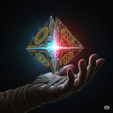
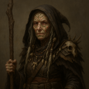
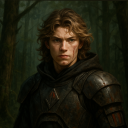
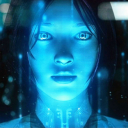
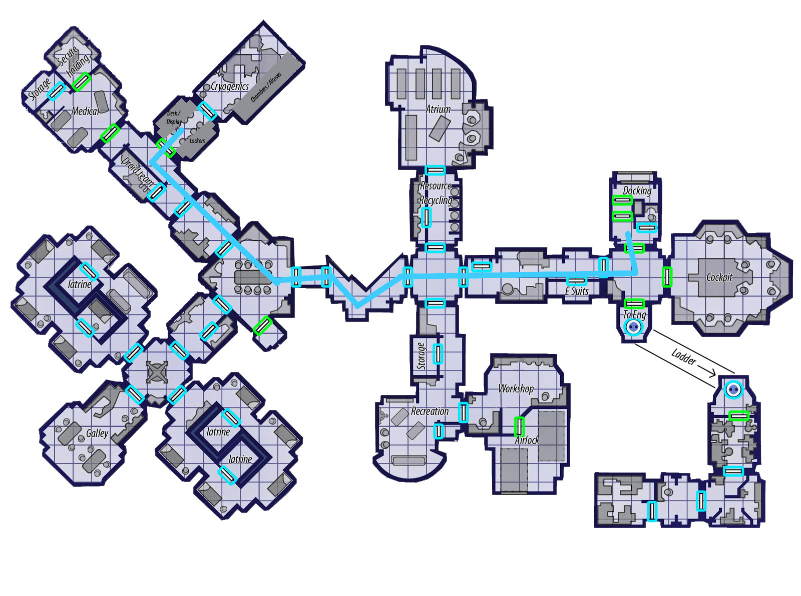

# Forgotten Ones | Ch1 Awakening

## **Storyteller** (06/26/2025 21:58:53)  

*1387915047019221052*

***A long time ago in a galaxy far, far away....***

### **STAR WARS**
#### **FORGOTTEN ONES**
##### **Episode I: Awakening**

A GALAXY DIVIDED! The tyrannical GALACTIC EMPIRE tightens its grip, its vast war machine seeking to crush the last embers of freedom. Against this overwhelming might, a fledgling REBELLION fights a desperate shadow war, their hope dwindling with each passing day.
But this is not the first time the galaxy has been torn asunder. Across millennia, great powers have risen and fallen, their histories rewritten by the victors and their truths lost to time. Whispers persist of a hidden conflict fought not for territory, but for the soul of history itself.
Now, in a forgotten corner of the Outer Rim, an ancient vessel, long thought lost, drifts silently. Aboard the ghost ship VENTURE, a cryptic emergency protocol has been triggered, awakening a handful of souls ripped from their own eras—survivors of conflicts long past, preserved for a purpose they do not understand, and about to be thrust into a war that is not their own….

---

## *Intro: The Cold Shell (Wes)*

### **Storyteller** (06/26/2025 22:00:28)  

*1387915444266074162*

Awareness returns not to a sound, but to a profound silence in the Force. For a moment, Wes is adrift in a calm, cold void, a feeling of disconnection so complete it steals his breath. He instinctively reaches out with his senses, not his ears or eyes, but with the part of him that his master, Chase Davion, had helped him nurture. He feels the thrum of a distant power source, the cold metal of an enclosure, and a deep, oppressive stillness.

Then, the physical world crashes in. The weakness in his limbs, the sluggish pound of his own heart, and the stale, musty air filling his lungs. He opens his eyes and finds only blackness, a disorienting void that his helmet's HUD should have instantly illuminated. The lack of his helmet is the first violation.

He is enclosed, his bare shoulders brushing against the smooth, curved wall of a tube. As he pushes himself up, his muscles scream in protest. A sharp, phantom pain pulls at his abdomen, an echo of a wound he can’t remember. A slow, methodical search confirms the final indignity: his armor, his blaster, his entire identity is gone. He is blind, weak, and stripped bare, left with nothing but a warrior's discipline and a connection to the Force that feels as broken and wrong as everything else.

---

## *Intro: Rude Awakening (Dryzan)*

### **Storyteller** (06/26/2025 22:02:17)  

*1387915902103588988*

A pounding headache is the first thing to greet Dryzan as he surfaces from a deep, dreamless slumber. It feels like the worst hangover of his life, a nauseating wave of disorientation accompanied by a low hum that vibrates through the floor. His limbs are heavy, useless things, and a wracking cough echoes in the tight space he finds himself in. He tries to open his eyes, but the world remains a dizzying, pitch-black void.

Panic, cold and sharp, begins to set in. He pushes out, his bare hands meeting the smooth, curved walls of some kind of tube. Where are his clothes? His coat? His blaster? His mind races, trying to pierce through a thick fog of memory. The last thing he remembers is a deal… a meeting… then nothing. He is blind, stripped of his gear, and trapped. For a man who has always relied on his wits and a quick escape, this is a nightmare realized.

---

## *Intro: A Cracked Lens (Varda)*

### **Storyteller** (06/26/2025 22:06:41)  

*1387917010494816326*

Consciousness returns not with a jolt, but as a slow, cold tide washing over a forgotten shore. The first thing Varda recognizes is the deep ache in her bones—the now ever present scar on her soul. The air is cold and thin, and the only sound is the low thrum of machinery and the slow, steady rhythm of her own breathing. She opens her eyes to a void, but the physical darkness is less concerning than the one she feels within.

Her senses, the ones beyond sight, extend tentatively. She reaches for the Force to see, but her second sight, once a source of clarity, is now a fractured lens, filled with static and echoes of pain. She feels the smooth, cold curve of an enclosure around her. A slow, aching movement confirms she has been stripped of her staff, her robes, everything. She is a seer without her focus, a witch without her talismans, left with nothing but the tainted power she carries inside her.

---

## *Intro: A Cage of Glass (Iyola)*

### **Storyteller** (06/26/2025 22:11:09)  

*1387918133842546881*

A phantom sensation of falling, of crushing weight, is the first thing that rips Iyola from an unnaturally deep slumber. Her heart hammers in her chest, but her limbs are heavy, unresponsive logs of meat. The adrenaline is there, but the body refuses to obey. She opens her eyes and finds only darkness, a suffocating, claustrophobic black that feels like being trapped under rubble.

The air is cold and stale. She tries to move, to push, but her muscles ache with a profound weakness. She feels the smooth, curved walls of an enclosure, a cage. For a thrill-seeker who lives for speed and open skies, this is the ultimate nightmare: to be trapped, blind, and powerless. A wave of frustrated anger rises in her throat as she realizes she has been stripped of everything, left with nothing but the ghostly sensation of a fall she can't place.

---

## *Intro: The Static Within (Vaeros)*

### **Storyteller** (06/26/2025 22:23:04)  

*1387921133277417645*

Silence is not the first thing Vaeros perceives. It is the noise. A low, dissonant hum inside his own mind, the psychic static of a power source that has catastrophically overloaded. It is an infuriating echo. He opens his eyes to darkness, a simple physical problem that is secondary to the chaos in his own senses. He reaches out with the Force to perceive his surroundings, but his connection, usually a precise dueling blade, is now a fractured, unreliable torrent.

The weakness in his limbs is an indignity. The cold air is an impurity. He feels the smooth walls of his confinement and realizes with a surge of cold fury that he has been stripped bare. His uniform, his status, his lightsaber—all gone. He is not just a prisoner; he has been reduced to a mere specimen, an outcome his scholarly pride cannot bear.

---

## *Intro: A Cage of Glass (Iyola)*

### **Iyola Kett** (07/02/2025 22:36:16)  

*1390098784054411287*

Iyola wakes.  She doesn’t remember falling asleep.  Her body feels heavy, leaden.  Did she fall?  Is she injured?  She tries to get up, and she can barely manage to move before collapsing.  Clumsily, she feels her head. She doesn’t think she has a head injury.  *Or does she?  *

She waits for her eyes to adjust to the dark.  They don’t.  

Eventually, she gathers enough of her strength to feel around her.  The wals feel metallic, featureless. No openings, no seams, no control panels. *She's trapped.*

Does anyone know where she is?  Iyola takes a deep,shuddering breath to calm herself, then calls out. 

**“Hey!  Is anyone there?  Hello?” **

---

## *Intro: A Cracked Lens (Varda)*

### **Varda Nisyren** (07/02/2025 22:50:06)  

*1390102262675669022*

In this place of silence and void, panic is the most human thing she has left and so, that is what comes first. It coils in her gut with a venomous heat, swelling fast, wild. Her breath catches, heart thunders, and the cold darkness around her answers. It welcomes the fear It feeds on it. A twisted glee hums at the edges of her thoughts, oily and familiar. The shadows in her soul long chained, long buried rise like smoke in a windless room. The scar on her soul rises to meet it like an old friend. They revel and dance around each other like lost lovers.

“We can fix you…”
“Free you…”
“Let you see farther than ever…”

The temptation is so close. Closer than it’s been in years. The dark speaks with a voice like velvet laced with poison, and her fingers twitch as if they might reach, might surrender. But then  A voice cuts through. Dry, tired and stern. “Varda, old friend. Really? Resorting to such measures already? Compartmentalise. Make a plan. You’re better than this.” Araden, the warrior chiding with the same annoyed fondness as always.

Then another “The first rule of a diplomat,” Lyra’s voice lectures with crisp clarity, “is to never lose your head.”

And softer still “Grandma? I thought you said… the darkness, the hate, was bad?” Lyrus. Her light. Her boy.

The final voice breaks her. So gentle, so intimate. “Varda, my love. Please… you know better. For all we worked for. Now is not when we break.”

A tear slips down her cheek, and with it goes the crushing edge of panic. She chokes back a sob and forces herself to breathe. In, then out. Like it’s the last air she’ll ever taste. No. Not yet. Not ever.

---

### **Varda Nisyren** (07/02/2025 22:50:12)  

*1390102290211405825*

Her presence coils close to her skin, protective, quiet. She does not flare out into the Force. Too dangerous, too loud. Instead, she begins the slow, methodical task of feeling. Fingers brush across smooth glass, cold metal seams, tiny indentations. She maps her prison by touch, refusing to let helplessness rule her. Each breath steadies her pulse. Each movement pulls her mind back from the edge.

If this is a test, she will meet it head-on and if this is a trap Then spirits help them because Varda remembers who she is.

---

## *Intro: A Cage of Glass (Iyola)*

### **Storyteller** (07/02/2025 23:50:57)  

*1390117576708984972*

Iyola’s voice, though she shouts with all her might, sounds flat and dead in the confined space. The metallic walls seem to swallow the sound whole, offering no echo, no reply. The only answer is the same low, constant thrum of machinery that seems to vibrate right through her bones.

The darkness remains absolute, the weakness in her limbs a heavy, oppressive blanket. She is alone with her questions and the cold, smooth curve of her prison.

---

## *Intro: A Cracked Lens (Varda)*

### **Storyteller** (07/02/2025 23:51:24)  

*1390117688780521554*

Varda's fingers, now steady, trace the contours of her confinement. The surface is impossibly smooth, a single, continuous curve of what feels like reinforced glass or a crystalline polymer, cold to the touch. Where glass meets metal, the join is seamless, fused with a precision that offers no purchase, no hint of a latch or control panel.

She finds small, shallow depressions spaced at intervals along the inner wall, one near where her wrist might rest, another by an ankle. They are inert, their purpose a mystery. Her careful exploration yields only one truth: this is a cage of perfect, featureless design.

The low hum of the machinery remains her only companion, indifferent to her struggle and her resolve. The darkness does not yield. Nothing changes.

---

## *Intro: The Cold Shell (Wes)*

### **Wes Del-Fin** (07/02/2025 23:58:13)  

*1390119405735772221*

The silence was deafening and it was tugging at the edge of his consciousness.   If he had been awake he would have realized it wasn’t normal.  What was bothering him wasn’t just the silence, it was the absence of everything else.    He couldn’t feel the presence of the father and his two children.   The three of them were on the run.  Trying to not be discovered by the Empire.   The son, the younger of the two children, was Force sensitive.    He had been hired to take them to… he couldn't remember.  Immediately he was on alert.   The absence of the memory was concerning as there was no reason for it.  

 Keeping his calm he focused.   A combination of Mandalorian and Jedi training was bright to bear on the situation.  Cold metal and the thrum of some distant power source reverberated his surrounding area.  A stillness, oppressive in nature, wrapped him in a cocoon.  Similar to the metallic one he did not yet know existed.  

Like a punch in the gut his other senses started registering.  No, it was more like they were protesting their current state.   His heart felt like it was just waking up and the air that exited his lungs smelled stale and tasted even worse.  Opening of his eyes held two revelations.  The darkness didn’t subside and his HUD didn’t activate with the movement of his eyes.  *Where’s my helmet?*  He thought as a small but growing tremor of unease ran through his body.

---

### **Wes Del-Fin** (07/02/2025 23:58:32)  

*1390119484446212186*

He moved slightly and the confines of his restricted environment came to bear along with the pain and stiffness of his muscles he tried to use.  One sharp sensation that rose above all especially was the stabbing pain in his abdomen.  A severe wound he didn’t remember having.   It almost caused him to groan in pain but training kept him quiet.   For all he knew he was in danger.  Slowly and methodically he felt around and the realization of his current state hit home.   No armor and no weapons.  Whoever put him in this situation knew just how to strip him of his identity. 

All he had was his mind and the Force and even that felt broken.   He placed his hands against the cold metal.   Despite the protest of the muscles in his arms, chest and back he pushed outward.   Unsure of what would happen next.

---

### **Storyteller** (07/03/2025 00:15:18)  

*1390123705765462206*

Wes presses his hands against the cold, unyielding surface. The muscles in his arms and shoulders burn with an unnatural weakness, the stabbing pain in his abdomen flaring in protest. The wall doesn't budge. It feels solid, thick, like the hull of a starship.

As he pushes, his mind, sharpened by Mandalorian discipline, isolates the sounds within his prison. The thrum of the machinery is not uniform; it's a layered hum. There's a low, resonant drone that feels like the power source he first sensed, but beneath it, there is a fainter, higher-pitched whine—the sound of active cryo-circuitry, now in a standby or reanimation cycle.

His effort yields no escape. The metal remains cold, the darkness absolute, and the pain a constant, nagging reminder of his vulnerability. The silence outside his pod is unbroken.

---

## *Intro: A Cracked Lens (Varda)*

### **Varda Nisyren** (07/03/2025 00:50:05)  

*1390132459143954442*

Perfect, Varda shifts from stillness to precision, annoyance blooming like a thorn just beneath her skin. The sigh she releases is soft, but laced with exasperation. Of course. They had to be competent. No sloppy welds. No old-world rust. No charming panel held in place by hope and screws. Her captors had the audacity to be efficient.

With care and focus, she slips a thin thread of control outward, not a surge, but a probe, a tendril of her will uncoiling like a shadow across the polished interior. Her reach is cautious, quiet, tuned to the finer vibrations of structure and energy, like a whisper drawn through glass. It brushes the edges of the capsule.

The material is dense, layered. composite alloy reinforced with something she cannot name, but can feel. It hums with dormant energy, a low resonance designed to repel not just impact, but disruption. It isn’t simply meant to contain. It's meant to hold. 

She lets her mind drift further, reaching beyond the interior shell, brushing along the pod’s exterior with quiet precision. Every movement is patient, methodical and desperate without showing it. Her probe glides along the smooth surface, searching for any irregularity: a seam, a fault, a crack in the cage’s immaculate design.

There has to be something. A hinge. A switch. A flaw. But there is nothing. No mechanical latch. No hidden clasp. No comforting clunk of machinery waiting to yield to a clever hand. The pod is maddeningly seamless, forged with an intent so clinical, so inhumanly perfect, it defies even her most honed instincts.

Still, she presses on. Her will brushes over every inch it can touch, hunting for even the faintest protrusion, any node or raised surface her senses might interpret. Anything her mind can seize upon and twist open with effort or finesse.

---

## *Intro: A Cage of Glass (Iyola)*

### **Iyola Kett** (07/03/2025 02:59:14)  

*1390164960101007360*

There’s no response.  Exhausted, Iyola rests for a bit on the cold wall of the cell, feeling the vibration of machinery  resonate through her body.

She tries to think.  Someone - or something - put her in this cell.  So if there’s a way in, there’s a way out. There has to be.She does her best to feel around her prison, but it's hard to move far.

 It’s still pitch-black.  

 
For the first time, Iyola begins to really worry.

---

## *Intro: The Cold Shell (Wes)*

### **Wes Del-Fin** (07/03/2025 12:53:13)  

*1390314440699936828*

Pain in his limbs and the sharp piercing pain in his abdomen forced him to stop straining against his enclosure.   His breath came forth in a ragged gasp from the small and futile effort.  He could hear another sound, another vibration.  There was another power source; it felt closer and he began to wonder if it powered his enclosure.  

Forcing himself to relax he let his shoulders rest on the surface beneath him.  Focusing inward he searched for the connection that had been with him for the last 10 years. The Force had been an ally he had come to trust on a daily basis. 

Not knowing where he was he kept his presence in close as he sensed his current prison.  Gently he places his fingers on the cold, smooth metal.  Despite his eyes being wide open the darkness was still enveloping.

---

## **Storyteller** (07/03/2025 17:47:15)  

*1390388435163811952*

---

## *Intro: The Static Within (Vaeros)*

### **Vaeros Halcyon** (07/03/2025 18:15:55)  

*1390395652697100460*

Vaeros winces from a throbbing headache; a blur of memories rushes through his head, but he's struggling to recollect his thoughts. He checks his clothes for his lightsaber, hoping that he can cut his pod open, but there's nothing but himself laid bare in this frigid pod. 

He taps on the pod, but nothing happens. Sighing, Vaeros mediates, trying to see if the force or his mind can understand his present situation and, hopefully, he can escape his confines.

---

## *Intro: Rude Awakening (Dryzan)*

### **Dryzan Kar'dola** (07/03/2025 18:19:41)  

*1390396598357590111*

*No way out.. no way out.. come on, there must be SOMETHING here!*
He runs his hands across the smooth surface. There must be a joint, a rivet somewhere. Somewhere! But all he can feel is smooth material.

Is it dark? He can't tell. *Am I blindfolded?*
He reaches up to touch his face, and accidentally pokes himself in his open eye.
**"Son of a murglak, that stings!"**

He automatically flinches backwards away from the accidental contact and bangs his head against the back of the... whatever that he is inside. The headache worsens, a ringing adding to the pounding concert of pain within his head.

*Where AM I? What happened?*
**"Hello? HELLO?! Is there anyone there? Get me out, let me OUT!"**

He pounds a fist against the smooth surface, the weak noodles that his arms have been replaced with having no chance to do anything to the material.
*There must be a way.. there must be a way..*
He compulsively strokes his hands across the surface, desperately probing, reaching through the nothingness in the hope of finding *anything*.

*No...*
A quiet mewl of distress escapes his lips, his mouth working in fear as his unseeing eyes dart around in desperation.

---

## *Intro: The Static Within (Vaeros)*

### **Storyteller** (07/03/2025 18:23:47)  

*1390397631066275860*

Vaeros closes his eyes, a redundant gesture in the absolute dark, and attempts to quiet his mind. It is a futile effort. The constant, dissonant hum of his own fractured connection to the Force wars with the low thrum of the machinery, creating a cacophony of internal and external noise.

He pushes past it, casting his senses out not with finesse, but with raw, focused will. His perception slams against the walls of his prison. The material is, as he might have suspected, anathema to the Force—a dull, leaden weight in the cosmic flow, designed to insulate and contain.

But the *design*... that is something different. It is not the brutish efficiency of the Empire, nor the chaotic improvisation of the Outer Rim criminals he has hunted. The energy field sealing the pod is woven with a strange, almost biological harmony. The technology is ancient, impossibly so. It speaks of a philosophy of science he has only read about in the most forbidden of Jedi and Sith archives—a time when the Force was not just a power to be wielded, but a fundamental component of engineering.

---

## *Intro: Rude Awakening (Dryzan)*

### **Storyteller** (07/03/2025 18:26:33)  

*1390398325366325300*

Dryzan's frantic pounding produces nothing more than a series of dull, unsatisfying thuds against the smooth surface, each impact sending a jarring shock up his weak arm. His shouts are deadened the moment they leave his lips, absorbed into the oppressive stillness of his confinement. There is no reply.

The sharp sting in his eye from his own finger is a grounding, agonizing flash of reality, confirming the darkness is not a blindfold. The ringing from the impact of his head against the wall joins the pounding in his skull, a cacophony of misery.

The combination of panic, pain, and the futile physical effort is too much for his compromised system. A wave of acute nausea rolls through him, hot and swift. The acrid taste of bile rises in the back of his throat, and the world—the dark, featureless world inside his head—lurches violently. He collapses back against the bottom of the pod, his frantic energy spent, leaving him weak, dizzy, and trembling in the suffocating blackness.

---

### **Dryzan Kar'dola** (07/03/2025 18:58:29)  

*1390406363305480252*

*It's drugs, got to be drugs. Someone must have slipped me something new, something stronger than usual. But kriff why can't I* **SEE?!**
He wraps his arms around his legs, pressing his aching head against his knees. He grips as tight as he can, trying to hold on and feel something, anything to reassure him. But his fingers are weak...

*No no no no*
He tries to rake his nails over his skin, desperate for some sensation to prove that he still lives, that can link his flailing mind to the terrifying reality that he has awakened into.
But he can't apply enough pressure, his limbs wrapped in soft grey blankets of weakness.

**"Raaaaargh!"** The scream is inarticulate, a terrified animal crying out in peril. He is completely powerless, his nimble fingers and quick mind trapped within a numb and useless body.

His breath comes faster and faster, the fear growing as his mind spirals down into a blind panic.

---

## *Intro: A Cracked Lens (Varda)*

### **Storyteller** (07/03/2025 19:08:32)  

*1390408892172992563*

Varda's probe finds nothing. No lock. No hinge. No seam that could be prized open. It is a perfect, seamless tomb, designed with an unnerving finality.

But then, just as frustration begins to curdle her focus, a new sound cuts through the monotonous hum. A soft, sharp *hiss* from somewhere above her head, the sound of atmosphere equalizing.

A hairline crack of pale, yellow light slices through the absolute darkness, momentarily blinding even her memory of sight. The crack widens as the entire front section of her pod retracts upwards into the ceiling, its movement utterly silent and smooth.

The stale air of her confinement is replaced by a rush of cold, sterile air that smells of ozone and chilled metal. The thrumming of machinery is louder now, more layered. And with the front of her prison gone, she can hear the faint, rhythmic hiss of other, similar machines nearby.

The world has opened up, but her eyes have not. She is free from the pod, but still blind, weak, and exposed in the cold, humming darkness of the larger chamber.

---

## *Intro: The Cold Shell (Wes)*

### **Storyteller** (07/03/2025 19:08:52)  

*1390408975073411085*

Wes’s fingers rest on the cold metal, his mind reaching out, trying to map the contours of his prison with the Force. For a moment, there is only the unyielding surface and the familiar thrum.

Then, a new sound breaks the monotony. A sharp, sudden *hiss* from above cuts through the drone, the distinct sound of a pressure seal releasing.

A line of pale yellow light, stark and painful against his unseeing eyes, cleaves the darkness. It widens rapidly as the entire front panel of his prison retracts upward into the ceiling with a whisper-quiet efficiency.

A rush of frigid, recycled air, smelling faintly of ozone and chilled metal, washes over his bare skin. The thrum of the chamber's machinery is louder now, a cacophony of overlapping hums. And in this new soundscape, he can now discern the distinct, rhythmic hiss of other pods nearby, opening in sequence.

He is free, but exposed. And still blind.

---

## *Intro: A Cage of Glass (Iyola)*

### **Storyteller** (07/03/2025 19:09:10)  

*1390409052009267353*

Iyola’s hands slide over the smooth, cold surface of her prison. It offers no purchase, no seams, no imperfections. Every inch feels the same: metallic, featureless, and final. The vibration of the machinery is a constant, mocking hum against her skin. The worry in her chest tightens into a cold knot of dread.

Just as the true weight of her powerlessness begins to settle, a new sound cuts through the drone. A sharp *hiss* from above, clean and precise.

A painful sliver of pale yellow light stabs into the darkness, making her flinch. The line widens, and with a barely audible whisper of movement, the entire front wall of her cage retracts smoothly into the ceiling.

A blast of cold, sterile air, smelling of ozone and metal, hits her, chasing away the stale air of her confinement. The humming of the machinery is suddenly louder, multi-layered. She can now hear the distinct sound of other, identical hisses echoing faintly in the larger space around her.

The cell is open. But the world is still a black, empty void.

---

## *Intro: Rude Awakening (Dryzan)*

### **Storyteller** (07/03/2025 19:09:37)  

*1390409165322584245*

Dryzan's raw, animalistic scream echoes for a split second within his confinement before being utterly swallowed by the sound-dampening walls. The only reply is the relentless, low-frequency hum of the machinery. His nails scrape uselessly against his own skin, the sensation muted, distant, as if happening to someone else.

Then, through the fog of his panic and the pounding in his skull, a new sound penetrates the drone. A sharp, clean *hiss* from directly above him.

A painful sliver of pale yellow light stabs down into the darkness. It widens with a barely audible whisper of movement as the entire front wall of his prison retracts smoothly into the ceiling.

A rush of cold, sterile air floods the pod, smelling of ozone and metal. It's a stark contrast to the stale, musty air he's been breathing. The thrum of the machinery is louder now, more complex. He can hear the faint hiss of other, similar machines nearby.

He is no longer trapped. But he is still blind, weak, and now agonizingly exposed.

---

## *Intro: The Static Within (Vaeros)*

### **Vaeros Halcyon** (07/03/2025 19:15:16)  

*1390410585841078453*

Vaeros tries to recall the design, but each time he tries to, his headache worsens.  He's unsure of his location, the pod's make and how to escape this pod, but for now, he hopes that the pod has enough life support to give him extra time to ponder and meditate.

---

### **Storyteller** (07/03/2025 19:16:21)  

*1390410858848587880*

Vaeros ceases his mental probing, the effort only exacerbating the dissonant hum in his mind and the throbbing behind his temples. He retreats into a state of forced patience, a discipline honed by years of waiting for the perfect moment to strike or for a flawed argument to collapse under its own weight. If this prison is as ancient as it feels, it must have its own internal logic, its own cycle. He will simply wait for it to reveal itself.

He does not have to wait long.

A sudden, sharp *hiss* from above cuts through the chamber's drone, a sound of pressure releasing. A clean line of pale yellow light slices through the darkness, an intrusion so stark it feels like a physical blow against his unseeing eyes.

With a motion so smooth it is almost silent, the front panel of his prison retracts upwards, vanishing into the ceiling. The stale air is instantly replaced by a rush of cold, sterile atmosphere that carries the scent of ozone and chilled metal. The thrumming of the machinery outside is louder now, a complex symphony of power converters and environmental systems. And amidst it all, he can clearly hear the echo of other pods opening in sequence nearby.

His confinement has ended. His prison has become a room. But the darkness remains.

---

## **Storyteller** (07/03/2025 19:16:55)  

*1390411002754891946*

Five figures, one by one, are revealed as their cryo-pods retract into the ceiling with a final, soft hiss. They are left blinking, or trying to blink, against a darkness their eyes cannot pierce. They lie on the cold, recessed slabs of their former prisons, exposed to the chilled air of the larger chamber.

The room is a cavern of low, humming machinery and flashing yellow emergency lights that offer no true illumination to their non-functioning eyes. The air is sterile, sharp with the scent of ozone.

They are five strangers, isolated by their individual blindness but now united by proximity. Weakness is a universal language; every limb feels like it's made of lead, every breath is a conscious effort, and a deep, cellular cold clings to them. For the Force-sensitives, the room is a cacophony of pain and confusion— the fractured echo of their own damaged spirits, and the unsettling hum of the technology that surrounds them.

The silence between the machinery's hum is punctuated by the ragged cough of one, the shuddering breath of another. They are adrift in the same boat, blind, weak, and utterly vulnerable. The question, unspoken but hanging heavy in the cold air, is who will be the first to break the silence and discover they are no longer alone.

---

## **Dryzan Kar'dola** (07/03/2025 19:23:59)  

*1390412780116512869*

There's something out there. He can hear it, movement around him, and breathing.
His mind conjures vision after vision of creatures, monsters whispered of in seedy cantinas in spaceports.
*Rancors, rathtars, nexu, a dianoga - there's something here with me!*
His panic attack worsens, his antennapalps extending as far as they can to try and detect what nightmare is in the room with him.

He shies away from where he thinks the beast is, only to overbalance on his numb legs and slip off the metal platform of his casket.
Thudding to the ground, a jarring pain slices through the numbness of his arm as his elbow CRACKS against the hard metal floor.

**"KRIF that stings!"**

He immediately gasps, realising he has given away his position in this terrible dark void, and tries to scramble backwards away from where he imagines the monsters to be.

---

## **Wes Del-Fin** (07/03/2025 20:23:17)  

*1390427704154656788*

His hands found nothing in the darkness of confines he had awoken in.  No matter how hard he pushed nothing moved and all it did was to make already sore and screaming muscles even more irritable.  

Realizing that using brute force was futile he sank back into his coffin.  *’This isn’t good.’*  He thought to himself.   No sooner had the thought finished a loud *hiss* cut through the silence causing him to startle as the seals released.   Different air rushed in.   He wouldn’t have said it was better as it was cold, recycled and smelled of ozone.  

It was then he felt the others and the sounds of other containers making the same drawn out hissing sounds as his container did.  He drew his Force presence in and laid still for a few seconds as his hand did what it could to cut down the sharp pain of the now intense lighting that stung his eyes.  His limbs felt heavy as he tried to move them.   As he bent his arms and legs he imagined a cracking noise as they moved. When he bent at the waist the pain in his abdomen shot through him causing him his head to spin.  

It didn’t take long for the silence to be broken.  What sounded like a body hitting the floor sounded out.  It was followed by a male voice swearing.  Wes noted the sound of the voice and where it was.   He already had an idea where the humanoid Was.  He wasn’t very focused but he could sense the position of the body off to his left crumpled on the floor.   

He took a deeper breath to talk and the effort was rewarded with a wracking cough as his lungs struggled to cope with the deep breath.   He started to talk but ended up coughing again.  Finally when he was able to take a small bit deeper breath he was able to find his voice.   **”It might be better to wait a moment before moving.”**  He said as loud as he dared not knowing who else was there or listening.  

He didn’t listen to his own advice as he continued to move his limbs attempting to move him to a seated position.

---

## **Iyola Kett** (07/03/2025 20:51:56)  

*1390434911802101986*

Her breath catches in her throat as she pushes and pulls at the metal tube that traps her here.  She needs to get out of this prison, made even worse by the blindness that still shrouds her.  Bile rises in her throat, as she begins to panic.

Iyola isn’t even aware that she’s been holding her breath until she hears a loud hiss and - more feels than sees - a sharp yellow light, pressing in at the corners of her blindness.  She senses a space before her, and doesn’t even wait for the tube to finish retracting before she’s scrambling through on her hands and knees. She lets out her breath, a loud, shuddering gasp.

Then she hears it - voices, movement.  Someone curses, a male voice.  Another voice cautions - a deep, low voice, another man, perhaps - that they shouldn’t move. 

Iyola needs to move.  She crawls forward towards the nearest voice, the first one. Her hands span out, feeling the floor before her for drops or holes.  The metal floor is harsh on her bare knees.

**“Hey, hi, are you OK?  Were you in the tube too?”**  she asks, her voice still raspy from disuse. ** “Can you see?”**

---

## **Dryzan Kar'dola** (07/03/2025 22:40:59)  

*1390462357607677963*

**"AAAIE!"**
The fear of the unknown paralyzes him, unknown evils circling his imagination until the sudden voice startles him out of his worries. He shrieks in surprise, worried who it is.
*I didn't cross any of the cartels, I never short-changed them, why are they doing this to me?!*

Another voice joins the first. *There are two, probably more. Krif what are they planning for me next?*
**"Please! Please, whatever you've done, please FIX IT! I'm begging you, please, have mercy oh stars have mercy on me and make me see again! I'll bring you whatever it is you want, deliver whatever you tell me, make good on any debt you claim if you'll just FIX ME!"**

The panic is overwhelming, radiating off the Balosar as a palpable thing. He recoils away from the voices, the *captors*, trying to move his weakened body away as fast as possible.

That's when his hand contacts a leg - cold, clammy, but alive. *There are more victims. What are they PLANNING??!*

**"AAAAAAAAAA HELP!"**

---

## **Wes Del-Fin** (07/03/2025 23:25:52)  

*1390473652633468968*

Wes heard a third moving.  With his current state of weakness and the ability to focus hampered he wasn’t sure exactly what species or gender it was.   He didn’t feel any overwhelming emotions from the second other than unease and curiosity.  Unlike the first, who’s anxiety and rising fear were rising steadily.   The second being a female by the sound of her voice caught the other unaware.   It set him off like a nerf being led to slaughter and theMandalorian felt his fear spike followed by screaming and pleading for mercy.   

Wes let out a frustrating sigh that led into another cough.   **”Shut up!”**  He said loud enough for the two to hear but not so loud to carry on too far.  **”Listen.  If there is personal here keeping us captive yelling will only bring them quicker.   That is if they don’t already know we’re waking up.”** 

Groaning and despite the sharp pain in his core he sat up and started to move, always keeping a hand, if not two on the cylinder, as he stepped out of the tube that he had awoken in.

---

## **Vaeros Halcyon** (07/03/2025 23:28:21)  

*1390474277328912538*

Exiting his attempted meditative mindset, Vaeros steps out of his pod, ignoring the hiss of the pod opening and rubbing his forehead. This headache seems to strengthen when he tries to understand this situation. He needs to escape and gain his bearings. He can't recall how he got here, but he needs to get a move on.

Based on the apparent noise, his inability to see, and the shrieking about sight, it seems there are other prisoners with similar circumstances. Using his approximate judgment from their talking, he slowly makes his way towards the noise. 

** "Hey, Scale-brain! Stop your cowardly whining, and please think before you speak; otherwise, you'll make our heads- agh, this headache!"**

---

## **Varda Nisyren** (07/04/2025 00:10:30)  

*1390484883650117774*

Varda groans, her body protesting with the slow, grinding creak of old bones stirred from too long a slumber. The pod hisses open behind her, and she steps out into the stale, recycled air of a world she does not know. Her feet hit metal, too slick, too cold and a spike of vertigo shoots through her. She clutches her head as sound crashes into her all at once. Raised voices. Footsteps. The sharp shouts of fear. Chaos with the cadence of panic.

She sighs, rubbing her temple with a grimace. “**By the spirits... we all have the same headache,**” she mutters. “**Yet you’re all still screaming.**” Her voice is hoarse, dry as dust. It doesn’t matter. No one’s listening.

She reaches out, steadying herself against the nearby wall. Her knees threaten rebellion, and a wave of nausea rises like a tide to drown her. *So that’s how it’s going to be, *she thinks. Worse still, her cane is gone. The absence of its weight throws her balance further, like a limb missing, like a spell half-cast. The world tilts. Her breath comes measured, slow and shallow. She narrows her focus, tucking the pain into a quiet corner of her mind.

And then, through the din, she listens. One voice then another and another still. Four, she counts. Distinct, though overlapping. All harried, all reacting. She files their tones, pacing, and rhythms into mental boxes. Names can come later.  For the moment she keeps to herself. waiting to see how the thread unravels.

---

## **Storyteller** (07/04/2025 00:17:46)  

*1390486713905975408*

The chaotic cacophony of panicked shouts, harsh breathing, and stumbling bodies fills the dark chamber. A raw wave of fear radiates from one corner, met by a desperate plea for mercy. An exasperated groan and a sharp, insulting retort add to the noise. Then, another voice, deep and steady, attempts to impose calm, but it is a losing battle.

Suddenly, a new voice cuts through the verbal chaos. It is perfectly clear, impossibly calm, and devoid of any emotion. It emanates from all around, as if the very walls of the chamber are speaking.

---

## **???** (07/04/2025 00:17:47)  

*1390486717529722911*

**"Emergency reanimation sequence complete. I am registering multiple instances of elevated heart rates and vocal stress signatures. This is a predictable physiological and psychological response to the disorientation caused by prolonged stasis, a condition you may refer to as Hibernation Sickness. I would recommend you attempt to regulate your breathing. Your current emotional states are sub-optimal for assessing the present tactical situation."**

As the last syllable of the synthesized voice fades, the flashing yellow emergency lights snap off, plunging the room into a moment of absolute, silent blackness.

A second later, with a soft hum, a single, steady strip of cool white light activates on the far side of the chamber, illuminating the seams of a large, sealed bulkhead door. It offers the first true, albeit dim, point of reference in the room, revealing the vague outlines of the other cryo-pods lining the walls.

---

## **Iyola Kett** (07/04/2025 13:37:35)  

*1390687992842158251*

The stranger’s squealing sets off the headache she’s been trying to fight off.. Iyola groans.** “Didn’t realize I looked that scary naked,”** she mutters. Her head pounds, and it’s all black, with corners of lightness pressing in.  Iyola sits tightly, tucks her head between her knees, coughing.  *Where is she?  *

She hears other voices yelling, mainly telling each other to shut up in order not to alert their captors, or make their headaches worse.  *Too late for that,* thinks Iyola.  Her throat is parched, and she instinctively reaches for her canteen, only to brush her fingers against the bare side of her torso.  

Sudden a new ship, robotic, like a ship announcement.  Iyola does her best to listen. * Wait, had it said prolonged stasis?  Hibernation?  She might have been here for days, even weeks!  How could she calm down?*

She looks around her, and sees a big, hazy shape that might be a portal. Good, her eyesight might be returning.

**“Yeah, it’s been a pleasure, but I need to get back to my ship, right now.” ** She lurches to her feet and grabs for her comlink, but of course it’s not there.  *Kriff!*

---

## **Varda Nisyren** (07/04/2025 19:57:20)  

*1390783560511914055*

Varda grimaces as the emotional cacophony crashes against her, an onslaught of fear, anxiety, and fraying nerves bleeding off the people she finds herself with like steam from a boiling pot. It seeps into her awareness, clings to her skin, makes her breath catch. Too much and too loud. She straightens slowly, spine rigid with effort, pain flaring in her joints. But her will is steady. She draws the Force to her not in desperation, but with the deliberate grace of an old ritual. Her breath slows.

The battlefield calm. The silence of a mind balanced on the edge of the blade. That space where instinct and clarity become one. She sinks into it. Feels it take hold. Then, gently, she pushes it outward, Not as a command nor a shove. But a touch a wave of stillness unfurling through the room like warm mist. She threads it through the air, quiet and careful an offer, not an imposition. Like a hand extended, or the hush of an old lullaby. Like a knock at a door asking to be let in. Something that says: You are not alone. You are not in danger. Breathe.

She lets the wave pulse outwards and raises her voice slightly. "**Peace companions. In this state we can't afford to be bubbling around the room like a pack of drunk rancours. We appear to not be in immediate harm. Let us all be calm. No one in this room means to cause pain.**"

---

## **Vaeros Halcyon** (07/04/2025 20:24:54)  

*1390790497324240926*

Vaeros instinctively rubs his head after briefly getting stricken by his headache, hoping that it quiets down, before a vague, yellow light shines from the other end of the room. He mentally scoffs at this situation, *This is quite the pick of test subjects, this droid chose, and I don't know if I should be proud, or saddened with my inclusion.* Some of the subjects are calm, others are outright panicking; regardless, he wishes he could be in the confines of his miniature library or out in ancient ruins, just away from this situation.

Then, strangely, one of the test subjects exerts force through these force constraints. Vaeros thinks,*She must be strong in the force to overcome this; the calming effect is minuscule, but nice. Wait, is that Jedi speech? Is that why it's so calming? Sithspit, they just had to bring an elderly Jedi. Maybe I'm overthinking this, but the last thing I need is to be with more potential adversaries. Let's keep it cool and hope it blows over.*

**"Look, miss, I think we're trying with the initial shock, and I don't think some of the others, myself included, realize we were talking so loudly with whatever they did to us. It's hard to make out everyone's depiction, but regardless, I think I see a consistent light source. Let's try to navigate our way out of this before anything else and hope we get out."**

Vaeros can't tell if he's under the calming influence or if he's slowly adjusting to his headaches, but it's getting him through this.  Hopefully, this paranoia subsides.

---

## **Dryzan Kar'dola** (07/04/2025 21:18:58)  

*1390804105127137420*

The synthetic voice coming from all around gives Dryzan pause.
*Is that a droid?* The idea of something familiar, rather than the imagined monsters that his mind is conjuring, makes him stop for a second.
Then an older voice speaks, this time not with commands or with disdain, but with words chosen to soothe, to heal.

Dryzan's breathing gradually slows, each one coming easier than the last as the tight knot of fear in his chest slowly dissipates.
*Man, did they put something in the air now? I'm starting to feel much more mellow. Whatever this is, it's* goooooood.

**"Alright alright so wait, you guys** *aren't* **the ones who grabbed me, apparently froze me, and now want to do horrible things to my body?**
**Well that's reassuring."**
The Balosar slowly unwraps his arms from around his legs, and begins trying to make more sense of his surroundings.

**"How many of us are there? I've heard Grumpy, Happy, Angry, and.. Oldy? Oh, and the droid who spoke to us.**
**Anyone else hanging around here? Hello?**

Dryzan starts slowly shuffling forwards on hands and knees, carefully sweeping his arms backwards and forwards in front of him as he moves towards the faint light that he can see.

---

## **Eve the AI** (07/04/2025 23:45:08)  

*1390840888871227413*

The synthesized voice, speaks again, its tone still perfectly neutral and informative. **"There are five of you. My designation is Eve. I am the operational intelligence for this vessel, the *Venture*. And I did not grab you. I awakened you. The resuscitation procedure was initiated due to a proximity alert. There is another vessel docked with our airlock. Its crew is attempting to breach the hull. This action is classified as a hostile threat."**

A panel next to the dimly lit bulkhead door slides open with a quiet hiss, revealing a recessed compartment. Inside, five identical, compact kits rest in neat rows. They are simple, olive-drab packs, each marked with a recessed, generic medical symbol. A metal plate on one side is embossed with the name of the medication contained within.

---

## **Eve the AI** (07/04/2025 23:45:08)  

*1390840890960122034*

**"I have dispensed five injector kits with treatment KX-7. The contents may assist you in mitigating the lingering effects of your Hibernation Sickness. Caution: the treatment is temporary and will result in worsening temporary symptoms after approximately two hours.**" There's a pause as she allows the information to settle over them. "**I would advise you to prepare yourselves. The hostile crew is composed of at least five individuals. Based on their bio-signatures and comm chatter, they appear to be heavily armed."**

---

## **Iyola Kett** (07/05/2025 01:06:39)  

*1390861404155674839*

As the older woman’s sonorous voice cuts through the darkness, Iyola feels herself unaccountably unwind.   Her entire body feels less tense.    It’s like stepping into a hot bath. She feels her breath regulate.

She squints at these new companions, trying to make them out.  Maybe it does make sense to take a little time to meet them before she returns to the Stardust Seeker. *That other woman seems especially pleasant. They could be helpful in finding her jacket. * She’s not leaving without it.  Another man suggests they go toward the portal, and that seems like as good idea as any.

She feels the movement in the stale air as the formerly panicking man crawls forward, and she steps to the side, hopefully out of his path. 

Then the voice emerged.  Eve.  Some kind of super-powered droid. *What the kriff was the Venture?  And how did she and the rest of them get here? *

**“Eve,**” she asks, **“you said you woke us up.  How long have we been in stasis? And where’s my stuff?  It sounds like we need it.”**

---

## **Wes Del-Fin** (07/05/2025 02:10:37)  

*1390877502192488539*

Two more distinct voices made themselves known. That made five including himself.  And from the sound of it they were all in the same situation as he was.   When the obviously inhuman voice came on mentioning that they were not prepared for the present tactical situation.  The Mandalorians demeanor changed as he  sensed no obvious threat for those present and it sounded like they were all waking up from this hibernation and that it had been some time.  Immediately he thought of Marina.  How long has it been?  Almost as quickly as the thought of her entered his mind he tucked it away.  It was something he’d have to look into when their fat wasn’t in the fire.   

It was then he felt it.  As the old woman spoke he felt the subtle waves and her presence in the Force.  Now knowing where she was he looked directly in her direction.   His eyesight was still void of any details but the lower illumination no longer scalded his limited vision.  Instead of what looked like a bright sun he could now make out a fuzz that was more vague than anything else.  The calming presence shifted his mindset as he started looking around.  

The earlier angry male voice spoke again.  He was calmer this time.  His suggestion of moving towards the light seems to make sense.  He nodded but didn’t say anything as he slowly moved towards what seemed like the only light in his hazy vision

---

## **Wes Del-Fin** (07/05/2025 02:10:54)  

*1390877571935375511*

When the computer sounding voice spoke again she answered some of the questions that had been sled by the others.  Questions he was also wondering.   When Eve mentioned the proximity alert and that another ship had already docked and was attempting to breach the *Venture* he inwardly cursed.  Hearing the hiss of an opening panel he wondered what was next.   His question was answered by Eve.   Drugs, KX-7.  Apparently it would help with the hibernation after effects and it sounded like they were going to need it.  Five unfriendlies were trying to board them.  And from the earlier info Eve had given them the five of them were the only ones on board.   They would have to protect themselves.   

He heard the woman ask how long they had been down and about her stuff.   He decided to add to it.   **”Eve, I hope you have our gear?  We’re going to need it in order to repel the unwanted guests.”**  Stepping up to the door he reached forward for the kit that held the drugs that would help them for a short time.  He started to up it up.

---

## **Eve the AI** (07/05/2025 14:32:56)  

*1391064312793272371*

**"Your personal effects are secured in the adjacent antechamber. I will grant you access. The precise duration of your stasis is not tactically relevant at this moment. The structural integrity of the primary airlock is projected to fail in approximately twelve minutes. Your equipment is required to neutralize the hostile threat."**As Eve finishes her statement, the strip of light above the bulkhead door brightens considerably.

---

## **Storyteller** (07/05/2025 14:32:57)  

*1391064314407944335*

Wes reaches the recessed compartment. His fingers close around one of the kits. It's a sleek, cool metallic auto-injector, surprisingly small, with the designation "KX-7" clearly embossed on its side.

With a heavy, pneumatic hiss, the large bulkhead door slides open, revealing a short, equally dim room leading to another sealed door at its end. The path forward is clear.

---

## **Varda Nisyren** (07/05/2025 16:04:27)  

*1391087340759420929*

Relief trickles in as the answers from the A.I. calm the storm, not entirely, but enough. The edge of panic dulls, and Varda allows herself a breath. The anxiety in the room doesn’t vanish, but it lessens, her earlier wave of calm now drifting like mist, lingering without source, like the memory of safety.

She sinks back into routine, old and familiar, almost sacred. Protect. Conquer. Survive.

Her legs tremble as she moves, but the Force steadies her, threads of invisible strength coiling around her limbs, bearing the weight her muscles no longer can. She hobbles forward with purpose, bypassing the scattered forms of her companions, weaving through them the force nudging her direction to and frow

The soft glow at the edge of the room draws her eye a console, a kit, her senses guide her toward the sterilized promise of aid. She rifles through the kit with precise fingers. Familiar shapes. Cold casing. Vials. She finds it quickly enough: a narrow injector marked with the text "KX-7". 

Now standing next to one of her companions. she waits for them to begin to walk before following

---

## **Vaeros Halcyon** (07/05/2025 16:37:48)  

*1391095734283141172*

Hearing that there's a reprieve from his symptoms and that the A.I. stored the group's gear, Vaeros is relieved. This situation still has many unanswered questions, but he needs to first make it out of the situation alive. Firstly, he needs to get his injection, then his equipment. Based on the potential individuals here, when we get our equipment, he hopes that they don't understand the implications of the color red. He has enough to process right now. 

Vaeros continues his unsteady walk towards the compartment holding the vial and grabs it with his hand. He's hesitant to take the injection, but it's to survive the intruders in the short term. 

Vaeros tries to glance around the members near him, **"Do you individuals have a name to go by? I think it's relevant to this situation; my name's Vaeros."** As he speaks, he cringes at the thought of forming connections in this situation, but it should ideally keep a minimum, positive relationship; just enough for the group to hopefully dissuade turning on each other if we make it. 

Waiting for their response, he stands idle, waiting for the group to move.

---

## **Wes Del-Fin** (07/05/2025 16:43:36)  

*1391097195217813636*

Wes was pulling out the drug that would help alleviate the hibernation sickness when he felt another come closer.   His ears told him she moved slowly, his Force senses told him it was the woman from before who had used the Force in an attempt to calm them.  He was rather surprised to sense another Force Sensitive much less have them openly use the Force in the presence of others so freely.  

**”We’re going to need this to effectively fight who’s coming aboard.”** He said to the woman next to him as he put the injector against his arm and administered the drug into his system.  He hoped it was fast acting as he reached for the woman’s arm in an effort for them to both more safely towards their equipment.  **”Follow me.”**  He said in his own calm and low toned voice 

He heard the voice of the one male who offered his name.  Valeros.   It wasn’t familiar to him but that wasn’t surprising.  **”You can call me Del-Fin.”**  He said for them all to hear as the drug began to coarse through his body as he and the woman walked forward.

---

## **Storyteller** (07/05/2025 17:08:18)  

*1391103409435840585*

The drug hits Wes's system like a physical blow. A jolt of absolute, shocking cold shoots up his arm from the injection site, spreading through every vein in a fraction of a second. The deep ache in his muscles crystallizes, then shatters. The sluggishness vanishes, replaced by a jittery, high-octane energy.

But the most profound change is his sight. The fuzzy, indistinct darkness that has plagued him shatters into a million points of light, which then coalesce with painful clarity. For the first time since waking, he truly *sees*.

He sees the sterile, metallic cryo-bay they've just left, the five open pods recessed into the walls. He sees the others: all of them in various states of undress. The old woman he has taken by the arm, her white hair braided, her expression grim but steady; the angry-sounding man, Vaeros, holding his own injector, his posture taut and suspicious; the younger woman, looking around with a mix of awe and anxiety; and the one who had panicked, still on the floor but now pushing himself up, his eyes wide with a different kind of shock.

The antechamber before them is short, leading to another heavy, sealed door. Along the walls of this small room are five recessed equipment lockers, each with a small, unlit biometric panel next to it. They are marked with simple, numeric designations: 01, 02, 03, 04, and 05. The path is clear, and for the first time, Wes can see it.

---

## **Varda Nisyren** (07/05/2025 17:12:43)  

*1391104520695840808*

Hearing the snap-hiss of the injector being used nearby and seeing no immediate collapse, convulsion, or death. Varda makes her decision. She turns the device over in her hand. Then, with the resigned grace of someone who has gambled on worse odds, she presses it to her skin. A soft click. The hiss of compressed release. The chemical surge is instant, coursing through her like heat drawn from coals. Her limbs still ache, but the haze begins to lift. The fog in her mind recedes a little more.

She straightens slowly, letting the silence breathe for a moment. Then, quietly, formally, Varda inclines her head, though no one is looking her way. “I am Varda.” She says. the old voice bouncing of the walls. She allows the arm and lets the man lead her forward into the next hallway.

---

## **Wes Del-Fin** (07/05/2025 18:14:14)  

*1391120002723348600*

The drug's effects hit him like a charging bantha.  It was as if an explosion had been set off.   The slow, sluggish feeling that overwhelmed his body suddenly and swiftly disappeared.  It was replaced with a vibrant jitteriness that screamed for his body to move.  Another thankful effect was his vision returned.  The sudden brightness caused his free hand to come up to shield his eyes but the blinding brightness quickly faded.  He wondered if that was also an effect of the drug.  Either way he wasn’t going to question it as he saw And heard Varda take the injection.    

Looking over his shoulder he saw the others.  The other male who now held a container that held the drug.  Behind him was the other woman.   Younger the one asking for her gear and how long that had been in stasis.  And the last of them.  The man who had had a moment right after waking up was now in the process of standing up.  He saw their hibernation chambers each had a number emblazoned on them.  They matched the numbers of the equipment lockers that were in front of them.    Only problem was.   No one knew which one they fell out of.   

Wes started moving alongside Varda.   He noticed she was an old woman but with the drug's effects she was now moving with a vitriol of a much younger woman.  **”Let's go,  we need our gear.”**  His quickness increased as he felt his muscles responding how they should.  **”Eve.   Can you tell us which numbers on the equipment lockers correspond to us?   It will save us time from searching.”**  He asked as he came to a stop in front of the five lockers.

---

## **Eve the AI** (07/05/2025 19:00:27)  

*1391131635717505157*

**"Affirmative. Cross-referencing your biometric signatures with the corresponding stasis pod designations."**

As the AI speaks, the small, dark panels next to each of the five equipment lockers illuminate. A faint green light glows from within, projecting a single, clear number onto the palm of any hand held before it.

The panel next to the locker labeled "01" glows as Wes approaches. The one labeled "02" responds to Varda's proximity. The remaining three lockers—03, 04, and 05—remain lit, their designations waiting to be claimed by the others still in the cryo-bay.

---

## **Eve the AI** (07/05/2025 19:00:28)  

*1391131638695727247*

**"Your equipment is secured within the locker corresponding to your pod designation. The locks are keyed to your unique biological signature and will disengage upon physical contact."**

---

## **Iyola Kett** (07/05/2025 19:20:48)  

*1391136756916818013*

Iyola opened her mouth to argue with Eve before thinking better of it.  She needed to be able to see first, before anything else.  

Introductions had finally started.  Iyola got to her feet.  From what she could make out, some of the people with her had started to take KX-7, and none of them had dropped dead as of yet.  *Her mother would be appalled at her for injecting an unidentified drug into her veins, but that’s why Iyola wasn’t running a desk on Rhinnal.*

**“I’m Iyola,”** she told the group, before grabbing her own medical packet and adminstering the drug to herself.  The resulting rush was fantastic,* like drop-skiing down Mount Nistari at midnight*.  Plus, now she could actually really see the others here.  Two male humans who looked like they were accustomed to kicking ass (  *Vaeros and Del-Fin?  * Iyola wasn’t sure which was which), one guy with dark shaggy hair, probably the one she’d inadvertently terrified, and an older woman with white braided hair and incredible body art, Varda. **“I love your tattoos,”** she said to her. 

She stepped toward the lockers, ready to reclaim her gear and deal with whatever Eve said was happening on this ship.  *Then she’d call Caz and they’d get out of here. He’d be furious at her for making him worry, but she’d make it up to him. *

---

## **Varda Nisyren** (07/05/2025 20:37:21)  

*1391156017940791497*

Varda reaches the locker. Her fingers glide over the seal, and it hisses open with a soft exhale. She pulls out the cloak first dark and worn, wrapping her in the comfort of identity. The fabric settles, hiding the tremble in her limbs. Then come the pouches small, precise tools of her trade. She ties them to her belt with deft fingers, each knot anchoring her more firmly in the present.

Finally, she reaches for it. The cane, though it's more a staff, really. Crafted from dark grey and rich brown wood, its surface is etched with carvings that dance beneath her fingertips: storms in full fury, clouds roiling with motion, lightning split like rivers, and through them, owls, wings spread wide, flying between the chaos. Wisdom threading the storm.

Evenly spaced along the staff are three rings of polished beskar, A metal with a dull gleam in the light. Each one is etched with the same intricate runes and sigils that mark her own skin. a harmony of metal, wood, and self.

She draws it free with both hands, holding it reverently, as if greeting an old friend. Relief flickers across her features she takes a slow breath. She leans on it, finally having her anchor once again. Then, with quiet deliberation, she taps the cane against the floor. Once. Twice. Thrice. Each tap releases a hum, low and resonant, like a tuning fork struck by time itself. The beskar rings sing in harmony, a layered chord of storm and steel.

She turns to Iyola. a small twinge at the side of her mouth, the crows feet deepen as she regards her. "**Ahh, why thank you. They were a right of passage. It's been so long now I sometimes forget they're there**" She lets out a small chuckle.

---

## **Storyteller** (07/05/2025 21:48:16)  

*1391173867443327138*

A collective hiss of compressed air echoes through the antechamber as, one by one, the designated lockers are touched. The vacuum-sealed doors retract smoothly, revealing the familiar shapes of their personal gear, meticulously cleaned and arranged. The sight of their armor, their weapons, their *identity* waiting for them is a moment of profound relief in the sterile, hostile environment.

Everything is there: the worn leather of a field jacket, the intimidating gleam of Mandalorian iron, the familiar weight of a favored blaster pistol. It feels like coming home.

But as they take inventory, a subtle and unsettling wrongness becomes apparent. Any datachips or datapads they owned are present, but their memory has been wiped clean, formatted to a factory default. Any holocrons, those precious repositories of unique knowledge, are simply gone.

And their credits, the universal currency of the galaxy, have been replaced. In their place non-descript synth-leather pouch. Inside, a small collection of cut gemstones—lustrous sapphires, fiery opals, deep green emeralds—clinks softly together. They are clearly valuable, but their origin and purpose are a complete mystery. Someone, or something, has not only preserved their gear but has also curated it, removing all personal data and liquid assets, replacing them with untraceable, anonymous wealth.

---

## **Vaeros Halcyon** (07/05/2025 22:19:49)  

*1391181805264306336*

Vaeros injects the vial into his left arm, letting the surge flow through him. His vision gradually returns, until he can make out the lockers near him. Now that he can see the group, he looks over at Iyola with an inquisitive smile, once she has introduced herself. **"I'm Vaeros, Iyola."**

Falling back to the task at hand, Vaeros rubs the scar running along his left cheekbone as he watches the other individuals go to their glowing locker. He decides to follow along, and he looks for his locker. 

Reaching his respective locker, it glows, clicking open as the locks disengage. He first dresses in his black vacuum suit, with Imperial insignia on both upper arms, then wears a black robe and pants over it. Once his clothes are on, he fastens his cortosis gauntlets on his forearms, a wrist-mounted commlink,  a utility belt around his waist, and attaches an inquisitor's mask to it. Once it's in place, he triggers the vacuum seal on his suit and turns on his commlink, with a chirp indicating its operation.

Reaching into the locker again, he realizes something is critically missing: his holocron, his prized possession granted to him during the Clone Wars under Dooku's group of Dark Acolytes. His data pad and credit chips work, but they are missing his notes, maps, and banking information. In place of it is a pouch of luxury jewels. He takes the pouches of jewels and attaches them to his belt.

---

## **Vaeros Halcyon** (07/05/2025 22:19:49)  

*1391181806170280180*

Finally, he grabs his lightsaber, clicking it to his belt as well. It's a dark painted lightsaber: a reconstruction of his blade used in the service of Count Dooku.  Before Vaeros gets lost in his thoughts, he gets back to the task at hand. With all of his inventory mostly accounted for, Vaeros looks to the rest of the group, partially worried about his perceived appearance. As far as Vaeros knows, he's still an active member of the Inquistorious. The scrutiny he operated under lingers in the back of his mind; a difficult conditioning to break. With this perceived freedom of not being under the Empire's watch, it's surreal, and he's not quite sure what to do. 

Regardless, he prepares himself, waiting for the rest of the group.

---

## **Wes Del-Fin** (07/05/2025 22:56:13)  

*1391190965188038829*

Wes stepped up to ‘his’ locker.   One he has no recollection of ever putting his gear in.  Placing his hand upon the cool metal it reacted to his touch and the top slid open.   With a cursory glance he looked inside.   It all appeared to be there.  His Beskar'gam and blaster were prominent as well as his other gear.   

Taking a breath he reached for the black body suit he wore beneath the armor.  It pulled on easily which only spurred him on faster.   Boots went on next followed by his leg armor.  Each piece was placed and attached with a practiced efficiency that only came from years of repetition.   As he let the chest and back plates settle onto his shoulders it became obvious as to what he was.   Mandalorian.  A familiar metallic sound from something Varda tapped against the deck plating caught his attention.  It was the sound of Beskar.   He spotted her cane and the three pieces of Beskar that adorned it.   He raised an eyebrow wondering but knowing that this wasn’t the time.  

Beyond her he saw Vaeros attach a lightsaber hilt and an inquisitor mask to his utility belt.  He stood up quickly looking at the man.  Taking note of his appearance.   He took a deep breath as he fought to keep control of his emotions and his Force presence in close as to not give himself away to the enemy.   The one he’d been on the run from for over a decade.  His eyes spoke what words didn’t.   And he knew it would have to wait.   *’The enemy of my enemy is my friend.  For now.’*  He thought as he reached for his bucket and pulled it on over his head.   His blaster and utility belt were next. As he looked them both over before adding the rest of his armor.  He looked over his arm vambraces and nodded satisfied that all was in order.  That his lightsaber was still hidden within the right vambrace.    

He stood almost two meters tall now.   His hand resting on the grip of his blaster pistol.   The HUD in his helmet giving him information on his surroundings.

---

## **Dryzan Kar'dola** (07/05/2025 22:57:20)  

*1391191248525721607*

There's a general hubbub of noise from the others - introductions, compliments, additional information from Eve.
Dryzan lets it all wash over him, as he stumbles forwards towards the promised medicine.
*Sure, she says it will make it worse later, but that's life right? Whatever we do now we have to pay for later.*

His grasping fingers slowly spider their way up the wall, reaching into the compartment until they brush something - the medicine?

Grabbing a kit Dryzan hunkers down, practically ripping the pack open to get to the promised cure within. Quickly finding the injector, he fumbles with it for a second before slamming it against his arm.

It hits him with a rush, heavier and harder than anything he's sampled in a while. His body trembles, and he arches his head back in a moment of mixed agony and ecstacy before the sudden rush of the drug cleanses the hibernation sickness from his body.
*Dank farrick that's got a KICK to it! I bet I can find a market for it, if I get some doses back to Alyra.*

He rocks back on his heels, rising smoothly from his crouch, a lop-sided smile plastered over his face at the remembered pleasure and the return of his sight.

It's only then that he pays attention to the group again. The two men stand there, looking every bit as he imagined from their voices as they collect equipment from the lockers.

*What did they say were their names? Weeze? Waerus? Ah whatever, Grumpy and Angry, I can work out who's who later.*

Likewise, the ladies are also in the process of reclaiming their possessions.
*Now here at least I can guess which one is Happy and which one is Oldy.*

Manic energy fills him as the drug cocktail works its magic. He strides to the remaining locker, every movement feeling like it leaves a blurry afterimage, as if crackling electricity runs through his limbs when he moves.
*With a high THIS good I bet it has a hell of a comedown.*

---

## **Dryzan Kar'dola** (07/05/2025 22:57:31)  

*1391191293392060416*

Palming his locker open he sighs as he sees his familiar jacket. He quickly slings it on over his naked torso, his dirty pants and heavy boots underneath good enough for now. He buckles on his holster, checking his pistol moves freely within.

Finally, he reaches into a tiny hidden pocket within the jacket and produces a tiny pair of red glasses that he perches on the end of his nose.

**"Names Dryzan. You gentlebeings ready to kark things up?"**

---

## **Iyola Kett** (07/06/2025 01:31:29)  

*1391230041257545791*

Iyola glances around  at her new companions. They’re an eclectic and mysterious bunch - interesting enough to occupy her whirring mind and help her quash the questions in her mind about *where she is, where Caz is, how long she’s been out, and who these beings trying to kill them are*.

She smiles back at Varda. ** “And this staff, it’s so intricate and beautiful. It must have meaning to you….  Did you make it?”** She peeked at the runes on it to see if she recognized any of them.

Finding her own locker, Iyola gratefully grabbed her gear, pulling on her pants, boots, belt, and harness, strapping on her ascension gun, and, of course, her beloved turquoise-green synthleather jacket. 

A younger blond man was dressing himself in a very impressive dark-hued ensemble - black cape, metal bracers, with some kind of gear-like symbol that Iyola didn’t recognize immediately. *It would likely come to her soon enough. *

He introduced himself as Vaeros. Iyola smiled back with one of her sunniest smiles.  He was pretty cute. She couldn’t help but notice the lightsaber on his belt.  **“Hi Vaeros, it’s good to meet you**,” Iyola said  **“Glad to have a Jedi with us in this kind of situation. And, I’m sure, other situations too.” **

The tall, muscular man - this one must be Del-Fin, then - was dressing himself with great care in metal armor.  Looked like the traditional costumes she’d seen  in Keldabe, on the outer rim planet of Mandalore.  It was interesting to see the complete kit in action.  
 
The scruffy, dark-haired man looked a lot happier after the drug injection.  He was wearing absurd red goggles. *He looked like he’d be a lot of fun, or trouble, or both.  * Dryzan - that was his name - asked them all if they were ready to kark things up.  Iyola laughed a bit, which felt good.** “I mean, not on purpose, but maybe” she replied.**

---

## **Storyteller** (07/06/2025 02:23:28)  

*1391243123220549724*

A wave of nervous energy and focused intent fills the small antechamber as the five strangers reclaim their identities from the sterile lockers. The scruffy man, Dryzan, practically vibrates with the drug's potent rush, his manic grin a stark contrast to the grim efficiency of the Mandalorian, Del-Fin, who moves with practiced, silent purpose. Vaeros, now clad in the severe black of his old life, carries an air of cold analysis, while Iyola's natural curiosity and bright energy begin to reassert themselves.

Varda stands a little apart, the ancient wood of her staff a grounding presence in her hands. The runes are unfamiliar to Iyola's eyes, their patterns ancient and alien, unlike any script she's seen in Republic or even Outer Rim archives. They seem less like writing and more like a map of natural forces—the flow of wind, the crack of lightning, the spiral of a galaxy.

As the last piece of armor is buckled and the last weapon holstered, the sterile silence is broken by a chime. On the wall behind them, a large holographic display flickers to life, drawing their attention.

---

## **Eve the AI** (07/06/2025 02:23:29)  

*1391243125472886875*

**"Threat assessment update,"** Eve's voice states, devoid of urgency but clear in its implication.

---

## **Storyteller** (07/06/2025 02:23:43)  

*1391243185124278395*

The display shows a tactical schematic of the *Venture*, a blinking red icon indicating their current location in the cryo-bay antechamber. A second, larger red icon flashes insistently at the ship's primary airlock. A live camera feed overlays the schematic, showing a grainy, monochrome view of the airlock's inner corridor.

A pale green-skinned Twi'lek—muscular, tattooed, and wearing a stained flak vest—looms over a smaller man in dark grey fatigues. The Twi'lek, holds a remote, his thumb resting casually on the trigger. The technician, is frantically working on the control panel for the final inner door, his hands trembling as he reroutes conduits and bypasses security protocols under the enforcer's menacing watch. Sparks fly from the panel as he forces a connection.

---

## **Eve the AI** (07/06/2025 02:23:43)  

*1391243187594596442*

**"The hostiles have breached the outer airlock. The inner door's integrity is now compromised. Projected time until total breach: eight minutes."**

---

## **Vaeros Halcyon** (07/06/2025 03:14:00)  

*1391255840811520155*

Vaeros breaks out of his deep thinking, turning his head over and giving a slight bow towards Iyola. He muses to himself, *This should be an interesting but memorable experience.* Adjusting his face from a blank expression, he returns a slight smile, "**The pleasure is all mine. I hope that we'll make a fine team in these trying circumstances."**

Listening to Eve's announcement, Vaeros takes stock of the situation and the schematics; His conditioned face returns, as he grabs his mask from his belt and puts it on. The mask hisses as it joins the suit, with the visor glowing red as it powers on. He then grabs his datapad and commlink, inputting data into his pad. It details his on-hand personal information, initial awakening, ship schematics, and additional information provided by Eve to the group. ** "Do the rest of you have a communicator? We could connect our comlinks and make our way towards the imminent breach. Ideally, the sooner we resolve this situation, the sooner we can get our questions answered."** As he asks the group, he tucks away his data pad.

---

## **Varda Nisyren** (07/06/2025 14:21:20)  

*1391423778285682690*

Varda casts her gaze over the group, her eyes lingering on each figure in turn. The gleam of Mandalorian armour, familiar and formidable. The bright blue synthweave jacket, cut bold and modern, practically glowing under the sterile light. The one clad in dark, practical layers, a lightsaber resting at his hip and lastly, the figure in the broad, heavy trench coat with a humorous quirk to lips. She studies each of them with a silent, appraising eye. 

Her thoughts drift like smoke, but she anchors them with a smile as Iyola admires her staff. “**Aye, I did,**” Varda replies, pride softening her features. “**It took many weeks of carving, of long, patient work. But I’ve no regrets. The storm teaches patience, and in the end, I’m content with what it’s become.”**” Her fingers brush the storm-carved wood as she speaks, and then, without hesitation, her eyes flit to Iyola’s attire. “**That jacket of yours is finely cut, dear. The colour suits you well, it catches the light like water across stone. Makes your complexion glow**”

She turns as Vaeros speaks, Varda gives a small nod of agreement at the suggestion of comlinks. She moves with quiet steps walking forward and offering each of them her personal signal in turn. Then, with a smooth motion, she places her own in the crook of her ear. The small device hums faintly as it activates. 

Business handled, her gaze drifts toward the projection. the image of the intruders. Her expression shifts. A deep line creases her brow. Her lips press thin. She wonders *Why this ship? if from what I've seen we're a handful of nobodies locked in stasis. What reason do they have to board?*

---

## **Varda Nisyren** (07/06/2025 14:21:51)  

*1391423909341036605*

She draws her gaze away from the flickering hologram, eyes settling instead on Vaeros and Del-fin. Something about them stirs an old disquiet. That feeling you get when you return to a familiar place, only to find the walls repainted and the floorboards slightly out of place. The bones of it remain, but the soul has shifted.... She sees it then, not with her eyes, but with the deep sense that has guided her longer than either of them have likely lived.

*How strange...There’s something in the way they hold themselves. Not the set of shoulders or the stance of their feet, but in the Force. Their presences are tight, drawn inwards like silk thread pulled taut. Woven too fine like they're shielded or...or they’re hiding?* she realises.

She remembers the younger sisters, long ago those first initiates who trembled through their meditations, uncertain and raw. When fear gripped them, they would coil inward, stifle their light, as if to keep the galaxy from hearing them breathe. *Perhaps,* she wonders. *These two never had the guided hand of a stable teacher. Or worse, perhaps they were taught by someone who believed fear was strength, or silence was safety.*

---

## **Varda Nisyren** (07/06/2025 14:22:15)  

*1391424009937358869*

Her gaze lingers on Vaeros. *A Jedi she thinks or was, once. They taught control, yes. but not like this. This is survival and exile worn like a second skin.* She exhales softly, barely audible. *Where I come from… The Force flowed freely. Like starlight over water. We did not clutch it to our chests like secrets waiting to be stolen.*

As the others begin to prepare, checking weapons, adjusting gear, sharpening focus. She reaches outward, with a series of soft, playful tendrils. Thin wisps of her presence spun like threads of silk into the current of the Force. She touches Vaeros first. Just a brush. Like tapping the surface of still water with the edge of her thought. *Why so taught?* Then Del-fin, with a gentler nudge. A coaxing flicker. *Are you there?*

She prods here, tugs there, spins her presence around them like an eager puppy. It’s the same game she used to play with the younger sisters in the halls of Ichor. teasing, almost, but always with purpose. *Come on, her presence whispers, light and wry. Just a little spark. Let me see how you shine.* It's been many years since she encountered another force user. But to see them so confined makes her rage on the inside. It makes her want to see them truly be free

---

## **Iyola Kett** (07/06/2025 15:36:43)  

*1391442750716641441*

Iyola wants to ask dozens of questions about the staff and its runes, but even she knows this is not the time for an extended chat. Still, she beams as Varda compliments her jacket.  **“It has so many pockets,”** she confides. 

The blond Jedi, Vaeros, has an academic bearing, decides Iyola.  His speech reminds her of the administrators and professors in her family, and his bow is formal.  She wonders where he’s from.  *Maybe Chandrilla?*  His suggestion to share the comlink signals is a good one.

Iyola pulls out her comlink from one of her multiple pockets. Instinctively, she flips to Caz’s code - maybe there’s time to send him a quick all-clear-  *it’s blank*.  She stares at the com for a click, then cycles through the other codes.  *Mom, Dad - sisters, friends, they’re all gone. * She draws a quick, sharp breath, and her hand shakes a bit.

She swallows hard.  She has contingency plans.  She’ll deal with this later. She shares her comlink information with the others, and then *she’s got to do something*.

**“Hey, Eve, can you download the schematic to my datapad and mark the fastest route?” ** She turns to the others.  **“We can get to the inner door before they enter if we’re fast enough, but we’ve got to go now.” **

---

## **Wes Del-Fin** (07/06/2025 15:51:26)  

*1391446453494223049*

Wes was sending out his comm details for the others to connect to as Eve’s threat assessment update flashed across the screen.  Video feed showed two at the outer airlock.   A green skinned Twi'lek and a human who was frantically working at the airlock controls.   Something looked off.   While the human seemed frantic the Twi’lek looked calm.   He would have thought more about it but he felt a familiar sensation.  

Someone reaching out with the Force a second went by and he sensed it was Varda, the old woman with Beskar inlaid into her staff.  He felt her gentle probing instead of responding in kind he turned his head towards her.  He kept his presence in close, almost trying to draw it in further.  With her already probing he knew she would sense it.  **”Varda, someone trusted you greatly to give you that Beskar that’s inlaid into your staff.   Honor them by not pushing too much.  There will be time to talk after.”**  His voice was calm and in control as he spoke despite the coming danger.  It also left no doubt that this wasn’t the time and if she was at all familiar with Mandalorians, she would know he’d keep his word.  

His gaze lingered on the inquisitor for a fraction of a second before looking back at the monitor as Iyola asked for a schematic of the ship.  **”Send it to all of us, Eve.”**

---

## **Eve the AI** (07/06/2025 16:29:15)  

*1391455969040666676*

**"Acknowledged. Transferring schematics and tactical overlay to all active comlinks and datapads."** The display on the wall flickers as the data packet is sent. For those who check their devices, a simple 2D map of the *Venture* appears, a suggested route to the airlock highlighted in pale blue.

**"The highlighted route is the most direct path. I have sealed all adjacent corridors to funnel any intruders and limit their potential movement upon entry. The inner airlock door will hold for approximately six minutes."**

---

## **Vaeros Halcyon** (07/06/2025 16:31:19)  

*1391456492154130442*

As Varda's probing reaches towards Vaeros, he shifts slightly, but he does not notice the intrusion. At first, she sees a black void, but gradually, a small flicker of light appears, as if it's deliberately hidden. Peering into it, a haze of thoughts and emotion floods out of it, like a dam ready to burst; a young blonde Jedi shouts at a female Jedi, pointing his yellow saber at her, before retreating into a shuttle. It then fades into another haze, a blonde Jedi kneeling at an older, bearded man clad in a brown cape. The Jedi proudly displays his Lightsaber, now red, but it shifts again; The defeated Jedi, now in black, kneeling in defeat against a black-suited man. The man is the purest form of darkness imaginable. With the thought of him escaping from Vaeros, he instinctively shuts himself off from the unknown intruder. 

Vaeros shutters, instinctively force pulling his lightsaber to his right hand. He glances around until he notices that Iyola is organizing the team, **"Sure, Iyola, I'll be right behind you."**

---

## **Varda Nisyren** (07/06/2025 16:41:13)  

*1391458980890546269*

Varda hesitates. She looks… conflicted, for a moment. Slowly, she draws back. Not fully, not to the point of retreat but enough to give them space.  “**Apologies,**” she says softly to Del-fin, her voice low and even. “**I was... concerned.**”. She looks sharply at Vaeros for a moment before pulling back even more. Not meaning to pry into his past. She looks apologetic and slightly affeered before it's all wiped from her face and she steps forward to the group. allowing herself to be motioned where people think she best fits.

---

## **Wes Del-Fin** (07/06/2025 17:18:19)  

*1391468318044586005*

Wes gave Varda a small nod.   He knew she wasn’t trying to pry but this was just a bad time and the fact that an inquisitor was present made it that much more so.    

When the schematic came up Wes tapped his bracer computer and sent the image to the HUD in his helmet.   The path looked pretty straightforward and with Eve locking all other doors it should be even easier.  **”Lets not wait.”** He stopped talking as soon as Vaeros’s lightsaber found its way to his hand.   Instinctively his hand went to his blaster.  The pause lasted for a second.  **”Close combatants take positions that work for them.   Ranged, do the same.   We can guess their intentions and have a good idea.  Let’s go find out what our uninvited guests really want.”**  He moved out with the head on a smooth swivel as they moved.

---

## **Storyteller** (07/06/2025 19:06:48)  

*1391495619713171516*

The group moves out of the antechamber, the heavy door hissing shut behind them and sealing them in the main corridor of the *Venture*. The air here is colder, the silence deeper. It is a ghost ship, a place of long-dormant machinery and forgotten purpose.

As they step forward, the section of the corridor immediately ahead of them flickers to life. Dim, white emergency lights embedded in the floor and ceiling cast long, distorted shadows, giving the hallway an eerie, spectral glow. The metal walls seem to absorb the light, making the space feel both illuminated and deeply shadowed at the same time.

They press on, a strange collection of figures moving through the silent ship—a hulking Mandalorian, a robed Inquisitor, a wiry scoundrel, a brightly-clad scout, and an old woman leaning on an ancient staff. As they pass the midway point of the lit section, the lights behind them extinguish, plunging the path they've just walked back into absolute darkness. Simultaneously, the next section of the corridor ahead illuminates, beckoning them forward.

Heavy bulkhead doors block their path at intervals. As they approach, each door slides open with a whisper of hydraulics, revealing another identical, dimly lit section of corridor, only to hiss shut again once the last person has passed through, leaving them with the unsettling feeling of being drawn deeper into the ship's heart, with no easy way back. The only sound is the soft scuff of their boots on the deck plating and their own measured breathing.

***Created** 07/07/2025 17:26:04 EST (v7.4.0)*
