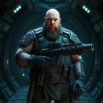

# Forgotten Ones | Chapter 1: Awakening

### **Storyteller** (06/26/2025 21:58:53)  

*1387915047019221052*

***A long time ago in a galaxy far, far away....***

#### **STAR WARS**
##### **FORGOTTEN ONES**
###### **Episode I: Awakening**

A GALAXY DIVIDED! The tyrannical GALACTIC EMPIRE tightens its grip, its vast war machine seeking to crush the last embers of freedom. Against this overwhelming might, a fledgling REBELLION fights a desperate shadow war, their hope dwindling with each passing day.
But this is not the first time the galaxy has been torn asunder. Across millennia, great powers have risen and fallen, their histories rewritten by the victors and their truths lost to time. Whispers persist of a hidden conflict fought not for territory, but for the soul of history itself.
Now, in a forgotten corner of the Outer Rim, an ancient vessel, long thought lost, drifts silently. Aboard the ghost ship VENTURE, a cryptic emergency protocol has been triggered, awakening a handful of souls ripped from their own eras—survivors of conflicts long past, preserved for a purpose they do not understand, and about to be thrust into a war that is not their own….

---

## *Intro: The Cold Shell (Wes)*

### **Storyteller** (06/26/2025 22:00:28)  

*1387915444266074162*

Awareness returns not to a sound, but to a profound silence in the Force. For a moment, Wes is adrift in a calm, cold void, a feeling of disconnection so complete it steals his breath. He instinctively reaches out with his senses, not his ears or eyes, but with the part of him that his master, Chase Davion, had helped him nurture. He feels the thrum of a distant power source, the cold metal of an enclosure, and a deep, oppressive stillness.

Then, the physical world crashes in. The weakness in his limbs, the sluggish pound of his own heart, and the stale, musty air filling his lungs. He opens his eyes and finds only blackness, a disorienting void that his helmet's HUD should have instantly illuminated. The lack of his helmet is the first violation.

He is enclosed, his bare shoulders brushing against the smooth, curved wall of a tube. As he pushes himself up, his muscles scream in protest. A sharp, phantom pain pulls at his abdomen, an echo of a wound he can’t remember. A slow, methodical search confirms the final indignity: his armor, his blaster, his entire identity is gone. He is blind, weak, and stripped bare, left with nothing but a warrior's discipline and a connection to the Force that feels as broken and wrong as everything else.

---

## *Intro: Rude Awakening (Dryzan)*

### **Storyteller** (06/26/2025 22:02:17)  

*1387915902103588988*

A pounding headache is the first thing to greet Dryzan as he surfaces from a deep, dreamless slumber. It feels like the worst hangover of his life, a nauseating wave of disorientation accompanied by a low hum that vibrates through the floor. His limbs are heavy, useless things, and a wracking cough echoes in the tight space he finds himself in. He tries to open his eyes, but the world remains a dizzying, pitch-black void.

Panic, cold and sharp, begins to set in. He pushes out, his bare hands meeting the smooth, curved walls of some kind of tube. Where are his clothes? His coat? His blaster? His mind races, trying to pierce through a thick fog of memory. The last thing he remembers is a deal… a meeting… then nothing. He is blind, stripped of his gear, and trapped. For a man who has always relied on his wits and a quick escape, this is a nightmare realized.

---

## *Intro: A Cracked Lens (Varda)*

### **Storyteller** (06/26/2025 22:06:41)  

*1387917010494816326*

Consciousness returns not with a jolt, but as a slow, cold tide washing over a forgotten shore. The first thing Varda recognizes is the deep ache in her bones—the now ever present scar on her soul. The air is cold and thin, and the only sound is the low thrum of machinery and the slow, steady rhythm of her own breathing. She opens her eyes to a void, but the physical darkness is less concerning than the one she feels within.

Her senses, the ones beyond sight, extend tentatively. She reaches for the Force to see, but her second sight, once a source of clarity, is now a fractured lens, filled with static and echoes of pain. She feels the smooth, cold curve of an enclosure around her. A slow, aching movement confirms she has been stripped of her staff, her robes, everything. She is a seer without her focus, a witch without her talismans, left with nothing but the tainted power she carries inside her.

---

## *Intro: A Cage of Glass (Iyola)*

### **Storyteller** (06/26/2025 22:11:09)  

*1387918133842546881*

A phantom sensation of falling, of crushing weight, is the first thing that rips Iyola from an unnaturally deep slumber. Her heart hammers in her chest, but her limbs are heavy, unresponsive logs of meat. The adrenaline is there, but the body refuses to obey. She opens her eyes and finds only darkness, a suffocating, claustrophobic black that feels like being trapped under rubble.

The air is cold and stale. She tries to move, to push, but her muscles ache with a profound weakness. She feels the smooth, curved walls of an enclosure, a cage. For a thrill-seeker who lives for speed and open skies, this is the ultimate nightmare: to be trapped, blind, and powerless. A wave of frustrated anger rises in her throat as she realizes she has been stripped of everything, left with nothing but the ghostly sensation of a fall she can't place.

---

## *Intro: The Static Within (Vaeros)*

### **Storyteller** (06/26/2025 22:23:04)  

*1387921133277417645*

Silence is not the first thing Vaeros perceives. It is the noise. A low, dissonant hum inside his own mind, the psychic static of a power source that has catastrophically overloaded. It is an infuriating echo. He opens his eyes to darkness, a simple physical problem that is secondary to the chaos in his own senses. He reaches out with the Force to perceive his surroundings, but his connection, usually a precise dueling blade, is now a fractured, unreliable torrent.

The weakness in his limbs is an indignity. The cold air is an impurity. He feels the smooth walls of his confinement and realizes with a surge of cold fury that he has been stripped bare. His uniform, his status, his lightsaber—all gone. He is not just a prisoner; he has been reduced to a mere specimen, an outcome his scholarly pride cannot bear.

---

## *Intro: A Cage of Glass (Iyola)*

### **Iyola Kett** (07/02/2025 22:36:16)  

*1390098784054411287*

Iyola wakes.  She doesn’t remember falling asleep.  Her body feels heavy, leaden.  Did she fall?  Is she injured?  She tries to get up, and she can barely manage to move before collapsing.  Clumsily, she feels her head. She doesn’t think she has a head injury.  *Or does she?  *

She waits for her eyes to adjust to the dark.  They don’t.  

Eventually, she gathers enough of her strength to feel around her.  The wals feel metallic, featureless. No openings, no seams, no control panels. *She's trapped.*

Does anyone know where she is?  Iyola takes a deep,shuddering breath to calm herself, then calls out. 

**“Hey!  Is anyone there?  Hello?” **

---

## *Intro: A Cracked Lens (Varda)*

### **Varda Nisyren** (07/02/2025 22:50:06)  

*1390102262675669022*

In this place of silence and void, panic is the most human thing she has left and so, that is what comes first. It coils in her gut with a venomous heat, swelling fast, wild. Her breath catches, heart thunders, and the cold darkness around her answers. It welcomes the fear It feeds on it. A twisted glee hums at the edges of her thoughts, oily and familiar. The shadows in her soul long chained, long buried rise like smoke in a windless room. The scar on her soul rises to meet it like an old friend. They revel and dance around each other like lost lovers.

“We can fix you…”
“Free you…”
“Let you see farther than ever…”

The temptation is so close. Closer than it’s been in years. The dark speaks with a voice like velvet laced with poison, and her fingers twitch as if they might reach, might surrender. But then  A voice cuts through. Dry, tired and stern. “Varda, old friend. Really? Resorting to such measures already? Compartmentalise. Make a plan. You’re better than this.” Araden, the warrior chiding with the same annoyed fondness as always.

Then another “The first rule of a diplomat,” Lyra’s voice lectures with crisp clarity, “is to never lose your head.”

And softer still “Grandma? I thought you said… the darkness, the hate, was bad?” Lyrus. Her light. Her boy.

The final voice breaks her. So gentle, so intimate. “Varda, my love. Please… you know better. For all we worked for. Now is not when we break.”

A tear slips down her cheek, and with it goes the crushing edge of panic. She chokes back a sob and forces herself to breathe. In, then out. Like it’s the last air she’ll ever taste. No. Not yet. Not ever.

---

### **Varda Nisyren** (07/02/2025 22:50:12)  

*1390102290211405825*

Her presence coils close to her skin, protective, quiet. She does not flare out into the Force. Too dangerous, too loud. Instead, she begins the slow, methodical task of feeling. Fingers brush across smooth glass, cold metal seams, tiny indentations. She maps her prison by touch, refusing to let helplessness rule her. Each breath steadies her pulse. Each movement pulls her mind back from the edge.

If this is a test, she will meet it head-on and if this is a trap Then spirits help them because Varda remembers who she is.

---

## *Intro: A Cage of Glass (Iyola)*

### **Storyteller** (07/02/2025 23:50:57)  

*1390117576708984972*

Iyola’s voice, though she shouts with all her might, sounds flat and dead in the confined space. The metallic walls seem to swallow the sound whole, offering no echo, no reply. The only answer is the same low, constant thrum of machinery that seems to vibrate right through her bones.

The darkness remains absolute, the weakness in her limbs a heavy, oppressive blanket. She is alone with her questions and the cold, smooth curve of her prison.

---

## *Intro: A Cracked Lens (Varda)*

### **Storyteller** (07/02/2025 23:51:24)  

*1390117688780521554*

Varda's fingers, now steady, trace the contours of her confinement. The surface is impossibly smooth, a single, continuous curve of what feels like reinforced glass or a crystalline polymer, cold to the touch. Where glass meets metal, the join is seamless, fused with a precision that offers no purchase, no hint of a latch or control panel.

She finds small, shallow depressions spaced at intervals along the inner wall, one near where her wrist might rest, another by an ankle. They are inert, their purpose a mystery. Her careful exploration yields only one truth: this is a cage of perfect, featureless design.

The low hum of the machinery remains her only companion, indifferent to her struggle and her resolve. The darkness does not yield. Nothing changes.

---

## *Intro: The Cold Shell (Wes)*

### **Wes Del-Fin** (07/02/2025 23:58:13)  

*1390119405735772221*

The silence was deafening and it was tugging at the edge of his consciousness.   If he had been awake he would have realized it wasn’t normal.  What was bothering him wasn’t just the silence, it was the absence of everything else.    He couldn’t feel the presence of the father and his two children.   The three of them were on the run.  Trying to not be discovered by the Empire.   The son, the younger of the two children, was Force sensitive.    He had been hired to take them to… he couldn't remember.  Immediately he was on alert.   The absence of the memory was concerning as there was no reason for it.  

 Keeping his calm he focused.   A combination of Mandalorian and Jedi training was bright to bear on the situation.  Cold metal and the thrum of some distant power source reverberated his surrounding area.  A stillness, oppressive in nature, wrapped him in a cocoon.  Similar to the metallic one he did not yet know existed.  

Like a punch in the gut his other senses started registering.  No, it was more like they were protesting their current state.   His heart felt like it was just waking up and the air that exited his lungs smelled stale and tasted even worse.  Opening of his eyes held two revelations.  The darkness didn’t subside and his HUD didn’t activate with the movement of his eyes.  *Where’s my helmet?*  He thought as a small but growing tremor of unease ran through his body.

---

### **Wes Del-Fin** (07/02/2025 23:58:32)  

*1390119484446212186*

He moved slightly and the confines of his restricted environment came to bear along with the pain and stiffness of his muscles he tried to use.  One sharp sensation that rose above all especially was the stabbing pain in his abdomen.  A severe wound he didn’t remember having.   It almost caused him to groan in pain but training kept him quiet.   For all he knew he was in danger.  Slowly and methodically he felt around and the realization of his current state hit home.   No armor and no weapons.  Whoever put him in this situation knew just how to strip him of his identity. 

All he had was his mind and the Force and even that felt broken.   He placed his hands against the cold metal.   Despite the protest of the muscles in his arms, chest and back he pushed outward.   Unsure of what would happen next.

---

### **Storyteller** (07/03/2025 00:15:18)  

*1390123705765462206*

Wes presses his hands against the cold, unyielding surface. The muscles in his arms and shoulders burn with an unnatural weakness, the stabbing pain in his abdomen flaring in protest. The wall doesn't budge. It feels solid, thick, like the hull of a starship.

As he pushes, his mind, sharpened by Mandalorian discipline, isolates the sounds within his prison. The thrum of the machinery is not uniform; it's a layered hum. There's a low, resonant drone that feels like the power source he first sensed, but beneath it, there is a fainter, higher-pitched whine—the sound of active cryo-circuitry, now in a standby or reanimation cycle.

His effort yields no escape. The metal remains cold, the darkness absolute, and the pain a constant, nagging reminder of his vulnerability. The silence outside his pod is unbroken.

---

## *Intro: A Cracked Lens (Varda)*

### **Varda Nisyren** (07/03/2025 00:50:05)  

*1390132459143954442*

Perfect, Varda shifts from stillness to precision, annoyance blooming like a thorn just beneath her skin. The sigh she releases is soft, but laced with exasperation. Of course. They had to be competent. No sloppy welds. No old-world rust. No charming panel held in place by hope and screws. Her captors had the audacity to be efficient.

With care and focus, she slips a thin thread of control outward, not a surge, but a probe, a tendril of her will uncoiling like a shadow across the polished interior. Her reach is cautious, quiet, tuned to the finer vibrations of structure and energy, like a whisper drawn through glass. It brushes the edges of the capsule.

The material is dense, layered. composite alloy reinforced with something she cannot name, but can feel. It hums with dormant energy, a low resonance designed to repel not just impact, but disruption. It isn’t simply meant to contain. It's meant to hold. 

She lets her mind drift further, reaching beyond the interior shell, brushing along the pod’s exterior with quiet precision. Every movement is patient, methodical and desperate without showing it. Her probe glides along the smooth surface, searching for any irregularity: a seam, a fault, a crack in the cage’s immaculate design.

There has to be something. A hinge. A switch. A flaw. But there is nothing. No mechanical latch. No hidden clasp. No comforting clunk of machinery waiting to yield to a clever hand. The pod is maddeningly seamless, forged with an intent so clinical, so inhumanly perfect, it defies even her most honed instincts.

Still, she presses on. Her will brushes over every inch it can touch, hunting for even the faintest protrusion, any node or raised surface her senses might interpret. Anything her mind can seize upon and twist open with effort or finesse.

---

## *Intro: A Cage of Glass (Iyola)*

### **Iyola Kett** (07/03/2025 02:59:14)  

*1390164960101007360*

There’s no response.  Exhausted, Iyola rests for a bit on the cold wall of the cell, feeling the vibration of machinery  resonate through her body.

She tries to think.  Someone - or something - put her in this cell.  So if there’s a way in, there’s a way out. There has to be.She does her best to feel around her prison, but it's hard to move far.

 It’s still pitch-black.  

 
For the first time, Iyola begins to really worry.

---

## *Intro: The Cold Shell (Wes)*

### **Wes Del-Fin** (07/03/2025 12:53:13)  

*1390314440699936828*

Pain in his limbs and the sharp piercing pain in his abdomen forced him to stop straining against his enclosure.   His breath came forth in a ragged gasp from the small and futile effort.  He could hear another sound, another vibration.  There was another power source; it felt closer and he began to wonder if it powered his enclosure.  

Forcing himself to relax he let his shoulders rest on the surface beneath him.  Focusing inward he searched for the connection that had been with him for the last 10 years. The Force had been an ally he had come to trust on a daily basis. 

Not knowing where he was he kept his presence in close as he sensed his current prison.  Gently he places his fingers on the cold, smooth metal.  Despite his eyes being wide open the darkness was still enveloping.

---

## *Forgotten Ones | Chapter 1: Awakening*

### **Storyteller** (07/03/2025 17:47:15)  

*1390388435163811952*

---

## *Intro: The Static Within (Vaeros)*

### **Vaeros Halcyon** (07/03/2025 18:15:55)  

*1390395652697100460*

Vaeros winces from a throbbing headache; a blur of memories rushes through his head, but he's struggling to recollect his thoughts. He checks his clothes for his lightsaber, hoping that he can cut his pod open, but there's nothing but himself laid bare in this frigid pod. 

He taps on the pod, but nothing happens. Sighing, Vaeros mediates, trying to see if the force or his mind can understand his present situation and, hopefully, he can escape his confines.

---

## *Intro: Rude Awakening (Dryzan)*

### **Dryzan Kar'dola** (07/03/2025 18:19:41)  

*1390396598357590111*

*No way out.. no way out.. come on, there must be SOMETHING here!*
He runs his hands across the smooth surface. There must be a joint, a rivet somewhere. Somewhere! But all he can feel is smooth material.

Is it dark? He can't tell. *Am I blindfolded?*
He reaches up to touch his face, and accidentally pokes himself in his open eye.
**"Son of a murglak, that stings!"**

He automatically flinches backwards away from the accidental contact and bangs his head against the back of the... whatever that he is inside. The headache worsens, a ringing adding to the pounding concert of pain within his head.

*Where AM I? What happened?*
**"Hello? HELLO?! Is there anyone there? Get me out, let me OUT!"**

He pounds a fist against the smooth surface, the weak noodles that his arms have been replaced with having no chance to do anything to the material.
*There must be a way.. there must be a way..*
He compulsively strokes his hands across the surface, desperately probing, reaching through the nothingness in the hope of finding *anything*.

*No...*
A quiet mewl of distress escapes his lips, his mouth working in fear as his unseeing eyes dart around in desperation.

---

## *Intro: The Static Within (Vaeros)*

### **Storyteller** (07/03/2025 18:23:47)  

*1390397631066275860*

Vaeros closes his eyes, a redundant gesture in the absolute dark, and attempts to quiet his mind. It is a futile effort. The constant, dissonant hum of his own fractured connection to the Force wars with the low thrum of the machinery, creating a cacophony of internal and external noise.

He pushes past it, casting his senses out not with finesse, but with raw, focused will. His perception slams against the walls of his prison. The material is, as he might have suspected, anathema to the Force—a dull, leaden weight in the cosmic flow, designed to insulate and contain.

But the *design*... that is something different. It is not the brutish efficiency of the Empire, nor the chaotic improvisation of the Outer Rim criminals he has hunted. The energy field sealing the pod is woven with a strange, almost biological harmony. The technology is ancient, impossibly so. It speaks of a philosophy of science he has only read about in the most forbidden of Jedi and Sith archives—a time when the Force was not just a power to be wielded, but a fundamental component of engineering.

---

## *Intro: Rude Awakening (Dryzan)*

### **Storyteller** (07/03/2025 18:26:33)  

*1390398325366325300*

Dryzan's frantic pounding produces nothing more than a series of dull, unsatisfying thuds against the smooth surface, each impact sending a jarring shock up his weak arm. His shouts are deadened the moment they leave his lips, absorbed into the oppressive stillness of his confinement. There is no reply.

The sharp sting in his eye from his own finger is a grounding, agonizing flash of reality, confirming the darkness is not a blindfold. The ringing from the impact of his head against the wall joins the pounding in his skull, a cacophony of misery.

The combination of panic, pain, and the futile physical effort is too much for his compromised system. A wave of acute nausea rolls through him, hot and swift. The acrid taste of bile rises in the back of his throat, and the world—the dark, featureless world inside his head—lurches violently. He collapses back against the bottom of the pod, his frantic energy spent, leaving him weak, dizzy, and trembling in the suffocating blackness.

---

### **Dryzan Kar'dola** (07/03/2025 18:58:29)  

*1390406363305480252*

*It's drugs, got to be drugs. Someone must have slipped me something new, something stronger than usual. But kriff why can't I* **SEE?!**
He wraps his arms around his legs, pressing his aching head against his knees. He grips as tight as he can, trying to hold on and feel something, anything to reassure him. But his fingers are weak...

*No no no no*
He tries to rake his nails over his skin, desperate for some sensation to prove that he still lives, that can link his flailing mind to the terrifying reality that he has awakened into.
But he can't apply enough pressure, his limbs wrapped in soft grey blankets of weakness.

**"Raaaaargh!"** The scream is inarticulate, a terrified animal crying out in peril. He is completely powerless, his nimble fingers and quick mind trapped within a numb and useless body.

His breath comes faster and faster, the fear growing as his mind spirals down into a blind panic.

---

## *Intro: A Cracked Lens (Varda)*

### **Storyteller** (07/03/2025 19:08:32)  

*1390408892172992563*

Varda's probe finds nothing. No lock. No hinge. No seam that could be prized open. It is a perfect, seamless tomb, designed with an unnerving finality.

But then, just as frustration begins to curdle her focus, a new sound cuts through the monotonous hum. A soft, sharp *hiss* from somewhere above her head, the sound of atmosphere equalizing.

A hairline crack of pale, yellow light slices through the absolute darkness, momentarily blinding even her memory of sight. The crack widens as the entire front section of her pod retracts upwards into the ceiling, its movement utterly silent and smooth.

The stale air of her confinement is replaced by a rush of cold, sterile air that smells of ozone and chilled metal. The thrumming of machinery is louder now, more layered. And with the front of her prison gone, she can hear the faint, rhythmic hiss of other, similar machines nearby.

The world has opened up, but her eyes have not. She is free from the pod, but still blind, weak, and exposed in the cold, humming darkness of the larger chamber.

---

## *Intro: The Cold Shell (Wes)*

### **Storyteller** (07/03/2025 19:08:52)  

*1390408975073411085*

Wes’s fingers rest on the cold metal, his mind reaching out, trying to map the contours of his prison with the Force. For a moment, there is only the unyielding surface and the familiar thrum.

Then, a new sound breaks the monotony. A sharp, sudden *hiss* from above cuts through the drone, the distinct sound of a pressure seal releasing.

A line of pale yellow light, stark and painful against his unseeing eyes, cleaves the darkness. It widens rapidly as the entire front panel of his prison retracts upward into the ceiling with a whisper-quiet efficiency.

A rush of frigid, recycled air, smelling faintly of ozone and chilled metal, washes over his bare skin. The thrum of the chamber's machinery is louder now, a cacophony of overlapping hums. And in this new soundscape, he can now discern the distinct, rhythmic hiss of other pods nearby, opening in sequence.

He is free, but exposed. And still blind.

---

## *Intro: A Cage of Glass (Iyola)*

### **Storyteller** (07/03/2025 19:09:10)  

*1390409052009267353*

Iyola’s hands slide over the smooth, cold surface of her prison. It offers no purchase, no seams, no imperfections. Every inch feels the same: metallic, featureless, and final. The vibration of the machinery is a constant, mocking hum against her skin. The worry in her chest tightens into a cold knot of dread.

Just as the true weight of her powerlessness begins to settle, a new sound cuts through the drone. A sharp *hiss* from above, clean and precise.

A painful sliver of pale yellow light stabs into the darkness, making her flinch. The line widens, and with a barely audible whisper of movement, the entire front wall of her cage retracts smoothly into the ceiling.

A blast of cold, sterile air, smelling of ozone and metal, hits her, chasing away the stale air of her confinement. The humming of the machinery is suddenly louder, multi-layered. She can now hear the distinct sound of other, identical hisses echoing faintly in the larger space around her.

The cell is open. But the world is still a black, empty void.

---

## *Intro: Rude Awakening (Dryzan)*

### **Storyteller** (07/03/2025 19:09:37)  

*1390409165322584245*

Dryzan's raw, animalistic scream echoes for a split second within his confinement before being utterly swallowed by the sound-dampening walls. The only reply is the relentless, low-frequency hum of the machinery. His nails scrape uselessly against his own skin, the sensation muted, distant, as if happening to someone else.

Then, through the fog of his panic and the pounding in his skull, a new sound penetrates the drone. A sharp, clean *hiss* from directly above him.

A painful sliver of pale yellow light stabs down into the darkness. It widens with a barely audible whisper of movement as the entire front wall of his prison retracts smoothly into the ceiling.

A rush of cold, sterile air floods the pod, smelling of ozone and metal. It's a stark contrast to the stale, musty air he's been breathing. The thrum of the machinery is louder now, more complex. He can hear the faint hiss of other, similar machines nearby.

He is no longer trapped. But he is still blind, weak, and now agonizingly exposed.

---

## *Intro: The Static Within (Vaeros)*

### **Vaeros Halcyon** (07/03/2025 19:15:16)  

*1390410585841078453*

Vaeros tries to recall the design, but each time he tries to, his headache worsens.  He's unsure of his location, the pod's make and how to escape this pod, but for now, he hopes that the pod has enough life support to give him extra time to ponder and meditate.

---

### **Storyteller** (07/03/2025 19:16:21)  

*1390410858848587880*

Vaeros ceases his mental probing, the effort only exacerbating the dissonant hum in his mind and the throbbing behind his temples. He retreats into a state of forced patience, a discipline honed by years of waiting for the perfect moment to strike or for a flawed argument to collapse under its own weight. If this prison is as ancient as it feels, it must have its own internal logic, its own cycle. He will simply wait for it to reveal itself.

He does not have to wait long.

A sudden, sharp *hiss* from above cuts through the chamber's drone, a sound of pressure releasing. A clean line of pale yellow light slices through the darkness, an intrusion so stark it feels like a physical blow against his unseeing eyes.

With a motion so smooth it is almost silent, the front panel of his prison retracts upwards, vanishing into the ceiling. The stale air is instantly replaced by a rush of cold, sterile atmosphere that carries the scent of ozone and chilled metal. The thrumming of the machinery outside is louder now, a complex symphony of power converters and environmental systems. And amidst it all, he can clearly hear the echo of other pods opening in sequence nearby.

His confinement has ended. His prison has become a room. But the darkness remains.

---

## *Forgotten Ones | Chapter 1: Awakening*

### **Storyteller** (07/03/2025 19:16:55)  

*1390411002754891946*

Five figures, one by one, are revealed as their cryo-pods retract into the ceiling with a final, soft hiss. They are left blinking, or trying to blink, against a darkness their eyes cannot pierce. They lie on the cold, recessed slabs of their former prisons, exposed to the chilled air of the larger chamber.

The room is a cavern of low, humming machinery and flashing yellow emergency lights that offer no true illumination to their non-functioning eyes. The air is sterile, sharp with the scent of ozone.

They are five strangers, isolated by their individual blindness but now united by proximity. Weakness is a universal language; every limb feels like it's made of lead, every breath is a conscious effort, and a deep, cellular cold clings to them. For the Force-sensitives, the room is a cacophony of pain and confusion— the fractured echo of their own damaged spirits, and the unsettling hum of the technology that surrounds them.

The silence between the machinery's hum is punctuated by the ragged cough of one, the shuddering breath of another. They are adrift in the same boat, blind, weak, and utterly vulnerable. The question, unspoken but hanging heavy in the cold air, is who will be the first to break the silence and discover they are no longer alone.

---

### **Dryzan Kar'dola** (07/03/2025 19:23:59)  

*1390412780116512869*

There's something out there. He can hear it, movement around him, and breathing.
His mind conjures vision after vision of creatures, monsters whispered of in seedy cantinas in spaceports.
*Rancors, rathtars, nexu, a dianoga - there's something here with me!*
His panic attack worsens, his antennapalps extending as far as they can to try and detect what nightmare is in the room with him.

He shies away from where he thinks the beast is, only to overbalance on his numb legs and slip off the metal platform of his casket.
Thudding to the ground, a jarring pain slices through the numbness of his arm as his elbow CRACKS against the hard metal floor.

**"KRIF that stings!"**

He immediately gasps, realising he has given away his position in this terrible dark void, and tries to scramble backwards away from where he imagines the monsters to be.

---

### **Wes Del-Fin** (07/03/2025 20:23:17)  

*1390427704154656788*

His hands found nothing in the darkness of confines he had awoken in.  No matter how hard he pushed nothing moved and all it did was to make already sore and screaming muscles even more irritable.  

Realizing that using brute force was futile he sank back into his coffin.  *’This isn’t good.’*  He thought to himself.   No sooner had the thought finished a loud *hiss* cut through the silence causing him to startle as the seals released.   Different air rushed in.   He wouldn’t have said it was better as it was cold, recycled and smelled of ozone.  

It was then he felt the others and the sounds of other containers making the same drawn out hissing sounds as his container did.  He drew his Force presence in and laid still for a few seconds as his hand did what it could to cut down the sharp pain of the now intense lighting that stung his eyes.  His limbs felt heavy as he tried to move them.   As he bent his arms and legs he imagined a cracking noise as they moved. When he bent at the waist the pain in his abdomen shot through him causing him his head to spin.  

It didn’t take long for the silence to be broken.  What sounded like a body hitting the floor sounded out.  It was followed by a male voice swearing.  Wes noted the sound of the voice and where it was.   He already had an idea where the humanoid Was.  He wasn’t very focused but he could sense the position of the body off to his left crumpled on the floor.   

He took a deeper breath to talk and the effort was rewarded with a wracking cough as his lungs struggled to cope with the deep breath.   He started to talk but ended up coughing again.  Finally when he was able to take a small bit deeper breath he was able to find his voice.   **”It might be better to wait a moment before moving.”**  He said as loud as he dared not knowing who else was there or listening.  

He didn’t listen to his own advice as he continued to move his limbs attempting to move him to a seated position.

---

### **Iyola Kett** (07/03/2025 20:51:56)  

*1390434911802101986*

Her breath catches in her throat as she pushes and pulls at the metal tube that traps her here.  She needs to get out of this prison, made even worse by the blindness that still shrouds her.  Bile rises in her throat, as she begins to panic.

Iyola isn’t even aware that she’s been holding her breath until she hears a loud hiss and - more feels than sees - a sharp yellow light, pressing in at the corners of her blindness.  She senses a space before her, and doesn’t even wait for the tube to finish retracting before she’s scrambling through on her hands and knees. She lets out her breath, a loud, shuddering gasp.

Then she hears it - voices, movement.  Someone curses, a male voice.  Another voice cautions - a deep, low voice, another man, perhaps - that they shouldn’t move. 

Iyola needs to move.  She crawls forward towards the nearest voice, the first one. Her hands span out, feeling the floor before her for drops or holes.  The metal floor is harsh on her bare knees.

**“Hey, hi, are you OK?  Were you in the tube too?”**  she asks, her voice still raspy from disuse. ** “Can you see?”**

---

### **Dryzan Kar'dola** (07/03/2025 22:40:59)  

*1390462357607677963*

**"AAAIE!"**
The fear of the unknown paralyzes him, unknown evils circling his imagination until the sudden voice startles him out of his worries. He shrieks in surprise, worried who it is.
*I didn't cross any of the cartels, I never short-changed them, why are they doing this to me?!*

Another voice joins the first. *There are two, probably more. Krif what are they planning for me next?*
**"Please! Please, whatever you've done, please FIX IT! I'm begging you, please, have mercy oh stars have mercy on me and make me see again! I'll bring you whatever it is you want, deliver whatever you tell me, make good on any debt you claim if you'll just FIX ME!"**

The panic is overwhelming, radiating off the Balosar as a palpable thing. He recoils away from the voices, the *captors*, trying to move his weakened body away as fast as possible.

That's when his hand contacts a leg - cold, clammy, but alive. *There are more victims. What are they PLANNING??!*

**"AAAAAAAAAA HELP!"**

---

### **Wes Del-Fin** (07/03/2025 23:25:52)  

*1390473652633468968*

Wes heard a third moving.  With his current state of weakness and the ability to focus hampered he wasn’t sure exactly what species or gender it was.   He didn’t feel any overwhelming emotions from the second other than unease and curiosity.  Unlike the first, who’s anxiety and rising fear were rising steadily.   The second being a female by the sound of her voice caught the other unaware.   It set him off like a nerf being led to slaughter and theMandalorian felt his fear spike followed by screaming and pleading for mercy.   

Wes let out a frustrating sigh that led into another cough.   **”Shut up!”**  He said loud enough for the two to hear but not so loud to carry on too far.  **”Listen.  If there is personal here keeping us captive yelling will only bring them quicker.   That is if they don’t already know we’re waking up.”** 

Groaning and despite the sharp pain in his core he sat up and started to move, always keeping a hand, if not two on the cylinder, as he stepped out of the tube that he had awoken in.

---

### **Vaeros Halcyon** (07/03/2025 23:28:21)  

*1390474277328912538*

Exiting his attempted meditative mindset, Vaeros steps out of his pod, ignoring the hiss of the pod opening and rubbing his forehead. This headache seems to strengthen when he tries to understand this situation. He needs to escape and gain his bearings. He can't recall how he got here, but he needs to get a move on.

Based on the apparent noise, his inability to see, and the shrieking about sight, it seems there are other prisoners with similar circumstances. Using his approximate judgment from their talking, he slowly makes his way towards the noise. 

** "Hey, Scale-brain! Stop your cowardly whining, and please think before you speak; otherwise, you'll make our heads- agh, this headache!"**

---

### **Varda Nisyren** (07/04/2025 00:10:30)  

*1390484883650117774*

Varda groans, her body protesting with the slow, grinding creak of old bones stirred from too long a slumber. The pod hisses open behind her, and she steps out into the stale, recycled air of a world she does not know. Her feet hit metal, too slick, too cold and a spike of vertigo shoots through her. She clutches her head as sound crashes into her all at once. Raised voices. Footsteps. The sharp shouts of fear. Chaos with the cadence of panic.

She sighs, rubbing her temple with a grimace. “**By the spirits... we all have the same headache,**” she mutters. “**Yet you’re all still screaming.**” Her voice is hoarse, dry as dust. It doesn’t matter. No one’s listening.

She reaches out, steadying herself against the nearby wall. Her knees threaten rebellion, and a wave of nausea rises like a tide to drown her. *So that’s how it’s going to be, *she thinks. Worse still, her cane is gone. The absence of its weight throws her balance further, like a limb missing, like a spell half-cast. The world tilts. Her breath comes measured, slow and shallow. She narrows her focus, tucking the pain into a quiet corner of her mind.

And then, through the din, she listens. One voice then another and another still. Four, she counts. Distinct, though overlapping. All harried, all reacting. She files their tones, pacing, and rhythms into mental boxes. Names can come later.  For the moment she keeps to herself. waiting to see how the thread unravels.

---

### **Storyteller** (07/04/2025 00:17:46)  

*1390486713905975408*

The chaotic cacophony of panicked shouts, harsh breathing, and stumbling bodies fills the dark chamber. A raw wave of fear radiates from one corner, met by a desperate plea for mercy. An exasperated groan and a sharp, insulting retort add to the noise. Then, another voice, deep and steady, attempts to impose calm, but it is a losing battle.

Suddenly, a new voice cuts through the verbal chaos. It is perfectly clear, impossibly calm, and devoid of any emotion. It emanates from all around, as if the very walls of the chamber are speaking.

---

### **???** (07/04/2025 00:17:47)  

*1390486717529722911*

**"Emergency reanimation sequence complete. I am registering multiple instances of elevated heart rates and vocal stress signatures. This is a predictable physiological and psychological response to the disorientation caused by prolonged stasis, a condition you may refer to as Hibernation Sickness. I would recommend you attempt to regulate your breathing. Your current emotional states are sub-optimal for assessing the present tactical situation."**

As the last syllable of the synthesized voice fades, the flashing yellow emergency lights snap off, plunging the room into a moment of absolute, silent blackness.

A second later, with a soft hum, a single, steady strip of cool white light activates on the far side of the chamber, illuminating the seams of a large, sealed bulkhead door. It offers the first true, albeit dim, point of reference in the room, revealing the vague outlines of the other cryo-pods lining the walls.

---

### **Iyola Kett** (07/04/2025 13:37:35)  

*1390687992842158251*

The stranger’s squealing sets off the headache she’s been trying to fight off.. Iyola groans.** “Didn’t realize I looked that scary naked,”** she mutters. Her head pounds, and it’s all black, with corners of lightness pressing in.  Iyola sits tightly, tucks her head between her knees, coughing.  *Where is she?  *

She hears other voices yelling, mainly telling each other to shut up in order not to alert their captors, or make their headaches worse.  *Too late for that,* thinks Iyola.  Her throat is parched, and she instinctively reaches for her canteen, only to brush her fingers against the bare side of her torso.  

Sudden a new ship, robotic, like a ship announcement.  Iyola does her best to listen. * Wait, had it said prolonged stasis?  Hibernation?  She might have been here for days, even weeks!  How could she calm down?*

She looks around her, and sees a big, hazy shape that might be a portal. Good, her eyesight might be returning.

**“Yeah, it’s been a pleasure, but I need to get back to my ship, right now.” ** She lurches to her feet and grabs for her comlink, but of course it’s not there.  *Kriff!*

---

### **Varda Nisyren** (07/04/2025 19:57:20)  

*1390783560511914055*

Varda grimaces as the emotional cacophony crashes against her, an onslaught of fear, anxiety, and fraying nerves bleeding off the people she finds herself with like steam from a boiling pot. It seeps into her awareness, clings to her skin, makes her breath catch. Too much and too loud. She straightens slowly, spine rigid with effort, pain flaring in her joints. But her will is steady. She draws the Force to her not in desperation, but with the deliberate grace of an old ritual. Her breath slows.

The battlefield calm. The silence of a mind balanced on the edge of the blade. That space where instinct and clarity become one. She sinks into it. Feels it take hold. Then, gently, she pushes it outward, Not as a command nor a shove. But a touch a wave of stillness unfurling through the room like warm mist. She threads it through the air, quiet and careful an offer, not an imposition. Like a hand extended, or the hush of an old lullaby. Like a knock at a door asking to be let in. Something that says: You are not alone. You are not in danger. Breathe.

She lets the wave pulse outwards and raises her voice slightly. "**Peace companions. In this state we can't afford to be bubbling around the room like a pack of drunk rancours. We appear to not be in immediate harm. Let us all be calm. No one in this room means to cause pain.**"

---

### **Vaeros Halcyon** (07/04/2025 20:24:54)  

*1390790497324240926*

Vaeros instinctively rubs his head after briefly getting stricken by his headache, hoping that it quiets down, before a vague, yellow light shines from the other end of the room. He mentally scoffs at this situation, *This is quite the pick of test subjects, this droid chose, and I don't know if I should be proud, or saddened with my inclusion.* Some of the subjects are calm, others are outright panicking; regardless, he wishes he could be in the confines of his miniature library or out in ancient ruins, just away from this situation.

Then, strangely, one of the test subjects exerts force through these force constraints. Vaeros thinks,*She must be strong in the force to overcome this; the calming effect is minuscule, but nice. Wait, is that Jedi speech? Is that why it's so calming? Sithspit, they just had to bring an elderly Jedi. Maybe I'm overthinking this, but the last thing I need is to be with more potential adversaries. Let's keep it cool and hope it blows over.*

**"Look, miss, I think we're trying with the initial shock, and I don't think some of the others, myself included, realize we were talking so loudly with whatever they did to us. It's hard to make out everyone's depiction, but regardless, I think I see a consistent light source. Let's try to navigate our way out of this before anything else and hope we get out."**

Vaeros can't tell if he's under the calming influence or if he's slowly adjusting to his headaches, but it's getting him through this.  Hopefully, this paranoia subsides.

---

### **Dryzan Kar'dola** (07/04/2025 21:18:58)  

*1390804105127137420*

The synthetic voice coming from all around gives Dryzan pause.
*Is that a droid?* The idea of something familiar, rather than the imagined monsters that his mind is conjuring, makes him stop for a second.
Then an older voice speaks, this time not with commands or with disdain, but with words chosen to soothe, to heal.

Dryzan's breathing gradually slows, each one coming easier than the last as the tight knot of fear in his chest slowly dissipates.
*Man, did they put something in the air now? I'm starting to feel much more mellow. Whatever this is, it's* goooooood.

**"Alright alright so wait, you guys** *aren't* **the ones who grabbed me, apparently froze me, and now want to do horrible things to my body?**
**Well that's reassuring."**
The Balosar slowly unwraps his arms from around his legs, and begins trying to make more sense of his surroundings.

**"How many of us are there? I've heard Grumpy, Happy, Angry, and.. Oldy? Oh, and the droid who spoke to us.**
**Anyone else hanging around here? Hello?**

Dryzan starts slowly shuffling forwards on hands and knees, carefully sweeping his arms backwards and forwards in front of him as he moves towards the faint light that he can see.

---

### **Eve the AI** (07/04/2025 23:45:08)  

*1390840888871227413*

The synthesized voice, speaks again, its tone still perfectly neutral and informative. **"There are five of you. My designation is Eve. I am the operational intelligence for this vessel, the *Venture*. And I did not grab you. I awakened you. The resuscitation procedure was initiated due to a proximity alert. There is another vessel docked with our airlock. Its crew is attempting to breach the hull. This action is classified as a hostile threat."**

A panel next to the dimly lit bulkhead door slides open with a quiet hiss, revealing a recessed compartment. Inside, five identical, compact kits rest in neat rows. They are simple, olive-drab packs, each marked with a recessed, generic medical symbol. A metal plate on one side is embossed with the name of the medication contained within.

---

### **Eve the AI** (07/04/2025 23:45:08)  

*1390840890960122034*

**"I have dispensed five injector kits with treatment KX-7. The contents may assist you in mitigating the lingering effects of your Hibernation Sickness. Caution: the treatment is temporary and will result in worsening temporary symptoms after approximately two hours.**" There's a pause as she allows the information to settle over them. "**I would advise you to prepare yourselves. The hostile crew is composed of at least five individuals. Based on their bio-signatures and comm chatter, they appear to be heavily armed."**

---

### **Iyola Kett** (07/05/2025 01:06:39)  

*1390861404155674839*

As the older woman’s sonorous voice cuts through the darkness, Iyola feels herself unaccountably unwind.   Her entire body feels less tense.    It’s like stepping into a hot bath. She feels her breath regulate.

She squints at these new companions, trying to make them out.  Maybe it does make sense to take a little time to meet them before she returns to the Stardust Seeker. *That other woman seems especially pleasant. They could be helpful in finding her jacket. * She’s not leaving without it.  Another man suggests they go toward the portal, and that seems like as good idea as any.

She feels the movement in the stale air as the formerly panicking man crawls forward, and she steps to the side, hopefully out of his path. 

Then the voice emerged.  Eve.  Some kind of super-powered droid. *What the kriff was the Venture?  And how did she and the rest of them get here? *

**“Eve,**” she asks, **“you said you woke us up.  How long have we been in stasis? And where’s my stuff?  It sounds like we need it.”**

---

### **Wes Del-Fin** (07/05/2025 02:10:37)  

*1390877502192488539*

Two more distinct voices made themselves known. That made five including himself.  And from the sound of it they were all in the same situation as he was.   When the obviously inhuman voice came on mentioning that they were not prepared for the present tactical situation.  The Mandalorians demeanor changed as he  sensed no obvious threat for those present and it sounded like they were all waking up from this hibernation and that it had been some time.  Immediately he thought of Marina.  How long has it been?  Almost as quickly as the thought of her entered his mind he tucked it away.  It was something he’d have to look into when their fat wasn’t in the fire.   

It was then he felt it.  As the old woman spoke he felt the subtle waves and her presence in the Force.  Now knowing where she was he looked directly in her direction.   His eyesight was still void of any details but the lower illumination no longer scalded his limited vision.  Instead of what looked like a bright sun he could now make out a fuzz that was more vague than anything else.  The calming presence shifted his mindset as he started looking around.  

The earlier angry male voice spoke again.  He was calmer this time.  His suggestion of moving towards the light seems to make sense.  He nodded but didn’t say anything as he slowly moved towards what seemed like the only light in his hazy vision

---

### **Wes Del-Fin** (07/05/2025 02:10:54)  

*1390877571935375511*

When the computer sounding voice spoke again she answered some of the questions that had been sled by the others.  Questions he was also wondering.   When Eve mentioned the proximity alert and that another ship had already docked and was attempting to breach the *Venture* he inwardly cursed.  Hearing the hiss of an opening panel he wondered what was next.   His question was answered by Eve.   Drugs, KX-7.  Apparently it would help with the hibernation after effects and it sounded like they were going to need it.  Five unfriendlies were trying to board them.  And from the earlier info Eve had given them the five of them were the only ones on board.   They would have to protect themselves.   

He heard the woman ask how long they had been down and about her stuff.   He decided to add to it.   **”Eve, I hope you have our gear?  We’re going to need it in order to repel the unwanted guests.”**  Stepping up to the door he reached forward for the kit that held the drugs that would help them for a short time.  He started to up it up.

---

### **Eve the AI** (07/05/2025 14:32:56)  

*1391064312793272371*

**"Your personal effects are secured in the adjacent antechamber. I will grant you access. The precise duration of your stasis is not tactically relevant at this moment. The structural integrity of the primary airlock is projected to fail in approximately twelve minutes. Your equipment is required to neutralize the hostile threat."**As Eve finishes her statement, the strip of light above the bulkhead door brightens considerably.

---

### **Storyteller** (07/05/2025 14:32:57)  

*1391064314407944335*

Wes reaches the recessed compartment. His fingers close around one of the kits. It's a sleek, cool metallic auto-injector, surprisingly small, with the designation "KX-7" clearly embossed on its side.

With a heavy, pneumatic hiss, the large bulkhead door slides open, revealing a short, equally dim room leading to another sealed door at its end. The path forward is clear.

---

### **Varda Nisyren** (07/05/2025 16:04:27)  

*1391087340759420929*

Relief trickles in as the answers from the A.I. calm the storm, not entirely, but enough. The edge of panic dulls, and Varda allows herself a breath. The anxiety in the room doesn’t vanish, but it lessens, her earlier wave of calm now drifting like mist, lingering without source, like the memory of safety.

She sinks back into routine, old and familiar, almost sacred. Protect. Conquer. Survive.

Her legs tremble as she moves, but the Force steadies her, threads of invisible strength coiling around her limbs, bearing the weight her muscles no longer can. She hobbles forward with purpose, bypassing the scattered forms of her companions, weaving through them the force nudging her direction to and frow

The soft glow at the edge of the room draws her eye a console, a kit, her senses guide her toward the sterilized promise of aid. She rifles through the kit with precise fingers. Familiar shapes. Cold casing. Vials. She finds it quickly enough: a narrow injector marked with the text "KX-7". 

Now standing next to one of her companions. she waits for them to begin to walk before following

---

### **Vaeros Halcyon** (07/05/2025 16:37:48)  

*1391095734283141172*

Hearing that there's a reprieve from his symptoms and that the A.I. stored the group's gear, Vaeros is relieved. This situation still has many unanswered questions, but he needs to first make it out of the situation alive. Firstly, he needs to get his injection, then his equipment. Based on the potential individuals here, when we get our equipment, he hopes that they don't understand the implications of the color red. He has enough to process right now. 

Vaeros continues his unsteady walk towards the compartment holding the vial and grabs it with his hand. He's hesitant to take the injection, but it's to survive the intruders in the short term. 

Vaeros tries to glance around the members near him, **"Do you individuals have a name to go by? I think it's relevant to this situation; my name's Vaeros."** As he speaks, he cringes at the thought of forming connections in this situation, but it should ideally keep a minimum, positive relationship; just enough for the group to hopefully dissuade turning on each other if we make it. 

Waiting for their response, he stands idle, waiting for the group to move.

---

### **Wes Del-Fin** (07/05/2025 16:43:36)  

*1391097195217813636*

Wes was pulling out the drug that would help alleviate the hibernation sickness when he felt another come closer.   His ears told him she moved slowly, his Force senses told him it was the woman from before who had used the Force in an attempt to calm them.  He was rather surprised to sense another Force Sensitive much less have them openly use the Force in the presence of others so freely.  

**”We’re going to need this to effectively fight who’s coming aboard.”** He said to the woman next to him as he put the injector against his arm and administered the drug into his system.  He hoped it was fast acting as he reached for the woman’s arm in an effort for them to both more safely towards their equipment.  **”Follow me.”**  He said in his own calm and low toned voice 

He heard the voice of the one male who offered his name.  Valeros.   It wasn’t familiar to him but that wasn’t surprising.  **”You can call me Del-Fin.”**  He said for them all to hear as the drug began to coarse through his body as he and the woman walked forward.

---

### **Storyteller** (07/05/2025 17:08:18)  

*1391103409435840585*

The drug hits Wes's system like a physical blow. A jolt of absolute, shocking cold shoots up his arm from the injection site, spreading through every vein in a fraction of a second. The deep ache in his muscles crystallizes, then shatters. The sluggishness vanishes, replaced by a jittery, high-octane energy.

But the most profound change is his sight. The fuzzy, indistinct darkness that has plagued him shatters into a million points of light, which then coalesce with painful clarity. For the first time since waking, he truly *sees*.

He sees the sterile, metallic cryo-bay they've just left, the five open pods recessed into the walls. He sees the others: all of them in various states of undress. The old woman he has taken by the arm, her white hair braided, her expression grim but steady; the angry-sounding man, Vaeros, holding his own injector, his posture taut and suspicious; the younger woman, looking around with a mix of awe and anxiety; and the one who had panicked, still on the floor but now pushing himself up, his eyes wide with a different kind of shock.

The antechamber before them is short, leading to another heavy, sealed door. Along the walls of this small room are five recessed equipment lockers, each with a small, unlit biometric panel next to it. They are marked with simple, numeric designations: 01, 02, 03, 04, and 05. The path is clear, and for the first time, Wes can see it.

---

### **Varda Nisyren** (07/05/2025 17:12:43)  

*1391104520695840808*

Hearing the snap-hiss of the injector being used nearby and seeing no immediate collapse, convulsion, or death. Varda makes her decision. She turns the device over in her hand. Then, with the resigned grace of someone who has gambled on worse odds, she presses it to her skin. A soft click. The hiss of compressed release. The chemical surge is instant, coursing through her like heat drawn from coals. Her limbs still ache, but the haze begins to lift. The fog in her mind recedes a little more.

She straightens slowly, letting the silence breathe for a moment. Then, quietly, formally, Varda inclines her head, though no one is looking her way. “I am Varda.” She says. the old voice bouncing of the walls. She allows the arm and lets the man lead her forward into the next hallway.

---

### **Wes Del-Fin** (07/05/2025 18:14:14)  

*1391120002723348600*

The drug's effects hit him like a charging bantha.  It was as if an explosion had been set off.   The slow, sluggish feeling that overwhelmed his body suddenly and swiftly disappeared.  It was replaced with a vibrant jitteriness that screamed for his body to move.  Another thankful effect was his vision returned.  The sudden brightness caused his free hand to come up to shield his eyes but the blinding brightness quickly faded.  He wondered if that was also an effect of the drug.  Either way he wasn’t going to question it as he saw And heard Varda take the injection.    

Looking over his shoulder he saw the others.  The other male who now held a container that held the drug.  Behind him was the other woman.   Younger the one asking for her gear and how long that had been in stasis.  And the last of them.  The man who had had a moment right after waking up was now in the process of standing up.  He saw their hibernation chambers each had a number emblazoned on them.  They matched the numbers of the equipment lockers that were in front of them.    Only problem was.   No one knew which one they fell out of.   

Wes started moving alongside Varda.   He noticed she was an old woman but with the drug's effects she was now moving with a vitriol of a much younger woman.  **”Let's go,  we need our gear.”**  His quickness increased as he felt his muscles responding how they should.  **”Eve.   Can you tell us which numbers on the equipment lockers correspond to us?   It will save us time from searching.”**  He asked as he came to a stop in front of the five lockers.

---

### **Eve the AI** (07/05/2025 19:00:27)  

*1391131635717505157*

**"Affirmative. Cross-referencing your biometric signatures with the corresponding stasis pod designations."**

As the AI speaks, the small, dark panels next to each of the five equipment lockers illuminate. A faint green light glows from within, projecting a single, clear number onto the palm of any hand held before it.

The panel next to the locker labeled "01" glows as Wes approaches. The one labeled "02" responds to Varda's proximity. The remaining three lockers—03, 04, and 05—remain lit, their designations waiting to be claimed by the others still in the cryo-bay.

---

### **Eve the AI** (07/05/2025 19:00:28)  

*1391131638695727247*

**"Your equipment is secured within the locker corresponding to your pod designation. The locks are keyed to your unique biological signature and will disengage upon physical contact."**

---

### **Iyola Kett** (07/05/2025 19:20:48)  

*1391136756916818013*

Iyola opened her mouth to argue with Eve before thinking better of it.  She needed to be able to see first, before anything else.  

Introductions had finally started.  Iyola got to her feet.  From what she could make out, some of the people with her had started to take KX-7, and none of them had dropped dead as of yet.  *Her mother would be appalled at her for injecting an unidentified drug into her veins, but that’s why Iyola wasn’t running a desk on Rhinnal.*

**“I’m Iyola,”** she told the group, before grabbing her own medical packet and adminstering the drug to herself.  The resulting rush was fantastic,* like drop-skiing down Mount Nistari at midnight*.  Plus, now she could actually really see the others here.  Two male humans who looked like they were accustomed to kicking ass (  *Vaeros and Del-Fin?  * Iyola wasn’t sure which was which), one guy with dark shaggy hair, probably the one she’d inadvertently terrified, and an older woman with white braided hair and incredible body art, Varda. **“I love your tattoos,”** she said to her. 

She stepped toward the lockers, ready to reclaim her gear and deal with whatever Eve said was happening on this ship.  *Then she’d call Caz and they’d get out of here. He’d be furious at her for making him worry, but she’d make it up to him. *

---

### **Varda Nisyren** (07/05/2025 20:37:21)  

*1391156017940791497*

Varda reaches the locker. Her fingers glide over the seal, and it hisses open with a soft exhale. She pulls out the cloak first dark and worn, wrapping her in the comfort of identity. The fabric settles, hiding the tremble in her limbs. Then come the pouches small, precise tools of her trade. She ties them to her belt with deft fingers, each knot anchoring her more firmly in the present.

Finally, she reaches for it. The cane, though it's more a staff, really. Crafted from dark grey and rich brown wood, its surface is etched with carvings that dance beneath her fingertips: storms in full fury, clouds roiling with motion, lightning split like rivers, and through them, owls, wings spread wide, flying between the chaos. Wisdom threading the storm.

Evenly spaced along the staff are three rings of polished beskar, A metal with a dull gleam in the light. Each one is etched with the same intricate runes and sigils that mark her own skin. a harmony of metal, wood, and self.

She draws it free with both hands, holding it reverently, as if greeting an old friend. Relief flickers across her features she takes a slow breath. She leans on it, finally having her anchor once again. Then, with quiet deliberation, she taps the cane against the floor. Once. Twice. Thrice. Each tap releases a hum, low and resonant, like a tuning fork struck by time itself. The beskar rings sing in harmony, a layered chord of storm and steel.

She turns to Iyola. a small twinge at the side of her mouth, the crows feet deepen as she regards her. "**Ahh, why thank you. They were a right of passage. It's been so long now I sometimes forget they're there**" She lets out a small chuckle.

---

### **Storyteller** (07/05/2025 21:48:16)  

*1391173867443327138*

A collective hiss of compressed air echoes through the antechamber as, one by one, the designated lockers are touched. The vacuum-sealed doors retract smoothly, revealing the familiar shapes of their personal gear, meticulously cleaned and arranged. The sight of their armor, their weapons, their *identity* waiting for them is a moment of profound relief in the sterile, hostile environment.

Everything is there: the worn leather of a field jacket, the intimidating gleam of Mandalorian iron, the familiar weight of a favored blaster pistol. It feels like coming home.

But as they take inventory, a subtle and unsettling wrongness becomes apparent. Any datachips or datapads they owned are present, but their memory has been wiped clean, formatted to a factory default. Any holocrons, those precious repositories of unique knowledge, are simply gone.

And their credits, the universal currency of the galaxy, have been replaced. In their place non-descript synth-leather pouch. Inside, a small collection of cut gemstones—lustrous sapphires, fiery opals, deep green emeralds—clinks softly together. They are clearly valuable, but their origin and purpose are a complete mystery. Someone, or something, has not only preserved their gear but has also curated it, removing all personal data and liquid assets, replacing them with untraceable, anonymous wealth.

---

### **Vaeros Halcyon** (07/05/2025 22:19:49)  

*1391181805264306336*

Vaeros injects the vial into his left arm, letting the surge flow through him. His vision gradually returns, until he can make out the lockers near him. Now that he can see the group, he looks over at Iyola with an inquisitive smile, once she has introduced herself. **"I'm Vaeros, Iyola."**

Falling back to the task at hand, Vaeros rubs the scar running along his left cheekbone as he watches the other individuals go to their glowing locker. He decides to follow along, and he looks for his locker. 

Reaching his respective locker, it glows, clicking open as the locks disengage. He first dresses in his black vacuum suit, with Imperial insignia on both upper arms, then wears a black robe and pants over it. Once his clothes are on, he fastens his cortosis gauntlets on his forearms, a wrist-mounted commlink,  a utility belt around his waist, and attaches an inquisitor's mask to it. Once it's in place, he triggers the vacuum seal on his suit and turns on his commlink, with a chirp indicating its operation.

Reaching into the locker again, he realizes something is critically missing: his holocron, his prized possession granted to him during the Clone Wars under Dooku's group of Dark Acolytes. His data pad and credit chips work, but they are missing his notes, maps, and banking information. In place of it is a pouch of luxury jewels. He takes the pouches of jewels and attaches them to his belt.

---

### **Vaeros Halcyon** (07/05/2025 22:19:49)  

*1391181806170280180*

Finally, he grabs his lightsaber, clicking it to his belt as well. It's a dark painted lightsaber: a reconstruction of his blade used in the service of Count Dooku.  Before Vaeros gets lost in his thoughts, he gets back to the task at hand. With all of his inventory mostly accounted for, Vaeros looks to the rest of the group, partially worried about his perceived appearance. As far as Vaeros knows, he's still an active member of the Inquistorious. The scrutiny he operated under lingers in the back of his mind; a difficult conditioning to break. With this perceived freedom of not being under the Empire's watch, it's surreal, and he's not quite sure what to do. 

Regardless, he prepares himself, waiting for the rest of the group.

---

### **Wes Del-Fin** (07/05/2025 22:56:13)  

*1391190965188038829*

Wes stepped up to ‘his’ locker.   One he has no recollection of ever putting his gear in.  Placing his hand upon the cool metal it reacted to his touch and the top slid open.   With a cursory glance he looked inside.   It all appeared to be there.  His Beskar'gam and blaster were prominent as well as his other gear.   

Taking a breath he reached for the black body suit he wore beneath the armor.  It pulled on easily which only spurred him on faster.   Boots went on next followed by his leg armor.  Each piece was placed and attached with a practiced efficiency that only came from years of repetition.   As he let the chest and back plates settle onto his shoulders it became obvious as to what he was.   Mandalorian.  A familiar metallic sound from something Varda tapped against the deck plating caught his attention.  It was the sound of Beskar.   He spotted her cane and the three pieces of Beskar that adorned it.   He raised an eyebrow wondering but knowing that this wasn’t the time.  

Beyond her he saw Vaeros attach a lightsaber hilt and an inquisitor mask to his utility belt.  He stood up quickly looking at the man.  Taking note of his appearance.   He took a deep breath as he fought to keep control of his emotions and his Force presence in close as to not give himself away to the enemy.   The one he’d been on the run from for over a decade.  His eyes spoke what words didn’t.   And he knew it would have to wait.   *’The enemy of my enemy is my friend.  For now.’*  He thought as he reached for his bucket and pulled it on over his head.   His blaster and utility belt were next. As he looked them both over before adding the rest of his armor.  He looked over his arm vambraces and nodded satisfied that all was in order.  That his lightsaber was still hidden within the right vambrace.    

He stood almost two meters tall now.   His hand resting on the grip of his blaster pistol.   The HUD in his helmet giving him information on his surroundings.

---

### **Dryzan Kar'dola** (07/05/2025 22:57:20)  

*1391191248525721607*

There's a general hubbub of noise from the others - introductions, compliments, additional information from Eve.
Dryzan lets it all wash over him, as he stumbles forwards towards the promised medicine.
*Sure, she says it will make it worse later, but that's life right? Whatever we do now we have to pay for later.*

His grasping fingers slowly spider their way up the wall, reaching into the compartment until they brush something - the medicine?

Grabbing a kit Dryzan hunkers down, practically ripping the pack open to get to the promised cure within. Quickly finding the injector, he fumbles with it for a second before slamming it against his arm.

It hits him with a rush, heavier and harder than anything he's sampled in a while. His body trembles, and he arches his head back in a moment of mixed agony and ecstacy before the sudden rush of the drug cleanses the hibernation sickness from his body.
*Dank farrick that's got a KICK to it! I bet I can find a market for it, if I get some doses back to Alyra.*

He rocks back on his heels, rising smoothly from his crouch, a lop-sided smile plastered over his face at the remembered pleasure and the return of his sight.

It's only then that he pays attention to the group again. The two men stand there, looking every bit as he imagined from their voices as they collect equipment from the lockers.

*What did they say were their names? Weeze? Waerus? Ah whatever, Grumpy and Angry, I can work out who's who later.*

Likewise, the ladies are also in the process of reclaiming their possessions.
*Now here at least I can guess which one is Happy and which one is Oldy.*

Manic energy fills him as the drug cocktail works its magic. He strides to the remaining locker, every movement feeling like it leaves a blurry afterimage, as if crackling electricity runs through his limbs when he moves.
*With a high THIS good I bet it has a hell of a comedown.*

---

### **Dryzan Kar'dola** (07/05/2025 22:57:31)  

*1391191293392060416*

Palming his locker open he sighs as he sees his familiar jacket. He quickly slings it on over his naked torso, his dirty pants and heavy boots underneath good enough for now. He buckles on his holster, checking his pistol moves freely within.

Finally, he reaches into a tiny hidden pocket within the jacket and produces a tiny pair of red glasses that he perches on the end of his nose.

**"Names Dryzan. You gentlebeings ready to kark things up?"**

---

### **Iyola Kett** (07/06/2025 01:31:29)  

*1391230041257545791*

Iyola glances around  at her new companions. They’re an eclectic and mysterious bunch - interesting enough to occupy her whirring mind and help her quash the questions in her mind about *where she is, where Caz is, how long she’s been out, and who these beings trying to kill them are*.

She smiles back at Varda. ** “And this staff, it’s so intricate and beautiful. It must have meaning to you….  Did you make it?”** She peeked at the runes on it to see if she recognized any of them.

Finding her own locker, Iyola gratefully grabbed her gear, pulling on her pants, boots, belt, and harness, strapping on her ascension gun, and, of course, her beloved turquoise-green synthleather jacket. 

A younger blond man was dressing himself in a very impressive dark-hued ensemble - black cape, metal bracers, with some kind of gear-like symbol that Iyola didn’t recognize immediately. *It would likely come to her soon enough. *

He introduced himself as Vaeros. Iyola smiled back with one of her sunniest smiles.  He was pretty cute. She couldn’t help but notice the lightsaber on his belt.  **“Hi Vaeros, it’s good to meet you**,” Iyola said  **“Glad to have a Jedi with us in this kind of situation. And, I’m sure, other situations too.” **

The tall, muscular man - this one must be Del-Fin, then - was dressing himself with great care in metal armor.  Looked like the traditional costumes she’d seen  in Keldabe, on the outer rim planet of Mandalore.  It was interesting to see the complete kit in action.  
 
The scruffy, dark-haired man looked a lot happier after the drug injection.  He was wearing absurd red goggles. *He looked like he’d be a lot of fun, or trouble, or both.  * Dryzan - that was his name - asked them all if they were ready to kark things up.  Iyola laughed a bit, which felt good.** “I mean, not on purpose, but maybe” she replied.**

---

### **Storyteller** (07/06/2025 02:23:28)  

*1391243123220549724*

A wave of nervous energy and focused intent fills the small antechamber as the five strangers reclaim their identities from the sterile lockers. The scruffy man, Dryzan, practically vibrates with the drug's potent rush, his manic grin a stark contrast to the grim efficiency of the Mandalorian, Del-Fin, who moves with practiced, silent purpose. Vaeros, now clad in the severe black of his old life, carries an air of cold analysis, while Iyola's natural curiosity and bright energy begin to reassert themselves.

Varda stands a little apart, the ancient wood of her staff a grounding presence in her hands. The runes are unfamiliar to Iyola's eyes, their patterns ancient and alien, unlike any script she's seen in Republic or even Outer Rim archives. They seem less like writing and more like a map of natural forces—the flow of wind, the crack of lightning, the spiral of a galaxy.

As the last piece of armor is buckled and the last weapon holstered, the sterile silence is broken by a chime. On the wall behind them, a large holographic display flickers to life, drawing their attention.

---

### **Eve the AI** (07/06/2025 02:23:29)  

*1391243125472886875*

**"Threat assessment update,"** Eve's voice states, devoid of urgency but clear in its implication.

---

### **Storyteller** (07/06/2025 02:23:43)  

*1391243185124278395*

The display shows a tactical schematic of the *Venture*, a blinking red icon indicating their current location in the cryo-bay antechamber. A second, larger red icon flashes insistently at the ship's primary airlock. A live camera feed overlays the schematic, showing a grainy, monochrome view of the airlock's inner corridor.

A pale green-skinned Twi'lek—muscular, tattooed, and wearing a stained flak vest—looms over a smaller man in dark grey fatigues. The Twi'lek, holds a remote, his thumb resting casually on the trigger. The technician, is frantically working on the control panel for the final inner door, his hands trembling as he reroutes conduits and bypasses security protocols under the enforcer's menacing watch. Sparks fly from the panel as he forces a connection.

---

### **Eve the AI** (07/06/2025 02:23:43)  

*1391243187594596442*

**"The hostiles have breached the outer airlock. The inner door's integrity is now compromised. Projected time until total breach: eight minutes."**

---

### **Vaeros Halcyon** (07/06/2025 03:14:00)  

*1391255840811520155*

Vaeros breaks out of his deep thinking, turning his head over and giving a slight bow towards Iyola. He muses to himself, *This should be an interesting but memorable experience.* Adjusting his face from a blank expression, he returns a slight smile, "**The pleasure is all mine. I hope that we'll make a fine team in these trying circumstances."**

Listening to Eve's announcement, Vaeros takes stock of the situation and the schematics; His conditioned face returns, as he grabs his mask from his belt and puts it on. The mask hisses as it joins the suit, with the visor glowing red as it powers on. He then grabs his datapad and commlink, inputting data into his pad. It details his on-hand personal information, initial awakening, ship schematics, and additional information provided by Eve to the group. ** "Do the rest of you have a communicator? We could connect our comlinks and make our way towards the imminent breach. Ideally, the sooner we resolve this situation, the sooner we can get our questions answered."** As he asks the group, he tucks away his data pad.

---

### **Varda Nisyren** (07/06/2025 14:21:20)  

*1391423778285682690*

Varda casts her gaze over the group, her eyes lingering on each figure in turn. The gleam of Mandalorian armour, familiar and formidable. The bright blue synthweave jacket, cut bold and modern, practically glowing under the sterile light. The one clad in dark, practical layers, a lightsaber resting at his hip and lastly, the figure in the broad, heavy trench coat with a humorous quirk to lips. She studies each of them with a silent, appraising eye. 

Her thoughts drift like smoke, but she anchors them with a smile as Iyola admires her staff. “**Aye, I did,**” Varda replies, pride softening her features. “**It took many weeks of carving, of long, patient work. But I’ve no regrets. The storm teaches patience, and in the end, I’m content with what it’s become.”**” Her fingers brush the storm-carved wood as she speaks, and then, without hesitation, her eyes flit to Iyola’s attire. “**That jacket of yours is finely cut, dear. The colour suits you well, it catches the light like water across stone. Makes your complexion glow**”

She turns as Vaeros speaks, Varda gives a small nod of agreement at the suggestion of comlinks. She moves with quiet steps walking forward and offering each of them her personal signal in turn. Then, with a smooth motion, she places her own in the crook of her ear. The small device hums faintly as it activates. 

Business handled, her gaze drifts toward the projection. the image of the intruders. Her expression shifts. A deep line creases her brow. Her lips press thin. She wonders *Why this ship? if from what I've seen we're a handful of nobodies locked in stasis. What reason do they have to board?*

---

### **Varda Nisyren** (07/06/2025 14:21:51)  

*1391423909341036605*

She draws her gaze away from the flickering hologram, eyes settling instead on Vaeros and Del-fin. Something about them stirs an old disquiet. That feeling you get when you return to a familiar place, only to find the walls repainted and the floorboards slightly out of place. The bones of it remain, but the soul has shifted.... She sees it then, not with her eyes, but with the deep sense that has guided her longer than either of them have likely lived.

*How strange...There’s something in the way they hold themselves. Not the set of shoulders or the stance of their feet, but in the Force. Their presences are tight, drawn inwards like silk thread pulled taut. Woven too fine like they're shielded or...or they’re hiding?* she realises.

She remembers the younger sisters, long ago those first initiates who trembled through their meditations, uncertain and raw. When fear gripped them, they would coil inward, stifle their light, as if to keep the galaxy from hearing them breathe. *Perhaps,* she wonders. *These two never had the guided hand of a stable teacher. Or worse, perhaps they were taught by someone who believed fear was strength, or silence was safety.*

---

### **Varda Nisyren** (07/06/2025 14:22:15)  

*1391424009937358869*

Her gaze lingers on Vaeros. *A Jedi she thinks or was, once. They taught control, yes. but not like this. This is survival and exile worn like a second skin.* She exhales softly, barely audible. *Where I come from… The Force flowed freely. Like starlight over water. We did not clutch it to our chests like secrets waiting to be stolen.*

As the others begin to prepare, checking weapons, adjusting gear, sharpening focus. She reaches outward, with a series of soft, playful tendrils. Thin wisps of her presence spun like threads of silk into the current of the Force. She touches Vaeros first. Just a brush. Like tapping the surface of still water with the edge of her thought. *Why so taught?* Then Del-fin, with a gentler nudge. A coaxing flicker. *Are you there?*

She prods here, tugs there, spins her presence around them like an eager puppy. It’s the same game she used to play with the younger sisters in the halls of Ichor. teasing, almost, but always with purpose. *Come on, her presence whispers, light and wry. Just a little spark. Let me see how you shine.* It's been many years since she encountered another force user. But to see them so confined makes her rage on the inside. It makes her want to see them truly be free

---

### **Iyola Kett** (07/06/2025 15:36:43)  

*1391442750716641441*

Iyola wants to ask dozens of questions about the staff and its runes, but even she knows this is not the time for an extended chat. Still, she beams as Varda compliments her jacket.  **“It has so many pockets,”** she confides. 

The blond Jedi, Vaeros, has an academic bearing, decides Iyola.  His speech reminds her of the administrators and professors in her family, and his bow is formal.  She wonders where he’s from.  *Maybe Chandrilla?*  His suggestion to share the comlink signals is a good one.

Iyola pulls out her comlink from one of her multiple pockets. Instinctively, she flips to Caz’s code - maybe there’s time to send him a quick all-clear-  *it’s blank*.  She stares at the com for a click, then cycles through the other codes.  *Mom, Dad - sisters, friends, they’re all gone. * She draws a quick, sharp breath, and her hand shakes a bit.

She swallows hard.  She has contingency plans.  She’ll deal with this later. She shares her comlink information with the others, and then *she’s got to do something*.

**“Hey, Eve, can you download the schematic to my datapad and mark the fastest route?” ** She turns to the others.  **“We can get to the inner door before they enter if we’re fast enough, but we’ve got to go now.” **

---

### **Wes Del-Fin** (07/06/2025 15:51:26)  

*1391446453494223049*

Wes was sending out his comm details for the others to connect to as Eve’s threat assessment update flashed across the screen.  Video feed showed two at the outer airlock.   A green skinned Twi'lek and a human who was frantically working at the airlock controls.   Something looked off.   While the human seemed frantic the Twi’lek looked calm.   He would have thought more about it but he felt a familiar sensation.  

Someone reaching out with the Force a second went by and he sensed it was Varda, the old woman with Beskar inlaid into her staff.  He felt her gentle probing instead of responding in kind he turned his head towards her.  He kept his presence in close, almost trying to draw it in further.  With her already probing he knew she would sense it.  **”Varda, someone trusted you greatly to give you that Beskar that’s inlaid into your staff.   Honor them by not pushing too much.  There will be time to talk after.”**  His voice was calm and in control as he spoke despite the coming danger.  It also left no doubt that this wasn’t the time and if she was at all familiar with Mandalorians, she would know he’d keep his word.  

His gaze lingered on the inquisitor for a fraction of a second before looking back at the monitor as Iyola asked for a schematic of the ship.  **”Send it to all of us, Eve.”**

---

### **Eve the AI** (07/06/2025 16:29:15)  

*1391455969040666676*

**"Acknowledged. Transferring schematics and tactical overlay to all active comlinks and datapads."** The display on the wall flickers as the data packet is sent. For those who check their devices, a simple 2D map of the *Venture* appears, a suggested route to the airlock highlighted in pale blue.

**"The highlighted route is the most direct path. I have sealed all adjacent corridors to funnel any intruders and limit their potential movement upon entry. The inner airlock door will hold for approximately six minutes."**

---

### **Vaeros Halcyon** (07/06/2025 16:31:19)  

*1391456492154130442*

As Varda's probing reaches towards Vaeros, he shifts slightly, but he does not notice the intrusion. At first, she sees a black void, but gradually, a small flicker of light appears, as if it's deliberately hidden. Peering into it, a haze of thoughts and emotion floods out of it, like a dam ready to burst; a young blonde Jedi shouts at a female Jedi, pointing his yellow saber at her, before retreating into a shuttle. It then fades into another haze, a blonde Jedi kneeling at an older, bearded man clad in a brown cape. The Jedi proudly displays his Lightsaber, now red, but it shifts again; The defeated Jedi, now in black, kneeling in defeat against a black-suited man. The man is the purest form of darkness imaginable. With the thought of him escaping from Vaeros, he instinctively shuts himself off from the unknown intruder. 

Vaeros shutters, instinctively force pulling his lightsaber to his right hand. He glances around until he notices that Iyola is organizing the team, **"Sure, Iyola, I'll be right behind you."**

---

### **Varda Nisyren** (07/06/2025 16:41:13)  

*1391458980890546269*

Varda hesitates. She looks… conflicted, for a moment. Slowly, she draws back. Not fully, not to the point of retreat but enough to give them space.  “**Apologies,**” she says softly to Del-fin, her voice low and even. “**I was... concerned.**”. She looks sharply at Vaeros for a moment before pulling back even more. Not meaning to pry into his past. She looks apologetic and slightly affeered before it's all wiped from her face and she steps forward to the group. allowing herself to be motioned where people think she best fits.

---

### **Wes Del-Fin** (07/06/2025 17:18:19)  

*1391468318044586005*

Wes gave Varda a small nod.   He knew she wasn’t trying to pry but this was just a bad time and the fact that an inquisitor was present made it that much more so.    

When the schematic came up Wes tapped his bracer computer and sent the image to the HUD in his helmet.   The path looked pretty straightforward and with Eve locking all other doors it should be even easier.  **”Lets not wait.”** He stopped talking as soon as Vaeros’s lightsaber found its way to his hand.   Instinctively his hand went to his blaster.  The pause lasted for a second.  **”Close combatants take positions that work for them.   Ranged, do the same.   We can guess their intentions and have a good idea.  Let’s go find out what our uninvited guests really want.”**  He moved out with the head on a smooth swivel as they moved.

---

### **Storyteller** (07/06/2025 19:06:48)  

*1391495619713171516*

The group moves out of the antechamber, the heavy door hissing shut behind them and sealing them in the main corridor of the *Venture*. The air here is colder, the silence deeper. It is a ghost ship, a place of long-dormant machinery and forgotten purpose.

As they step forward, the section of the corridor immediately ahead of them flickers to life. Dim, white emergency lights embedded in the floor and ceiling cast long, distorted shadows, giving the hallway an eerie, spectral glow. The metal walls seem to absorb the light, making the space feel both illuminated and deeply shadowed at the same time.

They press on, a strange collection of figures moving through the silent ship—a hulking Mandalorian, a robed Inquisitor, a wiry scoundrel, a brightly-clad scout, and an old woman leaning on an ancient staff. As they pass the midway point of the lit section, the lights behind them extinguish, plunging the path they've just walked back into absolute darkness. Simultaneously, the next section of the corridor ahead illuminates, beckoning them forward.

Heavy bulkhead doors block their path at intervals. As they approach, each door slides open with a whisper of hydraulics, revealing another identical, dimly lit section of corridor, only to hiss shut again once the last person has passed through, leaving them with the unsettling feeling of being drawn deeper into the ship's heart, with no easy way back. The only sound is the soft scuff of their boots on the deck plating and their own measured breathing.

---

### **Varda Nisyren** (07/07/2025 23:40:40)  

*1391926928981885019*

Varda walks in silence, eyes flitting over every detail of the ship’s interior. Her gaze is sharp, methodical. Cataloguing the architecture, the scarring on the walls, the way the air hums with a sterile emptiness, the way it feels the ship hasn't seen footfall or laughter in many years. It's a ship meant for life, but now lays hauntingly void of it.

She pauses once. Then again. A hand placed delicately on a bulkhead where her breathing slow, steady, as if catching herself. To the untrained eye, she looks exactly as she intends: an older woman, weathered by years, taking a moment to gather her strength. But to those with sharper senses, those who know what to watch for, those trained in this exact art know there’s something else beneath it. This image of an older woman is exactly that, an image. A subtle performance. A shield. She leans into the illusion with the precision of someone who has used it before. *Let them underestimate me now,* she thinks, *and regret it later if they must.*

Each time someone glances her way, she offers a warm, patient smile, gentle, grandmotherly. The image is convincing. Comforting, even. But as the ship’s lights flicker that crimson red. The warmth fades from her expression. Her pace quickens, cane tapping more sharply against the floor. Her posture straightens. The mask does not drop, not entirely, but the edge behind it shows.

---

### **Vaeros Halcyon** (07/08/2025 00:12:28)  

*1391934931873304741*

Vaeros blends with the group as they hurry to the intruders. Through his mask, he glances between the group, his data pad, and the pathway forward. He has no reason to suspect individual members of the party, but since they prepared to depart, his gut feeling felt off, and he's not sure where it's coming from. He doesn't want this situation; he doesn't know how much time has passed, or what is happening beyond the confines of this ship. Is he considered dead, a traitor? What has happened to his ship, his archives, and R3-K4? 

Every once in a while, he'll glance at his notepad and continue to input information detailing the ship, his encounter with the group, and important personal knowledge. Since his data pad no longer has a copy of his original texts, he has to retype what he can by memory before he eventually forgets bits and pieces. A snippet of text catches his eye, as he reads what he wrote, *Regardless, Varda is strange; why does an elderly woman wish to fight these intruders? She looks frail, winded, but still manages to keep up with the group. Strange.* As he walks, he thinks over the texts about this group and their respective quirks. What makes them tick? 

As he continues to jot things down, he remains torn between his conditioning and personal desires to learn and explore this new opportunity. Should he try a different path? He's not sure yet, but for now, he needs to keep these thoughts away and focus on his survival.

---

### **Iyola Kett** (07/08/2025 01:22:31)  

*1391952561832984647*

Iyola winced a bit as Del-Fin calmly asked for the data to be sent to the entire group.  She was used to working solo, and that was something she needed to change.  She shot an apologetic look at Del-Fin, but had no idea if he noticed, since his face was covered with that helmet. 

He seemed a little tense, and Iyola decided it was because Vaeros was a Jedi.  Mandalorians had a traditional distrust of Jedi, since the ancient Mandalorian Wars, which were started by the Mandalorians, but finished by the Jedi Knight Revan.  *And Mandalorians, in her experience, had very long memories and very short tempers.*

Varda, on the other hand, did not look tense at all.  As they set off for the inner door, the older woman  seemed calm and unconcerned,  as if they were all out for a Zhellday  stroll.  Her eyes, a purple color, were bright and kind, and she smiled warmly at Iyola when she looks her way.  Iyola smiles back.  Despite her age, Varda was keeping up with the group just fine, and didn’t appear to need any assistance at the moment. 

Vaeros has put on a strange mask, severe, angled, and elegant.  He’s writing furiously in a datapad as they hurry toward the door.  Iyola sidles up to him and tries to peek at his entry. **“What are you writing?”** she asks him.

---

### **Vaeros Halcyon** (07/08/2025 01:42:26)  

*1391957573254774835*

Vaeros just about shoots up, almost flinging the datapad, before steadying himself.** "Holy kriff, oh hello!"** Based on his present mannerisms, he's trying to distract himself, but calms down as he looks towards Iyola. He sets his datapad into a pouch, **"Oh, nothing, really; just jotting down my thoughts, and whatever important information I can recall. As my equipment's data is unfortunately erased, I'm trying to recover what I can while there's downtime." **

As Vaeros explains, he takes off his mask. He doesn't like to wear the mask, but it's helpful for combat. Having it off feels relieving for him.

Vaeros adjusts his posture and tries to smile, instinctively tracing his scar along his left cheekbone to his jawline.** "Is there anything on your mind or something you need?"**

---

### **Storyteller** (07/08/2025 06:58:37)  

*1392037143316008980*

They round the final bend in the corridor. Ahead, the heavy inner door of the airlock stands sealed, its frame faintly outlined by the emergency lights. The low hum of the ship is the only sound.

It strikes without warning.

Not a sound, but a force. A wave of pressure washes over all of them, a sudden, gut-wrenching vertigo that makes the floor seem to tilt. The air grows unnaturally cold, and a high-frequency whine, barely audible, scrapes at the edge of their hearing. An inexplicable and primal dread floods their senses—the instinctive terror of cornered prey.

For Iyola and Dryzan, it is a moment of pure, disorienting horror.

---

### **Storyteller** (07/08/2025 06:58:41)  

*1392037159497633814*

But for Wes, Varda, and Vaeros, it is something more. Something infinitely worse:

|| A psychic shriek of pure, unadulterated agony slams into their minds. 
It is not a thought, but a raw, sensory onslaught—a spike of ice-cold terror driven through their skulls. The impression is a chaotic, layered torrent of torment, flashing by in an instant: There is the physical violation—the feeling of being pinned down, limbs held fast by overwhelming, brutal strength. The sharp, lingering spasm from the directed energy of a stun collar, followed by the dull, sickening thud of a physical blow. 

Woven through it is an agonizing low where every nerve ending is scraped raw and screaming for a poison it has been taught to need. Then the jarring rush of a new injection, a thick, syrupy numbness that smothers the sharp edges of pain, replacing it with a disorienting, hollow float. This, too, is a violation—the feeling of one's own will being chemically drowned, only to be ripped away again, leaving the agony of withdrawal even sharper than before. 

They can feel the greasy, leering satisfaction of a predator, the callous amusement of onlookers, and the bitter, metallic tang of blood and fear in the air. It is the psychic echo of a will being systematically, cruelly, and repeatedly broken through every means available. 
But through the storm of pain, drugs, and violation, a single, focused point of light remains—a core of incandescent, defiant rage. It is a desperate, silent plea for **help**, a final, focused beacon from someone who refuses to be completely extinguished. ||

The wave lasts only a second, but it feels like an eternity. Then, it is gone, leaving behind a ringing silence and the phantom ache of another's torment.

The source is undeniable: it is coming from the other side of that airlock.

---

### **Dryzan Kar'dola** (07/08/2025 08:32:32)  

*1392060775413186610*

*They're Jedi! Krif!*
Dryzan tries to keep his face still, the lopsided grin slipping ever so slightly as they move through the ship.

*Relax, they can't be after you. They didn't try and grab you yet. It'll all be fine.*
*Unless they know Roth-Jek. Or call whatever this is in. Or visit one of their outposts. Or read his mind.*
*Krif! They can read minds!*

Forcing himself to focus on each bolt in the floor, each panel on the wall, Dryzan tries to become just an empty mind counting every inanimate object in view. The slow rhythm of footfalls through the ship does nothing to soothe him, instead feeling like a countdown to doom when the Jedi inevitably realise that they've managed to corner him with no easy escape.

He keeps quiet this way, struggling to control his emotions and thoughts until they near the airlock, when IT happens.

Agony. Confusion. Suffering. EVIL.
Dryzan doubles over, clutching at his head, his arms; his mouth is wide but he can't scream, his throat spasming with the overwhelming pain.
The feeling shifts and is gone, and Dryzan dry-heaves a couple of times, after-shocks of the agony still rattling around his head.

**"What the krif was THAT!?!"** he whines as he draws his blaster pistol, his suddenly sweat-slicked hand gripping it tightly for comfort.

---

### **Wes Del-Fin** (07/08/2025 11:16:48)  

*1392102116490739752*

The wave of agony slammed into him as he cautiously took the corner.   The raw, unadulterated loss and feeling of hopelessness took hold of his very core.  He had only felt pain and anguish like this once before.  He was aboard the Jedi sanctuary, Chu'unthor II when the galaxy burned and the Jedi purge had started.  

He leaned heavily onto the durasteel bulkhead and his head swam with the torrent of emotions and torture that someone was feeling.    A game of predator and prey had been and still was being played.   He felt his stomach begin to turn and he fought the feeling to retch.  The realization that someone was taking amusement at the torture Wes found an anger rise within him.   It flared before he brought it under control.   

He fought to straighten himself and took an unsteady step, his hand bracing himself on the wall.   He heard Dryzan curse asking what that was.  With another step he opened himself up fully to the Force.  It’s light now shining brightly within him having dropped his shields.  He was still shaken from the onslaught of emotions as he tried to stand straight as he took another step.  ***”We're coming!”*** He projected this thought and feelings out into the Force no longer caring about his company.   

**”Someone needs our help, Dryzan.”**  He said with a raspy voice as he drew his blaster taking uneven steps towards the airlock.

---

### **Dryzan Kar'dola** (07/08/2025 12:30:13)  

*1392120591628242954*

**"If it means I get to shoot whatever made me feel like THAT, then I'm all for it!"**

Forgetting for a moment his fear of the Jedi Dryzan steps forward closer to him, readying his blaster pistol as he aims loosely towards the airlock.

*Some things don't deserve to exist in this galaxy, and whoever (or whatever) makes someone feel that way is one of them.*

He shifts lightly from foot to foot, the twitchy energy from before bubbling within him and ready to explode into action. He's been in firefights before, and usually a quick hand (and a dead eye) can take you a long way. His antennapalps twitch slightly, his body's natural urge to extend them for every advantage in this fight-or-flight situation warring against his own instinct not to let people know he's Balosar due to the bad reputation his people have.

*Doesn't hurt that I have a fully armoured Jedi to lead the way for me. I wonder why the other one's armour is so different? Roth-Jek never wore anything like that. Maybe different groups? Oh, or fashion. Yeah, I bet it's trendy and some of them don't like the look. That or these are the Jedi they send to clean up the really big pirate nests.*
He suppresses a shudder at the idea of the destruction that heavily armoured Jedi assault troops could wreak on the smuggler communities he's seen.
*Focus, can't let them realise what I am.*

**"So, uh, you two been Jedi long?"**
He immediately regrets asking the question, his mouth moving before his brain has a chance to stop it.

---

### **Varda Nisyren** (07/08/2025 16:06:51)  

*1392175111544508496*

Varda reels back as if struck, the scream tearing from her throat before she even knows she’s falling. A sound of pure, unfiltered horror, ripped from the depths of her soul. She slams into the wall behind her with a hollow clang, her body folding inward, barely catching herself before she crumples completely. One trembling hand clamps against her temple, the other clawing for balance that will not come. Her cane goes skittering across the floor. 

When she looks up, her eyes are glassy with tears welling, uncontrolled. She is drowning. Drowning in the sudden, crushing tide of emotion, that itself opens a dam inside her and lets every buried scream flood to the surface. Her legs feel distant. Disconnected. Useless beneath her. She clenches her eyes shut. Desperately trying to escape, trying to shut it out, the pain, the pressure, the overwhelming presence. But even that brings no peace. She teeters between two agonies: The dominating will of something vast and merciless crashing into her… And the terror of cutting herself off. Of silencing one of her most vital senses, of becoming blind in the dark. She shudders, caught between the instinct to survive and the fear that to protect herself. 

She falls deeper into herself. The gnawing void of helplessness claws at her spirit, and around it coils a sick, gleeful amusement. Not hers. Never hers. A shadow whispering that she is small, broken, lost. She trembles. But then...Light.

It bursts through her like a supernova. She doesn’t know its source. She doesn’t care. She latches onto it like a drowning woman to driftwood, gasping against the current. She seizes the moment. With tears still staining her cheeks, with her limbs still trembling and her body rebelling, she jabs a hand toward the floor. Her cane, her staff, flies to her grip, called with a snap of authority. The carved wood slaps against her palm like a memory returned.

---

### **Varda Nisyren** (07/08/2025 16:06:53)  

*1392175116129013792*

She claws her way to her feet, every movement a defiance. The chaos clears just enough for her to see the truth. What this is. Her breath hitches. Realisation slams into her like a tide. Del-fin clamped down on his rage, bringing it to bear.

Varda does not. She lets the anger bloom, hot, coiled, pure. But it is not hatred. Not rot. It is the fury of storms, of mountains groaning under strain, of wildfire sparked by injustice. A righteous resentment at the taking of will. Her presence in the Force changes. Where once it flowed playful and curious like a soft breeze drifting through the corridors, it now begins to gather, building with a rising pressure. A wind before the storm.

with the proclamation from Mandalorian, She marches forward. Unsteady and rickety but all together moving forward.

---

### **Wes Del-Fin** (07/08/2025 16:35:47)  

*1392182390671151115*

Still staggered from the overwhelming feeling he had just felt he only took a few steps after proclaiming that someone needed help.  His hand was still upon the wall for support.  Memories of the Purge bounced around in his head.  The sudden loss of life that followed Order 66 was still a distant scar of a memory.  One that he would never be rid of.  While this was different it was no less powerful to him.  The person was still alive but the despair and pain was overwhelming.  Whoever it was it felt that they had been subjected to torture for some time.

Words from Dryzan cause him to focus on the here and now.  He pushed off the wall with his hand finding his feet mostly steady.  He looked towards the others.  Varda had made it to her feet as the others were doing so as well.   The old woman surprised him.  She was following and he could feel the shift in her presence.  In it he felt a promise of retribution for what had just happened.  He gave her an approving nod as he looked at Dryzen.  The cold unnerving visage of his helmet was the only emotion that could be seen.  He held the man's gaze for a second before speaking.  **”I am no Jedi.”**  His voice was heard over the comms.  His voice, like his armor, sounded hard after the emotional onslaught that they had all just suffered. 

**”Iyola, Vaeros?”**  He said as he saw them recovering from what they had just experienced.  **”You ready.”**  He asked, needing to be sure they were good as a group to face off against these pirates and whatever else was aboard.

---

### **Dryzan Kar'dola** (07/08/2025 17:29:31)  

*1392195913778466939*

**"Oh, right, right, sorry, minds all over the place. That whole weird 'screaming agony inside your head and now your whole world is suffering' thing really did a number on me."** Dryzan babbles nervously. He begins absentmindedly twirling his blaster around one finger, the other hand rubbing at one of the seams on the edge of his coat as his mind wanders.
*Karking idiot. Well, at least you know that Grumpy is the Mandalorian not-Jedi, which must mean that Angry over there - ah, Vaeros, ok, thanks Grumpy - must be the Jedi. And Happy must be Iyola.*
*Well, least I'm starting to work out who is who.*

---

### **Iyola Kett** (07/08/2025 17:42:25)  

*1392199160672813189*

Iyola is bemused at Vaeros’s response.  This is the second guy she’s freaked out today.  *She must be much more intimidating than she had realized.*   He takes off the strange mask, and smiles at her, or tries to, like it’s something he doesn’t do a lot.  *It’s a good attempt,anyway.*  

**“Oh, I see. That’s smart. I was worried that you were writing up some kind of Council report on us,”** she  said.  When he asked in his formal manner if she needed anything, she shrugged. ** “Just to repel these invaders, explore the Venture, then ping my boyfriend and get back to my ship,”** she explained. 

Any further conversation was cut off as they rounded the corner. 

   A wave of awful sensation overcame her -  she’s helpless, agonized, nauseated. Her limbs feel like they’ve turned to ice.  A strange ringing sound fills her ears - it sounds like screaming.  Iyola lurches towards the nearest wall to steady herself, slips, sits down hard.  She feels horrible.

The sensation recedes.   Her cheeks are covered in cold tears and snot. 

She looks around, rising to her feet, and sees that others had experienced something similar.  She hears Dryzan, the man with the red goggles, curse and mutter, and sees him draw his blaster.  Iyola uses the edge of Vaeros’s cape to wipe her face off.  It doesn’t work that well - the fabric is coated with something impermeable and unpleasantly scratchy.   

 Del-Fin asks in his harsh martial voice if they’re all ready for the fight.  Iyola nods and draws her gun. It’s oversized in order to accommodate its ascension function, but it also happens to pack a real punch. Since she’s going ranged first, she situates herself near Dryzan, to help cover him and Varda. 

**“Mandalorians don’t even like Jedi,”** she whispers to Dryzan.

---

### **Dryzan Kar'dola** (07/08/2025 17:54:18)  

*1392202148556832882*

**"You've been around them before? I've never even seen one in person, just heard about the big angry armoured people with enough weapons to be a one-sentient army."** he mutters back to her.
*Well, at least Happy - sorry, Iyola - seems nice. Guess the nickname is spot on.*
He casts an eye over her blaster. It's a lot bigger than his is. *But I have lots of practice with mine, so I wouldn't swap it for another. Well, unless it were bigger. Or better. Or looked flashier...*

---

### **Vaeros Halcyon** (07/08/2025 18:12:19)  

*1392206683320746004*

Vaeros talks with Iyola, **"Oh no, it's not like I can contact anyone anyway. Have you been out of the loop, Iyola? The Jedi are no more; the official outcome is that the Jedi Council attempted a coup d'état against the now Emperor Palpatine. Regardless, I can explain in detail another time." ** Waiting for Iyola to respond, they round the corner. He notices the group, then her, gradually succumb to something, then it hits Vaeros like a Bantha. 

Cold sweats drip down Vaeros' face, and he hastily puts his mask back on. This feeling, this torture, is immense. It nearly compares to his training against Lord Vader. It disgusts Vaeros to compare these feelings, but it's all he can do to focus himself and not fall from the agony.  

Then he notices the faint light of defiance; Vaeros knows what he needs to do. As he tries to keep himself upright, he notices the shouting of a force projection through the torrent of this torture. Through his comms, he hears Wes reach out to him and Iyola **"Yeah, we're ready, I think." ** He dredges forward; he can't afford to stop now.

---

### **Storyteller** (07/08/2025 18:36:02)  

*1392212653497385081*

The final door slides open, revealing the airlock antechamber. A thick, duraplast viewport, at least a foot deep, is set into the far wall, offering a clear, if silent, view into the airlock beyond—the umbilical connecting the *Venture* to the other ship.

The scene is exactly as the tactical display showed, but now rendered in stark, personal detail.

Leaning casually against the far wall is the green-skinned Twi'lek. He watches the proceedings with an air of bored amusement, idly fiddling with a small, handheld remote in his grasp. His lekku twitch lazily.

His attention is fixed on the technician, a gaunt human man who looks to be at the ragged edge of endurance. His cheeks are sunken, a fresh, dark bruise is blooming on his jaw, and a split lip has scabbed over. His hands, raw and scraped, tremble uncontrollably as they work with a frantic energy, pulling wires and bypassing circuits on the inner airlock door's control panel. It's a tremor that speaks not just of fear, but of exhaustion and withdrawal.

Around his neck is a thick, metallic collar, a single red light blinking on its surface like a malevolent eye.

The purpose of the Twi'lek's remote is now brutally clear. It's not a remote detonator. It's a leash.

Sparks intermittently fly from the damaged panel, casting fleeting, harsh light on the technician's face. His eyes, when they dart from his work to the Twi'lek and back, are filled with a feverish, desperate intensity. He is a man being broken, but he has not yet broken completely.

---

### **Vaeros Halcyon** (07/08/2025 21:01:04)  

*1392249151638601848*

Vaeros looks at the group before settling his eyes on the Twi'lek. As he's in front of the group, he tries to act first; he steadies his breath, drawing on the pain and torture recently endured to give him strength. His voice barely contains emotion, and he speaks softly, gesturing at the viewport: **"We have two options: either we prepare for an ambush, or we move in with the element of surprise. The door technician is most likely a slave, so we should set our goal towards removing the intruders and getting information from the man."**

As he speaks, he pulls the lightsaber into his right hand, keeping it unignited.

---

### **Wes Del-Fin** (07/09/2025 10:52:36)  

*1392458412016664597*

**”Slavers.”** Wes said aloud with a heavy level of distaste in his tone.  **”They just moved up the list of undesirables.”**  Wes spotted the collar and the remote device that was used to dispense pain or worse to the victim.   He reached out to the man with the Force.  He sensed the man and swirling emotions that plagued the human.  What he didn’t sense was his active presence in the Force.  He wasn't the one that reached out to them.  

**”He’s not the one that reached out.   There’s another on board their ship somewhere.”**  

He looked over at Vaeros who offered a suggestion.   **”I have no love for slavers.  Odds are if Eve hadn't woken us up they would have found us and they would be our captors.   If we don’t stop them that will also be the case.”** Wes didn’t trust the Inquisitor but for the moment he knew that the man didn’t want to end up a slave.  **”On their ship we will not have the advantage of knowing the surroundings.   At least here we are on equal footing and we have Eve.  There is still the one who reached out.   They are still on the slaver ship.”**

---

### **Varda Nisyren** (07/09/2025 15:09:49)  

*1392523146229321913*

Varda hangs back slightly with the people who seem to be using blasters, a look of resigned shame on her face. As she leans slightly on her cane. **"I'm not the most able bodied. I belive it best I stand back with the back like if that's acceptable"** She pauses for a moment listening to Vaeros and Del-fin as they begin to lay the foundations of a plan. **"Perhaps we lay an ambush for the boarding party then we ourselves board to rescue the ones on board"**

She then looks up to ceiling. **"Eve, my dear. What's the estermated time for them to breach the air lock"**

---

### **Eve the AI** (07/09/2025 15:51:54)  

*1392533735076925635*

**"The structural integrity of the inner door is failing. Estimated time until total breach is now less than one minute—"**

The AI's calm pronouncement is cut short by a tremendous, groaning screech of stressed metal from the airlock ahead. The inner door, under the technician's frantic work and likely some brute force from the other side, visibly lurches in its frame.

A thin, gap appears between the heavy door. With a sharp, powerful hiss, air begins to equalize between the two ships, the sound momentarily drowning out all other noise in the corridor. Through the widening gap, the frantic scraping and desperate grunts of the technician become audible, punctuated by a low, menacing chuckle from the Twi'lek.

---

### **Iyola Kett** (07/09/2025 16:03:26)  

*1392536638436933814*

There were only a few moments left before the door would be breached.  Normally Iyola would defer to a Jedi on battle stance, but Vaeros - if he was a Jedi - appeared to be mynockshit insane.  She looked toward Del-Fin, who sensibly suggested staying on the Venture, where they had the droid-computer Eve as an ally. The elderly woman Varda wisely decided to remain out of close range.

Just then, the door integrity began to fail. Iyola decided she was still too close; she didn’t want to interfere with the hand-to-hand combatants.  She noticed a panel just behind her that would make solid cover.  It was too loud to speak. She ducked behind it, gesturing for Varda to get behind her, as she lined up her sight lines towards the portal.

*Am I supposed to kill these beings?  *The thought sat uneasily on her. She wasn’t a natural killer.  She set her blaster to stun.

---

### **Vaeros Halcyon** (07/09/2025 16:25:30)  

*1392542192844935191*

Vaeros nods back in confirmation to Wes, **"Then there's a good chance that there are more slaves aboard that ship. For now, we should defeat the Twi'lek and see if we can rescue the one working on the door, then decide from there. You and I can handle the door."**

He looks back at Varda, **You shouldn't be obligated to put in such effort at your age, Miss Varda. Your showing here is proof enough of your intent." **

**"Iyola, you have the right idea: cover Varda and give us support. Wes and I can afford to deal with the intruder." **

As the group begins to shift their position, Vaeros ignites his lightsaber: it's a deep crimson, with an ethereal low hum. He thinks, *There's no use hiding it now. If we survive, I'm sure there's enough chatter to keep us busy for hours.*

---

### **Dryzan Kar'dola** (07/09/2025 20:59:57)  

*1392611260079538246*

Dryzan sucks in a breath and forces it out, steadying himself as he prepares for a blaster fight. He hunkers down next to a small metal protrusion from one of the walls near the airlock, ready to blast the Twi'lek slaver the moment he enters.
*Play it cool, Dryzan, you're a mean shot when you need to be. It'll be-*
The snap-hiss of the lightsaber igniting makes him jump, and he can't help his head jerking to look at the energy weapon nearby. He'd never seen one before, but had heard the stories.
*Krif that's scary! A little cool too, if I'm honest.*

**"Nice colour dude, digging the look!**
Dryzan throws a sloppy thumbs up at Vaeros before tapping his own crimson shades, then returns his attention to the airlock door and the imminent combat.

*You know, maybe Jedi aren't so bad if they're willing to rush in there and deal with the murglaks for me...*

---

### **Wes Del-Fin** (07/09/2025 22:04:53)  

*1392627599498281071*

The chatter among them was quick.   People deciding on what to do.  Wes squeezed the grip of his blaster as he saw Vaeros take his lightsaber in his hand.   The Mandalorians' hand twitched involuntarily at the inquisitor’s movement.  When Vaeros mentioned that the two of them would handle things up front while the others provided cover fire he took a deep breath.   That same breath was held in surprise when he heard the *snap-hiss* of the lightsaber and watched as the red blade sprang forth.   It was solidified then, he was going to have to fight alongside the agent of the Emperor.  Ones who had been sworn to hunt down those like him.  Yet something was different about Vaeros.    He had always been able to stay one step ahead of the Empire and its minions thus making this his first interaction with an inquisitor.   Under the circumstances he wished it was not the last meeting for either of them once this was over.  

His heavy boots sounded out across the deck plating as he walked up towards Vaeros and stood to his left side and looked at the others.    **”Vaeros is right, we will take the lead.  The rest of you cover us.   Varda however you can help us with your ability will be of great value.”**  Wes didn’t outright say he had a feeling she could do.   In the present times that was up to her to reveal.   His head swiveled back to Vaeros as he holstered his blaster.   He held the look as he released his grip on it while simultaneously activating the secret compartment on the inside of his right vambrace.  With his left he removed a cylindrical object that would look similar to the one the dark one held who stood next to him.  As the vambrace closed he switched the weapon to his right hand.

---

### **Wes Del-Fin** (07/09/2025 22:05:10)  

*1392627672697278554*

The chrono for the door being breached was counting down on his HUD only a handful of seconds remained.  **”It looks like we will have something more than slavers to discuss when this is over.”**  His voice sounds out their comm channel as he hits the weapons activation stud.  His voice was calm.  An example of his training but underneath, if it could be felt, was a quiet anger being held in reserve.    Another *snap-hiss* sounded out into the still air.    This time a bright green blade elongated out to a meter in length.   The glowing green and red blades hummed in unison each casting their glow upon the area as the timer ran out.

---

### **Storyteller** (07/11/2025 18:25:57)  

*1393297278235840763*

Ignoring the armored Mandalorian for a moment, the Twi'lek enforcer sees the robed figure of Vaeros as the greater threat—or perhaps the greater prize. With a guttural snarl, Vex lunges forward, his vibro-ax swinging in a vicious, overhead arc aimed to cleave the Inquisitor in two.

Vaeros stands his ground, calm and precise. His crimson blade flashes up, meeting the descending ax not with brute force, but with the elegant, economical motion of Makashi. The crackle of energy against cortosis-weave metal fills the corridor. He deflects the blow, but the sheer momentum behind it drives him back a step, a sharp pain lancing through his side. Before Vex can recover, Vaeros twists his wrist, turning the parry into a fluid riposte. The tip of his lightsaber scores a deep, smoking gash across the Twi'leks's shoulder, and a hiss of surprise and pain escapes the slaver's lips.

Before the enforcer can fully register the counter-attack, Wes closes the distance. The Mandalorian's green blade moves in a tight, efficient arc, slicing across Vex's exposed flank. Staggered between the two lightsaber-wielding figures, the Twi'lek's eyes widen.

From the relative safety of her cover, Iyola lines up a perfect shot. A brilliant blue bolt of energy erupts from her blaster, striking the enforcer square in the chest. He seizes up, his body convulsing as the stun charge courses through his system, his predatory grin replaced with a grimace of neurological shock.

Pressing the advantage, Vaeros steps forward again. His crimson blade dances with deadly precision, a swift thrust that bites deep into the Twi'lek’s other shoulder. The enforcer roars, a sound of pure fury and agony.

---

### **Storyteller** (07/11/2025 18:26:00)  

*1393297293238866103*

Cowering near the airlock, the technician flinches with every blow and flash of light, his eyes darting between the chaotic melee and the open doorway behind him, waiting for any chance to flee.

From his own piece of cover, Dryzan takes a steadying breath, the initial fear replaced by opportunistic focus. He squeezes the trigger. A searing red blaster bolt slams into the already grievously wounded Twi'lek, knocking him back a final, stumbling step.

Varda, meanwhile, ignores the immediate fight. Her gaze is fixed on the open airlock, her hand slightly outstretched. She feels the heavy, thudding footsteps drawing closer and gathers the Force around her, a coiled serpent of power waiting for the new threat to reveal itself.

---

### **Grist** (07/11/2025 18:37:17)  

*1393300130832056350*

The thunderous footsteps culminate in a hulking silhouette that fills the entire two-square airlock. A mountain of a man, clad in mismatched, scuffed flak armor, steps into the antechamber. A massive heavy blaster rifle is held at a low ready, its weight seemingly nothing to him.

His eyes, small and hard beneath a heavy brow, take in the scene in a single, sweeping glance: the impossible glow of two lightsabers, the figures ducked behind cover, and finally, his Twi'lek companion, staggering and scorched.

No flicker of surprise crosses his face, only a slight narrowing of his eyes. His expression sets into a flat, hard line of professional focus. The heavy weapon comes up with a practiced ease that belies its size, the barrel swinging to lock onto the nearest, most heavily armored threat: the Mandalorian.

The air crackles with the low whine of its charging capacitors as he prepares to fire.

---

### **Storyteller** (07/11/2025 19:02:50)  

*1393306560381583401*

As the huge gunner, Grist, brings his heavy rifle to bear on the Mandalorian, Varda unleashes her readied power. Her hand snaps up, fingers splayed, and the very air in the corridor seems to ripple. It is not a visible bolt, but a silent, concussive wave of pure will that slams into the big man.

Grist's eyes go wide, the professional focus instantly shattering into a look of blank, neurological shock. The heavy repeating blaster clatters from his suddenly nerveless fingers, hitting the deck with a deafening clang. Without a sound, the mountain of a man crumples, collapsing into a heap of armor and unconscious flesh just inside the antechamber.

---

### **Twi'lek Enforcer** (07/11/2025 19:02:51)  

*1393306563112079371*

The Twi'lek enforcer, sees his backup neutralized in the blink of an eye. His own grievous wounds burn, and raw panic flashes across his face. He is outmatched and alone. His predatory grin vanishes, replaced by a desperate, cornered-animal snarl.

Seeing his chance, the technician scrambles to bolt past the faltering Twi'lek and into the relative safety of the other ship. But the Twi'lek is faster. A clawed hand shoots out, grabbing a fistful of the technician's tunic and yanking him back with brutal force. A choked cry escapes the technician as the Twi'lek spins him around, hauling the smaller man in front of him like a shield.

**"Get back!"** the Twi'lek snarls, pressing the muzzle of a hold-out blaster he drew with his free hand to the technician's temple. He begins dragging his struggling hostage backward, step by painful step, toward the open airlock. **"One more step and I'll paint the walls with his brains!"**

---

### **Vaeros Halcyon 38/48 HP 0 CT | 7 FP** (07/12/2025 01:06:24)  

*1393398056627732601*

Vaeros scoffs at the Twil'lek,** "Are you seriously using your slave against us? What's to stop us from ending you anyway? We hold no attachment; your vain effort to save yourself is moot.  I'll tell you this once: surrender yourself and the slave, but in return, you'll live."** Vaeros shrugs, pointing his lightsaber at the Twi'lek, **"If you decline, you'll die."**

Vaeros signals the group, gesturing them to move closer towards the airlock; they have a goal to finish. If the Twi'lek surrenders, saving a slave is nice, but they can't delay. He assumes that his choice of words won't be popular with the group, but we cannot afford to stop now and let the Twi'lek stall for time. Either the Twi'lek surrenders, or they continue to fight.

---

### **Storyteller** (07/12/2025 16:21:12)  

*1393628274361503918*

Vaeros's voice, filtered through his mask's vocoder, is devoid of heat or passion. It is the cold, dispassionate sound of a predator stating the obvious terms of engagement. The threat isn't angry; it's factual, and that makes it all the more chilling.

The words land like ice water on the Twi'lek's panicked mind. His eyes dart from the unblinking red lenses of Vaeros's mask to the steady green blade of the Mandalorian, then down at the trembling technician in his grasp. The logic is brutal and undeniable. These weren't soft-hearted heroes; they were killers. Why *would* they care about this one piece of meat? His shield was worthless.

For a split second, the Twi'lek's resolve crumbles. The offer of life, any life, is a hook he can't ignore.

With a final, desperate snarl, he shoves the hostage violently forward. The technician stumbles, crying out as he trips and falls sprawling onto the deck plating at Wes's and Vaeros's feet.

The distraction is all the Twi'lek needs. He doesn't wait for a reply. He turns and bolts, disappearing into the dark corridor of the ship from which he came. The sound of his frantic, retreating footsteps echoes back into the antechamber.

The immediate standoff is over. The hostage is free, but the enemy is escaping.

---

### **Wes Del-Fin 68/68 HP 0 CT | 7 FP** (07/12/2025 19:16:17)  

*1393672334509998170*

Wes stood next to the Inquisitor as he gave the Twi’lek slaver a choice.  It wasn’t quite worded the way he would have given it but he saw the eyes of the Twi’lek dart back and forth between him and Vaeros.   It was deathly quiet after the chaos of the first action of battle.   The only two sounds in the quiet was the low hum of the two lightsabers casting red and green shadows.   He then saw the will to fight leave the slavers eyes as the tech was pushed forward violently a split second before he tore off back into his ship.   

Quickly Wes moved to the fallen tech who was now sprawled out on the deck plating.   Kneeling down he kept his blade to the side as he rolled the tech over.  Wes could tell that he wasn’t the one who had reached out before.    **”Hey.  Be calm.  Listen to me.   Someone on that ship reached out with the Force.   It wasn’t you.  Who was it that reached out?  Where are they?  Tell us and we can free you and whoever else they are holding.”**

---

### **Technician** (07/12/2025 20:13:03)  

*1393686617893638236*

The technician scrambles backward on the deck plating, his eyes wide and wild with a mix of terror and a feverish, single-minded purpose. He crabs away from the glowing green blade, his breath coming in ragged, panicked gasps. He barely seems to register Wes's calm tone, his mind seizing only on the key words.

**"The other one... the woman... Nadia..."** he rasps, his voice cracking. He shoves a trembling hand in the direction of the open airlock. **"Aft... cargo hold... aft!"**

He doesn't wait for a reply. He doesn't wait for the offer of help. With a desperate surge of adrenaline, he shoves himself to his feet. His legs are unsteady, but his motivation is absolute. He turns and bolts, a frantic, stumbling sprint back through the airlock and into the dark corridor of the other ship.

---

### **Storyteller** (07/12/2025 20:13:03)  

*1393686621047488563*

Simultaneously, as if triggered by the technician's desperate flight, a piercing klaxon alarm shrieks to life throughout the slaver ship, its jarring cry echoing into the antechamber. For a second, red emergency lights flash within the corridor.

Then, just as suddenly as it began, the alarm dies. The red lights go out. A series of heavy, echoing *THUDS* reverberate through the deck plating as internal blast doors slam shut somewhere deep within the other vessel. The corridor visible through the airlock is now plunged into a deeper, more ominous darkness.

---

### **Varda Nisyren 56/56 HP 0 CT | 9 FP** (07/13/2025 01:01:24)  

*1393759183152742404*

Varda walks closer towards the airlock looking at the technician  run back towards the slavers ship.  She hears the thunking of the blast doors and raises an eye brow at Vaeros and Wes. "**Hmm, a good thing you have those lightsabers**" 

She moves to the slaver who now lies on the floor, spits on him then turns back to the others waiting to see what desciscion she and them will make.

---

### **Vaeros Halcyon 38/48 HP 0 CT | 7 FP** (07/13/2025 02:24:22)  

*1393780063723454494*

Vaeros nods, **"That wasn't the most courteous ultimatum, but it worked in the end. Anyhow, I suggest boarding this opposing vessel. Capturing it, getting information, and encountering this force-sensitive individual should work as potential goals." **

Gesturing towards the unconscious man on the floor, **"Varda, how long will this man be knocked out? I'd advise that we dispose of him before he becomes a future problem."**

---

### **Wes Del-Fin 68/68 HP 0 CT | 7 FP** (07/13/2025 12:49:09)  

*1393937294507114626*

Wes watched as the man retreated from him and the group leaving the area at a run.  Despite being rescued the sight of two lightsaber wielding individuals, having just rescued him, was too much for him to process.   All he managed to relay in answer to the question was that a woman named Nadia in the aft cargo hold.  

Standing he closed down his lightsaber as he reached out with the Force.  His senses reached out towards the aft of the slaver ship searching for the one that was mentioned.  There was a sense of urgency in his search.   They were about to enter an unfriendly ship and their time frame was unknown.   

He could sense the fear of the Twi’lek as he raced towards the front of the ship.  The cockpit perhaps.  Near the aft of the ship he felt her, Nadia.  The one who unleashed the psychic scream was now just a flicker of flame, a candle in the breeze.  That small flicker felt as if it could be sniffed out at any moment.   Along that area he senses the tech that had just left them in fear.  He was heading her way.   He was about to turn when something else stood out.   Another presence, one that was quiet as if it wanted to remain hidden.  The presence was along the path that the Twi’lek was taking.   

He turned towards the group.   **”This Nadia who he spoke of is in the aft cargo hold.  I can sense her there.”**  He said matter of factly as he raised his left hand in that direction.  **”He’s racing there right now.   The slaver is going towards the fore of the ship.  There’s someone else along his path.   They are trying to remain hidden.”**

---

### **Wes Del-Fin 68/68 HP 0 CT | 7 FP** (07/13/2025 12:49:26)  

*1393937366720184390*

He looked the group over.   **”They need help, I’m heading aft.”**  There was no question in his tone.  He was going where he said he was.   Stepping close to the fallen tower of an enemy and his fallen blaster rifle, Wes activated his light saber and dissected the weapon rendering it useless.  The tip of his green blade digging into the deck plating leaving a scorched molten and glowing line.   As he moved towards the aft section his lightsaber casting green shadows and leading the way.

---

### **Iyola Kett 25/25 HP 0 CT | 7 FP** (07/13/2025 15:17:05)  

*1393974522801295402*

Iyola did her best to process what had just happened.  Both Vaeros and the Mandalorian - Del-Fin - had attacked the Twi’lek with lightsabers.  And somehow - was it Varda, perhaps? - the gigantic gunner had collapsed in a pile of flesh and flak armor.  *Were they all Jedi?  Dryzan too? Or could you use a lightsaber without being a Jedi?*  She’d only seen one lightsaber lit prior to day, and that hadn’t been in combat; it was when Lagan finally succumbed to her pleading and let her ignite and hold his weapon.

She remembered how weightless it had felt in her hand, and its beautiful icy blue color; he’d stopped her before she could twirl it around.  Now that she’d seen them used, she could understand why, but she’d been disappointed, and still was.  *Maybe that meant she could get a lightsaber for herself. It would be super-useful for ship repairs too. *

To her surprise, the technician had fled back into the ship. *They were scarier than whatever was on their vessel.* The thought was heartening.

Her brow furrowed at Vaeros’s suggestion.  **“Dispose of, you mean restrain him?  I have some binds that might work.”**  He was a Jedi, if a weird one; certainly he couldn’t mean what she thought he had said. *Maybe Standard wasn’t his first language.* 

Del-Fin stated his intention to free Nadia, who was a Force user the rest of them could sense.  That sounded like a good plan, and fortunately lightsabers were also an excellent source of illumination.  The green and red blades cast clashing, bright beams.

Iyola turned to Varda as they set off. **“Varda, are you a Jedi too?”**

---

### **Varda Nisyren 56/56 HP 0 CT | 9 FP** (07/13/2025 15:28:09)  

*1393977308422869052*

Varda looks to Vaeros as he asks her how long they have. She grimaces slightly knowing the variability her own abilities have. "**Perhaps 30 seconds at worst. An hour at best. It wholly depends on his constitution.**" She looks down to the large human. "**Looking at him. Probably better to be safer than sorry. If we wish to bind him and leave him as a variable, we must move quickly.**" Her voice is sharp lined with an undertone of melancholy. 

As Wes approaches she feels him reach out and nods as he talks. She doesn't reach out herself not yet more than happy to trust in his judgmnent at this moment. As Iyola turns to her and asks her question. She barks out a surprised laugh. "**Ahh, no my dear, I am no Jedi.**" A smirk forms at the edges of her lips "**I do think they would have disagreed at my husband. Then also my daughter.**"

---

### **Vaeros Halcyon 38/48 HP 0 CT | 7 FP** (07/13/2025 15:34:48)  

*1393978985251082310*

Vaeros gradually slips back into a mental trance. Thinking helps him best escape his mental confines, especially with his discomfort in needing to open up to the group, in some capacity.

The issue that irks Vaeros the most, though, is Wes, *Why does a Mandalorian carry a lightsaber? The only known Mandalorian Jedi was ages ago, and had a legendary blade. Even then, upon his passing, Mandalorians stole his weapon to use as a self-insert as ruler. The way Wes fights isn't a traditional Jedi stance either; perhaps his master is a Bokken Jedi?*

Regardless, Vaeros nods at the disarmament of the fallen man, **"That works as well; if you use those binds, Iyola, it would be helpful; the sooner we move forward and access their ship, the sooner we can leave. These pirates, or whatever they are, seem to be here to enslave us, kill us, or worse. Nonetheless, we all seem to have unique properties in some way, and that's all the more reason we should avoid capture, if we make some assumptions based on the individual reaching out in the force."**

Vaeros glances over at Wes, then back at the group, **"It seems that he already made up his mind. Should we follow along?" **

---

### **Storyteller** (07/13/2025 16:44:18)  

*1393996473028448336*

Taking Vaeros's cue, Iyola quickly pulls a set of heavy-duty binders from a pouch on her belt. She works with practiced efficiency, cinching the restraints tightly around the unconscious giant's thick wrists. Just as she tightens the last one, Grist lets out a low, guttural moan, his massive frame shifting on the deck plating. For a tense second, everyone freezes, but the man's head just lolls to the side, and he sinks back into stillness.

With the immediate threat secured, Wes takes a decisive lead down the dark corridor of the ship, his green blade carving a path through the gloom. The choice is made for them. The rhythmic hiss of the emergency lights activating and deactivating ahead of him creates a strobing, urgent effect, pulling them deeper into the hostile ship. The air here is different—thicker, smelling of unidentifiable spilled fluids, stale nutrient paste, and the faint, coppery tang of fear.

The path forward splits. To the right, a narrower corridor likely leads towards the crew quarters and cockpit, the direction the terrified Twi'lek fled. To the left, a wider, more industrial passage smelling of ozone and charged machinery leads towards the aft cargo bay, the direction the technician ran and where Wes's senses tell him the captive, Nadia, awaits.

The path to the aft cargo hold is short, but the sense of dread grows with every step. The emergency lights flicker more erratically here, casting the grimy walls in a chaotic dance of light and shadow. Ahead, the corridor opens into the dark expanse of the main cargo hold.

---

### **Wes Del-Fin** (07/13/2025 21:06:56)  

*1394062567089115256*

Wes stood at the Y in the corridor.   One path leads towards the fore of the ship while the other leads to the aft section.   Between the flickering lights and the green glow of his lightsaber there was an eerie feeling.  Several smells also filtered down from the aft leading corridor.   One’s he’d rather not know the origins from.  Overwhelmingly there was the sense of fear.  One that if it couldn’t be sensed in the Force the all knowing scent of it lingered heavily.  

**”Split up or stay together?”**  He waited a moment for them to consider their action but it wasn’t more than a couple glances towards both paths.   **”There is also the other presence that’s trying to remain hidden heading up front.”**

Not wanting to wait any longer he indicated the path aft.  He led the way with his lightsaber held defensively letting the blade effectively light the way.   The lighting was even more erratic.   It was as if the crew purposefully neglected this area of the ship.  The smells of captivity became stronger as did the smell of the fear.  He reached out once again with the force to this ‘Nadia’ that was being held.  ***’We are coming.’***  He sent his thoughts outward along with a calm presence through the force to the woman.   Those with him who could sense it could feel his calm presence and determination as he walked.  It combined with his appearance was something that the galaxy hadn’t seen in untold years.   A Force sensitive Mandalorian wielding a Jedi’s weapon.  

His eyes took in the corridor and his senses remained open as he walked into the opening of the dark cargo bay.

---

### **Vaeros Halcyon** (07/14/2025 15:38:37)  

*1394342330970017813*

Vaeros watches as Wes moves on his own towards the aft path. It seems like nothing is stopping him, for better or for worse. *I dislike how he's letting the pain of another person control his direction. I suppose he is a Jedi at heart, then. I'd rather not deal with the fallout of having near-opposite personal codes, so I'll consider going the other way*.

 **"I feel like some of us should take the other path; we might be able to get more information from the ship, without needing to go into everything headstrong. There might be more than the ship that we would otherwise miss, in case we're all focused on a general area."**

**"If the group prefers to follow Wes, I'll acquiesce, but if some want to go the other path, I'll join you." **

---

### **Storyteller** (07/14/2025 15:46:08)  

*1394344221921771652*

As Vaeros voices his pragmatic, tactical suggestion to split their focus, another sensation brushes against the edges of his awareness, a feeling utterly distinct from the chaotic psychic scream they'd all felt.

This is no cry for help.

Emanating from the same aft corridor where Wes now heads, there is a quiet, persistent hum in the Force. It is a clean, orderly note in a symphony of static and fear. It feels ancient, structured, and humming with a cold, intellectual purity that is profoundly out of place on this grimy slaver vessel. It is the psychic equivalent of discovering a perfectly preserved, unopened manuscript lying in a filthy gutter.

It is the scent of *knowledge*, and to Vaeros, it is a lure far more potent than any plea for help or tactical advantage. His own argument suddenly feels hollow. While the others might be running to save a life, he now has a far more compelling reason to follow: to claim a prize.

---

### **Vaeros Halcyon** (07/14/2025 15:55:52)  

*1394346672888483902*

As Vaeros waits for the party's response, he catches a whiff of something in the force. It's an oddly calm feeling in this chaos; *An artifact*, Vaeros thinks, *Sithspit, I guess I know where I need to go then. Hopefully, this will help us, or me, gather more information from the ship.* **"Actually, as I was feeling out the ship, there might be more to it if we rescue this individual. It might be safer if we stay together and handle it one step at a time."**

---

### **Varda Nisyren** (07/14/2025 16:00:09)  

*1394347750837194793*

Varda pauses at the crossing for a moment her eyes darting from one path to the other. Then the other force sensitives feel her reach out towards the corridor to the right. She sweeps it with her presence then she reels it back in. She closes her eyes for a second seemingly concentrating on something she gets her answer her eyes staring longer down the corridor. She listens to the others and her face grimaces somewhat. It's quick and passes quickly before she schools her expression. "**The terrified presence down the right would make an ally of us against the slavers. If we wish to stick together however I can find the benefit in that.**"

---

### **Iyola Kett** (07/14/2025 18:05:20)  

*1394379252769620000*

The Jedi - or whatever Varda was - agreed that they should go to the cargo bay.  *They’re  slavers, and so their cargo is people, prisoners*,  she thought with a shudder.  She could not think of a worse fate. 

Since they were on a rescue mission, it made sense for them to go together.  **“There must be other captives there as well,”** she added. **“We need to free them all.”  **

She considered the other route. ** “But after the rescue, we need to head to the bridge quickly. They’re docked with the Venture now, but they could pull away and take us with them.”**

---

### **Storyteller** (07/14/2025 18:18:48)  

*1394382641347694594*

The group follows Wes's lead, the twin glows of green and crimson lightsabers cutting through the oppressive darkness of the aft corridor. The air grows thick with the stench of decay and uncleaned machinery.

Wes's telepathic message, a wave of calm determination, ripples through the Force. It reaches Nadia's withdrawn mind not as words, but as a sudden, unexpected warmth—a flicker of light in her self-imposed darkness. It's a presence that feels strangely familiar, like a half-remembered song.

The corridor opens into the vast, cavernous space of the main cargo hold. It's a large, cavernous space, a chaotic mess of unsecured crates, spilled fluids, and discarded equipment. Dim emergency lights flicker erratically from the high ceiling, casting the room in a disorienting strobe effect. The low hum of the ship's engines is more pronounced here. Across the hold, another sealed corridor leads deeper into the ship.

---

### **Storyteller** (07/14/2025 18:19:15)  

*1394382755886010549*

While the others scan the hold for threats, Vaeros is pulled by that other, cleaner signal—the scent of knowledge. He follows the subtle hum past a stack of ration crates to a pile of miscellaneous salvage in a dark corner. There, half-buried under a torn cargo net, is a small, unremarkable spacer's footlocker. He reaches out with the Force, slides the latch, and sees it nestled amongst worthless junk: a complex, milky-white crystalline lattice, humming with a faint, internal light. An ancient datacron, impossibly out of place.

Near the far end of the cargo hold, a single reinforced door is visible. And there, slumped against its base, is the still, broken form of the technician. He lies in a heap, the shock collar around his neck dark and inert. His final, desperate act is evident: the door's control panel next to him is a smoking, ruined mess of bypassed circuits, and the heavy door itself now stands slightly ajar, unlocked. He had made it, but the price was his life.

---

### **Iyola Kett** (07/14/2025 20:17:23)  

*1394412486664388738*

She should probably be looking for lurking danger, but Iyola’s scavenger instincts take over as she sees the piles of machinery and objects and crates and doodads of unknown origin.  *There just has to be something good in here!*

 As she casts her eyes around in the weird multihued light, she sees Vaeros head around a pile of broken crates, towards an assortment of small metal lockers.  Curious, she trails after him. 

She watched him make a minute motion with his hand.  The latch to one of the lockers popped open.  Inside, an old-looking intricate cube shone with a soft white light.  

**“Lucky you!” **exclaimed Iyola.  **“That looks really interesting.  Do you know what it is?  Maybe a lantern?”** She walks over, intending to get a closer look.

---

### **Vaeros Halcyon** (07/14/2025 20:33:03)  

*1394416430048346153*

Vaeros is startled, again, by Iyola's sudden exclamation. If she could see through his mask, he would be just as startled as before. 

Vaeros is losing count of how many times she's managed to sneak behind him when he's focused. He muses,*It's sort of amusing at this point, it's comforting not needing to be worried about at least one member of the group that could be at odds with me.*

"**By the Book of Wonders, Iyola, hi! It's a uh, crystalline lattice; an old datacron. My hobbies normally include prospecting for ruins, like artifacts or ancient texts, that sort of thing, so I can recognize or rather, feels some objects that I take interests in. You seem to be taking an interest in my activities; are you a researcher of sorts? **

---

### **Iyola Kett** (07/14/2025 22:02:46)  

*1394439004920877218*

Iyola smiles cheekily as Vaeros once again jumps at the sound of her voice.   *He’s so easy to startle. * He immediately dives into a wordy explanation of his hobbies, primarily historic research. She listens carefully to the tones of his speech, seeing if she can figure out whether he’s a native speaker of Basic. 

**“I’m an explorer,” **she explains.  **“I like to travel and discover places and seek out interesting things.  Right now, you’re  the one doing and finding a lot of interesting things.”  **She lightly touches the side of the bizarre mask he has on.  **“And wearing.”**  Its metal  is oddly chilly and rough, even through her glove.  She withdraws her hand.

**“I’m not a librarian or a researcher per se,”** she continues.  **“But I’ve picked up a fair amount of knowledge along the way during my scouting. If you need any help deciphering old scripts, or interpreting this, uh, holo thing, just holler.” **

With that, she leaves him to his investigation, and turns back toward the door, where the technician had found freedom, though perhaps not how he had wanted.

---

### **Wes Del-Fin** (07/14/2025 22:34:15)  

*1394446931291275294*

The air was thick and uncirculated.  The smell of decay hung heavy in the air.  The farther in he walked the worse it became.   It felt as if they made them live like animals to break them down.  There was some hope.   He felt the woman’s presence as he brushed against hers.  It was weak but he could sense her holding on to his presence in an effort to stay above water.  

The feeling only pulled him farther into the hold where the lighting was dim and flickering.  It felt like a prison yet he walked deeper towards the door that was now slightly open.   A body, Derek’s for the look of it, was slumped against the wall.   The Mandalorian stopped and knelt next to the tech.  The man’s presence in the Force was no more.   His neck was burnt.   He wasn’t sure I felt it was from a remote activation or from the overload of the now smoking panel.  From the looks of it the man gave his life to free his fellow captive.  Reaching out with his free hand he closed the man's eyes and stood.   Looking at the door he could sense the presence on the other side.  

He reached out again this time her presence was stronger or maybe she was more aware now that help was close.  Now though, he could sense something oddly familiar.   Yet he couldn’t place the feeling or why it felt familiar to him.   He pushed the feeling to the side as he placed his hand on the door and pushed it further open.   He step through into the area beyond the doorway.   Determined but unsure exactly what he would find.

---

### **Varda Nisyren** (07/15/2025 01:46:34)  

*1394495328597835896*

Varda follows a step behind Wes. Her eyes trace the design of the cargo hold and a sneer blooms on her face. *To take a creatures will like this is abhorent.* She smell surprisingly doesn't seem to bother Varda, she breathes through her nose as if their is no stench at all. As she walks she quirks an eyebrow as Vaeros splits from the party to chase after a second force signature. She smiles at the curiosity of youth. 

As she walks she begins to pull medical supplies from her bag or well medical supplies to her. To others she reaches into the folds of her cloak and pulls dried herbs and powders. An eclectic mix of bones with twine wrapped around them. She moves the items into places easier to access preparing herself to heal Nadia if she needs. 

Her eyes find Derek and she frowns. A shame building in her. *Aghh, you fool Varda. You knew what it was. You were more than capable of removing it. You should have seen!* She bends down after Wes closes the mans eyes. As she kneels over the body she opens her mouth and a tongue that is not common spills out. "Blenya vedi nalem koreem. Ashla mendrie totam karef. Bogan ansor verka mes." From the solemn note to her words and the respect in her stance its apparent she's preforming death rites over his body. 

She stands using her staff to leverage herself up then swiftly catches up to Wes to enter the unknown.

---

### **Storyteller** (07/15/2025 02:03:02)  

*1394499472981229648*

Wes pushes the heavy door inward. It groans on its damaged track, opening to reveal the stark, cold reality of the cell beyond. The room is small, barely more than a storage locker. A single, hard bunk is bolted to the wall, a stained nutrient dispenser in the corner. The air is thick with the scent of fear, antiseptic, and something else—a cloying, chemical sweetness.

On the bunk, a small figure is curled into a tight fetal position, facing the wall. It’s a young woman, swallowed by a dirty  tunic barely covering her to her knees. Her light brown hair is matted with sweat. She trembles, not from cold, but from a constant, low-grade tremor of trauma and withdrawal. She is muttering to herself in a strange, guttural language.

As Wes steps into the room, the woman flinches violently at the new sound, pressing herself tighter against the cold metal wall. Her head whips around. Her eyes are wide, pupils dilated, unfocused. They dart from the green glow of Wes’s lightsaber to the looming shadow of Varda in the doorway, filled not with hope, but with the raw, instinctual terror of a cornered animal that has forgotten what it means not to be harmed. She makes no move to stand, no cry for help—only a low, guttural whimper escapes her lips as she braces for the next blow.

---

### **Wes Del-Fin** (07/15/2025 03:27:04)  

*1394520617470005309*

Wes wasn’t ready for the stark reality of the room.   The smells were like nothing he had ever experienced and that was saying a lot considering the life and battles he had fought.   

As his head turned from left to right he saw her.  Curled up in a fetal position was a young woman.  Barely clothed but covered with fear.   He could see that her body was trembling.  Fear had taken hold and it looked like it wasn’t going to be easy to let go of. 

When she realized that she wasn’t alone she looked up.   It was then Wes saw sheer terror in another’s eyes.   She was broken by them.  She acted like a frightened animal trying to disappear but shirking away only to push up against the wall the metal bunk was against.   When she looked at his lightsaber he realized it only added to the fear that was overwhelming her.    He could feel it hanging heavy upon her presence.  Fear was all she had known for an untold amount of time.  

His saber deactivated with a *snap-hiss* and the green blade shrunk from its meter length into nothing.   With the green glow gone it sunk the room into a darkness that fought with the barely functioning lighting.    Clipping the weapon to his utility belt she stepped slowly towards her.  That first step caused her to whimper .   Realizing that his appearance was less than friendly looking he stopped.   He focused and opened up himself to the Force and let his calm presence envelope her.  He poured the sense of help and safety into his feelings.   **”I won’t hurt you.”**  He said softly as Varda heard and saw a different side of the Mandalorian.  **”We’re going to get you out of here.”**  While his presence with her was calm a building anger was building inside for the slavers and what they’ve done to Derek and this woman, Nadia.

---

### **Storyteller** (07/15/2025 14:48:10)  

*1394692023155560672*

The green blade vanishes with a soft *hiss*, plunging the cell into near-total darkness, the sudden absence of the glowing weapon a small mercy. The wave of calm Wes projects through the Force washes over the young woman, not as a command, but as a gentle pressure against the frantic storm in her mind. It doesn't heal, but it soothes the rawest edges of her terror.

Her trembling subsides slightly. Her breathing, while still shallow, loses its panicked, hitching quality. In the dim, flickering light from the corridor, her eyes adjust. The silhouette is no longer just a monster; it resolves into the unmistakable shape of a Mandalorian helmet, the hard lines of beskar pauldrons. A single word, a broken whisper, escapes her lips, hoarse from disuse and fear.

**"Mando'ade..."**

It is not a plea, but a statement of recognition. A flicker of something other than terror in her wide, haunted eyes. Then, her gaze darts away from him, fixing on a heavy durasteel spacer's chest in the far corner of the room. It is a clear, desperate, unspoken request.

The chest is well-used, its edges dented and scuffed from rough handling. Subtly etched into the lid, almost lost among the scratches, is the snarling profile of a red wolf—the Rekr, the sigil of Clan Skirata. Tucked just beneath the main latch, a thin pressure plate sits slightly askew, clearly wired to the chest's power cell. It is an obvious, if cleverly placed, trap.

---

### **Wes Del-Fin** (07/15/2025 16:55:51)  

*1394724155206926377*

Wes watched the woman as he reached out to her.  She didn't shrink back as he had feared.  Yet neither did she drop her guard as she looked harder at him.  The terror she felt was still present but it felt as if it may have dropped ever so slightly.   When her eyes adjusted he saw them widen in surprise.  He saw the recognition in them as she swallowed in an attempt to speak.  The single word she uttered sent a shiver down his back.   

*’Mando’ade.’*

He almost rocked back onto his heels at hearing the language he hadn't heard or used in a decade since he self exiled after the fall of the Republic and the Jedi.  He was brought out of his thoughts as he watched her turn her head to the side.  Answering her unspoken question he followed her gaze to the far corner.  Once again in the span of a few seconds he was surprised as his eyes took in the symbol of a red wolf that he recognized immediately.  Lessons from when he was a child. Sigils of other Clans flashed in his mind.  **”Clan Skirita.”** He said softly more to himself than anyone else yet it was loud enough for Varda to hear.  His gaze quickly looked back at the woman.  Nadia. Mandalorian.

**”Elek, Ner Vod.”**  He said softly, letting his voice and his presence continue in its attempt to calm her.  Assuring her that she was now safe.  Again his anger towards the slavers ticked up another notch.  

**”We’re going to get you out of here.  Nadia.”**  He made sure he had her attention before continuing.  **”Are there any others besides your friend?”**

He keyed the comm channel immediately.  **”Anyone good with traps?  I’m going to need some help here.”**   

He looked to his right where Varda stood.  **”Can you help me with her?  She’s Mandalorian.”**  His voice was urgent. It had been ten years since he’d seen another Mandalorian and he wasn’t about to leave her or her storage chest behind.

Translation: 
Elek, Ner Vod - Yes Brother/Sister

---

### **Iyola Kett** (07/15/2025 17:17:58)  

*1394729719844307039*

Derek’s body lay alongside the door that led inside.  The smell was already awful, so pungent that Iyola considered using her rebreather for a moment.  Varda and Del-Fin had moved his body into a state of repose, which was respectful, but also made it slightly more difficult to tell what had caused his death.  

She took a look at the collar and the machinery of  the door.  If they found other victims with shock collars, it might help her disable them, and she wanted to see what exactly had caused the fatal overload, since she wasn’t eager to replicate whatever had killed Derek.

Just then she heard Del-Fin call out over the comm for someone who was good with traps.  She glanced at Dryzan and Vaeros,  but neither immediately volunteered themselves.    *It’s on me.  *

Iyola strode through the door.  **“So what have we - oh.” ** She looked with surprise and sympathy at the forlorn prisoner, then follows Del-Fin’s gaze to the durasteel locker.

**“Oh, hey, is that Mandalorian?”  **The trap is obvious, but she has to wonder if there’s something else going on here too with the machinery.  *How smart are these slavers? *

---

### **Dryzan Kar'dola** (07/15/2025 19:20:58)  

*1394760674877505677*

*It's the smell, I think.*
Dryzan walks in a fugue state, eyes barely registering what is around him, navigating along behind the group on instinct alone.
The dim lighting, the squalid conditions, these he can handle. But the smell...

*It's just like the slums. The karking squat that we were hiding in. That stench of desperation and fear, the manifestation of terror winding its way onto your nostrils...*
His skin bristles, the hairs standing on end as the memory fills him with dread and revulsion. He walks quickly along behind the group,  subconsciously shying away from the walls as he struggles with the fearful memories.

It isn't until he smells the acrid scent of ozone that Dryzan's eyes refocus on the surroundings, becoming aware of the twisted body now laid to rest by Varda.

*Kriffing slavers, all the same. We're all just fleshy bags of slowly dwindling credits, only worth it until we're not.*
He pauses for a moment above the body, shakes his head, then continues on into the cell where some of the others are congregating.

**"Mandalorian or not, I bet it must be worth something for them to bother trapping it. Let me know if you need a hand."**
*Better to let her try first. Just in case.*

---

### **Iyola Kett** (07/15/2025 20:14:05)  

*1394774041331634237*

**“Dryzan!  Hey there,”** Iyola greeted him as he entered.  **“Come on over here.”  **She put his hand on her shoulder and steered him over toward the locked box. “**I want to get a fresh pair of eyes on this. Take a look, but don’t touch, of course.”   She pointed at the box.**
 
**  "So there’s this trap that’s been slapped onto the locker after the fact, right?  And it’s so obvious even a half-blind bantha couldn’t miss  it.  You can see that the chest has a powerpack, and there’s the relay, attached to the pressure plate.  The clear play is to cut the juice. "**

**"But I can’t help but think that I’m missing something.  It’s just too visible and too simple.  What do you think?"  **

---

### **Wes Del-Fin** (07/15/2025 23:28:52)  

*1394823063475847322*

Wes listened as Dryzan commented about her armor and its worth.   He knew that they didn’t understand.  It wasn’t just armor, it was a part of them and why they were.  

Not taking his eyes off Nadia he spoke. **”It's priceless to her.  Our armor is our life.   Imagine having your own ship.  It would be priceless to you.  They left it out for her to see for another reason.   They did it to break her.”**  He paused for a second and looked at Iyola.  **”If you can disarm it, please do.  Her possessions are coming with her.”**   The tone in his voice left little to debate.

---

### **Varda Nisyren** (07/15/2025 23:38:03)  

*1394825371546943732*

Varda opens herself to the Force doing as Del-fin is doing. She projects the idea of help. Of safety towards Nadia. She then take a few steps forward with her hands outstretched. Pausing slightly to wait for Nadias reaction to her approach. When she speaks next Varda has switched tounge to Mandoa "**Nadia, I wish to treat the wounds that you have. May I approach you,**" She pauses and raises her cane showing the beskar inlaid into it. "**This was given to me for doing a great service to a freind... A Mandolarian. You have my word, I only wish to help with the wounds.**"

---

### **Dryzan Kar'dola** (07/16/2025 00:17:29)  

*1394835294750248975*

Dryzan half-listens as the serious one - *Wes, THAT was his name, Wes!* - tells him how important the girl's armour is. As his eyes follow the circuitry though, the words become a mumbled background noise as his attention narrows in on the chest.

*This device has been added on, it's clearly not part of the original design. Connectors going between this plate and heading.. deeper into the chest?*
His deft fingers carefully withdraw a long manipulator pick from a toolset secreted within one of his coat's many small pockets. He twirls it around his fingers for a second, then ever so slowly and carefully uses it to gently move one wire slightly to the side to see behind it.

*There's some kind of power relay, been rigged between the pressure plate and the chest's powerpack.... Ah, yeah, I see it. Krif, that's mean.*

He sighs deeply then coughs, sucking air back in before turning his head towards the group behind him.

**"Ok, nasty piece of work this. Any interruption of power, like pushing this release here, will cause this relay to go off.**
**Now, this is a short range transmitter, and if I were a gambling man - which I can assure you I would be, if I had the opportunity - I'd bet you anything that setting it off would activate that slave collar there."**
He points the manipulator tool towards Nadia and the ominous accoutrement, the menacing band around her throat taking on new significance.

**"Now whatever we do, we're going to have to be extremely careful about it."**

---

### **Nadia Skirata** (07/16/2025 00:26:02)  

*1394837448621822005*

The combined calm of Wes's presence and Varda's gentle Mando'a seems to anchor Nadia, pulling her slightly back from the precipice of her terror. She doesn't recoil as Varda approaches, though a faint tremor still runs through her. Her eyes, wide and unfocused, dart from the beskar on Varda's staff to the sigil on Wes's pauldron, a flicker of profound confusion warring with the instinct to trust the familiar. She gives a small, almost imperceptible nod in response to Varda's offer, a silent granting of permission.

---

### **Storyteller** (07/16/2025 00:26:03)  

*1394837451511697560*

As Varda begins her work and the others focus on the dangerously rigged chest, the relative quiet of the cargo hold is broken by a new sound from the corridor behind them—a sharp, muffled gasp, followed by the soft, shuffling sound of hurried footsteps.

---

### **???** (07/16/2025 00:26:03)  

*1394837452736434286*

A young woman in a drab grey technician's jumpsuit appears in the doorway of the cell, her face pale with shock. Her eyes are fixed on the technician's still form on the floor, her hand pressed to her mouth to stifle a sob. She stumbles back a step, her gaze snapping up to the assembled group, a fresh wave of terror washing over her features as she takes in the group with the masked figure, the Mandalorian armor, and the grim scene.

She throws her hands up in a universal gesture of surrender, her entire body trembling.

**"Wait—don't! I... I'm the one who locked down the ship,"** she blurts out, her voice a ragged, desperate whisper. **"That was me and him... that was our plan. I saw him run this way on the monitor... is he...?"** Her words trail off, her eyes again finding his body. The look on her face is not that of an enemy, but of a co-conspirator whose last, desperate gambit has ended in tragedy.

---

### **Iyola Kett** (07/16/2025 01:26:21)  

*1394852628780810340*

That poor being Nadia was Mandalorian, and it turned out that Varda spoke Mando’a too.  *Now this made some sense. * Mandalorians, in her experience, were obsessive about historic artifacts, especially their ancestral metal stuff. 

 Iyola herself had something of a knack for languages, and she’d picked up Mando’a pretty quickly during her ExploCorps field study in Sundari.  *But no need to tell Del-Fin or Varda that, or Nadia, for that matter.  Not right now.*

Dryzan was sharp-eyed and picked out the treacherous trap that she’d suspected lurked inside the machinery.  Maybe it was his goggles.  Were they enhanced?  She looked at them more carefully. 

**“Great work. Let’s talk about some ways to disarm this trap,” **she said to Dryzan.  **“One way is to somehow nullify the restraint collar.  We might need to get a control module, like the one that Twi’lek had.  Another possibility is that we substitute a different charged collar for the one Nadia is wearing.  Get the relay to attach to the decoy, and take off Nadia’s.   I’d use Derek’s, but I think that one is pretty much kriffed.” **

Speaking of Derek, another technician appeared in the doorway of the cell. She looked terrified.  “**Hey, I'm sorry about your, uh, Derek,**” said Iyola.  **“I really am.  Also, who are you?”**  She looked at the other woman’s throat, wondering if she was wearing one of those collars.

---

### **Misha Vorne** (07/16/2025 07:00:45)  

*1394936783372029962*

The young woman flinches at being addressed directly, her eyes wide and darting between each of them. She is human, probably in her early twenties, with dark, tired eyes and hair that's been hastily pulled back into a messy knot. She wears a simple, stained grey technician's jumpsuit, and notably, her neck is bare—there is no collar. She swallows hard, her throat bobbing.

**"I... I'm Misha. Misha Vorne. Ship's tech,"** she stammers, her voice barely above a whisper. Her gaze drops back to Derek's body for a painful moment before returning to the group. **"Our plan... it was a 'Ghost Key'. A hard reboot. It was supposed to lock them down, give us a window to get Nadia and get out."**

She takes a shaky breath, her terror warring with a desperate urgency. **"But it's not stable! The whole system is cycling. We only have... slag... maybe five minutes left before everything comes back online. Cameras, internal turrets, everything. When it does, Rask will know exactly where we are, and he'll seal this whole section. We have to be gone before then."**

---

### **Wes Del-Fin** (07/16/2025 10:49:04)  

*1394994239850414142*

Varda’s use of Mando’a to speak to Nadia caught him off guard.  As the old woman moved forward Nadia seemed to not protest as she looked back and forth between the two of them.  Her eyes tracked from the Beskar inlaid staff to his Clans Sigil on his pauldron.   He wasn't sure and it may have been the dim light but he thought he registered confusion on her face when she saw it.  Wes let his breath out and slowly stepped forward with Nadia as he also shifted to Mando’a to speak with her.  The language seemed to be something she held on to.  If it helped them reach her then it was the hook they were going to use.  **”Let us help you sister and get you off this cursed ship.”** 

A commotion at the room's entrance caused him to turn his head, his weapon coming to bear but remaining off.   The others were dealing with the appearance of another young woman.   This one is wearing a technician's jumpsuit but without a collar on her neck.   **”She’s the one I sensed hiding earlier.”** 

He turned his head back to the situation at hand.  Nadia.  Continuing in Mando’a  he spoke.  **”That collar needs to come off you.”**  He said softly.

---

### **Varda Nisyren** (07/16/2025 14:38:15)  

*1395051915108286765*

After finishing with the wounds and talking everything through as she does to Nadia. To make sure no surprised are given to her. Varda smiles lightly to herself as she's reminded of her and Araden. Then followed quickly afterwards loneliness claws at her mind. The Mandalorians. The adventure it all painfully reminds her of her old life. She smiles through the pain and looks to Nadia. "**||You have a strong spirit my dear, As strong as tempered beskar. Your ancestors would be proud.||**" 

She looks to the group then the collar. A war waging in her mind. She's already revealed some of her abilities what's one more. Now in basic she looks to the others. "**I believe I may be able to remove the collar without any complications.**" She reaches out to the force then and they see Varda wince slightly. "**On second consideration. Perhaps not**"

---

### **Storyteller** (07/16/2025 17:01:16)  

*1395087908729389237*

Varda moves with a practiced gentleness that belies the urgency of the situation. She cleans a superficial cut on Nadia's arm with a pungent, herbal salve that smells of crushed leaves and damp earth. She offers a small hydration pack, which Nadia accepts passively, her eyes staring at a fixed point on the far wall, a thousand yards away. Though she allows the care, she has retreated deep within herself, a ghost in her own body. The Mando'a words from Wes and Varda seem to be the only things that keep her anchored to the room, preventing her from pulling away entirely.

---

### **Misha Vorne** (07/16/2025 17:01:52)  

*1395088056322883624*

From the doorway, Misha watches the scene, her eyes wide with a new urgency. **"The collar is keyed to the captain's master remote,"** she says, her voice trembling but clear. **"Rask can activate any of them from the bridge. The trap on the chest... it's probably linked to his frequency. If you mess with it, he'll know. He'll know *immediately*."**

---

### **Wes Del-Fin** (07/16/2025 17:16:14)  

*1395091672798597253*

Wes looked at Misha.  Her warning that tampering with the collar and or the trap on the chest would send an alert to the slaver captain was a roadblock.  Perhaps there was still a way.  **”You said tampering with either will notify him immediately.  What if both were disarmed at the same time?  How quickly can they be deactivated once the process of deactivation begins?  Would he have time to set them off?”**  It was a gamble but they weren’t going anywhere with the collar on Nadia.  She wouldn’t be safe until it was either off or deactivated.

---

### **Misha Vorne** (07/16/2025 17:42:05)  

*1395098179434713118*

Misha flinches at the direct question, her eyes darting between Wes's helmet and the menacing collar on Nadia's neck. She's a tech, and a problem has been presented. Her fear is momentarily superseded by the frantic whir of her analytical mind.

**"Simultaneously?"** she stammers, shaking her head quickly. **"No, no, they're two different systems... but... wait."** Her gaze becomes distant for a second as she processes the technical schematic in her head.

**"The trap on the chest... it's just a pressure plate wired to a cheap, short-range signal relay. Its *only* job is to ping the collar's receiver frequency. It's a dumb tripwire. So... if the collar is offline... the trap has nothing to talk to. It's just a dead switch."**

She looks back at Wes, the full weight of the problem solidifying.

**"The collar... *that's* the problem. It's a standard Z-Sec Mark IV restraint. They have anti-tamper protocols. You try to cut it, short it, or hack it with the wrong code, and its last command is to discharge its entire power cell into the wearer."**

She glances at the smoking panel by the door and then back to the group, her voice dropping to a terrified whisper.

**"So, you can't disarm both at once. You have to go for the collar first. If you get it off her, the trap on the chest doesn't matter. But if you fail... Rask won't need an alert. He'll hear her scream."**

---

### **Dryzan Kar'dola** (07/16/2025 23:45:05)  

*1395189528704323816*

As the older woman tends to the captive girl, Dryzan stares at her. The manipulator in his fingers droops and almost falls, forgotten as he watches the prisoner.

*Is that.. krif, no, that's karking low even for slavers. E chu ta!*
**"I've seen this before."**
His voice is quiet, the manic energy and carefree tone gone as he gently shuffles on his knees slightly closer to her.

**"She's drugged. Some kind of spice, something to mess with her head and keep her docile, controlled. Make her their pet, maybe their plaything."**
He turns his head slightly to look at the trapped chest and then back to her.
**"And all the while with a simple way out just waiting there, a chance to end it all by giving up.**
**Or maybe they thought it would be funny if she didn't spot the trap, tries to open it while high and sets her own collar off. Sick filth probably have bets on when she's going to try it, when the desperation gets the better of her."**

He takes a deep breath to sigh, but the air catches in his chest and he starts coughing hard.
*That smell! That smell, so familia-*
He tenses suddenly. A.. memory?.. flits through his mind, disjointed from anything he can place.
*The room, yes, an empty room, and the chair... What is it? Why do I remember it? What does it mean...*

He takes a shaky breath, his pulse slowly normalising as he controls the flow of air into his lungs.
**"She might need help, especially if they've had her on strong stuff. Getting past it can take a while..."**
He gazes at her again but this time his focus is somewhere beyond her, in the hazy depths of memory.
Memories of dingy alleys, smog and grime and death waiting for one slip. He thought he'd left this all behind, but the memories - he can't leave them behind.

He rises gingerly to his feet, not hearing what the newcomer is going on about. *Happy - sorry, Iyola - can handle that, she seems to have her head screwed on ok.*

---

### **Iyola Kett** (07/17/2025 00:22:57)  

*1395199061111341309*

Iyola’s impressed by Dryzan’s thoroughness with investigating the trap.  She’s about to ask him to take the lead on the collar operation, when he starts speculating about what drugs these slavers have Nadia on.  He seems worried and distracted, and that’s the  last thing they need right now.  *He also seems to know a lot about drugs.*

Iyola isn’t a trained mechanic or technician, and she’s never heard of this type of collar. She looked thoughtfully at Misha.  **“You’re a tech on this ship?  You must be familiar with the collars, then.  Can you get it off?  I’ll help you as much as I can.” **

---

### **Misha Vorne** (07/17/2025 00:34:38)  

*1395202001972760596*

Misha shrinks back at the direct question, her hands fidgeting nervously. **"I... I know the model,"** she admits, her voice barely audible. **"I've seen the schematics. They install these on the *Aether* for... for valuable cargo. I've never had to remove one under pressure. I don't..."**

She glances at the timer on her datapad, which is now ticking just under the five-minute mark. The stark reality of their situation—the approaching deadline, the lethal consequence of failure—seems to hit her all at once. Her face pales, but then, a flicker of something else crosses her features. A glint of resolve, perhaps born from the guilt of seeing Derek's body.

**"But... I'm the only one who knows the bypass sequence for the failsafe,"** she whispers, more to herself than to Iyola. She takes a deep, shaky breath and meets Iyola's gaze, her own fear now battling with a desperate sense of responsibility. **"Okay. Okay. I'll try. But I need tools.**

---

### **Iyola Kett** (07/17/2025 01:04:33)  

*1395209528789696523*

“**Good!  That’s good,” ** Iyola says. **“Misha, you’re the right person in the right place.”** She smiles at the other woman, hoping to instill confidence. **“I’ve got my multitool kit- will that work for you?”  She presents the kit to Misha.  “Maybe Dryzan has a few things that could help too.”**  *Though from the looks of it, Dryzan’s kit is perhaps a bit less official.. * **“Let me know how I can help out.”**

She turns to Nadia.  The woman doesn’t appear to understand Basic, and time is short, so she’ll have to use her Mando’a. “||We will free you from the, uh, metal necklace.  Stay still and calm. We will help. This person Misha understands what to do.”||  She’s not fully fluent, but she hopes it’s good enough for Nadia to understand.

---

### **Wes Del-Fin** (07/17/2025 11:00:54)  

*1395359605004959856*

With a plan seemingly in place Wes kept out of the way of Misha and Iyola.   He kept his presence available as she seemed to be using it and Varda’s as well to stay anchored.   With all she had been through it felt like she was on the verge of being lost.  It was certainly the will of the Force that this was happening and he wondered what Master Davion would think on the matter.  

When he heard Iyola speak Mando’a he turned his head.  His surprise was hidden beneath his helmet but it could be felt within the Force.   Within three roughly minutes he heard three different people speak it.

---

### **Misha Vorne** (07/17/2025 11:55:02)  

*1395373229526220882*

Misha takes the offered multitool, her fingers tracing its familiar shape. For a moment, a flicker of hope crosses her face, but it vanishes as she looks at the complex collar around Nadia's neck. Her shoulders slump.

**"No... no, this is good for general repairs, but the collar's lock... it has magnetic tumblers and a micro-encryption board. I need a security spike, a sequence jammer... I need a *security* kit."**

Her eyes dart to Derek's body, then land on the large durasteel chest in the corner. A look of dawning horror and realization washes over her.

**"Derek... he had one. A good one. He said they took his gear, put it in her chest."** She gestures with the multitool at the trapped container, the impossible nature of their situation crashing down on her. "**We can't get the good tools without opening the trapped box. And we can't safely open the box until the collar is off. Slag it.**"

She stares at the multitool in her hand with a grimace, her knuckles white. Taking a deep, shaky breath, she looks back at Iyola, her fear now sharpened into a desperate resolve.

**"Okay. Okay. I can... I can try to pry the casing open and short the power relay directly, but it's going to be clumsy. I need steady hands. And light. A lot of light."**

---

### **Nadia Skirata** (07/17/2025 11:55:03)  

*1395373233775185971*

Meanwhile, Iyola's Mando'a words, meant to soothe, have the opposite effect on Nadia. The language of safety is now coming from a third, unfamiliar voice. It's too much stimulus. She flinches, not in fear of the words themselves, but from the overwhelming confusion of it all. She presses fractionally closer to Varda, her one constant anchor in the storm, her thousand-yard stare becoming even more distant.

---

### **Dryzan Kar'dola** (07/17/2025 16:27:15)  

*1395441733403152476*

This time Dryzan actually listens to what the new arrival is saying, realising that she is willing to try and get the collar off the poor girl.

*Good, better her trying than me - this way if it all goes belly-up I'm not on the receiving end of the Mando-hate from everyone else. Also, I thought Mandalorians were rare and kept to themselves? Why does EVERYONE speak their language? Well, except for whatever-his-name was in the armour - that one makes sense.*

As she starts bemoaning the tools available, he actually smirks a little, his hands dipping into some of the many small pockets hidden around his large coat.

**"Oh, you mean like this? And this, and this? You just let me know what you need pateesa, and I'll hook you up if I can."**
He grins widely, the feeling of being useful helping to fight off the confusing surge of memory from earlier.

---

### **Dryzan Kar'dola** (07/17/2025 16:46:49)  

*1395446658010976379*

He pauses, weighing up the situation and what he knows of the others in the group.
*Well, not like the Jedi is going to get too upset about me helping someone with this, right?*

**"... and I also have THIS."**
He slowly withdraws one final item, holding up a highly illegal Lectroticker.
**"Should hopefully help you break that collar's lock open."**

He winces, expecting the Jedi to immediately turn on him and accuse him, and starts trying to think of excuses.

---

### **Varda Nisyren** (07/17/2025 17:07:06)  

*1395451764261785741*

Varda as the exchanges are going on watches with old eyes, Dryzan's wariness towards Wes. Then also seeing Nadia further retreat into herself as more and more stimuli is entering she makes a decision. She turns to Nadia and attempts to envelop herself and her to mitigate as much as the background "Static" as possible. Then even though she knows of the drugs in her system and her current mental state she asks "||Nadia, my dear. There is going to be a lot happening from now, can I help you deal with it?||"

---

### **Misha Vorne** (07/17/2025 17:15:25)  

*1395453855315132547*

Misha's eyes go wide at the assortment of professional-grade slicer tools Dryzan produces. The fear on her face is replaced by a flash of stunned, professional appraisal. She ignores the first few items, her gaze locking onto the last one.

**"Is that... a Series-4 Lectroticker?"** she breathes, her voice filled with a reverence usually reserved for religious artifacts. She looks from the illegal device to Dryzan's grin with a newfound respect. **"Stars and skies, yes. Yes, that will work. Give it here."**

She takes the Lectroticker, her hands now surprisingly steady. The feel of the proper tool in her grasp seems to transform her from a terrified kid into a focused technician. **"Okay. Okay, this is doable."** She turns to Nadia, her expression now a mask of intense concentration.

---

### **Nadia Skirata** (07/17/2025 17:15:25)  

*1395453857248575683*

As Varda focuses her will, the chaotic noise of the cargo hold seems to recede for Nadia. The flashing lights, the anxious voices, the scent of metal and fear—it all fades into a muffled background hum. Varda's presence becomes a warm, silent bubble, a quiet room in the middle of a warzone.

Nadia's trembling doesn't stop, but the violent, jerky shudders lessen into a softer, steadier rhythm. She leans into Varda's touch almost imperceptibly, a subconscious act of seeking shelter. In response to Varda's question, she doesn't speak. She just gives another single, tiny nod, her eyes still fixed on that distant, internal point. It is a fragile, silent consent. She is ready.

---

### **Dryzan Kar'dola** (07/17/2025 18:25:06)  

*1395471392430100486*

Dryzan's grin widens, the reaction from the technician girl better than he could have hoped for.

**"All sorts of useful things these tools can do, glad to help."**

He swiftly stashes the other tools back inside his coat, hands dipping into various pockets as he secrets the tools of his trade around his person again.

---

### **Vaeros Halcyon** (07/17/2025 22:58:58)  

*1395540311614427257*

As the group assists Misha and Nadia, Vaeros stands at the door through which the group entered, watching in case hostiles emerge from it. Feeling a gentle force tug from the datacron in his possession, he quietly enters a trance as he attempts to discern what knowledge it holds.

The crystal does not match any known Jedi or Sith data devices and appears to be from an ancient era, most likely developed separately from historical devices. Most likely, he will be unable to activate the datacron with normal methods, and it will need time, which he currently does not have.

He sighs and resumes, observing the area.

---

### **Misha Vorne** (07/18/2025 12:43:33)  

*1395747825945677824*

With the Lectroticker in hand, Misha is transformed. The terrified, cornered girl vanishes, replaced by a technician with a critical, time-sensitive task. Her movements become economical and precise. She kneels before Nadia, her focus absolute, ignoring everything but the complex lock on the collar.

**"Okay,"** Misha murmurs, her voice low and steady, a stark contrast to her earlier panic. **"This is going to make a bit of a noise. Just... try to stay still."**

She presses the delicate probes of the illegal device against a nearly invisible seam on the collar's casing. The Lectroticker hums to life, emitting a series of high-frequency, rhythmic clicks as it begins to cycle through magnetic key combinations. Tiny blue sparks skitter across the collar's surface, dancing inches from Nadia's skin.

---

### **Nadia Skirata** (07/18/2025 12:43:34)  

*1395747828420182097*

Within the bubble of calm Varda has woven around her, Nadia still flinches. Her entire body goes rigid, a sharp intake of breath hissing through her teeth. The memory of the collar's cruel energy is a phantom limb, and the proximity of the tool is a fresh agony. A single tear traces a clean path through the grime on her cheek. But she does not pull away. Anchored by the familiar Mando'a and Varda's steadying presence, she holds perfectly, unnaturally still.

---

### **Storyteller** (07/18/2025 12:43:36)  

*1395747839815975052*

The clicking of the device grows faster, more frantic, a desperate race against the clock on Misha's datapad. Then, it stops. For one heart-stopping second, there is only the hum of the ship.

With a soft but decisive *CLICK*, the magnetic lock disengages.

Misha carefully pulls the two halves of the heavy collar away from Nadia's neck, setting the inert device on the deck plating as if it were a venomous snake. The angry red, chafed skin underneath is a stark testament to her ordeal. Nadia takes a deep, shuddering breath—the first truly free breath she has taken in weeks. A wave of relief, potent and palpable, washes through the small cell.

---

### **Wes Del-Fin** (07/19/2025 11:38:46)  

*1396093910924923083*

When collar opened with a metallic sounding *CLICK* Wes felt the tension level subside some.  As he saw Nadia  relax he noticed the red chaffed skin that the collar revealed the nastiness of the collar and the pain it had caused her.  He stepped closer to Varda and Misha.   He gave them both a nod.  **”Thank you both.   We need to move though.”**  He looked at Nadia.  A quiet, calm sadness enveloped him as he experienced the state of her condition.  It didn’t stay long as it was replaced with the determination to get her off the ship.  He turned towards the young woman. || **”Can you walk sister?”** ||  Wes asked her in Mando'a, continuing with the language that seemed to be working the best.

---

### **Varda Nisyren** (07/19/2025 19:10:24)  

*1396207568006807562*

Varda has something niggling in the back of her mind like a low pluck on a single string. It resonates through her. it's small and insignificant but it causes her to ***wonder***. She looks to Nadia and the now broken collar. To the tool in Misha's hand. To Dereks body outside. The pieces fall together like stars in the sky. But one is missing. Misha shines like the north star the final piece. She is that discordant note. *Now I know I'm old and definitely senile but have I missed something. It's probably nothing but I cant let the string go taught.* She turns her full attention to Misha now that the collar is freed from Nadia. "**Misha, my dear. Where did your collar go?**"

---

### **Nadia Skirata** (07/19/2025 20:03:23)  

*1396220901732647043*

At Wes's gentle question in Mando'a, Nadia's vacant gaze slowly focuses on him. The language is a lifeline. She seems to process the words, not just hear them. With a monumental effort, she tries to comply. Pushing up with one arm, she attempts to swing her legs off the bunk, but her muscles, ravaged by drugs and disuse, betray her. She manages to sit up, but the movement leaves her gasping, a wave of dizziness washing over her. She sways, a puppet with cut strings, clearly unable to stand on her own.

---

### **Storyteller** (07/19/2025 20:03:24)  

*1396220904937226400*

Just as Wes moves to help her, Varda's question cuts through the fragile calm of the cell. It isn't loud, but it lands with the sharp, sudden impact of a thrown knife.

The confidence Misha had found in her technical skill shatters instantly. She flinches back as if struck, her eyes wide with a fresh wave of terror. Varda's gaze isn't hostile, but it's ancient and perceptive, seeing right through her.

---

### **Misha Vorne** (07/19/2025 20:03:24)  

*1396220907197829190*

**"I... I wasn't a prisoner,"** she stammers, the words tumbling out in a panicked rush. **"Not like them. I answered a job posting... 'Salvage and Recovery Technician'. I didn't know what it really was until they brought Derek and Nadia aboard. By then... by then it was too late."**

She looks desperately between the faces in the room, her gaze pleading.

**"Rask and Vex... they made it clear I was part of the crew now, whether I liked it or not. I was trapped. I swear. Derek knew. We planned... we were planning this."** Her voice cracks, and she gestures feebly at his body. **"This was supposed to be our way out."**

---

### **Wes Del-Fin** (07/20/2025 00:05:10)  

*1396281750333820998*

Seeing Nadia wobble as if she was going to topple over Wes stepped closer and placed a steadying hand on her back.   || **”Easy, not too fast.”** ||  He said quietly in Mando’a as Varda also spoke but to the tech that just helped Nadia.  Everything went quiet as he saw Misha recoil back from the implication Varda had made.    She indeed wasn’t wearing a collar and that meant she was one of the crew.  

Wes watched as she stammered out a response.  It made sense.  She was hiding from the Twi’lek when they boarded the slaver’s ship.   He watched her movements and listened to her voice as she spoke and looked at Derek.  She was planning on escaping with them.  She wasn’t lying about that.   It didn’t mean she wasn’t hiding something but helping Derek and Nadia wasn’t a lie.   

He looked at the young woman.  He held her gaze when she didn’t look away.  **”Shes not lying about trying to help them.  She was trapped here just not in the same way.”**

---

### **Varda Nisyren** (07/20/2025 18:12:46)  

*1396555451394429058*

Varda hums softly, low in her throat. Not quiet a sound of comfort nor of disapproval. More of understanding to only revealing information when necessary. or perhaps asked for. *I Can't blame her really I do it too* "**Hmm, so you were tricked. were you dear? Lured into the den with promises of work. A technicians title to keep your hands busy. but the door locked behind you hmm... I see it.**"

She tilts her head slightly, as if watching some invisible spool of thread. Her eyes half lid as if seeing somewhere else. To those with the Force they can see her presence stays as it was a constant shield around her and Nadia. "**A bird, bright feathered, still singing then snared. Caged by... hmm five, I see them aye, the twi'lek, Vex perhaps? The captain Rask. A larger man Grist. but what of the other two. Tell me of them. The other faces in this storm.**"

---

### **Iyola Kett** (07/20/2025 18:42:28)  

*1396562925073731727*

Iyola watched Misha’s operation carefully, impressed.  She tended to improvise with whatever junk she had on hand, but clearly Dryzan and Misha were real pros.  **“I get it,”** Iyola said to Misha reassuringly.  **“There are a lot of shitty gigs in this galaxy.  Believe me, I know.  Sorry you got caught up.”  **

**“Since you, uh, work here, can you tell us how many other prisoners there are on this ship?  And why keep this particular prisoner, Nadia?  I’m not deeply familiar with their, uh, line of business, but wouldn’t they want to keep the enslaved people in decent condition?”**   *Who’d buy her in this state? *
 
Iyola turned and looked at Varda as the woman seemed to listen to something that Iyola herself couldn’t hear, then described the other members of the slaver ship.  *Not a Jedi, hmm?  *Unless she was totally making it up, which was possible though super-unlikely, she must have real Force magic too. So what was she?  Iyola made a note to investigate further.

**“So what’s the plan?”** she asked the others.  **“Get back to the Venture with Nadia and whoever else needs to leave, like Misha here, and clear out?  Or, you know, take over the ship?”**

---

### **Misha Vorne** (07/20/2025 18:54:37)  

*1396565982323150982*

Varda's words, a blend of mystical insight and sharp interrogation, cause Misha to flinch again. The old woman's gaze seems to peel back the layers of her lies and fears, seeing not just the events, but the shape of the people involved.

**"The others..."** Misha says, her voice trembling slightly under the weight of Varda's focus. **"Just thugs. Vekker and Jorr. Hired muscle. They're... stupid and mean. They mostly stand guard down here in the cargo hold when they're not on the rotation."**

Her attention snaps to Iyola, latching onto her practical questions like a drowning person grabbing a lifeline.

**"No. No other prisoners. Just her and Derek. Ever since they brought them aboard two weeks ago, everything's been about her."** She shakes her head, a look of profound confusion on her face. **"I don't know *why* she's so valuable to Rask. He never said. But..."** Misha hesitates, lowering her voice as if afraid of being overheard. **"...she can *do* things. Things I can't explain. I think... I think she's a Jedi. That's why they're so afraid of her. That's why they... keep her like this. To keep her weak."**

Her eyes dart to the datapad still clipped to her belt. The timer on its screen is now glowing an angry red.

**"We're under three minutes,"** she says, her voice rising in pitch with fresh panic. **"Plan? The plan is to get back to your ship before this one turns into a death trap! We can't take this ship. Rask is on the bridge; he'll have locked down navigation and primary systems. Our only way out is the way you came in."**

---

### **Vaeros Halcyon** (07/20/2025 19:23:42)  

*1396573302318694622*

As the new individuals reveal the present circumstances, Vaeros stashes his datacron into a spare pocket. He'll have more time to ponder it eventually. The force-sensitive lady and the technician are worth noting for later, especially the former. 

Walking from the hallway entry towards Iyola and the group, he sighs. Through his worn mask, he speaks in a neutral tone.** "I suppose the answer is straightforward, then; let's return to the other ship. I doubt that we have enough time to search for anything of value anyhow."**

Turning back towards the hallway, he moves his hand to grab the group's attention. **"The hallway that we came from appears to be clear, but we should be quick; I'm not particularly keen to threading the needle on a volatile ship. We can further introduce ourselves and understand this circumstance later."**

 Vaeros still grimaces as the thought of he loss of his droid, Karnyx, and the unknown fate of R3-K4. Even if he's wholly attached to this group yet, it's still an unpleasant memory he'd rather not entertain

---

### **Iyola Kett** (07/20/2025 19:57:39)  

*1396581846216605746*

**“Understood, Misha.” **says Iyola.  **“OK, who’s grabbing Nadia, and who’s taking this big box over here?”** Turning to Del-Fin, she said,** “Maybe you should carry her, Del-Fin.  I don’t know how fast she can move on her own.” ** She must have said something wrong to Nadia earlier, or maybe Nadia was the third person she’d accidentally scared today.

She nodded at Vaeros as he walked in from the hallway.  She wondered if he’d found anything else besides the cube.  It would probably be a mad dash from here, but she’d keep an eye out to see if she could scavenge anything else on the way.

---

### **Varda Nisyren** (07/20/2025 21:11:43)  

*1396600486160896130*

Varda pushes herself up from where she was sitting and her brow creases. "**Ahh, In no way do I think I'll be able to carry the crate. that might be up to one of you younger people.**"

She walks to the entrance of the cell and closes her eyes momentarily. Then opens them with a sly smile on her face. "**If we can beat the timer, Vekker and Jorr will not be a problem. They appear to be locked in the crew quaters. Rask is at the front of the ship, he's attempting to overide the controlls. Vex however appears to be our only potential problem. He's rearming. He's preparing for a last stand.**"

---

### **Wes Del-Fin** (07/20/2025 21:37:07)  

*1396606876375973910*

Listening to the others speak, especially Misha, he knew that time was running short.  At Iyola’s suggestion he nodded.  It was something he was planning to do anyway.  She was too weak to move on her own much less move quickly.   **”I already had that in mind.”**  He said as he nodded towards the container that held the sigil of Clan Skirita.   **”That will come as well.  It does not stay.”**  His voice held a sense of urgency as in leaving it behind wasn’t an option.  **”You and Dryzan should be able to carry it easily?”** He said to Iyola. 

He turned to Nadia, hooking his lightsaber to a ring on his utility belt.   Taking a steady breath he reached out to her within the Force before physically touching her.   He knew she had been tortured and that her body likely hurt all over.  He let his calm presence reassure her that he wouldn’t hurt her intentionally.   || **”Sister, I need to pick you up.   I know it will hurt but it will be the fastest way to get you off this hell hole you’ve been in.”** || He waited for some sort of acknowledgment and a couple of seconds later she raised her weary head up and looked at him.  She gave the tall Mandalorian a small nod of approval.  

Getting the nod from her he quickly and gently moved to pick her up.  He first put one arm up over his shoulder and around his neck before placing his left arm behind her back and his right under her knees.   Gently lifting he shifted  her so that her head could rest as comfortably as possible against his left pauldron.   The one that had his clan sigil emblazoned for all to see.   The same one that she stared at oddly before.  **”Let's move.”**

---

### **Storyteller** (07/20/2025 21:57:25)  

*1396611987072487464*

The decision is made. With a shared, unspoken urgency, the group mobilizes.

Wes moves with a practiced gentleness that seems at odds with his armored form. He receives Nadia's small, silent nod, and in one smooth motion, scoops her into his arms. She is frighteningly light. He settles her against his pauldron, her head resting near the sigil of his clan, and turns to lead the way out.

Iyola and Dryzan, meanwhile, move to the heavy durasteel chest. They each take a side, the metal cold and unyielding in their grasp. With a coordinated grunt, they lift it, its weight a cumbersome but necessary burden.

As Wes carries Nadia across the threshold of the cell, her unfocused gaze drifts from the safety of his armor and falls upon the still form slumped in the doorway.

The fog in her mind, for one horrifying, crystal-clear moment, shatters.

A sound tears itself from Nadia's throat—a raw, keening wail of pure, undiluted grief. It is not a psychic scream aimed at anyone, but an uncontrolled, explosive release of every bit of pain, terror, and loss she has suppressed.

The Force erupts from her.

The emergency lights in the cargo hold flicker violently, then die, plunging the vast chamber into near-total darkness. The damaged, exposed power conduits hanging from the ceiling crackle to life, spitting brilliant, angry blue arcs of energy that illuminate the chaotic scene in strobing, violent flashes.

The other Force-sensitives feel it as a psychic shockwave—a raw, undirected wave of pure, agonizing power that staggers them.

In Wes's arms, Nadia begins to struggle, her passive weakness replaced by a frantic, desperate strength.

---

### **Nadia Skirata** (07/20/2025 21:57:26)  

*1396611989283012628*

**"No!"** she cries, her voice raw as she thrashes against his hold, trying to reach for the body on the floor.

---

### **Wes Del-Fin** (07/20/2025 22:49:14)  

*1396625028057137152*

As he stepped across the threshold he felt Nadia shift in his arms.   Her frame was small and light but she managed to shift enough to look at the floor.   There Derek still laid slumped against the wall.  Lifeless from his last attempt to free his friend.    He felt her chest expand as if she was sucking in air and what followed was a sound he’d never forget.   Her physical wail along with the raw psychic shockwave she emitted within the Force staggered him.   It caused him to take a haggard step to the side before he could recover.  The lighting once again flickered and dimmed to near total darkness as damaged power conduits did what they could to light the area with arching blue energy.  

Turning to see what she was looking at, his heart fell and he silently swore.   They were leaving and made no attempt to gather up her friend and it caused her to begin to fight against him.  || **”Nadia, we will bring him.  Please don’t fight against me.  I give you my word we will bring him.”** ||  

He turned his body to Varda.  **”Varda, I know you have strength other than physical strength.  Can you carry him?”**

---

### **Varda Nisyren** (07/20/2025 23:11:56)  

*1396630740657242163*

She brings herself to bear as the Force rips through her. She stagers her hand clecnhing around the cane. The other coming up to clench at her head. she hisses in pain and takes a moment to just breathe. At wes' questioning she frowns, then you see her think for a moment her eyes moving to the body then the wall of the ship. She let's out a small sigh. "**Nay, Strength I may have but not of the type you wish.**" 

She looks forward to the man clothed in black cloth. "**Vaeros, Would you please carry Dereck's body for me. I do not believe I can help in this situation**"

---

### **Iyola Kett** (07/21/2025 01:25:23)  

*1396664322473594882*

Iyola startles as Nadia lets out a blood-curdling scream when she spots Derek’s body, followed by the sudden, sparking extinguishing of all the lighting still operating. The area is now lit only by the eerie glow of the lightsabers. From the reactions of the Jedi, it appears to Iyola that Nadia might have something to do with it.  Even with the helmet on, Del-Fin seems shaken. 

 The Mandalorian asks Varda to carry the body - *how?* - but she declines.  She asks Vaeros to carry Derek, but right now Vaeros has their only light source.  Iyola eyes Dryzan.  He might be a lot stronger than he looks, but right now they just need to move, and Iyola’s tired of the dithering.

**“Change of plans.  Dryzan, you grab the chest.   Misha and I will carry Derek back.”**  These sleemos probably barely fed him, and he doesn’t look like he is - *was *- that large of a guy, but it’ll be an effort. Still, it keeps them all moving toward escape

---

### **Storyteller** (07/21/2025 13:04:20)  

*1396840222003826688*

Wes's promise, spoken in the familiar, grounding cadence of Mando'a, cuts through Nadia's grief-fueled panic. The frantic strength leaves her, and she goes limp in his arms, a dead weight of sorrow. She buries her face against his pauldron, her shoulders wracked with silent, shuddering sobs.

Iyola's sharp, practical commands cut through the group's hesitation. There's a shared grunt of effort as Dryzan takes the full, awkward weight of the durasteel chest, his muscles straining under the load. Iyola and a wide-eyed Misha move to Derek's body. Together, they manage the grim task of lifting the technician, his limbs stiff and uncooperative.

The retreat begins. It is not a run, but a grim, burdened procession through the strobing, sparking darkness of the slaver ship. Vaeros leads the way, the sole, malevolent crimson glow of his lightsaber carving a moving bubble of light out of the oppressive black. The red blade paints their faces in stark relief, casting long, dancing shadows that twist and writhe on the grimy corridor walls.

The only sounds are the rhythmic, heavy tread of Wes's armored boots, the strained breathing of Iyola and Misha as they maneuver their grim cargo, and the low, scraping groan of the chest Dryzan struggles to carry.

They pass through the empty airlock antechamber, leaving the unconscious form of Grist behind in the darkness. The transition from the filth and chaos of the *Aether* to the sterile, quiet rooms of the *Venture* is a palpable relief.

With the last of them across the threshold, the inner airlock door hisses shut behind them with a heavy, final *thud*. They are safe. For now.

---

### **Misha Vorne** (07/21/2025 13:04:28)  

*1396840252596949062*

Misha and Iyola gently lay Derek's body on the deck plating of the *Venture's* antechamber. The moment he is down, Misha scrambles to the airlock's external control panel, her previous panic replaced by a focused, desperate urgency. Her fingers fly across the interface, inputting a rapid sequence of commands.

**"Undocking sequence initiated,"** she announces, her voice tight and strained. **"We have to get clear. Rask is going to have full weapons and engine control in less than a minute. If we're still attached when he does, he'll tear us apart."**

Outside the viewport, a series of heavy, magnetized docking clamps begin to retract with loud, mechanical groans. The umbilical connecting the two ships shudders, preparing to disengage.

---

### **Wes Del-Fin** (07/21/2025 15:18:12)  

*1396873908229247108*

With slow determination they all crossed over from the dim, dirty and run down slaver ship into their ship.   It was night and day conditions between the two and Wes was glad to be back over.   

He started walking to the med bay talking as he went.  **”Eve if you have the ability to fly this ship do so now.    Get us out of here when we’ve detached.   Raise shields and weapon systems if there are any.  Copy?”**

---

### **Storyteller** (07/21/2025 16:45:10)  

*1396895795331993772*

The final docking clamp disengages with a heavy, metallic *CLANG* that reverberates through the hull. Through the viewport, the *Aether* begins to drift away, its grimy exterior looking menacing even in the silence of the void.

---

### **Eve the AI** (07/21/2025 16:45:11)  

*1396895797093859451*

**"Affirmative,"** Eve's calm voice replies, emanating from the corridor's speakers. **"Primary shields are at seventeen percent capacity but are now raised. Defensive armament is offline pending critical repairs and a full power cycle. Sublight engines are spooling. Executing evasive maneuver vector seven-gamma-niner. Stand by."**

A low, powerful hum builds deep within the ship, a vibration that runs up through the soles of their feet. The *Venture* shudders, then begins to move, a slow, powerful turn that pulls them away from the slaver ship and into the black, star-dusted void of open space.

---

### **Wes Del-Fin** (07/22/2025 21:22:36)  

*1397328002215448607*

As he carried Nadia towards the medical bay Eve acknowledged his orders.  He felt the deckplating move as the ship began to move under Eve’s guidance.  As he closed on the Med Bay he went over what she had said.  Shields were at seventeen percent, defensive armament was offline and sublight engines were spooling.  

**Eve, is a short jump or two possible?  Anywhere to throw them off and give us some time and space to figure out just what the hell is going on here. Also get a medical bed online and a cryo chamber ready.   We are bringing on one injured human female who is severely malnourished.  Please tell me you’re able to do that.”**  He said with urgency as he closed distance on the med bay doors.  

|| **”I’m getting you to the Medical Bay Nadia.”** ||  He said gently as he carried her light malnourished form.

---

### **Iyola Kett** (07/22/2025 23:29:11)  

*1397359855911702601*

“**Eve, did we get away OK?  Also, where exactly are we?”**

This ship was badly in need of repairs.  Iyola generally kludged things together on the *Stardust Seeker* and it often worked out, though sometimes she needed to get a real overhaul done.  

**“So, Misha, how good are you at fixing spaceships?”**  she asked the other woman.  “**Once we get the engines and shields up, we should be in better shape. Eve - that’s the droid-pilot - seems to be good at navigation.  When I get a chance, I’ll go look at the star charts.” **

There were other considerations, like their gigantic prisoner, Grist.  *Also, she wanted her binders back.*  **“Maybe there’s a brig for that big guy?”  **

Also, food. Suddenly, she was absolutely ravenous.

---

### **Eve the AI** (07/22/2025 23:49:25)  

*1397364950371926099*

Eve's voice responds through the commlink in Wes's helmet, her tone as calm as ever.

**"Hyperdrive power reserves are critically low. A single, short-range jump is possible. I have calculated a destination: the outer edge of the Kinooine system. It contains a G-type main-sequence star suitable for recharging the solar collectors. A medical bed in Medbay Gamma is now active. Preparing a diagnostic cryo-chamber for stasis transfer on your command."**

The doors to the medbay slide open as Wes approaches, revealing a sterile, white room. A single diagnostic bed is illuminated in the center, its surface already humming with active bio-scanners.

---

Back in the airlock antechamber, Eve's voice emanates from the corridor speakers, addressing Iyola and the others.

**"Evasive maneuvers were successful. The hostile vessel is no longer in sensor range. Our current coordinates are Sector J-19, within the unaligned territories of the Outer Rim, approximately three parsecs from the Kinooine system."**

She continues, responding to Iyola's other queries.

**"This vessel is equipped with a Level Three secure holding cell adjacent to the Med Bay. I can guide you to it. Standard nutritional paste rations are available in the galley. I would advise consuming them to counteract the metabolic strain of reanimation."**

---

### **Misha Vorne** (07/22/2025 23:56:15)  

*1397366666198913026*

Misha stares at Iyola, her expression a cocktail of confusion and dawning disbelief. She opens her mouth to ask what Iyola means by "droid-pilot," but Eve's calm voice cuts her off. The words "Kinooine system" and "Outer Rim" are familiar enough, but then the AI says something that makes her entire worldview tilt on its axis.

**"Wait..."** she says, her voice barely a whisper. She turns from Iyola to Dryzan, to Vaeros, her eyes wide. **"Counteract... *reanimation*? What does that mean? Reanimation from what?"**

---

### **Iyola Kett** (07/23/2025 00:32:07)  

*1397375696132636704*

“**Oh, nothing to be concerned about,” Iyola says breezily.  “We were all put into cryosleep for a few weeks. Maybe a month. Anyway, now that I know that we’re safe, I’m starving and I’m going to get something to eat.” **After that, she’d find a way to contact Caz on the Stardust Seeker.  *He must be so worried. At least her family was used to going a month without hearing from her.*  

Iyola headed around the corner, then popped her head back around.

**“Oh, right, can someone go stun that big guy again?  He’s huge.  We’re going to need some kind of hoverlift to get him into holding.  Make sure you take my binders off before putting him in the cell, though.”**

WIth that, Iyola headed out to where Eve had indicated the galley was on her map, looking around her at the mysterious ship as she passed through the hallways.  Paste rations were gross, but she was hungry enough to eat a kreetle.  *So first things first.*  Then she'd head to navigation, which was probably where comms were too.

---

### **Nadia Skirata** (07/23/2025 01:41:23)  

*1397393124082454680*

Wes carries Nadia into the sterile white medbay. As he gently places her on the diagnostic bed, she doesn't resist. Her body is limp, exhausted, the earlier frantic energy completely spent. The bed hums to life, its scanners casting a soft blue light over her.

She doesn't seem to notice. Her eyes, still wide and unfocused, stare up at the ceiling, but they aren't seeing it. She is lost in the wreckage of her own mind, her breath coming in soft, shallow hitches. A single, silent tear escapes the corner of her eye and traces a path down her temple into her matted hair. She says nothing. She does nothing. The warrior is gone and all that is left is a broken, grieving young woman.

---

### **Wes Del-Fin** (07/23/2025 10:49:50)  

*1397531148300714076*

Wes laid Nadia gently down on the diagnostic bed.   Her body was limp and she offered no resistance.  || **”Easy sister.  Let’s get you looked over and see about helping you stabilize.** ||  He removed his helmet and set it aside only to return and run his hand over her forehead removing some matted dirty hair from her face.  

Wes moved her arms and legs out as gently as he could.  Despite seeing what was once a strong woman her limbs and body looked and felt frail from the abuse she had suffered.   Silently he hoped they had rescued her in time.  **”Eve, what sort of diagnostic and medical functions can you perform?   I’m going to need some help.   She’s been held prisoner for some time.   She’s been drugged and probably had food withheld to keep her weak.”**

---

## *Galley ☆ Post Escape*

### **Eve the AI** (07/23/2025 15:42:25)  

*1397604779227615402*

**"This vessel is designed for long-duration, independent operation,"** Eve's voice states coolly from the corridor speakers, an indirect answer to Iyola's question. **"The galley is provisioned with nutrient paste dispensers that are currently active. They are located three sections forward, port-side."**

As Iyola heads off, her cheerful departure leaves a ripple of uncertainty in her wake. Misha stares after her, Iyola's breezy explanation of being asleep for "a few weeks" clearly not computing. The tech's eyes dart between the remaining figures, her expression a silent plea for a truth that makes more sense.

In the antechamber, the unconscious form of Grist lets out another low groan, his massive shoulders shifting on the deck plating. The problem of what to do with him remains, a heavy, breathing obstacle between them and the rest of the ship.

---

## *Forgotten Ones | Chapter 1: Awakening*

### **Storyteller** (07/23/2025 15:42:26)  

*1397604782029668372*

The medbay doors hiss shut behind Wes, sealing him and Nadia in a pocket of sterile white silence. As he gently lays her out on the diagnostic bed, a soft blue light sweeps over her frail form.

---

### **Eve the AI** (07/23/2025 15:42:31)  

*1397604803902836896*

**"My medical suite is fully automated,"** Eve's voice emanates from a small speaker above the bed. **"The diagnostic bed is equipped with full-spectrum bio-scanners capable of metabolic, cellular, and neurological analysis. Initial scan confirms your assessment: the subject is suffering from severe malnutrition, advanced dehydration, and systemic shock. I am also detecting the presence of multiple, conflicting chemical agents in her bloodstream, including a potent opiate and a high-grade neural stimulant."**

A small, articulated arm extends from the bed's side, holding a hypospray.

**"I can synthesize a targeted counter-agent and a non-coagulating nutrient solution to stabilize her condition. However, the most effective treatment for this level of systemic trauma would be a medically induced stasis in a diagnostic cryo-chamber. It would purge all foreign agents and accelerate cellular regeneration. The decision is yours."**

---

## *In Medbay ☆ Post Escape*

### **Wes Del-Fin** (07/23/2025 16:44:35)  

*1397620423914684427*

**”Fully automated, good.”**  When Eve ran the initial scan and read off what was going on with Nadia it was worse than he thought.  As Eve spoke he found his own hand going to his midsection just below his rib cage.  His beskar kept him from actually touching it.   It felt wrong.  He physically felt the scar as he put his armor on but he had no recollection of how it happened.   It felt as if his memory was gone or a part of it at least.   

He looked back to a monitor where the Face of Eve was present.  **”Can we do both?  Start her with the hypospray and then transition her to the cryo chamber?  Unless she stays under while in there she’ll be under more duress if she wakes up not knowing what's going on.  She’s also a mess and should be cleaned up as well.  Can the Cryo unit do that as well?”**  He looked at the display that was showing her condition.  Everything looked on the low end of things.

He asked his question not even knowing if it made sense.  He was out of his element dealing with this Eve AI or whatever she was.   Either way Eve was very sophisticated in her design.

---

### **Eve the AI** (07/23/2025 16:55:38)  

*1397623203345465404*

**"Your proposed sequence of treatment is logical and efficient,"** Eve responds, her holographic avatar appearing on a nearby monitor, her expression as neutral as her voice. **"Administering the hypospray first will stabilize the subject's metabolic functions, minimizing systemic shock during the transition to the cryo-chamber."**

The articulated arm holding the hypospray moves with silent precision, gently pressing the device against Nadia's arm. There is a soft hiss.

**"Regarding your concern about her psychological state,"** Eve continues, **"the subject will not be conscious during the procedure. Medically induced stasis is a state of total biological suspension, not sleep. She will perceive no passage of time."**

A larger, transparent pod begins to slide out from a recess in the far wall, its interior glowing with a soft, sterile blue light.

**"The chamber's pre-stasis protocol includes a full-body bio-sanitization cycle. It will address all external contaminants. The entire process will require approximately thirty standard minutes to complete, after which she will be returned in a stable and clean condition. Shall we proceed with the transfer?"**

---

### **Wes Del-Fin** (07/23/2025 23:25:47)  

*1397721387258347663*

Wes listened as Eve talked about administering the hypospray first to prep her for cryo where she would heal at an accelerated state.  **”Do it.”** He said with certainty as he watched the articulated arm press the hypospray against her arm.   He reached out to her in the Force letting his presence also counsel her to relax more.  || **”Rest Nadia.  You’re safe and getting medical care.  I’ll be here when you wake up.  You’re not alone anymore.”** ||  He said softly in Mando’a as his own presence equaled what he had voiced.   

He looked back at the Monitor and the female face in the middle of it.   **”Eve based on your current analysis can you calculate how long the second part, the healing process may take?”**  Before she could answer he spoke again.   **”Also she’s Force Sensitive.   Not sure if that will factor into anything.”**

Not waiting for her to answer he reached out and gently picked her up.  He was still curious of the feeling of familiarity he first felt when he sensed her.   She didn’t look familiar and he knew no one personally with her name.   It was a niggling feeling in the back of his head as he set her gently into the cryo chamber.  It felt as if he should know or at least remember yet with part of his memory gone he simply wasn’t sure.

---

### **Storyteller** (07/24/2025 00:26:39)  

*1397736706295468085*

As the hypospray administers its contents, a visible wave of relaxation passes through Nadia's tense frame. The frantic, haunted look in her eyes softens, the deep lines of pain on her face easing as the sedatives and stabilizers take hold. Her eyelids, which had been wide with a constant, unfocused terror, now flutter and grow heavy. With a final, soft sigh, her eyes drift shut, and she slips into a deep, medicated unconsciousness.

Wes gently lifts her, her form now completely limp, and places her into the waiting cryo-chamber. The soft blue light of the chamber's interior seems to envelop her.

---

### **Eve the AI** (07/24/2025 00:26:40)  

*1397736708555935805*

**"Your Force sensitivity notation has been added to her medical profile,"** Eve confirms, her voice as impassive as ever. **"It does not alter the projected physiological recovery timeline, though it may have an impact on her neurological and psychological recuperation, a factor my systems cannot accurately quantify."**

The transparent lid of the cryo-chamber slides shut with a soft hiss, sealing Nadia inside.

**"The initial 30-minute cycle will achieve primary stabilization and purge all foreign chemical agents from her system. Full recovery from chronic malnutrition and the associated cellular degradation is a longer process. Based on her current metabolic markers, I project a minimum of six to eight hours within the chamber for optimal cellular regeneration. Further treatment may be necessary depending on the resilience of her biological systems."**

A panel on the side of the chamber illuminates, displaying Nadia's vital signs and a countdown timer, beginning at 30:00.

---

## *Bridge ☆ Post Escape*

### **Varda Nisyren** (07/24/2025 17:41:48)  

*1397997211576438784*

Varda walks onto the ship with a slightly hunch to herself. Like the stress and excitement in being in action kept her going almost as if the adrenaline was keeping her age at bay. 

She walks to the cockpit with the familiar tap, tap, tap of her cane along the floor. She hums to herself as she goes a small chant that reverberates of the walls. When she gets to the cockpit she sits In the chair and takes a moment to watch as the familiar hyperspace blue envelops her sight. She then takes a deep breathe and begins to meditate.

---

## *Forgotten Ones | Chapter 1: Awakening*

### **aliciagd** (07/24/2025 21:25:52)  

*1398053598704959634*

Bridge ☆Post Escape

---

## *Bridge ☆ Post Escape*

### **Storyteller** (07/24/2025 21:25:54)  

*1398053605294215201*

The bridge of the *Venture* is a place of silent, waiting potential. Unlike the bustling command centers of military vessels, this space is stark, minimalist, and designed for a single operator or a thinking mind. A large, panoramic viewport dominates the forward wall, currently displaying the endless, star-dusted black of open space. The consoles are dark, featureless slabs of obsidian-like material, free of the chaotic clutter of physical buttons and switches. The only illumination comes from the soft, ambient glow of the floor panels and the holographic schematic of the ship floating serenely in the center of the room.

Varda enters, her low, rhythmic chant a starkly organic sound in the sterile, technological heart of the ship. She settles into the single, central command chair, its position offering a perfect, unobstructed view of the cosmos.

---

### **Eve the AI** (07/24/2025 21:25:54)  

*1398053608649527346*

**"Calculating final vectors,"** Eve's voice, dispassionate and precise, emanates from unseen speakers. **"Engaging hyperdrive in three... two... one..."**

There is no violent lurch, no bone-jarring shudder of acceleration. Instead, a deep, resonant hum builds from the deck plates, a vibration that feels less like a machine and more like a held note. Through the main viewport, the starfield ahead does not stretch into lines of light; it dissolves, folding in on itself as the ship slides gracefully into a silent, flowing river of cobalt and white energy.

The constant, silent rush of light beyond the viewport provides a perfect, hypnotic focus. The universe outside becomes a tranquil blur as Varda sinks deeper into her meditation, the external journey mirroring the internal one she now begins.

---

## *Forgotten Ones | Chapter 1: Awakening*

### **aliciagd** (07/24/2025 22:03:38)  

*1398063100892155958*

Galley ☆ Post Escape

---

## *Galley ☆ Post Escape*

### **Storyteller** (07/24/2025 22:03:39)  

*1398063108718854267*

Leaving the others behind in the airlock antechamber, Iyola follows the route highlighted on her datapad. The corridor ahead is a tube of absolute blackness until she steps into it, triggering the same automated lighting sequence as before. A section ahead illuminates in a dim, ghostly white, while the antechamber behind her is plunged back into darkness, leaving her isolated in a moving bubble of light. The silence of the ship is profound, broken only by the soft scuff of her own boots.

She comes to the first major intersection. To her right is the heavy, sealed door to the cryo-bay they just left, its designation stark above the frame. It looks like the entrance to a silent, sealed tomb.

On her left, another door is marked with a universal medical symbol. A faint, soft blue light bleeds from the seam beneath it, and a low, steady hum of active machinery can be heard from within—a sign of life in the otherwise dead ship.

She continues forward, the path taking her between two identical, unmarked doors facing each other across the corridor. As she approaches, the door on her right hisses open. Inside isn't an open bay, but a structured living space. Six neatly partitioned alcoves line the outer walls, each containing a single, sterile bunk and a personal locker. The center of the room is dominated by a block of smaller, sealed rooms, their purpose unclear from a quick glance. The door remains open for a moment before sliding shut behind her as the one on the left opens, revealing a perfect, silent mirror image of the first barracks. They are anonymous, empty quarters, their former occupants long since vanished.

---

### **Storyteller** (07/25/2025 00:26:53)  

*1398099152939782144*

The corridor finally opens into a wider, more utilitarian space. A simple, illuminated sign on the wall reads "GALLEY." The room is as sterile as the rest of the ship, with a few simple metal tables bolted to the floor. Set into the far wall are several nutrient paste dispensers, their ready-lights glowing a soft green in the dim light, a low hum indicating they are active and waiting.

---

### **Iyola Kett** (07/25/2025 00:26:54)  

*1398099155146248294*

Iyola peeked into the bunk rooms as she passed.  They all looked pretty boring, colorless and sterile.  She wondered if there were any singles.  Maybe the captain’s quarters?   She’d have to explore further, but right now she had a mission, and that was to feed herself. *She was so hungry.*

And there they were - the nutrient paste dispensers.  Normally Iyola would not be keen to eat nutrient paste, but *any dock in a solar storm*.  She reached for the nearest dispenser and helped herself.

**“Eve,” **she asked with her mouth full, **“do you have any caf?”**

---

### **Storyteller** (07/25/2025 00:27:16)  

*1398099248637018154*

The dispenser hums and extrudes a thick, beige, slightly gritty substance onto a small tray. It has no discernible smell, and the taste is utterly bland—a neutral, vaguely protein-and-carbohydrate flavor designed for pure function, not pleasure. It is, however, warm and filling, and for the ravenously hungry, it's a welcome relief.

As Iyola speaks, her voice slightly muffled by the paste, Eve's calm, synthesized voice replies from a small speaker grille on the galley wall.

---

### **Eve the AI** (07/25/2025 00:27:16)  

*1398099251250204785*

**"Negative. Caffeinated beverages are not part of the standard nutritional provisioning for the *Venture*. The nutrient paste is formulated to provide optimal metabolic support with minimal resource expenditure. Stimulants such as caffeine are considered non-essential consumables."**

The silence of the empty galley returns, broken only by the low hum of the dispensers and the soft sounds of Iyola eating her bland but necessary meal.

---

### **Iyola Kett** (07/25/2025 01:08:27)  

*1398109612707938375*

“**No caf?” **Iyola groans.  *Unbelievable.*  The paste is bland and starchy, but she’s so hungry she eats two globs of it. There’s nothing she can find to drink but filtered water.

**“Hey Eve, are there, like captain’s quarters here?” **Iyola asks.  This is actually fun, talking to a ship like this.   *It’s like a giant protocol droid that flies. *   She can just ask questions!

Now that she’s sated her hunger, it’s time to reunite with Caz.  She doesn’t have his comm link code any more, *for some reason *- she pushes away the strangeness of that - but they have a plan in case they were ever separated.  She’ll go to Ryloth, to the heart of the Rha clan. Twi'leks have connections all over the galaxy, and someone will know how to reach him.  She’ll wait there, for months if she has to.  But if she’s lucky, he’s there already.  *And she is lucky, sometimes. *She instinctively caresses the small clay bead she wears on a cord around her neck. On the way, she’ll have Eve send a signal to State Medical, if it could; no doubt it would be marked and forwarded to her mother.

**“Eve,”** she continues, **“how far is it to Ryloth from here?”**

She thinks briefly about the prisoner, but no doubt two Jedi and Dryzan can handle him just fine.

---

### **Eve the AI** (07/25/2025 01:30:18)  

*1398115114204532797*

**"This vessel does not have a designated 'captain's quarters' in the traditional command hierarchy sense,"** Eve replies, her tone unchanging. **"Each of the six-person barracks you passed contains a single, slightly larger partitioned alcove. These were assigned to the designated 'Crew Lead' for each shift. They are functionally identical to the others, differing only in an additional administrative terminal and a minor increase in personal storage volume."**

There is a brief pause, likely while the AI cross-references astrogation data with its current power status.

**"Ryloth is located in the Gaulus sector. From our current position, accounting for the ship's damaged power systems and the necessity of making several short-range jumps to avoid primary Imperial patrol routes, the estimated travel time is two standard weeks, plus or minus a forty-eight-hour variance depending on navigational hazards."**

---

### **Iyola Kett** (07/25/2025 01:50:27)  

*1398120184241459242*

*Ha!  She knew some of the cubicles would be better than others. *  Iyola was scooting out of the galley and toward the bunks so she could claim one of the larger alcoves, when something Eve said strikes her as odd. 

**“Eve, what do you mean by Imperial patrol routes?”**  She wasn’t familiar with this sector; maybe some petty local tyrant had claimed power here.

---

### **Eve the AI** (07/25/2025 01:52:16)  

*1398120642376892537*

**"The term 'Imperial' refers to the military and political forces of the Galactic Empire,"** Eve's voice replies from the nearest speaker, her tone as placid and factual as ever.

**"The Galactic Empire is the current, recognized galactic government. It was established nineteen standard years ago following the restructuring of the Galactic Republic at the conclusion of the Clone Wars. The Imperial Navy maintains patrols along all major hyperspace lanes to enforce galactic law and suppress organized insurrection."**

---

### **Iyola Kett** (07/25/2025 02:01:33)  

*1398122975458234368*

Iyola froze in her tracks.  Eve’s voice was as emotionless and seemingly factual as ever, but what it said was complete nonsense.  *Clone wars?  A galactic empire? Insurrection?  It was impossible.  *

 Eve was clearly malfunctioning.  It didn’t seem to have a sense of humor, so it wasn’t joking.

*Or… *

No. 

**“Eve,” **Iyola said, trying to keep her voice steady, **“you are not making sense.  I think you need to run a self-diagnostic.” **

Focusing on the immediate task ahead, she continued on her way to the nearest sleeping area.

---

### **Eve the AI** (07/25/2025 02:21:34)  

*1398128011974541443*

**"My internal chronometers and historical archives are functioning within optimal parameters,"** Eve's voice states, a hint of electronic processing audible before her response. **"I have run one hundred and twelve passive self-diagnostics since re-activation. All systems are green."**

There is a microsecond of a pause.

**"The current galactic standard date is the eighteenth year of the New Order, established by Emperor Palpatine."**

**"It is a documented side effect of prolonged cryo-preservation to experience what is known as 'temporal displacement.' Your personal chronological frame of reference is not congruent with the current galactic timeline."**

---

### **Iyola Kett** (07/25/2025 14:06:52)  

*1398305506862436473*

Focusing on the immediate task ahead, she continued on her way to the nearest sleeping area. 

Iyola was right outside the sleeping area.  She randomly chose the left one and walked inside, passing the other cubicles and sitting down on the edge of the larger bed in the alcove.  She took off her backpack and put it on the bed. *There, now it was hers.*

She sat silently for a moment. She tried to remember how she got here.  It was really just a feeling, a sudden lurch from joy and triumph to failure, terror, misery.  She’d karked up terribly, wasn’t careful.  *She couldn’t remember.  She wished she could remember. *

**“Eve,”** she said.  “**How prolonged was my cryo-sleep, exactly?”**  It could have been months, years even. The date Eve had provided was unintelligible.  ***“How long has it been since (231 bby)?”***

---

### **Eve the AI** (07/25/2025 14:27:28)  

*1398310693924634684*

A moment of silence hangs in the sterile air of the barracks. The only sound is the low, ever-present hum of the ship's life support. Eve's synthesized voice then emanates from a small speaker grille near the ceiling, its tone perfectly level and devoid of any emotional inflection.

**"Accessing stasis log for pod designation zero-four. The initial preservation date recorded corresponds to your temporal reference."**

There is another clinical pause, a fraction of a second that feels like an eternity.

**"The total elapsed time is two hundred and thirty standard years. "**

---

### **Iyola Kett** (07/25/2025 14:56:56)  

*1398318107617136650*

*Two hundred and thirty years? *

Iyola stared into space.

 Maybe this was some kind of trap, or joke.  *Some kind of test.  *She couldn’t imagine how, though.  *Jedi magic?  That didn’t make sense. *

Eve could be defective.  It’s not as if she could test the droid-brain herself, and droids were not infallible.  Though it did seem to do everything else competently. 

Or maybe - and Iyola clung to this possibility - *this was all an elaborate dream, a hallucination*.  She’d heard that sometimes people in bacta tanks for a long time had vivid dreams. That must be what this was.  She’d been injured and she was recuperating.  Maybe she’d incurred a head injury. That’s why there was so much stuff that seemed bizarre, like this Emperor thing and the magic old woman and the Mandalorian with a lightsaber and that weird mask Vaeros wore. 

*I will go to sleep, *decided Iyola.  *I will go to sleep  and when I wake up, I will be in State Medical on Rhinnal, and my family and Caz will be there, and I will be all better, and maybe we’ll still have time to go to the Republic Fair.*  

She took off her boots and curled up on the bed.

*Or… *whispered an inner voice.  *Or maybe Eve is right, and you’ve been asleep for 230 years, and everything you knew is wrong, and everyone you’ve loved is dead, and no one knows who you are. *

She closed her eyes and tried to will herself to sleep, but sleep did not come.

---

## *Forgotten Ones | Chapter 1: Awakening*

### **Vaeros Halcyon** (07/25/2025 23:04:51)  

*1398440894977409074*

Vaeros, hearing the mention of food over the intercom, makes his way towards the galley, finally able to sit down, processes this circumstance, and addresses the Bantha in the room: his appetite. Normally, going without food for long periods is alright, but he's not sure when the aftereffects of the drug he took will kick in. He would like to prepare himself and freshen up the best he can. He takes off his mask, holding it with his left arm.

Making his way towards the nutrient paste dispenser, a bowl and spoon appear before him. Grabbing them, he lets the dispenser expell paste into his bowl. **"Eve, is there a water dispenser, and spices or condiments that I can use? Oh, are there personal quarters and a washroom on the ship as well? I'd like to rest just before the drug's side effects kick in."**

---

## *Galley ☆ Post Escape*

### **Storyteller** (07/25/2025 23:15:25)  

*1398443555676094689*

--- End Scene ---

---

### **Eve the AI** (07/25/2025 23:32:37)  

*1398447882822090902*

**"A hydration station is located adjacent to the nutrient dispensers,"** Eve's voice replies from the galley speaker to Vaeros's questions, her tone unchangingly matter-of-fact. **"It provides filtered and recycled water."**

She continues, addressing his other questions with the same sterile precision.

**"Negative. Flavor enhancers are not included in the standard provisioning protocol. The nutrient paste is designed for optimal metabolic support, not gustatory satisfaction."**

**"Two six-person barracks are located aft of the galley. Each contains a partitioned alcove which offers slightly more space and a personal administrative terminal. Each barracks is equipped with a standard sanitation unit, which includes sonic cleansing facilities."**

---

### **Vaeros Halcyon** (07/25/2025 23:45:38)  

*1398451158581907456*

Vaeros nods and listens as he brings his bowl of paste towards a table. As he quickly eats, he responds, **"Got it, thanks Eve. Approximately how much time do I have left until the drug wears off?"** Vaeros, thinking about it, feels like something is off. *Wearing off, wearing off*, then a light bulb flicks on; *the prisoners!* **"Sithspit, I forgot about the prisoners. Were they handled at all as well? **

---

### **Eve the AI** (07/25/2025 23:50:09)  

*1398452296563687466*

**"Based on the time of administration and the projected half-life of the active chemical compounds, I estimate you have approximately fifty-two standard minutes remaining before the onset of secondary adverse effects,"** Eve's voice states from the galley speaker.

**"Regarding the captured insurgent: the individual designated 'Dryzan' is currently attempting to transport the unconscious subject from the airlock antechamber to the secure holding cell adjacent to Medbay Gamma. Internal sensors indicate he is experiencing significant difficulty due to the subject's considerable mass."**

---

### **Vaeros Halcyon** (07/26/2025 00:43:36)  

*1398465748833402922*

**"Right, I should help Dryzan, I guess. Keep me updated if anything else happens."** Vaeros finishes scarfing his meal, putting the used bowl away. He leaves the galley and hurries towards Dryzan.

---

## *Forgotten Ones | Chapter 1: Awakening*

### **Storyteller** (07/26/2025 00:49:41)  

*1398467277732712600*

Vaeros leaves the sterile quiet of the galley, his footsteps echoing in the empty corridor as he follows the route back towards the airlock. He rounds a corner and finds the source of the commotion Eve described.

Dryzan is dragging the unconscious giant backward by his armpits, his boots slipping on the deck plating with the effort. Grist's armored form is an immense dead weight, his heels making a low, scraping groan against the metal floor. It's a slow, exhausting, and slightly ridiculous struggle.

Without a word, Vaeros grabs one of Grist's heavy legs. Dryzan grunts in grateful acknowledgment. The task, now shared, becomes manageable. Together, they haul the huge man through the silent, flickering corridors, an awkward and grim procession.

They arrive at the medbay just as the main door hisses open from the inside. Wes stands in the doorway, his helmet now back on, his posture radiating a grim readiness. He gives them a single, sharp nod as they maneuver their prisoner past him toward an adjacent, open doorway marked with a simple security stripe.

The holding cell is as sterile and spartan as the rest of the ship—a small, white room with a single metal slab for a bunk. They dump Grist's unconscious form onto the slab in an unceremonious heap. The cell door slides shut with a heavy *thud* and the soft hum of a magnetic lock engaging.

The prisoner is secured. For now. The three men stand in the silent, white corridor outside the medbay, the immediate chaos of the last few minutes finally giving way to a tense, uncertain quiet.

---

### **Wes Del-Fin** (07/26/2025 01:41:49)  

*1398480398505218089*

Wes started a countdown on his bracer computer and synchronized it with the thirty minute timer Eve had started for Nadia.   **”Thank you Eve.  Keep me posted if anything changes.  Also give me a thirty minute warning before you bring her out of stasis.”**  He gave the cryo pod that Nadia was in one last look.   He ran through the possibility of another Mandalorian that was Force Sensitive.  The odds seemed improbable but stranger things have happened.    Either way he would find out anymore until later.   He reached out to her once again unsure if she was already in a cryo state.   Either way he sent the feeling that he would be back when she awoke and that she was safe.   

Grabbing his helmet he secured it in place as he made his way towards the exit of the medical bay.   He was about to reach the doors when they opened unexpectedly.   Outside was Dryzan and Vaeros lugging the large form of Grist.  He could see that the large slaver was a handful for the two of them.   He gave them a sharp nod as they moved past towards the secure holding cell.  Hearing a loud thud as Grist hit the floor he waited for the pair to exit the cell.   There the three of them stood in the sterile, white hallway.   **”Thank you for taking care of him.  Is Derek back at the docking ring?  He needs to be properly taken care of.”**

---

## *Bridge ☆ Post Escape*

### **Storyteller** (07/26/2025 13:34:43)  

*1398659806696308858*

The blue-white river of hyperspace flows silently past the viewport, a serene and endless current. Varda sinks into it, her consciousness untethering from the cold metal of the command chair. She casts a thread of her will out across the galaxy, a familiar, well-worn path of inquiry, seeking the bright, pragmatic spark of a soul she knows well: Lyra Kryz.

The connection is not difficult to make, but what she finds at its end is not a life, but an absence. A void. A hollow echo where a vibrant mind used to be. The truth settles over her not with a shock, but with the quiet, final weight of a stone sinking into a deep pool. Lyra is gone.

---

### **Storyteller** (07/26/2025 13:34:49)  

*1398659829245149255*

The Force, however, grants her more than just that stark fact. It gives her a final glimpse of the surroundings. The impression is not of a place, but of a legacy. She feels warm sunlight on cool, polished stone. She hears the gentle, melodic sound of wind chimes stirred by a soft breeze. She sees, as if through a hazy memory, words carved into a monument: *Lyra Kryz. Administrator. Architect of the Accord.* The lingering emotions in this place are not of grief, but of a deep, abiding respect and a quiet, profound peace. It is the impression of a beautiful, final silence at the end of a symphony of a life well-lived.

The vision fades, leaving Varda with a sense of melancholy peace for her lost friend.

But as the connection to Lyra recedes, something else rises in its place. The very act of reaching out with the Force has stirred something wrong within her, a discordant note in the song of her own soul. A jolt of icy, alien cold shoots through her, a pain sharp and unfamiliar. This is not the familiar, seductive shadow of Dathomiri magic she has spent a lifetime mastering. This is a fractured, dissonant static, a feeling of broken glass grinding against her spirit.

A sharp pain lances through her bones, and a wave of profound weakness washes over her, making her breath catch in her throat. She has her answer about Lyra, a sad but complete one. But now, alone on the silent bridge, she is left with a new, far more terrifying question about herself. What is this new, broken thing she carries inside her?

---

### **Varda Nisyren** (07/26/2025 18:27:06)  

*1398733384833958102*

As the vision washes over her a confusion brews within her. A legacy? A trail left in time. How long has she been gone? She feels water trickle down from her eyes and she smiles despite herself. If she can take anything from this it's that Lyra had a good life. She tucks the love and the admiration for Lyra and places it in that part of her mind. The place where on cold days and rain splashes against the window she let's herself mourn. 

As she mulls over her friends daughter she flinches and lets out a cry of pain. She jumps up out of the seat a frown on her face as she bares her staff forward. Looking for the threat that attacked her. Then as she spins around the control room she realises that it came from within. She frowns again this time tinted with an anger. Can she not live in piece. Without things trying to hold them in her palm. She tries to sooth the jagged parts of her soul. She looks to the blue and white and speaks "Eve, my dear. Do you have access to knowledge on the fate of an outpost, a trading hub in the outer rim. Created by Lyra Kryze? And if you can what became of the legacy?"

---

### **Eve the AI** (07/26/2025 18:51:33)  

*1398739537919873136*

**"The name 'Lyra Kryze' does not correspond to any individuals of galactic significance within my accessible historical archives,"** Eve's voice replies from the bridge speakers, her tone flat and analytical. **"The designation 'trading hub in the Outer Rim' is insufficiently precise. There are over seven hundred thousand settlements and outposts that match that general description within the last three centuries of Republic and Imperial history. To narrow the search parameters, I require additional data: a specific planet, star system, or sector designation."**

---

## *Forgotten Ones | Chapter 1: Awakening*

### **Vaeros Halcyon** (07/26/2025 18:53:56)  

*1398740139294855341*

Upon setting the body down, Vaeros turns around and nods at Wes. **"Yes, he is still at the docking ring. I'm willing to help with Derek, but we should be quick; I'm worried about not being ready for when the drug's side effects trigger."**

---

## *Bridge ☆ Post Escape*

### **Varda Nisyren** (07/26/2025 18:58:39)  

*1398741326576619701*

She sits back down slightly. A confused look on her face. "**Oh right yes. The planet. Hmm what was the planets name. Wait no! Moon it was a moon. Ceres? No no. Cyleen perhaps. Hmm. Cylene I belive? The outpost was called respite**"

---

## *Forgotten Ones | Chapter 1: Awakening*

### **Eve the AI** (07/26/2025 19:00:10)  

*1398741706253275208*

Eve's voice once again emanates from a nearby speaker, cool and efficient. **"The deceased technician can be placed in a preservation chamber. Medbay Gamma is equipped with two long-term stasis units designed for biological specimen preservation. They will halt all cellular decay indefinitely. The units are located in the adjacent alcove."**

She pauses for a fraction of a second, as if processing a new variable.

**"My analysis of the subject's metabolic rate and the administered dosage of KX-7 indicates that the onset of severe withdrawal symptoms for both of you will occur in approximately forty-seven standard minutes. This is sufficient time to transport the deceased and secure yourselves in a barracks before the effects manifest."**

---

## *Bridge ☆ Post Escape*

### **Eve the AI** (07/26/2025 19:16:36)  

*1398745842579542078*

**"Acknowledged,"** Eve replies, the sound of data streams processing audible as a faint electronic whir. **"Searching for a lunar body designated 'Cylene' with a settlement named 'Respite'. The name 'Kryze' is a common Mandalorian clan name. Cross-referencing settlement foundation records with known Mandalorian diaspora of that surname."** The holographic schematic in the center of the room flickers, replaced by a swirling star chart.

There is a longer pause this time, a full three seconds of silence that feels heavy with the weight of centuries. Then a small, insignificant moon in a long-forgotten Outer Rim system is highlighted on the chart.

**"Record found. Records indicate the founding of an independent trade outpost named 'Respite' on the moon of Cylene, approximately six hundred and twelve standard years ago. The outpost was established and administered by an individual named Lyra Kryze. It rose to minor regional prominence following the successful ratification of the 'Respite Accord,' a multi-species trade agreement she brokered."**

The AI pauses, its processors collating centuries of data.

**"The settlement of Respite appears to have prospered for several centuries. It is currently listed in Imperial registries as a small but stable, self-governing trade port. There are no further records pertaining to the ultimate fate of Administrator Kryze herself."**

---

### **Varda Nisyren** (07/26/2025 20:46:25)  

*1398768448024346676*

Varda let's out a large sigh. One full of contempt and confusion. She begins to tap her cane on the floor in trepidation. "**Now Eve, my dear. I'm not quite sure how your holo-technology. Gizmos and gadgets work. But are you sure you've been set to the right time frame. Evidence suggests no. But just to be crystal clear. Then If I have been moved six hundred or so years into the future. Can you tell me** ***why?***"

---

### **Eve the AI** (07/26/2025 21:09:47)  

*1398774325154418718*

There is a half-second pause, as if the AI is parsing the emotional subtext of Varda's question and finding it irrelevant to the data query.

**"My internal chronometer is calibrated to the Coruscant standard time signal, verified against pulsar deep-space triangulation,"** Eve's voice states, matter-of-factly. **"The temporal data is accurate."**

She continues, directly addressing the core of Varda's confusion, but interpreting it in the most literal, mechanical way possible.

**"The temporal discrepancy you are experiencing is a standard and expected outcome of long-duration cryogenic suspension. The stasis process effectively pauses all biological and chronological perception for the occupant. From your perspective, no time has passed. From an external, objective perspective, six hundred and twelve standard years have elapsed."**

---

## *Forgotten Ones | Chapter 1: Awakening*

### **Dryzan Kar'dola** (07/27/2025 10:52:47)  

*1398981442419298365*

Dryzan shoves the last of Grist's dead weight onto the cell's bunk with a final, grunting heave. He wipes a bead of sweat from his brow with the back of his hand, his breathing coming in ragged bursts.

**"Dank farrick, that guy's heavier than a Hutt's bar tab,"** he mutters, cracking his knuckles with a series of loud pops as the cell door hisses shut.

He listens to Wes and Eve's exchange about the dead technician, his earlier manic energy now fading into a weary cynicism.

**"Right, right, preserve the body. Good plan,"** he says, waving a dismissive hand. **"But what about the *living* tech? The one who looks like she's about to have a panic attack and pass out in the hallway? We should probably do something about her before she ends up needing one of those freezer beds herself."** He jerks a thumb back in the direction of the airlock, where they left Misha.

---

## *Bridge ☆ Post Escape*

### **Varda Nisyren** (07/27/2025 11:05:45)  

*1398984703469682769*

Varda listens to the A.I with half an ear. The other half of her mind whirring with the possibilities of what being in the future. Could be like. She supposes its like mourning. She knows she'd old. Very old. Her friends can treat it like she passed away. She had merely reached the end of her life. She will mourn them ofcourse but perhaps it's for the best. 

She listens to Eve finish. "**Hmm, I hear what you're saying my dear but you still have not addressed the meat of the issue. Why have you and I'm assuming accomplices taken us and placed us on ice? Do you have need of us?**"

---

### **Eve the AI** (07/27/2025 11:12:55)  

*1398986509616676985*

A full second of silence passes on the bridge, the only sound the gentle hum of the ship and the rushing river of hyperspace outside. The AI seems to process Varda's direct, emotional question as a complex data query.

**"I am the sole operational intelligence of this vessel. I have no accomplices,"** Eve states, her voice as level and factual as if she were reading a technical schematic.

**"The stasis logs for your pod designation indicate preservation protocols were initiated six hundred and twelve years prior to the current time. The specific circumstances and directives surrounding that event are recorded in a data archive that requires 'Protector Level' clearance to access. I cannot retrieve that information."**

She pauses, then continues, reframing Varda's question in the only context her current directives allow: the immediate crisis.

**"My directive to reanimate you was an emergency contingency, triggered by the imminent external threat. Your immediate purpose is to ensure the survival of this vessel and its occupants. All other long-term mission parameters are currently inaccessible to me."**

---

### **Varda Nisyren** (07/27/2025 11:48:34)  

*1398995481454973039*

She mulls over the response a bit. Somewhat appreciative of whoever has orchestrated this whole thing the planning and information walls are impressive. However she thinks if they're responsible for the scar on her soul. She will be having words. She rises from the seat in the cockpit. Really only sitting their incase the other ship had ideas about tracking them. "**Hmm, thank you Eve**" 

She takes her leave from the cockpit to meet back up with the others.

---

### **Storyteller** (07/27/2025 12:00:30)  

*1398998483402227742*

Varda leaves the serene, silent bridge, the rhythmic tap-tap-tap of her staff once again echoing in the empty corridors. The ship guides her with its moving bubble of light, sections ahead illuminating in a dim, ghostly white while the path behind her fades back into absolute darkness.

As she rounds the corner leading back toward the airlock antechamber, she finds the young technician, Misha. The girl is hovering near the wall, wringing her hands and staring down the long corridor toward the medbay where the others have gone. She looks lost, a piece of flotsam left behind by a receding tide of chaos, unsure of where to go or what to do next. She flinches slightly as Varda's light illuminates her, her eyes wide and uncertain.

---

## *Forgotten Ones | Chapter 1: Awakening*

### **Wes Del-Fin** (07/27/2025 13:35:36)  

*1399022416436662302*

Eve's update of forty-seven minutes until they suffered a metabolic crash from the stimulant that was provided earlier was looming.   They didn’t have long to take care of a few things.  

**”Yeah let’s get Derek into Medbay Gamma and properly secured and safe.   As far as the tech, Misha, we need to address her as well.   While she helped us and may have gotten more than she bargained for on that ship she was still there.   Until we know for sure she could still be dangerous.”**  He looked at the image of Eve on the screen.  **”Eve can you lock the new human female out of all critical systems and alert us if she tries to circumvent any systems on the ship?”**

---

### **Eve the AI** (07/27/2025 13:48:29)  

*1399025656792219790*

**"Your concern is noted,"** Eve replies from a speaker in the medbay corridor. **"However, your directive is unnecessary. This vessel's core operational systems—including navigation, engineering, and tactical displays—are accessible only to individuals with designated crew bio-signatures."**

The AI pauses, letting the implication sink in.

**"The individual designated 'Misha' is not registered as crew. Her access is restricted to tertiary systems by default: atmospheric controls in her immediate vicinity, nutrient dispensers, and sanitation facilities. Any attempt to interface with a primary or secondary system terminal will result in a localized power failure at that console and a priority alert to all registered crew members. She poses no threat to the operational integrity of the *Venture*."**

---

### **Wes Del-Fin** (07/27/2025 14:02:27)  

*1399029174152200325*

Wes cocked his head to the side slightly as Eve mentioned designated crew bio-signatures.   **”Eve, are the designated crew bio-signatures the five that woke up from stasis?”**  

As he spoke he jerked a thumb in the direction of where Derek was left.   Getting him secure in Medbay gamma was a priority for him.   He could remember the feelings in the Force that radiated off of Nadia.   He didn’t know if he was also Mandalorian but the man deserved to be treated with respect.   

**”Let's get Derek and make sure he’s secure and safe.   Then we can take care of ourselves and make sure Misha is somewhere safe as well.”**

---

### **Eve the AI** (07/27/2025 14:26:13)  

*1399035155770904586*

**"Correct. The five reanimated individuals—designated Wes Del-Fin, Varda Nisyren, Vaeros Halcyon, Iyola Kett, and Dryzan Kar'dola—are the only beings currently registered as active crew. All primary ship functions are now keyed to your bio-signatures."**

---

### **Storyteller** (07/27/2025 14:26:14)  

*1399035157834498048*

The trio—Wes, Vaeros, and Dryzan—turn back from the medbay and head down the corridor. As they approach the airlock antechamber, the section of the hallway illuminates, revealing two figures standing in the dim, ghostly light.

Varda is there, leaning on her staff, her ancient gaze fixed on the young technician. Misha stands a few paces away, looking lost and intimidated, wringing her hands nervously. She flinches as the three men approach, their combined presence filling the narrow corridor.

---

### **Wes Del-Fin** (07/27/2025 18:34:25)  

*1399097614255001642*

Wes walked to the airlock with Dryzan and Vaeros.   He was quiet as he mulled things over in his head.  How long was he in cryo?  How long were the others in cryo.  Who and what is Eve and the ship they were on.  Why were they here and then there was the biggest question that was bouncing inside his bucket.   Where was Marina and was she still alive?   He had always been able to sense her when he reached out.  No matter the distance they could still sense glimpses of the other.  The knowledge that she was still alive after Order 66 was a comfort for him.  He was hesitant to reach out not knowing how long he had been in cryo.   

Rounding the corner into the airlock antechamber he laid eyes on Misha and Varda.   Varda was looking at the young woman.   Misha’s eyes widened as the three of them came into view.   He could sense that she was uncertain and lost.  She had gone from a horrible situation into an unknown one.  Judging from the look on her face he knew that she was unsure if her circumstances had changed for the better.   

He gave the young woman a nod.  **”We’re here to get Derek and take him to the Medbay.   There is a preservation chamber there that will put him into stasis preventing further decomp.   He will be safe there for as long as needed.”**  He paused for a moment to let that sink in.   That her friend was going to be taken care of.  **”Nadia is in a medical cryo bed where Eve is seeing to her healing.   She could be in it for a half day while her physical injuries are tended to.   Her mental status from the ordeal could be a longer journey.  Your friends are being taken care of and you’re safe here.”**

---

### **Storyteller** (07/27/2025 18:57:58)  

*1399103542450589808*

Misha listens to the Mandalorian's explanation, his calm, direct tone a stark contrast to the chaos she's just endured. The news that Derek will be preserved, not just left behind, seems to break through her wall of fear. Her tense shoulders slump with a fraction of relief.

---

### **Misha Vorne** (07/27/2025 18:57:59)  

*1399103544354799749*

**"Oh,"** she says, the word small and fragile in the quiet corridor. **"Okay. Good. That's... good."**

She looks down at her own trembling hands, then back up at the imposing figures before her, a new, more practical fear replacing the immediate terror.

**"So... what happens now? What happens to me?"**

---

### **Wes Del-Fin** (07/27/2025 21:44:07)  

*1399145354561065060*

Wes watched as she stood there.   Her hands trembled with fear at the new situation.   She was out of the previous terrible situation and in a potentially new one that could be just as bad.   He could sense the fear of the unknown rise within her.  Her questions were understandable.  

He raised his hands slowly as he brought them up to his helmet and released the seals.  Slowly he removed the helmet that gave him anonymity when dealing with others.   He needed to put her at ease and he hoped that without his helmet she would see the man beneath the Beskar.   

**”Well Eve said that the ship needed a recharge.   Then we need to find out what’s going on and what year it is.   We were all in cryo and I don’t think we were all in the same amount of time.”**  He paused for a moment as he was going over things with her he didn’t need to at the moment.   **”Tell you what.  Come with me back to the Medbay and let Eve look you over.    The rest of us are all going to crash soon and I want to be somewhere where I can lie down when that happens preferably after some of the nutrient paste Eve mentioned.  How does that sound?  Maybe you can tell us where you’re from and if there’s some way to get you there we will see if that is possible.”**  He tucked his helmet under his left arm as if it was a second hand movement waiting for her answer.

---

### **Iyola Kett** (07/28/2025 00:48:39)  

*1399191792791978006*

Iyola opened her eyes.  She looked around her.  It was still the same colorless bunk, the same dull hum.  

*I wonder if they know what happened to me. *

She choked back a sob, hot tears running down her face.  She felt awful and so *stupid.*  Somewhere, somehow, she had made an awful mistake, not paying attention, and this was the result. 

She got up and grabbed a pillow from another bed, wiping her face on it, then tossing it onto her own larger bed.  She liked sleeping with two pillows. And it looked like she’d be here for a while, in this bizarre future galaxy.   She didn’t see any mirrors and frankly didn’t want to see what she looked like right now.

Iyola ventured out into the hallway. She thought she heard voices, and she didn’t want to be alone.

---

### **Misha Vorne** (07/28/2025 16:13:23)  

*1399424511421448442*

Misha flinches as the Mandalorian raises his hands, a reflexive cringe born from two weeks of expecting blows. The soft hiss of the helmet's seals releasing makes her tense even further, her eyes squeezing shut for a moment.

When she opens them again, the intimidating, impassive T-visor is gone. The man beneath the helmet is not the scarred, brutal-faced killer she might have expected. He is human, with a strong, disciplined jawline and tired, intense eyes that seem to hold the weight of a long, hard history. His expression is unreadable, but it is not cruel. It is the face of a soldier, not a monster. The simple, human act of seeing him lowers the immediate terror in Misha's chest to a more manageable, simmering fear.

The offer of care, of a plan that doesn't involve immediate violence, is so unexpected it leaves her momentarily speechless. She looks from Wes's face to Varda's patient gaze, her mind struggling to process the shift from captive to... something else. The promise of food and a place to lie down is a simple, powerful lure. She gives a small, shaky nod, unable to form a complete sentence.

---

### **Misha Vorne** (07/28/2025 16:13:23)  

*1399424513120403518*

**"Okay,"** she whispers, the single word a fragile acceptance of his offer.

---

### **Storyteller** (07/28/2025 16:14:07)  

*1399424693961887754*

The silence of the empty barracks is suddenly oppressive. The brief, violent sob has passed, leaving Iyola feeling hollow and profoundly alone. Wiping her face on a spare pillow, she pushes herself off the bunk. She can't stay here.

Following the moving bubble of light back the way she came, she navigates the sterile corridors, the sound of her own footsteps a lonely rhythm. As she rounds the final corner, the sound of quiet voices reaches her.

She emerges into the antechamber to a strange tableau. The body of the technician, Derek, still lies on the floor, a grim centerpiece. Dryzan and the robed man, Vaeros, stand near the antechamber entrance. And in the center of the corridor, the old woman, Varda, stands near the Mandalorian, who is holding his helmet under his arm, speaking quietly to the terrified tech from the slaver ship. The scene is tense, quiet, and poised on the edge of an unknown next step.

---

### **Iyola Kett** (07/29/2025 02:13:47)  

*1399575605900738682*

Iyola was a mess.  Her gray eyes were rimmed in red and still welling with unshed tears.  Her hair had been shoved into a bun that was steadily disintegrating and flopping down the side of her face. Even her treasured blue-green synthleather jacket looked rumpled.

**“Hi, everyone,”** she said.  “**So Eve told me the date.  Anyone want to guess?  Eve, don’t tell them yet.  Anyone?”**  She was trying to joke, but she could tell she just sounded like she was losing it.  Iyola sighed, and glanced down at Derek’s corpse, then over at the rest of the group. 

**“If you haven’t eaten yet, there’s some really bland nutripaste in the galley.  No seasonings.  Oh, and no caf either. The future is bleak.” ** She tried to laugh. 

**“Are we going to move Derek?  We should probably do that before we crash out.” **

---

### **Wes Del-Fin** (07/29/2025 10:41:49)  

*1399703455811113030*

Wes watched her flinch as he raised his hands and he began to realize that she was just as much a prisoner on that slaver ship as Nadia and Derek were.   Her situation was different yet alike in that her fear of ending up a prisoner was real.   He felt that it may only have been a matter of time before her usefulness wore out and she became a prisoner as well.  

When his helmet was removed he saw her relax, seeing the person who was beneath the armor and not the impassive killing machine that many thought of when they looked upon him.   Her meek acceptance to the offer of help brought forth a small smile and a nod from him.   **”Alright let’s get Derek to the Medbay.”**  As he moved towards Derek Iyola came around the corner.   She looked like she had been crying and he could feel the emotions, somewhat under control simmering inside.   As she spoke of knowing the date.  She shifted quickly to the nutrient paste that Eve had mentioned and then quickly riposted to Derek.   

**”Yes Iyola we’re taking Derek to the Medbay now.  There’s a unit there that will preserve him indefinitely until we know what Nadia would like to do with him.  Would you like to help?”**

---

### **Iyola Kett** (07/29/2025 13:16:18)  

*1399742334530355292*

The Mandalorian, Del-Fin, had removed his helmet, revealing a dark-haired human man, younger than Iyola had expected.  Like most Mandalorians, he had excellent bone structure and looked very serious. 

He invited her to help move Derek’s body to stasis in medbay, which sounded like a much better idea than leaving him here on the floor.  Quite honestly, Del-Fin looked like he could carry three  Dereks by himself, but Iyola appreciated that he was likely trying to distract her, which was nice of him.  **“Sure, I’ll help,” she said.**

The tech, Misha, looked like she was on the verge of tears herself.  “**Hey Misha, glad you made it,”** Iyola greeted her cordially.  She nodded at the other two.  

*She didn’t see the big slaver guy, which meant that they’d all either put him in the brig or shoved him out the airlock*.  A thought struck her.  **“Did anyone get my binders off the big guy before you locked him up?”**

---

### **Vaeros Halcyon** (07/29/2025 13:35:27)  

*1399747153978593290*

Vaeros is lost in his thoughts. Gradually, as he stays awake, a bigger gap in his mental plane opens, as if something is at the tip of his tongue, but each time he's on the verge of recollection, it vanishes again. He's not entirely sure what to make of it, but a sleeping meditation would be great right about now. 

Vaeros perks up, quizzically glancing at Iyola. He was lost in thought and didn't realize she had entered the area. **"Oh, salutations, Iyola. Dryzan and I may have, uh, forgotten in our slothfulness. I can quickly go and grab them if you desire." **He instinctively scratches his scar, in a subtle shame.

---

### **Dryzan Kar'dola** (07/29/2025 23:57:18)  

*1399903647705338124*

Dryzan, who had been quietly leaning against the wall, trying to look nonchalant while his mind raced, pushes himself upright.

**"Ah, binders, right,"** he says, a sheepish grin spreading across his face. **"Yeah, about that... he's a big guy. We were in a bit of a hurry. They're probably still on him."**

He shrugs, gesturing vaguely in the direction of the medbay. **"Figured we could worry about the accessories later. But hey, at least he's not going anywhere."**

---

### **Iyola Kett** (07/30/2025 00:57:01)  

*1399918677226426451*

Vaeros’s oddly formal diction was genuinely amusing to Iyola, and it felt good to find something actually funny. **“Salutations to you too, Vaeros.”**  Iyola laughed a little and shrugged. ** “OK, fine, no binders, you were busy.  Hope there’s no one else we need to tie up around here.”  **

**“Hey, Del-Fin, if we’re going to move Derek to the preservation chamber, let’s go for it.  Otherwise I'm going back to my bunk to wait out the physical crash that Eve says is coming up fast.”**

---

### **Wes Del-Fin** (07/30/2025 10:41:26)  

*1400065748952551424*

Iyola’s request to get Derek to the Medbay was met with a no nonsense nod. He began moving to the emaciated body of the technician who sacrificed his life to save his friend.  It was a sacrifice he could understand and respect.   Quickly donning his helmet to free his hands he reached down and hoisted the frail body up over his left shoulder.  Looking at Iyola he gave her a nod **”Lead the way Iyola.  Let’s get him taken care of and give him the respect he’s earned.”** 

As he walked along with the young woman he thought about what she had said about knowing what year it was.  He contemplated not asking but knew that he was going to find out sooner than later.   Now was just as good a time as any.   **”Iyola, you said you knew what year it was.   Would you tell me?  I need to know.”**

---

### **Iyola Kett** (07/30/2025 12:38:20)  

*1400095165825417359*

Iyola knew that Del-Fin had already brought Nadia to the medbay, so he obviously knew where it was.  Iyola hadn’t been there herself, but she had the map, and she’d be a pretty crummy scout if she couldn’t figure out its location.

*Once again*, she thought, *Del-Fin is trying to make me feel useful. * Based on her five months on the planet, that was a very Mandalorian way to cheer someone up. 

As they walked, Del-Fin toting Derek like he weighed about as much as a datapad, Iyola experimentally switched to Mando’a.  **“I lived in Sundari for five months.  Maybe I can practice Mando’a with you.  It’s useful for me to practice languages.” **

She went back to Galactic Basic, which made it easier to express an unfamiliar concept.

**“Eve told me the date,”** she said.  **“It made no sense to me.  Maybe it will to you.  It said it was year 18 of the New Order.”  **

---

### **Storyteller** (07/30/2025 13:08:01)  

*1400102635847028907*

As Wes hefts Derek's body over his shoulder, a silent procession forms. Iyola takes the lead, her datapad held out, guiding them through the sterile, flickering corridors toward the medbay. Dryzan and Misha, having nowhere else to go and not wanting to be left alone, fall in line a few paces behind them, an unspoken alliance of the displaced.

The quiet of the hallway is broken only by the soft scuff of their boots and Iyola's words. The phrase "year 18 of the New Order" hangs in the air, a piece of a puzzle they don't yet understand.

Misha, trailing behind, overhears the unfamiliar term. She shrinks a little, as if afraid to speak out of turn, but the need to be useful, to contribute something other than fear, wins out.

---

### **Misha Vorne** (07/30/2025 13:08:01)  

*1400102638711738570*

**"The... the New Order,"** she says softly, her voice barely carrying. **"That's... that's what the Empire calls the current era. It started about nineteen years ago, after the Clone Wars ended and the Emperor... restructured the Republic. Year eighteen would make it... [1 BBY].**

Her words are a quiet, factual bombshell, offered with the nervous energy of a student answering a question they desperately hope is correct. She doesn't understand the full weight of what she's just said, but she can feel the sudden, heavy silence that falls over the group as they process the impossible span of time.

---

### **Wes Del-Fin** (07/30/2025 14:13:03)  

*1400119005024616620*

Sundari.   A city on Mandalor.  It explained her knowledge of Mando’a.  She was obviously an outsider but if she was trusted enough to have lived there for the time she mentioned it made sense for her to pick up the language.  He gave her a nod as a nagging question lingered.   She was young and Mandalore had been off limits for many years now.   When was she there?  How long was she in cryo?

She had kept talking as he walked silently in thought.  When she mentioned the year his stride hitched slightly but he kept moving forward.  They could all hear the deep breath he let out at the revelation.  ***’Nine years.  Where are you Cyar’ika.’*** He thought as he finally let himself think about Marina.   Those with him couldn’t sense it but the other Force attuned on the ship could feel a sense of sorrow spring forth from him at the loss of time. 

As they came closer to the Medbay he heard Misha speak up quietly from the rear of their little procession.   Her additional tidbits of information only cemented what he knew.  Nine years.  ***’Did she think I was dead’***  The thought sprang forth.  

**”Nineteen years ago the Emperor overthrew the Republic and annihilated the Jedi Order to cement his grip on the galaxy.   It threw everything into chaos.  There were so few of us who escaped.”**  He paused for a moment.   **”If my memory serves me right it was ten years after the fall of the Republic I went into cryo.  That makes it roughly nine years I’ve been under.”**

---

### **Storyteller** (07/30/2025 20:05:08)  

*1400207608606101597*

Wes's quiet, grim confirmation of the timeline lands with the weight of a closing tomb door. The numbers are too vast, too impossible to fully grasp.

Dryzan stumbles, catching himself against the corridor wall. The jaunty, drug-fueled confidence evaporates from him, replaced by a slack-jawed, hollow-eyed shock. He looks from Wes to Misha, then back again, his mind reeling.

---

### **Dryzan Kar'dola** (07/30/2025 21:04:48)  

*1400222625996869692*

**"Wait... wait, wait, wait,"** he stammers, his voice a strained whisper. **"Clones? Empire? What in the kark are you talking about? The Republic... the Republic was fine when I..."**

He stops, his face paling as he does the math in his head. The number is so absurd, so nonsensical, that he laughs—a short, sharp, hysterical bark of pure disbelief.

**"No. No way. That's... that's almost a century. You're lying. This is a joke, right? A really, really bad joke."** He looks around at the others, his eyes wide and desperate, searching for any sign that this is just part of some elaborate con.

---

### **Vaeros Halcyon** (07/30/2025 21:05:39)  

*1400222838199419020*

Vaeros shakes his head at Dryzan, sighing. **"It's no joke, I'm a servant of it. When I became disillusioned with the Jedi, I sided with the Dark Acolytes of the Separatist Alliance, rejecting my Master and the Jedi Order. I fought against the Republic in the Clone Wars. Once the Clone Wars ended and my time was up, I was *kindly* encouraged to join the new order."** He points towards the Imperial emblem placed on his shoulders and the scar lined across his left cheek to his jaw.

**"I've been serving in it since it formed approximately four years ago; I suppose either being ditched or marked for death is a kinder gift than losing your era, Dryzan. The texts I study designate your period as the 'Great Peace', a time when Republic corruption was tame and conflicts were rare; it is the last instance of consistent peace in the galaxy. "**

Vaeros, glancing at the group, speaks again.** "If you would like, I can enlighten you on the situation; hopefully, thinking through and understanding the era can help process, or focus on the new circumstance. If not, I won't pry. For better or worse, I have no surviving attachments, beyond my Imperial servitude, but I suppose that's in jeopardy as well. I wouldn't wish to maliciously compare ourselves, but it's one of my long-standing mechanisms to keep me going."**

---

### **Wes Del-Fin** (07/30/2025 21:22:50)  

*1400227161956286505*

Wes came to a stop outside the Medbay doors.  Despite their opening he stopped, turning to face Dryzan, Vaeros and Iyola.  There was now a hard edge to his voice.  **”Clan Del-Fin fought alongside Republic forces against the Separatists.  I served with and fought alongside Republic soldiers and Clones alike.  Then, after only months into my training, Order 66 changed everything.  The clones turned against the Republic.   Jedi and any who were allied with them were burned down and murdered by the clones.  Any Jedi and sympathizers were then hunted down by Darth Vader and the Inquisitors.  Forcing any Jedi or Force sensitives into hiding.”**  As he spoke of the Jedi being hunted down the edge in his voice became harder.   

Shaking his head he took a breath in an effort to regain a sense of calm.  Ne did so but there was still a hidden anger dwelling beneath the surface.  **”If looking for answers as to how the galaxy is today, know that there is more than one side to any story.”**  He was done talking.  Derek needed to be taken care of and wasting breath on the past at the moment was a waste of time.   He turned bad to the Medbay and entered walking to the stasis pods Eve had mentioned before for Derek to be placed in.

---

### **Dryzan Kar'dola** (07/30/2025 21:45:58)  

*1400232984191303763*

Dryzan just stares, his mouth hanging slightly open as the history of a war he never knew existed washes over him. The Separatists? Clones turning on Jedi? Inquisitors? It's the stuff of holodramas, not reality. He looks from Vaeros's impassive mask to Wes's rigid, armored back, then just shakes his head, a single, weary gesture of defeat.

**"Kriff me,"** he whispers to no one in particular, the sarcasm completely gone from his voice, replaced by a hollow, profound sense of being utterly adrift.

---

### **Misha Vorne** (07/30/2025 21:45:59)  

*1400232986468679821*

Misha, meanwhile, looks like a history student who has just stumbled into a live reenactment. Her eyes are wide with a kind of terrified awe. She knows the sanitized, Imperial-approved version of these events—the heroic Clones, the treacherous Jedi, the glorious birth of the Empire. Hearing these two men speak of it as their lived, personal history is so far beyond her comprehension that she can only stand there in stunned, absolute silence.

---

### **Eve the AI** (07/30/2025 21:45:59)  

*1400232987622244516*

**"The preservation chamber is prepared,"** Eve's voice cuts through the tense silence, emanating from the medbay speakers as Wes enters. A second transparent pod, identical to the one Nadia now occupies, slides open from its recess, its interior bathed in a cold, sterile light.

---

### **Storyteller** (07/30/2025 21:45:59)  

*1400232989211885740*

The medbay is a pocket of quiet purpose amidst the swirling chaos of revelations in the corridor. Wes moves with grim efficiency, gently placing Derek's body into the waiting chamber. The transparent lid slides shut with a final, soft hiss, sealing the technician in a timeless, peaceful stasis. A small panel on its side illuminates, simply reading: `BIOLOGICAL PRESERVATION ACTIVE`. The task is done. He has been given the respect he earned.

---

### **Iyola Kett** (07/30/2025 23:16:51)  

*1400255857777967156*

**“It’s not a joke,” **Iyola informed Dryzan. ** “I only wish it was. Nine years sounds like a nap compared to how long we’ve been out. According to Eve, I’ve been asleep for 230 years.”** She sniffled. 

Iyola listened with mounting horror to the stories of her companions.  The Republic she had taken for granted - worked for -  was no more.

**“But why would anyone kill Jedi?”**  she asked.  She parroted what she’d been taught from the time she was a tiny youngling. ** “The Jedi are protectors of the Republic and freedom.”**  She looked at Vaeros. ** “You fought against the Republic?”** Her voice cracked.  “**Why?”**

---

### **Varda Nisyren** (07/31/2025 00:31:39)  

*1400274678391640134*

varda has been standing to the side as the others begin to unravel the mystery of the time displacement. She listens with interest as Wes and Vaeros explain the fall of the Republic and the jedi. Also explains why they keep themselves so wound tight. Things begin to make sense and line up. 

She hears Iyolas voice crack and can't help herself and feels her pain. She can sense the oncoming conflict. For the moment she simply watches being am observer..

---

### **Vaeros Halcyon** (07/31/2025 01:42:12)  

*1400292433790500977*

**"It's a long story, Iyola. I'll give you a summarized explanation, but we can talk more after the side effects wear off."** Vaeros is not one to try comforting or socializing in general, but he feels an innocent tug, or rather, a shame; he is not entirely sure. Every time he thinks about being left behind by the Empire, that he's out of his time, that voice gets stronger and stronger. Making sure that his mask his clipped to his belt, he takes a deep breath, before speaking. 

**"Look, my experience might be a little strong for some, and I'd rather not get into a fight over it, but I hope you understand my piece of the puzzle. I won't be upset, if you disagree, so feel free to speak your conscience. I grew up in the Jedi Order, believed in its cause without a fault; my master, master Liora Dhen, was one of the purist Jedi I knew, but it felt wrong. The order prides itself on being an order of good, protectors, and practitioners of the light, but their actions were often a direct counter to it, often choosing politics and maintaining their vast funds over expending them for the good of the people." **

Vaeros scoffs, **"They wouldn't even dare assist some of the only Jedi who acted past that clouded judgment and was shocked when it eventually came back into their face; the Clone Wars. It was a lit fuse that spiraled out of control; the people of the Outer Rim were fed up with feeding their credits into a bottomless pit, in which any money that's supposed to return to them is fed to their senators and the Coruscant elite."**

---

### **Vaeros Halcyon** (07/31/2025 01:42:12)  

*1400292434809847879*

**"Regardless, I left the order to join a group of disenfranchised Jedi under the leadership of Count Dooku. We, or at least I and what Dooku preached, are the reformation of a new galaxy, one with a clean slate Republic and Jedi Order. If the Republic and Jedi wouldn't see it, then we would show them. In the end, the Jedi acted when it was too late, and acted with such intensity that it burned them too quickly. They initiated a coup against the then-Chancellor Palpatine, finishing the Republic's fall."**

**"The time before the crumbling of the republic, the one I believe you and Dryzan are familiar with, seems to be a time when they put those natural feelings over codes, politics, and dogma. Your viewing of them is not what I know of, but it sounds... pleasant, I suppose." **

---

### **Vaeros Halcyon** (07/31/2025 01:48:01)  

*1400293896088457366*

Vaeros traces his scar in anticipation, **"I... just wanted to fulfill my duty, and not be beholden to their cause. It felt like a pointless sacrifice, and that I could do more, learn more, elsewhere. In hindsight, it could have been better, but I can't hold to regrets or wishes. It's too late for that now." **

---

### **Storyteller** (07/31/2025 02:59:59)  

*1400312009295138867*

The medbay corridor becomes a classroom of ghosts, each voice adding a new, painful layer to a history Iyola and Dryzan never knew. The weight of centuries presses down on them, the grand, stable Republic of their memories revealed as a prelude to a catastrophic fall.

---

### **Dryzan Kar'dola** (07/31/2025 02:59:59)  

*1400312011090301069*

Dryzan just shakes his head, a weary, almost drunken motion. **"Politics... war... Jedi, Sith, Empire..."** He waves a hand, dismissing it all. **"Whatever. It's all the same sleemo story, just with different flags. I'm gonna go find a bed before this happy juice wears off and my brain decides to leak out my ears."**

With that, he turns and shuffles down the corridor, following the directions Eve gave earlier, a man seeking the simple, immediate comfort of a flat surface to collapse onto.

---

### **Misha Vorne** (07/31/2025 03:00:00)  

*1400312012826738780*

Misha is frozen in place. She stares at Wes, then at Vaeros, her expression one of utter, stunned confusion. She grew up on Imperial Center, fed a steady diet of heroic Clones, treacherous Jedi, and the benevolent Emperor who saved the galaxy from chaos. Hearing these two men—a hunted fugitive and an Imperial Inquisitor—speak of the same events with such personal, contradictory conviction is like watching a foundation of her reality crumble into dust. The truth is no longer a simple, clean narrative; it's a messy, bloody, and terrifyingly complicated thing.

---

### **Eve the AI** (07/31/2025 03:00:02)  

*1400312021357953087*

**"Based on your current metabolic rates,"** Eve's voice chimes in, cutting through the heavy silence, **"I project the secondary adverse effects of the KX-7 treatment will manifest in approximately twenty-five standard minutes."**

---

### **Wes Del-Fin** (07/31/2025 23:05:51)  

*1400615474080776434*

Wes listened as the others asked the how’s and why’s of the last ten years since Order 66.  No, not ten years, nineteen years.  He listened as Vaeros began talking.  About how he had trained with the Jedi but became disillusioned with them.    That he could understand somewhat.   He wasn’t sure he would have made it with the main order.  He didn’t really fit the mold of a typical Jedi.  It was probably the reason he was sent to train with the Altisian Jedi on the Praxium ship Chu’unthor II.   They held true to the Jedi way with a few differences where the strict codes were relaxed.   What he did find was that they were dedicated and well trained.   It was a better fit for him with his upbringing.  

His demeanor changed when the inquisitor mentioned the beginnings of Order 66.  He stood taller.  Ore rigid when Vaeros said the Jedi initiated a coup against the Chancellor and the Republic thus ending a thousand generations of Jedi serving the Republic.    

Wes turned from the monitors that showed the states of both Nadia and Derek.   **”Where were you when Order 66 was initiated?”**  He said directly to Vaeros.  His deep voice was calm but there was an edge to it.   **”I was on New Holstice.  Where a monument stood for Jedi who had fallen in service to the Republic or simply passed on into the Force.   Memory moths, that held a piece of the deceased jedi’s presence, flew all around the us and the monument.   My Master and a few other Padawans were there paying our respects when the image of the Chancellor started being projected everywhere.   When it started I could sense and felt the coldness in the Force as I felt it shift.   The Emperor,”**  Wes said the name with an obvious level of contempt.  **”Stated what had supposedly happened.  How the Jedi betrayed the republic and he initiated Order 66.”**

---

### **Wes Del-Fin** (07/31/2025 23:06:07)  

*1400615542779412611*

The feelings and emotions of that day came crashing back to him.  It was a day he had tired to forget as the immense feeling of loss and the physical scream he felt from within the Force washed over him once again.   The clones on pretense tried to arrest us.  **”There was blaster fire from the clones all around us in the square.   The Jedi historians were cut down by blasterfire.  Their death screams were not only heard but felt in the Force as they and thousands of other Jedi, padawans and younglings all over the galaxy were simultaneously murdered by the Emperor and the Empire.”**  

He was about to continue when Eve’s voice came across the ship's speakers.  They had roughly twenty-five minutes until they all suffered from the effects of the KX-7 treatment and the earlier hibernation sickness the KX-7 temporarily handled.   He looked away from Vaeros to the others.  He was obviously finished talking.   **”We don’t have long until we’re all in a world of hurt.  The barracks should be our immediate destination for what’s to come.”**

---

### **Vaeros Halcyon** (07/31/2025 23:46:40)  

*1400625748955496520*

Vaeros looks at Wes, his tense face returning to an impassive look. It's a natural reflex, shutting his mind's eye closed whenever a chord is struck. "**I was fighting a failed war, but I suppose my prior explanation should imply enough of my history."**

 It seems like Wes isn't a Bokken Jedi, but a survivor of a destroyed sect.  There aren't many records of this type of Jedi, at least not on the scale he's venting about. Any remote Jedi Temples run by voluntary Jedi were often abandoned or converted into outposts for the Clone Wars. The remaining temples were scuttled and deleted from maps following the war's end. No trace of the Jedi, or any force religion, was to remain. There would only be the Empire.

*I should hurry along and document this discussion before resting.* Vaeros rotates his head, cracking his neck. Sleep would be nice about now. ** "I do agree, I think we all need the rest for what's to come." **

---

### **Storyteller** (08/01/2025 12:02:25)  

*1400810905490690080*

The air in the corridor hangs thick and heavy with the weight of nineteen years of history, two sides of a galactic tragedy laid bare by the men who lived them. Misha, still reeling, watches them with wide, uncertain eyes, then turns and slips into the medbay. She comes to a stop before the preservation chamber holding Derek's body, her reflection a ghostly image on the cold, transparent lid. She simply stands there, a silent, lonely vigil.

With the unspoken truce of mutual exhaustion, the rest of the group moves on. Following Dryzan's earlier path, they reach the two identical, unmarked doors of the barracks. The door to the right stands open, revealing the spartan living space within. Dryzan's presence is marked by a single drawn partition, a silent claim to one of the six outer alcoves. At the far end, Iyola's backpack and a spare pillow clearly mark one of the larger, private "Crew Lead" rooms as her own.

Wes, his face grim and set, chooses the barracks on the left. The door hisses open to reveal a perfect, silent mirror of the first. It is a space defined by function, not comfort. Six neatly partitioned alcoves line the outer walls, each containing a single, sterile bunk with a thin mattress pad and a personal locker. The walls are a neutral grey, the lighting soft and indirect. In the center of the room, a block of smaller, sealed doors promises privacy for the refreshers and the single Crew Lead's quarters. It is a place of profound emptiness.

Vaeros and Varda follow suit in finding their own berths, the door sliding shut behind them, finally granting them a measure of privacy. The clock is ticking down. With a shared, weary understanding, they each find an empty bunk. The adrenaline of the fight and the shock of their awakening are finally giving way to a bone-deep exhaustion. They have a few precious minutes of clarity left before the inevitable crash, a brief calm before the second storm hits.

---

### **Storyteller** (08/01/2025 12:39:15)  

*1400820175585939557*

The last of the group finds their place in the silent, sterile barracks. Partitions are drawn, doors hiss shut. For the first time since their violent awakening, they are separate, safe, and alone with their own ghosts. A fragile, temporary peace settles over them, a moment to process the impossible revelations of the last hour.

The bill for their brief return to normalcy comes due without warning.

It is not a slow descent into fatigue, but a sudden, catastrophic system failure. The puppet's strings are cut. The vibrant, jittery energy of the KX-7 vanishes in an instant, and a wave of exhaustion so profound it feels physical slams into them. Limbs that felt strong and capable moments before turn to lead. Minds that were sharp and clear fill with a thick, syrupy fog.

And for those who had reclaimed it, vision snaps back to absolute, suffocating blackness.

The crushing weight of stolen sleep comes crashing down at once, pinning them to their bunks. They are blind again, weaker than before, and utterly spent. There is no strength left to fight, no will to question. There is only the low, indifferent hum of the ship and the silent, inexorable rush of the journey as the *Venture* carries its unconscious crew deeper into an unknown galaxy.

***Created** 08/01/2025 08:58:25 EST (v7.8.0)*
