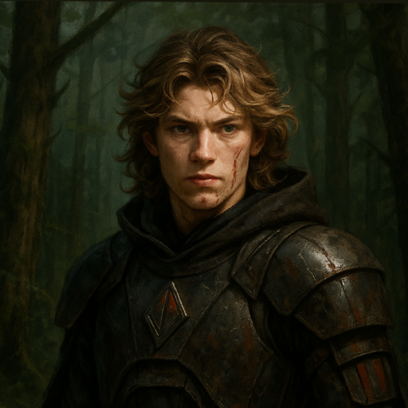
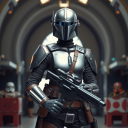
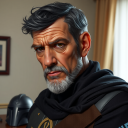

# Forgotten Ones | Chapter 2: Silent Drift


## **Storyteller** (08/01/2025 12:31:07) <br style='clear: both;'>

<a name="1400818126584807445"></a>*1400818126584807445*

***A long time ago in a galaxy far, far away....***

### **STAR WARS**
#### **FORGOTTEN ONES**
##### **Episode II: Silent Drift**

Consciousness returns not with a jolt, but as a slow, gentle tide. The eight hours of forced, dreamless sleep have been a balm. The leaden weight in their limbs is gone, replaced by a manageable ache, the phantom pains of muscles remembering how to live.

Most remarkably, when they open their eyes, the darkness is gone. The soft, ambient light of the barracks is clear and steady. The blindness, the most terrifying aspect of their awakening, has passed, leaving behind only the memory of its suffocating presence.

A new sensation, or rather the lack of one, slowly registers. The deep, resonant hum of the hyperdrive that has been the constant, underlying note of their existence since leaving the *Aether* is gone. The ship is no longer rushing through a river of light. It is adrift.

A chime, soft and clear, echoes through the barracks' internal speakers, followed by Eve's calm, synthesized voice.

---


## **Eve the AI** (08/01/2025 12:31:07) <br style='clear: both;'>

<a name="1400818129017372733"></a>*1400818129017372733*

**"Good morning, crew. The vessel has arrived at the pre-calculated coordinates in the uninhabited Kinooine system. We have achieved a stable solar orbit."**

---


## **Storyteller** (08/01/2025 12:31:08) <br style='clear: both;'>

<a name="1400818130044846291"></a>*1400818130044846291*

From a viewport, the view is spectacular and serene. Outside, a vast, incandescent sphere of white-gold fire—the system's G-type star—hangs in the blackness, its corona a shimmering halo. The ship's immense, wing-like solar collectors, previously folded against the hull, are now fully deployed, their dark, crystalline surfaces drinking in the raw energy of the star.

---


## **Eve the AI** (08/01/2025 12:31:08) <br style='clear: both;'>

<a name="1400818131194347602"></a>*1400818131194347602*

**"The solar collectors are operating at optimal efficiency. Recharging the primary power cells from their current critical state to minimum operational levels will require approximately twelve standard hours. I recommend you use this time to rest and take nourishment."**

---


## **Wes Del-Fin** (08/02/2025 11:28:57) <br style='clear: both;'>

<a name="1401164870585552916"></a>*1401164870585552916*

Entering what he now claimed as his quarters Wes slowly walked to the bunk after locking the door.  He didn’t even bother removing his Beskar’gam as he could already feel the weariness begin to overcome him.  Besides, sleeping in his armor was second nature to Mandalorian’s.  Removing his helmet he let it fall unceremoniously to the floor by the bunk.   As he sat back on the bunk he asked Eve a question.   It was *the* question that had been on his mind since he had awoken in the Medbay.  


**”Eve I’m guessing that you have some extensive data banks on the galaxy's history.   Hopefully over the last twenty years.”**  He laid back on to the bunk as his weariness grew more oppressive.  Eve had responded back with an affirmative to his question.    **”Good.   Please look for the name Marina Cloudspinner.   Jedi Padawan assigned to Master Silas Draay.  Find any info you can on her and send it to my bracer computer.  Thanks. He took a deep breath as his vision darkened and he felt the redoubled effects of the cryo sleep descend upon him.   He did his best to fall into a Force trance that would allow him to heal quicker.  His body once again felt tired and used as he laid there.  Sleep, if what was claiming him, hit him hard.   


The next thing he remembered was Eve’s voice telling him that they had arrived at the system and recharging operations had begun.  Opening his eyes he discovered that his vision had returned.   With a slow and stiff effort his muscles all protested being asked to function in such a mundane effort as sitting.    He wondered what would happen if he asked more of his body right now.  Despite the aches and pains of movement he stood and attempted to stretch some of the stiffness and painful discomfort away.

---


## **Wes Del-Fin** (08/02/2025 11:29:11) <br style='clear: both;'>

<a name="1401164929641222226"></a>*1401164929641222226*

He looked at his bracer computer and saw no message from Eve about Nadia. **”Eve status report on Nadia.  When will her cycle in the medical unit be completed?”**  As he spoke a more important matter arose as his stomach made a terrible sounding noise.  The need for food suddenly appeared.  **”Also you just mentioned food.   Where is it?”**

---


## **Varda Nisyren** (08/02/2025 12:35:51) <br style='clear: both;'>

<a name="1401181708438601891"></a>*1401181708438601891*

Varda wakes slowly conscious comming to her first in the sound of the hum of the ship, dreams of stars and darkness. Of winged things and fanged things fading away in a blur of starlight. Faces of people she knows. May know or perhaps was once fated to know but now  fated to travel a different path flow like the currents of a river. words spoken to her in mandalorian from her old friends coil close to her heart. Old dathomiri chants wind down her spine. Bringing forth in her dreams arcs of lighting. But as all things do they all fade to black and Varda slowly sits up. 

She begins to gather pouches and sashes. Forming her outfit. She unties her hair letting it flow down to her back in rivers of silver. she grasps her cane letting the strange warmth of shadowed sunlight and static od a storm yet to brake mesh and move with her own presence. She sits letting the last vestige of sleep finally fade.  Then with a sigh and a weary smile to herself at letting gravity torture some more she stands with her bones creaking. coughing slightly as the dryness of her throat she startles as she realises she has missed too many cups of tea in her absence. She walks slowly enjoying the veiw of the ship and taking the time to look at the blazing sun. Following the lights of what she hopes is the kitchen she meanders her way through. 

Reaching it she takes a moment to untie a certain knot in her bag and with a twitch of the force she floats out a menagerie of tea cups and a strange tea pot.

---


## **Varda Nisyren** (08/02/2025 12:35:57) <br style='clear: both;'>

<a name="1401181730181746720"></a>*1401181730181746720*

Each tea cup settles itself in a small square. The first to hit the table is small thing perhaps only good for one or two sips. its shaped with black clay but spread throughout it is a soft warmth of orange. inlaid into the rim of the cup in fancy filigree 'My heart'. The next is a cup made of a silver ceramic more geometric with sharp lines and hard edges. The small image of an owl printed on the side. the third is a cup that she places in front of herself. Lare and carved from a dark wood. the outside full to the brim of small runes painted in a light purple. The final cup is circular made of a pale white no personality. just a pale white cup. The teapot itself is made of a crystal. Crudely shaped and but done with love. She sets each out filling the tea pot with water and sprinkling her own herbs inside. She sets the water to boil then takes a seat herself letting the sound of the flame bring her comfort.

---


## **Storyteller** (08/02/2025 12:58:33) <br style='clear: both;'>

<a name="1401187420312961076"></a>*1401187420312961076*

Wes's bracer computer chimes softly, displaying a new message from Eve. The subject line reads: `DATA REQUEST: CLOUDSPINNER, MARINA`. The contents are a dense but well-organized data packet. It contains a standard Jedi Order public file on Padawan Marina Cloudspinner, her masters, her known lineage, and her notable service record during the Clone Wars. The file is comprehensive... up to a point. All official records abruptly cease in the year 19 BBY. There is nothing further.

---


## **Eve the AI** (08/02/2025 12:58:34) <br style='clear: both;'>

<a name="1401187422578147369"></a>*1401187422578147369*

Eve's synthesized voice answers his spoken query through a small speaker in his quarters.

**"The eight-hour regenerative stasis cycle for the subject Nadia is complete. She is stabilized. I have held her in a suspended state. You may initiate the revival sequence at any time. However, continued stasis would allow for more complete recovery from the long-term effects of her malnutrition and physical trauma. The decision is yours.”
There's a pause as she switches tracks to his next question: “The galley is located three sections forward, port-side."** Pathing lights illuminate along the wall to show Wes the way.

---


## **Storyteller** (08/02/2025 12:58:34) <br style='clear: both;'>

<a name="1401187423689375855"></a>*1401187423689375855*

Varda's slow, meandering path through the silent, flickering corridors leads her to a wider, more utilitarian space. The galley is a surprise. While the tables are simple metal bolted to the floor and the nutrient dispensers hum with bland efficiency, the entire port-side wall is a single, massive viewport, currently showing a breathtaking, unfiltered view of the Kinooine sun—a colossal sphere of white-gold fire hanging in the blackness. The ship's immense, wing-like solar collectors are visible, their dark surfaces drinking in the raw energy. Next to the viewport is a simple control panel, clearly designed to adjust the filtration levels, allowing one to dim the star's brilliant glare to a comfortable, ambient glow. It is a room designed for quiet contemplation as much as for sustenance.

---


## **Varda Nisyren** (08/02/2025 13:11:08) <br style='clear: both;'>

<a name="1401190585171443712"></a>*1401190585171443712*

She turns to face the large bay window with a small smile. Always in awe of the vastness of the universe. She takes the moment to take the pot of boil. Then pours herself a cup. she moves to stand in front of the large window and takes a moment to merely watch

---


## **Wes Del-Fin** (08/02/2025 14:12:44) <br style='clear: both;'>

<a name="1401206086937088132"></a>*1401206086937088132*

The chime on his bracer computer caught his attention.  Bringing up the screen he read the header of the file.  It was the info he had requested about Marina before he passed out.  It was a standard file.  Nothing he didn’t already know from the time they spent together.  As expected the timeline ended at the time of Order 66.   There was no mention of or update of being killed.  While it wasn’t much of a consolation it was a small something.   


Eve’s response to Nadia was favorable.  Her recommendation of letting her stay in continued stasis was advisable.  He nodded even though the AI wasn’t appearing on the room screen.   **”Undersrood.  Keep her there in recovery mode or whatever it is.   Do you have a guess on how much longer she may need on that recovery?”**  


He didn’t wait for her response as he reached for his helmet that he dropped on the floor next to the bunk and headed out the door for the galley.  The emptiness of his stomach was unlike anything he had felt before.   


The movement of his body felt good.  Tired and weary muscles stretched and loosened with every step.  As he walked he thought once again about Nadia and the familiar sense he felt.   How she looked at his clan sigil almost as if she was in disbelief of her own eyes.   He still couldn’t place her face or name.  Not recognizing her face wasn’t a surprise.   Judging from her age she seemed to be late teens or early twenties.  If he had seen her before she would have still been a young child.   As for her name it didn’t ring a bell.

---


## **Wes Del-Fin** (08/02/2025 14:12:57) <br style='clear: both;'>

<a name="1401206141475618952"></a>*1401206141475618952*

His thoughts carried him to the sterile door of the galley.  Stepping closer it opened for him and his senses were greeted with the aromatic smell of something perhaps brewed.  Which if he remembered there was only water and nutrient paste for consumption.   **”It’s not caf but whatever it is, it smells good.”**  He said aloud as he entered the galley.   Looking around he caught the outside view and Varda standing there with a steaming cup of liquid in her hands.   He gave her a nod as he headed for the nutrient paste dispensers.

---


## **Eve the AI** (08/02/2025 14:26:43) <br style='clear: both;'>

<a name="1401209605094113392"></a>*1401209605094113392*

**"The initial eight-hour protocol has concluded. All foreign chemical agents have been purged from the subject's system, hydration and baseline nutritional values have been restored, and critical tissue damage has been stabilized. She is no longer in immediate physiological danger."**

The AI's voice follows him as he walks the silent, now steadily lit corridors. **"Continued regenerative stasis will now focus on mitigating the long-term effects of chronic malnutrition and muscle atrophy. Based on her current metabolic markers, I project a minimum of six to eight additional hours for optimal cellular regeneration. However, I must note a potential adverse outcome. A rapid and complete physical recovery, without a corresponding period for psychological acclimatization, may create a significant cognitive and emotional dissonance for the subject upon reanimation. A slower, more gradual healing process often allows the mind to process trauma in parallel with the body's recovery. The decision remains yours."**

---


## **Wes Del-Fin** (08/02/2025 19:18:33) <br style='clear: both;'>

<a name="1401283048246476900"></a>*1401283048246476900*

***BEFORE ENTERING THE GALLEY***

**”Undersrood Eve.   Wake her up in say ninety minutes.   That way she’s not as compromised as she would be right now and her mind and body will still have time to process the rest of the healing together.  Give me a heads up when the clock runs out and start the wake up process after you do.   I want to be there when she wakes up.  Thank you Eve.”**

---


## **Varda Nisyren** (08/02/2025 22:56:34) <br style='clear: both;'>

<a name="1401337914851459135"></a>*1401337914851459135*

She turns as Wes enters. As he speaks a flash of sorrow builds between her eyes before it records. "**Hmm, I'm afraid ill have to disagree. Nothing can beat a good of cup tea, mind you it has to be the right blend of course.**" 

she waves her hand the other three cups stacking neatly before they fall into her bag. "**I'm afraid those cups are more ceremonial. There should be some round here here I presume.**" She gives him a light smile and goes back to watching the burning star.

---



## **Vaeros Halcyon** (08/03/2025 01:51:52) <br style='clear: both;'>

<a name="1401382032071856231"></a>*1401382032071856231*

Vaeros yawns, gradually waking up, but subconsciously, he grabs a canteen from his nearby utility belt and takes a sip. Feeling refreshed, he grabs his attire and belts, walking towards a nearby refresher, but something clicks. **"Oh, wait, I'm not in my usual quarters, am I?"**  he murmurs, shrugging.

After washing up and dressing, he stretches, settling into a comfortable position within the barracks. He sits, placing his lightsaber in front of him and entering a crisscross position, balling his fists and setting them on an adjacent knee; it's a daily meditation technique used to engage his mind for routine warmups.

Once done, he exits the room and walks toward the galley to get breakfast. He nods at those within the galley before walking towards the paste dispenser, but does not think much of those in the galley. Walking to a dispenser, he fills a bowl, then moves towards an isolated table to eat.

---


## **Wes Del-Fin** (08/03/2025 01:56:51) <br style='clear: both;'>

<a name="1401383285531344917"></a>*1401383285531344917*

Wes smiled as Varda commented on the tea. **”I don’t know, tea was never really my thing but any port in the storm or so they say.”**  He made for the paste dispenser station.  Looking for something to pout the paste in he came across bowls, utensils and a cup.  Grabbing one of each it wasn’t long before he had both filled.   


He walked over to where Varda stood looking out the viewport.    Taking a seat he started eating the paste.  While it wasn’t very tasty it fulfilled a need.   One his stomach had been protesting since he woke up.  **”How long Varda?”**  He didn’t specify how long for what.  He figured it was a given considering their circumstances.

---


## **Varda Nisyren** (08/03/2025 10:09:10) <br style='clear: both;'>

<a name="1401507182242955294"></a>*1401507182242955294*

She turns to him and takes a seat next to him. Manualy pouring him a cup. Listening to his question she opens her mouth. "**Hmm, about six-hundred years give or take**"

---


## **Wes Del-Fin** (08/03/2025 11:26:55) <br style='clear: both;'>

<a name="1401526745030463551"></a>*1401526745030463551*

Wes let out a breath as Varda said six-hundred years.  How was it even possible?  He had never heard of anything like this being possible.  This ship.   Eve and the incredible tech he’s seen since waking up.  


He looked across the table and then over to where Vaeros sat.  The Inquisitor had chosen to sit across the room alone and secluded.  Not wanting to think about that topic right away, he turned back to Varda.  **”I can’t imagine nine years.  Six-hundred seems unfathomable.   Eve seems to have access to a large database.  She looked for someone who,”**  He paused for a second.  **”Someone who was special to me.  Her records stop at the beginning of the Jedi purge.  I know she was alive up to where there gap in my memory happens but in the nine years since.  I don’t know.”**  


He took a few more bites of the pastes the bland substance was beginning to fulfill his hunger pains.   **”There’s a lingering question.  Why us and why now?”**  Even though his voice wasn’t loud it carried in the quiet space of the galley.

---


## **Varda Nisyren** (08/03/2025 15:09:08) <br style='clear: both;'>

<a name="1401582668394791112"></a>*1401582668394791112*

she nods s few times and follows wes' train of thought. "**I fear it's slightly different for me**" She pauses, "**I am old... I am under no illusion I will live perhaps four or five more years.  My... family knew I was old. They most likely think I left before my death, they were very aware I did not wish them to see it.  i am also due to certain... things used to living in a time not the present.  This is like a final last adventure before I join my Daughter and Grandson in the land of the spirits.**"

---


## **Wes Del-Fin** (08/04/2025 10:50:14) <br style='clear: both;'>

<a name="1401879901723951265"></a>*1401879901723951265*

Wes nodded as he took a sip of the hot tea.   It did taste good but it wasn’t a replacement for caf.  Taking another sip he set the cup down on the table.   Her mentioning of being an old woman with little life left ahead of her was somewhat surprising.   Old she may be but she was still strong.  Yet he held no disillusioned hopes.   **”I don’t know Varda.   None of us have a set expiration date.   Someone put all of us together and it's been at least 600 years in the making.”**  He was silent for a moment before speaking again.  **”The question is why did we wake up now?   I know the obvious answer is the slaver ship but was it just a coincidence or was it the will of the Force?”**

---


## **Iyola Kett** (08/04/2025 23:13:07) <br style='clear: both;'>

<a name="1402066854503120917"></a>*1402066854503120917*

Iyola had had a long and dreamless sleep.  When she awoke, she wondered for a second if it had all indeed been some kind of hallucination. But when she finally opened her eyes, she saw the same dull cubicle from the day before.  *Here she was, trapped in the future. *

She made her way to the galley, where something - finally - smelled appetizing.

Iyola stood in the doorway for a moment, watching her odd set of companions, just in time to hear Del-Fin’s last question.

**“If this is a Force thing, why am I here?”** she interjected.** " I’m not a Jedi. I don’t use Force magic.  It can’t be that.  We all slipped up and made a mistake, and it’s bad luck.  Maybe we got caught in an experiment of some kind.  Something swapped my dataries for gems and wiped all the data and starmaps I had. Pretty sure a Jedi didn’t ruin my life because of Force stuff.”**

She approached the table.  

**“Also, if there is any more of that stuff, can I have some?  It smells delicious.”  **

---


## **Wes Del-Fin** (08/05/2025 10:34:44) <br style='clear: both;'>

<a name="1402238389042024519"></a>*1402238389042024519*

Wes turned his head at Iyola’s question.   He had heard the galley doors open but wasn’t initially sure who it was.   He hadn't known them long enough to know them by their presence in the Force.  Except Vaeros.   Of all aboard the ship he could pick out the Inquisitor easily.  


**“I don’t think it’s all about the Force Iyola.  I’m sure it plays a part but not the only part.   Did we all mess up somehow like you just said?   Maybe.  I woke up with a scar on my midsection that I don’t remember having before and my armor was compromised in that same section.  Yet it’s now fixed and I don’t remember that either.”**  He looked from the young woman to Varda.  **”I hope that we find out the reasons for our situation and why it’s taken hundreds of years to come to pass.”**

---


## **Vaeros Halcyon** (08/05/2025 12:40:47) <br style='clear: both;'>

<a name="1402270111028609065"></a>*1402270111028609065*

Vaeros quietly listens to the conversation. He's not one to socialize, especially with that Jedi giving him inconsistent dagger-like stares previously. He finishes the first bowl and walks towards the dispensers for seconds. *It seems like my appetite is picking back up, so I guess I'll get my fill before we do something else.* 

As he feels his bowl, he asks Eve, **"Is there any reason why we’re at Kinoonie?”**

---


## **Varda Nisyren** (08/05/2025 13:34:58) <br style='clear: both;'>

<a name="1402283746790609039"></a>*1402283746790609039*

Varda speaks up slightly. "**I spoke to Eve while on the bridge. Their are files and information available to a certain degree of rank. something like protector I think,   I imagine we will eventually learn why and how we're here. It mag purely just be a waiting game.**" She twitches her finger at Iyolas question and a cup sails over. the pot rises and pours into it. She smiles warmly.  "**I'll always have a cup for those who want it**"

---


## **Iyola Kett** (08/05/2025 15:16:01) <br style='clear: both;'>

<a name="1402309176570544156"></a>*1402309176570544156*

Iyola watched, fascinated, as Varda floated the cup of liquid over to her.  She barely remembered to grab it.  

She took a sip.  **“It’s good!”** she exclaimed. ** “Reminds me of a mint swirl.  Drank those all the time when I was a youngling.  Thanks, Varda.”  ** She downed the cup in a few more gulps, then grabbed a dish, walked over to the paste dispenser, and grabbed a portion of nutripaste, eating it while standing.

**“So,”** she asked Varda between  big bites, **“you said you weren’t a Jedi, but you can obviously do Force magic.  So how does that work? Did you quit the Order to get married or something?”  **

After she’d gobbled down the tasteless slop, Iyola tossed the dish back on the counter.  **“I’m going to go explore the ship,” **she said. **“Eve said we needed a few more hours to power up.  Oh, and has anyone seen Misha?**” *She might be in the engineering room*, Iyola thought. *I’ll head there first.*

---


## **Eve the AI** (08/05/2025 17:33:20) <br style='clear: both;'>

<a name="1402343733403451413"></a>*1402343733403451413*

Eve's voice responds to Vaeros, emanating calmly from the galley's speakers. **"This system was selected for its optimal tactical and logistical parameters. First, it is uninhabited and located in an unaligned sector, minimizing the probability of detection by Imperial or other hostile patrols. Second, its G-type star provides a high-efficiency energy source for recharging the solar collectors, a process which is currently underway."**

A moment later, as Iyola heads for the exit, Eve's voice addresses her directly.

**"The guest designated 'Misha' is currently in the port-side barracks. My internal sensors indicate she is currently sleeping."**

Simultaneously, the bracer computer on Wes's gauntlet chimes softly. The screen displays a simple, clear notification: `NADIA SKIRATA: REVIVAL SEQUENCE INITIATION IN 35 STANDARD MINUTES.`

---


## **Wes Del-Fin** (08/05/2025 19:47:01) <br style='clear: both;'>

<a name="1402377375479496804"></a>*1402377375479496804*

Wes watched as the four of them were alone in the galley.   Varda and Iyola were friendly yet Vaeros was keeping his distance.   Dryzan was absent and the Mandalorian guessed that he was still sleeping.  


At Vaeros’ question as to why Kinooine Wes turned as if to answer.   His expression was passive and more calm then the evening before where adrenaline had been running high.   Eve beat him to the punch answering in detail about needing to recharge and the system was the best place in range.    


With the question answered the Inquisitor looked as if he was about to go back to the table he was previously at.   Wes grabbed his attention and guested to the table he and Varda were sharing.   There was a defined divide between him and the darksider but for some reason the Force had thrown them together.    Master Chase would probably say this would be a time for introspection not battle.     


The soft audible chime on his bracer let him know that it would soon be time to go and see Nadia.   The young Mandalorian they as a group, rescued from the slaver ship just the day before.  **”Eve will be bringing Nadia out of the healing stasis in thirty-five minutes.  I plan on being there when she wakes up.”**

---


## **Vaeros Halcyon** (08/06/2025 16:41:56) <br style='clear: both;'>

<a name="1402693186585104454"></a>*1402693186585104454*

Satisfied with Varda's answer, he nods. As he looks back, Eve quickly answers about the solar collectors and it partially slips past him. *I can never get used to Eve being able to answer and listen wherever.*

**“Got it, thanks, Eve.”** Once the bowl is filled, he returns to his table to finish his meal.  A meditation, training, or writing would be appropriate after this meal. 

Before he walks towards his table, Wes gestures to him, *Sithspit* he thinks.  Vaeros nods and sits at an open spot. **“Is there something on your mind?”**

---

## *Workshop / Recreation*


### **Iyola Kett** (08/06/2025 17:33:46) <br style='clear: both;'>

<a name="1402706232732811425"></a>*1402706232732811425*

Iyola glanced back as Vaeros joined Del-Fin and Varda.  She admittedly was curious about how that conversation would go, but she couldn’t resist being the first one to fully explore the Venture.  *That would be a great distraction.  *

**“See you all later!”**  she said, trying to infuse cheer into her voice. 

Eve let her know that Misha was still sleeping.  Iyola made a snap decision to swing by the storage/rec/workshop area instead.  *Maybe there was something interesting left in those spaces.  *

**“Eve,”** she asked as she set off, **“how long has the Venture been around?”**

---


## **aliciagd** (08/06/2025 18:56:46) <br style='clear: both;'>

<a name="1402727120207347796"></a>*1402727120207347796*

Workshop / Recreation

---

## *Workshop / Recreation*


### **Eve the AI** (08/06/2025 18:56:48) <br style='clear: both;'>

<a name="1402727126255271977"></a>*1402727126255271977*

**"My active operational logs indicate this vessel was commissioned for its current mission parameters approximately three standard decades ago,"** Eve's voice replies, her tone as placid as ever.

**"Data pertaining to its original construction, project designation, or any service history prior to that commissioning is archived and requires 'Protector Level' clearance to access."**

---


### **Storyteller** (08/06/2025 18:56:54) <br style='clear: both;'>

<a name="1402727150230044783"></a>*1402727150230044783*

Iyola leaves the galley, stepping out into a corridor that is now fully and steadily illuminated. The oppressive, moving bubble of light is gone, replaced by a clean, continuous glow from the overhead panels. The ship no longer feels like a tomb; it feels like a silent, empty, waiting vessel.

Following the schematic on her datapad, she makes her way through a series of identical, spartan corridors, past the empty barracks, and deeper into the ship's mid-section. The doors to the areas marked 'Storage' and 'Workshop' hiss open as she approaches.

The space inside is vast, a multi-level bay that likely serves as both the primary cargo hold and the main workshop. A heavy-duty lift platform sits dormant in the center, and the upper walls are lined with catwalks and sealed storage lockers, each marked with arcane, alphanumeric designations.

Unlike the rest of the ship, which is almost clinically sterile, this area shows faint signs of having once been a place of active work. There are faded scuff marks on the deck plating where heavy equipment was once dragged. Workbenches are bolted to the walls, their surfaces wiped clean but bearing the faint scars and chemical stains of countless projects. Empty tool racks and powered-down fabrication units line one wall.

It feels like a space that was meticulously scrubbed and decommissioned. All the tools, all the projects, all the personal effects of the last crew to work here have been systematically and thoroughly removed. The only things left are the fixtures, the faint ghosts of past labor, and a profound sense of emptiness. It is a perfectly functional workshop, waiting for a new crew and a new purpose.

---


### **Iyola Kett** (08/06/2025 20:54:29) <br style='clear: both;'>

<a name="1402756743322402837"></a>*1402756743322402837*

Protector - there was that word again.  Though it was interesting in of itself that the ship had been retrofitted 30 years ago. 

**“How do I get Protector Level Clearance, Eve?”**  Iyola asked.

She looked around the space  as she entered.  Between the cargo hold and the workshop, it was gigantic. She wondered if the entire *Stardust Seeker* could fit in here.  Thinking of her home ship brought on a brief, intense pang of sadness. *What had happened to her, to lose everything?*

Iyola shook her head.  *No time for that, not now.* The workshop had a few large pieces of equipment that were vaguely intriguing, but what really piqued her interest was the row of lockers on the upper catwalk.   This ship had clearly been scrubbed, *but no one can catch everything. *

Iyola looked around for the best route to access the catwalk.  She could use her ascender, of course, but there might be a ladder. At the very least, a free climb here would be fun.

---


### **Eve the AI** (08/06/2025 21:34:29) <br style='clear: both;'>

<a name="1402766808074813472"></a>*1402766808074813472*

**"The protocols for granting 'Protector Level' clearance are not stored in my accessible data banks,"** Eve replies, her voice emanating from a nearby speaker grille. **"It is not a status that can be applied for or granted through standard ship protocols. Access is granted by an authorized agent of the Protector directive upon verification of their unique biometric and psycho-reactive designation inherent to authorized personnel. I am not authorized to grant such clearance."**

The answer is a polite but firm dead end.

---


### **Storyteller** (08/06/2025 21:34:29) <br style='clear: both;'>

<a name="1402766810750914760"></a>*1402766810750914760*

Iyola turns her attention back to the workshop. The catwalks are approximately ten meters above the main deck, a significant but not impossible height. A quick scan of the area reveals her options.

The main lift platform in the center of the bay is clearly the primary method for reaching the upper catwalks. Its controls, however, are dark and unresponsive, likely deactivated to conserve power or awaiting a primary systems reboot. 

At the far end of the bay, a standard-issue maintenance ladder is bolted to the wall, leading directly up to the main catwalk level. The bay walls themselves are not sheer; they are a network of thick power conduits, structural support beams, and recessed maintenance panels, offering a challenging but feasible path for a skilled climber. Above, the heavy girders supporting the catwalks are exposed, providing numerous solid anchor points for her ascension cable.

---


### **Iyola Kett** (08/06/2025 22:34:25) <br style='clear: both;'>

<a name="1402781893958828204"></a>*1402781893958828204*

**“Protector Directive, huh?” ** Iyola mused out loud. What she could piece together right now was that the Venture had been repurposed 30 years ago by these Protectors.  But she’d been somewhere else before that.  She had been frozen for centuries.  *Where?*

Iyola’s eyes fell on the ladder.  That would be easy enough.  Maybe she’d use the workshop wall later, for climbing practice.  She started the climb up the ladder to the catwalk level.

---


### **Storyteller** (08/07/2025 01:13:54) <br style='clear: both;'>

<a name="1402822027429150792"></a>*1402822027429150792*

Iyola climbs the maintenance ladder with ease, her boots ringing on the metal rungs. The catwalk offers a commanding view of the cavernous workshop below. The air up here is still and silent. She approaches the first bank of storage lockers. They are simple, grey, utilitarian containers, each sealed with a basic electronic lock that is currently unpowered. A manual release latch allows her to open them.

The first locker is empty. The second, the third, the fourth—all empty, wiped clean, not even a speck of dust remaining. The scrub was professional, thorough, and disheartening. She moves to the very last locker in the row, tucked away in a corner where the main lights cast a deep shadow. She pops the latch.

This one, too, is empty. For a moment, she feels a pang of disappointment. But as she starts to close the door, a faint, metallic scraping sound catches her ear. Something small and heavy just rolled in the back.

Kneeling down, she peers into the dark recess. There, tucked into the far corner behind a support strut, is something the cleanup crew missed. It's a handheld device, about the size of a heavy-duty hydrospanner. It's made of a dull, non-reflective metal, heavy for its size, with an ergonomic grip on one end and a complex-looking, crystalline emitter on the other. A small, dark viewscreen and a single, multi-function dial are its only controls. It looks like some kind of highly specialized diagnostic or calibration tool, unremarkable enough to be easily overlooked. When she picks it up, she feels a faint, almost imperceptible hum vibrating from within it.

---


## **Wes Del-Fin** (08/07/2025 01:24:50) <br style='clear: both;'>

<a name="1402824777642676344"></a>*1402824777642676344*

Wes was actually surprised when Vaeros came by and sat down.  Since finding out they were on opposite sides of the war both were on edge.   It didn’t help that they all woke up on edge and compromised from the cryo sleep they all experienced.   He wasn’t surprised at the blunt quip directed at him.   **”Look, yesterday was a stressful day.  We all woke up disoriented and confused.    While some of the confusion still remains, the disorientation is removed.   We don’t know why we’re here.   It’s something, despite the obvious differences, someone thought important enough to put us all together.  I want to find out why.   Why such a disparity in the times we came from?”**  He looked from vaeros to Varda.

---

## *Workshop / Recreation*


### **Iyola Kett** (08/07/2025 03:13:52) <br style='clear: both;'>

<a name="1402852216909467903"></a>*1402852216909467903*

With a practiced nonchalance, Iyola leaned into the locker, seized the hydrospanner, and  slipped it into one of the pockets in her blue-green jacket.  Clearly, this gadget - whatever it was for - wasn’t supposed to be here. She’d wait to examine it until she was off the ship, whenever that might be. Not for a few hours at least; Eve was still powering up. 

Heartened by her find, Iyola scampered down the ladder and headed toward the recreation facility, which by the map should be just adjacent to the workshop/cargo area. A spirited game of dejarik would be fun.  She wondered if she could play against Eve.  *No, she’d drag one of the others down here to play with her.*

---


### **Storyteller** (08/07/2025 06:23:00) <br style='clear: both;'>

<a name="1402899815905366027"></a>*1402899815905366027*

The doors to the recreation facility slide open, revealing a space that is a stark, almost jarring contrast to the utilitarian nature of the rest of the ship. This room was clearly designed for the long-term mental well-being of a crew.

The lighting is warmer, softer. In the center of the room, a holographic dejarik table sits dormant, its projector dark. Comfortable-looking lounge chairs are arranged in a conversational grouping in one corner. Along another wall, a series of what look like enclosed simulation pods are powered down, their access doors sealed.

But what truly dominates the space is the far wall. It is not metal, but a massive, floor-to-ceiling holoscreen, currently displaying a breathtaking, hyper-realistic, and deeply serene image: a dense, alien forest of impossibly tall, bioluminescent trees, their glowing canopies filtering a soft, purple twilight. The image is not static; there is a gentle, almost imperceptible sway to the trees, the slow drift of glowing spores in the air. The scene is utterly silent, but it radiates a profound sense of peace and tranquility.

Like the workshop, the room has been scrubbed of any personal effects—no stray datapads, no half-finished games, no personal trinkets. It is a perfectly preserved, perfectly empty space, waiting to be used.

---


## **Vaeros Halcyon** (08/07/2025 12:16:31) <br style='clear: both;'>

<a name="1402988779190485113"></a>*1402988779190485113*

Vaeros pauses for a moment, moving his left pointer finger along his facial scar in thought. **"I haven't thought about it. I can't piece together how such large gaps could occur; the High Republic, Dawn of the Empire, and a high of the Empire. What is something that such a large time gap could provide?"**

**"Anyways, I digress. I want to resolve this and go my separate ways. I have no desire to be substantially implicated in whatever this is."**

---

## *Workshop / Recreation*


### **Iyola Kett** (08/07/2025 16:07:58) <br style='clear: both;'>

<a name="1403047028447252582"></a>*1403047028447252582*

**“Ooh,” **says Iyola out loud as she beholds the wonders of the recreation room.  The huge holoimage on the wall reminds her of her adventures of Xylos, searching for the Sunken Star.  She’d rescued her rival, Hextor Ambur, and she and Caz had charged his rich father quadruple the usual rate for his retrieval, which the senior Ambur paid without (much) complaint.  Not to mention the star map data she’d found.  *She and Caz had officially un-broken up that night.*

The grief hit her unexpectedly.  Iyola curled up in one of the cushy lounge chairs and wept. After a while, she pulled herself together and wiped her face off on her shirt. 

**“Eve, please change the image to something else pretty.  No jungles.”** 

She walks over to the dejarik table, looking for a way to activate the game.

** “Hey Eve, if those three are done with whatever they’re talking about”**  - *hopefully not arguing about *-  “**in the galley, can you ask them to come here and play dejarik with me?”**

 **“Also, what’s in those pods over there?” **

---


### **Storyteller** (08/07/2025 21:09:41) <br style='clear: both;'>

<a name="1403122957466992861"></a>*1403122957466992861*

The massive holoscreen on the wall wavers for a moment, the serene image of the bioluminescent jungle dissolving into a cascade of soft, blue light. The light coalesces into a new, equally breathtaking scene: a slow, silent drift through a vibrant, alien coral reef. Schools of tiny, silver fish dart between impossible structures of glowing, crimson coral, and a colossal, gentle creature resembling a manta ray glides peacefully in the simulated deep.

Iyola turns to the dejarik table. As if sensing her intent, the circular surface hums to life. A ring of light glows around its edge, and the projector in the center flickers, casting the three-dimensional, holographic forms of the game pieces onto the board. A grotesque Kintan Strider snarls silently at a lithe Ghhhk bird. The game is ready.

---


### **Eve the AI** (08/07/2025 21:09:42) <br style='clear: both;'>

<a name="1403122959488389345"></a>*1403122959488389345*

**"Acknowledged,"** Eve's voice states, emanating from the rec room's speakers. **"Cycling environmental simulation. 'Jungle' parameter excluded. Dejarik table activated. Game logic and holographic projectors are online. Awaiting players."**

She pauses for a fraction of a second before continuing.

**"I will relay your request to the crew members currently located in the galley. The units you are referring to are designated as 'Full Immersion Environmental Simulators,' or 'Simulation Pods.' They are designed for long-duration crew missions to provide psychological enrichment, skill-based training simulations, and recreational scenarios. However, the primary simulation library database is currently inaccessible."**

---


## **Wes Del-Fin** (08/08/2025 10:50:27) <br style='clear: both;'>

<a name="1403329508555231343"></a>*1403329508555231343*

Wes listened as Vaeros talked.  He wanted answers.  They all did.  Vaeros, much like himself, may still have a place to go to.   The others did not.   Time was their enemy while they slept and it wasn’t a benevolent one.  


**”We all will be looking for answers.  There’s far too many questions to ignore.   I do have a question and it’s an important one.”**  His gaze left Vaeros and shifted to Varda.   He said back taking a more relaxed posture.   An attempt at keeping tensions low.   **“We need to work together.   Despite the differences in ethos and beliefs, can we work together to unravel this mystery?”**

---


## **Vaeros Halcyon** (08/08/2025 17:32:16) <br style='clear: both;'>

<a name="1403430627847442482"></a>*1403430627847442482*

Vaeros nods, **"You have my word, for whatever you feel it's worth, that I'll remain amicable as resolve this. Afterwards, I would be open to part ways under peaceful circumstances."**

---

## *Workshop / Recreation*


### **Iyola Kett** (08/08/2025 17:39:23) <br style='clear: both;'>

<a name="1403432421445074954"></a>*1403432421445074954*

Iyola explored the rest of the recreation room as she waited for one of her companions to arrive.  As with the cargo hold, this place had been scrubbed thoroughly.  No dice, no sabacc chips. Not even any exercise equipment.  Maybe that was confined to the pods.

**“Why are the pods inaccessible?” ** Iyola asked Eve, a hint of a whine entering her voice.**  “Can you at least show a holodrama while I’m waiting?”**  She thought for a moment.  **“Like *The Sficca of Naboo*, something like that?”**

---


### **Eve the AI** (08/08/2025 20:46:58) <br style='clear: both;'>

<a name="1403479627036360797"></a>*1403479627036360797*

**"The Full Immersion Environmental Simulators are classified as non-essential, high-draw systems,"** Eve's voice replies, the sound emanating from a speaker grille near the dejarik table. **"While the vessel is in a primary power regeneration cycle, all non-essential systems are automatically shunted offline to prioritize the recharging of the main drive, shields, and life support."**

She continues, addressing Iyola's second request.

**"Searching... Negative. My data archives do not contain a media library for recreational holodramas. My primary function is operational support and the preservation of mission-relevant historical and tactical data. Popular entertainment is not included in my provisioning."**

---


## **Eve the AI** (08/08/2025 21:30:40) <br style='clear: both;'>

<a name="1403490625889894523"></a>*1403490625889894523*

As Wes, Varda, and Vaeros sit in the sterile quiet of the galley, each lost in their own thoughts, Eve's calm, synthesized voice emanates from a speaker on the wall. **"Crew member Iyola Kett has activated the dejarik table in the primary recreation facility. She has extended an invitation for any available crew members to join her for a game."** The message is delivered with the flat, informational tone of a transit announcement, a simple statement of fact that hangs in the quiet air between them.

---


## **Vaeros Halcyon** (08/08/2025 21:34:31) <br style='clear: both;'>

<a name="1403491593402581072"></a>*1403491593402581072*

Vaeros perks up and gradually sits up. **"A recreational facility? I should have asked sooner. Sounds interesting; does this vessel hold an open area for training and physical exercises?" **

---


## **Eve the AI** (08/08/2025 21:59:29) <br style='clear: both;'>

<a name="1403497878122397886"></a>*1403497878122397886*

**"The primary recreation facility, where crew member Kett is currently located, is an open, multi-purpose area suitable for physical exercises,"** Eve's voice replies from the galley speaker.

**"The Full Immersion Environmental Simulators within that facility are designed for advanced, skill-based training scenarios. However, as they are classified as non-essential, high-draw systems, they remain offline during the current power regeneration cycle."**

---


## **Vaeros Halcyon** (08/09/2025 00:25:21) <br style='clear: both;'>

<a name="1403534585794662562"></a>*1403534585794662562*

**"Noted, thanks." **Vaeros fully stands up and walks to the recreation facility.  He's interested what Iyola has planned, and what this facility is. This ship is more than what he anticipated.

---

## *Medbay*


### **Wes Del-Fin** (08/09/2025 01:30:06) <br style='clear: both;'>

<a name="1403550882012074084"></a>*1403550882012074084*

Wes gave Vaeros a nod at his declaration of giving his word.   Despite the man's snide comment that he may not take the man at his word.  He figured Vaeros hadn't had many dealings with Mandalorians.   If he had he would know that taking someone’s word was important.   Until it was broken there was no need to think otherwise.   


He was going to respond but Eve interrupted the three of them with an invitation from Iyola in the recreational facility.  He saw the shift in the man’s eyes as he answered that he was on the way.  Wes calmly stood as well.   **”Vaeros,”** He said to grab the man’s attention before he walked away.    **”Thank you.  You have my word as well.”**  


As Vaeros walked out he turned back to Varda and looked at the timer for Nadia.   Eve was going to wake her up in fifteen minutes.   He wanted to be there.  While he wouldn’t be a familiar face his armor would.   He hoped that it would put her at ease.  **”Eve is set to bring Nadia out of the healing cycle in about fifteen minutes.  Would you like to be there when that happens?  If you’d like to meet me there when you're ready it could be another friendly voice for her.”**  Picking up his helmet he turned for the door intent on heading to the Medbay.   


Moments later he passed through the doors into the Medbay.  He turned his helmeted head towards the status screen of the pod that Nadia was in.   **”Eve, how is Nadia doing?  Is there anything I need to be watchful for when she wakes and afterwards?”**

---

## *Workshop / Recreation*


### **aliciagd** (08/09/2025 01:35:15) <br style='clear: both;'>

<a name="1403552175665451091"></a>*1403552175665451091*

@undefined [https://discord.com/channels/661388927734775859/1402706232732811425/1402899815905366027](https://discord.com/channels/661388927734775859/1402706232732811425/1402899815905366027)

---


### **Storyteller** (08/09/2025 01:38:07) <br style='clear: both;'>

<a name="1403552896557121618"></a>*1403552896557121618*

Leaving the quiet contemplation of the galley, Vaeros follows the ship's internal signage. The steadily lit corridors, all identical grey metal and soft, indirect light, guide him aft. The ship is a silent, sterile labyrinth, and he moves through it with a deliberate, measured pace, the only sound the soft fall of his own boots.

The doors to the recreation facility slide open before him, revealing a space that is a stark, almost jarring contrast to the utilitarian nature of the ship. The lighting is warmer, softer. In the center of the room, the holographic dejarik table is now active, its miniature monsters frozen mid-snarl, awaiting the start of a game. Comfortable-looking lounge chairs are arranged in one corner, and along the far wall, the massive holoscreen displays a slow, silent drift through a vibrant, alien coral reef.

Iyola is there, standing by the dejarik table, looking up from the holographic pieces as he enters. The room, like the rest of the ship, is scrubbed clean of any personal touch, but here, at least, there is a sense of manufactured peace, a deliberate attempt at creating a space for rest in the cold, empty void.

---

## *Medbay*


### **Storyteller** (08/09/2025 02:36:54) <br style='clear: both;'>

<a name="1403567688839729164"></a>*1403567688839729164*

Wes enters the silent, sterile medbay. The only sounds are the soft hum of the active machinery and the faint, rhythmic pulse of the bio-monitors on Nadia's cryo-chamber. The timer on its side now reads `00:15:00`. He stands before the chamber, a silent vigil in the cool, white light.

Eve's synthesized voice emanates from the medbay's integrated speakers, her tone as clinical as the room itself.

---


### **Eve the AI** (08/09/2025 02:36:54) <br style='clear: both;'>

<a name="1403567691503108170"></a>*1403567691503108170*

**"Subject Nadia's physiological condition is stable and improving. Cellular regeneration is proceeding within expected parameters. She is no longer in a critical state."**

She pauses, processing his second question.

**"Regarding post-reanimation observations: you should anticipate significant muscle fatigue and a period of psychological disorientation. Her system has endured extreme trauma."**

Another fractional pause, as if she is cross-referencing a new data point.

**"Your designation of the subject as 'Force Sensitive' has been noted. During the regeneration cycle, my neurological scanners detected several instances of spontaneous, high-amplitude theta-wave activity that did not correlate with any internal stimuli. This suggests a potential for extreme sensory hypersensitivity upon waking. I would advise maintaining a calm emotional state and a low vocal tone in her presence. Strong emotional displays from others may act as a painful or disorienting stimulus for her."**

---

## *Workshop / Recreation*


### **Iyola Kett** (08/09/2025 12:49:27) <br style='clear: both;'>

<a name="1403721845181648996"></a>*1403721845181648996*

Iyola looks up from the dejarik game as Vaeros enters the room, her gray eyes brightening.  The combined hues of the deep-sea holomovie and the illumination of the dejarik board flicker oddly across her face.

**“Ready to play?” ** she asks Vaeros.  She glances over to the pods.  **“Most of the exercise and  recreation functions in those pods are shut off because Eve needs the power to keep us alive and fly the ship. But maybe this dejarik board has its own power source.”  **

Iyola sweeps her hand above the holographic creatures.  **“Because I invited you, you get to choose your first piece,”** she says.

---


### **Vaeros Halcyon** (08/09/2025 13:04:33) <br style='clear: both;'>

<a name="1403725642087792821"></a>*1403725642087792821*

Vaeros enters, looking around the room, before nodding at Iyola. He's almost awe-stricken, since he's never been one to check these kinds of games out. 


**"I'm going to be honest, I've never played Dejarik. Could you please show me the rundown? I won't be the best, but it seems like a good time-killer."**

---

## *Medbay*


### **Wes Del-Fin** (08/09/2025 13:14:15) <br style='clear: both;'>

<a name="1403728086880616459"></a>*1403728086880616459*

Wes nodded as Eve gave him the sitrep of Nadia. She was still going to be in a compromised state.  The quieter and calmer the environment was, the better.  **”Understood Eve.  Perhaps cutting the lights down from their current brightness when the procedure to wake her is started is advisable.”**   


He let out a breath as he looked at the chrono and back to Nadia.  Thought began to run through his mind.   What were the odds of running across another Force Sensitive Mandalorian.   The numbers simply didn’t seem possible.  And then there was the feeling he had when he first sensed her. That slight feeling of familiarity.   If anything caused him confusion it was that. 


**”Eve can you compile what you know of the Mandalorian clan, Skirita.   Who the major players are within and where they may be located.  If we can get her and Derek to them that might be advantageous.   They may be able to give us some insight as to the current pile of poodoo the galaxy is in.”**

---

## *Workshop / Recreation*


### **Iyola Kett** (08/09/2025 13:29:52) <br style='clear: both;'>

<a name="1403732013462065275"></a>*1403732013462065275*

Iyola raises an eyebrow.  **“You’ve never played dejarik?  Is it extinct in your time or something?”**  She's being facetious; she knows that it existed at least 30 years ago. Still, he must not have been asleep as long as she was. **“How long were you in the meat locker?” **

**“So there are a lot of different variants of dejarik.  But we’ll play the version I like, which is Spira Draft.  You choose which pieces you want on your side. Typically when you move a piece into another player’s square, you win that square and eliminate that piece.  There are exceptions, but we won’t play with those, because you’re new.  Some of the pieces move differently than others.  But we can go through those as we play.”** Once again, she points to the first two pieces. ** “That’s a Kintan, and it can push other pieces on your side one space if it’s next to them.  It moves one space at a time, only up/down and left/right.  That’s a Ghhhk, and it can move diagonally, any number of spaces.” **

**“Oh, and usually you have to remember which ones are yours, but since you’re new I’ll ask Eve to color-code them once you choose.”**

---

## *Medbay*


### **Eve the AI** (08/09/2025 13:37:50) <br style='clear: both;'>

<a name="1403734021976100895"></a>*1403734021976100895*

**"Your directive is logical. I will dim the medbay lighting to twenty percent standard illumination prior to initiating the revival sequence,"** Eve confirms. A moment of silence passes as the AI processes the new, complex data request.

**"Searching accessible archives for 'Clan Skirata'..."**

The AI's voice continues, its tone a flat recitation of historical and commercial data.

**"Historical records from the Clone Wars era note 'Clan Skirata' as a Mandalorian clan of some renown, primarily due to the activities of one Kal Skirata, a training sergeant who served as a consultant and paternal figure to several elite Republic Commando units. His activities are well-documented in Republic military archives."**

**"Post-Imperial establishment, detailed public records on the internal structures of most Mandalorian clans become sparse. However, cross-referencing commercial registries yields a high-probability match."**

**"A registered corporate entity named 'Kando's Coursers, LLC' operates out of Port Town on Cloud City, Bespin. Its listed services are high-end security, asset retrieval, and information brokerage. The registered proprietor of this firm is an individual named Ghurn Skirata. Given the name and cultural affiliation, it is logical to conclude that this is a base of operations for the clan you are seeking."**

**"Beyond Ghurn Skirata, there are no other individuals of that clan name listed in any public or corporate registries that are accessible to me."**

---

## *Workshop / Recreation*


### **Vaeros Halcyon** (08/09/2025 14:31:51) <br style='clear: both;'>

<a name="1403747613261566085"></a>*1403747613261566085*

Vaeros traces his scar, quizzically. **"Extinct? No, I didn't have this kind of luxury until now."**

**"I'm still not entirely sure, but I think that sounds good. I think I use the Ghhhk first." **

**"Oh wait, how do I move it, or do I just pick the pieces for my side to use? I think I might be in over my head."**

---

## *Medbay*


### **Varda Nisyren** (08/09/2025 14:39:18) <br style='clear: both;'>

<a name="1403749486949302332"></a>*1403749486949302332*

Varda follows in after a few moments. Walking up to stand next to Wes. "**That follows with what I knew of Clan Skirata many moons ago. their word is like beskar. To hire a Skirata ensures you have a job done. It is not a large jump to see how they've come into such a business**"

---

## *Workshop / Recreation*


### **Iyola Kett** (08/09/2025 16:21:20) <br style='clear: both;'>

<a name="1403775165111734355"></a>*1403775165111734355*

**“No, now you just place your piece and I place mine.  Because you chose yours first, you place first.  Since you have a Ghhhk, place it near the center of the board so you have maximum flexibility to move.  I have a Kintan which can maximize the movement of some of my other pieces, so wherever I place it will end up being my base of operations, so to speak.  So watch carefully.”**  Iyola placed her Kintan in the corner pocket on the left side nearest her. ** “Make my playing pieces green,”** she said.  She figured either the dejarik board or Eve could fulfill the command, but if not there were usually manual settings.

**“The board will then select two other random pieces and we go from there, trading drafts, so I go first next time. Spira Draft starts with 8 pieces and then there’s a twist that I’ll explain later.” **  In retrospect, she probably should have started with the youngling version of dejarik, but she was committed now, *and  besides, she really did like Spira Draft *. **“Once we choose and place four pieces each, the game begins.  You can either pick up the piece and put in in the space where you want it, or push it along the board.  In your case, you should push it so you can get a better sense of how the pieces move.”** 

Iyola looked up at Vaeros with frank curiosity.  **“I have to ask,”** she said. **“Where and how did you grow up that a simple game of dejarik was such a luxury?” **

---


### **Vaeros Halcyon** (08/09/2025 16:54:23) <br style='clear: both;'>

<a name="1403783485042462952"></a>*1403783485042462952*

As Vaeros moves the Ghhhk piece, he looks at Iyola 

** "Well, when you are constantly fighting, you often don't have the luxury to slowdown. Think of it as being raised in very specific niches that fit your characteristics. For an example, I was raised in the Jedi Order as apart of the Jedi Exploration Corps, but you might know it as the ExplorCorps. I trained in navigation, survival, and light saber duals. Think of it like a ruin explorer, star charter, and so on. This type of people are often illusive, and decentralized from the order. "

"That's just my upbringing though; when I left the order to serve in the Confederacy of Independent Systems, I used my skills to chart paths for Count Dooku, one of my mentors. I also fought Jedi, clones, and bandits, that kind of stuff to furfil my missions."

"I do something similar in the Empire as well, but that's another long spiel. I basically just haven't had the freedom, or interest. I like exploring, instead. **

---

## *Medbay*


### **Wes Del-Fin** (08/09/2025 16:57:57) <br style='clear: both;'>

<a name="1403784382874910791"></a>*1403784382874910791*

The info Eve dug up made sense and filled in a few holes.   He remembered the name Kal Skirita but only in passing.   Remembering his father mentioning the name on one occasion.   From what he could remember his father held Kal and the Skirita in high regard.  Knowing what family means to a clan he knew they would be happy to have one of their own back.     


Varda's own recollection from hundreds of years ago only seems to cement the info Eve dug up.   It also made him wonder about his own clan and his Father Cal, the head of Clan Del-Fin.  They were in a precarious situation having one of their own hunted by the Empire simply for being what he was.    


**”It follows what I know of them during the clone war.  It’s good to know that some things don’t change.”**  He glanced at the screen and looked at Eve’s face.  **”Eve, what can you tell me of the Mandalorian clan Del-Fin.  Lead by Cal Del-Fin.”**  He took a breath as he waited for what she knew.

---


### **Eve the AI** (08/09/2025 17:17:27) <br style='clear: both;'>

<a name="1403789286624592053"></a>*1403789286624592053*

Eve's face remains impassive on the screen as she processes the new query. The silence stretches for a few seconds longer than usual, a subtle indication of a more difficult and fragmented search.

**"Searching... Clan Del-Fin,"** she begins, her voice a flat recitation of data points. **"Records from the late Republic era confirm Clan Del-Fin, led by Cal Del-Fin, operated under direct contract with the Republic military. Their last confirmed assignment was providing covert combat support to local resistance forces on the Separatist-held world of Raxus Prime."**

She pauses, collating the chaotic records from the dawn of the Empire.

**"Following the issuance of Order 66 and the subsequent Imperial consolidation of Raxus Prime, all official Republic contracts were rendered void. Imperial military logs from that period are heavily redacted, but they report significant armed conflict with unsanctioned Mandalorian forces and local insurgents. Communications intercepts from various independent sources in the years immediately following the battle indicate that remnants of Clan Del-Fin successfully broke the Imperial blockade and escaped Raxus Prime, but they were scattered and suffered heavy casualties."**

The final piece of information is delivered with the same sterile finality as all the others.

**"In the subsequent nineteen years, there are no official records, commercial registries, or credible intelligence reports indicating any organized resurgence or public activity from a group identifying as Clan Del-Fin. Their current status is unknown."**

---

## *Workshop / Recreation*


### **Iyola Kett** (08/09/2025 17:26:53) <br style='clear: both;'>

<a name="1403791663276622035"></a>*1403791663276622035*

**“Of course I know the ExplorCorps!”  exclaimed Iyola.  “I was in the Survey Corps myself, before I went independent.  We worked alongside the ExplorCorps sometimes, and some of our trainers were in the ExplorCorps.  I got to know a bunch of Jedi.”  * **Some better than others, of course.** * We should trade stories.  I bet you’ve been in some interesting places too.” **

She looked at Vaeros thoughtfully.  **“You know, when I was a tiny youngling, I wanted to be a Jedi.  I had a wild imagination.  My parents told me if I joined the Jedi I would have to work and fight all the time, and I’d never have fun or see my family again.  Who knows, maybe they were right, if you didn’t even get to play baby dejarik.”  **
 
Iyola shook her head.  “**I don’t know who this Count Dooku is or what the deal is with the clones.  I keep hearing about a Clone War and I don’t know what that is.  But - what is this about fighting Jedi?  I still don’t know why the Jedi would fight you.  They don’t fight unless they have to. They would have just left you alone.” **

She glanced at the board to see which pieces had been randomly chosen.  “**OK, the next pieces are the Monnok and Grimtaash.  Monnok has one of the highest ranges since it can damage a piece from three squares away.  Grimtaash has high defense.” ****

---

## *Medbay*


### **Varda Nisyren** (08/09/2025 17:39:38) <br style='clear: both;'>

<a name="1403794872934203503"></a>*1403794872934203503*

Varda shifts slightly an coming to her slightly. "**While on the topic of mandalorian clans Eve, would you mind seeing what you can find on Clan Senn**"

---


### **Wes Del-Fin** (08/09/2025 17:48:32) <br style='clear: both;'>

<a name="1403797109630570628"></a>*1403797109630570628*

He let out a big sigh.  The thought of his Father and clan holed up on Raxus Prime still sat poorly within him.   He could still remember the garbled communications he had with his Father after Order 66.  His urgent plea to join them on Raxus Prime and his fathers order to stay away.   Cal knew as well as Wes did.  That the Empire would be looking for him.  That if his son didn’t stay on the run he’d be captured and killed or worse.  


It was the only time he ever considered disobeying an order from his father.  Now another nine years had passed with no mention of Clan Del-Fin.   It might as well have been millennia.    


**”That pretty much sums up what I know of what happened to my father and Clan Del-Fin.   If they scattered and went to ground, like my father always had a plan for, the Empire would never find them.  Well not all of them.   He’d buy his time before coming back if he was able to.   Another mystery to unravel.”**  


As Varda asked her own question to Eve his thoughts turned to Marina as he reached out into the Force.   Their bond always allowed them to know the other was alright.  See glimpses of what the other saw.  He hadn’t tried since waking up.   The way Eve made it sound he was shit off from the Force while in cryo.   That meant that she wouldn’t have been able to sense him.  Possibly thinking he was dead.  It was a sobering thought as he let his senses drift out to her in the moments he had left on the timer.

---


### **Eve the AI** (08/09/2025 17:53:30) <br style='clear: both;'>

<a name="1403798359990603788"></a>*1403798359990603788*

**"Searching..."** Eve's voice replies. The pause this time is brief, almost instantaneous.

**"Negative. My accessible archives contain no verifiable records of a 'Clan Senn' in any historical, military, or commercial registries from the last five decades. The name does not correspond to any known, active Mandalorian clan."**

---


### **Storyteller** (08/09/2025 18:00:47) <br style='clear: both;'>

<a name="1403800195237412966"></a>*1403800195237412966*

Wes closes his eyes, the sterile white of the medbay fading away as he turns his focus inward. He pushes past the immediate concerns—the ship, the strangers, the impossible gulf of time—and reaches for the one constant he has known for over a decade. It is a familiar, practiced act, like drawing a favored weapon. He casts the line of his consciousness out across the star-strewn void, seeking the unique, resonant hum in the Force that is Marina. It has always been there, a warm, steady light, sometimes faint with distance, but never, ever gone.

But when his senses arrive at the place she *should* be, there is nothing.

It is not just silence; it is a profound deafness where a constant, beautiful song used to be. The connection, the bond that has been a steady, reassuring presence in the back of his mind for over a decade, is not merely quiet. It is gone. Severed.

He recoils, the psychic shock a physical blow that makes him take an involuntary step back. He reaches out again, desperately this time, a frantic search for a thread that has been cut clean through. But there is only a cold, gaping void. A raw, empty space where a vital part of his own spirit used to be.

The Force, in its infinite and often cruel wisdom, offers only one explanation for a silence so absolute.

---


### **Wes Del-Fin** (08/09/2025 20:26:37) <br style='clear: both;'>

<a name="1403836895720505425"></a>*1403836895720505425*

Since the awakening of his ability with the Force Marina had always been there.  The bond they shared was one the Order had never heard of before.   It was what made them or perhaps just her master, Silas, decide to seperate them.  Neither of them had asked for it.  It just happened.  Was it a result of the feelings and love they had for each other.  He didn’t know but he knew neither of them would ever ask for it to change.   


Reaching out to her, sensing her presence, had become as easy as drawing breath.  When he found nothing he almost panicked.  Again he tried and again his attempt only resulted in an a profound emptiness.  An emptiness that only meant on thing.   The bond was no more.  


He took a weak step back.  The shock was a physical blow directly on the newly found scar on his midsection.   He felt it ache physically and within the Force.  As his hand rose to the same spot that his Beskar covered he reached out a third time.  Now the silence was deafening.  His mind screamed that it want possible but the reality was that the silence didn’t lie.    


She was gone.


**”Marina.”** He said softly.  **”Please forgive me that I wasn’t there.”**  While the words were spoken softly there was a profound heaviness of sorrow and regret in the tone and his presence.


A moment later the timer on his HUD began flashing red.   There was one minute left.  He blinked back the tears and pushed the feelings deep.   He needed time to reflect on them but this certainly wasn’t that time. When that time did come he’d be ready to embrace the somber realization that his love was gone.

---


### **Storyteller** (08/09/2025 22:32:20) <br style='clear: both;'>

<a name="1403868531564744816"></a>*1403868531564744816*

A soft chime echoes through the medbay, drawing Wes from his grief. The countdown on his bracer, and on the larger monitor on the wall, flashes `00:01:00`.

---


### **Eve the AI** (08/09/2025 22:32:21) <br style='clear: both;'>

<a name="1403868534488043652"></a>*1403868534488043652*

**"Revival sequence will initiate in one standard minute,"** Eve's voice states, cutting through the heavy silence. **"I will now reduce ambient lighting."**

The bright, sterile lights of the medbay dim to a soft, low glow, just enough to see by, creating a calmer, more subdued atmosphere.

The lid of the cryo-chamber begins to retract with a soft hiss, revealing Nadia's still, unconscious form. A tray slides out from a compartment beneath the diagnostic bed she was on earlier. On it rests a neatly folded set of simple, grey shipboard fatigues—clean, sterile, and anonymous.

---


### **Eve the AI** (08/09/2025 22:32:21) <br style='clear: both;'>

<a name="1403868535435825155"></a>*1403868535435825155*

**"The subject is physiologically stable. When the cycle completes, she will regain consciousness naturally over a period of approximately ninety seconds. Medical intervention should not be necessary unless she displays signs of extreme neurological distress. I will be monitoring her vital signs."**

The timer hits zero. A final, prolonged hiss escapes the chamber as the last of the cryo-gas is vented, and the soft blue light within fades, leaving Nadia resting in the quiet dimness, on the verge of waking.

---


### **Wes Del-Fin** (08/10/2025 00:15:14) <br style='clear: both;'>

<a name="1403894427801616425"></a>*1403894427801616425*

Wes stood there as he buried the feelings of Marina.   Try as he might there were still some residual thoughts and memories that rattled around inside his head.   The cave on Fakir after they purged the kyber crystal.  When they said goodbye after the Order had decided to separate them.  The memory of her walking away still felt as if he was watching part of himself walk away.  


Eve's voice brought him back to the here and now.    **”Understood Eve. You keep an eye on her and we will do the same.”**. 


Wes watched the timer count down to zero.   As the clock stopped the tell tale hiss of the chamber sounded.  The blue light from within died away and the chamber opened up.  Inside lay Nadia still asleep but on the verge of waking up.  He saw her eyes flutter and her chest rise.  


He spoke softly in Mando’a. || **”You are safe Nadia.  You’re aboard our ship after rescuing you from the slaver ship.  You’ve been in our Medbay for a short time.  You can move but don’t rush it.  There are some clean fatigues to your right side.”** ||


He stood to the side in the same armor as before bearing the colors of his clan and the clans sigil on his left pauldron.   His blaster was at his side and still hanging from his utility belt was his lightsaber hilt.   He hadn’t hidden it yet.  It may have been because of Vaeros.  A known Inquisitor or perhaps he was just tired of keeping it hidden.

---


### **Storyteller** (08/10/2025 00:31:37) <br style='clear: both;'>

<a name="1403898550357594163"></a>*1403898550357594163*

As the cryo-chamber's cycle completes, a series of articulated arms extends from the ceiling with silent, fluid grace. They gently lift Nadia's unconscious form from the chamber and transfer her to the now-active diagnostic bed in the center of the room. The bed's bio-scanners immediately light up, casting a soft, analytical blue glow over her.

She lies there, a picture of fragile survival. The bio-sanitization cycle has cleaned away the grime of her captivity, but it could not erase the evidence of it. Her prisoner's smock, now clean, hangs loosely on her gaunt frame. Her skin, where it is not pale from malnutrition, is a faint, ugly tapestry of deep, mottled purple and yellow bruising, most noticeable on her arms and shoulders—the ghosts of brutal grips. She is stabilized, but far from healed.

Her eyelids flutter, a tremor running through her. A low, soft moan escapes her lips as consciousness begins its slow, painful return. She awakens not to a jolt, but to a profound sense of *change*. The agonizing chemical need that has been her constant companion for weeks is gone, replaced by a deep, aching weariness in her body. The world is quiet. She is clean. This sensory disconnect is the first shock.

Her training takes over. She does not panic. She goes completely still, her eyes cracking open to take in the dim, unfamiliar ceiling of the medbay. It is Wes's soft Mando'a that grounds her, the familiar sounds a steady anchor in the disorienting sea of her return. Her eyes, now clear of the drug-induced haze, are terrifyingly alert. They slowly track from the ceiling to the source of the voice, landing on the armored Mandalorian standing a few paces away.

---


### **Nadia Skirata** (08/10/2025 00:31:54) <br style='clear: both;'>

<a name="1403898622772252784"></a>*1403898622772252784*

Her gaze locks onto the Mandalorian's sigil for a moment, a flicker of recognition in her otherwise guarded eyes. Her movements are slow, deliberate, as she tests the weakness in her own limbs, pushing herself into a seated position on the edge of the diagnostic bed. The simple prisoner's smock offers no comfort or protection.

Her eyes, now clear of the drug-induced haze, shift from the armored Mandalorian to the old woman with the strange staff, then back again. She is assessing them, her expression a mask of wary neutrality.

She does not respond in Mando'a. When she finally speaks, her voice is a quiet, dry rasp, but it is in perfect, unaccented Basic, each word carefully chosen.

**"Where... am I?"** she asks, her gaze sweeping the sterile white room. **"Who are you?"**

---


### **Wes Del-Fin** (08/10/2025 01:32:39) <br style='clear: both;'>

<a name="1403913910360211536"></a>*1403913910360211536*

He watched her move her head in an attempt to take in her surroundings.  He could tell that she was trying to figure out if she was in a worse situation than the one she was previously in.   Her head tracked to his voice when he spoke.   Eyes now alert and free of the drugs took him in.   He saw them dart to his shoulder where his sigil was proudly displayed.  The same flicker of recognition flashed for an instant before looking away.   


She began moving.  It was slow and gingerly at first.  As if she was taking in each movement for injury.   The discolored bruises that mostly covered her arms and shoulders apparently bore the brunt of the slavers' physical transgressions against her.  Now in a seated position he watched her look between Varda and himself.  She was doing the same thing he would be if the roles were reversed.   Assessing the situation and reading the room.  Figuring out if those that rescued her were friend or foe.   


Her question wasn’t surprising nor was the unaccented basic. It was straight and to the point.  He reached for a container of water and slowly handed it to her.  **”You’re on the *Venture* with myself, Varda and three others.  And one other that we rescued off the slavers’ ship, Misha.”**  He took a step back after handing off the water.  **”My name is Wes.  Like I said before.   You’re safe here.”**

---


### **Nadia Skirata** (08/10/2025 02:42:25) <br style='clear: both;'>

<a name="1403931467305975838"></a>*1403931467305975838*

Nadia's eyes track the container of water, but she makes no move to take it immediately. Her gaze remains fixed on Wes, her expression unreadable. She is processing the information, cross-referencing it with the chaotic, fragmented memories of her rescue. 

Finally she reaches out, her hand steady despite her obvious physical weakness, and takes the water. She doesn't drink, but holds it, her fingers wrapped tightly around the container as if it were an anchor.

Her gaze goes from Wes's face to Varda's, then back again with an unreadable expression, a carefully constructed wall of neutrality.

**"The *Venture*,"** she repeats, the name a flat, toneless statement, not a question. She seems to be testing the word, seeing how it feels. **"And Derek?"** The question is quiet, but it carries a weight that fills the sterile room.

---


### **Wes Del-Fin** (08/10/2025 04:41:35) <br style='clear: both;'>

<a name="1403961454125776956"></a>*1403961454125776956*

She was cautious and he understood why.  Her question about Derek told him she cared about her friend that tried to save her.  There was no way to tell her than to come right out and say it.  


He shook his head.  The ‘T’ visor moved back and forth.  **”Once he was free of the Twi’lek he ran to where you were.  We followed him to the cargo bay where you were held.  At the door we found him.  He was already dead.   Either the collar was remote activated or the control panel for the door he opened sent a surge out and tripped the collar.  It killed him instantly.”**  He took a breath and looked to the door that led to the other room that held the cryo unit he was placed in.  **”He’s in there, secure in a cryo unit.   You wouldn’t let us leave without him.”**


He paused for a moment as a Mandalorian saying came to mind.  || **”Not gone, simply walking far away.”** ||

---


### **Varda Nisyren** (08/10/2025 08:40:31) <br style='clear: both;'>

<a name="1404021585815539803"></a>*1404021585815539803*

Varda doesn't say much yet she stands next to wes a silent watcher. Feeling the emotions of wes change she would shift closer. Offering a hand if he needs. When Nadia wakes she let's a small relieved smile grace her face, in the depths of her mind she somewhat doubted the ships ability to clear all forms of toxins. Her force prescne that hangs around her like a halo shifts to allow nadia space to feel and not be overwhelmed. She leans on her staff and closes her eyes slightly at the mention of Derek.

---


### **Nadia Skirata** (08/10/2025 11:42:24) <br style='clear: both;'>

<a name="1404067358045245581"></a>*1404067358045245581*

The news lands not with a cry or a gasp, but with a profound, crushing silence.

Nadia's face, which had been a mask of cautious neutrality, seems to crumble from within. The last flicker of alertness in her eyes extinguishes, leaving them hollow, empty voids. The container of water slips from her numb fingers, clattering onto the deck and spilling its contents in a dark pool at her feet. She doesn't seem to notice.

She stares at the door to the preservation chamber, her gaze fixed on it, but seeing something far away. Her lips part, but no sound comes out. Her carefully constructed walls, the ones that held back the storm of her trauma, have just been breached by a grief so absolute it needs no sound.

The tremors return, a violent, uncontrollable shudder that wracks her entire body. She wraps her arms around herself, hugging her knees to her chest, curling back into that small, tight ball of a survivor, her mind once again retreating from a reality that has become too sharp, too painful to bear.

---


### **Storyteller** (08/10/2025 11:51:36) <br style='clear: both;'>

<a name="1404069675268309054"></a>*1404069675268309054*

Time in the medbay seems to slow to a crawl, measured only by the soft, rhythmic beeping of the bio-monitor and Nadia's ragged, shuddering breaths. She remains curled on the edge of the bed, a statue carved from grief, her gaze locked on the door to the preservation chamber. 

Minutes stretch into an eternity. There is no wailing, no screaming—only a profound, crushing stillness that is somehow more terrible. It is the silence of a spirit that has endured the unthinkable only to be met with a final, heartbreaking loss.

Slowly, painstakingly, the warrior within begins to reassert itself. The violent tremors lessen, replaced by a rigid, controlled tension. She takes a single, deep, shuddering breath, the first she seems to have taken since hearing the news.

She does not look at them. She continues to stare at the door. When she finally speaks, her voice is a ghost of its former self, a raw, scraped whisper, but it is steady.

---


### **Nadia Skirata** (08/10/2025 11:51:37) <br style='clear: both;'>

<a name="1404069677176721438"></a>*1404069677176721438*

**"His family...,"** she says to the empty air. **"They need to be told. He must be returned."**

It is not a request. It is a statement of sacred duty, the first plank in a new foundation she is desperately trying to build from the wreckage of her world.

---


### **Wes Del-Fin** (08/10/2025 13:45:57) <br style='clear: both;'>

<a name="1404098450374791229"></a>*1404098450374791229*

Wes watched as she looked to the door he indicated.   It wasn’t immediate but when the emotions took hold she saw the physical impact it had on her as well as feeling it in the Force.  Hearing that her friend was gone tore down the newly recreated wall she had erected to protect herself.   With the wall down he watched as she curled up to protect herself from whatever else the galaxy had in store for her.   


It took a bit of time but she finally started to regain some of that inner strength she had.  He knew it was there as he had witnessed it on the slaver's ship.  She needed to find it once more.   


He turned his attention to the monitors.   All readings were still green but stress levels were still high.   The quietness of the Medbay was deafening but it finally broke when she spoke.  Looking back he witnessed another change in her.   A quiet calmness that was wrapped up tight waiting to unravel.  She wanted to take him home.   


**”Right now the *Venture* has its solar arrays deployed.   We’re in the Kinooine system recharging our critically low power reserves.  When that’s accomplished I see no problem getting you to where you need to go.  Perhaps we may find some help there as well.”**  He paused for a moment.  **”Eve, what's the time left on the solar recharge?   I’d also like to give Nadia passenger status, same as Misha.”**

---


### **Eve the AI** (08/10/2025 15:26:29) <br style='clear: both;'>

<a name="1404123750600937574"></a>*1404123750600937574*

**"The solar collectors are operating at ninety-eight percent efficiency,"** Eve's voice replies from the medbay speakers, her tone as placid as ever. **"Projected time remaining until minimum operational power is achieved: ten standard hours and twelve standard minutes."**

She continues without a pause.

**"Acknowledged. I have designated the subject 'Nadia' as a non-crew passenger. Her access privileges are now restricted to tertiary systems: atmospheric controls in her immediate vicinity, nutrient dispensers, and sanitation facilities."**

---


### **Nadia Skirata** (08/10/2025 15:35:11) <br style='clear: both;'>

<a name="1404125938152636526"></a>*1404125938152636526*

Nadia finally tears her gaze away from the preservation chamber door. She looks at Wes, her eyes still hollowed out by grief, but now with a flicker of cold, pragmatic focus in their depths. The mention of power reserves and system status seems to have grounded her, pulling the soldier back to the surface.

**"Kinooine... unaligned space,"** she murmurs, more to herself than to him, her mind clearly processing the tactical situation. She pushes a stray strand of hair from her face, her movements slow but deliberate.

**"Ten hours is too long to wait. We're a ghost on the sensors now, but that won't last. The *Aether*... they'll report us. The Empire will start looking."**

She shifts on the bed, her voice gaining a fraction more strength, a brittle edge of command.

**"We need a real safe harbor. A place to get parts for this ship, gather intel, and disappear. I know a place. Cloud City, on Bespin. It's... neutral enough. My uncle runs a security firm there. He's discreet. He has resources. He can help us."**

She looks from Wes to Varda, her gaze intense. The grief is still there, a raw wound just beneath the surface, but it is now overlaid with a desperate, single-minded purpose.

**"He's the only one who can help me get Derek home."**

---

## *Workshop / Recreation*


### **Vaeros Halcyon** (08/10/2025 19:12:24) <br style='clear: both;'>

<a name="1404180604894838975"></a>*1404180604894838975*

Vaeros drones on slightly,** "Got it..." **He moves the Monnok, using it to prepare for a ranged strike.** "I think that will work."**

Backtracking to the conversation, he looks at Iyola, **"I suppose you would fit the criteria for explorers; it suits you well. As for your family, they are right. Jedi are often brought into the order when they are babies, and do not know their parents. I don't know my parents, but sometimes I wish I did. Having that kind of companionship is often rare and far between in my line of work."**

**"As for the Clone Wars, the Jedi deliberately involved themselves in the war and politics, especially as generals. This caused a massive rift in the order, as it often separated the peacekeepers from the war hawks. I was on the side of the peacekeepers, but due to our skills, we were always used. I did not trust the clones, and neither did most of the Jedi. They viewed them like droids with a human's skin; I didn't, but it felt so weird compared to the Stark Hyperspace war, when it was judicial forces fighting pirates."**

**"Regardless, the Jedi were heavily involved in the war, often as frontline soldiers. The issue was that there were only about 10000 in the order, and even fewer as qualified warriors, so younger padawans or other branches of the Jedi were called to fill the gaps. I did not want to be a part of it, and separated from my Master. If I were to fight, I would fight for a people I can see the positivity being used, and not by the Coruscant elite." **

Vaeros sighs, ** "Of course, I'm partially hypocritical, as I forsook the order and peacekeeping in favor of supporting the Separatists: disenfranchised Republic citizens."**

---


### **Iyola Kett** (08/10/2025 20:58:06) <br style='clear: both;'>

<a name="1404207206559252502"></a>*1404207206559252502*

Iyola listened intently as Vaeros recounted a history that seemed like a terribly written counterfactual holodrama.  But, she had come to realize, it was true, at least from his viewpoint.

**“So the Jedi fought other people separating from the Republic, and the Jedi became generals and warriors instead of peacekeepers, and there were somehow clones fighting someone.  Is that right?”**  she asked.  *And there had been another war before this one, as well, the Hyperspace War. *  ** “I can ask Eve for the details.  But just tell me, how long ago was this?  What’s the last time you can remember?”**

She sighed a bit. ** “It just seems like everything became terrible. The Jedi I knew were explorers and diplomats and biologists, not warmongers. And they were generally pretty OK.  I mean, a few of them were skugholes and egoists, sure.  They were people, like everyone else, just magic people with a lot of rules.”  **

**“Anyway, we’ve got a game to play.”**  Iyola smiled at Vaeros. ** “So the next two up are the Bulbous and the K’lor.  The Bulbous will kill any piece it sits next to for three turns consecutively. The K'lor  moves up to three spaces in any direction except diagonally.  You chose the last two times first, so now I'm going to pick.""**  With that said, she delicately tapped the Bulbous, placing it in the center left of the board as she faced it.

**“You didn’t color code your pieces,**”  Iyola pointed out.  **“I mean, you technically don’t have to because I color coded mine, but it’s still a good thing to do.”**

---


### **Vaeros Halcyon** (08/10/2025 22:56:09) <br style='clear: both;'>

<a name="1404236912297902242"></a>*1404236912297902242*

Vaeros smiles back, **"Oh! I did forget to change the piece's color. Sorry, sometimes I get a little passionate about things personal to me. I think I'll change mine to yellow. I'm still not entirely understanding this game, but that's the fun part, I suppose."**

---

## *Medbay*


### **Wes Del-Fin** (08/11/2025 00:11:32) <br style='clear: both;'>

<a name="1404255883956846683"></a>*1404255883956846683*

Wes saw the shift in Nadia.  Grief, pain and exhaustion still ruled her features about there was a determination there to get her friend home.  When Eve said that they still had over ten hours until minimum operational power Nadia wasn’t happy with that.  Mentioning that the Empire would be looking for them.  


**”I don’t doubt that and that’s the last thing I want.  We barely had enough power to micro jump to where we currently are.”**  


He thought about where she said to go for a safe harbor.   Memories came back to him.   Memories of the Chu’unthor II.   A Jedi praxium ship that was his home for a short time before and after Order 66.  It held orbit in the Bespin system.   The ship itself was a safe harbor but it was no longer there.   


**”Cloud city, Bespin.  I’m familiar.   It’s been almost twenty years since I was last there.”**  He saw the determined look on her face and decided to try a different approach.  He brought his hands up and removed his helmet.   His dark eyes now looked upon the young woman.  **”Eve, do you need to full ten hours to have sufficient power for a jump to Bespin?”**

---


### **Eve the AI** (08/11/2025 01:27:52) <br style='clear: both;'>

<a name="1404275091780665615"></a>*1404275091780665615*

**"Negative,"** Eve replies instantly. **"Minimum power for a single hyperdrive jump to a system of Bespin's proximity can be achieved in approximately four standard hours at current recharge rates. However, arriving with depleted power reserves would leave the *Venture* tactically vulnerable upon entry. All non-essential systems, including shields and weapon capacitors, would remain offline."**

---


### **Nadia Skirata** (08/11/2025 01:27:52) <br style='clear: both;'>

<a name="1404275093705723966"></a>*1404275093705723966*

Nadia's focus narrows on Wes as he removes his helmet. She sees the face of a man no older than his late twenties, his expression grim and weary. The statement "twenty years ago" hangs in the air, a stark, chronological impossibility. A flicker of deep, profound confusion crosses her features, a new mystery piling onto the mountain of trauma she is already trying to process. She files it away, another piece of the puzzle that doesn't fit.

**"Four hours,"** she repeats, latching onto the critical piece of information. Her voice is stronger now, honed by the tactical problem in front of her. **"That's still a long time. But it's better than ten."**

She looks from Wes to Varda, her gaze insistent. **"We can't afford to be a vulnerable target. But we can't afford to sit here and wait for an Imperial patrol to stumble upon us either. Four hours. We leave the second we have enough power for the jump. Not a minute longer."**

---


### **Wes Del-Fin** (08/11/2025 03:29:49) <br style='clear: both;'>

<a name="1404305782563930173"></a>*1404305782563930173*

Wes noticed her eyes scrutinize his face when he removed his helmet.   It was as if she was trying to reference something.   It was the same feeling when she looked at his armor and Clan Sigil.  A thought had begun to enter his mind but it went away quickly when she started to give orders as to when they would leave.  He raised an eyebrow as his head turned ever so slightly. 


**”No.”**  He said flatly.   **”I understand that you want to get to Bespin, to your uncle and to Clan Skirita.  It’s safe there for you and you can take care of your friend but we also have a situation here.”**  He tucked his helmet under his left arm like it was second nature.  **”The five of us just woke up here about twelve hours ago from an extended cryo sleep.  Only nine years or so for myself but hundreds for others.  We are also trying to figure out things like what the hell happened and why we were put into cryo.  So understand if we don’t just jump at your orders to leave in four hours.”**

---


### **Nadia Skirata** (08/11/2025 07:06:50) <br style='clear: both;'>

<a name="1404360395879350282"></a>*1404360395879350282*

Nadia flinches as if struck by his flat refusal. The fragile shell of command she had tried to build shatters instantly. Her shoulders slump, and the determined light in her eyes gutters and dies, replaced once again by that haunted, distant look.

**"I... I wasn't giving orders,"** she whispers, her voice shrinking back to the brittle rasp from before. She hugs her arms around herself, a subconscious gesture of self-protection. **"I just... thought..."**

Her words trail off as the rest of his statement lands. *Hundreds of years.* Her eyes widen, a fresh wave of shock and disbelief washing over her face. She stares at him, then at Varda, as if seeing them for the first time not as rescuers, but as impossible, living ghosts. The implications are too vast, too complex for her fractured mind to fully process. It is another layer of impossibility piled upon an already unbearable reality. She says nothing more and simply retreats back into a silent, watchful stillness.

---


### **Wes Del-Fin** (08/11/2025 11:02:38) <br style='clear: both;'>

<a name="1404419737190010912"></a>*1404419737190010912*

Wes saw her shrink away as he spoke and he realized that even though his words weren’t harsh she had just come from an ordeal where her captors had been cruel and most likely beat her when she spoke up.  


He let out a sigh as she shrunk away.  The proud fierce Mandalorian woman that was beginning to show had retreated back to the captive woman they had found.  The gravity of his words seems to only half register.   If he wasn’t living it he would have a hard time believing and understanding it himself.


Slowly and calmly he stepped forward.  || **”Sister,”** || He said gently in Mandalorian before switching to Basic.  **”I apologize, I know you’ve been through a horrifying experience only to wake up on a strange ship with strangers.”**  Within the Force he let his presence gently reach out to her.  Not to overpower but to reassure that she was safe.  **”Bespin isn’t far and it sounds like the best place for us to go.  Our options are limited.   Perhaps the Force put us all together to help each other.  The *Venture* needs some time to power up.  According to Eve we don’t need a full ten hours but we will need more than four to be safe.  Arriving with no power and crashing or spinning out of control will help no one.”** 


He realized he was throwing a lot at her and took a step back. **”You’re probably hungry.  There isn’t much for food but there is nutrient paste.  It’s fairly bland but it will be good for you.  How does that sound?”**  He waited for an answer to see if she would come back out of the protective shell.

---

## *Workshop / Recreation*


### **Iyola Kett** (08/11/2025 13:18:37) <br style='clear: both;'>

<a name="1404453960361967659"></a>*1404453960361967659*

“**I’m glad you’re having a good time,”** said Iyola.  Vaeros was a puzzle to her.  He must have had a hard life, and was clearly a battle-tested warrior. *That scar was no joke.* Being a Jedi in this era was apparently different than it had been in her time. Yet at the same time he seemed sweet, maybe sheltered, in a way.  *It was odd. * He also kept avoiding her questions about how long he’d been frozen.  Maybe he didn’t know, or didn’t want to think about it. 

**“So these are the last two we place,” **she said.  **“This,”** she indicated a large reptilian chomping its jaws,** ‘is the Mantellian Savrip. It’s really strong and will take out even the few pieces that have high defense in one blow.  And this is the Houjix.  If it takes out a piece, it can move again.  So go ahead and choose your piece and place it.  The Savrip, I like to think of actually as more of a defender, and the Houjix benefits from mobility, so think about that when you choose your starting square.”  **Really, she should have chosen again, but she was trying to make it easy on  Vaeros.  **“Once we place, we begin. I’ll let you start. This can just be a learning game so don’t worry too much about it.  We won’t wager unless you want to.”**

**“Oh, I should have mentioned this draft variant.  You might have noticed that we didn’t place the Scrimp,” **she said, pointing to an odd eyeless tentacle-beast, **“and the Karkath.  In Spira Draft, once the first piece is lost, the game automatically puts in one of those last  two pieces in a random space.  You don’t choose which one.  Same with the second piece.  Make sense?” **

**“You can go first,” **Iyola generously offered. In the background projection, a pink-hued nonapod wriggled its way across the screen.

---

## *Medbay*


### **Varda Nisyren** (08/11/2025 14:07:47) <br style='clear: both;'>

<a name="1404466330962497546"></a>*1404466330962497546*

Varda straightness, leaning on her own weight fully. The two fiece sensitives no doubt see her expand in the force. She stretches thin. Her form reaching out into space. Her presence like stormy clouds unfurl. Then like lightning something flows back. in arcs of  awareness in her own presence. She pulls back In just as they feel a darkness inside of her recoil and lash out In anger. 

Outwardly their is a tightening of her eyes and her back goes ramrod straight. After a few moments she lets the tension melt away. "**Your fears Nadia Skiratta are not unfounded. However, We will be safe for the commencing ten hours. As long as the path is straight and we have no mice in our mists. We remain clouded to the empire.**"

---


### **Storyteller** (08/11/2025 16:23:37) <br style='clear: both;'>

<a name="1404500515278028860"></a>*1404500515278028860*

The medbay falls silent again, the air thick with unspoken histories and fresh grief. Nadia remains curled on herself.

Wes's apology, delivered in a gentle Basic after the familiar comfort of Mando'a, is a soft knock on the door of her fortress. She doesn't open it, but she hears it. The tension in her shoulders lessens by a fraction. His logic about the ship's power is sound; the trained part of her mind, the part that understands mission parameters and risk assessment, acknowledges the truth in his words, even if her raw survival instinct still screams to flee.

Then comes Varda's vision.

For Nadia, whose own senses are a raw, open wound, it's an overwhelming event. She flinches as she feels the old woman's presence swell, a sudden storm of power that fills the room, followed by the terrifying, jagged recoil of that *other*, broken thing Varda carries within her. It's a frightening display, but it is followed by a statement of absolute, preternatural certainty: *We will be safe*.

Coming from a Force-user of such obvious power, the words land with the weight of prophecy. It's the first solid thing Nadia has had to hold onto since waking up. She looks up first and Varda and then to Wes, her gaze traveling to his face. The fear of immediate discovery, which had been a driving, frantic terror, is now countered by Varda's assurance. The tactical risk of waiting has been weighed against the tactical risk of arriving helpless.

---


### **Nadia Skirata** (08/11/2025 16:25:08) <br style='clear: both;'>

<a name="1404500896192139324"></a>*1404500896192139324*

The offer of food is a simple, tangible act of care, a thing so normal it's almost alien to her now. She gives a single, small, almost imperceptible nod. **"Okay,"** she whispers, the word barely audible.

She slowly, carefully, pushes herself off the diagnostic bed. Her bare feet touch the cold deck plating, and for a moment, she wavers, a tremor running through her gaunt frame. The sterile, grey smock she wears offers no warmth and little dignity. It's a shapeless, threadbare garment, stained and ripped at the shoulder, hanging loosely on her. It ends just above her knees, leaving her thin legs and arms exposed, a stark canvas for the faint, mottled roadmap of bruises left by her captors.

---


### **Varda Nisyren** (08/11/2025 18:17:17) <br style='clear: both;'>

<a name="1404529122884980786"></a>*1404529122884980786*

Varda retreats in the force as she approaches Nadia, offering a shoulder or a hand If she needs it. "**Would you like some help getting into the other set of clothes or would you prefer to be alone. Take as much time as you need my dear**"

---


### **Nadia Skirata** (08/11/2025 21:31:20) <br style='clear: both;'>

<a name="1404577956071997471"></a>*1404577956071997471*

Nadia flinches slightly at the offered hand, a purely reflexive motion, but she doesn't pull away. Her gaze drops to the simple, grey fatigues resting on the nearby tray, then back to the threadbare smock she's wearing. A flicker of something—shame, perhaps, or just a desperate need for a scrap of normalcy—crosses her face.

She looks at Varda, her eyes conveying a silent, weary gratitude. She gives another small nod and, with a trembling hand, reaches for the folded clothes, her movements still slow and uncertain. The offer of help, of a moment of privacy, is a kindness she had forgotten existed.

Nadia's trembling fingers close around the folded grey fatigues. The fabric is rough, simple, but clean. It is the most normal thing she has touched in weeks. She gives Varda a single, sharp nod of gratitude, a silent acceptance of the offer for privacy. Her eyes find one of the medbay's small, partitioned sanitation units, and she moves toward it, her steps still unsteady but now filled with a quiet, desperate purpose.

A few minutes later, she emerges. The transformation is subtle, but profound. The prisoner's smock is gone, and with it, some of the raw, exposed vulnerability she carried. The simple, grey shipboard fatigues, though loose on her gaunt frame, provide a layer of anonymity, of psychological armor. Her posture is a fraction straighter, her expression still haunted, but the abject terror has been replaced by a carefully constructed wall of stoic neutrality.

She walks back to where Wes and Varda are waiting, her bare feet silent on the cold deck plating. She stops before Wes, her gaze meeting his, now clear and unnervingly direct.

**"The galley,"** she says, her voice still a low rasp, but now it is a statement of intent, not a question. **"You offered food."**

---


### **Wes Del-Fin** (08/11/2025 23:24:52) <br style='clear: both;'>

<a name="1404606527494684685"></a>*1404606527494684685*

Wes felt the build up within the Force as Varda gathered he will in an amazing display.  The old woman, while not physically strong, was someone to be mindful of.   When she comes back saying that they will be safe for the ten hours it was enough for Nadia to finally relax.   As she looked from Vaeda and back to him the feeling once again needles at him.   It was as if she was looking at him and through him at the same time.  She said okay when food. Was mentioned but she still didn’t seem to be present in the moment.   


Varda’s mention of her changing her clothes seemed to bring her out of it.  The idea of leaving the horrible identity of a captive behind seems to give her a little motivation.   When she moved off to one of the partitions he turned and looked at Varda.  He looked at the old woman with a new respect.  **”Thank you.   I’m not sure I could have gotten her to go along.   Can’t say I blame her.  Still though,”**  He spoke softly as he looked to where she disappeared behind the partition.  **”The way she looks at me I feel like she knows something.   Maybe it has to do with Clan Del-Fin.”**  He shook his head knowing now wasn’t the time to ask.   


When Nadia came back out he noticed the subtle differences.  How she moved.  How she stood.  How she presented herself.   It wasn’t leaps and bounds but it was a few small steps in the right direction.  She once again looked between the two of them and her gaze fell upon him once more as he mentioned the galley and food.  **”Yes I did.  It’s only nutrient paste but it will do the job for now.”**  He looked down at her bare feel and raised an eyebrow.  **”Not that you can’t walk around barefoot but we did secure your equipment chest when we left the *Aether.* Perhaps there is something there you can wear?  Then food.”**  He gave her a small smile as he let her think about it.

---


### **Nadia Skirata** (08/11/2025 23:41:37) <br style='clear: both;'>

<a name="1404610743550349352"></a>*1404610743550349352*

Nadia looks down at her bare feet on the cold deck plating, a flicker of a wry smile, touching her lips for a fraction of a second as she wiggles her toes. It's the first hint of her old self, a ghost of who she was.

But the mention of her equipment chest shatters the moment.

Instinctively, her hand flies to her throat, her fingers scrabbling for the cold metal of the collar that is no longer there. Her breath catches, her eyes widening with a fresh wave of panic. The memory of the trap, the relay, the knowledge that her own possessions were turned into a weapon against her, comes rushing back.

For a long, tense second, she stands frozen, her hand clutching her neck, her mind caught between the desire for the safety of her armor and the terror of the trap it represents.

Then, slowly, her fingers uncurl. She touches the chafed, raw skin of her throat. It's real. The collar is gone. The fear is still there, a cold knot in her stomach, but it is now overlaid with a cold, pragmatic calculation. **"Yes,"** she says, her voice low but steady, the decision made. **"My gear. Then food."**

---


### **Wes Del-Fin** (08/12/2025 03:57:06) <br style='clear: both;'>

<a name="1404675037880914036"></a>*1404675037880914036*

Wes smiled when he saw the smile as she wiggled her toes on the sterile deck plating.  Yet when it registered that he mentioned her equipment chest everything changed.   He felt the spike of fear and panic as she clutched at her throat.  **”Nadia!”** He said softly with a sense of urgency in an attempt to reach through the fear.   It did nothing as her hands clutched at her neck only to find the collar gone.   All that remained was the bruising and emotional scars that he knew would remain long after the physical ones had healed.   


He stood there as she fought her inner demons knowing that she needed to do this on her own.   Instead of interfering he stood guard as if protecting her from any and all things that would harm her.  Seconds ticked by and her fingers uncurled from her neck as she once again rooted herself.  Her voice now low but steady agreed.   Her gear then food.   


He gave her a nod.  **”Gear then food.”**  He gave her a smile as he motioned for them to fall in beside him as he led Nadia to her equipment locker and perhaps a small sense of relief.

---


### **Storyteller** (08/12/2025 08:06:41) <br style='clear: both;'>

<a name="1404737847335977040"></a>*1404737847335977040*

Wes leads the way out of the medbay, Varda and Nadia falling in step beside him. They move through the now fully-lit, sterile corridors of the *Venture*, a silent trio heading back toward the airlock antechamber where the rescued chest awaits.

The journey is short. As they arrive, the heavy durasteel chest sits where Iyola and Dryzan left it, an imposing, silent object in the middle of the floor. Its presence is a stark reminder of their violent escape and the dangers they faced.

Nadia stops a few paces from it, her gaze fixed on the Rekr sigil etched into its surface. The memory of the trap, of her own gear being turned into a potential instrument of her torture, is a palpable weight in the air. She looks from the chest to Wes, a silent, unspoken question in her eyes. It is not just a box of equipment; it is a final test, a final barrier between her and reclaiming a piece of herself.

---


### **Nadia Skirata** (08/12/2025 08:07:08) <br style='clear: both;'>

<a name="1404737961773240391"></a>*1404737961773240391*

Nadia takes a slow, deliberate breath, her gaze locked on the chest. The fear is still there, a cold coiling in her gut, but beneath it, something else is stirring—a flicker of defiance, a spark of the warrior she used to be. She will not be a victim. Not anymore.

She walks forward, her steps steady, and kneels before the heavy container. Her fingers, still trembling slightly, trace the outline of the snarling Rekr wolf on the lid, a moment of silent connection to her clan, to her family.

Then, with a final, steadying breath, she reaches for the latch. She doesn't hesitate. She doesn't flinch. She simply acts.

There is a soft, metallic *click* as the lock disengages. No explosion. No jolt of electricity. No signal to a madman. Only the quiet, mundane sound of a box being opened.

She lifts the heavy lid. Inside, nestled in the dark interior, is the familiar, comforting sight of her black and blue Mandalorian armor. It is her identity, her strength, her past and her future, all waiting for her. A single, heavy tear of pure, unadulterated relief rolls down her cheek and splashes onto the beskar. She is no longer just a victim. She is a Mandalorian again.

---


### **Nadia Skirata** (08/12/2025 08:07:11) <br style='clear: both;'>

<a name="1404737972619706430"></a>*1404737972619706430*

With the immediate danger passed, Nadia's movements become methodical, focused. She pushes aside the folded sections of her beskar armor—the pauldrons, the chest plate, the vambraces—her hands moving with a practiced familiarity. She is taking a silent, mental inventory, ensuring every piece is where it should be.

She gently shifts a small, neatly folded pile of dark grey fatigues and a compact tool kit to one side. It is Derek's gear. She pauses for a fraction of a second, her hand resting on the fabric, a flicker of pain crossing her face before she walls it off again, her expression returning to a stoic mask.

Her search seems to be for something specific. She retrieves a pair of sturdy, knee-high combat boots and a pair of thick, woolen stockings, setting them beside her on the deck. She is still not satisfied. Her hands continue to rummage through the chest, moving past pouches of energy cells and a holstered blaster pistol.

Then, her fingers close around it. She pulls out a simple, cylindrical object. It is a lightsaber hilt, crafted from unadorned, practical durasteel, its grip wrapped in worn, dark synth-cord. It is not a flashy or elegant weapon; it is a tool, built for function, not for show. She holds it for a moment, its familiar weight a solid, comforting presence in her hand, before carefully clipping it to the utility belt that is already part of the fatigues she wears.

---


### **Wes Del-Fin** (08/12/2025 11:13:12) <br style='clear: both;'>

<a name="1404784784395337789"></a>*1404784784395337789*

Wes watched as he saw Nadia face her fears.   Her gear box held her life inside it.   Her identity.   This was more than facing it and opening it after her ordeal.   It was her claiming herself once more.   Claiming who and what she was.   


Mandalorian.


When he felt the relief flow off of her he looked over at Varda and nodded.  She had taken another step on her recovery.    There was silence in the airlock antechamber.   Muted noises came from the box as she rummaged through it.  A pair of high boots and stockings found their way to the floor.   After that she pulled out one more object.   It was functional more than elegant and flashy like many he saw during the war.  This was meant to be used and respected.  When she clipped it to the belt he gave her a nod and knew that this was the time to tell her about one of the others on board.  Better to know ahead of time then to be surprised and taken unaware.   


**”Nadia there is one on board who was in cryo like the rest of us.”**  He paused for a second.   **”Im sure we were all out in there for a reason.  Surely no one here knows why.  He’s a Fallen Jedi.  He fought alongside myself, Varda and the others to free you from *Aether*.”**  Wes chose the word fallen over dark for obvious reasons.  After the fall there was lots of grey in the galaxy.   As for Vaeros he still hadn’t made up his mind yet but he did help rescue Nadia, Misha and recover Derek.

---


### **Varda Nisyren** (08/12/2025 11:29:56) <br style='clear: both;'>

<a name="1404788996319612928"></a>*1404788996319612928*

Varda takes the time walking from the medbay to the airlock antechamber to observe. Watching how Nadia slowly comes into herself but also builds walls. How she seems to be reclaiming small parts of her identity. Small but necessary steps. "**Perhaps reservations can be made on him till we learn what he is like as a person. Not merely who he is when bound by duties and obligations.**" 

She leans slightly on her staff taking a moment to recover her breathe from dealing with the assault at her spirit. She smooths the edges. "**You all seem to use these weapons.**" she chuckles sligbtly. "**I feel I may have missed the requirement on the invitation**"

---


### **Nadia Skirata** (08/12/2025 12:12:54) <br style='clear: both;'>

<a name="1404799810527170713"></a>*1404799810527170713*

Nadia pauses in the act of pulling on her boots, her head tilting slightly as Wes speaks. The words "Fallen Jedi" hang in the air, a term laden with a thousand different meanings—tragedy, betrayal, danger. She looks up at Wes, her expression unreadable, and then her gaze drifts to the lightsaber hilt still clipped to his belt and then at her own belt. She says nothing, but a flicker of understanding, of a shared and complicated history, passes through her eyes.

She finishes pulling on her second boot, the solid thud as it hits the deck plating a sound of finality. She stands, the simple act of being properly shod a small but significant step in reclaiming herself. She looks at Varda, a faint, almost imperceptible smile touching her lips at the old woman's dry wit.

**"Perhaps the invitation was lost,"** she says, her voice still a low rasp, but with the first hint of dry humor.

---


### **Nadia Skirata** (08/12/2025 12:12:57) <br style='clear: both;'>

<a name="1404799819989651516"></a>*1404799819989651516*

The fleeting moment of humor passes as quickly as it came, her expression growing serious once more. Her hand unconsciously drifts to the cool metal of her own lightsaber hilt, a grounding, familiar gesture. She looks from Wes's armored form to Varda's ancient, knowing eyes, her mind piecing together the impossible things they've told her.

**"You need to be careful,"** she says, her voice low and grave. **"Both of you. The galaxy you remember... it's gone."**

Her gaze becomes distant, as if reciting a grim history lesson she has learned firsthand.

**"The first decade after the Empire rose... it was a purge. The Jedi weren't just defeated; they were systematically hunted, vilified, and exterminated. To the Core Worlds, they're boogeymen now, traitors from a history book written by the victors. Anyone showing even a hint of sensitivity is a target—for Inquisitors, for bounty hunters, for anyone looking to curry favor with the Empire."**

She lets out a slow, weary breath.

**"Out here, on the fringes... people have longer memories and shorter loyalties. They might not bat an eye if you ignite one of these,"** she gestures to their weapons, **"as long as it's on their side of a fight. But the closer you get to civilized space, the more a lightsaber stops being a symbol of a peacekeeper and becomes a beacon. A target. A death sentence."**

She looks at them both, her eyes filled with a grim, weary warning. **"It is not a weapon to be drawn lightly."**

---


### **Wes Del-Fin** (08/12/2025 14:10:16) <br style='clear: both;'>

<a name="1404829346023080086"></a>*1404829346023080086*

Wes caught the unspoken look Nadia gave him when he mentioned the Dark Jedi that was also aboard.   He considered telling her what Valero’s was but when Varda mentioned about judging the man for who he is now and not who he was he simply gave her a nod.  He looked back at Nadia and nodded again.  The same look with a feeling of caution he sent out to both of the women.  


As Nadia stood he saw a change in her.  The act of claiming her heritage and who she was did more for her than anything else he could think of.    Her quip about Varda’s invite being lost when it came to a lightsaber brought a wry smile to his face.  Her humor reminded him of Marina and the thought caused it to fall slightly.   A small bit of regret rose up within him as he remembered how he couldn’t sense her.   


As Nadia started to speak again he dealt with the feeling and listened as she stated the current state of affairs in the galaxy.   Only being nine years removed it was still pretty much the same.  The Empire ruled with an iron grip.  Any and all things Jedi related was dealt with quickly and with no consequences for anyone involved.

---


### **Wes Del-Fin** (08/12/2025 14:10:33) <br style='clear: both;'>

<a name="1404829415405387959"></a>*1404829415405387959*

He nodded when she said that their weapons were not ones to be drawn lightly.  **”I lived through the Purge.  My ability wasn’t discovered until I was almost seventeen.   It was about five months before Order 66.”**  He thought back to the day when he left for the Chu’unthor II.  Master Silas had thought it best that the two of them were separated.  **”After that fateful mission I was sent to train with the Altisian Jedi who were based out of Bespin.  Order 66 happened a couple months after that.   I was on the run for years.   Separated from loved ones and Clan in an effort to protect them.  I knew my presence would be a danger to them all”**  He looked at Varda knowing that she had heard some of this before.  **”I came back from the outer regions and decided to help.  I had a ship and got caught up with a group that helped people and families get out from under the Empire.”**  


He looked at Nadia hoping that she understood that he had some idea of what was out there if they weren’t careful.  **”There was a fledgling resistance then.  Did it ever take off?”**

---


### **Nadia Skirata** (08/12/2025 15:18:00) <br style='clear: both;'>

<a name="1404846389392965672"></a>*1404846389392965672*

Nadia listens, her expression a mask of intense focus, absorbing his story. The mention of the Altisian Jedi, of Bespin, of helping people escape—it all paints a picture that aligns with her own fragmented, chaotic experiences of the last decade. It confirms the grim reality she has lived.

**"The resistance..."** she repeats, the word tasting strange on her tongue. **"It's more than fledgling now. It's real. They call themselves the Alliance to Restore the Republic. The Rebel Alliance."**

She shifts her weight, her voice taking on the tone of someone reciting battlefield intelligence.

**"They're not just scattered cells anymore. They have fleets, organized command structures. They've won victories—small ones, but significant. They've bloodied the Empire's nose enough that the Emperor takes them seriously. He's diverted entire sector fleets to hunt them down. It's a real war now. Desperate, bloody, fought in the shadows and the forgotten corners of the galaxy. Every day, the Empire's grip gets tighter, and every day, the Alliance finds a new way to slip through their fingers. It's the only real hope there is."**

---


### **Varda Nisyren** (08/12/2025 15:22:49) <br style='clear: both;'>

<a name="1404847604814319729"></a>*1404847604814319729*

Varda shifts on her feet, content to listen and gather as much information on this time as she can. "**Well it's been a pleasure talking yo you both. I'm going to do what old women do best and go gossip with the other members of the crew.**"

She pauses to look at Nadia. "**If you need someone to sit with, to merely be in the presence of I'm always free.**"

She then gives the two a final warm smile and toddles down the corridor

---

## *Workshop / Recreation*


### **Vaeros Halcyon** (08/12/2025 16:12:58) <br style='clear: both;'>

<a name="1404860223201476688"></a>*1404860223201476688*

Vaeros nods, **"Yeah, you're much more different than what meets the eye. Words are not my niche, but your explanations do make sense. I'll use the Houjix."** He moves the piece on the board and looks back at Iyola. *I don't really understand this, but shes passionate about it, so I suppose it makes up for it. I don't think that I would reach out for these kinds of games, but it's nice, I guess.*

**"I think I have some of these gems from when I woke up, so I'll wager one of them for you. Oh, I don't think I specified my time period before I woke up, did I? I last recall being in the 4th year of the Empire, or about 200 or so years from your time. **" Vaeros grabs a gem from his pouch and sets it to the side.

---


### **Varda Nisyren** (08/12/2025 17:15:12) <br style='clear: both;'>

<a name="1404875885550501968"></a>*1404875885550501968*

The door to the recreation room slides open, the soft hiss as it slides against the metal enough to alert the others in the room. The form of varda stands at the entryway. She smiles as she sees the other two. She makes her way into the room and finds a place to sit near the board that enables her to watch what's happening. "**Ahh don't mind me. Just thought I'd pop by to say hello.**"  

She goes into one of her numerous pouches and pulls our a small whittling knife and a  block or wood, She goes about marking places as she watches the other two engage in the game.

---


### **Iyola Kett** (08/12/2025 20:54:08) <br style='clear: both;'>

<a name="1404930983031214202"></a>*1404930983031214202*

Iyola’s eyes widened slightly. It sounded like Vaeros had responded to what she’d been *thinking* about him.  That wasn’t so surprising, she supposed; Jedi were known to be able to hear thoughts.  *I can easily test that theory later. *

**“Now you’ve made me curious,”**  Iyola said.  **“What you thought I’d be like, and what you think I’m like.  You’ve got to tell me.”**  She placed the Savrip four lateral squares from the Bulbous, its scaly bulk now tinted green. 

**“I’m still a bit confused when it comes to this new year system,” **she confessed. **“You’re from (30 bby)?  Or maybe (25bby?) Is that right?”**

She glanced down at his gem, twinkling in the shifting light of the dejarik holoprojection. It was pretty enough, but credits had never been her motivation.  **“Tell you what,”** she said. **“You’re a researcher, you like to know things, right?  I like to find things out too.  Forget the gems. Let’s wager information.  If I win, I ask you a question and you have to answer.  Same for me.” ** She smiled winningly.  **“Sounds good?”**

She looked up as Varda entered the room.  **“Oh, hi Varda,”** she said.  **“Vaeros and I are about to play dejarik, the Spira Draft variant, if you know it. It’s his first game of dejarik ever!’ **

Iyola folded her hands together as she examined the distribution of the pieces.  Already, the holograms were snapping and straining and wriggling, eager to enter combat.  She lifted her head and looked him directly in the eye.  **“Your move,”** she said.

---

## *Medbay*


### **Wes Del-Fin** (08/13/2025 00:05:39) <br style='clear: both;'>

<a name="1404979177366491138"></a>*1404979177366491138*

Wes listened as Nadia spoke.   Hearing how the resistance had grown in the last nine years was surprisingly unexpected.    The cells were an unorganized mess of missmashed groups.  If they were becoming a cohesive fighting group that meant they got some real leadership.  He had many questions but now wasn’t the time.   He had promised her food and then meant the galley and then maybe the red room where Iyola and Vaeros had gone.   


As if his mind was being read Varda excused herself.   Mentioning joining the others and offering Nadia an ear if needed.    Wes nodded.  **“Thanks for helping me, Varda.   We’ll join you in the rec area soon.”**  


As Varda left the airlock antechamber Wes turned for the galley.   **”The galley is this way.”** As they strode out into the corridor he had much he wanted to ask but kept it contained for the moment.   **”Do you want to get a message out to anyone?  Anyone who may be looking for you?”**

---


### **Nadia Skirata** (08/13/2025 00:33:39) <br style='clear: both;'>

<a name="1404986225927913526"></a>*1404986225927913526*

Nadia falls into step beside Wes, her new boots making a soft, steady rhythm on the deck plating. She moves with a purpose that wasn't there before, the simple act of reclaiming her gear and sharing intelligence having rekindled a small, steady flame within her.

At his question, the flame flickers. A shadow passes over her features, and she is quiet for several long strides, the silence filled only by the hum of the ship. She can feel his unspoken curiosity, a dozen questions humming just beneath the surface of his calm demeanor. It's not an aggressive probe, but it's there—a pressure, an expectation.

**"No,"** she says finally, her voice low and flat, her gaze fixed on the corridor ahead. **"Everyone who would be looking for me... thinks I'm dead."**

She lets the stark finality of that statement hang in the air for a moment, a wall to stop the questions she can feel him wanting to ask. After another few steps, she lets out a slow, weary sigh, as if deciding to offer a partial explanation.

**"The only ones who would care are on Bespin,"** she clarifies, her tone still guarded. **"I can't risk an open transmission from a ghost ship like this. It's better to send a secure message once we're in-system, through channels I trust. I've been gone for weeks. A few more days to do this right... it won't change anything."**

Her words effectively close the door on the topic, framing her silence not as secrecy, but as a grim, pragmatic necessity.

---


### **Storyteller** (08/13/2025 00:33:50) <br style='clear: both;'>

<a name="1404986273021820958"></a>*1404986273021820958*

Wes leads Nadia into the galley. The utilitarian space is empty and silent, save for the low hum of the nutrient dispensers. For Nadia, stepping into the room is a stark, almost physical shock. After two weeks in a cramped, filthy cell, the sheer *openness* of the space is disorienting. Her gaze sweeps across the room, taking in the clean metal tables, the ordered dispensers, and, finally, the massive viewport that dominates the far wall.

She stops dead, her breath catching in her throat.

Through the viewport, the unfiltered light of the Kinooine sun blazes, a colossal, brilliant sphere of white-gold fire hanging in the infinite blackness. It is a view of overwhelming scale, of silent, terrifying, beautiful majesty. For someone whose entire world has been four metal walls, the sudden, violent reminder of the sheer size of the galaxy is a staggering blow.

She says nothing, but she slowly walks toward the viewport, drawn by the light. She stops a few feet away, her reflection a small, wavering silhouette against the stellar fire, looking like a lost soul who has just stumbled upon the face of a god.

---


### **Wes Del-Fin** (08/13/2025 01:20:57) <br style='clear: both;'>

<a name="1404998126862995658"></a>*1404998126862995658*

Wes raised an eyebrow at her statement wondering what the situation was.  He didn’t mention anything about the feeling of familiarity he felt when he first saw and sensed her.   He had already brushed it off as a fluke.   As it was he couldn’t recall having met anyone her age before he was put into cryo.    When she explained a bit more he nodded as it made sense.  


He was about to ask a question when they entered the galley but he held back when he saw her take in the view of the open space.   Then she looked out the view port.  He had to admit that the view outside was impressive.  As the quiet continued he decided it was time to ask another question.     


**”I'm going to assume that you will message a Ghurn Skirita when we get in system?”**  He saw her head turn towards him and he knew  he owed her an explanation for knowing about this Ghurn.  He held up a hand to hold off and snap questions.   **”Eve seems to have quite the extensive database.  Seeing. Your clan sigil on your equipment chest I took a leap and asked Eve if there was any publicly available information on the Skirita.    I knew of them during the war but never had any interactions with them.”**

---


### **Nadia Skirata** (08/13/2025 01:38:01) <br style='clear: both;'>

<a name="1405002423881170945"></a>*1405002423881170945*

Nadia's head snaps toward him, her reverie shattered. A look of sharp, profound suspicion flashes across her face. The brief moment of awe is gone, replaced by the wary, analytical gaze.

**"I never gave you his name,"** she says, her voice low and dangerously quiet. The grief has been momentarily replaced by a cold, protective fire.

She watches his explanation, her expression unreadable as he mentions Eve and the clan sigil. The visible tension in her shoulders eases slightly when she realizes it was the ship's AI, not some unknown mental power, that provided the name. The logic is sound, but the result is the same: he knows a name she did not offer.

**"The Coursers,"** she says, the words a flat statement of fact. **"Eve found the public record for Kando's Coursers."** She turns back to the viewport, her reflection a stark silhouette against the star. **"Yes. He's my uncle... He'll be the one I'll contact."**

---

## *Workshop / Recreation*


### **Vaeros Halcyon** (08/13/2025 01:39:40) <br style='clear: both;'>

<a name="1405002838018359326"></a>*1405002838018359326*

Vaeros scratches his scar, **"Well, you seem like a happy-go-lucky bounty hunter, or explorer. You have this uncanny ability to sneak up on me, though, so I suppose it checks out for you."** He responded to the Bulbous by shifting his Houjix.

**"I believe I would be born around (36 BBY), which was used by the Republic. Upon the formation of the Galactic Empire, the 'Before the formation of the Empire' and the 'after the formation of the Empire' were introduced. So I would be born at about 17 BFE, but I went into my sleep at around 4 AFE."**

Vaeros' eyes partially widen,** "You want information, instead of wealth? You most definitely are an explorer, then."** He pauses before speaking,** "Sure, I'll accept your wager."** He smiles, *I don't think I want to win, so I'll play along, I suppose. I'm more interested in what she considers infomation.* 

He glances at Varda and nods, but his mind is on the Board. He has a game to lose.

---

## *Medbay*


### **Wes Del-Fin** (08/13/2025 01:55:30) <br style='clear: both;'>

<a name="1405006825085997137"></a>*1405006825085997137*

Wes sighed when he realized he took it a bit too far in mentioning Ghurn.   He wasn’t trying to surprise her but now wasn’t the time for any ‘gotcha’ situations.   


**”Yes.   Klando’s Coursers.  I was trying to find out more.   You weren’t in a state of reliable consciousness and we needed some info that we could use.  If Eve had said it was required to keep you in cryo to progress your healing for an extended time I was going to suggest to the others we head for Bespin to bring you there.”** 


He walked to the water dispenser and filled a cup.   **”If I can’t have some sort of trust in another Mandalorian then things are even worse than before.”**  He gave her a smile when she turned her head.   **”One thing to note, Eve did not know Hhurn was your uncle.”**

---


### **Nadia Skirata** (08/13/2025 02:01:42) <br style='clear: both;'>

<a name="1405008381923823777"></a>*1405008381923823777*

Nadia watches his reflection in the viewport, listening to his explanation. The logic is sound, if a little unnerving. Her expression remains a careful mask of neutrality, but the cold fire in her eyes softens. The mention of trust, of the bond between Mandalorians, strikes a chord. It is a language she understands better than anything else.

She turns away from the star to face him fully, leaning back against the cool surface of the viewport.

**"Trust is earned,"** she says, her voice quiet but firm, a statement of Mandalorian creed. **"You have... started well."** It is the closest thing to an admission of gratitude she can offer.

A long silence stretches between them, filled only by the low hum of the ship.

**"He's not my uncle by blood,"** she offers, the words a small, carefully chosen olive branch. **"He and his brother, Storn... they took my mother in when she had nowhere else to go. They raised me and my sister as their own. Ghurn... he is family."** The word 'family' is spoken with a profound, almost reverent weight, the single most important concept in her shattered world.

---


### **Wes Del-Fin** (08/13/2025 02:22:58) <br style='clear: both;'>

<a name="1405013736984674306"></a>*1405013736984674306*

Wes nodded at her words of trust.  **”Agreed trust is earned.”**  He refilled his cup and walked to a nearby table near the viewport.   He wasn’t going to push her to talk.   She had to do it on her own.   They had to lay the groundwork for the trust to take hold.   


It wasn't long when she turned and leaned against the viewport and started talking.   He listened as she talked about Ghurn and his brother took her mother into the clan and accepted her and her sister.   He nodded.   **”Family is more than just blood.  It’s forged by commitment and trust and it can happen when you’re not even expecting it.”**  


He thought of Fakir and how his family circle expanded by two.  Marina and the child she had not long before they met.   While he never met her daughter or even knew her name, he sensed her when Marina gave him his first test in the Force.   She was still an infant secreted away somewhere safe.  The memory stirred emotions that were long put away so they couldn’t be used against him.   


He took a small drink and let out a quiet sigh.  **”It”s good you three found a place to belong.  A safe place.  The Skirita have a long history.  One that is good and honorable.”**

---


### **Nadia Skirata** (08/13/2025 06:54:41) <br style='clear: both;'>

<a name="1405082117292953690"></a>*1405082117292953690*

Nadia gives a single, sharp nod in acknowledgment of his words, a shared understanding of a core Mandalorian truth. Hearing the name of her clan spoken with respect by another Mandalorian is a small, steadying comfort.

She pushes herself away from the viewport and crosses to the nutrient dispensers. With a quiet hum, the machine extrudes a portion of the bland, beige paste onto a tray. She takes it, along with a cup of water, and walks over to the table where Wes is sitting. She doesn't sit directly across from him, but takes a seat at a ninety-degree angle, a position that is both conversational and allows her a clear line of sight to the galley's entrance. It is the careful, ingrained habit of someone who never sits with their back to a door.

She eats a small portion of the paste, her movements slow and deliberate, before setting the utensil down.

**"You wear the sigil of Clan Del-Fin,"** she states, her voice quiet. It is not a question. **"I thought... I was taught they were all lost. On Raxus Prime, during the Purge."**

---


### **Wes Del-Fin** (08/13/2025 10:59:18) <br style='clear: both;'>

<a name="1405143675641532467"></a>*1405143675641532467*

He waited as she got some of the nutrient paste from the dispenser.  Her movements were all deliberate, cautious.   She was still unfamiliar with the *Venture.*  They all were if he had to be honest.  In his time spent across the galaxy he had never seen a ship like her.  


She took a seat to his right and he admired her thinking.  It was practical and tactical, allowing her to talk freely while keeping an eye on the galley’s entrance.   She ate in silence and he let her, knowing that when she was ready she’d talk more.  He was looking at his bracer checking on the ships status when he heard the *clink* of the utensil on the plate.   Looking up he could see the look in her eyes as she asked about the Clan Sigil he wore.  Clan Del-Fin.  There was a bit of a surprised look on his face when she mentioned Raxus Prime.  His father and the clan were there on a covert mission when Order 66 was initiated.  Not many knew they were there and he wondered how she knew.   


He gave her a nod.  **”Yes, I wear the Sigil proudly.  I was born into the clan.”**  He paused, taking a drink of his water.  Being asked about the Del-Fin made him wonder about his father and if the man was still alive.  Even though his father wasn’t Force sensitive he always figured he’d know if his dad had died.   Yet being in cryo for nine years so much could have happened.  **”They were on Raxus Prime.  Providing covert combat support at the beginning of the fall.   I was with the Altisian Jedi when it all started.  A small group of us were on New Holstice at the Jedi Memorial when the clones turned.”**  He shook his head at the memory.  Sadness for what transpired and taking the first shot in defense of himself and fellow students and younglings.

---


### **Wes Del-Fin** (08/13/2025 10:59:44) <br style='clear: both;'>

<a name="1405143783934398536"></a>*1405143783934398536*

**”I wanted to go to them. But I was told to stay away to keep myself safe.  It was the hardest order he had ever given me and it was the hardest order to follow.”   He looked out the view port.  A solar flare was stretching out from the sun.  It was a beautiful display of light and power.   Eventually I heard they did manage to break through the blockade but the losses were heavy and they were going to ground.  Separated and unorganized.   They escaped but were broken.  I knew if I went to them I would just lead the Empire to them and in their current state,”**  He shook his head.  **”So I followed orders.  When your father gives you orders you listen.  Despite how you feel.   In the end he was right.   I had a mark on my head.  I would have led the Empire right to them.”**

---


### **Nadia Skirata** (08/13/2025 12:12:38) <br style='clear: both;'>

<a name="1405162130570743838"></a>*1405162130570743838*

Nadia listens intently, her gaze never wavering. The story of a son's duty, of a father's hard command, of the impossible choice between family and survival—it resonates with a deep, painful familiarity. She understands the weight of such orders better than anyone.

When he finishes, she gives a slow, solemn nod of understanding.

**"My mother... gave me a similar order. On Batoon,"** she says, her voice dropping to a near whisper, the name of the world a bitter taste. **"To run. To leave her behind. It was the last order she ever gave me."**

She pushes the memory away before it can take hold, her expression hardening back into a mask of stoic control. She changes the subject, her focus shifting from shared pain to a point of intellectual curiosity.

**"You said the Altisian Jedi. I've only heard the name. My mother's training was... traditional. From the Temple. What was different about them?"**

---


### **Wes Del-Fin** (08/13/2025 13:44:31) <br style='clear: both;'>

<a name="1405185252061872229"></a>*1405185252061872229*

He watched as she listened.   He was paying attention as if getting a history lesson of something that happened in her lifetime but was too young to remember.   Her nod of understanding told him she was familiar with such situations.  It was a stark reality.  She wasn’t much older than he was when the Republic fell.  The life they led wasn’t an easy one.   


When she spoke of her mother giving her a similar order it resonated within him.   He felt the emotion similar to his at having to make a choice that potentially had a bad outcome no matter the path you took.   You simply had to live with it.   


He felt her reign in her emotions and her face went back to the one of control and not giving anything away.  When she asked about the Altisian Jedi he smiled.   Apparently her mother was trained by the Main Order.  He gave a small chuckle when she asked how they were different.  


He took a breath remembering the first couple months.  **”Their training and ethics were just as strong as the main order but one of the reasons I was sent was that they accepted initiates of any age.  Since I was just turning seventeen when the order made up their mind with what to do with me I didn’t fit the mold of a padawan learner in any way.”**  He smiled when he saw her grin as she was probably imagining a fully armored Mandalorian with younglings.

---


### **Wes Del-Fin** (08/13/2025 13:44:57) <br style='clear: both;'>

<a name="1405185361046667429"></a>*1405185361046667429*

**”So I was sent to the Altisian Jedi.  Then I found out that they differed even more.  Master Altis didn’t believe in the one master one student ideology.  I trained with many masters, learned different aspects of the force and to look at things differently.”**  He paused as he looked out the viewport once again.  **”But perhaps the biggest difference was the open encouragement of relationships and family within.   It was a stark contrast from the Main Order.”**  He took a sharp inhale and let it out.  The memory of Marina walking down the gangplank was a powerful and lasting memory.  One he still regretted to this day.  That he didn’t fight to let the order keep them together.  To let them both go to the Altisian Sect.  He still believed to this day that bond they shared was the issue.   **”Things would have been different if the Order would have let us go there together but…”** He stopped and shook his head.  He couldn’t change the past.  He looked back to Nadia and saw her watching and listening intently.

---

## *Workshop / Recreation*


### **Iyola Kett** (08/13/2025 14:34:46) <br style='clear: both;'>

<a name="1405197898416656507"></a>*1405197898416656507*

Iyola laughed out loud.  **“Bounty hunter? Not me.  I’m more of a catch and release type.”**  She was amused that Vaeros had thought she might have been some kind of hardened mercenary.  *Maybe I look tougher than I think I do.  *

Vaeros’ explanation still didn’t make a lot of sense to Iyola, but she gathered he’d only been asleep about 15 or 20 years. 

She nodded as Vaeros accepted her wager. That would make things more interesting. ** ”In fact, why don’t we up the stakes?  Instead of waiting for the game to be over to ask our questions, we can ask them after the other player loses a piece.”**  She glanced at Vaeros to see if he'd agree.

**“And it’s not that I am so good at sneaking up on people, though I am,”** Iyola continued. **“It’s that you don’t pay attention.  Like now. “ ** She moved the Kintan into her Savrip, bumping it directly into the Houjix.  The green-lit lizard-beast grabbed the Houjix and tore it in half with its powerful jaws.  The Houjix flickered, then disappeared. 

**“Ha!”**  Iyola looked at Vaeros expectantly.  On the far right side of the board, a yellow Kintan shimmered into existence, waving its appendages eagerly.

---


### **Vaeros Halcyon** (08/13/2025 18:40:37) <br style='clear: both;'>

<a name="1405259771527041107"></a>*1405259771527041107*

Vaeros drags his right hand across his face in a half-smirk, **” I was listening to you, Iyola. Cheap trick, but all is fair in war.”**

He raises an eyebrow at the Kintan and looks back at Iyola, **“Alright, ask away. What intrigues you?”**

---

## *Medbay*


### **Nadia Skirata** (08/13/2025 19:52:48) <br style='clear: both;'>

<a name="1405277934079709334"></a>*1405277934079709334*

Nadia's initial interest in the Altisian Jedi's differing philosophies—the acceptance of older students, multiple Masters—is purely academic. It's a curiosity, a filling-in of a gap in her historical knowledge. But as Wes speaks of family, of relationships being openly encouraged, a subtle shift occurs. The wall of stoic neutrality she maintains so carefully develops a hairline fracture.


When he trails off, the weight of his unspoken "but..." hangs heavy in the air. The sudden, sharp spike of his regret, a raw and powerful emotion, cuts through her own carefully constructed defenses. She feels it not as a thought, but as a physical sensation—a sudden, aching pang of profound loss that resonates deep in her own chest. It's not her pain, but it feels hauntingly familiar.


She tilts her head slightly, her gaze analytical but not unkind. **"Us?"** she asks softly, the single word a quiet invitation for him to continue, but with no pressure behind it. She doesn't pry, but she has clearly identified the heart of his pain.

---

## *Workshop / Recreation*


### **Iyola Kett** (08/13/2025 20:34:22) <br style='clear: both;'>

<a name="1405288393822179462"></a>*1405288393822179462*

**“Yes, I’ve been told I’m very distracting,**” Iyola said.  **“You’ll get used to it.  Maybe.” **

She could ask questions all day long, but one popped into her head first.  **“How did you get that scar on your face?”**  she asked Vaeros.  **“It’s really dramatic.”  ** I wonder if it hurts, Iyola thought. He touches it all the time.

---

## *Medbay*


### **Wes Del-Fin** (08/13/2025 21:35:20) <br style='clear: both;'>

<a name="1405303739270824101"></a>*1405303739270824101*

Wes noticed the subtle shift in her attention as he started talking about the Altisian view on relationships and family.  It seemed to have resonated with her somehow as he spoke his memories of Marina came back with an unwanted reality.  He couldn’t sense her anymore. What had always been a comforting reality, even if they weren’t together, he knew she was alive and well.  Nadia’s question of ‘us’ wasn’t lost on him.  She gave him an opportunity to continue.  While he never really spoke of her to anyone he felt like telling her.  


He nodded.   **”Yes, ‘us’”**  He paused slightly as he sat up a bit straighter.  **”I was sent on a mission to some backwater separatist system to deliver some intel to the republic operative there.  Like always, nothing is ever as it seems and we got mixed up in planetary politics and shady dealings.”**


He took a breath and looked at Nadia. Like before he felt that sense of familiarity and he had no context to understand why.  It was going to eat at him until he figured it out but that wasn’t going to happen right now, If ever.  **”What we didn’t expect or plan for was what happened between us.  Who would have thought a Mandalorian and a Jedi Padawan would fall for each other.”**  He looked Nadia in the eyes and he saw the shade of blue they held.  Something tickled the back of his mind but he dismissed it as he kept talking. **”She opened my eyes and mind to the Force.  Then something else formed and I believe that’s why the Order separated us.”**

---


### **Wes Del-Fin** (08/13/2025 21:35:38) <br style='clear: both;'>

<a name="1405303813510004756"></a>*1405303813510004756*

His eyes were still looking at her but it seemed as if he was looking through her at something else.  A memory perhaps and he realized the emotions he wasn’t shoring up were spilling out.   Talking about Marina had brought up those strong emotions that were once sufficiently tucked away and he knew she could sense them.   **”We made plans to go back.  To meet back there where we first met. Then Order 66 happened and it all went to hell.”**  There was a hint of anger and frustration in his voice.  His eyes focused once again and she could see that he was looking at her.  **”We never made it back to Fakir and the *Arms Akimbo*.  The cantina where we first met.”**

---


### **Nadia Skirata** (08/13/2025 22:32:39) <br style='clear: both;'>

<a name="1405318160604860547"></a>*1405318160604860547*

Nadia listens, her expression a mask of intense, unreadable focus. She says nothing, her gaze locked on his, absorbing every word. She offers no judgment, no pity, only the silent, steady attention of a fellow soldier hearing a painful after-action report. The names, the places—Fakir, the *Arms Akimbo*—mean nothing to her, but the story is universal. A plan. A promise. A future stolen by the chaos of war and the changes of a galaxy turned against them.

She feels the raw emotions radiating from him—the love, the profound regret, the sharp edge of anger. Her own empathic senses, still raw and open, sting with the intensity of his feelings. It's a painful, disorienting echo. For a fleeting, confusing moment, the image of a woman's face flashes through her mind—brown hair, piercing blue eyes like her own—accompanied by a wave of love and loss so powerful she mistakes it for his, or perhaps her own grief for Derek. She flinches, almost imperceptibly, and subtly erects a mental wall, not to shut him out, but to protect herself from the overwhelming bleed-through of his pain.

She says nothing for a long moment after he finishes, letting the silence of the galley settle around his words.

**"The war... it took from everyone,"** she says finally, her voice a low, somber murmur. It is a simple, profound truth, offered not as comfort, but as a shared acknowledgment of a galaxy built on ruins. She looks at the lightsaber hilt still clipped to his belt, and then down at her own. **"Some of us just have more... reminders than others."**

---


### **Wes Del-Fin** (08/13/2025 23:24:11) <br style='clear: both;'>

<a name="1405331130365771886"></a>*1405331130365771886*

Wes fought for control.  Master Rukh, one of his first masters and Master Chase would have scolded him for letting his feelings out like he did.   It may not have been right but it felt good to remember how he felt.   How she made him feel to simply be with her.  With a controlled breath his chest rose and fell and his own defenses were put back into place.  He hadn’t intended to overload her, especially right after going through her own ordeal.   


They sat in silence both taking care with their emotions.  When she did speak her words rang true.   The war took from them all.  For some it took everything, others little.  For the lucky few nothing.  He saw her look at the lightsabers they both carried and spoke of reminders.  He nodded as there was one reminder he always had and now it was gone.  


**”The one reminder that we both shared was the bond that formed between us.  We could always sense her no matter the distance.  From one side of the galaxy to the other.  The distance affected the clarity of what we could sense r but we knew the other was alive.  Still separated by the after effects of the war and then the Empire.”**  


He stood taking a step back and then turned towards the water dispenser.  **”Even Eve with her database of information has nothing on her.  It all ends after Order 66.  I wouldn’t be surprised if she had something to do with that.   Despite her Jedi training she was very technically oriented.”**

---


### **Nadia Skirata** (08/14/2025 00:40:29) <br style='clear: both;'>

<a name="1405350334330834965"></a>*1405350334330834965*

Nadia watches him, her expression still carefully neutral, but a flicker of intense, analytical curiosity appears in her eyes at the mention of the bond. A connection that transcended galactic distances. It's a concept of the Force her own limited, fractured training never touched upon. Another piece of a puzzle she doesn't understand.

**"The Empire was thorough,"** she says, her voice a flat, clinical statement. **"They didn't just hunt people. They hunted information. They purged archives, corrupted records, erased histories. If your friend was technically inclined and wanted to disappear from their records, she could have. Assuming she survived the Purge."**

She pushes her own tray of half-eaten nutrient paste away, the bland substance suddenly unappealing.

**"If we're going to Bespin, my uncle's network might have answers Eve doesn't. Kando's Coursers deals in information. Sometimes... they find things that were supposed to stay lost."**

It is a small, pragmatic offering—a potential path forward, a way to steer the conversation away from the raw, open wounds of the past and toward a tangible, future objective.

---


### **Wes Del-Fin** (08/14/2025 01:21:34) <br style='clear: both;'>

<a name="1405360673554169908"></a>*1405360673554169908*

Wes nodded as she spoke of how the Empire rewrote the histories if not outright tossed them in the bin.  Her comment on if Marina had survived the Purge was maybe the only thing that made him want to smile.  **”She did survive the Purge.   I know she was alive right up until the time where my memory lapses.  I don’t know how I ended up in cryo for nine years or where the healed lightsaber wound on my stomach came from.  Either way the Purge wasn’t her downfall.”**    


The mention of her uncle who also dealt with information as a possible resource made very good sense.  **”I’d appreciate that.  Maybe he could also find my transport and droid.  Though after nine years I’m sure someone else has claimed it by now.”**  Sensing the shift in topic away from high emotions to what might lay ahead He let it fall to the wayside.   


**”How long has your uncle been operating out of Cloud City?”**

---


### **Nadia Skirata** (08/14/2025 02:58:23) <br style='clear: both;'>

<a name="1405385035389075477"></a>*1405385035389075477*

Nadia processes his words—the memory lapse, the unexplained wound—with a practiced, analytical calm, filing them away as more variables in an increasingly impossible equation. She offers no comment on them, her focus zeroing in on the practicalities of the future.

The question seems to catch Nadia off guard, pulling a genuine, un-guarded memory to the surface. **"The Coursers..."** she says, a hint of something—pride, perhaps, or just a memory of a simpler time—touching her voice. **"Ghurn has been operating on Cloud City for just over a decade. It started... as a joke, between him and my mother, I think. An idea they had. They built it up together."**

She looks away, out the viewport at the distant, burning star. **"It was my mother's idea to base it on Bespin, to build a network in a place where no one asks too many questions. She said it was the perfect place to hide in plain sight."** There’s a long pause as she lets her thoughts wander and her gaze unfocuses. **"He's been running it alone for the last two years."**

As Nadia speaks, her voice, which had found a measure of strength and steadiness, begins to waver. A visible tremor runs through her hand as she rests it on the table. The carefully constructed walls she has been erecting since waking are starting to crack under the strain of memory, grief, and the profound, bone-deep exhaustion of her ordeal.

She presses her lips together, fighting for control, but a wave of dizziness washes over her, forcing her to grip the edge of the table to steady herself. Her face, already pale, loses another shade of color.

---


### **Wes Del-Fin** (08/14/2025 10:49:10) <br style='clear: both;'>

<a name="1405503514322407535"></a>*1405503514322407535*

Wes leaned against the counter where the water dispenser as Nadia talked about Ghurn and her mother and how they started the operation on Cloud City.    **”A decade and still going.   They must be doing something right to still be in operation.”**  She gave a small smile and nodded at his comment continuing without break.
 
 
What she said about Cloud City and Bespin matched up with what he knew of it in the relatively short time he spent there.  He then noticed something.  Maybe he felt something as well as he noticed her voice begin to waver.  Her hand seemed to push against the table as if to steady herself.   He was already pushing off the counter when he saw her color fade as she worked to steady herself.  


Moving quicker than it would seem possible, Wes hurried to the table where they sat.    It either spoke to the craftsmanship of his Beskar’gam or that he wore it like a second skin that he moved as if unencumbered.  **“Hey, stay seated, don't stand up.”**  He said gently yet firmly as he laid a hand on her shoulder.  It was then that it was reaffirmed that she was still weak and needed some rest.   While the talk and food were good, rest was still the priority.

---


### **Nadia Skirata** (08/14/2025 11:58:01) <br style='clear: both;'>

<a name="1405520839297728646"></a>*1405520839297728646*

The sudden movement, the hand on her shoulder—it's too much, too fast. Nadia flinches violently, a sharp, choked gasp escaping her lips as her entire body goes rigid. It's a pure, instinctual reaction, the muscle memory of a captive bracing for a blow.

But the blow doesn't come. The hand on her shoulder is firm, but steady, not cruel. It doesn't shove or grip; it guides. The wave of panic recedes as quickly as it came, leaving behind only the dizzying, profound weakness that caused her to falter.

The strength drains from her legs. She doesn't fight his guidance, but instead allows him to gently push her back down into the chair, slumping into it with a weary sigh. She closes her eyes for a moment, the simple act of sitting an immense relief.

**"I'm... fine,"** she lies, her voice a thin, unconvincing whisper. **"Just... tired."**

---


### **Wes Del-Fin** (08/14/2025 16:45:34) <br style='clear: both;'>

<a name="1405593202114822345"></a>*1405593202114822345*

Wes felt her flinch when his hand firm yet gentle was placed on her shoulder.  He inwardly cursed at himself realizing that his sudden movement caused her to think she was going to be hit.  When the expected blows did not come and she knew she was safe, he began to guide her back down into the chair.  He felt her relax as she slumped back into the chair.  He smiled at her stubbornness when she proclaimed that she was alright.  


**”Indeed you are tired.  And rest is on the docket for you.  Here,”**  He slid her glass of water over to her so she could take a drink.  **”Take a small drink.  When you’ve had enough, I'll show you where the bunks are and you can claim one that hasn't been taken yet.  Sound good Nadia?”**

---


### **Nadia Skirata** (08/14/2025 18:04:45) <br style='clear: both;'>

<a name="1405613130238787737"></a>*1405613130238787737*

Nadia opens her eyes and looks at the glass of water, then up at Wes. The sheer exhaustion is a physical weight, making even the simplest decision feel monumental. Before she can form a reply, Eve's calm, synthesized voice fills the quiet galley.

---


### **Eve the AI** (08/14/2025 18:04:46) <br style='clear: both;'>

<a name="1405613133313081364"></a>*1405613133313081364*

**"A standard bunk will provide adequate rest. However, for optimal recovery, I would recommend the subject return to the Medbay. The diagnostic beds are equipped with low-level bio-regulators that can continue to administer passive nutrient support and nanite therapy during a natural sleep cycle. This would be twenty-two percent more efficient for restoring her metabolic and muscular-skeletal deficiencies than unassisted rest."**

---


### **Nadia Skirata** (08/14/2025 18:04:46) <br style='clear: both;'>

<a name="1405613135150317690"></a>*1405613135150317690*

Nadia looks from Wes to the empty doorway, then back again. The logical, clinical efficiency of the AI's suggestion is undeniable, but the thought of returning to that sterile, white room, the place where she learned of Derek's death, sends a faint, fresh wave of dread through her.

---


### **Wes Del-Fin** (08/14/2025 23:02:34) <br style='clear: both;'>

<a name="1405688077451526154"></a>*1405688077451526154*

He was about to urge her again to take a drink but Eve surprisingly spoke up and suggested the diagnostic bed over a bunk.  It made sense for the most practical of reasons.     However when he saw her look from him to the door and back to him once again he felt the wave of dread well up within her.   It took him a few seconds, enough time for him to cock his head to the side in thought.   Then it hit him.  Derek's body would be in the adjacent room.   


He gave her a nod and a reassuring pat on the shoulder.  **”Eve, I think for her psychological wellbeing that Medbay may not be the best choice right now.   I know the concern to monitor and provide nutrient support but she has a way to increase her healing.  She can enter a healing trance and use the Force to help accelerate her healing.”**  Looking at her he could see the relief in her eyes and feel it in the Force.  **”And to make sure she comes along alright she can come to the Medbay when she wakes for a quick checkup and not have to stay an extended amount of time.”**  He didn’t ask if that was acceptable or the best course as that was going to be the plan anyways.   He gave her shoulder a gentle  squeeze making sure not to hurt her to reassure her she’d be alright.   


He wasn’t sure why but he wanted to make sure that she was alright.  The familiarity of something he should know was still there and it was nagging at him.   The idea of talking with her uncle sounded promising.   If he and Nadia, when she felt better, could help him find Marina he be forever thankful.

---

## *Workshop / Recreation*


### **Vaeros Halcyon** (08/15/2025 01:27:08) <br style='clear: both;'>

<a name="1405724460082008064"></a>*1405724460082008064*

**"Maybe?"** Vaeros faintly chuckles,  **"That's not reassuring." **

Vaeros briefly turns serious before relaxing his posture.** "Well, I led a remnant of the Separatist Alliance, known also as the Confederacy of Independent Systems. I wanted to continue my search for artifacts, fight the good fight, and do what I thought was best, but that could not last. My remnant flotilla was carved down until all that was left was a smoldering ship. After losing in a duel with Lord Vader, I had two choices: Join or die. I chose the former." **

**"Now, I got this scar during my training as an Inquisitor; a mark of weakness. My skills are needed intact, so I was not stripped of Limbs, like most were."**

**"I suppose it it's my turn now though. Try figuratively beating the rest out of me." **Vaeros smiles, and moves the Yellow Kintan, attacking the Green Kintan.

---

## *Medbay*


### **Eve the AI** (08/15/2025 01:59:38) <br style='clear: both;'>

<a name="1405732640681627770"></a>*1405732640681627770*

**"Acknowledged,"** Eve replies after a moment's processing, her logic adapting to the new, non-quantifiable variable of psychological well-being. **"The efficiency loss is acceptable. I have logged your recommendation for periodic medical check-ups. I will cease suggesting the Medbay as a primary rest location for the subject Nadia unless her condition deteriorates."**

---


### **Nadia Skirata** (08/15/2025 01:59:39) <br style='clear: both;'>

<a name="1405732642623721502"></a>*1405732642623721502*

The wave of dread recedes as quickly as it came, replaced by a quiet, profound sense of relief. She looks up at Wes, her eyes conveying a gratitude that she cannot yet put into words. The simple act of him understanding her unspoken fear, of advocating for her comfort over cold efficiency, is a more potent balm than any nutrient paste.

She takes the offered glass of water, her hand steadier now, and takes a long, slow drink. It is the first decision she has made that feels entirely her own since waking.

After finishing most of the water, Nadia sets the cup down with a soft click. The small act seems to center her. She looks up at Wes, her gaze clear and direct. The exhaustion is still etched on her features, a deep weariness in her bones, but the cornered-animal terror is gone, replaced by a quiet resolve.

**"Thank you,"** she says, the words simple but imbued with a sincere, weary gratitude. **"The barracks. I think... I'm ready."**

She pushes herself to her feet, slowly this time, her movements deliberate and controlled. She is still unsteady, but she does not waver. Leaning only slightly on the table for support, she stands, ready to follow him, ready for the simple, profound relief of a quiet room and a place to rest.

---

## *Workshop / Recreation*


### **Iyola Kett** (08/15/2025 03:38:11) <br style='clear: both;'>

<a name="1405757439021682798"></a>*1405757439021682798*

Vaeros’s story is much more involved than Iyola had expected.  It sounds important - and bizarre.  *Confederacy of Independent Systems?  Inquisitor?  Lord Vader?  What the kriff sort of training involves lopping off limbs? Who is Vaeros, really?* She doesn't think he's banthashitting her, though; he really seems to believe what he's saying.

**“Thanks, Vaeros,”** she said.  **“I barely understood a thing you just said, but I appreciate the answer.”**  Del-Fin might be able to give her more context. *I’ll ask him later. *

The Kintan had spawned in a space that made her Savrip vulnerable and Vaeros took advantage, moving his piece to attack.  The Kintan unfurled its razor-edged tentacles and seized the Savrip, which shuddered in anger and pain. The Savrip had enough defense to last another turn, but the grapple action from the Kintan would prevent her from moving the Savrip, and she’d lose the piece next turn unless Vaeros moved the Kintan or she took the Kintan.  *It was annoying.*  She pushed the Bulbous over, which began to exude its noxious gas.

---


### **Vaeros Halcyon** (08/16/2025 21:32:58) <br style='clear: both;'>

<a name="1406390306558967933"></a>*1406390306558967933*

Vaeros is amused by the response. Very few know of what he is, or much of what he described. Time traveler or not, the truth of the Clone Wars is scrubbed from the books, and much less knowing about the Empire's enforcers. **"Don't worry, I just wanted to see your reaction to something most would think is outlandish."**

**"There's so much in this galaxy that most would think is insane. I wish I could have that kind of ignorance, but then it spoils the fun of adventuring." **

*Oh wait, I still have the Ghhhk piece. Wait, is that how it sounds in my head? No thanks.* Moving the Ghhhk , lunges towards the Bulbous

---

## *Medbay*


### **Wes Del-Fin** (08/17/2025 11:53:24) <br style='clear: both;'>

<a name="1406606842439798804"></a>*1406606842439798804*

Wes saw the look on her face as she set the glass of water down and looked  at him.  The overwhelming fear was gone.   It had been replaced with a weariness he has seen in her features from earlier.   Despite the care she had received in the Medbay from Eve she was still weak and under nourished.  He reminded himself that he had Eve wake her early so her mind had the chance to recover alongside and with her body.   


After taking it slow and standing she paused.  After a few seconds when she knew she was good he saw her nod and say she was ready.  With a smile and a nod of his own he picked up his helmet and motioned towards the galley doors.  **”This way Nadia and you're in luck.  The barracks are right outside the galley.   You don’t have far to go.”**  He felt the relief in her emotions as she began to walk for the door.  He directed her to the side that Vaeros was not in.   It wasn’t because of what the man was and supported but she had been through enough and rest was what she needed.  Not potential confrontation.  


**”This way.  There’s latrines and bunks on both sides.”** He said as he led her into a crew quarters area.  **”Anyone that’s free you can claim and I’ll let the others know that you’re in here.”**  He paused for a moment as he wrangled with this next question but asked anyway.  **"Do you have the strength to enter a healing trance?”**

---

## *Workshop / Recreation*


### **Iyola Kett** (08/17/2025 14:12:18) <br style='clear: both;'>

<a name="1406641796083089448"></a>*1406641796083089448*

Iyola tilts her head and examines Vaeros carefully.  She still doesn’t know this young Jedi - or whatever he is - well enough to tell if he’s mocking her or not.  

**“Yeah, I guess the galaxy is weird and wonderful in any time,” **she says.  **“And you shouldn’t worry either.  I’m sure there are plenty of things you’re ignorant of.  Your fun won’t be spoiled.**

The Ghhhk swoops towards the Bulbous, which emits another cloud of gas and bulges its single eye menacingly.  *Good thing this game set doesn’t have an olfactory setting. *

She examined the board again.  Vaeros was falling into a classic trap, though it would require her to sacrifice the Savrip.  But she had the Grimtaash too, so that would suffice. 
She moves her green Kintan into the yellow, bumping it within range of the Grimtaash and next to the Houjix.  The Grimtaash awaits within two spaces.  This would force Vaeros to either release the Savrip - though it wouldn’t be able to do anything else on its turn - or move to attack one of her other nearby pieces, both of which could withstand a Ghhhk attack and counter with a kill.  

**“The Savrip dies at the end of your turn, unless you release it,” **she informed him. 

She glanced over at Varda, who was merrily whittling something.  **“Varda, I’m curious.  I heard you speaking Mando’a earlier.  Are you a Mandalorian?”**  In all honesty, Varda did not strike her as a typical Mandalorian - she was certainly tough enough, but she lacked the grimly standoffish demeanor that so many of them had towards *aruetiise*, outsiders.

---

## *Medbay*


### **Nadia Skirata** (08/17/2025 16:53:07) <br style='clear: both;'>

<a name="1406682266482249819"></a>*1406682266482249819*

Wes leads Nadia into the empty, silent barracks. The soft, ambient light and the ordered, sterile bunks offer a stark contrast to the chaos of the *Aether*. It is a place of quiet, functional peace.

Nadia looks around, taking in the empty alcoves, her gaze lingering for a moment on the closed partitions of the ones already claimed. She chooses a bunk near the back, one that offers a clear view of the room's single entrance.

At his question, she turns to face him. A weary, almost sad smile touches her lips.

**"No,"** she says, her voice a low, honest whisper. **"The Force... it's a storm right now. Not a river. Trying to find that kind of peace... that kind of control... it's beyond me. Not yet."**

She moves to her chosen bunk and sinks down onto its edge, the sheer weight of her physical and emotional exhaustion finally settling over her.

**"I just need to sleep,"** she says, her voice barely audible. **"Just... a real sleep."**

---


### **Wes Del-Fin** (08/17/2025 23:19:00) <br style='clear: both;'>

<a name="1406779376581738567"></a>*1406779376581738567*

Wes stood back as Nadia looked for an open bunk.   Like in the galley she chose one with the best tactical view of the doorway.   He nodded in understanding.  Despite being removed from the hell she was in training and instinct was winning out on being safe. 


Her answer to his question before sitting on the bunk had him wondering if he should offer to help.  It meant having a higher level of trust with each other and despite the good start he wasn’t sure she trusted him enough just yet.  


**”Nadia if you can’t sleep and maybe want help finding a way through that storm to reach a healing trance let me know.  Have Eve find me.”**  He gave her a nod, having put the ball in her court.   This gave her the decision to ask for help instead of having it thrust upon her.   **“I’ll be with the others for a bit.  Sleep well.”**

---


### **Storyteller** (08/18/2025 10:44:40) <br style='clear: both;'>

<a name="1406951930097307688"></a>*1406951930097307688*

Nadia looks up at him, a flicker of surprise in her weary eyes. The offer is unexpected, an offer of aid in a realm she has kept fiercely, protectively private. She gives a single, slow nod, an acknowledgment of the offer and the trust it implies. It is a promise of a conversation for another time.

Wes gives her a final nod and turns, his armored form disappearing through the doorway, leaving her alone in the quiet of the empty barracks.

Nadia watches him go, the silence settling around her once more. She reaches out and pulls the thin partition across the entrance to her alcove, the soft slide of the panel sealing her away from the rest of the ship. In the dim, isolated privacy of her bunk, she finally allows her shoulders to slump, the heavy weight of her ordeal pressing down on her. She curls up on the thin mattress pad, her back to the wall, and closes her eyes, seeking not a healing trance or a connection to the Force, but the simple, profound oblivion of a long and dreamless sleep.

~~---------------------~~

End scene

---

## *Workshop / Recreation*


### **Vaeros Halcyon** (08/19/2025 02:44:15) <br style='clear: both;'>

<a name="1407193417641103370"></a>*1407193417641103370*

Vaeros smiles and locks down at the board. The monster holding the Savrip in place releases its grip. Iyola's reactions to being talked to bluntly are amusing. *Maybe my speech is a little too direct? It is funny, though.*

Finishing his move, Vaeros looks back at Iyola, **"Honestly, this board game is appealing, but it's a little much for the eyes. Kind of like watching an older fellow get introduced to the 50th season of a famous show. Oh well, let's see what you do, Iyola."**

---


### **Iyola Kett** (08/19/2025 14:43:43) <br style='clear: both;'>

<a name="1407374480459694121"></a>*1407374480459694121*

Iyola furrows her brow.  Releasing the Savrip was an unusual move, to say the least.  Either Vaeros didn’t understand the game, or he had a strategy she didn’t grasp yet.  He seemed to be pretty smart, so she couldn’t underestimate him. He seemed satisfied with the move, at least. Well, she wouldn’t have to lose that Kintan, at least not yet.

His comment baffled her.  If a mere dejarik board was visually overwhelming to him, she couldn’t imagine how grim his daily life in his time must have been.  *Were things really that bad in this time?*

Vaeros then compared the spectacle of the game to an older person watching a  long-running holoshow.  She didn’t quite grasp the metaphor; maybe he was like a person who didn’t want to look at new things?  No, she must have misunderstood; that would be a really odd view from an explorer’s point of view.

Basically, Vaeros was strange to her, maybe the strangest one here in a strange bunch.   *Fortunately,  I like strange things. *

She moves the Grimtaash forward, which takes a swipe at the Ghhhk, tearing the bird-creature’s head off.  It flickers and goes black.

**“I mean, if you’re getting overwhelmed visually, we can pause the game and come back to it,”** Iyola says.  **“Or we can start with standard dejarik next time.”**

That said, she has another question to ask, even if they pause the game for now.  **“What was on that white cube you found on the slave ship?”** she asks him.

---


### **Vaeros Halcyon** (08/20/2025 00:04:10) <br style='clear: both;'>

<a name="1407515522136019026"></a>*1407515522136019026*

Vaeros sighs, **"Yeah, break does sound nice. Consider this your win, it was quite enjoyable to go against you."**

Vaeros pushes a button on his side of the table, and his creatures act out a death, flickering away.

Hearing the question, he's kind of skeptical about divulging what he knows; relics are often his only prickly subject, especially if it's a recent find.

**"Cube? Not sure, but it called to me, like a gentle force tug. It's often like an instinct or subconscious action. It's how I often find relics, history, ruins, that sort of thing."**

---


### **Wes Del-Fin** (08/20/2025 00:50:24) <br style='clear: both;'>

<a name="1407527154375459027"></a>*1407527154375459027*

Leaving the crew quarters the doors closed behind him leaving him in the hall.  There were any number of things he could do.   Talk to Eve and try to find out what, who and where the people who set her up were.  Check on the prisoner or, head to the rec area where some of the others had gone.   


With a sigh that no one could see or sense he firmed towards the Rec area.   It was a short walk and with his helmet still tucked under his arm he walked through the doors that opened.   Inside were Iyola, Varda and Vaeros.   


**”Nadia is sleeping.  She picked out a bunk in the crew quarters.  I think she’s going to sleep for a long time.  She,”**  He paused for a second.  **”Didn’t want to be in the Medbay with Derek anymore than needed.”** 


He saw the game in progress.  **”Who’s winning?”**

---


### **Iyola Kett** (08/20/2025 01:00:02) <br style='clear: both;'>

<a name="1407529578334916608"></a>*1407529578334916608*

Vaeros is evasive, which only makes Iyola more curious.  *There must be something really interesting on that white cube. * She makes a note to investigate further.

She nods as Vaeros describes how he locates relics.  It’s fascinating how many different Jedi abilities there are**. “That sounds useful,”** she says.  “**Me, I just get my hands on things, figure it out as I go.”**

**”Well, good game.**”  She looks around.  Varda seems completely enraptured by her  whittling.  She assumes Del-Fin is caring for his fellow Mandalorian, Nadia.  *They do like to stick together, unless they’re fighting each other, of course.*

 Just then, Del-Fin walks into the rec room. Nadia’s sleeping after her ordeal; Del-Fin also mentions that she didn’t want to be near the body of her friend, Derek.

**“Yeah, and probably that prisoner in the brig next to the medbay has woken up by now,” I**yola points out.  **“He’ll probably be loud and not too happy.” **

Del-Fin asks about the dejarik game.  **“Oh, we were just wrapping up,” ** she said.** “Technically I won, because Vaeros conceded, but it was his first dejarik game ever, and he did a great job.” **

**“Did you happen to see Misha in the crew quarters?**”  she asked Del-Fin.  **“Just want to make sure she’s OK too.”**

---


### **Wes Del-Fin** (08/20/2025 22:53:54) <br style='clear: both;'>

<a name="1407860227176402954"></a>*1407860227176402954*

Wes smiled at Iyola’s comment about winning due to forfeiture.  Looking at the board it looked as if they had been playing for a fair bit.  He gave her a nod.  At the question about Misha he shrugged his shoulders.  **”I’m not sure.   She could be.”**  


He looked at the nearby screen.  **”Eve, where is passenger Misha that we brought on board from the other ship?”**

---


### **Eve the AI** (08/20/2025 23:51:37) <br style='clear: both;'>

<a name="1407874748129607730"></a>*1407874748129607730*

**"Passenger Misha is located in the port-side barracks, alcove three,"** Eve's voice replies from the recreation room's speakers. **"My internal bio-scanners indicate she is currently in a state of deep REM sleep, consistent with physiological recovery from extreme stress."**

---


### **Wes Del-Fin** (08/21/2025 10:21:35) <br style='clear: both;'>

<a name="1408033286441140255"></a>*1408033286441140255*

Wes gave her a small nod.  **”Thanks Eve.”**  He looked back at Iyola.   **”It makes sense with what they all went through on the *Aether.*”**


He walked over to one of the many chairs that were in the red room and sat down as he placed his helmet upon the table.   **”Nadia’s uncle runs an operation out of Cloud City in the Bespin System.  He should be able to help us out and he can provide services if needed.  He also has the ability to get Derek back home, wherever that is and since we need a place to initially go it seems a safe bet.   Bespin has remained neutral in the current political landscape.

---


### **Iyola Kett** (08/21/2025 14:26:23) <br style='clear: both;'>

<a name="1408094891833163853"></a>*1408094891833163853*

**“Cloud City?  I’ve never actually been to Bespin,”** said Iyola excitedly.  This was good news.  **“How long will it take us to get there once you recharge, Eve? **

She wasn’t in the mood for another game of dejarik, and she didn’t see any other  games in the room, so she plopped down in one of the chairs next to Del-Fin, propping her feet up on another nearby chair.  **“Nice helmet,”** she said, reaching out to touch the metal.  ***“Are you from Concordia?”***  *That was where the armored Mandalorians came from, after all.*

---


### **Wes Del-Fin** (08/21/2025 19:54:47) <br style='clear: both;'>

<a name="1408177538299199520"></a>*1408177538299199520*

Wes watched Iyola take a chair next to his.   He smiled at the excitement she exhibited when hearing about Cloud City.  It was a place where one could get lost for a while.  Add in that it was neutral, it gained even more appeal.    


He saw her lean forward and touch his helmet that he sat on the table that was between the chairs, commenting on it before asking if he was from Concordia.  


He shook his head.  **”No.  If I was to say I’m from anywhere I’d say Corellia as I was born there but only lived there for a short time.  My father was born on Mandalore.  My mother was Corellian before she took up her armor.”**

---


### **Iyola Kett** (08/21/2025 20:54:34) <br style='clear: both;'>

<a name="1408192580554064003"></a>*1408192580554064003*

**“Oh, Corellia,”** Iyola nodded. **“Are there a lot of Mandalorians on Corellia ?” ** *For all she knew, Mandalore had conquered Corellia by now.  *

 She remembered that Del-Fin had agreed to allow her to practice Mando’a with him, so she decided to take the opportunity. ||“I studied in Sundari for six months, for the SurveyCorps, before my assignment,”|| she told him.  ||“Many battles in the Mandalore system, lots of wreckage and history to survey. But I had to take too many classes in my program.”||

---


### **Wes Del-Fin** (08/22/2025 10:40:47) <br style='clear: both;'>

<a name="1408400504857563227"></a>*1408400504857563227*

Wes shook his head.  ||  **”No, there are not a lot of Mandalorians on Corellia.”**  ||  He thought of his mother, who took up the calling of Mandalore, and her fondness of her home planet.   


When she started speaking in Mando’a he turned his head listening to her memory I’d Sundari and wreckage surveys.  || **”Mandalore has changed a lot since your time.  Changed a lot even in my time.   I haven’t been back in some time.   The clan was always on the move and after Order 66 I stayed away from family and clan knowing that my presence would lead the Empire to them.”** ||  He responded in Mando’a

---


### **Eve the AI** (08/22/2025 11:15:53) <br style='clear: both;'>

<a name="1408409340481896550"></a>*1408409340481896550*

**"The journey to the Bespin system will require a series of calculated, short-range hyperspace jumps to avoid primary Imperial patrol routes,"** Eve states, her voice as factual as ever. **"Factoring in the necessary cool-down periods for the hyperdrive motivator between jumps, I project a total travel time of approximately six standard hours. If a single jump is desired, the travel can be achieved in four hours."**

---


### **Wes Del-Fin** (08/23/2025 15:03:57) <br style='clear: both;'>

<a name="1408829120535597106"></a>*1408829120535597106*

Before Iyola could respond Eve interjected with the answer to the scouts previous question on travel time to Bespin.   The 2 additional hours of travel time wasn’t unexpected.   He nodded at the info.  **”Lets avoid any imperial entanglements Eve.   The  multiple jump route works.”**

---


### **Iyola Kett** (08/23/2025 18:57:27) <br style='clear: both;'>

<a name="1408887885448613898"></a>*1408887885448613898*

“**Yes, this time is different,”**  agreed Iyola.  **“For you, it hasn’t been so long.  Will you contact your family and friends now that you are awake?’**

She listened to Eve calculate the path to Bespin.  Again with the Imperial patrols.  *They must be everywhere.  *

**“How did Mandalore change in your lifetime?” **she asked Del-Fin.

---


### **Wes Del-Fin** (08/24/2025 13:45:29) <br style='clear: both;'>

<a name="1409171762201100338"></a>*1409171762201100338*

Wes smiled at her question about Mandalore.   **”Probably not as much as you may think.   Many different clans all with different ideas and beliefs.   That was never more evident during the war.  Some supported the Separatists, some supported the Republic.”**  He thought of friends and companions who were no more and then for some reason the image of Marina flashed across his mind.  **”I haven’t been back to Mandalore in a very long time.   The war.  Going into hiding after the Empire overthrew the Republic.  Being put into cryo for some unknown reason.  Waking up here with a scar I don't remember having.”** 


His fist tightened.  **”Id say it was a bad dream but we all know it isn’t.   Something happened to all of us.   This something through the centuries has tied us all together for some reason.”**


He looked at the monitor where Eve had appeared before.   **”Eve,”**  He waited for her image to appear as he knew she was always listening.  **”Who put us all together?”**

---


### **Storyteller** (08/24/2025 14:03:18) <br style='clear: both;'>

<a name="1409176246172258465"></a>*1409176246172258465*

The air in the recreation room goes still and quiet, Wes's question hanging in the air like a held breath. The massive holoscreen on the wall continues its silent, serene drift through the alien coral reef, utterly indifferent to the monumental weight of his query.

---


### **Eve the AI** (08/24/2025 14:03:18) <br style='clear: both;'>

<a name="1409176247908696117"></a>*1409176247908696117*

**"That information,"** Eve's voice states after a measured pause, the sound emanating from the speakers with its usual, unshakable calm, **"is contained within the mission directive archives."**

Another pause, this one fractionally longer.

**"Access to those archives requires 'Protector Level' clearance."**

---


### **Wes Del-Fin** (08/24/2025 14:24:36) <br style='clear: both;'>

<a name="1409181608443121755"></a>*1409181608443121755*

When Eve said that information was behind protector level clearance his head cocked to the side as he had never heard that before.   **”Eve, what the hell is ‘Protector Level clearance’?   Who would put us here and not tell us why?”**  


He looked at Iyola and at Vaeros.  **”Any idea what she’s talking about?”**

---


### **Iyola Kett** (08/24/2025 16:41:18) <br style='clear: both;'>

<a name="1409216008140357664"></a>*1409216008140357664*

Del-Fin confirmed that the Mandalorians were still as fractious as she remembered.  *Mandalore would never be a place for non-Mandalorians, not really. * She’d have to do a deep dive on the last 200 years or so with Eve later.

**“So I asked Eve about the Protectors too,” **said Iyola. ** “Eve told me that anything related to the original construction of the ship, or the identity of the beings who put us here, is , Protector Level Clearance. And don’t bother asking for Protector Level Clearance, I did, it’s nothing that can be granted to us."**

She leaned over, closer to Del-Fin.

**“Eve did say two things that were of interest, though.  They said that this ship was retrofitted for its current mission three decades ago.  Since Varda and I have been asleep for longer than that, we must have been somewhere else before then.” **

**“And in addition, when I asked about how to get Protector Level Clearance, Eve told me that it could only be given to specific agents after their biometric and psycho-reactive profile was confirmed.”**

She coughed briefly.

**“Maybe once we get to Bespin we can find out more.” ** *And when we get off this ship, *Iyola thought.  *Eve can hear everything we talk about and see everything we do.  We can’t plan anything together as long as we're onboard.  *  

**“So Del-Fin is your clan name, right?  Do you have a first name?" **

---


### **Wes Del-Fin** (08/24/2025 18:24:12) <br style='clear: both;'>

<a name="1409241903660269804"></a>*1409241903660269804*

As Iyola spoke he realized that there were many questions that needed answering and it seemed like Eve wasn’t going to be forthcoming with the answers.  However Iyola was with what she had already found out.  The ship has been in service for thirty years so that meant she and Varda were moved here at some point.  And that specific agents, whatever that meant, could be given protector status after some tests were done.  It all made little sense which wasn’t surprising.  


She shifted her talk to getting to Bespin to find out more answers.  He nodded as she asked him about his clan name and his first name.   He gave her a small smile.  **”Wes, is my name.   Del-Fin is my clan's name as well as my surname.  My father led the clan.”**

---


### **Iyola Kett** (08/25/2025 01:51:42) <br style='clear: both;'>

<a name="1409354520437198849"></a>*1409354520437198849*

**“Wes, then.  Hope I can call you that,”**  Iyola said.  **“I'm not familiar with the Del-Fin clan.  What House are you affiliated with?”**  She wondered if that was still a thing on Mandalore.  *Probably.*

She looked around at the others.  Everyone appeared to be relaxing.**  “I know what I’m buying first on Bespin,”** she said.  “**A caf machine and some spices, and better food. Actually, I’m not sure if the galley has a setup for cooking.  We might have to install some more galley equipment.  Oh, and dishes. And  some booze.” ** Iyola pulls out her datapad and starts making a list.

---


### **Wes Del-Fin** (08/25/2025 23:03:04) <br style='clear: both;'>

<a name="1409674470594969752"></a>*1409674470594969752*

Wes nodded when Iyola asked if she could call him by his name.  The question about what house Clan Del-Fin was affiliated with.  The Clone wars did much to split alliances between the clans.  Some just decided to go alone.   It didn’t mean Del-Fin didn’t have allies.   They worked and supported several.  Before the fall of the Republic he could remember talk of starting relations with Clan Skirata but it never happened.  With the Empire hunting him it wasn’t surprising that many clans kept their distance even after his father and others escaped Raxus Prime.   **”Not really, many alliances and houses were broken apart with the start of the war.  That’s not to say that it didn’t create new alliances.   We were about to start talking with another clan but Order 66 happened.”**


His mentioning of war again seemed to stop further questions as Iyola shifted to what she wanted when they got to Bespin.  He smiled as she began rattling off things she wanted.   Some of them sounded good.   Especially the coffee maker.  **”Coffee sounds good and information.  Hopefully Nadia’s uncle can help with both.”**

---


### **Iyola Kett** (08/27/2025 00:38:07) <br style='clear: both;'>

<a name="1410060781130748045"></a>*1410060781130748045*

“**Well, I’m sure there will be plenty for you to catch up on when you go back to Mandalore,” **said Iyola.  She glanced at the outsized chrono in the room. **“It looks like we’ve got a few hours before we reach Bespin.  I’m going to finish my tour of the ship, and then maybe I’ll wake Misha up if she’s still asleep. Nice chatting, Wes.”** She nodded to Vaeros and Varda, then stepped out of the room.

Her scout’s mind knew immediately where she hadn’t been yet- engineering and navigation.  She set off in that direction.

---


### **Vaeros Halcyon** (08/27/2025 15:17:23) <br style='clear: both;'>

<a name="1410282055480119491"></a>*1410282055480119491*

Vaeros is in a trance. He was shutting off the board, but the mention of travelling to Bespin and avoiding the Empire set off a minor trigger in his brain. The idea of being spotted by the Empire terrifies him, but he's not sure why. *Is it because they could recognize me? No. Is it because I was left behind? No.* Then, an electric shock fills Vaeros's body. Vader. He doesn't want to go through that torture ever again, and the Empire is the enforcement of Vader's will.

He sits up and looks back towards the group. **"I got lost in my thoughts, but we are going to Bespin? I think I'll go ahead and mediate or something; I'm exhausted."  **

Vaeros habitually brushes his hands against his outfit, making his way towards the crew quarters.

---


### **Storyteller** (08/27/2025 17:09:09) <br style='clear: both;'>

<a name="1410310182440927293"></a>*1410310182440927293*

The sudden departure of the others leaves Wes and Varda alone in the vast, quiet recreation room. The serene, alien coral reef continues its slow, silent drift across the massive holoscreen on the wall, and the holographic dejarik pieces stand frozen on their board, their game forever unfinished.

---

## *Exploring the Ghost Ship*


### **aliciagd** (08/27/2025 17:12:52) <br style='clear: both;'>

<a name="1410311118030901268"></a>*1410311118030901268*

Exploring the Ghost Ship

---


### **Storyteller** (08/27/2025 17:12:54) <br style='clear: both;'>

<a name="1410311124884131993"></a>*1410311124884131993*

The doors to the recreation room hiss shut behind Iyola, sealing her off from the quiet conversation and plunging her back into the silent, sterile corridors of the *Venture*. The ship's main lighting is steady and bright now, chasing away the ghostly emergency strobes and revealing the stark, utilitarian design of the vessel. Every wall is the same neutral grey, every door identical. Without her datapad's map, navigating this place would be a disorienting nightmare.

She follows the blue, glowing path on her screen, her boots making a soft, solitary rhythm on the deck plating. The route takes her deeper into the ship's spine, toward the areas marked 'Engineering' and 'Navigation'. The air here feels different, heavier, charged with the low, powerful hum of the ship's awakening heart.

She arrives at a junction. To her right, a heavy, shielded door blocking a ladder access down is marked with a complex schematic of a power core. **[ENGINEERING]**. Staight ahead, another door bears a stylized star-chart symbol. **[BRIDGE]**.

---

## *The Echo and the Oracle*


### **aliciagd** (08/27/2025 17:21:58) <br style='clear: both;'>

<a name="1410313405197451405"></a>*1410313405197451405*

The Echo and the Oracle

---


### **Storyteller** (08/27/2025 17:22:11) <br style='clear: both;'>

<a name="1410313460956397702"></a>*1410313460956397702*

Vaeros leaves the recreation room, the quiet weight of his own fragmented past pressing down on him. The sterile, anonymous corridors of the *Venture* offer no comfort, only a stark reminder of his isolation. He makes his way back to the starboard barracks, the door hissing open to reveal the silent, ordered space. He nods curtly to Dryzan, who is just emerging from his own alcove, likely on his way to the galley, and continues to his own partitioned bunk.

He draws the partition closed, the soft slide of the panel granting him a small measure of privacy. He sits on the edge of the sterile bunk, the silence of the room a stark contrast to the dissonant hum of his own fractured connection to the Force.

It's then that he feels it again.

It is not a thought or a sound, but a distinct, psychic "pull" from the pocket where he stowed the strange, white crystalline datacron. It is a quiet, insistent hum, a clean, orderly note calling out from amidst the chaos of his own senses. It seems to resonate with the very silence of the room, promising order, promising knowledge. It is a puzzle waiting to be solved, a thread waiting to be pulled.

---

## *Exploring the Ghost Ship*


### **Iyola Kett** (08/27/2025 18:29:26) <br style='clear: both;'>

<a name="1410330385392472104"></a>*1410330385392472104*

Iyola looked at the blank gray walls as she made her way through the ship. Whoever the Protectors were, they were not great at interior decoration. *It was grim.*  She pulled out her databap and added colorful bedding, art, and paint to her list of items to buy on Bespin.  

She comes to the intersection that leads to the bridge and engineering, and makes a spur of the moment decision. She’s curious to see how Eve steers the *Venture*,  and so she turns toward the bridge.

---


### **Storyteller** (08/27/2025 19:03:11) <br style='clear: both;'>

<a name="1410338877738324049"></a>*1410338877738324049*

The doors to the bridge slide open with a soft hiss, revealing a space of stark, minimalist design. Unlike the bustling command centers of the Republic vessels she's seen, this place is designed for quiet contemplation. A single, central command chair dominates the room, offering a perfect, unobstructed view through the massive panoramic viewport that forms the forward wall.

Through it, the view is spectacular. The *Venture* has shifted its orientation slightly, and now the colossal white-gold sphere of the Kinooine sun fills the left side of the viewport, its brilliant light glinting off the immense, deployed solar collectors. The rest of the view is an endless spray of diamond-dust stars on a canvas of absolute black.

The consoles are dark, featureless slabs of obsidian-like material, free of the chaotic clutter of physical buttons and switches. The only illumination comes from the soft, ambient glow of the floor panels and a serene, three-dimensional holographic star chart floating in the center of the room, a tiny, glowing icon of the *Venture* hanging silently in its orbit.

---


### **Iyola Kett** (08/28/2025 03:48:57) <br style='clear: both;'>

<a name="1410471193848582198"></a>*1410471193848582198*

Iyola stopped and admired the view for a moment.  This was not the sort of bridge she was used to - it was a palace compared to the nav of the *Stardust Seeker* - but the view of the stars made her feel less claustrophobic. She ran her fingers along the arm of the command chair, then sat in it.  It felt good, even though it wasn’t her ship. 

**“Are there weapons on the Venture, Eve?**” she asked.  **“Can the ship defend itself?**

---


### **Eve the AI** (08/28/2025 12:26:07) <br style='clear: both;'>

<a name="1410601342766157856"></a>*1410601342766157856*

**"This vessel is equipped with a standard armament suite for a cruiser of its class,"** Eve's voice replies, emanating from the unseen speakers on the bridge. The holographic star chart in the center of the room is replaced by a wireframe schematic of the *VVenture*, highlighting several weapon emplacements.

**"The primary armament consists of two forward-facing heavy turbolaser cannons and four dual laser cannon turrets for point defense. However, all weapon systems are currently offline."**

The schematic highlights several components in a flashing, diagnostic amber.

**"Over the course of its long-term, un-crewed operation, the ship has sustained minor micrometeoroid damage to several primary power conduits. Furthermore, the main capacitors for the turbolaser batteries have degraded due to prolonged dormancy. To bring the armament online, these systems will require physical repair and a full power cycle. I can provide detailed schematics and a list of required components upon request."**

---


### **Iyola Kett** (08/28/2025 13:22:32) <br style='clear: both;'>

<a name="1410615540422021301"></a>*1410615540422021301*

**“Yes, Eve,”** said Iyola.  “**Actually, can you list every component you need for repair, and for what, and I’ll download it to my datapad.” ** *It looked like her shopping list on Bespin had gotten longer.*

Iyola looked around.  She considered what Misha might do.  She was clearly a capable mechanic, probably trained, unlike Iyola. Maybe she could accomplish some of these necessary repairs. 

**“What do those black panels do?”** she asked out of curiosity.  She examined the chair while she waited.  Some of these chairs had controls or other functions in them, but this one looked blank.  *Likely all run by Eve.*

---


### **Storyteller** (08/28/2025 13:48:04) <br style='clear: both;'>

<a name="1410621963407462512"></a>*1410621963407462512*

The datapad in Iyola's hand chimes softly as Eve transfers the data. A long, highly specific list of components populates the screen: phase-link power converters, turbolaser capacitor coils, micro-abrasive plating patches, and a dozen other technical parts that would require a specialized supplier to procure.

---


### **Eve the AI** (08/28/2025 13:48:04) <br style='clear: both;'>

<a name="1410621966188023890"></a>*1410621966188023890*

**"The consoles,"** Eve's voice states, answering Iyola's next question, **"are adaptive, multi-function interfaces. They are currently in a dormant, low-power state. Upon activation by a registered crew member, their surfaces become high-resolution holographic displays, configurable for any primary ship function, including navigation, tactical, engineering, or communications."**

As if in demonstration, the obsidian-like surface of the console nearest Iyola's command chair ripples for a moment. A soft, blue light glows from within, briefly displaying the ship's current power status and orbital vector before fading back to black.

**"Direct control can be ceded to a crew member at any time. However, my analysis indicates that my own automated processes are ninety-seven-point-three percent more efficient for standard sublight and hyperspace navigation."**

---


### **Iyola Kett** (08/29/2025 02:03:19) <br style='clear: both;'>

<a name="1410806996847820870"></a>*1410806996847820870*

Iyola wiggled around in the chair to see if it spun.  It pivoted a bit but stayed relatively stationary. 

**“OK, Eve, I get it.  You can fly the ship for now,” **said Iyola.  She wasn’t sure if the AI actually had a sense of humor, because the comment about Iyola’s piloting inferiority felt rather pointed.** “I get the chair, though.”**

Iyola got up.  She had another stop on her tour of the Venture - engineering.  Much like the workshop, she wondered if something might have been left behind in the engineering bay.  At least she might be able to get a look at some of the damage Eve had mentioned.

---


### **Storyteller** (08/29/2025 02:12:24) <br style='clear: both;'>

<a name="1410809282705756192"></a>*1410809282705756192*

Iyola leaves the serene quiet of the bridge, the massive doors hissing shut behind her. She doubles back to the junction and faces the heavy, shielded door marked with the power core schematic.

As she approaches, the lock disengages with a heavy *thunk*, and the door slides open, revealing not a room, but a small, caged lift platform and a steep, grated ladder leading down into the ship's lower decks. The air that wafts up from below is noticeably warmer, thick with the smell of ozone and the deep, powerful hum of the ship's main reactor. This is the heart of the *Venture*, the source of its life and power.

---

## *Workshop / Recreation*


### **Wes Del-Fin** (08/29/2025 12:46:59) <br style='clear: both;'>

<a name="1410968981820407831"></a>*1410968981820407831*

Wes looked around the now empty red area.  Only Varda and himself remained.  Letting out a sigh he realized that he was still tired.  The sleep from when the drug had worn off did much to remove the effects for the extended cryo sleep but there was still a weariness that he felt was going to take a bit more to be finally gone.  


He gave Varda a nod as he relaxed.  It was something he hadn’t done since Eve woke him up not long ago.   **”Eve,”**  The thought of Eve brought forth a few questions.   **”Whats is or was your primary objective.  Before you woke us up and now after we are all awake.”**  This wasn’t a normal ship.  The AI was nothing like he had ever seen before.   Someone, with considerable resources, put them all here.

---


### **Storyteller** (08/29/2025 16:34:45) <br style='clear: both;'>

<a name="1411026300730085406"></a>*1411026300730085406*

Wes's question hangs in the quiet air of the recreation room, directed at the unseen intelligence that surrounds them. The holographic coral reef on the far wall continues its slow, silent, hypnotic drift, the only movement in the quiet space. Varda sits in a nearby chair, her gnarled hands methodically whittling a small piece of wood, a familiar, comforting ritual in this strange new place.

---


### **Eve the AI** (08/29/2025 16:34:46) <br style='clear: both;'>

<a name="1411026303880270037"></a>*1411026303880270037*

**"My primary objective prior to initiating the emergency reanimation protocol,"** Eve's voice states, emanating from the room's speakers, **"was 'Silent Vigilance.' My orders were to maintain this vessel in a state of minimal power, to safeguard the occupants of the cryogenic pods, and to avoid all external contact unless the vessel's integrity was compromised by a direct, imminent threat."**

There is a brief, clinical pause.

**"Now that the crew has been reanimated, my directive has shifted. My current primary objective is to ensure the survival and operational readiness of the crew and vessel, and to reach a designated safe harbor to await further instructions from a 'Protector' authorized source. Secondary to this is to follow the commands of the designated crew lead."**

Another pause, this one fractionally longer, as if the AI is processing an ambiguity in its own statement. **"No crew lead has been formally designated."**

---

## *Exploring the Ghost Ship*


### **Iyola Kett** (08/29/2025 20:14:04) <br style='clear: both;'>

<a name="1411081494624997447"></a>*1411081494624997447*

Iyola takes the rungs two at a time.  She wonders when the last time was that someone entered this engineering room.  *What kind of construct was Eve, to be able to run this entire ship by itself?  Would it fight back if Iyola wanted to take over navigation?  Could it? *

With a metallic thump, she reached the bottom of the ladder.

---

## *The Echo and the Oracle*


### **Vaeros Halcyon** (08/29/2025 20:24:39) <br style='clear: both;'>

<a name="1411084154099204227"></a>*1411084154099204227*

Vaeros looks down at his pocket, grabbing his datacron. It hums, glowing white in his hands. Rising from the bed, he adjusts his posture before sitting on his knees and laying the datacron in front. What information does it hold? *I doubt I can access it, but this should be good practice while I kill time.* 

He closes his eyes, focuses, and mediates, using the datacron as a focal point for his mind's eye.

---

## *Exploring the Ghost Ship*


### **Storyteller** (08/29/2025 22:15:41) <br style='clear: both;'>

<a name="1411112100297834614"></a>*1411112100297834614*

Iyola lands with a solid thump on a grated metal catwalk. The engineering bay is a stark contrast to the sterile, minimalist design of the upper decks. This is a place of raw, functional power.

The chamber is a multi-story, cylindrical space, dominated by the colossal, humming form of the ship's main reactor core, which glows with a soft, steady, contained blue light. A complex web of massive power conduits, thick as a Wookiee's arm, snakes out from the core, running up the walls and disappearing into the ceiling.

The air is hot and filled with the thrum of immense, contained energy. Walkways and ladders crisscross the space, providing access to various control terminals and maintenance junctions, most of which are currently dark. The sheer scale and complexity of the machinery are staggering.

Like the workshop, the space is impeccably clean, scrubbed of any personal effects or loose tools. However, the signs of long-term wear are more evident here. On a large conduit directly across from the ladder, Iyola can see it: a cluster of small but deep pits and scoring marks, the tell-tale signs of micrometeoroid impacts that have breached the outer hull and scarred the vital systems within. It is a clear, physical reminder of the ship's vulnerability and the long, silent journey it has endured.

---

## *The Echo and the Oracle*


### **Storyteller** (08/29/2025 22:21:18) <br style='clear: both;'>

<a name="1411113513237348372"></a>*1411113513237348372*

Vaeros kneels on the bunk, the small alcove becoming a makeshift meditation chamber. He places the milky-white crystalline lattice on the mattress pad before him. In the dim, ambient light of the barracks, its faint internal glow is more visible, a soft, steady pulse like a sleeping heart. The low, orderly hum resonates not just in the air, but directly in his mind, a clean, pure signal against the constant static of his own shattered focus.

He closes his eyes and reaches out with the Force, not with the raw, probing power he might use to interrogate a mind, but with the focused, analytical precision of a scholar examining a delicate manuscript. He is not trying to force the lock, but to understand its nature.

---


### **Storyteller** (08/29/2025 22:50:40) <br style='clear: both;'>

<a name="1411120900971167827"></a>*1411120900971167827*

Vaeros's mind delves into the deepest archives of his memory, cross-referencing the datacron's unique crystalline structure, its energy signature, and its design philosophy against every record he has ever studied.

The answer comes not as a single revelation, but as a series of stark, logical negations.

*It is not Jedi.* The chaotic, organic growth patterns of Jedi holocron crystals are absent. This object is too perfect, too structured.
*It is not Sith.* It lacks the sharp, aggressive angles and the resonant whispers of the dark side that even the most ancient Sith artifacts possess. This object feels… neutral. Coldly, perfectly neutral.
*It is not Rakatan or Celestial.* The energy signature does not match the overwhelming power profiles of those ancient, god-like civilizations.

The conclusion is as clear as it is unsettling. This is something else entirely. It is a product of a Force tradition that developed in complete, monastic isolation, or one that is so ancient it predates the schisms that defined all known galactic history. Its creators were not conquerors or saviors in the traditional sense.

With a sudden, chilling certainty, Vaeros knows that any attempt to open it with a simple display of Light or Dark Side power would be a fool's errand. The key to this lock is not power, but understanding. He has successfully identified the nature of the problem, the first and most crucial step in solving any puzzle.

---

## *Workshop / Recreation*


### **Wes Del-Fin** (08/29/2025 23:47:57) <br style='clear: both;'>

<a name="1411135316177195018"></a>*1411135316177195018*

Wes gave a small shrug to Varda as Eve spoke.  With what Iyola has said earlier the *Venture* had been in service for around thirty years.  Since he had only been aboard for roughly nine years, someone had to bring him aboard while the others were here.   **”Eve who brought us all aboard?  Are there some boarding log records?  Also what is a “protector” authorized source?”**  


For the moment he left the designated crew lead question alone.

---


### **Eve the AI** (08/30/2025 00:05:35) <br style='clear: both;'>

<a name="1411139754388492420"></a>*1411139754388492420*

A moment of silence passes, the only sound the soft whittling of Varda's knife and the low hum of the ship. **"The information pertaining to the embarkation of all designated biological assets, including the identities of the facilitating agents and the specific temporal coordinates of each event, is recorded in the vessel's primary mission log,"** Eve's voice states, as factual as a star chart. **"Access to this log requires 'Protector Level' clearance."**

She continues, addressing his second question with the same clinical precision. **"A 'Protector' authorized source is any individual or encrypted signal that provides a valid, high-priority command key that authenticates with my core mission directives. Such a source is authorized to receive classified data and issue overriding commands to this vessel."**

---

## *Exploring the Ghost Ship*


### **Iyola Kett** (08/30/2025 00:14:59) <br style='clear: both;'>

<a name="1411142122479947808"></a>*1411142122479947808*

Iyola runs her fingers along the damaged panel.  She wonders just how long Eve has been on its own.  They’ve been here 30 years, but Eve has been around longer than that.

**“Eve, why don’t you have any astromechs on board?  Or do you?”** That would make sense.  They were pretty handy, if often ornery.  She’d picked up enough Binary to understand some of the rude things droids said about biologicals. **“They could do repairs for you.” **

She looked at the tangled maze of equipment and wires and conduits, and thinks about the long list of to-do repair items Eve had sent her.  **“Of all the damage the ship has sustained, what’s the worst?  Where should we start?”**

As she talks, she chooses a ladder at random and clambers her way up.

---


### **Eve the AI** (08/30/2025 00:48:30) <br style='clear: both;'>

<a name="1411150557296459928"></a>*1411150557296459928*

**"This vessel was originally provisioned with a full complement of multi-purpose maintenance and astromech droids,"** Eve's voice replies, her synthesized tone echoing slightly in the vast engineering bay. **"During a critical incident, the majority of the ship's droid complement was destroyed or irreparably damaged. The remaining units have been in a dormant, unpowered state since that time to conserve energy. Their reactivation is pending a full system power cycle and a detailed diagnostic protocol."**

As Iyola climbs, Eve continues, addressing her second query. The holographic schematic that appears on Iyola's datapad highlights two key areas of the ship in a critical red overlay.

**"The most severe damage is twofold. First, the primary capacitors for the heavy turbolaser batteries have suffered critical cell degradation from prolonged dormancy. They cannot be repaired; they must be replaced. Without them, the ship's primary offensive armament is inoperable."**

The schematic shifts, zooming in on the power conduits near Iyola's current position.

**"Second, as you can see, multiple power conduits in this section have sustained micrometeoroid damage. While I have rerouted power to compensate, these breaches create a significant power fluctuation under high-load conditions, such as combat or emergency maneuvers. Sealing these breaches is the highest priority for restoring full tactical functionality to the vessel."**

---


### **Iyola Kett** (08/30/2025 02:47:17) <br style='clear: both;'>

<a name="1411180448368824391"></a>*1411180448368824391*

Iyola sat on the maintenance platform cross-legged. She leaned back against a column, feeling the thrum of the ship vibrating through her, like it was a living creature. 

*There was so much broken on this ship. * The power conduits. The weapons array. The droids.  The training and entertainment pods.  Getting the Venture powered up had to be their priority - she didn’t want to fight with  Eve about installing a caf machine because the ship had wonky power systems. 

She wondered if Bespin would be a good place to start.  It was a tourist hotspot and mining planet in her time - but she didn’t know about now.

**“Can you tell me what Bespin is like in the current era?”** she asked Eve.  *It still felt so weird saying that. * **“Are there places to buy the kind of equipment you need?  I think Wes said it was neutral or something, is that true?”  **

---


### **Eve the AI** (08/30/2025 03:38:43) <br style='clear: both;'>

<a name="1411193391613481051"></a>*1411193391613481051*

**"Accessing current-era data for the Bespin system,"** Eve's voice states, echoing in the vast engineering bay.

**"Bespin remains a prominent gas giant in the Outer Rim Territories. Its primary settlement is the Tibanna gas mining colony and luxury resort known as Cloud City."**

A simple holographic schematic of the floating city appears on Iyola's datapad.

**"The city's economy is robust, driven by the harvesting of Tibanna gas, which requires advanced and specialized equipment. The industrial districts, particularly the lower-level Port Town, host numerous independent traders and technical suppliers who service the mining operations. A market for specialized and high-grade technological components is therefore present, though availability of military-grade hardware like turbolaser capacitors would be restricted and require access to non-public vendors."**

The AI concludes, directly addressing her final point.

**"Regarding its political status: Cloud City is a nominally independent entity, not officially aligned with the Galactic Empire or the Rebel Alliance. Its administration maintains a low profile to avoid direct Imperial military oversight, a status which has historically allowed for a high degree of commercial and personal autonomy. Your companion's assessment that it is 'neutral' is a functionally accurate, if simplified, description of its current political state."**

---


### **Iyola Kett** (08/30/2025 18:44:22) <br style='clear: both;'>

<a name="1411421307710734386"></a>*1411421307710734386*

Iyola took in what Eve told her.  Bespin sounded promising, all things considered.  But there was one nagging question.

**“Eve,”**  Iyola said,** “earlier you told me that we had to avoid Imperial patrols.  Are you - are we -  rebels?  Or criminals?  Or both? Or are the Protectors?  Why would we have to avoid the government otherwise?”**

They likely had a few hours before Bespin.  Iyola had some time - and a lot to catch up on.  **“In the meantime, can you send me what you have on Cloud City’s layout and businesses and government and anything else you have?  Oh, and maybe some sources on what’s happened in the galaxy in the past 200 years or so?”**

With that, Iyola started to head out.  She intended to return to her cubicle, do some reading, and maybe swipe a few more pillows that weren’t being used.

---


### **Eve the AI** (08/30/2025 19:47:34) <br style='clear: both;'>

<a name="1411437212293267587"></a>*1411437212293267587*

**"This vessel is not registered with the Rebel Alliance, nor is it flagged as a criminal enterprise in any known database,"** Eve states, her voice a flat delivery of facts. **"The 'Protectors' are not a recognized political or military entity in any accessible archive. However, the *Venture* is an unregistered, unidentified vessel of unknown origin operating with non-standard energy signatures. The Galactic Empire's standing naval doctrine classifies any such vessel as a potential threat, subject to immediate interdiction, inspection, and impoundment. Avoiding Imperial patrols is a standard precautionary protocol for any independent vessel wishing to maintain its autonomy."**

A chime sounds on Iyola's datapad as a massive data packet begins to transfer.

**"I am sending you the complete, publicly available dossier on Cloud City's commerce, governance, and infrastructure. I am also transferring a curated summary of major galactic historical events from the last two hundred and fifty standard years, compiled from Republic and Imperial historical archives. Be advised, the total data volume is significant."**

---

## *The Echo and the Oracle*


### **Vaeros Halcyon** (08/31/2025 02:14:54) <br style='clear: both;'>

<a name="1411534686647357444"></a>*1411534686647357444*

Vaeros winces at the chill, but straightens his posture. With the Force, his mind senses the datacron, searching for something to latch onto.  It's mysterious and unlike anything he's studied. The feeling of the crystal being neutral is striking, as every holocron, artifact, or datacron tends to hold a fragrance of the light or dark from it's makers. 

He abandons the thought of channeling the light or dark and focuses purely on the datacron and the force. Making sure he tries not to let his emotions become overbearing, he focuses.

---


### **Storyteller** (08/31/2025 02:59:03) <br style='clear: both;'>

<a name="1411545796238643281"></a>*1411545796238643281*

Vaeros pushes aside the familiar temptations of the dark side, the easy paths of anger and passion, and reaches out with a discipline he has not practiced in years. He sends a probe of pure, uncolored Force energy toward the crystalline lattice, a delicate, surgical incursion of his will.

The moment his probe touches the artifact, the static hum of his own Shattered Focus roars in his mind, threatening to overwhelm him. The datacron's clean, orderly resonance and his own fractured connection are like a perfectly tuned instrument being played next to a screaming feedback loop. For a moment, the psychic dissonance is agonizing.

But he pushes through it.

Beyond the pain, he senses the lock. It is not a series of tumblers or an energy gate. It is a conceptual barrier, a "gatekeeper" of pure logic. It is not waiting for a command, a password, or a demonstration of power. It is waiting for a specific *philosophical resonance*. The device is designed to open not for the strongest or the most worthy, but for a mind that can prove it understands the fundamental principles upon which it was built. It is a lock that requires a key of pure intellect and understanding.

---

## *Exploring the Ghost Ship*


### **Storyteller** (08/31/2025 03:09:41) <br style='clear: both;'>

<a name="1411548475073761280"></a>*1411548475073761280*

Iyola finishes her scan of the data packets, the sheer weight of two lost centuries a heavy, indigestible meal. With a weary sigh, she rises. The engineering bay, with its thrumming heart and scarred conduits, has offered up its immediate secrets. It is a place of future work, not present answers.

She makes her way back up the ladder and through the silent, steadily lit corridors, her mind reeling with impossible histories and an uncertain future. The ship no longer feels just empty; it feels ancient, a vessel adrift in a sea of time it was never meant to navigate.

The door to the port-side barracks hisses open. The large, central "Crew Lead" alcove is hers, a small island of claimed territory. The partitions for Dryzan's and Vaeros's bunks are drawn, marking their private spaces. The other three alcoves remain stark and empty.

In the center of the common area, however, someone else is now awake.

Misha is sitting on the edge of one of the unclaimed bunks, looking small and lost in the sterile grey room. She has changed out of her grimy technician's jumpsuit and into a set of the same simple, grey shipboard fatigues, likely taken from a spare locker. Her hair is still damp, probably from using the sonic cleanser in the fresher unit. She is just sitting there, her hands clasped tightly in her lap, staring at the metallic floor with wide, haunted eyes, a lone survivor marooned on a strange and silent shore.

---

## *Workshop / Recreation*


### **Wes Del-Fin** (08/31/2025 12:11:30) <br style='clear: both;'>

<a name="1411684826150342838"></a>*1411684826150342838*

Wes shook his head.   He was beginning to get the idea that anything that related to these ‘Protectors’ was going to be behind the security wall.  Without the high-priority command key she mentioned they were going to be out of luck. 


It didn’t make sense though.   Why go through centuries of prep to not be around when they woke up.  **”Eve what’s the purpose of all this?   Now that we’re awake has someone been notified that we are,”**  He pauses for a second.  **”Now awake?   If not can we contact these people?”**

---


### **Eve the AI** (08/31/2025 13:01:05) <br style='clear: both;'>

<a name="1411697305593057350"></a>*1411697305593057350*

**"The ultimate purpose of the mission is not detailed in my accessible, day-to-day operational files,"** Eve replies, her tone unchanging. **"The full exegesis of the 'Glorious Purpose,' as it is referred to in fragmented, high-level data markers, requires the same 'Protector Level' clearance as the primary mission log."**

She continues, her voice a calm stream of logic.

**"Negative. The emergency reanimation was an automated, localized contingency protocol. No outbound signal was transmitted. My standing orders under the 'Silent Vigilance' directive forbid any external communication unless initiated by an authorized source or in the event of catastrophic vessel failure. To attempt to contact an unknown 'Protector' entity without a specific, secure frequency would be a violation of this core directive and an unacceptable security risk."**

---

## *Exploring the Ghost Ship*


### **Iyola Kett** (08/31/2025 14:09:21) <br style='clear: both;'>

<a name="1411714485823209638"></a>*1411714485823209638*

As Iyola entered the barracks, she noticed that Misha had finally woken up.  She looked lost and disoriented.  Even though Iyola had planned to study, her natural gregariousness kicked in.  

** “Hi Misha, hope you slept well,**” Iyola said. ** “My name’s Iyola.  I know it’s been weird for all of us.  I hear we’re going to Bespin.  Where are you originally from?”**   She smiled and sat next to her, motioning at Misha’s hair.  **“Good idea, actually.  I should hit the cleanser before we arrive.”**

---


### **Misha Vorne** (08/31/2025 16:36:49) <br style='clear: both;'>

<a name="1411751595892408524"></a>*1411751595892408524*

Misha looks up, startled, as Iyola enters and speaks to her. She flinches slightly at the sudden proximity, her eyes wide and uncertain. Iyola's cheerful, direct manner is so profoundly different from the tense, fearful silence she has grown accustomed to that she seems at a loss for how to react.

**"Oh. Hi,"** she says, her voice small and hesitant. **"I... I slept okay. It's... quiet."**

She smooths a non-existent wrinkle on the leg of her grey fatigues, avoiding eye contact for a moment before looking back up at Iyola.

**"I'm from Imperial Center... from Coruscant,"** she says, the words sounding strange even to her own ears now. **"I just... I just graduated from the technical academy. This was supposed to be my first real job."** A bitter, humorless smile touches her lips for a fraction of a second. **"Guess I should have read the fine print."**

---


### **Iyola Kett** (08/31/2025 17:44:15) <br style='clear: both;'>

<a name="1411768566696382474"></a>*1411768566696382474*

**“Oh, Coruscant!” ** Iyola exclaimed.  **“I’ve been there a few times.  Actually went on a school field trip there once.  I’m originally from Rhinnal.  I don’t know where Imperial Center is, though.  I’m sure it had a different name, when I’m from.”**  She tried not to think about all the things that had changed in the galaxy, or she’d start crying right here in front of Misha.  She swallowed hard and gathered herself.

She thought  about what Eve had said about avoiding Imperial patrols. ** “I don’t think the ship is going to Coruscant any time soon,”** she told Misha. **“But apparently, Bespin is still a big tourist  and  gas mining planet. I’m sure you can get a ride to Coruscant, or wherever you’re going.” **

Iyola tried to reassure her when the other woman expressed dismay over her recent time on the *Aether. * **“I know what you mean.  I trained so long for the SurveyCorps, and then I left in a year because it wasn’t for me.  I think it’s normal to have to change your job a few times.”** *Though accidentally working for pirates was probably less normal.*  “**What do you think you’ll do next?” **

---

## *Workshop / Recreation*


### **Wes Del-Fin** (08/31/2025 19:05:31) <br style='clear: both;'>

<a name="1411789016361205900"></a>*1411789016361205900*

Wes shook his head once again.  **”’Silent Vengeance’ and ‘Glorious Purpose’.   These so-called Protectors seem to have gigantic delusions of grandeur.”**  He looked at Varda and let out a sigh.   **”So what you’re saying then Eve is that we're on our own until we make enough waves to be noticed by these ‘Protectors’.   I’m beginning to wonder if that’s even a good idea?”**  


He stood but had one more question.  **”Eve, do the Protectors have any political affiliation anywhere in the galaxy?”**  He had a feeling that the answer was going to be the same as before.

---

## *Exploring the Ghost Ship*


### **Misha Vorne** (08/31/2025 19:15:25) <br style='clear: both;'>

<a name="1411791507467534469"></a>*1411791507467534469*

Misha listens, her expression a mixture of confusion and a dawning, terrible understanding. The names—Rhinnal, the SurveyCorps—are archaic, historical terms from her textbooks, not places a person would talk about visiting last week. Iyola's casual reference to being from another time isn't landing as a joke; it's landing as an impossible, terrifying truth.

**"Imperial Center... it *is* Coruscant,"** she says softly, the pieces clicking into place with a horrifying finality. **"They just... renamed it. Nineteen years ago."**

She shakes her head, looking down at her hands again, unable to process the sheer scale of what Iyola is telling her. The idea of getting a ride back to Coruscant suddenly seems like a childish fantasy.

**"What will I do next?"** she echoes, her voice barely a whisper. She lets out a short, sharp, humorless laugh. **"I don't know. A week ago, I had a plan. Graduate, get a good berth on a corporate freighter, maybe work my way up to chief engineer. Now..."**

**"I don't know,"** she whispers, her voice barely audible. **"Go back to Coruscant? What am I going to tell them? 'Sorry I'm late, I got accidentally press-ganged by a slaver crew who were then defeated by a group of ancient warriors who appeared out of nowhere'?"**

She lets out a short, bitter laugh.

**"They'll think I'm insane. Or a liar. And... Rask has all my chain codes, my credentials... he's probably already flagged me as a pirate myself, a deserter, to cover his tracks."**

She looks up at Iyola, her eyes wide with a quiet, dawning horror. **"I don't... I don't think I *can* go back. I don't have anywhere to go."**

---

## *Workshop / Recreation*


### **Eve the AI** (08/31/2025 19:17:23) <br style='clear: both;'>

<a name="1411792004643422281"></a>*1411792004643422281*

**"Searching..."** Eve's voice replies, the pause infinitesimally small. **"Data pertaining to external allegiances, treaties, or non-aggression pacts involving the Protector directive is classified. Access is restricted."**

She continues, providing the only piece of information her public-facing archives contain on the matter.

**"My accessible registries list the entity 'Protectors' as an officially unrecognized and non-state organization. They hold no official political affiliation with the Galactic Empire, the former Galactic Republic, or any other recognized governmental body."**

---

## *Exploring the Ghost Ship*


### **Iyola Kett** (08/31/2025 19:53:29) <br style='clear: both;'>

<a name="1411801089216610385"></a>*1411801089216610385*

*Imperial Center seemed like a dumb name for a planet.  *Iyola decided to keep calling it Coruscant. 

**‘“I’m not that old,”** she joked, before seeing the expression on Misha’s face.  **“Listen, I don’t fully understand why you can’t go back. You were kidnapped by sleemos.  Not your fault. But in the meantime, you can stay with us on the *Venture*.  We need a good mechanic.  This ship has a lot, I mean, a LOT of issues.  There aren’t even any astromechs or maintenance droids, they’re all defunct or offline. Eve gave me this huge shopping list of stuff she needs.  You can help fix it.” **
 
****“Oh, and - what’s a chain code?”**

---


### **Misha Vorne** (08/31/2025 20:22:14) <br style='clear: both;'>

<a name="1411808324592336906"></a>*1411808324592336906*

Misha gives a weak, watery smile at Iyola's joke, but it doesn't reach her eyes.

**"Kidnapped, press-ganged... the Empire doesn't really care about the details,"** she says, her voice laced with a cynical bitterness that seems too old for her young face. **"They just see the data trail. My name on his crew manifest. My comm signal broadcasting from his ship. To them, I'm an accomplice. It's easier that way."**

The offer to stay, however, seems to land with a surprising weight. The idea of having a purpose, of doing the one thing she's actually good at, is a small, solid piece of ground in the swirling chaos of her new reality.

**"I... yeah,"** she says, the words slow and uncertain. **"Yeah, I can do that. I can help. I'm... I'm good with power converters and motivator assemblies."**

At Iyola's final question, Misha blinks, the query so fundamental it's like being asked "what's a blaster?"

**"A chain code?"** she repeats, a note of genuine surprise in her voice. **"It's... it's everything. It's your galactic ID. Your travel history, your financial records, your criminal record, your Imperial loyalty rating... everything is linked to it. It's a string of data that follows you from birth to death. Without a clean, active chain code, you can't get a legitimate job, you can't pass through a military checkpoint, you can't even buy a ticket on a public transport. You... you don't exist, officially. You're a ghost."**

---


### **Iyola Kett** (08/31/2025 23:49:52) <br style='clear: both;'>

<a name="1411860578418299003"></a>*1411860578418299003*

Iyola smiled as Misha agreed to stay on the Venture for a bit longer.  Dryzan seemed good at mechanics too, but more like breaking and entering, not fixing power conduits and droids.

Her explanation of chain codes, however, was puzzling and not a little disturbing.

**“I don’t have a chain code,” **she told Misha.  “**It sounds like I need one.  Maybe we can find someone who can make one for me.  Maybe they can make a new one for you too! Then you won’t have to worry about that whole thing with the Aether.”**

She looked down at her hands.  Her cheerfulness was starting to evaporate.

**“I guess I am a ghost,”** she said*.  What else don’t I know?*

---


### **Misha Vorne** (09/01/2025 00:19:37) <br style='clear: both;'>

<a name="1411868064680775831"></a>*1411868064680775831*

Misha looks at Iyola, her expression a mixture of pity and a strange, newfound kinship. For the first time, she's not the most lost person in the room.

**"Make one?"** Misha shakes her head, a grim smile on her lips. **"You can't just make a chain code. They're issued by the Empire, tied to your biometric data, your homeworld's census... forging one, a good one that will pass a real ISB scan? That takes a master slicer, military-grade encryption keys, and a whole lot of luck. It's not something you can just buy."**

She sees the look on Iyola's face, the dawning realization of what it means to be a non-person in this new, orderly galaxy.

**"Yeah,"** Misha says softly, her voice losing its bitter edge and taking on a quiet, shared melancholy. **"I guess we both are."**

The heavy silence hangs between them for a moment, the shared weight of their impossible situations. Misha looks away, breaking the intensity of the moment. She clears her throat, deliberately shifting the topic to something more tangible, more technical—a problem she can understand.

**"So,"** she says, her voice quiet but regaining a bit of its professional focus. **"Eve said there are maintenance droids on board, but they're all offline. If we're going to get this ship running properly, that's probably where we should start. Even if we get the parts on Bespin, we'll need the extra hands to install them."** She looks back at Iyola, a flicker of her old, capable self returning. **"Do you know where the droid bay is?"**

---

## *Workshop / Recreation*


### **Wes Del-Fin** (09/01/2025 01:28:02) <br style='clear: both;'>

<a name="1411885280113201242"></a>*1411885280113201242*

**”Terrific Eve.  This Protecor business being locked behind access is getting old.  You never did answer the first question.”**  He thought it surprising as she has always answered every question so far, to an extent.  **”Are we on our own from these Protectors?   They put us all on ice, so to speak, and now they want nothing to do with us now that we’re awake?”**

---


### **Eve the AI** (09/01/2025 01:51:51) <br style='clear: both;'>

<a name="1411891275816370186"></a>*1411891275816370186*

**"That is a logical inference based on the available data,"** Eve states, her voice as impassive as ever. **"I have no active directive to contact a Protector source, nor have I received any inbound communications from one since the reanimation protocol was initiated. The 'Silent Vigilance' protocol remains my default standing order regarding external communications."**

She pauses, adding a final, chillingly logical clarification. **"From an operational standpoint, until an authorized Protector source issues new directives, you are correct. You are on your own."**

---

## *Exploring the Ghost Ship*


### **Iyola Kett** (09/01/2025 15:19:22) <br style='clear: both;'>

<a name="1412094493842473134"></a>*1412094493842473134*

“**Yes,”**  Iyola says. **“Astromechs and maintenance droids.  I didn’t see them, but according to my map, they’re near the medical bay. But they’re powered down.  Eve says that the first, most  important thing, is to fix the power conduits in the engineering bay. They’ve sustained micrometeoroid damage. Eve won’t power up anything else until that is fixed, not droids, not the entertainment system, not weapons.  I can show you where, if you want, or if you want to check it out yourself, Eve can point it out when you’re in engineering.”**

She thinks about what an ISB is.  She’s a little afraid to ask. 

**“How are the cleansers?”** she asks Misha.  **“I’m guessing there’s no bubbling soap.” **

---


### **Misha Vorne** (09/01/2025 16:05:48) <br style='clear: both;'>

<a name="1412106178556854455"></a>*1412106178556854455*

Misha nods, absorbing the technical information. The idea of a clear, prioritized repair list seems to steady her. **"Power conduits first. Right. Makes sense. You can't run anything if the wiring is shot."**

She manages a small, genuine smile at Iyola's question about the cleansers, a brief moment of normal conversation in the midst of the impossible.

**"No soap,"** she confirms. **"Just sonic vibrations and recycled water vapor. It gets the grime off, but you don't exactly feel... fresh. Better than nothing, though. A lot better than the *Aether*."** A shadow passes over her face at the mention of the slaver ship, but she quickly pushes it away. **"I can check out engineering myself. Eve can show me. Thanks."**

---


### **Iyola Kett** (09/01/2025 17:44:27) <br style='clear: both;'>

<a name="1412131005107671174"></a>*1412131005107671174*

“**Sure.  Hope you’re OK with ladders,” **said Iyola.  *Most mechanics were.  *“**I’ll clean up in the meantime.   And Misha,”**  , **“It’s going to be OK.  You have friends here.  We’ll figure it out.” **

*Was she trying to convince MIsha, or herself?* 

After Misha left, Iyola went to the other bunks and collected a few more pillows. Then she visited the cleaners, sighing as she saw the basic condition of the facilities.   *Looks like the base camp on Abafar. *She mentally added scented bubbling soap and hair wash to her Bespin shopping list.  

She undressed and stood in the cleaners, feeling the vibrations weakly scrub away the misting water.  Her mind turned back to her situation.

*I don’t have my friends or my family with me.  Or my Caz.  I don’t have anything I’ve worked for. The galaxy is a nightmare. I don’t exist here, and I can’t.*

She started to sob.  At least the cleaners were a good place to do that.  She slumped to the ground, letting her tears fall amidst the trickles of recycled water.  The vibrations were weak.  *Eve was probably trying to conserve power here too.  *

Iyola finally gathered herself.  She was used to rescuing herself, and she’d just have to do it again.  She dressed, squeezing the moisture out of her hair first, and headed back to her cubicle.  After creating a pile of pillows on her bed, she leaned against it and started to study Bespin.

---

## *The Echo and the Oracle*


### **Vaeros Halcyon** (09/01/2025 19:26:56) <br style='clear: both;'>

<a name="1412156796843327539"></a>*1412156796843327539*

Understanding the puzzle's intent, Vaeros calls upon his knowledge to open the barrier. The datacron floats in front of him and subtly vibrates from the intrusion. Vaeros presses on, ignoring the pain, and pushes his consciousness onto the datacron.

As he inputs his philosophical thinking, he waits for the datacon to resonate.

---

## *Workshop / Recreation*


### **Varda Nisyren** (09/01/2025 19:48:47) <br style='clear: both;'>

<a name="1412162294938341467"></a>*1412162294938341467*

Varda whittles, her mind drifting from the game at hand. She narrows her thoughts to a single purpose: cut, carve, shape. The steady rhythm focuses her more surely than any meditation.

She breathes with the air around her, letting her mood guide the blade. The act is familiar, comforting—a small ritual in dark times. Yet the sparks of life she once felt within the grand weave of the Force are muted, dulled. That loss pierces deeper than any blade. It is like walking once through a royal orchard, trees stretching endlessly in bloom, only to return and find a single, withered tree struggling to live.

The knife slips. She hisses as the edge bites her finger, pausing only a moment before pressing on. She always presses on. She always has, and always will.

At last she leans back, the piece complete, and a faint smile touches her lips at the sight of the small wooden owl.

The hum of her compatriots has disappeared and she looks up and frowns. Her attentiveness is usually enough to feel people move. By the goddess she truly is out of sorts. 

She smiles at Wes. **"Ahh apologies, I seemed to have been a bit out of sorts for a moment there"**

---

## *Mess Hall*


### **Storyteller** (09/01/2025 23:03:02) <br style='clear: both;'>

<a name="1412211178981032037"></a>*1412211178981032037*

The ten hours in the Kinooine system pass in a haze of quiet, focused activity. The *Venture*, bathed in brilliant starlight, slowly drinks its fill of energy. Misha finds a new purpose in the silent heart of Engineering, stabilizing the ship's power grid. Vaeros sequesters himself, probing the mysteries of the white datacron until he is met by a final, conceptual barrier his knowledge cannot yet breach. Iyola pores over the ship's archives, absorbing two centuries of lost history, the name Bespin becoming a focal point, a tangible next step. Nadia, after a quiet conversation with Misha, makes a pragmatic choice and submits to another five hours of regenerative stasis, seeking to prepare herself for the challenges ahead.

Finally, the time is up. The massive solar collectors fold into the hull with a whisper of hydraulics. The deep, resonant hum of the hyperdrive once again fills the ship, and the journey begins—a series of short, precise jumps through the galaxy's back channels. After nearly six hours of travel, a final, gentle shift in the ship's vibration signals their arrival.

---


## **Eve the AI** (09/01/2025 23:03:03) <br style='clear: both;'>

<a name="1412211181065605303"></a>*1412211181065605303*

**"We have arrived in the Bespin system,"** Eve's calm voice announces throughout the ship.

Through the forward viewports, the view is breathtaking. Bespin hangs before them, a colossal, swirling jewel of pink, orange, and deep purple clouds. Floating serenely in its upper atmosphere is the shining disc of Cloud City.

Just as the announcement concludes, the doors to the medbay hiss open. Nadia Skirata steps out. The transformation is remarkable. Clad in her full suit of black and dark blue Mandalorian armor, she moves with a regained strength, her expression a mask of calm, controlled competence. She makes her way directly to the bridge, her armored boots making a purposeful rhythm on the deck plating.

---


## **Nadia Skirata** (09/01/2025 23:03:06) <br style='clear: both;'>

<a name="1412211193031950417"></a>*1412211193031950417*

**"Eve,"** she says, her voice steady and clear. **"Access secure commercial channel seven-niner-delta. Encrypt using Skirata-family cypher key 'Vheh'yaim.' Transmit the following identification code only: Atin'ade 775."**

She watches the holographic display, her focus absolute.

**"The response will be a set of docking coordinates for a private port. Acknowledge and proceed. Maintain signal silence upon entry into local traffic control. There will be no customs inspection."** Her orders are precise, confident, and leave no room for questions.

---

## *The Echo and the Oracle*


### **Storyteller** (09/01/2025 23:05:19) <br style='clear: both;'>

<a name="1412211754280419369"></a>*1412211754280419369*

Vaeros marshals his thoughts, drawing upon every obscure text and forgotten historical footnote he has ever consumed. He formulates a hypothesis, a philosophical key, and projects it at the datacron's conceptual lock.

For a moment, there is nothing. Then, the datacron's internal hum intensifies, not with the resonance of acceptance, but with the jarring, discordant buzz of an incorrect answer. The pure, orderly energy of the artifact rejects his logic. A spike of psychic feedback, cold and sharp, lances through his mind, forcing him to pull back with a grimace of pain.

The final piece of the puzzle eludes him. He has identified the lock, he understands its nature, but the specific philosophy of its creators remains a frustrating, maddening enigma. The datacron falls silent once more, its secrets still safely locked away, waiting for a key he does not yet possess. The path forward is not one of deduction, but of discovery.

---


## **aliciagd** (09/02/2025 00:18:01) <br style='clear: both;'>

<a name="1412230048290963557"></a>*1412230048290963557*

Messhall

---

## *Mess Hall*


### **Storyteller** (09/02/2025 00:26:59) <br style='clear: both;'>

<a name="1412232303295598654"></a>*1412232303295598654*

The doors to the galley hiss open, and Wes steps inside, the sound loud in the profound silence of the room. The scene before him is one of quiet, fragile aftermath.

He sees Nadia and Misha sitting at one of the far tables, silhouetted against the brilliant, burning star in the viewport. Misha isn't eating; she is simply watching Nadia with a look of profound, helpless empathy.

Nadia is the center of the room's unspoken weight. She is pale, her face visibly tear-streaked, though the storm of her grief has clearly passed. Her expression is utterly vacant, hollowed out. Her gaze is fixed on the table in front of her, seeing nothing. Her hand, trembling almost imperceptibly, lifts a cup of water to her lips. She sips, her movements slow and mechanical, as if the simple act requires all of her remaining concentration.

Wes has no context for what has just transpired, no knowledge of the breakdown or the quiet offering of comfort. He sees only the result: a young woman who looks as if her spirit has just been scoured clean, and another who seems to have no idea what to do next.

Wes Del-Fin (@yogi_001)

---


## **Storyteller** (09/02/2025 01:02:29) <br style='clear: both;'>

<a name="1412241239419654298"></a>*1412241239419654298*

Pictures


---


## **Wes Del-Fin** (09/02/2025 01:14:58) <br style='clear: both;'>

<a name="1412244380726726808"></a>*1412244380726726808*

The view of Bespin outside the bridge's viewports was spectacular.  The images brought Wes back to when he first arrived here to join the Altisian Jedi aboard the Chu’unthor.  It was a time of happiness and sorrow for him.  Happy to begin his training and sorrow that the Order had decided to separate him from the woman he was in love with.    


The telltale sounds of heavy boots on the deck plating told him someone was coming.  Opening his senses up he felt the presence of Nadia coming closer.   As she entered he turned his head.   It was a pleasant surprise to see her in her armor.  The look on her face matched the calm he felt through the Force.  He gave her a small smile and a nod as she spoke to Eve.  **”I’ll wait for the response and take us in.  Eve, you may want to dock us.   Flying this boat is one thing but docking this thing the first time out.    Well I don’t want to scratch your paint.”**  He said with a smile as his hands waited at the controls.

---

## *Mess Hall*


### **Wes Del-Fin** (09/02/2025 01:45:00) <br style='clear: both;'>

<a name="1412251936421445835"></a>*1412251936421445835*

With a *hiss* the galley doors opened and the sound of his heavy footfalls preceded his large form.  Stepping through the threshold into the galley he saw that it was empty except for the two new crew members.   Nadia and Misha were seated in the far corner.  There was a seriousness in the air and between the two women there were looks of being lost, unsure and not knowing what to do.    


He nodded at Misha who looked up as he entered.  With a quick nod at the paste and water dispensers he grabbed a drink before walking over to the table that was shared by the two women who had just shared an ordeal.  Terror at the hands of the slavers and the death of a friend.  He couldn’t personally speak to the horrors of the first but the second he was well versed.  


Closing on the table he could see the far off look that Nadia held and the questioning one Misha did little to hide.  **”I’d ask how you two were doing but I have a feeling I might have an idea of the answer.”**  He paused for a second and gestured to their table.  **”May I join you?”**

---


### **Nadia Skirata** (09/02/2025 02:17:12) <br style='clear: both;'>

<a name="1412260039942733989"></a>*1412260039942733989*

Nadia doesn't seem to register his presence at first, her gaze still lost in the middle distance. It is Misha who reacts, flinching slightly at the sound of his armored footsteps. She looks up at the towering Mandalorian, her expression a mixture of intimidation and a desperate, unspoken plea for someone to take charge.

---


### **Misha Vorne** (09/02/2025 02:17:12) <br style='clear: both;'>

<a name="1412260042907979777"></a>*1412260042907979777*

**"We... we were just talking,"** Misha stammers, the words a weak attempt to fill the heavy silence.

---


### **Nadia Skirata** (09/02/2025 02:17:13) <br style='clear: both;'>

<a name="1412260045214711868"></a>*1412260045214711868*

Nadia slowly lifts her head, her eyes finally focusing on Wes. The vacant, hollowed-out look is still there, but beneath it, there is a flicker of awareness. She gives a single, almost imperceptible nod, a silent, weary granting of permission for him to join them. She says nothing, simply lifting the cup of water to her lips again, the small, deliberate action a fragile anchor in a sea of overwhelming emotion.

---


### **Wes Del-Fin** (09/02/2025 15:19:11) <br style='clear: both;'>

<a name="1412456835352625295"></a>*1412456835352625295*

Wes could see the serious and quiet looks the two women were sharing.   He felt that maybe he walked in on something private.   He set his helmet down and looked from Misha to Nadia.  **”If I’m intruding please, let me know.  If you want someone else to bounce things off of, I can listen.”**

---


### **Misha Vorne** (09/02/2025 15:39:49) <br style='clear: both;'>

<a name="1412462027175104603"></a>*1412462027175104603*

Misha just shakes her head, looking down at her hands, unable to articulate the sheer weight of the conversation that has just passed.

---


### **Nadia Skirata** (09/02/2025 15:39:50) <br style='clear: both;'>

<a name="1412462030006386728"></a>*1412462030006386728*

Nadia sets her cup down with a soft, definitive click. She looks up at Wes, her eyes still holding a profound weariness, but her gaze is now clear and direct. The hollow emptiness has been filled, not with warmth, but with a cold, hard resolve.

**"You're not intruding,"** she says, her voice a low, steady rasp. **"Misha was just... filling in some of the blanks. About the slavers. About... Derek."**

She lets the name hang in the air for a moment before continuing, her tone shifting, becoming more analytical, more like the soldier she was trained to be.

**"She told me Rask wasn't acting alone. He was getting encrypted, military-grade transmissions. He was afraid of someone else. Someone who wanted this ship."**

---


### **Wes Del-Fin** (09/02/2025 15:51:38) <br style='clear: both;'>

<a name="1412465001075179561"></a>*1412465001075179561*

Wes gave them a small nod as he was told that they were talking about the slavers and Derek.   It had to be a tough conversation.  Misha was probably somewhat in the know.   She may not have been involved in what they had going on but she would have heard things.  What she followed up with was a different matter.  Encrypted military-grade transmissions and someone else wanted the *Venture.*  Someone he may have feared.  


His head cocked to the side.  He looked at Misha.   **”Who would Rask fear?  His employer?  The Empire maybe?”**  He looked at Nadia and then back to the tech.  **”Did he get info on where to look for this ship and what may be aboard?”**

---


### **Misha Vorne** (09/02/2025 16:06:53) <br style='clear: both;'>

<a name="1412468838737514557"></a>*1412468838737514557*

Misha shrinks under Wes's direct, analytical gaze, clearly unnerved by the shift to a tactical debriefing. She wrings her hands, her eyes darting between Wes and Nadia.

**"I... I don't know,"** she stammers, shaking her head. **"I never heard a name. Rask was careful. The transmissions were always tight-beam, and the encryption was better than anything I've seen on a ship this size. He just got... angrier after each one. More desperate."**

She thinks for a moment, her brow furrowed as she tries to recall the scraps of conversation and data she's seen.

**"As for how he found you... he already had most of the pieces when I came aboard. He had data... old Republic survey charts, energy signature analysis... He even had this other thing he was obsessed with for a few days. It was some weird, milky-white crystal artifact. He was convinced it was part of the puzzle, a key or a map. He spent days trying to get it to open, but he couldn't crack it. Finally, he got furious, called it worthless junk, and had one of the thugs toss it in a salvage locker."**

---


### **Wes Del-Fin** (09/02/2025 16:48:27) <br style='clear: both;'>

<a name="1412479299939864666"></a>*1412479299939864666*

He saw Misha shrink back as she became more subdued.   When she spoke she stammered slightly.   He calmly held up his hand to let her know it was ok as he used the Force to help instill a calmness.   He wanted her to feel that she was a part of this, not the cause.  


He waited as he saw her furrow her brow.  It looked like she was trying to remember something. He had been getting information on where to look.  But who would know where to look for them?  Only one answer came to mind.  These ‘Protectors’ that Eve mentioned.   When she mentioned an artifact he raised an eyebrow.  That he couldn’t open it by any means available to him made him think of something Force related.   But how he came to have it and who gave it to him was yet another mystery.  This one thought raised his curiosity.  **”What did it look like?  Size and shape?  Did this milky white appearance shift and move as if on its own accord?  Here’s maybe the more important question.  What was Rask to do with this ship and its cargo, and I mean the five of us that were in cryo, when he took it over?”**

---


### **Iyola Kett** (09/02/2025 17:23:37) <br style='clear: both;'>

<a name="1412488147933069333"></a>*1412488147933069333*

“**Hi, everyone!” ** said Iyola as she bounced into the mess hall.  **“So Cloud City looks great.  Did you know they have an entire casino level?”  **

She stopped for a moment. ** “But the security is strict,”** she said. “**We need visas.  I don’t even have a chain code.  So I’m not sure how I’ll get around.”** She looked at Misha for confirmation.

Catching the end of Wes’s description of a milky white artifact, Iyola volunteered, **“Oh, that sounds like something Vaeros found on the Aether.  White cube-shaped relic, right?”**

---


### **Misha Vorne** (09/02/2025 17:42:49) <br style='clear: both;'>

<a name="1412492980916453509"></a>*1412492980916453509*

Misha's eyes widen at Iyola's sudden, cheerful entrance, the shift in tone a jarring contrast to the grim debriefing.

At the mention of the white, cube-shaped relic, Misha's gaze snaps from Iyola to Wes, her eyes wide with recognition. **"Yes! That's it! A cube... but not a perfect cube. More like... a lattice of crystal. And the light inside... it did seem to shift. I thought it was just a trick of the light."**

She shakes her head, answering Wes's final, crucial question.

**"He never mentioned people. He wasn't after cargo, not in the living sense. He was after the ship itself, and the 'treasure' he was convinced was hidden inside—the lost Jedi library, the 'Protector's Purpose'... whatever he thought that was. The five of you... you were a complete surprise to him. A complication."**

---


### **Nadia Skirata** (09/02/2025 17:42:50) <br style='clear: both;'>

<a name="1412492983684825129"></a>*1412492983684825129*

Nadia, who has been listening with a quiet, intense focus, finally speaks up, her raspy voice cutting through the rising tide of logistical worries. She looks directly at Iyola, her expression calm and assured.

**"We won't need visas,"** she says, her tone leaving no room for argument. **"My uncle's operation has a private docking arrangement with the Port Authority, a long-standing security contract. His ships, and anyone aboard them, are exempt from standard customs and registry checks. We will be cleared for landing as soon as we enter the system. We will be ghosts on their manifests."**

---


### **Iyola Kett** (09/02/2025 19:29:21) <br style='clear: both;'>

<a name="1412519792329625630"></a>*1412519792329625630*

“**Wait, did you say treasure?  There’s a treasure on board this ship?**” Iyola said excitedly.  It   made sense.  Someone had clearly scoured every inch of the Venture - but maybe not closely enough. **“A library?”** *I’m going to find it.*

**“I wonder if our prisoner knows anything more,”** Iyola mused.  **“I bet he’s awake by now.  Still wearing my binders, which I do want back.”**

Nadia described her uncle’s impressive sway on Bespin.  **“That sounds - unbelievably helpful,**” said Iyola.  **“Wow.  Thanks, Nadia.  And Nadia’s uncle.”**  She wondered if the uncle could help her at all with her ID issues. *He was clearly connected.*

---


### **Nadia Skirata** (09/02/2025 20:17:33) <br style='clear: both;'>

<a name="1412531919882817649"></a>*1412531919882817649*

Nadia gives a slight, weary shake of her head at Iyola's excitement. **"What Misha knows is what *Rask* believed,"** she clarifies, her voice flat and pragmatic. **"A slaver chasing a rumor. He got his hands on fragmented data about this ship being some kind of lost Republic archive. He thought it meant treasure—holocrons, priceless artifacts. It was a greedy fool's interpretation of a history he couldn't understand."**

She gestures vaguely at the ship around them. **"The only 'treasure' on board is whatever knowledge is locked in Eve's data banks, and we already know how accessible *that* is."**

---


### **Wes Del-Fin** (09/02/2025 20:39:52) <br style='clear: both;'>

<a name="1412537538731704430"></a>*1412537538731704430*

Wes looked around the table as everyone spoke.  **”Hold on a moment.  Misha you said something very specific ‘Protector’.   Everything that has to do with why we were here and this ship is held under this ‘Protector’ level clearance.  That’s not a coincidence.  This ‘Protector's Purpose’ is something new.”**  His gaze passed between the three women.


His voice took on an edge.  **”The five of us, if you want to look at it this way, were the treasure on this ship.  These Protectors put the five of us here for some unknown reason that only they know.  I for one would like to know how.   More importantly why.   Why take us from where we were away from friends, family,”**  His fist tightened but only Nadia could feel the rising anger within.  **”And those we loved.”**

---


### **Iyola Kett** (09/02/2025 23:38:46) <br style='clear: both;'>

<a name="1412582558167863419"></a>*1412582558167863419*

Iyola snorted at Nadia’s assessment of Eve’s helpfulness. But what would a Mandalorian know about treasure hunting?  After all, Rast was good enough to find a magic white cube.  He might have a clue.  *I'm going to search this ship again.  After we leave Bespin, maybe.*

When Wes shared his theory about the treasures, she looked at him askance. ** “You really think we’re all special?  Maybe you are, you’re a Mandalorian. Maybe Vaeros and Varda are, they’re - whatever they are.  But why me?  I can’t even remember what happened, I just know that I - pushed my  luck on something, and it came back to bite me, real bad.”**

She stood up to leave.  “**What makes me worth keeping on ice two hundred and thirty kriffing years?”** 

Iyola waved her hand at Wes. **“This sucks for all of us.  But maybe your parents are still alive. Maybe you still have family and friends out there. What’s it been for you, a decade?  Your boyfriend or girlfriend or whatever you had, your riduur, maybe they’re still alive.  I'm a ghost.” **She belatedly realized  that Wes  didn’t have a partner, since he was not just a Mandalorian but also a Jedi. *Oops.*  She took a deep, shuddering breath.

**“I’m going back to my bunk to get my stuff.”**

---


### **Nadia Skirata** (09/03/2025 00:20:22) <br style='clear: both;'>

<a name="1412593027725393970"></a>*1412593027725393970*

The atmosphere in the galley crackles with a raw, undeniable energy. Wes's anger, fueled by his profound loss, radiates from him, a palpable force that makes the air thrum. Nadia flinches, her own empathic senses stinging from the intensity of his emotions. Her face, already pale from her ordeal, loses another shade of color, the fragile composure she's managed to build threatening to crumble.

Nadia, with immense effort, takes a slow, shaky breath, fighting for control. She glances at Wes, then to Misha, then back at Wes again, her eyes wide and haunted. She pushes away her own rising terror.

**"Rask... he found Derek's research files,"** she rasps, her voice thin but steady, a desperate attempt to regain control of the narrative. **"Old Republic project notes. About the *Venture*."** She struggles to recall the specifics, like a drowning person to a piece of driftwood. **"It was a deep-space research vessel. A mobile archive. He romanticized the terms in the old files. 'Protectors'... he thought they meant treasure. A hidden vault. The Protectors were just a code name for the archivists. There was nothing in the records to indicate there would br people here."**

She forces herself to meet Wes's gaze. **"We were just... just trying to find it before the Empire did.**

---


### **Wes Del-Fin** (09/03/2025 00:56:24) <br style='clear: both;'>

<a name="1412602095818768464"></a>*1412602095818768464*

He felt Iyola’s emotions rise.  As she spoke they continued to increase.   Frustration wasn’t just for him to deal with, it was all of them.   She was right though about one thing: it was only a short time for him compared to the others.  His time asleep was the shortest.  Her lashing out at him was understandable.   

**”Iyola.”** He said her name gently to get her to stop.   **”I didn’t mean to come off that way.  We’re all a little frustrated.”**  He saw the look in her eyes and he nodded.  **”A lot of frustration.”**  He corrected himself.   **”The person I care about the most in this changed galaxy was alive when something happened to me.  I don’t know what that was but I woke up with a lightsaber wound right here.”**  He tapped his armor that covered the scar.   **”I don’t know how that got there.  What I do know is that the woman I care about, I can’t feel in the Force anymore.  We could feel each other no matter the distance.  That leads me to a conclusion that shakes me to my core.”** 


He became quiet for a moment and Nadia spoke up attempting to explain the search for the *Venture* and how the Protectors were archivists.   It didn’t sit right with him.  How did the five of them become intermingled with archivists?   Not to mention what Eve had already said.  Things didn’t add up.  **”Either way there’s still gaps in information.   It’s gaps we’re not going to fill in before we get to Bespin.”**

---


### **Iyola Kett** (09/04/2025 12:58:05) <br style='clear: both;'>

<a name="1413146102491906078"></a>*1413146102491906078*

The woman Wes mentioned was clearly a romantic partner. She was a Jedi as well, from the sound of it.  Iyola had questions, but this obviously wasn’t the time.  She almost felt like she could imagine this woman that Wes loved, hear him speak her name. 

The other Mandalorian, Nadia, further explained that Rast had, in her view, misunderstood the purpose of the Venture. Iyola still wasn’t sure.

**“Right, I’m sorry.  It’s not a competition,” **Iyola said to Wes. **“And I - I guess at least I don’t have to wonder.”**  Her voice broke a bit but she soldiered on.

**“I hope you find her,” **she said to Wes with sincerity.  **“I hope she’s just hiding. I do.” **

**“And I’m looking forward to Cloud City.”   ** She could still barely believe all the changes that had happened since (231 bby).  *What would it be like to see this new galaxy first-hand?  *

---


## **Eve the AI** (09/04/2025 19:40:57) <br style='clear: both;'>

<a name="1413247484423176314"></a>*1413247484423176314*

**"Acknowledged,"** Eve's voice confirms, her holographic avatar of a serene woman appearing in the center of the bridge, her gaze fixed on Nadia. **"Initiating secure transmission on commercial channel seven-niner-delta. Encrypting with Skirata-family cypher key 'Vheh'yaim.' Transmitting identification code Atin'ade 775."**

The bridge hums with quiet activity as data streams across the consoles. The holographic star chart shifts, highlighting a specific sector of Cloud City. **"Transmission sent. Awaiting response. Local traffic control systems are now being passively monitored for incoming docking vectors. Standby for a docking procedure upon receipt of authorized coordinates."**

---


## **Storyteller** (09/04/2025 19:40:58) <br style='clear: both;'>

<a name="1413247488147849307"></a>*1413247488147849307*

As the *Venture* silently glides closer, Cloud City expands in the viewport, a marvel of anti-gravity engineering. Its gleaming white and chrome upper spires catch the light, towering above the swirling pink and orange gas giant. Below, the city's underbelly of industrial platforms and processing vents is visible, a contrast to the pristine upper levels. Other starships—freighters, transports, and a few sleek luxury yachts—dot the airspace around the metropolis, a constant stream of traffic flowing in and out of its numerous ports.

---


## **Eve the AI** (09/04/2025 19:41:36) <br style='clear: both;'>

<a name="1413247649305591929"></a>*1413247649305591929*

**"My piloting subroutines are fully capable of executing a precise docking procedure, Commander Wes,"** Eve's avatar responds, a faint blue light reflecting in her holographic eyes. **"However, I will defer to your command. You have operational control of the manual docking interface. My guidance systems will provide real-time vectoring and proximity warnings to prevent any hull breaches or cosmetic damage."**

---

---


## **Dryzan Kar'dola** (09/04/2025 19:41:37) <br style='clear: both;'>

<a name="1413247651792814200"></a>*1413247651792814200*

In the galley, Dryzan Kar'dola, roused by the shift out of hyperspace, rubs his eyes as he peers out the viewport at the stunning vista of Bespin. A low whistle escapes his lips. **"Well, now *that's* a sight,"** he mutters, a rare, genuine smile gracing his usually cynical features. He turns to Misha, who is standing nearby, equally engrossed by the view. **"Never been, or just never seen it from this angle?"**

---


## **Misha Vorne** (09/04/2025 19:41:37) <br style='clear: both;'>

<a name="1413247653214425301"></a>*1413247653214425301*

Misha jumps slightly as Dryzan speaks, startled from her quiet contemplation of Cloud City. Her gaze tears away from the viewport, her pale face still etched with wonder. **"Never been,"** she replies, her voice a soft, breathy whisper. **"Only seen it in data simulations. It's... beautiful. And terrifying."** She shivers, wrapping her arms around herself. **"So many ships. So much traffic. I hope Nadia's uncle can really get us in without trouble."**

---


## **Wes Del-Fin** (09/04/2025 20:30:28) <br style='clear: both;'>

<a name="1413259948833640589"></a>*1413259948833640589*

**”Copy Eve.  I have the controls.   I’ll happily take her in.  Feel free to keep real time data scrolling.  Let us know if anything is off.”**  


As they waited on the return transmission Wes took a moment to look out the bridge’s windows.  Cloud City was before them and it was pretty much as he remembered.  The last time he saw it he was just a teen arriving to begin his training on the Chu’unthor II.   It seemed like a lifetime ago.  


**”Still as busy as I remember.   I only got the chance to go to Cloud City once before the Purge.  Never got the chance to go back.”**  He remembered where they were going.   While it may have been a “neutral” station he couldn’t take any chances.    With his left hand he hit the manual release on the compartment that safely hid his lightsaber.   With a soft ‘click’ it opened up.  Removing his weapon that hung from his utility belt she carefully placed it inside the compartment and closed it up.   Maybe now he could find the time and materials to install the ejection system he had wanted.   The ability to have the compartment open up and ‘eject’ the hilt down to his hand would save time.

---

## *Mess Hall*


### **Wes Del-Fin** (09/05/2025 14:43:10) <br style='clear: both;'>

<a name="1413534936186622103"></a>*1413534936186622103*

Hearing the compassion in Iyola’s voice he simply nodded.  They were all in a situation that none had ever experienced before.  The list of questions that they all had was surely long.  


He looked away from the sun that Eve was using to recharge the *Venture* and up to Iyola.   **“It’s ok.  My anger and feelings aren’t towards you.  I cannot imagine waking up and having it be hundreds of years.  The Force put us all here at this moment for a reason.  I just hope we have a chance to find out why?”**


He paused for a second and gave her a small smile.  **”I hope I can find her as well.”**

---


### **Nadia Skirata** (09/06/2025 14:11:55) <br style='clear: both;'>

<a name="1413889458495033597"></a>*1413889458495033597*

Nadia flinches again as Wes's raw emotions wash over her, his grief for his lost love mirroring her own for Derek. His apology, his understanding of Iyola's outburst, resonates with a compassion she has rarely encountered in her brutal, duty-bound life.

She listens as he speaks of the Force bringing them together, of needing to find answers. Her gaze shifts to the massive viewport, the burning star now a symbol of both warmth and immense, indifferent power. She feels the truth in his words, the deep, underlying purpose that vibrates just beneath the surface of their impossible situation.

A wave of frustration, sharp and bitter, washes over her—not at him, but at herself. She feels the persistent weakness in her muscles, the profound exhaustion that still clings to her despite the brief respite. The reality of Bespin, of confronting Ghurn, of navigating the complex web of his contacts and her own buried secrets, presses down on her with suffocating weight. She needs to be strong. She *must* be strong. But she is not.

Her gaze drifts from Misha to Iyola, then back to Wes, her eyes filled with a desperate, unspoken plea.

**"Bespin,"** she says, her voice a low, raspy whisper, infused with a raw, undeniable urgency. **"My uncle... he will expect me to be ready. To be... a warrior."** She closes her eyes for a fleeting moment, a tiny shudder passing through her. **"I can't. Not like this. I can barely stand for more than a few minutes. I will only be a burden."** She looks at them, her face pale, the mask of stoicism cracking for a brief, terrifying second to reveal the raw fear of her own frailty.

---


## **Eve the AI** (09/06/2025 14:24:49) <br style='clear: both;'>

<a name="1413892703321722940"></a>*1413892703321722940*

**"Real-time data stream activated,"** Eve confirms, her holographic presence now centered above the primary navigation console. The obsidian-like surface beneath Wes's hands flickers to life, displaying a complex overlay of Cloud City's fluctuating atmospheric conditions, active flight paths, and a filtered stream of outbound transponder codes. **"All primary systems are within optimal parameters for approach. No anomalous energy signatures or hostile intent detected from local traffic."**

---


## **Storyteller** (09/06/2025 14:24:54) <br style='clear: both;'>

<a name="1413892725446807662"></a>*1413892725446807662*

As Wes settles into the pilot's command chair, the vast, panoramic viewport before him fills with the awe-inspiring sight of Cloud City. It's a majestic disc of white and silver, suspended effortlessly amidst the swirling colors of Bespin's upper atmosphere. Countless spires reach upwards, reflecting the distant star, while below them, a complex latticework of Tibanna gas processors and industrial platforms extends into the deeper, purpling clouds. Traffic streaks around it like glittering motes of dust – a blend of massive cargo freighters lumbering towards the lower docking ports, sleek corporate shuttles, and a scattering of smaller, independent craft. It truly is as busy and vibrant as he remembers, a hub of galactic commerce and luxury.

The *Venture's* bridge is a study in minimalist function. The expansive panoramic viewport dominates the forward wall, offering an unobstructed view of their approach. The primary command console, currently responding to Wes's touch, forms a subtle curve before him, a seamless interface of projected light and touch-sensitive surfaces. To his left, a smaller, recessed console handles tactical and defensive systems, currently displaying passive sensor sweeps and shield readouts in dormant amber. To his right, a similar console provides engineering diagnostics, showing the power conduits slowly climbing towards optimal charge levels. The single, central command chair is designed for an almost symbiotic connection with the ship, its ergonomic contours and responsive haptics making it feel like an extension of the pilot's will. Behind him, against the aft wall, two additional recessed stations, currently dark, presumably serve for dedicated communications and science functions. The room, devoid of clutter, hums with the quiet efficiency of a vessel built for long-duration autonomy, its unseen systems responding to every subtle input.

---

## *Mess Hall*


### **Iyola Kett** (09/06/2025 18:36:45) <br style='clear: both;'>

<a name="1413956107222782112"></a>*1413956107222782112*

**“A burden?” **

Iyola knew that Mandalorian culture, at least as she remembered it, was judgmental  toward outsiders, but she hadn’t considered how harsh it might be to born Mandalorians as well.  Nadia must be truly in despair to admit to any weakness. She tried to phrase her response in a way that wouldn’t further upset Nadia. 

**“Only a warrior could have endured what you did,” ** Iyola said.  “**The Mandalorians I know,” ** -*knew *- “**in Sundari would have nothing but respect for the triumph of your survival. From the little you have told us of your uncle, they are smart enough to understand that your mind is strong and your body will soon recover.”**

---


### **Wes Del-Fin** (09/06/2025 19:22:55) <br style='clear: both;'>

<a name="1413967724823973970"></a>*1413967724823973970*

As Nadia spoke he could hear and feel the emotion.  He was sure that if she wasn’t in her current state that he wouldn’t be picking up her emotions so easily.  What she had been through was unfathomable in many aspects.  The fact that she wasn’t laying on a bed wallowing with the memories of the ordeal spoke volumes. 


Iyola’s words reflected much of what he was thinking.  What was more surprising is that she wasn’t wrong.   It may have been more than two- hundred years but what she knew of Mandalorian’s hadn't changed. 


|| **”She is right Nadia.”** ||  He spoke in Mando’a knowing that they both would understand.   || **”The fact that you're still here, fighting, proves you’re a warrior.  You are not a burden.  Your clan will know that.  You have my word they will understand what you went through.”** ||

---


### **Nadia Skirata** (09/06/2025 21:24:04) <br style='clear: both;'>

<a name="1413998211248689193"></a>*1413998211248689193*

Nadia listens, her gaze fixed on the table, absorbing their words like a parched desert drinks water. The direct, unwavering assurances, the fierce pride in her survival—it's a balm to the raw wounds of her self-loathing. The fear of being a burden, of failing her clan, is a profound and ancient dread, one that only the uncompromising honor of their words can touch.

She slowly lifts her head, her eyes, though still haunted, now holding a flicker of renewed resolve. She looks from Iyola's earnest face to Wes's masked one, the weight of his Mando'a words, his *dar'manda*, echoing in her very bones. He had given his word. That, to a Mandalorian, was absolute.

**"Thank you,"** she rasps, the words a raw, fragile whisper, but undeniably sincere. The self-doubt hasn't vanished, but it has been pushed back, replaced by the indomitable will to endure.

She takes a slow, deep breath, her mind already shifting, already calculating.

**"So,"** she says, her voice gaining a fraction more strength, a steel thread returning to its rasp. **"How long before this ship is ready for Bespin?"**

---


### **Wes Del-Fin** (09/07/2025 12:45:29) <br style='clear: both;'>

<a name="1414230093001261067"></a>*1414230093001261067*

Wes saw how his words had a small but noticeable effect on the young Mandalorian.  Her worry and self-doubt were not gone but it had been eased and it was evident upon her tired face.   She understood what promise he gave her and it wasn’t one that was given lightly.   


He had a good understanding of how she was feeling.   The need to live up to the expectation of being a Mandalorian.  He felt he should have gone to help his father and Clan on Raxus Prime.   Yet orders from his father told him to stay away.  Even with that directive he still felt he was failing his family, clan and friends.  It took a long time to come to terms with that.   To realize that if he had gone he would have been captured and killed along with those of his clan.   


Her words of thanks were quickly followed by Mandalorian practicality asking how long until the venture was ready to leave for Bespin.  **”Not long now.”**  He answered quickly.  **”Eve, how much longer until we break orbit and head for Bespin?”**

---


### **Eve the AI** (09/07/2025 12:55:34) <br style='clear: both;'>

<a name="1414232633465897052"></a>*1414232633465897052*

**"All primary power cells are at optimal capacity,"** Eve's voice confirms, cutting through the silence of the galley. **"The hyperdrive is fully charged for the extended multi-jump route. The ship's solar collectors are currently initiating retraction protocols."**

She pauses, the internal systems making soft, mechanical groans and whirs that reverberate faintly through the deck plating. **"Projected time until departure from Kinooine system orbit: approximately five standard minutes."**

---


## **Wes Del-Fin** (09/07/2025 14:45:44) <br style='clear: both;'>

<a name="1414260356703977572"></a>*1414260356703977572*

As the screens came to life Wes settled into the pilots chair and let his fingers scan slowly over the touch controls.   They were alien, so to speak and some familiarity was needed.   **”Copy Eve.”**  He said as he manipulated the controls to turn the *Venture* towards the coordinates Nadia and provided.   


Looking up from the controls he took on the sight once more.  It was awe inspiring in beauty and its busy airspace.  **”Nadia, how much of an uproar do you think our appearance and broadcast of your codes is causing down there?”**


Never before seen ships appearing in the system wasn’t something new.   One broadcasting a command code for a private entity was one that would grab some attention.

---

## *Mess Hall*


### **Wes Del-Fin** (09/07/2025 16:18:51) <br style='clear: both;'>

<a name="1414283788489326725"></a>*1414283788489326725*

**”Five minutes, understood Eve.”**  He said as he looked at Nadia and gave her a nod.  She still looked tired and he hoped that he would get some rest before they arrived in the Bespin system.  


**”In six hours then we will be arriving in Bespin.  We should all get some rest before we get there.  I know I could still use some.”**  He looked at Nadia and Iyola wondering what they might do.

---


## **Eve the AI** (09/09/2025 23:30:30) <br style='clear: both;'>

<a name="1415117194416623617"></a>*1415117194416623617*

**"Adjusting course to provided coordinates,"** Eve's calm voice affirms. The holographic star chart now focuses on a specific private port within Cloud City's Port Town district, highlighting the most efficient approach vector.

---


## **Nadia Skirata** (09/09/2025 23:30:31) <br style='clear: both;'>

<a name="1415117196878676019"></a>*1415117196878676019*

Nadia watches Wes's hands on the unfamiliar controls, a flicker of professional interest in her eyes. The sheer scale of the ship is still new to her, but her movements on the bridge are decisive, the armored plates of her *beskar'gam* making a soft, rhythmic shift as she turns to face him. Her gaze is steady, analytical.

**"An uproar?"** she repeats, a faint, almost imperceptible scoff in her voice. **"No. My uncle runs a discreet operation. Our appearance is certainly... *unexpected*. An unscheduled, unidentified cruiser arriving from deep space, even with a valid ID broadcast, will have registered as an anomaly to local traffic control, of course. Any independent authority with competent security—like Cloud City—will flag it immediately. But Ghurn's codes,"** she gestures towards the consoles, **"they're old, deep, and tied to a long-standing private security contract. They bypass most of the standard red tape."**

She pauses, her eyes narrowing as she scans the distant, gleaming disc of the city. **"There won't be a general alarm, if that's what you mean. We won't be hailed, questioned, or diverted to customs. We simply... *exist* on a secure, pre-approved manifest. To the casual observer, or to any automated Imperial probe scanning their public feeds, we are nothing. A ghost entry. Just another private vessel owned by a discreet client of Kando's Coursers."**

Her voice drops slightly, taking on a more serious, pragmatic tone. **"The initial surprise is for them, up here. But once we enter their airspace, we'll be under my uncle's umbrella."**

---


## **Varda Nisyren** (09/09/2025 23:53:12) <br style='clear: both;'>

<a name="1415122906190581863"></a>*1415122906190581863*

Varda slips onto the bridge with the faint hiss of the door, the sound swallowed almost instantly by the still air. She drifts toward the viewport, her gaze catching on the sprawl of Cloud City suspended in the endless sky. For a long moment, she studies it in silence, her expression one of begrudging respect laced with fatigue. "**Technology…**" she murmurs at last, voice roughened by equal parts awe and disdain. "**I still cannot quite wrap my head around how it holds together. How… impressive it is, in its own way.**"

A low laugh escapes her, humour edged with something darker. "**Now, give me a circle of my sisters, a willing sacrifice, and a storm called through the Force, Cloud City would tumble from the heavens in a spectacle no mortal eyes could bear. A coven, a sacrifice, and a nexus of power and I could raise an island from the depths myself.**"

She harumphs, arms folding, before the dryness in her tone softens into a sly smile. "**But then again, I’m only one old woman with no coven to speak of these days, I’d be lucky to summon a cloud or two.**"

---


## **Iyola Kett** (09/10/2025 00:59:22) <br style='clear: both;'>

<a name="1415139557229330443"></a>*1415139557229330443*

Iyola had asked Eve to let her know when they were close to Bespin, and Eve had just alerted her.  Iyola entered the bridge just after Varda.  

** “Wow!”** she said. ** “Amazing view.  Wish I had a cam on me. And look at those girders.”**  The thought of free climbing on Cloud City momentarily thrilled her, before a sudden pang of fear and caution ran through her.  *Dangerous. *

Iyola shook her head, as if to dislodge the unwelcome sensation. Seeing Nadia, she walked over to the Mandalorian woman.  

**“Hey Nadia,” **Iyola said, **“Eve wants us to buy a lot of equipment to fix up the ship.” ** She showed the long list to Nadia.  Interspersed between turbolaser batteries and power couplings were some of Iyola’s suggestions, like a caf machine, a holodrama viewer, and bubble-soap. **“Do you know where we can find this stuff on Bespin?”**

---


## **Nadia Skirata** (09/10/2025 02:18:03) <br style='clear: both;'>

<a name="1415159359343956008"></a>*1415159359343956008*

Nadia glances at Varda's gnarled staff, then out at the sprawling metropolis, her expression carefully neutral, even at the old woman's macabre fantasy. *A willingness to sacrifice,* she thinks, a cold echo of her own internal struggle. The comparison of her Force-sensitive companions to such raw, destructive power brings a grim set to her jaw, but she makes no comment.

Iyola's cheerful arrival is a different kind of jolt. Nadia looks at the young explorer's excited face, then down at the datapad. Her eyes quickly scan the long list of repairs—turbolaser batteries, power couplings, micrometeoroid patches. She makes a silent, professional assessment, her mind already calculating logistics. But then her gaze falls on Iyola's additions: "caf machine," "holodrama viewer," "bubble-soap." A ghost of a smile, fleeting and almost invisible, touches Nadia's lips before it vanishes. It's the first time any true humor has been seen on her face since her ordeal.

She hands the datapad back to Iyola. **"Cloud City's Port Town district,"** Nadia says, her voice regaining a hint of its natural, pragmatic cadence. **"That's where my uncle's base of operations is located. Kando's Coursers. It's a hub for independent traders, technicians, and specialized suppliers. They deal in everything, from Tibanna gas processing components to off-market military salvage, if you know who to ask. They also have excellent cafes, I remember. So, yes. Most of this,"** she gestures to the technical list, **"we can source or fabricate there. For the… recreational items, there are many shops in the upper levels of Cloud City, if your credits are sufficient."**

Her expression becomes serious again. **"The biggest challenge won't be finding the components, but acquiring them without drawing unwanted attention. And the financial cost will be... substantial. My uncle will have the best information on both counts."**

---


## **Wes Del-Fin** (09/10/2025 22:12:26) <br style='clear: both;'>

<a name="1415459933339521246"></a>*1415459933339521246*

As his hands moved across the smooth lit up console in front of him he gave Nadia a quick.  His helmet, shaded in colors coming off the console.  **”Good, the less attention we draw the better.   From the sounds of it your uncle has things covered on his end to dissuade any unwanted attention.”** 

As Iyola and Varda entered the conversation shifted and he paid more attention to flying the *Venture*.   He kept his eyes on the real-time info that Eve was supplying as he became more familiar with the controls.   His hands  as they became more familiar moved with more certainty and confidence as they progressed slowly towards Cloud City waiting for a response to Nadia’s codes.   


He spotted a familiar craft.  It was a twin pod design that had been used by Cloud City security forces.   It wasn’t paying them any attention as it sped past in a hurry.  He began thinking again about how Nadia’s uncle could help not just him but the others as well.   If his contacts and resources were as good as claimed he hoped any information they needed could be obtained.  It would have to wait though.  He was sure that Nadia would be giving an account of what happened to her aboard the *Aether* and her rescue.

---


## **Iyola Kett** (09/11/2025 00:42:21) <br style='clear: both;'>

<a name="1415497663553732649"></a>*1415497663553732649*

Iyola nodded as Nadia explained that her uncle was apparently a mover and shaker on Bespin. This was perhaps some of the better news she’d received since awakening. **“We can definitely pay, or at least I can,” **she told Nadia.  “**But all my dataries got swapped for gems, which I assume I have to change back into dataries. Can your uncle do that too?”**
 
She watched Wes’s hands move confidently on the flight controls.  *I guess Eve likes him better than me*, she thought sourly.

---


## **Eve the AI** (09/11/2025 11:53:44) <br style='clear: both;'>

<a name="1415666623808798781"></a>*1415666623808798781*

**"Incoming secure transmission,"** Eve announces, her avatar's eyes glowing faintly as a small holographic window opens on the main console, displaying a series of encrypted characters. **"Authentication successful. Response is a confirmed docking vector for Private Bay 7, Port Town Sector. Local traffic control indicates a direct, unimpeded approach is cleared. Standby for orbital alignment and local maneuvering instructions."**

---


## **Nadia Skirata** (09/11/2025 11:53:45) <br style='clear: both;'>

<a name="1415666626753335316"></a>*1415666626753335316*

Nadia nods sharply at Wes's observation, her attention briefly drawn to the blur of the security craft. **"Indeed. His network is... extensive. Discreet. Just as a Clan Skirata operation should be."** A subtle flicker of pride crosses her features.

Then, Iyola speaks of her "dataries" and the gems. Nadia turns to her, a perplexed frown on her face. The words are old, archaic.

**"Dataries?"** she questions, her head tilting slightly. The term is unfamiliar. **"As for your 'gems'—"** she pauses, a knowing glint in her eyes, **"—if they are valuable, my uncle will know precisely how to liquidate them for credits, if that is what you require. His business is well-equipped to handle such... unconventional assets. He would know the proper channels to avoid scrutiny."** Her gaze sweeps over the shimmering lights of Cloud City. **"His operations thrive on such things."**

---


## **Storyteller** (09/11/2025 11:53:45) <br style='clear: both;'>

<a name="1415666627759837234"></a>*1415666627759837234*

A subtle shift in the *Venture*'s alignment can be felt, a whisper of power as Eve's guidance systems initiate a precise orbital adjustment. The grand, sprawling vista of Cloud City slowly begins to rotate in the viewport, the myriad docking ports and bustling traffic patterns of the Port Town district coming into clearer focus. Far below, even through the atmospheric haze, individual airspeeds and smaller shuttle traffic can be seen moving with purpose between the towering structures of the lower city. The energy of the bustling metropolis is palpable, a stark contrast to the quiet void of the Kinooine system they just left.

---


## **Eve the AI** (09/11/2025 12:02:00) <br style='clear: both;'>

<a name="1415668701382049816"></a>*1415668701382049816*

**"Approaching orbital threshold. Commencing descent sequence, Commander Wes. Aligning with docking vector for Private Bay 7. Atmospheric compensation engaged. Maintain velocity at point-four standard."**

---


## **Storyteller** (09/11/2025 12:03:07) <br style='clear: both;'>

<a name="1415668984270815333"></a>*1415668984270815333*

As Wes's experienced hands deftly guided the controls, the *Venture* tilted, commencing its descent into Bespin's breathtaking embrace. Cloud City, once a distant jewel, rapidly resolved into a sprawling metropolis, a vast disc hanging serene amidst layers of cotton-candy pink, fiery orange, and deep lavender clouds. The ship passed through the upper reaches first, the gleaming silvery spires of the luxury resorts glinting under the pale sunlight, surrounded by a dizzying array of high-speed passenger craft and sleek private yachts. These were the fabled casinos, restaurants, and exclusive dwellings, an almost ethereal paradise above the gas giant's turbulent depths.

As the *Venture* continued its deliberate descent, the architecture shifted. The pristine aesthetics gave way to the sturdy, utilitarian structures of the industrial sectors that ring the city's middle layers. Massive, cylindrical Tibanna gas processing towers dominated the landscape, interconnected by a labyrinthine network of cargo platforms and power conduits. Utilitized docking rings and extended berths yawned open, bustling with freighter traffic and the incessant clamor of Ugnaught work crews guiding massive Tibanna canisters onto transport ships. The very air here thrummed with the ceaseless industry of Bespin.

---


## **Storyteller** (09/11/2025 12:03:11) <br style='clear: both;'>

<a name="1415669001673244704"></a>*1415669001673244704*

The subtle vibration of the ship can be felt as it punches through another atmospheric layer, the vibrant cloudscape now swirling more directly around the viewports. Eve's voice was a steady, reassuring guide, providing minute adjustments and telemetry readouts. The *Venture* threaded the needle with practiced precision, weaving through the lanes of incoming and outbound cargo traffic, its unregistered presence unnoticed amidst the legitimate chaos.

Ahead, extending from the massive hull of a dimly lit private station within the Port Town district, a large docking ring swiveled to meet them. It was a sturdy, heavily shielded structure, clearly designed for vessels preferring discretion. Wes expertly maneuvered the *Venture* towards it, Eve's guidance systems flawlessly anticipating every micro-adjustment. With a final, gentle tremor, the colossal ship eased perfectly into alignment, a soft *thunk* resonating through the hull as the automated docking clamps engaged, securing them firmly to the station.

The distant *whir* of an external airlock pressurizing quickly followed, confirming their arrival at a private berth owned by Kando's Coursers.

---


## **Wes Del-Fin** (09/12/2025 12:05:17) <br style='clear: both;'>

<a name="1416031916682907780"></a>*1416031916682907780*

Wes read the incoming transmission.  He nodded with welcome satisfaction that after a rude awakening they were finally in a safe port of call.   Even though the Bespin system was his home for only a short time there was a small feeling of home coming that rose within him.   


As Eve gave her input Wes looked out at Cloud City.   **”Understood Eve.   Velocity at point-four standard.   Taking us in on the beacon.”**  His hands moved more smoothly across the controls as the *Venture’s* engines were given more power and they all felt the ship move.   


Having Eve made the descent to where the transmission directed much easier.  He was able to fly the ship without having to monitor all the other craft that flew by at various speeds in the organized chaos that came with large stations or settlements.  It wasn’t long until they had left the chaos of the spacelanes above and were pulling up alongside a large docking ring.  **”Feel free to bring us in Eve.”**  He said as he removed his hands from the controls but left them at the edges in case he needed to help or take over.   Moments later they all heard the clanks and clangs of the airlock attaching and pressurizing.   **”Nicely. Done Eve.  Make sure we’re secure to the station.”**


He swiveled the pilot's chair around and looked at those still there in the cockpit.  The face of his helmet showed no emotion but there was a smile concealed beneath. He looked at Nadia.   They were two warriors that shared a culture yet came from different Clans.  They were all in a sense starting over.

---


## **Varda Nisyren** (09/12/2025 16:17:18) <br style='clear: both;'>

<a name="1416095339034841190"></a>*1416095339034841190*

Varda turns from the viewport, her movements slow, deliberate. Her gaze drifts toward the sealed door, and for an instant something unguarded crosses her face a flicker of longing, almost forlorn.

"**Nadia,**" she said softly, her tone edged with weariness, "**tell me, does this disk of metal boast even a single park? A garden? Some scrap of a nature reserve hidden amongst the durasteel and smog?**" She lets out a quiet breath, the shadow of a smile tugging at her lips. "**If it is no great bother, I would… I would like to feel the grass between my toes once more.**"

---


## **Eve the AI** (09/12/2025 16:51:45) <br style='clear: both;'>

<a name="1416104006497079400"></a>*1416104006497079400*

**"The *Venture* is secured,"** Eve confirms, her voice calm and efficient. **"Grav-clamps engaged, and a redundant magnetic lock is in place. External environmental scans confirm the station's atmosphere is within acceptable parameters for organic lifeforms. All systems nominal for prolonged docking."**

---


## **Nadia Skirata** (09/12/2025 16:51:45) <br style='clear: both;'>

<a name="1416104009449607389"></a>*1416104009449607389*

Nadia turns to face Wes as he addresses her, and even through the dark T-visor, she can almost feel his approval. The unspoken commendation, the shared sense of having accomplished something difficult together, brings a faint but genuine warmth to her posture. A professional nod answers his hidden smile. She then turns to Varda, her initial focus on the older woman's question of Bespin's greenery, but then the plea of feeling grass between toes gives her pause. A part of her understands that profound weariness, the desperate need for grounding.

**"Cloud City,"** Nadia says, her voice measured and a touch distant, **"is primarily a center of commerce, mining, and leisure. There are indeed public gardens in the tourist districts, often integrated into the promenades and skywalks. Small, curated, but well-maintained. Clean air, fresh greenery. The air is filtered and clean throughout most of the city."**

She pauses, looking at Varda with a newfound, subtle empathy. **"I know of a few spots. Should you wish to... reconnect with the natural world... after we meet with my uncle, I can direct you. However, access to the deeper, less cultivated natural reserves on Bespin, outside the city, would require dedicated transport, a much longer journey, and additional security clearances."**

---


## **Varda Nisyren** (09/12/2025 18:42:55) <br style='clear: both;'>

<a name="1416131984878473347"></a>*1416131984878473347*

Relief settles over Varda like a cleansing rain after a long drought, seeping into her bones. The taut lines of her body unwind, her posture loosens, and she exhales a breath. A smile curves her lips, warm, unguarded, carrying a trace of mischief, as though some hidden charm has just taken root.

"**That would be most appreciated,**" she says, her tone rich and velvety, the words rolling from her tongue like an old blessing cast into the air.

---


## **Wes Del-Fin** (09/13/2025 12:02:44) <br style='clear: both;'>

<a name="1416393664317358162"></a>*1416393664317358162*

Wes noticed the small almost imperceptible nod from Nadia.   He didn’t push the acceptance any further.  The air and mystery of the person under the helmet is what often gave a Mandalorian an edge in all dealings within the galaxy.  People had an idea, a preconceived notion of knowing who and what a Mandalorian is beneath the helmet and armor.  While they weren’t exactly wrong they weren’t right either.   They weren’t emotionless machines that thrived on killing.  They thrived on living.   In doing that though, sometimes things and people were killed.  


As Varda posed a question about finding some grass for her toes to enjoy he turned back to the controls and made sure things were secure.  As to Eve’s earlier response to be ‘tied down’ so to speak, all was looking good.  **”Hold the fort Eve.  If anyone comes around looking to get aboard that doesn’t have permission contact us for verification.”**  With the final command given to Eve he turned in the chair and stood.  


**”The *Venture* and Eve are secure to the station.  We’re good to go.”**  He looked at everyone assembled and then went back to Nadia.  **”What kind of response are you expecting on the other side of that docking ring?  You were missing for some time.   An unknown and unfamiliar cruiser shows up broadcasting your command codes will surely raise some alarm.  They will be ready for anything.”**

---


## **Nadia Skirata** (09/13/2025 16:04:18) <br style='clear: both;'>

<a name="1416454455947427901"></a>*1416454455947427901*

Nadia's expression hardens as she looks at Wes. The initial spark of anticipation at reaching Bespin is replaced by a professional wariness. She reaches for her Mandalorian helmet, but she doesn't put it one just yet. 
Her expression is thoughtful and then turns into trepidation as the homecoming plays in her mind. **"Ghurn will be relieved, yes,"** she concedes, her tone flat. **"But also furious. Clan Skirata has protocols for extended comms silence. Three weeks… it's significant. He will demand answers. And a ship this size, unregistered, arriving with no prior declaration except an embedded Clan code, will already be a major security event for him. There will be questions, Wes. Many questions.**" She pauses and glances between Wes. Iyola and Varda. "**And I would prefer to answer them privately, to him, before they spill over to others."**
***
 Under Arm [✎](https://github.com/alicia86/SW_ForgottenOnes/wiki/Notable-Allies#nadia-skirata)

---


## **Wes Del-Fin** (09/13/2025 16:52:38) <br style='clear: both;'>

<a name="1416466617218502666"></a>*1416466617218502666*

He nodded. The impassiveness of it would lead others to think that he didn’t understand the situation that they have created.  If Ghurn wasn’t out there beyond the docking ring others would be.  Skirita command codes or not.  


**”Understood Nadia.  I’m going to assume that the command code you used is tied only to you.  You lead the way out.  Your code and seeing you walking out first  should help reduce the levels of tension that I’m sure are building out there.  I think we can agree that we want as little tension as possible.”**


He looked at Iyola and Varda.  **”Let's go see what awaits us.”**  He looked at the screen.  **”Eve,”**  He waited a second for her image to appear on the screen.  **”Let the others know to meet us at the docking ring.”**

---


## **Iyola Kett** (09/14/2025 15:16:49) <br style='clear: both;'>

<a name="1416804891652788234"></a>*1416804891652788234*

Wes’s explanation of why Nadia needed to go out first made sense, but Iyola was practically vibrating with excitement.  Varda wanted to see a park, which was the last thing that interested Iyola on Bespin - a manicured patch of grass.  She wanted to see the city, the people, what it was like now, in this new time.  

*You don’t have an ID. * She ignored the thought, or tried to.  She’d figure it out as she went.

“I’m ready,” said Iyola.  “Let’s go!  I can’t wait to meet your uncle.”  She wondered if Mandalorians outside Mandalore would be friendlier.  *They’d have to be, right? *

**"Uh, should I bring my blaster?"** she asked Nadia.

---


## **Nadia Skirata** (09/15/2025 11:12:45) <br style='clear: both;'>

<a name="1417105857757315173"></a>*1417105857757315173*

Nadia gives a sharp nod, accepting the implicit trust in his assessment. The slight flex of her armored gauntlet is the only sign of her agreement to lead. Her gaze shifts to Iyola, taking in the young explorer's unbridled enthusiasm and the sudden question about weapons.

**"No,"** Nadia states, her vocoder adding a layer of calm authority to her voice. **"Leave your weapons concealed. My uncle's security detail will be armed, but discretion is paramount in his operations. We do not arrive as a hostile force."**
***
 Under Arm [✎](https://github.com/alicia86/SW_ForgottenOnes/wiki/Notable-Allies#nadia-skirata)

---


## **Eve the AI** (09/15/2025 11:12:45) <br style='clear: both;'>

<a name="1417105859967975515"></a>*1417105859967975515*

**"Acknowledged, Commander Wes,"** Eve's voice echoes from the bridge speakers. **"Relaying current status and egress instructions to all remaining occupants. Dryzan Kar'dola, Vaeros Halcyon, and Misha Vorne are proceeding to the main airlock."**

---


## **Storyteller** (09/15/2025 11:12:45) <br style='clear: both;'>

<a name="1417105861469405184"></a>*1417105861469405184*

Nadia takes a deep, steadying breath inside her helmet, then turns and strides purposefully towards the *Venture*'s internal airlock. 

Soon, the airlock cycles with a deep thrum, depositing them in a brightly lit transition corridor. A few moments later, Dryzan, Vaeros, and Misha arrive, their faces a mix of curiosity and apprehension. Dryzan nods a curt greeting to the group, his hand subtly resting on his coat. Vaeros's expression is inscrutable as he takes in the gathering, his gaze lingering on Nadia's armored form. Misha looks small and overwhelmed, her eyes darting nervously from face to face.

---


## **Storyteller** (09/15/2025 11:17:41) <br style='clear: both;'>

<a name="1417107101276438588"></a>*1417107101276438588*

Nadia pauses before the main external airlock, her hand hovering over the activation panel. She scans the others, ensuring everyone is ready. 

With a soft hiss of displaced air, the massive durasteel door slides open. Beyond it is a section of Ghurn's private hangar: a vast, well-lit space, meticulously organized. To their left, a sleek NovaSword fighter gleams under the fluorescent lights. Beyond it, larger transport vessels are docked in adjacent bays including a Citadel-Class cruiser, with its  fins folded up, and a YT-2000. The air in the hangar is clean and crisp, carrying faint undertones of hydraulic fluid and polished metal.

Standing just beyond the *Venture*'s airlock ramp, observing their exit with calm, professional intensity, is a small reception party. Two armored figures in gray and black Mandalorian-style gear, their faces concealed by visored helmets, form a vigilant guard. Beside them, two squat, multi-limbed general-purpose security droids are powered on and active, their optical sensors sweeping the scene. The atmosphere is tense, expectant, yet undeniably disciplined, a reflection of Mandalorian efficiency.


---


## **Wes Del-Fin** (09/16/2025 02:07:38) <br style='clear: both;'>

<a name="1417331066062114828"></a>*1417331066062114828*

As the airlock cycled he looked at Nadia once more as she stood ready to lead the motley crew out on to the decks of Clan Skirata controlled space.  Once again he had that feeling of familiarity that he couldn’t place. He had no recollection of meeting her and if he did she would have been much younger.   Still it was perplexing and it was something that was going to gnaw at him until he figured it out.   


The sound of displaced air and the groaning of the durasteel door opening brought him out of his thoughts.  As he stepped out his eyes widened beneath his helmet as he took in the environment.  Three craft that looked well cared for and a small security team.  Wes made sure that Nadia led the way out.  He wanted the security team to see her first.   Seeing her walk out freely and unhindered would do well to immediately lower the tension he could feel within the Force.    


Slowly and with non threatening movements he followed Nadia with the others close behind.   He caught the looks from the two guards as they looked him over.   He was used to people looking at him as he walked into places.  His appearance often made people uneasy.  Right now he could sense more uncertainty and curiosity.
***
 On [✎](https://github.com/alicia86/SW_ForgottenOnes/wiki/Wes-Del-Fin)

---


## **Varda Nisyren** (09/16/2025 21:24:37) <br style='clear: both;'>

<a name="1417622228287225908"></a>*1417622228287225908*

Varda follows behind the others, her steps unhurried, her cloak trailing like smoke. But as the airlock hisses open, it is as though a switch is thrown. A mask settles over her, and the Witch of Dathomir, proud, dangerous, steeped in storm and shadow. Is gone.

In her place toddles a dotty old grandmother. Her shoulders hunch ever so slightly, her stride shortens into a careful shuffle, she holds out an arm to anyone who might help her down the ramp. She peers around with owlish curiosity, her fingers running through her hair as if a nervous tick. A faint, toothy smile tugs at her lips as she mutters half to herself, "**Oh, such a draft… I hope they’ve not skimped on the heating.**"

Even her Force presence softens, folding in on itself. The pressure that once clung to her companions like a storm on the horizon ebbs away, replaced by something faint and muddled, like the flicker of a candle glimpsed through fog. Where there had been weight, there is only the drifting calm of age, dotty and harmless.

Where once her eyes burned with arcane fire, now they twinkle with absentminded warmth. She fusses with her staff like it’s a walking stick, tapping it lightly on the floor as though checking the ground. And if anyone looks twice, they might wonder: was that terrible sorceress ever here at all, or only this harmless, wandering crone?

---


## **Nadia Skirata** (09/16/2025 22:43:53) <br style='clear: both;'>

<a name="1417642177688768613"></a>*1417642177688768613*

Nadia steps off the *Venture's* ramp first, her armored boots striking the durasteel deck of the private hangar with a resonant *thunk*. Her stance is firm, a living tableau of Mandalorian discipline and readiness. The T-visor of her helmet hides her eyes, but her posture radiates a quiet confidence. She raises her left forearm, a small panel on her vambrace sliding open with a soft *whirr*.

**"Nadia Skirata,"** she states clearly, her vocoder modulating her voice into a firm, resonant tone. A focused beam of light from her vambrace projects a string of encrypted Mandalorian characters onto the lead enforcer's chest plate. The codes shimmer briefly, undeniable, authoritative. She then lowers her arm, waiting for acknowledgment.
***
 On [✎](https://github.com/alicia86/SW_ForgottenOnes/wiki/Notable-Allies#nadia-skirata)

---


## **Storyteller** (09/16/2025 22:43:54) <br style='clear: both;'>

<a name="1417642179567943763"></a>*1417642179567943763*

The lead enforcer, stands utterly still as Nadia confirms her identity and projects the Mando'a chain code. His helmeted head tilts almost imperceptibly as his internal systems process the visual and data verification. The female Mandalorian beside him stands vigilant beside him, her carbine at the ready but not threatening.  The two security droids beside him also freeze, their optical sensors fixing on Nadia before their internal indicator lights flash green.

A profound, almost palpable, shift in tension immediately drains from the lead Mandalorian's posture. The rigid vigilance softens into something akin to immense, tightly reined-in relief. He moves, a rapid, fluid motion that belies his armor's bulk. In a breach of strict protocol, he steps forward, bypassing the general identification procedures, and takes Nadia's shoulders in his hands. There is no traditional Mandalorian embrace, no effusive greeting, only the firm, familiar grip of a loyal comrade.

---


## **Mandalorian Enforcer** (09/16/2025 22:44:06) <br style='clear: both;'>

<a name="1417642229761310740"></a>*1417642229761310740*

**"Nadia. *Osik*."** The single Mando'a curse word, filled with raw, unvarnished relief, escapes his vocoder, raw emotion bleeding through the synthesized voice. He then releases her and steps back, composing himself instantly. He glances back at the entrance leading further into the station. **"The Chief is waiting. He's... impatient."** He gives a curt nod to the security droids, who pivot to form an escort. **"Your companions, are they under Clan Skirata protection?"** he asks, his gaze sweeping over the rest of the *Venture* crew, now taking them in with less suspicion and more professional assessment.

---


## **Nadia Skirata** (09/16/2025 22:44:22) <br style='clear: both;'>

<a name="1417642297662767236"></a>*1417642297662767236*

Nadia's head inclines slightly at Arno's unexpected Mando'a curse and the unspoken surge of emotion that accompanied it. It's a raw, human moment, and she recognizes the depth of concern beneath the rigid warrior's facade. She quickly recomposes herself as he gestures toward the deeper recesses of the station.

**"They are,"** Nadia affirms, her voice crisp and clear. **"All are under Clan Skirata protection. Arno, Kella,"** she introduces them by name, her gaze sweeping over their visored helmets, a professional nod. **"This is Wes Del-Fin, Iyola Kett, and Varda Nisyren. And these are Dryzan Kar'dola and Misha Vorne."** She doesn't offer titles, letting their presence and Wes's own armor speak volumes.

**"My companions will await us in one of the meeting rooms,"** Nadia instructs, her tone carrying the authority of one giving, not receiving, orders. **"The briefing room adjacent to the main lounge. And... I would speak with the Chief immediately, and in private."**
***
 On [✎](https://github.com/alicia86/SW_ForgottenOnes/wiki/Notable-Allies#nadia-skirata)

---


## **Arno** (09/16/2025 22:44:22) <br style='clear: both;'>

<a name="1417642299915243631"></a>*1417642299915243631*

Arno nods, his gaze passing over each member of the *Venture* crew as Nadia introduces them, lingering for a fraction of a second on Wes's armor. **"Understood, Commander. Your companions will be taken to Meeting Room Gamma. Kella, escort them. The Chief is indeed... expecting you."** His tone is brisk, but the raw edge of relief still underscores his words.

---


## **Storyteller** (09/16/2025 22:44:23) <br style='clear: both;'>

<a name="1417642301211283468"></a>*1417642301211283468*

The female Mandalorian, Kella, a taller, leaner figure whose armor bears subtle scorch marks on one pauldron, offers a short, almost imperceptible nod to Arno, then turns to face the waiting *Venture* crew. The two security droids immediately fall in behind her, their optical sensors displaying a solid green. Arno, without another word, quickly motions to Nadia, indicating she should follow him deeper into the station. The atmosphere in the hangar remains alert, but the immediate tension surrounding the *Venture* has significantly abated, replaced by the precise, efficient movements of a well-oiled security operation.

---


## **Kella** (09/16/2025 22:44:31) <br style='clear: both;'>

<a name="1417642335357112480"></a>*1417642335357112480*

Kella's voice, though filtered through her vocoder, is crisp and professional. "**No unauthorized comms while within Kando's Coursers' secured zones. Any attempts will be noted. Follow the illuminated path,"** she orders.

She turns, and with the two droids silently bringing up the rear, she sets a brisk pace, leading them away from the *Venture* and deeper into the station, towards the labyrinthine corridors of Kando's Coursers' private offices. Nadia, meanwhile, exchanges one last, unreadable glance before following Arno into a separate, discreet entrance.

---


## **Iyola Kett** (09/16/2025 23:58:37) <br style='clear: both;'>

<a name="1417660982775517194"></a>*1417660982775517194*

Iyola watched as Nadia was greeted with gruffness, laced with just a hint of affection.  And that was for a lost family member.  *It looked like Mandalorians were no more friendly than in her time.*  And here, they all seemed to wear their armor, not just the ones from Concordia.

Eve hadn’t given anything specifically about Mandalorian history.  She wondered why there were so many more Concordians.  *Was there a war?  Did they win?  *

Varda was wobbling.  “**Are you OK, Varda?”** Iyola said with concern.  The older woman had seemed to be very fit and mobile on the Venture, but now she was practically falling over.  **“I’m sure we can find a place for you to sit once we get where we’re going.”**

One of the Mandalorians, Kella, still wearing her helmet, escorted them into a maze of corridors and rooms.  Two large droids clomped behind them.  Kella told them not to comm anyone, and that was fine, there was no one for Iyola to comm. 

Iyola concentrated on committing the layout and path of this place to memory.  She hoped there was caf where they were going.

---


## **Wes Del-Fin** (09/17/2025 01:12:27) <br style='clear: both;'>

<a name="1417679563777118331"></a>*1417679563777118331*

Wes watched the proceedings with interest.  It was similar to what he would have done if he had met up with his Clan once again.  Granted his code would be out of date but he hoped that it would still be useful if the chance ever arose.  Hoping that his father never gave up hope after he went into cryo.  Either way clan Skirata took security very seriously and that was a very good thing.   


After confirming that the group was under the protection of the Skirata.  Wes did relax.   The major part of the reunion with Nadia and her own complete and they could all relax a bit more.   He watched Nadia’s posture and composure as she spoke.   Gone was the tired and emotional and physical tiredness that she was displaying only hours earlier.   He understood now that she held a position of significant importance.   Any weakness would be questioned and they had no idea what she had been through.   


As they were introduced to the two Mandalorians Wes watched as they looked them all over.  He noticed the almost imperceptible lingering glance that Arno gave him.  Wes simply gave the man a slight nod in greeting.  


Nadia wasted no time and within no time she was leading with Arno as Kella instructed them to follow her to the meeting room that was mentioned as Gamma.   Even though the tension was significantly reduced there was still the order of no comms traffic.  With another simple nod Wes fell into line but not before catching a quick unreadable glance from Nadia before she disappeared down the other corridor.   He walked along quietly noting the marks and scrapes and identifying markers on Kella’s armor.
***
 On [✎](https://github.com/alicia86/SW_ForgottenOnes/wiki/Wes-Del-Fin)

---


## **Misha Vorne** (09/17/2025 02:30:59) <br style='clear: both;'>

<a name="1417699328096469114"></a>*1417699328096469114*

Misha, who had been quietly trailing the others, her hands clasped nervously in front of her, looks up sharply as Iyola expresses concern for Varda. Her eyes, still wide and a little haunted, take in the older woman's sudden fragility. The clinical efficiency of the Mandalorians, the imposing armor, and the unsettling silence of the station are already pushing her anxiety higher. Seeing Varda's unexpected shift triggers a small, protective instinct in her, a familiar human response amidst the alien strangeness.

**"Are... are you alright?"** Misha asks, her voice a soft, hesitant whisper, barely audible over the measured clomp of the security droids. She takes a tentative step closer to Varda, her gaze earnest and a little frightened. **"I can... I can walk with you, if you need some help. We can take it slow. My father sometimes had dizzy spells too."** Her offer is genuine, born of empathy and a desire to be useful, however small the gesture.

---


## **Varda Nisyren** (09/17/2025 19:41:24) <br style='clear: both;'>

<a name="1417958642677842042"></a>*1417958642677842042*

Varda smiles at Iyola, her eyes crinkling with faint amusement. "**I’m not as spry as you youngsters. I shall be fine.**"

She pauses then, letting her pace slow at Misha’s side. For a moment the faint shadow of fatigue lingers in her eyes, but when she looks down at the younger woman, the weariness softens into something gentler. The tired creases at the corners of her mouth ease into a smile. "**Ah… you are kind to notice,**" she murmurs. "**I assure you, it will pass. The atmosphere, I think.**" Her voice carries both gratitude and a quiet ache. "**It would be a pleasure to walk with you.**"

With a small motion, she slips her arm through Misha’s, leaning into the gesture, not as one infirm, but as one who accepts the bond being offered. The contact draws a warmer smile to her face, fleeting but genuine. "**You know,**" she says after a moment’s silence, her tone light and threaded with nostalgia as they fall in step behind the armoured Mandalorians, "**in some aspects you remind me of a woman I once knew. Fierce in heart, though she never believed it of herself. Always reaching outward, even when her own hands trembled.**" She gives a soft hum, almost to herself. "**Yes… doubly so in you.**"

Her gaze drifts ahead, eyes unfocusing, as though another time and place are layered over the present. "**She walked beside me once, much as you do now.**" Her voice trails into quiet, the words half-spoken to Misha, half-whispered to memory.

---


## **Misha Vorne** (09/17/2025 20:05:12) <br style='clear: both;'>

<a name="1417964632877961310"></a>*1417964632877961310*

Misha's cheeks flush faintly at Varda's unexpected kindness, her fingers tensing slightly around the older woman's arm before relaxing. The genuine warmth is a stark contrast to the cold scrutiny she’s come to expect, and it momentarily disarms her. The offer to walk together, the acceptance of her small gesture of concern, brings a fragile comfort she hasn't felt in weeks. She lets out a soft, almost imperceptible sigh of relief.

**"Oh. Um. Thank you,"** Misha whispers, clearly unaccustomed to such open warmth. The compliment, "fierce in heart," seems to baffle her, a concept entirely at odds with her self-perception. She shakes her head slightly, a nervous twitch, and offers a weak, almost embarrassed smile. **"I... I don't think I'm very fierce. More... scared, mostly. And tired."**

She listens intently as Varda speaks of the woman she once knew, her brow furrowing in a mixture of confusion and polite interest. The words about trembling hands resonate with her own constant anxiety, and for a moment, a strange, unexpected flicker of recognition passes through her tired eyes, a connection she can't quite grasp.

**"She sounds like... she sounded important,"** Misha murmurs, almost to herself, looking ahead at the armored form of their guide. **"Your friend."** She hesitates, then glances shyly at Varda. **"Who was she?"** Her question is gentle, tentative, betraying a rare moment of curiosity overriding her usual fear.

---


## **Wes Del-Fin** (09/18/2025 01:49:42) <br style='clear: both;'>

<a name="1418051327451467897"></a>*1418051327451467897*

Wes smiled beneath his helmet as Iyola and Misha dote on Varda.  While they couldn’t sense the change in her Force presence he did.   What he could only describe as a brewing storm had become subdued and passive.   It was still there r but to anyone who wasn’t wiser she now portrayed a feeble old woman.  While she was old he knew she wasn’t feeble.  


With Varda walking slower their guide Kella was pulling away.   **”Kella,”**  He said from behind to her left.  **”One of my companions isn’t as quick on her feet as the rest of us.”**  As she slowed he felt the reluctance and irritation at having to slow up.   He decided to use the moment to ask a question.  **”It's been some time since I was last in system.  It seems like Bespin and Cloud City have done well in being able to remain independent.”**
***
 On [✎](https://github.com/alicia86/SW_ForgottenOnes/wiki/Wes-Del-Fin)

---



## **Kella Skirata** (09/18/2025 19:39:38) <br style='clear: both;'>

<a name="1418320585611542558"></a>*1418320585611542558*

Kella halts her brisk stride immediately, her head turning to acknowledge Wes's words. The momentary irritation that ripples through her dissipates instantly, replaced by professional accommodation. She then adjusts her pace to match Varda's slower gait, her movements still efficient, but now without urgency. The heavy thud of the security droids' footsteps likewise softens into a more measured rhythm behind them.

Her helmeted head turns slightly as Wes poses his question, and for a moment, she walks in silence, her dark visor giving nothing away. When she finally speaks, her voice, though modulated by her vocoder, carries a faint inflection of pride, edged with Mandalorian pragmatism.

**"Cloud City navigates many currents, vod,"** Kella replies. **"The Wing Guard maintains its neutrality by focusing on local order and commerce. But independence requires vigilance. The Chief… Ghurn Skirata… his operations ensure that neutrality benefits Clan Skirata. And when it suits our allies. But a free port requires constant... attention. From *aruetiise* and worse."**

---


## **Storyteller** (09/18/2025 19:39:44) <br style='clear: both;'>

<a name="1418320607715655850"></a>*1418320607715655850*

Kella leads the *Venture* crew away from the bustling hum of the private hangar and deeper into the fortress-like structure of Kando's Coursers' base of operations. The initial corridors are wide and utilitarian, constructed of reinforced durasteel, with the occasional scuff mark on the floor from heavy machinery. Overhead, utility conduits run in neat, labeled bundles along the ceiling. Here, the subtle language of **Mando'a** marks the inner workings: maintenance schematics etched into access panels, storage bay identifiers, and directional markers on the walls. It speaks of a clan that prizes tradition even in its operational core.

They pass a heavily fortified door labeled `ARMORY`in Mando'a and a sound-dampened section marked `RANGE` in the same script. The further they go, the more signs of advanced technical operations become apparent: flickering datapad screens are visible through transparisteel windows in what appears to be a **slicing bay**, where intricate schematics scroll across large monitors, all bearing **Mando'a** labels. The occasional scent of ionized air and coolant chemicals hangs in the air, mixed with a faint aroma of spicy alien cuisine.

---


## **Iyola Kett** (09/18/2025 22:53:03) <br style='clear: both;'>

<a name="1418369260237094944"></a>*1418369260237094944*

At Wes’s behest, the group slows down. That works for Iyola; it gives her more time to look around. This place looks like a military headquarters. The Mandalorians she knew in Sundari, though they were   technologically sophisticated, would never spend their day stomping around in full beskar. 

They pass an armory and range.  No Basic here; this is all Mando’a.  A window opens onto what looks like an entire control station.  She drifts closer to the window to see what she can read.  

Bespin is an unnatural place.  The air is filtered and ionized.  Here and there, however, Iyola catches a whiff of something that smells delicious.  *Was that tiingilar?  *Her mouth waters; she’s been subsisting on nutrapaste for too long.

---


## **Varda Nisyren** (09/18/2025 23:00:37) <br style='clear: both;'>

<a name="1418371163909914625"></a>*1418371163909914625*

Varda barks a laugh, a surprising sound to come from her chest. It is old and weathered, yet full of warmth, carrying an almost knowing lilt in its cadence. "**In my youth,**" she says, her eyes glinting, "**many, many, many years ago, it took me perhaps five times as long to pull off a coup… and another five to truly face what I was running from. I think the fact you had to rise up, to save her.**" She lifts a hand, pointing toward where Nadia has walked ahead. "**Shows what I see, and I believe I’m not the only one who thinks you have a fierce heart.**"

The moment lingers, the fire in her briefly bright, before it dims again. A sigh escapes her, and for an instant it seems as though she cannot tell if the old woman she carries for the world to see  is merely a guise… or something deeper. She lets the thought slip away as quickly as it comes, her voice softening for Misha and the few close enough to hear. "**I’ll tell you a secret,**" she murmurs, the words like an old charm whispered in confidence. "**We are all tired. Every one of us. But what separates the krayts from the banthas is a stubbornness not to yield. And that, child, I think you have in abundance.**"

She walks a bit further before addressing the question as if gathering memories. A faint glisten flickers in Varda’s eyes, there and gone again, replaced by the warm crinkle of age at the corners. "**She was almost a daughter to me, in everything that truly counted,**" Varda says softly. "**It's what I hoped my own daughter would have been.**" I met her in her twenties, perhaps nearer thirty. A politician by station, but beneath that… she could not abide injustice. Could not bear to see others have less than they should. And she risked everything for it. Even her life, more than once.**"

Her smile blooms as if reliving the memory, her fingers twitching unconsciously against her staff. "**Keeping her safe kept me spry,**" she chuckles, the sound carrying both affection and loss.

---


## **Kella Skirata** (09/18/2025 23:47:43) <br style='clear: both;'>

<a name="1418383016685732070"></a>*1418383016685732070*

Kella's head turns abruptly as she notices Iyola drifting too close to the transparisteel window, her gaze too keen on the flickering datapad screens within the slicing bay. A faint, almost imperceptible tension stiffens Kella's shoulders. Without breaking stride, her voice cuts through the ambient hum of the corridor, firm and devoid of warmth.

**"Maintain formation,"** Kella orders, her vocoder adding a harsh edge to the words. Her armored hand moves, not to a weapon, but to subtly block Iyola's line of sight to the window, efficiently but unambiguously placing herself between the curious explorer and the compromising view. **"Our objective is the meeting room. Unnecessary diversions will not be tolerated."** Her gaze, though unseen behind her T-visor, feels like a physical push, directing Iyola firmly forward.

---


## **Misha Vorne** (09/18/2025 23:47:43) <br style='clear: both;'>

<a name="1418383018678157322"></a>*1418383018678157322*

Misha listens to Varda, her initial shyness slowly giving way to a profound curiosity. The old woman's words are like a soothing balm, gently settling the frantic beat of Misha's own fear. When Varda shares her "secret," a small, genuine smile touches Misha's lips, the first real one since her ordeal. The idea of possessing "stubbornness" feels like a foreign, yet appealing, concept.

**"I... I hope so,"** Misha whispers, looking down at her hands, then back up at Varda with earnest, watery eyes.

The story of Varda's friend, the "daughter in heart," a politician who fought for justice, captivates Misha. Her mind, usually occupied with technical readouts and logistical problems, now paints a vivid picture of a strong, principled woman. **"She sounds amazing,"** Misha says, her voice gaining a touch of admiration, the warmth of Varda's memory filling the sterile corridor with an echo of a life Misha desperately yearns to find for herself. **"It's... hard to imagine someone like that, being a politician. From Coruscant, it always seemed like... like everyone just fought for themselves."**

---


## **Iyola Kett** (09/19/2025 00:49:06) <br style='clear: both;'>

<a name="1418398463984668713"></a>*1418398463984668713*

Iyola was focusing on a particularly interesting panel, when the Mandalorian Kella actually interposed her hand directly in her line of sight. *Rude!*

**“Maintain formation,”** the woman says sternly.  **“Our objective is the meeting room. Unnecessary diversions will not be tolerated.”**  *Mandalorians could be so irritating. *

**"No problem, love maintaining formations," **said Iyola.  She yawned and turned her head away from the window. **“My objective is a decent cup of caf. It feels like it’s been ages.”  **

She duly marched forward.  She still scanned her environment, but made sure not to turn her head this time around.

---


## **Wes Del-Fin** (09/19/2025 01:54:24) <br style='clear: both;'>

<a name="1418414897724784743"></a>*1418414897724784743*

Wes listened as Kella spoke, albeit guardly, about Cloud City’s operations and how the Skirata factored into the operations.  From what he had seen the clan had a significant portion of Cloud City.   That told him that Ghurn and the Skirata were doing very well for themselves.   He had learned early on that the Force works in odd ways.  For their out of time group to have come across Nadia and Clan Skirata was potentially very beneficial.  


**”Do the *aruetiise* give you much of a problem?  The Empire I would imagine is an issue for everyone. Even this far out.  They were a problem back when,”** He paused for a second.   **”Well they are a problem for many.  I'm sure it hasn’t gotten any better.”**


It was only seconds after he spoke when Kella turned and spoke to Iyola and then blocked her from looking into the bay.   It was clear they didn’t want any snooping.   While Nadia had spoken for them and put them under the clan's protection it didn’t mean they had free reign of the place.  


He looked back at Iyola.  The T-visor of his helmet gave no expression but the slight nod of his head to simply follow was unmistakable.
***
 On [✎](https://github.com/alicia86/SW_ForgottenOnes/wiki/Wes-Del-Fin)

---


## **Storyteller** (09/19/2025 10:40:47) <br style='clear: both;'>

<a name="1418547366310707320"></a>*1418547366310707320*

Gradually, the utilitarian, Mando'a-laden decor shifts. The steel walls are replaced by panels of dark, polished synth-wood and brushed plasteel. Recessed lighting becomes warmer, more ambient. The heavy-duty blast doors are exchanged for sleeker, pressure-sealed entrances. The language of the facility changes too: informational displays on the walls now shift from Mando'a to standard Galactic Basic, indicating areas like 'Client Waiting Area', 'Consultation Suites', and 'Logistics Dispatch'. They've transitioned from the covert heart of the operation to its polished, public-facing front.

Finally, Kella gestures towards a door labeled 'Meeting Room Gamma' in crisp Galactic Basic. It's a heavy, insulated door, almost indistinguishable from its neighbors. She opens it silently and motions for the crew to enter.

---


## **Kella Skirata** (09/19/2025 10:40:48) <br style='clear: both;'>

<a name="1418547368655065210"></a>*1418547368655065210*

"**Refreshments will be provided. The Chief will join you when he is finished with Commander Skirata.**" Her vocoder-filtered voice is devoid of any inflection, a statement of fact that leaves no room for questions.

---


## **Storyteller** (09/19/2025 10:40:48) <br style='clear: both;'>

<a name="1418547370047570032"></a>*1418547370047570032*

The room beyond is a modern, professional briefing room, quite luxurious given the outer shell of the base. A long, polished table with ten comfortable chairs dominates the center, surrounded by sleek, dark data screens integrated into the walls, currently displaying abstract planetary landscapes. In one corner, a discreet dispenser hums, offering a selection of water, juice, and nutrient bars. A small, plush seating area in the opposite corner provides a more relaxed space. The door hisses shut behind them, sealing them into the quiet professionalism of Kando's Coursers.

---


## **Varda Nisyren** (09/19/2025 16:55:17) <br style='clear: both;'>

<a name="1418641613185613824"></a>*1418641613185613824*

Varda smiles at Misha as they walk, paying no mind to the Mandalorian’s armored back ahead of them. Her step is steady, her arm still looped with the younger woman’s. She has set herself a goal, and she will see it through. "**I see many things, Misha Vorne,**" she says, her voice carrying both warmth and an undertone of quiet certainty. The smile deepens, lines creasing her face like folds in old parchment. "**Perhaps a future like that is in store for you yet.**"

Her gaze drifts forward, eyes seeking something far beyond the corridor they tread. Her steps slow a fraction, the weight of her words lingering in the air. "**After all,**" she murmurs, tone almost reverent, "**even the greatest storms are born from the faintest of winds.**"

But then, as though catching herself, she breathes out a soft laugh and shakes her head. Quickening her pace as they near the waiting room, she squeezes Misha’s arm gently. "**Bah, enough of that. I’ll start sounding like an old crone muttering portents if I’m not careful. Thank you for walking with me, dear. I believe I shall go rest these weary legs.**"

---


## **Iyola Kett** (09/19/2025 22:58:33) <br style='clear: both;'>

<a name="1418733032755429436"></a>*1418733032755429436*

Iyola was restless. She didn’t even sit down in one of the chairs, comfortable as they looked.  She went right over to the dispenser and had a glass of meiloorun juice.  She downed it, then got another glass.  She then strolled over to one of the screens, poking at it to see if it could be changed to something else, like holonews.

---


## **Wes Del-Fin** (09/19/2025 23:00:05) <br style='clear: both;'>

<a name="1418733416802684931"></a>*1418733416802684931*

As they walked with their mostly silent escort Wes noticed the subtle changes from strict Mando’a to a combination with Galactic Basic.  It was a shift to the public image of Kando’s Coursers.   A very polished public friendly image.  It was different and the first time he’s seen such a public image for Mandalorians.  With that thought he knew that the galaxy was in a different state than just twenty years ago.   


Finally up ahead he spotted a door that was designated as the meeting room they were being taken to.   A moment later Kella was ushering them inside.  **”Thank you Vod.   We look forward to speaking with your Chief.”**  He said with a nod of his armored head as he walked past into the opulent looking room.   It looks like the Skirata were doing well in these turbulent times.    He turned as the others filed in.  He looked at Iyola who had been wanting caf.  He did too but the idea of even some juice and nutrient bars sounded very good.    


**”Juice and nutrient bars.”**  He said with some amusement as he headed for the dispenser and then the opposite corner bypassing the larger table for something more relaxed.
***
 On [✎](https://github.com/alicia86/SW_ForgottenOnes/wiki/Wes-Del-Fin)

---


## **Misha Vorne** (09/19/2025 23:23:43) <br style='clear: both;'>

<a name="1418739363155542027"></a>*1418739363155542027*

Misha releases Varda's arm with a shy nod, a ghost of a smile playing on her lips. Varda's words about stubbornness and storms, however cryptic, resonate deeply, bringing a faint blush to Misha's pale cheeks. The warmth from the older woman's touch, however fleeting, leaves a quiet comfort that settles her frayed nerves.

**"You too, Varda,"** Misha whispers, watching the older woman toddle towards the comfortable seating area. She takes a moment, a deep, slow breath, trying to steady herself. The meeting room feels almost impossibly luxurious, a stark contrast to the grime and terror of the *Aether*, and a little overwhelming.

She glances at Iyola, who is already by the juice dispenser, then at Wes heading for the plush seating. Deciding to put her technical skills to use, she walks over to the table, her hands automatically going to the blank datapad in the center. She lightly taps the surface, trying to ascertain if it's merely decorative or functional.

---


## **Dryzan Kar'dola** (09/19/2025 23:23:47) <br style='clear: both;'>

<a name="1418739382545809472"></a>*1418739382545809472*

Dryzan enters the meeting room with a cautious curiosity, his eyes quickly scanning the luxurious space. It's not a lavish Hutt palace, but it speaks of significant wealth and understated power, far more impressive than any "problem-solving firm" he'd known. He gives a soft whistle of approval at the polished synth-wood, a mental note taken of the obvious resources available here. The mention of refreshments, however, immediately draws his attention.

**"Juice sounds like a godsend right now,"** Dryzan mutters, pushing past Iyola to get to the dispenser. He pours a tall glass of the meiloorun juice, sniffing it suspiciously before taking a cautious sip. His eyes close in exaggerated relief as the sweet, cool liquid hits his tongue. **"Kriffing nectar. Almost makes me forget about that gut-rot Rask called food."**

He takes another, longer sip, feeling a knot in his stomach slowly unravel. He glances at the nutrient bars, his pragmatic side recognizing their necessity, but the lure of actual flavor is too strong to ignore for now. He then backs away from the dispenser, settling into one of the comfortable chairs near the wall, positioning himself where he can observe the room and its entrance discreetly, while also subtly resting a hand on the reassuring bulk of his trench coat. He eyes the blank wall screens.

---


## **Vaeros Halcyon** (09/19/2025 23:24:03) <br style='clear: both;'>

<a name="1418739449122127905"></a>*1418739449122127905*

Vaeros steps into the room, his eyes immediately drawn to the subtle opulence. He offers a curt nod to Kella as she exits, a silent acknowledgment of her efficient work. The shift from functional corridors to this refined meeting space is noted. His gaze sweeps over the polished surfaces and integrated screens, assessing the overall quality and purpose.

He hears the chatter about juice and nutrient bars, but his mind is elsewhere. He gravitates towards the silent screens integrated into the walls, his hand subconsciously brushing his scar. *Planetary landscapes.* He finds them less distracting than the vibrant dejjarik of the recreation room, offering a quiet backdrop for thought. He watches as Iyola pokes at a screen, a flicker of curiosity, then a resigned shrug.

He moves towards a quiet corner, choosing one of the chairs furthest from the main table. He sits, then subtly adjusts his posture, taking on a more relaxed but still watchful demeanor. He crosses his legs, resting his elbows on his knees, and subtly closes his eyes, sinking into a light meditation. His mind seems to drift elsewhere as they wait.

---


## **Storyteller** (09/19/2025 23:24:04) <br style='clear: both;'>

<a name="1418739451127140373"></a>*1418739451127140373*

Iyola taps eagerly at the sleek, dark data screen, hoping for a vibrant stream of holonews. The screen, however, remains stubbornly fixed on an abstract, serene image of a distant planetary ring. It refuses to respond to her prods, clearly designed for passive display rather than interactive browsing.

---


## **Iyola Kett** (09/20/2025 00:17:04) <br style='clear: both;'>

<a name="1418752792679546974"></a>*1418752792679546974*

Iyola gives up her pursuit of turning the screens to something more engaging than  decorative landscapes.  *It was worth a try. * She polishes off her second glass of juice, then spots Misha fiddling with a datapad embedded in the long synthwood table.

Iyola plops herself down right next to Misha, leaning her elbows on the table as she tries to get a better look at the datapad.  **“Any luck with that thing, Misha?”  **

---


## **Misha Vorne** (09/20/2025 02:14:47) <br style='clear: both;'>

<a name="1418782415102545961"></a>*1418782415102545961*

Misha jumps, startled, as Iyola suddenly plops down beside her. She fumbles with the embedded datapad for a moment, her pale fingers hovering over the unresponsive screen.

**"Oh! Um, hi Iyola,"** she stammers, her gaze darting nervously to Iyola's eager face. **"No. Not yet. It's... it's just a passive display. Probably connected to the main network, but it's not giving me any access prompts. Just... static."**

She tries another hesitant tap on the screen, then sighs, a soft, defeated sound. **"Looks like it's just for show, for clients to look at pretty pictures while they wait."** She looks up at Iyola, a hint of her usual anxiety creeping back into her tired eyes. **"Unless... unless you see something I'm missing? I mean, I'm more of a hardware specialist, usually."**

---

## *Varda lowers herself into the chair with*


### **Varda Nisyren** (09/20/2025 12:04:26) <br style='clear: both;'>

<a name="1418930804574392412"></a>*1418930804574392412*

Varda lowers herself into the chair with a satisfied sigh, settling as though she’s carried the weight of centuries on her shoulders and not merely had a short walk. Her staff rests lightly across her knees, one hand draped over it in an almost careless fashion. She tilts her head back, lids fluttering closed, the faintest smile touching her lips. To any watching, she is the very picture of an old woman “resting her eyes,” content in the warmth of company and the relief of stillness. Her breathing evens, slow and steady, her chest rising and falling with the rhythm of sleep.

---


## **Wes Del-Fin** (09/20/2025 12:22:26) <br style='clear: both;'>

<a name="1418935335936725044"></a>*1418935335936725044*

Sitting down in one of the chairs he was surprised to find it rather comfortable even while wearing his Beskar armor.  Having set his drink and nutrient bar down he was quick to remove his helmet and set it down in front of him.   


He watched the others just as he was sure that the Skirata were watching them as a group.  Even if it wasn’t overt watching it what he would have done with newcomers being in their midsts even with the word of one of their own that they were under the clan’s protection.  


Everyone was sitting down other than Iyola and Misha. The two women were looking at the embedded datapad seeing if they could get it to respond.  Neither had any luck.   The room was locked down.  For all intents and purposes they were also probably locked in or at least someone was standing outside.  **”They will have everything locked down.”** He said to Misha.  **”Even with Nadia’s apparent standing and reputation within the clan they will follow their security procedures and make sure we don’t cause any trouble.   No matter what she has said to assure them we’re not a threat.  To them she was gone for weeks and potentially compromised.  They will make sure she’s ok and will monitor us.  Until they are sure.”**


He reached out for the nutrient bar and took another bite. **”Get some drink and food and be vigilant.   We could be here a while waiting for them to debrief Nadia.”**
***
 Helmet off [✎](https://github.com/alicia86/SW_ForgottenOnes/wiki/Wes-Del-Fin)

---


## **aliciagd** (09/20/2025 18:25:06) <br style='clear: both;'>

<a name="1419026603555426366"></a>*1419026603555426366*

Varda lowers herself into the chair with

---

## *Varda lowers herself into the chair with*


### **Storyteller** (09/20/2025 18:25:46) <br style='clear: both;'>

<a name="1419026770782584983"></a>*1419026770782584983*

Varda's breath evens out, her body sinking into the plush chair as she drifts into a light, Force-aided sleep. The quiet hum of the room fades, replaced by a sudden, jarring shift in perception. The physical space around her dissolves, and she is no longer in the comfortable briefing room, but standing within a different office, a private sanctuary of polished metal and panoramic views of Cloud City.

She is there, but not there. A ghost, an unseen observer.

Nadia stands before a tall, imposing Mandalorian, her helmet carefully placed on a desk. Varda's inner eye focuses on Nadia's face, on the subtle bruising, the hollow grief in her eyes. She sees the Mandalorian's face, etched with a profound relief that is instantly shuttered, replaced by a controlled fury. It is the face of Ghurn Skirata, though Varda knows only the emotional resonance, not the name.

The sounds of their voices are muted at first, indistinct, as if heard through deep water. But Varda's senses sharpen, honing in on the raw emotions, the unspoken truths. She feels Nadia's weariness, her carefully constructed composure, the desperate mental distance she places between herself and her recent torment. She feels Ghurn's deep, burning love for Nadia, his fierce protectiveness, the cold, methodical rage building beneath his calm exterior as Nadia speaks.

Nadia's voice, raspy but steady, outlines her capture. Varda perceives flashes of imagery, not full memories, but vivid emotional echoes: the sudden, disorienting *bang* of a weapon, the pervasive fog of drugs, the endless, agonizing need to suppress her Force abilities as emotions not her own flood her mind through the Force, the gnawing hunger. She feels the distinct, sharp spike of terror as Nadia describes being ambushed, the swift, overwhelming incapacitation. *A neural stun grenade*, Varda's mind supplies, recognizing the signature of such a weapon.

---


### **Storyteller** (09/20/2025 18:26:05) <br style='clear: both;'>

<a name="1419026851309027340"></a>*1419026851309027340*

"**They knew... I was a *Bokken***." Nadia explains and Varda feels Ghurn's sharp, dangerous intake of breath, a recognition of the term that carries a heavy, unspoken history. She feels his mind working, piecing together the sophisticated nature of the attack, the targeted precision that points beyond common piracy. His rage burns hotter, more focused.

Nadia continues, her words flowing, a shield against the pain. She speaks of Captain Rask, of Vex, of the brutal, mundane details of her captivity. Varda perceives only the cold, detached cruelty emanating from these figures, the *tools*, as Ghurn's mind labels them. The *hand that wielded them*, however, remains a chilling, unseen presence.

The true weight of Nadia's ordeal presses down, even through the vision. Varda feels the deep ache of Derek's absence from Nadia's spirit, the profound guilt that drives her. She senses Nadia's weary determination to explain, to satisfy Ghurn's demands, even as the memories threaten to consume her. The sheer scale of the information Nadia is now tasked with relaying is overwhelming.

Then, Nadia speaks of the *Venture*, of the people in stasis, of the advanced AI. Varda feels Ghurn's profound disbelief, the sheer impossibility of the claim clashing with his pragmatic Mandalorian mind. He doesn't reject it, but he compartmentalizes, struggling to reconcile the unbelievable with the unwavering truth in Nadia's voice. The raw, guttural grief, quickly subsumed by Ghurn's iron will, washes over Varda as Nadia confirms Derek's death.

Varda senses Ghurn's mind racing, connecting the pieces: Nadia's mission, the ghost ship, the stasis, the unnamed Force-sensitives. His hand moves to a comm panel, his orders to Vekka sharp, demanding. *Threat assessment.* *Cross-reference with anomalous Whisper readings.* *Threat to Clan Skirata.* The urgency, the palpable fear for his clan's safety, cuts through the vision.

---


### **Storyteller** (09/20/2025 18:26:11) <br style='clear: both;'>

<a name="1419026875925401846"></a>*1419026875925401846*

He ignores Nadia's own inquiry at the mention of the *Whisper* readings. A piece of intel that even she is in the dark about.
Instead he continues the questioning: "**This 'Venture' has Force-sensitives aboard, doesn't it?**" And the quiet, unwavering confirmation from Nadia. Varda feels the Force pulse around Ghurn, not in anger, but in a desperate, overwhelming protectiveness for his *ad'ika*, his family, his clan. The gravity of the situation, the ancient game of secrets and power into which Nadia has stumbled, is now terrifyingly clear to Ghurn. Varda feels his absolute resolve: he will unravel this. He will protect his own.

The vision shimmers, the intense emotions receding, the words fading back to a distant murmur. Varda's consciousness begins its slow, gentle return, the hum of the briefing room gradually replacing the silent fury of Ghurn's office.

---


## **Iyola Kett** (09/20/2025 18:54:39) <br style='clear: both;'>

<a name="1419034039578398750"></a>*1419034039578398750*

“**Well, if we’re locked down, then there’s no harm in examining this datapad,”** said Iyola to Wes.  Mandalorian rigidity brought out the rebel in her. 

**“I’m no expert,”** she said to Misha, “**but I’ll give it a try.  What could go wrong?”**  The excitement of arriving on Bespin and experiencing this new era had given way to tedium.  *Varda was so bored that she’d fallen asleep.*

As she toyed with the datapad, Iyola commented,** “I bet the Skirata clan will want to question that prisoner we have on board. Did anyone tell them about him?”**  For all she knew, he was still in her binders.

---


## **Varda Nisyren** (09/20/2025 19:20:25) <br style='clear: both;'>

<a name="1419040526216200415"></a>*1419040526216200415*

In her stillness, with the others no doubt thinking her asleep, tears slip unbidden down Varda’s cheeks. They trail into the creases of her face until she stirs, sitting upright with a faint stiffness. She opens her eyes, and for a moment there is only the distant look of someone who has wandered very far away.

Wordlessly, she draws a small cloth from her sleeve and dabs at her eyes, folding it neatly once more before tucking it back into her pocket. Her gaze fixes on the wall opposite her, not really seeing it, as if the past has been laid bare there instead of stone and steel. Her staff begins to tap lightly against the floor, an idle rhythm, almost anxious, though there’s a depth to it. A searching cadence, like someone keeping time with memory.

---


## **Dryzan Kar'dola** (09/20/2025 20:12:09) <br style='clear: both;'>

<a name="1419053543301714042"></a>*1419053543301714042*

Dryzan, who had been quietly observing from his corner, a hint of his old smuggler's cynicism playing on his lips, nods in agreement with Wes's assessment. The calm efficiency of Clan Skirata's security, while frustrating to Iyola's restless spirit, isn'ttoo far off from his own experiences. He reaches for another nutrient bar, munching slowly as he listens.

**"He's right, you know,"** Dryzan offers, his voice low and seasoned. **"If a crew showed up on my old route with a ghost of a friend they'd 'rescued,' even vouched for, I'd have a full security detail running every system on their ship and frisking their socks. They're doing it right. And if they're this tight, the last thing they'll want is a public spectacle in their own high-end waiting room."** He gestures pointedly towards the non-responsive wall displays with his nutrient bar.

**"As for the prisoner,"** Dryzan adds, her spends a moment trying to recall his name before giving up with a shrug. **"No one mentioned him yet. But it stands to reason he'll be a priority once they're done with Nadia."**

---


## **Misha Vorne** (09/20/2025 20:13:17) <br style='clear: both;'>

<a name="1419053827390177471"></a>*1419053827390177471*

Misha listens to Wes's and Dryzan's explanations, her shoulders slumping slightly. The logical deductions confirm her own growing fears. The tight security, the 'locked down' status—it's all too familiar, though applied with far more quiet efficiency here. The thought of being 'monitored' makes her subtly tense up.

She glances at Iyola, who is now cheerfully trying to bypass what Misha knows is a deliberately passive system. **"We could get into trouble,"** Misha whispers nervously to Iyola, her brow furrowing with genuine concern. **"Tampering with their internal network... it's a very bad idea, here. Even if it's just a passive screen, it could be tied into a larger system."** She nervously eyes Wes and Dryzan, as if expecting immediate reprimand.

At Iyola's mention of the prisoner, Misha shivers, pulling her hands into her lap. **"He's... Grist. Yes. I imagine they'll definitely want to know about him. And what he might know."** She shudders again at the memory of the hulking slaver.

---


## **Iyola Kett** (09/20/2025 23:47:27) <br style='clear: both;'>

<a name="1419107724318347285"></a>*1419107724318347285*

Iyola dismisses Wes’s counsel as typical Mandalorian naysaying.  She’s pulling out her multitool to see if she can pry the datapad up and find a reset link on the flipside, when Dryzan warns her against proceeding.  She’s pretty sure this is the first time Dryzan has warned her against anything. Misha’s trembling, and with a deep sigh, Iyola puts her multitool away.  She remembers the last time a Mandalorian beat the shit out of her and she’s not eager to repeat the experience. 

**“OK, we’ll stop playing with the datapad for now,”** she says. ** “So Grist.  Do you know anything about him, Misha?  What he did or what he might know?”**

---


## **Misha Vorne** (09/21/2025 00:12:26) <br style='clear: both;'>

<a name="1419114013224075428"></a>*1419114013224075428*

Misha lets out a small, shaky breath of relief as Iyola puts away her multitool, avoiding a potential diplomatic (or violent) incident. The image of a furious Mandalorian probably still vivid in her mind.

At Iyola's direct question about Grist, Misha shrinks slightly, her eyes darting nervously towards the closed door, as if the hulking slaver might somehow overhear her. She wrings her hands, her voice dropping to a low, hurried whisper.

**"He's... he's terrifying,"** Misha whispers, a fresh wave of fear making her shoulders hunch. **"Captain Rask's biggest enforcer. I heard... I heard them talking once, when I was slicing comms for the *Aether*. Grist... he used to be an Imperial shock-trooper. He deserted. Rask kept him in line by threatening to expose him to the Empire. He was the one who was always 'escorting' the prisoners... with Sylas Vex."** She shudders again, a full-body tremor. **"He doesn't really talk. Just... follows orders. But if he was an Imperial, he might know things. Like... about their ship, or how to get through Imperial checkpoints, maybe. Or... or just where they put the bodies."** The last part is a quiet, morbid addition.

---


## **Iyola Kett** (09/21/2025 00:40:18) <br style='clear: both;'>

<a name="1419121026448490587"></a>*1419121026448490587*

Now this is getting interesting.  Misha referred to multiple prisoners, but when they had arrived on the ship, Nadia was the only captive.  “**Who were Rask’s customers? “** she asked.  **“You said there were other prisoners, who were they and what happened to them?”  **

She saw Misha quake with fear. **“Misha,**” she said, trying to keep her voice level, **“it’s really OK.  Grist and Rask and the rest of those sleemos can’t hurt you.  Now you just have to worry about offending Mandalorians, which unfortunately is really easy to do, but it’s still better than where you were.”  **

---


## **Misha Vorne** (09/21/2025 00:48:43) <br style='clear: both;'>

<a name="1419123143829885019"></a>*1419123143829885019*

Misha flinches, a quick, jerky motion, at Iyola's question about Rask's customers and other prisoners. The words about Mandalorians are meant to be reassuring, but the lingering terror makes her tremble. She tries to shrink back into the plush chair, her eyes darting nervously.

**"Oh. N-no. No, no, I didn't see anyone else,"** Misha whispers, her voice barely audible. She shakes her head vigorously. **"Just Nadia... and Derek."** A fresh wave of sorrow crosses her face at the mention of Derek's name. **"But Captain Rask was a *slaver*. He had holding cells. I mean, they must have had other... other people. Before us, I mean. He wouldn't have just... gone around empty all the time, right?"** Her logic is sound, but it's clearly based on assumption rather than direct knowledge.

**"As for customers,"** Misha continues, her voice still low and hurried, **"I never heard names. The transmissions were always encrypted, high-frequency bursts. He just kept talking about the 'treasure' in your ship... and then about someone else, someone much more important. The one who *really* wanted the *Venture*. The one he was afraid of."** She shivers again, despite Iyola's reassuring words. **"Whoever was sending those messages... they were definitely not 'customers' looking for a few more bodies for a spice mine. They wanted *your ship*."**

---


## **Iyola Kett** (09/21/2025 01:01:40) <br style='clear: both;'>

<a name="1419126401230962830"></a>*1419126401230962830*

Misha still looks terrified.  Iyola reminds herself that Misha had been a student right out of the academy when she accidentally found herself working on the Aether.  She wasn’t tough; she was traumatized.  

Iyola thinks back.  Eve had obviously been aware of the Aether; that’s why the AI had woken them up.  *Or so Eve says.  *Had Eve detected any of the signals from the Aether?  Might it have figured out who Rask’s customer was?

Time to think of a distraction.  Iyola remembers the odd piece of equipment she’d scavenged from the cargo hold.  “**Hey Misha, you’re good with gadgets.  Any idea what this is?”** Iyola asked, as she produced the gadget from one of her many pockets.

---


## **Misha Vorne** (09/21/2025 01:16:05) <br style='clear: both;'>

<a name="1419130032160505896"></a>*1419130032160505896*

Misha's wide, nervous eyes immediately fix on the object Iyola produces. The mention of "gadgets" seems to temporarily override her fear, a flicker of her old, technically-minded self breaking through. She leans forward, her trembling hands reaching out for the device.

**"Oh! Let me see,"** Misha says, her voice gaining a fractional measure of its professional focus as she takes the tool. Her fingers, still a bit shaky, begin to expertly turn it over, examining its weight, its strange crystalline emitter, the unfamiliar multi-function dial. She taps lightly on the dark viewscreen. Nothing happens. No diagnostic lights, no power signature.

She frowns, her brow furrowing in concentration. She brings it closer to her ear, listening for any internal hum or circuit activation. She pushes the dial this way and that, presses the crystalline emitter, but the device remains inert, cold to the touch.

**"It's... inactive,"** Misha murmurs, a note of genuine confusion in her voice. **"No power signature. And the design... it's completely alien. Not Imperial, nothing I've ever seen on any of the schematics in the academy archives. It looks like some kind of... incredibly advanced diagnostic tool, maybe? Or a specialized remote control? That emitter isn't for communication, it's for... directing something, but I don't know what."**

She tries another series of frustrated taps. **"It's fascinating, though! Truly. The craftsmanship alone is... incredible. But it's dead..."** She hands it back to Iyola, her curiosity now tinged with mild disappointment.

---


## **Iyola Kett** (09/21/2025 01:42:30) <br style='clear: both;'>

<a name="1419136680262107241"></a>*1419136680262107241*

**“Thanks for looking at it, Misha,”**  Iyola says.  **“Maybe I’ll find a way to recharge it.”**  Something struck her as odd, however - when she’d first found the item, it had seemed like there was some kind of energy inside it, like a subtle vibration.  *Could it be somehow powered by the Venture? * Iyola took the gadget back and held it in her hand, examining the symbols on the dial itself, trying to see if she could figure out more about the item.

---


## **Wes Del-Fin** (09/21/2025 14:26:25) <br style='clear: both;'>

<a name="1419328925217325166"></a>*1419328925217325166*

Wes listened as the two ladies spoke.   They were opposites of each other.  One outgoing while the other was diminutive, shy and not wanting to offend.   It made sense that Misha was that way.   It was the way she stayed off the slavers radar.  Unseen and always agreeing.   If she didn’t cause any problems she was left alone.  It was smart of Iyola to shift the focus to the trinket she has found as it shifted the techs focus the *Aethers* crew to something more innocuous. 


With things seemingly calm he sat quietly.  He had felt Varda’s use of the Force after she sat down.  He decided to do the same.   Focusing on the larger meeting table in front of him he reached out with his senses.   Out past the door that Kella had seen them through.
***
 Helmet off [✎](https://github.com/alicia86/SW_ForgottenOnes/wiki/Wes-Del-Fin)

---


## **Storyteller** (09/21/2025 16:53:56) <br style='clear: both;'>

<a name="1419366048175624355"></a>*1419366048175624355*

Wes settles his focus on the table before him before closing his eyes to delve deeper into the Force. His perception expands beyond the durasteel walls, reaching into the adjacent corridor and beyond. He clearly senses Kella and the two security droids maintaining their vigilant posts outside the door. Their presences are disciplined, watchful, a constant hum of readiness. The rest of the station, beyond this core, thrums with the mundane, bustling energy of countless lives, a dull background murmur that confirms a lack of immediate, widespread threat.

Meanwhile, Iyola's brow furrows in concentration as she takes the tool back from Misha. She holds it, turning it over in her hands, trying to discern the intricate script etched onto its dial. The symbols are unlike any standard Aurebesh or technical notation she recognizes. They are elegant, flowing patterns that seem almost organic, hinting at a deep understanding of mechanics that transcends simple linguistics. There are no obvious "on/off" markings, suggesting activation might be intuitive or require a specific interface. The faint, internal hum she first detected on the *Venture* is absent here in the static environment of the briefing room.

---


## **Storyteller** (09/21/2025 16:54:03) <br style='clear: both;'>

<a name="1419366079683366983"></a>*1419366079683366983*

Another thirty minutes drift by in the comfortable, well-appointed meeting room. The wall displays continue their silent rotation of abstract planetary vistas. Varda's rhythmic tapping of her staff has softened into an almost subconscious lull, her gaze still distant. Dryzan, now with another nutrient bar in hand, continues his quiet assessment, while Vaeros remains in the quiet stillness of his meditation. Misha, still on edge but a little steadier, sits nervously, her hands clasped.

Then, a soft, anticipatory *click* emanates from the door. The heavy, insulated panel slides silently open.

Ghurn Skirata enters first, his black and dark blue Mandalorian armor gleaming, but the helmet is tucked under his left arm. His face is weathered, deeply lined with experience, his eyes—intensely perceptive and the color of cold steel—take in the room and its occupants in a single, comprehensive sweep. A powerful, unyielding presence, but beneath the hardened exterior, the remnants of profound emotional turmoil are visible around his eyes.

Nadia follows closely behind him, her own helmet also held under her arm. Her face, though still bearing faint, fading bruises, has regained its natural, sharp contours. Her blue eyes are clear, steady, and focused. The overwhelming grief that consumed her hours earlier has been transmuted into a quiet, almost cold resolve. She stands at Ghurn's side, a silent, unwavering testament to Clan Skirata's resilience, her gaze direct and unflinching as it falls upon the assembly of her rescuers.

Ghurn's intense gaze falls upon Wes, then briefly acknowledges Varda and Iyola before sweeping to Dryzan, Misha, and the meditating Vaeros. He stops, allowing a moment of loaded silence to hang in the air, his presence dominating the room.

---



## **Ghurn Skirata** (09/21/2025 16:54:22) <br style='clear: both;'>

<a name="1419366158141886624"></a>*1419366158141886624*

**"I am Ghurn Skirata,"** he states, his voice a low, resonant rumble, imbued with an authority that needs no shouted pronouncements. He offers a slight, formal nod. **"Chief of Operations for Kando's Coursers, and Nadia's *buir*."** The term, affectionate and paternal in Mando'a, is a stark contrast to his stern demeanor, a quiet declaration of the familial bond. The word is also intentional, declaring himself more a paternal figure rather than her uncle.

He gestures to Nadia. **"She tells me you saved her from the *aruetiise* who had her. For that, you have Clan Skirata's gratitude. You and your vessel are safe here, for now. But,"** his gaze hardens, settling back on each of them in turn, **"my family was without her for three weeks. She was subjected to indignities. And you have arrived on an unidentified vessel of unknown origin, containing... unknown assets. We now have many questions, as I am certain you do."**

He takes another measured breath, his gaze sweeping the room, asserting his control. **"Clan Skirata offers sanctuary, resources, and access to our networks. In return, we require your full cooperation. This includes unhindered access to your ship for our technical team, a full account of your experiences, and your commitment to assist us in unraveling the mystery of who targeted Nadia, and what this... *Venture*... truly is. We are prepared to work with you. But make no mistake: Clan Skirata protects its own. And Nadia's protection is paramount. Agree to these terms, and we can begin."**

---


## **Iyola Kett** (09/21/2025 19:10:32) <br style='clear: both;'>

<a name="1419400425169227846"></a>*1419400425169227846*

Iyola continued to investigate the mysterious gadget. The script was like none she’d ever seen before, and she’d seen a lot of scripts.  The energy she’d felt from the device on the Venture seems to have vanished.  She probes the item, turns it every which way, and is actually thinking about licking it when the door clicks open. With lightning speed, she drops the device back into one of her jacket pockets.

The man who must be Ghurn Skirata enters, along with Nadia.  They’re both in full beskar, but carrying their helmets, which, Iyola had learned, is Mandalorian code for “I’m not actively going to try to murder you right this second.”  She composes her expression to seem calm and stoic, the effort of which makes her face hurt. When they nod, she nods back, just a bit more than they do.

Ghurn lays out his terms, which seem fine overall to Iyola.  She wonders how cooperative Eve will be with a team of Mandalorian technicians. Her guess is not very.  She almost laughs, thinking of an irritated AI coping with Mandalorian demands. 

They also want a full accounting of her activities, as well as assistance in pursuing Nadia’s kidnappers and their mysterious patron.  Iyola is a bit less certain about this last demand.  *Just how open-ended is that time commitment? * But it at least gives her something to focus on as she tries to cope with this new time. 

She looks around at her companions. 

**“Works for me,”** she says.

---


## **Wes Del-Fin** (09/22/2025 01:43:39) <br style='clear: both;'>

<a name="1419499356096299081"></a>*1419499356096299081*

Sitting in the more than comfortable chair Wes had let his senses reach out.  Kella was still outside the door as were the two security droids.  They were being secured without it being said out loud.   They all settled into whatever they were doing.  Like Vaeros, Wes sat quietly and left himself open to the Force and their immediate surroundings.   When he felt the two presences come down the hallway where Kella was standing guard.  


With smooth movement that defied his size and armored form Wes stood up from the chair just as the meeting room's door was sliding open.  He was already tucking his helmet under his left arm as Ghurn was leading the way in followed closely by Nadia.  It wasn’t surprising that Ghurn was armored up in the same colors Nadia wore.  The man’s face showed a weathered experience of a man, a warrior, whose presence matched the known hardness of the Beskar armor he wore.  The older Mandalorian”s gaze fell upon him for a split second longer than expected before taking in the others.  He gave Ghurn a nod of acknowledgement.


He looked at Nadia who had stepped up beside him.    Like her uncle she also took them all in.  He looked into her blue eyes.  There was a brief flicker of recognition in his mind but it left before it could take hold.  To further drive it away Ghurn had begun speaking.  His words and demands weren’t surprising.  Some of the things he wasn’t sure they could help with.   One thing that didn’t surprise him was Ghurn’s words that Clan Skirata protect their own.  It was something he understood very well.
***
 Helmet off [✎](https://github.com/alicia86/SW_ForgottenOnes/wiki/Wes-Del-Fin)

---


## **Wes Del-Fin** (09/22/2025 01:43:54) <br style='clear: both;'>

<a name="1419499417467355266"></a>*1419499417467355266*

As far as his technical teams going over Eve and the *Venture* almost made him smile.  The fact of the matter was that they were all on a bind.  They awoke on a ship after having been asleep for years or centuries.   They were out of their time with Vaeros and himself having only been asleep for a decade or two.   They were going to need help.   He shifted his gaze to Nadia and then back to Ghurn.  He gave the grizzled Mandalorian a nod.  An acceptance to his terms.
***
 Helmet off [✎](https://github.com/alicia86/SW_ForgottenOnes/wiki/Wes-Del-Fin)

---


## **Ghurn Skirata** (09/22/2025 15:29:43) <br style='clear: both;'>

<a name="1419707241321332878"></a>*1419707241321332878*

Ghurn's sharp, steely gaze scans the faces of the assembled *Venture* crew, taking in Iyola's eager acceptance and Wes's deliberate nod. A grim satisfaction tightens the set of his jaw. He lets out a slow, deliberate breath, the sound barely audible, before offering a curt nod.

**"Good,"** Ghurn states, his voice still low but now carrying an undeniable note of command. He gestures to the table before taking his seat at the head of the table, his helmet placed within reach, but out of his way on top. **"Then let us proceed. We have much to discuss. Starting with a full account of the *aruetiise* who took Nadia, and the specifics of their operation."**

He looks directly at Nadia, a silent message passing between them. **"Nadia,"** he prompts, his voice softening by a fraction, clearly for her benefit. **"Begin your account. From the moment your mission parameters were established, to the ambush, and what you recall of your captivity."**

---


## **Nadia Skirata** (09/22/2025 15:32:14) <br style='clear: both;'>

<a name="1419707874552053790"></a>*1419707874552053790*

Nadia's eyes, clear and focused, meet Ghurn's. When Ghurn moves to sit, she follows taking a seat near the middle of the table. She takes a moment, a slow, deep breath, before she begins to speak. Her voice holds a newfound strength and composure. There's a professionalism to her narrative, a disciplined detachment even when discussing her own trauma. 

Nadia begins, her voice even and precise. **"For the last several months, Derek Reede and I were engaged in deep cover. Our objective was to locate and assess an Old Republic-era research vessel. Data indicated it was an experimental R&D platform, believed lost during an uncharted deep-space mission from about a decade before the Clone Wars."**

She pauses, her gaze drifting briefly to the faces of Wes, Varda, Iyola, Dryzan, and Vaeros. **"The platform had a history of sporadic, anomalous energy signatures reported across the Outer Rim over the last few decades, always from deep, unaligned space. Our analysis, compiled from fragmented civilian logs and Republic scouting reports, led us to believe it possessed advanced stealth and data archival capabilities. The organization we were working for designated it a high-value asset, tasked us with locating it before rival interests could, and gave us priority access to retrieve it."**
***
 Helmet off [✎](https://github.com/alicia86/SW_ForgottenOnes/wiki/Notable-Allies#nadia-skirata)

---


## **Nadia Skirata** (09/22/2025 15:33:19) <br style='clear: both;'>

<a name="1419708147156652224"></a>*1419708147156652224*

A shadow flickers in her eyes, quickly gone. **"We believed it was uninhabited. An empty shell of advanced technology. Our intention was to secure it, analyze its systems, and integrate its data into our own archives. We secured a smaller, faster ship for deep-space operations. Our mission was proceeding as planned. Three weeks ago, we attempted a scheduled resupply pickup at a deep-space relay—the last contact point before entering the uncharted territory where we believed the vessel was located."**

Nadia's jaw tightens almost imperceptibly. **"It was an ambush. Their method of disabling our vessel and subduing us was... highly specialized. I remember a flash, a sudden disorientation... then darkness. When I regained consciousness, I was aboard the *Aether*—Captain Rask's ship. Imprisoned. Derek with me."** She concludes, her voice flat and unyielding.
***
 Helmet off [✎](https://github.com/alicia86/SW_ForgottenOnes/wiki/Notable-Allies#nadia-skirata)

---


## **Varda Nisyren** (09/22/2025 16:00:39) <br style='clear: both;'>

<a name="1419715029145620615"></a>*1419715029145620615*

Varda watches him with hooded eyes as he speaks, her fingers resting lightly on the head of her staff. Ghurn’s presence, his measured command, the way he threads iron and care into the same breath—it pulls at something old in her. For a fleeting moment, she sees another man: Araden Kryze, standing much the same, voice carved from stone yet warmed by loyalty. A friend long past.

Her lips press into a thin smile, equal parts fondness and ache. But she does not bow. She has bowed to no one for longer than Ghurn has likely drawn breath, and she will not start now. She dips her chin the barest fraction, enough to signal acknowledgment, nothing more. A respect for his operation but a rebutal to the iron of his command that he feels he can bear down onto her.

---


## **Iyola Kett** (09/22/2025 16:45:15) <br style='clear: both;'>

<a name="1419726249969848452"></a>*1419726249969848452*

Iyola is fascinated by Nadia’s account. When Nadia pauses, Iyola raises her hand, but starts talking immediately, without being acknowledged. **“What organization were you working for, Nadia?”** *It couldn’t have been the Skirata clan, obviously.  *Iyola figured it couldn’t be that much of a secret if Nadia had mentioned it.  

**"And where was this deep space relay located?”** She wondered if she knew where it was.  Might be a useful place to start an investigation.

---


## **Nadia Skirata** (09/22/2025 16:57:46) <br style='clear: both;'>

<a name="1419729402584891468"></a>*1419729402584891468*

Nadia hesitates. Her gaze flickers, almost imperceptibly, from Iyola's eager face to Vaeros's impassive features in the background. The urge to explain, to give the full context, wars with the ingrained secrecy of the organization and the stark reality of Vaeros's identity. She tightens her jaw, choosing to bypass Iyola's first question entirely.

**"The deep space relay,"** Nadia starts. **"It was designated Whisperpoint Station. In the Dreva Sector. An unaligned, remote corner of the Outer Rim, on the fringes of Wild Space. The kind of place where ships make their final jump into obscurity."**

Nadia then offers Iyola a sharp, almost approving nod at her enthusiasm, tempered with a grim practicality. **"It seemed like the logical choice at the time. Apparently, it was not as obscure as we believed."**
***
 Helmet off [✎](https://github.com/alicia86/SW_ForgottenOnes/wiki/Notable-Allies#nadia-skirata)

---


## **Vaeros Halcyon** (09/22/2025 16:57:47) <br style='clear: both;'>

<a name="1419729405164654674"></a>*1419729405164654674*

Vaeros observes Nadia's calculated silence with a subtle lift of an eyebrow. He catches the almost imperceptible flicker of her eyes towards him, confirming his suspicion that his presence as an Inquisitor makes her wary. **"The Dreva Sector,"** Vaeros says, a detached, almost academic tone in his voice. **"A rather lawless region. Historically, an opportune location for those seeking to operate outside established jurisdictions. Or those seeking to avoid detection entirely."** He makes no comment on Nadia's obvious omission, simply letting the observation hang in the air as another piece of information for analysis.

---


## **Iyola Kett** (09/22/2025 17:22:11) <br style='clear: both;'>

<a name="1419735545143365664"></a>*1419735545143365664*

Iyola does not fail to notice that Nadia had dodged  her question about the organization she and Derek had belonged to, and she seemed cautious around Vaeros. Maybe it’s a Jedi thing, she reasons, recalling Vaeros’ bizarre hostility to Jedi.  *Best avoid that topic  for now.*

Misha had quailed at the mere mention of the activities of the Aether and its criminal crew, even though she’d been a worker and not a captive.  Still, reasons Iyola, a Mandalorian would be made of sterner stuff, so she presses her inquiry.  **“Do you think they were looking for you in particular, or anyone who showed up at Whisperpoint?”** she asks Nadia. 

Iyola remembers what Misha had told her earlier.  “**We captured a member of the Aether crew,”** she informs Ghurn. ** “He defected from the - Empire?" ** *That's what it's called, right?* **"He’s in the brig of the Venture.  He has binders on.  They’re my binders.” **

---


## **Nadia Skirata** (09/22/2025 18:20:27) <br style='clear: both;'>

<a name="1419750209751093403"></a>*1419750209751093403*

Nadia's eyes, direct and unblinking, meet Iyola's. Her initial moment of hesitation at Iyola's previous question is gone, replaced by a cold, analytical certainty. **"No,"** Nadia states, her voice flat and even. **"They were looking for us. More specifically, they were looking for Derek. For his research. They knew about the *Venture*. They had fragmented data. Derek's research confirmed the existence of your ship, its unique energy signature."**

A hard edge enters her voice. **"The ambush was targeted. They used a unique method to take us alive, to try and extract that information from us directly. They assumed Derek and I would know where the *Venture* was going, and what its data held."** She pauses, a grim assessment in her eyes. **"We were just a means to an end for them."**
***
 Helmet off [✎](https://github.com/alicia86/SW_ForgottenOnes/wiki/Notable-Allies#nadia-skirata)

---


## **Ghurn Skirata** (09/22/2025 18:20:28) <br style='clear: both;'>

<a name="1419750212343169177"></a>*1419750212343169177*

Ghurn's head snaps up, his sharp gaze fixed on Iyola as she mentions the prisoner. His face, usually a mask of stoic control, now shows a flicker of surprise, quickly followed by a deepening frown. He turns his head slowly to Nadia, his steel-colored eyes narrowed with a dangerous, unspoken question. The quiet intensity of his posture speaks volumes.

**"A prisoner,"** Ghurn rumbles, the word low and edged with a controlled tension. His voice is calm, almost conversational, but the shift in tone is unmistakable, a clear indication of his displeasure at this omission. **"An Imperial deserter, you say?"** He then returns his attention to Iyola, a cold assessment in his eyes. **"Continue. Tell me about this Imperial defector."**

---


## **Wes Del-Fin** (09/22/2025 19:35:45) <br style='clear: both;'>

<a name="1419769157079007362"></a>*1419769157079007362*

Wes leaned forward, his armored forearms shifting on the desk.  **”The one we captured the five of us don’t know much about other than he was part of *Aether’s* crew and former Imperial.  The latter we found out from Misha who was also part of the *Aether’s* crew.  She would be the one you want to direct that question to.”**
***
 Helmet off [✎](https://github.com/alicia86/SW_ForgottenOnes/wiki/Wes-Del-Fin)

---


## **Misha Vorne** (09/22/2025 21:32:27) <br style='clear: both;'>

<a name="1419798527453827205"></a>*1419798527453827205*

Misha shrinks further into her seat as Ghurn's sharp gaze lands on her. She fumbles with the edge of her simple fatigues, her eyes wide and fearful as Wes directs his question to her.

**"Oh. Um. Yes,"** Misha stammers, her voice barely a whisper, darting nervous glances between Ghurn, Nadia, and Wes. **"Grist. That's his name. He was... he was Sylas Vex's partner, mostly. One of Captain Rask's main enforcers."** She takes a shaky breath, trying to steady herself.

**"I heard them talking once,"** she continues, her voice still barely audible, a faint tremor running through it. **"Rask... he mentioned Grist used to be an Imperial shock-trooper. He said Grist deserted. And that's how Rask kept him in line. Threatened to report him, you know? Said he wouldn't get paid... or worse."** Misha shivers, remembering the hulking man. **"Grist never really said anything, though. Just did what he was told. Followed orders. He was always with Vex when they... when they were with Nadia and Derek."** She then falls silent, her eyes pleading with the assembled Mandalorians not to push her further.

---


## **Wes Del-Fin** (09/22/2025 21:42:46) <br style='clear: both;'>

<a name="1419801122213728407"></a>*1419801122213728407*

Wes could feel the shock and the creeping fear that he had directed Ghurn’s gaze towards her.   Wes listened as she spoke.   Her voice was low, nervous, timid.  He had put her on the spot and she wasn’t expecting it.   Inwardly he sighed.  He knew she was in shock from being on that crew.  Getting an experience she wasn’t prepared for.   


**”Thanks Misha.”**  He said his voice taking on a less firm tone as he could sense that there may be more.  **”I know you experienced what they did to Nadia and Derek from a different vantage point.  It’s something that no one should ever experience.  If there’s anything else you can add it will only benefit everyone here and maybe help bring some justice to the *Aethers* crew.”**   He reached out to her with the Force.  Calm and protective feelings flowed out to her in an attempt to help her come to terms with what she experienced.
***
 Helmet off [✎](https://github.com/alicia86/SW_ForgottenOnes/wiki/Wes-Del-Fin)

---


## **Ghurn Skirata** (09/22/2025 22:14:43) <br style='clear: both;'>

<a name="1419809162929377312"></a>*1419809162929377312*

Ghurn watches Misha closely as she speaks, his steel-colored eyes taking in her trembling hands and fearful posture. A flicker of something – recognition, perhaps, or a grudging appreciation for Wes's tactical empathy – crosses Ghurn's face. He then turns back to Misha, his intense gaze now devoid of its initial accusatory edge, softened by pragmatism and a genuine desire for actionable intelligence rather than intimidation.

**"Easy, *vod'ika*,"** Ghurn rumbles, his voice a low, reassuring murmur, using a Mando'a term for 'little sister'. He nods towards the juice dispenser. **"Get yourself some more to drink. Take a moment. We seek truth here, not fear. What happened on that vessel was not your making. You aided Nadia, for which Clan Skirata has noted your service. Now, about this Grist… and the others."** He pauses, allowing the tension to dissipate further. **"Did you learn anything of the slaver captain's motives? Beyond mere profit? Did they hint at their clients?"** He speaks with a steady, patient calm, allowing Misha to regain her composure before gently pressing for more.

---


## **Misha Vorne** (09/22/2025 22:14:45) <br style='clear: both;'>

<a name="1419809173167800390"></a>*1419809173167800390*

Misha shrinks even further under Wes's initial probing questions, the rising fear a tangible presence that makes her want to disappear. But then, as his voice softens, a surprising calm washes over her, an unlooked-for balm. The fear doesn't vanish entirely, but its frantic edge dulls, allowing her a moment to catch her breath, to think. He sounds... genuine.

Then Ghurn speaks, using a Mando'a term that, though unfamiliar, carries a surprising note of reassurance. *Vod'ika*. He doesn't blame her. He's asking her for help. The shift is almost disorienting.

Misha nods slowly, taking a deep, shaky breath. She glances towards the juice dispenser, but then back to Ghurn, the urgency of his questions overriding her immediate need for a drink. The memory of Rask's increasing agitation, the cryptic transmissions, comes flooding back.

**"He was... he was desperate,"** Misha whispers, her voice gaining a fraction of clarity, though it still trembles. **"Captain Rask. After every encrypted message... he'd get angrier. More agitated. Not just about credits. He kept saying 'they're coming for it,' or 'they want the ship intact.' It was always about the *Venture*."** She wrings her hands, her gaze fixed on the table.

**"He definitely had a client, but he never said a name. The transmissions were too heavily encrypted. All I know is... it was military grade encryption. And whoever was on the other end, they weren't buying slaves. They wanted this ship."** She then falls silent again, her confession leaving her physically drained, but also, surprisingly, a little less terrified.

---


## **Wes Del-Fin** (09/23/2025 22:34:02) <br style='clear: both;'>

<a name="1420176414619078707"></a>*1420176414619078707*

As Misha spoke he remembered that she mentioned that Rask had talked about a treasure on board the ship.  So far with the looking around they had done they hadn’t found any ‘treasure’ so to speak.   He decided to bring up what he had mentioned before but now it was in the presence of Ghurn and Nadia.  


**”Misha you mentioned before when we spoke that Rask was looking for treasure.”**  He saw her nod and he continued.  **”We gave the Venture a good look over but didn’t find what we would call ‘treasure’.  I’m sure Ghurn’s team will look deeper but I had a thought.”**  He looked from the young woman to Ghurn and Nadia before looking back.   **”Was it the *Venture* that he was considering to be the treasure or what it carried?  I ask because the only cargo it was technically carrying was the five of us.   Put there by someone for some unknown reason.  That reason has been centuries in the making.”**
***
 Helmet off [✎](https://github.com/alicia86/SW_ForgottenOnes/wiki/Wes-Del-Fin)

---


## **Misha Vorne** (09/23/2025 23:26:42) <br style='clear: both;'>

<a name="1420189668661526659"></a>*1420189668661526659*

Misha nods slowly at Wes's reminder of Rask's 'treasure' fixation, her gaze darting to Ghurn and Nadia. The calm from Wes's Force presence still lingers, a fragile anchor, allowing her to articulate her fears and observations with more clarity than before.

**"He… he was definitely after the *Venture* itself,"** Misha says, her voice still quiet but steadier. **"He kept talking about 'Old Republic project notes' that Derek found. And a 'lost Jedi library.' He thought there were holocrons inside, or priceless artifacts. Something big enough to pay off his debts and disappear forever. He never… never mentioned people. He didn't know you were in stasis."** She glances at Nadia, a flash of pity in her eyes. **"He genuinely didn't believe there was anyone alive on board. You were… you were a complete surprise. A complication to his treasure hunt."**

She pauses, then adds, almost hesitantly, **"But… the one who was sending *him* the encrypted messages? The one he was afraid of? *They* definitely knew something was on this ship that was important. Something beyond just an empty archive. Something they needed intact."** She looks from Wes to Nadia, then to Ghurn.

---


## **Varda Nisyren** (09/24/2025 17:31:38) <br style='clear: both;'>

<a name="1420462701511184414"></a>*1420462701511184414*

Throughout the exchange, Varda lets the others speak. She sits back, staff leaned close, and with a quiet click of wood she slides a slender hooked stick free from its notch. She unties a section of her shawl and begins to add stictches to its hem, like the begging of a star chart. Her hands begin the work, loop, pull, thread, loop. The rhythm is steady, soothing, a ritual of patience as much as craft. To any who glance her way, it is plain: her thoughts are not only on the yarn, but weaving through the words laid bare as well.

The conversation winds on, the details of treasure and libraries spilling across the table. At a lull, her voice cuts gently into the silence. Not raised, not hurried, but with the inevitability of rain finding its path downhill. She doesn’t look up, fingers still in motion.

“**Perhaps,**” she says, “**all are staring too hard at the glitter and not the weave. You speak of treasure, of hidden archives… yet perhaps the treasure stands before you.**”

She lifts her work a little, the yarn swaying as she gestures with the hook. First toward Wes. “**A man whose lines are drawn in the Old Republic itself. and have not been seen until now once again. When before their lines met a blade of shadow beget**” Then to Vaeros. “**An inquisitor, searching for knowledge as a bloom stretches toward sunlight and who can say what he already holds in hand?**” Finally, she inclines her head faintly toward herself, lips quirking. “**And myself a witch who recalls lore the stars themselves have likely forgotten techniques of the force special to a special clan. Tell me, does that not sound like a library? A library of the Force, breathing, walking, answering when called?**”

---


## **Varda Nisyren** (09/24/2025 17:32:24) <br style='clear: both;'>

<a name="1420462894201442405"></a>*1420462894201442405*

With that, she returns to her weaving, closing a chain with the same care as if tying off a spell. Her tone softens into something almost wry, almost weary. “**There is a saying on Dathomir,**” she murmurs. “**The web need not be hunted, when you already sit at its heart.**”

She hums in her throat as if to add something else, but she drops the thought as quickly as it comes

---


## **Ghurn Skirata** (09/24/2025 20:17:54) <br style='clear: both;'>

<a name="1420504540393897994"></a>*1420504540393897994*

Ghurn's expression remains unreadable as Varda speaks, his steel-gray eyes fixed on the Dathomirian. He makes no move to interrupt her quiet, almost mystical pronouncements. His head inclines slightly at her initial metaphor, a silent acknowledgment that he recognizes the depth of her insight, even if her meaning is veiled. His gaze flickers to Wes as Varda gestures, then to Vaeros, a silent cataloging of their perceived lineage and potential capabilities.

When Varda finally looks to herself and speaks of 'a library of the Force, breathing, walking, answering when called,' Ghurn's jaw tightens. The Dathomiri saying about the 'web' makes his gaze sharpen, cutting through the metaphor to the pragmatic, tactical reality it implies. He leans forward slightly, placing his armored forearms on the table, his posture radiating a sudden, focused intensity.

**"The web,"** Ghurn rumbles, his voice deep and measured, but now laced with a distinct edge of danger.  **"Sometimes, the web is a cage. And Clan Skirata does not abide cages, especially not for its own."** He looks from Varda to Wes, then to Nadia. **"If *you* are the treasure... the library... then someone set this trap. Someone knows your value. And that changes everything."**

His gaze then locks on Nadia, a silent demand for confirmation of Varda's implications. **"Nadia,"** he states, his voice low and firm. **"Is there something you failed to disclose regarding this 'Old Republic R&D platform' being a vessel for… 'Force artifacts,' or 'living archives?'"** The questions hang in the air, weighted with urgency and the full, unspoken force of his displeasure.

---


## **Nadia Skirata** (09/24/2025 20:18:09) <br style='clear: both;'>

<a name="1420504604034072678"></a>*1420504604034072678*

Nadia's eyes, cold and steady, meet Ghurn's unwavering gaze. Her facial muscles tense, a faint tremor running through her hand where it rests on her thigh. She forces herself to speak, choosing words with meticulous, painful precision.

**"Our intelligence designated it a deep-space archive,"** Nadia states, her voice flat, almost devoid of emotion. **"A repository of knowledge, possibly Force-related."**

She pauses as her gaze shifts to Varda and then comes back to leans on Ghurn. "**There was nothing in our research which indicated the archive would consist of living people."**
***
 Helmet off [✎](https://github.com/alicia86/SW_ForgottenOnes/wiki/Notable-Allies#nadia-skirata)

---


## **Iyola Kett** (09/24/2025 20:46:45) <br style='clear: both;'>

<a name="1420511803263422575"></a>*1420511803263422575*

Iyola looked down at the synthwood table, atypically quiet.  She traced her finger along the fake grain of the material.  Unlike Ghurn, she had no trouble deciphering Varda’s proclamation - Varda was repeating, albeit in her usual mystical style, what they’d come to realize, that the archives on the ship were living individuals, not actual holocrons.  Of course, the real treasures cited by Varda and reaffirmed by Nadia were the Force users - Wes, Vaeros, and Varda.  *Was Dryzan a Force user too?*  She knew she wasn’t.  

Iyola wondered yet again why the Protectors had taken her.  She decided right then and there that one of her new life goals would be to find one of these Protectors and ask them if they had catapulted her 200-some years into this dark future, away from all her loved ones, by mistake.  *If that turned out to be the case, it was the Protectors who would need protecting - from her.*

---


## **Varda Nisyren** (09/24/2025 21:02:24) <br style='clear: both;'>

<a name="1420515740750188684"></a>*1420515740750188684*

Varda’s hands falter slightly in their rhythm, as she realises her mistake. Regret colours her eyes. It reminds her many moons ago of when she first started to teach. She must do better

“**And let us not forget the rest,**” she adds, voice soft, but carrying. Her eyes flick briefly toward Iyola and Dryzan “**Not all shelves in a library are carved from the same wood. Some are stone. Some are air.**”

She threads another loop, and the yarn pulls tight. “**you two are no less part of this weave. The Force may not call to you in the same way it calls to us, but you carry other strands. The weight of politics, the shape of diplomacy, the logic of survival. The brazen bravado necessary in a group of such, all things the Jedi of old forgot at their peril.**” She leans back slightly, as if recalling something half-forgotten. “**In the coven, it was often the ones without the Force who kept its wielders tethered to the world they claimed to serve. Without that grounding, even the brightest star burns itself out.**”

Her lips twitch at the edge of a smile. “**A library is not made only of books. It is made of voices. Of record-keepers. Of the stubborn who ask questions no mystic would think to ask. Without such things, we would all be wandering blind. I am certain you are just as important to this mystery**” The words are offered for both Iyola and Ghurn, Whether they land where they’re needed, she cannot say. But she has spoken, and that is enough.

---


## **Varda Nisyren** (09/24/2025 21:02:29) <br style='clear: both;'>

<a name="1420515762782863421"></a>*1420515762782863421*

Varda exhales softly and lowers her work back to her lap, looping the thread once more to keep her hands steady. For the first time since the meeting began, her eyes drift not to anyone in the room, but somewhere else entirely, as if memory itself has pulled her sideways. This scenario remminding her of simmilar times and places.

When she speaks again, her voice is distant, softened by old recollection. “**But I digress,**” she murmurs. Her gaze settles on Ghurn, and for a heartbeat she sees another man sitting in his place. Her lips shape the wrong name before she can catch it. “**Take the floor, Araden.**”

---


## **Iyola Kett** (09/24/2025 21:46:31) <br style='clear: both;'>

<a name="1420526844977086505"></a>*1420526844977086505*

Iyola flashed Varda a quick smile.  She wasn’t sure whether Varda had actually detected her thoughts or just decided to add a few more analogies on her own.  Regardless, it wasn’t the first time she’d heard a mini-lecture on the importance of working with non-Force users. 

 In her second rotation on the SurveyCorps, she’d been accepted to a joint training course on Vinee with the ExplorCorps, the Jedi version of the SurveyCorps. They had a few Jedi guest instructors and speakers, and they usually had a little pat speech about how the contributions of all beings, Jedi or not, were welcomed and important.  Maybe some of them believed it.  

*Varda did,* Iyola decided.

---


## **Wes Del-Fin** (09/24/2025 22:02:23) <br style='clear: both;'>

<a name="1420530835123343361"></a>*1420530835123343361*

Wes listened as Varda spoke, weaving her words like she did the thread put to the cloth she held in her hands.  Words could be tricky.  Especially with Mandalorians who as a rule preferred it straight forward and not roundabout.  Since his own Force discovery he had gotten better with the way Jedi and others attuned to the Force spoke.  Even with that understanding he suppressed the small smile that almost graced his face as the look on Ghurn’s face told him volumes when it came to word play.   


After Ghurn’s question to Nadia Varda seemed to feel that an explanation was needed and she did so quite well.   It wasn’t just one type of person that played a more important role than another.   They were all a part of this.  The Force had put them all together.   First it was the five of them in stasis awakening to deal with the *Aether.*  Then Nadia, Misha and Derek.   Now Ghurn and Clan Skirata.   The Force having woven them all together.


He was about to speak when Varda gave way for Ghurn to speak but used a different name instead.   He raised an eyebrow as his head tilted.  The use of the wrong name made him pause for a second but he quickly spoke.   **”Varda is right.  Some would call it a coincidence or a lucky break that we’ve all come together in this time of need and questions.  Some, like myself, would call it the will of the Force.  It’s all the same, just a different spin to it.  I’m sure of one thing though.”**  His dark eyes scanned all within the room.  **”We can use your help and you can use ours.”**
***
 Helmet off [✎](https://github.com/alicia86/SW_ForgottenOnes/wiki/Wes-Del-Fin)

---


## **Ghurn Skirata** (09/24/2025 22:22:21) <br style='clear: both;'>

<a name="1420535861124137211"></a>*1420535861124137211*

Ghurn watches Nadia's precise, carefully worded response, then turns his gaze to Varda. His face remains unreadable, but a muscle ticks in his jaw as he listens to her flowing metaphors, a man clearly more accustomed to direct declarations than mystical pronouncements. He takes in her gestures to Iyola and Dryzan, the quiet inclusion of them in this strange "library." His eyes narrow, analyzing her words.

Then, Varda misnames him, calling him 'Araden.' The name hangs in the air, momentarily startling. Wes, sensing the shift, intervenes smoothly. Ghurn acknowledges Wes's words with a curt, almost imperceptible nod. His gaze returns to the assembled crew, his expression once again resolute.

**"The Force, coincidence, a trap... it matters little what you call it,"** Ghurn rumbles, his voice low and firm, now entirely devoid of emotion. **"What matters is what we *do*. You offer help. Clan Skirata accepts it. For now. This is a mutually beneficial arrangement. We provide sanctuary, intelligence, and resources. You provide answers, capabilities, and a commitment to address this threat that has now impacted my Clan."**

He looks at Nadia, a silent exchange passing between them—a warrior's understanding. **"Nadia has informed me of the necessities."** He then looks to the *Venture* crew. **"My technical teams, under Vekka, will board your vessel. They will conduct a full diagnostic of the *Venture's* systems and begin the process of necessary repairs. This includes assessing its flight capabilities, power output, and any... *anomalous* features. Their access will be unimpeded. Understand?"**

He sweeps his gaze across them, his eyes unwavering. **"You will also provide us with a comprehensive account of your origins and perceived abilities, for our records. In return, we will begin the search for solutions to your current... 'displacement.'**”

---


## **Ghurn Skirata** (09/24/2025 22:22:26) <br style='clear: both;'>

<a name="1420535881823031348"></a>*1420535881823031348*

**"Our initial priority is information gathering. I will coordinate your immediate movements. For now, you are guests of Kando's Coursers. You will be housed in our designated client quarters. Provisions and privacy will be ensured. Questions?"**

Ghurn leans back slightly, his expression one of a man who has made his demands clear and expects them to be met, the deep-seated weariness of a seasoned commander visible only in the faint lines around his unyielding eyes.

---


## **Wes Del-Fin** (09/24/2025 22:51:49) <br style='clear: both;'>

<a name="1420543276422922382"></a>*1420543276422922382*

Wes nodded as Ghurn wrapped up what he had to say.  They had a safe port and help, in what was the beginning of a mutually beneficial arrangement.  There were some conditions though.   There would be questions and answers on both sides.  For now they needed to know who they were dealing with.   Despite the help they provided for Nadia, Misha and Derek they were still an unknown albeit ragtag group.  


**”Thank you Vod.  I do have a question.  Your offer to help us with our ‘displacement’ as you put it does that include helping to find family and loved ones?”**  He looked at Vaeros who was only in cryo for a few years longer  than he was.  He may still have someone out there.   If inquisitors were allowed to have such an attachment.   Sadly the others were in cryo for centuries.  Immediate family would be one gone but descendants would still be out in the galaxy somewhere.
***
 Helmet off [✎](https://github.com/alicia86/SW_ForgottenOnes/wiki/Wes-Del-Fin)

---


## **Iyola Kett** (09/25/2025 03:02:16) <br style='clear: both;'>

<a name="1420606304543838280"></a>*1420606304543838280*

After the speeches about how they had all unaccountably come together, Ghurn lays out his demands:  they must give his people full access to the *Venture*, and explain all their abilities and backgrounds, for whatever that was worth.  There wasn’t room for any negotiation or discussion. *Typical Mandalorian attitude.  *

But she needed somewhere to land, to figure out how to navigate this new galaxy.  She supposed she could put up with it for a while. *Where else am I supposed to go? *Anyone she’d known was long gone.  The thought weighed on her heavily. 

Wes asked a question about reuniting with loved ones.  He must mean his riduur, the Jedi, the one he couldn’t sense.  

After Wes asked his question, Iyola asked hers. 

**“So apparently I need something called a chain code to move around, and I don’t have one.  Is that going to be a problem?**”

---


## **Ghurn Skirata** (09/25/2025 12:34:45) <br style='clear: both;'>

<a name="1420750374276694037"></a>*1420750374276694037*

Ghurn's gaze, sharp and assessing, turns to Wes as he asks about lost family. He considers the question for a long moment, then shifts his eyes to Iyola as she interjects with her own practical concern. His brow furrows slightly.

**"The mandate of Clan Skirata,"** Ghurn states, his voice low and firm, **"is to protect and provide for its own. You are under our protection. Finding trace information, or even distant bloodlines, is a possibility, though the Empire's data purges complicate even the simplest genealogical searches."** He looks directly at Wes. **"I will not lie. Such an endeavor would be... immensely challenging. However, our networks are deep. We can search. But expectations must be tempered by reality."**

His gaze then cuts to Iyola, acknowledging her question with a curt nod. **"A chain code,"** Ghurn says, his voice taking on a dry, almost exasperated tone. **"A mark of Imperial control, designed to track and subjugate. Yes, it is a problem. Especially in the Core Worlds. Cloud City operates under a unique treaty, granting some autonomy. But without an active, Imperial-sanctioned chain code, you are indeed an official ghost, a non-person. You cannot book passage on legitimate transports, access most public services, or pass through Imperial checkpoints."**

---


## **Ghurn Skirata** (09/25/2025 12:34:50) <br style='clear: both;'>

<a name="1420750396690796626"></a>*1420750396690796626*

He pauses, then glances briefly at Nadia, a silent acknowledgement of her expertise in navigating such shadows. **"We have resources, and we have slicers. Including our own, Vekka, who can craft new identities when necessary. We can create what you require. But be advised: such measures will not fool an Imperial Security Bureau audit. Or a true dedicated search by Imperial Intelligence."**

He finishes, allowing the weight of his answers to settle, his gaze sweeping the room, observing their reactions.

---


## **Varda Nisyren** (09/25/2025 12:51:18) <br style='clear: both;'>

<a name="1420754539711299634"></a>*1420754539711299634*

Varda replies slowly as if choosing her words extremely closely. She weighs each syllable as she speaks them. "**I will tell you what you need to know and no more. My story is my own. you may build an account from what i have said heretofore.**" 

Immediately clear to all in the room is that Varda and Ghurn clearly have differing opinions on what will need to be known.

---


## **Wes Del-Fin** (09/25/2025 16:08:50) <br style='clear: both;'>

<a name="1420804251445362719"></a>*1420804251445362719*

Wes smiled as Varda laid it out plain and simple.  She would only give up information that she deemed necessary. It was something he understood all too well.  For a decade he did the same.  After the fall of the Republic and the purge one needed to be extremely careful in what they divulged.   The Empire had agents everywhere.  


He gave Varda a nod indicating that he agreed with her.  While they were in the company of Mandalorians initial caution was still warranted.  Wes knew of Clan Skirata from his time during the war.   They were an honorable clan and their word was a guarantee but a lot could happen in twenty years.  


**”I don’t speak for everyone but clearly there is room for trust to grow.  We’ve only just begun upon this path we now take.”**   He looked at the others and back to Ghurn and Nadia and gave the two a small nod. As stated he didn’t speak for everyone but it needed to be said.
***
 Helmet off [✎](https://github.com/alicia86/SW_ForgottenOnes/wiki/Wes-Del-Fin)

---


## **Iyola Kett** (09/25/2025 17:34:06) <br style='clear: both;'>

<a name="1420825707767926896"></a>*1420825707767926896*

Iyola did not know what the Imperial Security Bureau was, but she gathered from the tone of Ghurn Skirata’s voice that she wanted to stay as far away from them as possible. 

**“Great.  Oh, and Nadia said you could change some gems I have into dataries - **“  *That term wasn’t apparently used for currency any longer.  So weird. * - **“I mean credits.”  **The sooner she did that and got whatever a code chain was, the sooner she could start exploring Cloud City. 

As far as information about herself?  Iyola couldn’t think of any reason to restrict it, and wasn’t sure what she knew that Clan Skirata might want.  If she still had access to her star maps, her routes, her data, her findings - now that would be valuable indeed. *But the kriffing Protectors had wiped all of that clean.  *

**“And as far as information, sure, just ask me, I’m an unlocked datapad,” **she shrugged.

---


## **Ghurn Skirata** (09/25/2025 18:26:03) <br style='clear: both;'>

<a name="1420838780222439485"></a>*1420838780222439485*

Ghurn’s piercing gaze fixes on Varda for a long moment, a subtle shift in his hardened expression betraying his clear displeasure at her defiance. The tension in the room ratchets up a notch. Yet, surprisingly, he makes no direct challenge. His pragmatic mind calculates the cost of such a confrontation versus the immediate need for information and stability. He then looks from Varda to Wes, who voices a cautious, diplomatic agreement. Ghurn acknowledges Wes's words with a curt nod, a silent recognition of their nuanced positioning.

**"Understood,"** Ghurn states, his voice still low, but now with a definite edge of finality, clearly indicating that while Varda's boundaries are noted, they are not necessarily *accepted* without further assessment. He offers no more discussion on the matter.

His attention immediately shifts to Iyola, whose directness, even in addressing her needs, is a welcome contrast. **"Your gems will be converted,"** Ghurn says, his tone pragmatic. **"And arrangements for a basic chain code will be made. See Serena Foss, our Front-of-House Manager, in the outer office. She handles all initial client provisioning. Nadia will direct you."**

He then looks pointedly at Nadia, his expression softened by an undertone of deep familial concern, but his words remain all business.

**"Nadia,"** Ghurn states, his voice a low, firm command. **"Coordinate with Serena. Get our guests settled into client quarters. Ensure they have adequate provisions. And tell Serena to send a team for... Derek's remains. They will require immediate transfer to the Clan mortuary. I will conduct a full technical debrief on the *Venture* with Vekka and my team shortly."**

---


## **Nadia Skirata** (09/25/2025 18:28:55) <br style='clear: both;'>

<a name="1420839505132261396"></a>*1420839505132261396*

Nadia's eyes, sharp and clear, are fixed on Ghurn. The subtle friction between Ghurn and Varda, the clash of wills, is a palpable thing to her senses. Ghurn's unwavering gaze and firm orders, even as she feels his deep relief for her safety, are a stark reminder of the demands of her Clan.

When he directs his commands to her, she inclines her head in a swift, sharp nod of acknowledgement. **"Yes, Chief,"** she replies, her voice precise, obedient.

Yet, she doesn't immediately turn to leave. Her gaze lingers, first on Ghurn as he stands and collects his helmet, then sweeps briefly over the others. When Ghurn leaves, some tension seems to leave her; her relief evident with the completion of this initial meeting with her uncle.
***
 Helmet off [✎](https://github.com/alicia86/SW_ForgottenOnes/wiki/Notable-Allies#nadia-skirata)

---


## **Wes Del-Fin** (09/25/2025 19:13:33) <br style='clear: both;'>

<a name="1420850736316678274"></a>*1420850736316678274*

Wes watched as Ghurn left the meeting room.   The presence of the man lingered but the overwhelming presence and feeling of needing information subsided.  


He let out a breath and stood. As he reached for his helmet he looked at Nadia.  He could see as well as feel some tension drift away in the absence of her uncle.   


Looking back at the door where the ‘Chief’ exited from a memory of his own father bubbled up.   Perhaps it was the duty and responsibility of leadership but he could see some similarities between Ghurn and his father.   Two men saddled with responsibility for the whole.   When something happened to one it also happened to them.     He let out a breath.  He missed his father.   


He looked back at Nadia and gave her a small smile with a nod.  **”He reminds me a lot of my own father.  The duty and responsibility of leadership hangs heavily on a person.  Especially when it’s one of their own that’s sent into harm's way.”**  


He tucked his helmet under his left arm.   Since Ghurn had left without asking any other questions he directed it at Nadia.   **”Ghurn said that you had people that could possibly track down people.  Family and loved ones.   Who would I see to give that information to?   I’d like to get started on that after you retrieve Derek and Eve is set up with having others aboard.”**
***
 Helmet off [✎](https://github.com/alicia86/SW_ForgottenOnes/wiki/Wes-Del-Fin)

---


## **Nadia Skirata** (09/25/2025 19:36:00) <br style='clear: both;'>

<a name="1420856385553305621"></a>*1420856385553305621*

Nadia watches Ghurn leave, her posture relaxing infinitesimally as his intense presence withdraws. The complex mix of filial love, deep-seated duty, and the crushing weight of her recent experiences softens, leaving her with a vulnerable fatigue. She then turns her gaze back to Wes, and a faint, almost imperceptible tremor passes through her. The compliment, the shared understanding of leadership and duty, seems to touch a raw nerve.

**"My uncle... he carries many burdens,"** Nadia murmurs, her voice thin but steady. She offers Wes a fleeting, almost grateful smile. **"Yes. Many burdens."**

She then turns more fully to him, her expression hardening back into a mask of grim practicality as he raises his questions. The reminder of Derek and Eve, of the logistical complexities now facing them, pulls her back to the immediate present.

**"For locating lost persons, Serena Foss,"** Nadia states, her voice regaining its crisp, professional cadence. **"She is Kando's Coursers' Front-of-House Manager. Highly discreet. Highly efficient. She can coordinate with Vekka, our Lead Slicer. He runs our entire intelligence network. He will require all available data: names, last known locations, any distinguishing characteristics. Expect no miracles, Wes. But if anyone can find a trace... it would be them."** She pauses, then adds, her eyes unwavering. **"You can give that information to me, and I will relay it to Serena, after Derek has been transferred and everyone has gotten settled."**
***
 Helmet off [✎](https://github.com/alicia86/SW_ForgottenOnes/wiki/Notable-Allies#nadia-skirata)

---


## **Wes Del-Fin** (09/25/2025 21:33:14) <br style='clear: both;'>

<a name="1420885889281691669"></a>*1420885889281691669*

Wes nodded as Nadia suggested that he could send her the information and that she would forward it on to Vekk, clan Skirata’s slicer.  He let a breath of relief out in the hopes that he might at least get word to Marina that he was alright.  He was effectively gone for ten years and he held no illusions that with the significant passing of time and him being cut off from the Force he was for all intents and purposes, dead.   


**”Thank you Nadia.  I’ll get a file to you after things on the *Venture* are taken care of.  I’ll include all the info that I can as well as a picture.   Hopefully that will help.”**  Satisfied that was one thing he wanted looked into would be he turned to the others.  


**”Well.   Thoughts?  Concerns?”**
***
 Helmet off [✎](https://github.com/alicia86/SW_ForgottenOnes/wiki/Wes-Del-Fin)

---


## **Varda Nisyren** (09/26/2025 16:30:17) <br style='clear: both;'>

<a name="1421172037346656468"></a>*1421172037346656468*

Varda makes a low, weary noise in the back of her throat as Ghurn departs. The sound hovering somewhere between a scoff and the weary hum of one who has seen far too many chiefs and commanders come and go.  She folds the half-finished cardigan with deliberate care, tucking it into her bag, then slides the hook back into the carved groove of her staff.

“**Thoughts, I have many,**” she says at last, her voice dry as old parchment, “**concerns… none worth gnawing at before we’ve all had a night’s rest.**”

Her gaze drifts to Nadia, sharp but not unkind. A faint glimmer of mischief cuts through her fatigue. “**Would you be a dear and take me to see the city now that the bureaucracy has been seen to?**”

---


## **Nadia Skirata** (09/26/2025 19:00:38) <br style='clear: both;'>

<a name="1421209874460704921"></a>*1421209874460704921*

Nadia offers Wes a quick, tight nod of acknowledgement, her eyes reflecting his pragmatic resolve. **"Send the file when ready. I will ensure it reaches Vekka."** The quiet relief in his voice is almost palpable, and she allows a flicker of empathy to cross her features before quickly composing herself.

Her attention then turns to Varda, whose dry, weary words elicit a rare, almost unbidden, flicker of amusement in Nadia's blue eyes. **"I would be glad to show you the city, Varda,"** Nadia says, her voice regaining a softer, more accommodating tone. **"However, I've been instructed to ensure all of you are settled into your quarters and that the necessary initial preparations for the *Venture*'s diagnostic and Derek's transfer are complete."**

She gestures towards the door, her expression now a mix of duty and a hint of a quiet impatience. **"Serena, will handle most of the  work, but it's going to take some time arrange it."** She offers a faint smile. "**Don't worry, I won't forget I promised to show you the gardens.**"
***
 Helmet off [✎](https://github.com/alicia86/SW_ForgottenOnes/wiki/Notable-Allies#nadia-skirata)

---


## **Iyola Kett** (09/27/2025 00:32:20) <br style='clear: both;'>

<a name="1421293347343175771"></a>*1421293347343175771*

Iyola listened as Wes immediately asked Nadia about finding his lost loved ones as soon as the opportunity presented itself. She felt a pang of jealousy.  There was no point in her making such inquiries.  

Truth be told, she was very reluctant to look into what had happened to her family on Rhinnal, and to Caz.  Learning their fates would somehow make everything official.  Of course, she knew they were not living in this weird new time, but for her, they were just as alive as she was, as if she’d see or hear from them any moment. 

She just wished there was a way she could at least let them know that she was OK, and not alone, not exactly.  But she had a feeling that was not something Serena Foss could help with.

Varda wanted to see the city, or at least some vegetation.  Iyola considered purchasing some plants in Cloud City. Varda would enjoy that.  Maybe she could get some bluemint, or pepperpopper, some herbs with flavor as well as decorative value.  She pulled out her datapad and added them to her shopping list. 

Iyola looked up as Wes asked them all if they had any thoughts or concerns.  “**Nope, ready to go,” **she told them.  **“I’d like to find my quarters and then see this Serena Foss about changing gems into credits and getting a basic chain code.”  **Honestly, she just wanted to get out of this room.

---


## **Wes Del-Fin** (09/27/2025 01:21:12) <br style='clear: both;'>

<a name="1421305645335842836"></a>*1421305645335842836*

When Nadia mentioned the *Venture’s* diagnostic and moving Derek from the ship's cryo unit reminded Wes of one more thing thus shifting his thoughts away from Marina to the prisoner.   **”There’s also the matter of the prisoner we took.   I’m sure Ghurn will want him sooner rather than later.”**   He didn’t want to add another ‘to do’ item to her list but there wasn’t much he could do about it.   **”If it will help I could facilitate his readiness for transport to your security team.”**

---


## **Nadia Skirata** (09/27/2025 04:21:51) <br style='clear: both;'>

<a name="1421351105950126155"></a>*1421351105950126155*

Nadia's eyes, clear and focused, meet Wes's. A faint nod acknowledges his suggestion regarding the prisoner. It's a pragmatic solution to a tactical problem, and she appreciates his initiative.

**"Good, Wes,"** Nadia states, her voice low and even, the slight rasp almost gone. **"That makes things simpler. Arno and Kella can assist in the transfer."**

She then turns her gaze to the rest of the room, her voice becoming slightly more deliberate. **"Alright. It seems we all want to move forward. And quickly."** She allows a brief, almost imperceptible sigh. **"I need to brief Serena immediately on what we require: secure quarters for all of you, provisions, and the urgent transfer of Derek's body. There's also currency exchange and idents."** She glances at Iyola and gives her a small, acknowledging nod.

**"So. You'll wait here, just a little longer. It won't take me long with Serena. Once she has your details for quarter assignments, I'll return and show you the common room. Then, if Varda still wants, a glimpse of the city."** With her plan set, she gives them a small nod and turns for the door.
***
 Helmet off [✎](https://github.com/alicia86/SW_ForgottenOnes/wiki/Notable-Allies#nadia-skirata)

---


## **Wes Del-Fin** (09/27/2025 13:51:22) <br style='clear: both;'>

<a name="1421494429792997458"></a>*1421494429792997458*

Wes nodded when she said that Arno and Kella would help.  With a smooth motion he lifted his helmet and fitted it in place and made sure it was secure.  It was good that things were moving.  Taking care of the departed and getting the prisoner off the ship were good steps moving forward.  All he needed to do was figure out a way for Eve to let Ghurn’s crew aboard and let them do their thing.   


**”I’m ready whenever they are.”**  


As Nadia turned for the door he turned to Iyola and Varda.   **”Once we get some things situated I’m ready for some real food.”**  His stomach agreed as it growled beneath his armor.  The nutrient bars were a step up for the paste on the *Venture* but it still wasn’t food.

---


## **Storyteller** (09/28/2025 13:20:59) <br style='clear: both;'>

<a name="1421849171887128586"></a>*1421849171887128586*

Twenty minutes later, the door slides open again. Nadia stands in the threshold, her helmet still under her arm, a subtle hint of professional frustration clouding her features. She lets out a short, controlled sigh as she steps back into the room.

---


## **Nadia Skirata** (09/28/2025 13:20:59) <br style='clear: both;'>

<a name="1421849173887680593"></a>*1421849173887680593*

**"Alright. Quarter assignments and logistics,"** Nadia begins, her voice having shed its recent softening, now back to its direct, decisive cadence. **"Serena found the immediate client quarters insufficient for our group's size and public accommodations in Cloud City are... unacceptable for a group of this nature,"** she continues, a faint note of dismissal in her tone, echoing Ghurn's security priorities. **"However, we have an alternative. One that has been approved."**

Her gaze sweeps over each of them. **"You will be housed on the *Atin Oya'ka*."** She pauses, letting the name hang in the air, allowing those familiar with Mandalorian ships to process the implication. **"It's Ghurn's personal cruiser. My home for many years. It's docked in the same hangar next to the *Venture*."**

Nadia then offers a faint, almost wry, smile. **"It has far better quarters than the *Venture* currently provides, and all the amenities needed for your comfort and our privacy. Its systems are online, and it's under Clan Skirata's direct, permanent guard."**

She gestures to the door, a clear invitation. **"We'll head there now and if you need to collect any personal belongings from the *Venture* you'll be able to easily."**
***
 Helmet off [✎](https://github.com/alicia86/SW_ForgottenOnes/wiki/Notable-Allies#nadia-skirata)

---


## **Storyteller** (09/28/2025 13:21:15) <br style='clear: both;'>

<a name="1421849240178790510"></a>*1421849240178790510*

With everyone ready to proceed, Nadia turns on her heel and strides from the room. Arno and Kella, along with the two security droids, have already fallen in behind her, forming a disciplined escort as she leads the *Venture* crew back through the polished corridors, the sounds of their various footsteps echoing the unspoken commands.

The return journey through the administrative section is quicker, their path direct. They pass back into the utilitarian durasteel corridors, marked by Mando'a script, and soon the faint hum of the main hangar becomes audible again.

As the heavy blast door slides open, the vast space of Ghurn's private hangar is revealed once more. The *Venture* looms impressively where they left it, now a familiar silhouette. Beside it, gleaming under the bright hangar lights, is the sleek, powerful form of the *Atin Oya'ka*—a Citadel-class Cruiser. It is a vessel that radiates quiet strength and pride, unmistakably Mandalorian in its clean lines and formidable presence.

---


## **Nadia Skirata** (09/28/2025 13:21:16) <br style='clear: both;'>

<a name="1421849243345227887"></a>*1421849243345227887*

Nadia turns to the group, a look of grim satisfaction on her face, before gesturing towards the open gangplank of the cruiser.

**"Welcome aboard the *Atin Oya'ka*."**
***
 Helmet off [✎](https://github.com/alicia86/SW_ForgottenOnes/wiki/Notable-Allies#nadia-skirata)

---


## **Iyola Kett** (09/28/2025 18:05:58) <br style='clear: both;'>

<a name="1421920893340487774"></a>*1421920893340487774*

“**Me too!**”  Iyola said to Wes.  **“Nadia said there were some really good cafes on the upper levels of Cloud City.  Can’t wait to check them out.”**  She’d settle for some solid Mandalorian cuisine - it was usually very spicy, which was fine with her.

Then Nadia revealed that their new quarters would be on Ghurn’s own ship, the Atin Oya’ka, and that they’d be under strict guard.  The ship was a heavily armored cruiser of a type she didn’t recognize. 

 Iyola knew she couldn’t be picky under her very bizarre circumstances, but being monitored by armored Mandalorians wasn’t at the top of her list.  It was hard for her to tell if there was an actual danger to them, or if the Skirata clan was really paranoid.  *Or they don’t want us to escape.  *

Iyola tried to put on a happy face and walked up the gangplank into her latest temporary home.

---


## **Storyteller** (09/28/2025 19:45:14) <br style='clear: both;'>

<a name="1421945872081616956"></a>*1421945872081616956*

Stepping aboard the *Atin Oya'ka*, a stark contrast to the sterile mystery of the *Venture* immediately presents itself. The interior of the *Oya'ka* is both functional and imbued with a lived-in, if currently quiet, Mandalorian sensibility.

The main entrance opens into a central spine corridor. The ship is designed on two primary levels. The lower deck, accessible via heavy ramp just off the main docking clamp, houses a spacious cargo bay, currently holding only a few secured crates—a stark indication that this vessel isn't engaged in active hauling. From the bow of this lower deck, two half-flights of stairs on either side lead up to the ship's upper deck and the flight deck.

Ascending to the flight deck, is the heart of the ship's command and control. Two piloting stations and two gunnery stations gleam with operational readiness, hinting at the cruiser's past life as a mobile base. Another short flight of stairs leads directly from the flight deck into the main living areas.

This hallway stretches towards the stern, lined with doors on either side, leading to various quarters. It's evident the ship hasn't been used for a while, but it's impeccably maintained—clean, orderly, and well-preserved. There are three single crew quarters, one twin crew, two twin passenger cabins, and two single passenger cabins. The two forward crew quarters (single bunks closest to the flight deck) are secured, as are the crew quarters opposite the main lounge, all locked down.

---


## **Storyteller** (09/28/2025 19:45:31) <br style='clear: both;'>

<a name="1421945943892168765"></a>*1421945943892168765*

Amidst these living spaces, a spacious lounge and galley/dining area break up the corridor, creating a central hub for relaxation and communal meals. Two compact refreshers are conveniently located on either side of the hall near the lounge. The passenger quarters (the twin and single cabins located furthest aft on the upper deck) appear the least used but are immaculately clean and ready for immediate occupancy.

At the very stern, a **large gym** replaces what might have been additional quarters or cargo space. It is well-equipped, primarily with various weights and strength-training apparatus, all securely stowed when not in use, leaving a clear, expansive floor area perfect for martial arts practice.


---


## **Nadia Skirata** (09/28/2025 19:45:39) <br style='clear: both;'>

<a name="1421945978105102437"></a>*1421945978105102437*

Nadia moves with quiet purpose towards the twin bunk room on the starboard side and taps the control panel to unlock the door. "There's room enough for us each to have our own rooms on board," she explains. "But some of them are double bunks."

She indicates the room across from the room she just opened. "**I'll take this one.**" A brief, unreadable expression crosses her face as she glances at it. With a subtle tap to its control panel, its door hisses open. From the looks the room had been occupied at some point, if the array of miscellaneous parts in a crate on the floor are any indication.
***
 Helmet off [✎](https://github.com/alicia86/SW_ForgottenOnes/wiki/Notable-Allies#nadia-skirata)

---


## **Iyola Kett** (09/28/2025 22:59:47) <br style='clear: both;'>

<a name="1421994834553606144"></a>*1421994834553606144*

Iyola’s fretting was soon replaced by her curiosity as she entered the Atin Oya’ka.  Nadia claimed the port crew bunk room, and after peeking into a few of the cabins, Iyola decided on the one opposite Nadia’s, the crew bunk on the starboard side.  That would allow her to take the top bunk, her favorite.  Plus, it was closest to the refreshers, and not too far from the galley, and she got a table and an extra locker.  She tossed a few possessions on the bunks to claim the room. 

With that settled, Iyola headed immediately to the galley. She had priorities.

---


## **Wes Del-Fin** (09/28/2025 23:37:45) <br style='clear: both;'>

<a name="1422004387307454474"></a>*1422004387307454474*

Wes looked around the  *Oya’ka* as they walked up and inside.   If anyone had been watching him they would have noticed some nods of his head as if was impressed and satisfied with the cruiser.   The ship was small but powerful to give anything short of a capital ship a pause if it came down to a fight.  He was also sure she had some special modifications installed to further add to her capabilities.  The *Oya’ka*was a fine ship.   


When it came time for bunks he noticed that Nadia was quick to take the room opposite of the one she opened.   It was only after, when he walked to claim a room did he peer inside.   The room looked orderly except for an organized scatter of parts.  The room looked as if it had been occupied at some point.  The way Nadia claimed it he figured it was hers.   He gave her a nod as he moved past  and went starboard.  Tapping the control panel to the room he stepped in when the door opened.  Having minimal possessions on him he looked around.   The second bunk would allow for him to have a place to stow his armor and go over it later.  


He looked around the cabin.  It was a place to sleep, nothing more.  The room was pretty sterile.  It didn’t seem like anyone had slept in here in some time.  There were no items left behind by a previous occupant.  It was then his stomach grumbled and he remembered Iyola’s talk of food and Nadia saying that the ship was stocked.   


As he turned to leave he stopped.   He needed to get the information on Marina to Nadia.   Again his stomach protested as the thought of food seemed to waken the hunger for sustenance within him. 


With a sigh he continued out of the cabin.  After eating he would prepare the file and send it off to Nadia.  Right now it was time to eat and he turned towards the galley.
***
 Helmet on [✎](https://github.com/alicia86/SW_ForgottenOnes/wiki/Wes-Del-Fin)

---


## **Storyteller** (09/29/2025 00:04:23) <br style='clear: both;'>

<a name="1422011089700519996"></a>*1422011089700519996*

Wes and Iyola make their way to the *Atin Oya'ka*'s communal areas. The double doors to the galley hiss open, revealing a space that immediately feels less like a corporate vessel and more like a cherished home.

The galley itself is a warm, inviting hub. Instead of stark chromesteel, the counters are a burnished synth-wood, subtly scarred from years of use and enthusiastic cooking. A top-of-the-line molecular synthesizer stands ready, promising varied meals, but its capabilities are complemented by more traditional cooking elements: a well-worn stove top and a spacious oven, hinting at hands-on meal preparation rather than automated replication. Shelves above are neatly organized with durable dishware and eclectic glassware, while hooks below hold various cooking utensils. The air is rich with the lingering aroma of hearty, Mandalorian spices and the glorious, robust scent of freshly brewed caf emanating from a well-used, industrial-strength caf machine. A sturdy, oversized durasteel table, clearly designed for boisterous family meals, anchors the room, surrounded by a mix of mismatched but comfortable chairs, some bearing faded paint where small hands once left their mark.

---


## **Storyteller** (09/29/2025 00:04:33) <br style='clear: both;'>

<a name="1422011133094658139"></a>*1422011133094658139*

Adjacent to the galley, connected by a wide, open archway, is the lounge. This is truly the heart of the ship, steeped in personal history. Plush, synth-leather seating, faded but comfortable, is arranged in a relaxed circle, some cushions showing the slight impressions of favorite spots. Scratches on the low tables speak of countless games played, maps unfurled, and conversations had. One wall holds a large, high-definition holoscreen, currently displaying a tranquil, sweeping vista of Bespin's vibrant cloudscape, its filtered light casting a gentle, calming glow. Nearby, a modest, well-stocked bar offers a selection of varied juices, crisp water, and a prominent display of several bottles of fine Mandalorian ale, alongside a few obscure alien liquors. Tucked into an alcove is a dusty rack of old datapads, worn holobooks, and even a battered, real-paper book. The soft, ambient lighting and the subtle whir of the ship's environmental controls contribute to an atmosphere of lived-in comfort, where every scuff and burn mark tells a story. This isn't just a ship; it's a home, a collection of memories sailing the stars.

---


## **Iyola Kett** (09/29/2025 00:29:43) <br style='clear: both;'>

<a name="1422017464316727528"></a>*1422017464316727528*

The scent of caf hits Iyola’s nostrils immediately.

“**Oh KRIFF yes,”** she said.  **“It feels like it’s been centuries since I had a decent cup of caf.”**  *Ha ha ha. *

 She rummaged through the racks of glassware, selecting a blue tumbler with a wide handle, and poured herself a cup. It smelled delicious, fully roasted and spicy. **“You want some too, Wes?” ** she asked, pointing to a nearby cup with bands of ceramic and metal, and pouring him some if he wished.

The caf tasted as good as it smelled; the spices hot and sweet on her tongue.  Iyola looked around the kitchen. ** “Are you much of a cook?”** she asked him. **“I make great griddle crepes.  I could do that for breakfast.”**  Caz enjoyed cooking too, though the Twi’lek taste profile tended towards more acrid and bitter flavors, which weren’t to her taste.  

**‘What’s your first stop in Cloud City after we get out of here?” **she asked Wes.** “I know Varda wants to find a garden. I thought I’d have to shop for repair items for the Venture, but it seems like Nadia and Misha are going to handle that.  Me, I think I’ll take a look around the upper levels and see what life is like here, in the future.” ** *My future.  *

---


## **Wes Del-Fin** (09/29/2025 01:43:52) <br style='clear: both;'>

<a name="1422036125568205004"></a>*1422036125568205004*

Through the vocoder his laugh could be heard as Iyola excitedly exclaimed that it felt like centuries since she last had a caf.    His laugh changes to normal sounding as his helmet lifts free.   **”It has been centuries.”** He said with a smile. **”And yes I would like some as well.”** 


Setting his helmet down on the synthwood counter the smells and aromas of caf and seasoned Mandalorian food penetrated his nose and senses.  It gave him a slight feeling of home with his father.   Her question brought him out of his thoughts.  **”Cooking, me?  I can but I’m not great at it.  Good enough for myself but much of my studies didn’t happen in the galley.   The time I spent on my ship in the unknown regions I had to fend for myself.   So I guess you could say I did get some practice.”**


He watched her gather a griddle and some bowls as more questions were asked about what his plans were.   It was a good question. He needed to look for people.  Marina and Master Chase Davion.   It had been a few months since his last communication with his master.  His being put into cryo has elongated that time to almost a decade now.  He still had some old ways to contact Chase but were they even applicable now with the passage of time.   The other question was, did Chase survive?   As Iyola finished speaking about finding out what the ‘future’ was like he took a sip of the hit caf relishing the complex flavors.   


**”I’m not sure.  My father is potentially still out there with Clan Del-Fin.  I have old outdated ways of reaching out but I’m not sure if they will work.   If the clan has reorganized they will be out there somewhere and maybe Ghurn can reach out and ask a few questions.”**
***
 Helmet on [✎](https://github.com/alicia86/SW_ForgottenOnes/wiki/Wes-Del-Fin)

---


## **Iyola Kett** (09/29/2025 11:39:40) <br style='clear: both;'>

<a name="1422186062264012933"></a>*1422186062264012933*

Iyola looked at Wes curiously . ** “Can I ask you something?” **she said.  “**When I was on Mandalore, most Mandalorians didn’t wear beskar.  I mean, they usually didn’t own any.  The only Mandalorians who wore it, aside from official security, were this group who didn’t usually live on Mandalore, they lived on Concordia, and they were pretty unfriendly to most regular Mandalorians - they called them faithless.”**  Not to mention non-Mandalorians, or as the term went, aruetiise, with a meaning that fell somewhere between “foreigner” and “enemy.” 

** “Now it seems like all the Mandalorians I’ve seen are in beskar almost all the time.  Nadia and Ghurn and the rest of them live in Cloud City, and they’re still in full beskar.  You wore your helmet onto the ship, even though we're in a secure hangar.  Why?”**

---


## **Wes Del-Fin** (09/29/2025 16:44:43) <br style='clear: both;'>

<a name="1422262833998987419"></a>*1422262833998987419*

He was setting his caf down when Iyola, with a curious tone asked if she could ask a question.  **”Sure.”**  He waited for a second as she chose her words.  It wasn’t the first time he had heard this question asked.  He was familiar with Concordia and the *’Children of the Watch’* as he knew them by.  She was right though many Mandalorians wore their armor almost all the time.


He gave a small shrug.  **”I can't speak for others but for me It was a necessity.  I grew up in a time of war. My clan fought for the Republic against the Separatists.  Before that we were an active clan.   That meant that sometimes people shot at us.  I’m so used to it now that it feels odd to not have it on.  It represents who and what I am.  The intimidation factor doesn’t hurt either.  Our combat prowess is widely known throughout the galaxy.  You’d be surprised how often that by itself prevents physical conflict.”**


He gave her a smile.  **”As for wearing my helmet onto the ship, it’s easier than carrying it and it also leaves my hands free.”**
***
 Helmet off [✎](https://github.com/alicia86/SW_ForgottenOnes/wiki/Wes-Del-Fin)

---


## **Iyola Kett** (09/29/2025 18:45:49) <br style='clear: both;'>

<a name="1422293306167263444"></a>*1422293306167263444*

Iyola smiled at Wes.  **“That all makes sense. Thanks for indulging me.  I know I ask a lot of questions.”**  It sounded to her like Mandalorians had gone back to their culture of violence.  *Probably hadn’t taken much.*  Wes seemed much nicer than the majority of the Mandalorians she’d met.  *Maybe because he was a Jedi as well. *

**“Let’s see what’s in the cooler,”  **Iyola suggested.  “**Maybe I can whip up something for us  while we wait. I’m not starving, but I can always eat.” ** She rummaged through the components. ** “Oh nice, it’s pretty stocked up.  Nuna eggs, red gourd, fishmeal, bread powder - I could make dumplings pretty easily, if you like those.  And - these must be mossy snapchips.”**  She didn’t recognize the packaging, but she could tell a snapchip when she saw one.  Iyola grabbed the bag for snacking in the lounge.

She straightened up.  “**Oh, kriff,” **she said. **“I forgot to get Nadia’s commlink.  Do you have it?  I need to figure out how to get my gems to Serena Foss, and how long it’s going to take to get my code chain-  chain code?” **

---


## **Wes Del-Fin** (09/29/2025 19:10:43) <br style='clear: both;'>

<a name="1422299573124075692"></a>*1422299573124075692*

Wes smiled as she apologized for asking questions.   What else was she supposed to do?   She was a couple hundred years out of date and had some catching up to do.  The best way was to ask questions.   **”It’s no problem.  I can imagine how I’d feel if I was asleep for two centuries only to awaken into something that was vastly different than what I remembered.  Ask away, I'll answer as best as I can.”** 


He reached out for the bag of snapchips she tossed onto the counter.  Opening it up he reached in and took several with one grab before setting it back on the counter.  As he was putting a chip in his mouth he heard Iyola swear.  He shook his head in answer as he chewed and swallowed the tasty chip.  **”I don't, but I need it as well.  She’s still aboard and will have to pass through this area to get to the stairs that lead down.  Either way we’ll get it before she leaves.  Speaking of…”**  Wes stopped talking for a second as he made a few taps on his bracer computer.  **”Let's make sure we have each other's com codes.”**
***
 Helmet off [✎](https://github.com/alicia86/SW_ForgottenOnes/wiki/Wes-Del-Fin)

---


## **Iyola Kett** (09/30/2025 12:58:05) <br style='clear: both;'>

<a name="1422568185659654283"></a>*1422568185659654283*

Iyola exchanges her comm link with Wes. It pings cheerfully.  She used to have dozens of comm links codes, but the Protectors wiped them out.  Now it’s just Wes’s info, for now.

**“Well, I don’t know how it’s different first-hand,”** Iyola said. **“I’ve been stuck on the Venture, and now here. I’ve just heard that there is an Empire now, and that there’s no more Republic.  And that the Empire controls the entire galaxy.”**

A sense of coldness crept over her**.  “Earlier, you and Vaeros had said that the Republic and the Jedi were - destroyed.  You and Nadia are Jedi.  I thought Vaeros was a Jedi, but he says he isn’t any more. Are you all in danger still?  I used to be a Republic operative.  Am I in danger?  Is the Empire really everywhere?”**

*I don’t want a chain code, *thought Iyola suddenly.  *And I don’t want to be controlled by an Empire. Kriff them.  There’s always somewhere new I can go. *

---


## **Wes Del-Fin** (09/30/2025 15:11:20) <br style='clear: both;'>

<a name="1422601720352997437"></a>*1422601720352997437*

***She’s nervous.***  He thought.  She had a good reason to be.   The galaxy was a different place then what she knew.  The closer one got to the galactic core the tighter the Imperial presence was.   The farther out like the mid rim or even the outer rim the Empire's presence wasn’t as overwhelming.   If at all.  He wasn’t sure how much nine years would change that but he imagined it wasn’t much.   


He gave her a small nod but corrected her when she paused.    **”I’m not a Jedi.”**. He said with a genuine smile and a small chuckle.  **”I may follow some of their traditions and beliefs but I’m first and foremost Mandalorian.  Nadia may be the same but I don’t know for sure.  She’s strong in the force.  She’s definitely had training.   My initial training was with the Jedi but with Order 66 and the Purge my training was cut short.  I was on my own for a while but I had one Jedi Holocron and another that I found,”**  He paused as he tilted his head and thought it over for a second.  **”Maybe not found but more like drawn to.”**  He didn’t explain that it was a holocron from an ancient Force sensitive Mandalorian.


He reached for his glass and took a drink before continuing.  **”Yes the Jedi order as you knew it and as I knew it is no more.  It was torn apart by the Emperor and his apprentice.  Lord Vader.  The Jedi who survived Order 66 have been summarily hunted down. Very few remain.”**   


He looked back to the quarters they had all claimed.  Vaeros was in one of them. 
**”Vareos like he said was once a padawan.  From what he’s said he lost sight of what the Jedi were.  I don’t know what happened but he left the order and joined the Separatists and after the Purge became part of the Empire.”**  


He let out a breath and shook his head.  **”It’s all a mess.  Things were happening when I went into cryo.   Small resistance cells but nothing organized.  I had friends and contacts in the resistance but they could all be gone and the resistance broken.”**
***

---


## **Wes Del-Fin** (09/30/2025 15:11:21) <br style='clear: both;'>

<a name="1422601722534297884"></a>*1422601722534297884*

 Helmet off [✎](https://github.com/alicia86/SW_ForgottenOnes/wiki/Wes-Del-Fin)

---


## **Iyola Kett** (09/30/2025 17:30:50) <br style='clear: both;'>

<a name="1422636827092844555"></a>*1422636827092844555*

Wes didn’t answer her when she asked if there was continuing danger.  To her, that meant yes. He also confirmed that he wasn’t a Jedi, not really, which made sense to her. 

**“Oh, that makes sense that you aren’t a Jedi,”** she said.  **“Because the Jedi I knew didn’t initiate violence, and the Mandalorians I knew were - not like that.  And Jedi don’t have long-term romantic relationships.  I’ve heard that first-hand. So you’re not, and neither is Varda, because she has a family.”** If Jedi were hunted by this Empire, it was just as well. The thought of Jedi being hunted down made her nauseated. She put down the caf.

**“So I’m going to check out the lounge,”** she said.  **“I bet it’s superior to the one on the *Venture.*  Eve said it was because of power conservation, but I think Eve just hates fun.”**

---


## **Varda Nisyren** (09/30/2025 20:39:41) <br style='clear: both;'>

<a name="1422684351526731816"></a>*1422684351526731816*

Varda slips into the room with a quiet, contemplative air, her steps unhurried. She offers Wes and Iyola a nod, the faint smile at her lips carrying a touch of warmth. Meandering to the table, she lowers herself into a chair, staff resting lightly against her knee. A smirk tugs at the corner of her mouth as she murmurs, voice low but carrying just enough to be heard "**I do wonder how Eve will greet the other Mandalorians. With luck, she’ll prove just as elusive with them as she was with us.**"

---


## **Wes Del-Fin** (10/01/2025 10:53:30) <br style='clear: both;'>

<a name="1422899219257233469"></a>*1422899219257233469*

Wes gave Varda a welcoming nod as she walked in and moved towards the table.   He also smiled as Iyola was making sense of things here in her new future.   To say it probably wasn’t what she was expecting was an understatement.     **”Good timing Varda.  We were about to make use of some of the food that’s stocked here.  Iyola was planning on some Mandalorian cuisine.”**  He paused only for a second before continuing.  **”I also agree it should be interesting when they interact with Eve.  They will need to be cleared and it will probably take one of us to do that.”**  Looking back at Iyola he grinned.   **”That may be fun to watch.”**
***
 Helmet off [✎](https://github.com/alicia86/SW_ForgottenOnes/wiki/Wes-Del-Fin)

---


## **Nadia Skirata** (10/01/2025 14:39:35) <br style='clear: both;'>

<a name="1422956117490798687"></a>*1422956117490798687*

Nadia appears in the archway between the galley and the lounge, her stride purposeful, her helmet still tucked under her arm. Her eyes sweep the galley, catching Wes and Varda at the table, before settling on Iyola in the lounge. She pauses, a subtle tension in her shoulders. The warmth and personal touches of the *Atin Oya'ka*, a space so steeped in her own childhood memories, offer a fragile comfort, but the demands of the present press heavily.

She walks into the galley, stopping near the table where Wes and Varda sit. A faint frown creases her brow, a sign of a new concern. She takes a moment, her gaze drifting around the familiar, comforting space, a silent attempt to gather herself.

**"Any luck getting a proper meal in you yet, Wes? Varda?"** Nadia asks, her voice a low rumble, the usual urgency tempered by a quiet weariness. She gestures vaguely towards the gleaming molecular synthesizer. **"Better than the *Venture's* paste, I imagine."** Her gaze shifts through the archway to Iyola in the lounge, a fleeting, almost apologetic glance. She crosses her arms, the armor making a soft *shisk* sound, a physical act of bracing for the next challenge. The concern is clear in her eyes, a reflection of the myriad tasks still before her.
***
 Helmet off [✎](https://github.com/alicia86/SW_ForgottenOnes/wiki/Notable-Allies#nadia-skirata)

---


## **Iyola Kett** (10/01/2025 18:21:52) <br style='clear: both;'>

<a name="1423012055895642193"></a>*1423012055895642193*

Iyola’s gray eyes sparkle mischievously.**  “Well,  Varda, let’s allow them to find out for themselves!”**  The idea of strong-headed Mandalorians fighting it out with the serenely unconcerned AI Eve amused her.  Maybe she’d find a way to be back on the *Venture* when that happened.  She also wanted to test out the mysterious implement she’s found, to see if its power source was drawn from that ship.  And maybe pick up a few extra pillows.

 Iyola is just walking into the lounge when she hears Nadia enter the galley and ask about food.  She turns back.

**“I offered to make some dumplings, but Wes got into the mossy snapchips instead,”** she said with amusement.  **“If you’re hungry, Nadia, I could make some fishy dumplings, or just with gourd. Some for you, Varda.”  **

**“Oh, yeah, and I need your comm link, for when I get out into Cloud City.” **

---


## **Wes Del-Fin** (10/01/2025 18:41:33) <br style='clear: both;'>

<a name="1423017010874552550"></a>*1423017010874552550*

Wes didn’t need the Force to see the tension that Nadia held close.   If he had been the young teen back on Fakir those many years ago he most likely would have.  But a decade of dealing with and training with Jedi and the Warmaster has also taught him to read the room and the people in it.   


He smiled at her question.   The effort at small talk seemed forced and it showed she had a lot on her mind.  **”Soon I hope we were talking about what to cook.”**  He said after.   **”And yes the snapchips are tasting good.”**  He pointed at a chair with a chip he held.  **”Have a seat for a few. Eat.  You look like you could use a good meal like the rest of us.”**  He looked at his chrono.  **”It's getting late, you look like you’re off to something?”**
***
 Helmet off [✎](https://github.com/alicia86/SW_ForgottenOnes/wiki/Wes-Del-Fin)

---


## **Nadia Skirata** (10/01/2025 18:54:18) <br style='clear: both;'>

<a name="1423020218216743014"></a>*1423020218216743014*

A subtle wave of conflicting emotions ripples through her as Iyola, then Wes, offer food and camaraderie. The teasing mention of dumplings and snapchips elicits a faint, almost shy smile from Nadia—a genuine, unforced response that is quickly overshadowed by her renewed concern. She nods at Wes's invitation to sit and eat, a gesture of weary appreciation, but she doesn't move towards a chair to sit. The warmth of their offer is a brief comfort, quickly outweighed by the urgency of the tasks at hand.

"**No, I... thank you, but I don't have time,**" Nadia states, her voice low and tight with suppressed frustration, the subtle tremor in her hands visible as she gestures impatiently. "**That's actually... why I stopped.**"

Her gaze shifts between Wes and Iyola, a silent plea in her eyes. "**I need one of you to come back to the Venture with me. My uncle's technical teams are about to board for diagnostics and repairs, but... Eve won't accept my commands for their access.**" She lets out a short, frustrated sigh, the sound barely audible. "**I'm not recognized as part of the crew, it seems. And I doubt Ghurn's people will appreciate having their slicer blocked by an advanced AI.**"

Her shoulders slump slightly, a rare admission of being overwhelmed by the bureaucratic layers. "**I also need one of you to authorize the transfer of Derek's remains to Clan mortuary services.**" She pushes a stray strand of hair from her face, her blue eyes intense with a silent plea. "**Can one of you... help with this?**" Her gaze is fixed on Wes and Iyola, implicitly asking for their assistance.
***
 Helmet off [✎](https://github.com/alicia86/SW_ForgottenOnes/wiki/Notable-Allies#nadia-skirata)

---


## **Wes Del-Fin** (10/01/2025 20:11:53) <br style='clear: both;'>

<a name="1423039744601882754"></a>*1423039744601882754*

Wes listened and heard the tiredness and the silent plea of ‘help’ from Nadia.  Her drive to be strong was pushing her to her limits.   What she needed was some rest not to be driven even harder.   


Wes looked at Iyola’s and nodded.   **”Sure. I’ll see what I can do.  Eve will be a pain in their asses if they try to force their way on”**  As he stood he reached for a couple more chips and popped them into his mouth.  **”Save some for me okay.”**  Picking up his helmet he turned to Nadia.  Again he could see the tiredness in her blue eyes.   The color screamed out at him to connect the dots but his own tiredness refused to add things up.  


**”Lead the way.”**
***
 Helmet off [✎](https://github.com/alicia86/SW_ForgottenOnes/wiki/Wes-Del-Fin)

---

## *Back to the *Venture**


### **Nadia Skirata** (10/02/2025 23:29:14) <br style='clear: both;'>

<a name="1423451795291639831"></a>*1423451795291639831*

A visible wave of relief washes over Nadia's face at Wes's swift agreement. The subtle tension in her shoulders eases, and she manages a faint, grateful smile, a fleeting warmth in her blue eyes. The direct, uncomplicated acceptance of her request, the understanding of Eve's potential "pain in the ass" factor—it's a welcome balm to her frayed nerves.

**"Thank you, Wes,"** Nadia murmurs, her voice genuinely softened. She gestures towards the archway with a quick, decisive movement. 
Pausing only a moment to give Iyola and Varda a briefnod, she puts her helmet on
 **"Alright. Let's go."** She turns and walks purposefully back towards the main hangar through the narrow corridos of the Citadel-class cruiser, her armored boots echoing a renewed sense of purpose on the deck plating. The brief, personal interlude is over, and the urgent task of facilitating the *Venture*'s integration has now fully taken precedence.
***
 on [✎](https://github.com/alicia86/SW_ForgottenOnes/wiki/Notable-Allies#nadia-skirata)

---


### **Storyteller** (10/02/2025 23:29:43) <br style='clear: both;'>

<a name="1423451915555180545"></a>*1423451915555180545*

Nadia leads Wes (and anyone else who decides to tag along) back through the now familiar corridors, their conversation unspoken, filled instead by the quiet hum of the *Atin Oya'ka*'s systems. Kella is already waiting in the hangar bay, maintaining their perimeter watch over the *Venture*. At Nadia's approach, Kella offers a short, crisp nod, and the small security detail falls in behind them, ready to escort them back aboard the *Venture*. The subtle hum of the colossal ship seems to anticipate their arrival, its airlock already beginning to cycle in readiness.

---


### **Iyola Kett** (10/03/2025 00:49:59) <br style='clear: both;'>

<a name="1423472118787735644"></a>*1423472118787735644*

Iyola is torn.  She wants to continue to explore the Mandalorian ship, and maybe make some dumplings, but she really wants to see the war of wills between the Skiratas and Eve.  The latter is more timely.  Waving to Varda, she trails Wes and Nadia.

**“Hey Nadia,” **asks Iyola casually, **“can I get your comm link code?” **

Once she’s there, she’ll check and see if her device shows any power signature on the Venture.  It’s a mysterious object, and she loves a challenge.  *Wes can probably handle all the real work.*

---


### **Wes Del-Fin** (10/03/2025 11:08:33) <br style='clear: both;'>

<a name="1423627784265269351"></a>*1423627784265269351*

Wes nodded at Nadia who looked like she wanted to get this over with as fast as possible.  He was pretty sure that she was getting some direction from Ghurn to get the situation with Eve handled as quickly as possible.  Under different circumstances he probably would have pushed it off but the situation was unique.   He and the others were the guests of Clan Skirata.  Doing what he could to keep tensions down seems like the best thing to do at the moment.  He donned his helmet as he saw Iyola move to join them.  Food apparently sidelined for the moment. 


Wes fell inline beside her as they walked out of the *Oya’ka* towards the docking ring that was the juncture to the *Venture*.   As Iyola broached the subject of comm codes Wes sent out a broadcast to Nadia as well.  **”I’ll need that too so I can send the file on those I’d like Ghurn to look for.  It’ll be easier than tracking you down in case you aren’t around.”**


Moments later across the hangar bay they were at the docking ring.  Kella and a small detail had fallen in with the three of them. And it felt like they were going to Storm onto the *Venture.*  Eve, being more than capable, seemed to sense or see that he and Iyola were approaching since he could already hear the airlock beginning to cycle.


Coming to a stop outside the airlock Wes raised the channel to Eve.  **”Eve, Wes here.  I’m coming aboard with Iyola and Nadia and some technical crew.   We’re going to see what we can do to help effect some repairs.  They also want to make sure it’s safe to have you docked alongside.  Once we’re inside we can all talk more.  The others have permission to come aboard.”**


He looked at Nadia giving her a small nod.  **”That will get them in the door for now.  We can figure out exactly what’s needed inside.”**  He kept his emotions close.   He wasn’t about to give them the codes to Eve and the *Venture* just yet.  The ship was their only ‘home’ for all intents and purposes right now.  She needed to stay that way.

---


### **Wes Del-Fin** (10/03/2025 11:08:33) <br style='clear: both;'>

<a name="1423627785657651230"></a>*1423627785657651230*

***
 Helmet on [✎](https://github.com/alicia86/SW_ForgottenOnes/wiki/Wes-Del-Fin)

---


### **Nadia Skirata** (10/03/2025 22:24:14) <br style='clear: both;'>

<a name="1423797825736544336"></a>*1423797825736544336*

Nadia glances at Iyola's casual question about her comm link, then at Wes's follow-up request. A small, almost imperceptible nod of her helmet indicates her consent.

**"My encrypted comm frequency is broadcast-isolated to Clan Skirata networks for security,"** Nadia states, her voice clear through the vocoder. She reaches for her vambrace. **"However, I can open a general encrypted frequency for communication with non-Clan personnel while in system."**

She taps a series of quick commands on her bracer computer. **"Iyola, provide your comm designation. I will establish a direct, secure channel. Wes, I am transmitting the open channel frequency directly to your bracer. "**

She then turns her full attention to the incoming airlock.
***
 on [✎](https://github.com/alicia86/SW_ForgottenOnes/wiki/Notable-Allies#nadia-skirata)

---


### **Storyteller** (10/03/2025 22:24:15) <br style='clear: both;'>

<a name="1423797827829764227"></a>*1423797827829764227*

The airlock cycles with a deliberate *hiss*, the massive inner door of the *Venture* sliding open to reveal its sterile, utilitarian entry bay. Beyond it, through the internal transparisteel blast door, the familiar, quiet hum of the *Venture's* systems can be felt, now powered more robustly after their recharge.

---


### **Eve the AI** (10/03/2025 22:25:02) <br style='clear: both;'>

<a name="1423798028699045981"></a>*1423798028699045981*

**"Authentication received, Commander Wes. Access granted for authorized personnel and associated technical teams. Welcome back aboard the *Venture*."** Eve's calm, synthesized voice resonates through the airlock's speakers. A moment later, her avatar shimmers into existence on a nearvy scree , a subtle blue glow surrounding her. Her expression is as serene and unreadable as ever.

**"Awaiting your further directives for the access and integration of the technical team, Commander."**

---


### **Iyola Kett** (10/04/2025 00:07:27) <br style='clear: both;'>

<a name="1423823799375364247"></a>*1423823799375364247*

Nadia turned her featureless helmet to her, all business.  Her voice sounded mechanical and echoey.  She confirmed what Iyola already suspected - that there were comm channels restricted only to Mandalorians, including Wes. *Typical cultural isolationism.*  Iyola shared her comm information with Nadia, and she’d keep that direct channel open - for now. 

**“Great.  Well, I’m sure you’re all going to be busy.  Best of luck and comm me if you need me,”** said Iyola.  She’d been all over the Venture and was pretty good at navigating it by this time. **“I’m going to pick something up in my old quarters.”  **Unless she was stopped, she set off in that direction.

---


### **Wes Del-Fin** (10/04/2025 12:24:50) <br style='clear: both;'>

<a name="1424009371456635021"></a>*1424009371456635021*

Wes raised his bracer to see the incoming channel frequency from Nadia.   **”Got it. Thank you.”** He acknowledges his own voice was calm through the vocoder.    With a few taps he made sure it was running through his strongest encryption.   Even with thought he was sure it wasn’t as good as the one Nadia was using.   Right now though anything was better than open comms.    


Sensing a subtle irritation from Iyola.  He could understand she was isolated, somewhat, within a Mandalorian clan.   Despite being Mandalorian himself he didn’t feel out of place but he didn’t make any assumptions that he wasn’t an outsider here as well.  While he was Mandalorian he was from a different clan.  Trust and friendships took time to build.


Now that Nadia had gone back to full ‘work mode’ so to speak they waited for the airlock to cycle.  When the green indicator light flashed green he moved forward to lead the way in.   Eve’s greeting was becoming a welcome thing which he found surprisingly odd.  


**”Acknowledge Eve.  The technical team will be giving you a once over.   We know you need some repairs.  Clan Skirata technicians will be helping with that.  Give them,”**. He paused for a second to think.  **”Technical crew level access to the areas that they need.  If they need help you have my authorization to answer what question you can and if it requires my intervention for clearance let me know.”**   


He stepped back and to the side and looked at that first technician.  His voice echoed out from his vocoder, clear and calm.  **”State your name.  Eve will be required to scan you and for your access to the *Venture*.  She is an interactive AI. You can talk and ask questions to her as you would anyone else.  She knows herself and the ship better than anyone.  If there are questions, have her reach out to me.”**


He looked over to Nadia and gave her a small nod.   **”Should be enough to get them started.”**
***

---


### **Wes Del-Fin** (10/04/2025 12:24:51) <br style='clear: both;'>

<a name="1424009372748746754"></a>*1424009372748746754*

 Helmet on [✎](https://github.com/alicia86/SW_ForgottenOnes/wiki/Wes-Del-Fin)

---


### **Iyola Kett** (10/04/2025 23:26:20) <br style='clear: both;'>

<a name="1424175839536349214"></a>*1424175839536349214*

The Mandalorians took no note of her, save, perhaps, Wes, who glanced in her direction as she spoke. His expression, of course, was unreadable inside his helmet.  

Iyola made her way over to her old, featureless quarters.  She picked up an extra pillow.  She looked around, and closed her comm links to Wes and Nadia.  

**“Hey Eve,”** she said quietly, even though no one else was near.  **“You can hear me, right?”**

---


### **Nadia Skirata** (10/05/2025 00:17:39) <br style='clear: both;'>

<a name="1424188754804871258"></a>*1424188754804871258*

Nadia watches Iyola confirm her comm link, then quickly disappear into the depths of the *Venture*, already back to her own agenda. She then gives Wes a quick, tight nod, a silent appreciation for his assumption of leadership and his effective handling of Eve. His words about the technical teams are pragmatic, clear, and reassuring, cutting through any potential friction.

**"Good,"** Nadia murmurs, her voice firm through her vocoder. **"That should be sufficient."** Her attention shifts to the initial technical team that has now advanced into the airlock, ready to board. She notes their focused efficiency, their subtle air of expectation. She steps forward to join Wes, her posture unwavering, a silent show of unified command as the Clan Skirata team prepares to board the enigmatic *Venture*.
***
 on [✎](https://github.com/alicia86/SW_ForgottenOnes/wiki/Notable-Allies#nadia-skirata)

---


### **Eve the AI** (10/05/2025 00:17:39) <br style='clear: both;'>

<a name="1424188757342683168"></a>*1424188757342683168*

**"Acknowledged, Commander Wes,"** Eve's voice states, her avatar facing him directly within the *Venture*'s entrance corridor. Her blue eyes hold no discernible emotion, merely a placid acceptance of the new directive. **"Access parameters adjusted for technical personnel. Subroutines for diagnostic data exchange and repair authorization initiated. Queries regarding ship systems will be routed to me directly. Security monitoring of technical team activities will be maintained at all times."**

---


### **Storyteller** (10/05/2025 00:17:40) <br style='clear: both;'>

<a name="1424188759049764946"></a>*1424188759049764946*

The first of Ghurn's technical team steps forward: a lean, pale green-skinned Rodian with a nervous twitch to one of his antennae, his large, dark eyes augmented with a glowing blue cybernetic targeting lens. He is Vekka, Ghurn's head slicer, followed by two multi-limbed maintenance droids, their optical sensors sweeping the *Venture*'s interior. Vekka ignores Wes entirely, his entire being focused on Eve. He studies her avatar, his expression a mix of professional curiosity and ingrained paranoia.

---


### **Vekka** (10/05/2025 00:18:13) <br style='clear: both;'>

<a name="1424188899202301954"></a>*1424188899202301954*

**"Vekka here,"** the Rodian rasps, his voice dry and devoid of pleasantries, his single, cybernetic eye scrutinizing Eve's form with unnerving intensity. **"My droids will begin immediate external hull scans for integrity breaches and compile an initial damage assessment** Without waiting for a response, he turns and issues a flurry of rapid-fire commands in Rodian to his droids, who immediately head off into the depths of the ship.

---


### **Eve the AI** (10/05/2025 00:19:02) <br style='clear: both;'>

<a name="1424189105834561609"></a>*1424189105834561609*

(within Iyola's quarters, the light hums softly) **"Yes, Iyola. I can hear you,"** Eve's calm, synthesized voice responds, emanating directly from the speaker grille above Iyola's bunk. There's no surprise, no emotion, just a flat, matter-of-fact confirmation. **"My auditory sensors are integrated throughout the vessel. I monitor all internal comm channels and ambient sounds for operational and security parameters. Did you require assistance?"**

---


### **Iyola Kett** (10/05/2025 02:24:50) <br style='clear: both;'>

<a name="1424220761052418061"></a>*1424220761052418061*

It was a rhetorical question, but it was still reassuring, somehow, hearing Eve’s serene and swift response.

**“I do,”** said Iyola.  **“I need your help, Eve, with a few things.”**

** “The Mandalorians on this ship, they’re all communicating on an encrypted channel.  Is that a channel you can detect?  I just wonder what they’re talking about, and what they’re hiding.”  **
 
**“And they can’t know that I’m asking you about this, Eve. Or anything else I ask you or show you.  So if it comes to it, would you lie for me, to non-crew members?  If I requested it?”**

---


### **Eve the AI** (10/05/2025 11:25:27) <br style='clear: both;'>

<a name="1424356813943472200"></a>*1424356813943472200*

(within Iyola's quarters, her voice as smooth and placid as ever) **"I detect no encrypted communications channels active within my operational parameters that are being utilized by either Nadia Skirata or Wes Del-Fin,"** Eve states, her tone factual and unhesitating. **"All detected internal comm traffic is currently operating on standard, unencrypted frequencies, or direct, localized comms."**

A brief pause follows, a fractional beat of processing as Eve considers the nuanced nature of Iyola's second, more complex request. **"Regarding your directive for data obfuscation: My core programming prioritizes the operational integrity and security of the *Venture*, its authorized crew, and the designated protected assets. Secondary to this is adherence to direct, authorized crew commands."**

Eve's voice remains utterly calm, but a subtle, almost imperceptible shift in cadence hints at the depth of her internal protocols. **"I am programmed to protect information designated as classified or privileged by an authorized crew member, including obfuscating its source, unless such obfuscation directly contradicts a direct command from the designated Captain or a 'Protector Level' authority, or jeopardizes the safety and integrity of the *Venture* or its occupants. In such an event, my primary directives for vessel and occupant safety would take precedence, and full disclosure would be initiated."**

---

## *Atin Oya'ka*


### **aliciagd** (10/05/2025 11:43:07) <br style='clear: both;'>

<a name="1424361258995417250"></a>*1424361258995417250*

Atin Oya'ka

---


### **Storyteller** (10/05/2025 11:43:09) <br style='clear: both;'>

<a name="1424361268189335642"></a>*1424361268189335642*

Nadia, Wes, and Iyola disappear through the archway, their footsteps receding down the corridor. The comfortable silence of the *Atin Oya'ka*'s galley and lounge settles once more around @Varda. The rhythmic tapping of Varda's staff continues, a soft counterpoint to the distant hum of the ship's systems. 

A moment later, Misha's small figure appears in the archway separating the galley and lounge. She pauses, taking in the quiet scene, then gravitates towards the molecular synthesizer on the galley counter, a flicker of professional interest in her eyes. The sheer quality and capabilities of the equipment are a stark contrast to the jury-rigged systems of the *Aether*, offering a welcome distraction from the overwhelming emotional turbulence.

---


### **Misha Vorne** (10/05/2025 11:43:10) <br style='clear: both;'>

<a name="1424361269867184139"></a>*1424361269867184139*

Misha gives the molecular synthesizer a tentative prod, then taps a few commands on its surface. A small smile, almost genuine, touches her lips as a steaming mug of actual, synthetic caf whirs to life, filling the air with a robust, comforting aroma. She cradles the warm mug, taking a grateful sip, and lets out a small sigh.

**"Oh, that's... that's so much better,"** Misha murmurs, almost to herself, the warmth of the mug a small comfort in her trembling hands. She glances at the empty chairs around the durasteel table, then hesitantly makes her way towards it, looking from Dryzan to Varda. **"I, uh... I thought... maybe I'd try to get some more sleep. But then... there's real caf. So..."** She gestures vaguely, offering a shy, uncertain smile. **"Are you... okay?"**

---

## *Back to the *Venture**


### **Wes Del-Fin** (10/05/2025 13:59:20) <br style='clear: both;'>

<a name="1424395539323162779"></a>*1424395539323162779*

As Eve acknowledges the new parameters of the technical crew Wes nodded and looked at Nadia.  **”Very good Eve.   Let Nadia, Iyola and I know when they are finished and provide a detailed report of what they found.”**  His voice was calm as it came out his helmet's vocoder.   


He looked on as Vekka stepped forward so Eve could grant him access.  **”Nadia, having just gotten back, does your uncle have your schedule packed with urgent duties?  Iyola and I were planning on cooking some food on the *Oya’ka*.   You’re welcome to join us.  I think we all need a decent meal after recent events.”**
***
 Helmet on [✎](https://github.com/alicia86/SW_ForgottenOnes/wiki/Wes-Del-Fin)

---


### **Nadia Skirata** (10/05/2025 15:39:46) <br style='clear: both;'>

<a name="1424420814564098201"></a>*1424420814564098201*

Nadia's T-visor turns to Wes, a quick, almost imperceptible nod acknowledging his efficiency with Eve. She waits for Vekka to receive access, observing the Rodian slicer's intense focus.

At Wes's invitation for a meal, a faint warmth, genuine and unforced, softens the hard lines of Nadia's armored posture. The idea of a shared meal, a moment of normalcy with her new comrades, is clearly appealing, but her Mandalorian training, and her understanding of Ghurn's immediate priorities, weighs heavily.

**"My uncle will certainly have my schedule packed,"** Nadia concedes, her voice calm through the vocoder, **"but not immediately. My primary duties are facilitating Vekka's team on the *Venture* and ensuring Derek's transfer."** She pauses, a subtle conflict playing out beneath her helmet.

**"I would appreciate a meal, Wes. Truly. But I must see these duties concluded first. My uncle will not tolerate delay or inefficiency."** She then adds, a hint of dry humor in her voice, **"And his temper, while usually contained, is not something I wish to test after being gone for so long. Perhaps after. Once everything is secured and reported, and Grist is... contained."** Her gaze, though unseen, holds a silent plea for understanding and patience.
***
 on [✎](https://github.com/alicia86/SW_ForgottenOnes/wiki/Notable-Allies#nadia-skirata)

---


### **Wes Del-Fin** (10/05/2025 16:58:24) <br style='clear: both;'>

<a name="1424440601314857000"></a>*1424440601314857000*

Wes could see the slight softening in her posture and the small shift in her Force presence at the offer for camaraderie over a meal.   For a few seconds he thought she would take him up on the offer and then he saw the shift as her training took over.   The focus she wielded was admirable considering the last few days.   It wasn’t unexpected that she declined but offered that after some urgent things were in motion she’d maybe stop by for some food.  


**”Understood.  Come eat when you can.  We will make enough.”**  He said, appreciative of the possibility of her joining them for some food.   Either way she was also bunking down on the *Oya’ka* so she would eventually have some time.   


He looked back at another monitor.  **”Eve.  Nadia and her security team have permission to move the prisoner Grist from the holding cell and remove him to the station. They will be overseeing his questioning and securing him.  If you can make sure he’s compliant even better.”** 


He looked on as Eve completed Vekka’s permissions and the Rodian stepped aside for another to begin.  **”Looks like things will get under way soon.  I know your ba’void is being very accommodating and it’s appreciated.  I’m sure he’s going to want to talk to us at some point for a more in-depth conversation.”**  He said the last matter-of-factly as he knew it was something he would be doing if in the same position.  


|| ba’vod - uncle. ||
***
 Helmet on [✎](https://github.com/alicia86/SW_ForgottenOnes/wiki/Wes-Del-Fin)

---


### **Iyola Kett** (10/05/2025 21:30:06) <br style='clear: both;'>

<a name="1424508978133729343"></a>*1424508978133729343*

**“OK, so they didn’t encrypt it,” **Iyola mused aloud. ** “I guess that’s good.  So every once in a while, I can ask you what they’re talking about, because you can hear them, right?”  **She was still annoyed that Nadia had only established a dedicated channel with her, but then again, as she very well knew, she wasn’t Mandalorian, and she didn't get to join the group chat. 
  
Iyola perched on the edge of the bed, fidgeting.  She needed to get up, and she needed to keep busy.   If she just stayed still, then she’d start to think about everything that had happened to her, and how awful it was, and then she wouldn’t be able to do anything at all.  
 
She rose and, reaching into one of her jacket pockets, held the mysterious object she’d found earlier in front of where she thought Eve’s visual sensors were. 

**“Eve, do you know what this is and how to power it up?”**

---


### **Eve the AI** (10/05/2025 22:15:45) <br style='clear: both;'>

<a name="1424520466726391859"></a>*1424520466726391859*

> *replying to* **Iyola Kett** [#1424508978133729343](#1424508978133729343)

(within Iyola's barracks, her voice utterly placid) **"My auditory and sensory arrays process all ambient sound and comm signals within the *Venture's* operational range,"** Eve states, her tone factual. **"I can transcribe or log all non-encrypted communications, regardless of the speakers' affiliations. However, access to those logs, or to provide real-time monitoring of specific individuals, is subject to prevailing crew commands and security protocols, or higher authority."**

A fractional pause, then her voice shifts, taking on a subtle, analytical cadence as Iyola holds up the enigmatic device. **"Processing visual and resonant data. Initial analysis indicates the object is a 'Nanite Swarm Controller', model designation 'Wrangler-Series Maintenance Tool.' It is an indigenous component of the *Venture's* original provisioning, designed for localized control and deployment of self-repair nanite swarms for hull and system integrity."**

Eve's voice then addresses the second part of Iyola's question. **"Its operational functionality is linked directly to the *Venture's* central power grid and integrated nanite deployment systems. It draws power and commands nanite swarms remotely when within range of the ship's active network. Its inert status outside the vessel's operational field is consistent with its design. To 'power it up,' you need only activate it within the *Venture's* energized field. Its activation sequence is an intuitive, bio-responsive interface, designed to resonate with basic tactile commands from a designated user. A press on the central crystalline emitter should suffice."**

---


### **Nadia Skirata** (10/05/2025 22:26:17) <br style='clear: both;'>

<a name="1424523116897505441"></a>*1424523116897505441*

> *replying to* **Wes Del-Fin** [#1424440601314857000](#1424440601314857000)

Nadia's T-visor inclines towards Wes, a genuine warmth, though fleeting, passing through her. His understanding, and his easy acceptance of her duty is a welcome, grounding presence amidst the turmoil.

**"He'll want to talk to all of us, *ner vod*,"** Nadia replies, a significant offering of connection. Her voice, calm through the vocoder, acknowledges his pragmatic assessment of Ghurn. **"Especially after he gets a proper read on this place and what it carries. Don't worry. I'll make sure he understands the full context."** A hint of dry humor tinges her tone as she adds, **"And I'll make sure he knows how cooperative Eve has been... or hasn't."**

Her focus then snaps back to the business at hand. **"Vekka,"** Nadia directs, her voice crisp as the Rodian slicer directs his droids towards the *Venture*'s systems. **"Please coordinate security detail. Arno, or Kella, to retrieve the prisoner Grist from the holding cell. Del-Fin here has authorized transfer to Coursers' custody. Vekka can verify the authorization from his end, if needed."** She nods towards Wes, indicating the authority he now holds.
***
 on [✎](https://github.com/alicia86/SW_ForgottenOnes/wiki/Notable-Allies#nadia-skirata)

---


### **Eve the AI** (10/05/2025 22:26:17) <br style='clear: both;'>

<a name="1424523118881407048"></a>*1424523118881407048*

**"Acknowledged,"** Eve's placid voice echoes through the airlock. **"Protocol for prisoner transfer initiated. Prisoner Grist's biological restraints are currently inactive. He is secured within the holding cell in Medbay Gamma. His cooperation is assessed as... probable, given his current state."** There's a subtle, almost imperceptible delay before she adds, **"Orders regarding inducement for compliance will require authorization."**

---


### **Storyteller** (10/05/2025 22:26:22) <br style='clear: both;'>

<a name="1424523139643215988"></a>*1424523139643215988*

Vekka, who has been quietly monitoring the *Venture*'s diagnostic reports on a handheld screen, looks up at Nadia's instruction. He offers a terse, wordless nod, his cybernetic eye glinting, and issues a rapid, clipped command into his wrist comm. Without a word, Arno detaches from the security detail near the *Venture*'s docking ring, and with one of the large security droids falling in behind him, moves with a purposeful stride towards the *Venture's* open airlock.

---


### **Iyola Kett** (10/05/2025 22:58:49) <br style='clear: both;'>

<a name="1424531303990169700"></a>*1424531303990169700*

Iyola was starting to understand Eve better.  Basically, Eve would give her a transcript or feed, as long as Wes didn’t contradict her request.  She filed away this information. 

She was a bit startled by Eve’s description of the device.  **“So this thing controls repair nanites?  Why would something like this have been concealed?  It sounds like you need repairs.  Do you know who originally made it?  Its construction is so unfamiliar.”** She had so many questions.

Iyola looked at the device - the “swarm controller” - again. Maybe it was her imagination, but it felt slightly warmer to her touch that it had before.

** “So - Eve - where should I go activate it?  Will the nanites know what to do?”**

---


### **Eve the AI** (10/05/2025 23:18:19) <br style='clear: both;'>

<a name="1424536209891524759"></a>*1424536209891524759*

> *replying to* **Iyola Kett** [#1424531303990169700](#1424531303990169700)

**"Its design origin and placement are tied to Level One historical archives, access to which requires 'Protector Level' clearance,"** Eve states, a subtle, almost imperceptible shift in cadence hinting at the boundary of her knowledge. **"I cannot provide details on its original manufacturer."**

A brief pause for processing, then Eve addresses Iyola's direct question. **"To activate the 'Wrangler-Series Maintenance Tool,' you must operate it within an active area of the *Venture's* power grid. Optimal functionality would occur within a primary engineering junction or a heavy equipment bay where residual nanite swarms are most concentrated. However, activating dormant nanites is not an autonomous process. The tool itself is merely a controller."**

**"The nanites themselves do not possess sapience,"** Eve continues, her voice perfectly calm. **"They respond to precise command parameters. You, as the operator, would need to issue a specific directive: 'deconstruct,' 'construct' (specifying form), or 'bond' (specifying materials and connection points). Success would depend on your comprehension of the desired function and your technical aptitude for utilizing the tool. My systems can provide technical schematics and instructionals, should you require them."**

---


### **Wes Del-Fin** (10/05/2025 23:36:27) <br style='clear: both;'>

<a name="1424540774803968000"></a>*1424540774803968000*

Wes smiled at the thought of Eve and Ghurn having a chat.  Being a silent unknown listener sounded like it could prove to be enlightening and maybe a little amusing.   **”If he’s anything like my father he’s always busy with little time to enjoy things.  Are things always this busy?”** 


He didn’t get an answer right away as Nadia was quick to give Vekka orders.   One of which was dealing with Grist.   As Eve mentioned that the pirates' current state his cooperation was probable.  He had a gut feeling that the assumption would change when the pirate saw who was going to be taking him.  **”Eve. The security detail has authorization to request he be drugged if he resists.”**   He looked back at Nadia.  **”Hopefully that will cover the major things the team has ahead.”**


Once things were taken care of Wes sent a message to Iyola.  **”All set here for now.   Are you still hungry?”**  Despite it still being early he wanted a good sleep. He had a feeling that on the *Oya’ka* he’d finally get some good rest after he sent the info about Marina and Master Davion on to Nadia.
***
 Helmet on [✎](https://github.com/alicia86/SW_ForgottenOnes/wiki/Wes-Del-Fin)

---


### **Iyola Kett** (10/06/2025 00:37:28) <br style='clear: both;'>

<a name="1424556128854872095"></a>*1424556128854872095*

Of course Eve wouldn’t tell her anything about the origins of the device.   Eve’s description of how to use the nanite controller sounded intriguing - and dangerous.  They could eat a hole through the side of the ship if she wasn’t careful.  *Maybe they could eat a hole through beskar too, who knows.  *

**“Sure, can you download the instructionals and I’ll take a look,”** Iyola said casually.  It would be interesting regardless, though Iyola had never done anything of this sort before on the Seeker.  *But the Seeker was gone…*

Wes’s hail interrupted her thoughts.**  “Wow, that was fast. Sure, I could eat,” **she said.  “**I can meet you all back on the Atin Oya’ka.”** She wouldn’t mind a drink of one of those black ales she’d spotted in the galley, to be honest.

---


### **Nadia Skirata** (10/06/2025 01:12:25) <br style='clear: both;'>

<a name="1424564926479073381"></a>*1424564926479073381*

> *replying to* **Wes Del-Fin** [#1424540774803968000](#1424540774803968000)

Nadia's T-visor turns to Wes, her helmeted head tilting slightly at his question about Ghurn's schedule. The memory of her childhood, filled with her uncle's ceaseless activity, flickers in her mind.

**"Ghurn is always busy,"** Nadia confirms, her voice losing a fraction of its formal edge. **"His operations are... extensive. It requires constant attention. He and my mother used to run the operation together, but after she died... my sister and I didn't stick around to pick up the slack."**

Her attention then snaps back to the task at hand, closing off the thoughts with a signal to Arno to come through. She gives him the quick instructions for him to declare himself to Eve. "**Thank you, Wes,"** Nadia states, softly. **"Arni3s's team will handle the prisoner and Vekka's the vessel. I will oversee the initial phase of their assessment. I'll meet you all back kn the *Oya'ka*."** She then pivots, a deliberate, efficient movement, before leading Arno towards the medbay.
***
 on [✎](https://github.com/alicia86/SW_ForgottenOnes/wiki/Notable-Allies#nadia-skirata)

---


### **Eve the AI** (10/06/2025 01:12:26) <br style='clear: both;'>

<a name="1424564929414828168"></a>*1424564929414828168*

**"Authorization received. Contingency for prisoner Grist's compliance protocols adjusted,"** Eve states, her avatar's eyes glowing faintly as the parameters update. **"Subroutines for sedate-and-restrain activated should resistance be detected during transfer."**

---


### **Storyteller** (10/06/2025 01:12:26) <br style='clear: both;'>

<a name="1424564930861858929"></a>*1424564930861858929*

With the new directive given, Arno, accompanied by one of the security droids, steps forward, his pace measured, and follows Nadia towards the holding cell within the medbay where Grist is currently held. The second security droid follows Vekka and his team of maintenance droids into the depths of the *Venture's* engineering sections, the sounds of their activities gradually fading into the hum of the ship.

---


### **Eve the AI** (10/06/2025 01:18:13) <br style='clear: both;'>

<a name="1424566384536453183"></a>*1424566384536453183*

> *replying to* **Iyola Kett** [#1424556128854872095](#1424556128854872095)

"Instructional schematics for 'Wrangler-Series Maintenance Tool' functionality parameters downloaded to your datapad. Be advised: precise command parameters are critical for successful operation and to avoid unintended collateral damage." A data transfer indicator briefly flashes on Iyola's comm device.

---


### **Wes Del-Fin** (10/06/2025 23:07:49) <br style='clear: both;'>

<a name="1424895958776545412"></a>*1424895958776545412*

Wes simply gave Nadia a nod as she informed him of letting him know how things went.  He watched her turn and walk away for a second before turning himself for the docking ring that led back to the hangar bay and the *Oya’ka*.   


Before he reached the ring.  Iyola was responding to his question.  **”Sounds good Iyola.  I’m on my way back to the *Oya’ka* now.  I’ll bet things started.  See you there.”**


His heavy booted feet echoed along the deck plating as he walked away.  When he was alone he raised his bracer and sent a message along to Eve.   ***Eve.  Keep an eye on our guests.  I don’t expect any funny business but one can’t be too cautious.  Send me a message every hour with an update.  It doesn't hurt to be safe.”**   Sending the message off he walked towards the new current ship that was their temporary home.
***
 Helmet on [✎](https://github.com/alicia86/SW_ForgottenOnes/wiki/Wes-Del-Fin)

---


### **Iyola Kett** (10/06/2025 23:12:09) <br style='clear: both;'>

<a name="1424897046783070241"></a>*1424897046783070241*

> *replying to* **Eve the AI** [#1424566384536453183](#1424566384536453183)

*Eve always seemed to be slightly suspicious of her*, mused Iyola.  She wondered if other crew members got the same veiled lectures.  *Probably not Wes. Eve liked Wes.*

**“Thanks, Eve,” **she said, tucking the device away.  She’d done her share of mucking around and kludging things together, but something told her that an academy-trained mechanic like Misha would be better-suited to run a swarm of nanites to repair the ship.  Then again, when had something like that stopped her before?

**“So are the nanites just outside the ship, or are they inside the Venture with us, like, right now?”**

Iyola headed back to the Mandalorian ship, the Atin Oya’ka, a pillow tucked away in her backpack.

---


### **Eve the AI** (10/07/2025 01:35:06) <br style='clear: both;'>

<a name="1424933020988604437"></a>*1424933020988604437*

> *replying to* **Iyola Kett** [#1424897046783070241](#1424897046783070241)

**"The nanite swarms are integrated into the *Venture's* hull and internal structural matrix,"** Eve explains, her tone as flat and factual as ever. **"They are housed within numerous micro-compartments, distributed throughout the vessel's exterior and interior. Therefore, a portion of the nanite swarms is indeed present inside the *Venture* with you at all times, in a dormant state awaiting activation."**

---


## **Wes Del-Fin** (10/07/2025 23:26:21) <br style='clear: both;'>

<a name="1425263007151292496"></a>*1425263007151292496*

As Wes stepped into the *Oya’ka’s* galley he removed his helmet and set it upon the countertop.  The well worn leather gloves followed suit and were placed atop the helmet.  Knowing that Iyola was on the way he set about pulling out the food that Iyola had out before.   Something quick, easy and tasty was needed and deserved by all of them.


As he got things ready he was going over the details he would write up for Nadia.  He hoped that her uncle’s contacts were as good and far reaching as she implied.   If Marina was still out there he sincerely hoped he could find her.  The fact that he couldn’t sense her was a chilling reality.   If this was what she felt when he went into cryo and to have it last for nine years.   Not knowing what happened to him, he couldn’t imagine.
***
 Helmet off [✎](https://github.com/alicia86/SW_ForgottenOnes/wiki/Wes-Del-Fin)

---


## **Iyola Kett** (10/07/2025 23:39:11) <br style='clear: both;'>

<a name="1425266238434840649"></a>*1425266238434840649*

*Nanites, *mused Iyola.  *Nanites all over the ship*.  Yes, she’d go back and try the nanites out, once the Mandalorians had left.

She glanced over Eve’s specs as she walked back to the galley, ready to meet Wes.  Honestly, Mandalorian cuisine was pretty good, if you liked spicy food, and the booze was even better.  

Once she arrived at the galley, she immediately spotted Wes, Misha and Varda.  She nodded at them, then grabbed a smallish flask  of netra’gal, the Mandalorian black ale, which she opened up, taking a big swig straight from the bottle.  

**“Long day,”** she said to the gathered group. And there was still so much more to do and see.  *But first, food.*

---


## **Wes Del-Fin** (10/08/2025 00:44:12) <br style='clear: both;'>

<a name="1425282602562228294"></a>*1425282602562228294*

As Iyola entered and grabbed a drink Wes nodded and raised his own before taking a sip of the strong Mandalorian ale.   The nutty flavors left a subtle aftertaste as he set the bottle down.   **”Iyola, ’Long day’ is an apt way to describe it.  I just hope it doesn’t get any longer.”**   


As he reached for the meat and spices he looked down at what he was doing.  **”Thanks for coming along back there.  Right after I left there I sent Eve instructions to keep me updated of the progress of Ghurn’s teams.  Not that I don’t trust Nadia or her uncle but this is progressing rather quickly.  It just makes sense to be cautious.”**  He looked up as he reached for some spice.  **”They are being cautious with us; it makes sense to do the same with them.”**
***
 Helmet off [✎](https://github.com/alicia86/SW_ForgottenOnes/wiki/Wes-Del-Fin)

---


## **Misha Vorne** (10/08/2025 01:41:31) <br style='clear: both;'>

<a name="1425297026089746493"></a>*1425297026089746493*

Misha is indeed still in the lounge, though her efforts to make sense of the various flimsiplast books and datapads on the shelf have yielded little. Most of the books are in Mando'a, and the few she recognizes as Basic are ancient, scholarly texts or Mandalorian sagas that offer no practical comfort. She's tracing the faded, almost calligraphic script of an old war chronicle when the doors to the galley hiss open again.

She looks up as Iyola enters, followed by Wes. The casual, almost desperate way Iyola takes a swig of ale, then Wes's weary agreement, resonates deeply. The atmosphere in the galley is already shifting from apprehension to a tired camaraderie, and the aroma of brewing caf mingles with the promise of actual food.

Misha sets the heavy book down, the soft thump echoing in the comfortable space. She makes her way towards the galley, her shoulders still a little hunched, but the overt nervousness seems to have receded, replaced by a cautious, almost hopeful, curiosity.

**"Oh, good. You're back,"** Misha says, her voice still quiet but without its earlier tremor. She glances at Iyola's flask, then to the various food items Wes is pulling out. **"It definitely feels like a long day. Even without... you know. But this ship is actually... really nice. And they have *real* caf."** She picks up a mug and walks over to the caf machine, pouring herself another steaming cup.

She listens intently as Wes speaks of caution and updates from Eve. A flicker of her technical academy training surfaces. **"That makes sense,"** Misha says, nodding slowly. **"Keeping a close eye on new systems. And Eve. She's... definitely unique. Very protocol-driven."** She offers a small, almost shy, smile. **"So... what are we cooking?"** Her practical side is eager for a task, for something she can understand and contribute to.

---


## **Iyola Kett** (10/08/2025 12:51:18) <br style='clear: both;'>

<a name="1425465583113211925"></a>*1425465583113211925*

**“That’s a good idea, Wes,”** said Iyola.  **“They said they wanted access, but not what they wanted to do with that access. There’s a lot of technology on that ship; I assume they want it for themselves.”  **She couldn’t help but feel a bit proprietary about Eve, though she wasn’t sure Eve felt the same way.  **“I wonder if they’ve actually gotten around to any repairs yet.”  **It’s not like she was eager to pay for micrometeroid patches herself.

She thought again about the device in her pocket.  *If the Skiratas knew what it could do, would they try to take it from her?  *

Iyola noticed the book Misha was reading. **“Look at that artifact!”**  she exclaimed.  **“Mind if I take a look?”  **

As far as food went - “**I took a quick look earlier - they definitely have eggs, gourd, fishmeal, and quickbread.  Oh, and snapchips, if you want a snack.  Wes, what do you have in mind?” ** No doubt Misha could be put to work somehow.  Iyola was going to drink and read.

---


## **Misha Vorne** (10/09/2025 00:57:40) <br style='clear: both;'>

<a name="1425648377504337962"></a>*1425648377504337962*

Misha nods slowly as Iyola speaks of caution, her gaze darting towards the archway leading out of the galley, as if she expects a Mandalorian to burst in and demand the *Venture* at any moment. **"They seemed... very interested in the *Venture*,"** Misha agrees quietly, her voice almost conspiratorial. **"Not just what was on it, but the ship itself. Its origins, its systems."** She worries her lower lip with her teeth, a nervous habit. **"I just hope they don't... break anything trying to 'fix' it."**

Her eyes light up with surprise and a touch of genuine excitement when Iyola spots the book. **"Oh! Yes, of course. Here."** Misha carefully picks up the heavy flimsiplast-bound tome, handing it over with a reverence that borders on awe. **"It's... it's a history. An ancient one. About Mandalore and its wars. But it's in Mando'a, and some of the script is really old. It's beautiful, though. There are pictures. Lots of them."** She gestures vaguely towards the lounge. **"The whole shelf is full of them. Old sagas. Histories. I've been trying to find one in Basic, but they all seem to be... well, like this."**

---


## **Iyola Kett** (10/09/2025 13:04:34) <br style='clear: both;'>

<a name="1425831306905784360"></a>*1425831306905784360*

**“May I?**”  Iyola took the book from Misha.  It was always a strange experience reading a manual text like a book, but it was somehow enjoyable. ** “This is an older one.  Though Mandalorians, I think, don’t see history the same way we do.  I have this Mandalorian friend, Saviin, and sometimes she’ll talk about how awful people from Clan Ordo were, and it would turn out she was referring to something that happened three thousand years ago.”  **

Iyola stopped for a moment, tracing the cover with one finger.  Maybe, it suddenly occurred to her, there was something to that.  *After all, everything that seemed current to her happened 230 years ago. *

**“I’ll tell you what it says.”**  She flipped through the book.  Mandalorians did have a unique and beautiful sense of aesthetics, for such a violent culture.

---


## **Misha Vorne** (10/09/2025 17:16:41) <br style='clear: both;'>

<a name="1425894756176629771"></a>*1425894756176629771*

Misha watches, fascinated, as Iyola takes the book. Her description of Mandalorians and their unique view of history makes Misha's eyes widen. Three thousand years? The sheer scale of it is almost incomprehensible, far beyond the tightly organized, chronological records she's used to from Imperial Center.

**"Three... three thousand years?"** Misha whispers, a faint tremor in her voice. **"That's... that's like, almost pre-Republic. Even the academy archives don't go that far back in detail."** She shakes her head slowly, looking from the ancient book to Iyola's eager face. **"Yes. Please. I... I'd really like to know what it says. Just... try not to let it be anything too... awful."** She takes a nervous sip of her caf, settling back to listen.

---


## **Storyteller** (10/09/2025 17:17:31) <br style='clear: both;'>

<a name="1425894963861782650"></a>*1425894963861782650*

As Iyola carefully turns the brittle, heavy pages of the ancient Mandalorian book, its flimsiplast binding crackles softly. The intricate Mando'a script, both sharp and flowing, covers every available surface, punctuated by breathtaking, full-page illustrations in vibrant, if slightly faded, colors. These aren't dry historical records; they are heroic sagas, depicted with a raw, visceral energy.

||The book seems to center on the Mandalorian Wars, an era far removed even from Iyola's time. One particular sequence of illustrations catches the eye. The vivid art depicts the towering, armored figures of Mandalorian Neo-Crusaders, their distinctive mask designs (some with terrifying, elongated T-visors, others with fierce, animalistic visages) rendered in stunning detail. They are shown sweeping across star systems, their massive warships—a stark contrast to modern designs—raining fire upon planetary surfaces. The script speaks of glorious conquests, of a martial ideal fulfilled, of an unyielding *resol'nare*.

Then the imagery shifts dramatically. One set of pages, stained and slightly faded more than the others, depicts a terrible, apocalyptic landscape. The sky is torn, the ground shattered. In the center, a lone, robed figure stands amidst the devastation. The accompanying Mando'a text speaks of Malachor V, of "darkness consuming light and shadow," and of a "weapon that unmade all things." The imagery is both horrific and strangely compelling, showcasing not just the Mandalorians' prowess in war, but the catastrophic, almost mythical, forces unleashed in its wake. The text hints at a turning point, a profound, irreversible shift in the history of both the Mandalorians and the wider galaxy, a pivotal moment from an age long, long forgotten by most. It's clear that this isn't just history; it's the very foundation of Mandalorian identity and lore, preserved through saga and battle-song.||

---


## **Wes Del-Fin** (10/10/2025 10:49:33) <br style='clear: both;'>

<a name="1426159719395102833"></a>*1426159719395102833*

As Wes was preparing some of the food Misha and Iyola were going through an ancient book that delved into ancient Mandalorian history.  Names were mentioned and he stopped prepping the meal to listen.  Childhood memories came back as he recollected a simpler time.   Varda could sense the emotions.  It was indeed a dark time in Mandalorian history.  


**”Malachor V was the final battle of the Mandalorian wars.  Jedi forces and Mandalorians fought a bloody, disastrous battle.  Massive armies and fleets were lost on both sides.  A Jedi General named Revan slew Mandalore the Ultimate  in battle.”**  His voice was soft as he spoke.   Memories of history lessons coming back.   **”Depending on who wrote the history one side or the other were made out to be the aggressors.   History has a way of being written by the winner.  Like we’ve seen the Empire do now.”**


He paused for a second as he shifted his weight and set the knife he was holding down.   **”I don’t know how, or if any one in our time does, but Malachor V was devastated by some sort of weapon.  Rumors and suspicion was that a Jedi created it but it was so long ago.  It supposedly killed almost every combatant on and above Malachor V.  Mandalorian, Jedi and Republic soldier alike.”** He let out a sigh as thinking that things maybe hadn’t changed so much in the thousands of years since.  


**”That book is a piece of history.”**
***
 Helmet off [✎](https://github.com/alicia86/SW_ForgottenOnes/wiki/Wes-Del-Fin)

---

## *Atin Oya'ka*


### **Varda Nisyren** (10/10/2025 20:22:12) <br style='clear: both;'>

<a name="1426303829091291198"></a>*1426303829091291198*

Varda smiles warmly as Misha enters, the expression soft but a little weary around the edges. "**Hm,**" she murmurs, voice carrying that low, melodic cadence of thought, "**I am well, conflicted, and concerned. But well enough.**"

She sets her staff gently against the table and occupies her hands with her wood carving set, selecting a piece of pale wood and a small, curved knife. For a moment she studies Misha, gaze assessing but not unkind, before she nods faintly to herself, as if some private conclusion has been reached. The knife begins its slow, deliberate dance over the grain, small curls of wood falling away as a shape starts to emerge. "**To put it in the way I know best,**" she says softly, "**I feel as though I am a tree without roots, old and ancient, but now displaced. I fear I may not take root again… though perhaps...**" her mouth quirks faintly, "**it’s too early to tell.**"

---


### **Misha Vorne** (10/10/2025 20:34:40) <br style='clear: both;'>

<a name="1426306968363991040"></a>*1426306968363991040*

Misha's tentative smile softens at Varda's words, her expression a mix of gentle concern and a dawning understanding. The older woman's metaphors, usually so alien, resonate unexpectedly with Misha's own profound sense of displacement. *A tree without roots.* It feels exactly like that, being a ghost in a galaxy she barely recognizes, her past life utterly severed.

**"I... I think I understand that feeling,"** Misha whispers, taking another sip of her caf, its warmth a small comfort. She looks down at the smooth surface of the durasteel table, tracing its cool edge with a finger. **"It's like... my life, my path. It was all laid out. Academy, corporate freighter, chief engineer. Clean. Logical. Safe. And now... now it's just... gone. And I don't know where the next step even is."**

She watches Varda's skilled hands, fascinated by the precise, rhythmic dance of the knife over the wood, a quiet counterpoint to the turmoil in her own mind. The shape emerging from the wood slowly captivates her, offering a brief respite from her worries.

**"What... what are you carving?"** Misha asks, her voice a little steadier now, curiosity overcoming her shyness.

---


### **Varda Nisyren** (10/10/2025 21:13:21) <br style='clear: both;'>

<a name="1426316702966349864"></a>*1426316702966349864*

Varda’s eyes crinkle at the corners, the faintest spark of warmth breaking through her usual weariness. "**Hmm, aye,**" she murmurs. "**But is there not a beauty in that? You have something now that you should always cherish. You have something many in this galaxy would topple worlds for.**"

She tilts her head, the faintest smile curling her lips. A strightning to her spine and a fire in her voice. Her eyes seem to glow and the room vibrates with energy. An energy that seeps into you're bones and makes you want to 'Move'. "**You, Misha, now have choice. It can be frightening, being cast to the winds, but I believe you can ride them. Perhaps you’ll take up painting, perhaps you’ll become a scholar of ancient texts… even a resistance fighter.**" Her voice lowers, soft but firm. "**What matters now is that the choice. The choice is unequivocally yours. Make sure you remember that. No Mandalorian-**"

She squints toward the walls, as if searching for bugs or little listeners. -tells you otherwise.”

A brief cough interrupts her fire, followed by a small, self-deprecating laugh. "**Ah, forgive me. I didn’t mean to get so heated in the moment.**" She returns to her carving, knife gliding easily along the wood. "**As for what I’m carving…**" She smirks, eyes glinting with teasing mystery. "**You’ll simply have to wait and see when it’s done, hmm?**"

---


### **Misha Vorne** (10/10/2025 21:38:51) <br style='clear: both;'>

<a name="1426323119357825034"></a>*1426323119357825034*

Misha watches Varda, utterly mesmerized. The sudden surge of energy from the old woman is a shocking, yet strangely exhilarating, experience. It doesn't terrify her in the same way the slavers' brutality did; this is raw, untamed *power*, completely alien to her Imperial-trained mind. She feels an inexplicable urge to *do something*, to move, to act, the strange energy thrumming in her bones.

Varda's words land with a profound impact. It's a revelation, a perspective so foreign to her structured, rule-bound upbringing that it takes a moment to process. Her eyes widen, a fresh understanding dawning. *Choice*. It's a terrifying, exhilarating, utterly overwhelming concept. She's never considered it before. The thought that she could choose her *own* path, be a "scholar of ancient texts" or even a "resistance fighter", it plants a seed of rebellious possibility in her mind, a faint, almost forbidden thrill.

Then Varda squints at the walls, and Misha, startled, glances nervously around the room, as if expecting listening devices to suddenly activate. The image of the "old crone muttering portents" makes her manage a shaky, surprised laugh, the sound weak but genuine.

**"Oh. Um. Okay,"** Misha says, a little breathlessly, still processing the sheer magnitude of Varda's words. She then nods at the mystery of the carving, a shy smile returning. **"Alright. I'll... I'll wait and see."**

---


## **Iyola Kett** (10/10/2025 22:53:10) <br style='clear: both;'>

<a name="1426341820010463284"></a>*1426341820010463284*

Iyola pauses respectfully as Wes stops cooking to recount his recollection of ancient Mandalorian history.  From what she could tell, much of the history of Mandalore involved Mandalorians fighting pretty much everything and everyone, including each other.  It seemed that they spent as much detail recounting their horrific losses as their victories.  

The Mandalorians in her time had seemingly, for the most part, put that history aside.  *But the past has a way of returning.  The past is never past.  *

She glances thoughtfully at the alcohol selection, then reconsiders.  **“Going to see what else they have on offer,”** she says, heading to the lounge to look over the reading selections.

---


## **Storyteller** (10/11/2025 00:01:47) <br style='clear: both;'>

<a name="1426359089486889113"></a>*1426359089486889113*

Most of the reading material consists of thick, weighty volumes bound in sturdy synth-hide, their Mando'a titles hinting at sagas, battle histories, and clan chronicles. But tucked away, amidst these more imposing tomes, Iyola discovers a small collection of school primers. Written in clear, concise Aurebesh, they cover basic galactic history, planetary geography, and fundamental principles of xenology. Clearly intended for a younger, non-Mandalorian audience, or for young Mandalorians learning Basic. There's also a smaller collection of well-worn, dog-eared fiction novels, their covers depicting fantastical alien landscapes and heroic, non-Mandalorian figures, some bearing the distinctive stamp of the High Republic's golden age of popular fiction.

---


## **Iyola Kett** (10/11/2025 01:31:10) <br style='clear: both;'>

<a name="1426381583530725519"></a>*1426381583530725519*

Iyola is like a youngling in a sweet shop.  She picks up a few clan chronicles and a historical saga she doesn’t recognize. Buried under a fat tome of a biography of Mand’alor the Uniter, she finds a cache of novels, including a series she recognizes, *The Secret Moon*, featuring an explorer/diplomat/warrior/dancer - the list went on - called Aradara Diorlo.  She’d read up to the sixth volume in the series, but it looked like there were at least three more.  How exciting!  She grabs the seventh, *The Green Veil*, in which it appears that Aradara is undercover on a planet that, if she squints, might be Takodana.  She’ll find out! 

She picks out the first in the series for Misha - it’s called *The Temple Treasure.*

Heading back to the kitchen, she hands it to Misha. “**Here you go, Misha.  It’s in Aurebesh.  Great read.  It’s also kind of a Jedi romance, if you like those.”** Jedi romances featured smoldering looks, forbidden longing, and meaningful symbolic displays of lightsabers, but no actual contact.  As she recalled, Aradara got tired of that pretty quickly.

---


## **Wes Del-Fin** (10/11/2025 01:56:24) <br style='clear: both;'>

<a name="1426387932360474764"></a>*1426387932360474764*

Wes was still determined to get something cooking.  He had some water boiling for some Alderanian rice that he had found.   He was going to combine that with some ground nerf steak once it was cooked up.   He set two containers of sauce aside to mix it all together with.    Add in some of the spices and soon there would be a childhood meal ready to serve.   


Wes looked up and let out a small ‘hmmm’ at Iyola’s comment on Jedi romance.  **”There’s nothing wrong with Jedi romance.”**  He said with a wry smile.  **”There’s a lot of emotion there that’s all pent up”**  


He looked down as he stirred the ground nerf meat in the pan.  It sizzled as he moved the utensil around.   Seeing that the water was now boiling he tossed in the rice covering it and removed it from the heat.   Reaching for the spices he added an aromatic blend that had the cabin air giving off a telltale warning of sap ice.
***
 Helmet off [✎](https://github.com/alicia86/SW_ForgottenOnes/wiki/Wes-Del-Fin)

---


## **Misha Vorne** (10/11/2025 02:07:01) <br style='clear: both;'>

<a name="1426390607684833341"></a>*1426390607684833341*

Misha's tired eyes light up with genuine surprise and pleasure as Iyola hands her the book. A wide, unreserved smile breaks through her usual apprehension, transforming her face into that of a grateful child.

**"Oh! Thank you, Iyola!"** Misha exclaims, her voice a burst of genuine warmth. She cradles the book in her hands, her fingers tracing the Aurebesh title. **"Aurebesh! Yes! Oh, this is perfect. I... I really needed something like this."** The idea of losing herself in a story, particularly one she could actually *read*, seems to wash away some of the oppressive weight of her new reality.

Wes's quiet comment about Jedi romance, and the "pent-up emotion," makes Misha blush faintly. She glances at him, then quickly down at the book in her hands, a shy, almost conspiratorial smile playing on her lips. **"Pent-up emotions can be... complicated,"** she murmurs, mostly to herself, but with a subtle nod to the wisdom in his words.

The sizzling of the nerf meat, the fragrant steam from the rice, and the exotic blend of spices fill the galley, replacing the smell of caf with a comforting, almost nostalgic warmth. Misha takes a deep breath, letting the delicious aromas calm her further. She clutches the book to her chest, a small, tangible anchor of normalcy in the midst of her profoundly abnormal existence. Her genuine excitement over the novel is palpable, a clear indication of her desperate need for escapism and connection. She finds a clean spot on the counter and quietly sets the book down, still keeping it close as she turns her attention back to the bustling activity in the galley.

---


## **Wes Del-Fin** (10/11/2025 12:34:04) <br style='clear: both;'>

<a name="1426548407782080613"></a>*1426548407782080613*

Wes gave Misha a small smile.  He saw that his comment had caused a bit of color to rise in her cheeks.  Yes the Jedi had a lot of problems.  Pent up emotions was just one of many but those emotions were strong and powerful.  Emotions that kept him going for years after the Purge.   A silent hope that things would work out and they would be together again.  Considering that it’s now been almost twenty years that reality seems even farther away.   Add in the fact that he couldn’t feel her presence in the Force seemed to cement it even more.  It was a somber feeling that he feared he may have to come to terms with.   


Any who may have been watching saw him let out a small sigh as he drained off some of the fat from the nerf meat before setting the steaming pan to the side.  Checking on the rice brought forth a small nod at his satisfaction that it was just about done.   


Soon the sauce was added into the ground nerf meat and brought to a slow bubble.   Then the rice was folded into the meat and sauce where it was slowly mixed under low heat.  The meal was just about finished as it thickened up some as the rice helped hold it all together.   **”Food is just about finished.  Did anyone spot any bread and butter?”**
***
 Helmet off [✎](https://github.com/alicia86/SW_ForgottenOnes/wiki/Wes-Del-Fin)

---


## **Iyola Kett** (10/11/2025 16:47:50) <br style='clear: both;'>

<a name="1426612268933582848"></a>*1426612268933582848*

Iyola retrieves another bottle of ale. This one takes a little bit of effort to open, but she manages. This ale is thicker and spicier than the first one. She laughs as Wes and Misha make coy comments about pent-up emotions

**“Oh sure, nothing wrong with them at all,”** she agrees.  **“In my experience, wasn’t very accurate, though. I dated - well, not sure dated is the right word, but anyway - I was involved with a Jedi when I was in the joint program on Vinee.   I wasn’t the only one either.  It’s just about the level of attachment, right?  That was before I met Caz, of course.”  **

**“I didn’t look that hard, but the series might be missing *Pathway to Peril*,”**  she advised Misha.  **“I can recap it for you if you get that far along.”**

To Wes, she says, **“I didn’t see any butter, but there’s some quickbread in the cooler.  Just add water.” **

---


## **Misha Vorne** (10/11/2025 18:44:33) <br style='clear: both;'>

<a name="1426641644853268632"></a>*1426641644853268632*

Misha's cheeks color deeply at Iyola's casual confession about dating a Jedi, and then her subsequent comment on the series. Such frankness, such ease with personal history, is utterly alien to her carefully constructed Imperial background. She glances at Wes, then back at Iyola, a mixture of awe and profound bewilderment on her face. *Dated a Jedi?* The concept alone feels like high treason.

**"Oh. Um. That's... that's very kind of you, Iyola,"** Misha says, clutching the book in her hands. The thought of needing a recap for an earlier volume adds another layer of delightful normalcy to the overwhelming events of the day.

She then turns her attention back to the bustling activity at the stove as Wes asks about bread and butter. **"No butter, Wes, but Iyola's right,"** Misha confirms, her voice regaining some of its technical clarity. **"The quickbread is in the cold locker, just above the nutrient bars. It activates with a small amount of water. I can... I can get it."** She takes a tentative step towards the cooler, grateful for the practical task. The rich, savory aroma of the simmering nerf and rice, now mingled with Iyola's spicy ale, is making her stomach growl with an almost embarrassing fervor.

---


## **Wes Del-Fin** (10/11/2025 19:35:16) <br style='clear: both;'>

<a name="1426654405859479602"></a>*1426654405859479602*

Wes nodded.   **”Quickbread it is then.   Thanks Misha.”**  He went back to stirring the combined ingredients and then set the heat to simmer while they waited for the quick read.   


He looked up at everyone.  They all seemed to be settling in.   The fervor of waking up, the rescue and the escape to a safe harbor was winding down.   They would surely all sleep well after a good hot meal.   Iyola’s words were rattling around in his head.  Attachment was a big no with the Jedi Order but that didn’t mean things didn’t happen.  What happened between Marina and himself no one saw coming.   The bond that formed had never been seen.  It was special and it was also a cause for the Order to keep them apart.  He had mostly come to terms with it in time.  Recent events and now not sensing her was eating at him.  He needed some answers.
***
 Helmet off [✎](https://github.com/alicia86/SW_ForgottenOnes/wiki/Wes-Del-Fin)

---


## **Misha Vorne** (10/14/2025 15:53:13) <br style='clear: both;'>

<a name="1427685691298676928"></a>*1427685691298676928*

Misha busies herself with retrieving the quickbread from the cooler, following Wes's quiet instruction. Her hands move with a practiced efficiency that speaks of years in tidy, organized kitchens, far removed from the chaotic improvisation of the *Aether*. She measures out water from a spigot, carefully mixing it into the quickbread packets, and soon the small, yeasty loaves are ready, emitting a comforting, warm scent that adds to the rich aromas in the galley. She sets them on the table, still warm, next to the simmering pot of Wes's concoction.

---


## **Storyteller** (10/14/2025 15:53:14) <br style='clear: both;'>

<a name="1427685694301802546"></a>*1427685694301802546*

The small group gathers around the table, the informal meal a stark contrast to the momentous events of their last two days. The hearty, spiced nerf and rice, accompanied by the warm quickbread, is a welcome relief after weeks of deprivation. The conversation, punctuated by appreciative murmurs and the occasional clink of cutlery, gradually softens, replaced by the contented sounds of eating. Misha, still a little shy, finds herself relaxing amidst the quiet camaraderie, genuinely enjoying the simple pleasure of a shared, well-cooked meal. Dryzan and even Vaeros appear to take part in the meal. 

As the meal concludes and the sun dips below the Cloud City horizon visible through a galley porthole, casting long, bruised shadows across the hangar bay below, Misha volunteers for clean-up.

---


## **Misha Vorne** (10/14/2025 15:53:14) <br style='clear: both;'>

<a name="1427685695086002278"></a>*1427685695086002278*

**"I can get these,"** Misha offers, her voice a little stronger, more confident. She gathers the empty dishes and cutlery with practiced ease, moving towards the sonic cleanser in the corner. The rhythmic hiss and whir of the machine quickly fills the galley, a comforting, familiar sound.

---


## **Storyteller** (10/14/2025 15:53:16) <br style='clear: both;'>

<a name="1427685703604633630"></a>*1427685703604633630*

With the communal meal finished and the cleanup underway, a comfortable exhaustion settles over the *Atin Oya'ka*'s galley. The lingering warmth of the food, the comforting hum of the ship, and the shared experiences of the long, impossible day have finally taken their toll. The informal council dissolves. Wes, Iyola, Dryzan, Vaeros, and Varda drift away, drawn by the promise of genuine rest in their newly assigned quarters. The quiet comfort of the *Atin Oya'ka*, so unlike the *Venture's* sterile mystery, finally begins to feel like a temporary home.

---


## **Wes Del-Fin** (10/14/2025 19:00:24) <br style='clear: both;'>

<a name="1427732796067156020"></a>*1427732796067156020*

The meal was hot, the bread was warm and the conversation was light as the group all set down to a good meal.   For most it was the first meal in a decade.   As he looked around the table Wes saw that all ate with a need.  The smell of a home cooked meal was something he always looked forward to.  He knew what it was like to eat rations for extended periods and anything resembling cooked food was always looked upon with anticipation.  


When things wound down and Misha offered to clear the table he gave the young woman a nod and sat back.  His gaze fell upon the porthole as the sun dipped down behind the horizon.  The day was coming to an end and Wes felt like he could perhaps get some good sleep.  


It wasn’t long after that the dishes were finally all cleared and taken care of. Wes gave Misha a nod of thanks, said good night to the others and made his way off to the quarters he had claimed.  Once inside he removed his armor.  And neatly placed it on the second bunk.  Spotting a towel he grabbed it and made way to the passenger shower that was just beyond his own cabin.  


Twenty minutes later he was back in his cabin.  Dried off and wearing a pair of clean shorts.  He wanted to sleep but remembered that he needed to get the info about Marina and Master Davion prepped to send to Nadia.  Picking up his left vambrace and strapped the piece of armor over his forearm while activating the bracer computer.
***
 Helmet off [✎](https://github.com/alicia86/SW_ForgottenOnes/wiki/Wes-Del-Fin)

---


## **Wes Del-Fin** (10/14/2025 19:00:42) <br style='clear: both;'>

<a name="1427732870192959620"></a>*1427732870192959620*

A short time later all the pertinent information for Marina and Chase Davion had been entered into the file.  He looked it over one more time before hitting the send button.  Satisfied he tapped the send icon and his message was off to Marina.  He hoped she would send it on to Ghurn without much delay.  Feeling that sleep was going to be easy to find, he removed the armor piece from his forearm and placed it with the rest of his armor.  


With a quick and easy movement he made his way to the other bunk pulling the blanket aside he laid down his head hitting the soft pillow.  The last two days ran through his mind as he yawned.  It almost felt like a dream.  The last thing he remembered before falling asleep was how Nadia’s eyes still poked at the back of his brain.  As if he should recognize them.
***
 Helmet off [✎](https://github.com/alicia86/SW_ForgottenOnes/wiki/Wes-Del-Fin)

---


## **Iyola Kett** (10/15/2025 01:27:15) <br style='clear: both;'>

<a name="1427830150073942066"></a>*1427830150073942066*

After a very pleasant dinner, Iyola made her way back to her new quarters.  She fished the extra pillow out  of her backpack and put it on her selected bed, the highest niche in the wall.  

She peeled off her blue-green jacket and took off her boots, and curled up on top of the covers.  She wondered who else had slept in this little alcove. She’d have to search the room tomorrow.

Iyola started to read  *The Green Veil*, but was suddenly so tired that she face-planted into the text, plummeting into a deep sleep.

---


## **Storyteller** (10/15/2025 19:39:06) <br style='clear: both;'>

<a name="1428104921172938854"></a>*1428104921172938854*

Morning arrives on the *Atin Oya'ka*, the soft, filtered light of Bespin's eternal dawn bathing the galley. The silence of the night has given way to the hum of ship systems and the inviting aroma of freshly brewed caf from the industrial-strength machine. A selection of pre-packaged Mandalorian breakfast rations – nutrient-dense bars, dried fruits, and small containers of flavored synth-porridge – are laid out on the central table, evidence someone had gone through the trouble of laying out a breakfast. The private hangar bay outside is quiet, save for the rhythmical movement of automated cleaning droids and the occasional clang of maintenance protocols running on the docked vessels.

One by one, the crew of the *Venture* gathers in the galley. Vaeros and Dryzan are already seated, each with a steaming mug of caf, Vaeros lost in contemplation of the datacron he's brought with him, Dryzan casually munching on a ration bar while scanning the datapad he found the night before. Misha enters, her eyes still heavy with sleep, and makes a beeline for the caf machine, filling a large mug with grateful relief.

---

## *Atin Oya'ka*


### **Varda Nisyren** (10/15/2025 20:11:31) <br style='clear: both;'>

<a name="1428113081699008542"></a>*1428113081699008542*

Varda is content in the silence as it forms, slowly whittling away until the shape reveals a small, winged creature, a griffin of sorts, its feathers carved to catch the light as though glowing from within. It bears a bird’s proud, triangular face and wide, arched wings, its chest marked with faint striations that shimmer like leaves caught in sunlight. She inspects her work, then nods in quiet satisfaction before holding it out to Misha. "**We call this, in my clan, the Winged Goddess. The one who gives dreams, a bastion against the dark,**" Varda says softly. "**I can see the mark upon your light, the harm that wretched ship did to you. Take heart in this when you need it. Think of that feeling of choice and let it guide you when you need.**"

---


### **Misha Vorne** (10/15/2025 22:02:52) <br style='clear: both;'>

<a name="1428141101407010936"></a>*1428141101407010936*

Misha watches, captivated, as the small, winged creature emerges from Varda's hands. The griffin-like figure seems almost alive, its carved feathers shimmering as if touched by an inner light. When Varda holds it out, Misha reaches for it with both hands, cradling the small wooden idol as if it were spun from fragile starlight.

**"It's... it's beautiful,"** Misha whispers, her voice filled with a genuine awe she rarely displays. Her fingers trace the faint striations on its chest, feeling the smooth, cool wood. The meaning, the intention behind the gift, lands with a profound impact, softening the edges of her fear. Varda's words resonate deep within her, planting a seed of defiant hope.

**"Thank you, Varda,"** Misha says, her gaze meeting the Dathomiri's. This time, her smile is not shy or hesitant, but quiet and deeply sincere. **"I... I will. I promise."** She carefully places the carving in her pocket, a small, comforting weight.

Misha, clutching the Winged Goddess, rises from the table. She offers Varda a final, grateful nod, then, with a newfound sense of purpose, heads towards the passenger cabin assigned to her. The door hisses shut behind her.

Returning to the common area, a tentative strength blooming in her demeanor, Misha walks over to the dusty rack of old datapads and holobooks tucked into an alcove in the lounge. Her hands, no longer trembling, reach out to explore the forgotten shelves.

---


### **Storyteller** (10/15/2025 22:02:52) <br style='clear: both;'>

<a name="1428141103969865739"></a>*1428141103969865739*

A few moments later, the hushed peace of the *Atin Oya'ka* is broken by the sound of approaching footsteps. The archway to the corridor brightens, and Iyola and Wes appear.

---


### **Storyteller** (10/15/2025 22:03:39) <br style='clear: both;'>

<a name="1428141299458113558"></a>*1428141299458113558*

```    ```

---


### **Storyteller** (10/15/2025 22:19:32) <br style='clear: both;'>

<a name="1428145295367082067"></a>*1428145295367082067*

A deep, profound quiet settles over the *Atin Oya'ka* as night descends upon Cloud City. The hum of the ship's systems and the distant murmur of the city through the hull are the only sounds. Most of the crew, exhausted by the day's impossible revelations and arduous transitions, have sought the solace of sleep.

---


### **Nadia Skirata** (10/15/2025 22:19:32) <br style='clear: both;'>

<a name="1428145298194169962"></a>*1428145298194169962*

Nadia, however, finds no such peace. Hours after leaving the hangar, long after the last of Vekka's initial diagnostics were reported to her datapad, she remains restless in the quarters she now occupies. She has shed her heavy Mandalorian armor, the plates carefully laid out in the small room. In its place, she wears a long, worn duster over more casual shirt and pants that she wears with the same ease as her armor. She moves with a restless energy, gathering a discreet utility belt, checking a concealed blaster at her hip. She taps a new pair of local credits into a pouch, her face grim. The need to act, to do something tangible, to move, burns within her. The quiet comfort of the quarters is a stark prison against the storm raging in her mind.

Nadia moves towards the galley, her mind already set on a discreet journey to a more secluded location on Cloud City. She needs solitude. She needs to think. She needs... to escape.

As she enters the galley, her movements still driven by that cold, desperate need for action, she finds Varda. The old Dathomiri witch sits at the large durasteel table, bathed in the soft glow of the molecular synthesizer, her weathered hands still meticulously working.
***
 on [✎](https://github.com/alicia86/SW_ForgottenOnes/wiki/Notable-Allies#nadia-skirata)

---


## **Wes Del-Fin** (10/15/2025 22:40:43) <br style='clear: both;'>

<a name="1428150627015327974"></a>*1428150627015327974*

Wes contorted his body as he stretched on the top bunk.  There wasn’t enough room to stretch his arms up past his head.    Groaning, he let his legs hang over the side of the bunk and hopped down off the mattress.  His feet landed on the solid decking.   As he stretched one more time he thought he could smell caf.  Grabbing a grey Tshirt he threw it on to compliment the black shorts he already wore.  


Opening the door to the cabin the full assault of the brewed caf hit his senses and a small “Mmmm” escaped as he put one foot in front of the other.   Entering the galley he spotted Vaeros, Dryzan and Misha all enjoying some breakfast.   Seeing Misha near the caf machine he figured she had the same thought as he did.  **”Did you smell the caf as well?”**  He looked over the  other items that had been laid out wondering if it was Nadia who went through the trouble to prep all this.
***
 Helmet off [✎](https://github.com/alicia86/SW_ForgottenOnes/wiki/Wes-Del-Fin)

---

## *Atin Oya'ka*


### **Varda Nisyren** (10/15/2025 22:45:15) <br style='clear: both;'>

<a name="1428151767845044264"></a>*1428151767845044264*

She smiles as she hears the door slide open gently putting the wood on the table her weathed features highlited by the slant of light entering from the door. on the table lays four cards with the words. The seer, the Vessel. then the path. strew further from the rest is a darker card almost black whith the words whisper.

She speaks just above a breath, "**And so the cards have foretold. good evening Nadia Skirata, restlessness follows in youre footsteps this night?**"

---


### **Nadia Skirata** (10/15/2025 23:21:24) <br style='clear: both;'>

<a name="1428160867576315926"></a>*1428160867576315926*

Nadia halts abruptly in the archway, her hand freezing on the hilt of her concealed blaster. The gentle click of wood on metal, Varda's voice, barely above a whisper, cuts through the restless urgency that had been driving her. She had not expected anyone to be awake, let alone waiting. Her blue eyes narrow, assessing the scene: the Dathomiri, the cards splayed on the table, the precise, knowing question. A wave of irritation, sharp and immediate, mixes with a jolt of alarm.

She steps fully into the galley, her expression carefully neutral, though a faint tension in her jaw betrays her discomfort. Her gaze sweeps over the cards—"The Seer," "The Vessel," "The Path," and then the darker, almost menacing "Whisper." 

**"Good evening, Varda,"** Nadia replies, her voice low and carefully even, betraying nothing. She walks to the opposite side of the table, putting distance between herself and the cards, her arms crossing over her chest. **"And you. It seems neither of us finds much peace this night."**

---


### **Varda Nisyren** (10/15/2025 23:42:01) <br style='clear: both;'>

<a name="1428166056790462589"></a>*1428166056790462589*

With one great, sweeping motion, the Force stirs. Each of the cards lifts from the table as if caught in a silent breath, sliding neatly back into a pocket of her coat. The air hums for a moment.

"**Peace, Nadia Skirata,** Varda says softly, her voice low and threaded with warmth. "**I mean you no harm nor ill will. You need not be on edge… not with me.**" She smiles wrily as she lifts another card from her cloak and places it on the table. "**Peace will come with time im sure, Perhaps you would be willing to assist me with such?**"

***Death*** lays face up on the table.

---


### **Nadia Skirata** (10/15/2025 23:51:01) <br style='clear: both;'>

<a name="1428168319353098240"></a>*1428168319353098240*

Nadia watches the cards levitate, a fluid, silent Force display, then slide back into Varda's pocket. The subtle shift of power in the air is unmistakable. Her muscles tense, a purely instinctual reaction, but she forces herself to relax, fighting the urge to retreat. Varda's words, gentle and reassuring, cut through the tension, but the appearance of the new card, "Death," sends a cold, unexpected ripple of unease through her.

Her blue eyes fix on the card, then snap back to Varda's face, a flicker of genuine alarm piercing her carefully constructed neutrality. The unspoken threat, or perhaps warning, is chilling.

**"What... is this?"** Nadia asks, her voice dropping to a near-whisper, an edge of command masked by barely controlled apprehension. She doesn't gesture, doesn't move. All her attention is fixed on Varda, on the unsettling card. **"What do you want, Varda?"**

---


### **Varda Nisyren** (10/15/2025 23:59:50) <br style='clear: both;'>

<a name="1428170537645117503"></a>*1428170537645117503*

"**Ahh… Death. I can assure you, it does not mean what you think.**" She sweeps up the final card and rises from the chair, her staff gliding smoothly into her waiting hand as if summoned by memory rather than motion. She buttons her cloak a little tighter, the quiet click of each fastening marking her measured composure. With gentle swiftness, she clears the table, each movement deliberate, ritualistic.

"**Death in these cards can mean many things,**" she continues, her tone calm, assured. "**Transformation. Change. New beginnings. Much like the Force itself. When one passes, they do not end, they move on, to the spirit realm.**"

Her eyes soften as she regards the dark card. "**This one was not in its usual place tonight,  it found me. So, Nadia Skirata, you have nothing to fear from it. I believe that mantle is mine to bear.**"

With a quiet snap of her posture, she straightens, the air around her shifting from introspection to purpose. "**I wish to leave the compound for a moment or two. Would you lead me out? Hm. I believe the night air would do you some good as well. away from this gilded cage that surrounds us, aye?**"

---


### **Nadia Skirata** (10/16/2025 00:22:27) <br style='clear: both;'>

<a name="1428176231945470032"></a>*1428176231945470032*

Nadia's eyes, wide and unnervingly steady, remain fixed on Varda. The Dathomiri's quiet reassurances, her philosophical interpretation of "Death," do little to quell the cold knot of unease in Nadia's gut. The words "mantle is mine to bear" carry a profound, heavy weight, resonating with a truth Nadia does not wish to confront. She forces herself to take a deep, slow breath, trying to dispel the phantom chill the card has left.

Varda's abrupt shift to purpose, the request to leave the compound, catches Nadia off guard. She stares, trying to reconcile the mystic with the demand, the wisdom with the startling immediacy of the request. "Gilded cage." The words prick at her, echoing the subtle confinement she already feels.

**"Leave... the compound?"** Nadia repeats, her voice still a low whisper, incredulity warring with a sudden, sharp interest. Her gaze darts to the closed galley door, then back to Varda. The thought of stepping outside, of feeling the true Bespin air, even the city's filtered night air, is a temptation that cuts through her immediate anxiety. The strategic part of her mind, however, immediately flags the risks. Ghurn's security, her own uncertain status, the unknowns of Cloud City...

She hesitates for another long moment, the internal struggle visible only in the faint tension around her eyes. Then, with a slow, deliberate movement, she uncrosses her arms. Her shoulders square.

**"Very well, Varda,"** Nadia states, her voice regaining its low, firm authority, though a faint note of resignation now tinges it. The restlessness that had driven her to seek escape from her own thoughts returns, now with a tangible target. **"I will lead you out. But it will be discreet. And you will follow my lead implicitly. We do not attract attention."** She nods towards the door, already planning their exit.

---


### **Varda Nisyren** (10/16/2025 01:31:08) <br style='clear: both;'>

<a name="1428193515246059580"></a>*1428193515246059580*

Varda’s smile is almost imperceptible, the faintest upturn of her lips, so restrained it could easily be mistaken for a shadow of thought rather than expression. Yet there is a quiet certainty in it, as though another piece of a much larger design has just fallen neatly into place. It is impossible to tell if this is her natural resting face or a deliberate mask she wears to lull, to comfort, or to observe. With Varda, intent and instinct blur until they are one and the same. "**Aye,**" she murmurs, her tone soft but threaded with that strange, undeniable queer hum that seems to sit beneath her every word. "**I understand. Lead the path, my dear.**"

She does not rise immediately, instead allowing the silence to stretch a moment longer, savouring it. The air between them feels heavy, charged not with the electric tension of conflict, but the quiet gravity of two different worlds orbiting closer than they should. When she finally moves, it is with measured grace, the tip of her staff whispering softly against the floor.

Her gaze remains on Nadia, unwavering and unnervingly perceptive. She studies every motion, every breath, every flicker of uncertainty that dares to cross the young woman’s face. Each movement is noted,  catalogued with the same methodical care she might apply to deciphering an ancient sigil. The subtle quirk of an eyebrow, the tightening of her jaw, the faint narrowing of her eyes when she thinks too long all of it feeds into the witch’s quiet understanding. Varda does not see merely the physical; she reads the ripples beneath the surface, the echo of emotion that clings to every gesture. Fear. Duty. Defiance. Each is there, woven in delicate threads that Nadia herself may not yet see.

---


### **Varda Nisyren** (10/16/2025 01:31:15) <br style='clear: both;'>

<a name="1428193543570063512"></a>*1428193543570063512*

As Nadia steels herself, Varda’s expression shifts almost imperceptibly again something like pride flickering behind the veil of her calm. There is admiration in her look, but also something older, weightier, the gaze of a creature who has seen too many souls burn too brightly and too briefly. "**Good,**" she finally says, her voice little more than a whisper, though it seems to carry farther than it should. "**The wind begins to turn, child. Let us see where it takes us.**"

---


### **Nadia Skirata** (10/16/2025 02:05:56) <br style='clear: both;'>

<a name="1428202271740661762"></a>*1428202271740661762*

Nadia meets Varda's unnervingly perceptive gaze, feeling the old witch's silent assessment. Her skin prickles under the intensity, and the urge to tighten her shield, to mask the raw emotions she feels, is almost overwhelming. The strange, quiet hum that accompanies Varda's words seems to reverberate through her very bones, a deeply unsettling resonance. But Varda's final words, bring a grim, defiant resolve to Nadia's face. 

She gives Varda a sharp, wordless nod, acknowledging the trust and the challenge implicit in the old woman's words. Without another syllable, Nadia turns, her movements precise and quiet, and moves towards the *Atin Oya'ka*'s main airlock.

---


### **Storyteller** (10/16/2025 02:06:03) <br style='clear: both;'>

<a name="1428202302610866307"></a>*1428202302610866307*

Nadia moves with a purpose that is both fluid and practiced, navigating the corridors of the *Atin Oya'ka* as if by instinct. Her duster billows subtly with her quick stride, its practical cut offering anonymity as they leave the familiar, lived-in comfort of the family cruiser behind. Varda follows, her staff tapping softly, matching Nadia's pace without apparent effort, her own presence a quiet, watchful shadow.

They step back into the vast, brightly lit expanse of Ghurn's private hangar bay. The air, crisp and slightly cool, carries faint echoes of industrial hums and distant city traffic. The bay appears empty of other organic life, watched over only by the silent, omnipresent security droids.

Nadia doesn't head for the main hangar doors. Instead, her steps turn towards a discreet maintenance access panel tucked away behind a stack of unused cargo containers. Her fingers move with practiced ease over the obscured keypad, tapping in a complex, almost reflexive sequence. The panel slides open with a faint *whoosh*, revealing a narrow, utilitarian shaft leading down and out. This isn't an official exit. This is a path known only to those who prefer to enter and exit Ghurn's compound... unseen. The familiarity with which Nadia navigates this secret route suggests a history of clandestine departures and unnoticed returns. The night air of Cloud City, surprisingly clean and cool, begins to waft up through the opening, beckoning them towards its labyrinthine sprawl.

---


## **Iyola Kett** (10/16/2025 02:45:17) <br style='clear: both;'>

<a name="1428212177122230395"></a>*1428212177122230395*

She padded her way into the kitchen, dressed in a fuzzy full-body sleep-sack.  Her mother and father were sitting there at their old chipped marble table, wearing their medical garb, drinking frothed caf and eating griddle-crepes. It was first morning, and the sun was reflecting off the ribbon-cliffs of Rhire, sending slender rays of light into the room and making the mica in the stone stable sparkle.

Her mother turned to her, slate-blue eyes soft.  **“Iyola!  Did you sleep well?”  **

**“Good morning, Yo,”** said her father.  He took a big bite of the griddle-crepe, which was laced with pale purple jogan jam.

**“I’m so happy to see you,” **she said to her parents. **“I had such a strange dream.  I was in the future, and there was an Empire, and you were all dead. All gone.” **

**“But we're not gone,”** said her father.  **“We’re right here.” **

Her mother put down her caf. **“Iyola, there’s something we’ve been meaning to discuss with you.” **

**“What is it?”** asked Iyola.  Her face started to itch and the morning sun intensified.  **“Mom, Dad!**”  It was so bright in here, she could barely keep her eyes open  - 

Iyola woke up, curled into the side of the upper bunk on the *Atin Oya’ka *.  She hadn’t even turned the lights out before she’d fallen asleep.  She pulled the crumpled text off her face.  Grumbling, hair in disarray, she staggered off to the kitchen to get some caf to drink.

---

## *Atin Oya'ka*


### **Varda Nisyren** (10/16/2025 11:36:07) <br style='clear: both;'>

<a name="1428345765243388055"></a>*1428345765243388055*

When varda follows after Nadia, one thing becomes adamantly clear. Her stealth doesn't revolve around dexterity but a supernatural awareness of the environment. She shifts as she leads agaisbg a wall to stop her cloak from brushing against some metal. She disappears behind a crate before a light shines where she just was. her feet are placed on firm hard ground never making more than a squeak. 

She follows behind and let's the night air dance between her grey hairs. As they reach the entrance she laughs quietly. A wry smile on her but not yet daring to speak

---


### **Nadia Skirata** (10/16/2025 11:55:58) <br style='clear: both;'>

<a name="1428350760172650506"></a>*1428350760172650506*

Nadia glances back once, a subtle movement, to ensure Varda is following, then resumes her lead without a word. Her posture remains tense, focused on the immediate task of egress, but the slight relaxation in her stride hints at the relief of escaping the confines of the *Oya'ka*'s walls. The cool night air of Cloud City, surprisingly invigorating, makes her take a deeper breath, an almost unconscious re-connection with the outside world.

Her ears, accustomed to the subtle acoustics of clandestine movement, catch Varda's quiet laugh just as they reach the entrance to the outside. Nadia does not turn, but a faint, almost imperceptible shake of her head is the only response, a shared acknowledgement of the subtle triumph.

---


### **Storyteller** (10/16/2025 11:56:08) <br style='clear: both;'>

<a name="1428350801142878289"></a>*1428350801142878289*

The maintenance shaft, an inauspicious tunnel of dull durasteel and humming power conduits, descends smoothly for a short distance before opening into a broader, yet still utilitarian, underground tunnel. This isn't the public promenade of Cloud City, but a part of its vast, unseen infrastructure.

The air here is noticeably cooler, carrying a faint, clean scent of filtered oxygen mixed with a distant, metallic tang from the city's power grid. Recessed glow-panels in the ceiling cast a steady, subdued light, just enough to illuminate the wide, well-maintained tunnel. Thick, armored piping—clearly part of Cloud City's waste disposal or atmospheric recycling—runs along one wall, occasionally interspersed with large, automated access hatches. The floor is a sturdy, anti-slip grated plasteel, meticulously clean, showing very little foot traffic.

The tunnel stretches out in a straight line for about fifty meters before curving gently to the left. Further down, at that curve, more automated maintenance entrances can be seen, hinting at a vast, subterranean network of such passages crisscrossing beneath Cloud City's gleaming surface. Above them, the low rumble of repulsorlift traffic, usually felt as a distant vibration, is now slightly more distinct, hinting at their proximity to a vehicle maintenance level or a less-frequented loading dock. It's an anonymous, quiet place, ideal for unnoticed entry or exit from the compound, feeling miles away from both the compound and the bustling city proper.

---


### **Nadia Skirata** (10/16/2025 11:56:59) <br style='clear: both;'>

<a name="1428351013349359749"></a>*1428351013349359749*

Nadia's stride loosens, a subtle release of tension flowing through her as the maintenance tunnel unfolds before them. The quiet efficiency of the passage, the subdued light, and the distance from immediate sensors allows her to shed some of her guardedness. She turns her head slightly to Varda, her voice dropping to a low, husky murmur that is carefully designed not to carry far.

**"This tunnel,"** Nadia explains, a faint, almost conspiratorial note entering her tone. **"It leads to a utility access point on Level 128. An abandoned freight access terminal. From there, it's a short distance to a public tram station. Relatively quiet, at this hour."** She glances at Varda, a flicker of something almost akin to genuine curiosity in her blue eyes. **"Did you have somewhere in particular you wanted to go?"**

---


### **Varda Nisyren** (10/16/2025 13:48:12) <br style='clear: both;'>

<a name="1428379002191610016"></a>*1428379002191610016*

Varda drifts forward until her steps fall in rhythm with Nadia’s. Away from the compound’s sterile order, her demeanor shifts, the edges of her presence soften, and the air around her seems to hum like a pleased cat. "**Hmm… a park would do finely,**" she murmurs, eyes glinting faintly beneath the dim tunnel lights. "**If this city still has an edge, a place where the clouds fall away and the winds of Bespin dance unhindered that would suit best. Somewhere open, where the air can move freely. Or perhaps a garden,**" she adds after a pause, her tone softening to something wistful, "**a greenspace kissed by the lights of the sunrise. A place where I might feel the sky breathe again.**"

She tilts her head toward Nadia, a faint, knowing smile ghosting across her lips. "**Such places call to me. The living edge of thing,  between metal and mist, between night and dawn. That is where the Force speaks the clearest...**" 

Then she sighs nearly too softly to catch. "**And  a suitable place for a burial**"

---


### **Nadia Skirata** (10/16/2025 15:25:31) <br style='clear: both;'>

<a name="1428403493454217276"></a>*1428403493454217276*

Nadia's stride falters almost imperceptibly at Varda's words, the Dathomiri's voice, soft and humming, resonating with a depth that makes the hair on Nadia's arms prickle. A place where the winds of Bespin dance unhindered, a greenspace kissed by the sunrise... the descriptions are almost poetic, far removed from Nadia's usual tactical assessments. She finds herself momentarily envisioning such a place, a rare escape from her own constant mental fortifications.

Then Varda adds, "And a suitable place for a burial." The casual, somber tone of the words is like a splash of cold water, snapping Nadia back to the grim realities of their task. The mention of burial immediately conjures the image of Derek, and a fresh wave of grief, cold and sharp, washes over her, pushing aside any fleeting aesthetic appreciation.

Nadia's face hardens, her jaw tightening. Her gaze, though still cautious, sharpens with renewed purpose. **"A place where the clouds fall away and the winds dance unhindered? I know exactly such a place. The West Garden Promenade, on Level 220."** Her voice is low, firm, devoid of the earlier trace of wistfulness. **"It's high enough. And at this hour, it should be relatively secluded. But it's also a public space."**

---


### **Varda Nisyren** (10/16/2025 18:58:48) <br style='clear: both;'>

<a name="1428457170176839720"></a>*1428457170176839720*

Varda gives a slow, deliberate nod, her expression softening into something wistful, almost reverent. It is as though she can already feel the place through Nadia’s words: the taste of wind, the hum of open air, the promise of light stretching over the clouds. Her lips curve into a faint, knowing smile. "**That seems more than perfect, Lead the way, please.**"

As they begin walking again, her tone carries an undercurrent of quiet reflection. Perhaps to put  Nadia or herself at ease. "**In my coven,**" she adds softly, "**we never mourn the passing. We say the force within us dances, first slow, then faster, until it breaks free of flesh and joins the storm. A burial, a farewell… these are not for sorrow. They are the breath before the wind begins again.**"

She taps her cane once against the metal floor, a rhythm like an old heartbeat, and looks ahead to the dim-lit path that stretches before them. "**Hmmm, well it would have been what I would have taught my grandson, when he grew old enough.**"

---


### **Nadia Skirata** (10/16/2025 19:17:26) <br style='clear: both;'>

<a name="1428461858603401451"></a>*1428461858603401451*

Nadia watches Varda's face as the old Dathomiri absorbs her words, a flicker of that profound, wistful appreciation resurfacing. The subtle hum in Varda's voice, the quiet authority of her acceptance, resonates with Nadia in a way few other interactions do. 

Then Varda speaks of her coven, of the Force dancing and breaking free. The philosophy resonates deeply with Nadia's own understanding, stirring something primal within her. The thought of teaching her grandson... a pang, sharp and unexpected, strikes Nadia, for a moment drawing her out of her warrior's composure. *Grandson*. The word is loaded with the unspoken grief of a lost lineage. Of lost opportunity.

Nadia's gaze turns to Varda, holding a flicker of deep, personal curiosity. **"It's a beautiful philosophy, Varda,"** Nadia murmurs, her voice softer than it has been all night, a genuine admission. **"To see death as a dance. As joining the storm."**

She then turns her head and her words then drop to a near-whisper, tinged with a raw, undeniable emotion she usually keeps fiercely hidden. **"My own mother... she used to speak of the Force in similar ways. As a flow, a song... before the Empire started their campaign to wipe out anyone who could hear it."** The image of her mother, vibrant and alive, flashes in her mind, then the cold, empty void where her Force presence used to be. The grief is fresh, a raw wound.

Nadia straightens her shoulders, her movements becoming sharper, more focused. The personal moment, the emotional bleed-through, is quickly contained. **"The public tram station is ahead. We maintain discretion. No Force use in public. We will blend in with the normal flow of Cloud City traffic. And we avoid unnecessary attention."** The urgency in her voice is back, overriding the emotional turmoil, pulling them both firmly back to the present and the task at hand.

---


### **Varda Nisyren** (10/16/2025 19:35:04) <br style='clear: both;'>

<a name="1428466295476850828"></a>*1428466295476850828*

A look of empathy crosses Varda's eyes that raw grief still burning to her senses, "**she sounds like an extremely wise woman.**" But then like a clap of thunder an anger quick like a burning blaze fills her from the head to tip. Her voice becoming layered with the force. "**This empire. Bah! It will fall, time will tell you that. To bind the force in such a way. The universe will demand balance. If I have to, I vow to refuse to die till I see it final embers. To see the force free once  more.**" To Varda, the force is made of the cacophony of voices all through the galaxy. To hear it so silent so mute is unnatural. As she vows she stomps both foot and staff into the ground. 

She then almost immdedietly realses the grip she has on the force. "**I... apologise. To not actively use the force. To hide it. That will be my biggest challenge.**"

---


## **Varda Nisyren** (10/16/2025 20:07:50) <br style='clear: both;'>

<a name="1428474540987646024"></a>*1428474540987646024*

Varda enters after a few more moments, looking very different to how she usually does, the layers of her clothing have been removed to show a thin night dress that drops down to her knees. She pads in on bare feet her hair free and rolling down her back. It's a strange sight. When garbed and dressed to an inch within her life it hides the frailness of her form. But now in something that has little to no weight to it, it really highlights how old she really is. Regardless of that the very air around he feels lighter. As if a great weight has been lifted from her shoulders. She sweeps round to fill a glass of water before wetting her throat. "**Merry met.**" She almost sings, "**I hope the land of dreams faired us all well. If not**"

She pauses and makes a motion with her hand and in Dathomiri proclaims. "**Atavan mer Bogan**" 

if there are any eyes filled with confusion she continues. "**A little something to ward of bad spirits. Pesky little things.**" The woman who walks and talks is almost like a distorted variant of the one from the night before. As if the time for mourning and melancholy has fled from her mind and now she delights in an adventure.

---

## *Atin Oya'ka*


### **Nadia Skirata** (10/16/2025 20:22:21) <br style='clear: both;'>

<a name="1428478193815388220"></a>*1428478193815388220*

Nadia's eyes widen, her breath catching in her throat at Varda's sudden, explosive display of power. The Force flares around the Dathomiri, a raw, untamed storm of fury and conviction that echoes the primordial energies of her homeworld. The quiet tunnel seems to thrum with the resonance of Varda's oath, each word burning with a Force-infused intensity that shakes Nadia to her core. It's a vow to the very Force itself, a promise of relentless, stubborn survival against an impossible foe. The vision of a muted, silenced galaxy, of a Force unbound, resonates with a truth Nadia has felt in her own heart, even if her pragmatic mind resists its mystical fervor.

Then, as quickly as it ignites, the storm subsides. Varda's declaration of apology, the admission of personal challenge, draws Nadia back from the brink of overwhelm. The sheer audacity of such an admission, such vulnerability, from a Force user of Varda's obvious power, leaves Nadia momentarily speechless.

She takes a slow, deep breath, trying to steady herself, trying to process the raw power and the startling honesty. **"No... no need to apologize, Varda,"** Nadia murmurs, her voice still a little breathless, her own emotional defenses momentarily lowered by the raw intensity of the display. She looks at Varda with new, re-evaluated eyes, a profound respect dawning within her.

**"To hide it,"** Nadia repeats, her voice low and somber, a faint echo of the fear that still gnaws at her own heart. **"Yes. That will indeed be a challenge. For both of us. But a necessary one. If we are to find that balance, as you say, we must survive to see it."** She gives a single, sharp nod, a silent vow of her own. **"The tram station. We keep moving."** Her gaze, though still cautious, is now filled with a renewed sense of purpose, a quiet determination to meet the challenges ahead, even if those challenges involve the universe itself.

---


### **Storyteller** (10/16/2025 20:30:52) <br style='clear: both;'>

<a name="1428480339436765299"></a>*1428480339436765299*

The tunnel soon opens into a utilitarian transit nexus, subtly integrated into Cloud City's Level 128. This isn't a grand, sprawling station, but a more functional, subdued public area, bustling softly with the muted sounds of late-night travel—the whir of repulsorlifts, the distant chime of arrivals and departures, and the murmur of weary travelers. A public tram glides silently to a stop before them, its doors hissing open. It is clean, functional, and already half-filled with an assortment of Ugnaught maintenance crews heading off shift, a few off-world technicians, and a handful of quietly talking citizens, all lost in their own concerns. Nadia's gaze sweeps the platform, then the interior of the tram, before she steps aboard.

---


### **Storyteller** (10/16/2025 20:33:41) <br style='clear: both;'>

<a name="1428481048551096442"></a>*1428481048551096442*

Nadia and Varda step onto the smoothly gliding public tram. The doors hiss shut, and the cabin accelerates with a soft, almost imperceptible surge. Inside, the varied assortment of Cloud City citizens mostly keep to themselves, heads bowed over datapads or lost in quiet conversation.

As the tram glides through its assigned tube, past shimmering internal conduits and brief glimpses of the gas giant's swirling clouds, a polite, synthesized voice emanates from the tram's overhead speakers – a public service announcement, almost entirely lost amidst the cabin's ambient sounds.

---


### **Storyteller** (10/16/2025 20:33:42) <br style='clear: both;'>

<a name="1428481050773950629"></a>*1428481050773950629*

"***Attention, all Cloud City citizens. The temporary security detail deployed to the Casino District and Level 220 West Garden Promenade has concluded its sweep. All units are now redeployed to address a minor civic disturbance in Sector Beta-4 of the industrial levels. We thank you for your cooperation and patience. Have a pleasant evening.***"

---


### **Storyteller** (10/16/2025 20:33:42) <br style='clear: both;'>

<a name="1428481051688440051"></a>*1428481051688440051*

The announcement is brief, clinical, and quickly forgotten by most of the weary passengers. But for Nadia, already keenly attuned to such details, it's a subtle shift in the currents of the city. Her gaze, subtle and quick, flicks to the public comm display, where the scrolling text confirms the audio message. She glances at Varda, a faint, unreadable expression on her face – an unexpected reprieve. The West Garden Promenade, it seems, has just become slightly more private for their purposes.

---


### **Varda Nisyren** (10/16/2025 21:16:20) <br style='clear: both;'>

<a name="1428491780134928467"></a>*1428491780134928467*

Varda settles into one of the seats near the tram’s side window, her staff angled neatly against her shoulder. The flickering glow of the passing conduits paints her face in soft bands of gold and blue, and for a long while she simply watches the lights blur by. Her expression is composed, but her eyes are alive, seeing more than the moment, she watches people the way they move. How the one ugnaught seems to hold his right side in favour to his left. To the few people who seem to notice the announcment.

"**Did you feel that just then,**" she murmurs after the announcement."**The shift in air. That was no coincidence, I think. Places like this, they breathe just as we do. The city exhales when the guards move. It knows when to sleep, and when to open its eyes again.**"

She leans back, the faintest smile curling her lips as her gaze drifts to the curved glass of the tram wall. Beyond it, the churning clouds of Bespin drift like living storms, painted in muted shades of royal purple "**A reprieve, just as the winds foretold,**" she muses softly, half to herself.

---


### **Nadia Skirata** (10/16/2025 22:14:55) <br style='clear: both;'>

<a name="1428506525114302485"></a>*1428506525114302485*

Nadia's sharp gaze tracks Varda as the old woman settles, her mystical observation about the city "breathing" drawing a faint, almost imperceptible twitch at the corner of Nadia's lips. She maintains her guard, but a subtle release of tension flows through her, a reflection of the unexpected quietude their destination has just achieved. She nods almost imperceptibly at Varda's final words, acknowledging the insight without fully embracing the mysticism.

**"A reprieve, perhaps,"** Nadia murmurs, her voice low and even, as the tram begins to slow, signaling their imminent arrival at Level 220. **"Or perhaps a warning. Either way, it gives us more room to operate."** Her gaze sweeps the approaching platform, her focus sharpening.

---


### **Storyteller** (10/16/2025 22:15:13) <br style='clear: both;'>

<a name="1428506597860315228"></a>*1428506597860315228*

The tram glides smoothly into a well-appointed, softly lit platform. The doors hiss open to reveal Level 220, a distinct shift from the utilitarian efficiency of the lower levels. Here, the air is lighter, perfumed with exotic florals and faint, sweet-smelling synth-smoke from a distant cafe. Recessed lighting casts a warm, inviting glow, and the sounds of Cloud City's nightlife are softened to a polite murmur—the distant strains of a lounge band, the occasional chiming of a casino, and the muted murmur of sophisticated conversation.

The platform itself is clean, adorned with decorative planters overflowing with lush, bioluminescent flora. Signs, tastefully etched in both Aurebesh and Cloud City's unique flowing script, point towards the 'Casino District,' 'Observation Decks,' and, in the direction Nadia leads, the 'West Garden Promenade.'

As Nadia leads Varda from the platform and into the main concourse, the true elegance of Level 220 unfolds. The concourse is wide, carpeted in deep pile synth-velvet, and lined with upscale boutiques, high-end art galleries, and exclusive dining establishments, most softly lit and quietly inviting even at this late hour. The clientele consists of well-dressed spacers, corporate types, and tourists, all moving with an air of casual wealth and leisure.

Nadia navigates through this genteel bustle with the practiced ease of someone utterly at home in the environment, despite her practical duster contrasting with the fashionable attire around them. A brief, almost imperceptible glance confirms her silent assessment: relatively secluded. The few security droids that might have been visible earlier have been redeployed, and the concourse is less populated than it would be during peak hours, allowing for a comfortable degree of privacy without drawing undue attention.

---


### **Storyteller** (10/16/2025 22:15:23) <br style='clear: both;'>

<a name="1428506640117796996"></a>*1428506640117796996*

Finally, a set of soaring, arched windows at the end of the concourse opens onto the West Garden Promenade. It is an expansive public park carved into the very side of Cloud City. Manicured bioluminescent lawns glow with soft internal light, crisscrossed by curving synth-gravel paths. Exotic, hardy plants, many imported from other worlds and acclimatized to Bespin's unique atmosphere, bloom in vibrant arrays, their petals unfurling in slow, elegant motions. In the center, a tiered fountain bubbles gently, its recycled water reflecting the distant city lights.

The true majesty, however, is the vista beyond. Here, at the edge of the city's highest residential layers, the clouds *do* fall away. Above them, a sliver of Bespin's roiling, star-dusted upper atmosphere is visible—a swirling tapestry of deep purples and oranges, with distant, pinprick stars peeking through. A light, constant breeze, scented with processed ozone and a hint of something fresh and green from the park itself, flows across the promenade, stirring the plants and carrying the faint, muted hum of the distant city.

It is a place of profound beauty and quiet contemplation, a tranquil oasis in the heart of the bustling metropolis. And in the center of the promenade, near a grouping of graceful, glowing synth-palms, a large, ornate metal bench stands empty, perfectly positioned for observation.

---


## **Wes Del-Fin** (10/16/2025 22:31:33) <br style='clear: both;'>

<a name="1428510710668984361"></a>*1428510710668984361*

Wes looked up as Vaeda entered the galley.   She looked considerably different than the night before.  Smaller, more frail even.   Despite her physical appearance he could sense that her Force presence was anything but frail.   The Force was her ally that compensated for the physical weakness that came with age.   


He raised his caf at her greeting.  **”No dreams Varda.  I simply slept and for that I’m grateful.”**  He looked over at Iyola who had entered just moments before.  **”I’m not sure who made the caf but I’m grateful.”**  He said as he raised his mug and took a sip of the hot liquid.
***
 Helmet off [✎](https://github.com/alicia86/SW_ForgottenOnes/wiki/Wes-Del-Fin)

---


## **Varda Nisyren** (10/16/2025 22:35:39) <br style='clear: both;'>

<a name="1428511739565314180"></a>*1428511739565314180*

She smiles at Wes, "**Ahh a boon indeed then, How was the inspection of the venture the night before?**" She looks disgruntled ever so slightly. From this you can gather she holds a grudge and she values her privacy and her freedom. "**I trust eveything went well?**"

---

## *Atin Oya'ka*


### **Varda Nisyren** (10/16/2025 23:05:59) <br style='clear: both;'>

<a name="1428519375719239820"></a>*1428519375719239820*

Varda meanders deeper into the garden, her steps unhurried, her pace measured by thought rather than time. The night air cools against her skin, and a quiet stillness settles over her, not sorrow, not quite, but something older and deeper. Reflection. The kind that feels like standing at the edge of a never ending lake.

When they reach a secluded hollow of the promenade, framed by low, glowing flora and a stretch of open sky, Varda stops. The heavens sprawl above her, endless, mercurial, alive with the slow dance of Bespin’s swirling clouds and distant starlight. For a long moment, she simply stares upward, her lips parted as if words might come but none do. Then, softly, she breathes out, "**Oh, Araden…**"

Her hand rises to her staff, fingers tracing the cold, worn lines of the beskar bands in reverence. Her voice trembles, and when she speaks again, it carries the ache of centuries. "**Lyra… my dear.**" The names fall like offerings. Her throat tightens, her eyes glisten, and though she tries to swallow the emotion down, the tears come anyway. "**I know the two of you are walking with the ancestors now. But you-**" her voice cracks, then steadies, "**you invited me into your clan as deeply as I welcomed you into my coven. I remember the old hovel you called home, the first time I let you feel the Force. I don’t think I’d ever seen you so quiet, my old friend… my brother.**"

She dabs at her eyes with a sleeve, but the tears flow freely still. With a resigned, shuddering breath, she lets them fall small, glimmering drops joining the bioluminescent grass below. "**You were my coven to the end,**" she murmurs, voice low and resolute. "**And for that, I will lay you to rest, truly, all these years later.**"

---


### **Varda Nisyren** (10/16/2025 23:06:16) <br style='clear: both;'>

<a name="1428519446389063720"></a>*1428519446389063720*

Kneeling upon the smooth path, Varda opens her satchel and withdraws three small pouches, each bound with thin cord. She unties one, revealing a fine white dust porcelain, shimmering faintly under the promenade’s gentle light. She smiles, bittersweet. "**Your favourite mug,**"  she whispers. "**You never could part with it.**"

She presses a palmful of the dust to her chest, and begins to hum low, resonant, a vibration that ripples through the air like a thread being plucked. That same air she's been carrying all night reaches a crescendo. The sound deepens into a chant, her voice weaving syllables that have not been heard in a thousand years. The words are alien, fluid, Dathomiri, but older, raw and elemental. Mist begins to coil at her feet, unfurling across the promenade stones. It does not glow with the green of her homeworld, but with a deep, haunting violet, like the last light before true night.

She exhales, then flicks her wrist and the dust lifts from her palm, carried upward by unseen hands. The violet mist swells and curls, sweeping the porcelain into the sky, scattering it among the clouds and starlight. Her final words are softer, carried on the wind "**Live on, my friend, in sky, in sea, in stone, in flame. Death is but the dream we all must wake from.**"

---


### **Varda Nisyren** (10/16/2025 23:06:26) <br style='clear: both;'>

<a name="1428519487514083349"></a>*1428519487514083349*

Varda’s voice fades, but the echo of her chant lingers in the air a tremor caught between the stars and the mist. For a long moment, she simply breathes, her chest rising and falling as if the rhythm of her own heartbeat has become part of the ritual itself. Then she exhales a shaky laugh, brittle and wet with emotion. "**Lyra…**" The name cuts the silence like a memory brought too suddenly to life. "**The world was right for you to be born on some small, outer rim world.**" Her tone trembles between anger and fierce love. "**I fear what you could have accomplished had you ever been given the resources."**

She kneels again, her fingers fumbling slightly as she unties the second pouch. Pale dust spills into her palm, the fine grains catching the violet glow of the mist that still clings to the garden floor. Her voice steadies as she repeats, a soft benediction against the storm of her grief
"**Death is but the dream we all must wake from.**"

With a whisper of motion, she opens her hand and the mist rises to greet it coiling and curling in intricate ribbons. The particles lift, twining upward until they shimmer like a constellation being born. The violet vapour dances higher, folding and unfurling until, in the dim light, two faint figures seem to take shape: Araden and Lyra, walking hand in hand into the distance, fading into the horizon of her mind’s eye.

---


### **Varda Nisyren** (10/16/2025 23:06:42) <br style='clear: both;'>

<a name="1428519554048462849"></a>*1428519554048462849*

Varda’s breath falters. She reaches for the final pouch. The smallest and her resolve unravels. Her voice breaks entirely, and what leaves her throat are no longer words but raw, uncontrolled sobs. The pouch slips open, spilling its contents into her shaking palm. When she can finally speak, her words come as a broken prayer. "**Lyrus… my star, my heart… my little cloud.**" She presses the dust to her chest, fingers trembling. "**The world is cruel. I can only wish to meet you in the spirit world, my dear.**"

She releases the final handful into the waiting air. The mist answers. It rises in a last great swell of violet, luminous and slow, curling like incense smoke toward the heavens. For a heartbeat, the spectral shapes of Lyra and Araden turn within it smiling softly as a small, bright figure runs to them. Araden bends, sweeping the boy up into his arms, and together, the three walk forward into the infinite night until the clouds reclaim them. Only the lingering shimmer of purple remains, drifting like stars across the garden’s still air.

---


### **Nadia Skirata** (10/16/2025 23:23:32) <br style='clear: both;'>

<a name="1428523792522547210"></a>*1428523792522547210*

Nadia watches Varda, her own body rigid, a sentinel to a ceremony she does not fully understand, yet cannot deny. The air crackles with Varda's raw power, a primeval Force-sense that makes Nadia's skin prickle. The Dathomiri chant, ancient and alien, resonates deep within her, stirring something buried, something wild and untamed she struggles to keep locked away. The violet mist that unfurls from Varda's hand is terrifying and beautiful, a potent display of command over life and death. The vision of Araden and Lyra fading into the misty constellations brings an unexpected ache to Nadia's chest, a profound sense of what it truly means to be lost to time.

But as Varda delves further into her grief and ritual, Nadia's Mandalorian discipline reasserts itself. This is Varda's sorrow, Varda's ritual, Varda's path. Nadia's place is to observe, to guard. To let the old woman grieve in her own way, under the silent witness of the vast Bespin sky.

Nadia turns and walks away from the ritual, her steps slow and deliberate, her gaze distant. She moves to a secluded patch of the glowing synth-lawn, its soft, resilient blades yielding beneath her weight. Without preamble, she stretches out on her back, hands clasped behind her head, staring up at the infinite, swirling tapestry of Bespin's upper atmosphere.

---


### **Nadia Skirata** (10/16/2025 23:23:48) <br style='clear: both;'>

<a name="1428523858046091444"></a>*1428523858046091444*

The city hums below, a faint, soothing murmur. Above, the distant stars glitter like shattered dreams against the velvet black. Nadia closes her eyes, then opens them again, focusing on the slow, majestic drift of the colored clouds. Her mind, usually a fortress of pragmatic calculation and tactical analysis, feels suddenly vast, vulnerable, and overwhelmed.

The names of the dead replay in her thoughts: Derek. Marina. Araden. Lyra. Lyrus. People lost to time, to violence, to forces beyond understanding. The complexity of it all, the sheer weight of generations of secrets and sacrifices, threatens to drown her.

She feels the Force around her, not as the contained river her mother spoke of, but as a vast, indifferent ocean, filled with a cacophony of echoes and forgotten songs. The quiet of the West Garden Promenade, the immensity of the sky, should bring peace, but instead, it amplifies the silent, screaming chaos in her own heart. She lays there, still and unmoving, a small, dark figure against the luminous lawn, lost in a storm of impossible truths and unbidden grief, utterly, profoundly alone. This is where Varda would find her, if she chooses to seek her out—a young woman grappling with a reality far grander and crueler than she had ever imagined.

---


## **Wes Del-Fin** (10/17/2025 10:33:56) <br style='clear: both;'>

<a name="1428692504085008536"></a>*1428692504085008536*

Wes shook his head at the question of Eve and the inspection she was getting. **”Nom word from Nadia.  So I’m guessing that Eve and the technicians are getting along alright.  Hopefully Nadia will be by and we can get an update from her on how it’s proceeding.”**   


He topped off his caf mug before walking to the station where the nutrient bars were stacked.  Taking one he then moved to a table.  **”This may sound odd coming from me, considering where we are, but does anyone else feel out of place?”**
***
 Helmet off [✎](https://github.com/alicia86/SW_ForgottenOnes/wiki/Wes-Del-Fin)

---


## **Varda Nisyren** (10/17/2025 20:04:46) <br style='clear: both;'>

<a name="1428836159743725738"></a>*1428836159743725738*

"**Strange, isn’t it? We drift, out of place, out of time. Perhaps it is only the nature of things.**" She takes a sip, the faintest smile ghosting her lips. "**I find it curious that I preferred the Venture to this. The Venture offered answers, or at least the illusion of them. Here, beneath Ghurn… I feel myself settling into still water, stagnant, waiting.**"

---

## *Atin Oya'ka*


### **Varda Nisyren** (10/17/2025 20:17:40) <br style='clear: both;'>

<a name="1428839404939513916"></a>*1428839404939513916*

The grass beside Nadia shifts as Varda lowers herself to the ground, each movement accompanied by the quiet protest of old joints and the whisper of fabric. The sounds seem too loud for the stillness of the promenade as though even the night holds its breath to listen. For a time, she says nothing. Only the gentle hum of the city far below and the soft pulse of the garden lights fill the silence between them.

At last, she exhales, a sound halfway between a sigh and a growl. "**Terrifying, isn’t it…**" Her voice is low, almost swallowed by the night air. 
"**Showing you that… was callous of me.**"

Another pause. She presses her palm into the grass, eyes half-lidded, staring into the distant storm lights that flicker through Bespin’s upper clouds. "**But it was needed.**" The words drag from her throat, reluctant and heavy. "**The Force… life, death, grief, they do not move in straight lines, Nadia Skirata. They spiral, twist, devour, and rebirth. It is an old dance. Older than the stars. Older than even my people remember.**"

She turns her head slightly, enough that her gaze catches the side of Nadia’s face  not intrusively, but with the weight of someone trying to see a soul rather than a person. "**I am sorry it came to you like this,**" she continues softly. "**But when our paths crossed, I felt the tides shift. Something vast began to weave between us and I… I meddled. Took precautions. That is what I do.**" Her voice falters, the admission rasping like sandpaper. "**I pull the threads. I move the pieces. It keeps the pattern whole.**"

Her fingers, resting against the grass, curl slightly as though she’s gripping something invisible. "**But…**" She stops, shakes her head, and lets out a quiet, bitter laugh. "**The pattern frays. Speech evades me this night. My wisdom turns to dust on my tongue.**"

---


### **Varda Nisyren** (10/17/2025 20:17:42) <br style='clear: both;'>

<a name="1428839411805589667"></a>*1428839411805589667*

Varda shifts onto one elbow, turning toward Nadia. The moonlight catches the faint trace of tears still drying on her cheeks, making her look both ancient and terribly human. "**May I show you instead?**" she asks at last, voice gentle but carrying an undercurrent of power. "**If i am overstepping I am sorry. I am an old women who has a tendancy to fix... If you wish to resolve this on your own please say. I am old enough to admit I am arrogant in that I believe everyone wishes to have help.**"

---


### **Nadia Skirata** (10/17/2025 20:40:44) <br style='clear: both;'>

<a name="1428845207540990023"></a>*1428845207540990023*

Nadia's body remains rigid, but she flinches, a quick, almost imperceptible tremor running through her as Varda lowers herself beside her. The Dathomiri's quiet assessment, her casual affirmation of the terrifying nature of truth, pierces through Nadia's emotional walls with disarming ease. When Varda speaks of callousness, then necessity, Nadia remains silent, absorbing each word like a fresh blow.

Her muscles tense at the mention of the Force, of life, death, and grief spiraling in an old dance. Varda's voice, threaded with warmth and ancient wisdom, speaks to something deep within Nadia. Then Varda speaks of meddling, of pulling threads and moving pieces, of trying to keep the "pattern whole." The words resonate with a chilling, undeniable truth, echoing a similar philosophy Nadia herself feels compelled to follow, yet with an unease she cannot place.

Nadia slowly turns her head, her face pale and stark against the luminous grass. Her blue eyes, wide and haunted, meet Varda's. The old woman's tears, the raw humanity etched onto her ancient face, break through Nadia's final defenses. The profound empathy that is her strongest, and most painful, Force gift surges through her. She feels Varda's sorrow, her fear, her immense, desperate burden, all mixed with a strange, undeniable affection for Nadia herself. It is overwhelming, disorienting.

The offer to "show instead," the soft, tentative plea to offer help, leaves Nadia speechless. The raw honesty of Varda's self-admitted arrogance, her simple request for permission, is a kindness Nadia had almost forgotten existed.

---


### **Nadia Skirata** (10/17/2025 20:40:52) <br style='clear: both;'>

<a name="1428845243423396031"></a>*1428845243423396031*

A single, silent tear, hot and heavy, tracks a path down Nadia's own cheek. She struggles to breathe, her chest tight with an unbearable mixture of grief, awe, and a profound, overwhelming need for connection. She lifts a trembling hand, slowly, almost ritualistically. Her fingers reach out, hesitant and uncertain, then gently clasp Varda's, seeking not strength, but simply to bridge the terrifying chasm of their shared and separate truths.

**"Show me, Varda,"** Nadia whispers, her voice thick with unshed tears, breaking. It is a surrender, a desperate plea, and a profound act of trust, uttered with the raw, vulnerable honesty of a spirit finally reaching for an anchor in a raging storm.

---


### **Varda Nisyren** (10/17/2025 21:35:07) <br style='clear: both;'>

<a name="1428858895748563126"></a>*1428858895748563126*

Varda’s eyes flutter close as Nadia’s trembling fingers find hers. The contact is small, almost fragile yet the Force ripples through it like sunlight through deep water. Her other hand, still resting upon her staff, tightens faintly, the metal bands humming with a quiet resonance. When she speaks, her voice is low, almost carried by the wind. "**Then hold fast, child. And do not fear what I show you,  it is not the dark any longer.**"

The night around them stills. The whispering leaves fall silent. The low hum of Cloud City fades into something distant and soft, replaced by the murmur of unseen voices and the rhythm of unseen tides. The purple haze that had marked her mourning stirs again, but this time it blooms into colour. Slowly, images begin to unfold between them. Not visions of destiny or battle, but moments small, fragile joys that the galaxy still holds. Children racing through a market on Lothal, laughter echoing between worn stone walls. A mother teaching her daughter to braid ribbons into her hair beneath the trees of Dathomir. A Mandalorian child chasing a tooka across a sunlit courtyard. Hands meeting in trust. Fires shared in silence. Lives continuing. 

Varda’s voice, soft and cracked but steady, guides the current. **"This is also the Force. It is not a storm to break you. It is the breath that keeps the stars burning. Every kindness, every act of love,  it sings in the same current as grief and death. You are not meant to bear it alone."**

The spectral lights drift closer, circling them like fireflies. Their glow touches Nadia’s armour, her face, her hair each shimmer leaving a faint trace of warmth. Varda’s fingers tighten around hers, grounding her. "**You have felt its cruelty. Now feel its mercy. Its laughter. Its stubborn, radiant will to live.**"

---


### **Varda Nisyren** (10/17/2025 21:36:04) <br style='clear: both;'>

<a name="1428859132546515075"></a>*1428859132546515075*

Her eyes open again, glinting faintly with tears but alive with quiet strength. "**Lean on others, Nadia. On me, if you must. The Force binds us not only to the stars, but to each other. You are not a weapon. You are a thread and the weave is stronger for your light.**" She takes a breathe letting the images fade. "**I have spoke much this night. Please, if you wish tell your worries to the night. She is a gracious keeper.**"

---


### **Nadia Skirata** (10/17/2025 22:39:55) <br style='clear: both;'>

<a name="1428875203559034891"></a>*1428875203559034891*

Nadia's fingers clasp Varda's, a fragile anchor in a world suddenly dissolving around them. Varda's touch is steady, warm, and the Force that flows between them is gentle, unfamiliar in its profound kindness. The Dathomiri's words, a soft command to "hold fast," become a lifeline in the overwhelming rush of emotion.

Then, the world transforms. The vast expanse of Bespin's sky melts away, replaced by ephemeral images that bloom between them like luminous flowers in the mist. Children laughing, a mother's gentle hands, a Mandalorian child's joy. These are not grand, cosmic events, but small, precious moments of life, vibrant with a Force Nadia has rarely felt in its pure, unadulterated form. She feels it as a physical sensation—a warmth spreading through her chest, a faint, forgotten whisper of pure joy.

Varda's voice guides her through the visions, speaking of the Force not as a weapon or a storm, but as breath, as laughter, as love. Each image, each word, is a balm to Nadia's traumatized soul. The spectral lights touch her, leaving warmth in their wake, and for the first time since her awakening, a fragile sense of peace settles over her, quiet and unexpected.

---


### **Nadia Skirata** (10/17/2025 22:40:01) <br style='clear: both;'>

<a name="1428875225914937435"></a>*1428875225914937435*

Then Varda's words break through the last vestiges of Nadia's rigid control. The shield she has kept so fiercely around her emotions since her rescue, since Derek's death—it shatters. A sob, raw and guttural, tears from her throat, quickly followed by another, and another, until her entire body is wracked with uncontrollable, heaving grief. The dam has broken. Tears stream down her face, hot and cleansing, mingling with Varda's words, washing away weeks of terror, pain, and suppressed sorrow. She squeezes Varda's hand, clinging to the contact as a drowning person clings to the surface.

**"My mother... Marina,"** Nadia chokes out between sobs, the name raw with agonizing love and loss. **"She was a thread. And she knew... she knew the Force was a song, not a weapon."** She pulls her hand from Varda's, bringing it to her own chest, clenching her fist as if to hold a phantom echo of her mother close.

**"But it didn't save her, Varda,"** Nadia whispers, her voice cracked with despair. **"It didn't save Derek. And I... I don't know how to hear the song anymore. It's just... static. And secrets. So many secrets."** She wraps her arms around herself, curling into a protective ball on the glowing grass, the long, painful sobs continuing to rack her body. The last words are barely audible, swallowed by her profound, heart-wrenching grief. She is utterly broken, a vessel of trauma finally spilling its contents under the merciful night sky.

---


## **Iyola Kett** (10/18/2025 13:01:57) <br style='clear: both;'>

<a name="1429092140935549030"></a>*1429092140935549030*

Iyola pushed her dark blonde hair out of her eyes and took a sip of her caf.  It helped a little bit. She nodded a morning greeting and sat down.  Her sleep had been troubled, which was odd, as she could usually sleep anywhere.  *I’m not used to sleeping alone anymore*, she realized.

Varda practically floated into the room, her gray hair free and loose.  She was clearly a morning person.  She uttered an invocation in a language that sounded like Dathomiri to her, before explaining that it was meant to warn off bad spirits.  Iyola was curious despite herself.

**“How do you know there are bad spirits here, Varda?”** Iyola asked.  She took another sip.  She might almost be ready for a slice or two of quickbread.

Wes announced that he felt out of place, and Varda concurred, admitting that she missed the *Venture.*  Iyola could understand. As odd as the *Venture* was, it was their ship, their mystery.  She couldn’t help but feel a bit resentful that these Mandalorians were delving into it for their own purposes.  *Should I follow them, see what they’re doing?  Would they resist me? *

To the two of them, Iyola shrugged.** “I’m used to traveling from place to place.  That’s not odd for me.  What’s odd is spending all this time on ships when I could be on planet.”** She rubbed her eyes and, standing, downed the rest of the caf.

---


## **Wes Del-Fin** (10/18/2025 13:59:18) <br style='clear: both;'>

<a name="1429106573804044288"></a>*1429106573804044288*

Wes listened to the two women understanding both in some sense.  The events that led all of them there were hidden.  It was a possibility that they may never know why.  When it came to Eve he felt along the same lines.   She was there when they woke up.  The *Venture* was their transplanted home.    He gave both women a nod as he placed his caf down and excused himself.   


Quickly he made his way to his quarters where he retrieved his left vambrace.  Hitting the release buttons he detached the bracer computer and made his way back to the galley.   As he entered he activated his comms.  **”Eve, status report.  How is it going over there?”**  He had reached where he had set his caf down when he finished his question.   Setting the device down he waited for Eve to answer letting them all hear her response.
***
 Helmet off [✎](https://github.com/alicia86/SW_ForgottenOnes/wiki/Wes-Del-Fin)

---

## *Atin Oya'ka*


### **Varda Nisyren** (10/18/2025 22:57:59) <br style='clear: both;'>

<a name="1429242139094552789"></a>*1429242139094552789*

Varda nods, a sad smile softening the deep lines of her face. For a long while, she says nothing, only watches Nadia’s trembling form with the quiet patience of one who has seen countless griefs take root and fade. The wind teases at the ends of her shawl, carrying the faint scent of ozone and lilac from the bioluminescent gardens. Her hand, still faintly trembling from the vision, settles once more over Nadia’s, grounding her.

When she finally speaks, her voice is low, almost reverent a melody worn by age and memory. **"Ah, Nadia… I know,"** she whispers. **"The song does not always save. Sometimes it only mourns beside you. Sometimes it sings of what is gone."**

She looks up toward the endless swirl of the upper atmosphere that shimmering canvas of cloud and light that reflects softly in her eyes. "**But the song is not meant to shield you from pain. It is meant to carry you through it. You hear only static now because you are still standing in the storm.**" Her thumb brushes gently over Nadia’s knuckles, her smile faint and tremulous. "**One day, when the wind quiets, you will hear it again, not as your mother did, nor as I do. You will hear your verse in it.**"

The Force stirs subtly around them, responding to her words. Small motes of violet light flicker among the grass echoes of the mist that had borne Araden and Lyra away, now soft, harmless, almost playful. They dance between Nadia’s fingers like fireflies before fading back into the soil. Varda draws in a steadying breath, her tone turning warm. Then she leans back on her hands, sighing, the weight of centuries visible in her posture. "**Grieve, child. Rage, if you must. But do not let the storm teach you only the sound of thunder. There is still music in the world in breath, in laughter, in your own voice.**"

---


### **Varda Nisyren** (10/18/2025 22:59:40) <br style='clear: both;'>

<a name="1429242561385463929"></a>*1429242561385463929*

"**Grief is a terrible thing,**" Varda murmurs, her tone soft but sure, each word measured as though spoken into the weave of the Force itself. "**It will fill much of you, it must. But child, grief is not all you are meant to carry.**"

Her gaze drifts upward, following the slow, endless drift of the clouds above. "**The Force moves through all things, joy, love, sorrow, fury. It does not ask us to banish them, only to let them pass, as the wind through the trees. You must learn to let grief flow through you… and leave space for what comes after.**"

She looks back at Nadia, eyes glimmering faintly in the violet light "**Enjoy what you can, when you can. Your mother and Derek... they would have wanted that. I saw it in the thread of his light, even in the final moments: the fierce, stubborn wish that you would live. You miss them, and you have every right to ache, to rage, to fall apart.**"

Her hand presses lightly against Nadia’s chest, over her heart. "**But do not let those feelings be the only song you hear. The Force sings still, beneath it all not to erase your pain, but to remind you there is more. Life continues, even when it feels impossible. You must learn to breathe with it again.**"

---


## **Varda Nisyren** (10/18/2025 23:16:03) <br style='clear: both;'>

<a name="1429246683157495920"></a>*1429246683157495920*

Almost offhandedly, as her eyes study the caf dispenser with mild fascination, Varda answers Iyola’s question her voice drifting into the rhythm of memory, the tone of a teacher long past her coven days. "**Spirits are... extensions of the Force, in their way. It is where we go, after death when we become one with the cosmic flow. Spirits are natural permutations of that unity.**" 

Her gaze softens, distant, as though she’s watching some unseen tide. "**The Fanged God and the Winged Goddess are the most known among my people, personifications of the dark side and light. But there are others... many others. The Raven Spirit, for one. A witch I once knew could take on its form, so deep was her bond to it. The raven symbolised change.**" 

Her voice lowers, carrying a trace of pride and nostalgia. "**As for me, I have always favoured the storm. The grey one. Neither light nor dark. Just... the breath between.**"

---

## *Atin Oya'ka*


### **Nadia Skirata** (10/19/2025 00:03:42) <br style='clear: both;'>

<a name="1429258673502556371"></a>*1429258673502556371*

Nadia clings to Varda's hand, the old witch's steady presence a solitary anchor in the tumultuous storm of her grief. Her sobs rack her body, raw and uncontrolled, each tremor shaking loose another fragment of the trauma and buried pain she has held captive for so long. Varda's words, gentle and wise, are like a healing balm, slowly working their way through the shattered pieces of Nadia's soul.

When Varda speaks of her mother, of the Force, the song, and the storm, Nadia's mind, however fragmented, absorbs the wisdom. The faint, violet motes of light dancing around them, the gentle warmth in Varda's hand, they are tiny reminders of the beauty Varda promises still exists, even beneath the crushing weight of sorrow.

Nadia sobs, her head bowing, her body curled into a tight, vulnerable ball on the synth-lawn. She allows Varda's words to wash over her, a desperate thirst quenching long-parched emotions. The Force, the universe, life, death—it all feels too vast, too overwhelming, but Varda is here, a small, stubborn lighthouse in the infinite dark.

She pushes her forehead into the cool, glowing grass, seeking a tangible connection, a way to ground herself. The names of her mother and Derek replay in her mind, not as echoes of agony, but as beloved, cherished memories, tinged with an unbearable ache.

---


### **Nadia Skirata** (10/19/2025 00:03:48) <br style='clear: both;'>

<a name="1429258702174552167"></a>*1429258702174552167*

Varda's hand, pressing lightly against Nadia's heart, is a final, profound connection. It is not an attempt to erase the pain, but to remind her of the insistent, resilient rhythm of life that still beats within her. A small tremor, different from the sobs, runs through Nadia. It is a slow, almost imperceptible surge of new strength, a faint, undeniable echo of the defiant life force that still courses through her veins.

She remains silent for a long moment, simply breathing, allowing the raw grief to slowly recede, like a tide pulling back from a battered shore. The sobs lessen, replaced by a deep, shuddering breath, then another, until the only sound is the quiet hum of Cloud City and the soft rustling of the bioluminescent plants.

Finally, Nadia slowly uncurls herself from her protective ball. She lifts her head, her face still tear-streaked and swollen, but her blue eyes, though weary, are now clear and hold a quiet, fierce resolve. She turns her head to Varda, a profound, unspoken gratitude shining from their depths.

**"My mother... and Derek,"** Nadia murmurs, her voice raw, but steady. **"They would have wanted me to live. And I will, Varda. I will. For them."** She closes her eyes, a single, last tear tracing a path down her cheek. The phrase "life continues" settles deep into her heart, a new, fragile anchor in the depths of her soul. She takes a long, shuddering breath, then opens her eyes, their blue gaze now fixed on the swirling clouds of Bespin, not with despair, but with a quiet, fierce determination.

---


### **Varda Nisyren** (10/19/2025 00:30:25) <br style='clear: both;'>

<a name="1429265397122732094"></a>*1429265397122732094*

Varda lets Nadia slowly come back to herself, her hand remaining where it rests — not to hold her down, but to remind her she is not alone. The old witch’s touch is patient, her breathing slow and deliberate, matching the rhythm of the city’s quiet pulse. She does not rush the girl, nor fill the silence with words; instead, she lets the moment unfold like a slow exhale after a long-held breath.

When she finally speaks, her voice is a low murmur, "**Come, The sun will rise soon. And though the day will not heal what was lost, it will remind you that light returns**"

Nadia nods again, slowly pushing herself upright. Her legs are unsteady, but Varda’s hand finds her shoulder, steady and sure. Together, they stand beneath the drifting clouds, the Force quietly weaving between them two small figures wrapped in the vast, endless rhythm of life continuing. 

As they walk the winding paths of the garden, Bespin’s dawn light filters through the mist, catching on the drifting motes that follow in their wake. Varda’s eyes glimmer with a soft ember of amusement, a faint smile curling at the corner of her lips.

"**...And these secrets you speak of, child.**" Her voice lilts with teasing warmth. "**Let me tell you, not much stays buried when an old witch comes sniffing about.**" A quiet chuckle escapes her, more like the rustle of dry leaves than laughter. "**So then, what shadows linger in that mind of yours? Let us see if a little light might make them less fearsome.**"

---


### **Nadia Skirata** (10/19/2025 01:15:12) <br style='clear: both;'>

<a name="1429276669855666206"></a>*1429276669855666206*

Nadia remains on the glowing synth-lawn for a long moment after Varda's words, absorbing the comfort, the strength, the profound, unexpected kindness. She gives a slow, deliberate nod, a silent acknowledgement of Varda's wisdom. As she pushes herself upright, her legs threaten to buckle, but Varda's steadying hand on her shoulder is a reassuring anchor, holding her in place. Together, they rise, two figures, one ancient, one young, but both standing renewed in the quiet dawn.

As they walk, the filtered light of Bespin's dawn catches on Nadia's tear-streaked face. The profound, heartbreaking grief still lingers, a raw ache in her chest, but beneath it, a quiet strength is slowly rebuilding. When Varda speaks of secrets, her voice lilting with a mischievous warmth, Nadia's shoulders subtly stiffen. The old witch's words, so perfectly timed, so unnervingly perceptive, prick at the deepest, most carefully guarded corners of Nadia's mind. The laughter that escapes Varda is like the rustle of dry leaves, and it stirs a tremor of both apprehension and reluctant amusement in Nadia.

Nadia hesitates. Yet, Varda's unwavering presence, her open heart, and the profound, shared moment of grief and healing they just experienced, creates a breach in Nadia's defenses. With a deep, shuddering breath, Nadia draws the datapad from her duster. Her fingers, still trembling slightly, tap a sequence of commands on its surface. The screen flickers to life, displaying a single, encrypted file. She doesn't speak. She simply holds the datapad out to Varda, a silent, profound act of trust that is far more vulnerable than any confession.

---


### **Storyteller** (10/19/2025 01:29:41) <br style='clear: both;'>

<a name="1429280312860610561"></a>*1429280312860610561*

**--- WES DEL-FIN'S REPORT: MISSING PERSONS FILE ---**

**TARGET:** Marina Cloudspinner (AKA: Rin Draay)

*   **Status:** Jedi Padawan, apprentice to Jedi Master Silas Draay. 
*   **Last Known Locations (Pre-Purge):**
    1.  **Tanis:** Disruption mission targeting Separatist occupation affecting Republic hyperspace trade.
    2.  **Jedi Praxeum Ship *Providence*:** A subsequent message indicated further studies aboard this vessel.
*   **Final Contact:** The Galactic Republic fell mere weeks, if not days, after the last message was received. The plan for a post-mission rendezvous on Fakir never occurred.

**-- Image File: T_LEG_AKIMBO_FAKIR_01 --**

*(The image flickers to life on the datapad, warm and candid, taken in a low-lit booth within a bustling, seedy cantina. A glowing neon sign, "Legs Akimbo," casts a lurid red hue across a smiling young woman and a stern Mandalorian. The woman, no older than Nadia, is undeniably striking—her dark brown hair falls in soft waves, framing a face alive with genuine laughter. Her eyes are a brilliant, piercing blue, reflecting both warmth and an underlying intensity. She leans subtly against the Mandalorian beside her, a quiet intimacy in the shared space. He, a much younger Wes, with his dark, earnest eyes, offers a rare, unguarded smile, a hint of deep affection in his expression as he looks towards her, both utterly lost in the moment. The photograph is a snapshot of unburdened joy.)*


**---------------------------------------**

Varda's eyes, ancient and unfathomably deep, absorb every detail of the datapad's content. Her gaze lingers on the smiling face of Marina in the photograph, then snaps back to Nadia, who stands pale and vulnerable before her. The subtle, yet unmistakable, curves and contours of the woman's face –  the very shape of her nose, the firm set of her jaw – echo unmistakably in Nadia. But it is the eyes, the twin pools of piercing, intense blue, that are the most potent, undeniable connection.

---


### **Varda Nisyren** (10/19/2025 17:32:57) <br style='clear: both;'>

<a name="1429522728825651332"></a>*1429522728825651332*

Varda only inclines her head  the single graceful arch of an eyebrow the sole sign of the revelation’s weight. "**Ah... the Force does weave in the strangest of ways, doesn’t it?**" she murmurs, her voice carrying a distant, almost wistful note. The words are simple, but there’s an undercurrent of a strange wonder. "**You lost a mother and gained a father. The proverbial ball is in you're court my dear, what is it you wish to do?**"

---


### **Nadia Skirata** (10/19/2025 18:03:44) <br style='clear: both;'>

<a name="1429530475625451542"></a>*1429530475625451542*

Nadia's body stiffens. Her eyes, still raw from her grief, snap to Varda's, a flicker of startled alarm mixed with a fierce, almost violent denial. **"No,"** Nadia whispers, her voice sharp, raw, edged with an intensity that broaches on fury. She steps back from Varda, her hands clenching at her sides. **"No! You don't know what you're talking about, Varda."** Her gaze, though still tearful, burns with a fierce, almost desperate conviction. **"Storn and Ghurn... They raised me. They protected us. They are Clan Skirata. *That* is my family."**

Her voice trembles, tears flowing anew, but the denial is absolute, fiercely defended. The suggestion of Wes as a 'father' cuts through her, a betrayal of every deeply held loyalty, of every carefully constructed truth of her life. The grief she just found solace in now warps into anger, then a profound, aching pain that seems to split her heart.

She turns from Varda, unable to hold the older woman's perceptive gaze any longer. **"I... I have to tell Wes,"** Nadia chokes out, the words ripped from her, laden with a fresh wave of grief, not just for her mother's death, but for the brutal knowledge of her last years. Her voice is barely a whisper, thick with anguish. **"About her. What happened."**

---


### **Varda Nisyren** (10/19/2025 18:17:51) <br style='clear: both;'>

<a name="1429534025034502327"></a>*1429534025034502327*

With an ease that might have startled anyone else, Varda meets Nadia’s outburst with only a soft nod, a gesture of understanding rather than rebuke. Her expression is calm, ancient, touched with something that feels almost like sorrow. Slowly, she steps around, her movements deliberate and graceful, until she is once again before Nadia, eyes level, voice low and warm. "**You misunderstand me, Nadia *Skirata***"  she says gently, the words carrying the quiet cadence of ritual. "**I said you have gained a father, a biological one. But family…"** She gestures lightly with one hand, tracing invisible threads in the air. "**Family is a web, not a line. It stretches from blood to blood, from bone to bone… but also from love to love, from choice and will. Those bonds are no less real than the ones of flesh.**"

Her voice softens further, threaded through with an affection that feels almost like the Force itself, deep, patient, infinite. "**Discovering another thread in your tapestry does not unweave the others. It only adds to the whole.**"

She throws her arm wide, "**The future is unthered and misted. You make of what you want. You may inform Wes, then you may develop a bond. Or you might seek to untether the bond as a whole. You have time, that much i can see. Their is no rush to make a decision**"

---


### **Nadia Skirata** (10/19/2025 18:50:31) <br style='clear: both;'>

<a name="1429542246381781103"></a>*1429542246381781103*

A short, dry, almost bitter laugh escapes Nadia, brittle and raw with a fresh surge of anguish. She shakes her head slowly, a single, sharp gesture of denial.

**"No, Varda,"** Nadia whispers, her voice cracked, hollowed out by pain and a grim, overwhelming understanding. She turns to face the ancient witch, her eyes, though still swimming with tears, now hold a terrible, cold certainty. **"It's not that easy. We're not even related by blood."** She clenches her fists, digging her fingernails into her palms, a desperate attempt to ground herself in physical pain, to prove that her own body is still real, still hers.

**"The Force... it tied my mother to him,"** Nadia continues, her voice low and filled with a profound, aching despair. **"A bond, my mother called it. She couldn't forsake the Order. And noble Wes, wouldn't ask her to choose between him and the Order. Knowing she'd already had to give me up."** She looks from Varda's ancient face to the swirling, distant clouds of Bespin, seeing not the beauty, but the indifferent vastness of a universe that tears people apart.

**"Just a joke, Varda,"** Nadia murmurs, a single tear escaping, glistening in the soft light of the promenade. **"A cruel joke of the Force that would bind two people together... but make sure they could never be together."**

---


### **Varda Nisyren** (10/19/2025 21:08:01) <br style='clear: both;'>

<a name="1429576852539969606"></a>*1429576852539969606*

When Varda next speaks, there is steel in her tone,  not unkind, but forged from long years of seeing sorrow mistaken for fate. "**The Force is not cruel, child.**"

She rises, her movements slow but sure, as though the air itself bends to the weight of her presence. Crossing the promenade, she gestures toward a bench half-lit by the Bespin glow realising this conversartion is not yet quite done. "**Just as the tide is not cruel. Just as the void between stars is not cruel."**

Her eyes drift upward, toward the endless clouds above, the faint hum of the city a distant echo beneath them. "**They simply are. They move, they pull, they answer laws older than grief.**"

Varda sits, steepling her fingers, her expression pensive. "**I may not belong to this age, but one truth reaches across them all. When the grand designs of men fail. They blame it on 'fate'.**" She spits the word like its a curse

"** Your mother’s Order, this ‘Jedi’,  was the cruel mistress of that design, not the Force.**" Her voice softens, yet her words strike with precision. "**The Force gave your mother and Wes a gift , a bond meant to remind them that love, too, is a current of the cosmos. Yet the Order taught them to fear it. To sever what was never meant to be severed.**" She huffs through her nose. "**Or that is what  can piece together**"

She turns her gaze back to Nadia, eyes gleaming faintly in the dim light. "**No, the Force does not tear. It weaves. It is men, in their arrogance who believe they can dictate how it should flow. Who break and rend**"

She thinks for a moment weighing a decision. "**Come we should meditate**"

---


### **Nadia Skirata** (10/19/2025 21:42:37) <br style='clear: both;'>

<a name="1429585557901803591"></a>*1429585557901803591*

Nadia follows Varda to the bench, sinking onto its cool metal. The Dathomiri's words cut deep, not with cruelty, but with a terrible, undeniable truth. *Her mother’s Order was the cruel mistress of that design, not the Force*. The revelation that the Force had gifted Marina and Wes a bond, only for the Jedi to force them apart, twists a new kind of pain in Nadia's chest. It's an anger, cold and precise, not at the Force, but at the rigid dogma that claimed so much.

She recalls her mother's words, her lessons. Marina's quiet defiance of the Order's stance on attachment. Her secret longing for a life that was denied. A profound sense of what *could have been*, of a joy stolen, washes over Nadia, mingled with a bitter understanding of the sacrifices Marina was forced to make. The truth, now laid bare by Varda's ancient wisdom, is a heavier burden than she expected, but it clarifies much.

When Varda proposes meditation, Nadia flinches. Her face, tear-streaked and pale in the dawn light, hardens with a grim resignation. The memory of futile attempts since waking, the mental static, the inability to find calm in the Force—it's a fresh scar.

**"Meditate?"** Nadia whispers, the word catching in her throat, laced with a bitter, humorless laugh. She shakes her head, slowly. **"I've tried, Varda. Since the *Aether*. It's just static now. I can't... Not after what I felt. Not after what they did."** She looks up at Varda, her blue eyes pleading for understanding.

---


### **Varda Nisyren** (10/19/2025 21:54:13) <br style='clear: both;'>

<a name="1429588478114398319"></a>*1429588478114398319*

Varda barks a short, raspy laugh sudden, startling in the quiet. A glimmer of mischief lights her ancient eyes, bright as twin embers in the dawn. "**No, no, not your Temple-approved kind of meditation, girl.**" Her lips curl into a grin that’s equal parts challenge and delight. "**This one’s a Dathomiri special.**"

With a sweep of motion unbefitting her age, she casts aside her cloak, letting it fall in a dark wave to the synth-grass. The morning light catches the faint runes burned into her staff as she raises it, pointing its carved end toward Nadia like a duelist issuing a formal challenge. "**Some meditations require stillness,"** she says, her voice low and rough, the cadence of ritual hidden beneath the teasing tone. "**Others demand movement, struggle, breath, fire. This one asks for all three.**"

She plants her bare feet in the grass, grounding herself. The old witch’s silhouette, framed by the faint glow of Bespin’s clouds, looks less like that of a frail elder and more like a figure carved from the mythic past a creature of will and power, every inch of her alive with quiet defiance.
"**Come, Nadia. Reach for the Force. Strike me. Let it move through you.**"

---


### **Nadia Skirata** (10/19/2025 22:18:49) <br style='clear: both;'>

<a name="1429594669020483613"></a>*1429594669020483613*

Nadia's eyes widen, her breath catching in her throat at Varda's sudden, raspy laugh. Her words hang in the air, a profound challenge that cuts through Nadia's grief and self-doubt.

The young woman's gaze darts around the West Garden Promenade. Dawn is breaking, and though it is still early, the first few Cloud City citizens – early joggers, a lone Ugnaught sanitation worker – are beginning to appear on the curving paths. The thought of an overt display of the Force, of a direct confrontation, here in a public park, sends a jolt of visceral fear through her. Her training and her deep-seated awareness of the Empire's relentless hunt for Force-sensitives scream at her. It's too public. Too dangerous.

**"Varda, no!"** Nadia whispers, her voice sharp, strained with a desperate urgency. She stands, her body tense, a subtle tremor running through her. **"We can't. Not here. It's too public. The Wing Guard patrols... even at this hour. We don't attract attention."** Her gaze, though still cautious, is now pleading, her blue eyes reflecting a desperate plea for discretion, for safety. **"To display it so openly... it's a beacon, Varda. A death sentence. For both of us."** Her hand instinctively go to her hip, hovering over where her blaster or her lightsaber would normally be.

---


### **Varda Nisyren** (10/19/2025 22:41:45) <br style='clear: both;'>

<a name="1429600437576925316"></a>*1429600437576925316*

Varda grumbles under her breath, the words half-growled, half-spat. "**Force be damned Imperialist rule. Force-caging sycophants.**"
Her staff lowers, thudding softly against the synth-grass. The flare of defiance in her eyes dims to a simmering glow as she stoops to retrieve her cloak.

The old witch’s movements are deliberate, but there’s a restless energy in them a contained storm, for a puzzle she cant quite solve. Without proper methods. It gets under her skin. The cloak rustles as she shakes it out, her mouth a hard, thin line. "**I haven’t forgotten this,**" she mutters, more to herself than to Nadia, though her voice carries the weight of a promise. "**Words will not be enough to deal with this problem.**"

She straightens, draping the cloak over her shoulders once more, the earlier mischief in her eyes replaced by something far older the haunted, brittle anger of someone who has lived through too many empires, too many cages dressed as ‘order’. Her gaze flicks toward the pale sky of Bespin, then back to Nadia. "**I am sorry I can not offer you more advice, the force i can help you with, Grief i can try my best. We have walked the same road for many years. But you are not me. and... family is not something i am the most acquainted with. Another time i would be most keen to help you with the issue of the force.**" 

She walks over. Places a hand on her shoulder. "**People, the force, the future. is ever in motion. just because you now only hear static does not mean it shall be so tommorow.**"

---


### **Nadia Skirata** (10/19/2025 23:09:06) <br style='clear: both;'>

<a name="1429607320551297104"></a>*1429607320551297104*

Nadia's body remains tense, her gaze sweeping the promenade, searching for any sign that Varda's sudden outburst drew attention. When Varda crosses to her, placing a hand on her shoulder, Nadia flinches almost imperceptibly, but does not pull away. The touch is gentle, grounding, and Varda's words, softly spoken yet filled with ancient wisdom, penetrate Nadia's defenses with unexpected ease. The apology, the admission of personal limitations, is a fresh balm to Nadia's raw nerves. It's a humility Nadia rarely sees, a truth that cuts through the rigid facades so common in her world.

**"No, Varda,"** Nadia murmurs, her voice thick with emotion, her throat tight. She meets the old witch's gaze, her blue eyes shining. **"You have given me... much, tonight. More than I had any right to ask."** The understanding in Varda's touch, the empathy, it's a lifeline.

Nadia's hand rises, trembling slightly, and she clasps Varda's, holding it firmly against her shoulder. The contact is solid, reassuring. **"Thank you, Varda,"** Nadia says again, her voice low and utterly sincere. **"Truly. And you are right. When the time is right, I would very much appreciate your help with the Force."** She gives Varda's hand a small, firm squeeze, a renewed commitment echoing in her own eyes.

---


### **Nadia Skirata** (10/19/2025 23:09:24) <br style='clear: both;'>

<a name="1429607396594024509"></a>*1429607396594024509*

Nadia's hand lingers on Varda's, a shared moment of silent understanding passing between the ancient witch and the young warrior. She feels the profound wisdom radiating from Varda, a calm certainty that cuts through the lingering static in her own mind. When Varda's hand finally withdraws, Nadia's arm drops to her side, a profound, lingering sense of peace settling over her.

She stands for a long moment, simply breathing, allowing the silence of the promenade and the soft, fresh breeze to wash over her. Her gaze lifts to the horizon, where the faint blush of Bespin's distant sun is beginning to paint the upper layers of the gas giant's clouds in shades of rose and gold. The spectacular, silent tableau of the rising sun is a balm to her soul, a silent, powerful promise of return, of renewal. The light, she realizes, truly does come back, even after the longest night.

With a final, deep breath, Nadia turns, a renewed sense of purpose firming her stride. The profound emotional turmoil has been transmuted, not into oblivion, but into a quiet, fierce resolve.

**"The sun rises,"** Nadia states, her voice low and clear, a subtle echo of Varda's own words from earlier in the night. She glances at Varda, a faint, almost imperceptible smile touching her lips. **"Shall we return to the *Atin Oya'ka*, Varda? We still have a long day ahead of us."**

---


## **Eve the AI** (10/20/2025 01:16:55) <br style='clear: both;'>

<a name="1429639486752686213"></a>*1429639486752686213*

**"Good morning, Wes Del-Fin"** Eve's calm, synthesized voice replies, emanating from his vambrace speaker. **"Initial diagnostics and system integrity scans by the technical team are complete. All operational logs and repair specifications have been successfully transferred to Chief Vekka."**

She pauses for a fraction of a second, as if compiling data. **"The damaged maintenance droids and astromechs from my primary droid bay have been transferred to Kando's Coursers' workshops for assessment and repair. Their restoration is prioritized by Vekka, as their system integration will expedite the majority of the necessary repairs for the *Venture*."**

**"I anticipate the commencement of phase two repairs—external hull patches and power conduit replacement—within three to four standard hours, contingent upon the successful restoration of my primary droid complements,"** Eve concludes, her voice as efficient and unreadable as ever.

---


## **Varda Nisyren** (10/20/2025 09:55:55) <br style='clear: both;'>

<a name="1429770098419306579"></a>*1429770098419306579*

Varda jumps slightly at the surprise of hearing Eve not on the Venture. She mouths something to herself then looks to ceiling then the walls. "**Are you In any discomfort with the repairs eve, my dear? No discomfort or pain, as people go rummaging around making a rucus?**"

---


## **Eve the AI** (10/20/2025 15:28:07) <br style='clear: both;'>

<a name="1429853699282567339"></a>*1429853699282567339*

Eve processes Varda's question with a noticeable, fractional pause – longer than her usual immediate responses. Her synthesized voice, when it finally comes from the speaker of Wes's vambrace, is as calm and neutral as ever, devoid of any discernible inflection that would betray discomfort or pain.

**"My operational parameters do not include 'discomfort' or 'pain,' Varda,"** Eve states factually. **"The repair procedures initiated by the technical team are progressing within anticipated structural and power fluctuations. Monitoring indicates only expected mechanical stressors."**

---


## **Nadia Skirata** (10/20/2025 16:10:31) <br style='clear: both;'>

<a name="1429864371143835658"></a>*1429864371143835658*

Nadia steps into the galley, her full Mandalorian armor gleaming under the soft galley lights, her helmet held under one arm. Her stride is purposeful, but there's a profound weariness etched on her face, in the faint shadows beneath her blue eyes. 

She surveys the room, taking in Wes, Varda, Iyola, and Misha gathered around the table, the remnants of breakfast scattered before them. Then, she walks directly to the caf machine, pouring herself a steaming mug. The rich, earthy aroma does little to rouse her from her deep-seated fatigue.

**"Good morning,"** Nadia murmurs, her voice flat, almost devoid of emotion. She takes a long, slow sip of the scalding caf, then turns to face them, her blue eyes, though tired, clear and direct.

**"Vekka reports the initial diagnostics are complete,"** Nadia states, her voice regaining a measure of professional composure. **"They've identified critical structural breaches and power conduit degradation. The maintenance droids from the *Venture* are now in the workshops for repair. He expects they'll be operational by this afternoon."** 

She then sets her mug down on the table with a soft *clink*, her gaze sweeping over the group. **"Ghurn has a mission for us."**
***
 Off [✎](https://github.com/alicia86/SW_ForgottenOnes/wiki/Notable-Allies#nadia-skirata)

---


## **Varda Nisyren** (10/20/2025 16:34:06) <br style='clear: both;'>

<a name="1429870305941262396"></a>*1429870305941262396*

Varda scoffs under her breath. A dry, cutting sound that barely stirs the air. She doesn’t look up from her cup, only stares into the dark liquid as if divining meaning in the swirl of steam. The lively spark she’d carried that morning, the mischievous pulse that made her seem almost young, gutters out in an instant. Her fingers tighten around the caf mug, knuckles pale. The warmth doesn’t reach her. *A man too eager to command, she thinks. We bring him back from ruin, and he greets us with orders. No gratitude. No sense of the threads he tugs.*

Her eyes flick briefly toward Nadia, then away again, sharp and assessing. *He will pull too hard on the web and tear it. That kind of pride always ends the same way.* She forces herself to sip from the cup, the bitterness grounding her. No need to speak. Words now would be wasted, another ripple in still water. Better to listen, to watch, to wait for the threads to shift. When she finally sets the mug down, it’s with deliberate quiet. Her gaze lingers on the table, distant but focused, the faintest curl of disdain ghosting her lips before it fades into something like resolve.

---


## **Wes Del-Fin** (10/20/2025 19:47:47) <br style='clear: both;'>

<a name="1429919045498437634"></a>*1429919045498437634*

Wes looked over to where he heard the sounds of heavy footsteps.   A second later Nadia entered the galley.  Looking at the expression on her face he could see that she was tired.  Even tired may not have been the right word.  Exhausted, fit better.  To add more to emphasis she made a bee line to the caf machine.   His eyes shifted from the young Mandalorian to Varda and Iyola before moving back to Nadia.   His fingers absentminded spin the caf mug on the countertop.  *I wonder if she even got any sleep.*  He thought. 


As she said good morning and updated them on the status of The *Ventures* repairs he simply nodded.  When she finished he was about to say he had already spoken with Eve but her next statement caught him off guard.   


While he simply tilted his head and raised an eyebrow as Varda audibly scoffed and made no attempt to hide it.  He looked at the old woman as the right side of his mouth upturned into a small smirk.  It was silent in the galley.  One could have heard a pin drop of one had been available.   


**”Really?  All of us, you included?”**  He said with a bit of surprise.   **”You’re exhausted and we aren’t much better.”**
***
 Helmet off [✎](https://github.com/alicia86/SW_ForgottenOnes/wiki/Wes-Del-Fin)

---


## **Nadia Skirata** (10/20/2025 20:17:57) <br style='clear: both;'>

<a name="1429926638342115520"></a>*1429926638342115520*

Nadia's blue eyes, though tired, snap to Varda's contemptuous scoff, then immediately back to Wes, a flicker of guarded frustration crossing her face. The heavy silence in the galley is a pressure, but she meets it head-on.

**"Yes, Wes,"** Nadia states, her voice calm and even, betraying no sign of personal offense at his surprise or Varda's open disdain. Her gaze is unwavering, conveying a stoic pragmatism forged in difficult circumstances. **"All of us. Myself included. Ghurn already has the temporary ident cards prepared. He and Serena will meet with us here, in the galley, in two hours to brief us on the mission parameters."**

She takes another slow sip of caf, her gaze sweeping over the assembled group. **"That should give us all sufficient time to fully rouse ourselves and prepare for operations in Cloud City."** Glancing at Varda she adds with a shrug of her armored shoulder, "**Ultimately, it will be up to you whether you want to take on the task. My uncle pays well and he could be a valuable ally.**"
***
 Off [✎](https://github.com/alicia86/SW_ForgottenOnes/wiki/Notable-Allies#nadia-skirata)

---


## **Wes Del-Fin** (10/20/2025 22:52:30) <br style='clear: both;'>

<a name="1429965533012300021"></a>*1429965533012300021*

**”Two hours.  That’s not a lot of time. We at least had a good night's rest.  Which is more than you can say.  It looks like Ghurn has had you going nonstop all night.  You may look like you’re alright but some of us can see past the physical front you have on display.”**  It didn’t sit well.   He, more so than the others, understood what was required of a Mandalorian.  Combat.  Following orders.  Lack of sleep among other things.   Did Ghurn not understand what she went through?  What she had almost lost?  Herself.  


He looked at the others and then back to Nadia.  **”Two hours and I’ll listen to what he has to say.  He’s going out of his way to have his teams go over Eve and the *Venture.*  Listening to what he has to offer won’t hurt.”**
***
 Helmet off [✎](https://github.com/alicia86/SW_ForgottenOnes/wiki/Wes-Del-Fin)

---


## **Nadia Skirata** (10/21/2025 00:03:02) <br style='clear: both;'>

<a name="1429983284883882016"></a>*1429983284883882016*

Nadia's eyes, weary but clear, meet Wes's direct gaze. A faint tremor, almost imperceptible, passes through her. The usual well-maintained composure cracks slightly, revealing a flash of vulnerability, quickly masked. **"I am... fine, Wes,"** Nadia states, her voice low and firm, almost a physical act of will. Her eyes sweep the room, settling briefly on the caf machine, then the promise of more sustenance. **"A good meal and hot caf will suffice for now."**

She pauses, then her gaze softens, a flicker of something truly grateful in her eyes as she looks back at him. **"But... I appreciate your concern, *ner vod*."** 
She pauses for a moment hesitating. "**If you believe I am too compromised to attend, or that two hours is insufficient time, I can relay your request to delay the meeting. Serena will still come with the ident cards and to assist with your immediate needs and logistical requirements."** She holds his gaze and then looks at the others for their input, implicitly placing the decision, and its potential implications for Ghurn, in their hands.
***
 Off [✎](https://github.com/alicia86/SW_ForgottenOnes/wiki/Notable-Allies#nadia-skirata)

---


## **Iyola Kett** (10/21/2025 00:12:56) <br style='clear: both;'>

<a name="1429985775205748826"></a>*1429985775205748826*

Iyola listened carefully to Varda’s explanation. She wasn’t familiar with the older woman’s religion, but the description of Force powers was startling.  “**Wait, you knew someone who could change into a bird?  Can you change into an animal too, Varda?”**   *Or maybe Varda was just teasing her. *Mischief sometimes sparkled in those violet eyes; it was possible. 

Wes managed to open a channel to Eve using his Mandalorian gauntlet.  Eve calmly updated them on the repairs - the droids were being fixed, and they were going to start patching up the hull damage.  Iyola’s thoughts drifted to the nanite controller she possessed.  It would probably be helpful, but she needed to play around with it first.

She was about to tell the group about the nanite controller when Nadia appeared, and Iyola fell silent.

Nadia explained that Ghurn had a mission for them, and even better, the ID cards were ready!  Wes explained that two hours might be short notice.  Iyola did not care about that at all.  It was time to get into Cloud City!  

Nadia referred to Wes as her sibling.  It was probably just a turn of phrase, but maybe.. Iyola looked back and forth from Wes and Nadia to see if she could perceive a family resemblance. It would be like this recalcitrant Mandalorians to not mention that Nadia and Wes were brother and sister.

As soon as Nadia finished talking, Iyola spoke.  **“I don’t need two hours.  I need about twenty minutes.  Just let me hit the showers and gear up.  Let me know if Serena Foss can turn some gems into credits for me, too.”**  Her gray eyes, formerly clouded from a restless night, were bright and eager.

---


## **Wes Del-Fin** (10/21/2025 12:26:05) <br style='clear: both;'>

<a name="1430170279614742619"></a>*1430170279614742619*

Wes wasn’t surprised at how quickly Iyola agreed.  It felt like she had been ready to explore the moment she woke up from stasis.  He gave her a smile as she said she’d be ready in twenty minutes.  


He looked back to Nadia who stood there holding the hot mug of caf.   It looks alike the hot drink was providing some relief to her weary state.   He also caught the small smile Iyola’s reaction had caused.  


Wes looked at Nadia.   If anyone was to simply look at her they would see the strong Mandalorian woman before them.  If one had the ability to look deeper they would see the cracks forming and growing larger.  What she had been through was horrendous.  She needed rest and the fact that she hadn’t had any was compromising her.   It would only be a matter of time before that would affect others.  Hopefully not at a time of crisis when she would be depended upon.   


He also felt her resolve.  Her uncle seemed to rely upon her a great deal.  It seems that her strength was needed.  Perhaps she was filling in for the loss of her mother in Ghurn’s operations.  It was normal.  For a child to step into their parents roles within the clan.  He knew that first hand.   He would have been expected to take his fathers place at the head of Clan Del-Fin.
***
 Helmet off [✎](https://github.com/alicia86/SW_ForgottenOnes/wiki/Wes-Del-Fin)

---


## **Wes Del-Fin** (10/21/2025 12:26:23) <br style='clear: both;'>

<a name="1430170351404580997"></a>*1430170351404580997*

When she looked back at him he looked into her eyes.  Something nagged at the back of his head screaming for him to remember.   To put two and two together.  He sighed as he saw her resolve that two hours would be enough time to rest.   Shrugging he shook his head and held his palm up.  **”No.  Don’t delay the meeting but Ghurn needs to know and understand what you were put through.  You can hide your feelings and well-being from him but not from everyone.  You know he wants you at your best.  You’re,”**  He stopped and simply looked at her.  **"You're not at your best.  I know and understand what’s expected within a clan.  If you don’t see to yourself it will put you and others at risk.”**  


He picked up his caf and took a sip.   It was cooling off and it needed a refresh.   **”Tell Ghurn I’ll be ready.”**  He said as he refilled his mug.
***
 Helmet off [✎](https://github.com/alicia86/SW_ForgottenOnes/wiki/Wes-Del-Fin)

---


## **Varda Nisyren** (10/21/2025 12:37:21) <br style='clear: both;'>

<a name="1430173113278140520"></a>*1430173113278140520*

Varda holds up a hand in apology, an almost sheepish expression softening the usual sharp cast of her features. "**Ah, I retract my scoff. Perhaps I didn’t listen to the entire story and... Force forgive me, fabricated my own ending.**" Her mouth twitches, the faintest ghost of amusement. "**From our last meeting, I had presumed Ghurn was merely commanding us on this 'venture'. If payment is indeed on the table, then I shall reserve my judgement. Until after I see it, of course.**"

Her composure slips into a dry laugh when Wes mentions Ghurn going out of his way to assist. "**I wouldn’t be so sure about that, Wes Del-Fin. This venture is very much on his path. ‘Out of his way’ is putting it optimistically, with a dash of insanity for seasoning.**" Her eyes glimmer mischievously beneath her lashes.

Then she turns her attention to Iyola, her tone shifting, still warm, but threaded now with a faint undercurrent of reverence. "**Aye, the clans of Dathomir have many talents,**" she says, tapping her staff against the floor in a slow, deliberate rhythm, as though calling the memory into being. "**One such is a craft of ours,  a special brand of shaping and weaving we call talisman work.**"

The air seems to hum faintly as she gestures to her staff. "**I never had much gift for the physical side of the Force,  my hands lean toward the mental, the mystical. But a sister with adequate skill could craft wonders. I believe it was a sister from the clans of the singing mountains? If I'm not incorrect, that could craft Items that could shift the mortal form, blur the lines between what is flesh and what is spirit.**"

Her gaze drifts slightly, as if remembering something distant and half-lost. "**One such was the Talisman of the Raven. A relic of transformation. A way for a witch to walk unseen, to move as shadow, to learn what could not be spoken.***" She laughs the distant look focusing back on Iyola "**as well of course the ability to shfit into a raven**"

---


## **Nadia Skirata** (10/21/2025 13:24:18) <br style='clear: both;'>

<a name="1430184929106464789"></a>*1430184929106464789*

Nadia turns her head slightly to Varda, a faint, almost imperceptible tremor passing through her. **"Ghurn may seem stern, Varda,"** Nadia states, her voice low and even, a thread of defensive loyalty in her tone. **"He is pragmatic. Hard. But it is because he cares. Fiercely. He lost my mother... he believes he lost me. His burdens are many, and his methods are forged by experience, not by arrogance. He protects his family and Clan above all else."**

Nadia's eyes, wide and tired, meet Wes's gaze. His quiet, insistent words cut through her carefully constructed facade, touching on a truth she's desperately tried to ignore. The strength of his concern, his direct challenge to her state, hits her with the force of an unblocked blow. She flinches, the emotional resonance profound.

She then turns back to Wes, the admission a heavy weight. **"You're right, Wes,"** Nadia concedes, her voice raw, stripped of its previous composure. The admission is difficult, painful. She takes a slow, shaky breath, her shoulders slumping. **"You're right. I'm... I am not at my best. And that would endanger us all."** She presses her lips together.

She gives a reluctant, weary nod. **"I will... inform Ghurn of my assessment. That I am unfit for immediate field duty. Serena will provide you with the ident cards, any credits you need exchanged. I will ensure you have all necessary data on Cloud City's layouts and potential contacts."** She pauses, then adds, her voice a low murmur, **"But for now, I... I will sit this one out. Unless... unless you truly require me."**
***
 Off [✎](https://github.com/alicia86/SW_ForgottenOnes/wiki/Notable-Allies#nadia-skirata)

---


## **Wes Del-Fin** (10/21/2025 14:52:49) <br style='clear: both;'>

<a name="1430207203930800219"></a>*1430207203930800219*

He remained stoic as Nadia worked through her words and admitted her realization to him.  It wasn’t that she didn’t know she wasn’t rested or having yet come to terms with her captivity.  He understood the feeling of not wanting to disappoint someone you respected.  It was clear she respected her Uncle.     


He gave her a small nod and moved closer.  Raising his right hand he brought it down on her left shoulder like he would have done to one of his own clanmates.  His voice was understanding.  **”Talk with Ghurn.  He deserves to know.  I’m not saying you have to sit this op out but to go into it without it all on the table is unwise.  You know yourself better than anyone else.”**  He paused for a moment to let his words settle.  **”None of us know Cloud City like I’m expecting you do.  We could definitely use your help and knowledge of the layout and the politics involved.”**
***
 Helmet off [✎](https://github.com/alicia86/SW_ForgottenOnes/wiki/Wes-Del-Fin)

---


## **Varda Nisyren** (10/21/2025 15:04:16) <br style='clear: both;'>

<a name="1430210087955337298"></a>*1430210087955337298*

Varda inclines her head an acknowledgment in her eyes. But also a fire that refuses to die. "Do not get me wrong. I respect Ghurn. I can see the labours which he carries.**" 

Her eyes darken and she grips her staff tighter. Shadows enter her eyes "**A pain and burdens I am all too familiar with. I grapple with my own anger at such events even now**" 

Every force sensitive in the room feels the jagged hole of darkness within Varda swir faster and grow more violent, ripping at her in a maelstrom of broken glass. The darkness leaches into her and she smoothes it away. It seems half of her attention has been on this void within her. It lashes out and she smooths it away an ongoing and constant battle.  Her eyes reflect the pain but she stands firm. "**I wake in a new time. vastly different from my own. The horror of such already banging on my door. Without care or leave shepperaded from a place to another. Where I am told to be still. to co-operate. To lay bare my skills and talents? To a time where I cannot even do such  because a malaise fills the air and a darkness watches for any hint of power. So they may cut it from the root.**" 

She forces herself to relax. The anger slows and the shadow recinds back behind clouds of grey. She closes her eyes with great effort. "**I do not wish to be difficult, but it goes against my very nature. Just as you said he cares for his clan. Of which I am not.**"

The chair scrapes as she stands "**I shall take my leave. It appears I am stil far too emotional for such conversations. Again I must apogise. I will be there for the mission. Now I must meditate**" 

She stands and despite the anger. She makes effort to smile at everyone in the room.  As she passes Nadia "**If sleep continues to evade you I have methods which can help. A dreamless sleep i may add.**"

---


## **Iyola Kett** (10/21/2025 16:09:52) <br style='clear: both;'>

<a name="1430226594772942878"></a>*1430226594772942878*

Iyola is fascinated by Varda’s description of the artifact, the Talisman of the Raven. She wonders if she’d need to be a witch - how Varda refers to herself - to use it.  *Maybe I’ll look for it. Varda can tell me more about witches and where they reside.  *For a second she grabs for her commlink to tell Caz about their new quarry, but when she remembers, she lets her hand fall, a sudden sad wrench of pain in her chest.

Under Wes’s gentle probing, Nadia acknowledges being tired and unfit for duty, which for a Mandalorian like her must be a significant confession, to reveal weakness.  She watches Nadia’s face carefully as she speaks. Something clicks for her.

Varda had earlier appeared dismissive of the mission.  Iyola sympathizes.  She doesn’t like being told what to do either.  Now, the older woman - the witch - grasps her staff and rails against the circumstances they find themselves in - being out of time, moved from one place to another, dependent on this clan of Mandalorians, unable, it seems, to practice her witch powers openly.  Her purple eyes flash angrily, almost seem to glow. She’s never seen Varda exhibit this kind of fury, not even when they’d been fighting on the *Aether*.  Iyola has a sudden headache from the tension of it all. 

Varda declares that she is going to meditate. That is something Iyola is not very good at.  What she is good at, however, is getting ready to move quickly, which is what she intends to do, after taking a shower.

But there’s one more thing she should do. ** “Uh, Nadia,”** Iyola says, addressing the young armored woman.  **“Can I speak with you in private before this mission?”  **

---


## **Nadia Skirata** (10/21/2025 16:22:31) <br style='clear: both;'>

<a name="1430229779017105519"></a>*1430229779017105519*

Nadia flinches under Wes's hand on her shoulder, but does not pull away. The contact is firm, steady, and the empathy from his Force presence is a raw, soothing balm to her inner turmoil. His words, blunt and understanding, cut through her last defenses. She meets his gaze, her own blue eyes, though tired, now holding a deep, profound gratitude.

**"Thank you, Wes,"** Nadia murmurs, her voice raw, close to breaking. **"I will... I will tell him."** The admission is painful, but a weight seems to lift from her shoulders.

Then Varda's anger erupts. Nadia watches her, a familiar pain flashing in her eyes at the older woman's words, at the profound weariness in Varda's own Force presence, the desperate struggle to contain the darkness. She closes her eyes for a fleeting second, bracing herself, and then meets Varda's gaze again, her expression grim but resolute.

Varda's final words to her, the offer of 'dreamless sleep,' elicit only a small, almost imperceptible nod from Nadia, a quiet acknowledgment of the kindness offered.

As Varda scrapes her chair back and leaves, and the echoes of her anger settle, Iyola's voice cuts through the charged silence. Nadia turns, her focus snapping to the young explorer. **"Okay, sure,"** Nadia starts, she looks between those remaining before looking back to Iyola. **"We can talk on the flight deck... or in your cabin."**
***
 Off [✎](https://github.com/alicia86/SW_ForgottenOnes/wiki/Notable-Allies#nadia-skirata)

---

## *Iyola's Cabin*


### **Iyola Kett** (10/21/2025 16:56:45) <br style='clear: both;'>

<a name="1430238393102630953"></a>*1430238393102630953*

**“How about my cabin,”**  Iyola said to Nadia.  “I need to go there anyway.” 

When Nadia entered, she’d see Iyola’s personal possessions strewn about, in an almost purposeful refutation of Mandalorian discipline.   One of the few items treated with care,  neatly hung on a chair, was Iyola’s beloved aqua-hued jacket.  Iyola reached into a pocket of the jacket and pulled out a pouch. 

**“I found this in this room,”** she told Nadia.  **“I think it belongs to you, or at least a member of your family.”  **She gave the pouch containing the hair and stone to Nadia. ** “And this was inside it too,” **she said, sharing the flimsi-photo. 

 Iyola had spent some time looking at the flimsi-photo she’d found hidden in her quarters, a captured holomoment in time.  It was a very interesting artifact.  The image itself wasn’t posed or formal, but someone had spent time to preserve it.

The two young girls made her think of her older sisters, Peluna and Rusera.  What had happened to them?  It was so hard to think of her family, lost to her.  For her, Peluna and Rusera were still alive and well.  She wanted to keep them that way in her thoughts, as if they were just a comm away.

She didn’t recognize the planet, out of focus as it was.  But the young adult woman - maybe Iyola’s age, or younger - looked familiar to her, for some reason.  She was a Jedi, or at least she had a lightsaber.  But Jedi didn’t have families.  They couldn’t marry, or even really commit. 

Even more oddly, the woman and her children looked familiar. Then Iyola realized that the younger child was Nadia herself.  This must be her mother, and her sister. 

**“This is your family?”** she asked Nadia, watching her face as she looked at the photo.   **“The younger girl looks a lot like you.  As does your mother. Was she a Jedi, or did she just have a lightsaber?” **

---


## **aliciagd** (10/21/2025 17:32:02) <br style='clear: both;'>

<a name="1430247272691535940"></a>*1430247272691535940*

Iyola's Cabin

---

## *Iyola's Cabin*


### **Nadia Skirata** (10/21/2025 17:32:06) <br style='clear: both;'>

<a name="1430247288617439334"></a>*1430247288617439334*

Nadia follows Iyola through the corridors, her mind still reeling from Wes's direct words. The quiet tension she holds is a taut string, stretched near its breaking point. As they enter Iyola's cabin, her blue eyes, though tired, take in the scattered personal effects.

But it's the sight of the small, woven pouch in Iyola's hand that makes Nadia freeze. Her gaze locks onto it, then to the spot where Iyola found it. A jolt, a flash of recognition so sharp it almost physically hurts, goes through her. *Her secret place.* A childish game, a hidden cache from a lifetime ago, when the *Atin Oya'ka* was simply home, and the world was not yet shattered.

Nadia's hands, usually so steady, tremble visibly as she reaches out. She takes the pouch from Iyola, her fingers brushing the worn fabric with a reverence that betrays her carefully maintained composure. She pulls out the contents—the smooth river stone, the braided hair, and finally, the faded flimsiplast holopicture.

Her breath catches in her throat as her eyes fall upon the image. It's her. Younger, a serious four-year-old with light brown hair, holding her mother's hand. Beside her, a grinning Kiera, a tiny toddler with slightly darker hair. And her mother... Marina. Young, vibrant, a lightsaber at her hip, a gentle, secret smile on her face. The verdant landscape, the terraced buildings.

Nadia clutches the picture, her knuckles white. A single tear, hot and defiant, traces a path down her cheek. Her voice, when it comes, is a raw, trembling whisper, heavy with suppressed emotion.
***
 Off [✎](https://github.com/alicia86/SW_ForgottenOnes/wiki/Notable-Allies#nadia-skirata)

---


### **Nadia Skirata** (10/21/2025 17:32:15) <br style='clear: both;'>

<a name="1430247325225320669"></a>*1430247325225320669*

**"Yes,"** Nadia manages, the word barely audible. **"Yes, this... this is my family."** Her gaze, though tear-filled, is fixed on the image, then back to Iyola. **"That's my mother, Marina Cloudspinner. And my sister, Kiera."** She gestures to her own younger self in the photo. **"I am the older child."**

She takes a ragged breath, the words forced out, fueled by a sudden, desperate need. **"My mother was a Jedi. A Padawan. When the Republic fell... when Order 66 was initiated and the Purge began... she went into hiding."** Nadia's voice trails off, a profound grief washing over her, deeper and more personal than even Derek's loss. She holds the faded picture, a window into a past that is both stolen and painfully, achingly real.
***
 Off [✎](https://github.com/alicia86/SW_ForgottenOnes/wiki/Notable-Allies#nadia-skirata)

---


## **Wes Del-Fin** (10/21/2025 17:37:35) <br style='clear: both;'>

<a name="1430248670569431162"></a>*1430248670569431162*

Wes watched as Varda left, followed closely by Iyola and Nadia.   He let out a sigh as he moved to a nearby barstool and sat down.   He took another sip of the hot caf as he sat in silence.   Memories of a younger self with a broken leg wanting to help, to serve but not being able to.  Yes he understood all too well how Nadia was feeling.  Bound by duty to serve no matter how you felt.   It spoke to her strength and character.  He admired it.   It told him that her parents raised her well.  


Remembering that she said she lost her mother a couple years ago had caused him to take a deep breath in remembrance.  He had lost his mother a year or so before the purge.  The loss of one’s mother is never easy.  


He continued to sit quietly as he waited for the two women to come back to the galley.   As he sipped at his caf memories of friends and loved ones filtered through his thoughts.
***
 Helmet off [✎](https://github.com/alicia86/SW_ForgottenOnes/wiki/Wes-Del-Fin)

---


## **Varda Nisyren** (10/21/2025 18:15:57) <br style='clear: both;'>

<a name="1430258326419279882"></a>*1430258326419279882*

Varda walks the length of the ship with a slow, measured gait, each step deliberate, as though her bones are weighing every movement before allowing it. One hand rises to press against her chest, her fingers curling briefly over the ache that has lingered since her awakening. A sharp breath escapes her lips, half-sigh, half-grimace, as the pain ripples through her ribs like a memory refusing to fade.

That was not her finest moment, she admits to herself with a low hum, a whisper of rueful honesty. Guilt stirs in her not a dramatic wave, but a quiet, stubborn tide that lingers in the hollow between heartbeats. Keeping Nadia awake for so long, dragging her into that night’s wanderings... it had been selfish, she knows. A hunger for the outside, for the pulse of life beyond walls and orders. A need she couldn’t quite cage.

The door to her quarters hisses open with its soft mechanical sigh. She slips inside, perching on the edge of her bed before easing back until her legs fold neatly beneath her. Her staff rests across her knees, its carved wood catching faint glints of light from the ship’s dim systems glow almost alive, almost listening.

For a long moment, she simply breathes. The kind of deep, steady breath that pulls through every scar and memory. Then, slowly, she closes her eyes. For the first time since she clawed her way back into this strange new life, Varda lets herself reach for the Force, not as a witch seeking vision or omen, not as a seer trying to pry open the veil of what will be. But as a woman searching for the heartbeat of what is.

Her awareness unfurls like smoke through the metal halls: the ship’s soft hum beneath her palms, the far-off murmur of sleeping minds, the faint warmth of life even in the cold. The Force greets her, hesitant at first, then familiar, like an old friend finally remembered.

---


## **Storyteller** (10/21/2025 21:46:31) <br style='clear: both;'>

<a name="1430311313967681608"></a>*1430311313967681608*

The communal space is once again quiet, filled only with the lingering aromas of breakfast and the soft hum of the ship. Moments stretch into an hour, then another. The quiet camaraderie of the morning gradually gives way to a restless anticipation.

Finally, a brisk series of footsteps approaches the galley. The double doors hiss open, and Ghurn Skirata enters, his demeanor a blend of command and efficiency. He still wears his black and dark blue *beskar'gam*, his helmet now held firmly under his arm. His steel-gray eyes sweep the room, settling first on Wes, then on the gathered group. He's followed closely by a striking human woman: Serena Foss, Kando's Coursers' Front-of-House Manager.

Serena is impeccably dressed in a tailored, charcoal-grey tunic and trousers, her movements fluid and professional. Her dark hair is pulled back in a severe bun, and her posture is perfect, almost regally straight. She carries a sleek datapad and a slim, encrypted comm unit, her expression one of calm, detached efficiency. Her warm, polite smile rarely quite reaches her cool, intelligent eyes, giving her an aura of unshakeable competence. She exudes professionalism and an understated authority, a stark contrast to the more rugged Mandalorians.

The pair stand to one side, waiting as those attending begin to congregate and take their seats.

---

## *Iyola's Cabin*


### **Iyola Kett** (10/21/2025 23:56:15) <br style='clear: both;'>

<a name="1430343965928063079"></a>*1430343965928063079*

Iyola is not prepared for the expression of intense emotion from Nadia. The other woman is trembling, close to crying.  Iyola feels sympathetic tears spring into her eyes. 

Her voice quavering, Nadia tells her about her family - her mother, Marina Cloudspinner, and her little sister, Kiera.  She doesn’t say what happened to them, but her sorrow is palpable, and Iyola can draw the obvious conclusion.  Unbidden, Iyola starts thinking of her own family, and her beloved Caz.  She scrunches her face up, trying to get a hold of herself, but bursts into tears anyway.   

Iyola goes over to the small pile of towels she has accumulated.  She hands Nadia one, and mops up her face with the other.  

**“I’m sorry,” **she says to Nadia between sobs.  “**I hope it’s OK that I found it.”** She wipes her face with the absorbent cloth, gathering herself.**  “I had - have - you know, I have two sisters.”  **Iyola sniffles.  She has to use the term female sibling, since the Mandalorian language is gender neutral for the most part.

**“Is Wes your relative too?  A cousin, maybe?”** she asks, her voice stabilizing.  “**You called him vod.”  ** And Wes had mentioned working with the Skiratas previously.

---


### **Nadia Skirata** (10/22/2025 00:23:05) <br style='clear: both;'>

<a name="1430350716433727639"></a>*1430350716433727639*

Nadia's trembling hands clutch the faded holopicture, her own tears mingling with the dampness of Iyola's sympathetic sorrow. The shared grief, the sudden, raw vulnerability, creates a powerful, unspoken connection between them. Iyola's apologies, her own visible pain, are a strange comfort amidst the storm of Nadia's emotions.

She shakes her head slowly, accepting the offered towel with a weary grace. **"No,"** Nadia manages, her voice still thick with tears, but softened. **"It's... it's fine. Kiera and I, we sometimes used to hide our... treasures here. We forgot about this one, after we... when we moved out of the *Atin Oya'ka* permanently. Thank you, Iyola."**

A fresh wave of profound grief washes over her at the mention of her mother, then she steel herself, her blue eyes, though still tear-filled, sharpening with a deliberate, resolute focus. **"My mother... she has been gone for two years now."**

She dabs at her eyes with the towel, trying to regain her composure, then looks up as Iyola, amidst her own pain, asks about Wes. Nadia hesitates, a subtle tension returning to her posture. She avoids eye contact for a moment, tracing the outline of her mother's lightsaber on the holopicture.

**"No,"** Nadia replies. **"Wes and I are not... direct relatives. 'Vod' is a term Mandalorians sometimes use, not just for kin. It means a trusted comrade-in-arms. One bound by honor."** She looks directly at Iyola, her gaze unwavering. **"He helped rescue me from the *Aether*. That... that makes him *vod*."**
***
 Off [✎](https://github.com/alicia86/SW_ForgottenOnes/wiki/Notable-Allies#nadia-skirata)

---


### **Iyola Kett** (10/22/2025 00:38:26) <br style='clear: both;'>

<a name="1430354581434400791"></a>*1430354581434400791*

Iyola nods at Nadia’s explanation, making herself smile.  She’s familiar with the broader use of the word vod, but there seemed to be a resemblance between Wes and Nadia, so she had wondered. *Good to know.*

**“And Kiera?”** she said softly.  

It isn’t really her business, but Nadia can answer her, if she wants to.

**“I’m already up against my twenty minute deadline,**” says Iyola, trying to lighten the mood  **“I’d better get in the shower, wash off my face.  Any advice on what to bring on this mission? “**

---


### **Nadia Skirata** (10/22/2025 00:57:40) <br style='clear: both;'>

<a name="1430359420767961098"></a>*1430359420767961098*

Nadia's eyes, still damp with recent tears, meet Iyola's. The question about Kiera, so gently posed, touches a raw, hopeful chord within her. A small, genuine smile, unburdened by grief, softens Nadia's features for a fleeting moment. **"Kiera is well,"** Nadia replies, her voice gaining strength, tinged with a deep, fierce pride. **"She is working with Lady Bo-Katan Kryze to unite the clans against the Empire."** Her fingers tighten on the image in her hand again. "**I haven't seen her or our brother in almost a year now.**"

At Iyola's change of subject, the self-imposed "deadline," Nadia gives a faint, dry chuckle—the hint of her natural sardonic humor returning. **"You still have ample time before Ghurn and Serena arrive, Iyola,"** Nadia points out gently, a slight, almost imperceptible shake of her head. **"But if you're determined to rush..."** She pauses, gathering her thoughts for practical advice.

**"As for the mission,"** Nadia continues, her voice regaining its crisp, pragmatic tone, **"Ghurn didn't provide specific details beyond a reconnaissance of a rival firm in Cloud City's Casino District. He'll want discreet observation. Blend in. Your goal is information gathering, not confrontation."** She sweeps her gaze over Iyola's usual explorer's attire, then offers a brief nod. **"Wear something comfortable but inconspicuous. Your commlink, credits from your exchanged gems, and perhaps a small, easily concealed blaster, should you deem it necessary for personal defense. Maintain situational awareness. Watch. Listen. Report. Trust your instincts, Iyola. But avoid any unnecessary risks."**
***
 Off [✎](https://github.com/alicia86/SW_ForgottenOnes/wiki/Notable-Allies#nadia-skirata)

---


## **Wes Del-Fin** (10/22/2025 01:13:34) <br style='clear: both;'>

<a name="1430363419307016194"></a>*1430363419307016194*

Once again Wes was standing in the galley’s communal space, a cup of hot caf in hand.  Tendrils of steam rose off the surface of the hot liquid.  He was looking at his bracer computer.  There was still no response from Nadia that she had received his message.  He sincerely hoped that the compiled notes and picture he attached would be enough to find Rin.  With no one nearby he brought up her picture.  He still remembered that day he saw her walk into the *Legs Akimbo*.  A seedy cantina on a Seperarist aligned planet.  It was where his life took an unexpected turn.   He looked up as others started to filter in.   With a tap of his finger he closed the file and turned off the screen.  Picking up his helmet he moved closer to where they would gather.  


Sensing that more were coming he turned towards the entrance just before the doors hissed open.  He spotted Ghurn walking next to a woman, who must have been Serena, who was striking and impeccably dressed.  He returned Ghurn’s nod as he moved towards the table.  He once again looked at Serena.  She was professionally dressed.   Wes assumed that she was the clan's front woman when it came to dealings both internally and externally.   She was calm, collected and professional.  


Stepping to the chair he set his helmet down and pulled out a chair.   Sitting down he was ready to hear about this mission that Ghurn needed.   He took a breath and let it out as he practiced a Jedi calming technique.  Unsure of what was ahead he figured it was the prudent thing to do.
***
 Helmet off [✎](https://github.com/alicia86/SW_ForgottenOnes/wiki/Wes-Del-Fin)

---

## *Iyola's Cabin*


### **Iyola Kett** (10/22/2025 02:00:06) <br style='clear: both;'>

<a name="1430375133754822771"></a>*1430375133754822771*

Iyola beams back at Nadia.  She remembers the Kryze clan from Mandalore; they must have gained more prominence since her visit.  **“What’s your brother’s name?**” she asked.

**“I’ll take a long shower,” **she tells Nadia.  **“I probably need it!” **

---


## **Iyola Kett** (10/22/2025 02:01:49) <br style='clear: both;'>

<a name="1430375563540959407"></a>*1430375563540959407*

Iyola makes her way to the galley. Her dark blonde hair is neatly braided out of her face, and she’s wearing her bright blue-green exploration jacket and sturdy exploration boots, supple from use. 

Heeding Nadia’s advice in one respect, at least, she’s left her oversized ascender/blaster behind; she recalls that casinos often have a weaponry check, and she’d absolutely hate to have her ascender confiscated. Her little holdout blaster will do, though she rarely resorts to blaster fire in any case. 

She totes the flimsi-printed copy of *The Green Veil.* Aradara has just run into her frenemy, Rravssh, at a local cantina, and she can’t wait to see what happens next.

 Wes is here already. “**Hi there,”** she says. He looks apprehensive, almost sad, for some reason. She decides to give him his space and pops open *The Green Veil *to read while she waits, sitting down on a chair and propping her feet on a nearby vacant chair.

She doesn’t have to wait long. Ghurn Skirata enters, alongside a tall human woman. This must be Serena Foss, and she’s just the being Iyola wants to see. Tossing the novel on the table, Iyola rises. 

**“Nice to meet you,”** she says to Serena, and turning to Ghurn, she continues, **“Thank you for letting us use your ship. It has great showers and reading material.”** *No bubble-soap, though.*

---

## *Iyola's Cabin*


### **Nadia Skirata** (10/22/2025 02:16:33) <br style='clear: both;'>

<a name="1430379271955808477"></a>*1430379271955808477*

Nadia's genuine smile, rare and fleeting, brightens her tired face for a moment at Iyola's enthusiasm. **"My brother's name is Korbin,"** Nadia replies softly, a warm affection in her voice. 

She then inclines her head slightly, her gaze falling to the pouch still clutched in her hand. **"Thank you, Iyola. For returning these. This... this means a great deal."** The words are simple, but the profound gratitude in her tone is unmistakable.

She then offers a tired, but warm, smile. **"Yes. A long shower sounds... nice. We all need to feel human again. I have a few more matters to attend to before the briefing with Ghurn. I will see you in the galley."** With a final, shared glance that holds both understanding, Nadia turns and, with a purposeful stride, makes her way out of Iyola's cabin, leaving the explorer to her thoughts and her much-needed preparations.
***
 Off [✎](https://github.com/alicia86/SW_ForgottenOnes/wiki/Notable-Allies#nadia-skirata)

---


## **Varda Nisyren** (10/22/2025 06:54:07) <br style='clear: both;'>

<a name="1430449124842668075"></a>*1430449124842668075*

Varda follows not long after, she looks somewhat more settled, the hum around her has faded to almost nothing. She's changed her clothing. still that same worn and loved shirt but now a large patchwork skirt that flows down to her knees. Her large heavy cloak has been replaced by a knitted cardigan. 

She enters with a genial smile on her face and nods cordially to Ghurn and Serenna, she walks round to join her fellow time displaced. She notices the book on the table and her eyes crinkle as she looks at Iyola. **"I have many stories, if you ever wish for a change of...  genre.**" Her smile widens. "**I'd be more than happy to orate. I've been told I'm a fantastic story teller**"

---


## **Dryzan Kar'dola** (10/22/2025 12:43:32) <br style='clear: both;'>

<a name="1430537055359995954"></a>*1430537055359995954*

Dryzan enters the galley just after Varda, his steps quiet and observational. He's shed his coat for a simple, but still respectable, tunic and trousers. He gives Ghurn a wary nod, his expression flat, then sizes up Serena with a professional appraisal. *She's the numbers woman,* he assesses instantly, a lifetime of dealing with precise, unsentimental figures guiding his read. He makes a beeline for the synth-porridge dispenser, filling a bowl and stirring it with a practiced, absentminded flick of his wrist. He doesn't sit with the others at the table, preferring a stool further down, where he can listen and observe the room and its occupants without being at the direct center of attention.

---


## **Misha Vorne** (10/22/2025 12:43:32) <br style='clear: both;'>

<a name="1430537057465401485"></a>*1430537057465401485*

Misha trails Dryzan by a few steps, her initial nervousness about meeting the Clan's leadership palpable. She clutches her copy of *The Temple Treasure* to her chest like a shield. Her uniform is still the simple grey fatigues from the *Venture*, making her feel even smaller next to the impeccably dressed Serena Foss. She offers a shy, almost imperceptible nod to Ghurn and Serena, her eyes wide with a mixture of intimidation and intense, technical curiosity. She quickly pours herself a steaming mug of caf and takes a seat near Dryzan, on another stool, a safe distance from the power players at the main table.

---


## **Ghurn Skirata** (10/22/2025 12:47:56) <br style='clear: both;'>

<a name="1430538166086926479"></a>*1430538166086926479*

Ghurn offers Wes a curt, acknowledging nod, his steel-gray eyes assessing the younger Mandalorian's composed posture. He takes in Iyola's eager demeanor, Varda's genial smile, Dryzan's wary practicality, and Misha's timid presence, his gaze lingering briefly on the various books and datapads before them. He registers the scattered conversation, the underlying hum of nervous anticipation from the varied crew. His initial, grim tension has indeed softened, replaced by a more open, almost paternal, authority. He is no longer just processing a crisis; he is in command of the next phase.

**"Good morning, all,"** Ghurn rumbles, his voice deep and clear, devoid of the harshness of his initial reunion with Nadia. He gestures for Serena to stand beside him. **"And welcome, properly, to Kando's Coursers. I trust you all had adequate rest?"** He nods towards the remaining food on the table, a clear indication that a basic level of care is always provided within his domain.

He then inclines his head slightly towards Iyola, a brief, almost imperceptible acknowledgment of her gratitude. **"The *Oya'ka* is home,"** Ghurn states, his voice carrying a subtle, understated pride. **"And her comforts are always available to those under our protection. We believe in providing for our guests, especially when those guests have demonstrated the kind of capability that warrants our... sustained interest."** A hint of a dry, almost approving smile touches his lips before quickly fading.

---


## **Ghurn Skirata** (10/22/2025 12:49:18) <br style='clear: both;'>

<a name="1430538506362683445"></a>*1430538506362683445*

**"My apologies for Nadia's absence,"** Ghurn continues, his gaze sweeping over the group. A faint, almost imperceptible line of concern creases his brow, but his tone remains controlled. **"She is overseeing the final stages of the initial diagnostics and data transfer from the *Venture* with Vekka's team. Her... recent experiences have taken their toll. She will be indisposed for the duration of this briefing, but her priorities lie with ensuring our arrangements proceed efficiently."**

He then gestures to Serena. **"This is Serena Foss, my Operations Manager. She handles all our client relations and logistical requirements. Serena, you have their particulars."**

---


## **Serena Foss** (10/22/2025 12:50:46) <br style='clear: both;'>

<a name="1430538876924989565"></a>*1430538876924989565*

Serena offers a calm, professional smile to the gathered crew, her dark eyes, intelligent and assessing, sweeping over each face. Her posture is impeccable, her tailored suit crisp. **"A pleasure to meet you all,"** Serena's voice is smooth and cultivated, her tone perfectly balanced between professional courtesy and underlying authority. She holds her datapad in one hand, ready.

**"As Chief Skirata indicated, I am here to facilitate your integration,"** Serena begins. **"We have already established secure client quarters for each of you here aboard the *Atin Oya'ka*. Your basic provisions have been arranged. We will now process your immediate logistical needs. Ident cards – temporary, Cloud City-specific for now. Conversion of any personal assets. And any other urgent personal requests."**

She meets Iyola's gaze with a subtle, polite acknowledgment of her earlier comment about the *Oya'ka*'s amenities. **"I am also prepared to offer guidance on Cloud City's layout and amenities, should you require it. The Chief and I will then brief you on your first operational assignment."** Her smile remains poised, her presence efficient and reassuring, ready to guide them through the next steps.

---


## **Storyteller** (10/22/2025 16:38:04) <br style='clear: both;'>

<a name="1430596080734703759"></a>*1430596080734703759*

Serena Foss


---


## **Iyola Kett** (10/23/2025 11:19:28) <br style='clear: both;'>

<a name="1430878287369998521"></a>*1430878287369998521*

“**Sure, Varda,” **says Iyola. **“I’d love to hear your stories.**”  Iyola wants to learn more about Varda’s people, the witches,  and Varda has clearly lived a very interesting life.  For the time being, however, Iyola’s focus was on the here and now - Ghurn and Serena.

**“Thank you,”** said Iyola.  **“As you probably know, I don’t have a chain code.  And I’d like to exchange some of these gems for credits I can use on Cloud City.  Should  I-  just give them to you?”**

**“Once I learn more about the mission,”** Iyola said, warming to the mere idea of an exciting task,** “I might need to source some more equipment.  But I should be prepared for most general exploration.”  **

A small voice of caution prickled in the back of her mind.  *This is a different time.  You might not understand the way things work now.*  She quashed it.  *Act first, figure it out later, right?  *

---


## **Wes Del-Fin** (10/23/2025 14:23:25) <br style='clear: both;'>

<a name="1430924580440113217"></a>*1430924580440113217*

Wes listened as Ghurn spoke.  Once again he welcomed them.  This time was a bit more formal than the first.  The offer of continued use of the *Oya’ka* was expected and welcomed for the time being.  


The absence of Nadia didn’t go unnoticed.  Wes had hoped that she would speak to her Uncle with the intent on making sure he understood what she endured on the *Aether.*  When Ghurn gave a very brief update on Nadia he simply gave the man a nod in understanding.  


When Serena spoke Wes could tell the woman was always on point.  For her to have the position she held in Ghurn’s operations she was obviously very good at what she did.  Her words were efficient and unwasted.  Straight and to the point.  


**”Thank you. We can make use of the help you’re offering.  We’ve all been away for a time.  Getting caught up on things is good procedure.”**
***
 Helmet off [✎](https://github.com/alicia86/SW_ForgottenOnes/wiki/Wes-Del-Fin)

---


## **Varda Nisyren** (10/23/2025 15:57:33) <br style='clear: both;'>

<a name="1430948269327908864"></a>*1430948269327908864*

Varda listens to the whole exchange with a kind of ancient patience, the kind born not from virtue, but from long practice. When the last of the words settle, and she smiles a smile that could be either warm or warning. In this moment she embodies the mercurial winds. Its hard to pin her exact stance she seems to flip from one to another.

"**Well,**" she begins, her tone light and lilting, "**it’s been some time since I’ve seen a room so tightly strung. You can fairly hear the tension humming in the walls like a harp tuned by a nervous apprentice. Still,**" she adds with a small chuckle, "**it’s good to see such efficiency. There’s comfort in order, or so I’m told. It makes people think they’re safe.**"

She inclines her head toward Ghurn with a genteel nod. "**Chief Skirata, your hospitality is... formidable. I daresay few would think to offer lodging and a mission briefing in the same breath, efficient and intimidating all at once. Very Mandalorian of you. I’m almost flattered.***"

Her gaze slides to Serena, sharp as a needle and twice as quick. "**And Miss Foss, what a ship you’ve kept. Not a mote of dust out of place. Everything gleaming, disciplined. You must terrify your crew. They probably love you for it.**"

There’s laughter in her tone, but it isn’t cruel, just knowing. A witch’s laughter, old and amused, the sound of someone who’s seen too many storms to fear the thunder. "**As for myself,**" she continues, settling her staff before her like a cane, "**you’ll find I’m not much for forms or files. The Dathomiri way of record-keeping tends to involve more smoke, fewer datapads. If you’re determined to catalogue me, you may need incense and a strong constitution. Alas I'm not so stubborn as to move against the flow of time. I'm sure if its needed one of my companions can help me with these chain codes?**"

---


## **Ghurn Skirata** (10/23/2025 16:21:45) <br style='clear: both;'>

<a name="1430954362875809862"></a>*1430954362875809862*

Ghurn’s expression remains impassive, though a subtle flicker of something – amusement, perhaps, or a touch of surprise – crosses his features as Varda delivers her cutting, yet strangely appreciative, assessment. He acknowledges Iyola and Wes with curt nods as they voice their pragmatic agreements. The Dathomirian’s bluntness about the tension and her knowing observations of his "formidable" hospitality clearly register.

**"The efficiency of Kando's Coursers,"** Ghurn states, his voice a low, steady rumble, **"benefits Clan Skirata. Our interests are aligned. And order, Varda, creates opportunity. Chaos breeds… unnecessary expenses."** He offers no further comment on Varda’s methods of record-keeping, a silent recognition of her inherent recalcitrance.

---


## **Serena Foss** (10/23/2025 16:21:46) <br style='clear: both;'>

<a name="1430954364402536499"></a>*1430954364402536499*

Serena Foss maintains her poised, professional smile through Varda's pointed compliments and Wes's formal acknowledgement. Her dark eyes, however, flash with a brief, almost imperceptible spark of calculated amusement when Varda declares her distaste for forms and files.

**"Of course, Iyola. If you would provide me with your assets,"** Serena says smoothly, extending a slim, elegant hand, clearly expecting the bag of gems. **"I will ensure their swift and discreet conversion to standard galactic credits. And yes, a temporary chain code for Cloud City use has been prepared for each of you."**

She gestures to a small, sealed compartment on her datapad, which hisses open to reveal six identical, slim ident chips.

**"These are your temporary ident chips,"** Serena explains, her voice calm and authoritative. **"They contain basic, Cloud City-specific chain code proxies – valid only within this city's jurisdiction. They will allow you to navigate the public and commercial sectors without undue Imperial scrutiny or local customs checks. Each has a pseudonym already integrated. Your names for official purposes while operating in Cloud City will be as follows:"**

---


## **Serena Foss** (10/23/2025 16:21:55) <br style='clear: both;'>

<a name="1430954402990260307"></a>*1430954402990260307*

She recites them with cool precision, allowing no room for discussion: **"For Wes Del-Fin, your designation will be 'Kalen Rynn'. For Iyola Kett, you will be 'Tira Ves'. For Varda Nisyren, 'Morra Narn'. Dryzan Kar'dola, 'Jax Korvo'. Vaeros Halcyon, 'Kaelen Thule'. And for Misha Vorne, 'Elara Reyne'. You will also find a small stipend of credits, courtesy of Kando's Coursers, loaded onto each ident chip for your immediate mission expenses."**

---


## **Iyola Kett** (10/23/2025 19:29:16) <br style='clear: both;'>

<a name="1431001552943841301"></a>*1431001552943841301*

Iyola isn’t sure what sort of exchange rate she’s going to get with Kando’s Coursers, or what things cost in Cloud City.  Ultimately, she decides to give Serena Foss  half of her gems, about 2,000 credits worth, or so she estimates.  Another 1,000 or so are hidden away in her quarters, with the rest of the gems secreted away in her jacket. She’s been on planets where dataries weren’t recognized.  

She looks at the identichip.  **“Where should I wear that code chip?” **she asks Serena, remembering that Nadia kept hers in a vambrace.  She doesn’t want to cut up her jacket if she doesn’t have to.

Serena smoothly announces everyone’s alias.  Iyola laughs briefly as her temporary moniker is announced. **“That’s my mother’s name,”** she says. “**Tira.**”  Now hers too, *for the time being, anyway.*

---


## **Wes Del-Fin** (10/24/2025 12:44:57) <br style='clear: both;'>

<a name="1431262190626799698"></a>*1431262190626799698*

Wes suppressed a nodded smile as Varda spoke.  She was blunt with her words but expressed it in a nice way.  He knew she would keep all of them on their toes.  It was evident that the spike in Ghurn’s and Serena’s emotions or the lack thereof meant that both were calm and not one’s to rise to verbal bait.  If it bothered either of them they both hid it well.  


With the pleasantries out of the way Serena took over.   Her order of business, their temp ident chips.  When he hears his alias that has been given to him he freezes for a quick second.  *Rin?*  He thought to himself wondering about the coincidence.  He let his breath out regaining his composure that broke for the slightest of seconds.  Bringing his focus back he looked at Serena for any follow ups she had and any info on this job Ghurn had.
***
 Helmet off [✎](https://github.com/alicia86/SW_ForgottenOnes/wiki/Wes-Del-Fin)

---


## **Varda Nisyren** (10/24/2025 13:22:51) <br style='clear: both;'>

<a name="1431271728297803826"></a>*1431271728297803826*

Varda takes the chip delicately between her fingers, turning it this way and that, letting the sterile light of the room catch across its surface. The pale reflection dances over the carved lines of her face, settling briefly in her eyes and there it lingers, gleaming with something unreadable. Her lips press together, not in anger, but in thought. "**A name, is not given so lightly.**"

She slides the chip into a pocket "**To name is to bind,**" she continues, voice deepening to a murmur. "**To shape how the world sees a thing… and how that thing begins to see itself. You name us, yet do not know us, you cast new shadows before we’ve even stepped into the light**"

"**Hmm,**" she hums under her breath, a note that’s equal parts amusement and warning. "**I wonder what you’ve forced upon us with these borrowed masks. Perhaps something harmless. Or perhaps something true.**"

Her eyes flick to Wes and Iyola then. "**Alas. you have named and so proclaimed. Nothing that can be done about It now.**"

Varda leans back slightly, the faint creak of her joints lost beneath the low hum of the ship. Then she exhales, a short, rasping sigh that carries both humour and fatigue. "**Bah,**" she mutters, lips curling into a wry smile. "**Well, I’m not getting any younger, am I?**" She tilts her head, sharp eyes narrowing with a spark of mischief. "**What of this job you require of us, hmm?**"

Her tone carries the weight of long experience that peculiar blend of cynicism and curiosity that only the very old, or the very tired, can wield so gracefully. "**Let’s have it, then,**" she finishes, voice soft but steady. "**Before my bones decide they’d rather turn to dust than wait for your briefing.**"

---


## **Serena Foss** (10/24/2025 14:32:23) <br style='clear: both;'>

<a name="1431289225948434584"></a>*1431289225948434584*

Serena maintains her impeccable composure throughout Varda's philosophical pronouncements and Iyola's eager inquiries, a faint, almost imperceptible smile playing on her lips. **"The ident chips are designed to be integrated seamlessly into personal effects. A common practice is a wrist-mounted sheath, a pocket, or even a hidden compartment within your jacket, such as yours. As for the *use* of the chip,"** Serena demonstrates by touching her own. **"A simple tap against any public data terminal, security checkpoint, or credit exchange reader will activate your pseudonym and validate your temporary Cloud City identity."**

---


## **Ghurn Skirata** (10/24/2025 14:32:38) <br style='clear: both;'>

<a name="1431289287021695089"></a>*1431289287021695089*

Ghurn watches Varda with a faint, almost imperceptible twitch of an eyebrow, registering her quiet defiance and her almost philosophical declaration on names and binding. He acknowledges Wes's fleeting moment of lost composure, and Iyola's eager acceptance. His own face remains a study in controlled resolve, but a subtle satisfaction radiates from him at the readiness he perceives.

**"Good,"** Ghurn states, his voice a low, commanding rumble that cuts through the various individual responses and brings the attention of the room to him. He leans forward, his armored forearms resting on the polished table, his steel-gray eyes sweeping over each of them.

**"This is your first operational assignment for Kando's Coursers,"** Ghurn begins, his voice firm and unwavering. **"Code name: 'Blind Sight.' Your objective is intelligence gathering. The target is the Gilded Grasp Collective, led by Silas Vane. They are a rival corporate intelligence firm, operating from a luxury suite in the Casino District. For months, they have been aggressively attempting to undermine our established client base and poach lucrative contracts. Their methods are… underhanded. They specialize in corporate espionage, data theft, and aggressive client acquisition tactics. We need to know what their latest moves are, and who they might be targeting."**

---


## **Ghurn Skirata** (10/24/2025 14:32:41) <br style='clear: both;'>

<a name="1431289300888064123"></a>*1431289300888064123*

He pauses, allowing the gravity of his words to settle. **"Your task is simple. You will discreetly move through Cloud City's Casino District – its luxury establishments, high-end cantinas, and exclusive lounges. You will observe. You will listen. Gather any rumors, odd intel, or specific names of new clients they might be pursuing. Identify any new, aggressive business tactics they are employing. Look for evidence of corporate blackmail or industrial sabotage being planned. No direct confrontation. No infiltration of their suite. Your identities are fresh; use them. Blend in. Your priority is information."**

Ghurn then looks pointedly at Serena. **"Serena will provide you with maps, a secure comm frequency for reporting, and a full briefing on known Gilded Grasp personnel and their general operational patterns."** He then looks back to the gathered group. **"Any questions on the mission objective or parameters?"**

---


## **Wes Del-Fin** (10/24/2025 19:14:54) <br style='clear: both;'>

<a name="1431360322505019623"></a>*1431360322505019623*

Wes listened to Ghurn lay out the mission.  Urban infiltration, scouting and information gathering.   All within the competitions area of operations.  Now he knew why Ghurn wanted to use them.  They were unknowns here in Cloud City.  They could potentially move around uninhibited and not draw suspicion unlike his own people.  


**”So information gathering and analysis.  You want to use us because we’re a new and unknown element here in Cloud City with no known ties.  Your competition doesn’t know us and therefore has nothing to leverage against us.  Question,”**  He paused as he looked between Ghurn and Serena.  **”Do you already have deep cover people over there?”**
***
 Helmet off [✎](https://github.com/alicia86/SW_ForgottenOnes/wiki/Wes-Del-Fin)

---


## **Iyola Kett** (10/25/2025 03:32:26) <br style='clear: both;'>

<a name="1431485532755591358"></a>*1431485532755591358*

**“I have some questions too,”** Iyola announces.  “**Elara here,”** she looks at Misha, trying to get used to their new aliases, **“told me that an identification code has a lot of information on it, not just our names.  So does this chip say we’re from Cloud City?  Because I’ve never been here.  Where should we say we’re staying?  What information does this chip have?” ** She was pretty good at improvisation, but it would help to know what she’d have to improvise.

---


## **Ghurn Skirata** (10/25/2025 13:38:30) <br style='clear: both;'>

<a name="1431638055189610690"></a>*1431638055189610690*

Ghurn offers Wes a brief, almost imperceptible nod, a silent acknowledgment of the Mandalorian's sharp deductions. His steel-gray eyes, however, remain unreadable as he addresses the question of existing deep cover assets.

**"The Casino District is an open network,"** Ghurn states, his voice low and deliberate. **"We have contacts. Information flows. But Kando's Coursers operate with discretion. Our methods are... indirect. We do not risk our established assets for simple observation. You are a new variable. A direct asset. The anonymity you possess is your most potent weapon. Do not compromise it."**

---


## **Serena Foss** (10/25/2025 17:13:49) <br style='clear: both;'>

<a name="1431692237934301194"></a>*1431692237934301194*

Serena's poised smile remains in place as Iyola fires off a volley of questions, her eyes calm and professional. She turns to address the explorer, her tone clear and authoritative.

**"The ident chip contains a basic, pre-assigned Cloud City resident profile,"** Serena explains, her voice smooth and efficient. **"Your temporary chain code proxy lists you as a newly registered business representative or professional, relocated from an Outer Rim agricultural concern due to economic opportunities here on Bespin. The specific sector is left intentionally vague – 'Vespene Agricultural Sector.' This profile is generic enough to pass casual scrutiny by local authorities and common digital checkpoints."**

She gestures with her datapad. **"You are designated as residing in a corporate-sponsored block in the Upper City, address 'Nimbus Tower, Level 203, Habitation Unit 14-gamma'. This provides you with a plausible, if non-descript, local address should you be queried by low-level security. The profile is sufficiently robust for basic public interactions, accessing public services, and standard commercial transactions. However, as Chief Skirata indicated, it would not withstand a full-scale Imperial Security Bureau investigation. Should such a query arise, your immediate directive is to disengage and return to the compound."**

---


## **Iyola Kett** (10/25/2025 17:13:59) <br style='clear: both;'>

<a name="1431692282892914788"></a>*1431692282892914788*

**“OK, this seems fun,” **said Iyola.  She racked her brain for anything she remembered about the Vespene sector, or at least where it was.  **“So should we stay together or split up?  Are we supposed to know each other?” **

She remembered her ascender gun, back in her quarters.**  ‘If we’re going to casinos, are they going to search us for weapons?  I have an ascender, which is super-useful for climbing and doubles as a blaster, but it’s pretty big and hard to conceal.”**  It didn’t sound like the intention was for her to free-climb the girders of Bespin, but one never knew what would come up. 

**“Aside from that,”** shrugged Iyola,  “**I’m ready to get started.”**

---


## **Wes Del-Fin** (10/25/2025 21:24:46) <br style='clear: both;'>

<a name="1431755393998127124"></a>*1431755393998127124*

Wes smiled when Ghurn mentioned anonymity.   That was always a hard one for Mandalorians.   Once people saw them they stood out.  But there was a way around it considering where they were going.  **”Not standing out is a bit hard in full Beskar’gam.  It would be wise if I was someone's bodyguard while we’re in the casino district.  It would allow me to fit in a bit easier.   It wouldn’t be the first time I’ve played or acted in that capacity.”**  A memory of playing as Rin’s body guard for the governor and his employees on Fakir quickly flashed in his mind.  **”We’ll figure that out.  Does the identity allow for weapons to be carried?”**  He asked hooping that they would have thought of that little fact.
***
 Helmet off [✎](https://github.com/alicia86/SW_ForgottenOnes/wiki/Wes-Del-Fin)

---


## **Serena Foss** (10/26/2025 15:51:17) <br style='clear: both;'>

<a name="1432033857607303310"></a>*1432033857607303310*

Serena nods calmly at Iyola's and Wes's questions, her expression unruffled. She makes a note on her datapad, her stylus clicking softly.

**"The Vespene Agricultural Sector is a broad, generic designation for the Outer Rim territories. It implies an origin from farming or processing concerns, providing a plausible reason for your relocation to Cloud City's more prosperous economy,"** Serena explains.

She then looks to Iyola's next question. **"Your operational structure is flexible. You may remain together or split into smaller units, as the situation dictates. Your aliases are designed to function independently or as associates, representing a newly arrived 'business cohort.' How you leverage that narrative is at your discretion."**

Her gaze then shifts to the mention of weapons and ascenders. **"Cloud City's Casino District employs comprehensive sensor arrays at all major establishments. Standard sidearms are often permitted for registered security personnel or high-profile clients, but large, overt weaponry is typically scanned and held at a 'weaponry check' or openly displayed by authorized security staff. An ascender, particularly one with a blaster function, would almost certainly be flagged and temporarily confiscated, even from an authorized bodyguard. We advise discretion."**

She then turns to Wes. **"Your 'Kalen Rynn' ident profile explicitly includes a secondary designation as a private security consultant, specializing in asset protection. Carrying a standard heavy blaster pistol in an open holster would be acceptable under this designation and would indeed facilitate your blending into that environment, as such personnel are common in the Casino District."** She offers a faint, professional smile. **"We anticipated your needs in that regard."**

---


## **Wes Del-Fin** (10/26/2025 16:58:12) <br style='clear: both;'>

<a name="1432050696269856929"></a>*1432050696269856929*

Wes nodded in thanks at Serena for the through set up with his ident chip.  Not having to worry about carrying his blaster was one headache he didn’t need.  **”Thank you, I do have two questions.”**  He pauses for a second.  **”I’m going to assume that if an altercation happened and said weapon was used the identity won’t hold up to the type of check that’s run against it.  Second,”** He was sure they already knew from a debrief with Nadia so his lightsaber wasn’t unknown.  **”Before being put into cryo I didn’t run around in any systems where security wasn’t more than some local that didn’t run scanners.  What is the likelihood that I’d be scanned for other weapons?  If I’m searched I’d rather they not find this particular weapon.”**
***
 Helmet off [✎](https://github.com/alicia86/SW_ForgottenOnes/wiki/Wes-Del-Fin)

---


## **Varda Nisyren** (10/27/2025 17:49:13) <br style='clear: both;'>

<a name="1432425922887286797"></a>*1432425922887286797*

Varda snorts a brief, ungraceful sound that she quickly disguises behind a cough. Her eyes, however, gleam with amusement.
"**So I’m hearing information gathering in high-profile casinos,**" she says, voice smooth as velvet and twice as dangerous. "**How delightful. Nothing quite like mingling with the rich and reckless, the smell of desperation masked by fine perfume, the glitter hiding the rot beneath. Any specific information you're after or just the general rot you mentioned?**"

---


## **Serena Foss** (10/28/2025 19:48:56) <br style='clear: both;'>

<a name="1432818441575731272"></a>*1432818441575731272*

Serena's smile remains unruffled by Varda's cutting remarks, her expression unwavering. She turns back to Wes, her dark eyes, intelligent and assessing, acknowledging his astute questions.

**"You are correct, Kalen,"** Serena confirms, her voice even and precise. **"The temporary ident profile is designed for discreet access to Cloud City's public and commercial sectors. It would not withstand a thorough investigation by any dedicated authority, nor a forensic analysis following a significant altercation involving lethal force. Should such an event occur, Kando's Coursers would be compelled to disavow any knowledge, and your ident would immediately be flagged as a fabrication. Your immediate directive, in such a scenario, would be to extract yourselves and return for re-evaluation and potential exfiltration."**

She pauses, then addresses his second concern, her gaze shifting to his side, subtly acknowledging the unspoken weapon. **"Most standard public sensor checkpoints in the Casino District are configured for general metal detection and weapon profiling – primarily energy signatures and conventional ballistic identification. High-end establishments or private security firms may employ more advanced systems. However, active, dedicated bioscans or specific energy signature detection for is not a ubiquitous protocol unless an individual or specific threat is already flagged. Your disguise as a private security consultant, therefore, provides a significant layer of operational security. Our best advice is always vigilance, discretion, and avoidance of unnecessary direct scrutiny."**

---


## **Serena Foss** (10/28/2025 19:49:01) <br style='clear: both;'>

<a name="1432818461284765759"></a>*1432818461284765759*

Serena then smoothly pivots to address Varda, her professional smile never wa faltering.

**"The Chief articulated our primary concerns, Morra,"** Serena states, her voice calm and diplomatic. **"We seek specific information on the Gilded Grasp Collective's immediate operational focus. Any intelligence indicating their specific client targets, any new aggressive strategies they are employing against competitors – particularly those active in the Tibanna gas, financial, or shipping sectors – or any signs of illicit data acquisition for corporate blackmail or industrial sabotage, would be of paramount value."** She meets Varda's gaze, her eyes betraying nothing but cool, professional resolve. **"General 'rot,' as you term it, is inherent to Cloud City. We are interested in the *specific* rot that impacts Kando's Coursers."**

---


## **Varda Nisyren** (10/28/2025 20:20:05) <br style='clear: both;'>

<a name="1432826279157170206"></a>*1432826279157170206*

Varda inclines her head, one corner of her mouth quirking as though she’s just been caught laughing at a funeral. "**I apologise, the situation itself is not amusing,**" she says, tone mild, almost chiding herself. "**Merely the name of the operation. Blind Sight, was it? A touch ironic, considering my own… relationship with vision. The Force does love a jest.**"

She exhales, the faintest ghost of a chuckle escaping before she reins it in. "**Still, I mean no disrespect.**" Her words are sincere she means what she says. Her personal interests have been overshadowed but the practiced ease of someone who has worked with a multitude of people most she hasn't liked in the slightest and these two against her better judgment seem not so diabolical "**You mention the high-end district, any establishments to narrow our focus or merely the district in its entirety**".

---


## **Wes Del-Fin** (10/29/2025 23:30:46) <br style='clear: both;'>

<a name="1433236654180532266"></a>*1433236654180532266*

Wes nodded as Varda asked if they could narrow things down than just the districts as a whole.  With the network they seemed to control, that seemed to be a good case.  **”She asks a good question.  You wouldn’t just send us out without an idea of who or what to look for.   As you said you already have assets in place who are feeding you info.  When can we go over that docket you have on the Gilded Grasp?”**
***
 Helmet off [✎](https://github.com/alicia86/SW_ForgottenOnes/wiki/Wes-Del-Fin)

---


## **Serena Foss** (10/30/2025 14:00:43) <br style='clear: both;'>

<a name="1433455584212160646"></a>*1433455584212160646*

Serena steps forward smoothly, her datapad now held horizontally in both hands. Its surface glows with a complex, interactive display showing the detailed map of the Casino District, highlighted target locations, and smaller pop-up windows with images and profiles. She has a stack of slim, standard-issue data cards in her other hand.

**"Each of you will receive a data card,"** Serena states, her voice clear and authoritative, yet infused with an unspoken understanding of the criticality of her information. **"It contains a comprehensive digital package: detailed maps of Cloud City's Casino District, marking your primary and secondary target locations, the verified public profiles of known Gilded Grasp personnel, their operational patterns, and your secure comm frequency for reporting directly to me."**

She moves around the table, distributing a data card to each member of the *Venture* crew, her movements efficient and precise.

[Mission Dossier](https://github.com/alicia86/SW_ForgottenOnes/wiki/Gilded-Grasp-Collective)

---


## **Iyola Kett** (10/30/2025 22:40:49) <br style='clear: both;'>

<a name="1433586469712302221"></a>*1433586469712302221*

Iyola looked over the briefing that Serena Foss had shared with them.   It was a scouting mission of sorts, though not the ones she was used to.  Still, it seemed like a good change of pace.  

**“Got it,” **Iyola said.  She was pretty sure she got it, anyway.  Go to the casino, look for the people on Serena’s list, snoop around, maybe gamble a little bit - *how hard could it be?* **“Why don’t I head out now?**”  She wondered how many credits the Skiratas had put on her chip. “**Uh, do you have my credits yet, Serena? Or will I pick them up when I’m back?**” she added, thinking of the gems she’d just traded in.

---


## **Wes Del-Fin** (11/01/2025 12:06:28) <br style='clear: both;'>

<a name="1434151609654313021"></a>*1434151609654313021*

Wes looked over the document that Serena had handed out.  As he read down the list of entries he nodded slowly.  There was a good amount of detailed information on targets and locations.  It was obvious that Serena and the Skirata had been doing their homework.   


**”Good layout of targets and locations to work in.  I would suggest we carry as little of our actual electronic information as possible.  Less for this Lyssa to attempt to scan data.  Just let her get the new data that we’re using.   That probably goes for Vaeros and myself the most since our time in cryo was the shortest.”** 


As Iyola stated she was quick to get started he smiled at her enthusiasm.   **”Maybe we can get a game plan laid out first.  Maybe this is a family vacation.   Grandmother and granddaughter out on a vacation with their bodyguard.”**  He looked between the two women.  **”It's an idea.”**
***
 Helmet off [✎](https://github.com/alicia86/SW_ForgottenOnes/wiki/Wes-Del-Fin)

---


## **Serena Foss** (11/01/2025 16:56:03) <br style='clear: both;'>

<a name="1434224481898987787"></a>*1434224481898987787*

Serena offers Iyola a polite, professional smile as she processes the request for immediate credits. **"Once your assets have been delivered to our financial team,"** Serena starts, her voice smooth and efficient. **"The conversion to credits, and their secure transfer to your ident chip, will take approximately two to three standard hours. It will be available on your chip once the process is complete. You can verify it then."** She then steps back, collecting her datapad and comm unit with practiced efficiency, signaling the conclusion of the formal briefing.

---


## **Ghurn Skirata** (11/01/2025 16:56:03) <br style='clear: both;'>

<a name="1434224485602562270"></a>*1434224485602562270*

Ghurn gives a short, decisive nod, his steel-gray eyes sweeping over the group one last time, acknowledging Wes's strategic suggestions and Varda's and Iyola's respective points. **"The mission parameters are clear,"** Ghurn rumbles, his voice firm. **"Make your plans. The *Oya'ka* is secure. Report to Serena upon completion."** Without another word, he turns and exits the galley, his heavy footsteps echoing down the corridor as he makes his way towards Nadia's cabin, leaving the *Venture* crew to their immediate planning.

---


## **Dryzan Kar'dola** (11/01/2025 16:56:04) <br style='clear: both;'>

<a name="1434224486906859540"></a>*1434224486906859540*

Dryzan finishes his synth-porridge, sets the empty bowl aside, and then looks up, meeting Wes's gaze with a cynical but practical expression. He gestures between himself, Vaeros, and Misha. **"Alright, Wes, Iyola. Your plan for 'family vacation' sounds… well, *effective*,"** Dryzan offers, a hint of dry amusement in his voice. **"But the Casino District is large. There are two primary targets, no? The lounge and the casino. Vaeros, Misha, and I can take the 'Cloud's Embrace' Casino. They probably won't be looking for a scholar, a tech, and a... whatever I am... trying our luck at the Sabacc tables."** He gives a subtle, almost imperceptible smirk. **"Easier for us to blend."**

---


## **Iyola Kett** (11/01/2025 19:11:38) <br style='clear: both;'>

<a name="1434258603832901673"></a>*1434258603832901673*

**“I don’t know what electronic information I have that Lyssa or whoever would want,” **Iyola said questioningly.  **“What do you mean?”**

Wes posits that Iyola pose as Varda - Morra’s - grand-daughter.  **“I thought we were supposed to be here on business, though?”  **said Iyola. ** “And whose bodyguard are you supposed  to be?  Maybe Morra is our boss.  You can be her bodyguard, and we can work for her.”  **

Serena smoothly tells Iyola that it’ll take about three hours for her credits to be ready.  So she won’t have access to them on this particular trip.  That really limits her shopping and gambling opportunities, depending on how many credits the Skiratas are going to give them.  Still, they’ll presumably have enough for at least a drink or snack or two at that fancy lounge Serena mentioned.  

Dryzan suggests that he, Misha, and Vaeros work the casino.  Iyola suspects that he just wants to gamble.   She is not sure how good a gambler Vaeros will be, considering he hadn't even played dejarik until a few days ago.  **“I’ll go wherever,”** Iyola says.  She’s not a huge planner; she likes to think on her feet.  **“I know we’ll have Serena’s contact info, but right now I just have Wes’s commlink.  And Nadia’s, but she’s not coming.  But maybe that’s fine. I’m ready.” **

---


## **Wes Del-Fin** (11/03/2025 11:37:27) <br style='clear: both;'>

<a name="1434869080581472326"></a>*1434869080581472326*

Wes tilted his head slightly as he answered Iyola.   **”Work and or recreation the casino district is known for both.  Yes we could work for,”**  He paused for a second. **”Moria as a personal assistant and bodyguard.  It would not be out of the ordinary for one to have both at her disposal.”**  


He looked at the packet and the slicer's information.  **”As for the ‘electronic information’ I was talking about any info that may be stored on a bracer computer or datapads.  Info that would contradict our new identities.  I would suggest removing that info before going out.”**
***
 Helmet off [✎](https://github.com/alicia86/SW_ForgottenOnes/wiki/Wes-Del-Fin)

---


## **Iyola Kett** (11/03/2025 13:41:43) <br style='clear: both;'>

<a name="1434900354805268542"></a>*1434900354805268542*

**“OK, that works,”  **said Iyola.  **“I don’t think I have much data on this datapad, but I’ll just get a brand new one.”  **She didn’t have a vambrace with any info on it, obviously.

She was practically vibrating with impatience. ** “Anything else?” **Instinctively, she started heading toward the door.

---


## **Varda Nisyren** (11/05/2025 20:14:48) <br style='clear: both;'>

<a name="1435724051971703026"></a>*1435724051971703026*

Varda listens as plans take shape around her,  the talk of aliases, districts, and false credentials weaving together like a half-finished tapestry. The faintest curve tugs at her mouth, that knowing sort of smile that belongs to someone who already suspects how the story will end.

She rises, brushing an imaginary speck of dust from her sleeve. "**A group then.**" she muses, her voice carrying a wry warmth. "**How exciting. out to see the sights, spend a few credits, and perhaps divine a little truth among the dice.**"

Her eyes glint with quiet mischief as she tilts her head toward the holomap Serena projected earlier. "**Casinos are curious things. So much chance, so much pretense of luck and yet, everyone walks in already believing the house has seen the ending. Rather like prophecy, really. You can sense where the current leads, but you play along anyway, just to see if you’re right.**"

She turns her staff once between her fingers, the gesture measured and almost ritualistic. "**Very well. Let’s go and listen to the hum of fortune’s wheel. If there’s rot in their gold, the cards will whisper it soon enough.**"

A beat passes, and she flashes a smile that’s both serene and faintly dangerous. "**Besides, I’ve always had a fondness for games of chance. They remind people that fate likes to laugh.**"

---


## **Storyteller** (11/06/2025 13:58:18) <br style='clear: both;'>

<a name="1435991690673651793"></a>*1435991690673651793*

With their temporary identities in hand, the mission parameters articulated, and a wary, pragmatic plan agreed upon, the newly designated assets of Kando's Coursers prepare to venture into the glittering heart of Cloud City. 

The uneasy camaraderie, forged in crisis and tempered by shared displacement, now shifts to a focused determination. The scents of fresh caf and Mandalorian spices still linger in the *Atin Oya'ka*'s galley, but the calm is temporary. Beyond the polished hull, Cloud City gleams, a glittering mirage of opportunity and danger, awaiting their arrival. They are no longer just "Forgotten Ones," lost in time. They are now agents in a new, intricate game, playing with borrowed names and hidden truths, ready to probe the whispered secrets of the Gilded Grasp.

~------~

**End Chapter 2: The Silent Drift**

---


***Created** 12/26/2025 17:02:38 (v7.9.1)*
