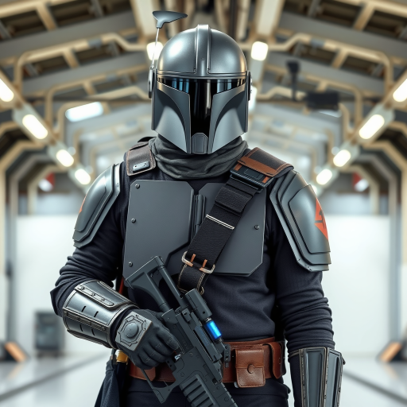
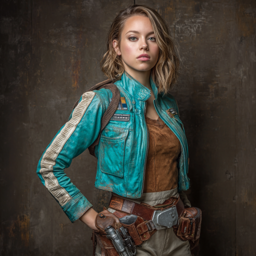

# Forgotten Ones | Chapter 3: Beneath The Glare

## **Storyteller** (11/07/2025 16:01:16)  

*1436385023728160768*

***A long time ago in a galaxy far, far away....***

### **STAR WARS**
#### **FORGOTTEN ONES**
##### **Episode III: Beneath the Glare**

The ancient cryo-ark Venture finds safe harbor at last, docked discreetly within the bustling tibanna mining colony of CLOUD CITY. Rescuedhe FORGOTTEN ONES—Wes, Iyola, and Varda—begin to grapple with their impossible awakening, centuries removed from their own time.
Under the stern but pragmatic guidance of Mandalorian CHIEF GHURN SKIRATA, commander of the elite Kando’s Coursers, a tentative alliance is formed. While repairs begin on their mysterious vessel, the refugees accept new identities and their first assignment: a discreet mission into Cloud City’s gleaming CASINO DISTRICT.
But even amidst the high stakes of corporate intrigue, unseen forces stir. As a shadowy rival makes its move, a fleeting, unknown energy signature—the whisper of a long-lost pinnace—is briefly glimpsed far beyond Bespin’s luminous clouds, hinting that the galaxy’s ancient past holds more secrets than even the Empire dares to imagine...

---

## **Storyteller** (11/08/2025 16:02:16)  

*1436747662643695716*

Morning on the *Atin Oya'ka*'s galley gradually gives way to the bustling efficiency of Ghurn Skirata's operations. The scent of freshly brewed caf now mixes with the crisp, filtered air of a space ready for work. Having concluded their meal and received their mission briefing from Chief Ghurn and Serena Foss, the *Venture* crew is now prepared to embark on Operation: Blind Sight. Each carries their newly issued data card, laden with temporary identities, mission parameters, and a discreet stipend of credits.

Arno, the lead Mandalorian enforcer, waits at the gangplank, a silent, armored figure ready to guide them. Their path will take them through the hidden operational zones of Kando's Coursers, then into the public thoroughfares of Cloud City, and finally into the glittering labyrinth of the Casino District. It is a world removed from their pasts, and from the quiet solace of the *Atin Oya'ka* and Kando'sCoursers compound.

---

## **Arno Skirata** (11/08/2025 16:02:16)  

*1436747664829059337*

** "Follow me,**" Arno's vocoder-filtered voice is calm, professional, and entirely devoid of inflection. Arno pivots sharply and sets a brisk pace, leading them from the *Atin Oya'ka*'s gangplank and into the heart of Kando's Coursers' secure facility.

---

## **Storyteller** (11/08/2025 16:02:19)  

*1436747675784708512*

The private hangar bay is now a hive of silent, focused activity, with only automated cleaning droids gliding across the polished floor and specialized maintenance droids attending to the *Venture*'s external hull. The metallic tang of coolant and ozone hangs faintly in the air.

Their route takes them through a series of increasingly nondescript, utilitarian corridors, far from the polished client-facing offices. These are the logistical arteries of Kando's Coursers: bustling storerooms filled with secured cargo, equipment staging areas, and power conduit junctions, all marked by functional Mando'a script and humming with contained energy. Arno maintains a swift, unyielding pace, allowing no time for lingering or idle observation.

Finally, they arrive at a heavy, unmarked durasteel door that blends seamlessly into a sheer plasteel wall. With a quick tap from Arno's gauntlet, a soft chime sounds, and the door slides open, revealing a brightly lit, bustling concourse of Cloud City's Port Town. The transition is instantaneous, a jarring shift from quiet, controlled privacy to a chaotic symphony of galactic life.

---

## **Arno Skirata** (11/08/2025 16:02:20)  

*1436747678804606976*

"**The exit to public access is secured. Once outside, adhere to Cloud City's standard public transport and security protocols. When you return, tap your ident chips on the terminal to enter and security will clear you. **" He indicates the console to the side of the entry into the compound.

---

## **yogi_001** (11/09/2025 17:52:48)  

*1437137868622663741*

With the meeting concluded Wes grabbed his helmet and stood.  Looking at Ghurn and Serena he gave them a nod.  **”I will just need a short time before leaving.”**  There was a small nod from Ghurn that he took as acceptance.   Looking at Iyola and Varda he gave both a smile.  **”I’ll be back in a few moments.”**  With that he tucked his helmet under his arm and left the table and moved towards the loving quarters.   

With the door to his room still open he ejected his lightsaber and removed it from the right forearm vambrace.  Taking it would be dangerous.  He let out a breath and with conscious thought replaced the weapon back into its secretive and protected place.   When it was secure he closed up the compartment.  With a nod to himself the first of three things were done.   

Next he accessed his bracer computer.   Slotting a storage disk he copied over any relevant data as to who he was on to the disk.  Then deleted the info from the device.  After placing the datacard on the room's small desk he grabbed the new ident chip and slotted it.  Within a few seconds his new identity was copied over as he slipped the new chip into a compartment on his utility belt.   

He looked at the new details on the screen.   Satisfied he opened up his messages.  There had been no response from Nadia of what he had sent her.  Still he decided to reach out and started a message.  

*”Ghurn said you were going to take some rest.  Good.   Take what you need.  The file I sent you, I hope it was enough info.  If you need more to help find Marina let me know.  There are a couple other names of Jedi I can give you.  Others that she worked alongside with Silas towards the end of the war.  Thank you for helping Nadia.  This means a lot to me. 

Wes”*

---

## **yogi_001** (11/09/2025 17:53:10)  

*1437137959093796924*

He hit send on the message and turned towards the door.   His eyes fell on the jet pack.   Seeing it brought forth a memory of when he and Marina found it on Fakir.  Picking it up he brought it over his head and let it fall into place securely on his back.   Putting his helmet on his HUD sprang to life and he saw the readout as the jetpacks reading linked up.   All was green and ready to go.   

*****

He stood with the others as Arno opened the secured door.   The brightly lit concourse waited for them just past the doors archway.  Instantly he could hear the noise filter in.  They were about to reenter life within the galaxy.   For him it was a short nine years.  For Iyola and Varna it was hundreds.  **”Ready?”** He asked as his presence shifted into a persona he hadn’t used in many years.   A bodyguard protecting his clients.  With a purposeful and confident step he passed through the door into the hallway.  His head moving, eyes and senses alert.

---

## **Iyola Kett** (11/09/2025 20:50:18)  

*1437182536043466894*

Iyola had swapped her datapad out for a blank one which just had her new ID on it, and a few downloads of current ag products.  It wasn’t like she had that much data anyway.  As Serena had advised, she hid away her ascender and some of her gems in her room. 

Wes popped back out.  He had gone into full Mandalorian mode.  He was even wearing a jetpack.  Iyola felt a pang of jealousy.  She would love to have a jetpack.  She’d ask him about it later.  

**“I’m ready,”** said Iyola. ** “Let’s go, Kalen.”**  It took every ounce of self-control she had not to sprint   ahead of Wes, but he was supposed to be a bodyguard, and she didn’t think Varda - *Morra* - could move that quickly, spry as the older woman was.  This undercover thing might be more challenging that she had expected.  

The doors opened on the new world, and Iyola breathed it in.

---

## **Varda Nisyren** (11/12/2025 19:18:11)  

*1438246520141906043*

Varda emerges from her quarters like a storm calmed only by intent. The faint shimmer of motion draws the eye first the soft clink of gemstones woven through her braids catching the corridor light. The dull shimmer of those jewels, once sleeping in a pouch, now breathe with quiet life against the dark strands of her hair tiny constellations in orbit around her composed expression.

Gone is the tattered, travel-worn cloak that once swallowed her shape. In its place, she wears a clean white blouse that glows faintly under the ship’s lights, the fabric loose at the sleeves but neatly cuffed, whispering of old ritual finery rather than simple comfort. Her skirt flows in soft, deliberate layers, each hem traced with hand-painted storm sigils, spirals of cloud and wave, threads of lightning inked in silver-blue that shimmer like memory. The small gemstones sewn between the patterns catch with every step, turning her movement into a slow dance of refracted light.

When she pauses at the doorway, she looks less like a soldier of fortune and more like something ancient pretending at civility. A seer dressed for a kings court or a witch attending a masquerade. Her eyes sweep the others with quiet amusement. "**Well,**" she says, her voice smooth as riverstone, "**if we’re to mingle among the high tables, I suppose it pays to look the part. One never knows what the Force might whisper between a shuffle and a spin.**"

Then, with that familiar glimmer of irony in her tone. "**Besides… if fate intends to cheat, I’d rather she think me beautiful while she does it.**" She holds a hand out to Iyola. "**My dear?**"

---

## **Iyola Kett** (11/12/2025 23:11:31)  

*1438305237671739455*

Iyola marvels as “Morra” steps into the room. She wonders if she brought that ensemble with her or had somehow acquired it.  She laughed at the notion of handing Ghurn Skirata a shopping list. 

Varda - or Morra - held out her hand. *Well, there were some family concerns, weren’t there?  No reason they couldn’t be both relatives and coworkers.*

**“You look wonderful, Granny Morra!”  **said Iyola.  She took the proffered hand.** “And yes, I’m ready to hit the town!” ** *Planet.  Whatever. *

---

## **Storyteller** (11/13/2025 18:42:57)  

*1438600041903165502*

The door slides open, and the *Venture* crew steps into the dizzying, vibrant, and utterly overwhelming reality of Cloud City.

The Port Town concourse hits them like a physical wave: a cacophony of a thousand languages, the rush of air currents, the flashing neon of advertisements for every service imaginable. Throngs of aliens – Rodians, Twi'leks, Gran, Humans, and other less seen species – jostle for space. Overhead, automated cargo haulers hum along designated routes, ferrying goods between immense storage towers, while smaller utility vehicles zip across transparent gantries. The air hums with kinetic energy, a pulsating symphony of commerce and life. The ground beneath their feet is polished durasteel, slick with the footprints of countless hurried steps. For Iyola and Varda, centuries melt away in the sudden sensory overload; for Wes, the nine years feel like a lifetime. Even Dryzan and Vaeros, accustomed to bustling cities, visibly register the sheer density of activity. Misha, eyes wide with overwhelmed curiosity is momentarily lost in the surge of bodies.

Following directions to the public transit, they board a gleaming sky-tram, the vehicle a blur of motion. The ride carries them swiftly upwards, offering panoramic glimpses of the city’s colossal, curving architecture. The industrial sprawl of Port Town quickly gives way to meticulously maintained green zones, residential towers soaring into the endless Bespin sky, and finally, the district of unparalleled opulence.

---

## **Storyteller** (11/13/2025 18:43:04)  

*1438600067761180755*

The sky-tram comes to a smooth stop at the heart of the **Casino District**. As they step out onto a grand promenade, the transition is instantaneous. The light here is softer, warmer, filtering through massive stained-glass ceilings. The cacophony of commerce fades, replaced by the sophisticated murmur of high society, the distant, melodic chime of slot machines, and the smooth, professional voices of lounge singers. Gold and polished chromesteel dominate the architecture, reflecting endless, sparkling vistas of Bespin's breathtaking clouds. Waiters in pristine uniforms glide by with trays of exotic drinks, while well-dressed patrons, a mixture of corporate elite, underworld figures, and wealthy tourists, mingle with an air of practiced nonchalance. 

Serena's maps prove accurate. With minimal effort, they locate their first target: the elegant entrance to **The Ruby Sun Lounge**, its double doors crafted from burnished bronzium, flanked by discreet, unblinking security sensors. A soft red light filters from within, hinting at luxury and hidden conversations.

---

## **Iyola Kett** (11/20/2025 00:22:14)  

*1440859750525829261*

Iyola soaks it all in. Cloud City is not the usual sort of place she finds herself, but it’s beautiful in its own right.  

She looks down at herself.  Her jacket is as clean as it will ever be, its blue-green color contrasting with the orange and gold of the Bespin clouds. She’s taken a decent shower, or at least better than the ones on the underpowered Venture, and her hair is shiny and more on the dark blonde than light brown side of the color equation.  She would even consider wearing makeup, if she had any, but they hadn’t made a stop at any of the glistening storefronts she’d spotted on the tram.

They reach the Ruby Sun.  It’s even fancier than she had expected. But it’s still a cantina, and she knows cantinas.  She looks at her companions, then walks toward the door.

---

## **Wes Del-Fin** (11/20/2025 00:22:15)  

*1440859753482813552*

Wes stood next to the two women.   The concourse in front of the Ruby Sun Lounge was busy.   Throngs of people hurried past.   His helmet slowly turned from side to side as he watched the groups of people.   Some were families, others were alone.  All had come to partake in the exuberance of the city's offerings.  He stepped a bit closer to Varda.   She was now Morra.   His employer and charge.  Iyola, now Tira looked like she was ready to bust through the door into the lounge.   He smiled beneath his helmet as he could sense the excitement within her.  

**”Shall we enter?”**  He asked.   His voice was flat, void of emotion as it came through the vocoder.
***
 On [✎](https://github.com/alicia86/SW_ForgottenOnes/wiki/Wes-Del-Fin)

---

## **Iyola Kett** (11/20/2025 00:22:15)  

*1440859754476863602*

“**Sure thing, Kalen,”**  Iyola said, trying the name out.**  “In fact, you can even get the door for us.”**  It would be amusing, pretending a Mandalorian worked for her, and Iyola intended to make the most of the opportunity. She rested her hand on “Morra”’s arm reassuringly, looking with interest at the other customers approaching the portal.

---

## **Wes Del-Fin** (11/20/2025 00:22:45)  

*1440859882797662289*

Wes raised an eyebrow as Iyola asked him to get the door.  It was then he realized that she was going to have fun with the setup they were planning.  His gaze left her and quickly scanned the area before it returned to Iyola.  With a nod he moved to the doors and opened one.  Looking through he peered into the lounge.  As expected no one gave an obvious glance his way.  

Turning he looked back at his two charges.  **”Miss Ves, Madam Narn.”**  As they walked past he looked inside once again. **Once again do be wary.  This place is not like home.”**
***
 On [✎](https://github.com/alicia86/SW_ForgottenOnes/wiki/Wes-Del-Fin)

---

## **Iyola Kett** (11/20/2025 00:22:46)  

*1440859885041487922*

**“Not like home?  I should certainly hope not!’  **said Iyola. ** “I don’t come to Cloud City because I want something like home.”  **

There was no obvious security at the door. *That probably meant there was a lot of security. * It didn’t matter to Iyola.  She practically sailed through the portal, tugging Varda behind her.

---

## **Storyteller** (11/20/2025 00:26:37)  

*1440860854831550475*

As Wes, now fully embodying Kalen Rynn the vigilant bodyguard, holds the bronzium door open, the low murmur of the Ruby Sun Lounge spills out, wrapping around them like a rich, warm cloak. Iyola, adopting her persona of Tira Ves, practically sails through the portal, a current of restless energy pulling Varda (Morra Narn) gently in her wake. Wes follows, his armored presence a stark contrast to the lounge's opulent interior.

The Ruby Sun is a masterclass in understated luxury, a stark deviation from the glittering neon chaos of the Casino District outside. The lighting is low and warm, cast in deep amber and crimson hues from concealed projectors and glowing liquor bottles lining a vast, curving bar. Plush, synth-velvet banquettes in shades of ruby and amethyst ring the room, offering secluded intimacy, many of them partially obscured by intricate privacy screens woven from shimmering metallic threads.

The air is thick with the mingling scents of expensive alien spirits, exotic spices from small appetizer plates, and subtle, high-quality perfumes. Soft, instrumental jazz-fusion, rich with brass and synthesized strings, drifts from unseen speakers.

---

## **Storyteller** (11/20/2025 00:26:43)  

*1440860878483357777*

The clientele is as exclusive as the decor: corporate executives in tailored suits, elegantly dressed socialites with elaborate hairstyles, and discreetly armed private security personnel who blend seamlessly into the shadows. Their conversations are a low, polished hum, punctuated by polite laughter and the occasional clink of expensive glassware. It's an environment of calculated leisure, designed for deals to be struck and reputations to be made—or subtly broken—far from the raw spectacle of the gaming tables.

The long, curving bar is sparsely populated, a few lone figures nursing drinks, while most of the activity seems concentrated in the more private banquettes and alcoves. There are no obvious "Gilded Grasp" banners or signs, no overt indicators of corporate rivalry. Discretion, it is clear, is the supreme currency here.

---

## **Varda Nisyren** (11/20/2025 19:57:57)
*1441155629430345850*

Varda let's her eyes travel over the clientele with knowing eyes and a small smirk at her lip. Linked arms with Iyola she lets the exitsbke young girl drag her through. Her eyes trail the slow curls of smoke and she breathes in the atmosphere. In a strange twisted way it reminds her of home

---

## **Iyola Kett** (11/20/2025 23:49:17)  

*1441213844759515159*

Iyola glances around the cantina, if that’s even the right word for this establishment.    Everything here is subdued and expensive, or at least it looks that way.  Not a lot of synth-hide jackets here; her coat’s blue-green hue seems to actively clash with the color scheme here.  Varda - Morris - looks glamorous, and Wes/Kalen looks like a wall of metal to her.  *I guess that’s the point.*

Well, time to test out how many credits the Skiratas put on her chip.  She eyeballs the beings at the bar to see if any of them look particularly interesting before selecting seats for her ersatz grandmother.  Kalen can stand, of course.

---

## **Wes Del-Fin** (11/22/2025 13:06:45)  

*1441776923175948432*

Wes stepped through the bronzium closely behind the two women who were now under his watch.  As the door closed the opulence of what lay before the three of them settled in.   What he had envisioned based on what info they had been given didn’t quite match up.  

His head swiveled while talking in the surroundings.  Corporate executives, and socialites who were finely dressed quietly socialized.  Discrete private security was also present blended into the scene.  Unless one was looking they would probably go unrecognized.   However he was looking.  He noticed more than one discrete glance in their direction.  

While  the other private security blended in he stood out.  Stood out in a way that was obvious and he preferred it that way.  He moved to the side of Morra and looked at the two.   **”Have you decided where you’d like to sit?”**
***
 On [✎](https://github.com/alicia86/SW_ForgottenOnes/wiki/Wes-Del-Fin)

---

## **Storyteller** (11/23/2025 00:41:09)  

*1441951675639402566*

The lounge hums with an undercurrent of quiet power. As Wes positions himself protectively beside Varda, his heightened senses immediately pick up on the subtle, assessing glances cast their way. He is, undeniably, a striking presence—the armored figure amidst the suits and silks. More than one discreet security detail subtly shifts position, their attention piqued.

Varda’s eyes, old and wise, linger on the rising curls of smoke from a nearby table where a slender, impeccably dressed human woman, seemingly engrossed in her datapad, absently toys with a delicate piece of jewelry that flashes with a subtle, almost imperceptible gleam under the ambient lighting. The jewelry emits a very faint, nearly inaudible high-frequency hum – just on the edge of audible range if one were straining to listen in the quiet lounge.

---

## **Storyteller** (11/23/2025 00:41:14)  

*1441951696506064987*

Iyola, her own vibrant jacket a cheerful defiance to the room's muted elegance, surveys the bar. Three patrons occupy stools. One, a burly Gungan, nurses a brightly colored drink, his webbed hand idly rubbing at his chin, occasionally glancing at a discreetly tucked commlink. Another, a nervous-looking human male in a rumpled corporate uniform, repeatedly checks his wrist chrono, a clear sign of impatience or distress. The third figure, a sleek Mirialan female, is in a hushed, animated conversation with an unseen party via a tiny earbud comm, her expression a mix of frustration and guarded hope. None overtly fit the descriptions of Gorok or Xylo from the dossier.

The most secluded banquettes are currently occupied, mostly by hushed groups. However, there are a few open spots, including a slightly elevated booth near a panoramic viewport offering a breathtaking (and distracting) view of Cloud City, and another booth set deep within a shadowy alcove closer to the bar, offering maximum discretion. Each offers a different vantage point for observation. The faint, metallic taste of ozone from the air purifiers is pervasive, hinting at the technology constantly at work maintaining the lounge's pristine atmosphere.

---

## **Iyola Kett** (11/23/2025 03:21:04)  

*1441991919201812610*

Iyola squints at the beings sitting at the bar.  All of them seem to be more or less preoccupied.  Th*ey’re not relaxing here, they’re working.*  She looks over at the booths. They’re both appealing for different reasons - the view of the cloudscape of the city is stunning, and the shadowy booth, she supposes, is better for the reason they’re here - observation. 

*But they don’t all have to be observing the same thing at the same time, right? *

**“Why don’t you grab a booth, Morra?” ** said Iyola.  *Tira. I'm Tira*. “**Either one. I’ll grab a drink at the bar and join you over there.” **That would spread them out to observe over a greater swath of territory, but really, she just wanted to order from the cantina tender and see things up close.  She feels weirdly excited.  Here she is, 200-odd years in the future, on a secret mission.  She’s really here.

---

## **Storyteller** (11/27/2025 02:11:49)  

*1443424041510633532*

Iyola confidently approaches the long, curving bar, its polished synth-stone surface reflecting the ambient crimson light. Behind it, a sleek human bartender, impeccably dressed in a black uniform with the casino's sigil pinned to his lapel, meticulously polishes a glass. He is a picture of detached professionalism, his expression neutral.

Iyola slides onto an unoccupied stool near the nervous-looking human male, who is still checking his chrono with agitated frequency. The burly Gungan and the Mirialan female continue their subdued activities further down the bar, seemingly oblivious.

The bartender glides over, his movements fluid. **"Welcome to the Ruby Sun, ma'am,"** he says, his voice smooth and polite. **"What can I get for you this morning?"** The gentle hum of concealed air purifiers and the soft strains of jazz-fusion fill the brief silence, the subtle glow from the liquor bottles illuminating Iyola's eager face. The vibrant hum of the Casino District outside is a faint whisper, entirely muted within the opulent confines of the lounge.

---

## **Wes Del-Fin** (11/27/2025 02:39:33)  

*1443431021508038667*

Wes watched as Iyola headed off towards the bar.  He gave her a nod and made sure to look over anyone who was going to be in her vicinity.  He turned back to Varda.   And gestured towards the elevated booth.  While it was out in the open it also offered an unfettered view of the establishment.  Which is what they were looking for.   To see and be seen.   **”This way, Madam Morra.”**  His voice was clear through the helmet's vocoder.  

Wes walked alongside Varda as he looked around into the booths as they passed.  Taking note of the race and sex of the occupants.   He was also keeping an eye out for those they were briefed on.
***
 On [✎](https://github.com/alicia86/SW_ForgottenOnes/wiki/Wes-Del-Fin)

---

## **Iyola Kett** (11/27/2025 16:45:18)  

*1443643862202450033*

Iyola idly watched the crimson light reflect off her blue-green jacket, making its hue appear more purple.  Her eyes swept back up at the bartender.  He was restrained, professional, almost clinical.  *It can take a bit of work to warm up cantina workers.* This isn’t the kind of venue where she’ll get anywhere sliding a gem across the counter.  She’ll start by ordering one of her favorite drinks.  

**“I’ll have a Coronet Scramble,”** she said. The name of the beverage was a reference to Coronet City on Corellia, as it was a Corellian whisky-based drink, typically mixed with sunfruit liqueur and jogan juice, and topped with bubbling water. 

As she waited, she glanced over at the nervous human, giving him a brief, reassuring smile

---

## **Storyteller** (11/28/2025 20:40:26)  

*1444065423115948218*

The bartender offers a polite, unreadable smile as Iyola orders. **"A Coronet Scramble, a fine choice, ma'am,"** he responds smoothly, his hands already moving with practiced efficiency as he reaches for a selection of gleaming bottles behind the bar. He doesn't offer any personal chatter, his focus entirely on crafting the drink with precision.

Meanwhile, Wes guides Varda towards the slightly elevated booth by the panoramic viewport. The seating is plush, designed for comfort and unobtrusive observation. As they move, Wes's sharp eyes scan each occupied banquette, subtly noting species, attire, and general demeanor. He clocks a few high-value targets, easily identifiable by their corporate insignia or the hushed intensity of their conversations, though none yet match the specific dossiers provided by Serena.

He notes the human woman from earlier, still engrossed in her datapad in a nearby banquette, her subtle, gleaming jewelry flashing imperceptibly. He catches the lingering glance of a Besalisk businessman at another table, seemingly engrossed in his drink, but whose multi-jointed fingers tap a peculiar, almost rhythmic pattern on the synth-stone table edge—a potential tell. The discreet security guards, meanwhile, continue their subtle vigilance, occasionally shifting their gaze towards the newcomers, their focus professional and unwavering.

The Ruby Sun, while an open network for its elite clientele, is a place where discretion is a form of armor. No one makes overt moves, but every interaction carries a weight, every glance a potential query.

---

## **Wes Del-Fin** (11/29/2025 16:57:42)  

*1444371759846527128*

Wes walked slowly alongside Varda as they somewhat meandered towards  the elevated booth.  His steps were slow to stay next to his companion.  As he led the way he made sure the area was secure.  Careful to not let his gaze linger for too long on any one booth or persons.  He was here as hired protection.   The others like him simply did the same as they walked past.  More than one nod was returned as they slowly moved towards their destination.   

Arriving at the elevated booth Wes stood to the side awing Varda access so she could sit.  **”Miss Ves will be along momentarily Madam Morra.”**  His vocoder was low.   As Varda played up the image of an old woman taking a seat upon the plush seating of the booth he stood by as her vigilant guardian.  He took one last look around their immediate area noting anyone or thing of importance before facing the entrance.  His eyes and Force enhanced senses open and alert.
***
 On [✎](https://github.com/alicia86/SW_ForgottenOnes/wiki/Wes-Del-Fin)

---

## **Iyola Kett** (11/29/2025 18:53:02)  

*1444400782257684692*

This is the oddest cantina Iyola has ever visited. It doesn’t seem like a cantina at all.  It reminds her of something else - well, it will come to her.  The male human continues to fiddle with his chrono, seemingly taking no note of her or anyone else at the Ruby Sun.

She takes an exploratory sip of the Coronet Scramble.  It’s absolutely delicious, smooth as a bolt of spidersilk.  She has to focus on not drinking it too quickly.  

**“This is wonderful,” **she says to the bartender. **“Did you use an infused whisky?  The sunfruit is so pronounced.”  **

It suddenly comes to her.  This cantina reminds her of the waiting room at the acute ward of Rhinnal Medical.  *Everyone here is on edge, looking like they’re expecting to get bad news.  *

She glances at Wes and Varda, who have claimed a plush elevated booth.  It looks nice.  She’ll take a few more sips, then join them.

---

## **Storyteller** (11/30/2025 13:36:32)  

*1444683521825308884*

The bartender, his hands moving with fluid precision as he polishes the synth-stone surface, offers Iyola a polite, almost imperceptible smile.

**"The Coronet Scramble is indeed a house specialty, ma'am,"** the bartender confirms, his voice smooth and neutral. **"We use only the finest Corellian whisky, infused in-house with hand-selected sunfruit for its bright, pronounced notes. Our clientele expects nothing less."** He doesn't offer a name or any personal detail, maintaining a detached professionalism, then subtly shifts his attention to discreetly wipe down a section of the bar, allowing Iyola her moment of observation.

As Tira sips her drink, a growing unease settles over her initial excitement. The lounge, initially perceived as subdued elegance, now hums with a palpable tension beneath the surface. The continuous, anxious chronometer checks of the nervous human at the bar, the Besalisk's rhythmic finger tapping, the almost too-still focus of the Mirialan's hushed conversation – it all solidifies Tira's sudden, unsettling realization. This isn't relaxation. It's a waiting game.

Meanwhile, Wes, the impassive Kalen Rynn, positions himself as Morra Narn's vigilant guardian. From his vantage point, he maintains a sweeping scan of the lounge, his internal sensors—both natural and Force-attuned—sifting through the layers of ambient conversation and suppressed emotion. He notes the subtle shifts in eye contact from the private security details, a professional acknowledgment of his own imposing presence. His gaze flickers briefly to the elegant human woman (Lyssa) with the shimmering jewelry. The incredibly faint, almost subliminal hum from her delicate accessories is a consistent, high-frequency whisper, just beneath the threshold of ordinary hearing, and distinct from the general technological background noise of the lounge. It's too subtle to be accidental. It hints at purpose, perhaps even a discreet, active scan.

---

## **Iyola Kett** (11/30/2025 17:07:13)  

*1444736542848323719*

Iyola nods at the bartender’s explanation.  It’s really a pity that they spend so much time crafting delicious cocktails when most of the clientele doesn’t seem to care that much.  

**“Well, I’ll join the rest of my party then**,” she says.  It feels like she’s talking to a synthwood wall.  Taking another large sip of the drink - *still delicious!* - she picks up the delicate receptacle and starts to thread her way toward “Kalen” and “Morra.”

---

## **Wes Del-Fin** (11/30/2025 18:02:13)  

*1444750381199659010*

As Morra sat, Wes turned around.  A silent breath escaped him as he took in the surroundings.  His eyes and ears alert boosted slightly by his helmet's sensory package.  It was enough of a boost to help pick up visual clues or audible ranges his normal hearing couldn’t.  

What was easily seen was the subtle shifts in the already present security details.  The subtle acknowledgment over comms or the quick glance to another unseen member of the detail.  It was a professional detail of the game that they all played.  See everything and look like you’re paying it minimal attention.  

What truly did catch his attention was the woman.  She was human and elegantly dressed and adorned with equally as such jewelry.  He saw a flashing indicator on his HUD indicating a slight abnormality in the high-frequency sound spectrum.   He brought up his bracer computer to see what it was.  The anomaly was a high freq sound wave in the background.  It was too constant and steady to be haphazardly happening.  That meant it was something deliberate.   She was fishing.   

He spotted Iyola or *’Tira’* now moving towards them, drink in hand.  When she advanced to the raised platform he watched as others followed her.  Most looked and paid no attention but the elegantly dressed woman watched with seeming disinterested manner.  He had a subtle feeling that it was anything but disinterest.   When Tira stepped up to the raised both he stepped aside allowing her access to the plush booth.
***
 On [✎](https://github.com/alicia86/SW_ForgottenOnes/wiki/Wes-Del-Fin)

---

## **Iyola Kett** (11/30/2025 20:48:02)  

*1444792111139651767*

Iyola slid away from the bar.  She glanced around her to see if anyone here was actually having any fun as she made her way to the booth. Guests of the Ruby Sun lounged at small tables, smoking or playing with their datapads.  

 *Should have gone to the casino*, thought  Iyola, *I guess I’ll have to have a different kind of fun.*  She stepped up onto the elevated platform, and kissed Varda on her creased cheek before sitting down.  “**Hey, Gram,”** she said.  **“Got a drink.  Did you order yet?”  **

She looked toward the bar, but really she was curious as to which of the beings sitting there would crack first.  That was the little game she would play with herself.

**“The Coronet Scramble is fantastic,”** she said. ** “Highly recommended.” **

Beside her, the so-called Kalen was looking stoic and vaguely threatening.  So good job there, she supposed.  There was a very subtle tension in his posture. 

**“I’ll go get one for you if you want,**” she continued. She wouldn't mind walking back to the bar.  She was feeling restless.

---

## **Varda Nisyren** (12/02/2025 20:01:18)  

*1445505127577288795*

Varda slides into the booth with a finely veiled grimace as her bones protest the simple movement. She keeps her eyes locked on Iyola at the bar as if a grandmother scared for her precious child to finally be out. The emotions and the actions are one to easily to slip into even after such a long time. 

She catches Wes' eye and then they flick to the woman with the constant vibration. She shares a small nod with him and lets a frown temperarily mar her features. As Iyola returns Varda lets out a husky laugh. "**Oh, not yet my dear. I'm not as young as I used to be. Dont want to addle my sight just yet.**"

---

## **Storyteller** (12/03/2025 14:02:36)  

*1445777244856385647*

As Iyola, now fully embracing 'Tira Ves,' rejoins her companions in the elevated booth, the delicate balance of the Ruby Sun Lounge shifts. Her cheerful defiance, Varda's theatrical age, and Wes's silent, armored vigilance form an undeniable focal point. Their subtle entrance to the booth doesn't go unnoticed.

Wes's Force-augmented senses now process the continuous, high-frequency hum from the human woman in the nearby banquette as a low, almost subliminal thrum, clearly a scanning device. Her 'disinterested' glances track Iyola's arrival, her posture tightening almost imperceptibly, a professional noting a new variable in her operational environment.

The general hum of conversation around them begins to take on a more natural ebb and flow. At a table near the lounge's central planter, a wealthy Togorian industrialist gestures expansively, his booming laughter momentarily cutting through the jazz. A hushed Twi'lek hostess, impeccably adorned, glides from table to table, attending to the whims of the patrons.

Meanwhile, the nervous human male from the bar, still compulsively checking his chrono, abruptly downs his drink and stands. He gives a quick, furtive glance around the room, his eyes scanning for something or someone, before making a hasty, almost panicked exit towards a side passage marked 'Fresher/Private Consultations'. His departure is sudden, but not overtly disruptive to the lounge's sophisticated calm.

---

## **Iyola Kett** (12/06/2025 19:15:53)  

*1446943248479162390*

Iyola was temporarily distracted by the sight of the rays of light refracting off the clouds of Bespin, a radiant orange-red hue that no doubt inspired the name of the Ruby Sun.  She turned back to Varda.

**“You’re missing out,” **she said, taking another long sip. ** “If you like sunfruit, it’s the best.”**

Varda and Wes seemed to be subtly eyeing a human woman lounging on a nearby chaise.  Iyola deliberately did not look in the same direction. She recalled the dossier they’d received - one of the operatives that frequented the Ruby Sun was a young human woman.  Well, between the so-called Kalen and Morra, they had it covered.

The agitated human stands up from the bar.  He continues to look around. Whoever he was planning to meet, it doesn’t seem like they’re here. He goes down a corridor with signage for both freshers and private consultations*.  Maybe they’re the same place. * It’s funny to think of secret meetings happening inside the freshers.  

Iyola polished off her drink.  **“Hey,” **she said casually, **“I think I might hit the freshers. If a server comes by, can you order me a bev without alcohol, like a moonberry frost, or a meiloroon shake, something like that?”**  She looked at “Kalen.”  **“You’ll be fine watching Gram here, right?”**

---

## **Wes Del-Fin** (12/08/2025 01:10:54)  

*1447394981424795778*

Wes kept mostly impassive as he played his part of the vigilant bodyguard.  If anyone was watching and he knew some were he kept a vigilant watch over his “wards” and the area.  What the other patrons didn’t know was that he had other senses as well.  The Force could augment his natural senses providing him an added boost others didn’t have or even expect, especially now.   

He made sure to not obviously out anyone who was paying too much attention.  If he had, their human woman would have been the first.  His Force enhanced senses picked up the high-frequency hum of an electronic device in her possession.   He didn’t think it was a coincidence that she matched the description of one they were to watch out for.  This was her ‘territory’.  It made sense that she’d be staking it out for possible marks.   

As Iyola mentioned going to the freshens he gave her a slow nod in understanding.  The nervous human male that was at the bar had headed off that way.   **”Yes Miss Ves.  Do be mindful.   This isn’t home.”**  He turned his head towards her.   The impassive “T” visor gave her a slight nod before turning back.  His gaze in the direction of the well dressed Human woman who had taken an interest in them.
***
 On [✎](https://github.com/alicia86/SW_ForgottenOnes/wiki/Wes-Del-Fin)

---

## **Iyola Kett** (12/08/2025 02:01:41)  

*1447407759065612392*

Kalen turned to her and gave her a slight nod, warning her yet again that the Ruby Sun was not like home.  Home - what a concept.  *Where was home, anyway? * Tira’s home was some backwater in the Vespene sector.  Her own home - she used to think it was the Stardust Seeker.  Or Rhinnal.  Or maybe, one day, Ryloth.  Now she was caught between a weird ship run by a droid who hated her, and a bunch of Mandalorians. 

Her thoughts were going down a slightly melancholy lane. *Maybe I should lay off the whisky.  No, that's too dramatic.  *

**“See ya in a bit,”** she says.  She saunters off toward the corridor with the freshers, and maybe, a tiny mystery to uncover.

---

## **Storyteller** (12/08/2025 22:13:38)  

*1447712758366994623*

Iyola, clutching her empty glass, rises from the booth with a casual shrug and begins to thread her way through the discreetly luxurious space, a playful glint in her eyes. Her blue-green jacket cuts a striking figure against the muted opulence. She passes the elegant human woman, Lyssa, whose gaze flicks up from her datapad for a brief, assessing moment, then returns to her screen with practiced indifference.

As Iyola nears the archway leading to the side passage, Wes subtly adjusts his stance. His enhanced senses follow her progress, ensuring no immediate, overt threats emerge from the surrounding patrons. His veiled gaze remains fixed on Lyssa, subtly tracking her, but a flicker of his attention is on the now-empty portion of the bar where the nervous human male had recently exited. He senses the residual agitated energy lingering in the space.

The corridor to the Fresher/Private Consultations is dimly lit, a deliberate contrast to the lounge's warm glow. The entrance itself is narrow, almost nondescript, leading into a short, sterile antechamber. Two doors, one marked with a generic 'Fresher' symbol and the other 'Private Consultations', beckon. The air here is noticeably cooler, scented faintly with a sharp, medicinal odor, a subtle disconnect from the lounge's rich perfumes. No overt security is visible here, but the discreet, almost clinical quiet of the passage suggests conversations held here are meant to be unheard.

---

## **Iyola Kett** (12/09/2025 01:35:53)  

*1447763654513528964*

The hallway lacks the sumptuous decor of the rest of the Ruby Bar.  Most people come here for a reason, Iyola excepted.   Even her footsteps sound quieter. 

She looks with some puzzlement at the fresher sign.  *Is it really just one door for all beings?  Strange.  *She places her hand on the door, listening for a moment, before pressing it lightly to see if it’s in use.

---

## **Storyteller** (12/10/2025 18:11:31)
*1448376603250917486*

The door hisses open silently, revealing not a single room, but a small, pristine, and *very* exclusive anteroom. Soft, blue-tinged lighting emanates from recessed panels. Directly ahead, a discreet sign points to several individual, sound-proofed cubicles: "Fresher Unit 1," "Fresher Unit 2," and so on, each with its own elegant, dark plasteel door. The air here is cool and completely sterile, scented with a mild, almost clinical, floral essence. There's no sound. No one is immediately visible. The passage designated "Private Consultations" is off to the right across the hall from the singular door for the freshers. It's a heavy, unadorned durasteel door that looks distinctly more robust than the others. It hums faintly with a power signature, suggesting active shielding or advanced internal systems.

---

## **Varda Nisyren** (12/10/2025 18:11:34)  

*1448376615527649403*

Varda, her keen eyes missing nothing, notices the subtle shift in Iyola’s posture, the sudden glint of purpose that transcends mere curiosity. She senses the young girl’s growing fascination with the possibilities beyond the mundane. She also notices Wes's silent, protective vigilance, his gaze briefly flicking to her with a subtle, unspoken concern. The pressure in the lounge, the hushed intensity of the *Gilded Grasp's* shadows, and the deliberate restraint she herself is employing all weigh upon her, bringing a genuine weariness that seeps into her bones.

Varda slowly, deliberately, straightens, pushing the fatigue and discomfort down with long practice. Her gaze meets Wes's, and she offers a faint, reassuring nod, acknowledging his unspoken concern without verbalizing it. The wisdom in her eyes is clear.

**"My apologies,"** Varda murmurs, her voice low and edged with a weariness that is entirely genuine. She inclines her head towards Wes, then Iyola, a brief, apologetic gesture that includes the entire mission and her own dwindling strength. **"The hum of this place, it wears at old bones more than I expected. And certain... *flavors* in the air prove too potent for one such as I to fully process for extended periods."** Her lips quirk in a dry, almost self-deprecating smile, a subtle hint that her 'flavors' refer to more than just the perfumes.

She rises with a slow, careful grace, resting a hand on her staff. **"I find I am suddenly in need of a quieter space. A true quiet."** She turns towards Wes, her eyes meeting his. **"Kalen, would you see to Morra's wellbeing?"** 

Without waiting for a direct answer, Varda begins to walk with slow, measured steps towards the entrance of the Ruby Sun, her gaze drifting back across the opulent lounge, a serene smile settling on her lips once more as she quietly departs.

---

## **Iyola Kett** (12/12/2025 04:38:08)  

*1448896682405269556*

The door to the fresher opens, only to reveal several more freshers tucked within.  Across the hall, the door to private consultations hums ominously, or so it seems to Iyola.

She opens the door to one of the freshers at random. This is a fancy lounge; they’ve got to have some nice soap, at least.

---

## **Wes Del-Fin** (12/12/2025 15:22:00)  

*1449058719362187354*

Wes nodded as Varda spoke.   He watched her stand and express her weariness and for him to check on Iyloa.   Judging from the earlier glance she gave him she was worried for Iyola.   He looked over to where she had walked off to.   The brightly lit lounge did little to obscure his view.   Especially from the vantage point he currently occupied.  

**”Of course.”** His voice sounded flat.  His vocoder removed any emotion or inflection.   He slowly walked down from the raised booth they were on at her side keeping the look of protector and helper.  **”I’ll check on Miss Ves and make sure she’s looked after.”** 

He walked alongside for a few more steps until it was time for him to branch off in the direction Iolya went.  As he strode purposely his senses, attuned to the environment were alert and ready.
***
 On [✎](https://github.com/alicia86/SW_ForgottenOnes/wiki/Wes-Del-Fin)

---

## **Storyteller** (12/12/2025 20:50:56)  

*1449141498393133120*

Iyola pushes open the door to one of the individual fresher units. Inside, it's a sterile oasis of cool, dark stone and shimmering metal, smelling faintly of clean ozone. A mirrored plasteel counter stretches beneath a glowing archway, with no traditional faucets but sleek, touch-activated sonic dispensers for water and air jets for drying. To one side, a discreet alcove holds the 'fresher' itself, a marvel of bio-recycling technology. The luxury is evident in the minimalist design and the subtle, indirect lighting that bathes the room in a calming blue glow. However, to Iyola's disappointment, the dispensers only offer a standard, unscented cleansing foam—efficient, but far from the bubbling, aromatic soaps she envisioned.

Meanwhile, Wes, now an armored specter moving through the subdued opulence of the lounge, strides towards the freshers. His senses, sharpened by the Force and augmented by his helmet's systems, remain on high alert. He discreetly scans the various occupied banquettes, making a mental note of any shifted postures or lingering glances in their direction. Lyssa, the elegant human operative with the data-skimming jewelry, remains seemingly engrossed in her datapad, yet Wes registers a minute, almost imperceptible tremor in her hand as he passes. It is a subtle reaction, a trained operative's acknowledgment of a professional threat now moving through her operational space. The nervous human male who had exited to the fresher corridor has not yet returned, the consultation door still closed and humming faintly with its internal energy. The very air seems to hold a heightened stillness, a quiet anticipation as Wes approaches the secluded passage.

---

## **Iyola Kett** (12/13/2025 15:09:49)  

*1449418038368534619*

Iyola washes her hands with the soap.  It’s unctuous and effective, but sadly flat and unscented.  She looks at herself in the mirror. Her light hair is neatly braided away, and her eyes are bright.  Her skin looks pale in the tinny artificial light. She looks normal, fine, cute, not like some time-displaced amateur spy for weirdo Mandalorians.
 
**“Hi, Iyola,”** she tells her reflection.  **“You’re doing great.  It’s all going to work out, somehow.”  **

If she doesn’t hear anything interesting, her plan is to go back out into the corridor, and maybe take another glance at this door. And then, later, she’s going to go shopping.  The Skiratas can just wait for her to report back.

---

## **Wes Del-Fin** (12/14/2025 19:17:09)  

*1449842671622295712*

Walking to where Iyola went Wes was alert.   His helmet's sensor package working in tandem with his Force senses queued him in about his surroundings.   The human woman whom he believed was Lessa, one of the people they were on the look out for, was discreetly tracking him.   His presence had her on edge.  The out of place tremor in her hand spoke volumes.  

Not paying her any attention as if he considered her a non threat he continued moving towards where Iyola had gone.  He was now looking for the human male who hadn't returned.  It seems to be too quiet and that only put his senses on higher alert.
***
 On [✎](https://github.com/alicia86/SW_ForgottenOnes/wiki/Wes-Del-Fin)

---

## **Storyteller** (12/14/2025 20:32:55)  

*1449861737137307758*

Iyola nods at her reflection, a determined glint in her eyes, before splashing a final handful of water onto her face. As she reaches for a sonic towel dispenser, her acute hearing, sharpened by years of wilderness exploration, catches a faint, almost subliminal murmur of conversation. It's too quiet, too muffled to make out words, but it's clearly emanating from *behind* the heavy, unadorned durasteel door marked 'Private Consultations' across the hall. The door, despite its solid appearance, doesn't seem to be perfectly sound-proofed against extremely focused hearing, or perhaps the muffled voices within are raised just enough to create a subtle vibration in the wall. The sound has a slightly agitated, clipped rhythm, more urgent than the general lounge murmur.

Meanwhile, Wes steps into the cool, sterile anteroom of the freshers. His senses immediately confirm the complete absence of any overt physical threat within this immediate area. The silence here is profound, almost unsettling after the low hum of the lounge. He notes the individual fresher doors, some discreetly indicated as 'in use' by faint, glowing indicators.

His Force-attuned senses, however, pick up a very subtle but distinct aura of agitation and low-level stress emanating from *within* the 'Private Consultations' room. It's a contained pocket of unease, a clear contrast to the generalized indulgence of the lounge. It's a quiet eddy in the flow of the Force, an anomaly that draws his attention. While he can't discern precise thoughts or words, the emotional residue of the individual (or individuals) within is palpable: a mix of frustration, forced cordiality, and underlying apprehension. The air in that specific area of the Force feels slightly 'dense,' almost burdened.

---

## **Iyola Kett** (12/14/2025 21:38:17)  

*1449878189919699157*

As Iyola is reaching for a towel she - senses more than hears - the cadence of an agitated conversation.  It’s coming from the consultation room, which makes sense, since she sees no evidence of the male human who’d rushed in here.  Iyola wondered whether the consultation room had listening devices in it.  She wouldn’t be surprised.  

She re-enters the antechamber, and almost runs directly into Wes.  What is he doing here?  **“Kalen?”** she asks.  **“Everything OK, or do you just need to use the fresher?”**

---

## **Wes Del-Fin** (12/17/2025 23:46:57)  

*1450997731043578007*

Stepping into the anteroom of the freshens Wes stopped near the center.  The silence was overwhelming but it wasn’t his hearing that he was listening to.   It was the subtle shifts in the Force.  Agitation and stress emanated from within one of the rooms marked as ‘Private’.   What he felt within was different then the lounge.   Outside it was an air of ease and personal indulgence.  Within the room he felt the opposite.   Frustration mixed with apprehension and other emotions swirled behind the door.  An air of unease was easily picked up by the Mandalorians Force trained senses.

He started taking a step towards the door as another door, the women’s refresher, opened and Iyola stepped out.  Her question of why he was here was answered simply with a nod.   Her appearance gave him an idea.  He stepped closer jis voice low.  **”The human male that was uneasy and impatient at the bar.  Like he was waiting for something bad.  He’s in that room.  Wanna help me interrupt them?  It will require some acting.  If we can access the door.”**
***
 On [✎](https://github.com/alicia86/SW_ForgottenOnes/wiki/Wes-Del-Fin)

---

## **Iyola Kett** (12/18/2025 14:41:26)  

*1451222836571279532*

Wes steps closer to her.  His voice is low and tinny through his helmet as he tells her about his plan to interrupt the argument inside the consultation room.  Surprise, then delight flashes across Iyola’s expressive face.  She had thought she was just going to be sitting in a booth nursing a drink for hours - this was much more fun.

**“I’m in,” **she whispers back to Wes.  **“They’re arguing about something in there. What’s your plan?**

---

## **Wes Del-Fin** (12/18/2025 22:56:33)  

*1451347434667249845*

Wes smiled beneath his helmet as Iyola agreed to go along with his plan asking what it was.  He put his  hand on the small of her back and stood closer lowering his voice.   **”If I can access the door by tripping it we pretend to be lovers trying to find a place for a risqué rendezvous.   Unknowingly interrupting them."**  

He walked slowly towards the door, already reaching out with the Force to the door's mechanism seeing if he could trigger it.  **”Are you good with that plan?”**
***
 On [✎](https://github.com/alicia86/SW_ForgottenOnes/wiki/Wes-Del-Fin)

---

## **Iyola Kett** (12/19/2025 04:43:08)  

*1451434657026539642*

Iyola is surprised when Wes pulls her closer, his large hand pressing against the small of her back.  He whispers his plan to her - they’ll pretend to be lovers looking for a place to be alone.  It’ll be like a holovid drama plot.  This isn’t her; it’s a role.  *It might work. *She can make it work. 

 She entwines herself around Wes, or at least his suit of beskar. It’s not that comfortable, but she’s committed to the bit. She leans in and murmurs near where she thinks his ear is.  

**“I’ve been waiting all day to be alone with you, Kalen.  We don’t have much time.  Where can we go?”  **

She lightly traces his headgear with a finger, looking for a catch to open it.  She assumes that’s what Tira would do in this situation.  *What else is she supposed to do, lick the side of his helmet?*  They drift toward the consultation room door.

---

## **Storyteller** (12/19/2025 19:34:32)  

*1451658982828544010*

Wes's Force-attuned hand finds the door's locking mechanism. He focuses, not on brute force, but on subtly disrupting the finely tuned electronics. The inner workings hum under his will, the Force coaxing an unintended response. With a soft *thunk*, audible in the sterile quiet, the heavy durasteel door of the 'Private Consultations' room unexpectedly slides open by a handspan, revealing a sliver of the agitated scene within.

Inside, the nervous human male they'd seen at the bar is indeed present, his face now flushed with anxiety, sitting across a small, polished table from Xylo, the Gran negotiator from Serena's briefing. Xylo's three eyes, usually jovial, are currently narrowed with an intensity that is anything but. He gestures emphatically with one hand, a datapad lying open between them displaying a complex series of financial figures. The conversation, previously muffled, is now clearly audible—a tense discussion about missed payments, unfulfilled contracts, and escalating penalties.

---

## **Xylo** (12/19/2025 19:34:32)  

*1451658985525612746*

**"—and your 'concerns,' Koral, do not alter the contractual obligations! The collateral is forfeit. Silas Vane does not tolerate... *inefficiency*."**

---

## **Storyteller** (12/19/2025 19:34:35)  

*1451658999220011129*

Just as Xylo delivers this harsh pronouncement, the door unexpectedly hisses open, revealing Iyola ("Tira") in her dramatic embrace with Wes ("Kalen"). Their impromptu tableau of desperate longing—Iyola pressed against the formidable *beskar'gam*, whispering into the vocoder-grille of Wes's helmet while idly toying with his visor—casts a sudden, jarring incongruity into the tense corporate confrontation. 

Both Xylo and the nervous Koral freeze mid-sentence, their heads snapping towards the now-partially-open door, their expressions a mixture of shock and profound disbelief at the utterly inappropriate interruption. The unexpected spectacle has utterly derailed their strained negotiation.

---

## **Wes Del-Fin** (12/20/2025 01:29:24)  

*1451748288952012860*

With some subtle coaxing with the Force Wes disrupted the locking mechanism in short order.   It wasn’t the first time he had done this.  Master Davion had taught him to find the variance within the electronics and extort it.   With a subtle push the lock was compromised and the door hissed open.  

Keeping up with the act the two ‘lovers’ stumble into the room.  The emotions and raised voices were still active and Wes felt them shift to surprise and shock.   

Inside was the nervous human from the bar.  Also in accompaniment running the meeting was the Gran negotiator Xylo from Serena’s briefing.  Wes stopped with actual surprise at the unfortunate mishap.  ***Stang.***  He cursed inwardly.  A second later the monotone voice of his vocoder sounded out.   **”Apparently this room is occupied.  Let’s find another one.”**  He looked around the room.   **”Excuse us.”**
***
 On [✎](https://github.com/alicia86/SW_ForgottenOnes/wiki/Wes-Del-Fin)

---

## **Iyola Kett** (12/20/2025 02:05:10)  

*1451757291648057588*

Iyola squawked in genuine surprise as the door suddenly opened.  *How had Wes done that?  *Inside, a  three-eyed Gran and the sweaty male human from the bar stared at them in shock.  Iyola buried her face against the hard carapace of Mandalorian armor on Wes’s chest, mainly to hide the expression on her face, but also because she was pretty embarrassed.   Aradara Diorlo had always done infiltrations in a stylish, deft manner.  That was not her. 

**“Sorry!  Sorry!” ** she said.  The metal was smooth and cold against her cheek. Wes intoned in his voice, flat and droidish through the helmet, that they would find another room.  She lightly punched Wes on the arm.  *Ow.* ** “I can’t believe you did this to me!” ** she said, half sobbing, half laughing. She wasn’t even sure if she was in character or not right now.

---

## **Storyteller** (12/20/2025 03:16:47)  

*1451775313980817452*

Xylo's three eyes blink in slow, bewildered unison, his earlier anger completely deflated by the absurd interruption. Koral, the nervous human male, stares with his mouth agape, his face a canvas of disbelief. The subtle, urgent hum of distress that had permeated the room instantly evaporates, replaced by a stunned, almost comical silence.

The image of 'Tira' burying her face against 'Kalen's' beskar'gam, punctuated by her choked mixture of sobs and laughter and a very un-lover-like punch, utterly shatters the fragile illusion of their impromptu charade, replacing it with something far more bizarre and unexpected. It is not anger they provoke, but profound bewilderment and an almost stunned embarrassment from Xylo and Koral. The air now crackles with sheer, bewildered awkwardness.

---

## **Wes Del-Fin** (12/20/2025 03:52:33)  

*1451784315036893249*

Wes felt the emotional tension in the room shift.  Where a distressed urgency hung over the room just moments before he felt it being replaced with a profound stunned silence.  The shock was that he didn’t need his Force senses to feel it.   Iyole, wrapped around him in an almost comical fashion, didn't help the charade by punching him in the arm.   

Never taking his gaze off the two they interrupted, Wes stood tall as he patted the small of his companions back.  **”Cyar'ika, this rendezvous we waited for is going to have to wait..”**  Wes shifted his gaze to the Gran and gave Xylo a curt nod.  **”Please excuse us.   The door was unlocked.  We didn’t mean to interrupt.”**  

 | Cyar’ika - Sweerheart |
***
 On [✎](https://github.com/alicia86/SW_ForgottenOnes/wiki/Wes-Del-Fin)

---

## **Iyola Kett** (12/21/2025 23:00:08)  

*1452435503365361977*

The awkward silence seemed to go on forever before Wes punctured it  with a more formal apology to the two beings they had interrupted accidentally on purpose.  Then he called her cyar’ika  - darling or sweetheart in Mando’a.  It was a loving term. Iyola took the gigantic hint and  realized she’d been going about this wrong.  She was trying to be a dramatic performer/triple agent/exotic dancer etc etc like Aradara Diorlo, and she wasn’t that at all.  

*Imagine it’s Caz under that helmet, *, Iyola told herself.   Someone you want to be with. 

** ”I’ll wait as long as I have to, love,**”  said Iyola.  “**But I really hope it’s not that long.”** She softened against him as he rubbed the small of her back and placed a tiny kiss against his shoulder, which, unsurprisingly, tasted like dirty metal.  

**“Let’s get back before Gram realizes we’re missing,” **she whispered to him.”

---

## **Xylo** (12/21/2025 23:58:13)  

*1452450118115790918*

Xylo lets out a frustrated, sputtering sigh, raking one hand over his crest as he watches the departing pair. The negotiations, whatever fragile state they were in, are irrevocably shattered by the sheer, awkward spectacle.

**"This is... preposterous! Unprofessional! This entire establishment's security is a farce!"** Xylo splutters, finding his voice at last, though it's now tinged with a distinct whine of professional grievance rather than genuine threat. He scrambles for his datapad, clearly more concerned with documenting this bizarre security breach than continuing the discussion with Koral. **"Get out! Just... get out!"**

---

## **Iyola Kett** (12/23/2025 01:25:12)  

*1452834396267614281*

Iyola slunk back to the booth, accompanied by Wes.  He let her know that Varda had left, exhausted after a long day of misadventure, so Iyola didn’t have to worry.

Once back in her seat, Iyola signaled for a server to come by.  She could use another drink. 

**“Thanks for keeping me safe,”** she said to “Kalen” in a mildly flirtatious tone.   She wasn’t sure how much more she could do in this overpriced lounge.  *Perhaps it was time to go shopping? * The thought made her perk up a bit.  It was better than thinking about Caz, and how she would never get to see him again.

---

## **Wes Del-Fin** (12/23/2025 01:37:10)  

*1452837409782894678*

Wes left the back area with Iyola.  They act of wanting lovers fell away as they entered the main lounge.   Once again they were bodyguard and client as they made what seemed like a long trek back to where they were sitting.   

Iyola sat as he took the protective stance of the bodyguard once again.   Her comment of keeping her safe made him smile.   He turned his head and gave her a nod.   **”Just doing my job Miss Ves.  I’m sorry that things don’t go… as planned.”**  He turned his head back to the main lounge to see if the same players were lurking.
***
 On [✎](https://github.com/alicia86/SW_ForgottenOnes/wiki/Wes-Del-Fin)

---

## **Storyteller** (12/23/2025 02:16:25)  

*1452847284189663302*

A discreet, human server, his smile professional and unreadable, approaches their booth almost immediately after Iyola signals. He is impeccably polite, offering no hint that he had observed their earlier, peculiar performance.

**"Welcome back, ma'am. Can I get you another Coronet Scramble, or perhaps something else?"** he asks, his gaze briefly flicking to Wes with a subtle, respectful acknowledgment of his presence as a bodyguard.

Wes's Force-attuned senses confirm the immediate vicinity. Lyssa is still in her banquette, apparently deep in her datapad, her posture now slightly more rigid. Her high-frequency scanner continues its subtle thrum, indicating she's still very much on duty, seemingly uninterested in the antics by the fresher. Xylo and Koral, however, are nowhere to be seen, their private consultation room now quiet and its heavy door firmly closed.

---

## **Iyola Kett** (12/24/2025 00:26:55)  

*1453182115553218824*

“**The Coronet Scramble was delicious,”** says Iyola, **“but I’m in the mood for something different.” ** She glances over at the impassive side of Kalen’s helmet.  **“How about an iced joganita, extra frothy?”**  Wes can’t drink on the job, but “Tira” has no such qualms.

She looks the server over.  He’s so reserved he might as well be a freshly-wiped droid. **“I might go shopping for clothing after this,”** she says to him.  “**Any recommendations?” **

---

## **Server** (12/24/2025 02:20:14)  

*1453210633368502315*

The server's impeccably professional facade cracks, ever so slightly, at Iyola's unexpected shift to personal questions. A faint, almost imperceptible human warmth flickers in his eyes, a momentary surprise that reveals the man beneath the polished uniform.

**"An iced joganita, extra frothy. Excellent choice, ma'am,"** he replies smoothly, a hint of genuine appreciation in his voice. He then pivots, his hand moving to subtly adjust the small datapad on his belt. **"As for shopping recommendations, ma'am, Cloud City offers a multitude of boutiques. The 'Vertigo Spire Galleria' on Level 187 offers an exquisite selection of bespoke haute couture – rather exclusive, I'm afraid. For something more... spirited, perhaps 'The Neon Nook' on Level 120 in the entertainment district. Its selection is quite... *diverse*. Are you looking for anything in particular?"** His smile, though still professional, holds a hint of genuine intrigue.

---

## **Iyola Kett** (12/24/2025 20:56:33)  

*1453491563802919052*

Iyola’s mouth quirked upward. **“I’ve been called spirited before, believe it or not,**” she said.  

**“I’ll be spending some time in Cloud City, and I’ve realized that I need to diversify my wardrobe,”** she said to the server.  **“Neon Nook sounds like one stop on the list.  I think I might need more fun capes and ponchos. Who doesn’t?  Maybe I’ll get Kalen one of those half-capes.  He’ll look so good in it, won’t you, Kalen?” ** Iyola winked at Wes. ** “I’m thinking green. Or yellow.”  **

**“And then,” ** Iyola made a gesture toward the elegantly-attired crowd, making sure not to linger on that woman 
Lyssa.  *I hope you’re enjoying spying on me right now, you sleemo*, she thought.  **“I’ll need something for, well, venues like this. The Vertigo Spire sounds perfect, but I’m gathering that I’ll need some sort of introduction to visit.” ** She leaned forward a touch.  **“How would I make that happen?” **

---

## **Server** (12/26/2025 15:07:11)  

*1454128419385118723*

The server's polite smile widens, a genuine flash of amusement now dancing in his eyes as Iyola teasingly questions Wes about capes. He smoothly notes her enthusiasm.

**"The Vertigo Spire Galleria operates on an exclusive, by-appointment-only basis, ma'am,"** the server explains, his voice smooth and informative once more. **"Clients typically acquire introductions through established corporate sponsors, private fashion consultants, or via direct invitation for significant bespoke commissions. It caters to a very... *particular* clientele, shall we say. While no overt 'introduction' is strictly required for browsing, an affiliation with a well-known entity or an impressive personal referral would certainly facilitate a more... *expeditious* experience."** He offers another polite smile, his implications clear and subtly helpful. He then turns to glide discreetly towards the bar, beginning to craft Iyola's iced joganita.

---

## **Iyola Kett** (12/26/2025 18:11:50)  

*1454174888666337331*

Iyola nodded and smiled at the server, who excused himself to make her joganita.  She wondered if Serena Foss would hook her up with an introduction to the Vertigo Spire, so she could spend even more of the Skirata clan credits.  Probably not - and she wouldn’t blame them - but it was worth a try.  She knew she had the emergency commlink, but she obviously couldn’t contact them right here.  

**“What do you think, Kalen?”** she asked Wes.  “**I’ll finish this  next drink, and then you’ll escort me to the Neon Nook?  Or carry me, I suppose, depending on how strong it is.”**  It was so uncanny interacting with someone whose entire face was covered with metal. Maybe other levels of Bespin would be more social.

---

***Created** 12/26/2025 17:07:22 (v7.9.1)*
