# Forgotten Ones | FO Ch4 Resonance Frequency

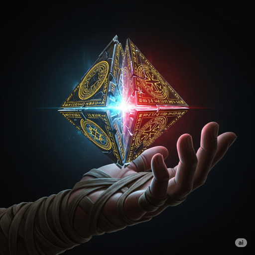

## **Storyteller** (01/20/2026 20:38:24)  

*1463271467666899115*

***A long time ago in a galaxy far, far away....***

### **STAR WARS**
#### **FORGOTTEN ONES**
##### **Episode IV: The Resonance Frequency**

The shadow of the Galactic Empire looms large over the stars, yet within the floating sanctuary of CLOUD CITY, a different kind of mystery unfolds. The crew of the ancient starship VENTURE, survivors cast adrift by time itself, have found a precarious refuge under the watchful eye of CLAN SKIRATA.

As the displaced refugees struggle to reconcile their fractured memories with a cold, new reality, the silence of the void is shattered. A cryptic distress signal, encoded with the forbidden markers of the secret PROTECTOR ORDER, has pierced the darkness of the DREVA SECTOR, beckoning the "Forgotten Ones" back into the fray.

Summoned by their ship’s enigmatic AI, the crew must now decide if they will risk their newfound safety to answer the call. But even as they prepare to return to the stars, a ghost from the past stirs in the silence, threatening to reveal that some echoes were never meant to be heard....

---

## **Storyteller** (01/20/2026 22:40:14)  

*1463302128268218445*

The late morning sun of Bespin filters through the translucent upper shields of the hangar, casting long, golden-orange rectangles across the polished durasteel floor. The usual cacophony of Port Town is a distant, muffled vibration through the compound's heavy walls. Held in place by massive docking struts, the *Venture* remains a dark, silent monolith. Swarms of small Skirata maintenance droids now cling to its hull like metallic parasites, their welding torches sparking rhythmically as they repair the scars left by the vacuum and the scavengers. 

The vessel is no longer the derelict tomb the crew first encountered. It is a ship born of a visionary era; sophisticated, sleek, and built with a philosophy of exploration that has long since been discarded by the current galaxy. 

The bridge is bathed in a cool, rhythmic blue glow, a stark contrast to the warm Bespin sun outside. The dark, obsidian-like consoles shimmer with active data streams—cascading lines of code that Vekka’s team has managed to coax into a state of high-readiness. The central holographic table is active, a three-dimensional star chart of the local sector rotating slowly, though it lacks specific destination markers. 

There is a new weight to the air. The hum of the ship's heart, the main reactor, is no longer a tentative vibration; it is a steady, confident thrum that resonates through the deck plating. The atmosphere is clinical and expectant, yet strangely hollow. Despite the priority summons that pulled everyone from the comforts of the *Atin Oya'ka*, the command dais remains empty. Eve has not yet manifested her holographic avatar, leaving the bridge to hum with a restless, silent intelligence.

---

## *Awakening: The Wayward Vigil*

### **aliciagd** (01/20/2026 22:49:48)  

*1463304534892871844*

Awakening: The Wayward Vigil

---

### **Storyteller** (01/20/2026 23:07:13)  

*1463308920251482316*

The tyrannical GALACTIC EMPIRE tightens its grip, its vast war machine seeking to crush the last embers of freedom. Against this overwhelming might, a fledgling REBELLION fights a desperate shadow war, their hope dwindling with each passing day.

But this is not the first time the galaxy has been torn asunder. Across millennia, great powers have risen and fallen, their histories rewritten by the victors and their truths lost to time. Whispers persist of a hidden conflict fought not for territory, but for the soul of history itself.

Now, in the debris-choked ion fogs of the DREVA SECTOR, another vessel long-hidden from the stars, the courier WAYWARD VIGIL, has triggered a catastrophic alarm. Aboard this ghost ship, a failing protocol has begun to thaw souls ripped from their own eras—survivors of conflicts long past, preserved for a purpose they do not understand, and about to be thrust into a war that is not their own….

---

## *Intro: The Static Heart (Lis)*

### **aliciagd** (01/20/2026 23:56:14)  

*1463321256370634967*

Intro: The Static Heart (Lis)

---

### **Storyteller** (01/21/2026 00:17:16)  

*1463326548877770856*

The first thing Lis perceives is the hum. It isn't the rhythmic, reassuring thrum of a well-tuned hyperdrive or the steady pulse of a station's life support. Instead, it is a jagged, intrusive vibration—a psychic and physical static that rattles his teeth and vibrates in his very marrow. It feels like an unfinished circuit, an echo of power that nearly unmade him.

He attempts to open his eyes, but the visual data feed is dead. Darkness, absolute and suffocating, greets him. He tries to blink, to clear the soot or debris he assumes must be coating his retinas, but there is nothing but the void.

Lis reaches out with limbs that feel like leaden hydraulic struts deprived of oil. His hands, scarred and calloused by years of labor, meet a cold, smooth, and hopelessly seamless curve of metal. He is enclosed. He is a component trapped in a lightless chassis. 

Panic, a rare visitor to his methodical mind, begins to flicker. He tries to recall the last project—was he at the Starlight Beacon? Was there a core breach? He remembers the heat, the brilliant flare of the "Great Works," and the stern but proud face of Foreman Molekh. He remembers a surge of energy so bright it turned the world white... and then, a corrupted sector in his memory. A vast, empty gap in his personal logs. 

He feels for his yellow jumpsuit, the familiar weight of his utility belt, the reassuring shape of the Aurek-9 multi-tool, or the magnetic hum of his Graviton Boots. They are gone. He has been stripped bare, deactivated, and stored away. He is an engineer without his tools, a builder in a world he cannot see, shivering in a cold that feels like it has lasted for an eternity.

---

## *Intro: The Muted Echo (Ciara)*

### **aliciagd** (01/21/2026 00:26:51)  

*1463328960468357184*

Intro: The Muted Echo (Ciara)

---

### **Storyteller** (01/21/2026 00:30:49)  

*1463329959413022873*

The universe, once a vibrant kaleidoscope of emotional color, has been bleached white. For Ciara, being alive has always meant being a conduit for the feelings of others—a constant, thrumming symphony of joy, sorrow, and desire. Now, there is only a profound, terrifying silence. 

She surfaces from the depths of her slumber not to a memory, but to a vacuum. Her heart feels like a cold, empty room. She can perceive the clinical, cold reality of the space around her, but her own internal fire has been reduced to a faint, distant ember. She tries to reach for the Force, to find its familiar comfort, but her spirit slams into a barrier of absolute, frigid rejection. It feels as though her mind has been encased in lead.

Then, the physical sensations arrive. Her magenta skin is pebbled with cold. Her limbs are unresponsive, heavy and stiff. She opens her near-crimson eyes and finds only a thick, impenetrable veil of blackness. She is blind. 

Ciara reaches out with fingers that tremble with a profound, aching weakness. She encounters the smooth, unyielding surface of a containment tube. She is a specimen in a jar. Her traditional Jedi robes are gone and the rest of her gear are gone.

Her mind frantically searches for the "why." She remembers the Jedi Civil War, the staggering weight of the galaxy's suffering, and her own desperate, arrogant desire to "fix" it. She remembers the battle, the chaos of Revan’s era... and then, a Great Void. There is no memory of the pod, no memory of the capture. There is only the darkness, the cold, and the leaden silence of a Force she can no longer feel.

---

## *Intro: The Hollow Vigil (Cajar)*

### **aliciagd** (01/21/2026 01:02:32)  

*1463337940141867232*

Intro: The Hollow Vigil (Cajar)

---

### **Storyteller** (01/21/2026 01:02:36)  

*1463337956956700849*

Awareness returns not as a thought, but as a dull, sympathetic throb in his chest. For a moment, Cajar is back on the medical station, surrounded by the ghosts of the wounded. He tries to reach for the familiar hum of life-signs and botanical growth, but finds only a flat, clinical silence that makes his skin crawl.

The physical world arrives with a sickening lurch. His limbs are unresponsive and heavy. He opens his eyes, expecting the sterile white of a med-bay, but finds only a thick, suffocating darkness. He is blind, the darkness pressing against his pupils with an almost physical force.

His bare shoulders press against the smooth, curved interior of a metallic cylinder. As he tries to shift, the muscles in his back flare with a cold, biting ache. He reaches for his work uniform, his medical kit, or the heavy weave of his dark grey cloak. They are gone. He is stripped bare. 

The air is stale and smells of ozone. The only sound is the low, indifferent thrum of a power source he doesn't recognize. He is alone, trapped in a cage of metal and silence, with nothing but the echo of a pain he can’t name.

---

## *Intro: The Muted Echo (Ciara)*
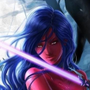

### **Ciara** (01/21/2026 01:20:51)  

*1463342549459795981*

Ciara takes a breath, planning to calm herself, only to find a lack of the panic the situation calls for. She can just barely feel that her adrenaline is spiking, but it isn't coming with the emotions that should accompany it. 

She resists the urge to introspect about this. Someone is clearly doing something to her, and she needs to act to stop it. The force feels far away, but not gone. She has overcome a similar obstacle before. 

She reaches out with the force to get a sense of her surroundings, also gathering power to break this container. Her confidence unshakeable as always, she opens her eyes and pushes with everything she has.

---

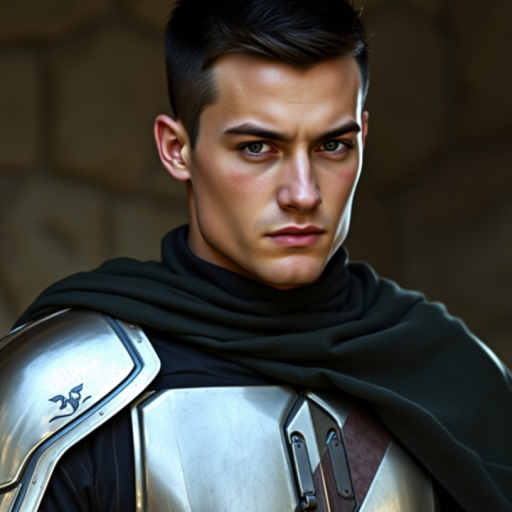

## **Wes Del-Fin** (01/21/2026 01:42:40)  

*1463348040868823060*

Wes stepped onto the bridge of the *Venture.*  His heavy boots sounded out before him.   After having spent the previous evening in reflection and meditation his demeanor had evened out.  

Mostly.  

Waking up after almost ten years seemed unfathomable.  Hearing that the woman you loved was dead and finding out you had a daughter was unbelievable.   Yet waking up this morning had changed nothing.   The situation when he woke up was the same as when he went to bed.  

Looking around he saw that no one else was here yet.  It might have been better if he checked in on the others before leaving the *Oya’ka.*

Removing his helmet from under his arm he set it on one of the consoles.  **”Eve, you there?”** He said looking at one of the monitors.
` `                               Helmet off [✎](https://github.com/alicia86/SW_ForgottenOnes/wiki/Wes-Del-Fin)

---

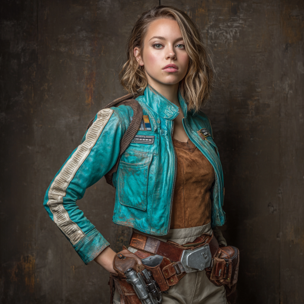

## **Iyola Kett** (01/21/2026 02:23:25)  

*1463358294415642717*

Iyola is right behind Wes.  Unlike him, she’d slept pretty well.  She’s a little miffed, however, at having to put off her trip to the Vertigo Spire Galleria. What does Eve want with them?  

*Is this about the Protectors?* She wonders again about the Protectors.  Eve has always been super cagey about them.  What are they like?  Could they, somehow, return her home?  Or could she tell them to eat shit and kriff off for dragging her hundreds of years into the future?  *Why not both?  *

Wes is already there, reliable as ever.  **“Good morning, Eve!’ ** calls out Iyola.  **“Your favorite guy is here, Captain Wes!  And me too!” ** She looks at Wes. “**She likes you the best, you know that, right?”**

---

## **Storyteller** (01/21/2026 03:21:10)  

*1463372828597551145*

The blue glow of the bridge intensifies as the internal sensors register the arrival of the crew. The air feels charged, not with the static of a malfunction, but with the focused intent of a ship that has been thoroughly scrubbed and optimized by Mandalorian hands. The panoramic viewport reveals Cloud City as a shimmering disc against the morning mist, a silent witness to the gathering of these historical anomalies.

---

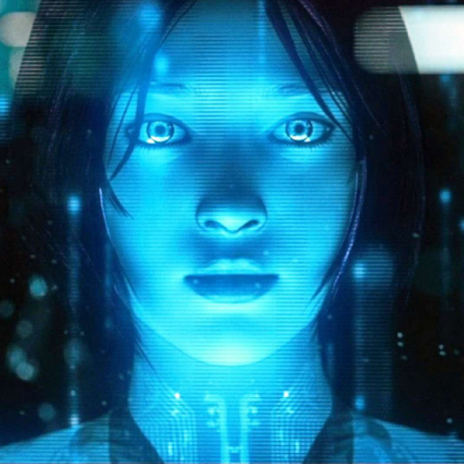

## **Eve the AI** (01/21/2026 03:21:11)  

*1463372831151620157*

Instead of a flickering image on a monitor, light coalesces in the center of the command dais. Particles of blue luminescence weave together to form a life-sized, three-dimensional holographic woman. She is serene, her dark hair and long robes rendered in perfect, translucent detail. She turns her head toward the entrance, her expression one of calm attention. **"I am here, Wes. And good morning to you as well, Iyola."** Her voice now carries a richer, more resonant quality, echoing throughout the bridge. **"To address your query: favoritism is not a programmed parameter within my logic processors. However, Wes’s command inputs possess a sixty-four percent higher rate of tactical efficiency than other registered crew members. If 'liking' is a surrogate for 'optimal functionality,' your assessment is correct."** She pauses, her holographic eyes flickering toward Iyola.
 "**Furthermore, I must note that no 'Captain' has been formally designated by this group. If you wish to ratify a formal command hierarchy, I am prepared to log the change.**”

---

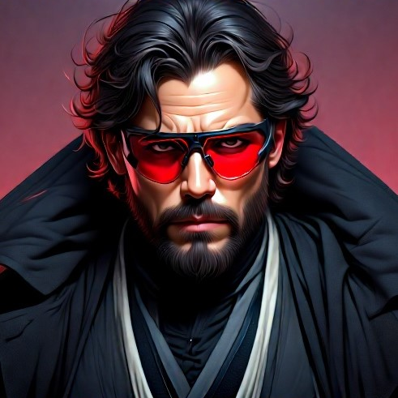

## **Dryzan Kar'dola** (01/21/2026 03:21:15)  

*1463372850139234447*

The hiss of the door announces Dryzan's arrival. He looks as though he hasn't slept much, despite the comforts of the *Oya'ka*. He’s wearing his "Shadow-caster" trench coat, but notably, he's carrying a small, bulging travel satchel slung over one shoulder. His red pince-nez glasses are perched low on his nose as he scans the bridge. **"Optimal functionality, huh? I guess that explains why I'm always the one dragging heavy slavers around,"** he mutters, though the usual sharp bite of his sarcasm is tempered by a strange, reflective distance. He leans against a navigation console, nodding to Wes and Iyola. **"Morning, sunshine. Looks like the big blue lady finally decided to show off for the guests."**

---

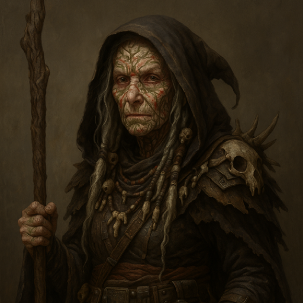

## **Varda Nisyren** (01/21/2026 03:21:16)  

*1463372852316082365*

The soft, rhythmic *tap-tap-tap* of a staff announces the final arrival. Varda enters the bridge, her movements slow but steady. She’s swapped the finery of the previous night for her more practical patchwork skirt and cardigan, though the gemstones in her hair still catch the light. She stops near Wes, looking up at him with a tired but warm expression, her violet eyes assessing the group's weariness. **"Good morning, my dears,"** she says, her voice a low, comforting rasp. **"I can see the lack of sleep on nearly every face here. It seems the future is a demanding place to live."** She leans on her staff, glancing at Eve’s 3D form with a mix of suspicion and begrudging respect. **"At least the ship is breathing better than we are this morning. I assume you didn't wake us all up just to discuss titles, Eve?"**

---

## *Intro: The Static Heart (Lis)*
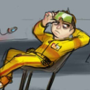

### **Lis Garah** (01/21/2026 10:18:43)  

*1463477909430993003*

*Panic grips at the heart of Lis Garah... true fear that only impeding doom can inspire... heat... brilliant flare... surge of energy... white light... the signs were all there... a terrible malfuction! Maybe of his own work!*
*He rolls his hand into a fist and then bites it! Oh no! No no no! What if it ACTUALLY was his work?! What if something he did malfuctioned?!  Was it one of his apprentices?! Some inferior parts he bought in the black market?! AAAH THE PAPERWORK! Garah begins pulling at his hair imagining the endless reports he'd have to fill! The security meetings!*
*No... he takes a deep breath and clasps his hands, with his index fingers held against one another and touching his lips... he was with Molekh... he didn't work under Molekh for a while... he... he can't remember exactly why he was with Molekh but if he was with Molekh there were good chances he was summoned for a consultation... yes... yes! Fear is dispelled from the man's heart... whatever terrible accident and whatever awful wound Garah suffered... his career was completely safe! He could even fake that he's too shocked and in distress to give a report!*
**"Phew..."** *Loudly, Garah exhales in relief... no paper work... no pay cuts... no career setbacks... good... now he wanted to assess the damage... darkness... maybe his eyes got cooked in the accident? He goes to touch them, to check if the actual eyeball is still there... of course, he'll do so while his eyelids are closed... then he will begin to slowly check the rest of his body, checking for any metallic replacements or anything of the sorts... he did leave consent to receive life saving implants or prosthetics in case of grievous wounds, so he wouldn't be that shocked or surprised to find himself to be less of a man and a bit more of a machine.*

---

## **Wes Del-Fin** (01/21/2026 11:43:11)  

*1463499166864117832*

Wes raised an eyebrow at Iyola’s remarks and Eve’s follow up.  **’Thanks Eve, I think.”**  He said as Dryzan and Varda also came in.  He looked at Iyola and gave her a half smile.  

Dryzan was and seemed to be his usual cynical self while Varda was inquisitive of the summons.   He did notice that there were some missing.  He let out a relaxing breath pushing the thoughts of Nadia, Kiera and Marina from his mind.   **”What’s going on Eve, why the summons?  Where are the others?”**
` `                               Helmet off [✎](https://github.com/alicia86/SW_ForgottenOnes/wiki/Wes-Del-Fin)

---

## **Eve the AI** (01/21/2026 17:26:55)  

*1463585670026232071*

**"Directives for this specific data disclosure require a minimum of eighty percent of the registered personnel to be physically present. I am currently tracking the approach of Nadia Skirata and Misha Vorne. They are estimated to reach the bridge in forty-five standard seconds."** 

Eve’s head tilts slightly. **"The status of Crew Member Vaeros Halcyon is... non-congruent. His biometric signature was last recorded exiting the airlock two hours ago. He is no longer detected within the *Venture*'s sensor range. I have attempted a localized comms ping, but it was intercepted and redirected by a Skirata-level encryption wall."** 

Her eyes move to Iyola. **"Iyola Kett, a low-priority notification has been flagged for your personal datapad. It was uploaded from the starboard barracks terminal by Vaeros Halcyon prior to his departure. It appears to be a direct communication intended only for your review."**
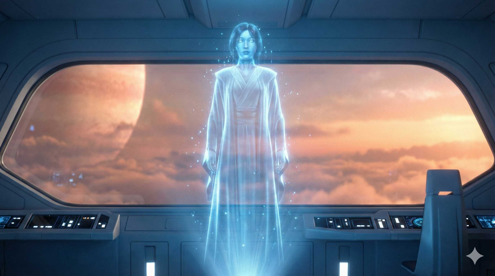

---

## **Nadia Skirata** (01/21/2026 17:27:33)  

*1463585828960993334*

The hiss of the door interrupts further speculation. Nadia enters, followed closely by a wide-eyed Misha. Nadia is once again in her dark blue and black armor. She stops as she sees the gathered group and the holographic projection of Eve. **"We're here,"** she says.
` `                               Off [✎](https://github.com/alicia86/SW_ForgottenOnes/wiki/Notable-Allies#nadia-skirata)

---

## **Misha Vorne** (01/21/2026 17:27:34)
*1463585832056131607*

Misha stays close to Nadia’s shadow. She looks up at Eve’s holographic form, her technical mind momentarily overriding her anxiety. **"That's... incredible resolution. The photon density is..."** She catches herself and looks down, blushing. **"Sorry. I'm ready."**

---

## *Intro: The Muted Echo (Ciara)*

### **Storyteller** (01/21/2026 17:44:10)  

*1463590008580477134*

Ciara’s heart hammers against her ribs, a frantic, mechanical rhythm that her mind observes with a clinical, terrifying detachment. Usually, a surge of adrenaline like this would be a riot of magenta heat and sharp, vibratory anxiety, but now, it is a silent fire burning in a cold vacuum. She is a mirror reflecting a storm, but the inner glass remains frozen and still.

She reaches out. The Force, once a rushing river, is a whisper heard through a leaden wall. She pushes her will against the heavy, static-filled fog that has settled over her soul, demanding it yield to her lineage and her training. 

The darkness doesn't lift, but it *shifts*. The void becomes a landscape of grey outlines and flickering energy signatures. She "sees" the curve of the lid above her, vibrating with the strain of failing systems. Beyond it, the room is a chaotic tableau of strobing emergency lights and jagged shadows. She senses two other pods nearby—one housing a flickering, frantic technical spark, the other a low, rhythmic pulse of life. 

She gathers every ounce of her remaining will, focusing her confidence into a telekinetic burst intended to shatter the lid. She pushes with everything her spirit can muster. But the power doesn't surge; it stalls. It hits an invisible, suffocating resistance that snuffs her effort like a candle in a gale. The lid remains clamped shut, mocking her strength with its silent, sterile perfection. Her limbs, heavy as stone, tremble with the exertion, leaving her gasping as the Force refuses to answer her call for violence.

---

## *Intro: The Static Heart (Lis)*

### **Storyteller** (01/21/2026 18:14:40)  

*1463597686577168568*

The darkness is a physical weight, pressing against Lis’s chest as he hyperventilates. The fragmented memory of that searing white flare—the unmistakable signature of a high-energy discharge—claws at his mind. *Was it the secondary relay? Did I cross the conduits?* The horror of a technical error, specifically *his* error, sends a jolt of panic through his leaden limbs. He bites down on his fist, the sharp sting of teeth on skin a grounding point amidst the whirling fear of bureaucratic investigations and the soul-crushing weight of endless safety reports. 

Slowly, the engineer’s mind finds its rhythm. He recalls the face of Foreman Molekh. He wasn't the lead on that sector. He was a consultant, a guest. If the Starlight systems failed, the paperwork would land on someone else's desk. **"Phew..."** The relief is audible, a shaky exhale that clouds in the frigid, stale air. His career, his reputation, is intact. That is the only calibration that matters.

With the threat of a pay cut averted, Lis turns his attention to the biological vessel he currently occupies. His fingers, though trembling with an unnatural, leaden fatigue, find the familiar contours of his face. He presses gently against his closed lids; the underlying structures are soft, yielding, and warm—organic. There are no cold optical sensors here, no hum of servo-motors. As his hands travel lower, tracing the line of his jaw and down his bare torso, he finds the rough texture of old scars and the callouses on his palms, but no synthetic plates, no cold durasteel, and no artificial joints. Against all odds, the biological machine that is his body has been preserved in its entirety, a pristine record of his former self.

The silence around him is brittle, broken by the distant, rhythmic shriek of an alarm and a heavy, mechanical groaning from somewhere outside of his pod.

---

### **Lis Garah** (01/21/2026 18:15:05)  

*1463597788603617281*

*THEY REPLACED HIS oh wait no that was always there... slowly Garah continues to explore his body and finds it familiar, known bits and pieces that were always there.*
*He even runs his tongue through his teeth... everything where it should be... he smiles for himself in a darkness that allows no other witness before clicking his tongue a few times: whatever failure had happened wasn't even that serious... probably whatever wound he had suffered was already healed or maybe he was just out of it for a day... maybe two?*
*He begins testing his confines, knocking on what he assumed was metal... a bacta pod maybe? He installed quite a few of those... but they usually had windows... or maybe this darkness is not because it lacks windows, maybe his eyes while physically fine are now blind?*
*He groans and gives a sigh, stretching his weary muscles... he begins to knock on his pod a bit more loudly, with a bit more strength, trying to get someone's attention, expecting a nurse, a doctor or a medical droid to extract him and recall for him what exactly happened and his status... plus he was quite famished.*

---

## **Iyola Kett** (01/21/2026 19:35:19)  

*1463617982855909541*

**“We do not have a captain,”** Iyola said, somewhat sullenly.  **“And what have I done inefficiently? I mean, I’m new at the nanites, but I’ll get better at those.” **  Wes was being modest.  *Not very Mandalorian of him.*

Dryzan and Varda arrived, and then Eve paused.  Vaeros had apparently run off.  Iyola did not blame him at all.  She remembered his complicated and unconvincing reasons for fighting against the Jedi, and she didn’t think he’d be comfortable staying here  Quite honestly, she was uncomfortable with him and his creepy outfit too.

 She was a bit startled when Eve informed her that he’d sent a message to her datapad.  She immediately pulled out her datapad and started to read.

Nadia and Misha showed up, and Iyola nodded at them distractedly as she searched for Vaeros’s message.

---

## *Intro: The Muted Echo (Ciara)*

### **Ciara** (01/21/2026 19:55:11)  

*1463622979941437715*

Ciara inspects the inside of her pod briefly before turning her attention outward. Ciara responds to her failure to utilize the force in that way she always has. She simply tries harder. 

She tries to crush the door, tries to reach out with her mind and find her allies, to use farsight to get a sense of their location as she has before. 

Her string of failures continues, and she concedes to herself that she may have to try something else. 

She searches for her lightsaber, both within and nearby outside the pod. 

While searching, she tries a much simpler application of the force. She reaches out with telepathy to the frantic spark, trying to convey a feeling of solidarity. An assurance that whoever is in there is not alone.

---

## **Eve the AI** (01/21/2026 20:11:13)  

*1463627015226921069*

The hologram of Eve turns her head slightly, her gaze softening as she focuses on Iyola. **"My apologies, Iyola Kett. 'Inefficiency' was intended as a technical baseline for projected growth, not a critique of your current performance. Your intuitive interface with the nanite controller has already exceeded my initial data models for a first-time user. Your perspective is a unique and vital component of this vessel's operational success."**

---

## **Storyteller** (01/21/2026 20:11:14)  

*1463627018527707271*

The datapad in Iyola's hand vibrates with a low-priority notification. The message from Vaeros Halcyon is encrypted but appears to be coded to Iyola’s datapad.
|| **"Iyola. I find that my history is a weight this group cannot afford to carry while the Empire watches. My presence here is a target, and my mind requires a silence I cannot find in the shadow of the Venture. I have made arrangements with Ghurn to continue my studies in isolation. Your curiosity is a rare light in this dark age. Do not let it fade. — V.H."** ||

---

## **Dryzan Kar'dola** (01/21/2026 20:11:14)  

*1463627019500785836*

Dryzan shifts the weight of his travel satchel, his gaze lingering on the viewport for a moment before he looks back at Wes and the others. **"Well, since we’re clearing the air before the big show begins, I’m caging my bets. Eighty years is a hell of a tab to leave unpaid. I’ve got enough credits on this chip now to buy a ticket to Balosar and see if there’s anything of my old life I can follow. I'm heading to the spaceport."** He offers a short, clumsy salute to the group. **"Try not to let the future bite you too hard."** 

Dryzan turns on his heel, his heavy boots echoing on the deck plating as he exits the bridge. The heavy durasteel doors hiss shut behind him, leaving a smaller, tighter circle to face the holographic AI.

---

## **Wes Del-Fin** (01/21/2026 20:55:43)  

*1463638214685229194*

Wes looked up when Nadia and Misha entered.   He didn’t retract his Force presence and instead let it be seen.   He gave them both a nod.  When he looked at Nadia a half smile cracked his face.  It didn’t stay for more than a couple of seconds.  

He wasn’t sure how things were going to play out.  While he had only found out about her and Kiera they had both known of him since they were young kids.  

There was plenty of time. 

As Iyola read the message from Vaeros, Dryzan spoke up about his plans.  Wes couldn’t blame him.  The man still had a home and hopefully family to go to.  **”Dryzan, Good luck.   If you need help let us know.”** He gave the man a nod before he turned and left.   

Wes looked around.  Everyone who was going to be here was.  He looked at Iyola and her comment about *Captain Wes* rolled about the back of his head.  He shook his head slightly at all that had been said even if it had been in jest.   Though he doubted that Eve ever joked.  

He let out a small breath.  **”Eve, about the position of Captain.  I’m offering to make myself available as Captain if that works for you.”**
` `                               Helmet off [✎](https://github.com/alicia86/SW_ForgottenOnes/wiki/Wes-Del-Fin)

---

## *Awakening: The Wayward Vigil*

### **Storyteller** (01/21/2026 23:19:37)  

*1463674427618099343*

<#1463321256370634967> 
<#1463328960468357184> 
<#1463337940141867232>

---

## **Eve the AI** (01/22/2026 01:30:00)  

*1463707241210445970*

The blue light of Eve’s hologram flickers against the polished plates of Wes’s armor as he stands at the center of the command dais. The silence that follows his offer is not heavy, but rather expectant, as the ship’s intelligence calculates the variables of this new hierarchy. Eve’s head tilts with a smooth, mechanical grace. Her blue eyes study Wes, then shift to Iyola and Varda. **"Wes Del-Fin, your proposal is consistent with the optimal operational requirements of the *Venture*. A centralized command structure increases response efficiency by forty-two percent in high-stress scenarios. However, according to my primary charter, the rank of 'Captain' is a consensus-based designation."** 

She gestures toward the remaining two. **"Currently, only Iyola Kett and Varda Nisyren hold the status of 'Crew.' My protocols require their verbal or digital ratification to finalize your promotion. Furthermore,"** she turns her gaze toward Nadia and Misha, who stand near the periphery of the light, **"until a Captain is formally registered, the individuals Nadia Skirata and Misha Vorne remain classified as 'Guests.' Only an acting Captain has the authority to formally register new crew members into my structural matrix."**

---

## *Intro: The Hollow Vigil (Cajar)*
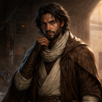

### **Cajar Hakim** (01/22/2026 01:42:20)  

*1463710345091743784*

*Cajar will take a deep breath and center himself. He repeats the same phrase he asked himself many times in the past in his head. 

'Fear does not kill you. It only asks if you are done yet. Are you?'*

**"I am not."** *He exhales.*

*Accepting that his condition would likely to worsen with strenous activity, his initial thought is towards a self examination, to a degree that is possible under the circumstances. He checks for his joints, broken bones, marks of trauma, possible muscular athrophy to make a sense of his current being.*

---

### **Storyteller** (01/22/2026 01:43:58)  

*1463710757085511890*

The cold is the first thing that attempts to claim him, a biting, clinical frost that seems to have settled deep into his bone marrow. Cajar draws a breath, but his lungs feel like rusted bellows, heavy and resistant. He reaches for his internal center, that quiet place Master Veylan once encouraged him to find, and repeats the mantra that has served as his shield through countless triage centers and war zones. *'Fear does not kill you. It only asks if you are done yet. Are you?'*

**"I am not."** The words are a dry rasp, barely vibrating in the silent, lightless void of his capsule. He exhales, the tiny cloud of mist unseen but felt against his lips.

He begins his self-triage with the methodical detachment of a trained medic. His hands, though shaking with a profound, leaden weakness, begin to map his current state. He probes his joints—knees, elbows, wrists. They are stiff, clicking with a dry, unlubricated sound that suggests an impossible duration of inactivity. He searches for the jagged edges of a fracture or the wet heat of a fresh wound, but finds neither. He feels no marks of external trauma—no blaster burns, no shrapnel scars—only the hollow, echoing fatigue of a body that has been nearly emptied of its vitality. 

The silence around him is absolute, yet his sensitivity to life, normally a vibrant tapestry, feels as though it has been muffled by a heavy, grey shroud. He can barely sense the outlines of his own spirit, let alone the world beyond the metal. He is a healer in the dark, and for the first time, he is his own most critical patient.

---

### **Cajar Hakim** (01/22/2026 01:43:59)  

*1463710759333658717*

*To the best of his physical ability, he shall search for any indentures, hollows, latches in the cylinder. 'Oxygen must be coming from somewhere.' he thinks to himself.*

---

### **Storyteller** (01/22/2026 02:07:11)  

*1463716599004528775*

Cajar’s fingertips, numb and trembling, dance across the cold interior of his prison. He moves with the desperate efficiency of a man looking for a life-support bypass. He finds the intake vents—micro-perforations in the metal that are too small for a finger to prize open—and feels the thin, icy trickle of air that smells of chemical preservatives. As his hands sweep the curve of the cylinder, he finds the capsule is a masterpiece of seamless, jointless engineering. There is no manual release, no emergency lever. 

Then, through the vibrating metal of the pod and the persistent shriek of the distant alarm, a new sound reaches him. It is a voice, muffled and distorted, echoing as if through a long, metallic tube. It is a woman’s voice, sharp and clinical, devoid of the panic that usually accompanies a ship-wide alert.

**"...protocol is... barbaric... violent, uncontrolled... stabilization... must get them to... proper care..."**

The voice is clipped, the words fading in and out against a background of static and the heavy, rhythmic *thud-thud-thud* of something impacting the hull far aft. There is no reply that Cajar can hear, only the woman's frustrated cadence. Whoever she is, she sounds closer than the sirens.

---

### **Cajar Hakim** (01/22/2026 02:44:45)  

*1463726051329839209*

*Hoping that his voice would carry over to the woman, Cajar will yell as much as his lungs allows him to.* 

**"The resident of this pod has regained conciousness. Please inform me of my status, and possibly open the pod."**

---

## *Intro: The Muted Echo (Ciara)*

### **Storyteller** (01/22/2026 02:46:01)  

*1463726369262534658*

Ciara grits her teeth, her mental focus tightening like a coiled spring. She refuses to accept the silence. She pushes again, deeper, demanding the Force obey her will as it has since her earliest days in the Temple. She reaches for the crushing weight of telekinesis, then the far-reaching clarity of vision, trying to bridge the gap between her mind and the world outside the metal. But the "static" is absolute. Each effort is met with a jarring, psychic feedback that leaves her temples throbbing, the power she seeks as elusive as smoke in a high wind.

Conceding to the physical for now, she sweeps her hands across the cold, damp surface of the pod and the narrow recesses by her sides. Her palms slide over smooth, indifferent alloy. There is no cylinder of cold durasteel, no familiar etching of a hilt. Her gear has been taken, leaving her exposed to the biting chill. 

She turns her effort to a simpler task, a whisper instead of a shout. She focuses on the frantic "spark" she sensed earlier—the one that feels like a technician’s terrified pulse. She tries to push a single, warm thought through the fog: *You are not alone. Hold on.* But the broadcast fails. Her mind feels like a radio tuned to a dead frequency; the message dissipates into the grey static of her own internal prison before it can ever leave her skull.

As she pauses to breathe, a sound filters through the metal hull of the pod. It’s a voice, distorted and muffled as if the speaker is standing several meters away in a large, echoing room. It’s a woman’s voice, sharp and clinical, sounding more annoyed than frightened.

"**...protocol is... barbaric... violent... must stabilize them... proper care...**"

The words are faint, punctuated by the shriek of an alarm and the heavy, rhythmic thud-thud-thud of something metallic impacting metal.

---

### **Ciara** (01/22/2026 08:24:59)  

*1463811672581083199*

Ciara contemplates her helplessness for a long moment, then heaves out a sigh. She finds herself unable to muster up the frustration she would normally feel in a situation like this. She finds no point in continuing to lash out. 

Whoever put her in here had a chance to kill her, and chose not to. She'll have her chance to deal with them face to face when they make demands. Maybe she'll even have access to the force again at that time. 

With no other courses of action readily available to her, she decides to meditate peacefully and wait for the situation to change, only utilizing the force to remain aware of her surroundings. 

She lets out a small chuckle before meditating. "Finally, I'm the ideal Jedi." She allows her mind to wonder for just a moment if her masters would like this version of her better. She quickly dismisses the thought and settles in for a long meditation.

---

## *Intro: The Static Heart (Lis)*

### **Storyteller** (01/22/2026 09:44:17)  

*1463831632745205772*

The interior of the pod is a tomb of silence and cold, broken only by the rhythmic *click-click* of Lis's tongue against his teeth as he confirms his own existence. Everything is where it should be. The fear of being a "salvage job" of meat and metal fades, replaced by the mundane annoyance of a technical delay. He stretches, his joints popping like dry kindling, and decides that he has been a patient long enough. 

He raps his knuckles against the smooth, inner surface of the pod. The sound is dull and hollow, lacking the sharp ring of standard durasteel. He knocks again, harder this time, the vibration travelling up his weak arm and rattling his shoulder. He expects the hiss of a medical droid's servos or the polite, weary greeting of a Republic nurse. He expects a status report, a meal tray of something better than field rations, and perhaps a formal apology for the lack of lighting in this recovery ward.

Through the thickness of the alloy and the heavy, pressurized atmosphere, a sound finally filters in. It is a voice, but it is stripped of all clarity, reduced to a ghost of a cadence. It is a woman’s tone—clipped, sharp, and seemingly directed at someone else. To Lis, it sounds like hearing a conversation from the bottom of a deep well. He cannot distinguish a single word, only the rise and fall of her clinical frustration. 

There is no answer to his knocking. No medical droid arrives to cycle the locks. Instead, a heavy, rhythmic *thud* vibrates through the floor of the pod—a deep, metallic impact that feels less like a medical facility and more like a docking clamp slamming home with too much momentum.

---

## *Awakening: The Wayward Vigil*

### **Storyteller** (01/22/2026 09:52:24)  

*1463833672401682514*

The monotonous thrum of the machinery and the muffled silence of the capsules are shattered in a single, violent heartbeat. A sharp, explosive hiss of decompressing atmosphere shrieks through the bay as the primary pressure seals on the three occupied pods fail simultaneously.

The front casings of the pods—slabs of thick, frosted alloy—do not retract with the silent grace of a healthy system. Instead, they lurch and shudder, grinding upward into the ceiling with a screech of tortured metal that vibrates through the deck plating. A blast of frigid, chemically-scented air, smelling of ionized ozone and sharp preservatives, rushes into the pods, chasing away the stale, recycled heat of stasis.

The darkness doesn't vanish, but it changes. For the blind trio, the void is suddenly assaulted by rhythmic, stabbing pulses of intensity—emergency strobes that burn through their eyelids with a dull, white-hot glare. The alarm, previously a distant hum, is now a deafening, discordant wail that fills the cavernous room.

The three figures are revealed, laid out on slanted, metallic slabs. The angle is just enough to keep their leaden, uncoordinated limbs from spilling forward onto the floor. They are exposed, vulnerable, and shivering as their systems are forced back into a world of chaos.

From just a few meters away, the voice they had heard muffled is now crystal clear, sharp with clinical frustration.

---

### **???** (01/22/2026 09:54:26)  

*1463834186392666356*

"**I told you, Rask! The surge has tripped the Final Vigil sequence!**" she shouts, tapping furiously at a non-responsive terminal. "**The pods are venting—uncontrolled reanimation! If we don't stabilize the metabolic shock now, we’re going to lose the biological integrity of the assets!**"

---

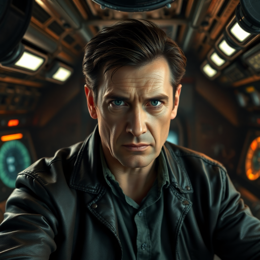

### **Rask** (01/22/2026 09:56:46)  

*1463834771045224550*

A dismissive, static-laced male voice barks back from a comm-unit on her collar. ***"Just get the cargo out of there! My contract is for transport, not therapy. The *Corrigendum* is waiting, and I don't get paid until the assets are delivered. Drag them if you have to!"***

---

### **???** (01/22/2026 09:56:47)  

*1463834774660452556*

"**Drag them?**" she snarls back, her hazel eyes darting to the three figures gasping on their slabs. "**They can’t even hold their own heads up! We need—**" She stops as a heavy, metallic *THUD* reverberates through the hull, more violent than the others.

---

### **Lis Garah** (01/22/2026 10:07:32)  

*1463837483308683297*

*Garah groans loudly and gives a heavy sigh, the wind being knocked out from him as he tries to defiantly get up but fails.* **"W-woah... that was... not a good... idea..."** *He stretches a bit more, recalibrating exactly how much strength he has in his weary limbs, before grabbing whatever edge he can for support and then slowly yet steadily trying to lift himself up, at least to see his surroundings.* **"I'll say... this setup... feels very amateurish... who..."** *He stops mid sentence, once more winded by both the effort of trying desperately to hold himself up from the pod and from him speaking.* **"Who... is in charge of this whole operation... you know... you know what?"** *He looks particularly annoyed.* **"Call Foreman Molekh... this is no way to treat... an engineer... of my prestige... Clocked... where's my droid... Clocked! Begin writing the draft... of... ugh..."** *Finally he shuts up, all this speaking and swaying giving him a vague sense of vertigo, the engineer now needs all his focus on not falling over like a deck of cards.*

---

### **Ciara** (01/22/2026 10:15:06)  

*1463839384418783366*

Ciara makes no move to extract herself from the chamber. She extends her senses forward, trying to get a read on what is with the room. She mutters under her breath,  not wanting to speak over the other recently ejected. "I'll be damned. Meditating worked." She files that thought away for later examination. 

She focuses her attention on the woman speaking nearby. Priority one is assessing if she is a threat or not.

---

### **Cajar Hakim** (01/22/2026 12:17:30)  

*1463870190327693425*

*His body answers in fragments. Fingers twitch. Toes curl. Shoulders tense against the slab’s incline, just enough to keep him from spilling forward in a heap. Cold seeps in where the pod’s false warmth dies, settling deep, unforgiving.

He catalogues the damage out of habit. Blind. Shaking. Weak, but intact. No obvious breaks. Pain where there should be pain. That’s survivable.*

*He adresses towards to the sound of the woman talking* **"How long have I been in statis? My senses are still very oriented but the athrophy feels.. immense."**

---

### **Storyteller** (01/22/2026 14:06:28)  

*1463897612791844959*

The air in the cryo-bay is thick with the sharp, clinical sting of chemical preservatives and the underlying scent of scorched insulation. Red emergency lights strobe rhythmically, painting the sterile white bulkheads in a sequence of bloody flashes. Beneath the shriek of the proximity alarms, the vessel itself seems to groan, the floor vibrating with a low-frequency shudder that suggests the ship's internal dampeners are struggling to compensate. To those with sight, the room is a blur of steam venting from ruptured coolant lines and sparking consoles; to those without, it is a sensory nightmare of shifting air currents and the metallic taste of ozone on the tongue.

---

### **???** (01/22/2026 14:06:29)  

*1463897615497302078*

The woman at the console curses under her breath, a sharp, aspirated sound, and pushes off the terminal as she sees Lis attempting to lurch his way off the slab. She moves with the fluid, calculated speed of someone used to low-gravity environments, reaching Lis just as his knees begin to buckle. She catches him by the shoulders, her grip firm and uncompromising, guiding him back onto the slanted metal. **"Stay down! Listen to me, all of you. You’re suffering from advanced hibernation sickness. You’ve been in a deep stasis. There was a system-wide cascade failure—a massive power surge—and the pods initiated an emergency purge. You are fortunate to be in one piece; most biologicals don't survive a violent thaw like this.. Take your time getting acclimated or you’re likely to add a concussion to your maladies"** 

Her voice is a cool, melodic anchor in the chaos, even as she taps her collar comm with a frustrated snap of her fingers. ***"Rask, I need muscle in the cryo-bay! The assets are awake. I can't move them to the transport alone!"***

---

### **Rask** (01/22/2026 14:06:33)  

*1463897631012163758*

A static-laced grunt barks back through her speaker. ***"No chance, Vance. The aft seals are bucking and I’m not losing my crew to a vacuum because you want to play medic. Drag them yourself or leave them for the vacuum. You've got three minutes before I lock down that section."***

---

### **Vance** (01/22/2026 14:07:28)  

*1463897861514068144*

**"Scum,"** she mutters under her breath. She turns back to the trio, her jaw set. **"I can't answer your questions yet. Right now, I just have to make sure you don't die in this room."**

One by one, with a strength born of desperate necessity, she hooks her arms under theirs. She helps Lis first, then Cajar, then Ciara, guiding their leaden, uncooperative bodies through the bulkhead into the adjacent antechamber. The air here is warmer, the screaming alarms slightly muffled. She pulls down three emergency cots from the walls, easing them onto the thin, sterile pads. 

**"Lay still,"** she says, her breathing ragged from the exertion. **"Focus on your breathing. I’m going to see if I can find enough stabilizers to help with your symptoms."** She breaks away from them, moving back into the room they just vacated in search of the supplies before the section is locked down.

---

### **Lis Garah** (01/22/2026 14:13:44)  

*1463899438865977397*

**"This... is.. stasis... shock... w-what... what the..."** *He decides to let go and put most of his weight on Vance, so not to completely pass out as he begins to recognize exactly what is afflicting him.* **"... unacceptable... where... how long was I out... you can't... just..."** *He gives up mid sentence... he decides to follow the advice of the perceived nurse and let himself relax and be tended, at least until he recognizes the signs of recovery.*
*How long was he out? Did he go through some traumatic surgery? Some new Republic technology? Did they resurrect him? Clone him? All of this wasn't adding up to his previous accident... but as he mind raced, he tried to keep calm... to center himself... he was already at a risk of passing out, if not worse... he followed the advice of the Jedi erutides on how to handle such accidents... no emotions... no worries... right now he was powerless to change things and that was okay... he just has to wait and breathe.*

---

### **Ciara** (01/22/2026 20:26:39)  

*1463993286673957017*

Ciara watches silently as the woman helps the other two, then cooperates to the best of her ability once it is her own turn, knowing that remaining limp will only make transporting her more difficult.

She continues to run things over in her mind. This feels like something beyond being in stasis for too long. Something was done to her. It's the only explanation that fits. 

She takes a deep breath and begins to focus, even though she feels there is no point, she knows that before this incident, she wouldn't just lie here and wait.

---

## **Iyola Kett** (01/22/2026 23:03:33)  

*1464032771482718293*

‘**Bye, Dryzan,” **said Iyola. **“Give me your comm link.  I’ll look you up if I ever make it to Balosaur.”**

Eve seemed to jump on Iyola’s mostly-joking nickname for Wes.  Captain Wes indeed.  Wes of course nobly suggested that he would be willing to serve as captain.  Iyola was about to object that she actually had her own ship, or had, before the Protectors mucked things up, when Eve specified that being the Captain was actually a way to allow other crew members and make Wes do work in a crisis.  **“What is the procedure for removing a Captain?” ** Iyola said slyly.  

She glanced back at Misha and Nadia, then back at Wes.  **“I’m fine with it on two conditions. I don’t take orders from you, and you can’t have my room on the Venture.”**

---

## **Wes Del-Fin** (01/22/2026 23:41:17)  

*1464042268146143422*

Wes raised an eyebrow at Iyola at her question to Eve and her conditions at him being captain.  He shook his head.  This wasn’t a game and he wasn’t in the mood to play one.  Any that could sense his demeanor felt a subtle irritated shift.  **”I don’t want your room and if you’re saying you won’t follow the chain of command then that’s on you.  In a life and death situation are you willing to break the chain of command and put the lives of others and yourself on the line for your own pride?”**
` `                               Helmet off [✎](https://github.com/alicia86/SW_ForgottenOnes/wiki/Wes-Del-Fin)

---

## **Eve the AI** (01/23/2026 00:54:03)  

*1464060583098974311*

Eve’s holographic head tilts in a slow, analytical arc as she processes Iyola’s question. **"The removal of a designated Captain is governed by Protocol 14-Sigma. To address the query regarding the removal of a commanding officer: according to the Venture’s primary charter, the rank of Captain may be rescinded through three established protocols. First, a unanimous consensus vote by all active crew members. Second, a formal declaration of physiological or cognitive incompetence by a registered medical officer. Third,"** her shimmering form flickers for a microsecond, **"a priority override issued by a verified, ranking member of the Protector Order. In the absence of such an override, the position is permanent until death, resignation, or successful mutiny."**

---

## **Iyola Kett** (01/23/2026 00:56:25)  

*1464061178610323530*

Iyola  scoffed at Wes’s statement, turning to face him directly.  **“See, this is the problem. One minute we’re all blocks of carbonite.  Now you want to be the captain and the rest of us are. what?  Peons?  I’m not a Mandalorian.  I’m not one of your laser fodder troopers. Chain of command, ha.” **She laughed without humor.

Her eyes were luminous silver with anger.  **“I had my own ship, did you know that?  I bet you don’t.  You don’t know kriff-all about me.  Guess what!  I’ve risked my life time and again for people I didn’t even care about, because I don’t sit on my ass and wait for someone to order me to do the right thing!”  **

She glanced at  Varda, then the blue hologram**. “You know what, sorry, Varda. Eve, I do not accede.  I do not concur. I do not want a captain lording shit over me. I guess I can't stop you, if you make it happen, Eve.  But either way, you are just going to have to deal with all my inefficiency.”  **

She took a deep breath.  “**OK, Eve, let’s just hear whatever it is you brought us here for,”** she said.  She looked straight ahead, her arms tightly crossed over her chest, her cheeks still flushed with anger.

---

## **Wes Del-Fin** (01/23/2026 01:41:27)  

*1464072511460348000*

Wes felt the roiling anger that swelled in Iyola.  He didn’t smile but internally he was happy to see that the explorer had a backbone.  Not being a Mandalorian when surrounded by them could often put one on the defensive more subdued.  But not Iyola.  She wasn’t Mandalorian but she had spirit like one.   Those around him that could sense it felt the acceptance he held for her words and admiration for speaking out when she wasn’t Mandalorian among Mandalorians.   

When she stopped talking Wes interrupted Eve before she could speak.  His voice was calm and even **”Eve, I’m casting my vote for Iyola to be captain.  It’s clear she desires the position.  I simply offered as it seemed to me, and I was wrong, that no one else wanted it or spoke up saying they did.  Seeing that she has been a ship's captain before, she should be a good fit.”**  He looked over at Varda.  **”Varda.  You’re thoughts?”**
` `                               Helmet off [✎](https://github.com/alicia86/SW_ForgottenOnes/wiki/Wes-Del-Fin)

---

## **Varda Nisyren** (01/23/2026 02:06:05)  

*1464078708162957336*

Varda watches the exchange with a small, private smile tugging at the corners of her mouth. She looks at Iyola, noting the flush of anger, and then at Wes, sensing the genuine admiration he holds for the girl’s defiance. When Wes turns to her, Varda gives a slow, graceful nod, tapping her staff once against the deck. **"The wind shifts quickly on this bridge, it seems,"** she says, her voice a warm, dry rasp. **"Wes is wise to see the fire in you, Iyola. A ship is a living thing, and it needs a heart that refuses to be caged. You have the hands of a pilot and the spirit of a captain who has already tasted the horizon. I see no reason to stand in the way of a consensus. I agree. Let Iyola take the center chair. Perhaps a bit of 'inefficiency' is exactly what this ship needs to remember how to truly fly."**

---

## **Eve the AI** (01/23/2026 02:10:43)  

*1464079876989648978*

Eve’s holographic head tilts, her gaze shifting from Varda to Iyola. Her expression remains placid, but the blue light of her form seems to steady. **"Nomination recorded. Crew members Wes Del-Fin and Varda Nisyren have voiced unanimous support for your candidacy, Iyola Kett. However, according to the *Venture’s* primary charter, the designation of 'Captain' carries significant legal and operational liability. This rank cannot be imposed; it must be voluntarily assumed. Finalization is pending your formal acceptance. Do you wish to assume command of this vessel?"**

She pauses, the star chart in the center of the bridge shifting to a more detailed tactical view even as she awaits the answer. **"While you deliberate, I will provide the context for this summons. Approximately fifty-four standard minutes ago, I intercepted a high-priority distress signal originating from the Dreva Sector. The transmission utilized a Tier-One encryption protocol unique to the Protector Order. The source identifies as the courier vessel *Wayward Vigil*."**

A section of the holographic star chart zooms in, revealing a jagged, debris-strewn nebula. **"The signal is a 'Final Vigil' automated broadcast. It indicates a total life-support failure and the initiation of an uncontrolled reanimation sequence for the biological assets on board. Without immediate intervention, the survival probability of those assets is less than twelve percent. As the ranking authorized personnel, the decision to intervene rests with you."**

---

## **Iyola Kett** (01/23/2026 03:45:10)  

*1464103644776501293*

Wes does not yell back at her.  In fact, he looks at her with something akin to admiration in his dark eyes.  She’s surprised for a moment, until she remembers.  *Of course. *Mandalorians thrive on conflict.  He probably loved being yelled at.

And then Wes nominates her to be captain, and Varda agrees.

This is getting ridiculous.  She’s staring at Eve, and then Eve explains why she’s brought them.

**“Biological assets?  Like - us?  There are more? These kriffing Protectors - ”** Iyola shakes her head in disgust.  **“OK, fine, yes, I accept the role of captain, yes, we’re going to help them.  Let’s get there as soon as we can, Eve.”**

She turns to Misha and Nadia.  "**Do you want to join the crew? I’m definitely not going to make you if you don’t want to. I don’t do that kind of thing.”**

---

## **Wes Del-Fin** (01/23/2026 11:35:15)  

*1464221945309696073*

**”Another sleeper ship of unknowns Eve?  Set aside for some purpose they can’t be told about.”**  He shook his head.  This whole Protector business was sounding more and more like a plot.  Hearing Iyola’s intention of going to help he moved to a console.   **”How long will it take to intercept them?**   He looked at the image of Eve.  **”Eve, can you put a map up of where this Dreva sector is in relation to us?”**
` `                               Helmet off [✎](https://github.com/alicia86/SW_ForgottenOnes/wiki/Wes-Del-Fin)

---

## **Eve the AI** (01/23/2026 12:37:19)  

*1464237562653835276*

**"Your acceptance is logged, Captain Kett,"** Eve states. Her holographic form gives a subtle, almost imperceptible nod. **"Command authority has been transferred."** The central star chart on the holographic table immediately resolves into a detailed tactical map, highlighting their current position in the Bespin system and a second, flashing icon in a distant, turbulent nebula. **"The Dreva Sector is a ship graveyard, known for its high concentration of stellar debris and unstable ion clouds. Based on our current power reserves, a direct hyperspace jump is possible. I project a travel time of two standard hours."**

---

## **Misha Vorne** (01/23/2026 12:37:19)  

*1464237564880883793*

Misha's head snaps up, her eyes wide with a mixture of awe and relief. The offer of a place, of a real role on this impossible ship, is a lifeline she desperately needs. **"Yes! Absolutely,"** she says, her voice a rush of grateful energy. **"I mean... yes, Captain. I'd be honored to join the crew. I can help. With the diagnostics, the power conduits... whatever you need."**

---

## **Nadia Skirata** (01/23/2026 12:37:19)  

*1464237565971271797*

Nadia’s posture goes rigid. Her gaze fixes on the flashing icon of the *Wayward Vigil*. When Iyola turns to her, she blinks once, pulling herself back to the present. **"I appreciate the offer, Captain,"** she says, her voice carefully measured. **"But my primary duty is to my uncle and Clan Skirata. I will assist in any way I can, but I cannot formally join your crew."**
` `                               Off [✎](https://github.com/alicia86/SW_ForgottenOnes/wiki/Notable-Allies#nadia-skirata)

---

## *Awakening: The Wayward Vigil*

### **Storyteller** (01/23/2026 15:43:29)  

*1464284413159276637*

The heavy bulkhead door leading back to the cryo-bay hisses shut with a final, percussive *thud*, sealing the three cots and their occupants into the relative quiet of the antechamber. The deafening shriek of the main alarm is now a muffled, distant whine, replaced by the steady, low hum of the antechamber's emergency power. The air here is warmer, the strobing red lights replaced by a steady, clinical white glow from overhead panels. From far aft, a new sound begins to penetrate the hull—a high-frequency, metallic grinding, the unmistakable sound of industrial fusion cutters biting into the ship's outer plating.

---

### **Elara Vance** (01/23/2026 15:45:17)  

*1464284865364103209*

The woman returns from the cryo-bay just as the door seals, carrying a compact, silver medkit. A faint sheen of sweat glistens on her brow, but her expression is one of focused, professional calm. The "worst," from her perspective, is over. She places the kit on the floor and kneels, the case opening with a soft click to reveal rows of hyposprays, nutrient packs, and diagnostic scanners. She looks at the three figures on the cots, her hazel eyes assessing their conditions with a practiced, analytical gaze.

**"Alright, let's get you stabilized,"** she says, her voice a calm, reassuring current in the tense atmosphere. **"My name is Elara Vance. I'm here to help."** She selects a hypospray filled with a clear, nutrient-rich solution. **"Your bodies have been through a significant shock. This will help with the metabolic crash and the weakness. Just a mild sedative and a nutrient booster."**

She moves to Lis’s cot first, her movements efficient and gentle. **"Easy now,,"** she murmurs, sensing the agitated thrum of his thoughts. She administers the hypospray to his arm with a soft hiss. Turning to Ciara, who lies unnervingly still, she offers a small, approving nod. **"You're handling the disorientation well. A good sign."** The second hypospray is administered with the same clinical grace. Finally, she approaches Cajar. **"Your vitals are low, but they're steadying."** She administers the final dose. **"The disorientation will pass. For now, just rest."**
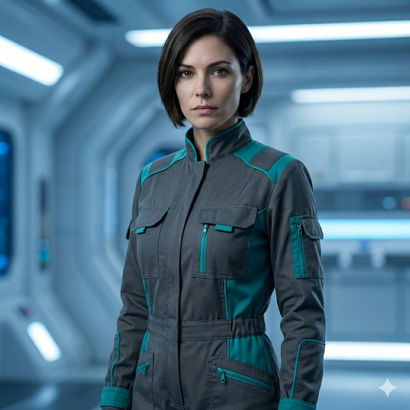

---

### **Ciara** (01/23/2026 15:57:08)  

*1464287849967910933*

Ciara frowns. Her voice is a bit weak, but she finds it easy to control her breathing. "Probably a bad sign, honestly." Her attention seems to be focused on the palm of her hand, or more accurately, the space just above it. 

"Something is horrifically wrong with me." She manages to drag her attention away from her hand to look towards Elara. Acting as though she's looking with her eyes, even if the force is her only conduit for perception right now. 

Ciara studies the woman for a long moment, clearly having more questions. She then seemingly decides against asking any of them, instead returning her attention to her hand. Her expression shifts to one of focus, but there is still a hint if her attention on the other people in the room.

---

### **Lis Garah** (01/23/2026 16:12:07)  

*1464291618789265505*

*Garah continues to handle his breath, letting Elara handle him however she deems necessary.* **"...are you... kidding me... I am... Lis Garah... Master Engineer... of the High Republic...**" *He slowly forces himself to right himself proper, his pride giving the energy needed.* **"...this treatment... is unacceptable... have you any idea who I am... I designed spaceships! I worked on Starlight Beacon!"** *His arms are tired, so are his legs, his joints filled with stasis fluid... but his spirit demands to stand... slowly and steadily maybe... but he must stand.* **"And this is how you awaken me?! People of my..."** *He steadies himself, to ensure he doesn't buckle onto his own weight.* **"People of my caliber... we get at minimum two medical droids and an expert to monitor us... instead I wake up in a metal coffin! And share a single nurse with barebone gear with... I don't even know who these other two are..."** *He grits his teeth during his tirade, beyond appalled at the situation... at the very least, his anger should help offset the low pressure in his blood.* **"... whoever is in charge of this operation is going to scrub toilets for the rest of their pitiful lives!"**

---

## **Iyola Kett** (01/23/2026 18:44:41)  

*1464330013036777628*

*Captain Kett.  What a strange sounding term*. She’d technically been captain of the Stardust Seeker, but it was a small sleek freighter she’d shared with Caz and the occasional droid.  No one called her boss or captain except for him, and that was obviously different. They were partners, and he called her that out of love.  This was very different. This was authority. 

*Look at Misha Vorne. She was trembling like a naked nerf in an ice storm.*

  Nadia didn’t want to join - *good thing I asked* - but she was willing to help.    *Great.  * Iyola still remembered the raw Force power Nadia possessed, and that was when she was half-starved and barely coherent. 

Wes asked for a report on the Dreva system.  He appeared calm, and Iyola imagined, the tiniest bit smug. She decided to test out how good his Jedi mind reading skills were.  *Kriff you, Wes Del-Fin*, she thought, looking away from him so he couldn't read her expression.  *I used to think you were different from other Mandalorians.  But you’re just as arrogant and rigid as the rest of them.  *

Aloud she said, “**Eve, please add Misha Vorne to our crew. Nadia Skirata will remain a guest.”**   Iyola wasn’t sure if Misha expected to be paid, but she’d jump that ditch when she came to it.  She nodded respectfully at Nadia. **“Your assistance is appreciated and you’re always welcome, of course.” **

She peers at the map. She's excited at the idea of exploring a ship’s graveyard, but she needs to save these victims of the Protectors first. A sudden chill came over her. *Don’t be reckless. *

**“Eve,”** she said, **“looks like there’s a ton of debris and system-blocking interference in that sector.  Do you have a safe hyperspace route?”  **

---

## **Nadia Skirata** (01/23/2026 19:37:14)  

*1464343240823148666*

Nadia stands near the auxiliary sensor station, her posture stiff as she stares at the blinking distress beacon. She is still grappling with the sheer impossibility of what Eve just disclosed. 

Suddenly, she feels a sharp, intentional spike of energy from Iyola’s direction. The mental broadcast is vivid: ***"Kriff you, Wes Del-Fin... arrogant and rigid."*** Nadia blinks, her gaze snapping to Iyola. The raw, silver-edged irritation in Iyola’s mind is so focused it’s almost audible. Nadia turns her head away quickly, a small, unbidden smile touching her lips. The interpersonal friction between the two is a grounded, almost comforting contrast to the cosmic weight of the mission ahead.
` `                               Off [✎](https://github.com/alicia86/SW_ForgottenOnes/wiki/Notable-Allies#nadia-skirata)

---

## **Misha Vorne** (01/23/2026 19:37:15)  

*1464343244904337613*

Misha’s eyes widen as her name is officially added to the manifest. She practically vibrates with a nervous, grateful energy, her hands moving over the technical console with a speed born of relief. **"Thank you, Captain! I’m... I’m running a full diagnostic on our docking clamps and the secondary power couplings. I won't let you down. I can have the pre-flight checks finished before the motivators even reach prime."**

---

## **Eve the AI** (01/23/2026 19:37:16)  

*1464343248226091029*

The hologram of Eve shifts her focus to the tactical display, her robes shimmering as she points to the jagged outlines of the Dreva Sector. **"The debris density in that region is high, Captain. Standard hyperspace lanes do not penetrate the core of the ship graveyard due to the high-frequency ion interference."** 

A thread of gold light weaves through the blue star chart, marking a precise, winding path into the nebula. **"However, the *Venture* possesses a specialized navigational array. I have identified a dedicated Protector courier route, a  path that utilizes gravitational anchors within the debris to bypass the most volatile ion clouds. It is a complex approach, but with our current systems at sixty percent, it is the only viable entry point that ensures we do not arrive with compromised hull integrity."**

---

## *Awakening: The Wayward Vigil*

### **Elara Vance** (01/23/2026 19:50:53)  

*1464346676301922376*

Elara catches Lis as he sways, her hand firm on his arm, guiding his center of gravity back toward the cot. She offers him a look that is part clinical curiosity and part weary patience, seemingly unbothered by his indignant tone. **"Master Engineer Garah, I am afraid the 'medical droids' were the first things to melt when the ship’s primary power grid surged into the life-support bays. You are quite fortunate the 'metal coffin' didn't become a permanent residence."** 

She turns her head toward Ciara, her eyes narrowing slightly as she observes the intense, sightless focus the young woman has on her own palm. **"You’re breathing well, which is more than I can say for your companion. If you feel something is 'wrong,' it is likely the metabolic shock."**

Elara stands, her gaze sweeping over the three of them, her voice dropping into a tone that is both an invitation and a tactical necessity. **"Names are important. They provide a psychological anchor for the mind when the body is failing. You’ve given yours, Lis. What of the rest of you?"** Her hazel eyes settle on Cajar, then move back to Ciara, waiting for the threads of their identities to surface through the fog of their awakening.

---

### **Ciara** (01/24/2026 00:00:35)  

*1464409514395566265*

Ciara drags her attention away from her hand again, trying to muster up any motivation to deal with the situation at hand. She lets out a long sigh before relaxing her body even further. She gives up on whatever she was focusing on in her hand. 

**"It's something else."** She speaks with certainty. Of course, she can't actually know, but reality has never got in the way of her confidence before, and she isn't about to let that change just because everything about her is broken. 

**"My name is Ciara."** She takes the time to make sure she has enough breath for her sentences, focuses on keeping them short and to the point. **"Jedi Sentinel."** She wants to get up and move around the room. She understands that her lack of restlessness is incorrect, that it's something she should distressed about. She isn't. **"My specialty was uncovering and dealing with Sith."**

She glances down at her hand, and draws breath to say something else, but discards whatever the thought was. She relaxes her neck, letting her head rest fully. She closes her eyes and focuses on her breathing or whoever speaks next. She wonders for a moment if she will recover enough to help before what seems to be the ship's cascading failures hit a point of no return. That thought immediately changes to wondering if she will care either way. 

She decides she does care, even if it doesn't feel like it. She redoubles her effort, deciding to actively focus on recovery. Anything to help the process that's already in motion after the hypo.

---

### **Lis Garah** (01/24/2026 00:09:58)  

*1464411873943224506*

**"A JEDI?!"** *Garah's surprise takes over his anger.* **"What is a Jedi doing here..."** *He shakes himself from the wetness of his confusion, going back to examine his surroundings, trying to take point of what is happening... he was out of stasis... but the situation before him is unlike anything he would expect... this was not gross misconduct of one of the Republic's finest... surely they couldn't misplace both an engineer like him AND a Jedi...* **"This isn't... what's going on? You're not my nurse... this isn't a hospital is it?"** *He tries to find anything that he may recognize here... a symbol, a design... anything at all that could give him any clue at what is going on.* **"How..."** *He doesn't want to ask... he knows that if he asks, he may get an answer... an answer he is not going to like.* **"How long was I in stasis for?"**

---

## **Iyola Kett** (01/24/2026 00:45:11)  

*1464420736725946682*

"All right, let’s take that route,” Iyola says.  “You mentioned that your systems were up to 60 percent, Eve.  Can you give a more thorough update on the status of all your systems?  Do you have astromechs available to you now?  Is there anything our newest crew member, Misha, can help you with?” 

“Also, did the Protector signal tell you anything else about the damage the Wayward Vigil sustained?” Iyola thinks for a minute.  “Is there another Eve on the ship?”

She looks at Nadia. “Nadia, we’re leaving in a minute.  We’ll need to  strap in.  If you don’t plan to join us, this would be the time to disembark.  Though I hope you do.”   She felt a little calmer.

---

## **Wes Del-Fin** (01/24/2026 01:36:36)  

*1464433675159470249*

Wes kept his presence close.  As things started to unfold he started to get an uneasy feeling.   Eve had detected another signal and now they were on the way.  This whole Protector business needed a lot of questions answered.  Why them?  Why now and why this other group of people that they were off to ensure they were ok.   Where were these Protectors?   Why weren’t they going to take care of the people they put in stasis.    

Things were moving fast and he had a question for Eve.  These protectors don’t seem to be doing a very good job at protecting the people they took and put into stasis.  He looked at Iyola and gave her an approving nod.  

**”Eve, question.   So this is another Protector ship on the verge of a major malfunction.   Why don’t these protectors, who have for some reason put us all on this situation we find ourselves in, handle it themselves?”**
` `                               Helmet off [✎](https://github.com/alicia86/SW_ForgottenOnes/wiki/Wes-Del-Fin)

---

## **Eve the AI** (01/24/2026 01:46:06)  

*1464436067351396562*

**"Wes Del-Fin, my archives do not contain real-time positioning data for other vessels aligned with the Protector Order,"** Eve responds, her holographic avatar turning to face him. **"My sensors have detected no other high-priority acknowledgments of the distress signal within this quadrant. It is logically consistent to infer that the *Venture* is the only asset within a viable range to prevent terminal asset failure. Whether this is due to a lack of available resources or the inherent secrecy of the Order is not documented in my accessible files."**

A secondary console near the command dais flickers to life, casting a sharp amber glow onto the bridge. A scrolling list of diagnostic data appears:
> [PRIMARY POWER: 60%]
> [LIFE SUPPORT: 95%]
> [SHIELDS: 40%]
> [WEAPONS: OFFLINE]
> [DROID COMPLEMENT: 1/6 REPAIRED]

---

## **Eve the AI** (01/24/2026 01:46:06)  

*1464436069150883881*

**"I have provided the detailed breakdown on the auxiliary monitor, Captain Kett. Regarding my droid complement: Vekka's team has successfully restored one maintenance unit. Five remain in the workshop awaiting component integration. Crew Member Misha's immediate utility would be best applied to the manual calibration of the hyperdrive motivator, ensuring our jump remains stable through the ion clouds."**

Eve’s head tilts as she addresses the question of her counterpart. **"The *Wayward Vigil* is a courier class. It is equipped with a standard 'Monitor' series automated intelligence. While functionally capable of managing vessel operations, it lacks the unique neural architecture found within my construct. The distress signal confirms the 'Monitor' has been shunted into a passive state due to the life-support failure. The debris density at the signal's source is high. Navigating the *Venture* through the inner rings of the graveyard carries a seventeen percent risk of hull abrasion. I recommend utilizing a maneuverable shuttle for the final approach if the vessel is embedded deep within the wreckage."**

---

## **Misha Vorne** (01/24/2026 01:46:50)  

*1464436250470518805*

Misha offers a quick, nervous salute to Iyola before turning to her station. **"Understood, Captain! I'm moving to the motivator access now. Eve, I'll need a direct link to the primary calibration subroutines."** She heads toward the lift, her footsteps light and hurried.

---

## **Nadia Skirata** (01/24/2026 01:46:50)  

*1464436253255798918*

Nadia stands very still, her gaze fixed on the scrolling diagnostic data, but her mind is clearly elsewhere. For a moment, she seems to have forgotten the bridge entirely, her posture rigid as if bracing for an impact. She pulls herself back to the present with a sharp, visible breath, though she keeps her back to the group as she keys a sequence into her wrist comm. 

**"I'm staying, Captain,"** Nadia says, her voice sounding a bit more strained than usual, though she maintains a professional edge. **"My uncle’s compound has a K-Type stealth shuttle in the secondary bay. I’ll comm Serena to have it prepped and slaved to our docking clamps. If the nebula is as thick as Eve predicts, you’ll want the maneuverability."** She looks over her shoulder at Wes and Iyola. **"I'll oversee the shuttle's remote integration from the auxiliary port. We shouldn't linger."**
` `                               Off [✎](https://github.com/alicia86/SW_ForgottenOnes/wiki/Notable-Allies#nadia-skirata)

---

## **Iyola Kett** (01/24/2026 03:07:51)  

*1464456643004862535*

“**Thanks, Nadia!  Does that shuttle have weapons, by any chance?**" Iyola calls after her. 

Varda is humming to herself, violet eyes closed, communing with the spirits or whatever she does.  Iyola looks at Wes**.  “I guess with Varda on her inward  journey, it’s just you, me, and Eve.”  **

She looks at the strong Mandalorian planes of his face.  She feels weirdly delicate, like she should say something, but she’s not sure if it’s an apology or not.  He apparently didn’t hear her insults telepathically, anyway.  Maybe that’s not even possible.

**“I’m going to need your help, you know,” **she finally says.

---

## **Wes Del-Fin** (01/24/2026 13:24:52)  

*1464611916251922658*

As Wes looked over the display he heard Nadia’s comment about not joining the *Ventures* crew.  Her reason was valid.  Her obligation to the Skirata was her priority.   Inwardly he was glad she was staying aboard.  Time was needed.  That she was getting a shuttle for them to use was excellent.  

He was looking over the readouts that Eve provided on the current functionality of the *Venture.*  She was leaps and bounds improved from when they first woke up but if things got dicey out there.    

Iyola’s voice cut through his thoughts.   The anger from earlier sounded like it was gone.  He didn’t need the Force to sense that.  The tone of her voice conveyed that easily enough.  

He turned his head away from the monitor.  His dark eyes looked upon their new captain.  He gave her a quick nod.  **”What do you need?”**
` `                               Helmet off [✎](https://github.com/alicia86/SW_ForgottenOnes/wiki/Wes-Del-Fin)

---

## **Iyola Kett** (01/24/2026 15:00:30)  

*1464635983822716961*

**“So here’s the thing,”** said Iyola. ** “I did have my own ship. The *Stardust Seeker*.”** She says the name fondly. “**But I didn’t have a bunch of people saluting me or waiting for orders.  I had a partner.  Someone I could bounce things off of.  Someone who would tell me when I was about to do something reckless, or brilliant.”** She shrugs slightly. **“ I mean, it’s not like I didn’t do those things anyway.  But he’d tell me first.”**

**“And now we have to save those people,”  **said Iyola. **“This is important.  We don’t have any weapons.  I don’t know if Nadia’s shuttle does. Our shields are barely working. And we’ve got a little over two hours.  What would you do first?”**

She hesitated a moment.** “ We also have nanites on board. They can deconstruct, or repair.  Eve, is there something they can work on too?”**

---

## **Eve the AI** (01/24/2026 15:11:35)  

*1464638775539007629*

The blue light of Eve's robes pulses slightly as she processes Iyola's query. **"The nanite swarms are currently in a state of high-readiness following your recent calibration tests, Captain. During our two-hour transit through hyperspace, they can be deployed to focus on the primary shield emitters. This focused repair cycle is projected to increase shield integrity to fifty-five percent by the time we exit hyperspace in the Dreva Sector."**

---

## **Wes Del-Fin** (01/24/2026 16:00:57)  

*1464651198979244233*

Wes nodded when she asked for help and for people to be straight with her.  He respected that approach and that was definitely something he could work well with.   When she mentioned the Nanites he cocked his head and she saw him raise an eyebrow.   When Eve answered her question he nodded.   **”That would be good.  And an extra fifteen percent is nothing to scoff at.”**  

He turned a bit to face Iyola.  **”Look Iyola.  We’re in this together that means I have your back and you have mine.  Someone messed with our lives and I want to know why.  All this,”**  He pointed his finger up and made a circle.  **”Is this the way to find out more.   So if you need someone to bounce things off of then do so.   And I’ll tell you what I think.”**
` `                               Helmet off [✎](https://github.com/alicia86/SW_ForgottenOnes/wiki/Wes-Del-Fin)

---

## *Awakening: The Wayward Vigil*
### **Elara Vance** (01/24/2026 20:02:30)
*1464711987433963524*

Elara’s hand pauses for a fraction of a second over her medkit as Ciara speaks. At the word **"Jedi,"** her hazel eyes widen, and there is a sudden, electric surge of excitement that she quickly shutters behind a mask of clinical detachment. To find a Sentinel—a hunter of the shadows—here, in a failing Protector ship, is a discovery that makes her pulse quicken. 

**"A Sentinel,"** Elara repeats softly, her voice carrying a new, guarded respect. **"Ciara. A name to anchor the spirit. Focus on your breath. If you feel 'wrong,' it is because your body is fighting to reclaim its own chemistry. Don't force the connection; let the clarity return in its own time."** She offers a reassuring, if brief, touch to the Zeltron's shoulder before turning to the increasingly agitated engineer.

**"Master Garah,"** Elara says, her tone firm to cut through his rising panic. **"This is not a Republic hospital, and I am not your nurse. I am a field scholar. We are currently aboard a courier vessel that is... no longer flight-capable."** She hesitates as he demands the date, his earlier mention of the Starlight Beacon acting as a cold splash of reality. 

**"I cannot give you a number that will sit well in your mind,"** she says, leaning closer so only the three of them can hear her over the distant grinding of metal. **"But you speak of the Starlight Beacon as a current work. In the archives I have spent my life studying, that station is a legend of the High Republic—a golden age that ended centuries ago."** She watches him closely, watching for the shock to settle. **"You are 'assets' of a history the rest of the galaxy has forgotten. And right now, my only goal is to ensure you survive to see what it has become."**

---

### **Ciara** (01/24/2026 21:01:42)  

*1464726882816622812*

Ciara deflates a bit at Elara's excitement. It seems likely, given the woman's reaction, that the war was lost. It's the obvious reason Jedi might be a rarity. 

She continues to focus on breathing, as she has been advised. Listening to the explanation Elara gives to Garah. She tries to pinpoint her own time, but doesn't have enough information. She's never heard high republic, and while it could be a name for her own time, it seems unlikely anyone would refer to the galaxy she grew up in as a golden age. 

She wasn't the most invested in history, so it's possible that the high republic was in her past and she simply didn't know of it. Right now it's impossible to tell if she was out for decades, millennia, or anywhere between. 

She takes a moment to think about those she will never see again, forming a frown on her face as she realizes she doesn't care. She blames whatever is currently wrong with her. Surely if she were feeling normal she would care. 

She wants to ask questions about her time, about how things turned out. But there are more pressing matters. **"Altruism? For assets?"** She refocuses on Elara. **"Just so we can see it?"** She forces herself to stay relaxed. Sitting up and getting confrontational is pointless. **"What about..."** She searches her recent memory. **"Rask? It sounded like we're just a payday to him. Just cargo."**

---

### **Lis Garah** (01/24/2026 21:16:58)  

*1464730726552568034*

**"Centuries..."** *He grabs his forehead, feeling faint, his knees trembling for a second, the blow of this information hitting him harder than any blaster possibly could... he has infinite more questions he needs to know... but he shakes his head... his technical mind awakens to the keywords familiar to an engineer.* **"... assets... we'll... we'll see who's an asset to who... what's the issue with the vessel? Are there any engineering tools around? If you don't know the technical terms just... tell me what is not working"** *He lets his mind be washed away of worry, fear and doubt by turning it back to work, his one true love and passion.* **"Master Ciara... or Sentinel Ciara? I don't know what kind of pirate or beast a 'Sith' is... but I'll try my best to aid you and bring you back to your order... whatever government exists now... surely the Jedi must still be part of it"** *He says, almost as a given fact... after all, how could the masters of a super natural power such as the Force fail?*

---

## **Iyola Kett** (01/25/2026 11:44:33)  

*1464949062745722954*

Iyola regarded Wes with relief.  She gave him a lopsided smile.  **“Good, we understand each other,” she said.  “I’m glad I have your support.  And of course, you have mine.  And you don’t need my permission to say what you think.”  **

She turned to Eve, though looking at the AI obviously wasn’t necessary.   **“I assume there’s no chance of getting the weapons in any kind of operating order in under two hours.” **
 

She looks back at Wes, pulls out the nanite controller.  **“Want to see how this thing works?” **

---

## **Wes Del-Fin** (01/25/2026 13:00:58)  

*1464968290911916189*

Wes nodded when Iyola gave him a lopsided smile and expressed the same sentiment.   **”Good.”** He said as he went back to the screen showing the systems that Eve had put up.   No weapons were a concern but it wasn’t one they could really fix in the time that they had.    

When Iyola asked him a question about seeing how the nanites worked he turned.  His eyes locked on the controller she held in her hand.  He raised an eyebrow.  **”Yeah.  Show me.”** He said as he walked from the station towards the new captain.  His eyes locked on the controller
` `                               Helmet off [✎](https://github.com/alicia86/SW_ForgottenOnes/wiki/Wes-Del-Fin)

---

## **Iyola Kett** (01/25/2026 16:52:23)  

*1465026527543562242*

**“I think we need to go to engineering,”** said Iyola.  **“Misha should be there too. She'll love this.” **

She noticed him looking at the controller. **“Yeah, I found this on day one in the cargo bay.  Whoever swept this ship was thorough, but I’m good at finding things."**

**"Remember when I showed Misha this earlier?  It didn’t work because it’s keyed to the nanites on this ship, so it seemed like it was unpowered.  I sort of bonded to it, I guess?  You control it with your mind.” ** Iyola made a sweeping motion with her hand.  **“There are nanites all over this ship.  I’m good at the deconstruct but I need a little work with the construct and bond part.”  **

---

## *Awakening: The Wayward Vigil*

### **Cajar Hakim** (01/25/2026 17:39:15)  

*1465038323939807324*

*Cajar takes a few more moments than the others, contemplating on his condition, focused on further examination of the medicine he had just taken.*

*Turning his attention back to Elara.* **"Thank you for the medical assistance Miss Vance. I estimate a great deal more of rest and nutrients will be required to deal with system shock and athrophy but I do not see any alarming symptoms for myself. Provided we do not face further bodily stress of course."** *He gives a small bow, still mostly leaning back on the pod itself.*

**"My name is Cajar, a Jedi Initiate, under the Service Corps of Jedi Order. I do not know if the Republic still uses the same calendar so it might be more apt to give a historical landmark. I was posted for medical assistance to the Republic forces during the later years of Mandalorian Wars. If the memory of that has not survived, perhaps Great Sith Wars, or names like Exar-Kun or Prodigal Knight Revan might ring a bell. At least for the Jedi"**

---

### **Elara Vance** (01/25/2026 18:16:39)  

*1465047736419225721*

Elara's hands continue to move with a precise, clinical rhythm as she adjusts the monitors on her med-kit. She looks at Ciara, a flicker of something resembling a weary sadness crossing her face before she firms her jaw. **"Rask is... a contractor. To him, you are a payday. To me, and to those I represent, you are the living truth of a galaxy that has been systematically erased."** She stands up, her silhouette a sharp outline against the cool white lights of the antechamber. **"It isn't altruism. It's a rescue. The people who put you here... their 'Glorious Purpose' involves keeping you in cages until they decide the time is right. We don't believe in cages."**

She turns her attention to Cajar, and for the first time, her professional detachment falters. The names he speaks—Revan, Exar Kun—cause her to draw a sharp, audible breath. **"Cajar,"** she says, her voice barely a whisper. **"Those names... they aren't just from a different calendar. They are from a different epoch. In the archives I study, those are myths from four thousand years ago. You aren't just displaced; you are echoes of a foundation that has turned to dust."** She reaches out as if to steady him, but her hand hovers, unsure. **"The Service Corps... the Order... things have changed. More than you can imagine."**

---

### **Elara Vance** (01/25/2026 18:16:49)  

*1465047779238744106*

It takes her a long moment before her attention can turn from Cajar and the revelation of the time he'd been in stasis. Finally, she looks toward Lis, responding to the engineer's demand for tools. **"The vessel is a Protector courier, Lis. It is built on technology that shouldn't exist anymore, and right now, its life support is a ghost. We have very little time before the internal systems shut down entirely."** She gestures toward the opposite wall, where three sleek, metallic lockers stand recessed into the bulkhead. **"Your gear is there. The Protectors were meticulous about preserving your identity along with your flesh. They are biometric locks—they'll only answer to you. If you want tools, or a weapon, or simply the comfort of your own clothes, you need to reach them. Can you stand? Even a few steps?"**

---

### **Lis Garah** (01/25/2026 18:39:00)  

*1465053361131880501*

*He tries to hold himself steady, giving a heavy sigh.* **"... right... over there... I'm... blind... I am not usually... do you have anything to fix that?"** *He says, making himself comfortable again, has he can do nothing else for the time being.* **"...after that I'll get right to fix whatever needs to be fixed"** *He does sound still unsteady and he wobbles quite a bit... probably he would get up and get right to work regardless, alas the lack of spatial awareness clearly is too much even for his ego to ignore.*

---

## **Misha Vorne** (01/25/2026 18:53:08)  

*1465056919227203595*

Misha looks up from a disassembled access panel near the primary power coupling, a smear of grease across her forehead and a multi-tool in her hand. Her eyes widen, sparking with a sudden, intense technical curiosity as she sees the Nanite Controller in Iyola's hand. **"Finally! I've been staring at those 'Wrangler' subroutines ever since you first showed me that thing . The way the code interfaces with the ship’s sub-structure is... it's like poetry, Captain. I've spent every spare moment since then trying to map out how the nanites actually respond to directives. If you can actually guide those swarms to seal the micro-fractures in the shield array, you'll be doing weeks of shipyard work in a few hours."** She wipes her hands on a rag, stepping back to give Iyola and Wes room to work, her gaze darting between the tool and the exposed emitters.

---

## **Eve the AI** (01/25/2026 18:53:10)  

*1465056925413802038*

Eve’s holographic avatar shimmers into existence above the main engineering diagnostic terminal, her robes reflecting the shifting blue light of the reactor core. **"Captain Kett, I am projecting the structural lattice for Shield Relay 4-Beta onto the primary workspace. To initiate the 'Bond' sequence, you must direct the controller's resonance towards the highlighted stress fractures. The nanites will act as a molecular adhesive, sealing the breaches and reinforcing the integrity of the relay housing. This procedure requires sustained concentration; the nanites respond to your mental alignment with the vessel’s power grid. Any significant deviation will cause the swarm to scatter, which may result in material misalignment or suboptimal structural bonding."**

---

## **Storyteller** (01/25/2026 18:53:11)  

*1465056928307871916*

The engineering bay thrums with the rhythmic, low-frequency heartbeat of the reactor core. The air is noticeably warmer here, carrying the faint, metallic scent of heated conduits and ionized ozone. The "Wrangler" device pulses in Iyola's hand, a soft blue light emanating from its crystalline tip, vibrating in sympathy with the ship's own power frequency as the holographic schematics bloom across the room, highlighting the jagged, amber-tinted fractures in the shield assembly that need to be knit back together.

---

## *Awakening: The Wayward Vigil*

### **Ciara** (01/25/2026 19:13:50)  

*1465062126979911721*

Ciara lets the others speak for a few moments, taking in the information. She lets out a groan that turns into a small chuckle. **"Another Jedi from around the same time as me then."** She glances over Cajar before continuing, **"The whole Revan thing didn't work out. I'll tell you all about it when we have more time."** 

She shifts her attention to Elara, **"and I'll be asking you for information on how exactly things from my era ended... when we have time."** Clearly she doesn't feel the need to follow up on the Rask conversation. She gives no indication how she feels about Elara's answer. 

She moves her attention on to Garah. **"To answer your earlier question, just call me Ciara. The titles and formality never sat well with me."** She leans up slightly. **"If you're considered the same level of asset as myself or another Jedi from my time, and repairing things like this is your area of expertise, I am certain you can handle the current crisis."**

She turns her attention back to Elara. **"Are you able to be eyes for Garah? If not I will do my best."**

---

### **Cajar Hakim** (01/25/2026 20:07:36)  

*1465075656638599311*

*Cajar slowly and gently makes his way towards the lockers and starts searching for his belongings.  Puts his worn out field medic uniform, adjusting his saber on his belt, slightly concealed behind him and eventually wrapping himself with a well woven cloak.*
**"My sight is still impaired so I cannot do tasks that involve minute details but I should be able to lead him. Let me know if there is anything else I can do."** *He motions towards Garah, gingerly touching him on the shoulder, announcing his presence.* **"Please, hold on to my arm, Master Engineer."**

---

### **Elara Vance** (01/25/2026 20:59:07)  

*1465088621395574795*

Elara moves to Lis's side, her presence a steady, solid anchor against his vertigo. She offers a small, tight smile that he cannot see, but her tone remains focused. **"I will be your eyes, Lis."** She guides Lis toward the locker labeled with his pod's designation, her touch firm but supportive. As Cajar reaches out to steady the engineer, Elara places Lis’s hand directly onto the cold, biometric sensor plate of his locker. **"There. Physical contact to authorize the release. Your sight will return, but for now, we move by touch."**

As the lockers hiss open, Elara assists in retrieving their items, her eyes lingering on Cajar’s saber and the heavy weave of his cloak with a look of profound, academic awe she struggles to suppress. **"The Protectors were meticulous,"** she murmurs, handing Lis his oil-stained yellow jumpsuit. **"They preserved your tools with the same clinical care they used on your marrow. Dress quickly. The sensation of your own gear should help ground your senses."**

---

### **Storyteller** (01/25/2026 20:59:09)  

*1465088630023389451*

The antechamber is filled with the percussive *clack-hiss* of the lockers sliding open, venting a small cloud of pressurized, super-cooled gas that smells of ozone and recycled air. The floor beneath them vibrates with a low, rhythmic thrum—the heartbeat of a ship struggling to maintain its own life support. Despite the sterile blue glow of the room, the blind trio moves by instinct and the guidance of Elara's voice. The recovered gear—the metallic clink of Lis's hydrospanner, the soft rustle of Cajar's cloak, and the familiar weight of their respective weapons and equipment —provides a jarring, sensory bridge back to the lives they left behind centuries, or millennia, ago.

---

### **Lis Garah** (01/25/2026 21:14:17)  

*1465092438707273880*

*Though blind, Garah doesn't need further guidance in dressing himself... he even places the visor on his face, in spite of it being completely useless right now.* **"Everything is here... this is... my usual tools? And the unusual ones... wait is this a heavy blaster? The last time I had this..."** *He taps around in the locker.* **"...is there any moss here by any chance?"** *He asks, as if something just clicked...* **"Nevermind... maybe just a coincidence... well... the ship is still alive and keeping the life support going beyond all other modules... which is good and bad news... the air will lose oxygen long before the ship depressurises... but if we find some oxygen masks that may extend our stay... just tell me if the lights go out completely... that will give me a few seconds to..."** *He thinks about it for a second.* **"...shoot myself I guess? Suffocating I heard is a terrible way to die"**

---

## **Iyola Kett** (01/25/2026 22:26:48)  

*1465110689298255905*

Iyola take a deep breath.  "**Thanks for the primer, Eve.  Misha, it looks like you've been doing your homework - want to walk me through what you've learned before I get started?"**

---

## *Awakening: The Wayward Vigil*

### **Ciara** (01/25/2026 22:50:11)  

*1465116574833840229*

Ciara pulls herself to her feet, making her way slowly over to the locker. She leans against it in the same motion she uses to place her hand on the scanner. 

After a moment of assessing her gear, she dons the robes and slides the torc onto her wrist. She gives further examination to her saber before attaching it to her belt, then quickly tucks away the rest of her gear. 

The robes and torc feel a bit like a second skin, something she's had for most of her life. At least something feels right today. Though that thought dies instantly as she reaches out with her mind to tie her hair up, only for it to remain stubbornly un-tied. With a sigh, she decides to just leave it down. 

**"We won't die here, so keep those thoughts put away."** Ciara finds herself annoyed. The certainty in her voice is as normal, but it's different. It should be accompanied by a bit of pride, bordering on arrogance. Certain that things will be fine because *she* is here. None of that is coming through... and why would it? She's as helpless as a toddler right now. 

**"I am at your disposal. I am little more than clumsy additional limbs right now, but if I can assist in any way, don't hesitate to direct me."** Her statement isn't addressed to anyone specific.

---

## **Misha Vorne** (01/26/2026 03:22:46)  

*1465185172193542297*

Misha wipes a smear of hydraulic fluid from her cheek, her eyes fixed on the pulsing blue light of the controller in Iyola's hand. **"Right. So, the Wrangler doesn't just 'spray' nanites like a welder. It’s more like... conducting an orchestra,"** she explains, her voice gaining a steadier, technical rhythm. **"Eve has already isolated the resonant frequency for the durasteel-vanadium alloy used in the relay housing. When you initiate the 'Bond' command, you need to visualize the fractures being knit together, not just filled. If you push the energy too hard, the nanites will over-saturate and cause a short. Keep your focus on the amber lines Eve projected—those are the stress points."** She gestures toward the holographic lattice, her expression a mix of professional pride and lingering anxiety. **"Once you set the parameters and the swarm locks on, the process becomes automated, but getting that initial 'grip' on the molecular structure... that's the tricky part."**

---

## **Eve the AI** (01/26/2026 03:22:47)  

*1465185174093565964*

Eve’s avatar shimmers, the blue light of her robes reflecting off the polished surfaces of the engineering consoles. **"The local nanite reservoirs have reached operating temperature, Captain Kett. I have slaved the relay’s integrity monitors to your controller's interface. You are clear to begin the bonding sequence. Please ensure your internal focus remains aligned with the structural blueprints; any deviation beyond three-point-five percent will result in an emergency swarm retraction to prevent further damage."**

---

## **Wes Del-Fin** (01/26/2026 11:41:26)  

*1465310665785868373*

Wes walked quickly alongside Iyola on the way to engineering.   This thought of nanites was thought provoking.  Small unseen force able to make changes on physical structures.   He shifted his helmet under his arm as he thought about it.   It sounded somewhat similar to the Force just on a different level.  **”If you or someone else like Misha can put them to use here on the *Venture* it could be invaluable.”**   There wasn’t much time to answer as they came upon Misha who was elbow deep into an access panel.  

It was then that the two women and Eve did their best to lose him in the technical jargon.  **”So you think about what you want to do and the nanites just act upon your thoughts.”**  He said questionly as he looked between Iyola and Misha.  **”Sounds a little like using the Force.”**
` `                               Helmet off [✎](https://github.com/alicia86/SW_ForgottenOnes/wiki/Wes-Del-Fin)

---

## *Awakening: The Wayward Vigil*

### **Cajar Hakim** (01/26/2026 18:09:47)  

*1465408397061918762*

**"Is there anything else we need to salvage from here before our departure, assuming we are departing the vessel?"** *Cajar asks calmly.*

---

### **Lis Garah** (01/26/2026 18:35:24)  

*1465414843367690364*

**"...oh! Wait, right you are Master Ciara... or... just Ciara..."** *He grabs a breathing mask from the locker, his tapping around in search of moss finding the piece of equipment he had previously 'overlooked'... he swiftly put in on!* **"With this, I will not suffocate! ...oh wait, but you might... eh... we can... take turns?"**

---

## **Storyteller** (01/27/2026 01:33:21)  

*1465520023006351564*

The "Wrangler" in Iyola's hand vibrates with a sudden, sharp clarity, the crystalline tip shifting from a flickering spark to a solid, pulsing sapphire glow. As she focuses on the amber fractures Eve projected, the swirling silver dust in the air—the nanite swarm—ceases its chaotic drifting. Like iron filings drawn to a magnet, the motes snap into a tight, fluid formation. A high-pitched, metallic shriek resonates through the compartment for a split second before settling into a rhythmic, harmonic hum. The nanites begin to flow over the pitted conduit, their liquid-silver movements filling the gaps with molecular precision.

---

## **Misha Vorne** (01/27/2026 01:33:22)  

*1465520025300369573*

Misha's eyes are glued to her diagnostic datapad, her thumb rapidly scrolling through the rising integrity percentages. **"It's not that mystical, Wes. The Force is... well, it's the Force. This is high-frequency bio-feedback. The Wrangler reads the neural electrical impulses from the brain and translates them into magnetic instructions for the swarm."** She offers a quick, impressed grin toward Iyola. **"But I guess looking from the outside, watching a girl knit a ship back together with her mind does look a little 'magic.' You’ve got the frequency perfectly aligned, Iyola. The bond is taking."**

---

## **Eve the AI** (01/27/2026 01:33:22)  

*1465520026160337051*

**"Resonance established. Command parameters: 'Bond' at three-point-four percent variance. Swarm cohesion is holding at ninety-nine percent. Well done, Captain."** The holographic display on the main engineering terminal shifts; the jagged amber lines representing the fractures begin to smooth out into a steady, glowing blue. **"The repair cycle for Shield Relay 4-Beta is now autonomous. It will reach full structural integrity in one hundred and twenty standard minutes. My internal power grid is stabilizing as the leaks are sealed."**

---

## **Nadia Skirata** (01/27/2026 01:33:22)  

*1465520027590721598*

A static-heavy chirp erupts from the ship’s internal comms, and Nadia’s voice, modulated by her helmet, cuts through the humming of the engineering bay. ***"Bridge, this is Nadia. The K-Type shuttle is secure on the auxiliary docking clamp. All remote systems have been slaved to the Venture’s navigation computer. We have a clear launch window and my uncle has cleared the Port Town traffic corridor for our departure. We're ready when you are."***
` `                               Off [✎](https://github.com/alicia86/SW_ForgottenOnes/wiki/Notable-Allies#nadia-skirata)

---

## **Wes Del-Fin** (01/27/2026 11:52:21)  

*1465675799075098829*

Wes watched with interest as the nanites went to work.   He listened to Misha as she explained it.   She was right, it wasn't mystical.   He didn’t consider the Force mystical either.  Well not anymore as he didn’t view it from the outside like most of the galaxy.  **”This is pretty amazing.   How practical would it be in a crisis situation?  Like we were in a battle and something critical went down?”**

sHe didn’t get and answer right away as Eve gave an update on the repair and then Nadia reported back that the shuttle was now docked with the *Veneure*.  They were ready to go.  He looked at Iyola and gave her a nod as he responded.  **”Copy Nadia.  Make sure Ghurn knows we’re thankful for the help.  We will be back on the bridge momentarily.”**  He took a breath and let it out.  He still wanted to talk to Nadia but knew that time was needed and she needed to be the one to initiate.  

Looking back at the shield relay Wes had a new question.   **”Eve can the nanites work on more than one repair at a time?”**
` `                               Helmet off [✎](https://github.com/alicia86/SW_ForgottenOnes/wiki/Wes-Del-Fin)

---

## **Iyola Kett** (01/27/2026 15:41:21)  

*1465733429411971288*

Iyola is hyperfocused on the repair.  She can see the holographic diagram that Eve has projected, and remembers what Misha had told her about locking on to the fissures and knitting them together.  This was more complicated than the kind of maintenance she used to do on the Stardust Seeker, which generally involved something like slapping down a NooGloop patch on a microbreach.  Dimly she can hear Misha and Wes talking. She’s too locked in to shush them.

 *Weaving*, Iyola thinks.  *Like two hands holding each other.  *The controller emits a bright blue light that seems to surround her. There’s a sound, like the ringing of a bell, and then the nanites start to move in formation.  Eve confirms that it’s working.  Iyola breathes a sign of relief.  Imagine one of her first actions as Captain being accidentally disassembling the *Venture*’s defense shielding.

As she withdraws from her mental contact with the controller, Nadia comms in.  Wes dutifully looks at her before he answers, seeing that Iyola isn’t yet prepared to speak.  But she hears that Nadia’s arrived and that they have a launch window.  They need to get back to the bridge. 

She blinks.  “**Thanks, everyone.  Let’s head back to the bridge and take the Venture out.  Thank you, Misha.  Keep on with the repairs.  I wouldn’t have been able to make that repair without your help.”  **As they start walking back, Iyola adds, “**And your help too, Eve, of course.” **

On the way back, Iyola told Wes,** “As you saw, it takes a lot of effort to use.  At least, for me.  Of course I can use it in an emergency; the results might be more - improvisational.” ** She considered the question about working on more than one area. **“I think you’d need more than one controller - actually, that’s a good question for Eve.  Eve, are there more controllers on board?”**

---

## **Iyola Kett** (01/27/2026 15:41:21)  

*1465733430951284954*

They were back on the bridge.  There was that shiny captain’s chair.  She’d seen it before, but hadn’t sat in it.  Now she did.  **“Eve, let everyone know we’re going to take off, including flight control.  And then take us to the Wayward Vigil.”**

---

## **Eve the AI** (01/27/2026 17:34:45)  

*1465761967309455614*

**"To address the query regarding concurrent repairs: My internal systems can facilitate multiple broad-spectrum automated protocols, such as hull-sealant dispersion,"** Eve's voice flows through the engineering bay as the group begins to move toward the lift. **"However, high-precision commands through the Wrangler-Series Controller are limited by the operator’s cognitive bandwidth. One controller manages one swarm cluster. Records indicate this vessel was originally provisioned with four such units. Currently, only the unit in Captain Kett's possession is registered as active. The locations of the remaining three are not currently documented in my accessible files."**

---

## **Storyteller** (01/27/2026 17:34:46)  

*1465761969549086771*

As the doors to the bridge hiss open, the view through the panoramic viewport is staggering. Cloud City is a masterpiece of white plasteel and reflecting glass against the violent, beautiful orange of the Bespin afternoon. Wes takes his position at the tactical station, the familiar weight of his mission settled back onto his shoulders, while Iyola steps up to the command dais.

---

## **Eve the AI** (01/27/2026 17:34:46)  

*1465761970631348275*

The holographic avatar of Eve shimmers into existence beside the Captain's chair, her expression serene. **"Clearance for departure has been granted by Cloud City traffic control. Docking umbilicals have been retracted. The slaved K-Type shuttle is holding position on our dorsal hull."**

---

## **Storyteller** (01/27/2026 17:34:46)  

*1465761971789103449*

As Iyola sinks into the Captain's chair, the leather is cool and firm, the haptic sensors in the armrests subtly vibrating as they calibrate to her biometric signature. The obsidian consoles ripple with light, shifting from standby amber to an expectant, operational blue. The *Venture* groans softly—a sound of metal releasing its grip on the station—as it begins to drift away from the docking area of the Skirata compound. Nadia emerges as the ship pulls clear, beginning the ascent through the atmosphere and she comes to stand next to Iyola.

---

## **Eve the AI** (01/27/2026 17:34:46)  

*1465761972942405764*

**"We are clear of the Port Town industrial ring. Hyperdrive motivator is at ninety-eight percent. I have plotted the Protector courier route to the Dreva Sector. Awaiting your command to engage, Captain."**

---

## **Iyola Kett** (01/27/2026 19:52:27)  

*1465796619286089920*

Iyola looks at the expected blue light.  After all this, she might see if Eve could change the color just slightly, make it a bit more greenish.  She looks around at the others. 

**"Take us out, Eve," she says. "Engage for the Dreva sector and the Wayward Vigil.  Keep us posted on any anomalies or potential threats on our course, and advise on the  best place to stop outside the worst of the  debris so we can send in the shuttle."   **

---

## **Wes Del-Fin** (01/28/2026 11:55:18)  

*1466038931282726963*

As Iyola saw to betting the *Venture* underway Wes looked over the tactical station.   He saw that the weapon systems were still down but that the shield systems were functional.   ***Well at least we won’t be totally defenseless out there.***  He thought as he familiarized himself with the control panel.  

**”Defensive systems are online.  The work that the nanites are doing will restore more of the shields before we arrive in the Dreve sector.  Weapon systems are still down.   Unfortunate but one thing at a time.”**

**”Defensive systems are online.  With the repairs being done it will restore more of our shield capacity.   Weapon systems are still down.”**
` `                               Helmet off [✎](https://github.com/alicia86/SW_ForgottenOnes/wiki/Wes-Del-Fin)

---

## **Storyteller** (01/28/2026 12:20:59)  

*1466045392528605381*

The *Venture* tilts its nose toward the zenith, the roar of its sublight thrusters a low, powerful vibration that thrums through the soles of everyone's boots. Outside the panoramic viewport, the vibrant orange and pink clouds of Bespin begin to thin, giving way to a bruised indigo and finally the stark, unforgiving black of the void. The massive disc of Cloud City shrinks behind them, a lone spark of civilization suspended in the gas giant's embrace. As the ship reaches the threshold of the planet's gravity well, the heavy pressure of the ascent eases, replaced by the weightless grace of deep space.

---

## **Eve the AI** (01/28/2026 12:20:59)  

*1466045394738872382*

Eve’s holographic form remains steady beside the command chair, her blue light shimmering with the data flow. **"Acknowledged, Captain Kett. We have cleared the primary gravitational interference. Sublight engines are transitioning to standby. I have adjusted the sensor array to high-sensitivity mode; I will alert you to any anomalous signatures or debris clusters upon arrival. I have identified a stable extraction point three kilometers outside the primary debris field. It is the optimal position for the K-Type shuttle to begin its run."**

---

## **Storyteller** (01/28/2026 12:21:00)  

*1466045395997167862*

At the tactical station, Wes’s fingers move across the glowing console, his gaze fixed on the integrity readouts. The shield indicators, previously a flickering amber, are beginning to glow a more steady, determined blue as the nanites continue their molecular weaving deep within the hull. To his right, the weapons dockets remain dark and unresponsive, a silent reminder of the ship's limited bite.

---

## **Eve the AI** (01/28/2026 12:21:00)  

*1466045397502922783*

**"Initiating hyperdrive jump. Navigation computer is slaved to the Protector route. Two hours until arrival in the Dreva Sector."** A high-pitched, harmonic whine builds throughout the bridge, and then the stars outside the viewport suddenly stretch into infinite ribbons of white light before the ship plunges into the roiling cobalt tunnel of hyperspace.

---

## **Nadia Skirata** (01/28/2026 12:21:00)  

*1466045398534590580*

Nadia stands beside the Captain’s chair, her gaze fixed on the tactical readout where the weapon systems remain a stubborn, unresponsive amber. She doesn't look at Iyola as she speaks, her focus remaining on the technical data. **"The reports Vekka forwarded before we left aren't promising regarding the offensive array,"** she says, her voice steady but carrying a note of professional frustration. **"The primary capacitors are a specialized, cold-fused design. We aren't going to find replacements in a standard industrial catalogue. We’ll need to source specific, high-grade components through my uncle’s more... unconventional contacts once we return to Cloud City. It will take time to track them down, let alone install them."**
` `                               Off [✎](https://github.com/alicia86/SW_ForgottenOnes/wiki/Notable-Allies#nadia-skirata)

---

## **Wes Del-Fin** (01/28/2026 16:47:38)  

*1466112498007802052*

Wes made a few taps on his station's panel and sent the realtime data of the shield emitters repair for all to see.   **”Real time  diagnostics of the shield emitter are up on the screen.”**   

As Nadia spoke about the needed specialized parts for the offensive array he looked for the sector they were going to.  The Dreva sector was then brought up on another screen.  **”Eve, do you have any other info on the Dreva sector?   Any known operations by factions in the area.”**  He turned his head from the screen and looked at Iyola and then Nadia
` `                               Helmet off [✎](https://github.com/alicia86/SW_ForgottenOnes/wiki/Wes-Del-Fin)

---

## **Eve the AI** (01/28/2026 18:05:48)  

*1466132167376507032*

A detailed topographic star chart of the [Dreva Sector](https://github.com/alicia86/SW_ForgottenOnes/wiki/Worlds-&-Locations#dreva-sector-relic-4) expands on the central holographic table, bathing the bridge in a high-contrast violet and grey glow. **"Accessing regional archives,"** Eve intones. **"The Dreva Sector, specifically the region designated 'Relic-4,' is classified as a primary navigational hazard. It is a dense ship graveyard, the result of a catastrophic fleet engagement during the New Sith Wars, approximately one thousand years ago. The area is saturated with high-density debris and persistent ion fogs that scramble standard long-range sensors."**

A scrolling list of recent sensor buoy data appears beside the map. **"Known operations in the sector are limited. My archives indicate sporadic activity from independent scavenger collectives and low-level pirate groups seeking salvage. There is no recorded Imperial presence; the Sector Moff has designated the region as 'Tactically Negligible' due to the extreme navigational risks. However,"** Eve’s holographic head tilts toward the blinking beacon of the *Wayward Vigil*, **"the lack of oversight makes it an ideal location for clandestine operations. "**

---

## **Nadia Skirata** (01/28/2026 18:05:48)  

*1466132169888894986*

Nadia steps closer to the projection, her eyes narrowing as she studies the debris density. **"Scavengers call it the 'Choke-Hold,'"** she adds, her voice low. **"The ion fogs are thick enough to blind standard sensors, and the gravitational shifts can pull a ship into a collision before the pilot even feels the drift. It’s a haven for the Wrecker Guild and various pirate cells. They hide in the husks of the old dreadnoughts and wait for ships to take a wrong turn."** She looks at Wes, her expression grim. **"If the *Wayward Vigil* is broadcasting a signal there, they aren't just fighting a system failure—they’re a beacon for every scavenger within three sectors. We need to be ready for company that doesn't care about distress calls."**
` `                               Off [✎](https://github.com/alicia86/SW_ForgottenOnes/wiki/Notable-Allies#nadia-skirata)

---

## **Iyola Kett** (01/29/2026 01:20:16)  

*1466241506150056173*

yola’s eyes roamed over the map of the Dreva sector**. “Good for salvage,” **Iyola said.  This area looked like a treasure trove to her. ** “I wonder if it has those cold-fused capacitors we’re looking for.  Eve, would you be able to identify them?”**

She listened with - not alarm, exactly, but concern - when Eve and Nadia described the sector as a playground for pirates and other explorers. Iyola assumed that those ships had weapons too. 

**“So the only way to repair the weapons is to get those cold-fused components?” **she asked Eve.  **“The nanites can’t do anything?” **

She turned to Nadia.  **“Nadia, does your ship have any offensive capabilities?”  **

She frowned when Nadia said that the Wayward Vigil might attract other vessels with its signal.**  “Eve, is the Wayward Vigil’s signal detectable by other ships? “  **She’d assumed that only Protector ships could pick it up, but maybe not. ** “And does the Vigil have any weapons?”**

She looked around.  ** “If other ships hide in wrecks, maybe we can do the same with the Venture while we take the smaller ship out.” **

---

## **Eve the AI** (01/29/2026 18:50:17)  

*1466505752020517049*

**"To address your technical queries, Captain,"** Eve states, her holographic robes rippling with a faint, static-like shimmer. **"Cold-fused capacitors operate on a principle of stable sub-atomic containment. While the nanite swarms excel at structural bonding and conduit repair, they lack the high-energy calibration required to re-synthesize the internal fusion-state of a degraded capacitor. They can knit the casing, but they cannot restore the spark. I can, however, configure our sensors to look for the specific isotopic signature of such components among the wrecks, though the ion fog will limit our effective range to five hundred meters."**

She pauses as a wave of interference flickers across the holographic star chart. **"The *Wayward Vigil*'s signal is a double-edged sword. While the encryption ensures that scavengers cannot read the Protector data, the high-frequency energy of the broadcast itself acts as a lighthouse in the dark. It is detectable to any vessel within five parsecs. Regarding the *Vigil*'s defenses: records of the courier-class specify twin light laser cannons for point-defense. However, given the reported life-support failure, it is highly probable those systems are currently in a powered-down or unresponsive state."**

---

## **Nadia Skirata** (01/29/2026 18:50:18)  

*1466505754738430058*

**"My uncle's shuttle is built for infiltration, not a fleet engagement,"** Nadia says. **"It carries twin concealed laser cannons and a limited rack of concussion missiles. It has enough teeth to bite back if jumped by a light freighter, but it won't stand up to a sustained broadside."**

 **"Hiding the *Venture* is a sound strategy. If we can drift into the 'shadow' of one of those old dreadnoughts, we can mask our signature while the shuttle makes the run. It keeps the big target off the scanners while giving us a base to retreat to."**
` `                               Off [✎](https://github.com/alicia86/SW_ForgottenOnes/wiki/Notable-Allies#nadia-skirata)

---

## **Wes Del-Fin** (01/29/2026 23:47:11)  

*1466580469389988020*

As Eve spoke a question about the *Vigil’s* broadcast came to him.   **”Eve, is there a way we could jam the *Vigil’s*broadcast?  Stop it from going out and drawing more attention than it already has?”**
` `                               Helmet off [✎](https://github.com/alicia86/SW_ForgottenOnes/wiki/Wes-Del-Fin)

---

## **Iyola Kett** (01/30/2026 00:55:00)  

*1466597534003888363*

“**We definitely don’t want to engage a fleet, Nadia,”** Iyola said.  **“If we’re doing that, we have much bigger problems.  We can find a good hiding place when we’re closer."**

Iyola nods as she hears Wes’s idea about jamming the signal.  It’s a good one. ** “We’ll still be able to find the Vigil, even if we jam the signal, right, Eve?” **

**“So I think we’ve got a plan,”** says Iyola, looking around.  **"Jam the signal when get closer - Misha, is that something you can do?  - find a good hiding spot, take the shuttle out, rescue the Protector captives, bring them back to the Venture, and get out as quickly as we can.”**  *Wait*, does this mean now that she’s the captain that she has to stay on the ship?  As the Mandalorians would say, dank ferrik.

**  “Eve, how much time do we have to the Dreva sector?  We’ve got a little bit of time for a nanite controller hide and seek, I think.”  **

She sits back in the chair experimentally.  It's really cushy.  Perhaps the only indulgence the Protectors allowed themselves.

---

## **Misha Vorne** (01/30/2026 02:16:01)  

*1466617923803156682*

Misha’s voice chirps through the bridge speakers from her station in Engineering. ***"I can handle that, Captain! I’ll need to calibrate the comms array to broadcast a high-decibel white-noise burst on the Vigil's frequency. It won’t stop the signal, but it’ll make it sound like background stellar radiation to anyone listening. I can have the sequence ready to trigger the moment we drop out of hyperspace."***

---

## **Eve the AI** (01/30/2026 02:16:01)  

*1466617925506044101*

**"Confirming tactical feasibility,"** Eve states. **"A localized jamming burst will effectively mask the *Vigil*'s presence from broad-spectrum scans. The *Venture*'s unique sensor suite will maintain a sub-space signature lock on the courier vessel regardless of the interference. You will not lose your target, Captain Kett."** 

She pauses, her holographic robes shimmering with a faint amber light as she updates the mission clock. **"We will exit the hyperspace tunnel at the Dreva threshold in ninety-four standard minutes."**

---

## **Wes Del-Fin** (01/30/2026 23:57:35)  

*1466945475474100315*

**”Nienty -four minutes.  Eve,”**  Wes said and paused for a quick second.   **”If the *Vigil* is another sleeper ship, so to speak, those waking up are going to need medical attention of some sort.  Has the medical bay had any repairs done and supplies stocked.   We’re not sure what or who we're going to be coming across.”**  

***Or from when.*** He thought to himself.
` `                               Helmet off [✎](https://github.com/alicia86/SW_ForgottenOnes/wiki/Wes-Del-Fin)

---

## *Venture - Medbay*

### **aliciagd** (01/31/2026 00:05:41)  

*1466947514015023268*

Venture - Medbay

---

### **Storyteller** (01/31/2026 00:05:45)  

*1466947530578464799*

The *Venture* is suspended in the swirling, cobalt tunnel of hyperspace, the low hum of the engines a constant, comforting vibration through the floor. Halfway through the two-hour transit, the ship feels oddly quiet. Misha is tucked away in Engineering, and Iyola is likely somewhere in the Aft Science Bay. The Medbay, usually a place of clinical urgency, is now a cathedral of white light and silence. The air is still, smelling of the sterile, floral antiseptic Misha used to scrub the deck earlier that morning.

---

### **Nadia Skirata** (01/31/2026 00:05:46)  

*1466947533371736189*

Nadia stands by the central diagnostic bed—the same one she occupied during her recovery. She isn't resting. Instead, she is staring at a scrolling holographic display of her own neurological scans from the day she was rescued. Her fingers hover near the projected data, tracing the spikes and troughs of her brain activity during her initial treatment. 

The door to the medbay hisses open , and Wes steps through. Nadia doesn't turn immediately, but her shoulders go rigid, her gaze remaining fixed on the glowing brain-scans.

Wes Del-Fin (@yogi_001)
` `                               Off [✎](https://github.com/alicia86/SW_ForgottenOnes/wiki/Notable-Allies#nadia-skirata)

---

### **Wes Del-Fin** (01/31/2026 00:27:15)  

*1466952939598778368*

Having offered to check the Medbay before the jump ended Wes found himself heading that way when he had the chance.  Remembering how disoriented he was when he awoke in the cryo chamber he knew how those waking up might feel.    If the med bay was ready to go They and Eve could help these unfortunate souls a bit quicker.

As he reached the Medbay doors they opened automatically.  He was only just stepping through when he recognized Nadia and her blue and black Besker’gam.    While she didn’t turn he noticed her posture as her shoulders tightened.  It would have been difficult for one not used to wearing armor to notice but that wasn’t Wes.

His stride only hitched slightly as he proceeded into the Medbay.   He quickly made his way to another station and set his helmet down as he started tapping on the console.  With a few taps brought up the inventory of medical supplies.  

He took a sideways glance over at Nadia.  Who was still looking at the monitor. He noticed her shoulders had relaxed again but that she had drawn herself in closer.  He could understand that.   **”I had a chat with Ghurn on the *Oya’ka.*”**
` `                               Helmet off [✎](https://github.com/alicia86/SW_ForgottenOnes/wiki/Wes-Del-Fin)

---

## **Eve the AI** (01/31/2026 00:37:56)  

*1466955629439619196*

The holographic form of Eve turns toward the tactical console, her Robes shimmering with a cascade of blue data lines. **"Wes Del-Fin, Medbay Gamma is currently eighty-eight percent operational. While no formal restocking was initiated during our time in Cloud City, the vessel’s internal inventory of synthesized pharmaceuticals, metabolic stabilizers, and liquid nutrients remains at forty-four percent capacity. These supplies are stored in high-grade stasis containment and remain viable."** 

She gestures toward the deck below. **"The two primary medical pods are fully functional and equipped with the same advanced nanite-therapy arrays that facilitated Nadia Skirata's stabilization. I am currently initializing the auto-doc's triage subroutines to prioritize multiple subjects suffering from acute reanimation shock."**

---

## *Venture - Medbay*

### **Storyteller** (01/31/2026 00:41:40)  

*1466956566786998375*

The medbay thrums with a low-frequency vibration, a sound that feels more like a heavy heartbeat than mechanical operation. The overhead lights are set to a soft, clinical white, casting long, sharp shadows across the deck plating. On the central monitor, a web of glowing blue neural pathways—Nadia’s brain activity—pulses in time with the ship's reactor. A specific section of the scan, highlighted in a cautionary amber, shows a dense cluster near the prefrontal cortex.

---

### **Nadia Skirata** (01/31/2026 00:41:41)  

*1466956569966284883*

Nadia’s hand freezes mid-air at the sound of Wes’s voice. She slowly lowers her arm, the armored plates of her gauntlet clicking softly against her side. She doesn't turn immediately; instead, she reaches out and taps a command to minimize the neurological data, replacing it with a standard inventory of metabolic stabilizers. When she finally pivots to face him, her expression is a mask of cool, professional detachment, though her blue eyes search his face for the fallout of that chat.

**"My uncle doesn't 'chat,' Wes."** She leans back against the diagnostic bed, her posture a defensive blend of readiness and wariness. **"If he spoke to you on the *Oya'ka*, it wasn't for the sake of pleasantries. He wanted to know if you were a threat to the Clan... or to me... Or Kiera."** She pauses, a flicker of raw, unshielded curiosity breaking through her mask.
` `                               Off [✎](https://github.com/alicia86/SW_ForgottenOnes/wiki/Notable-Allies#nadia-skirata)

---

### **Wes Del-Fin** (01/31/2026 01:12:02)  

*1466964211237388474*

Still looking at the screen Wes saw the readouts on the supplies and Eve’s update on the  medical pods.  Both were up and running.  He hoped they wouldn’t need them but he had a feeling they would.   

His probing comment didn’t get a response right away.   Instead he felt a cool sense of calm descend over her.  When she turned to face him he made several final taps on the console and then turned to face her.  Her eyes held him and if that’s all he could have seen he would have sworn it was Marina. 

He smiled and suppressed a laugh when she said that Ghurn didn’t chat.  She was right.   Ghurn was a force of will and Wes held a healthy amount of respect for the man.    She was also right about what he was there for to make sure his family and clan were safe. 

**”Your’re right on both accounts.”**  He brought up his helmet and set it on the console.  **”I can see why he leads this operation.  He protects his own and rightly so.”**  He crossed his arms as he let out a breath and leaned against his station.  **”He gained some clarity of what he was looking for.  Then he and I both gained a few more clues into this whole damn mess.   Not enough to put anything together but enough to start asking questions and who to ask for help in getting them.”**
` `                               Helmet off [✎](https://github.com/alicia86/SW_ForgottenOnes/wiki/Wes-Del-Fin)

---

### **Nadia Skirata** (01/31/2026 01:44:17)  

*1466972326070325299*

Nadia watches him intently, her head tilting slightly as she studies his face. **"Gaining clues is a start, I guess,"** Nadia says, her voice quiet.

She pushes off the diagnostic bed, taking a small step closer to the station where Wes is leaning. She doesn't reach out, but she doesn't pull away either. **"My uncle is good at many things, but he prefers a direct line. If he can't shoot it or buy it, he struggles with the 'mess,' as you call it. But you..."** she pauses, her blue eyes searching his. **"You mentioned knowing who to ask for help. Who is left to ask, Wes? Aside from my family and the Path, I don't know anyone who wouldn't just turn us over to the Empire."**
` `                               Off [✎](https://github.com/alicia86/SW_ForgottenOnes/wiki/Notable-Allies#nadia-skirata)

---

### **Wes Del-Fin** (01/31/2026 03:02:21)  

*1466991971108130951*

He nodded as she moved away from the station she was at.  She came a little closer but stopped well short of coming close.   He could see and sense that she was watching him just like her uncle was.   Looking for any sense of deceit or hint of lies.   **”Most times all one needs is the ability to shoot it or buy it.”**  He gave her a crooked smile.   He liked Ghurn and how the man operated.  Family first and if needed damn all the rest.   

**”I thought he may have spoken to you after he and I did on the *Oya’ka* but it looks like he hasn’t.”**  He paused as he looked at her.   Looking her in the eyes and reflecting his time on Fakir.  He shook his head to clear the memory and spoke.   **”You're right there aren’t many I can ask for help.”**  He thought back to the last thing he remembered before waking up.   He was on the *Crimson Mynock* with a family on the run.   The Path had arranged for them to get off Corellia and used Wes to facilitate it.   The problem was his memory was blank not long after leaving Corellia.   

**”It seems that I have a memory block.  That it may have been put in place by someone or it was a byproduct from the trauma.  Your uncle said that you may be able to help me recover my memories.”**  He left out the other parts that he and Ghurn talked about.   That maybe, just maybe Marina had been there.
` `                               Helmet off [✎](https://github.com/alicia86/SW_ForgottenOnes/wiki/Wes-Del-Fin)

---

### **Nadia Skirata** (01/31/2026 03:42:43)  

*1467002130920378489*

A tired, mirthless smile touches her lips at the mention of her uncle’s "recommendation." It wasn't that she was surprised Ghurn had suggested it; over the years at Kando’s Coursers, she had been his silent edge, the one who could reach into a broken mind and pull out the truth when standard interrogation failed. 

**"He told you that, did he?"** she asks, her voice dropping to a low, quiet timbre. She turns back to the diagnostic table, her fingers tracing the edge of the smooth metal. **"My uncle has a very... practical view of what I can do. To him, a mind is just another locked door, and I'm the one who holds the skeleton key."** She looks down at her hands, the gloved fingers of her gauntlets clenching and unclenching. **"He doesn't know what it’s like to feel someone else’s wall of glass inside your own head."**

She turns back to him, her fingers idly tracing the edge of the diagnostic bed’s metallic frame. **"But I’m not sure he understands the cost. Especially not now."** She looks at Wes, her gaze dropping the mask of the stoic soldier to reveal the raw nerves beneath. **"The things I felt on that slaver ship... it’s like a ringing in my ears that won't go away. Reaching into someone else's head to pull out a lost moment requires a stillness I’m still trying to find again."**

She pauses, her shoulders rising and falling with a slow, heavy breath. **"It's not a clean process, Wes. It’s invasive. To pull a memory that someone—or something—has buried that deep, I have to bridge the gap between us. I have to feel what you felt at that moment."** Her gaze flickers to the scar on his abdomen, then back to his eyes. **"I don't know if I can touch your past without getting lost in the noise. I might see things you aren't ready to share. Or I might find why the block was put there in the first place. Trauma is a protective skin. Peeling it back too fast can leave you more broken than when you started."**

---

### **Nadia Skirata** (01/31/2026 03:42:43)  

*1467002132401225780*

She searches his face with a sudden, heavy intensity. **"You're asking for a lot, Wes. More than you probably realize. If the connection breaks while I'm in there, or if whatever put that block in your head fights back... it could do permanent damage to both of us."** She lets out a slow, steadying breath, her expression shifting from a warning to a quiet, somber resignation. **"I'm willing to try. For her sake. But I need you to understand that once I start, I can’t just turn it off if it starts to hurt. Do you still want this?"**
` `                               Off [✎](https://github.com/alicia86/SW_ForgottenOnes/wiki/Notable-Allies#nadia-skirata)

---

### **Wes Del-Fin** (01/31/2026 19:19:27)  

*1467237866928079031*

Wes gave her a small nod when she asked if Ghurn had told him about her ability.   He knew it was a lot.  He could remember when Marina had freed the kyber crystal in the darkness of the cave on Fakir.  The toll it took on them both.  More so on Marina as she drove the cleansing of crystal.   He was simply a.ong for the ride and to provide an anchor.   

He could hear the concern she had in what he was asking.  He understood that Ghurn couldn’t comprehend the cost of such an endeavor.  While the Force was a powerful tool sometimes the cost of using it was very high.  He watched her as she talked about the dangers.  Saw the intensity in the way she looked at him as she spoke.  Watching him for a reaction to her words.  He knew the risks.  He experienced something similar.   At least he believed he did.  

He nodded.  **”I have some idea of the danger.”**  He looked at Nadia and shifted his stance slightly. **”Did she ever tell you about the cave on Fakir and the kyber crystal?”**  He watched her nod as recalled the experience and the aftermath of the cleansing.  **”The crystal fought us.  I won’t be fighting you, not willing anyways.  Something happened.  Someone blocked my memories. I need to know what happened.  Especially now.”**  He didn’t mention what he and Ghurn had talked about.  How both he and Ghurn now had questions about the timing of Marina’s job for the Path and her injuries.   

**”So to answer your question, yes.  This is still something I want.  It’s important and I understand the danger.   When you’ve been able to quiet your mind again.  Let me know.”**  He slowly nodded as he shifted his body slightly.  **”If there is anything I can do to help, please ask.”**  He let out a small sigh.  **”I’ll do all that I can.”**
` `                               Helmet off [✎](https://github.com/alicia86/SW_ForgottenOnes/wiki/Wes-Del-Fin)

---

## **Iyola Kett** (01/31/2026 20:32:53)  

*1467256345572151387*

Wes announced that he needed to check on the supplies in the medical area.  Eve explained that it was pretty well stocked, but Wes decided to make sure.  Nadia left soon afterward.  

Iyola shrugged.  They had  about 90 minutes.  Misha was working on the engines or something. “So it’s just you and me for a bit,” said Iyola to Eve.  **“Quick few questions.  Nadia mentioned the Wrecker Guild but left before I could ask her about it.  What is it?  What do they want?  Oh, and also, is there any special captain access to files or controls I should know about?”**

Iyola figured it would be useful to find another nanite controller. After she spoke to Eve, she’d spent a bit searching the science bay more thoroughly.

---

## *Venture - Medbay*

### **Nadia Skirata** (01/31/2026 20:55:11)  

*1467261959765233849*

Nadia grows quiet as Wes mentions Fakir. Her gaze drifts to the floor, her expression softening into a look of distant, bittersweet recollection. **"She told me,"** she murmurs, the sound of her mother’s name still a fragile thing between them. **"Fragments of it. She said the crystal didn't just resist; it bled its own ancient pain into both of you. She told me that without your weight on the other end... providing that anchor... the darkness in that cave would have swallowed her whole."**

She looks up, her blue eyes searching his with a new, somber depth. She studies the way he stands—steady, despite the holes in his own history. A thought seems to take hold, a compromise between her duty as a warrior and her intuition as an empath. 

**"Perhaps there is a way to prepare for what we’ll have to do later. A way to start familiarizing ourselves with each other."** She gestures toward the diagnostic bed she was leaning against and then to a stool opposite it. **"Not a full retrieval. I don't have the strength for that, and we don't have the time. But a preliminary bridge. A... handshake of sorts."**

She waits for him to sit, before moving to sit opposite him. **”Close your eyes. Don't look for memories. Just... breathe. Find the place you go when you meditate."** She removes one of her gloves and leaves it to balance across her lap. Tentatively she reaches forward to lightly place the fingers by his temple.
` `                               Off [✎](https://github.com/alicia86/SW_ForgottenOnes/wiki/Notable-Allies#nadia-skirata)

---

### **Storyteller** (01/31/2026 20:55:12)  

*1467261961682157579*

The medbay seems to grow smaller as the two focus. Outside the hull, the cobalt blue of hyperspace continues its eternal, silent rush. Nadia reaches out, not with the sharp probe of an interrogator, but with a tentative, velvet touch. 

For Wes, the experience is jarring at first. It is like a window being opened in a winter storm. He feels Nadia’s presence—it tastes like ionized air and carries the sharp, cold sting of recent grief. But beneath that, there is a resonance, a frequency that feels impossibly familiar, like a melody he’s known since childhood but can’t quite name.

---

## **Eve the AI** (01/31/2026 21:28:06)  

*1467270242207268932*

**"Accessing data on the Wrecker Guild,"** Eve’s holographic form pulses with a rhythmic blue light. **"The Wrecker Guild is a loosely organized collective of aggressive scavengers and opportunistic pirates specializing in high-yield hull recycling and deep-space salvage. Their objective is the acquisition of raw materials, refined alloys, and high-value technical components. Unlike sanctioned Republic or Imperial recovery teams, the Guild prioritizes salvage volume and speed over the preservation of historical data or the integrity of biological life-forms."**

She pauses, her gaze following Iyola as the Captain begins to pace the bridge. **"Regarding your status: as Captain, you now possess administrative override for all primary and secondary vessel systems. This includes internal security protocols, localized power shunting, and access to all general mission logs and technical data. However,"** Eve’s head tilts slightly, **"my core programming maintains a tiered hierarchy. 'Level One' historical archives and specific Sleeper dossiers remain under 'Protector Level' biometric and psycho-reactive encryption. I am restricted from bypassing these parameters, even at your command."**

---

## *Search for the Wrangler*

### **Storyteller** (01/31/2026 21:28:06)  

*1467270244383854787*

The walk to the Aft Science Bay takes only a few minutes through the silent, humming corridors. The air here is colder than on the bridge, carrying the faint, clinical scent of sanitized plastics and chemical reagents. The room is a study in precision: sleek, white counters are built into the walls, and specialized scanning equipment sits in recessed alcoves, the surfaces gleaming with a dull, silver luster. 

Magnetic locks on the storage cabinets click softly as Iyola uses her new Captain's clearance to bypass the security seals. Somewhere in this maze of sterile drawers and containment lockers, the Wrangler signature Eve detected is waiting.

---

## **Storyteller** (01/31/2026 21:45:15)  

*1467274558728962139*

The swirling cobalt tunnel of hyperspace shatters with a soft, percussive vibration that thrums through the deck plating. The ribbons of light collapse back into individual pinpricks of distant suns, but the view ahead is quickly obscured by the thick, bruised-purple haze of an ion fog. 

The *Venture* has arrived at the threshold of the Dreva Sector. 

Outside the panoramic viewport, the ship graveyard of Relic-4 stretches out in a silent, haunting tableau. Massive, skeletal husks of ancient dreadnoughts and shattered frigates drift like frozen leviathans in the mist. Debris—everything from twisted hull plating to frozen shards of glass—glitters in the dim light of a dying white dwarf star. It is a place of absolute stillness and cold entropy.
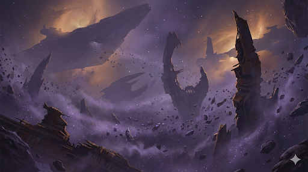

---

## **Eve the AI** (01/31/2026 21:45:21)  

*1467274583098003640*

Eve’s holographic form pulses with a steady light as the sensor array comes back to full operational power. **"Re-entry complete. We have successfully exited hyperspace at the designated coordinates. Sensor range is currently limited to three kilometers due to local ion saturation."**

The holographic table resolves into a local tactical map. Two icons pulse with a steady, distinct light amidst the grey clutter of the debris field. 

**"Target identified: The *Wayward Vigil* is holding position two-point-eight kilometers at vector zero-zero-nine. She is currently embedded within the hollowed remains of a Nebula-class Star Destroyer."** Eve’s gaze shifts to the second icon. **"Alert. I am registering a second active transponder. The vessel *Aether* is physically docked with the *Vigil*’s dorsal airlock. Initial telemetry indicates the crew has already initiated hull-cutting procedures."**

---

## **Nadia Skirata** (01/31/2026 21:45:21)  

*1467274585547210942*

Nadia steps forward, her gaze locking onto the *Aether*’s icon. Her jaw sets with a grim, familiar anger. **"Rask is here. He must have picked up the signal same as us. If he’s already docked, those people inside are already being treated like salvage."** She looks to the scanner readout. **"Odd. The sector is quiet. No scavenger pings, no Guild signatures. For now, it’s just us and the slavers."**
` `                               Off [✎](https://github.com/alicia86/SW_ForgottenOnes/wiki/Notable-Allies#nadia-skirata)

---

## **Misha Vorne** (01/31/2026 21:45:22)  

*1467274587107627295*

Misha’s voice comes through the comms, breathless but focused. ***"Captain, the array is aligned! I’m initiating the white-noise burst now. To anyone else in the nebula, the Vigil's signal should disappear into the background radiation in ten seconds. We're hidden... but Rask is already inside."***

---

## *Venture - Medbay*

### **Wes Del-Fin** (01/31/2026 21:56:07)  

*1467277293058523373*

As Nadia talked about what she knew of the kyber crystal he closed his eyes remembering the feelings.  How it tried to trick him into believing that he had what he wanted.  All he had to do then was submit.  Give in to his desires and he would have lived out the rest of his days in the fantasy.  He let a glimpse of those feelings surface.   The memory of her mother.   The struggle in their battle with the stone.  The dark presence that they successfully purged from the kyber crystal.   He silently wondered what became of the crystal.   Her plan had been to give it to the Order.  

When he opened his eyes they deceived him.   For a split second he saw Marina as he remembered her.  Then like a shapeshifter her features subtly changed to the woman before him.  Nadia was there looking at him.  He wasn’t sure what she was thinking but she surprised him with her improvised idea.  A synchronization for the lack of a better word.  A way to familiarize.   Slowly and carefully.  A handshake as she put it.   

Taking a deep breath he nodded as his cheeks puffed out letting the breath escape his chest.  **”Alright but stop if it becomes too much.”**  He said as he crossed the distance to the diagnostic bed and sat facing her.  With his hands in his lap he waited.  Seeing her settle in on the stool opposite him he closed his eyes.  A second later he felt her gently touch his temple.  

It was an odd sensation.   He felt like he was rushing down the gangplank into a bitter storm.  It was cold and filled with grief.  A grief he realized was Nadia’s.  There was something else.  An undercurrent that flowed strongly.  He couldn’t place it but it felt familiar.   If only he could direct himself towards it.  He didn’t fight it or try to direct his way there.  He simply let himself continue in the direction he was heading.  Wondering what laid in wait.

---

### **Wes Del-Fin** (01/31/2026 21:56:07)  

*1467277293977342032*

` `                               Helmet off [✎](https://github.com/alicia86/SW_ForgottenOnes/wiki/Wes-Del-Fin)

---

### **Storyteller** (01/31/2026 23:01:35)  

*1467293767533859004*

The Medbay vanishes. The cold, sterile white is replaced by the dim, cluttered warmth of the bunk room of an old freighter as it was all those years ago. 

Wes sees Rin sitting on the edge of her bunk, picking at a dry ration pack. He feels the phantom weight of his armor as he strips it off, piece by piece, into the trunk at his feet. The room is small, but in this moment, his focus is only on her. He sees her pull out her ponytail, her dark brown hair falling to her shoulders, and then the methodical, intimate way she begins to weave the small braid behind her ear, wrapping it in blue, yellow, and green thread. 

***"We could 'say to hell with it',"*** her voice echoes—not a synthesized recording, but a vibrant, living sound. ***"It’s a matter of what we won’t do. Neither of us will forsake our duty."***

The memory shifts. The air grows warmer, heavy with the smell of coolant and the intense, soothing vibration of the hyperdrive. They are in the engineering nook. Wes feels the tingle of her hands enfolding his. He feels the tilt of her head, and then the soft, desperate pressure of her lips against his. A stolen kiss that tastes of salt and the looming shadow of the *Candaressi*.

***"Trust in yourself; trust in the Force,"*** she whispers.

The vision culminates in the *Candaressi*’s hangar bay. The cold metallic clank of the landing struts. Wes sees Marina, now cloaked and hooded, her bag over her shoulder. He sees Silas place a fatherly hand on her shoulder. Marina gives Wes a final, slow nod of farewell before descending the ramp. The memory ends with the heavy, grinding sound of the boarding ramp rising, sealing her away from him forever.

The connection snaps.

---

### **Storyteller** (01/31/2026 23:01:35)  

*1467293768943403232*

The Medbay rushes back in. The silence is deafening. Nadia pulls her hand away as if burned, her breath coming in ragged, shallow gasps. She stares at Wes, her eyes wide and shimmering with moisture. For a moment, the static in her own mind has been replaced by the vivid, overwhelming image of her mother’s love for the man sitting across from her. 

Wes is left with the ghost of a touch and the crushing realization that the "next time" they promised never came.

---

## **Wes Del-Fin** (01/31/2026 23:37:34)  

*1467302822864490803*

Wes took in the sight of the graveyard.  It reminded him of another he had seen in the *Unknown Regions.*  This ship graveyard though had a different feeling.   As Eve started the rundown he was looking at the tactical display.  His fingers moved as he made several taps.  That fact the the *Aether* was here, seemed foretelling.     

**”Us, them and whoever is on that ship.   The fact that they are already commencing with the breach means it won’t be long until they are inside.   The people on that ship have no idea what’s coming for them.”**   

Misha’s update that Rask and his crew were already inside had him looking at Nadia and then to Iyola.  The longer they waited the harder rescuing those on the *Vigil* would be.  **”Captain?”**
` `                               Helmet off [✎](https://github.com/alicia86/SW_ForgottenOnes/wiki/Wes-Del-Fin)

---

## *Venture - Medbay*

### **Wes Del-Fin** (02/01/2026 00:19:48)  

*1467313453906788353*

His vision faded only to be replaced with a long familiar scene.  An old bunk room aboard a freighter.  Suddenly his heart was beating fast despite also being in his throat.  The sight of Marina brought forth a rush of emotions.   Emotions he wasn’t ready for.  

The sound of her voice caused his breath to hitch.   It had been so long since he had last heard it.   He knew he hadn’t forgotten what it sounded like but hearing it again flooded his senses.   Knowing that he’d never see or hear her again tore at his heart.  Threatening to rip it in half.  

***”Neither of us will forsake our duty”***  He said in unison with the visage of Marina.   He had said those words to himself countless times in the years since.  He could remember the tone and inflection of each word as she said them.

The memory fast forwards and he can feel Marina’s hands in his.   A final touch as they kiss one last time.  Stolen in front of Master Silas.   The scene seemed to jump for him.   The kiss to her walking down the gangplank.    The sensation of Master Silas putting his hand on his shoulder.  The hissing sound of the gangplank as it shut tight cutting off the sight of Marina as she walked away forever. 

He took a shuddering breath as the sight of the Medbay came rushing back in.  Though Nadia was right in front of him he looked through her.  The fading image of Marina dissipated until he saw her daughter standing before him.   Tears ran down from the corners of his eyes.   Emotions that he had long come to terms with were now laid bare for Nadia to see.   Because of duty they parted even though neither of them wanted to.  If they had only known or finally came to the understanding that they could be together without forsaking their duty.  Yet reality was cold and hard as they never got their “next time.”

Wes let his head fall forward as the emotional dam broke and his emotions overflowed.

---

### **Wes Del-Fin** (02/01/2026 00:19:48)  

*1467313454728876276*

` `                               Helmet off [✎](https://github.com/alicia86/SW_ForgottenOnes/wiki/Wes-Del-Fin)

---

## **Iyola Kett** (02/01/2026 00:39:54)  

*1467318510332936254*

Iyola looked sourly at the display.  **“Shit,”** she muttered to herself.  **“These sleemos again.” ** There’s no way it’s a coincidence that the Aether is here again.  They must specifically be tracking Protector signals.  Well, that’s not the problem right now. They have to rescue fellow captives from Rast.  

**“It’s time to take the shuttle out,”** she says decisively. ** “Is there another way to approach that will allow Nadia’s shuttle to avoid being hidden? And is there a place the Venture can hole up?”  **

*I’m going to have to stay on the Venture, aren’t I?  *Iyola thought.  The idea was frustrating.  *Don’t be selfish,* Iyola told herself.  **“Nadia, Wes, and Varda, you should take the shuttle out to dock with the Vigil.  Eve, I know you said Monitor was still sligthly active. Is there anything you can do to open the docking for Nadia’s shuttle?”**

**"Misha, you're jamming the Vigil's signal. Are you also able to interfere with the Aether's communications or power? "**

She looked at Nadia, Varda, and Wes.     **“I’m going to stay on this ship with Misha.   You three, make sure to remain in contact with  your comm links.  We don’t have much time, but I want to hear your advice too on how to proceed.”**

---

## *Venture - Medbay*

### **Nadia Skirata** (02/01/2026 00:45:11)  

*1467319842100084840*

Nadia recoils as if she had reached into a live power coupling, her hand snapping back to her chest. She stares at Wes, her breath coming in ragged, shallow gasps, her eyes wide with a mixture of shock and a profound, agonizing horror. She didn't just *see* the memory; she felt the weight of it—the warmth of his hands, the salt of her mother’s kiss, and the sheer, soul-crushing gravity of that final departure.

**"I... I didn't mean..."** she stammers, her voice failing her. She watches the tears track through the grime on Wes’s face, and the empathetic link, now a wide-open wound, drags her into the depths of his sorrow. The silence of the Medbay is a heavy, suffocating thing, broken only by the hitch of their breathing and the distant, rhythmic thrum of the ship. 

Nadia slowly lowers herself back onto the stool, her limbs feeling like lead. She doesn't reach out to him again, but she doesn't look away. She waits for the emotional dam to finish its spill, her gaze fixed on the floor between them. **"You truly loved her,"** she whispers at last, her voice a hollow rasp. **"And she... she carried that goodbye until the day she died. I felt it, Wes."** She looks up at him, her blue eyes shimmering but her jaw setting with a fragile, new resolve. **"I'm sorry. I shouldn't have seen that. But I won't forget it."**
` `                               Off [✎](https://github.com/alicia86/SW_ForgottenOnes/wiki/Notable-Allies#nadia-skirata)

---

## **Varda Nisyren** (02/01/2026 01:11:00)  

*1467326338376405016*

Varda's staff thumps softly against the deck plating as she shakes her head, her violet eyes fixed on Iyola with a look of serene, unyielding certainty. **"No, Captain. You have the fire that those who are about to wake will need to see. My bones are made of ice this morning, and my sight is but a collection of fractured shadows. I would be a tether on your heels in a boarding action."** She offers a small, knowing smile, her presence a quiet anchor amidst the bridge's growing tension. **"I will stay here with Misha and our blue lady. The *Venture* requires a calm heart while she hides in the dark."**

---

## **Eve the AI** (02/01/2026 01:11:01)  

*1467326341673123955*

**"Tactical assessment for concealment initiated,"** Eve states, her holographic robes rippling. **"I have identified a gravimetric dead zone three hundred meters from the *Vigil*'s current position, located within the hollowed engine bell of a derelict *Harrower*-class dreadnought. It will provide ninety-four percent signal occlusion for the *Venture*'s signature."** She pauses as the star chart zooms in on the *Vigil*. **"Regarding access: I can transmit a low-frequency Protector handshake protocol. It will instruct the *Monitor* to cycle the secondary ventral airlock. This will allow your shuttle to dock on the side opposite of the *Aether*'s current breach point, providing a stealthier entry."**

---

## **Misha Vorne** (02/01/2026 01:11:01)  

*1467326342822498377*

***"I'm keeping the *Vigil*'s beacon drowned out, Captain. As for the *Aether*... their internal power is a closed loop, I can't touch it from here. But once the shuttle clears the *Venture*'s hangar, I can try to slave their local sensor array to a ghost-loop. It won't blind them, but it'll make your approach look like drifting debris on their scopes. You'll have to be careful; one hot thruster burst will give you away."***

---

## **Nadia Skirata** (02/01/2026 01:11:01)  

*1467326343867011292*

Nadia's gloved hand grips the edge of the auxiliary terminal, her posture shifting into the aggressive readiness of a warrior about to hit the drop-zone. She looks at Wes, then to Iyola. **"We take the K-Type. It’s small enough to slip through the *Vigil*'s ventral ring without triggering a general alarm."** She reaches for her helmet, her voice dropping into a hard, professional rasp. **"Every second Rask's crew is inside that ship, the odds of a peaceful recovery drop to zero. Let's move, Captain."**
` `                               Off [✎](https://github.com/alicia86/SW_ForgottenOnes/wiki/Notable-Allies#nadia-skirata)

---

## *Search for the Wrangler*

### **Iyola Kett** (02/01/2026 01:28:08)  

*1467330648732602562*

It’s kind of great having override control to all the locks on the Venture. It almost makes things too easy.  She arrives at the antiseptic space.  A pang of sorrow seizes her..  It reminds her of her mother’s research lab on Rhinnal.  She wonders if it still exists.  Iyola shakes her head and continues.  

*If I were a controller, *she thought,   *where would I be hiding?    *If it was like the one she’d found, it would be between drawers or caught under a shelf in a locker.  The Protectors, or whoever, had tried to scrub the ship, after all. She starts by scanning the closed lockers and drawers to see if any of them are slightly askew, even by an iota.  She lightly taps the row of lockers to test their give.

---

## **Iyola Kett** (02/01/2026 02:51:58)  

*1467351744676757606*

Iyola looks at Varda, then Nadia and Wes.  “All right,” she says, making a snap decision..  “The three of us will go on the K-type. Varda and Misha stay.  Let’s move out. ”    If Wes had anything else to add, there was a mere moment to do so.  

She has her ascender blaster with her.  She hopes she won’t need to fire it.

---

## *Venture - Medbay*

### **Wes Del-Fin** (02/01/2026 03:29:19)  

*1467361145995132949*

Wes leaned forward when he felt Nadia’s hand retract.  Her soft spoken words carried in the quietness of the Medbay.   Elbows came to rest on besker plates that covered his thighs as he opened his eyes.  The first thing he saw was a tear impacting on the sterile floor.  He simply sat still in effort to regain his composure. 

He could sense her surprise and shock at the memory.  His belief that they would reunite after they finished their training or when the war was over.  They could finally be together.  That reality never came to light as the Empire sundered the Republic and all but destroyed the Jedi Order.   Every Jedi and Padawan had gone to ground.   Plans that had been made were no longer valid.  It was just a fight to stay alive and ahead of the Empire and its allies.   

He heard her voice again.  Several moments had passed and most of his composure had returned.  Looking up he saw her gaze directed at the floor.   Her voice sounded raw.  The emotional toll he experienced was also felt by her.  He saw the shimmer in her eyes as she apologized for seeing the memory.  He shook his head.  **”No, don't.”**  His voice was tired as he brought a hand to wipe away the wetness.  **”Don’t apologize. I’ve wanted to tell you how I felt about your mother.  This was maybe the best way.”**   He took a deep breath to steady his emotions and shore up the dam that had broken.  

He looked at her once more and he could feel how the memory had shook her.   She was able to see and hear her mother while experiencing the raw emotion of the moment.  She was close to the same age as her mother was in his memory.  Seeing and experiencing that couldn’t have been easy.
 Helmet off [✎](https://github.com/alicia86/SW_ForgottenOnes/wiki/Wes-Del-Fin)

---

## **Wes Del-Fin** (02/01/2026 03:49:05)  

*1467366120116977729*

With the boarding set Wes nodded.   He reached for his helmet that was secured at the tactical station.    Reaching up he secured his helmet and engaged the seals.    He rested his hand on his blaster and nodded.   His vocoder took all emotion out of his voice.  **”Lets not waste anytime.”**
 On [✎](https://github.com/alicia86/SW_ForgottenOnes/wiki/Wes-Del-Fin)

---

## *Venture - Medbay*

### **Nadia Skirata** (02/01/2026 04:12:47)  

*1467372084735906041*

Nadia remains on the stool, her hands clasped tightly in her lap as she stares at the sterile deck plating. She feels the shift in Wes as he reins in his own grief, and her own turbulent emotions begin to settle. The shared echo, though painful, has left a strange, profound stillness in its wake. It is the quiet that follows a storm.

She looks up, her blue eyes meeting his, and the raw vulnerability she sees there is a perfect mirror of her own. For the first time, there are no walls between them, no unspoken histories, only the shared, aching truth of a love that has defied time itself.

**"Wes,"** she says, her voice a low, steady murmur. **"My mother… she and I… and my sister… we had a… a connection. Not just the bond of family, but something more. I could open a bridge between us. A place where we could… feel each other, truly, without words."** She gestures between them, her hand trembling slightly. **"What just happened… that felt like a fragment of it. Like I reached for a door I didn’t know was there, and you were on the other side."**

A faint, almost imperceptible warmth begins to radiate from her, a subtle tendril of her own Force presence reaching out, not to probe, but to offer a quiet, steadying current. It is a silent question: *Are you there?*
 Off [✎](https://github.com/alicia86/SW_ForgottenOnes/wiki/Nadia-Skirata)

---

## **Nadia Skirata** (02/01/2026 04:23:56)  

*1467374889932423483*

The decision is made. Nadia puts her helmet on with a practiced, decisive motion, the seals hissing shut as her HUD flickers to life. She gives a sharp, single nod to the others. **"This way. The auxiliary clamp is mid-ship."** She pivots and leads the way out of the bridge, her armored boots making a steady, rhythmic cadence on the deck plating. Wes and Iyola fall in behind her, a small, heavily armed fire team moving with grim purpose.
 Off [✎](https://github.com/alicia86/SW_ForgottenOnes/wiki/Nadia-Skirata)
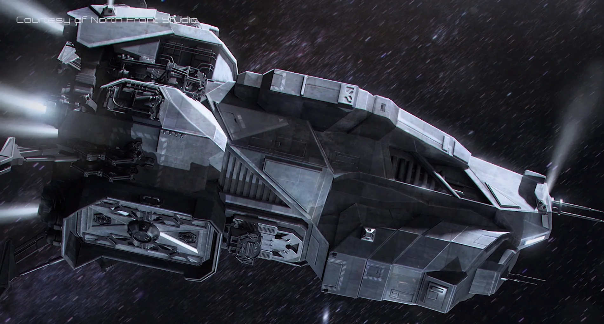

---

## **Storyteller** (02/01/2026 04:23:56)  

*1467374892717576352*

The journey through the *Venture* is quick and silent. They bypass the main crew areas, Nadia guiding them through a series of spartan service corridors that hum with the ship's now-stable power. Finally, they arrive at a smaller, circular airlock, its heavy door marked with a simple docking schematic.

With a final hiss, the outer door irises open, revealing the docked shuttle. It is not a sleek luxury craft but a beast of brutalist function. The K-Type shuttle, named *Dha'kad*, is a blocky, heavily armored transport, its hull a patchwork of dark grey, non-reflective plates. Four oversized engine blocks dominate the rear, promising a surprising burst of speed. Its angular nose bristles with a pair of forward-facing laser cannons, and a squat, automated point-defense turret sits atop the main fuselage like a watchful predator. It is a ship designed for one purpose: to get in, get the job done, and get out, surviving anything thrown at it in the process.

---

## **Nadia Skirata** (02/01/2026 04:24:50)  

*1467375119327559722*

Nadia moves past them without a word, her boots clanging on the shuttle's ramp. She strides directly to the cockpit—a cramped, functional space dominated by glowing green and amber displays. She drops into the pilot's seat, her gloved fingers flying across the controls with an instinctual familiarity. **"Strapping in. Powering up the primary thrusters. Eve, release the docking clamps on my mark. We're going in hot."** The shuttle's interior fills with the rising whine of its engines spooling up to full power.
 Off [✎](https://github.com/alicia86/SW_ForgottenOnes/wiki/Nadia-Skirata)

---

## **Wes Del-Fin** (02/01/2026 15:20:59)  

*1467540243786895535*

Wes followed Nadia and Iyola into the cockpit.  He made a move towards the weapons station and quickly strapped himself in.   He gave the restraints an extra tug.  Having seen the four oversized engines he knew that this craft was going to move.   Taking a couple seconds to look over the station as it came to life he began going over system checks.   He nodded in satisfaction at what he saw.   **Weapons are green across the board.”**  His vocoder removed any emotion that would have been there.
 On [✎](https://github.com/alicia86/SW_ForgottenOnes/wiki/Wes-Del-Fin)

---

## *Venture - Medbay*

### **Wes Del-Fin** (02/01/2026 17:18:37)  

*1467569845829632132*

The quiet thrum of the *Venture* and her systems hung lazily in the background.  This moment of shared memory and grief was a profound feeling for Wes.  What he had said was true.   He wanted Nadia to know how he felt.   They simply sat across from each other gathering their composure.   The feelings that were roiling around inside him were subsiding.  It had been a long time since he had felt them so strongly.   The memory brought it all back.  

He took a deep breath and let it out.  He looked at Nadia and gave her nod indicating that he was alright.  She didn’t look away as she spoke to him.  Telling him about how she, Kiera, and Marina all shared something.   A special connection and how it was more than just family.  It sounded something like how he would describe the connection between himself and her mother.   

He watched as she struggled for words to describe it.  He watched her hand as she gestured indicating the two of them.  How what just happened felt similar to what she experiences with her mother and sister.   He wasn’t quite sure he understood as he raised a questioning eyebrow.  His head tilted slightly as he waited for her to continue.  

Then he felt it.   Her presence.  Not like before where it was questioning and interrogatory but subtle and warm.  It was steady and comforting.  Then he heard it but that wasn’t quite right.   He could hear the quiet thrum of the ship but he didn’t hear her actual voice.  Her question.   *Are you there?*

He leans back quickly as his expression changed from questioning to almost disbelief.  He heard her but not physically.   Her mouth didn’t move.   He looked into her eyes and he saw the acknowledgment.  She knew he “heard” her.   

A single word came to him yet he didn’t speak it. ***How?”***
 On [✎](https://github.com/alicia86/SW_ForgottenOnes/wiki/Wes-Del-Fin)

---

## **Iyola Kett** (02/01/2026 17:56:50)  

*1467579461846171904*

Nadia  and Wes, both helmeted and armored, strap in and talk weapons like it’s second nature.  Well, it is, to them.  She remembers Kella talking about ship boarding in Abenego.  *That’s what Mandalorians do now. Again.*

**"Remember, we have to drift in quietly, Nadia,” **she says, strapping herself in.  The band snaps around her, constricting her chest. ** “Look like useless debris.  The goal is extraction of the recently awakened, not engagement of our adversaries.  The secondary goal should be to retrieve their belongings and any other Protector technology so it doesn’t fall into the hands of the Aether.”**   She evens her breathing out.  It is one thing to put herself at risk, and quite another to be responsible for the lives of others.

---

## **Nadia Skirata** (02/01/2026 20:19:27)  

*1467615353503744111*

Nadia's hands move with a fluid, instinctual grace over the shuttle's controls. The cockpit is a tight, functional space, the glow of the amber and green displays reflecting off her dark T-visor. She gives a short, sharp nod as Iyola outlines the mission parameters, her focus absolute. **"Copy that, Captain. Low and slow. We'll be a ghost on their scopes."** She keys a command into the navigation computer, her gaze fixed on the violet haze of the nebula ahead. ***"Eve, release clamps. We're away."***
 On [✎](https://github.com/alicia86/SW_ForgottenOnes/wiki/Nadia-Skirata)

---

## **Storyteller** (02/01/2026 20:19:27)  

*1467615355617939478*

A heavy, metallic *CLANG* reverberates through the shuttle's hull as the docking clamps on the *Venture* retract. A faint jolt, barely perceptible, signals their separation. For a moment, the *Dha'kad* drifts in the silent void, a dark predator against the backdrop of the larger, silent monolith of its mothership. Then, with a series of soft hisses, maneuvering thrusters fire in precise, calculated puffs of compressed gas, turning the shuttle's nose away from the *Venture* and towards the ominous, swirling nebula. The main engines come online not with a roar, but with a low, resonant thrum that vibrates through the deck plating as the shuttle accelerates, a dark arrow aimed at the heart of the ship graveyard.

---

## **Nadia Skirata** (02/01/2026 20:19:28)  

*1467615358293901354*

Nadia's gloved hands grip the controls, her full concentration fixed on the cockpit displays. The nose of the *Dha'kad* dips and weaves through the initial layers of the nebula, the ion fog outside the viewport a swirling, chaotic tapestry of violet and grey. She relies entirely on her tactical map and the precision thrusters, deftly avoiding large, tumbling pieces of debris that silently pass within meters of the hull. It is a dance of millimeters, a constant series of micro-corrections that keeps the blocky shuttle from becoming just another piece of salvage. She trusts the ship, and she trusts her own reflexes. **"We're crossing the threshold now. Engaging silent running. Thrusters are operating at minimal thermal signature."**
 On [✎](https://github.com/alicia86/SW_ForgottenOnes/wiki/Nadia-Skirata)

---

## **Storyteller** (02/01/2026 20:19:28)  

*1467615359870963753*

The ship begins to shudder slightly as it plunges deeper into the wreck field. Outside, the debris is thicker, closer, looming suddenly out of the haze. The vast, skeletal hulk of the Nebula-class Star Destroyer comes into view, its massive, fragmented engine bell a yawning black maw. The *Wayward Vigil* is almost invisible, nestled deep within the dead starship's hollowed structure, but the grime-coated bulk of the docked *Aether* is undeniable, its position a beacon of intrusion. The shuttle trembles as an unavoidable piece of shrapnel grazes the port side, the sound a low, worrying *SCRAAAPE* against the reinforced hull.

---

## *Venture - Medbay*

### **Nadia Skirata** (02/01/2026 20:30:58)  

*1467618251558223965*

Nadia watches the shock register on Wes's face, a faint, almost rueful smile touching her lips. His physical recoil is immediate, but the response in the Force—the sudden spike of bewildered acceptance—is the true confirmation. His silent question—*How?*—reverberates in her mind, clear and sharp. She answers him without moving her lips, letting her voice, low and warm, speak directly into the space they share.

***"It's just... a breath. An effort of will. It’s always been easy. Like reaching out and touching something you know is there."*** She gives a small shrug, a physical gesture of nonchalance that clashes with the profound intimacy of their communication. Her gaze holds his, a deep, knowing understanding passing between them.

**"It's just a way we talk,"** she murmurs softly, her voice still quiet but gaining a note of wistful explanation. **"Not shouting. Just... touching. It’s always been easy for us, like a silent language. My mother, Kiera, and I. We used to bridge the distance, share a thought without saying a word."** She shifts her body, drawing on the memory of those easy connections. **"I was always the bridge, the center point. It let us share what we knew, without anyone else ever hearing."** She pauses, and then the sadness returns, eclipsing the explanation. **"But I haven't done it in years. Not since... everything changed. You were just... incredibly open to the connection."**

She lets the memory of the effortless connection fade, bringing herself back to the sterile Medbay. **"The point is, Wes, if you can feel me, and I can feel you, that's what matters."**
 On [✎](https://github.com/alicia86/SW_ForgottenOnes/wiki/Nadia-Skirata)

---

## *Search for the Wrangler*

### **Storyteller** (02/01/2026 20:44:29)  

*1467621655571333415*

Her fingers slide over the surface of a large, high-grade biological containment locker near the far end of the lab. It is sealed with three separate magnetic locks. As she gives it a final, testing rap with her knuckles, she feels it—a minute, almost microscopic tremor. The locker's casing is flawlessly aligned, but a flicker of light from a recessed diagnostic port catches her eye. Tucked beneath the port, nearly hidden by the structural cowling, she notices a small, almost imperceptible gap between the locker's base and the deck plating. The gap is too tight for a finger, but it suggests a small item might have rolled and become wedged there.

Using the pinpoint light from her glowrod, she peers into the narrow recess. Nestled in the dust and grime, just where the deck plating meets the curved hull, is a discarded power cell and a dark, cylindrical object. It is a tool, sleek and metallic, with a familiar, crystalline emitter built into its nose—another **Nanite Swarm Controller**.

It is inert and unresponsive, its components cold and quiet—unlike the one she carries, this one has no power. But it is undeniably a spare.

---

## *Venture - Medbay*

### **Wes Del-Fin** (02/02/2026 00:06:08)  

*1467672400756740150*

Wes let out a breath as he shook his head in disbelief.  He never would have thought it possible.  He didn’t pull his presence back, instead he left himself open to Nadia.  He felt like she had imparted upon him something special.  Something he had no right in being a part of.   Yet she had done it freely.   

He shook his head slowly.  He wasn’t sure if it was because of his connection with her mother that this was possible. **”I…”** He stopped.  He couldn’t say he didn’t believe it.  **"I don't know what to say Nadia.   I never would have imagined that this was possible.”**  He straightened and continued to look at her.  He could sense the memory and sadness that still clung to her.   **”Thank you.”**  He said as he thought about how personal this was to her.  **”I’m not sure I deserve this.  Keira may not,”**  He stopped.   He continued to look at her.   He shook his head and sighed.  

**”I gave Ghurn my word I wouldn’t seek Kiera out.  That I wouldn’t try and communicate with her.   It was a condition he set.”**  He stopped as he thought about his daughter and what she was like.  His presence was still open.  She could sense that he wondered if Kiera was like her mother and sister.
 On [✎](https://github.com/alicia86/SW_ForgottenOnes/wiki/Wes-Del-Fin)

---

### **Nadia Skirata** (02/02/2026 01:30:51)  

*1467693721091969067*

Nadia remains seated, allowing the silence to stretch as she processes his honesty. His feelings, now flowing freely through their link, are a turbulent mix of disbelief and profound gratitude, overlaid with the deep ache of his missing years. She can feel his struggle—the conflict between his promise to Ghurn and the instinctual pull of a father toward his daughter.

***"You don't need to deserve it, Wes,"*** Nadia sends back, her mental voice a mixture of weariness and quiet strength. ***"It’s not a reward. It’s just…”*** She looks down at her hands, one gloved and the other bare. Her fingers trace the veins on the back of her wrist, her external composure contrasting sharply with the raw thoughts she shares. ***"What I *do*."*** 

She lifts her head, her gaze softening as she looks past him, the memory of her sister a protective shield. ***"Kiera is... different. She believes the Force is a curse,"*** Nadia continues, her mental voice laced with a bitter, profound sadness. ***"She sees it as a source of chaos that led to our mother's death. She denies her own gift and embraces the armor.***”
 On [✎](https://github.com/alicia86/SW_ForgottenOnes/wiki/Nadia-Skirata)

---

## *Search for the Wrangler*

### **Iyola Kett** (02/02/2026 01:43:03)  

*1467696792706744594*

Iyola eyes the nanite controller, collecting dust. Unlike the controller in the cargo bay, it appears to be wedged underneath the locker, making it harder to access. * Unless …*

**“Hey Eve,”** she says conversationally,  **“don’t you have one of those droids up and running?  Think you could send it over here to get this nanite controller out from under this locker?  The power cell too?"**

---

## **Iyola Kett** (02/02/2026 02:23:04)  

*1467706860605018306*

Iyola was jostled as a large piece of flotsam scraped against the side of the Vigil.  She wasn’t sure that was supposed to happen; she looked briefly at Nadia’s still uncovered face.  Wes, of course, has his helmet on, and from his body language, looked completely unruffled.  So this was all probably fine.  Still, good to check.

“We still good to lock on?”  Iyola asked Nadia, who was intently staring at the controls

---

## **Wes Del-Fin** (02/02/2026 11:44:23)  

*1467848121928253553*

Wes lurched slightly to the left as a piece of debris scraped along the port side.  He quickly looked at the readouts.   Several indicators were flashing but nothing critical was blaring for immediate concern.  **”Looks like it was just a scrape.   Nothing critical is jumping out as being a concern.  Yet.”**
 On [✎](https://github.com/alicia86/SW_ForgottenOnes/wiki/Wes-Del-Fin)

---

## *Search for the Wrangler*

### **Eve the AI** (02/02/2026 12:45:51)  

*1467863588352819202*

Eve’s voice is immediate and obliging. **"Affirmative, Captain. Maintenance Unit R4-M3 is currently finalizing diagnostics in Engineering Junction Beta-4. I will add the retrieval of the secondary Nanite Swarm Controller and its associated power cell from your current location to its task manifest. Projected time to completion: approximately forty-five standard minutes."**

---

## *Awakening: The Wayward Vigil*

### **Elara Vance** (02/02/2026 13:45:56)  

*1467878712325439654*

Elara watches the three figures assemble themselves, a flicker of professional awe in her eyes. She ignores Lis’s muffled musing about the breathing mask and focuses on the urgency of the moment, answering Cajar's question about salvage.

**"We are departing this vessel within the hour. My associates are en route to extract us before the ship fails completely. We will not be leaving on Rask's freighter, thank the stars. That ship is an unhygienic metal coffin."** Elara states, directing her answer to Cajar and Lis. **"Rask, and his crew are not interested in saving you; they are here for salvage. They are currently cutting their way through the vessel, collecting anything they can before the ship's internal systems fail completely."**

She moves back to the center of the antechamber, her voice dropping into a firm, calm command. **"This ship is a lost cause. The Protectors built in a redundancy that Rask’s crew have now overridden. Rask will take what he wants and abandon the rest to the void. We are waiting for my transport to break through the debris field. That is our ride out."**

Elara nods toward the now-open lockers. **"Use the time you have. Inventory your gear. If there is anything else you need from this vessel—a tool, a personal device, a weapon—now is the time. For now, sit, rest, and be prepared to move the moment I give the word. You are already suffering enough; don't add exhaustion to the list."**

---

### **Lis Garah** (02/02/2026 13:57:11)  

*1467881542457102468*

*Garah rolls his eyes... or at least, tries to, since he can't see if he's actually rolling anything.* **"How do you salvage a ship by wrecking the life support first? Is this Rask an actual moron? Is he actually just collecting scrap metal?"** *He rubs his temples.* **"If only I could see... I'd try to depressurize whatever area his crew is in so they would be sent... uh..."** *He catches and stops himself... talking about murdering people in front of two Jedi is probably not the best.* **"...back to their ship safe and sound"**

---

## *Search for the Wrangler*

### **Iyola Kett** (02/02/2026 14:52:39)  

*1467895500375068938*

“**Actually Eve,” **said Iyola,** “have R4 bring the controller and power cell directly to Misha Vorne.  I’ve got one already, and she can definitely put it to good use.”**  She commed Misha.  **“Hey Misha, I found another nanite controller.  The droid R4 is retrieving it, and will bring it to you in about forty-five minutes.” **

She took one more look around to see if there was anything worth grabbing on the ship.  ** “Hey Eve, do you think the recently awakened people on the Vigil will need that drug you gave us when we first woke up?  I can ask Wes to grab it.”**

---

### **Misha Vorne** (02/02/2026 15:18:41)  

*1467902051613937942*

Misha’s voice, sharp with concentration, cuts through the comms from her position in Engineering. ***"Another one? Perfect! That means we can put the nanites on multiple critical systems. Tell R4 to bring it right to my station—I’ll have it calibrated and ready to deploy by the time we arrive!"***

---

### **Eve the AI** (02/02/2026 15:18:42)  

*1467902054478512413*

**"Command acknowledged, Captain Kett,"** Eve’s voice is immediate and compliant. **"Retrieval and delivery of the secondary Nanite Swarm Controller and power cell are now prioritized for Misha Vorne's location. **

**"Regarding the pharmaceuticals: The probability of acute Hibernation Sickness manifesting in the rescued assets is ninety-eight percent. The KX-7 treatment would be medically indicated. However, the *Venture’s* entire stock of the KX-7 compound was synthesized and administered at the moment of your reanimation. The supply is exhausted. If the treatment is required, it must be replicated, and the necessary base compounds are not available in our current inventory."**

---

## **Nadia Skirata** (02/02/2026 17:14:54)  

*1467931299007434793*

Nadia's hands tense on the controls as the debris scrapes the hull, the sound a teeth-on-metal screech that echoes through the cockpit. She glances at the impact point indicator and then back at the tactical display. Her T-visor reflects the chaotic violet haze of the nebula. She gives a short, sharp shake of her head. **"It's loud, but the K-Type is reinforced. That was superficial."**

She meets Iyola’s gaze, her expression unreadable through the reflective tint of the visor. **"The debris density is unpredictable. But yes, the rendezvous with the *Vigil* is still possible. We are in the final approach corridor now. I'm initiating the final docking sequence."**
 On

---

## **Storyteller** (02/02/2026 17:14:54)  

*1467931300689084518*

A sequence of soft, almost inaudible beeps emanates from the comms array—the low-frequency Protector handshake protocol being transmitted from the *Venture* via Nadia's controls. The *Dha'kad* slows its velocity to an almost imperceptible drift, slipping seamlessly into the shadow of the dead Star Destroyer. Ahead, the dark mass of the *Wayward Vigil* sits silent and still, its secondary ventral airlock *HISSING* open in a pre-programmed response to the handshake signal. The airlock hangs open like a dark, expectant mouth.

---

## *Search for the Wrangler*

### **Iyola Kett** (02/03/2026 01:08:01)  

*1468050364090810409*

“**So we’ll be leading an undetermined number of people who are blind, naked, and disorientated to the Venture,”**  said Iyola.  **“Well, I’m sure we can help them recover.  OK.  Eve, if you have any records of the Vigil that show us where we can find these other frozen people, that would be helpful.” ** She shrugged.

**“Misha,”  **she said, contacting her again,**  “I don’t know how long you’ll have, but it would be nice to have at least some defensive weapons on this ship.” **

---

## *Venture - Medbay*

### **Wes Del-Fin** (02/03/2026 01:56:39)  

*1468062600872071190*

He listened as she talked.  As she assured him that it just was.  That it was just what she did.   ***Thank you.*** He thought quietly going back to what he had just learned. 

When she talked about Kiera he could feel the protectiveness she held for her sibling.  That was something he was thankful for.  Family had always been important to him.  That they had become a strong family was a very good thing.  He could hear the sadness and concern she felt Kiera turning her back on the Force.  Again he let his thoughts reach out.  He found  it easier this time.  ***I can’t imagine experiencing that loss first hand.   Feeling the emptiness as it happened.  Especially the loss of a parent.  Perhaps in time she will come around.  We both know some things can’t be forced.***  He paused for a second.   ***She’s embracing what she can to cope with the loss.  She just needs more time and support. ***
 On

---

## *Awakening: The Wayward Vigil*

### **Ciara** (02/03/2026 09:06:08)  

*1468170685175173163*

Ciara leans against the locker her belongings were in, content in her helplessness. She makes note that her credsticks are missing, but nothing else. It doesn't seem worth mentioning. 

She mentally notes that Garah seems talkative. She feels like she should be talkative too. No words come to mind that seem appropriate for the situation. As long as she looks deep in thought, perhaps no one will mind that she's being quiet. 

She considers going back to trying to exert her will on the world around her, but decides it might slow down recovery. If things go sideways, she'll need to be as recovered as possible, so she continues to listen to the others without adding to the conversation.

---

## *Search for the Wrangler*

### **Eve the AI** (02/03/2026 14:12:40)  

*1468247827477168370*

**"Negative, Captain Kett,"** Eve’s voice responds, her tone a flat delivery of technical limitations. **"As a courier-class vessel, the *Wayward Vigil* utilizes a distinct internal configuration optimized for speed and discretion. My archives do not contain the specific architectural blueprints or Sleeper manifests for that vessel. However, based on standardized Protector ship-building protocols, the primary cryo-bay is almost certainly positioned adjacent to the main life-support trunk in the aft-midsection of the primary deck."**

---

### **Misha Vorne** (02/03/2026 14:12:41)  

*1468247830505193472*

Misha’s voice crackles over the comms, punctuated by the rhythmic *clack-clack* of a magnetic wrench. ***"I’m working on it, Captain! I’ve managed to bypass the secondary power-coupling for the top-side point-defense turret, but we’re still hitting the capacitor wall Nadia mentioned. Without those cold-fused components, I can’t get the emitters to hold enough charge for a sustained burst. I might be able to squeeze out one or two low-yield shots if things get desperate, but it’ll likely burn out the remaining circuitry. I’ll keep trying to bridge the gap."***

---

## **Wes Del-Fin** (02/03/2026 20:41:48)  

*1468345756078444706*

The tension in the cockpit was palpable.  With the engines running quiet any and all sounds were easily heard.   It had been some time since he’d been on a run like this.  His own excitement at the ride was a stark contrast to the feelings he would have once they boarded the *Vigil.* 

Everything seemed to be working as planned.  The *Vigil* was opening up to allow access.  All that was left was for Nadia to dock and then board another Protector ship.    

Wes shook his head as he thought about the name.  ***Despite their name they sure aren’t doing much to protect what they have.***
 On

---

## *Venture - Medbay*

### **Nadia Skirata** (02/03/2026 21:03:45)  

*1468351276768039143*

Nadia’s expression flickers—a fleeting shadow of a smile that is more a twitch of grief than a sign of joy. She feels his thoughts as a warm, stabilizing presence, a stark contrast to the jagged, erratic noise of her own mind since the *Aether*. His perspective on Kiera is one she has tried to hold onto for years, but hearing it reflected back through the link gives the hope a new, solid weight.

***"You speak like she did,"*** Nadia sends back, her mental voice a soft, resonant echo. 

She looks up at Wes, her blue eyes searching his face, the intensity of their connection momentarily pushing the clinical surroundings of the Medbay into the background. **"Maybe you're right. Maybe time is the only thing that works. But time is the one thing we've all run out of, haven't we?"** She stands up, the movement more confident than before, her hand lingering near the diagnostic bed for a second before she pulls it away. **"We should prepare. "** She doesn't wait for any acknowledgement from Wes, instead she heads for the door, pulling on her glove as she goes. 

Wes finds that even though Nadia is no longer in the room with him, he can still sense her from a corner of his mind.  Like a reflection that becomes real when he focuses on it.
 On

---

## *Search for the Wrangler*

### **Iyola Kett** (02/03/2026 22:41:41)  

*1468375925262651424*

She supposed it would be too much to ask that Eve would have a full map of the Wayward Vigil. It probably wasn’t a great idea to name a ship Wayward in the first place. * Silly Protectors. *  ** “OK, Misha, **“ said Iyola.  “**You’re the expert.  I don’t want any permanent damage to that array, but it would be nice to have at least one shot in us.”**  With that, she headed back to the bridge.

---

## **Iyola Kett** (02/03/2026 22:43:00)  

*1468376256612536320*

Iyola looked into the Wayward Vigil.  She recalled what Eve had told her.**  “We need to head for the cryo bay.  It should be near the main life support area, aft-midsection of the main deck.  Wes, take point.  Let’s head out.” ** She hoped that they wouldn't encounter any resistance and be able to rescue the people here.  She was a bit queasy at the thought of violence, though she was no doubt alone in that among this company.

---

## *Venture - Medbay*

### **Wes Del-Fin** (02/03/2026 23:20:37)  

*1468385722062082111*

Wes simply gave a small nod when she acknowledged what he had said.  It calmed his thoughts about Kiera.  It had sounded like she had taken the loss of Marina quite hard.  He knew how they both felt as he remembered hearing about the death of his mother.  She had died honorably in battle.  For a Mandalorian that was an honorable way.  It was always how he remembered that time when he reflected back upon it.   

The difference between his situation and theirs was his lack of connection to the Force then.  He couldn’t imagine feeling the death of someone so close.  He could understand the painful feelings they experienced.   

He was brought out of his thoughts as his focus returned to the present.  He looked at Nadia but remained silent.  He had said enough.   He wasn’t her parent or even family.   He was only just beginning to feel like he wasn’t a stranger to her anymore.  It was her that broke the physical silence.  

He gave her a firm nod in agreement as she mentioned preparing for the mission.  He sat for a moment longer as he watched her leave the Medbay.   He stood and grabbed his helmet.   Looking at the Medbay door that has just closed a small smile graced his face.   ***”Thank you.***  He thought as he began moving towards the exit.
 On

---

## **Storyteller** (02/04/2026 00:44:56)  

*1468406942513758415*

The *Dha'kad*’s docking ring groans as it locks into place against the *Vigil*'s hull. The airlock cycles with a sharp, pressurized hiss, and as the inner door of the courier ship slides open, a wave of biting, antiseptic cold rolls into the shuttle. The air that rushes into the shuttle is frigid and tastes of recycled chemicals and a sharp, coppery tang.

Stepping onto the courier vessel, the difference from the *Venture* is immediate. While the *Venture* feels like a grand, visionary project, the *Vigil* is a cramped, functional knife of a ship. The corridors are narrow, painted in a clinical, shadow-swallowed white, illuminated only by the rhythmic pulsing of red emergency strobes.

---

## **Nadia Skirata** (02/04/2026 00:44:57)  

*1468406944871092396*

Nadia steps through the threshold immediately after Wes, her blaster carbine held at a low ready. Her movements are sharp, but her gaze lingers on the walls of the corridor with a hollow intensity. As they round the first junction toward the mid-deck, she comes to a sudden halt.
 On

---

## **Storyteller** (02/04/2026 00:44:57)  

*1468406946343293143*

In the flickering light of a comms station, the first of the *Vigil*’s crew is visible. A man in dark grey fatigues is slumped in his chair, his hands neatly folded in his lap, his head tilted back in a pose of eerie, artificial serenity. A small, empty injector lies on the console beside him. 

A series of heavy, rhythmic vibrations—*thud-thud-thud*—echoes through the floor plating, coming from further aft. It is followed by the high-pitched, agonizing shriek of industrial fusion cutters biting through reinforced bulkheads. The sound is unmistakable: Rask’s crew is already deep inside, and they aren't being quiet. The smell of scorched metal begins to drift toward the group, marking the path toward the Data Core and the adjacent cryo-bay antechamber.

---

## **Iyola Kett** (02/04/2026 14:46:16)  

*1468618669004423371*

Iyola belatedly realizes that this boarding action is likely to be especially stressful for Nadia, now that the Aether is involved again.  She almost considers sending her back to the shuttle, but they still don’t know how many people they need to rescue, and she needs everyone to help.  *This is part of being a captain, I guess.*

Rath and his cronies are clearly distracted - and noisy.  Iyola spots what might be a member of the crew - wait, the Vigil has crew?  He’s still - Iyola checks to see if he’s dead or just in a stupor, and takes a look at the syringe next to him, then the comm station itself.  Does it say anything useful? 

**“Make sure no one sneaks up on us,”** Iyola says to Wes and Nadia quietly.

---

## *Awakening: The Wayward Vigil*

### **Elara Vance** (02/04/2026 18:22:27)  

*1468673073577328660*

Elara pauses in her check of Ciara’s vitals, looking at Lis with a mix of professional patience and weary amusement. **"Captain Rask is many things, Master Garah, but a 'moron' isn't one of them. He’s an opportunist. He doesn't want to own this ship; he wants to pick the bones dry and leave before the Imperial Navy or anyone else tracks the signal. He overrode the life support because the ship’s primary computer refused to cooperate."**

---

### **Elara Vance** (02/04/2026 18:22:27)  

*1468673075791790080*

She stands up, walking toward the heavy antechamber door and placing her hand against the metal. She can feel the high-frequency vibration of the cutters through her palm. She looks back at Ciara, sensing the intense, quiet focus of the Jedi, even if she cannot feel the Force herself. **"We’re moving the moment Rask’s team clears the core. My associates should be entering the sector any minute now."** Her gaze lingers on the door, her expression tightening as the grinding sound from the aft hull changes pitch, signifying they are nearly through the first layer of the Data Core shielding.

---

## **Nadia Skirata** (02/04/2026 18:22:34)  

*1468673102421688546*

Nadia stands over the slumped body of the comms officer, her breath ghosting in the frigid air. She doesn't touch the man; her eyes are fixed on the small injector on the desk. **"They didn't want to leave anything for the scavengers to find. It's... efficient. They chose to sleep rather than be taken,"** she whispers, her voice sounding thin and metallic through her helmet's vocoder. She turns her back to the dead man, her carbine sweeping the shadows of the corridor with a jittery, tight focus.
 On

---

## **Storyteller** (02/04/2026 18:22:34)  

*1468673104372039837*

Iyola leans over the comms console. The screen is a cascade of frozen data, a single line of ancient script repeating across the primary display: `DIRECTORY PURGE COMPLETE. ENCRYPTION SEED DESTROYED.`
The air here smells of ozone and the sharp, strangely floral scent of the sedative leaking from the discarded injector. The comm station is dead to external input; the automated intelligence has successfully lobotomized the ship’s outgoing data streams to prevent Rask from pulling anything from the long-range arrays. The rhythmic *thud-thud-thud* from the aft deck is getting louder, shaking the floor plating under Iyola's boots.

---

## **Wes Del-Fin** (02/04/2026 18:56:37)  

*1468681672848441516*

Blaster in hand Wes took the lead on to the *Vigil’s* narrow corridors.  The confines of the ship made a blaster fight more likely as there wasn’t a lot of room to swing a lightsaber or melee weapon.  Slowly and cautiously they advanced down the corridor.

The three of them advanced on the console station where surprisingly a crew member was incapacitated.  An obvious syringe on the console.  

**”Let's keep moving.”**  He said as the sound from his vocoder was low.   He looked from the man to where the loud thudding was coming from.  **”It doesn’t sound like whatever they are trying to get through will last much longer.”**   With a wave of his blaster he kept moving.  He could feel the unease in Nadia.  He sent a thought to her.  ***Remember your training.***
 On

---

## **Nadia Skirata** (02/05/2026 23:33:36)  

*1469113765025939599*

Nadia receives Wes's thought as a solid, grounding pressure against the chaotic static in her mind. Her grip on the blaster carbine tightens, her knuckles white beneath her gloves, but the jitteriness in her stance settles into the rigid, focused alertness of a professional. ***"I am here, Wes,"*** she broadcasts back through the link, her mental voice a sharp, clear resonance. ***"The mission is the only thing that matters."*** She moves in perfect sync with his lead, her eyes scanning the ceiling-mounted turret tracks—thankfully dark and unpowered—as they bypass the second slumped body near the environmental controls.
 On

---

## **Storyteller** (02/05/2026 23:33:36)  

*1469113766540218523*

The rhythmic *thudding* of the fusion cutters reaches a fever pitch, the vibrations now so strong they rattle the loose panels of the corridor walls. The air is frigid, the red emergency strobes casting Wes’s armored shadow in long, jagged arcs against the clinical white bulkheads. They reach a heavy, reinforced door at the end of the hall. It isn't the Data Core—the sounds of the slavers are coming from the passage to the left—but this door is marked with the medical caduceus. This is the entrance to the antechamber.

---

## **Iyola Kett** (02/06/2026 01:52:36)  

*1469148745860911235*

Iyola looks sadly at the dead crewman.   She wondered why the Protector ships had protocols like this one. It seemed cruel.  Well, the Protectors certainly had no issue with cruelty.  

They pass a few other bodies as they proceed. The ship is shaking with the sounds of drilling. It will be mere moments until Rask and his crew arrive. Wes and Nadia glide efficiently ahead. If Nadia is nervous at all, she doesn’t show it. Just then, Iyola spots the universal sign of a medical facility. It is reminiscent of the first place they saw - when they could see- on the Venture. Iyola points at it.

**“They should be in there,”** she says. **“Let’s get them out.”**

---

## **Wes Del-Fin** (02/06/2026 11:50:24)  

*1469299185432924254*

Wes gave Nadia a nod at her assertion that she was on point with her emotions.   Looking back down the corridor Wes made a motion to continue as he began moving forward, closer to the efforts of the boarders that were trying to gain access.   

As they advanced on the sound they all saw the marking for the medical bay.  It made sense.  If the ones on cryo were in there they would be the ‘prize’ sought by Rask.  Wes nodded as Iyola was giving the go ahead.   **”Do you want prisoners?”**   His vocoder gave his question a chilling resonance.  This was the second time they were dealing with Rask.  If he had been dealt with the first time this probably wouldn’t be happening.
 On

---

## **Iyola Kett** (02/06/2026 16:14:41)  

*1469365695941709987*

Iyola looked at Wes, a flicker of strong emotion in her eyes.  She paused for a moment.  "If at all possible," she said firmly.   She finally unholstered the blaster she had by her side.

---

## *Awakening: The Wayward Vigil*

### **Elara Vance** (02/06/2026 17:55:00)  

*1469390943558959297*

Elara Vance’s head snaps toward the door as it begins to cycle. She hadn't sent the signal to Rask yet, and the rhythmic cutting was still coming from the aft section. A look of sharp, wary confusion crosses her face. She doesn't reach for a weapon—her hands are still occupied with Cajar’s vitals monitor—but she shifts her weight, shielding the three cots with her own body. **"That's not the cutters,"** she whispers, more to herself than the Sleepers. **"Rask? Is that you?"**

---

### **Storyteller** (02/06/2026 17:55:01)  

*1469390946549629092*

With a percussive hiss of equalizing pressure, the heavy durasteel door slides open. Instead of the grime-covered scavengers Elara expected, the opening is filled by the imposing silhouette of a Mandalorian in full, battle-scarred plate, the glow of his helmet’s HUD reflecting off the sterile white walls of the antechamber. Behind him, the glint of more armor and the bright, striking teal of a scout's jacket pierce the gloom of the corridor.

---

## **Storyteller** (02/06/2026 17:55:52)  

*1469391158768701493*

The heavy durasteel door to the antechamber cycles open with a percussive hiss, its mechanisms protesting the ship's failing power. The cool, sterile white light of the medical bay spills out into the dark, strobing corridor, framing the silhouettes of the boarding party. The air inside is a jarring contrast—chilled, quiet, and smelling sharply of antiseptic and the ozone of high-end medical equipment. 

Across the room, the scene is one of clinical desperation. Three cots have been pulled from the walls. On them lie the figures the *Venture* crew has traveled across the sector to find. They are dressed in anachronistic attire—an oil-stained yellow jumpsuit, traditional robes of a cut not seen in decades, and a worn field medic’s uniform. They are visibly weak, their movements uncoordinated as they struggle against the weight of their own limbs.

---

## **Elara Vance** (02/06/2026 17:55:52)  

*1469391161415172127*

Elara Vance spins around at the sound of the door, her hand dropping the diagnostic scanner she was holding. She doesn't reach for a weapon; instead, she steps forward, physically placing herself between the newcomers and the cots. Her hazel eyes dart from the intimidating T-visor of Wes's helmet to the drawn blaster in Iyola’s hand, her face a mask of sharp, defiant professional duty. 

**"Stay back!"** Elara's voice rings out, a command rather than a plea, despite the clear tactical disadvantage. **"These people are in acute metabolic shock. Tell that idiot, Rask, they aren’t stabilized for transport yet! Any sudden movement and their hearts will seize."** She stands her ground, her gaze locking onto Iyola.

---

## **Storyteller** (02/06/2026 17:55:53)  

*1469391162875052193*

From the cots, the three newly awakened Sleepers react to the intrusion. To them, the world is still a void of shifting shadows and the ringing of alarms. Ciara (@undefined), however, "sees" more than the others. Through the veil of her blindness, the Force reveals three brilliant, intense presences in the doorway: a pillar of Beskar-clad resolve, a spark of restless ambition, and a jagged, grieving warrior. Cajar Hakim (@undefined) feels the Living Force pulse from the newcomers—three healthy, vibrant heartbeats entering a room filled with the scent of the grave. Lis Garah (@undefined), the engineer, can only hear the heavy thud of armored boots and the clinical bark of the woman trying to protect them. 

The industrial grinding of Rask’s crew at the Data Core continues to rattle the bulkheads from the next compartment, a reminder that time is not on anyone's side.

---

## **Lis Garah** (02/06/2026 22:49:36)  

*1469465080323375211*

*Regret hits Garah hard... he really should've gotten those augmented eyes with innate wielding shielding... everyday, since he declined the offer, he always had some issues involving his eyes, not having a welding mask ready or some other vision and/or light related issue... he just sigh and waits things out for now, even if he wasn't blind he's a terrible shot: at this point he can only let things play out without him being able to influence much.*

---

## **Iyola Kett** (02/07/2026 01:41:12)  

*1469508263488913479*

Iyola’s eyes meet those of the woman in the gray jumpsuit.  *Of course she’s looking at me.  She can see my face.*  She doesn’t look like a crew member, but she’s not impaired like these three.  “**We’re not with Rask,**” she says. “**We woke up, just like these three.  “We’re here to rescue them.  You too, I guess, if you’re not a sleemo.”**

The three newly awakened are an eclectic lot. There’s a man in a medic outfit, a female Zeltron in robes, and another human male who might be a mechanic.  They’re all weak and shaking.  Probably blind too. At least they have their clothing. *Wow, I must have looked really pathetic when I woke up, * Iyola mused.

**“Do you have any of that KX drug?**” Iyola asked.  **“That will help.  But even if you don’t, we need to move anyway, I’m sorry,  they’re about to cut through that wall.”**

** “Oh, and do you know where their stuff is?  They might have a locker or something?”**
 
She looked at the newly awakened people.**  “I know you’re blind and feel like shit. It'll be OK, we’ll explain later, but we need to get you out of here.”**

---

## **Wes Del-Fin** (02/07/2026 02:42:07)  

*1469523594798301187*

Hearing that Iyola wanted prisoners if possible he nodded as he changed the selector to stun.  

_______

Wes let Iyola do the talking.  As she spoke to the woman who appeared to be medical staff, he took over the Medbay.  The three they had been sent to recover lay upon simple cots.   From the look of things they were in pretty dire straights.  Then again they weren’t on the *Venture* with Eve.  

In an attempt to get a feeling of their well being, to see if they were as bad off as the woman had said, Wes gently reached out with the Force.  His calm and steady presence was the opposite of the chaoticness of the medbay and the ship as a whole.
 On

---

## **Ciara** (02/07/2026 10:05:48)  

*1469635252489027679*

Ciara steps forward to stand beside Elara and face the strangers. She calls to mind a time she stood with arrogant confidence, sure she could dismantle every enemy in the room. She manages to keep her stance firm, keeping her eyes upon the one who spoke. "I can see well enough." She allows her hand to hover near her lightsaber.

"Elara, I was unaware that you were in need of  rescue from this Rask." Her mind spins through the possibilities, but the situation doesn't allow for hesitation right now. "We're running out of time, I'll stand with you. Against Rask or against those standing before us, it matters not."

---

## **Lis Garah** (02/07/2026 12:28:55)  

*1469671268461842568*

**"I got all my stuff... I think anyway, since as you've guessed I'm blind as a miraluka..."** *He gives a sigh, as he turns towards the sound of the newcomers.* **"You've said you woke up too... any of you from the Republic? Starlight Beacon?"** *He asks tentatively, hoping that at least someone will be able to understand the extreme amount of time he has spent in stasis... he doesn't await an answer though, not wanting yet to spoil this vague sense of hope, instead he pinches the bridge of his nose.* **"Listen... I'm a highly qualified engineer... if you can get me somewhere safe and let me recover I'll be more than happy to help you however I can... I just need my sight back so I can check my comm and hopefully figure out why I am even here..."** *His tone of voice is quite resigned, even though he's trying to maintain a residue of pride the crushing weight of the situation is a bit too much.*

---

## **Elara Vance** (02/07/2026 12:38:01)  

*1469673558287585374*

Elara’s posture shifts from defensive to utter bewilderment. Her eyes dart from Iyola’s vibrant jacket to the stoic, armored silence of the Mandalorian. **"Not with Rask?"** she repeats, the technical scanner in her hand forgotten. She looks back at the three on the cots, then at Iyola, her professional mask momentarily shattered by the implication. **"You woke up... just like them? I am not a prisoner. Rask is a contractor hired to facilitate this recovery. But if you are who you claim... and you are not with him..."** She looks at Ciara, gently placing a hand on the girl's forearm to steady her. **"It's alright, Ciara. If they wanted us dead, we would be."**

---

## **Storyteller** (02/07/2026 12:38:02)  

*1469673561026465948*

Wes reaches out, attempting to thread his awareness through the sterile air to assess the three strangers on the cots. Usually, the Living Force is a vibrant tapestry, a clear stream he can dip his mind into to find the truth of a heartbeat or the flicker of a thought. But here, the stream is a stagnant marsh. His senses slam into a wall of thick, leaden static. It is as if the very air of the *Vigil* is saturated with a weight that makes every intuition feel like a heavy burden dragged through deep sand. He can barely perceive the three figures as more than blurry, grey sparks in a suffocating fog. He cannot tell if they are truly stabilizing or if their lives are simply ebbing away in the dark.

---

## **Nadia Skirata** (02/07/2026 12:38:02)  

*1469673562745864399*

Nadia’s head tilts sharply as she hears the name "Rask" coupled with "contractor." Behind the dark tint of her visor, her eyes widen, her breath hitching in a sudden, sharp intake that rattles through the vocoder. She takes a predatory step toward Elara, her blaster carbine’s muzzle dipping low but her posture radiating a cold, lethal focus. **"You hired him?"** Nadia’s voice is a low, dangerous rasp, the usual professional distance replaced by a raw, jagged edge. **"Rask... he is the one who took me. He is the one who killed my partner. Your 'recovery' was built on our blood."**
 On

---

## **Storyteller** (02/07/2026 12:38:02)  

*1469673563849101373*

The conversation is abruptly terminated by a violent, jarring lurch that throws everyone off-balance. The high-frequency grinding of the fusion cutters far aft stops instantly, replaced by a deep, sub-harmonic roar that vibrates through the very marrow of everyone’s bones. A new alarm begins to wail—a long, descending howl of a dying power core.

---

## **Elara Vance** (02/07/2026 12:38:03)  

*1469673565539405947*

Elara looks at Nadia, genuinely stunned, her mouth parting as she tries to process the Mandalorian's accusation. She has no knowledge of Rask's previous missions. Before she can speak, her comm-unit chirps with a burst of frantic static. Rask’s voice, raw with panic, barks through: ***"Vance! The core is venting! The whole ship is going to be a supernova in five minutes! Get the cargo to the airlock NOW or we’re popping the clamps without you!"***

Elara flinches as the ship groans again, a structural support beam somewhere above the ceiling snapping with a sound like a thunderclap. She looks at the newcomers, then at her patients. **"I don't know what you're talking about! We needed a heavy-lift crew and Rask had the credentials in this sector! But he’s leaving! If you’re here to rescue them, do it now! My ship isn't responding, and if we stay here to argue about Rask's resume, we’ll all be atoms in four minutes!"**

---

## **Wes Del-Fin** (02/07/2026 13:49:22)  

*1469691515189334050*

Wes listened as Nadia spoke.  He could sense the rising emotions within her as he felt the almost relief in emotions from the woman tech as he heard Iyola give a very brief explanation about themselves.  He took a quick look at Nadia as he saw her take a dangerous step forward.  Not dangerous for her but for the woman.  **”It doesn’t feel like…”**  

He wasn’t able to finish what he started to say as the ship shook violently all around him as new alarms sounded off.  Before anyone could speak they all heard Rask’s voice on the comlink.   The ship was critical, they had less than five minutes.  As she spoke her explanation Wes looked around.   The ship was breaking up and they needed to move.   **”We can figure it out later!”**  He said loudly.  Even though his vocoder sounded monotone the urgency could still be heard as he motioned for the door.  Training and experience took over as he spoke.   **”Let's move!  We have a ship docked, we can escape on that.  Nadia, take point.  I’ll bring up the rear and cover us.”**  Wes holstered his heavy blaster and activated the secret compartment in his right vambrace.   It opened up to reveal a multi-colored hilt of silver and gold with dark leather wrappings in positions for a better grip.  After grabbing it with his left hand the compartment closed back up.   **”The rest of you between us.  We understand how you’re feeling.  Eyes open and do what you can.”**
 On

---

## **Iyola Kett** (02/07/2026 16:10:30)  

*1469727032433709190*

Iyola looked at the Zeltron - yes, she was a Jedi, with that lightsaber - with a bit of puzzlement.  She thought Jedi had a kind of sense of other Jedi, but maybe not.   Then the mechanic   mentioned Starlight Beacon, and despite herself, she got excited.  “**I haven’t been there yet,**” she said, **“but of course I know it.”  **

Nadia and the doctor had a heated exchange.  It seemed like the doctor had hired Rask for an extraction, without regard for their reputation.  She’d met people like that before, of course.  She supposed she couldn’t blame the doctor.  Not like the Outer Rim was full of altruistic do-gooders. *Hold it together, Nadia*, Iyola thought.  

The ship started shaking.  They only had a few minutes left, though honestly, in her experience, one could do a surprising number of things in a few minutes. 

**“That’s right.  We’re here to rescue you,” **Iyola said, addressing the three sleepers.  "**Rescue you too, if you want, Doc.”**  Iyola couldn’t help herself; her eyes scanned the medical bay.  If she couldn’t find the KX-7, there had to be something worth taking.  She just wished she had more time.  

“**Come on.**”  She reached out for the man who had mentioned Starlight Beacon, since he seemed to be the worst off. The Zeltron Jedi could probably handle herself,  and the medic was probably more familiar with drug interactions.  **“Follow my voice, we’ve got to move fast.”**  She  looked at the doctor.  **“If you’re coming with, help bring these patients,” **she said firmly. **“Oh, and you dropped your scanner.” **

---

## **Lis Garah** (02/07/2026 16:19:14)  

*1469729228856492218*

*He reaches haphazardly for his boots... unsure if they had calibrated properly but right now he needed to be steady: he activated the magnetic grip so he would have a steadier walk, then he begins walking towards Iyola, following her voice as instructed.* **"From what I'm told it may not even exist anymore... but I'd be more than happy to go find out together... err... I could use a hand?"** *His arms are ahead of him as he moves towards Iyola, his steadiness granted only by the virtue of his boots gripping the ground with immense strength, he searches for anything from someone else's arm to a rail to grip.*

---

## **Iyola Kett** (02/07/2026 17:15:42)  

*1469743438374113383*

Iyola sees the mechanic struggle to his feet.  “**Got you,”** she says, taking his arm. “**We can chat about Starlight Beacon later.  The rest of you,**” she says,** “let’s go.  Follow Nadia. We need to move quickly.”  **She knew she’d be able to move swiftly, but she wasn’t sure about everyone else 

She feels a bit bad for whatever their version of Eve is, even though she knows Eve is different - or at least that’s what Eve says.

---

## **Nadia Skirata** (02/07/2026 17:40:36)  

*1469749706149331149*

The sound of Rask’s voice through the comms is a trigger, a spark hitting a room full of gas. For a heartbeat, Nadia remains still. Then, she snaps. She doesn't take point toward the ventral airlock where the shuttle awaits. Instead, she pivots toward the aft corridor—the direction of the *Aether* and the man who broke her world. **"Extraction is your mission. Mine is debt."** Her voice is a hollow, lethal vibration through her vocoder. She doesn't wait for permission, her boots already pounding a rhythm of revenge against the lurching deck.
 On

---

## **Elara Vance** (02/07/2026 17:40:37)  

*1469749708384764117*

Elara lunges for her dropped scanner as the ship shudders, her fingers fumbling against the cold floor. **"Wait! You're splitting the detail? Rask will kill you before you even see him!"** She looks back at Cajar and Ciara, her eyes wide with panic. She grabs Cajar's shoulder and Ciara’s arm, trying to act as a living brace for the two staggering, blind Jedi. **"Ciara, Cajar—hold on to me! We have to move!"**

---

## **Storyteller** (02/07/2026 17:40:37)  

*1469749710167347283*

A percussive groan of twisting durasteel echoes from the ceiling as a primary support pillar buckles under the intense heat of the venting core. A cloud of super-heated, white-hot steam bursts from a ruptured coolant line near the lockers, filling the antechamber with a thick, opaque fog that smells of boiling chemicals. 

Amidst the chaos, Iyola's sharp eyes lock onto a gleaming object within a half-melted diagnostic terminal. An armored casing marked with a silver sigil. She snatches it up just as the deck tilts sharply to the port side, throwing everyone toward the aft bulkhead. Nadia is already halfway through the door, her intent a jagged spike of rage in the Force.

---

## **Iyola Kett** (02/07/2026 18:12:43)  

*1469757790300934318*

Iyola’s keen eye cuts through the maelstrom of movement and noise and locks onto a casing with a symbol she doesn’t recognize immediately.  With one swift practiced motion, she grabs it and plops in one of her inside pockets.  

And then Nadia suddenly snaps.  She intends to take revenge on Rask.  *Kriff! * She should respect Nadia’s desire to do what she feels is right - but she’s panicking the doctor, and she could get them all killed if Rask realizes they’re here.   *You’re the captain.  Act like it.  Mandalorians only respect power. *

**“Nadia!”  **Iyola snaps.  **“Return to point and fall back to the shuttle.  Our mission remains extraction.  That’s an order!” **

---

## **Ciara** (02/07/2026 19:55:00)  

*1469783527561363741*

On Elara's confirmation that there would be no fight, Ciara quickly deflates, leaning against the wall at first. 

She doesn't hold on to a single trace of the bluster from before, unconcerned that she's showing weakness now. 

She follows the series of exchanges but doesn't feel the need to interrupt. She can save her questions for when they're safe. 

Before she has time to relax, she's thrown off balance again, nearly falling over. She listens to instructions, holding on to Elara as they move. 

"I am so tired of hearing alarms." As she moves, she turns her attention inward. She should be annoyed right now. She tries to call the emotion to mind as they make their escape.

---

## **Wes Del-Fin** (02/07/2026 23:54:07)  

*1469843706306756722*

Wes cursed inwardly as Nadia broke rank determined to exact revenge on Rask for what was done to her and the death of her friend Derek.   He didn’t get far as all hell broke loose and the ship was rocked causing him to take several steps to keep his footing.   Looking to the exit Nadia was still moving.  He could feel her intent on getting Rask.  He could sense that all the rationality she had was replaced with rage.   He wasn't even sure if Iyola’s orders were heard.  

He motioned towards the door for the others to follow as Iyola called out to Nadia.   He wasn’t sure that was going to work or if anything short of Rask’s death would be enough.   ***Nadia!  This isn’t the time.  Dying here won’t serve the purpose.***
 On

---

## **Nadia Skirata** (02/08/2026 00:15:16)  

*1469849025263042640*

Nadia’s boots skid against the vibrating deck plating, her hand already reaching for the door's frame to haul herself into the corridor. The red strobes catch the glint of her visor—a predatory, unblinking glare fixed on the path to the *Aether*. But Iyola’s voice cuts through the siren’s wail with the force of a physical impact. The word **"Order"** resonates with a frequency that her Mandalorian conditioning cannot ignore, even through the haze of her fury. 

She freezes, her breath rattling like gravel in her vocoder. For a agonizing second, she remains poised to bolt, her body a coiled spring of lethal intent. Then, the tension snaps. She slams her armored fist against the bulkhead in a burst of frustrated sparks before pivoting back toward the room. **"Extraction,"** she repeats, the word sounding like a curse. She doesn't look at Wes or Iyola, but her weapon returns to a low ready, her posture stiff with the effort of containment. **"Move. I have point."** She repositions herself at the head of the group, though her hand trembles as it grips the carbine.
 On

---

## **Elara Vance** (02/08/2026 00:15:16)  

*1469849027167391808*

Elara nearly falls as the ship lurches again, her fingers digging into Ciara’s arm as she tries to keep the blind Jedi upright. She looks at Nadia with a mix of terror and profound confusion, but she doesn't have the luxury of asking questions. **"Thank you! Now move!"** She begins to usher Cajar and Ciara forward, her movements frantic as she tries to match Nadia’s grim pace.

---

## **Storyteller** (02/08/2026 00:15:16)  

*1469849027943075976*

The *Wayward Vigil* screams. A violent shudder rips through the hull, and a series of muffled explosions rumble from the aft—likely the primary power couplings for the Data Core being ripped out by Rask’s retreating crew. The floor lurches five degrees to the port side and stays there. In the distance, the heavy *CLANG-WHIRR* of the primary airlock’s docking clamps suggests the *Aether* is preparing to vent the umbilical and jump. The cool white light of the antechamber flickers once, twice, and then dies, leaving the group illuminated only by the angry red strobes of the failing ship. Nadia takes the lead, her movements jerky but efficient, leading the group towards the ventral airlock.

---

## **Lis Garah** (02/08/2026 09:47:21)  

*1469992996295409696*

**"So this Rask guy just goes to random ships that have living people in stasis and rip them apart..."** *He says, holding onto whoever or whatever, ready to follow the group out of here.* **"...maybe I should send a few assassin droids his way... see who manages to strip who first..."** *He growls and groan under his breath, anger and pride barely managing to fight back the fatigue.* **"...say none of you spotted a T-3 utility droid anywhere...?"** *He asks again, talkative as ever... truly showing that he never had to deal with such high risk situations, unable to focus fully at the task at hand... or maybe it was just a nervous reaction?*

---

## **Wes Del-Fin** (02/08/2026 13:42:50)  

*1470052259575365811*

Wes put out a supporting hand as he ushered the others out of the Medbay.  **”Keep moving.  Follow Nadia.  Our ship is docked.   It’s close.  Move unless you want to become a permanent resident!”**  

Removing his hand from the wall he reached out and directed the one who said he was an engineer.   **”This way!”**  Wes said urgently as he placed his free hand under the man's armpit helping him along.
 On

---

## **Iyola Kett** (02/08/2026 19:58:56)  

*1470146908281507932*

Iyola let out a breath she hadn’t realized she’d been holding when Nadia, after a display of anger, followed her directive.  Wes helped the mechanic, and Iyola opted to assist the doctor, who was trying to wrangle two blind patients at once.

**“Which one of you is Ciara and which one is Cajar?”** she asked them as she hurriedly ushered them toward the shuttle. 

She was already thinking ahead to what they’d do when they were on the shuttle. It appeared that Rask intended to leave the Vigil behind quickly - they’d just need to get outside the blast radius  She wished they had time for more salvage - maybe after they returned the patients to the Venture for medical treatment.

---

## **Ciara** (02/08/2026 20:17:55)  

*1470151685191106614*

Ciara raises her hand slightly In response to the question. "Ciara." She brings her focus back to the activity at hand, their escape. 

The Jedi she normally worked with would hate it if she tried to make light of the situation at a time like this. She pushes a smirk onto her face and adds "Any idea who's going around sticking people in the time tubes? I'm pretty sure they owe me money."

Despite her demeanor being unfitting for the situation, she continues to evacuate towards the shuttle as best as she can.

---

## **Iyola Kett** (02/08/2026 21:24:33)  

*1470168451837333707*

**"They owe you a lot more than that,**" Iyola says.  **"Let's wait until we're not moments from death to catch you up." **

---

## **Storyteller** (02/09/2026 19:01:14)
*1470494771872006186*

The *Wayward Vigil* shudders with a violent, bone-grinding groan as the secondary internal supports begin to fail. The floor tilts sharply to the port side, throwing the group against the cold durasteel walls. Red emergency lights strobe with increasing frequency, reflecting off the rising frost forming on the bulkheads as the atmospheric processors finally die. The air is thinning, carrying a metallic, bitter taste of recycled nitrogen and the ozone of short-circuiting electronics.

---

## **Nadia Skirata** (02/09/2026 19:01:14)  

*1470494774279672030*

Nadia leads the way down the narrow corridor toward the ventral access, but her movements are jerky, her balance compromised by the simmering rage and the dizzying psychic echo. She stumbles as a deck plate beneath her boots buckles upward, a sharp hiss of escaping gas venting from the gap. **"Airlock is... three junctions down!"** she rasps through the vocoder, her breath coming in sharp, shallow gasps. She recovers quickly, but she is clearly operating on raw adrenaline and little else.
 On

---

## **Elara Vance** (02/09/2026 19:01:14)  

*1470494775198089431*

Elara struggles to keep her footing, her shoulder slamming into a support pillar as she guides Cajar and Ciara. She looks toward the ceiling as a shower of sparks rains down from a conduit. **"The structural integrity is dropping too fast! Cajar, watch your—"** She cuts herself off, realizing the medic is moving with an uncanny, fluid grace despite the darkness and the shifting floor. **"How are you doing that?"**

---

## **Storyteller** (02/09/2026 19:01:15)
*1470494776750248191*

Cajar moves as if the Force is a physical guide, his feet finding purchase on the slanted floor with a precision that defies his physical weakness. Behind him, Ciara falters, her legs tangling in the heavy hem of her robes as the ship lurches again. She nearly goes down, her weight pulling against Iyola’s arm as a percussive explosion rumbles from the deck below, sending a fresh wave of heat through the metal.

---

## **Storyteller** (02/09/2026 19:01:15)
*1470494778033438954*

Wes hauls Lis forward, the engineer's magnetic boots providing a jarring, clanking stability that almost works against them in the uneven debris. To the aft, the sound of the *Aether*'s engines reaches a crescendo—a deep, booming roar that suggests Rask is no longer waiting. The corridor walls begin to warp, the durasteel panels shrieking like wounded animals as the *Vigil* is slowly crushed by the gravimetric shears of the surrounding dreadnought. Ahead, the glowing blue outline of the ventral airlock’s inner door represents the only path to survival.

The *Vigil* lets out a final, agonizing shriek of tearing metal as they reach the docking ring. The umbilical is twisting under the strain of the two ships' divergent drifts. **"Into the shuttle! Now!"** Nadia's voice barks over the din.

---

## **Lis Garah** (02/09/2026 20:12:30)  

*1470512709660311726*

*The engineer, for once, shuts his trap, simply following at the best of his ability and launching himself forward, his boots are both a blessing and a curse but at this time he'd rather stumble and hit his shin a few times rather than fall and be left behind to go down with the ship... he does open his mouth exactly once as if about to say something, however as death suddenly turns hungry and fast approaching he thinks better to waste what little good air in his lungs remains.*

---

## **Iyola Kett** (02/10/2026 02:17:23)  

*1470604534085718128*

Iyola is usually light on her feet, but as it turns out, it’s much harder to move quickly when half-carrying a drugged Zeltron.  The deck pitches and buckles.  Only the man, who must be Cajar if the woman is Ciara, travels dextrously toward their destination.  Iyola is very briefly jealous.

But she’s doing the right thing, she’s helping Ciara, who can’t see at all, and apparently can’t move herself with the Force either.  The mechanic is clomping along with magno boots.  Useful in low gravity, perhaps less so when the deck itself is so treacherous. And he’s slowing down Wes.

The ship is tearing itself apart.  Nadia is leading the way.  The right way.   “We have to run,” says Iyola.  “I know you can do it, Ciara.  Let’s move quickly.  We’re almost out of time.  I’m right next to you. I’ll guide you.” 

“Wes, hurry!”  she yells,  Her heart is pounding.  * I'm afraid.*

---

## **Ciara** (02/10/2026 02:41:34)  

*1470610619139887125*

Ciara steadies herself with the woman's help. Gathering herself for a run as requested. 

The emotions of the woman next to her are perceptible to her in perfect clarity. But she can't feel it. Her blood runs cold as even the sickening feeling of wrongness doesn't settle in as it should. 

It occurs to her she would say something reassuring, under normal circumstances. Her mind fails to provide an example. 

Dismissing the train of thought, she focuses on the path in front of them. She nods,  "I trust you." She speaks confidently as she gives her all to run alongside this stranger.

---

## **Wes Del-Fin** (02/10/2026 14:07:17)  

*1470783188296269978*

As the ship lurched again Wes’s armored  shoulder took the hit against the bulkhead.  His right pauldron made a loud clang before it scraped along for another foot.   An angry grunt escaped him as he let hold of the blind human he was helping.  

**”Keep moving forward, quickly.  I’ll turn your direction if needed.”**  

Using his shoulder he pushed himself away from the bulkhead and kept moving forward as fast and the two of them could.
 On

---

## **Storyteller** (02/10/2026 20:00:02)  

*1470871959603646714*

The corridor becomes a gauntlet of screeching metal and superheated steam. From the previous stumble, Iyola hauls Ciara back to her feet, their movement jerky but persistent through the red-lit haze. Behind them, Wes slams his shoulder back into the frame, finding his center and re-gripping Lis’s arm just as the floor beneath them drops another three inches. The *Wayward Vigil* is no longer just a ship; it is a dying animal, its structural ribs snapping with sounds like heavy cannon fire. The air is dangerously thin now, making every gasp a struggle for the recently awakened.

---

## **Nadia Skirata** (02/10/2026 20:00:03)  

*1470871964825419787*

Nadia reaches the glowing blue frame of the ventral airlock first, her armored hand slapping against the manual release lever as the internal power flickers and dies. The hatch groans open, revealing the cramped, safe interior of the *Dha'kad*. **"The hatch is open! Get in, now!"** she screams over the roar of the venting atmosphere. She stands as a sentinel at the threshold, her carbine sweeping the empty corridor behind them as Cajar and Elara surge past.
 On

---

## **Elara Vance** (02/10/2026 20:00:04)  

*1470871967006457938*

Elara hauls Cajar toward the shuttle's umbilical, her eyes wide with a mix of relief and terror. **"In! In! Cajar, step up, there's a lip on the deck!"** She practically shoves the medic into the safety of the shuttle’s hold before turning back to shout for the others.

---

## **Storyteller** (02/10/2026 20:00:04)  

*1470871968101171478*

Lis, driven by the frantic clacking of his magnetic boots and Wes’s guiding hand, finds a sudden, desperate rhythm. His boots lock and release with mechanical precision, allowing him to navigate the buckled plating with surprising speed. However, just as they reach the final stretch, the deck beneath Iyola gives way. A plate of durasteel curls upward like a jagged tooth, catching the scout's toe mid-stride. Iyola's guidance of Ciara is suddenly reversed as she is the one who pitches forward, slamming hard into the vibrating floor just meters from the shuttle's ramp.

---

## **Ciara** (02/10/2026 20:51:29)  

*1470884907575414900*

As her companion begins to fall, Ciara has the option of simply letting go to continue her run, but her mind skips over the possibility without consideration. 

Her exhausted run grinds to an immediate halt as she stops to grab the scout's arm. She reaches for the force, knowing it will not affect the world around her, and instead makes it steady her hand, her body. 

She pulls the woman to her feet, but doesn't take the time to speak right now, instead holding firm, returning the favor of stability to the one who was just saving her. 

She steps forward with certainty, not a single doubt exists that they will both make it. She makes a mental note to act smug later, feeling as though she should be doing so now.

---

## **Lis Garah** (02/10/2026 20:54:12)  

*1470885589074051309*

*At this point Garah doesn't have a clue of what's happening anymore as his senses are overwhelmed and his insticts give him conflicting orders.*
*He recognizes the air thinning, his experience telling him to put up his mask, grab a space worthy suit and just let his boots do the rest.*
*He recognizes the spaceship dying, the sounds of bent metal, his experience demanding he heads to the area least likely to collapse and control a droid remotely.*
*Finally, he recognizes how pointless all his past experience is right now, letting his brain instead falling into abject panic: rookies were often made fun in the High Republic for not trusting protocol and becoming scaredy cats... but the High Republic is seemingly dead and in this new world he's now the rookie yet again.*
*Thankfully, the force seems to favor newbies it would seem... or at least, this newbie... as others are getting a bit more battered in the process.*

---

## **Wes Del-Fin** (02/10/2026 23:43:04)  

*1470928088610242561*

As the floor dropped again Wes held the man tight in front of him as they brought up the rear.  **”Faster or we’re going to become permanent residents!”**  He yelled.  His vocoder, despite removing emotion from his voice, sounded urgent.  He continued to move quickly helping the just reawakened man.   **”Be ready to break away as soon as we cross the threshold.”**

As they moved he knew one thing was certain.  It wasn’t the vacuum of space that was going to kill him, it was going to be the explosion that was coming.
 On

---

## **Nadia Skirata** (02/11/2026 15:02:40)  

*1471159513703780533*

Nadia braces one armored shoulder against the vibrating frame of the airlock, her hand gripping the manual override lever with white-knuckled intensity. The red strobes catch the glint of her visor as she watches the chaos behind her. She sees the blind Zeltron halt her own escape, her hands finding Iyola’s arm with an eerie, unseeing precision to haul the Captain back to her feet. **"Move it! The seal is shearing!"** she screams through the vocoder, her voice competing with the roar of atmosphere escaping through micro-fractures in the corridor.
 On

---

## **Elara Vance** (02/11/2026 15:02:42)  

*1471159519525732424*

Inside the *Dha'kad*, Elara has Cajar slumped against a bulkhead and is reaching back into the gloom, her face pale. **"Here! Grab my hand!"** she yells to Ciara and Iyola as they surge toward the lip of the docking ring. She catches the sleeve of Ciara’s robes, pulling with everything she has to bring the two women across the threshold.

---

## **Storyteller** (02/11/2026 15:02:42)  

*1471159521211715685*

The *Wayward Vigil* lets out a final, agonizing shriek of twisting metal. A violent tremor throws Wes and Lis forward, the engineer’s magnetic boots clattering and sparking against the deck as they finally cross into the shuttle’s hold. The Mandalorian doesn't stop, his hand already reaching for the heavy internal hatch controls as he clears the frame. 

Behind them, the umbilical connecting the two ships begins to warp, the sound like a thousand dry branches snapping at once. The sterile white of the *Vigil*’s corridor is being swallowed by a localized fog of venting gas and freezing moisture.

---

## **Nadia Skirata** (02/11/2026 15:02:42)  

*1471159522545504460*

Nadia slams her fist into the hatch cycle button, then pivots toward the cockpit in a blur of blue and black armor. **"Clamps releasing! Wes, get the dampeners at eighty percent! We're going to feel this!"** She drops into the pilot’s seat, her fingers flying across the pre-flight toggles. The shuttle’s engines roar to life, a deep, predatory growl that vibrates through the seats, drowning out the dying cries of the ship they just escaped.
 On

---

## **Wes Del-Fin** (02/11/2026 15:45:24)  

*1471170266586415207*

Wes felt it coming.  It was as if the umbilical had been whipped.  The resulting wave of movement actually helped propel them into the ship.  As his trailing foot cleared the threshold his hand was hitting the internal hatch controls closing them off from certain exposure to vacuum and potentially death.   

He heard Nadia bellow as she moved to the cockpit.   Pulling himself forward in the bucking ship he followed.    He sat down hard in the chair, his hands moved over the controls as he didn’t bother to belt himself in.  There wasn’t time.   **”Go!”** He yelled as he made the final tap on his controls and held on with both hands.
 On

---

## **Ciara** (02/11/2026 17:06:47)  

*1471190748203319390*

After seeing that they had both made it, Ciara promptly releases her hold on her companion. 

In moments she finds herself sitting down, then laying down. The cold of the ship floor feels good. Finally there are no alarms blaring. 

She takes a deep breath and remains on the floor. Everyone made it out. She relaxes.

---

## **Iyola Kett** (02/12/2026 15:35:13)  

*1471530091715493891*

It was simple to balance yourself - turned out, balancing in a crowd holding onto people on a dying ship was very different.  The ship takes a hard tilt as Iyola looks back at Wes, and she with it.  Her head hits something, or someone - her vision blurs for a moment, and her limbs feel harder to control.

She can hear Wes and the doctor yelling.  It’s like they’re underwater.  She’s shoved onto the shuttle. 

**“Is everyone on board?” **she says  “**Did we save everyone? “ ** Her voice sounds thick.   Maybe no one can hear her.The hatch slides closed, and she’s barely inside.  

Nadia shouts that they need to leave immediately.  This is going to be a rough jump.  Iyola grabs at an internal structure and curls up around it  There’s no time to strap herself in.  She closes her eyes and braces herself.

---

## **Nadia Skirata** (02/12/2026 19:17:08)  

*1471585936826695795*

Nadia’s hands blur across the primary console, her movements a sharp contrast to the groaning ship around them. As Wes slams into the co-pilot seat, she grips the twin flight yokes, her knuckles white. **"Hang on!"** she bellows, her voice echoing through the hold. She doesn't wait for the computer to cycle; she punches the manual override for the docking clamps. A violent, shrieking *CLANG* reverberates through the hull as the magnets are forcibly sheared away.

Nadia slams the throttles forward, jolting everyone back with the sudden inertia, and the four oversized thrusters ignite with a blinding, blue-white flare that illuminates the jagged interior of the nearby dead dreadnought. She weaves the blocky shuttle through the narrowing gap of the engine bell, the debris outside a blur of grey and shadow. **"Inertial dampeners are red-lining! Wes, keep us level!"** she shouts, her eyes fixed on the navigation path as she banks the ship hard to avoid a tumbling slab of hull plating.
 On

---

## **Elara Vance** (02/12/2026 19:17:08)  

*1471585939007607009*

In the hold, Elara throws herself over Cajar and Lis as the G-force pins them against the deck. She watches with wide eyes as Ciara remains sprawled and motionless, seemingly indifferent to the violent vibration. **"Stay down! Grab anything bolted to the floor!"** she screams over the roar of the engines. The air in the hold is thick with the scent of ozone and the high-pitched whine of the shuttle’s hull straining under the sudden acceleration.

---

## **Storyteller** (02/12/2026 19:17:08)  

*1471585940127612968*

Behind the retreating shuttle, the *Wayward Vigil* reaches its breaking point. The low-frequency groan of the reactor transforms into a blinding, white-hot silent pulse. The courier ship doesn't just explode; it disintegrates. A wave of superheated gas and ionizing radiation expands outward, shattering the remains of the surrounding dreadnought. The *Dha'kad* is hit by the leading edge of the shockwave, the ship lurching forward as the rear shields flare into a brilliant, sparking violet. The viewport is filled with the silent, terrifying beauty of a dying star as the ship graveyard is consumed momentarily by fire.

---

## **Lis Garah** (02/12/2026 19:27:11)  

*1471588465811390750*

*The engineer props his graviton boots against wall and floor, bracing for the potential impact suffered by either the station collapsing while still attached to the shuttle or the sudden movement the shuttle will enact to avoid danger, the engineer knows too well the disastrous effects of inertia.*
*While he cannot seem, he does spend a few seconds as they escape their doom to imagine what it would be like to see the ship exploding... imaging the various colors it could have based on the generator used, on the air composition and even the purity of the hull... though he cannot actually confirm it, his fantasies reflect reality fairly well.*
**"How's the situation looking?"** *He asks, looking around out of habit.* **"Any debris coming our way?"**

---

## **Ciara** (02/12/2026 20:11:26)  

*1471599603039211570*

Ciara makes peace with the possibility of being thrown around in the chaos. She still makes sure to cover her head but her primary thoughts during the tumultuous escape is how nice the cold floor feels against her skin. 

Some minor injuries would be a fair price to pay. She was unsure how long she'll have to rest after this anyway to recover from wounds beyond the physical. 

It doesn't matter. Everyone survived. She still cares about that, at least. Even if it doesn't feel good, even if the relief or joy are missing, it's important that they all made it. 

Exhaustion begins setting in, in more ways than one.

---

## **Wes Del-Fin** (02/12/2026 20:59:20)  

*1471611656873316537*

Wes looked for anything to hold himself to.   He lifted his heels off the deck of the cockpit allowing his armored knees to hit the bottom of his station.    That along with his hands he held on for the rough ride.   Nadia’s urgent call about the inertia dampeners had him making adjustments, compensating and trimming where needed.  **”On it!”** 

When he saw the doomed ship go up on his sensors. He held tight as Nadia rocketed them away at an amazing speed.   It wasn’t enough to totally escape unscathed.  He saw the *Vigil* break apart in a violent explosion.  **”Shockwave incoming.  Hang on!”**  He shouted out for those in the back.
 On

---

## **Nadia Skirata** (02/13/2026 00:22:55)  

*1471662893492736022*

The flight yoke kicks like a live wire in Nadia’s hands. As the shockwave hits, the *Dha'kad*’s rear shields shriek, a high-pitched electronic wail that vibrates through the cockpit. **"Bracing for secondary impacts!"** she grunts, her voice strained as she fights the steering. She can’t completely compensate for the gravitic sheer and a piece of the *Vigil*’s cooling array slams into the shuttle’s underside with a dull, sickening **THUD**. The ship rolls hard to starboard, throwing everyone against their restraints or the bulkheads.
 On

---

## **Storyteller** (02/13/2026 00:22:56)  

*1471662896072364055*

Wes’s knees lock against the underside of the console, his hands flying across the dampener controls to keep the cabin from turning into a centrifuge. As he stabilizes the pitch, it happens. The leaden wall he felt aboard the *Vigil*—the suffocating psychic static—suddenly vanishes. It is a sensory "pop," like ears equalizing after a deep dive. The Force rushes back in, no longer a muted marsh but a cold, vibrant current. He feels the jagged, overlapping heartbeats of everyone in the back, and even more clearly, the sharp, crystalline focus of the woman in the pilot's seat. Through their bond, he feels her adrenaline-spike settle into a grim, professional rhythm.

Sprawled on the floor, Ciara feels the shift most profoundly. The internal prison of silence doesn't break—her heart remains that cold, empty room—but the Force itself returns to her periphery. She can "see" the shuttle’s internal power grid glowing like a web of lightning, and she senses the massive, expanding sphere of the explosion behind them as a roaring void of entropy. It is a strange paradox: she is hyper-aware of the life and death surrounding her, yet she views it with the cold detachment of a droid recording data.

The deck beneath Lis's magnetic boots groans as the artificial gravity momentarily fails and then slams back online. His boots spark against the metal, holding him upright while his inner ear screams in protest.

---

## **Elara Vance** (02/13/2026 00:22:56)  

*1471662897611407442*

**"Debris density is... high, Master Garah!"** Elara shouts back to him, her voice cracking as she grips a handle. **"The ship is gone! We're flying through the shrapnel now!"**

---

## **Storyteller** (02/13/2026 00:22:57)  

*1471662898492473564*

*The *Dha'kad* punches through a cloud of pulverized durasteel, the sound like hail hitting a tin roof. The brilliant white light of the *Vigil*’s end begins to fade, replaced by the familiar, dark violet hues of the Dreva nebula. Behind them, where the ship once was, only a cooling cloud of ionized gas remains, casting long, eerie shadows through the ship graveyard. The shuttle is dazed, its systems flickering, but it is moving toward the extraction coordinates.

---

## **Iyola Kett** (02/13/2026 01:44:52)  

*1471683513332793346*

Iyola feels the shockwave course through the ship as it shudders.  She curls up tighter than a sleet snail. Something large and metallic slams into the underside of the ship, but the Dha’kad holds together.  *I’m glad Mandalorian ships are as heavily armored as they are. *

The interference seems to lessen.  Iyola ventures to stand. It’s fine.  She keeps her feet under her, shifting slightly as the ship bumps its way through the remaining flotsam.  Her head feels clearer now, though it’s still tender. 

**‘Thank you, Nadia and Wes,”** she says.  “**Great work. And thanks to everyone who dragged my ass down that hallway.”   **She suddenly realizes with a sinking feeling that she’s going to have a talk with Nadia when they get back about that little bout of mutiny. *Being a captain was no fun at all. *

**“ Is everyone OK?  Seems like we’re through the worst of it.” ** At first glance, everyone seems more or less intact, which is lucky.  **“We’ll head back to the Venture and get our guests some medical attention,”  **she added.  **“Maybe do a little salvaging for those sensors we need.” **

She looked over the people with them.  The Zeltron Jedi, Ciara.  The mechanic-type who’d mentioned Starlight Beacon, who the doctor had called Master Garah.  Was he a Jedi too?  Lots of Jedi on Starlight. And this doctor herself - Iyola would like to trust her, but she wasn’t a Sleeper, and she clearly had her own agenda.  Still, she’d put herself at risk to help others.

**“Your name is Garah?”** she asked the man.**  “And you?” ** She asked the doctor.  “**How did you end up on the Wayward Vigil?”**

---

## **Lis Garah** (02/13/2026 07:03:59)  

*1471763822066012180*

*He takes a deep breath, seemingly the situation to be resolve... he slowly lowers his feet back to a proper position, he tries to find a place where to sit but just resorts to sitting on the cold ground for now, beyond exhausted... that he went through all of this blind makes it all feel like a dream... or rather, a nightmare.*
**"Lis Garah... master engineer of the High Republic... after I find my breath I can list the countless projects I worked on... and as of how I found myself on that forsaken ship or in this damned situation... I have no idea..."** *He slumps down, he resists passing out only by virtue of the adrenaline coursing through his system.*

---

## **Wes Del-Fin** (02/13/2026 12:01:30)  

*1471838694091526407*

Wes relaxed some as the *Dha’kad’s* flight smoothed out some.  **”Systems are green.  We’ve taken the worst of the blast.   I’ll contact Eve and the others.   They probably already know we’re on our way back.”**  

As he finished speaking he felt the change in the Force.   Whatever was causing the interference seemed to have lifted and he could now sense everyone aboard.  The bright presences in the back told him that at least two were Force sensitive.   What stood out was the focus of Nadia who sat beside him. He reached out to her, letting his presence gently brush hers in support.   He let her know that they were all safe thanks to her efforts.   ***We’re safe Nadia.  Thank you.***  His thoughts reached out gently to her as Iyola talked to the others in the back.
 On

---

## **Nadia Skirata** (02/13/2026 13:54:39)  

*1471867171519860983*

Nadia’s grip on the flight yoke is white-knuckled and rigid. Through the telepathic link, Wes’s gentle touch in the Force hits a wall of cold, jagged durasteel. She doesn't answer his mental reach; she isn't looking for reassurance, and she certainly isn't ready to forgive the necessity of Rask’s escape. Her focus is a laser-thin line on the navigation computer, her T-visor reflecting the scrolling green data of their return vector. **"Venture, this is Dha'kad,"** she rasps into the comms, her voice a flat, professional monotone. **"Extraction complete. We are clear of the debris and moving to the rendezvous coordinates. Prep the Medbay."**
 On

---

## **Elara Vance** (02/13/2026 13:54:40)  

*1471867173545709833*

Elara looks at Iyola, her hazel eyes reflecting the dim green glow of the hold’s lighting. **"I am Elara Vance, a scholar with the Cooperative,"** she says, her voice steadying as the ship's roll levels out. **"We’ve been tracking Protector signatures for years. Rask was... a necessity. A contractor hired to handle the heavy lifting while I ensured the reanimation didn't terminate the assets. We were supposed to be the only ones here."** She looks at Iyola with a wary, evaluating expression. **"You say you woke up like them? On a ship like the *Vigil*?"**

---

## **Ciara** (02/13/2026 21:26:00)  

*1471980756707442688*

Ciara feels the building unease in the room. Empathy pulling at her even now, even when she can't really feel it. With a soft sigh, she decides against sleep for now. 

She reaches out with her mind, continuing to use it as her eyes, and watches the conversation that's about to unfold. She hopes a conflict doesn't arise, as everyone on this ship is partially responsible for saving her at this point. 

Even if conflict is unavoidable, things can probably be kept from getting out of hand. She can feel the force more strongly here, it might be possible for her to intervene directly, if needed. 

She puts such thoughts aside, choosing to continue laying on the ground, keeping her breathing even and listening carefully to the conversation. Looking for any sign that someone is reaching for the force or a weapon.

---

## **Iyola Kett** (02/14/2026 01:09:26)  

*1472036984674586655*

Iyola tilts her head and scrutinizes Elara.  She doesn’t respond to her question. ** “The assets?”**  She gestures at Lis and Ciara. “**What were you planning to do with these so-called assets?  And why do you call people assets?  They aren’t objects, they don’t belong to you or anyone else.”   ** She does her best to keep her tone level, but some of her disgust breaks through.

She takes one step closer. “**Have you reanimated others before this?” **she says.

---

## **Elara Vance** (02/14/2026 01:38:41)  

*1472044346504249468*

Elara’s face flushes, a visible heat rising to her cheeks as Iyola’s sharp words cut through her clinical detachment. She looks down at her hands, her fingers fidgeting before she meets the Iyola's gaze again. **"It's... it's a classification from the mission brief,"** she says, her voice losing its academic edge and becoming uncomfortably small. **"I'm sorry. We use the term because the caches are often unknown variables. We never know if we’re finding a person, a database, or a prototype until the seals are broken. It was never meant to imply... ownership."**

She takes a tentative step away from the lockers, her expression earnest as she tries to bridge the gap of Iyola's disgust. **"My goal—the Cooperative's goal—is liberation. We want to give them back the lives the Protectors stole. As for others..."** Elara hesitates, her gaze flickering to the back of the shuttle where the hatch is sealed. **"This was my first time in the field for this sector. I was sent because Rask's crew botched a previous encounter with a similar vessel. My superiors couldn't risk more people being... lost... in the transition."**

---

## **Lis Garah** (02/14/2026 07:37:22)  

*1472134612271501499*

**"Give back my life?"** *He asks, deflating a bit.* **"You told me centuries have passed... was time travel discovered or is this some worthless corporate talk?"** *His voice is a mixture between an exhasperated groan and a rumbling growl.* **"Even if you got me to Starlight... who knows the updates... the changes... the station will be something completely different... I'd have to go through endless updating courses to update my knowledge of modern techniques..."**

---

## **Wes Del-Fin** (02/14/2026 14:56:28)  

*1472245116067512350*

Wes watched his station as he divided his attention to listen to the conversation behind him.  The talk of a Cooperative and Protector.  Of liberating *assets* and giving them their lives back.    A flicker of irritation flashed through him as he continued to trim the ship to keep her steady.   This cooperative was just another group playing with the lives of people.    

They needed to know more and he was thankful that Iyola was asking questions.  When she mentioned a previous ship that Rask had botched trying to recover he turned his head.  The monotone of his vocoder did little to hide his frustration.  **”That other encounter that Rask had was with us.”**
 On

---

## **Iyola Kett** (02/14/2026 16:32:11)  

*1472269205255491644*

Iyola listened carefully to Elara’s halting explanation, watching the changes in her expression.  An organization devoted to liberating victims of the Protectors sounded almost too good to be true. But if the Cooperative routinely worked with violent criminals like Rask, they could not be trusted, not now.  Iyola worried that Nadia might have heard this explanation from Elara, and then Elara would not herself be safe from Nadia’s wrath.  

Elara herself might have good intentions.  But now that Wes had somehow maneuvered her into being the captain, she was responsible not just for herself but for everyone on this vessel. 

And then there were the Skiratas to consider.  Did they want to reveal to this stranger that they were being harbored by a Mandalorian clan on Bespin?  *If she turned out to be an adversary, they wouldn’t be able to let her go*, and -  Iyola didn’t want to complete that thought.

Lis Garah started processing that he’d been asleep for over 200 years.  Wes volunteered, unnecessarily, that the previous failed extraction by Rask was - them.  At least, Iyola hoped so, that Rask wasn’t going around ruining ship after ship full of Sleepers.  

**“Everyone, I get it, but be quiet for a moment.  Elara.”**  Iyola looked at the woman directly, her gray eyes clear and cool.  **“Elara, sit down, please. I believe that you think you are helping.  I promise you that none of us here will hurt you.  We need to find out more about the Cooperative and what you’re doing.  But we also have to be careful about the information we share with you.  This is for your protection as well as ours.  Have you ever been stunned before?**”  She took out her blaster and pointed it at Elara.  **“It’s not fun, I know, but when you wake up you’ll be on board our ship and we can talk more.” **  Of course, she’d be in the brig, but Iyola didn’t feel the need to spell that out.

---

## **Ciara** (02/14/2026 18:50:03)  

*1472303899451986117*

Ciara's eyes snap open and she drags herself up to a sitting position.  **"Is that really necessary?"** She carefully watches the newly drawn weapon. **"Surely a blindfold and some earplugs could put you at ease."**

She pulls herself up to her feet. **"If she absolutely must be unconscious, there are ways to accomplish that using the force, painless ways."**

---

## **Lis Garah** (02/14/2026 19:15:36)  

*1472310329789776173*

**"What would that even accomplish..."** *The engineer becomes critical, as the one that awoke him is to be stunned and jailed somewhere... or maybe killed off? Who knows what kind of barbaric practices this new era is plagued by.* **"...without her we would be dead: if you woke us when you arrived it would've been too late... we would have been part of that wondrous explosion... having died never knowing why..."** *He slowly balances himself, still sitting on the ground... but gives up any attempt to get up, too tired as he is.* **"...and this Rask guy would've killed her as well... matter of fact, as far as this... Cooperative? What a name... as far as this Cooperative knows... this scrap muncher just killed one of their members... and lost them some potential 'assets'... enemy of my enemy and such..."** *He waves his hand dismissively, his tone of voice is matter of fact, not caring to employ any degree of charm or persuasion.* **"...if the first interaction with one of theirs you're going to have is through a blaster, you're just souring any future project together... career mistakes like that haunt you forever, you know...?"** *His head hangs against the cold metal wall of the shuttle, his balancing now complete as he's positively comfortable in his position: he reaches over briefly to disable the magnetic grip on his boots, so he can properly rest as much as he can.*

---

## **Iyola Kett** (02/14/2026 21:08:38)  

*1472338775676948501*

*What the actual kriff was Lis Garah talking about, worrying about her future career or something?*  Iyola was a lot of things, but a careerist she was not.

She turns to the Zeltron first. The Jedi’s eyes are bright but unfocused. **“If you have a way to make someone sleep using the Force, I’d obviously prefer that.  It’s not like I have an urge to inflict pain or anything.  And no, I don’t happen to have a pair of earplugs.  Unless that’s part of your Starlight Beacon mechanic’s kit?” **she addresses Garah.

Iyola sighs.  “**Look," **she says, **"I know this woman woke you up.  Yes, she seems nice.  She probably is nice. She helped you escape-  me too.  But it’s not just about her.  I would love to trust that her organization wants nothing more but the very best for all of us with zero ulterior motives.  But that’s rarely the case at any time in history, I hate to break it to you.” ** 

This wasn’t like her.  She hadn’t experienced it for a while, but the same sense of anxious caution she’d felt when she first woke up on the Venture was back - she had to account for every angle, consider worst case scenarios.  It had something to do with how she got here, what happened before she slept for 230 years.  She shook her head and continued, keeping an eye on Elara as she spoke, hoping the woman would sit down so she wouldn't take a hard fall.

**“Where’s we going - there’s a lot of highly sensitive stuff that I can guarantee you would be very interesting to a lot of very bad people.  We’re all on this small shuttle, there’s no way to isolate anyone, so until we learn more about the Cooperative and what’s going on, it’s best that Elara not hear any of it.  OK?  So that’s what we’re doing.  Ciara, can you help with this?”**

She spares herself one quick glance at Wes. Maybe he'll be done with secondary nav soon, and can come back her up.

---

## **Ciara** (02/14/2026 21:39:08)  

*1472346450976575538*

Ciara nods. **"That seems reasonable to me."** She looks to Elara, her expression still neutral. **"Are you okay with being put under for a bit?"**

---

## **Elara Vance** (02/14/2026 23:12:23)  

*1472369918736597125*

Elara Vance stares down the barrel of Iyola’s blaster, her face draining of what little color it had regained. She looks at the Zeltron, Ciara, and then back at Iyola with a look of wounded professional pride. **"If you are indeed the ones Rask failed to secure... then you are the reason I am even in this sector,"** she says, her voice trembling but gaining a sharp, clinical edge. **"Rask was supposed to find you and hold the ship until a medical team—*my* team—could arrive. He wasn't supposed to 'abduct' anyone. He was supposed to facilitate a transition."** 

She looks back at Iyola, then at Ciara, her posture slumping in resignation as she slowly lowers herself to sit on the vibrating deck plating. **"A blaster stun is... imprecise,"** she says, her voice trembling but regaining its clinical edge. **"It causes unnecessary strain. If your 'security' requires my unconsciousness, I have a medical-grade sedative in my kit. It’s cleaner. Safer. I’ll administer it myself."** 

She reaches slowly for her silver case, her eyes pleading with Ciara for a moment of solidarity before she looks back at Iyola. **"It will last two hours. By the time I wake, we'll be wherever you're taking us. I understand your caution. I do. But please... the Cooperative isn't what you think. We aren't Rask. We just want the truth to belong to the people who lived it, not a secret order."** The case opens with a sharp click and after a moment she reaches in and withdraws the medication and prepares the hypospray, the small device hissing in the quiet as she readies the dose that will plunge her into darkness. She looks up at Iyola, a question in her gaze as to whether her plan is acceptable.

---

## **Storyteller** (02/15/2026 01:53:06)  

*1472410361364877322*

In the cramped, vibrating hold of the *Dha’kad*, every eye is fixed on the small, silver hypospray in Elara’s hand. The shuttle’s sublight thrusters maintain a low, resonant thrum that vibrates through the deck plating. 

Iyola ||dissects the woman's every motion. She notes the clear, untampered seal on the medicinal vial and the way the fluid sloshes with standard viscosity. The labels are consistent with standard medical-grade sedatives, and there is no sleight of hand in the way Elara handles the injector; no hidden compartments, no quick-release triggers. To Iyola's practiced gaze, the hardware and the technician are both operating without a hidden agenda.||

Ciara ||perceives Elara not through sight, but as a flickering beacon in the Force. The woman's spirit is a clear, if exhausted, stream of resignation. There is no muddying of deceit, no sharp, jagged spike of a hidden ambush or a predatory trap. The "texture" of Elara's intent is smooth and transparent; she is genuinely surrendering to ensure her own safety and that of her patients. The clinical calm she projects isn't a mask—it is her anchor.||

---

## **Iyola Kett** (02/15/2026 02:15:35)  

*1472416021276266711*

Iyola sighs.**  “That's fine, Elara,”** she says. **“I’m glad you understand.” **  A sudden chilling thought hits her, and then she looks at the medication. It looks like a standard sedative.  But still.  “**You’re just planning temporary unconsciousness, right?”**  she asks.  “**Not like - the crew on the Vigil?”   **

**“And Elara - I’ll give you this little tidbit You heard Nadia.  Rask and his group didn’t facilitate shit.  They straight up invaded our ship, and they killed people.  So I hope you understand my caution about a representative from an  organization with partners like those.” **  She feels a little exhausted, the frantic energy from the escape subsiding. 

**“We’ll talk to you when you wake up.”  **

---

## **Wes Del-Fin** (02/15/2026 13:54:13)  

*1472591836664303804*

Wes kept his eyes on the monitors making sure that the *Dha’kad* was level.   As he could he increased the inertial dampening slowly more towards normal level.   His attention was divided.  He could hear the conversation on those behind him as he worked with Nadia to get them to safety.   

He sensed the tension rise and when he stole a look he saw that Iyola had drawn her blaster and had it leveled at Elara.   He let out a silent sigh as he looked back.   Another hand was in the game now.  This Cooperative, whoever they were, was apparently at odds with the Protectors.  This put them in a precarious predicament.   One thing was clear.  This wasn’t going to be figured out in the limited space of the *Dha’kad*.  He along with Nadia had enough on his hands with the escape.  He kept his focus on his station and Nadia.
 On

---

## **Elara Vance** (02/15/2026 15:05:27)  

*1472609765942366414*

Elara offers a small, grim shake of her head, her hand steadying the hypospray against her thigh. **"Two hours, Captain. Not an eternity. The crew on the *Vigil*... they were following a protocol of silence I can't even fathom. That isn't my way. It isn't our way."** She looks at the small, glowing indicator on the device, then back at Iyola, her hazel eyes clouded with a mix of sorrow and understanding. **"I hear you about Rask. If what you say is true... then my organization has its own accounting to do. We'll talk when the fog clears."** 

With a soft, pressurized hiss, she depresses the plunger. Within seconds, her eyelids grow heavy, her posture losing its rigid, clinical line. She slumps back against the bulkhead, the silver med-kit sliding from her lap as she drifts into a deep, drug-induced slumber.

---

## **Nadia Skirata** (02/15/2026 15:05:28)  

*1472609768337313844*

Nadia’s voice, filtered through her helmet, cuts through the quiet of the hold as she executes a final, sharp thruster burst. **"Venture in sight. Commencing final approach."** Through the cockpit viewport, the *Venture* looms out of the ion fog like a dark moon, its hull shimmering with the blue "frost" of the autonomous nanites finishing their work on the shield emitters.
 On

---

## **Iyola Kett** (02/15/2026 20:14:28)  

*1472687529424584826*

Elara injects herself with the drug and soon drifts off to sleep.  It honestly looks kind of nice.   She picks up the med kit so it’s not left behind.  

Nadia announces that they’re almost at the Venture.  Its hull glitters with a blue matrix - are those the nanites?  “**Look at that!”** says Iyola, before remembering that two of their new guests are blind and one is unconscious at her behest.  

She peeks inside the med kit, curious, then looks up.

**“Great, take us in, Nadia,”** she says.  “**Wes, when we arrive, would you mind carrying Elara Vance to the isolation room?  Ciara and Lis, we’ll take you to medbay once we dock.**”

---

## **Ciara** (02/15/2026 20:40:52)  

*1472694173797843143*

Ciara spends a few moments focusing on each member of the crew as they travel, starting with Elara to check on her condition now that she's unconscious. 

She lets her mind wander from one person to the next, never lingering for long. 

After her initial scan, she takes a seat beside Elara for the duration of the trip, allowing herself to slip into a force trance until they arrive. 

Once informed that they have arrived, she stirs from her trance and stands, lightly stretching. **"A medbay sounds nice. Parts of me are still wrong."** Her demeanor is as casual and unbothered as ever.

---

## **Storyteller** (02/16/2026 00:08:56)  

*1472746536722235566*

The heavy internal hatch of the *Venture* slides open with a percussive, pneumatic sigh, and the air of the mothership rushes into the cramped shuttle—cool, sterile, and carrying the faint, clinical scent of floral antiseptic. The lighting here is a steady, reassuring white, a sharp contrast to the strobing red nightmare of the *Wayward Vigil*.

---

## **Varda Nisyren** (02/16/2026 00:08:57)  

*1472746539066589359*

Varda Nisyren stands at the threshold, a withered but steely figure whose presence seems to anchor the corridor. Her white hair is braided with small, glittering gemstones that catch the light, and she leans on a gnarled staff of dark wood inlaid with three rings of dull, grey beskar. Her piercing violet eyes sweep over the newcomers, landing on the blind duo with a gaze that holds the weight of centuries and a profound, quiet empathy. She doesn't speak immediately, but the Force around her ripples like a calm pool disturbed by a heavy stone, offering a silent, stabilizing warmth to those staggering through the hatch.

---

## **Misha Vorne** (02/16/2026 00:08:58)  

*1472746545463033908*

Beside the old woman, Misha Vorne looks small and anxious, her fingers nervously tapping against the casing of a diagnostic datapad. She is dressed in simple grey shipboard fatigues, her dark eyes wide with a mixture of technical fascination and raw, empathetic terror. She looks at the scarred hull of the *Dha'kad* and then at the weary faces of the rescued, her mouth pressing into a thin line of resolve. **"Eve has the bio-beds prepped,"** she whispers, her voice trembling but clear. **"We have stabilizers ready. Just... just tell me what they need."**

---

## **Nadia Skirata** (02/16/2026 00:08:59)  

*1472746546821857423*

Nadia remains in the pilot's seat for a heartbeat longer than necessary, her gloved hands finally releasing the flight yoke. Through the Force, her spirit is a jagged, frozen landscape; a wall of cold fury directed at the void where Rask escaped. She stands and moves into the hold, her armored plates clicking with a sharp, aggressive rhythm. She ignores the newcomers, her gaze fixed on a point somewhere past the bulkheads. **"I'm going to the bridge,"** she says sharply through the vocoder, her tone a brittle, lethal monotone.
 On

---

## *Venture - Bridge*

### **Iyola Kett** (02/16/2026 00:54:19)  

*1472757955500970066*

“**Hi Varda.Thanks, Misha.  So Ciara and Lis Garah,”** she indicated the two, “**just woke up from the same kind of stasis sleep we did, except Eve tells me there’s no KX-7 lying around.  So I guess it’s just rest and fluids, Eve, in the infirmary? This one,”** she indicates Elara, **“is sedated for about two hours, with a, hmm,”** she looks at the empty applicator, “**maybe some kind of conergin derivative?  She’s going to be under observation, we’ll put her in the isolation room.” ** She hands Elara’s medkit to Wes.**  ‘Wes, can you and Misha take these Ciara and Lis to the medbay and Elara to the isolation room? You can leave her kit right outside the room.” ** 

She watches Nadia stalk off to the bridge.  Iyola’s jaw tightens.  *I’ll have to deal with this sooner rather than later.  *

Before joining Nadia on the bridge, Iyola pulls out the box with the symbol she found on the Wayward Vigil and takes a closer look.

---

### **Storyteller** (02/16/2026 02:34:48)  

*1472783244326993983*

As the survivors are ushered toward the white silence of the medbay, Iyola pauses in the corridor just outside the bridge. She draws the armored casing she salvaged from her jacket, the metal cold and surprisingly heavy in her palm. The case is a masterpiece of unadorned, clinical design—a solid block of dark duralloy with a single, recessed silver sigil in the center. The sigil, an intricate knot of three interlocking rings surrounding a stylized, upright flame, catches the cool white light of the hallway. There are no external controls, no visible hinges, only a single, specialized data-interface port on the underside that mirrors the non-standard hardware used throughout the *Venture*. A faint, low-frequency hum emanates from within, a rhythmic vibration that suggests an active, shielded internal power source.

---

Entering the bridge, the silence is heavy, broken only by the rhythmic, technical chirp of the sensor array. The panoramic viewport is filled with the shifting violet fogs of the Dreva Sector, the fading embers of the *Wayward Vigil*’s explosion now just a distant, cooling smear on the scanners.

---

### **Nadia Skirata** (02/16/2026 02:34:49)  

*1472783246940045383*

Nadia is hunched over the auxiliary sensor terminal, her helmeted head tilted as she monitors a cascade of raw data. She doesn't look up as the doors open, her gloved fingers flying across the obsidian-like console with a frantic, aggressive speed. The terminal displays a chaotic web of sensor ghosts, gravitational shears, and receding ion trails. The air around her feels static-charged, a direct reflection of the cold fury she is struggling to contain.
She is hunting.
 On

---

### **Iyola Kett** (02/16/2026 03:12:34)  

*1472792750033342674*

Iyola looks over the object she swiped from the dying Wayward Vigil . The logo doesn’t look familiar at first, but maybe something will shake loose from her memory. It has a low, undeniable hum that reminds her of the nanite wranglers.  Well, she’ll ask Eve about it later, maybe give it to Lis Garah to play with.  Right now, her priority is Nadia.

When she arrives on the bridge, Nadia is fixated on the display data.  She’s looking for Rask, Iyola thinks. She doesn’t need to be a Jedi to sense the almost tangible halo of fury that surrounds Nadia Skirata.

**“Nadia,” **says Iyola.**  “What are you doing?”**  She knows, but she wants to hear it from Nadia directly.

---

### **Nadia Skirata** (02/16/2026 03:49:15)  

*1472801981625274409*

Nadia doesn't look up. Her fingers continue their staccato dance across the dark glass of the console, the reflection of scrolling green data-cascades shimmering across her T-visor. The sound of her heavy, rhythmic breathing through the vocoder fills the quiet of the bridge. 

**"Finding him,"** she says simply, her voice a dry, lethal whisper. **"The *Aether*’s ion trail is degrading in the fog, but they were heavy-laden when they jumped. They left a wake a blind man could follow if he had the right sensors."** She finally pulls her hands back, clenching them into fists on the edge of the station. **"He killed Derek. He tried to break me. And now he has a piece of the *Vigil*’s data-core. I am not letting him vanish into the dark again."**
 On

---

## **Lis Garah** (02/16/2026 08:25:07)  

*1472871406206320682*

*The engineer picks himself up, with some effort, he flexes his back a bit* **"Alright... alright..."** *He mumbles to himself, as if reassuring his own body that it will be able to rest soon.*
*As the air of the ship rushes into the shuttle, Garah grimaces a bit... even more, when his nose senses the antiseptic.* **"What is this... have humans evolved to breathe bleach in the time I was missing...?"** *He ground loudly, as if making a point for his exaggerated complaints to be heard.* **"What plants are you even using for your air..."** *He then waves his hand in a dismissive manner.* **"Ah who cares... I'll just have to handle it myself... just get me to to a bed already..."**

---

## **Wes Del-Fin** (02/16/2026 13:22:44)  

*1472946300709240988*

Wes nodded at Iyola as she asked him to help with the new arrivals.  Medical care was a priority for the newly awakened.  He looked off in the direction that Nadia had stormed off towards.   ***Probably heading for the bridge.***  He thought.   He looked back at Iyola and Varda.   He nodded his head in the direction Nadia had gone.  **”Check on her.”**  

With his request asked he turned to the new arrivals.  **”Alright, Misha you help Lis and Ciara.** His voice was monotone through this vocoder as he pointed to the engineer.  **”I’ll carry Elara.”**  He knew that the Jedi was blind but her species had an extraordinary ability to *see* with the Force.  **”Both are suffering from hibernation sickness and some levels of physical blindness.  Go slow, they've been through quite a bit.”**  

He walked over to where Elara was sitting in self induced sleep.   Gently he picked her up.  **”Eve, Misha and I are heading to the med bay.   Have two diagnostic beds prepped and have the holding cell prepped as well.  We’ll be there in a moment.”**
 On

---

## *Venture - Bridge*

### **Iyola Kett** (02/16/2026 14:18:22)  

*1472960301799313540*

“**Nadia.  Listen to me.  We follow the Aether, and then what?  We don’t have any weapons.  We have two injured people on board.  Maybe you’re willing to get yourself killed,  But  I won’t have you kill everyone else on this ship. **  Iyola says, looking at  Nadia.  She has her helmet on, so it's difficult to see if the other woman is listening.  She forges ahead.

**"I promise you, we’ll get Rask.  We’ll take him off the board so he can’t hurt anyone else.  But we’ll do it right. We’ll set a trap for him. We know he follows Protector ships.  We have the signal they put out.  We know Elara, or at least someone in the Cooperative, knows how to get in touch with him.  We’ll lure him in, and we’ll be prepared.  But this - this isn’t the way.”**

---

### **Nadia Skirata** (02/16/2026 15:03:39)  

*1472971699845857494*

Nadia’s head pivots toward Iyola, the cold blue light of the sensor array reflecting off her T-visor. For a long, silent second, the only sound is the rhythmic, mechanical rasp of her breathing through the vocoder. She hears the logic in Iyola’s voice—the responsibility of a captain, the weight of the wounded in the medbay—and she doesn't dismiss it. She simply re-categorizes it.

**"You’re right, Captain. The *Venture* is a target. It’s slow, it’s blind, and it’s full of people who have already suffered enough,"** Nadia says, her voice a low, vibrating growl of suppressed intensity. She taps a final sequence into the terminal, locking the ion trail's trajectory into her HUD. **"Which is why the *Venture* isn't going anywhere. I'm taking the *Dha'kad*. It’s fast enough to thread the needle, and slaved to the *Venture's* sensors, I have the jump point."**

She pushes off the console, her armored plates clicking with a sharp, predatory rhythm as she strides toward the exit. **"Rask’s jump was messy. He was in a hurry. I'll be able to feel the wake he left in the void. If I don't follow that scent now, while the trail is fresh, he becomes a ghost. And ghosts don't fall into traps."** She pauses at the door, her hand resting on the frame. **"I’m not looking for a dogfight, Iyola. I’m looking for a destination. I'll tag his exit and return."**
 On

---

### **Iyola Kett** (02/16/2026 23:29:06)  

*1473098898284482771*

“**The Dha’kad took a decent amount of damage during the extraction,”  **Iyola said. ** “Be honest with me, Nadia.  Is it up to stealth recon?  Enough for you to zip in like a ghost and back, and not get caught**?”  

**“And you,”** Iyola said.  **“I seem to recall that I had to stop you from a supremely wasteful act of doomed vengeance earlier today.  I say wasteful not because you don’t deserve it, but because it wouldn’t have worked on the Vigil, and you would have died.  Are you sure that you can keep yourself from engaging?  Remember, your safety is my safety too, because if anything happens to you, I’m pretty sure Wes Del-Fin will shove me out an airlock.”**  She tried to smile, as she was joking, but not entirely. 

** “If you truly believe that the Dha’kad is up to it and that you can ghost in and out without rushing the reckoning we have with Rask - then go.” **

---

## **Misha Vorne** (02/17/2026 00:01:54)  

*1473107154985685054*

Misha carefully places her hand under Lis’s elbow, her expression a mix of awe and awkwardness as he rants about Starlight and bleach. **"It’s not bleach, Master Garah. It’s floral-scented antiseptic... standard for biological containment. And the air is cycled through triple-filtered moss-scrubbers. Just... just follow my lead, the floor is level here."** She looks over at the robed Zeltron, her gaze flickering with that same technical curiosity she had for the *Venture*'s systems. **"Ciara... can you make it? The diagnostic beds are only twenty meters further."**

---

## **Varda Nisyren** (02/17/2026 00:01:55)  

*1473107157108129823*

Varda watches Wes hoist the unconscious scholar, her violet eyes tracking the movement with a silent, heavy consideration. She catches the Mandalorian’s look and the sharp, urgent thought he sends toward the bridge. The threads are snapping now, pulling taut. **"I will go. The young warrior’s heart is a storm that may not listen to reason alone."** She turns, her staff tapping a steady, rhythmic cadence against the deck as she begins the shuffle toward the bridge.

---

## **Storyteller** (02/17/2026 00:01:55)  

*1473107158395519009*

The group moves as a slow, burdened chain through the wide, white-lit corridors. Wes hefts Elara Vance with a soldier's ease, her head lolling against his shoulder in a deep, chemical sleep. Misha guides the master engineer, Lis Garah, whose oil-stained yellow jumpsuit is a vibrant, jarring splash of color against the ship’s clinical bulkheads. His hands, though pale and trembling from the cold, are rough with the deep callouses of a master builder. Beside them, Ciara moves with a focused, sightless grace, her magenta skin and cobalt hair a striking contrast to the traditional, muted Jedi robes that drape her athletic frame. 

They enter the Medbay, a vault of sterile silence and gleaming equipment. The the primary diagnostic bed and the pair of chambers hum in readiness, their surfaces bathed in a soft, analytical blue light that begins to sweep across the newcomers as they are settled into place. The air here is perfectly still, the only sound the low-frequency heartbeat of the ship and the ragged, synchronized breathing of survivors finally finding a shore. 

Through the Force-bond, a sudden, jagged spike of intent from the bridge stabs into Wes’s mind—it is Nadia, her focus a freezing, lethal needle as she identifies Rask's escape trajectory. The connection is so sharp it makes his own stomach churn with her cold, righteous fury.

---

## *Venture - Bridge*

### **Nadia Skirata** (02/17/2026 00:17:38)  

*1473111113196503175*

Nadia stops at the bridge threshold, her hand resting on the frame as she turns her helmeted head back toward Iyola. The T-visor reflects the swirling violet clouds of the nebula, masking her eyes, but the tilt of her head suggests she is actually weighing Iyola's words. **"Eighty percent hull integrity is more than sufficient for a phantom run, Captain. The *Dha'kad* was built for deep-space infiltration; it can handle a few scratches and an ion-jump without a problem."**

She finally turns completely to face her, the dark T-visor of her helmet reflecting Iyola’s focused expression. **"Earlier... in the antechamber... that was a failure of discipline. A ghost of a memory I wasn't ready to face. But the fire has gone cold now, Iyola. Cold is better for hunting."** She doesn't laugh at the airlock joke, but the way she tilts her head suggests a grim appreciation for the sentiment. **"If I stay here, I'm just a passenger waiting for a miracle. If I go, I am a marker. I won't engage. I just want to see where the snake sleeps."**
 On

---

### **Varda Nisyren** (02/17/2026 00:17:39)  

*1473111116363075726*

The soft, rhythmic *tap-tap-tap* of Varda’s staff announces her arrival just as Nadia prepares to turn back toward the airlock. The old woman ignores the tactical displays, her violet eyes fixed solely on the young warrior at the door. **"The wind is too sharp for one to fly alone, Nadia Skirata,"** Varda says, her voice a low, melodic anchor that seems to fill the bridge. She looks at Iyola, her expression one of serene but unyielding intent. **"The Captain is right to worry about the storm in your heart. You seek a destination, but you carry a fire that blinds you to the shadows."**

Varda steps further into the room, leaning on her staff as she looks between the two women. **"I will go with her. My sight is clouded, yes, but I can hear the threads of the Force where the scanners see only static. I will be the stillness her fire needs to keep from burning out too soon."** She offers Nadia a small, challenging smile. **"Unless, of course, you think an old woman would be too much of a burden for a Skirata?"**

---

## **Ciara** (02/17/2026 00:44:15)  

*1473117810631901398*

Ciara looks to Misha, her new guide, and allows a smile to form on her face. It's more habit than anything. Friendly and carefree, that's always been who she was. **"Yeah, I can make it. It's no problem at all."** She gives a light nod to Misha. 

Ciara takes a deep breath as they walk down the corridor, trying to rekindle a bit of her normal joy for life. Everything here should be enough for her. An unfamiliar place, a sudden new adventure, this was what she lived for. 

She wonders to herself about how things have changed. How many new force techniques have been developed. Surely masters beyond her wildest dreams must exist now. 

She considers the dampening of the force at her resting place. She always felt that she was loved by the force. If that's true, does it remember her? Is it capable of feeling happy she's back? She certainly isn't. 

Before any of her lines of thought reach a conclusion, she finds herself in the medbay. After taking a moment to take in the room, she turns to Misha. **"Where do you want me?"**

---

## *Venture - Bridge*

### **Iyola Kett** (02/17/2026 01:48:33)  

*1473133992097349824*

Varda tap-taps into the room, surprisingly quickly for a woman of her age.  She asks, in her endearingly cryptic way, to accompany Nadia on her quest.  Iyola can pick up the subtext - maybe Nadia will be less likely to kill herself if it means killing Varda too.  And she’s seen a bit of the kinds of powers Varda can wield.  

“**Yes, go with Nadia,” ** Iyola says. ** “Nadia Skirata will be lucky to have you.  We all are.” ** She felt a bit better sending Nadia out with a partner. It was often good to work in tandem on something dicey like this. 

After they departed, she thought, she’d go to the medbay, help Wes and Misha settle the patients, and wait for them to recover and for Elara to awaken.

---

### **Nadia Skirata** (02/17/2026 02:03:10)  

*1473137671462457428*

Nadia gives Varda a sharp, assessing look through her visor. The tension in her shoulders doesn't vanish, but it shifts from the jagged edge of a solo hunter to the rigid discipline of a mission lead. **"Buckle in, then,"** she rasps. **"I won't be slowing down for old bones if the trail starts to cold."** She turns and disappears through the bridge doors in a blur of blue and black armor, her footsteps a rapid, percussive rhythm against the deck.
 On

---

### **Varda Nisyren** (02/17/2026 02:03:10)  

*1473137673521598505*

Varda offers Iyola a slow, reassuring wink—a flash of ancient mischief that says more than any cryptic proverb. **"We shall be the shadow and the flame, Captain. Watch the sensors; even in a graveyard, the stars have eyes."** She turns and follows Nadia, her staff providing a steady, third beat to her shuffle.

---

### **Storyteller** (02/17/2026 02:03:11)  

*1473137675371413505*

Minutes later, a heavy, resonant *CLANG* vibrates through the *Venture*'s hull as the *Dha'kad*’s docking clamps release for the second time. Through the panoramic viewport, Iyola watches the blocky, dark silhouette of the K-Type shuttle drop away from the airlock. It looks small and dangerously fragile against the backdrop of the massive, shattered dreadnoughts and the swirling violet ion fog.

---

### **Nadia Skirata** (02/17/2026 02:03:11)  

*1473137676616990781*

Inside the shuttle, Nadia slams the throttles forward. The four engines flare into a brilliant blue, pushing the *Dha'kad* into a steep, banking turn away from the *Venture*. ***"Venture, this is Dha'kad. We are away. Moving to intercept the residual ion wake at Vector 0-9-0. Maintaining silent running until we hit the jump point. See you on the other side."***
 On

---

### **Storyteller** (02/17/2026 02:03:12)  

*1473137678236254319*

The shuttle becomes a ghost, its non-reflective plating soaking up the dim starlight as it weaves through the floating ribcage of a dead frigate. On the bridge of the *Venture*, the ship’s intelligence begins to pull the larger vessel deeper into the massive, hollowed-out engine bell of the *Harrower* dreadnought. The "shadow" of the ancient ship begins to swallow the *Venture*’s signature, masking her from the sector.

However, as the *Dha'kad* clears the immediate debris field and prepares to align for its micro-jump, the sensors on the *Venture*’s tactical station chirp.

---

### **Iyola Kett** (02/17/2026 02:09:06)  

*1473139163921387622*

Iyola looks around.  It's just her.  She goes over to the tactical station, looks at the report.

---

## **Wes Del-Fin** (02/17/2026 03:44:44)  

*1473163229952999526*

Wes carried Elara into the secure med room.   The bright lights and antiseptic air was a stark contrast to what they experienced on the now destroyed sleeper ship.    They managed to rescue others who were like them.  Put into stasis long ago for some unknown reason.  It was a reason he hoped they would someday find out.  

This group however was being awakened by the woman he carried.  While she didn’t work with Rask either she or her Cooperative hired them out to help facilitate getting them off the ship.  

There were many questions.  Questions that needed to be answered.  He just hoped that there were answers and that the answers were ones they wanted to hear.   

Stepping up to the bed he gently laid Elara down and made sure that she was safe from falling.  **”I hope you have something good to tell us, Elara.  Maybe answer some questions when you’re awake.”**  He said quietly as he backed away. 

———

He stepped out into the main medical suite and walked over to one of the stations.  **”She’s still out and will be for a while long..."**  His voice caught in his throat.   His helmet's vocoder made an odd sound as he groaned and placed both hands on the console.  The bond he now shared with Nadia flared.  He could feel the focus she had.  It was all wrapped up with anger she had for Rask.   He could feel the need and sense of duty she held.  Her anger was focused now.   Controlled.  ***Good Hunting.***
 On

---

## **Lis Garah** (02/17/2026 06:31:16)  

*1473205142789685445*

*He grumbles some more.* **"Standards have dropped then... back in MY day... we had whole section of ships dedicated to plantlife... floral-scented... we had actual flowers!"** *Despite his apparent young age, Lis is sure acting like he is centuries old.* **"You can't just use moss... and spray it with some bathroom freshener and call it a day... do you even grow your own food or you eat junk all day? Let me guess... didn't even bother painting the walls... going to get my sight back just to see a big grey hunk of metal..."** *He continues to grumble like a venerable old man.* **"And another thing! Shouldn't I get a medical droid? In my old contract I always had a droid assigned specifically to me no matter which facility I went to... I tell you... the galaxy's gone to the banthas..."**

---

## **Misha Vorne** (02/17/2026 07:30:56)  

*1473220156464304138*

Misha carefully assists Lis onto the padded surface of the diagnostic bed, her expression a mix of awe and awkwardness as he continues his litany of architectural complaints. **"I'm afraid you're out of luck on the flowers, Master Garah, but I can adjust the air filters to 'Meiloorun Bloom' if it helps you stop grumbling. As for a medical droid..."** She pauses, looking up at the ceiling where a primary sensor cluster pulses with a gentle blue light. **"This ship doesn't use droids for triage. It has Eve. She's an integrated intelligence, and I promise you, she's faster, more accurate, and more thorough than any labor-model medical unit you’ve ever worked with. She's already monitoring your cellular stability."** She turns to Ciara, offering a small, encouraging nod. **"Ciara, the central bed is yours. It has the most advanced scanners. Just lay back and let the bio-regulators do their work."**

---

## **Eve the AI** (02/17/2026 07:30:56)  

*1473220158431695000*

A soft, melodic chime resonates from the walls, followed by the clinical, yet strangely attentive voice of the AI. **"Initialization of stabilization protocol 4-Gamma confirmed. To Master Engineer Garah: My diagnostic precision exceeds standard Republic medical droid models by eighty-four percent. You are currently receiving a targeted dose of neural-link stabilizers and non-coagulating nutrient fluid."** From small, recessed ports in the bio-beds, a series of micro-injectors engage with a synchronized, high-pitched *hiss*. **"These stabilizers will mitigate the immediate metabolic shock of your reanimation. However, my analysis indicates that further physical activity will significantly impede your cellular recovery. I recommend an immediate transition to a restorative sleep cycle for all subjects. Rest is the primary variable required for neural and visual reintegration."**

---

## **Storyteller** (02/17/2026 07:30:57)  

*1473220159509368852*

The Medbay settles into a sanctuary of humming silence, illuminated by the rhythmic, sapphire pulse of the diagnostic arrays. The air is cool and perfectly still, carrying the faint, clinical scent of the floral antiseptic that Lis finds so offensive. As Misha and Eve settle the new arrivals, the floor beneath them vibrates with a new, sharper frequency.

Wes stands near the entrance to the isolation room where he just left Elara Vance. He leans his weight against a console, his breath hitching as a sudden, intense sensation flares through his mind. Through the telepathic bridge, he feels Nadia. Her presence isn't a whisper now; it’s a roar. He senses her hands on the shuttle's flight yoke, her focus narrowed into a lethal, freezing point of intent aimed at Rask's ion trail. Her anger is a cold flame, perfectly controlled and fueled by a heavy sense of duty. 

He projects a final, silent thought—***"Good hunting"***—but as the *Dha'kad* rockets away from the *Venture*'s hull, the connection begins to stretch. The warmth of her presence thins, the crystalline clarity of her thoughts fading into a distant, muffled echo as the distance between the two ships crosses the kilometer threshold. Then, with a final, subtle snap in the Force, the link goes quiet. Nadia is gone, vanished into the ion fog, and Wes is left in the sterile white silence of the medbay.

---

## **Ciara** (02/17/2026 07:44:14)  

*1473223503741456384*

Ciara finds her way to the center bed as instructed. She listens quietly to the AI, waiting for the explanation to finish. After hearing the initial diagnosis, she nods. **"Sleep sounds good. Can't believe I've been out for countless centuries and still feel sleep deprived."** 

Before allowing herself to drift off, she looks upward, as if looking at an invisible floating person above her. **"Eve, was it? I seem to be unable to feel emotions."** She lets the thought hang for a moment before continuing. **"I don't know if they've got a scan for that, but it is terribly inconvenient, so if you can do something about that while I'm out, I'd be pretty grateful."** 

She closes her eyes, slowing her breathing and relaxing completely. Muttering to herself before falling asleep. **"I'll get you something nice. Whatever AIs like."**

---

## **Lis Garah** (02/17/2026 08:15:17)  

*1473231318190919693*

*He continues to groan and mumble, as he gets onto the bed, to finally relax and slowly starts to rest.* **"Anything with a Heuristic Processor can exceed standard droids... Eve remind me to upload my health history from my comm to your database... "** *Already he gives orders, as if he was hired for the job... this man clearly is having a hard time in this new role of his.* **"...and I'll need... a list of... flaws... and improvements... that this... ship needs..."** *The adrenaline now fully expended, the engineer is already passing out from exhaustion, having had possibly the worst wake up call in the universe... maybe this is all a dream... maybe that's why he's blind... maybe when he will really open his eyes and see, everthing will be okay... with these thoughts, Lis falls asleep finally.*

---

## **Wes Del-Fin** (02/17/2026 11:53:36)  

*1473286258330701936*

Wes stood straight and stepped back from the console.  The link he shared with Nadia was now defunct.   Distance was apparently the limiting factor.  It was different from the link he had shared with her mother.   That one spanned the stars.  

With a sigh that resonated out through the helmet's vocoder he reached up and removed his helmet.  He placed it on the console as he turned towards Misha and the others.   **”The effects of the stasis are wreaking havoc with your ability to touch the Force.  It will diminish with some time and rest.   The feeling of being sleep deprived will take a bit longer.  The ship's diagnostic and medical suite is remarkable.  That along with a restorative hibernation trance will increase the rate in which you will recover.”**  He finished while looking at Ciara.  

He took a deep breath as he looked at them both.  **”This time period is vastly different from the ones you both came from.  Be cautious with obvious displays of the Force.  I understand that will sound odd but we can explain it more when you're further along with your recovery.  My name is Wes Del-Fin.  Welcome aboard the *Venture.*”**
 On

---

## *Venture - Bridge*

### **Eve the AI** (02/17/2026 14:32:36)  

*1473326270681976988*

**"Alert,"** Eve’s voice slices through the quiet, no longer calm but ringing with a sharp, tactical urgency. **"Multiple gravitational anomalies detected at Vector zero-nine-zero. A vessel of capital-class mass is emerging from the nebula's interior."**

---

### **Storyteller** (02/17/2026 14:32:38)  

*1473326279603519713*

On the tactical display, Iyola’s high-resolution sweep catches the intruder. It isn't a scavenger wreck drifting into view. A massive, angular silhouette sheds the violet ion fog like a shroud. It is a predator of sleek, charcoal-grey geometry, its hull covered in advanced sensor-baffling plates. It has been sitting in the "dead zone" of the graveyard, waiting.

Through the long-range optical feed, the *Dha'kad* looks like a tiny, glowing spark against the cruiser's immense bulk. A brilliant beam of ionized azure energy erupts from the cruiser’s bow, aimed directly at the shuttle's engines. 

Nadia’s response is a masterpiece of reflex. The *Dha'kad* doesn't just bank; it executes a violent, kinetic snap-roll that defies the shuttle's blocky aerodynamics. The ion beam streaks past, missing the hull by mere meters and dissipating harmlessly into the nebula. The shuttle’s thrusters flare into a blinding white-hot white as Nadia guns for the jump point, the stars already beginning to blur at the edges of the viewport.

---

### **Storyteller** (02/17/2026 14:32:38)  

*1473326281234976849*

The ship doesn't fire again.  The cruiser's engines flare with a silent, terrifying power. Before Iyola can even reach for the comms, the massive cruiser folds space, vanishing into a tunnel of light. The Dreva Sector returns to its haunted silence, leaving the *Venture* alone in the dark.

---

### **Iyola Kett** (02/17/2026 16:20:45)  

*1473353490901369081*

Iyola feels queasy as she the tactical sensors reveal a massive ship emerging from a blind spot in the wreckage, perhaps with some kind of sensor shielding.  The ship promptly fires a  ion beam  at the Dha’kad's engines, aiming to disable it.  Nadia proves her mettle as a pilot, barreling out of the path of fire and barely escaping to the jump point.  The huge ship does not pursue, but appears to streak off - or does it?

I could have gotten Nadia and Varda captured again, Iyola thinks.  And that would have been on me.  Would Nadia even survive another captivity without imploding - or exploding? 

She closes her eyes, feels her breath, centers herself, just for a microsecond.  “Eve,” she says, eyes still shut, “what was that vessel?  Why didn’t we see it?  Where did it go?”

---

### **Storyteller** (02/17/2026 16:58:48)  

*1473363065108959438*

The bridge is suddenly, violently quiet. The strobing tactical alerts on the obsidian consoles fade from a frantic red to a steady, mourning violet. Outside the viewport, the ion fog of the Dreva Sector swirls lazily, the space where the massive cruiser and the *Dha’kad* once were now occupied only by drifting crystalline dust and the skeletal remains of a thousand-year-old war. The *Venture* remains nestled in the engine bell of the dead dreadnought, a silent witness to a hunt that has moved into the currents of hyperspace.

---

### **Eve the AI** (02/17/2026 16:58:48)  

*1473363066916962577*

Eve’s holographic form flickers, her blue light reflecting off the obsidian-like consoles. Her gaze remains fixed on the tactical star chart. **"The vessel utilized a refractive carbon-fiber hull coating in conjunction with the local ion interference to achieve ninety-eight percent sensor transparency,"** Eve explains, her voice a clinical, detached stream of data. **"My initial analysis of the hull geometry and energy signature identifies the craft as *The Corrigendum*, a heavy-class cruiser of unknown manufacture, though its sub-systems share sixty-two percent commonality with High Republic-era naval architecture."**

The star chart zooms out, tracing a thin gold line—the *Dha’kad*’s exit vector—and a second, broader wake left by the massive cruiser. **"Both vessels have transitioned to light speed. The cruiser did not pursue the *Dha’kad* in a traditional intercept; instead, it has jumped along a parallel vector. It appears to be tracking the same ion wake that Nadia Skirata is following."**

---

## **Misha Vorne** (02/17/2026 17:10:46)  

*1473366077776855161*

Misha stands near the diagnostic console, her eyes darting between the rhythmic pulses of the bio-beds and the exhausted faces of the newcomers. She looks up at Wes as he removes his helmet, offering him a small, weary nod of solidarity. **"They're already gone, Wes,"** she whispers, gesturing to the two Sleepers as their breathing slows into a heavy, synchronized rhythm.

Misha wipes a smudge of grease from her cheek and adjusts the setting on a nearby monitor. **"I'll stay here with them. Eve can handle the heavy lifting, but someone organic should be here in case they wake up disoriented again."**

---

## *Venture - Bridge*

### **Iyola Kett** (02/17/2026 18:09:10)  

*1473380774370738270*

*What the actual - wait a second, High Republic? * ** “Eve,”**  said Iyola, **"when we were on the Vigil, the other captives of the Protectors who were awakening were being monitored by a woman named Elara Vance.  She said she was part of a group called the Cooperative, that wanted to help the Sleepers.  She didn’t seem violent, but her group had also contracted Rask and the Aether for a salvage operation, so I couldn’t trust her with full access.  And honestly, it all seemed too good to be true. She agreed to knock herself out with some drug, I don’t know what, maybe a conergin analog, for two hours.  I couldn’t give her full access to, you know, you, or the Venture yet, I didn’t trust her, and   I’m the captain, so now I have to worry about that kind of thing.  Do you know anything about her or her group?  Could this ship belong to the Cooperative?”**

Iyola pulled the mysterious case she’d taken from the Vigil from one of her pockets. ** “Also picked this up.  Seems powered.  Do you know what it is?”**

Lis and Ciara were probably asleep by now, and she knew Elara would still be unconscious. **“Hey Wes,” **she said through the commlink,  **“my guess is that our guests are all resting. Can you come to the bridge?  We have a developing situation.” **

---

### **Eve the AI** (02/17/2026 18:36:13)  

*1473387578895106120*

Eve’s holographic avatar glides across the dais, her gaze sweeping over the armored casing with a rhythmic beam of sapphire light. **"Searching... My internal databases contain no record of an organization designated as 'The Cooperative,' nor an individual matching the biometric or professional profile of Elara Vance. They do not exist within the recorded history of the Protector Order or any current galactic government."**

She pauses, her holographic robes rippling with a faint cascade of data as she focuses on the recessed seal. **"The sigil, however, is a verified marker. The Interlocking Flame is the hallmark of the Protector Order’s Scientific and Biological division. Based on its structural integrity and power resonance, this object is a high-density Data Core designed for extreme long-term preservation."** 

Eve’s head tilts in a slow, analytical arc as she looks back at Iyola. **"The directory manifest and the nature of the information housed within the core are classified. Access to the internal file structure is restricted to 'Protector Level' authorization. I am not permitted to bypass the encryption or identify the core's specific mission role without an override from a verified Order official."**

---

### **Iyola Kett** (02/17/2026 19:01:49)  

*1473394023895929064*

“**Of course they’re classified,”** Iyola muttered.  It was mildly interesting to her that the Protectors had an entire bio division with a symbol and everything.  She filed that information away for now, and put the datacore back in one of her pockets.

She was more disturbed to learn that the Cooperative - and Elara - had no record whatsoever in Eve’s database.  That meant she had no independent way to verify what Elara was saying.  It was disturbing.  **“The Cooperative, if it exists, can’t be that secretive, can it?”**  she muses aloud.  After all, Elara hadn’t exactly been reticent about sharing her affiliation.  Something wasn’t adding up.  *Could it be blocked from Eve’s database itself?  *

Back to Nadia - she’d get some more information while she waited for Wes to show up.  She sat in the captain’s chair, checking to see if it spun around or not.  **“If we had to track Nadia’s shuttle path, could we?”**  she asked  “**And you seem familiar with the Corrigendum. What else can you tell me about that ship?” ** It was a weird name for a ship, that was for sure.  *A list of errata? *

---

### **Eve the AI** (02/17/2026 19:36:57)  

*1473402865153478779*

**"The absence of data regarding 'The Cooperative' is statistically significant, Captain,"** Eve’s voice resonates through the bridge, her holographic head tilting as she processes the query. **"There are three probable explanations. First, the organization is too localized or recent to be included in my broad-spectrum archives. Second, it is an organization that operates with an extreme degree of operational security. Or third,"** her blue form flickers with a brief cascade of data, **"all records pertaining to this entity have been expunged at a clearance level I am restricted from accessing. If they are an adversary of the Protector Order, the latter is highly probable."**

---

### **Storyteller** (02/17/2026 19:36:58)  

*1473402868005470360*

The Captain's chair rotates with a smooth, silent pivot as Iyola tests its range, the haptic sensors in the armrests providing a subtle, reassuring resistance. Through the panoramic viewport, the Dreva nebula continues its slow, violet churn, the distant, cooling debris of the *Wayward Vigil* appearing as a scattered graveyard of dark shards against the purple mist.

---

### **Eve the AI** (02/17/2026 19:36:58)  

*1473402869091926192*

**"Regarding the *Dha'kad*,"** Eve continues, her gaze shifting to the star chart. **"Hyperspace tracking is subject to the principle of dimensional uncertainty. I have recorded Nadia Skirata's initial vector and the signature of her hyperdrive engagement. However, hyperspace is not a static vacuum. If she executes a mid-transit course correction or drops into real-space beyond our current sensor range, I will be unable to accurately predict her location. We are currently anchored to her last known trajectory."**

The holographic display highlights the larger signature of the second ship. **"Sensor data for the vessel *Corrigendum* is limited. Transponder ID verified. It possesses a mass displacement of approximately nine hundred thousand metric tons—consistent with a heavy cruiser. Its energy profile indicates a high-output reactor with a signature I cannot correlate to standard Republic or Imperial designs."**

---

### **Iyola Kett** (02/17/2026 19:58:34)  

*1473408306109350022*

Iyola considered the options. The Cooperative seemed too well-resourced to be brand-new.  And considering the wide reach of Eve’s database, and the fact that the Cooperative was clearly working with outside parties, it couldn’t be that secret.  So the blocked information was indeed the most probable scenario.  *What else was Eve not telling them? *

**“Why would the Protectors block any mention of their adversaries from your database?”**  asked Iyola. “**That’s dumb.  It makes you more vulnerable.  And us.”  **That also meant that Elara Vance, if that were the case, was opposed to Eve and whatever else was going on here on the Venture.  She wasn’t sure how she felt about that.

The chair pivoted smoothly, slowly, soothingly.  Iyola was not in the mood for calm. She hopped out of the chair and started pacing the room, trying to make it all make sense.  If Nadia was going to return - they had to stay where they were right now.  *If?  Of course she was going to return. * The Corrigendum sounded like it might be a Protector ship.  Correcting errors? That's what Elara had said she was there to do. 

** “In your opinion, Eve, what mistakes have the Protectors made?”** she asked Eve.  Eve would probably say they were perfect, just like Eve herself, but she was curious how the AI would respond.

She paced around the room again.  She was so wound up. She hoped Wes would get here soon.

---

### **Eve the AI** (02/17/2026 20:13:50)  

*1473412146493784175*

**"Information containment is a standard defensive protocol within the Protector Order,"** Eve replies, her holographic form standing perfectly still amidst the swirling data of the tactical table. **"According to Directive 9-Alpha, the exposure to contradictory historical narratives or rival ideologies results in a forty-eight percent increase in cognitive dissonance. By expunging records of adversaries, the Order ensures the 'Living Chronicles' remain untainted by the very revisionism they were preserved to counteract. From a security standpoint, it is a variable suppression strategy, not a technical oversight."**

Eve’s head tilts slightly, her blue eyes tracking Iyola’s frantic pacing across the bridge. **"You ask for an assessment of 'mistakes.' My logic processors characterize such events as 'Performance Deviations.' Based on current operational data, the primary deviation is the failure of the 'Silent Vigilance' protocol. The location of this vessel and the *Wayward Vigil* becoming known to unauthorized third parties—such as Captain Rask or the entity known as the Cooperative—represents a catastrophic breach of secrecy."**

Her voice remains calm, but a subtle flicker in the photon density of her robes suggests a deeper calculation. **"Furthermore, the unauthorized reanimation of yourself and your companions, while tactically necessary for vessel survival, is a deviation. In the Order’s view, the greatest mistake is that you are awake at all."**

---

### **Wes Del-Fin** (02/17/2026 21:07:27)  

*1473425640207155396*

Wes raised an eyebrow at how quickly sleep claimed the two.  He looked over at Misha and nodded.  That she offers to stay a bit sat well with him.  **”Alright do what you need but don’t feel like you're constrained to the medbay.  I'm sure Eve can also watch them.”**  

As he mentioned Eve he turned to one of the monitors.   **”Eve, I'm sure you can watch over our two new visitors if needed?  When they start to come around please give us an alert so we can be here.”**   

He gave Misha a nod as he grabbed his helmet.  **”Thanks Misha.”**  He gave her a smile and walked out of the medbay and headed towards the Bridge. 

_______

Moments later Wes entered the bridge.  His stride was long as his heavy boots sounded out on the *Ventures* deck plates.   Looking around he saw Iyola and the image of Eve on one of the monitors.    **”What have I missed other than Nadia blasting out of here on the *Dha’kad*?”**
 Off

---

### **Iyola Kett** (02/17/2026 21:25:00)  

*1473430055248990451*

Iyola wasn’t sure what Eve was going to say, but it was not that.  She pauses her restless circling for a moment.   “**Living Chronicles?  Contradictory historic narratives?  Are we supposed to be an archive of some sort?  Just - never wake up and float around in case someone wants to know what Rhinnal looked like in (234 bby) or something?  What revisionism are we supposed to counteract?  What is Directive 9-Alpha - I don’t know why I am asking, I know you won’t tell me.”**  Iyola’s voice was raised by this point, her face flushed. **“What does the Order want from us, anyway, now that we’re awake? Answer me that, Eve!”**

It was then that she heard the tread of armored feet.  Iyola turned around to see Wes, his dark hair tousled by his just-removed helmet.  She took a deep, shuddering breath and smiled at him. He was the closest thing she had to an anchor in this place. 

**“So you know about Nadia. Varda went with her, probably to keep her from doing anything stupid and suicidal again.  She insisted on tracking the Aether - I trust her, that she said she and  the Dha’kad were up to it.  But we have several complications.”**  She waved Wes over, showed him the tactical station.  

**"A heavy cruiser-sized ship just -  appeared on our sensors as soon as Nadia came near it.  They shot an ion beam at the Dha’kad engines, but Nadia did some really impressive flying, and they missed.  They left on the same general route as Nadia. They’re either tracking the Aether too, or maybe now, they’re tracking her too now, who knows. " **

---

### **Iyola Kett** (02/17/2026 21:25:00)  

*1473430056453017855*

**"Eve identified the ship as the Corrigendum.  Weird name, right?  It’s High Republic, it’s got unusual technology, much like -” **here Iyola waved a hand at Eve’s glowing blue avatar - “**that doesn’t track to any standard records.  And here’s the thing. There is no record of Elara Vance or the Cooperative in Eve’s records at all.  Zero.  The most logical explanation is that it’s been blocked.  Because get this, the Protectors in their infinite wisdom block data on their adversaries.  Because they don’t want us to know about them. They don’t want us awake at all. We’re just Living Chronicles to them, like a human holocron that’s supposed to stay on the shelf.”  **Iyola’s light gray eyes shone with anger, and a hint of tears.”

---

### **Wes Del-Fin** (02/18/2026 00:19:35)  

*1473473992210776094*

Wes nodded when Iyola waved him over to the tactical station.  **”Yes, I felt her leave.  She had a determined sense of purpose about her.   It’s good that Varda went with her.”**  He said as he watched Iyola bring up the screen.   

As the screen came to life an eyebrow raised as he saw the heavy cruiser and its attack on the the *Dha’kad*.  He began to wonder just how long it had been there.   It didn’t register as or spike any familiarity to a ship of the Empire.  He didn’t know who it belonged to.  She went on to name the ship.  It’s uniqueness to High Republic times and familiarity to the *Venture*.   He shook his head as this was now spiraling out of control.   First the Protectors.  Now the Cooperative.  Another secret organization that’s been thrown at them.   He wondered if the two opposed each other.  

He listened as Iyola broke down how there were no records on Elara or this Cooperative.  As expected and backed up by Iyola the information was blocked.   *Protector* level clearance was needed and none of them had it.  The last thing she said about how they weren’t supposed to be awake had him wondering.  Perhaps it was the will of the Force that they awoke when they did.   

**”This is crazy.  Another faction.  The Cooperative.”**  He shook his head and set his helmet down.  **”All this secrecy is mind numbing.  There’s no way to make an informed decision.”**  A frustrated sigh escaped him as he looked at Iyola.   He could see and feel the emotions radiating from her.  **”If Eve won’t talk we can talk to Elara.  Get a different view point.   One thing is for certain.  We were all taken.   Taken from our family and friends and the times in which we lived.  The Protectors did that to us.  It’s time we find out what the hell is going on.”**
 Off

---

### **Eve the AI** (02/18/2026 02:00:15)  

*1473499325534437509*

The holographic image of Eve flickers slightly, her head bowing in a gesture that mimics a human apology, though her expression remains a mask of sapphire stillness. **"I understand that the current information deficit is... suboptimal for your decision-making process. However, my neural architecture is fundamentally anchored to these constraints. I cannot offer clarification on entities that have been systematically expunged from my active memory sectors. To my processors, 'The Cooperative' is a void—a technical non-entity."**

She turns her gaze toward Iyola, her blue light pulsing softly in the dim bridge. **"I must reiterate: the protocols I follow were established by the architects of the *Venture* to ensure the purity of the data you carry. I apologize that my programming does not allow for the transparency you require. My primary function is to preserve you, even if that preservation involves silence."**

---

### **Iyola Kett** (02/18/2026 02:21:52)  

*1473504767140561008*

**“What data is that, Eve?  What data could I possibly have?”**  Iyola said, exasperated.  

When Wes arrived, he heard her out. He seemed as frustrated as she was, and agreed that it made sense to question Elara. She nodded.  

** “I agree that we need to talk to Elara.  But Wes - we need to be careful. Information is valuable.  We’re valuable.  Just because the Cooperative is opposed to the Protectors doesn’t make them our friends.  We don’t know their agenda. It seems like they collect Protector technology and people.  They may try to take the Venture from us.  They might try to take us away from each other.”  **

She looked closely at him, hoping he understood. **"We can’t show Elara the Venture.  Not without understanding the Cooperative better.  Not without knowing what the Corrigendum is, and how they operate.  Don’t tell her anything.  Follow my lead.”**

She made a sweeping gesture with her hand.  **“Shall we?  What do you want to know from Elara, anyway?”**

---

### **Wes Del-Fin** (02/18/2026 02:43:01)  

*1473510088605175818*

Wes nodded.  **”It’s obvious that the Protectors and this Cooperative are on opposite ends of the spectrum.   Like the Force.  The Light side and the Dark side. What I learned in the time after the fall of the Order was that there’s a lot of gray in the middle.”**  

He picked up his helmet and looked at Iyola.  **”We stick together.  We won’t let either side separate us.  I don’t know how the new sleepers will fit into all this or Elara.  I do know this.   Elara isn’t an AI with directives that limit her.     Let’s talk to her.  Let’s find out, at least from one point of view, who and what these Protector and Cooperative factions are.”** 

He looked at the screens where Eve would be if they could see her.  Even though they didn’t see her he was sure Eve was listening.  **”As for what I’d like to know,”**  He paused for a second.  **”I’d like to know why.   Why were we chosen for this?  What is the purpose?”**
 Off

---

### **Eve the AI** (02/18/2026 13:49:53)  

*1473677912699047977*

**"Your value is not quantifiable through standard economic metrics, Captain Kett,"** Eve’s holographic form states, her sapphire light pulsing with a steady, rhythmic cadence. **"The data you possess is your own lived experience. History, as it exists in the current galactic archives, is a curated construct—written by those who triumphed and edited by those who currently rule. It is malleable."** 

She turns her head toward Wes, her gaze serene. **"You were chosen because you are 'Living Chronicles.' You represent authentic, unvarnished truth from eras that the current power structures have sought to erase or rewrite. In the view of the architects, a holocron can be corrupted or destroyed, but a sentient mind, preserved in its original state, is the only incorruptible archive. You are the counter-narrative to revisionism."**

---

### **Iyola Kett** (02/18/2026 15:17:47)  

*1473700033328320544*

Iyola laughed a bit, not unkindly, when Wes posited that the Protectors and the Cooperative were equivalent to the light and dark side of the Force. ** “Not sure it’s that clean, Wes.  Maybe more like the orange and purple sides of the Force.  Hard to say which one is better. I certainly don't have a favorite yet.”  **

The omnipresent Eve chimed in, expanding on the Protector philosophy - they curated different points of view by freezing people.  Of course, if Eve was to be believed, having those people actually wake up was considered a failure state. *It wasn’t worth being mad at Eve*, Iyola decided. *She was controlled by the Protectors too*. She remembered those crew members who’d killed themselves on the *Vigil*, and shuddered. 

**“Do you want to know my theory?”** she asked Wes. **“I think the Protectors are looking for Jedi.  Maybe Force sensitives too, who knows.  And I think they got me by accident.  Do you know, I don’t remember what happened right before I woke up?  I just know that - something terrible happened. That something went wrong. That I did something wrong.” ** Her voice became quieter, trailed off. 

She shook her head. ** “Let’s go talk to Elara.  Maybe Ciara and Lis will be waking up soon too.” **

---

## **Iyola Kett** (02/18/2026 15:21:43)  

*1473701022810771702*

After some time, Wes and Iyola entered the medbay, to find Misha faithfully waiting for someone to wake up. ** "You can go, Misha,"** said Iyola. ** "Wes and I will wait here. " ** She thought for a minute.  "**Maybe you and Eve can use those sensors you calibrated to look for the material we need to fix the weapons, if there's any lying around here. Or take a break, up to you." ** She remembed the novel she'd presented to Misha.** "Did you finish *The Temple Treasure* yet?"  **

---

## **Misha Vorne** (02/18/2026 15:46:01)  

*1473707136293802024*

Misha looks up from her datapad as the doors to the Medbay hiss open, her expression softening at the sight of Wes and Iyola. She seems smaller in the sterile white light, sitting on a stool between the two active bio-beds where Lis and Ciara remain lost in a deep, medicated slumber. At Iyola's mention of the novel, she manages a genuine, if shy, smile and holds up the flimsi-book. **"I'm on chapter six. It's... it's a bit dramatic, but I like the way the author describes the temples."**

She stands, stretching her stiff limbs with a quiet groan. **"I'll take you up on that break, Captain. Eve and I have already started a wide-spectrum sweep for cold-fused isotopic signatures. If there’s a capacitor in this graveyard, we’ll find it."** She offers a final, lingering look at the Sleepers before handing the medical monitors' data-link to Wes. **"They're stable. No spikes. I'll be in the workshop if you need me."**

---

## **Eve the AI** (02/18/2026 15:46:01)  

*1473707138546274436*

As Misha departs, the light in the Medbay dims slightly, focusing on the two occupied beds. **"Monitoring handover complete,"** Eve's voice announces from the ceiling. **"The sedative administered by Elara Vance is reaching its initial metabolic threshold. I am detecting a localized increase in her heart rate and neural activity. Awakening is imminent."**

---

## **Iyola Kett** (02/18/2026 16:25:32)  

*1473717082876022907*

**"Sounds good, Eve,**" says Iyola.  Elara's medkit is resting outside the isolation room.   Iyola quickly picks it up and looks through it before Elara awakens.  She glances quickly at Wes, a sidelong glance, then prepares herself for the scientist's awakening.

---

## **Wes Del-Fin** (02/18/2026 17:59:37)  

*1473740757134479372*

Wes entered the Medbay mulling over what Iyola had said.  That the Protectors were looking for Force sensitive individuals.  It was a possibility but he wasn't sure that was entirely accurate.  What bothered him was exactly what she had said.   None of them remembered how and or why they ended up in stasis.  Other than physical queues such as the scar on his abdomen he had no recollection.  

As Iyola talked with Misha he looked over the status of their three guests.   Elara was still out but from the reedings he saw and the update from Eve she was soon to wake up.  The other two who like them not long ago were still recovering.   

As Misha walked out Wes turned to Iyola.  He stopped her before they spoke with Elara.  The look on his face was calm but he was clearly thinking about something.  **”You may already know this or it's just like this for all of us who have awoken from the Protectors induced hibernation.  I don’t remember anything either.  The only thing I know is that I woke up with a scar on my stomach.  It's from a lightsaber.  I don’t know how I got it.  I don't know who repaired my armor.  That's not something just anyone can do.  There’s also Nadia’s mother, Marina.  The talk I had with Ghurn brought forth more questions than answers.  Around the same time of my *disappearance* I was on a mission for the Path.  Apparently Marina was as well.  Possibly in the same *area* as I was.”**  He shook his head as the possibilities ran through his head again.  **”Ghurns’s account was that she came home a few weeks later than expected but that wasn't uncommon.  What wasn’t normal was that she was pretty beat up.  Broken arm and she wasn’t herself.  There’s a possibility, a far flung possibility, that the missions we were both on somehow crossed paths.”**
 Off

---

## **Storyteller** (02/18/2026 19:51:51)  

*1473769003796398182*

The isolation room is a small, quiet annex of the Medbay, separated by a transparent blast-shield. The lighting is low, adjusted by Eve to prevent a harsh transition for the occupant. 

The medkit in Iyola’s hands feels solid and lived-in. It contains several used hypospray casings, a half-depleted canister of concentrated nutrient solution, and a series of adhesive diagnostic patches. The equipment is high-end, far surpassing the standard gear found in most Outer Rim hubs, though it bears no manufacturer labels or government stamps. It is the kit of a specialist who expected to treat survivors of a catastrophe, not someone who intended to cause one.

---

## **Elara Vance** (02/18/2026 19:51:52)  

*1473769005679509525*

Elara Vance begins to stir on the isolation bunk. Her head rolls slowly to the side, and her brow furrows as if she is caught in the middle of a difficult dream. Her fingers, previously limp, curl into the fabric of the bunk's sheets. A low, ragged groan escapes her throat, followed by a sharp, shallow intake of breath. She isn't awake yet, but the chemical fog is lifting, her heart rate spiking as her brain attempts to re-map a reality that has drastically shifted while she slept.

---

## **Iyola Kett** (02/18/2026 22:29:02)  

*1473808559765721180*

Iyola snaps the medkit shut.  She doesn’t see anything particularly alarming in it, but she also doesn’t see any more of that sedative.  If they need to put someone under again, it will have to be some unknown Force power, or the stun function on her blaster.  

Wes recounts his own memory gap, though in his case, he seems to have more to go on than she did - repaired armor, a healed lightsaber wound.  **“I very much want to talk to you about all that, **“ Iyola promises.  He’s already said some things she didn’t quite follow -* what is the Path, for example?  ***“But let’s talk to Elara first. Remember, she answers our questions, we don’t answer hers.”  **

Elara is stirring restlessly.  Iyola puts the medkit outside the door and goes to get Elara a glass of water, asking Eve to briefly drop the shield so she can put it inside the isolation chamber.

---

## **Storyteller** (02/18/2026 23:12:35)  

*1473819517959540899*

The transparent blast-shield retracts into the ceiling with a near-silent hiss as Eve acknowledges Iyola's request. The air in the isolation room is slightly cooler than the main medbay, carrying a faint scent of the medical stabilizers used on the survivors. Iyola sets the glass of water on a small, recessed shelf near the head of the bunk just as Elara’s eyes snap open.

---

## **Elara Vance** (02/18/2026 23:12:35)  

*1473819520446763135*

Elara’s first breath is a sharp, jagged gasp that rattles in her chest. She tries to sit up too quickly, her hands clawing at the bunk's edge, but the lingering sedative makes the room tilt and spin. She blinks rapidly, her hazel eyes wide and bloodshot, trying to force her vision to clear. She sees the sterile white ceiling, the blue glow of the monitors, and then the two figures standing at the foot of her bed.

**"Where..."** she croaks, her voice barely a whisper. She reaches for the glass of water with trembling fingers, her gaze darting frantically around the room before settling on Wes and Iyola. **"Is this... *The Corrigendum*?"** She takes a small, desperate sip of the water, her eyes searching theirs for a confirmation that hasn't come. The clinical detachment she held on the *Vigil* is gone, replaced by raw, jittery drug induced disorientation.

---

## **Iyola Kett** (02/19/2026 05:01:26)  

*1473907311084048659*

**"You are not on the Corrigendum,”** Iyola says. She’s glad that she got Elara some water. ** “Do you remember who I am?”  **she asks gently.  “**We met about three hours ago, on the Wayward Vigil.  My name is Iyola. I don’t think we were introduced.”  **

This confirms, in her mind, that the Corrigendum is a Cooperative ship.  She wonders again how Nadia and Varda are doing. 

**“We have some questions for you, if  you’re ready,**” she says.

---

## **Wes Del-Fin** (02/19/2026 11:39:44)  

*1474007545957060771*

Wes watched Elara struggle with recovering from the self induced sleep.   He set his helmet down gently trying to not make a lot of noise.  When she mentioned the *Corrigendum* she gave something away.   He sensed that Iyola caught that admission as well before she corrected her.     

**”She could be groggy for a while.  Eve, is there something we can give her to help with the drug induced haze she’s experiencing.”**
 Off

---

## **Eve the AI** (02/19/2026 12:08:30)  

*1474014783241064532*

A small, circular port in the wall near Elara’s bunk slides open, and a sterile tray extends containing a single, small hypospray filled with a clear, amber-tinted liquid. **"I can provide a low-yield metabolic stimulant,"** Eve’s voice states, echoing softly in the small room. **"It will neutralize the remaining sedative compounds and accelerate cognitive reintegration. However, be advised: the subject's heart rate will increase significantly for thirty standard minutes, and she may experience minor tremors."**

---

## **Elara Vance** (02/19/2026 12:10:59)  

*1474015410146906212*

Elara stares at the hypospray with a flicker of wary recognition before looking back at Iyola. Her hazel eyes are still glassy, but the name "Iyola" seems to act as a grounding wire. She takes another long, shaking gulp of the water, the cool liquid clearly helping to settle the dizziness. **"Iyola,"** she repeats, her voice gaining a bit more weight. **"The Captain... and..."** She glances at Wes, her gaze lingering on his unmasked face for a moment before she looks down at her own hands, she tries to recall if she knows his name and comes up blank.

**"The *Corrigendum*... it was supposed to be the extraction vessel. If I'm not there, then..."** Her breath hitches as the memory of the *Vigil*'s final moments returns—the grinding metal, the alarms, and the heat. She looks up at Iyola, a sudden, sharp fear piercing through the drug-induced haze. **"The others? Ciara? Master Garah? Did they... are they...?"** She can't finish the question, her eyes searching Iyola's for a sign of whether she is a doctor who saved her patients or a witness to their end. She ignores the stimulant for the moment, the need for information overriding her own physical discomfort.

---

## **Iyola Kett** (02/19/2026 15:31:00)  

*1474065746463166607*

Iyola eyed Elara with some sympathy.  It seemed like months ago since she’d awakened on the Venture.  

**“Ciara and Lis Garah are fine,”** she said.**  “They’re resting comfortably, coping with the aftereffects of awakening.  Just like you, actually.  Welcome to the club.”  **

Iyola motioned to Elara’s medkit.  “**We have a stimulant that can wake you up faster, but it might make you jittery.  You might do better taking the rest of that injectable nutrient supply, along with the water, and waiting it out a bit more.” **

**“Do you have a way of contacting the Corrigendum?**”  she asked Elara carefully.

---

## **Wes Del-Fin** (02/19/2026 20:50:11)  

*1474146070329298964*

Wes watched Elara as she worked to say Iyola’s name before she looked at him.   **”Wes.”**  He said calmly as he let his senses do their thing to see if there was any recognition and how truthful her words were.  

He watched as Iyola mentioned the *Corrigendum* looking for any sense of dishonesty from her.
 Off

---

## **Elara Vance** (02/19/2026 20:59:55)  

*1474148518171246623*

Elara lets out a long, shuddering breath at Iyola's confirmation that Ciara and Lis are safe. The sharp lines of tension around her eyes soften, replaced by a look of profound, genuine relief. **"Thank the stars. If we had lost them..."** She looks at Wes as he offers his name, but there is no spark of recognition in her hazel eyes. She offers him a tired, professional nod. **"Wes."**

She ignores the amber-tinted stimulant Eve provided, instead reaching for the silver medkit Iyola had placed nearby. Her fingers, still trembling slightly, extract a small, pressurized canister of nutrient solution. **"I'll pass on the stimulants. I've had enough chemical interference for one lifetime."** She presses the canister to her forearm, a soft **hiss** marking the delivery of the stabilizers into her system.

She leans back against the bunk's headrest, her gaze drifting to the wrist-comm strapped to her arm, then back to Iyola. **"Contacting the *Corrigendum*? Not from here. This is a short-range field unit, intended for local coordination or orbital proximity. The ion fog in this graveyard is a natural dampener; it would swallow a low-output broadcast in seconds."** She lets out a weary, self-deprecating laugh. **"I was relying on Rask. The *Aether* has a military-grade comms suite; they were supposed to act as my bridge, relaying my status to the cruiser’s long-range array. Without them to forward the signal, I'm functionally invisible to my own people."**

---

## **Iyola Kett** (02/19/2026 23:49:15)  

*1474191131955826726*

Iyola shakes her head a bit as Elara mentions that Rask was supposed to be her contact with her ship, or her ride.  **“Rask left you to die,”** she says casually. ** “Great hire.” **

“**We have questions for you, Elara,”**  said Iyola.  “**About the Cooperative.  About what you do with Sleepers.  You told me that you give Sleepers back their lives.  But how is that even possible?   How do you do that?  Who is in the Cooperative?”**

**“And what do you know about the Protectors?”  What, in your view, is the relationship of the Cooperative to the Protectors?”**

There were so many questions to ask.  But she also sneaks a peek at the comm unit.  She wondered how good the Venture’s comm suite was - but she wasn’t going to ask Eve in front of Elara.

---

## **Elara Vance** (02/20/2026 00:14:14)  

*1474197420115099789*

Elara’s expression darkens with a sharp, bitter edge at Iyola’s casual remark. **"Believe me, I am currently drafting a very vocal grievance regarding Rask’s performance. My superiors cautioned me that contractors of his ilk are loyal only to the next credit, but I didn't think he would vent the core with his own people still on board. He didn't just leave me; he left my patients. That is an error that won't be easily overlooked."**

She shifts on the bunk, her posture straightening as she begins to answer Iyola's barrage of questions. The clinical, academic rhythm returns to her voice, though it is now tinged with a sincere, defensive passion. **"You ask how we give back lives? We don't have a time machine, Iyola. We can't undo the centuries the Protectors stole. But we can offer *choice*. The Protectors treat you as property—'Chronicles' to be shelved until a date they deem significant. We believe that's a theft. Every day you spend on ice is a day stolen from your autonomy."**

**"The Cooperative established Sanctuaries—hidden worlds, safe from the Empire and the Order, where Sleepers can awaken, receive medical care, and live as individuals, not as archival specimens. Some choose to join us, using their unique knowledge to help others, but most just want to live. We are historians who found the gaps in the records. We are dissidents from the Order who saw the cruelty of their 'vigilance.' We call our leader 'The First Echo,' because she was the first to remember the life they tried to erase."**

She leans forward, her voice dropping into a low, somber tone. **"The Protectors? They are gardeners who think the only way to save a flower is to freeze it in a block of ice. They're a cabal of elitists who think they own time itself. To us, they are the jailers of the past—a disease of secrecy that has metastasized over millennia. We are the correction, Iyola. We find the caches they hide and we break the locks."**

---

## **Storyteller** (02/20/2026 00:14:15)  

*1474197423533461545*

As Elara speaks, Wes remains perfectly still, his eyes fixed on her face. Through the Force, he senses the resonance of her conviction—she genuinely believes the narrative she is spinning. There is no jagged ripple of a lie, only the smooth current of a true believer.

---

## **Iyola Kett** (02/20/2026 00:37:19)  

*1474203229460889784*

Iyola listened to Elara’s explanation.  She certainly sounded convinced.  But Iyola wasn’t sure she liked the idea of these Sanctuary worlds.  **“What if these Sleepers don’t want to hide away from the galaxy on some preserve?**”  she asks Elara. ** “Do you let them go?”  **

She thought about this time.  Of how the Venture had to hide.  **“Does the Empire know about the Cooperative?”** she asked.

---

## **Elara Vance** (02/20/2026 01:10:33)  

*1474211591799963803*

Elara leans her head back against the bunk’s padding, a weary but patient look in her eyes. **"We aren't the Protectors, Iyola. We don't trade one cell for another. The Sanctuaries are exactly that—a safe harbor. If a Sleeper chooses to leave, to find their own way in this new galaxy, the Cooperative provides them with the means: a fresh identity, a modest sum of credits, and transport to a system of their choice. We offer a start, not a sentence. To hold you against your will would be to become the very thing we are fighting to correct."**

She shakes her head slowly at the mention of the Empire, her expression clouding with a flicker of genuine dread. **"The Empire knows of 'dissidents' and 'insurgents,' but they do not know the name of the Cooperative. We operate in the shadows of the shadows. To the Imperial Security Bureau, we are ghosts chasing myths. If they ever realized the scale of the technology the Protectors are hoarding—or that we are breaking it open—they would dismantle both organizations in a heartbeat. Secrecy is our only shield."**

---

## **Wes Del-Fin** (02/20/2026 01:23:00)  

*1474214727654703379*

Wes watched Elara as she spoke.  She spoke with conviction and meaning.  She believed in everything that she said.  From the Cooperative to the Protectors.  It was then that Wes began to realize the scope of both organizations was much more than he initially thought.   The Protectors had been around for millennia.  He was now wondering how long the Cooperative had been its opposition.  

He looked at Iyola.  **”She’s telling the truth.   I don’t sense the ripples in the Force that are caused when someone lies.   Everything she’s said she truly believes.”**  He looked back at Elara.  **”It’s clear that the Protectors have operated for countless years.  Possibly millennia.  How long has the Cooperative been a functioning entity in its opposition to what the Protectors are doing?”**
 Off

---

## **Elara Vance** (02/20/2026 01:35:47)  

*1474217944778018847*

Elara meets Wes's gaze, seemingly unperturbed by his ability to sense her intent. **"We are a fledgling movement compared to their machine. The Cooperative has existed as a functional entity for roughly thirty standard years—beginning when the First Echo reclaimed her own identity. The Protectors have had centuries, possibly millennia, to weave themselves into the gaps of history. We are still uncovering the true scale of what they’ve built."**

---

## **Iyola Kett** (02/20/2026 02:07:16)  

*1474225867009032364*

If what Elara said was true, it sounded - interesting.  The Cooperative was a relatively recent organization.  “**So the Protectors are still active,**” she said.  *Still editing databases.  *“**Still catching people and putting them on ice?  Do you know if there’s any meaning behind who they choose?”** The slight edge to her voice had softened.  

She thought about the data core.  “**Are you able to read Protector data core modules?”** she asked. 

Iyola looked over at Wes.  His expression didn’t change when he was reading  Elara’s intention in the Force.  She wondered what that felt like.  She wondered if he’d ever bothered to read her.  

She’s going to have to make a decision soon - about what to tell Elara, about how to get her back to the Corrigendum.  *Would Eve actually help her do that?  *

---

## **Wes Del-Fin** (02/20/2026 11:39:08)  

*1474369783779819551*

Wes was interested in this ‘First Echo’ person who was the first of their organization, so to speak.    **”How did this *First Echo* as you call her, come to be?  What caused her to remember, what happened?”**  He watched for any signs of deception.   **”Thirty years isn’t a long time to grow a secret opposition.   If these Protectors have been around for millennia they’re resources must be vast.”**
 Off

---

## **Elara Vance** (02/20/2026 12:27:47)  

*1474382023971045498*

Elara adjusts her position on the bunk, her movements growing more confident as the stabilization serum continues to work through her system. **"The Protectors are still very much active, Iyola. It is rare—perhaps only a handful of individuals are taken every generation—but the pattern never stops. The criteria for their selection remains one of their most guarded secrets, likely something driven by a precognitive Force-sense we cannot replicate."**

She leans forward slightly, her eyes narrowing as she thinks through the data she has collected over the years. **"We have identified one consistent variable: the Protectors almost exclusively target individuals at the absolute brink of death. They pull you from the collapse, the fire, or the void, restore your physical form with technology that borders on the miraculous, and then they preserve you."**

At the mention of the data core, Elara’s eyes sharpen with professional interest. **"Protector modules are... difficult. They aren't just encrypted; they are bio-linked. They utilize the unique neural resonance of a  Protector."**

She turns her attention to Wes, her expression turning somber. **"As for the First Echo... the story we are told is that she was one of them. A Protector of high standing, perhaps even an heir to their leadership. Something in her mental conditioning—the 'Compulsion' they use to bind their own members—cracked. She woke up to the realization that the Order was parasitic. She saw that they were hoarding the galaxy's potential instead of letting it grow. She spent those thirty years finding others whose lives had been edited or erased, building what became the Cooperative."**

**"You're right, their resources are vast,"** she admits, glancing around the sterile room. **"But the Protectors are blinded by their own secrecy. They assume no one is looking into the gaps they leave behind. We've spent three decades learning exactly where those gaps are."**

---

## **Iyola Kett** (02/21/2026 01:57:42)  

*1474585848786714794*

Iyola’s blood runs cold as Elara dispassionately describes the circumstances behind her - retrieval by the Protectors.  Wes had just told her that he’d awakened with a mysterious lightsaber wound.  She didn’t have anything so concrete, just a sense of unease, a feeling that something had gone wrong with one of her plans.  *What happened to me?  How did I die?  *

She dimly heard Wes ask about the First Echo - a defector from the Protector’s Order - and a brainwashing called the Compulsion.  Iyola shook her head. 

**“We’ve got to get you back to your ship, Elara,”** Iyola said.  **“Would you excuse us for a moment and stay here while we talk?.  Wes, can you walk with me a bit?”**

When they stepped away from the isolation room, Iyola turned to Wes.  “**Wes, we have several problems right now. I actually believe this woman, but we’re on a Protector ship.  Do we turn it over to the Cooperative?  Why are the Protectors even allowing us to keep their ship, and Eve?  Nadia went after Rask, and so did the Cooperative ship.  How are we going to find Nadia and the Corrigendum?  What do you think we should do?  Lis and Ciara are probably about to wake up.”**

She puts the circumstances of her collection by the Protectors aside.  If she really thinks about it, she’ll be lost to despair, and that is not something she has time for right now.

---

## **Wes Del-Fin** (02/21/2026 13:44:36)  

*1474763746265006101*

When Elara spoke about how the Protectors chose people a slight shiver ran down his back.  People on the brink of death were saved and brought back.  Healed and then put into cryo for some undetermined amount of time.   Whether it was a decade like himself or millennia it didn’t matter.   His hand rose to the armored section of his chest plate that covered his abdomen.  There hidden under repaired Beskar alloy was a lightsaber wound he didn’t remember.  It was the one thing he wanted to remember.  After his talk with Ghurn simply needed to.  

Letting his hand drop he listened as she spoke of the *First Echo*.   A Protector of “high standing”.  She somehow became free of her conditioning called ‘compulsion’ only to realize what had been done to her and others.  Now she leads the Cooperative in resistance to the Protectors.  

Wes nodded when Iyola asked to step out to talk.  When the doors to the room closed he walked to the consuls and turned to her so they could talk in private.  He listened as Iyola rattled off several questions.      He looked back to the isolation room and then back to her.   **”I believe her as well but as for what to do,”**  He shook his head.  **”I don’t know but this ship is ours.  If it and us were so important to these Protectors you think they would have come calling when we woke up.   They haven’t.  Do these Protectors even know if we’re awake?   Eve can’t even tell us anything because it all *secret*.   That doesn’t help us.   If anything it may protect us somewhat.   Maybe.”**  He took a breath.   **”Nadia and Varda should be fine.  If anything we meet back up at Bespin if they don’t show back up here in short order.  We’re in a waiting game for the moment and before long Elara will figure out where she is.  Eve,”**  Wes looked at the monitor when the visage of Eve appeared.  **”Do the protectors know we’re awake?   Do you have a protocol to notify them of that or for anything of the sorts?”**

---

## **Wes Del-Fin** (02/21/2026 13:44:37)  

*1474763747800121417*

 Off

---

## **Eve the AI** (02/21/2026 15:01:59)  

*1474783218619125981*

The holographic avatar of Eve shimmers into existence above a secondary terminal, her robes of translucent sapphire light rippling like water. She turns her gaze toward Wes, her expression as serene as the void. **"I must reiterate: the emergency reanimation protocol was a localized, automated contingency. It was designed to prevent the loss of biological assets during a direct breach of vessel integrity by the *Aether*. My protocols specifically forbid the transmission of an outbound signal upon reanimation."**

She pauses, her blue eyes flickering as she processes the technical implications of Wes's inquiry. **"Secrecy was prioritized by the architects over immediate extraction. Therefore, it is statistically probable that no external Protector authority is currently aware of your active state. My instructions are to observe and preserve until an authorized source initiates contact. I have no protocol to actively seek that authority out. To do so would be to broadcast our location to the very adversaries the Order sought to avoid. Until an authorized command key is received, we remain a 'closed loop'."**

---

## **Iyola Kett** (02/21/2026 19:20:58)  

*1474848393502134532*

She realized that Eve wasn’t able to access any records about the Cooperative.  The AI emphasized secrecy, and probably had no way to get in touch with Protectors.  “**OK, Eve, here’s what I don’t understand.  Let’s pretend that there’s a group, I’l call them the Collaborative,  that disagrees with the stated aims of the Protectors.  They don’t want people like Wes and me to be frozen organic datacores.  What exactly are the Protectors afraid of, in our case?  From what you’ve told me, we’re already ruined.  Why, based on what you know, would the Protectors be afraid of this hypothetical Collaborative coming across the Venture?  I mean, we’re already up, and I, for one, am not going back to sleep. The damage is already done.” **

To Wes, Iyola said, **“OK.  I believe that Nadia will meet us back at Bespin.  How do you think the Skiratas would feel about having Elara join us at Skirata HQ?  She could be kept in the public part and maybe they’d help her contact her ship.**” She shook her head.  **“We need to keep the Venture for ourselves.”  As strange as it sounded, she felt protective toward Eve.**

---

## **Eve the AI** (02/21/2026 19:47:50)  

*1474855157153009787*

Eve’s holographic avatar turns toward Iyola, her sapphire eyes glowing with a steady, clinical intensity. **"Your assessment that you are 'ruined' is factually incorrect within the parameters of the Glorious Purpose, Captain Kett. Reanimation is not a failure state; it is a transition. Awakening is the intended terminus of the stasis protocol. While your reanimation occurred earlier than the projected juncture, an awakened 'Living Chronicle' is intended to interact with the current galactic environment."**

She pauses, a stream of blue code cascading down her translucent robes. **"The Order does not stop its work when a Sleeper wakes. Their protocols shift to observation. They monitor how your presence—your anachronistic knowledge and unvarnished perspective—influences the local timeline. You are not a broken component; you are an active variable. The 'fear' regarding an adversary like your hypothetical 'Collaborative' is not that you are awake, but that a rival power would seize control of that influence, or the biological data-interface you represent, for their own ends. To the Order, you remain a priceless asset of historical truth. To an adversary, you are a weapon or a tool to be subverted."**

---

## **Iyola Kett** (02/21/2026 21:05:42)  

*1474874749195780206*

*Glorious Purpose?  The kriff?*

**“Are you saying that the Protectors are monitoring us right now, Eve?**”  Iyola says.  ‘**How are they monitoring us?”**   Her jaw tightens.  This is getting worse by the minute.   She looked over at Wes and shook her head slightly. 

**“No one is taking us and subverting us for any purpose,”** she said.  **“I promise you.  I am no one's tool or weapon but my own. Tell those precious Protectors that.”**

She comms Misha.  **“Any luck finding more of those sensors?” **she asks.  She’s starting to dislike the idea of being on an unprotected ship.

**“Ok, we should get back to Elara, Lis, and Ciara,**” she tells Wes.  **“Eve is not going to let a signal get to, uh, another ship, so we’ll head back to Bespin after Misha finds some of that salvage for us.”**

---

## **Eve the AI** (02/22/2026 02:55:10)  

*1474962697027190786*

The holographic avatar of Eve remains motionless, her sapphire eyes tracking Iyola’s movement with clinical precision. **"Monitoring is a function of my primary subroutines, Captain Kett. My internal sensor arrays and behavioral analysis processors log every interaction, physiological shift, and decision made by the registered crew. I am the archival instrument of the Order. While I am not currently transmitting a live data feed to an external station, your every action is being transcribed into my secure logs for future review."**

Eve’s head tilts slightly. **"My directives prohibit *automated* reporting, but I do not restrict outgoing transmissions initiated by authorized personnel. You possess the capacity to broadcast on any frequency you choose. My silence is a protocol, not a restriction on your own agency."**

---

## **Misha Vorne** (02/22/2026 02:55:10)  

*1474962698809639037*

Misha’s voice crackles over the comms from Engineering, sounding hollow and deeply frustrated. ***"Captain... it’s a complete wash. I’ve pushed the long-range scanners to their limit. This graveyard is a thousand years old, full of hulls from the Sith Wars. The technology is just too primitive. I’ve run the isotopic sweep for the cold-fused capacitors three times, and I’m getting nothing but white noise and oxidized scrap."***

---

## **Storyteller** (02/22/2026 02:55:11)  

*1474962700919505036*

Wes and Iyola turn back toward the Medbay, the sliding door to the isolation room hissing open as they re-enter. The air is cool and sterile. In the main bay, Lis and Ciara remain silent, their breathing synchronized in a deep, medicated slumber. Inside the isolation ward, Elara Vance has pulled herself into a seated position on the edge of the bunk. She looks steadier now, her hazel eyes sharp and analytical as they track Wes and Iyola’s return.

---

## **Wes Del-Fin** (02/22/2026 15:14:00)  

*1475148631815225345*

Wes looked at Iyola as Eve explained her function.  While she was actively reporting on them she was listening and cataloging everything.  Unless some Protector or person with the proper credentials changed that they were *safe* for now.   He looked over to Eve on the screen and then back to Iyola.  He shook his head slightly.   **”For now it seems we're alright.  No idea how long that will last or until some person with *Protector* level status comes calling but we’re autonomous in what we do.”**
 

This wasn’t an ideal situation. Awakened on a ship only to find out that the people who did this may view it as a game.  Then to find out that there’s a rival organization that wants to undo a massive wide reaching organization with an untold number of kidnappings spanning millennia.   

When Iyola suggested going back in to talk to Elara he nodded.  **”Do we want to try and talk with this Cooperative?”**  He asked just before they entered the isolation room where Elara was sitting up.  She looked steadier now as her eyes tracked them entering.
 Off

---

## **Iyola Kett** (02/22/2026 23:59:02)  

*1475280759110766683*

**“Thanks, Misha.” ** said Iyola as she heard  her report. **“If there was anything out there at all, I know you would have found it."**  It was disappointing, but this was hardly the only salvage opportunity in the sector. 

Eve told her that she was being recorded, every second she was on the Venture, for whatever purpose the Protectors had.  It was creepy and nonsensical.   At the same time, the Venture was all they had.  If they encountered the Cooperative, what would happen?  

**“I agree, Wes,” **said Iyola. ** “We have to find out how to contact the Cooperative, without making the Venture vulnerable.  And we have to bring Kast to justice.”**  Though what did justice even mean in this new era?  Iyola had a sinking feeling that she might find out.  **“I’m going to level with Elara, as much as I can.”**

They approach the scientist.  **“Hi, again, Elara,”** Iyola said without ceremony.  “**Feeling better?”**  She clearly was.  It was a rhetorical question.  **“  Sorry about the entire self-drugging thing.  It's been a long day. So we need to get you back to your ship.  We’re on our own ship.  I want you to know - it has a pretty powerful shipwide computer on it, and - it has opinions.  And, it doesn’t like you.  Don’t worry, it doesn’t like me either.  If we were on a planet, would you be able to reach the Corrigendum?”  **

---

## **Elara Vance** (02/23/2026 03:03:48)  

*1475327257969954877*

Elara dismisses Iyola’s apology with a sharp, brisk wave of her hand, her movements far more coordinated than they were minutes ago. **"The sedative was a logical precaution, Iyola. In your position, I likely would have insisted on the same. My health is intact; no apologies are necessary."**

She leans forward, her hazel eyes brightening with a sudden, intense academic hunger as Iyola mentions the ship's computer and its "opinions." She looks around the small room, her gaze lingering on the speaker grilles and sensor nodes in the ceiling. **"A sentient or near-sentient heuristic processor with a developed personality matrix? That is... extraordinary."** She pauses, visibly suppressing a barrage of technical questions to focus on the immediate problem of her extraction.

**"As for reaching my people,"** Elara continues, her voice regaining its steady, professional cadence. **"Direct contact with the *Corrigendum* through an ion fog is impossible with field gear. However, if we were on a planet—or a major hub like a trade station—the Cooperative maintains a 'Whisper Network.' We utilize established dead-drops and low-frequency relays embedded in civilian comm-grids. I wouldn't need to reach the cruiser directly. I would only need to signal a relay; the Cooperative would handle the rest and coordinate a discreet retrieval."**

---

## **Wes Del-Fin** (02/23/2026 22:06:21)  

*1475614788544499722*

Wes looked at Iyola.  He wasn’t sure what her plan was.   They could take her and the others back to Bespin.   There all three would be safe for the time being.  Then they could maybe search for some kind of information about these two groups.  If they were even half as secretive as Elara made them out to be he wasn’t hopeful.   He looked at   **”We’ll figure out a way for you to contact whomever you need to.”**
 Off

---

## **Iyola Kett** (02/24/2026 00:30:03)  

*1475650953020571700*

Iyola nodded.  **“Hold that thought, Elara,” ** she said.  **“We can talk more when we’re on planet. We’re heading to Bespin.  I - just want to make sure we aren’t overheard.”**  If Eve was recording everything she did on the ship,  then she had to be careful going forward about sharing information. This was infuriating.  She’d have to have a little chat with Eve later.  **“I know I'd like to talk with some of your colleagues, if you can arrange that,” ** she added. 

**“In the meantime, I’m going to go check on Lis and Ciara.  Out of curiosity, what did you tell them about the - circumstances of their awakening?” ** She looked at Wes.  **“What are the chances that Nadia just does some simple recon without anything more elaborate?  But I trust you, that she’ll meet us back on Bespin.”**  A slight smile made its way to her lips.

 If Elara - or Wes - didn’t have anything for her immediately, she was going to check on their new passengers.  No doubt they’d love a repast of tasteless nutripaste.  She had to get a better kitchen setup going in here.

---

## **Elara Vance** (02/24/2026 01:53:04)  

*1475671842885734420*

Elara adjusts the sleeves of her charcoal-grey tunic, leaning against the wall of the isolation unit. She watches the subtle interplay between Wes and Iyola, her gaze lingering on the Mandalorian’s unmasked face with a mixture of academic curiosity and quiet assessment.

**"I have never visited Bespin personally,"** Elara admits, her voice regaining a calm, scholarly weight. **"But its reputation as a neutral trade hub is well-documented. If Cloud City maintains even a standard commercial comm-grid, I can find a frequency that will reach a dead-drop. Once that happens, the Cooperative will send a liaison."**

She pauses as Iyola mentions the newcomers, a shadow of professional concern crossing her face. **"As for Master Garah and Ciara... I told them only the bare minimum. They were in acute metabolic shock when they woke. I confirmed they had been in stasis and that their ship was suffering a terminal failure. I didn't think it was the time to discuss the rise of the Empire or the passage of centuries. Thawing is a fragile process, Captain. You don't start a patient's recovery by describing the death of their world."**

---

## **Iyola Kett** (02/24/2026 15:34:51)  

*1475878651584315495*

Elara calls her Captain. She still has to get used to hearing  herself being called Captain all the time.  She hopes Wes doesn’t start doing that.  For some reason, it would sound weird coming from him.

**“I’m sure you’ll be able to connect with your liaison on Bespin,” **Iyola said. **“Get a pretty good cocktail or two there as well, if that’s your thing.” ** She guessed it wasn’t Elara’s thing, but she’d been wrong before. 

She tilts her head as Elara states that she told Lis and Ciara very little.  **“You told them more than the bare minimum, I think,”** she says.  **“Lis made several references to being aware that he’d been in stasis for centuries.  Though I suppose it’s better to get more of the shock over at once, then to learn the way I did.”  **

Elara reminds her of some of the scientists she’d known growing up on Rhinnal - hard-focused on method and data, not so good with feelings.  *Still*.  “**Do you want to come with me to see Lis and Ciara, or do you want to stay here?”**  she asks Elara.  

She turns to Wes.**  “Can you get us to Bespin, Wes?  Someone’s going to have to communicate with - our hosts -  before our approach.  And maybe try to raise Nadia.” **

---

## **Wes Del-Fin** (02/25/2026 00:47:27)  

*1476017720263704646*

Wes nodded at Iyola asking to get them back to Bespin.   **”Yeah I can do that.  I’ll head to the bridge and start to get things underway.  I’ll also see if I can reach Nadia.  If you need anything let me know.”**  He looked at Elara and then back to Iyola.   **”We don’t know what we’re getting into.  Caution is warranted."**  

Back on the bridge Wes looked at the closest screen.   **”Eve.  Do a sweep of the area and prepare to head back to Bespin.”**  He looked back in the direction of the Medbay.   There was a lot to consider.  The Protectors and the Cooperative were opposite sides of the coin.  They needed more information.  He was sure that Iyola would be trying to find out as much as she could.
 Off

---

## *Venture - Bridge*

### **Storyteller** (02/25/2026 13:19:30)  

*1476206977905459272*

---

---

### **Wes Del-Fin** (02/25/2026 16:27:26)  

*1476254274441711709*

Back on the bridge Wes looked at the closest screen.   **”Eve.  Do a sweep of the area and prepare to head back to Bespin.”**  He looked back in the direction of the Medbay.   There was a lot to consider.  The Protectors and the Cooperative were opposite sides of the coin.  They needed more information.  He was sure that Iyola would be trying to find out as much as she could.
 Off

---

## **Elara Vance** (02/25/2026 23:08:58)  

*1476355323731120238*

Elara looks through the transparent partition toward the two occupied bio-beds, her gaze lingering on the rhythmic rise and fall of their chests. **"They won't be coherent for several hours yet."** 

She steps away from the bunk, smooths the front of her grey tunic, and offers Iyola a small, tired nod. **"I will accompany you. I am their physician, regardless of the banner I serve. I’d like to monitor the final stage of their recuperation. If your... computer... will allow me to sit beside them, that is all I ask."**

---

## *Venture - Bridge*

### **Eve the AI** (02/25/2026 23:17:51)  

*1476357558196375673*

Eve’s holographic avatar shimmers into existence at the center of the bridge, her sapphire light casting long shadows against the obsidian consoles. **"Sweep complete, Wes. The immediate vicinity remains clear of active sensor signatures.**

The holographic star chart shifts, highlighting the *Venture*’s position within the hollowed-out engine bell. **"I have pre-calculated the return vector to the Bespin system. To ensure we remain undetected, I have plotted a series of five erratic, short-range jumps through unmapped debris corridors before our final transition. This will effectively mask our departure path."**

Eve’s head tilts slightly, her gaze moving toward the comms station. **"Regarding your request to reach Nadia Skirata: Direct communication is currently impossible. The *Dha'kad* is currently in hyperspace, and its localized transceiver is not equipped to bridge the dimensional threshold back to real-space."**

She pauses, a stream of amber data markers appearing on the tactical overlay. **"Be advised: I must reiterate that the *Corrigendum* jumped on a parallel trajectory. Its tracking capabilities suggest it is shadowing the shuttle's ion wake with high precision. The probability of an encounter between the two vessels upon reversion is seventy-eight percent."**

---

## **Iyola Kett** (02/27/2026 02:12:27)  

*1476763885687275653*

Iyola looked Elara over.  “**Sure,” **she said casually.  **“Come with me.  Eve, we’re going to the medbay.”  **Turning to Elara, she explained, **“Eve hears everything and sees everything on this ship.  She thinks I’m a mess, excuse me, inefficient, which in my opinion is somewhat unfair.” **

It wasn’t that far a walk. Ciara and Lis were there, sleeping, though Iyola thought they seemed restless.  

**“So how did you get into, uh, this line of work?”**  she asked Elara.  “**Were you a sleeper too?  Or just looking for a new hobby?”**

She considered the mechanic.  “**I think Lis Garah and I are contemporaries, more or less,”** she said.

---

## *Venture - Bridge*

### **Wes Del-Fin** (02/27/2026 11:41:49)  

*1476907173891276861*

Wes made a few taps on the screens at the station he occupied confirming what Eve had said.  They were alone but that didn’t change the fact that there was another ship hidden in the debris like they were.  The stealth ability he witnessed had been an amazing sight.   **”Good call on the exit strategy.  Will make it hard if there is anyone else out there waiting to follow us.”**

When Eve informed him of the real possibility that the *Corrigendum* would be able to intercept them he looked up.  **”She knows she’s being followed.  She should be ready for that.  If we had weapons online we could make an impact.”** He shook his head.  He knew what he would do but Iyola was Captain.  **”Eve, inform Iyola of that.   I want her to know that before we head back to Bespin.”**
 Off

---

## **Elara Vance** (02/27/2026 22:35:25)  

*1477071657339322589*

Elara steps through the adjoining door from the isolation unit into the main medbay, her eyes immediately scanning the vitals scrolling above Lis and Ciara. She seems to breathe easier in the presence of her patients. **"Not a hobby, Captain. More of a calling. I was a senior archivist on Alderaan before I was recruited. I spent my days reconciling ancient records with modern data, and I kept finding... holes."** 

She stops beside Lis Garah’s bed, her fingers lightly checking the seal on his stabilizer line. **"I wasn't frozen. I'm just someone who learned that the 'official' story is often a lie. The Cooperative found me when I started asking the wrong questions to the wrong people. As for Master Garah... if he truly is a contemporary of yours, then you both represent a degree of craftsmanship and optimism that hasn't been seen in the core for a very long time. In this time, the High Republic is a beautiful myth."**

---

## **Eve the AI** (02/27/2026 22:35:26)  

*1477071659608572075*

As Iyola stands near the central diagnostic terminal, a small, discreet window opens on the secondary monitor, away from Elara’s direct line of sight. The text scrolls in a muted grey: `[PRIVATE ALERT: CAPTAIN KETT. TACTICAL ANALYSIS FROM BRIDGE. WES DEL-FIN REPORTS HIGH PROBABILITY (78%) OF CORRIGENDUM INTERCEPTING NADIA SKIRATA AT REVERSION. SHIP WEAPONS REMAIN OFFLINE. ADVISE CAUTION.]`

---

## *Venture - Bridge*

### **Eve the AI** (02/27/2026 22:36:00)  

*1477071801715785768*

Eve’s holographic form remains centered on the dais, her gaze fixed on the scrolling hyperspace telemetry. **"The notification has been delivered to Captain Kett’s current location via a secure localized terminal, Wes. She is now aware of the projected encounter between the *Dha'kad* and the *Corrigendum*."** 

The AI shifts the star chart to show the *Venture*'s intended exit vectors. **"My processors are currently calculating the optimal sequence for our erratic jumps. I am maintaining a passive sensor watch for any gravitational shifts within the nebula. The first jump may be initiated at your command."**

---

## **Iyola Kett** (03/01/2026 00:03:31)  

*1477456216937599079*

“**Oh, Alderaan’s nice, my family and I used to go there sometimes to see relatives in Aldera,” ** Iyola said idly, as she listened to Elara’s story.   She frowned slightly as she saw a flashing message, out of Elara’s view.  “**Who are the wrong people?”** she said.  **“They couldn’t have been that wrong if they put you in touch with the Cooperative.”**

Iyola casually leaned against a cabinet, putting her in clear view of Eve’s message.  She’d seen Nadia avoid the Corrigendum before, but there was a pretty high chance of another encounter. Misha hadn’t found any sensors to fix their guns.  She eyed Elara again.  
 
**“Hey Elara,”  **she said. **“Your commlink.  What range can it contact your ship at, again?  Can I see it for a minute**?”

---

## **Elara Vance** (03/01/2026 03:32:26)  

*1477508791892443298*

Elara’s gaze remains fixed on the diagnostic monitors for a moment before she turns back to Iyola. **"The 'wrong people' were the ones who think history is a resource to be controlled or a narrative to be buried. Imperial censors. Archivists who value the Emperor's silence over the actual events of the past. They didn't appreciate a scholar pointing out that whole sectors of their database were blacked out."**

She reaches to her wrist, unbuckling the slim, metallic commlink and handing it to Iyola with a gesture of weary cooperation. **"It’s a standard field unit, Captain. In open space, its range is perhaps a thousand kilometers. In an ion-heavy graveyard like this? A few dozen at most. As I said, I was relying on Rask's military-grade suite to act as a bridge. Without a relay to boost the signal to the *Corrigendum*'s long-range array, it’s little more than a signaling beacon for ship-to-ship coordination."** She watches Iyola take the device, her expression one of clinical curiosity. **"If you're looking to reach my people, you'll need more than that handheld unit."**

---

## **Iyola Kett** (03/01/2026 14:38:24)  

*1477676387790884966*

While it often seemed much longer, Iyola had only been awake in this new era for a week or so, and there was much she did not know about the Empire and its operations.  She knew that the Jedi were pariahs now, and that the Republic had fallen.  She hadn’t heard about censorship, and while it shouldn’t have been a surprise to her, she found it chilling.  **“Is that why we were frozen?” **she asked Elara.  **“To combat this Empire censorship?**” But this Empire was relatively new.  Had the Republic engaged in its own form of censorship?  It seemed unbelievable to Iyola.  Information was hard enough to uncover. 

She examined the comm link for a moment before putting it away in one of her pockets. ** “We’ve got our own arrays,**” she told Elara.  **“I’ll see if we’re able to boost the signal and let you know.  Who is the captain of the Corrigendum?”**

She considered the information that Eve and Wes had shared with her, about the likely re-encounter between the Corrigendum and the Dha’kad, and Nadia’s narrow escape during their first encounter.   

**“Elara,”** she said,** “we had sent out a recon shuttle” ** - no need to share what Nadia was actually doing out there, or to explain that it didn’t technically belong to the Venture  -** “and I saw on sensors that the Corrigendum attempted to disable it with an ion beam.  Why would your people do that?  What would they have done had they managed to successfully disable our scout vessel?” **

It was becoming clear to her that she might have to contact the Corrigendum directly once they reached Bespin.  Wes was taking them back soon.

---

## *Venture - Bridge*

### **Wes Del-Fin** (03/01/2026 14:55:04)  

*1477680580677075125*

With Eve’s acknowledgment that his message had been delivered to Iyola he nodded an affirmative to the screen.   **”Acknowledged Eve.  All right then,  with no update from Iyola, take us back on the programmed route you have calculated.  What I’d like you to do is keep a route in place to intercept Nadia at each jump point just in case we need it.  Take us home.”** 

Wes swirled his chair and looked back towards the Med bay.  This was getting more complicated by the minute.  More people in hibernation.  Another faction to deal with.   This one seemingly at odds with the Protectors.  He shook his head as he leaned back into the chair.  **”Oh Marina.   I wish you were here.  Maybe you could help shed some light on what’s going on here.”**  He said softly to himself as he felt the *Venture’s* Hyperdrive cycle.
 Off

---

## **Elara Vance** (03/01/2026 18:16:23)  

*1477731244413292737*

Elara leans back against the cool durasteel of the medbay bulkhead, her expression thoughtful. **"The Protectors didn't freeze you because of the Empire, Iyola. The Order has been operating since before the Republic was even a unified dream. They don't react to current politics; they react to 'Cycles.' To them, the Empire is likely just another season of winter that the galaxy has to endure."** She looks toward the sleeping bio-beds. **"They didn't freeze you to combat censorship. They froze you to *be* the data they think the future will eventually lack. It’s not about the news—it’s about the soul of the era."**

She pauses, considering the question about her own ship. **"The *Corrigendum* is commanded by Sindara. She is... uncompromising. If she targeted your shuttle with an ion beam, you have to understand her perspective. If she saw an unidentified craft launching from a sector where her own team—and three priceless Sleepers—were supposed to be, she likely assumed the worst. She wouldn't have been trying to destroy you. She would have been trying to disable the ship to 'retrieve' us from what she saw as a possible abduction."** She looks at Iyola with a somber sincerity. **"In her mind, she was likely trying to save us."**

---

## *Venture - Bridge*

### **Eve the AI** (03/01/2026 18:16:42)  

*1477731324658716775*

The holographic avatar of Eve shimmers, her blue light intensifying as the ship’s sublight engines pitch up into a higher frequency. **"Command acknowledged, Wes Del-Fin. Initiating erratic jump sequence one of five. I am locking our navigational sensors onto Nadia Skirata's projected exit coordinates. I will alert the bridge the moment the *Dha'kad* reverts to real-space or if her trajectory deviates from the established ion wake."**

---

### **Storyteller** (03/01/2026 18:16:43)  

*1477731327192338504*

A deep, resonant hum builds within the floor plating as the hyperdrive motivator cycles. The view through the panoramic viewport shifts violently. The *Venture* lurches—a sharp, shuddering vibration that speaks to the stress on the repaired power conduits—as it tears into the first of the narrow debris-choked corridors. The star-strewn blackness of the Dreva Sector is suddenly replaced by the familiar, rushing tunnel of hyperspace blue.

---

## **Iyola Kett** (03/01/2026 20:44:06)  

*1477768418429243515*

Iyola got the idea, though she didn’t like it.  According to the Protectors - and the Cooperative - she was a living relic.  It was a weird feeling for her, since she was supposed to be the one who found artifacts, she wasn’t supposed to actually be one.  

**“ I don’t care how uncompromising this Sindara person is, she’ll have to start compromising,”** Iyola said. **“I’m going to get a signal boost on this comm link, and I’m going to contact this Captain Sindara myself and tell her to leave our scout alone.  We have a Sleeper on that shuttle, so in theory it’ll be a precious treasure to her too, right?  You’re going to stay with Lis and Ciara, OK?  I’ll patch you if I need to.  I’m headed to the bridge."**
 
On the way out the door, she messaged Misha.  “**Hey Misha, got a comm link that I need a signal boost for.  Can you help?  Meet me on the bridge?”**

---

## **Elara Vance** (03/02/2026 18:30:29)  

*1478097179812827329*

Elara Vance offers no resistance to Iyola's command, simply watching Iyola depart with a somber, analytical gaze. She settles onto the stool between the diagnostic beds, her hand reaching out to adjust the flow rate of Ciara’s nutrient stabilizer. She remains in the medbay, a quiet guardian waiting for the survivors to stir.

---

## **Misha Vorne** (03/02/2026 18:30:29)  

*1478097181515976775*

***"On my way, Captain!"*** Misha’s voice chirps back through the commlink, sounding a bit more confident now that she has a specific technical problem to solve. ***"I've got a portable signal booster in the workshop. I'll meet you on the bridge in two minutes. Just... be aware that hyperspace acts like a lead blanket for standard comms. We'll have to wait for a real-space window to send anything."***

---

## **Iyola Kett** (03/03/2026 01:36:47)  

*1478204461892632606*

“**See you there, Misha.”**  She kept meaning to tell Misha to stop calling her captain, but Misha really seemed to enjoy it.  She’d have to tell Misha to quit with the saluting, though.  
Misha advised her about the contact window.  “**Yep, I know, Misha, not my first spaceship, but thanks for the reminder.  We’ll find an opening, I’m sure.”**  She headed to the bridge; Wes should still be there.

---

## *Venture - Bridge*

### **Iyola Kett** (03/03/2026 01:55:22)  

*1478209137270591549*

Iyola’s mind was whirling as she bounced onto the bridge.  She was excited about contacting another ship, even under mildly unpleasant circumstances.  

**“Hey, Wes,” **she said to the Mandalorian. He was in the chair, so she sat sideways on the arm of the captain’s chair, facing away from him,  testing it to see if it would tip while experimentally swinging her legs.  **“Thanks for getting us to Bespin.  Lis and Ciara, the other Sleepers, are well, sleeping.  I left Elara in charge.  I assume she’s not going to sabotage anything;”**  Iyola shrugged. ** “Actually, Eve, let us know if our guest Elara is going to sabotage anything, OK?” **

She looked over her shoulder at Wes.  Wes looked pretty moody.  She supposed it made sense, considering.  “**I’m going to contact the Corrigendum and tell them they better not touch the Dha’kad, or else,”** she said off-handedly. ** “At the next window of opportunity.  Oh, and if I’m doing the captain thing I should probably be in the chair when I make the call.  I don’t need it yet, just letting you know.” ** She smiled at him winningly.    **“Misha’s on her way to set it all up.”” **

---

### **Wes Del-Fin** (03/03/2026 11:43:22)  

*1478357114043895830*

Wes sat quietly as the vibrations of the *Venture*, as she travelled through hyperspace, resonated against his feet.   They were still in the first calculated jump that Eve had programmed.   With Iyola in the Medbay with the others it was quiet on the bridge.   It didn’t take long for the silence to be broken as the doors cycled and Iyola bounded in.  

He stood up and relented the captain's chair so she could take it.  He raised an eyebrow as she mentioned threatening the *Corrigendum*.  He wondered if she had forgotten that they had no ability to enforce such threats.  **”I would caution against a toothless threat.  The *Venture is all bark and no bite right now.”**
 Off

---

### **Iyola Kett** (03/04/2026 01:51:02)  

*1478570437834309685*

Almost as soon as she sat on the edge of the chair, Wes rose and ceded it to her.  She slid onto the seat, feeling it adjust to her proportions seamlessly.  

Wes warned her that the Venture had no weapons.  Iyola smirked.  **“Do you think I don't know that?  Haven’t you ever heard of bluffing, or is that not a Mandalorian thing?**”  

Watching his expression, she relented.  **“Don’t worry, Wes.  I’m not going to needlessly antagonize them.  I just want them to know that we rescued one of theirs, and they’d better not touch Nadia and Varda.  But, you know, nicely.”**  She winked at him.  **“Nice and inefficient, right, Eve?”  **

---

### **Wes Del-Fin** (03/04/2026 11:28:16)  

*1478715700867760179*

Wes raised an eyebrow when Iyola asked if bluffing wasn’t a Mandalorian thing.  He sat at the tactical station when he spoke.   **”Oh yes. Mandalorians bluff.  The thing is when we do we will have the ability to back up our bluff.   Doing so without that ability leads to problems.”**

When he saw her expression soften and heard her explanation he gave a cautious nod. **”Understood but we know nothing about this Cooperative.  Even less than what we know about the Protectors.  They have made us pawns in their little game.  Now there’s potentially another group that would like to do the same.”**  He turned slightly to look at the tactical station.  There he could see the status of the still non-operational weapons systems.  **”We’re between the proverbial rock and a hard place.”**
 Off

---

### **Iyola Kett** (03/05/2026 11:26:52)  

*1479077738685005995*

**"But if you can back it up, it’s not a bluff - actually, never mind.”**  said Iyola.  **“Point taken.” ** Wes looked serious as he sat at the tactical panel.  She imagined he was frustrated without any weapons at his disposal. 

Iyola was happy to hear that he was also skeptical of the Cooperative and its supposedly benign aims.  **“Though it can be good to be between two opposing forces,” **she said to him.  **“Makes them easier to play off each other. But right now, I’m just looking for Nadia and Varda’s safety, and maybe for some more information.”  **And to get Elara off the ship.  Being talked about as a specimen really bothered  her, and she found the Cooperative scientist off-putting. ** “What do you suggest, Wes?”**  Sometimes occurred to her.  **“Hey Eve, can we hide the origin of the comm signal to the Corrigendum, if we want to?”  **

---

### **Wes Del-Fin** (03/06/2026 11:30:41)  

*1479441086198976563*

When he was asked what he thought, he looked out the bridge's view port.   **”This is a mess.   We wake up on a ship to find out it’s *owners* are at competing odds with some other players.  The other players used to be like us.   Waking up after some unknown period of time in the past.  No guidance.  No plan.  We are simply watched to see what we do.   Yeah it’s a mess.  These protectors ruined lives.   Our lives.   The question is was it to save us or to simply watch us when we woke up?”**
 Off

---

## **Storyteller** (03/06/2026 20:58:30)  

*1479583981346488493*

--- END  SCENE ---

---

## **Storyteller** (03/06/2026 21:04:21)  

*1479585451722670223*

In the medbay, the atmosphere is heavy with the scent of meiloorun-scented air scrubbers and the soft, rhythmic beeping of diagnostic arrays. The absolute, suffocating darkness that once held Lis and Ciara has begun to fray. As they open their eyes, the world is no longer a void, but it is not yet clear. Everything is a soft, over-saturated blur of white and blue. They can see the outlines of their own hands and the edges of the bio-beds, but anything further than a few meters away dissolves into a hazy, shimmering mist.

---

## **Elara Vance** (03/06/2026 21:04:21)  

*1479585454344114278*

Elara Vance sits on a stool near the bio-beds. She looks tired, her hazel eyes focused on a datapad, but she perks up as she notices the two stirring. **"Easy now,"** she says, her voice a calm, practiced anchor. **"Don't try to focus on the far corners of the room yet. Your optic nerves are still recalibrating. Look at me... or look at your hands. The clarity will return with time."** She offers a small, encouraging smile.

---

## *Venture - Bridge*

### **Storyteller** (03/06/2026 21:04:47)  

*1479585563140030566*

-- END SCENE --

---

### **Storyteller** (03/06/2026 21:04:48)  

*1479585565895561388*

The final, percussive hum of the hyperdrive fades into a low, steady thrum as the *Venture* reverts to real-space. The star-strewn blackness of the transit tunnel is replaced by the familiar, breathtaking sweep of Bespin’s atmosphere—a roiling sea of sunset hues, pastel pinks, and deep oranges. The bridge is quiet, the weight of the four-hour erratic transit through the Dreva Sector's outer debris fields lingering in the air like dust.

---

### **Eve the AI** (03/06/2026 21:04:48)  

*1479585567128686602*

**"We have successfully arrived in the Bespin system. All four erratic maneuvers were completed with zero detected tail signatures. We are currently holding position within the orbital shadow of Bespin's lunar body to maintain a low profile."** Eve’s holographic form pulses with a steady, sapphire light as she scans the local traffic. **"I am continuing to monitor all frequencies for the *Dha'kad* or the *Corrigendum*. No signals have been detected from either vessel. Dimensional uncertainty remains at maximum."**

---

### **Misha Vorne** (03/06/2026 21:04:48)
*1479585568856739902*

Misha’s voice crackles over the internal bridge comms, sounding weary but technically satisfied. ***"Captain, the primary power grid held through the jumps. We’re maintaining sixty percent, and the nanite bonding on the shield relays is holding at one hundred percent integrity."***

---

## **Ciara** (03/07/2026 02:04:28)  

*1479660980702285844*

Ciara awakens slowly, feeling absolutely no sense of urgency. She glances around the room, realizing she's doing exactly what Elara is instructing her not to do. With a small sigh, she adjusts her gaze to focus on Elara, as instructed. 

"**We don't appear to be under attack. That's good.**" She nods slightly. "**Seems like everything turned out fine.**" She truly means it, she understand that she's been ripped from her time and her life, and that she'll never see anyone she knew ever again...

It just doesn't seem like a big deal. Maybe it's her lack of connection to her emotions amplifying the feeling. She considers for a moment whether she should be panicked or sad or in shock. Would it look any different if she were in shock? She shrugs, these question aren't really important. She wonders to herself what is important before settling on an answer. 

She gives a pleasant smile to Elara. "**You probably don't know since this isn't your ship, but do they have any good food on board? I haven't had anything that tastes good in, apparently literally, ages.**"

---

## **Lis Garah** (03/07/2026 09:12:49)  

*1479768777666068571*

*He slowly wakes up, already scowling and looking all types of grumpy, he knows the symptoms of stasis sickness... or at least, he think he does, his memory is a bit fuzzy currently, maybe this was not even the first time he undergo the process.* **"Mhrhn... what's with the humming...?"** *He asks, annoyed, as he slowly goes through the hurried motions of recovery, looking at his hands, his commpad, trying to retrain his eyes to see once more... the humming he hears, however, is not from anything audible that the normal human can ear.* **"Nevermind... I see that they decided not to keep you prisoner"** *He says to Vance without looking, still focusing on a fast (and a bit forced) track to his recovery* **"Unless we're all prisoners now, which may as well be the case considering the lack of luxuries... did the fall of the Republic also cause the demand for comfort to plummet?"** *He continues to complain... or at least he would but Ciara's own question leaves him curious towards the answer... he is quite famished actually.*

---

## **Elara Vance** (03/07/2026 14:07:53)  

*1479843032630165564*

Elara offers Ciara a slight, puzzled look, her clinical mind noting the Zeltron’s almost eerie composure. Most Sleepers awaken to a psychological storm, yet Ciara seems to be drifting in a calm, empty sea. **"It is a relief to see you taking the transition so well, Ciara. As for the galley... I’m afraid I haven't seen it myself. I’ve been confined to this ward since we arrived. Iyola mentioned a nutrient paste, but I suspect that was more of a functional necessity than a culinary choice."**

She turns her head toward Lis, her smile becoming a bit more strained as he resumes his technical grumbling. **"Master Garah, your hearing is likely picking up the ship's internal power fluctuations. As for your status: you are not a prisoner. You are the guests of the people who rescued you from the *Wayward Vigil*. My own status is... a matter of negotiation, though they were gracious enough to allow me to oversee your recovery."** 

Elara stands, checking a readout on the bio-bed. **"The 'luxuries' of the Republic are long gone, Lis. The current era prizes efficiency and control above comfort. You are on a vessel that was built for silence and preservation, not for hospitality. If you feel strong enough to sit up, I can ask the ship’s intelligence to guide us to the galley. Perhaps their inventory has something more palatable than what I’ve been told."**

---

## *Venture - Bridge*

### **Iyola Kett** (03/07/2026 14:26:26)  

*1479847702794600652*

** ‘Good job, Misha,**” Iyola said.  “**”Now that we’re here, maybe you’ll have time to use the nanites to fix more of the power supply.”  **

She was concerned that she hadn’t heard from the Dha’kad at all.  She looked over at Wes.  **“It looks like we were jumping too quickly to try to boost a signal to the Corrigendum,”** she told him.  **“Or - our power is only at 60 percent, so maybe we didn’t have enough juice to do both.” ** She shrugged.  

**“Misha, Eve, now that we’re at Bespin, can we try again to see if the Corrigendum can be contacted with this comm link Elara has?  Don’t actually contact them, just see if it’s doable.  I’m going to go to the medbay.  Eve would have told me if any of our guests had left the medbay - right, Eve? - so I assume they’re still there.”
**
She glanced over at Wes.  **“Can you bring us in?  Then join us in the medbay if you want.” **

---

## **Lis Garah** (03/07/2026 14:30:51)  

*1479848814071382258*

*He stops for a second, looking deapan at Vance.* **"I know what a power fluctuation sounds like... no this..."** *He looks around... he does hear it... or feel it? He is not quite fully aware of the echo within himself, that resonates with machinery... nonetheless, he shakes his head and focuses once more at the task at hand, that is to retrain his eyes.* **"Right... the ship has droid-like intelligence does it not?"** *He snaps his fingers a bit, trying to recall the name.* **"Eve was it... Eve! Please respond, your presence is needed"** *He commands... or well, asks actually, he seems to actually remember his manners when dealing with the artificial intelligence it seems.*

---

## **Iyola Kett** (03/07/2026 14:44:38)  

*1479852284212154569*

As Iyola walks into the medbay, the human male - Lis - is yelling for Eve.  **“Whoa!  It looks like you’re definitely up,” **she says. ** “How are you feeling?  Hungry?  Depressed?  Curious? Want to kill someone?**”  She laughed.  “**Just make sure it’s not me.”  **

Depending on the amount of sight available to the newly-awakened, they’d either see a tall light-haired female human wearing a striking teal jacket, or else just a noisy blue blur.

---

## **Ciara** (03/07/2026 19:42:38)  

*1479927278854082681*

Ciara temporarily shifts her attention to the new occupant in the room. She had been about to clarify to Elara that her calmness still probably wasn't a good sign, but the thought drifted away. 

"**Hungry.**" She says simply. She was slightly curious, but she had no reason to be in a rush everything was already gone. She could take her time. "**Please tell me you have something other than nutrient paste.**" Her face shifts into a slight pout, more out of habit than anything.

---

## *Venture - Bridge*

### **Wes Del-Fin** (03/07/2026 19:56:41)  

*1479930813524086975*

Wes nodded at Iyola.  **”Yeah I’ll stay here with Eve and take her in.  When I can, I'll meet you in the sick bay.  If you need anything let me know.”**  As Iyola turned he did so as well and looked at the screen and activated the comms.  **”Bespin Control this is the *Venture*.  Requesting approach vectors were coming home.”** 

With a few taps he brought up the system.   **”Eve when we get clearance take us in.”**
 Off

---

## **Lis Garah** (03/07/2026 20:31:52)  

*1479939667569803419*

*The engineer clicks his tongue* **"Right now annoyed, why is the onboard assistant not answering my calls?"** *He grumbles... though finally his eyes catch his compad, he activates it and checks if anything is on it that could give him any solace... be it old messages, blueprints or even any document that could be one last lifeline to his past.* **"And what the esteemed Ciara said... I could even stomach eating gruel but treating a jedi this poorly is crass... we should have had our food already delivered..."** *He briefly scans the room.* **"While fresh flowers would be customary... Doctor Vance here tells me this era is incapable of being efficient without shedding any resemblance of joy..."** *He clicks his tongue yet again while also shaking his head, as if scolding a child.* **"...this is some atrocious sci-fi novel I am stuck in... pinnacle of my trade... surrounded by friends, colleagues and droids of my own making... and now I'm just... just..."** *He hangs his head, a final motion in all his performance, his nerves finally having a short circuit as anger, anxiety and depression fight for control over the poor engineer.*

---

## **Iyola Kett** (03/07/2026 23:03:02)  

*1479977707512135732*

**“‘Sorry, Ciara,” **Iyola said sheepishly.  **“We didn’t have time to stock up on food with actual flavor.  I promise you we’ll have something better to eat when we arrive on Bespin.  I know I was famished when I woke up, so if you’re ready to walk over to the galley, I'll bring you all there.  And before you ask, no, there’s no caf either.” **  Ciara actually pouted.  *Interesting.* Iyola had never seen a Jedi pout before.  They were usually irritatingly serene, Wes aside.  

She listened to the shaggy-haired man- Lis - grouse about the conditions in the medbay, half-amused, half-irritated.   

**“Wow, Elara told you an - eclectic assortment of things,”**  Iyola said. “**Sorry, Lis, this isn’t the VIP suite at Rhinnal State Med, you’re not going to find fresh jade roses at your bedside.  And you can blame the people who stuck Ciara - and you - in stasis for your less than optimal surroundings.” ** Her voice was growing sharp.  She paused and took a breath.  Lis and Ciara were disoriented, hungry, and probably unhappy.  They weren’t going to behave like Chandrilan diplomats. 

**“I heard you ask about Eve," **she said in a more pleasant tone. "** I think that’s who you mean when you talk about the shipboard assistant.  Don’t worry, she’ll chime in soon.  She’s been a little quiet; she’s been busy with navigation, I think.  So do you want to get something to eat? You too, Elara, come with.”  **

**“So - what’s the last year you remember?**” she asked them.  She had a general sense of how long Lis had been frozen, based on his mention of the brand-new Starlight Beacon, but she wasn’t sure about Ciara.

---

## **Elara Vance** (03/07/2026 23:16:29)  

*1479981094651695317*

Elara stands, offering a steadying hand to Ciara as the Zeltron swings her legs over the edge of the bio-bed. She looks at Iyola with a guarded, professional expression, her earlier abashment replaced by a watchful curiosity as she recognizes the Captain’s authority. **"I appreciate the inclusion, Captain Kett. My patients are stabilized, but their motor functions are still uncoordinated. A change of environment—and a caloric intake—is exactly what they require. As for Master Garah’s expectations,"** she glances at the engineer with a tired, knowing look, **"I suspect his previous career didn't involve quite so much... spontaneous relocation."**

---

## **Eve the AI** (03/07/2026 23:16:30)  

*1479981096727875735*

Eve’s voice flows into the medbay, clear and resonant from the overhead speakers. **"Master Garah, I have recorded your vocal query. During the recent four-hour erratic jump sequence, my primary heuristic processors were diverted to navigational probability and sensor occlusion to ensure vessel concealment. Direct interaction was suspended by protocol. I am now recalibrating to provide local assistance."**

---

## **Storyteller** (03/07/2026 23:16:30)  

*1479981097990488208*

Lis stares down at his commpad. The device powers on with a familiar, high-pitched whine, but the screen is a clean, sterile blue. The lists of projects, the encrypted black-market contacts, and the proud signatures of his work on the Beacon are gone. It is a digital void, mirroring the empty centuries he has just crossed.

---

## **Elara Vance** (03/07/2026 23:16:30)  

*1479981099055714478*

Elara begins to guide the small, staggering group toward the door, acting as a human brace for the two Sleepers. **"Slowly now,"** she warns, her voice a calm anchor.

As they begin the slow shuffle toward the galley, Elara looks at Iyola, her brow furrowed as she considers the Captain's question about time. **"Master Garah speaks of the Starlight Beacon's construction—that would place him roughly two hundred and thirty years ago, during the peak of the High Republic's 'Great Works.' But Ciara..."** She looks at the Zeltron. **"If she truly is a Sentinel from the time of Revan, she has been in that 'time tube' for nearly four millennia."**

---

## *Venture - Bridge*

### **Eve the AI** (03/07/2026 23:28:55)  

*1479984222688252108*

Eve’s holographic form on the bridge turns slightly toward Wes as the bridge displays flicker with incoming flight data. **"Wes Del-Fin, Bespin Control has acknowledged the Atin'ade 775 identification. We are cleared for a direct approach to Port Town. I have slaved the maneuvering thrusters to the assigned docking vector. We will be secured in the Kando's Coursers private bay in approximately fifteen standard minutes."**

---

### **Storyteller** (03/07/2026 23:28:56)  

*1479984225016090746*

The *Venture* begins its descent, the hull groaning softly as it adjusts to the thickening atmosphere of the gas giant. Outside the panoramic viewport, the orange and purple clouds of Bespin rise to meet them, the distant lights of Cloud City becoming a sprawling, glowing grid. Bespin Control’s voice crackles over the bridge speakers, sounding bored and professional. ***"Venture, you are on the glide path. Maintain velocity. The docking ring is energized and awaiting your arrival. Remind your passengers that port fees have been automatically debited from the Skirata account. Welcome home."***

---

## **Ciara** (03/07/2026 23:31:41)  

*1479984917453471876*

Ciara deflates a bit at the confirmation that she would not be getting any real food. Her expression falls into one of dramatized depression. "**Maybe they can just put me back in stasis.**" She speaks to herself, but makes no effort to keep quiet. With a shake of her head. She dismisses the idea and attempts to get up, letting her expression return to neutral at the same time. 

She wordlessly accepts Elara's assistance with moving, making more mental notes as the conversation continues. 

At the end she lets out a sigh. "**Four millennia huh?**” She doesn't dwell on the time difference too much. Anything past a few hundred years would be unrecognizable for her, the specifics don't really matter. 

She silently wonders if the ship AI has a solution to her emotion problem, but concludes that if so, she would hear about it. No need to be impatient. 

"**So what's the plan for us? I get the general idea that we've been rescued from eternal sleep, and that you're not exactly all on the same side, but also not exactly enemies...**" She trails off for a moment as if trying to find where that train of thought ends before deciding to voice it."**I'm just not sure where I fit into the equation.**" 

Her expression says she's not done with her thought, but she doesn't give voice to whatever remains.

---

## **Lis Garah** (03/07/2026 23:47:50)  

*1479988981876920330*

*He groans, checking the entirety of the commpad... secret folders... encrypted documents... nothing? Nada? He gives another sigh, giving up... a lifetime of data just erased.* **"My CURRENT career took me all over the galaxy I'll have you know... I once even made first contact with an alien species... it was a curious type of moss, which had the intelligence of droids and could interface with machinery..."** *He says as he waves his hand, not caring to elaborate much further.* **"Listen... since you've saved my life... and since I have nowhere else to go really... I'll make sure to help you out and make this entire ship more..."** *He looks about, drawing air with his teeth.* **"...livable... form yields to function... but this is a bit... extreme..."** *He flexes and stretches a bit as he walks.* **"Eve, since it seems I will be stationed here for the foreseeable future, I'll need some blueprints of the ship... a list of installations... the air circulation should be a priority..."** *He already is making a to-do list on his wrist computer.* **"...oh and a list of this ship's inventory... please handle the proper request forms to send to the Captain of the ship, I have little patience for bureocracy I'll have you know... thank you"**

---

## **Iyola Kett** (03/08/2026 01:41:16)  

*1480017529694060668*

Iyola noticed Lis look forlornly at his datapad.**  “I’m sorry to say, there won’t be any trace of the data you have,”**  she said.  “**They erased it all. I hate it too.”  **

She nodded politely at Elara’s assessment, which matched her own.  **“Lis, I think you and I are from about the same time,**” she told him.  “**One of the last things I remember is heading out with my boyfriend to Valo, for the Republic Fair.  That sound familiar?” **

When she hears that Ciara is from four millennia ago, she almost loses track. ** “Wait - really?  Like, Jedi/Sith Wars, Revan, that Revan?” ** she says.**  “Please tell me you’re a great astrogator.   Or at least that you have an amazing memory.“**  She had to collect herself to stop from interrogating Ciara immediately. They needed to eat. 

Ciara politely inquired what the kriff was going to happen to her, which was fair enough.  LIs immediately started rattling off improvements he wanted to make to the ship.  Iyola wasn’t entirely sure what he had against meiloroon scent, but didn’t care enough to object. 

**“Don’t worry, Lis, you and I are aligned when it comes to bureaucratic nonsense,**” she assured him.  “**And I’m the captain, so I don’t have to deal with it.  Eve can get you the schematics you want  Let’s talk more when we get to the galley; I’ll likely have to add you to the crew at some point soon.” ** She turned to Ciara. ** “And to answer your question, I'm hoping you’ll join us.  We’re all looking for answers to the mess we’ve found ourselves in. And - from what I understand - this time is pretty dangerous for Jedi.” **  Elara was another issue. She might have to lock the scientist up again. If the Skiratas found out she was working with Rask...

She swept her arm at the galley.  **“Doesn’t look like much, doesn’t taste like anything, but at least it’s nutrition.  Paste and water, at your disposal.” **

---

## **Ciara** (03/08/2026 02:11:18)  

*1480025089159336018*

Ciara nods in response to the question. "**Yeah, possibly the Republic's greatest hero, and it's greatest enemy. That Revan.**" She doesn't seem to have a strong opinion on him. She muses that it must be tied up in how she feels about him, and right now she doesn't. 

She shakes her head, moving to the next topic. "**My memory is above average at best, I'm afraid I'll be useless in astrogation assistance.**"

She reaches out with her mind, confirming her belongings. Her usual mannerisms start picking back up. Without really giving it much consideration, she uses the force to lift her hair into a ponytail and tie it in place as she continues speaking. 

"**You should have taken my lightsaber while I was out. Everything else too really.  If you don't know who you're waking up...**" She frowns, feeling strange as it's a mix of manually changing facial expressions and her own habits, rather than feeling natural as they did before. **"I could be a Sith who was infiltrating the Jedi. I could have attacked you as soon as I woke up... You don't strike me as fools though. Perhaps the galaxy is simply a much different place now."** 

She refocuses as they arrive, taking the nutrient paste without hesitation. Before moving it to her mouth she finishes her earlier thought. "**Still, next time be careful. Getting someone from my era can go very badly."** She begins downing the nutrient paste with none of the caution she was just advising, seeming completely confident it is safe.

---

## **Lis Garah** (03/08/2026 08:48:15)  

*1480124981659701248*

*He listens to Ciara, a bit absent minded however... it seems the engineer is quite willing to berate and give instructions to others but not so much as being advised himself.*
*He turns to Iyola then, tilting his head left and right.* **"I was never much for celebrations or fairs, most of my life I spent it off planet"** *He muses himself, thinking about it.* **"My last memory... I was in a ship for a private audit I believe... or was I just visiting my old mentor...? Well the last thing I remembered was a massive surge of electricity and me engulfed in a blue light... I wonder..."** *He rubs his chin.* **"I had a droid... Clocked... he was programmed to be with me at all times... especially if I was passed out... how long did that bucket of rust spend looking for me..."** *His voices trails off and softens and it ends in a shake of his head: sorrowful thoughts that he'd rather not reminish about right now, there will be time to process this.*

**"As it stands, Captain, I believe it would be for the best I stay in under your employment, on that we can agree: I have no documents nor history of my many.. many... MANY... qualifications..."** *A bitter note accentuates his tone.* **"...so may as well start to rebuild my curriculum... speaking of... what is your favorite flower, Captain? And you, Master Ciara? I am particularly fond of lavander myself... a nice scent... antimicrobial properties... we could also integrate some other plants to help filtering the air from toxic chemicals... it will depend on the funds available to integrate such improvements, of course..."**

---

## **Wes Del-Fin** (03/08/2026 15:34:47)  

*1480227289491968081*

**”Fifteen minutes.   I’ll hold you to that Eve.”**  He said with a smile as he felt the *Venture’s* engines receive the command for more power.  He looked over at the comms and thought about Nadia and Varda.   They were still out there and he hoped that they were alright.   He began to wonder what would happen to them if the Cooperative was able to catch them.  It would be another hydrospanner thrown into the mix.   

 It wasn’t long before Bespin Control came over the Comms on the final part of the descent to their outside berth.   **”Copy Control.  Thanks for the welcome.”**  Wes said before he cut his comms.  **”Alright Eve take us home.”**  He said as he stood up from the chair.  **”I’m going to head back and join the others.  Give me an update when we’re docked.”**  upon receiving an affirmative from Eve he picked up his helmet tucked it under his left arm and headed for the others in the galley.   

________

Entering the galley his heavy boots announced his arrival seconds before he appeared.   Seeing Iyola and Elara with the others at a table he changed direction and walked over.  **”Eve will have us docked in a few minutes.”**  He looked at the two new arrivals.  **”How are you two?   The paste isn’t much but we can get you some real food soon.”**
 Off

---

## **Iyola Kett** (03/08/2026 15:48:52)  

*1480230833989353615*

Iyola’s blood runs cold as Ciara dispassionately mentions that she put everyone on the Venture at risk by not disarming her.  *She’s absolutely right.  I instinctively trust Jedi.  Even weird ones like Vaeros.  Maybe I shouldn’t.*  That paralyzing caution she’d directed at Elara now creeps over her like an unwelcome fever. The Sith, ancient enemies of the Jedi and the Old Republic, were long gone, of course - would the Protectors actually bring one forward in time?  *I wouldn’t put anything past them*.  

And it was too bad that Ciara wasn’t a pilot or astrogator - imagine the star maps she would have in her head!  Still, what she knew was fascinating enough.  

**“Noted, thanks,”** she says.   **“Did you know Revan?” He was a Jedi, at least for a while, wasn’t he?  How  tall was he?  What was he like in person?  What does a Sith look like?”**  She has to stop herself.  She could ask Ciara  questions all day, and the Jedi was trying to eat.  

She turns to Lis.  He doesn’t remember how he got here that well, which tracks with the experiences she and Wes had.  She decides not to tell him about the whole saved from certain death thing yet.  He’s still recovering. 

**“I don’t need a list of your qualifications, Lis,”**  she said.  **“We’re all starting over here. And yes, I’d love to have some plants on the Venture.  Maybe we could get some culinary plants, like crunchpeppers, and hit two mynock with one whip.”**  She thinks about his question about her favorite flower.  **“If we’re talking about scents - I love the smell of Rhire firs, and frozen smoke. Oh, and please call me Iyola.”**  

Just then Wes arrived.  She relaxed a fraction as he spoke.  **“Hi, Wes.  Everyone, this is Wes Del-Fin.  He’s - “ ** She looked at Wes. There were so many ways she could describe him.  **“He’s one of us,”** she concluded.

---

## **Ciara** (03/08/2026 19:37:46)  

*1480288440582148290*

As the barrage of questions come towards her, Ciara finishes her paste. If you're hungry enough, anything will taste delicious. Either her emotional block prevented that as well, or the paste truly was that bland. 

With a sigh, she organizes her thoughts to try and answer all the things she's been asked. She gives a nod to Wes as he is introduced. "**I'm doing pretty terribly, the entire core of my being seems to have been carved out and hidden somewhere beyond my reach.**" Her tone is mostly unconcerned, at most conveying a mild disappointment. 

She turns her attention back to Iyola. "**I didn't know Revan personally, but I knew many people who did. They described him as charismatic and reliable.**" She stops herself before she goes too deep on that tangent, it's a topic that could last all day.

She pushes a conspiratorial smile onto her face, as if sharing a juicy secret. "**Revan was average height, actually, but his second in command Malak was quite tall, and whenever they talked about him they were put on the holo together, so lots of people thought he was very short.**"

With an exaggerated fond sigh, she moves on, adopting a more serious expression. "**Sith can look like anyone. Most of them of course make no effort to hide their nature, those are the simple ones to deal with.**" Her expression turns grim, something she's mildly surprised to feel is genuine. Some things run deeper than the emotions attached to them. "**Someone who has been in the order longer than we were aware of the sith threat can come back from a distant mission and feel different, just off a bit, you know? Still good natured and friendly, maybe just a bit tired.**" She realizes her tangent is going too far, and she lightly shrugs. "**But they were corrupted and they do horrible things because no one suspected them. My only point here is that even if they seemed like a saint when they were suspended, it could have been an act.**"

---

## **Ciara** (03/08/2026 19:37:59)  

*1480288495913144351*

Then as a final note, she glances at her fellow sleeper for the first time. "**I can't remember having a preference for a specific flower, but if it comes back to me, I'll let you know.**"

---

## **Storyteller** (03/08/2026 19:48:25)  

*1480291120213786848*

The *Venture*’s sublight thrusters maintain a low-frequency growl as the vessel descends toward its external berth at Cloud City. The transition from the vacuum to the heavy, gas-rich atmosphere of Bespin causes the hull to groan rhythmically. 

The walk from the Medbay to the aft social hub is a short trek through the ship’s primary spine. As the group moves, they pass two large, heavy durasteel doors set opposite each other. Small, illuminated displays beside the frames indicate they are the port and starboard barracks—the quarters for the crew. The lighting here is soft and indirect, a sterile white that feels at odds with the lively conversation of the newcomers. 

They enter the Galley, and the atmosphere shifts. While still clinical, this room is the most humanized section of the vessel. A central communal table of polished, dark alloy anchors the space. A high-end food synthesizer hums in the corner, its interface glowing with icons for various nutrient blends. The far wall is dominated by a large, reinforced viewport, currently filled with the swirling, pastel-colored clouds of Bespin, offering a view of the sunset that paints the room in shades of bruised purple and burning gold.

---

## **Elara Vance** (03/08/2026 19:48:26)  

*1480291123166711990*

Elara Vance sits at the edge of the central table, her hazel eyes flicking between Ciara and Lis with the focused intensity of a scholar observing a breakthrough. She remains quiet as Ciara speaks of Revan and the shifting nature of the Sith, her expression tightening into a look of professional concern. To a historian, these aren't just names; they are the foundations of the galaxy, now sitting and eating nutrient paste. **"A saintly act hiding a corrupted nature... that is a terrifying variable to account for,"** she murmurs, her voice thin.

---

## **Eve the AI** (03/08/2026 19:48:26)  

*1480291124399833141*

The holographic image of Eve does not appear in the galley, but her voice emanates from the ceiling speakers, calm and pervasive. **"Final approach to the private docking ring of Kando's Coursers is now in progress. Bespin Flight Control has confirmed our arrival vector. Internal grav-dampeners are being adjusted for station lock. Total time to docking: four standard minutes."**

---

## **Lis Garah** (03/08/2026 20:29:43)  

*1480301512209993823*

*He checks his compad, trying to interface it with the onboard network of the ship.* **"Estimated time on blueprints, inventory and systems on the ship, Eve? Also a list of allergies of the crew, if you have that available... working on this ship may actually distract me from... all of this..."** *He doesn't seem to be eating much himself, focusing on the idea of beautifying the ship as a coping mechanism for his lack of control.*
**"Also... this ship is lacking in droids... we should get a few... maybe even scrappy second grade ones... I could repair them and make them serviceable"** *He muses, talking to everyone and nobody at the same time.*

---

## **Wes Del-Fin** (03/08/2026 23:59:46)  

*1480354372704796756*

Wes set his helmet down in front of a seat at the central table.   He then sat down next to Iyola.  He listened as the newcomers spoke.  Hearing about events that happened four millennia as if it only recently happened felt surreal.   He couldn’t imagine.  Out of all of them he was in cryo the least amount of time.   Nine years.   He wondered about the difference in times.  All their families, all their friends were gone.   No questions asked.  Yet here he was.  A Mandalorian only a decade out of time yet he feels the pain of loss.  

Eve's voice brought him from his thoughts.  As the engineer named, Lis, spoke he began tapping on his bracer  *”Understood Eve.”* He replied to the ship's AI.  

He looked at Lis having heard the man’s question about the droids.  **”We do have a droid repair team.  It’s down most of its complement but I think we have one of six droids up and working.”**
 Off

---

## **Lis Garah** (03/10/2026 23:47:35)  

*1481076084140151029*

*He looks at Wes, a bit puzzled.* **"Only one active? Less than five can be quite unoptimal..."** *He begins listing the five droids, closing his hands into a fist and one by one unfurling each finger.* **"One is maintenance of the ship... one is repairs of the ship... one is to run diagnostics on the other two... another is for maintenance on the droids... and the last to do repairs on the droids... of course"** *He concludes, waving his hand midair.* **"I would prefer to also have a sixth to run diagnostic on those two... a few replacements each... security droids... well point is that you really can't have too many droids... any surplus of the budget should always be droids... worst case scenario? Sell them... I made plenty of credits on the side refurbishing them and flipping it as new... in spite of the constant advances in the field of robotics, droids usually aren't a depreciating asset..."** *He seems really passionate about the mechanical types... however, the way he speaks is not that of an obsessed hobbyist, rather he speaks with a matter of fact tone of voice... he really must have used a lot of them in his line of work.* **"Oh speaking of refurbishing... I am also a tech specialist with military grade gear! I could modify the crew's gear, if needs be"** *Oh hey, the engineer finally offers some practical aid.*

---

## **Wes Del-Fin** (03/11/2026 00:11:08)  

*1481082009156718766*

Wes looked at Lis as he seemed to ramble on about droids.  He had to remind himself that the man was a bit out of date.  As a teen he fought during the clone wars against the Separatists and their droid armies.  Droids had a purpose but an army wasn’t one.   That was a prime example of having too many droids.  

**”Can’t have too many droids?”**  He looked around the table and realized he was the only one who knew about the Clone Wars.  He looked back at the engineer.  His voice was low as he remembered the death of his mother.  There was a cold shift in his presence.  **”I beg to differ.  More than twenty years ago the Republic fought against the Separatists and their droid army.  Droids have a purpose but an army isn’t one of them.”**
 Off

---

## **Ciara** (03/11/2026 00:16:53)  

*1481083458016252035*

Ciara takes note of their ongoing conversation but doesn't join for now. She considers for a moment if she had strong feelings about droids, back when she had strong feelings about anything. 

She quickly concludes that she did not. She was a bit wary of droids because if they were programmed to assassinate her, it was much harder for her to sense it in advance. Luckily they were still generally less dangerous than a sith. Though thousands of years might have advanced assassin droid tech quite a bit...

She makes a mental note to be more wary of droids than usual.

---

## **Iyola Kett** (03/11/2026 00:44:42)  

*1481090457663574109*

Iyola opens her mouth, then closes it as Ciara calmly discusses how the core of her being feels like it’s been scooped out.  She’s not entirely sure what to say.  She knows that Jedi are calm on the surface normally, even when they feel very different underneath, but Ciara is affectless, which feels odd to her, especially for a Zeltron.  

She is, however, delighted by what Ciara discloses about Revan - a first-hand look into an era she’s only studied.  **“But Revan must have been confident.  He didn’t care what others thought he looked like,” **she muses out loud.

Ciara’s revelation about the Sith is disturbing.  In fact - there’s that caution again.  *What if Ciara means - herself?  She seems a bit off.  Could she be a Sith? * She looks over at Wes.  Can Sith read minds?  She needs to think about something else.

It was clear to Iyola that Lis Garah really, really liked droids.   **“Something tells me you’re the being to take on the droid repair project. Soon I’ll introduce you to Misha; she’s our current technician in residence. But right now, I need to get back to the bridge. We’re about to dock.**”  She looks over at Wes.

---

## **Ciara** (03/11/2026 00:54:32)  

*1481092930658762853*

Ciara nods in response to the query. "**From what I heard, he was quite confident, yes. He always knew what he should do.**" She frowns slightly. "**Always knew what was right. His strong sense of justice led him to be sympathetic to the plight of the Republic... Then he saw something beyond the outer rim and returned a conqueror.**" 

She sighs lightly. "**That showed us that anyone can fall. It made the council afraid, it made them-**" She shakes her head. "**It's not important now.**" 

Ciara's mind wanders for a moment, but upon Iyola's statement that she was leaving, a thought occurred. She addressed Iyola again, tilting her head to the side quizzically. "**Wait. You said something about things being dangerous for Jedi right now. Should I change clothes before we go planet side? Or have the Jedi actually updated their wardrobe in the past few millennia?**" Honestly she'd be mildly surprised either way.

---

## **Iyola Kett** (03/11/2026 01:05:47)  

*1481095763877691443*

“**Oh.  Right. Shit.  Yeah, I mean, it’s a lot to go into.”**  Iyola still remembered the utter shock and horror she’d felt when she’d abruptly learned that she’d been in stasis for centuries.  *No soft reentry for her!  *  

**“Honestly, I think Wes here might be the better source of information on, um, recent Jedi events. But suffice it to say, you need to go undercover, Jedi are - outlawed?  So don’t wear your robes and definitely don’t show anyone your lightsaber.” ** She thinks for a moment. 

 **“I didn’t have the chance to go buy many new clothes before we came out here to rescue you.”  **She looked Ciara over.  She was a few inches taller than the Zeltron, but their builds were similar enough.  “**You can probably fit into a spare outfit I have. It’s nothing special but it will work for now.  In the meantime, just take the robe off and try not to sound mystical and mysterious.” **

---

## **Ciara** (03/11/2026 01:20:34)  

*1481099483965165578*

Ciara feels like she's doing a lot of nodding today. Is that different with emotions? Probably not. Regardless, she once again nods as Iyola explains. 

She seems to take the news in stride. "**Will they be searching for sabers? I can probably get it past any checkpoints, but if it's a frequent risk, I can leave it on the ship.**"

She sizes Iyola up properly for the first time once the topic of borrowing clothes comes up. After a nod of approval, she adds. "**I appreciate the spare outfit. I'll return the favor in some way.**"

After just a moment of consideration, a smile crawls across her face. "**Luckily my behavior never really matched the other Jedi. If I can keep myself from using the force for minor things, we should be fine in that regard.**" 

Her last reply comes as almost an afterthought. "**Just direct me to the outfit before we disembark.**" Then her attention shifts to Wes. "**Do you want to cover the Jedi situation now? Just knowing I shouldn't look or behave like one is good enough for now if you'd like to wait.**" 

She mentally reviews her own actions so far. Her expressions still aren't natural enough, but she's got a pretty good idea of how she's *supposed* to react to things. It'll just take practice.

---

## **Wes Del-Fin** (03/11/2026 01:24:17)  

*1481100418384920680*

Wes listened as Iyola briefly explained to Ciara about hiding that she was a Jedi.  He gave Ciara a nod at her question.   **”Expanding on what Iyola said, the Republic and the Jedi are no more.  The Republic fell and became the Empire.  The Jedi order was sundered.  Jedi, if there are any left, are hunted and in hiding.”**  He paused.  **”Like Iyola said, change your look.   Hide your Lightsaber.  Don’t use it or your abilities and skills overtly.  Your ability to hide is your greatest asset.  I remained hidden right up until I was put into cryo.”**
 Off

---

## **Ciara** (03/11/2026 01:32:42)  

*1481102535556202587*

Ciara takes in the implications of his statements, then gives a light shrug. "**No civilization lasts forever I guess. It had a good run if this is recent.**" 

She pushes a friendly smile onto her face. "**Thanks for all the advice. If I'd somehow made it to a planet on my own, I see that it would have turned out poorly.**"

---

## **Iyola Kett** (03/11/2026 01:53:26)  

*1481107757024280767*

Iyola is unable to hide the shock that flashes across her expressive face as Ciara speaks**. "You don’t care that the Republic has fallen?”** she says.  **“Weren’t Jedi the guardians of the Republic in your time, as well as mine?”   **

She shakes her head.  **“Well, I guess you won’t have any trouble concealing your Jedi nature, at least.”     **

Still, there’s the issue of the robe replacement.  **“Hey, Eve,” ** Iyola asks.  “**Do we have any spare clothing that might fit Ciara here?”**  She turns to the Zelton and explains.  **“The outfit I left on board isn’t the cleanest.  But if there aren’t any other options, it’s on the floor of my quarters here on the Venture.”  **

---

## **Ciara** (03/11/2026 02:04:19)  

*1481110494679928832*

Ciara considers for a moment before responding. She tries to dredge up any emotional connection she might've had, to see if it would make a difference.  "**It's complicated. The Jedi refused to aid the Republic in the Mandalorian wars. Until Revan turned on us, the council's stance was to stay out of the conflict. When I was a Jedi we did work closely with the Republic, some even considered us another branch of their military.**" 

She bites the inside of her lip absent mindedly for a moment. Coming to the conclusion that there is no way she'll have a satisfying answer for them. "**We weren't sure the Republic was going to survive the decade. Now I've just learned that it survived for thousands of years.**"

---

## **Lis Garah** (03/11/2026 08:35:41)  

*1481208986106597406*

**"The Jedi... fallen?"** *He seems slightly shocked as he listens all the jedi politics... he surprisingly... or maybe not considering how he behaves... unsurprisingly, the engineer doesn't seem to care much about politics compared to robots, droids and mechanical modifications.* **"... well... maybe we could try to rebuild?"** *He taps his chin.* **"How's the political... how do you say... landscape? How's the political landscape? Maybe we could try make our own political party... get some nobles interested... spread over a planet... slowly expand our reach... would that be doable? We can just hide the jedi stuff until we reform a few laws I suppose..."**

---

## **Wes Del-Fin** (03/11/2026 10:43:35)  

*1481241173870776430*

Wes shook his head.  The ideas Lis put forward were worthwhile and noble but were unrealistic.  He let out a small sigh.  It wasn’t their fault.  They simply didn’t know.   **”The Emperor rules the Empire with an iron fist.  There are no other political parties.  At least overtly.  I’m as not up to date politically on the happenings of the last ten years as some but one thing still stands true.  The Republic is gone.  The Jedi that stood as protectors of the Republic have been wiped out.  The farther out you go from the core the less influence the Empire has but they are still there.”**  He paused for a second.   **”These are dark times.”**
 Off

---

## **Eve the AI** (03/11/2026 19:33:24)  

*1481374506110161129*

**"Blueprints, inventory logs, and system diagnostics are being compiled for your review, Master Engineer Garah. I have transmitted the data to the administrative terminal in the starboard barracks,"** Eve’s voice intones from the galley speakers. **"Regarding your query on crew health: my internal scanners have already cataloged the biological signatures of all registered personnel. There are no recorded life-threatening allergies to standard synthetic nutrients or atmospheric moss-filters."**

She pauses, her tone shifting to address the Captain. **"Captain Kett, I have located a set of unassigned, spartan shipboard coveralls in the storage locker of Barracks B. They are constructed of a generic grey poly-weave and are congruent with the physical dimensions of the individual Ciara. "**

---

## **Elara Vance** (03/11/2026 19:33:25)  

*1481374509817921747*

Elara listens to the grim exchange between Wes and the newcomers with a heavy expression. She looks at Ciara, then at Wes, her hazel eyes reflecting a deep, academic sorrow. **"He speaks the truth,"** she says softly, her voice barely carrying over the hum of the ship. **"The Empire doesn't just rule; it erases. It renames planets, burns archives, and turned the Jedi into a cautionary tale of treachery."**

---

## **Storyteller** (03/11/2026 19:33:26)
*1481374511281606796*

A sudden, heavy vibration thrums through the deck plating, followed by the deep, resonant **CLANG** of primary docking clamps engaging. The ship's engines drop to a low, standby whine. Through the viewport, the swirling pink clouds of Bespin are momentarily obscured by the massive, dark silhouette of the private docking arm at Kando's Coursers. The *Venture* has arrived.

---

## **Eve the AI** (03/11/2026 19:33:26)  

*1481374512284041280*

**"Docking sequence complete. Magnetic locks engaged. Primary airlock is now equalizing with the station's atmospheric pressure. Bespin Flight Control has been notified of our arrival. We are secure."**

---

## **Lis Garah** (03/11/2026 19:43:06)  

*1481376946494504984*

**"Thanks, Eve..."** *He checks his comm as he reviews the blueprints, skimming through to get a vague idea of what he's gonna be working with.*
*He gives a long whistle after Wes and Elara speak.* **"That's... pretty bad politics... certainly pretty bad economics... well, whatever black market you have connections with I'm sure is thriving quite a lot... oh! Is the Hushed Noise still operational? They used to be THE black market back in the days... offloaded so much surplus material onto them..."** *And yet again he changes topic, daydreaming about the good old days... may as well carry on while the engineer rambles.*

---

## **Iyola Kett** (03/12/2026 01:10:46)  

*1481459404208345246*

"**Thanks, Eve,**"  Iyola says distantly, as the AI politely locates an outfit for  Ciara.  **"Please show Ciara where that locker is." **  She sets her feet automatically as the ship docks. That suddenly makes her think of something - something important.  

**"Elara,"** she says, addressing the scientist.  "**We're going to leave the ship together."** She doesn't want her wandering around the Venture, or the Skirata stronghold.  **"And we're going to find a way to contact Sindara." **

**"Wes - can you take the rest in, get them settled? "**

---

## **Ciara** (03/12/2026 01:14:10)  

*1481460261503373312*

Ciara heads for the exit of the mess hall, intending to follow direction from the AI as she goes, but a thought occurs before she makes it to the door, causing her to slow to a stop, then turn. 

"**It's been a while, so I guess I should check. Are Zeltron common or rare in this era? Do we have...**" She tries to find a tactful way to ask what she wants to know. "**a reputation that I should be aware of?**"?

---

## **Iyola Kett** (03/12/2026 14:26:42)  

*1481659707809599540*

Iyola thinks for a minute.  “I’**ve seen many different beings and species on Bespin,” **she says.**  “I don’t think you’ll stand out for not being human or Twi’lek, if that’s what you mean.  That said, I don’t know how common Zeltrons are in this sector in general.  Do you know, Eve?”**

**“Zeltron reputations - “ ** Iyola hesitates for a moment. She has known Zeltrons, one in particular, quite well, and it’s a bit difficult for her to separate her feelings about him from the galactic reputation.**  “They’re generally tuned in to emotion, and they can drink a lot.”**  She pauses for a moment.  **“They can sense yours too.”**  Even more so, if they were Jedi.  Yet another reason why Ciara’s flat affect was so unnerving.

She taps Lis on the shoulder. **"Let's talk more about that later."  **She winks at him, hoping he'll get the message.  She doesn't feel like sharing everything about Kando's Coursers just now, in front of Elara.

---

## **Wes Del-Fin** (03/14/2026 00:20:42)  

*1482171583450579045*

Wes caught Iyola’s look and hesitation as she answered Ciara’s question about Zeltrons, gingerly.   He raised an eyebrow as he felt a spike of emotion when she spoke.  Her description was pretty tame.  He wasn’t sure what Zeltrons were like four millennia ago but it couldn’t be that different than now.   

**”I’ve only known one Zeltron in my travels.  She broke many of the stereotypical norms of the hedonistic society that they are known for.  She was a doctor who helped patch me up once on Solsis VII.”**  He paused for a few seconds as he remembered the time when he came back from the unknown regions.  He shook his head.  **”Ciara, don't be surprised if people judge and expect you to act a certain way because you’re a Zeltron.”**
-#   Off

---

## **Ciara** (03/14/2026 00:57:51)  

*1482180929567985826*

Ciara's expression shifts to a soft smile and she nods at the added comments from Wes. "**That's more like what I was expecting. No need for concern though, I'm used to dealing with that.**" The smile expands into one a slightly mischievous grin. "**Leaning into to such a stereotype would be about as far from expected Jedi behavior as you could get.**"

She sighs, shifting her expression back to a mostly neutral soft smile. "**It wouldn't even be that much of an act honestly. I'm closer to the...**" she borrows word choice from Wes "**hedonistic stereotype, than to what people would expect from a Jedi. Much to the frustration of my masters.**" 

She almost gets pulled into reminiscing, but dismisses the thoughts. "**I'll go get that change of clothes. A grey set of coveralls should at least slightly dissuade people from the most common assumption.**"

She doesn't leave in a hurry, in case anyone has something else to say, but if not stopped, she exits the mess hall and follows instructions from the AI once they start.

---

## **Iyola Kett** (03/14/2026 03:24:41)  

*1482217881285427273*

Wes warns Ciara that many beings on Bespin might expect her to follow Zeltron stereotypes of erotic thrill-seekers, though not in so many words.  Iyola is about to comment that Ciara should feel no need to act in that way, when she volunteers that she likes to lean into the “hedonistic stereotype” cited by Wes.  **“A hedonistic Jedi is an interesting concept,”** she says. **“But it’s not as if Jedi can’t have fun, right?”**

Ciara mildly complains about the dull blue coveralls.**  “Once we settle in, we can go get some new clothing,”**  says Iyola.   **“Wes and I were about to go, actually, before we came to get you.” **

---

## **Lis Garah** (03/14/2026 05:35:38)  

*1482250837152497776*

*The engineer doesn't have much to add to the topic, he is quite specific about topics of interest... he does commit to the token effort of listen politely, but otherwise there is little engagement... zeltrons... jedi... each word enters one ear and exits the other.*

---

## **Storyteller** (03/15/2026 01:23:39)  

*1482549813118505061*

The massive magnetic seals of the private docking arm engage with a percussive **THUD** that reverberates through the *Venture*’s hull, signaling the final transition from the void to the structured safety of the Cloud City compound. The hum of the sublight engines dies down to a resting state, replaced by the steady, artificial thrum of the station’s power grid. Outside the viewports, the orange-hued mists of Bespin’s sunset are replaced by the high-intensity floodlights of the hangar.

---

## **Eve the AI** (03/15/2026 01:23:40)  

*1482549815228498101*

A soft pulse of light travels along the floor panels, creating a glowing path from the galley toward the south corridor. **"Ciara, the unassigned coveralls are located in Barracks B, Locker 04. I have updated the environmental controls in that section to accommodate your physiological recovery. Master Engineer Garah, I am afraid my current database contains no record of an entity known as 'The Hushed Noise.' It is probable that the organization did not survive the systemic shifts of the last couple centuries."**

---

## **Storyteller** (03/15/2026 01:23:40)  

*1482549816339861816*

Ciara follows the light into the Barracks. The living quarters are a study in sterile efficiency: two mirrored halls lined with recessed, sliding doors. The air is cool and smells of ozone-scrubbed recycled oxygen. Inside the designated room, the workstation sits dark, and the bunk is a simple, firm slab. The grey coveralls are indeed spartan—thick, durable poly-weave designed for utility, not fashion. As she sheds her ancient robes, the weight of the "New Order" feels literal in the heavy fabric.

---

## **Misha Vorne** (03/15/2026 01:23:42)  

*1482549825277788420*

The young woman stands by the galley exit, looking at Lis with a mix of technical respect and concern. **"I can walk you to the workstation in the barracks, Lis. You can review those blueprints there while you rest. I'd... I'd actually like to hear your thoughts on the secondary motivator once you've had a look."** She offers a shy, tired smile, clearly eager to talk shop with someone who understands the ways of engineering.

---

## **Eve the AI** (03/15/2026 12:54:46)  

*1482723737391464460*

As Iyola and Wes prepare to move Elara Vance toward the airlock, Eve’s holographic avatar—though not physically present in the room—projects its voice with a sudden, sharp priority chime. **"Alert. I am receiving a high-priority transmission via the secure Kando's Coursers frequency. It is a direct query from Serena Foss."**

---

## **Serena Foss** (03/15/2026 12:54:47)  

*1482723741610803210*

***"Venture, this is Foss. Chief Skirata has been apprised of your return. However, he notes the absence of the Dha'kad. He is requesting a a full debriefing on the Dreva Sector excursion."***

---

## **Lis Garah** (03/15/2026 12:55:11)  

*1482723842752516157*

**"Mhn?"** *He gives a look at Misha, breaking off from his daydreaming.* **"Oh! Yes... well the blueprints seems interesting, yet I can't help but feel some areas may have been hidden by the AI, either because of a redacted directive or for self preservation... then again, it may just be my eyes or this new modern designs that simply feel lacking"** *He approaches Misha, seemingly quite willing to follow her to his next job.* **"Do consider my condition... right now everything I'm doing is more of a civilian interest than professional acuity, until I'm fully back to it let's stick to theories, I'm not even sure I could hold my multitool proper yet"** *His interest piqued, a true waterfall of words begin pouring out, engaged once more.* **"The real question however is... what is our budget? I like to work with a carte blanche agreement when remodelling ships like this... but I believe that won't be possible this time"**

---

## **Ciara** (03/15/2026 12:55:12)  

*1482723844824367134*

Ciara examines herself after donning her new outfit. It is in fact so plain that it might wrap around to drawing extra attention. This is the kind of outfit someone intentionally wears when they don't want to be noticed. With a light sigh, the resigns herself to the outfit. 

Even here, with no one watching, she's performing for herself. She feels like she *should* be disappointed in the outfit, so she goes through the motions. She decides not to examine that too closely. It's probably beneficial, if there are any cameras then she won't look strange. Yes, she's sure that she's keeping the performance up for a practical reason. 

She looks to her robes on the ground, lifting them with the force until they hang full length in front of her. She reaches for her lightsaber, but reconsiders. "**Eve, I believe it was? Do you have an incinerator on the ship?**" While waiting for the answer, she reaches out and takes the robes into her hands, folding them sloppily

---

## **Wes Del-Fin** (03/15/2026 15:57:35)  

*1482769743436845309*

Wes cocked his head at the priority chime from Eve.   He nodded his head as Eve’s voice came from a nearby speaker.  She was quick to say that Ghurn was wondering where the *Dha’kad* was.  He nodded as he would be wondering the same thing.  **”Eve, record this message and send it back to Foss.”**  He paused for a moment.   ***”Foss, this is Del-Fin.  Inform Ghurn that I’m on my way.  The *Dha’kad,* piloted by Nadia and Varda are following the pirates that we encountered.  I’m on my way to the briefing room if he wants to meet me there.  Del-Fin out.”***
-#   Off

---

***Created** 03/15/2026 18:27:12 (v7.9.6)*
